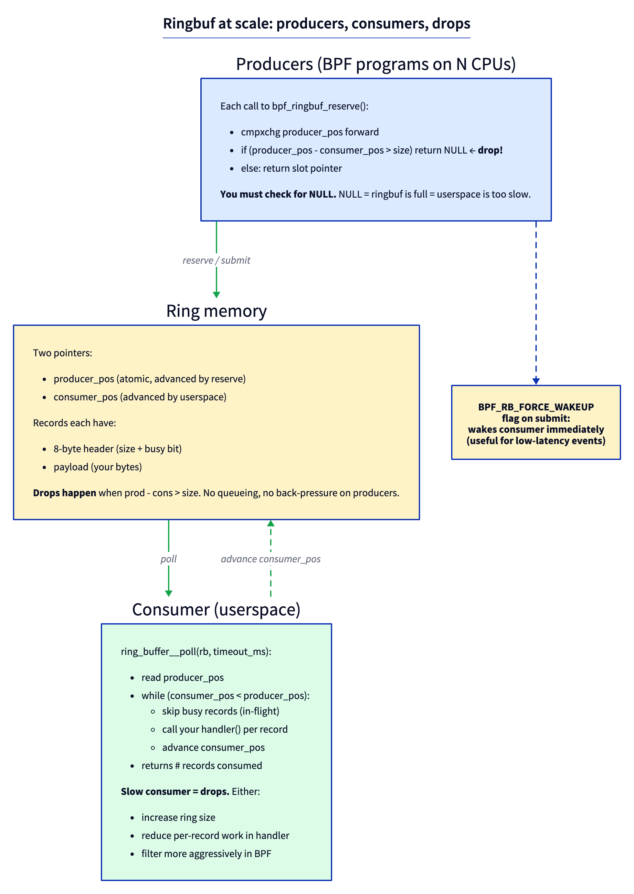
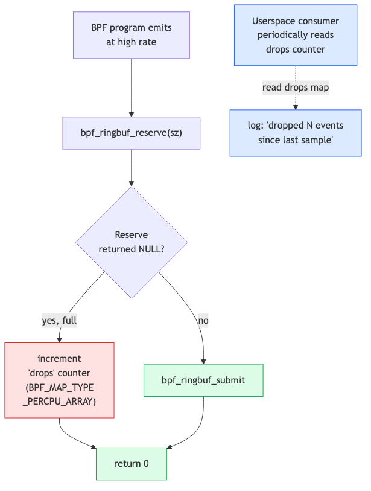
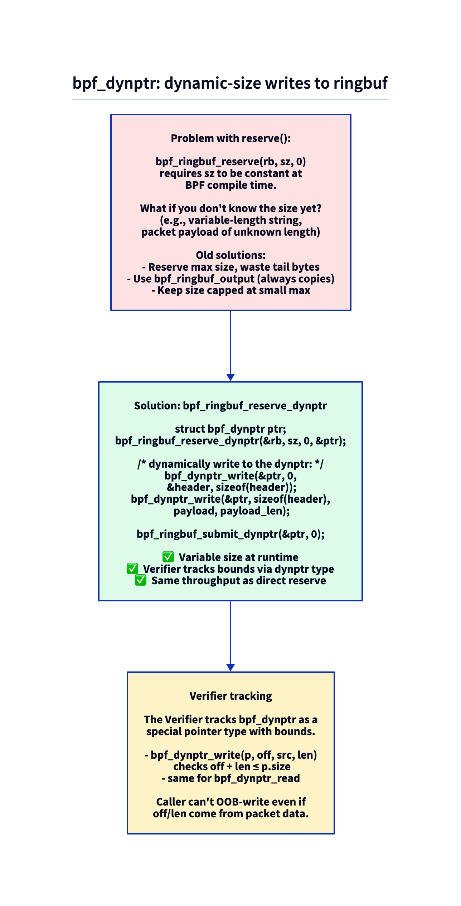

# Day 13 — Ringbuf at scale: drops, back-pressure, dynptr

> **Today's mission:** instrument a high-rate tracer to see when it's losing events, then fix the loss with sizing, filtering, and `bpf_dynptr`. End of Phase 2. Total time: ~75 minutes.

## When ringbuf isn't free

Day 1 you wrote a low-rate tracer and ringbuf "just worked." Today you'll trace something high-rate (every `tcp_recvmsg`, every `vfs_read` on a busy server) and watch ringbuf push back.

Ringbuf has no infinite queue. When producers outpace the consumer, **`bpf_ringbuf_reserve` returns NULL** and your event is dropped silently — unless you instrument for it.



## Drop visibility

Default behavior: drops are silent. Your tracer just emits fewer events than it observed. Production tracers always count drops.



The pattern: a separate per-CPU array map for drop counts. Increment it whenever `bpf_ringbuf_reserve` returns NULL. Userspace samples the map periodically and logs.

## Force-wakeup vs auto-wakeup

`bpf_ringbuf_submit(rec, flags)` takes flags:

- `0` — normal submit. Userspace will wake naturally on its next `epoll_wait` tick.
- `BPF_RB_NO_WAKEUP` — submit without notifying. Use when you know more events are coming and don't want to spam wakeups.
- `BPF_RB_FORCE_WAKEUP` — wake the consumer immediately. Use for low-latency events where the next tick is too late.

The default heuristic the kernel uses is "wake if the consumer is sleeping AND ringbuf has crossed a threshold." For most workloads it's right. Override only with cause.

## `bpf_dynptr`: variable-size events

A subtle constraint of `bpf_ringbuf_reserve(rb, sz, 0)` is that **`sz` must be constant** at compile time. The Verifier won't accept a runtime-computed size. So if your event size depends on, say, packet payload length, you have three legacy options:

1. Reserve the worst-case max size; waste tail bytes when the event is smaller.
2. Use `bpf_ringbuf_output` (always copies bytes; skip reserve/submit pattern).
3. Cap your max event size small.

In 2024 the kernel added **`bpf_dynptr`** — a runtime-sized buffer the Verifier tracks via a special pointer type with bounds.



```c
struct bpf_dynptr ptr;
bpf_ringbuf_reserve_dynptr(&rb, sz, 0, &ptr);
bpf_dynptr_write(&ptr, 0, &header, sizeof(header));
bpf_dynptr_write(&ptr, sizeof(header), payload, payload_len);
bpf_ringbuf_submit_dynptr(&ptr, 0);
```

The Verifier statically tracks `ptr.size` and rejects any out-of-bounds write. Performance is identical to direct reserve.

> ### There are no Dumb Questions
>
> **Q: Does ringbuf drop the *new* event or the *oldest* event when full?**
>
> A: The **new** one. There's no eviction; ringbuf is FIFO with backpressure. `bpf_ringbuf_reserve` simply fails. The kernel doesn't try to make room.
>
> **Q: Should I size ringbuf to the worst-case rate?**
>
> A: No. Worst-case is unbounded. Size it to handle a few seconds of typical-rate burst (256 KiB — 4 MiB is common). Under sustained high rate, you'll drop. The fix at that point isn't bigger ringbuf — it's filtering more aggressively in BPF, or aggregating in BPF and emitting summaries.
>
> **Q: Why is event size limited to constant in plain reserve?**
>
> A: Because the Verifier needs to bound the access pattern statically. Without a known size, it can't prove your writes stay within the reserved slot. `bpf_dynptr` is the new mechanism specifically designed to track runtime size at the type level.

## The lab

### `dropviz.bpf.c`

```c
#include "vmlinux.h"
#include <bpf/bpf_helpers.h>
#include <bpf/bpf_tracing.h>

char LICENSE[] SEC("license") = "GPL";

struct event {
    __u32 pid;
    __u64 dur;
    char comm[16];
};

struct {
    __uint(type, BPF_MAP_TYPE_RINGBUF);
    __uint(max_entries, 64 * 1024);   /* deliberately small to demo drops */
} rb SEC(".maps");

struct {
    __uint(type, BPF_MAP_TYPE_PERCPU_ARRAY);
    __uint(max_entries, 1);
    __type(key, __u32);
    __type(value, __u64);
} drops SEC(".maps");

struct {
    __uint(type, BPF_MAP_TYPE_HASH);
    __uint(max_entries, 4096);
    __type(key, __u64);
    __type(value, __u64);
} starts SEC(".maps");

static __always_inline void inc_drops(void)
{
    __u32 z = 0;
    __u64 *c = bpf_map_lookup_elem(&drops, &z);
    if (c) (*c)++;
}

SEC("fentry/vfs_read")
int BPF_PROG(on_in, struct file *f, char *buf, size_t n, loff_t *pos)
{
    __u64 tid = bpf_get_current_pid_tgid() & 0xffffffff;
    __u64 ts = bpf_ktime_get_ns();
    bpf_map_update_elem(&starts, &tid, &ts, BPF_ANY);
    return 0;
}

SEC("fexit/vfs_read")
int BPF_PROG(on_out, struct file *f, char *buf, size_t n, loff_t *pos, ssize_t ret)
{
    __u64 id = bpf_get_current_pid_tgid();
    __u64 tid = id & 0xffffffff;
    __u64 *ts = bpf_map_lookup_elem(&starts, &tid);
    if (!ts) return 0;
    __u64 dur = bpf_ktime_get_ns() - *ts;
    bpf_map_delete_elem(&starts, &tid);

    /* Filter to keep rate sane */
    if (dur < 5000) return 0;     /* skip < 5µs */

    struct event *e = bpf_ringbuf_reserve(&rb, sizeof(*e), 0);
    if (!e) {
        inc_drops();
        return 0;
    }
    e->pid = id >> 32;
    e->dur = dur;
    bpf_get_current_comm(&e->comm, sizeof(e->comm));
    bpf_ringbuf_submit(e, 0);
    return 0;
}
```

### `dropviz.c` — userspace + drop monitor

```c
/* Every 1s, sample drops counter */
static void sample_drops(int fd) {
    __u64 total = 0;
    __u32 key = 0;
    int ncpu = libbpf_num_possible_cpus();
    __u64 vals[ncpu];
    bpf_map_lookup_elem(fd, &key, vals);
    for (int i = 0; i < ncpu; i++) total += vals[i];
    fprintf(stderr, "[total drops: %llu]\n", total);
}

int main(...) {
    /* ... open/load/attach ... */
    int drops_fd = bpf_map__fd(skel->maps.drops);
    /* poll loop with periodic drop sampling */
    while (!exiting) {
        ring_buffer__poll(rb, 100);
        if (time_since_last_sample > 1s) {
            sample_drops(drops_fd);
        }
    }
}
```

### Run with deliberate pressure

```bash
make
sudo ./dropviz &

# Generate massive read pressure
dd if=/dev/zero of=/dev/null bs=512 count=10000000 &
```

Watch:

```
[total drops: 0]
[total drops: 0]
[total drops: 1452]
[total drops: 4031]
[total drops: 7821]
```

Drops are accumulating. Now fix:

1. **Increase ringbuf size** to 4 MiB (`64 * 1024 * 64`). Drops should stop or shrink.
2. **Lower filter threshold** — change 5µs filter to 100µs to skip more.
3. **Slow down the consumer's per-event work** in your handler. (Print less.)

Each adjustment you can verify by re-running the workload and watching the drops counter.

---

## What to break, in order

### Break 1 — Don't increment the drop counter

Comment out `inc_drops()`. Run heavy. You'll see fewer events than expected — but no signal indicating events are missing. **This is how production tracers go silently wrong.** Always count drops.

### Break 2 — Use `bpf_ringbuf_output` instead

```c
struct event ev = { ... fill in ... };
long ret = bpf_ringbuf_output(&rb, &ev, sizeof(ev), 0);
if (ret < 0) inc_drops();
```

Functionally similar; uses copy semantics instead of reserve/submit. About 10% slower per event. Useful when the event lives on the BPF stack and you don't want to keep two pointers (the local + the reserved one).

### Break 3 — Variable-size with dynptr

```c
SEC("fentry/vfs_read")
int BPF_PROG(on_in_dyn, struct file *f, char *buf, size_t n, loff_t *pos)
{
    __u32 to_emit = n > 64 ? 64 : n;
    struct bpf_dynptr ptr;
    if (bpf_ringbuf_reserve_dynptr(&rb, sizeof(struct event) + to_emit, 0, &ptr) < 0) {
        inc_drops();
        return 0;
    }
    /* write header */
    struct event hdr = { ... };
    bpf_dynptr_write(&ptr, 0, &hdr, sizeof(hdr), 0);
    /* write variable-size suffix */
    bpf_dynptr_write(&ptr, sizeof(hdr), buf, to_emit, 0);
    bpf_ringbuf_submit_dynptr(&ptr, 0);
    return 0;
}
```

Now event size depends on `n`. Try replacing your reserve-and-submit pattern with this for a tracer that captures variable-length data.

### Break 4 — Force-wakeup spam

```c
bpf_ringbuf_submit(e, BPF_RB_FORCE_WAKEUP);
```

On every event, regardless of what's pending. Rebuild, run heavy. Watch CPU usage of the userspace process — every wakeup is a syscall. With the default heuristic disabled, performance degrades 2–5x for high-rate workloads. Reset to `0`.

---

## What to read in the kernel

- **`kernel/bpf/ringbuf.c`** — the whole file is ~700 lines. Read top to bottom. Note `__bpf_ringbuf_reserve`, `bpf_ringbuf_commit`, and the wakeup logic around `BPF_RB_FORCE_WAKEUP`.
- **`include/uapi/linux/bpf.h`** — search `BPF_RB_FORCE_WAKEUP` and `BPF_RINGBUF_*` flags.
- **`kernel/bpf/dynptr.c`** — the dynamic-pointer bounds-tracking implementation. Read `bpf_dynptr_init` and the `_write`/`_read` helpers.
- **`tools/testing/selftests/bpf/progs/test_ringbuf.c`** and **`test_ringbuf_multi.c`** — examples of the patterns we covered.

---

## Bullet Points

- Ringbuf **drops the new event** when full (no eviction). `bpf_ringbuf_reserve` returns NULL.
- **Always count drops** in a per-CPU array; sample from userspace periodically.
- `BPF_RB_FORCE_WAKEUP` for low-latency-critical events; `0` (default) for everything else.
- **Sizing**: 256 KiB – 4 MiB typical. Bigger doesn't fix sustained high rate; filter or aggregate instead.
- **`bpf_dynptr`** for variable-size events; same throughput as direct reserve.
- The Verifier tracks dynptr bounds, so out-of-bounds writes are rejected at load time.

---

## End of Phase 2

You now have:
- Latency tracing with fentry/fexit and the entry/exit map pattern (Day 6).
- Argument access for every program type — fentry, kprobe, raw tracepoint, tp_btf (Day 7).
- Tracepoint discovery and the tp_btf vs raw decision (Day 8).
- Stack traces and the path to flame graphs (Day 9).
- Userspace tracing via uprobes and USDT (Day 10).
- Multi-probe attach for tracing many functions at once (Day 11).
- Sleepable BPF for helpers that fault (Day 12).
- Ringbuf scaling, drop visibility, and dynptr (Day 13).

That's enough to write production observability tools competitive with bpftrace's tracers. Phase 3 (Days 14–19) shifts to networking: XDP, tc, tcx, AF_XDP, and cgroup/sockops.

When ready, signal me to continue.
