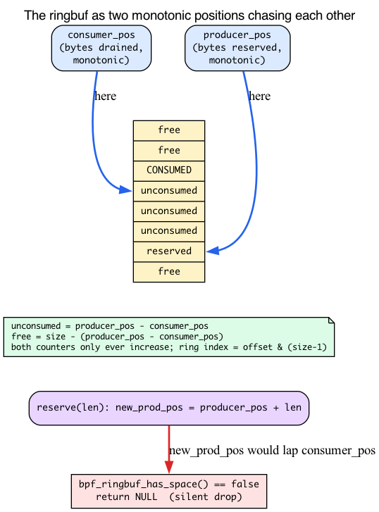
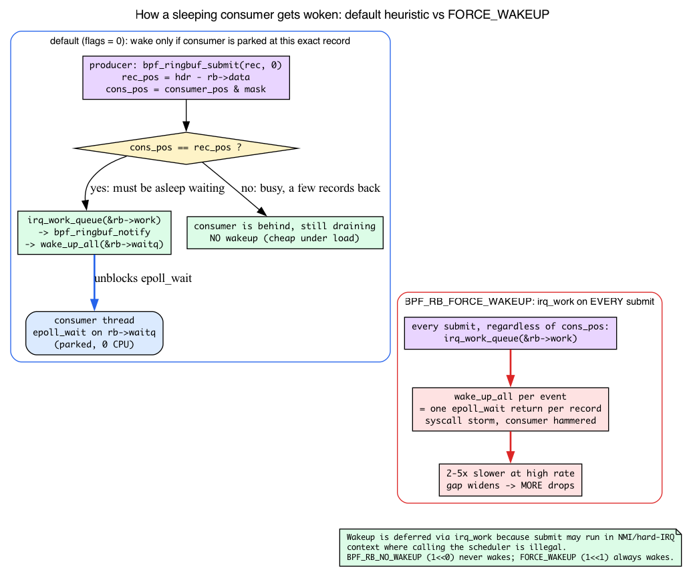
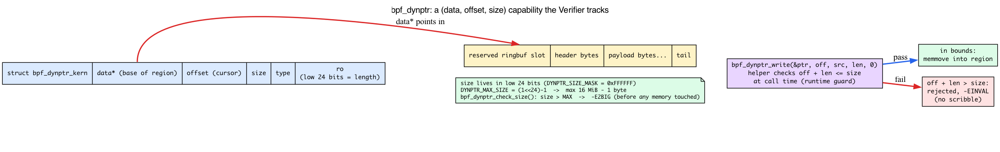

# Day 13 — Ringbuf at scale: drops, back-pressure, dynptr

> **Today's mission:** instrument a high-rate tracer to see when it's losing events, then fix the loss with sizing, filtering, and `bpf_dynptr`. Along the way you'll finally see *why* `bpf_ringbuf_reserve` returns NULL, *how* a sleeping consumer gets woken, and *what* a `bpf_dynptr` actually is. End of Phase 2. Total time: ~110 minutes.

## When ringbuf isn't free

Day 1 you wrote a low-rate tracer and ringbuf "just worked." You called `bpf_ringbuf_reserve` to grab a slot, filled it, and `bpf_ringbuf_submit`'d it; userspace polled with `ring_buffer__poll`. That's the whole MPSC (multi-producer, single-consumer) contract, and at a few hundred events per second you never saw it strain.

Today you'll trace something high-rate — every `vfs_read` on a busy server — and watch ringbuf push back.

Ringbuf has no infinite queue. By default (the lab's configuration, with no `BPF_F_RB_OVERWRITE` flag), when producers outpace the consumer **`bpf_ringbuf_reserve` returns NULL** and your event is dropped silently — unless you instrument for it. That sentence is the whole chapter, but it hides a mechanism nobody showed you on Day 1: *what does "outpace" mean, concretely, and why does a fixed buffer have no choice but to fail the reservation?* That's the first thing we'll fix.

## The circular buffer: two positions chasing each other

Here's the model Day 1 let you skip. A BPF ringbuf is **one fixed, power-of-two-sized region of bytes** — you pick the size at map creation (`max_entries`, which for ringbuf means *bytes*, not entries). It never grows. The kernel tracks exactly two numbers about it, and both only ever increase:

- **`producer_pos`** — a running byte count of everything that has ever been reserved. The next record starts here.
- **`consumer_pos`** — a running byte count of everything userspace has finished draining.

Both live in `struct bpf_ringbuf` (`kernel/bpf/ringbuf.c:28`). They're *monotonic* — they never wrap back to zero — and the kernel maps a byte offset into the physical ring with a single mask: `offset & rb->mask`, where `mask = size - 1` (that's why the size must be a power of two). So the two counters race forward forever, and the *gap between them* is what matters:

> **Unconsumed bytes = `producer_pos − consumer_pos`.**
> **Free space = ring size − (`producer_pos − consumer_pos`).**

When the consumer keeps up, `consumer_pos` chases `producer_pos` closely and there's lots of free space. When the consumer falls behind, the gap widens until it equals the whole ring — and now there is **nowhere to put the next record.**



### What `reserve` actually does

Open `__bpf_ringbuf_reserve` (`kernel/bpf/ringbuf.c:463`). Several checks can hand you back NULL; here they are in the order the kernel runs them:

**1. Reject an absurd record size.** The very first line rejects anything past an outer sanity ceiling:

```c
/* kernel/bpf/ringbuf.c:469 */
if (unlikely(size > RINGBUF_MAX_RECORD_SZ))
    return NULL;
```

`RINGBUF_MAX_RECORD_SZ` is `UINT_MAX/4` (`ringbuf.c:26`) — about **1 GiB**. You'll never hit this with a sane event; it's just an outer bound.

**2. Round the request up, then reject anything bigger than the ring.** Your event isn't stored bare — each record carries an 8-byte header (`BPF_RINGBUF_HDR_SZ = 8`, `include/uapi/linux/bpf.h:6275`), and the total is rounded to 8. The rounded length is then checked against the *ring's own size*:

```c
/* kernel/bpf/ringbuf.c:472 */
len = round_up(size + BPF_RINGBUF_HDR_SZ, 8);
if (len > ringbuf_total_data_sz(rb))   /* :473 — the realistic oversize path */
    return NULL;
```

So a tidy 32-byte `struct event` doesn't cost 32 bytes — it costs `round_up(32 + 8, 8) = 40` bytes of ring. (The struct is `{ __u32 pid; __u64 dur; char comm[16]; }`; the `__u64` forces 8-byte alignment, so `sizeof` is 32, not the 28-byte field sum.) This matters more than it looks: our demo ring is a deliberately tiny **64 KiB**, so it holds only ~1,600 of these records before it's full. At hundreds of thousands of reads per second, that's a few milliseconds of slack. And note the `:473` check: a single record larger than the **whole ring** is rejected right here — that's the realistic oversize path, long before the 1 GiB ceiling.

**3. Take the ring's lock.** `raw_res_spin_lock_irqsave` can itself fail and return NULL (`ringbuf.c:478`) — a rare path, but a NULL exit nonetheless.

**4. Check for space — and this is your drop.** The kernel computes `new_prod_pos = prod_pos + len` and asks whether that would collide with the not-yet-consumed region:

```c
/* kernel/bpf/ringbuf.c:494 */
if (!bpf_ringbuf_has_space(rb, new_prod_pos, cons_pos, pend_pos)) {
    raw_res_spin_unlock_irqrestore(&rb->spinlock, flags);
    return NULL;
}
```

**That `return NULL` is the silent drop.** By default — no `BPF_F_RB_OVERWRITE` flag, which is what our lab uses — there is no eviction, no blocking, no "make room": if advancing `producer_pos` by `len` would overrun where the consumer still has unread data, reserve simply fails. (v7.1 *does* add an opt-in overwrite mode that evicts the oldest records instead — we'll come back to it in the Dumb Questions box; the lab never sets the flag.) On success it stamps the record's header length with the **BUSY bit** (`hdr->len = size | BPF_RINGBUF_BUSY_BIT`, `ringbuf.c:529`) — the per-record "reserved but not yet submitted" marker you met on Day 1 — and hands you the slot.

### Why a bigger ring doesn't save you

Now you can answer the question we raised earlier: *if drops happen, why isn't the fix just "bigger ring"?*

Because the ring size only sets the **maximum gap** the producer can open before reserve starts failing. A bigger ring buys *more slack* — more milliseconds the consumer can lag before the gap saturates. But if the producer is **permanently faster** than the consumer, the gap grows until it pins at "full" and *stays* there, no matter how big the ring is. Size buys you a longer runway for *bursts*; it buys you nothing against a *sustained* rate mismatch. The real fix for sustained pressure is to produce fewer events (filter in BPF) or smaller summaries (aggregate in BPF) — which is exactly the lab below.

## Drop visibility

Default behavior: drops are silent. Your tracer just emits fewer events than it observed. Production tracers always count drops.


The pattern: a separate **per-CPU array map** for drop counts. Increment it whenever `bpf_ringbuf_reserve` returns NULL. Userspace samples the map periodically and logs. The `drops` map below is a `BPF_MAP_TYPE_PERCPU_ARRAY` — recall from **Day 2** why per-CPU memory means `inc_drops()` needs *no atomic* (each CPU bumps its own private copy) and why `sample_drops()` must read an array of one `__u64` *per CPU* and **sum `vals[i]` across every CPU** to get the real total.

## How userspace sleeps, and how a producer wakes it

It's tempting to assume the kernel wakes the consumer whenever the ring crosses some fill threshold. The real rule is simpler — and it's the reason high-rate tracing stays cheap. Let's build it from the bottom.

### The consumer is asleep in `epoll_wait`

`ring_buffer__poll(rb, timeout)` — the loop you've used since Day 1 — is **`epoll_wait` under the hood.** The ringbuf file descriptor implements the kernel's `.map_poll` operation (`ringbuf_map_poll_kern`, wired in at `kernel/bpf/ringbuf.c:383`). When your consumer thread polls, that function registers the thread on the ring's wait queue and reports whether there's data:

```c
/* kernel/bpf/ringbuf.c:342 */
poll_wait(filp, &rb_map->rb->waitq, pts);

if (ringbuf_avail_data_sz(rb_map->rb))
    return EPOLLIN | EPOLLRDNORM;   /* :345 — only if unconsumed data exists */
return 0;
```

So with no unconsumed data, `epoll_wait` returns nothing to do and **blocks the consumer thread on `rb->waitq`** — zero CPU burned until something wakes it. That `waitq` is a `wait_queue_head_t` right at the top of `struct bpf_ringbuf` (`ringbuf.c:28`).

### The producer wakes it through `irq_work`

When a producer submits a record, the kernel may need to wake that sleeping thread. It does *not* call the scheduler directly from `submit` — because submit can run in NMI or hard-IRQ context (a `kprobe` on a function called from an interrupt handler, say), where touching the scheduler is illegal. Instead it queues an **`irq_work`**: a tiny deferred callback that runs in a safe context. That callback is `bpf_ringbuf_notify`:

```c
/* kernel/bpf/ringbuf.c:154 */
static void bpf_ringbuf_notify(struct irq_work *work)
{
    struct bpf_ringbuf *rb = container_of(work, struct bpf_ringbuf, work);
    wake_up_all(&rb->waitq);   /* unblocks epoll_wait */
}
```

It's hooked up once at ring creation (`init_irq_work(&rb->work, bpf_ringbuf_notify)`, `ringbuf.c:183`). `wake_up_all` is what makes the consumer's `epoll_wait` return.



### The real default heuristic: "did the consumer catch all the way up to *me*?"

Here's the actual decision, in `bpf_ringbuf_commit` (the shared body of submit/discard):

```c
/* kernel/bpf/ringbuf.c:578 */
rec_pos = (void *)hdr - (void *)rb->data;
cons_pos = smp_load_acquire(&rb->consumer_pos) & rb->mask;

if (flags & BPF_RB_FORCE_WAKEUP)
    irq_work_queue(&rb->work);                                  /* :581 */
else if (cons_pos == rec_pos && !(flags & BPF_RB_NO_WAKEUP))
    irq_work_queue(&rb->work);                                  /* :583 */
```

Read the `else if` carefully. The default wakes **only when `cons_pos == rec_pos`** — i.e. the consumer has drained *all the way up to the exact record we just wrote*. The intuition: if the consumer is sitting precisely at this record, it must be **asleep waiting for it**, so wake it. But if `cons_pos` is *behind* `rec_pos` — meaning there's already unconsumed data ahead of the consumer — then the consumer is still busy draining and will reach this record on its own next pass. No wakeup needed.

This is the whole reason the default is cheap under load: **a busy consumer is almost never parked at exactly the newest record.** Under high rate it's always a few records behind, so almost every submit skips the `irq_work` entirely. The wakeups happen only when the ring drains to empty and the consumer truly goes to sleep — which is exactly when you *want* a wakeup.

### The two flags, and what they cost

`bpf_ringbuf_submit(rec, flags)` takes one of:

- **`0`** (default) — the `cons_pos == rec_pos` heuristic above. Right for almost everything.
- **`BPF_RB_NO_WAKEUP`** (`= 1ULL << 0`, `include/uapi/linux/bpf.h:6258`) — **never** queue a wakeup, even if the consumer is asleep at this record. Only safe when you *know* another event (or a later forced one) will follow soon to wake the consumer — otherwise it sleeps until your poll timeout fires. Use it to batch a known burst and wake once at the end.
- **`BPF_RB_FORCE_WAKEUP`** (`= 1ULL << 1`, `:6259`) — **unconditionally** queue the `irq_work` on *every* submit. Under high rate that's a wakeup — and effectively a consumer-side syscall return — *per event*. That's the 2–5× degradation Break 4 demonstrates.

Pass any *other* bit and the call is rejected — `bpf_ringbuf_output` checks `if (flags & ~(BPF_RB_NO_WAKEUP | BPF_RB_FORCE_WAKEUP)) return -EINVAL;` (`ringbuf.c:619`). Override the default only with cause.

## `bpf_dynptr`: variable-size events

A subtle constraint of `bpf_ringbuf_reserve(rb, sz, 0)` is that **`sz` must be constant** at compile time. That isn't a stylistic rule — it's baked into the helper's prototype. The size argument is typed `ARG_CONST_ALLOC_SIZE_OR_ZERO` (`kernel/bpf/ringbuf.c:555`), which tells the Verifier "this must be a compile-time constant." The Verifier needs that constant to prove every write you do lands inside the reserved slot. A runtime-computed size gives it nothing to bound against, so it refuses the program.

So if your event size depends on, say, the bytes actually read, you have three legacy options:

1. Reserve the worst-case max size; waste tail bytes when the event is smaller.
2. Use `bpf_ringbuf_output` (always copies bytes; skip the reserve/submit pattern).
3. Cap your max event size small.

In 2022 the kernel added **`bpf_dynptr`** (ring-buffer dynptr support landed in 5.19) — a runtime-sized buffer the Verifier tracks via a special pointer type with bounds. To use it correctly you need to know what it actually *is*.

### A dynptr is a (pointer, size) capability the Verifier tracks for you

A `bpf_dynptr` is **not** a raw pointer. On the kernel side it's a small descriptor, `struct bpf_dynptr_kern` (`include/linux/bpf.h:1406`):

```c
struct bpf_dynptr_kern {
    void *data;     /* base of the region */
    u32   size;     /* low 24 bits = length; bits 28-30 = type (DYNPTR_TYPE_SHIFT=28); bits 24-27 reserved; bit 31 = read-only */
    u32   offset;   /* current offset within the region */
} __aligned(8);
```

The Verifier treats this as a single **opaque object you may only touch through helpers** — you never dereference it directly. That indirection is the whole trick: because every access goes through a helper, a **runtime-chosen** size can be made safe *at call time*. When you call `bpf_dynptr_write(&ptr, off, src, len, 0)`, the helper checks `off + len` against the tracked `size` *right then* — so the Verifier doesn't need the compile-time constant that plain `reserve` demands. The bounds check moved from load time to a runtime guard the helper performs on every write.



### It is not a blank check: the 16 MiB ceiling

Because the length lives in only the **low 24 bits** of that `size` word (`DYNPTR_SIZE_MASK = 0xFFFFFF`, `kernel/bpf/helpers.c:1765`; extracted by `__bpf_dynptr_size`, `:1788`/`:1796`), the largest region a dynptr can describe is `(1 << 24) − 1` = **16 MiB minus one byte** (`DYNPTR_MAX_SIZE = (1UL << 24) - 1`, `helpers.c:1763`). Ask for more and the reservation fails *before any memory is touched*:

```c
/* kernel/bpf/helpers.c:1823 */
int bpf_dynptr_check_size(u64 size)
{
    return size > DYNPTR_MAX_SIZE ? -E2BIG : 0;
}
```

So a dynptr is a *bounded* capability, not an unlimited one.

### Lifecycle: same reserve/release discipline as plain reserve

```c
struct bpf_dynptr ptr;
bpf_ringbuf_reserve_dynptr(&rb, sz, 0, &ptr);
bpf_dynptr_write(&ptr, 0, &header, sizeof(header), 0);
bpf_dynptr_write(&ptr, sizeof(header), payload, payload_len, 0);
bpf_ringbuf_submit_dynptr(&ptr, 0);
```

`bpf_ringbuf_reserve_dynptr` (`kernel/bpf/ringbuf.c:670`) reserves a slot the same way plain reserve does, then on success calls `bpf_dynptr_init(ptr, sample, BPF_DYNPTR_TYPE_RINGBUF, 0, size)` (`ringbuf.c:696`; the init helper is `helpers.c:1847`) so the dynptr now *is* a typed handle over the reserved ring slot. From there the discipline is identical to Day 1's reserve/submit: you **must** follow with exactly one `bpf_ringbuf_submit_dynptr` **or** `bpf_ringbuf_discard_dynptr`. A reserved-but-never-released slot is poison — its header still carries the **BUSY bit**, which (recall the pending-position scan in reserve) wedges the ring's ability to reclaim space.

One detail that makes the failure path read correctly: when reserve fails, the helper returns a negative error **and nulls the dynptr** — `bpf_dynptr_set_null(ptr)` (`ringbuf.c:678`/`:684`/`:692`), which `memset`s the whole descriptor to zero (`helpers.c:1856`). A nulled dynptr has `data == NULL`, so any subsequent `bpf_dynptr_write` through it is rejected too. That's why Break 3 can safely call `discard` on the failure path without checking — and why a write through a failed reservation can never scribble somewhere bad.

`bpf_dynptr_write` itself is a plain in-kernel `memmove` into the tracked region (`__bpf_dynptr_write`, `helpers.c:1952`; the helper entry is `:1994`). It does **not** read user memory — that's the Day 12 distinction Break 3 leans on. The Verifier statically tracks the dynptr's bounds and the helper enforces them per call, so out-of-bounds writes are rejected. Performance is identical to direct reserve.

> ### There are no Dumb Questions
>
> **Q: Does ringbuf drop the *new* event or the *oldest* event when full?**
>
> A: With the **default** ringbuf (no `BPF_F_RB_OVERWRITE`) — which is what our lab uses — it drops the **new** one: `bpf_ringbuf_reserve` simply fails, `bpf_ringbuf_has_space()` says no, and `__bpf_ringbuf_reserve` returns NULL. The unconsumed span is never overwritten. v7.1 adds an opt-in **overwrite mode** (`BPF_F_RB_OVERWRITE`, `1U<<19`): there `bpf_ringbuf_has_space()` returns true even when full and `__bpf_ringbuf_reserve` walks `overwrite_pos` past the oldest records to make room — i.e. it evicts the *oldest* unconsumed data instead. Our demo never sets the flag, so it gets the default drop-the-new behavior.
>
> **Q: Should I size ringbuf to the worst-case rate?**
>
> A: No. Worst-case is unbounded. Size it to handle a few seconds of typical-rate burst (256 KiB — 4 MiB is common). Under sustained high rate, you'll drop. The fix at that point isn't a bigger ringbuf (see "Why a bigger ring doesn't save you" above) — it's filtering more aggressively in BPF, or aggregating in BPF and emitting summaries.
>
> **Q: Why is event size limited to constant in plain reserve?**
>
> A: Because the Verifier needs to bound the access pattern statically — `reserve`'s size argument is literally typed `ARG_CONST_ALLOC_SIZE_OR_ZERO`. Without a known size, it can't prove your writes stay within the reserved slot. `bpf_dynptr` is the new mechanism specifically designed to track runtime size at the type level and check each write against it at call time.

## The lab

### `dropviz.bpf.c`

The program is the **Day 6 entry/exit latency pattern** — a `starts` hash keyed by TID, written at `fentry` and read at `fexit` to compute a duration — reused here only as a convenient way to generate a *high event rate*. (Recall from Day 6 the TID-keyed start-timestamp map and its recursion/collision caveats; we don't need them today.)

```c
#include "vmlinux.h"
#include <bpf/bpf_helpers.h>
#include <bpf/bpf_tracing.h>

char LICENSE[] SEC("license") = "GPL";

struct event {
    __u32 pid;
    __u64 dur;
    char comm[16];
};

struct {
    __uint(type, BPF_MAP_TYPE_RINGBUF);
    __uint(max_entries, 64 * 1024);   /* deliberately small to demo drops */
} rb SEC(".maps");

struct {
    __uint(type, BPF_MAP_TYPE_PERCPU_ARRAY);
    __uint(max_entries, 1);
    __type(key, __u32);
    __type(value, __u64);
} drops SEC(".maps");

struct {
    __uint(type, BPF_MAP_TYPE_HASH);
    __uint(max_entries, 4096);
    __type(key, __u64);
    __type(value, __u64);
} starts SEC(".maps");

static __always_inline void inc_drops(void)
{
    __u32 z = 0;
    __u64 *c = bpf_map_lookup_elem(&drops, &z);
    if (c) (*c)++;
}

SEC("fentry/vfs_read")
int BPF_PROG(on_in, struct file *f, char *buf, size_t n, loff_t *pos)
{
    __u64 tid = bpf_get_current_pid_tgid() & 0xffffffff;
    __u64 ts = bpf_ktime_get_ns();
    bpf_map_update_elem(&starts, &tid, &ts, BPF_ANY);
    return 0;
}

SEC("fexit/vfs_read")
int BPF_PROG(on_out, struct file *f, char *buf, size_t n, loff_t *pos, ssize_t ret)
{
    __u64 id = bpf_get_current_pid_tgid();
    __u64 tid = id & 0xffffffff;
    __u64 *ts = bpf_map_lookup_elem(&starts, &tid);
    if (!ts) return 0;
    __u64 dur = bpf_ktime_get_ns() - *ts;
    bpf_map_delete_elem(&starts, &tid);

    /* Filter to keep rate sane */
    if (dur < 5000) return 0;     /* skip < 5µs */

    struct event *e = bpf_ringbuf_reserve(&rb, sizeof(*e), 0);
    if (!e) {
        inc_drops();
        return 0;
    }
    e->pid = id >> 32;
    e->dur = dur;
    bpf_get_current_comm(&e->comm, sizeof(e->comm));
    bpf_ringbuf_submit(e, 0);
    return 0;
}
```

Notice `inc_drops()` increments without any atomic — that's the per-CPU array doing its Day 2 job: each CPU touches its own copy, so there's nothing to race over.

### `dropviz.c` — userspace + drop monitor

Same build setup as Day 1: copy `~/libbpf-bootstrap/examples/c/Makefile` into this directory and set `APPS = dropviz`. The Makefile expects `dropviz.bpf.c` and `dropviz.c` and generates `dropviz.skel.h` (the typed accessors for `skel->maps.rb`, `skel->maps.drops`, etc.) for you on `make`. Regenerate `vmlinux.h` if you haven't already (`sudo bpftool btf dump file /sys/kernel/btf/vmlinux format c > vmlinux.h`).

```c
#include <stdio.h>
#include <signal.h>
#include <time.h>
#include <bpf/libbpf.h>
#include "dropviz.skel.h"

struct event {
    __u32 pid;
    __u64 dur;
    char comm[16];
};

static volatile sig_atomic_t exiting;
static void sigh(int s) { exiting = 1; }

static int handle_event(void *ctx, void *data, size_t sz) {
    struct event *e = data;
    printf("%-16s pid=%-7u dur=%llu ns\n", e->comm, e->pid, e->dur);
    return 0;
}

/* Every 1s, sample the per-CPU drops counter and sum across CPUs */
static void sample_drops(int fd) {
    __u64 total = 0;
    __u32 key = 0;
    int ncpu = libbpf_num_possible_cpus();
    __u64 vals[ncpu];
    bpf_map_lookup_elem(fd, &key, vals);
    for (int i = 0; i < ncpu; i++) total += vals[i];
    fprintf(stderr, "[total drops: %llu]\n", total);
}

int main(int argc, char **argv)
{
    struct dropviz_bpf *skel;
    struct ring_buffer *rb;
    struct timespec last, now;

    skel = dropviz_bpf__open_and_load();
    if (!skel) return 1;
    if (dropviz_bpf__attach(skel)) return 1;

    rb = ring_buffer__new(bpf_map__fd(skel->maps.rb), handle_event, NULL, NULL);
    int drops_fd = bpf_map__fd(skel->maps.drops);

    signal(SIGINT, sigh);
    clock_gettime(CLOCK_MONOTONIC, &last);
    while (!exiting) {
        ring_buffer__poll(rb, 100);   /* 100 ms timeout */
        clock_gettime(CLOCK_MONOTONIC, &now);
        if (now.tv_sec - last.tv_sec >= 1) {   /* ~1s tick */
            sample_drops(drops_fd);
            last = now;
        }
    }

    ring_buffer__free(rb);
    dropviz_bpf__destroy(skel);
    return 0;
}
```

The `sample_drops` reader is the per-CPU read-out from Day 2 in the flesh: `bpf_map_lookup_elem` on a per-CPU map copies out **one `__u64` per CPU** into `vals[]`, and the loop sums them into the logical total. `ring_buffer__poll` is the `epoll_wait` we dissected above — when the ring is empty this thread sleeps on the ring's `waitq` for up to 100 ms, burning no CPU, until a submit's `irq_work` wakes it.

### Run with deliberate pressure

First, **disable the 5µs filter for this demo only**: the `dur` in `on_out` is wall time across `vfs_read`, and `/dev/zero` reads with `bs=512` complete in well under 1µs, so the `if (dur < 5000) return 0;` line filters out ~99.9% of events *before* they ever reach `bpf_ringbuf_reserve` — leaving the drop counter stuck at `[total drops: 0]`. To make the flood reach the ringbuf, **comment out the `if (dur < 5000) return 0;` line** (or simply drop the threshold to `0`) and rebuild. Avoid rewriting it as `if (dur < 0)`: `dur` is `__u64`, so an unsigned `< 0` compare is always false — the optimizer deletes it and the compiler may warn `-Wtype-limits`, which only confuses the point. (We put the filter back as a *fix* below.)

```bash
make
sudo ./dropviz &

# Generate massive read pressure: ~500k reads/sec straight through vfs_read
dd if=/dev/zero of=/dev/null bs=512 count=10000000 &
```

Watch (representative — exact numbers vary with CPU and consumer speed):

```
[total drops: 0]
[total drops: 0]
[total drops: 1452]
[total drops: 4031]
[total drops: 7821]
```

If you see `[total drops: 0]` forever, the filter is eating everything — confirm you actually lowered the threshold and rebuilt. Drops appear because hundreds of thousands of fast reads/sec push `producer_pos` forward far faster than the single-threaded poll loop can advance `consumer_pos`, so the gap pins at the full 64 KiB and `bpf_ringbuf_has_space()` starts returning false.

Let it run ~10s to watch drops accumulate, then **stop both background jobs**:

```bash
kill %2 2>/dev/null   # the dd job
sudo pkill dropviz    # the tracer — it polls forever, so Ctrl-C won't reach a backgrounded job
```

The `dd` job reads ~5 GB and would eventually exit on its own, but `dropviz` runs an indefinite poll loop and must be killed explicitly. Now fix:

1. **Increase ringbuf size** to 4 MiB (`64 * 1024 * 64`). Drops should stop or shrink. (This *widens the gap* the producer can open before saturation — good against bursts, not against a permanent rate mismatch.)
2. **Raise the filter threshold** — change the 5µs cutoff (`dur < 5000`) to 100µs (`dur < 100000`) so more events are filtered out in BPF before they ever reach the ringbuf. (This *lowers the production rate* — the real fix.)
3. **Slow down the consumer's per-event work** in your handler. (Print less, so `consumer_pos` advances faster.)

Each adjustment you can verify by re-running the workload and watching the drops counter.

---

## What to break, in order

### Break 1 — Don't increment the drop counter

Comment out `inc_drops()`. Run heavy. You'll see fewer events than expected — but no signal indicating events are missing. **This is how production tracers go silently wrong.** Always count drops.

### Break 2 — Use `bpf_ringbuf_output` instead

```c
struct event ev = { ... fill in ... };
long ret = bpf_ringbuf_output(&rb, &ev, sizeof(ev), 0);
if (ret < 0) inc_drops();
```

Functionally similar; uses copy semantics instead of reserve/submit. About 10% slower per event (it does the reserve, then a `memcpy` of your stack struct into the slot, then the commit — versus you filling the slot in place). Useful when the event lives on the BPF stack and you don't want to keep two pointers (the local + the reserved one).

### Break 3 — Variable-size with dynptr

Two things make the naive version wrong, and both matter:

- **Capture at `fexit`, not `fentry`.** At entry the read hasn't happened yet, so the user buffer `buf` is not populated — there is nothing to copy. (This is why the lab's hooks are split the Day 6 way.)
- **`bpf_dynptr_write` does a plain kernel `memmove`; it does *not* read user memory.** Passing the `char __user *buf` directly as `src` copies garbage, and the Verifier rejects a raw user pointer where it expects kernel-resident `ARG_PTR_TO_MEM`. You must first stage the user bytes into a bounded kernel stack temp with `bpf_probe_read_user` — recall from **Day 12** why a `__user` pointer can't be dereferenced directly and must be copied in (it lives in another address space and may fault).

```c
SEC("fexit/vfs_read")
int BPF_PROG(on_out_dyn, struct file *f, char *buf, size_t n, loff_t *pos, ssize_t ret)
{
    if (ret <= 0) return 0;
    /* cap to a compile-time constant so the Verifier can bound the copy */
    __u32 to_emit = ret > 64 ? 64 : ret;
    char tmp[64];
    if (bpf_probe_read_user(tmp, to_emit, buf) < 0)
        return 0;

    struct bpf_dynptr ptr;
    if (bpf_ringbuf_reserve_dynptr(&rb, sizeof(struct event) + to_emit, 0, &ptr) < 0) {
        inc_drops();
        bpf_ringbuf_discard_dynptr(&ptr, 0);   /* every reserve needs a submit OR discard */
        return 0;
    }
    struct event hdr = {};
    hdr.pid = bpf_get_current_pid_tgid() >> 32;
    bpf_get_current_comm(&hdr.comm, sizeof(hdr.comm));
    bpf_dynptr_write(&ptr, 0, &hdr, sizeof(hdr), 0);
    bpf_dynptr_write(&ptr, sizeof(hdr), tmp, to_emit, 0);   /* kernel src, in-bounds */
    bpf_ringbuf_submit_dynptr(&ptr, 0);
    return 0;
}
```

The `to_emit = ret > 64 ? 64 : ret` cap is what lets the Verifier prove the `bpf_probe_read_user` and the second `bpf_dynptr_write` stay within `tmp[64]`. The `discard` on the failure path is safe even though the reservation failed — recall that a failed `bpf_ringbuf_reserve_dynptr` nulls the dynptr (`bpf_dynptr_set_null`), so there's nothing live to corrupt. Now event size depends on the actual bytes read. Try replacing your reserve-and-submit pattern with this for a tracer that captures variable-length data.

### Break 4 — Force-wakeup spam

```c
bpf_ringbuf_submit(e, BPF_RB_FORCE_WAKEUP);
```

On every event, regardless of what's pending. Rebuild, run heavy. Watch CPU usage of the userspace process — every forced submit queues the `irq_work` that calls `wake_up_all`, returning the consumer's `epoll_wait` once per event. With the default `cons_pos == rec_pos` heuristic disabled, a busy consumer that would normally *never* be woken under load is now woken on every single record — performance degrades 2–5× for high-rate workloads. Reset to `0`.

---

## What to read in the kernel

- **`kernel/bpf/ringbuf.c`** — the whole file is ~700 lines. Read top to bottom. Note `struct bpf_ringbuf` (`:28`) with its `producer_pos`/`consumer_pos`/`pending_pos`, `__bpf_ringbuf_reserve` (`:463`) and the `bpf_ringbuf_has_space` NULL path (`:494`), `bpf_ringbuf_commit` and the wakeup logic around `BPF_RB_FORCE_WAKEUP` (`:578`–`:583`), and `bpf_ringbuf_notify` → `wake_up_all` (`:158`).
- **`include/uapi/linux/bpf.h`** — search `BPF_RB_FORCE_WAKEUP` / `BPF_RB_NO_WAKEUP` (`:6258`–`:6259`) and the `BPF_RINGBUF_*` flags (`:6273`–`:6275`).
- **`kernel/bpf/helpers.c`** — the dynamic-pointer bounds-tracking implementation. Read `bpf_dynptr_init` (`:1847`), `bpf_dynptr_check_size` (`:1823`), and the `_write`/`_read` helpers (`__bpf_dynptr_write` at `:1952`). `struct bpf_dynptr_kern` is in `include/linux/bpf.h:1406`.
- **`tools/testing/selftests/bpf/progs/test_ringbuf.c`** and **`test_ringbuf_multi.c`** — examples of the patterns we covered.

---

## Bullet Points

- A ringbuf is a **fixed power-of-two byte ring** with two monotonic counters: `producer_pos` (reserved) and `consumer_pos` (drained). **Free space = size − (producer_pos − consumer_pos)**.
- Each record costs `round_up(size + 8, 8)` bytes (8-byte header). Reserve returns NULL when the size exceeds ~1 GiB (`RINGBUF_MAX_RECORD_SZ`) or, the common case, when `bpf_ringbuf_has_space()` says the new record would overrun the unconsumed span. **That NULL is the silent drop.**
- By **default** ringbuf **drops the new event** when full (no eviction); v7.1's opt-in `BPF_F_RB_OVERWRITE` mode instead evicts the *oldest* records. Either way, a **bigger ring only widens the burst the gap can absorb** — it does nothing against a sustained producer/consumer rate mismatch. Filter or aggregate in BPF instead.
- **Always count drops** in a per-CPU array (Day 2: no atomic needed; sum across CPUs in userspace).
- The consumer sleeps in **`epoll_wait` on the ring's `waitq`** (`.map_poll`), burning zero CPU. A producer wakes it via an **`irq_work`** running `wake_up_all` (deferred because submit can run in IRQ/NMI context).
- The **default wakeup heuristic** is `cons_pos == rec_pos` — wake only when the consumer has caught all the way up to *this* record (so it must be asleep waiting). A busy consumer is rarely there, which is why the default is cheap under load.
- `BPF_RB_FORCE_WAKEUP` (`1<<1`) wakes on **every** event — a syscall storm under load (2–5× slower). `BPF_RB_NO_WAKEUP` (`1<<0`) never wakes. Any other flag bit → `-EINVAL`.
- **`bpf_dynptr`** for variable-size events; same throughput as direct reserve. Plain reserve's size is `ARG_CONST_ALLOC_SIZE_OR_ZERO` (must be constant); a dynptr moves the bounds check to a per-write runtime guard.
- A dynptr is a **`(data, offset, size)` capability** (`struct bpf_dynptr_kern`); the Verifier tracks it as opaque and the helpers check `offset+len` against `size` on every access. Size lives in the **low 24 bits → max 16 MiB − 1** (`-E2BIG` above that). A failed reserve **nulls** the dynptr, so its failure path is safe.

---

## Check question

Your tracer is dropping events under load. You bump the ringbuf from 64 KiB to 16 MiB and the drops *briefly* go away, then come right back at the same sustained rate. Separately, a teammate suggests adding `BPF_RB_FORCE_WAKEUP` to "make sure userspace keeps up." Explain, in terms of `producer_pos`/`consumer_pos` and the wakeup heuristic, why the bigger ring didn't fix the sustained drops and why `FORCE_WAKEUP` would make things *worse*, not better.

<details>
<summary>Click to reveal answer</summary>

**Answer:** The ring size only sets the maximum gap `producer_pos − consumer_pos` before `bpf_ringbuf_has_space()` starts failing reservations. A bigger ring buys a longer runway, so a *burst* drains its backlog and drops stop for a moment — but if the producer is **permanently faster** than the consumer, the gap grows back until it pins at the full ring size and reserve fails again. Free space is `size − (producer_pos − consumer_pos)`; when the rate mismatch is sustained, that term goes to zero regardless of `size`. The real fix is to lower the production rate (filter/aggregate in BPF) or speed up the consumer.

`BPF_RB_FORCE_WAKEUP` makes it worse because the default heuristic only queues a wakeup when `cons_pos == rec_pos` — i.e. when the consumer is actually asleep waiting for this exact record. Under sustained load the consumer is *never* there (it's always behind), so the default issues almost no wakeups and lets the consumer drain in bulk. `FORCE_WAKEUP` queues the `irq_work` → `wake_up_all` on *every* submit, returning the consumer's `epoll_wait` once per event. That's a syscall-per-event storm that *slows the consumer down*, widening the gap and causing **more** drops, not fewer.

</details>

---

## End of Phase 2

You now have:
- Latency tracing with fentry/fexit and the entry/exit map pattern (Day 6).
- Argument access for every program type — fentry, kprobe, raw tracepoint, tp_btf (Day 7).
- Tracepoint discovery and the tp_btf vs raw decision (Day 8).
- Stack traces and the path to flame graphs (Day 9).
- Userspace tracing via uprobes and USDT (Day 10).
- Multi-probe attach for tracing many functions at once (Day 11).
- Sleepable BPF for helpers that fault (Day 12).
- Ringbuf scaling, the producer/consumer position model, drop visibility, the wakeup path, and dynptr (Day 13).

That's enough to write production observability tools competitive with bpftrace's tracers. Phase 3 (Days 14–19) shifts to networking: XDP, tc, tcx, AF_XDP, and cgroup/sockops.

When ready, signal me to continue.
