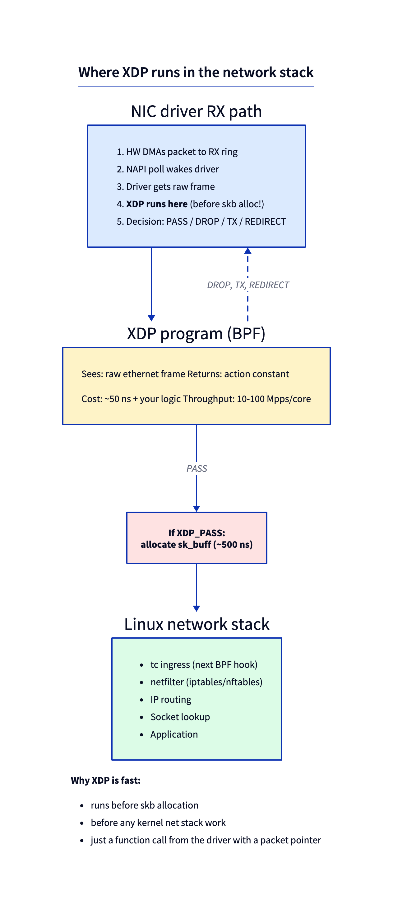
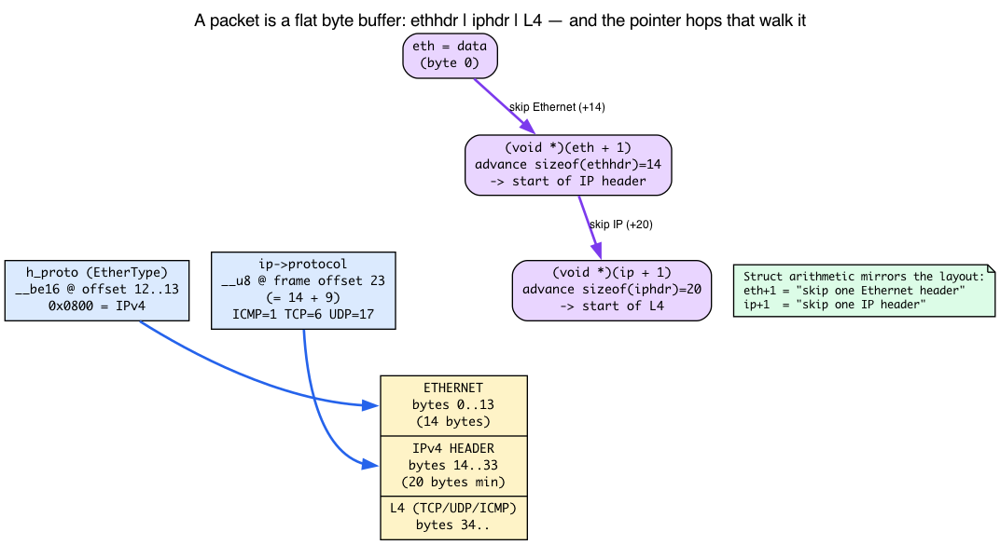
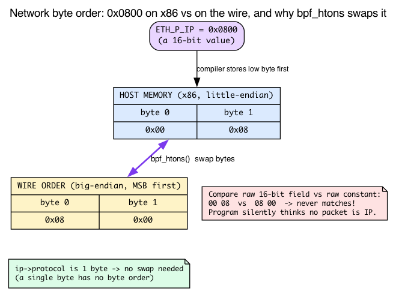
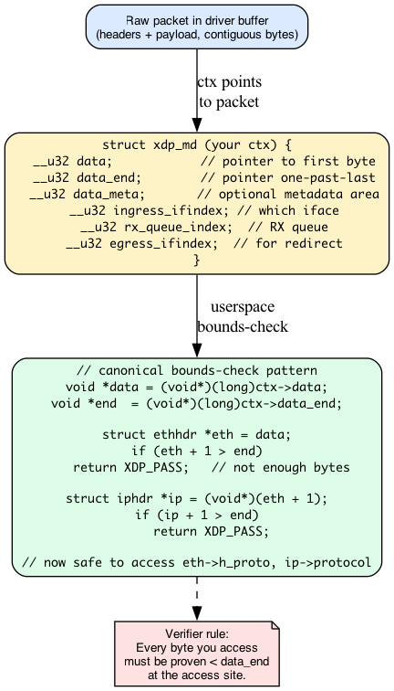
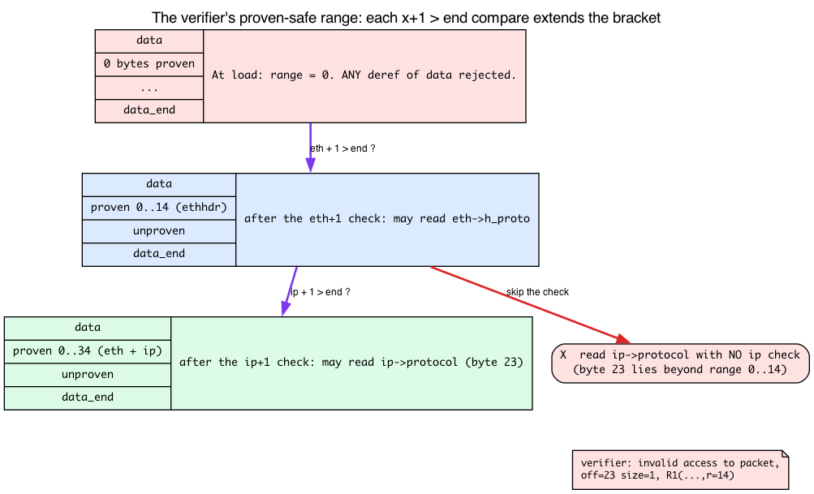
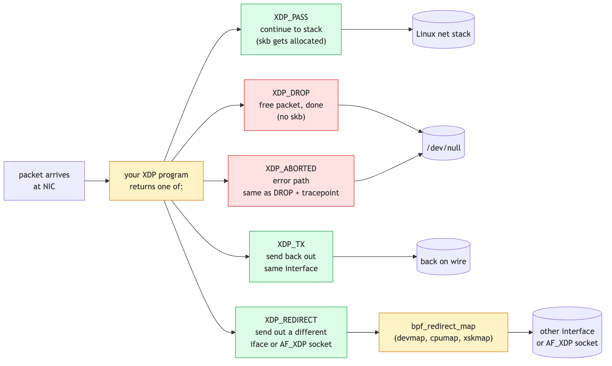
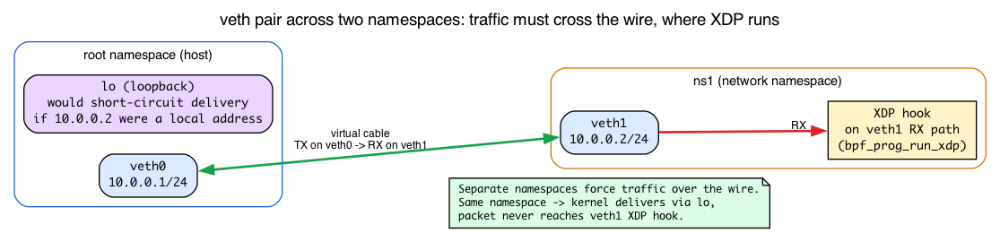

# Day 14 — XDP: count every packet on an interface

> **Today's mission:** count packets per protocol on a network interface, faster than the kernel can allocate sk_buffs. Along the way, learn the four things 13 days of tracing never taught you: what a packet actually looks like as bytes, why a 2-byte field needs `bpf_htons` and a 1-byte field doesn't, how `data`/`data_end` and a bounds compare make a packet read *legal*, and what a `veth` pair plus a network namespace really are. Total time: ~110 minutes.

> **Phase 3 starts here.** Days 14–19 are about networking BPF. You'll see XDP, tc, tcx, AF_XDP, cgroup, sockops. By Day 19 you'll be able to write the kind of packet-path BPF that powers Cilium and similar projects.

## XDP, the earliest hook in the kernel

Yesterday's tracing programs ran when *something interesting* happened to a function that already existed. XDP is different: **XDP runs the moment a packet arrives at the NIC, before the kernel allocates an `sk_buff`**, before any iptables, routing, or socket lookup happens.



### Where exactly is "the moment a packet arrives"?

You've spent 13 days hooking functions. XDP isn't a function you hook — it's a callout the *driver* makes, at a very specific point, and that point is the whole reason XDP is fast. Here's the one-paragraph refresher (the companion **linux-net** book, Day 1, teaches all of this in full — NIC RX descriptor rings, DMA, and the cost of an `sk_buff` — so we won't re-derive it here):

When a NIC has received frames, it raises an interrupt; the driver then **polls a batch of frames off its RX descriptor ring in softirq context** — this batched-poll mechanism is called **NAPI**. By the time the driver's poll routine runs, the NIC's DMA engine has *already* written the frame bytes into a page in RAM. XDP runs *inside that poll*, handed a pointer to that raw DMA'd frame buffer, **before an `sk_buff` is ever allocated.** That's the entire value proposition: you get to look at (and drop, or redirect) the packet while it's still just bytes in a page, skipping the cost of building the kernel's heavyweight packet container.

That allocation is not free. Building an `sk_buff` runs on the order of a few hundred nanoseconds on a modern x86 (the descriptor alone is ~230 bytes from a dedicated slab cache, plus a separate data-buffer allocation); routing/lookup/etc. add hundreds more. **XDP runs before all of it.** (Recall the two-allocation `sk_buff` model — descriptor cache plus data buffer — from linux-net Day 1; here we only care that XDP *skips* that cost.) XDP runs in the driver's NAPI poll, called with a pointer to the raw frame, returns an action constant, and that's it.

You can see the exact callout the driver makes: it's the inline `bpf_prog_run_xdp` at `include/net/xdp.h:689`. Today we'll attach to a `veth` device, and `veth` invokes XDP through that *same* inline (`drivers/net/veth.c:657` and `:819`) that a physical NIC driver uses — which is precisely why `veth` is a faithful XDP test bed.

Throughput numbers in the literature: 10 Mpps per core trivially, 100+ Mpps with hardware offload (offloaded XDP on supporting NICs) — both workload- and NIC-dependent. Your single-core software cap is around the line rate of a 10 Gbps link with small packets.

## A packet is just bytes: the Ethernet and IPv4 layout

Before we touch `struct xdp_md`, stop and look at what the driver actually handed us: **a flat buffer of bytes.** No structs, no fields — just byte 0, byte 1, byte 2, and so on. `ctx->data` points at byte 0. Everything the program does today is *interpreting* those bytes by laying header structs over them.

For an ordinary IPv4 packet the first bytes look like this:

```
[ Ethernet header : 14 bytes ][ IP header : ≥20 bytes ][ L4 (TCP/UDP/ICMP) ... ]
```



### The Ethernet header — exactly 14 bytes

The frame starts with `struct ethhdr`, and it is one of the simplest structs in the kernel — three fields, and `__packed` so the compiler inserts no padding (`include/uapi/linux/if_ether.h:177`):

```c
/* include/uapi/linux/if_ether.h:177 */
struct ethhdr {
    unsigned char h_dest[ETH_ALEN];   /* destination MAC — 6 bytes, offset 0  */
    unsigned char h_source[ETH_ALEN]; /* source MAC      — 6 bytes, offset 6  */
    __be16        h_proto;            /* EtherType       — 2 bytes, offset 12 */
} __attribute__((packed));
```

`ETH_ALEN` is 6, so 6 + 6 + 2 = **14 bytes** — which is exactly the named constant `ETH_HLEN == 14` (`if_ether.h:34`). The last field, `h_proto`, is the **EtherType**: it tells you what header comes next. The value we care about is `ETH_P_IP == 0x0800` (`if_ether.h:52`), meaning "an IPv4 packet follows." That's the check the program makes first: *is this even an IP packet?*

### The IPv4 header — and where `protocol` lives

If the EtherType says IP, the bytes at offset 14 are `struct iphdr` (`include/uapi/linux/ip.h:87`):

```c
/* include/uapi/linux/ip.h:87 */
struct iphdr {
    __u8    ihl:4,        /* header length in 32-bit words — first byte... */
            version:4;    /* ...packed with version (little-endian layout) */
    __u8    tos;          /* offset 1 */
    __be16  tot_len;      /* offset 2 */
    __be16  id;           /* offset 4 */
    __be16  frag_off;     /* offset 6 */
    __u8    ttl;          /* offset 8 */
    __u8    protocol;     /* offset 9  ← the field we read (ip.h:102) */
    __sum16 check;
    /* ... saddr, daddr ... */
};
```

Two things to notice. First, the very first byte packs **`version:4` and `ihl:4`** together — which means the IP header length is *variable*: `ihl` counts 32-bit words, so the header is `ihl * 4` bytes, minimum 20. (For our counting program we don't need to parse options, so we treat it as the fixed 20-byte minimum.)

Second, and this is the number the whole lab hinges on: **`protocol` is a single `__u8` at byte offset 9 of the IP header** (`ip.h:102`). Walk it: version/ihl (1) + tos (1) + tot_len (2) + id (2) + frag_off (2) + ttl (1) = 9 bytes before it. This one byte is the *key* the map is indexed by: ICMP = 1, TCP = 6, UDP = 17.

### Pointer arithmetic mirrors the layout

The code never computes these offsets by hand — it lets C pointer arithmetic do it. Watch how the casts walk the buffer:

- `struct ethhdr *eth = data;` — `eth` points at byte 0.
- `(void *)(eth + 1)` — advancing a `struct ethhdr *` by **one whole struct** moves the pointer `sizeof(struct ethhdr) == 14` bytes forward. That lands exactly on the start of the IP header.
- `(void *)(ip + 1)` — advancing a `struct iphdr *` by one moves past the (fixed-size) IP header to the start of L4.

So `eth + 1` is "skip the Ethernet header" and `ip + 1` is "skip the IP header," expressed as struct arithmetic. This is also the secret decoder ring for Break 1's `off=23`: the IP header's `protocol` sits at frame offset 14 (one Ethernet header) + 9 (offset inside the IP header) = **23**.

That's all the wire format we need today — just byte offsets. The full kernel RX/stack treatment lives in the companion **linux-net** book; here we only borrow the layout.

## Network byte order: why `bpf_htons` wraps some values and not others

There's a trap hiding in `h_proto`. Look at the `struct ethhdr` again: `h_proto` is typed **`__be16`**, not `__u16`. The `__be` prefix is the kernel's machine-checkable way of saying *"this field is big-endian"* — and it is not decoration. Every multi-byte protocol field **on the wire is big-endian** (most-significant byte first): EtherTypes, IP `tot_len`, TCP/UDP ports, IP `id`. You can read it straight off the struct types — `__be16 h_proto`, `__be16 tot_len`, `__be32 saddr` — every `__be*` is the kernel telling you "big-endian."

x86 is **little-endian**. So when you write the constant `ETH_P_IP` (`0x0800`) in your C program, the compiler stores it in memory the x86 way — low byte first, as `00 08`. But the *wire* delivered those two bytes as `08 00`. If you compared the raw 16-bit field against the raw constant, you'd be comparing `08 00` against `00 08` — they'd never match, silently, and your program would think *no packet is ever IP.*



`bpf_htons()` ("host to network, short") performs that byte swap, converting your host-order constant into wire order so the comparison is correct. That's why the program reads:

```c
if (eth->h_proto != bpf_htons(ETH_P_IP))   /* swap the constant to wire order */
    return XDP_PASS;
```

The portable versions live in `#include <bpf/bpf_endian.h>`, which is why the program pulls that header in.

**The rule of thumb:** convert whenever the field is **2 or more bytes** — `h_proto`, `tcp->dest`, `ip->tot_len`. A **single byte has no byte order at all** (there's nothing to swap), so `ip->protocol` is read *raw*. That is *exactly* why the program wraps `ETH_P_IP` but reads `ip->protocol` directly — and why Break 4's `tcp->dest` (a `__be16` port) would need `bpf_ntohs` if you wanted to print it as a host number. The direction is symmetric: `bpf_htons` (host→wire) for constants you compare against, `bpf_ntohs` (wire→host) when you pull a wire value out to use as a number.

## The XDP context: `struct xdp_md`



You receive `struct xdp_md *ctx`. The two fields you'll touch on every program (`include/uapi/linux/bpf.h:6560-6561`):

- `ctx->data` — pointer (cast from u32) to the first packet byte.
- `ctx->data_end` — pointer one-past-the-last byte.

Other fields:
- `ingress_ifindex` — which interface the packet arrived on.
- `rx_queue_index` — which NIC RX queue.
- `data_meta` — optional metadata area (Day 18, AF_XDP).
- `egress_ifindex` — only readable in devmap-egress XDP programs (`expected_attach_type == BPF_XDP_DEVMAP`); the Verifier rejects access from a plain `SEC("xdp")` program (see `xdp_is_valid_access` in `net/core/filter.c`).

### `data` / `data_end`: the packet-pointer model

Here is the part that 13 days of tracing never prepared you for. `ctx->data` and `ctx->data_end` are a **matched pair of packet pointers**:

- `data` is a `PTR_TO_PACKET` — the start of the readable window.
- `data_end` is a `PTR_TO_PACKET_END` — one byte past the last readable byte.

They are **runtime values**. The verifier does *not* know the packet's length when it checks your program at load time — a 64-byte ARP and a 1500-byte TCP segment both arrive through the same code. So the verifier can't just trust you to read 34 bytes; it has no idea whether 34 bytes are even present.

What the verifier *does* do is track a **proven-safe range** on the packet pointer. Initially that range is **zero bytes** — the verifier will reject *any* dereference of `data`, because nothing has proven a single byte is in-bounds. You enlarge the range with a comparison against `data_end`:

```c
struct ethhdr *eth = data;
if (eth + 1 > end)            /* "are the 14 bytes of an ethhdr present?" */
    return XDP_PASS;          /* not enough bytes — bail out */
/* fall-through branch: verifier now KNOWS 14 bytes from data are safe */
```

Writing `if (eth + 1 > end) return XDP_PASS;` and continuing on the *false* branch teaches the verifier "`sizeof(ethhdr)` bytes from `data` are in-bounds." **Only then** may you read `eth->h_proto`. This is the mechanism Day 4 named in one line (`find_good_pkt_pointers`, the range-narrowing routine at `kernel/bpf/verifier.c:15422`, triggered by exactly this `x + 1 > end` compare). Today you use it for real.



**Each layer needs its own check.** A compare only extends the proven range up to the pointer being tested. After the `eth` check, the *IP* bytes are still unproven — you must re-test `ip + 1 > end` before touching `ip->protocol`:

```c
void *data = (void *)(long)ctx->data;
void *end  = (void *)(long)ctx->data_end;
struct ethhdr *eth = data;
if (eth + 1 > end)
    return XDP_PASS;        /* skip — not enough bytes for an Ethernet header */
```

The pattern repeats for each header layer. `ip + 1 > end` for IP, `tcp + 1 > end` for TCP, etc. Skip a layer's check and the verifier prints `invalid access to packet` (the `verbose()` call at `kernel/bpf/verifier.c:4433`) — which is exactly what Break 1 and Break 4 produce. **Bounds checking is not optional**, and now you know precisely why: without the compare, the proven range never grows past the last pointer you tested, and the access falls outside it.

## XDP actions



Five constants you can return:

- **`XDP_PASS`** — continue to the kernel stack (allocate skb, hand off).
- **`XDP_DROP`** — free the packet now. Doesn't touch skb path.
- **`XDP_TX`** — send the (possibly modified) packet back out the same interface. DDoS-mitigation classic.
- **`XDP_REDIRECT`** — paired with `bpf_redirect_map(...)`, send to a different interface, a different CPU (cpumap), or an AF_XDP socket.
- **`XDP_ABORTED`** — error path. Equivalent to DROP plus a tracepoint fires (so you can find bugs).

> ### There are no Dumb Questions
>
> **Q: Why isn't every packet path written as XDP?**
>
> A: Because XDP runs *before* the kernel knows much. There's no socket lookup, no routing decision, no connection state. For most stacks you want skb-level processing (or higher) to use the kernel's accumulated knowledge. XDP is for cases where speed beats sophistication: DDoS drop, load balancing, L2/L3 forwarding for known patterns.
>
> **Q: Are there modes of XDP?**
>
> A: Yes. **Native XDP** runs in the driver as described — fastest. **Generic XDP** (`XDP_FLAGS_SKB_MODE`) runs much later — up in the stack's receive path (`do_xdp_generic` from `__netif_receive_skb_core`), after a full `sk_buff` has already been allocated, wrapping an `xdp_buff` around that existing skb. Works on any driver but is slower precisely because you have already paid the skb-allocation cost XDP is meant to skip (roughly half the speed of native). **Offloaded XDP** runs *on the NIC* itself for hardware that supports it — in mainline v7.1 that is essentially only the Netronome NFP (Agilio) SmartNIC, the lone non-test driver implementing `XDP_SETUP_PROG_HW`; the program is JITed to NIC firmware. Mellanox/mlx5 NICs run *native* driver-mode XDP, not firmware offload. Native is the default and what we'll use.
>
> **Q: How do I attach safely without crashing my SSH session?**
>
> A: Test on a `veth` pair, not your real NIC. We'll do that in the lab.

> ### Sharpen your pencil
>
> You write an XDP program that counts packets and returns `XDP_PASS`. Compared to the same logic written as a tc-bpf ingress program, which is faster?
>
> .  
> .  
> .
>
> **Answer:** XDP, by roughly the skb-build cost (hundreds of ns) per packet. The tc-bpf path runs *after* skb allocation; XDP runs before. For pure observability that doesn't modify the packet, XDP wins. For complex forwarding decisions that benefit from skb metadata, tc may be the right choice — Day 17.

---

## The lab

### Setup: a veth pair to play with — and why the namespace matters

Before the script, two concepts you've never met (13 days of tracing never ran `ip netns`):

**A `veth` (virtual Ethernet) device is always created as a connected *pair*.** Think of it as a patch cable: a frame transmitted on `veth0` appears on the **RX path of `veth1`**, and vice-versa. That RX path is what runs the XDP hook — which is the whole reason `veth` is the safe place to test XDP. (On v7.1 the `veth` driver runs XDP through the standard `bpf_prog_run_xdp` entry at `drivers/net/veth.c:657`/`:819` — the same inline a physical NIC uses, so what you test here behaves like the real thing.)

**A network namespace is an isolated copy of the kernel's entire network stack** — its own interfaces, routing table, and addresses. Moving `veth1` into `ns1` puts the two ends of the cable in *different* stacks. `ip netns exec ns1 <cmd>` runs a command *inside* that namespace, which is why we'll launch the loader with `ip netns exec ns1 ./xdp_count veth1`. `veth` is a faithful test bed for XDP program *semantics* (identical `data`/`data_end`, actions, and verifier behavior) — though note that on `veth` the peer already received an `sk_buff`, which `veth_convert_skb_to_xdp_buff` wraps into an `xdp_buff` before XDP runs, so the `veth` lab is *not* where you measure the native-NIC skb-allocation savings.



```bash
sudo ip netns add ns1
sudo ip link add veth0 type veth peer name veth1
sudo ip link set veth1 netns ns1
sudo ip addr add 10.0.0.1/24 dev veth0
sudo ip link set veth0 up
sudo ip netns exec ns1 ip addr add 10.0.0.2/24 dev veth1
sudo ip netns exec ns1 ip link set veth1 up
```

`veth1` lives in its own namespace, `ns1`, and this matters: if both ends shared the root namespace, `10.0.0.2` would be a *local* address, and the kernel would short-circuit `ping 10.0.0.2` through `lo` — the packet would never leave `veth0`, and XDP on `veth1` would never fire. Putting `veth1` in `ns1` forces traffic to cross the wire. We attach our program to `veth1` inside `ns1`; pinging `10.0.0.2` from the host sends echo requests out `veth0`, across the link into `veth1`'s RX path, where XDP runs.

### `xdp_count.bpf.c`

```c
#include "vmlinux.h"
#include <bpf/bpf_helpers.h>
#include <bpf/bpf_endian.h>

char LICENSE[] SEC("license") = "GPL";

struct {
    __uint(type, BPF_MAP_TYPE_PERCPU_ARRAY);
    __uint(max_entries, 256);   /* indexed by IP protocol number */
    __type(key, __u32);
    __type(value, __u64);
} counts SEC(".maps");

SEC("xdp")
int xdp_count(struct xdp_md *ctx)
{
    void *data = (void *)(long)ctx->data;
    void *end  = (void *)(long)ctx->data_end;

    struct ethhdr *eth = data;
    if (eth + 1 > end)
        return XDP_PASS;

    if (eth->h_proto != bpf_htons(ETH_P_IP))
        return XDP_PASS;

    struct iphdr *ip = (void *)(eth + 1);
    if (ip + 1 > end)
        return XDP_PASS;

    __u32 key = ip->protocol;          /* TCP=6, UDP=17, ICMP=1 */
    __u64 *c = bpf_map_lookup_elem(&counts, &key);
    if (c) (*c)++;                     /* per-CPU; no atomic needed */

    return XDP_PASS;
}
```

What's new — and you now have the background for every line:
- **`SEC("xdp")`** — XDP attach. Userspace specifies the interface.
- **`#include <bpf/bpf_endian.h>`** — for `bpf_htons`. The `h_proto` compare swaps the host constant `ETH_P_IP` to wire order; `ip->protocol` is one byte, so it's read raw. (See "Network byte order" above.)
- The two `eth + 1 > end` / `ip + 1 > end` lines are the **proven-range** idiom from the `data`/`data_end` section — each extends the verified window by one header so the next field read is legal.
- The casts `(void *)(eth + 1)` / past `ip` walk the byte layout: 14 bytes to the IP header, then into L4. (See "A packet is just bytes" above.)
- **`BPF_MAP_TYPE_PERCPU_ARRAY`** — each CPU gets its own value slot (recall the per-CPU map from Day 2). No atomic needed for increment because no two CPUs share a slot. Userspace must sum across CPUs to get a total.
- The bounds check pattern is *the* XDP idiom. Everyone writes it.

### `xdp_count.c` — userspace

```c
#include <bpf/libbpf.h>
#include <net/if.h>
#include <stdio.h>
#include <unistd.h>
#include <signal.h>
#include "xdp_count.skel.h"

static volatile sig_atomic_t exiting = 0;
static void on_sigint(int sig) { exiting = 1; }

int main(int argc, char **argv) {
    if (argc < 2) { fprintf(stderr, "usage: %s <iface>\n", argv[0]); return 1; }
    int ifindex = if_nametoindex(argv[1]);
    if (!ifindex) { perror("if_nametoindex"); return 1; }

    struct xdp_count_bpf *skel = xdp_count_bpf__open_and_load();
    if (!skel) return 1;

    struct bpf_link *link = bpf_program__attach_xdp(skel->progs.xdp_count, ifindex);
    if (!link) { fprintf(stderr, "attach failed\n"); return 1; }

    signal(SIGINT, on_sigint);

    while (!exiting) {
        sleep(2);
        int fd = bpf_map__fd(skel->maps.counts);
        int ncpu = libbpf_num_possible_cpus();
        for (__u32 k = 0; k < 256; k++) {
            __u64 vals[ncpu];
            if (bpf_map_lookup_elem(fd, &k, vals) == 0) {
                __u64 sum = 0;
                for (int i = 0; i < ncpu; i++) sum += vals[i];
                if (sum) printf("proto %3u: %llu\n", k, sum);
            }
        }
        printf("---\n");
    }
    bpf_link__destroy(link);
    xdp_count_bpf__destroy(skel);
    return 0;
}
```

### Run

```bash
make
sudo ip netns exec ns1 ./xdp_count veth1 &
# From the host (root namespace):
ping -c 5 10.0.0.2
nc -u 10.0.0.2 9999 <<< "hello"
```

Expected output every 2 seconds:
```
proto   1: 5      # ICMP
proto  17: 1      # UDP
---
```

You're now counting every packet that hits `veth1`. Now redirect this same program at a real NIC (`eno1` or whatever) and you've got line-rate counters with effectively zero overhead.

### Cleanup

```bash
sudo kill %1                 # stop the loader; closing its bpf_link fd auto-detaches the XDP program
sudo ip link del veth0       # deletes the pair (veth1 goes with it)
sudo ip netns del ns1        # remove the namespace
```

The XDP program stays attached only as long as the loader runs — the link is never pinned, so `bpf_link__destroy` (or simply the process exiting) detaches it. If you stopped the loader some other way and the program is still attached, detach it explicitly with `sudo ip netns exec ns1 ip link set dev veth1 xdp off`.

---

## What to break, in order

### Break 1 — Drop the bounds check

```c
struct iphdr *ip = (void *)(eth + 1);
__u32 key = ip->protocol;     /* no bounds check */
```

Verifier rejects at load time. libbpf prints the log to stderr when `xdp_count_bpf__open_and_load()` fails (the `if (!skel) return 1;` path — the userspace program prints nothing of its own):

```
invalid access to packet, off=23 size=1, R1(id=N,off=23,r=14)
```

`off=23` because `protocol` sits 9 bytes into the IP header and the IP header starts 14 bytes (one Ethernet header) into the frame; only those first 14 bytes were bounds-checked (`r=14`). The Verifier's per-byte tracking doesn't know the byte at `eth+1+offsetof(protocol)` is reachable. The exact wording and offsets are kernel- and clang-version dependent.

(This is the `data`/`data_end` proven-range model made concrete: the `eth + 1 > end` check extended the range to 14, you then deleted the `ip + 1 > end` check, so the range never reached byte 23 — and the access falls outside the bracket.)

### Break 2 — Pre-bound the index, then atomic

Switch from per-CPU to a regular hash:

```c
__uint(type, BPF_MAP_TYPE_HASH);
```

A `PERCPU_ARRAY` pre-allocates all 256 indices, so `bpf_map_lookup_elem(&counts, &key)` always returns a (zeroed) slot. A `HASH` map starts empty — the lookup returns `NULL` for every protocol it hasn't seen yet, so `if (c) ...` never fires and the counter stays at zero. You have to create the entry on first sight, and because a shared (not per-CPU) map can be touched by several CPUs at once, the increment now needs an atomic:

```c
__u64 *c = bpf_map_lookup_elem(&counts, &key);
if (c) {
    __sync_fetch_and_add(c, 1);          /* shared map: atomic now required */
} else {
    __u64 one = 1;
    bpf_map_update_elem(&counts, &key, &one, BPF_NOEXIST);  /* create on first sight */
}
```

(The first concurrent update for a brand-new key can still race on a non-preallocated hash; `BPF_NOEXIST` plus the atomic add on the existing-entry path is the standard mitigation.)

The throughput lesson — a shared hash contends on a per-bucket lock where the per-CPU array does not — is **not observable on this veth**: a 5-packet ping over a single-queue virtual link generates no contention. To see it you need a real multi-queue NIC and parallel load that spreads RX across CPUs (e.g. `iperf3 -u -P 16` to a peer, or `pktgen` across queues), then `sudo perf top -e cycles -g`. With the hash you'll see time in `queued_spin_lock_slowpath`/`_raw_spin_lock` under `htab_map_update_elem`/`bpf_map_lookup_elem`; with the per-CPU array those frames are absent. (Note: the hardware `cycles` event needs a real PMU — bare metal or a PMU-enabled host. Many cloud VMs expose no hardware PMU and `-e cycles` errors out; fall back to the software event `sudo perf top -e task-clock -g`, and expect the lock-contention frames to be clearest on physical hardware.)

### Break 3 — Return `XDP_DROP` instead of `XDP_PASS`

Change the return to `XDP_DROP`, then rebuild and re-attach — editing the program does nothing until you reload it:

```bash
make
sudo ip netns exec ns1 ./xdp_count veth1 &
ping -c 5 10.0.0.2
```

The ping now reports `100% packet loss` (0 received): the echo requests cross the wire, hit `veth1`'s RX inside `ns1`, and XDP drops them before they reach the IP stack, so no replies come back. SSH into your box still works (it's on a different interface). Lesson: XDP is the literal first hop. Be careful which iface you attach to. (This break is invisible without the namespace separation from the setup above — a same-namespace `10.0.0.2` is delivered locally over `lo` and never reaches `veth1`'s XDP hook.)

### Break 4 — Forget a per-layer bounds check

```c
struct iphdr *ip = (void *)(eth + 1);
if (ip + 1 > end) return XDP_PASS;
struct tcphdr *tcp = (void *)(ip + 1);
if (tcp + 1 > end) return XDP_PASS;
__u16 dport = tcp->dest;
```

As written this compiles and loads — every layer is bounds-checked. Now **delete** the `if (tcp + 1 > end) return XDP_PASS;` line and rebuild. The Verifier rejects the load with the same `invalid access to packet` error, this time pointing at the `tcp->dest` read: each header layer needs its own check, and Break 1's lesson generalizes from one header to a multi-layer chain. (And note `tcp->dest` is a `__be16` port — if you wanted to *print* it you'd wrap it in `bpf_ntohs`, just like the `h_proto` compare wrapped `ETH_P_IP`.)

---

## What to read in the kernel

- **`include/net/xdp.h`** — `bpf_prog_run_xdp`, the inline that drivers call to run an XDP program.
- **`include/uapi/linux/bpf.h`** — `struct xdp_md` and `enum xdp_action` (the action constants).
- **`net/core/dev.c`** — search `xdp_buff`; the driver-side dispatch path.
- **`net/core/filter.c`** — XDP helpers (`xdp_func_proto` table). Note which helpers are XDP-only.
- **`tools/testing/selftests/bpf/progs/test_xdp_*`** — many examples of common patterns.
- **`Documentation/networking/af_xdp.rst`** — the AF_XDP socket family (Day 18). Upstream has no top-level `xdp.rst` at v7.1; for general XDP background lean on the `Documentation/bpf/` BPF docs.
- **`Documentation/networking/xdp-rx-metadata.rst`** — XDP RX metadata (hints the driver can hand to your program).

---

## Bullet Points

- **XDP** runs in the driver's NAPI poll, before skb allocation. Fastest place to drop, redirect, or count. (Skips the `sk_buff` build cost — the two-allocation descriptor+data model from linux-net Day 1.)
- A packet is a **flat byte buffer**: `[ethhdr 14B][iphdr ≥20B][L4]`. `eth->h_proto == ETH_P_IP` (0x0800) selects IPv4; `ip->protocol` (byte 9 of the IP header, frame offset 23) is ICMP=1/TCP=6/UDP=17. `(eth+1)`/`(ip+1)` step exactly one header.
- **Network byte order is big-endian.** Wrap multi-byte constants in `bpf_htons` (and read wire values with `bpf_ntohs`); a **1-byte** field like `ip->protocol` needs no swap.
- `struct xdp_md`: `data`, `data_end`, `ingress_ifindex`, `rx_queue_index`, `data_meta`, `egress_ifindex`.
- **Bounds checks are mandatory**: `data`/`data_end` are runtime packet pointers; a `x + 1 > end` compare extends the verifier's *proven-safe range*. Each header layer needs its own check before you read its fields.
- Actions: **PASS, DROP, TX, REDIRECT, ABORTED**.
- `BPF_MAP_TYPE_PERCPU_ARRAY` for hot-path counters — no contention, sum in userspace.
- A **`veth` pair** is a virtual cable (TX on one end → RX on the other, where XDP runs); a **network namespace** is an isolated stack. Both ends in separate namespaces forces traffic across the wire instead of short-circuiting through `lo`.
- Test with `veth` pairs before attaching to real interfaces.

---

## Check question

You attach an XDP program that always returns `XDP_PASS`. Why might it still affect performance compared to no program at all?

<details>
<summary>Click to reveal answer</summary>

**Answer:** Two reasons. **(1)** Native XDP requires the driver to call into the BPF program for every packet — that's a function call (~10-30 ns) plus your logic. Even an empty program has measurable cost at line rate. **(2)** Some drivers disable certain optimizations (large receive offload, GRO) when XDP is attached, because XDP needs to see one packet at a time, not coalesced bursts. So even a passthrough XDP can reduce throughput by ~10% on workloads dependent on those features. For tracing/observability, this is fine; just be aware before deploying on a production load-balancer NIC.

</details>

---

## Tomorrow

Day 15: turn the counter into a denylist with `BPF_MAP_TYPE_LPM_TRIE` and userspace-controlled rules. Drop traffic from specific CIDRs at line rate.
