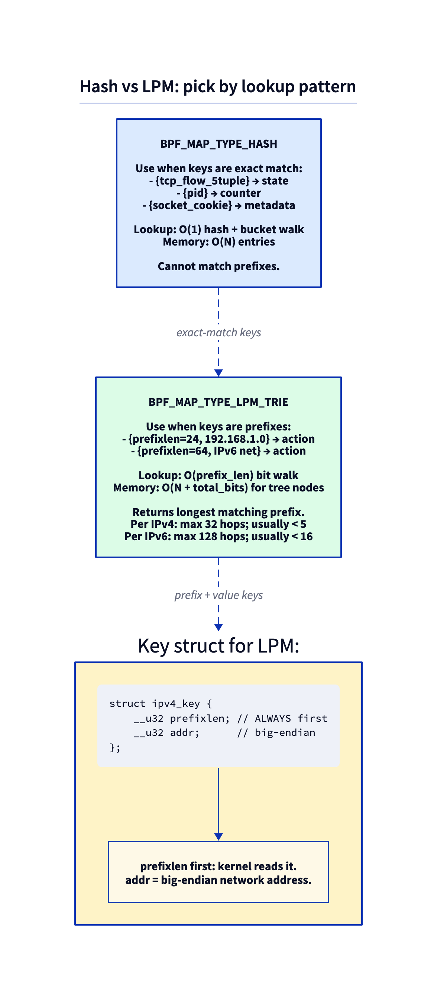
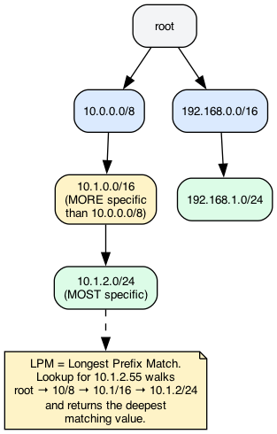
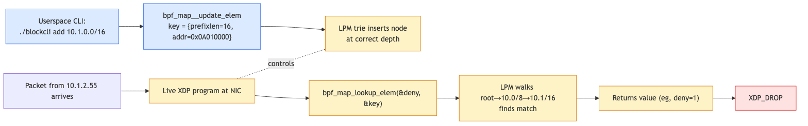

# Day 15 — XDP firewall: drop CIDRs at line rate

> **Today's mission:** turn yesterday's counter into a userspace-controlled denylist that drops traffic from configurable IPv4 prefixes. Total time: ~75 minutes.

## The wrong way and the right way

To drop traffic from `10.1.2.0/24`, you could shove all 256 IPs into a hash map. That works but doesn't scale to `10.0.0.0/8` (16 million entries) and definitely doesn't scale to IPv6 (...you're not enumerating /64 prefixes).

You want **prefix matching**. The map type for that is `BPF_MAP_TYPE_LPM_TRIE`.



## The LPM trie

A bit-by-bit prefix tree. Insert `10.0.0.0/8`, then `10.1.0.0/16`, then `10.1.2.0/24`, and the trie holds them at the right depths.



A lookup with key `10.1.2.55` walks:

1. Root.
2. Match the first 8 bits (10.x.x.x) → `10.0.0.0/8` node.
3. Match next 8 bits (10.1.x.x) → `10.1.0.0/16` node.
4. Match next 8 bits (10.1.2.x) → `10.1.2.0/24` node.
5. No deeper match → return value at `10.1.2.0/24`.

That's **Longest Prefix Match (LPM)** — the same algorithm IP routing uses. Lookup cost is O(prefix length): max 32 hops for IPv4, ~128 for IPv6, but in practice much less.

## The key struct convention

LPM trie keys *must* start with a `prefixlen` field, then the address bytes:

```c
struct ipv4_lpm_key {
    __u32 prefixlen;   /* always first */
    __u32 addr;        /* network byte order */
};
```

The kernel reads `prefixlen` to know how many leading bits of `addr` are significant. The rest of `addr` is ignored. So `{ .prefixlen = 16, .addr = 0x0a010000 }` means "10.1.0.0/16" — only the top 16 bits matter.

## End-to-end flow



You manage the denylist from userspace via `bpf_map_update_elem` calls. The XDP program does a single LPM lookup per packet and drops on match.

> ### There are no Dumb Questions
>
> **Q: Can I update the LPM trie while the XDP program is running?**
>
> A: Yes. Map updates are RCU-protected; readers (your XDP program) see a consistent snapshot. Updates are atomic at the per-key level. Hot-path-friendly.
>
> **Q: What's the lookup cost vs hash?**
>
> A: For exact-match keys, hash is faster (O(1)). For prefixes, hash can't do the job. LPM trie lookup is O(prefix_len) but the per-bit cost is low; on a 5-level trie a lookup is ~30 ns vs ~10 ns for a hash hit. In a wire-rate context that's noticeable but not crippling.
>
> **Q: How many entries can the trie hold?**
>
> A: Capped by `max_entries`. Each entry consumes a few hundred bytes of kernel memory (multiple internal nodes per leaf). 1M entries is fine; 10M+ becomes meaningful kernel memory.
>
> **Q: IPv6?**
>
> A: Same map type, key struct grows: `{ prefixlen, struct in6_addr addr; }`. Treat each 32-bit chunk in network byte order.

## The lab

### `block.bpf.c`

```c
#include "vmlinux.h"
#include <bpf/bpf_helpers.h>
#include <bpf/bpf_endian.h>

char LICENSE[] SEC("license") = "GPL";

struct ipv4_lpm_key {
    __u32 prefixlen;
    __u32 addr;
};

struct {
    __uint(type, BPF_MAP_TYPE_LPM_TRIE);
    __uint(max_entries, 1024);
    __type(key, struct ipv4_lpm_key);
    __type(value, __u32);    /* arbitrary value; we just check existence */
    __uint(map_flags, BPF_F_NO_PREALLOC);   /* required for LPM */
} deny SEC(".maps");

struct {
    __uint(type, BPF_MAP_TYPE_PERCPU_ARRAY);
    __uint(max_entries, 2);  /* [0] = pass, [1] = drop */
    __type(key, __u32);
    __type(value, __u64);
} stats SEC(".maps");

static __always_inline void bump(__u32 idx) {
    __u64 *c = bpf_map_lookup_elem(&stats, &idx);
    if (c) (*c)++;
}

SEC("xdp")
int xdp_block(struct xdp_md *ctx)
{
    void *data = (void *)(long)ctx->data;
    void *end  = (void *)(long)ctx->data_end;

    struct ethhdr *eth = data;
    if (eth + 1 > end) goto pass;
    if (eth->h_proto != bpf_htons(ETH_P_IP)) goto pass;

    struct iphdr *ip = (void *)(eth + 1);
    if (ip + 1 > end) goto pass;

    struct ipv4_lpm_key k = { .prefixlen = 32, .addr = ip->saddr };
    if (bpf_map_lookup_elem(&deny, &k)) {
        bump(1);
        return XDP_DROP;
    }

pass:
    bump(0);
    return XDP_PASS;
}
```

What's new:

- **`BPF_F_NO_PREALLOC`** is required for LPM. Hash maps preallocate by default for fast updates; LPM doesn't support that. Try removing the flag and you'll get `EINVAL` at map creation.
- **The key passed to lookup uses `prefixlen=32`** — you're asking "match this exact IP against any prefix in the trie." LPM does the longest-match magic.
- **Two-stage drop accounting**: indices 0 and 1 in a percpu array hold pass/drop counters.

### `blockcli.c` — userspace CLI

```c
/* Usage: ./blockcli add 10.1.0.0/16 */
/* Usage: ./blockcli del 10.1.0.0/16 */
/* Usage: ./blockcli stats */

static int parse_cidr(const char *s, struct ipv4_lpm_key *out) {
    char buf[64];
    strncpy(buf, s, sizeof(buf) - 1);
    char *slash = strchr(buf, '/');
    if (!slash) return -1;
    *slash = 0;
    out->prefixlen = atoi(slash + 1);
    struct in_addr a;
    if (inet_aton(buf, &a) == 0) return -1;
    out->addr = a.s_addr;       /* already network byte order */
    return 0;
}

int main(int argc, char **argv) {
    /* attach skel, get FD ... */
    int fd = bpf_map__fd(skel->maps.deny);

    if (!strcmp(argv[1], "add")) {
        struct ipv4_lpm_key k;
        parse_cidr(argv[2], &k);
        __u32 v = 1;
        bpf_map_update_elem(fd, &k, &v, BPF_ANY);
    } else if (!strcmp(argv[1], "del")) {
        struct ipv4_lpm_key k;
        parse_cidr(argv[2], &k);
        bpf_map_delete_elem(fd, &k);
    } else if (!strcmp(argv[1], "stats")) {
        /* dump pass/drop from stats map */
    }
}
```

### Run

```bash
make
sudo ./xdp_block veth1 &
sudo ./blockcli add 10.0.0.0/8

ping -c 3 10.0.0.2     # SHOULD time out, packets dropped
sudo ./blockcli stats   # see drop count

sudo ./blockcli del 10.0.0.0/8
ping -c 3 10.0.0.2      # works again
```

Now you have a userspace-controlled, line-rate firewall. Every API call updates the trie atomically; no XDP restart needed.

---

## What to break, in order

### Break 1 — Forget `BPF_F_NO_PREALLOC`

Remove the flag. Map creation fails:

```
libbpf: map 'deny': failed to create: EINVAL
```

Most map types preallocate hashtable buckets at create time for stability. LPM trie doesn't fit that model — it's a dynamic tree. The flag is the kernel's way of saying "yes, I know this is dynamic; carry on."

### Break 2 — Wrong byte order on insert

```c
out->addr = htonl(a.s_addr);   /* WRONG — already big-endian */
```

`inet_aton` returns network byte order already. Double-converting flips the bits. You'll insert "wrong" CIDRs that never match. Verify with:

```bash
sudo bpftool map dump name deny
```

The keys should look like `prefixlen 16 key 0x0a010000`. If you see `0x0001010a`, you double-byte-swapped.

### Break 3 — Block your own SSH

If you're attached to the *real* NIC and add `0.0.0.0/0` to the denylist, you've cut your own session. (Don't actually do this.) `XDP_DROP` is below the kernel's "let SSH through" logic.

To detach without console access: panic + reboot. Or better: never test on a real NIC without an out-of-band escape route.

### Break 4 — Add IPv6

```c
struct ipv6_lpm_key {
    __u32 prefixlen;
    struct in6_addr addr;
};
```

Update map definition's value type, parse CIDR with `inet_pton(AF_INET6, ...)`, branch in BPF on `ETH_P_IPV6`. Same shape, different sizes.

---

## What to read in the kernel

- **`kernel/bpf/lpm_trie.c`** — the implementation. Read `trie_lookup_elem` and `trie_update_elem`. ~1000 lines, accessible.
- **`include/uapi/linux/bpf.h`** — search `BPF_MAP_TYPE_LPM_TRIE`. Map flag definitions.
- **`tools/testing/selftests/bpf/test_lpm_map.c`** — the canonical test, including edge cases.

---

## Bullet Points

- **`BPF_MAP_TYPE_LPM_TRIE`** is for prefix lookups (CIDRs, IPv6 prefixes, MAC OUIs).
- Key struct **must start with `prefixlen`**, followed by address bytes.
- **Always set `BPF_F_NO_PREALLOC`** map flag.
- Lookup is O(prefix_len) — fast enough for line-rate.
- Updates are RCU-protected; safe to update while XDP is running.
- Userspace CIDR parsing: `inet_aton` returns network byte order (don't double-convert).
- Test on `veth` pairs before deploying on real interfaces.

---

## Check question

You add `10.0.0.0/8` and `10.1.0.0/16` to the denylist. A packet from `10.1.5.20` arrives. Which entry matches, and what's the lookup cost?

<details>
<summary>Click to reveal answer</summary>

**Answer:** Both prefixes match, but LPM returns the **longest** — `10.1.0.0/16`. Cost is O(prefix length matched) — about 16 bit comparisons, plus tree-walking overhead. The trie nodes are visited in the order: root → /8 → /16, returning the value at /16. ~30 ns total on modern hardware.

</details>

---

## Tomorrow

Day 16: tc-bpf — the legacy way to attach BPF to the network stack at L2/L3. We'll see why it predates XDP, what it can do that XDP can't, and the pain of `tc qdisc` lifecycle that motivated tcx.
