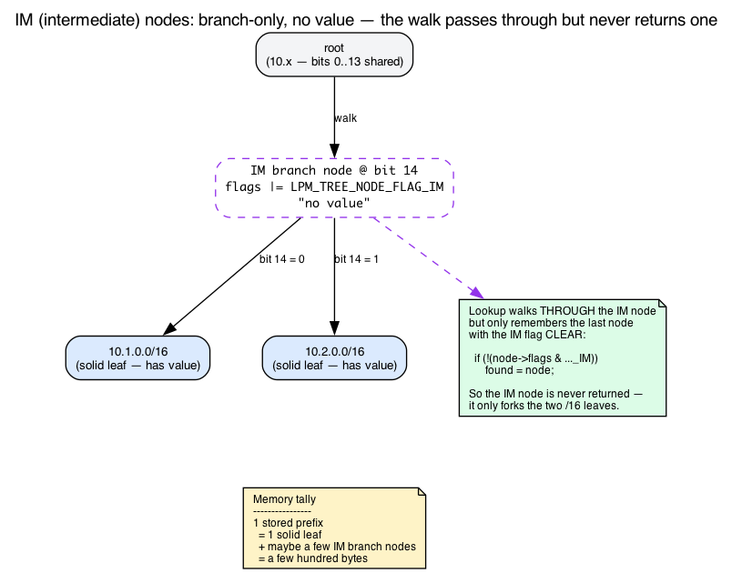
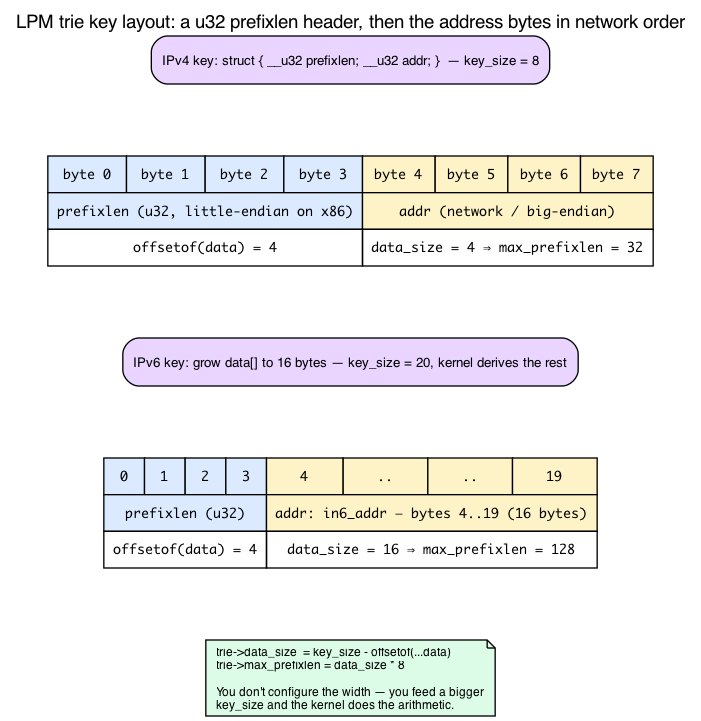
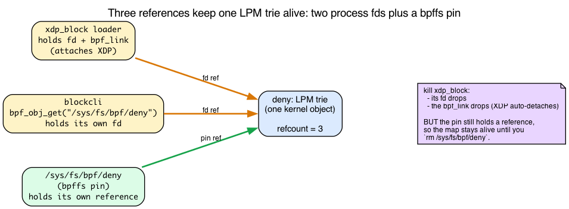

# Day 15 — XDP firewall: drop CIDRs at line rate

> **Today's mission:** turn yesterday's counter into a userspace-controlled denylist that drops traffic from configurable IPv4 prefixes. Along the way, learn three things the lab quietly depends on: how a BPF map can *outlive and be shared beyond* the process that created it (pinning + bpffs), the exact byte layout the kernel demands of an LPM key and *why*, and what the trie actually allocates under the hood so the per-entry memory cost (a leaf node *plus* manufactured branch nodes) stops being a hand-wave. Total time: ~110 minutes.

## The wrong way and the right way

To drop traffic from `10.1.2.0/24`, you could shove all 256 IPs into a hash map (the `BPF_MAP_TYPE_HASH` from Day 2). That works but doesn't scale to `10.0.0.0/8` (16 million entries) and definitely doesn't scale to IPv6 (...you're not enumerating /64 prefixes).

You want **prefix matching**. The map type for that is `BPF_MAP_TYPE_LPM_TRIE`.


## The LPM trie

A bit-by-bit prefix tree. Insert `10.0.0.0/8`, then `10.1.0.0/16`, then `10.1.2.0/24`, and the trie holds them at the right depths.


A lookup with key `10.1.2.55` walks:

1. Root.
2. Match the first 8 bits (10.x.x.x) → `10.0.0.0/8` node.
3. Match next 8 bits (10.1.x.x) → `10.1.0.0/16` node.
4. Match next 8 bits (10.1.2.x) → `10.1.2.0/24` node.
5. No deeper match → return value at `10.1.2.0/24`.

That's **Longest Prefix Match (LPM)** — the same algorithm IP routing uses. Lookup cost is O(prefix length): max 32 hops for IPv4, ~128 for IPv6, but in practice much less.


### What's *actually* in the tree: intermediate nodes

That clean root→/8→/16→/24 walk is a simplification, and the simplification is exactly what hides the trie's real memory cost. Here is the part no tutorial shows you.

Suppose you store two prefixes that **diverge mid-byte** — say `10.1.0.0/16` and `10.2.0.0/16`. In binary, `10.1` and `10.2` agree for the first 14 bits and split at bit 14. There is no stored prefix at that 14-bit branch point, but the tree still needs a fork there. So the kernel **manufactures one**: an *intermediate* (IM) node at the divergence point, with the two real /16 leaves as its children.

```c
/* kernel/bpf/lpm_trie.c:22 */
#define LPM_TREE_NODE_FLAG_IM BIT(0)
```

The IM node is a genuine allocation — it occupies kernel memory — but it holds **no user value**. It exists purely to give the two real prefixes a common parent. *That* is the "multiple internal nodes per leaf" the Dumb-Question answer cites, and it's why each stored prefix costs more than just `sizeof(value)`: the kernel allocates every node — leaf or branch — at `leaf_size = sizeof(struct lpm_trie_node) + data_size + value_size` (`kernel/bpf/lpm_trie.c:601-602`). The header (`struct lpm_trie_node`) is `child[2]` (16 bytes) + `prefixlen` (4) + `flags` (4) = 24 bytes, so for this lab's IPv4 map (`data_size=4`, `value_size=4`) a node is 24+4+4 = **32 bytes**. You pay for the leaf *and* each branch node that routes to it — tens of bytes per stored prefix, not hundreds. `trie_update_elem` allocates the IM node at the split point:

```c
/* kernel/bpf/lpm_trie.c:423-444 — insert a branch node at the divergence point */
im_node = lpm_trie_node_alloc(trie, NULL);
...
im_node->prefixlen = matchlen;
im_node->flags |= LPM_TREE_NODE_FLAG_IM;     /* no value; pure branch */
...
rcu_assign_pointer(*slot, im_node);
```

Two consequences make this worth knowing:

- **Lookup skips IM nodes as match candidates.** The walk descends *through* an IM node but only "remembers" it as a result if it is a real node. The source records the found node only when the IM flag is clear:

  ```c
  /* kernel/bpf/lpm_trie.c:271-275, inside trie_lookup_elem */
  /* Consider this node as return candidate unless it is an
   * artificially added intermediate one. */
  if (!(node->flags & LPM_TREE_NODE_FLAG_IM))
      found = node;
  ```

  So "longest prefix match" is literally "the last *non-intermediate* node the walk passed through." That's the mechanism behind the hand-wavy walk above.

- **IM nodes get promoted, not leaked.** If you later insert a prefix exactly at an IM node's branch point, that branch *position* becomes a real node instead of leaking. The mechanics are copy-and-replace, not in-place flag-clearing: `trie_update_elem` always allocates a fresh `new_node` up front (`lpm_trie.c:341`), and when the update lands on an existing IM node (`node->prefixlen == matchlen` with the IM flag still set), the new real node inherits the IM node's two children, is swapped into the slot via `rcu_assign_pointer`, and the old IM node is then freed (`lpm_trie.c:387-406`). So the kernel doesn't keep the same node object and clear its flag — it replaces the node while reusing its place in the tree. The source comment uses a `192.168.0.0/23` example and calls this "turned into a 'real' node on demand" / the IM node being "re-used" (`lpm_trie.c:142`), where "re-used" means the branch point, not the allocation.

The lookup also has two early exits worth one sentence, because they're what make the O(prefix_len) cost concrete. If a node matches the **full** key width it returns immediately (exact match), and if fewer bits match than the node's own prefix length, it stops and returns the last real node seen:

```c
/* kernel/bpf/lpm_trie.c:259-262 — exact match: stop now */
if (matchlen == trie->max_prefixlen) {
    found = node;
    break;
}
/* ... matchlen < node->prefixlen ⇒ bail, return last seen */
```

One last detail that ties back to byte order: the walk reads the key **MSB-first** — bit 0 is the *top* bit of byte 0.

```c
/* kernel/bpf/lpm_trie.c:154 */
static inline int extract_bit(const u8 *data, size_t index)
{
    return !!(data[index / 8] & (1 << (7 - (index % 8))));
}
```

That is *why* the address must be stored in network (big-endian) byte order: the trie walks bits from the wire's most-significant end, so the bytes have to be in wire order for "the first 8 bits" to actually mean "the first octet."



## The key struct: what the kernel really demands, and why

LPM trie keys *must* start with a `prefixlen` field, then the address bytes:

```c
struct ipv4_lpm_key {
    __u32 prefixlen;   /* always first */
    __u32 addr;        /* network byte order */
};
```

That's the convention every example repeats. But it's not arbitrary — your hand-rolled struct is mirroring a real UAPI type, and the kernel enforces the layout with a compile-time assertion. The canonical key is:

```c
/* include/uapi/linux/bpf.h:103-109 */
struct bpf_lpm_trie_key_u8 {
    union {
        struct bpf_lpm_trie_key_hdr hdr;
        __u32                       prefixlen;
    };
    __u8 data[];     /* Arbitrary size */
};
```

(`data[]` is the address bytes.) A 4-byte `prefixlen` header followed by a **flexible array** of address bytes. Your `{ prefixlen; addr; }` is exactly that header plus a 4-byte `data[]` payload. Three facts fall out of this struct, and each grounds a rule the chapter otherwise asks you to memorize:

1. **`prefixlen` must be first, and the address must be u32-aligned.** The kernel doesn't trust you — it `BUILD_BUG_ON`s the offset of the data array:

   ```c
   /* kernel/bpf/lpm_trie.c:176 */
   BUILD_BUG_ON(offsetof(struct bpf_lpm_trie_key_u8, data) % sizeof(u32));
   ```

   The address bytes therefore land at offset 4. That's not a coincidence you have to remember; it's a build-time invariant of the layout.

2. **The address *width* is derived, not hard-coded.** The kernel computes how many address bytes there are by subtracting the header size from your declared `key_size`, then sets the max prefix length to that many bits:

   ```c
   /* kernel/bpf/lpm_trie.c:594-596, in trie_alloc */
   trie->data_size = attr->key_size -
                     offsetof(struct bpf_lpm_trie_key_u8, data);
   trie->max_prefixlen = trie->data_size * 8;
   ```

   A 4-byte `addr` ⇒ `data_size = 4` ⇒ `max_prefixlen = 32`. Enlarge the struct to hold a 16-byte `in6_addr` ⇒ `data_size = 16` ⇒ `max_prefixlen = 128`. **This is the whole reason the IPv6 variant in Break 4 "just works" by growing the struct** — you're not configuring anything, you're feeding the kernel a bigger `key_size` and it does the arithmetic.

3. **The lookup key uses `prefixlen = 32`** — "this is an exact host address; match it against *any* stored prefix." The kernel rejects a key whose `prefixlen` exceeds the trie's max up front:

   ```c
   /* kernel/bpf/lpm_trie.c:244-245, in trie_lookup_elem */
   if (key->prefixlen > trie->max_prefixlen)
       return NULL;
   ```

So `{ .prefixlen = 16, .addr = 0x0a010000 }` means "10.1.0.0/16" — only the top 16 bits of `addr` matter — and `{ .prefixlen = 32, .addr = <packet saddr> }` means "look up this exact source IP and give me the longest stored prefix that covers it."



## Sharing one trie between two processes: pinning and bpffs

Here is something genuinely new today. Every chapter so far (Days 1–14) loaded a skeleton, kept the map's file descriptor *inside one process*, and let everything vanish when that process exited. Day 14's counter disappears the moment the loader dies. Today's lab has **two separate programs** — a loader that attaches the XDP program, and a CLI that mutates the denylist — and they must operate on the *same* trie. That requires a mechanism we haven't needed until now: **pinning**.

### A map is a kernel object behind a file descriptor

Recall from Day 2 that userspace never holds a kernel pointer to a map — it holds an **integer file descriptor**, a handle to a kernel object. The same is true of programs and links. And like any fd-referenced kernel object, a BPF map is **reference-counted**: the kernel keeps it alive as long as at least one fd refers to it, and frees it when the **last fd closes**. The UAPI header says so directly:

```
/* include/uapi/linux/bpf.h:951 */
* An eBPF object is deallocated only after all file descriptors referring
* to the object have been closed and no references remain pinned to the
* filesystem or attached ...
```

That single sentence explains Day 14: the loader held the only fd, the loader exited, the refcount hit zero, the map was freed. Fine when one process owns everything. Useless when a *second*, unrelated process needs to reach the same map — two processes cannot hand each other a raw fd.

### bpffs: a filesystem where kernel objects get names

The rendezvous mechanism is a special pseudo-filesystem of type `bpf`, mounted by convention at **`/sys/fs/bpf`** (it's called *bpffs*). It holds no real files on disk; each directory entry is a **name bound to a kernel BPF object**. Creating such an entry is called **pinning**, and the pin holds *its own reference* to the object — exactly the "no references remain pinned to the filesystem" clause above. So a pinned map survives even when **no process** has it open. The header spells out the contract:

```
/* include/uapi/linux/bpf.h:945-949 (paraphrased) */
* File descriptors referring to eBPF objects can be pinned to the
* filesystem using the BPF_OBJ_PIN command of bpf(2).
```

The flow for two processes is then:

- Process A (the loader) **pins** the map by path: this creates `/sys/fs/bpf/deny` and adds a reference.
- Process B (the CLI) calls `bpf_obj_get("/sys/fs/bpf/deny")` to obtain **its own fd** to the **same** underlying map.

Now both processes — plus the pin itself — hold references. The trie is shared, and it stays alive as long as *any* of those three references exists.



### The libbpf entry points

Two layers do the same job:

- **High-level, from the skeleton:** `bpf_map__pin(map, path)` — what the loader calls (`tools/lib/bpf/libbpf.c:9150`).
- **Low-level, by fd/path:** `bpf_obj_pin(fd, path)` (`tools/lib/bpf/bpf.c:604`) and `bpf_obj_get(path)` (`tools/lib/bpf/bpf.c:609`).

Both wrap the same two `bpf()` syscall commands, `BPF_OBJ_PIN` and `BPF_OBJ_GET` (`include/uapi/linux/bpf.h:962-963`). The CLI never opens a skeleton and never attaches anything — it just calls `bpf_obj_get` to grab an fd and then issues the ordinary `bpf_map_update_elem` / `bpf_map_delete_elem` syscalls from Day 2.

### Pin the map, not the program — and the cleanup gotcha

Notice the loader pins the **map**, not the program. The XDP program stays attached because the loader holds its `bpf_link` open (via `pause()` — that's the whole reason the loader parks). Only the *trie* needs to be shared, so only the *trie* is pinned.

The consequence is a cleanup gotcha. **Killing the loader drops its `bpf_link`, which auto-detaches the XDP program** — good, the firewall stops filtering. But the *pinned map node* in bpffs is a separate reference; it lingers until you explicitly `rm` it:

```bash
sudo rm /sys/fs/bpf/deny /sys/fs/bpf/stats
```

Forget that, and a stale `deny` trie sits in bpffs holding kernel memory, and the next `bpf_map__pin` to the same path fails with `EEXIST`.

> ### There are no Dumb Questions
>
> **Q: Can I update the LPM trie while the XDP program is running?**
>
> A: Yes. Recall from Day 2 that map reads are RCU-protected — lookups take no lock and elements are RCU-freed, so a returned pointer can't be freed under you. The LPM trie walks its nodes under `rcu_dereference_check(...)` with `rcu_read_lock_bh_held()` (`kernel/bpf/lpm_trie.c:249, :282`), so an XDP lookup sees a consistent tree even while `blockcli` is mutating it. Updates are atomic at the per-key level. Hot-path-friendly.
>
> **Q: What's the lookup cost vs hash?**
>
> A: For exact-match keys, hash is faster (O(1)). For prefixes, hash can't do the job. LPM trie lookup is O(prefix_len) but the per-bit cost is low; on a 5-level trie a lookup is ~30 ns vs ~10 ns for a hash hit. In a wire-rate context that's noticeable but not crippling.
>
> **Q: How many entries can the trie hold?**
>
> A: Capped by `max_entries`. Each entry costs ~32 bytes for an IPv4 leaf (24-byte node header + 4-byte addr + 4-byte value, `lpm_trie.c:601-602`) plus ~32 bytes for each **intermediate branch node** the kernel had to manufacture to route to it (the IM nodes from "What's actually in the tree") — and now you know *why*. So 1M IPv4 entries is tens of MB; 10M is only a few hundred MB. (IPv6 with a large value is bigger per node, but still tens of bytes, not hundreds.)
>
> **Q: IPv6?**
>
> A: Same map type, key struct grows: `{ prefixlen, struct in6_addr addr; }`. You don't configure anything — the kernel derives the address width from `key_size` (see "The key struct"). Treat each 32-bit chunk in network byte order.

## End-to-end flow

You manage the denylist from userspace via `bpf_map_update_elem` calls (the Day 2 userspace function — fills a `union bpf_attr`, issues a `bpf()` syscall). The XDP program does a single LPM lookup per packet and drops on match.

## The lab

### `block.bpf.c`

```c
#include "vmlinux.h"
#include <bpf/bpf_helpers.h>
#include <bpf/bpf_endian.h>

char LICENSE[] SEC("license") = "GPL";

struct ipv4_lpm_key {
    __u32 prefixlen;
    __u32 addr;
};

struct {
    __uint(type, BPF_MAP_TYPE_LPM_TRIE);
    __uint(max_entries, 1024);
    __type(key, struct ipv4_lpm_key);
    __type(value, __u32);    /* arbitrary value; we just check existence */
    __uint(map_flags, BPF_F_NO_PREALLOC);   /* required for LPM */
} deny SEC(".maps");

struct {
    __uint(type, BPF_MAP_TYPE_PERCPU_ARRAY);
    __uint(max_entries, 2);  /* [0] = pass, [1] = drop */
    __type(key, __u32);
    __type(value, __u64);
} stats SEC(".maps");

static __always_inline void bump(__u32 idx) {
    __u64 *c = bpf_map_lookup_elem(&stats, &idx);
    if (c) (*c)++;
}

SEC("xdp")
int xdp_block(struct xdp_md *ctx)
{
    void *data = (void *)(long)ctx->data;
    void *end  = (void *)(long)ctx->data_end;

    struct ethhdr *eth = data;
    if (eth + 1 > end) goto pass;
    if (eth->h_proto != bpf_htons(ETH_P_IP)) goto pass;

    struct iphdr *ip = (void *)(eth + 1);
    if (ip + 1 > end) goto pass;

    struct ipv4_lpm_key k = { .prefixlen = 32, .addr = ip->saddr };
    if (bpf_map_lookup_elem(&deny, &k)) {
        bump(1);
        return XDP_DROP;
    }

pass:
    bump(0);
    return XDP_PASS;
}
```

What's new (and where it's grounded):

- **`BPF_F_NO_PREALLOC`** is required for LPM. Hash maps preallocate by default for fast updates; the trie is a dynamic tree and the kernel *rejects its absence at create time*. The flag is value `(1U << 0)` (`include/uapi/linux/bpf.h:1402`), and `trie_alloc` returns `-EINVAL` unless it's set — `!(attr->map_flags & BPF_F_NO_PREALLOC)` is right there in the sanity check (`kernel/bpf/lpm_trie.c:579`). Try removing the flag (Break 1) and you'll hit that exact line.
- **The key passed to lookup uses `prefixlen=32`** — you're asking "match this exact IP against any prefix in the trie." The address comes straight from `ip->saddr`, which is already in network byte order on the wire — exactly the order the MSB-first `extract_bit` walk needs (see "What's actually in the tree").
- **Two-stage drop accounting**: indices 0 and 1 in a percpu array hold pass/drop counters — the `PERCPU_ARRAY` + sum-across-CPUs pattern from Day 14 / Day 2.

### `blockcli.c` — userspace CLI

```c
/* Usage: ./blockcli add 10.1.0.0/16 */
/* Usage: ./blockcli del 10.1.0.0/16 */
/* Usage: ./blockcli stats */

static int parse_cidr(const char *s, struct ipv4_lpm_key *out) {
    char buf[64];
    strncpy(buf, s, sizeof(buf) - 1);
    char *slash = strchr(buf, '/');
    if (!slash) return -1;
    *slash = 0;
    out->prefixlen = atoi(slash + 1);
    struct in_addr a;
    if (inet_aton(buf, &a) == 0) return -1;
    out->addr = a.s_addr;       /* already network byte order */
    return 0;
}

int main(int argc, char **argv) {
    /* the loader (block.c) pinned the maps; open them by path */
    int fd = bpf_obj_get("/sys/fs/bpf/deny");

    if (!strcmp(argv[1], "add")) {
        struct ipv4_lpm_key k;
        parse_cidr(argv[2], &k);
        __u32 v = 1;
        bpf_map_update_elem(fd, &k, &v, BPF_ANY);
    } else if (!strcmp(argv[1], "del")) {
        struct ipv4_lpm_key k;
        parse_cidr(argv[2], &k);
        bpf_map_delete_elem(fd, &k);
    } else if (!strcmp(argv[1], "stats")) {
        int sfd = bpf_obj_get("/sys/fs/bpf/stats");
        int ncpu = libbpf_num_possible_cpus();
        __u64 vals[ncpu];
        __u32 k0 = 0, k1 = 1; __u64 pass = 0, drop = 0;
        bpf_map_lookup_elem(sfd, &k0, vals);    /* index 0 = pass */
        for (int i = 0; i < ncpu; i++) pass += vals[i];
        bpf_map_lookup_elem(sfd, &k1, vals);    /* index 1 = drop */
        for (int i = 0; i < ncpu; i++) drop += vals[i];
        printf("pass=%llu drop=%llu\n", pass, drop);
    }
}
```

The key line is `bpf_obj_get("/sys/fs/bpf/deny")` — no skeleton, no attach. This process gets its **own fd** to the same kernel trie the loader pinned, exactly the rendezvous from the pinning section. Everything after is the ordinary Day 2 userspace map API.

### `block.c` — loader

Neither artifact above attaches the program. Add a tiny loader (built by `make` as `./xdp_block`) that loads the object, **pins both maps** so the separate `blockcli` process can reach them, attaches the XDP program, and parks:

```c
/* block.c — built as ./xdp_block. Usage: sudo ./xdp_block <iface> */
int main(int argc, char **argv) {
    struct block_bpf *skel = block_bpf__open_and_load();
    /* pin the maps under /sys/fs/bpf so blockcli can open them by path */
    bpf_map__pin(skel->maps.deny,  "/sys/fs/bpf/deny");
    bpf_map__pin(skel->maps.stats, "/sys/fs/bpf/stats");
    bpf_program__attach_xdp(skel->progs.xdp_block,
                            if_nametoindex(argv[1]));
    pause();   /* hold the bpf_link open until the process is killed */
}
```

The pin is what lets two processes share one trie: `xdp_block` owns the skeleton and the attachment; `blockcli` just opens `/sys/fs/bpf/deny` and `/sys/fs/bpf/stats` with `bpf_obj_get`. `bpf_map__pin` (`tools/lib/bpf/libbpf.c:9150`) issues the `BPF_OBJ_PIN` command; `bpf_obj_get` (`tools/lib/bpf/bpf.c:609`) issues `BPF_OBJ_GET`. Killing `xdp_block` drops its `bpf_link` and auto-detaches the program — but the pinned map nodes survive until you `rm` them (the cleanup gotcha from "Pin the map, not the program").

### Run

First stand up an isolated peer at `10.0.0.2` so there is actually something to ping — otherwise `ping` times out whether or not XDP is dropping, and the experiment proves nothing. A *veth pair* is a virtual cable: two linked interfaces, here with one end (`veth1`) moved into a separate network namespace (an isolated network stack) so it acts like a remote peer.

```bash
sudo ip netns add peer
sudo ip link add veth0 type veth peer name veth1
sudo ip link set veth1 netns peer
sudo ip addr add 10.0.0.1/24 dev veth0 && sudo ip link set veth0 up
sudo ip -n peer addr add 10.0.0.2/24 dev veth1 && sudo ip -n peer link set veth1 up
```

XDP runs on **RX (ingress)**, so the drop must happen on the echo *reply* — whose source address is `10.0.0.2`. Attach the program on `veth0`, the host side that *receives* those replies:

```bash
make
sudo ./xdp_block veth0 &        # host side that receives the replies

ping -c 3 10.0.0.2              # replies arrive on veth0 ingress -> PASS, works
sudo ./blockcli add 10.0.0.0/8
ping -c 3 10.0.0.2              # replies (saddr 10.0.0.2) match 10.0.0.0/8 -> XDP_DROP -> 100% loss
sudo ./blockcli stats          # drop count climbs

sudo ./blockcli del 10.0.0.0/8
ping -c 3 10.0.0.2             # works again
```

The observation is the **before/after contrast**: the first ping gets replies (0% loss), and after `add 10.0.0.0/8` the replies are dropped on `veth0` ingress so ping reports 100% loss. `blockcli stats` confirms it with a non-zero drop count:

```
pass=<some number> drop=3
```

(`drop` should be 3 — one per dropped echo reply. Attaching to the in-netns `veth1` instead would *not* drop the replies, because they leave that side on TX, not RX.)

Clean up when you're done — stop the loader (killing it drops the `bpf_link` and auto-detaches XDP), remove the lingering bpffs pins, and tear down the veth pair and namespace:

```bash
sudo pkill xdp_block                            # stops the loader, auto-detaches the program
sudo rm /sys/fs/bpf/deny /sys/fs/bpf/stats      # the pins outlive the loader — remove them
sudo ip link del veth0                          # removes the veth pair
sudo ip netns del peer
```

Don't skip the `rm`: as the pinning section warned, the pinned trie lingers in bpffs (holding kernel memory) and makes the next run's `bpf_map__pin` fail with `EEXIST`.

Now you have a userspace-controlled, line-rate firewall. Every API call updates the trie atomically; no XDP restart needed.

---

## What to break, in order

### Break 1 — Forget `BPF_F_NO_PREALLOC`

Remove the flag. Map creation fails:

```
libbpf: map 'deny': failed to create: EINVAL
```

That `EINVAL` is not libbpf being fussy — it comes straight from the kernel's `trie_alloc`, which lists `!(attr->map_flags & BPF_F_NO_PREALLOC)` among the conditions that return `ERR_PTR(-EINVAL)` (`kernel/bpf/lpm_trie.c:579`). Most map types preallocate hashtable buckets at create time for stability. The LPM trie is a dynamic tree that allocates nodes on demand, so the kernel *insists* you acknowledge that with the flag.

### Break 2 — Wrong byte order on insert

```c
out->addr = htonl(a.s_addr);   /* WRONG — already big-endian */
```

`inet_aton` returns network byte order already. Double-converting flips the bits. You'll insert "wrong" CIDRs that never match. Verify with:

```bash
sudo bpftool map dump name deny
```

`bpftool` dumps a non-BTF LPM map as raw little-endian hex byte arrays — *not* as a decoded `prefixlen N key 0xN` string. For `10.1.0.0/16` you'll see:

```
key: 10 00 00 00 0a 01 00 00  value: 01 00 00 00
```

The first u32 is `prefixlen` in little-endian (`10 00 00 00` = 16); the next 4 bytes are the address in network order — `0a 01 00 00` = 10.1.0.0 (correct). This is the byte layout from "The key struct" made visible: `prefixlen` at offset 0, address bytes at offset 4. If you double-swapped, the address bytes come out reversed: `00 00 01 0a`. (Add `-j` for the same bytes as a JSON hex array.)

### Break 3 — Block your own SSH

If you're attached to the *real* NIC and add `0.0.0.0/0` to the denylist, you've cut your own session. (Don't actually do this.) `XDP_DROP` is below the kernel's "let SSH through" logic.

To detach without console access: panic + reboot. Or better: never test on a real NIC without an out-of-band escape route.

### Break 4 — Add IPv6

```c
struct ipv6_lpm_key {
    __u32 prefixlen;
    struct in6_addr addr;
};
```

Update the map definition's value type, parse CIDR with `inet_pton(AF_INET6, ...)`, branch in BPF on `ETH_P_IPV6`. Same shape, different sizes — and now you know *why* it just works: enlarging the struct grows `key_size`, and the kernel derives the address width from it (see "The key struct"). You never tell the kernel "this is IPv6"; the arithmetic on `key_size` does it for you.

---

## What to read in the kernel

- **`kernel/bpf/lpm_trie.c`** — the implementation. Read `trie_lookup_elem` (the IM-skipping walk at `:271-275`, the exact-match early exit at `:259-262`) and `trie_update_elem` (the IM-node insert at `:423-444`). ~800 lines, accessible.
- **`include/uapi/linux/bpf.h`** — `struct bpf_lpm_trie_key_u8` (`:103-109`), the `BPF_OBJ_PIN`/`BPF_OBJ_GET` commands (`:962-963`), and `BPF_F_NO_PREALLOC` (`:1402`).
- **`tools/lib/bpf/libbpf.c` / `tools/lib/bpf/bpf.c`** — `bpf_map__pin` (`:9150`), `bpf_obj_pin` (`:604`), `bpf_obj_get` (`:609`): the pinning entry points.
- **`tools/testing/selftests/bpf/map_tests/lpm_trie_map_basic_ops.c`** — the canonical test, including edge cases.

---

## Bullet Points

- **`BPF_MAP_TYPE_LPM_TRIE`** is for prefix lookups (CIDRs, IPv6 prefixes, MAC OUIs).
- Key struct **must start with `prefixlen`**, followed by address bytes — it mirrors `struct bpf_lpm_trie_key_u8`, and the kernel `BUILD_BUG_ON`s the address landing at a u32-aligned offset (`lpm_trie.c:176`). The address **width** (and thus `max_prefixlen`) is *derived* from `key_size`, which is why IPv6 "just works" by growing the struct.
- **Always set `BPF_F_NO_PREALLOC`** — the kernel returns `-EINVAL` at create time without it (`lpm_trie.c:579`).
- The trie stores **intermediate (IM) branch nodes** with no value to fork diverging prefixes; that's the real per-entry memory cost, and lookup *skips* them as match candidates (`lpm_trie.c:271-275`), returning the last non-IM node — that's longest-prefix-match.
- Lookup is O(prefix_len) — fast enough for line-rate; reads are RCU-protected (Day 2), safe to update while XDP is running.
- **Pinning + bpffs** is how two processes share one map: a BPF object is fd-refcounted and freed when the last fd closes (that's why Day 14's map vanished); a pin in `/sys/fs/bpf` adds a filesystem reference that survives the creator's death. The loader `bpf_map__pin`s; the CLI `bpf_obj_get`s its own fd to the same trie. **Remember to `rm` the pin** — killing the loader auto-detaches XDP but leaves the pinned map behind.
- Userspace CIDR parsing: `inet_aton` returns network byte order (don't double-convert) — required because the trie walks bits MSB-first.
- Test on `veth` pairs before deploying on real interfaces.

---

## Check question

You add `10.0.0.0/8` and `10.1.0.0/16` to the denylist. A packet from `10.1.5.20` arrives. Which entry matches, and what's the lookup cost?

<details>
<summary>Click to reveal answer</summary>

**Answer:** Both prefixes match, but LPM returns the **longest** — `10.1.0.0/16`. Cost is O(prefix length matched) — about 16 bit comparisons, plus tree-walking overhead. The trie nodes are visited in the order: root → /8 → /16, and the walk "remembers" the last non-intermediate node it passed (`lpm_trie.c:271-275`), returning the value at /16. ~30 ns total on modern hardware.

</details>

---

## Tomorrow

Day 16: tc-bpf — the legacy way to attach BPF to the network stack at L2/L3. We'll see why it predates XDP, what it can do that XDP can't, and the pain of `tc qdisc` lifecycle that motivated tcx.
