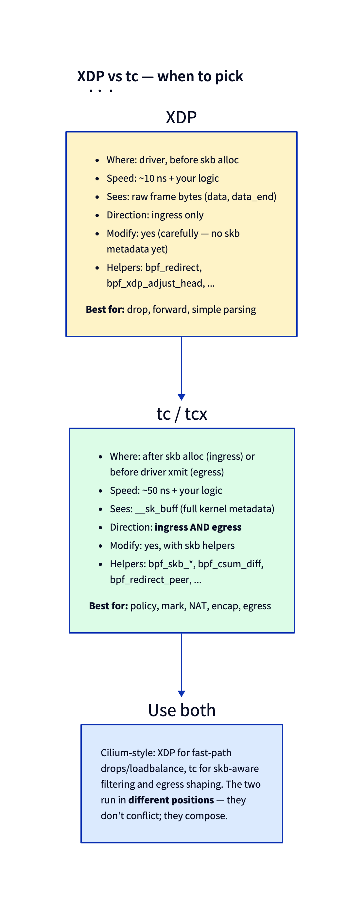

# Day 16 — tc-bpf: BPF in the kernel network stack

> **Today's mission:** attach BPF to a network interface's ingress *and* egress with classic tc, see why XDP can't do everything, and feel the pain of `tc qdisc` lifecycle that motivated tcx (tomorrow). Total time: ~75 minutes.

## Why tc, when XDP exists

XDP runs before skb allocation — fastest place. But that's also its limit: there's *no skb* yet. No connection-tracking metadata, no socket lookup, no routing decision, no skb cb. For programs that need that information (e.g., "tag packets belonging to flows my conntrack already saw"), XDP isn't enough.

**tc-bpf** runs *after* skb allocation. You see `struct __sk_buff` — a typed view of the kernel's `struct sk_buff` with all metadata visible.



The other big difference: **tc has both ingress and egress hooks**. XDP is ingress-only. If you want to drop or modify packets *on their way out* (e.g., adding tunnel encapsulation, marking based on cgroup), you need tc.

## The tc context: `struct __sk_buff`

A read-mostly typed view of `struct sk_buff` (abridged — the real definition in `include/uapi/linux/bpf.h` continues with socket and timestamp fields):

```c
struct __sk_buff {
    __u32 len;
    __u32 pkt_type;        /* PACKET_HOST, PACKET_BROADCAST, ... */
    __u32 mark;            /* socket/skb mark */
    __u32 queue_mapping;
    __u32 protocol;        /* L3 protocol */
    __u32 vlan_present;
    __u32 vlan_tci;
    __u32 vlan_proto;
    __u32 priority;
    __u32 ingress_ifindex;
    __u32 ifindex;
    __u32 tc_index;        /* tc classification slot */
    __u32 cb[5];           /* skb control block — pass data between progs */
    __u32 hash;            /* skb hash */
    __u32 tc_classid;
    __u32 data;            /* same idea as xdp_md */
    __u32 data_end;
    __u32 napi_id;
    /* and more — family/remote_ip4/...; data_meta, tstamp, sk, etc. */
};
```

Use `data` and `data_end` for direct packet access (same bounds-checking discipline as XDP). Use `mark`, `cb`, etc. to coordinate with kernel state.

## Action constants for tc

```c
#define TC_ACT_OK         0   /* let the packet through */
#define TC_ACT_RECLASSIFY 1   /* reclassify */
#define TC_ACT_SHOT       2   /* drop */
#define TC_ACT_PIPE       3   /* pass to next filter */
#define TC_ACT_STOLEN     4   /* steal: don't free, prog took it */
#define TC_ACT_QUEUED     5
#define TC_ACT_REPEAT     6
#define TC_ACT_REDIRECT   7   /* paired with bpf_redirect() */
```

Most programs return `TC_ACT_OK` (allow), `TC_ACT_SHOT` (drop), or `TC_ACT_REDIRECT`.

> ### There are no Dumb Questions
>
> **Q: Does tc see GRO-coalesced packets or individual packets?**
>
> A: tc on ingress sees what NAPI/GRO produced — coalesced superpackets if GRO is enabled. tc on egress sees skbs as the kernel built them. Tools like Cilium often disable GRO when the BPF program needs per-packet visibility.
>
> **Q: Why is the attach mechanism so awkward (`tc qdisc add` + `tc filter add`)?**
>
> A: tc predates BPF. It was originally a packet-classifier system for QoS (queueing disciplines), and BPF programs got bolted on as a "filter" type. The qdisc gives you a hook point; the filter is your BPF. Hence two commands. tcx (tomorrow) ditches this entirely.

## The lab: tc on ingress and egress

### `tc.bpf.c`

```c
#include "vmlinux.h"
#include <bpf/bpf_helpers.h>
#include <bpf/bpf_endian.h>
#include <linux/pkt_cls.h>

char LICENSE[] SEC("license") = "GPL";

SEC("tc_ingress")
int tc_ingress(struct __sk_buff *skb)
{
    void *data = (void *)(long)skb->data;
    void *end  = (void *)(long)skb->data_end;
    struct ethhdr *eth = data;
    if (eth + 1 > end) return TC_ACT_OK;
    if (eth->h_proto != bpf_htons(ETH_P_IP)) return TC_ACT_OK;
    struct iphdr *ip = (void *)(eth + 1);
    if (ip + 1 > end) return TC_ACT_OK;
    /* Mark packets so userspace iptables can pick them up */
    skb->mark = 0xCAFE;
    return TC_ACT_OK;
}

SEC("tc_egress")
int tc_egress(struct __sk_buff *skb)
{
    /* Drop every UDP packet outbound to demonstrate egress */
    void *data = (void *)(long)skb->data;
    void *end  = (void *)(long)skb->data_end;
    struct ethhdr *eth = data;
    if (eth + 1 > end) return TC_ACT_OK;
    if (eth->h_proto != bpf_htons(ETH_P_IP)) return TC_ACT_OK;
    struct iphdr *ip = (void *)(eth + 1);
    if (ip + 1 > end) return TC_ACT_OK;
    if (ip->protocol == IPPROTO_UDP) return TC_ACT_SHOT;
    return TC_ACT_OK;
}
```

### Setup: build the object and a namespaced veth pair

First build the object (Days 14–15 drove this with `make`; here is the explicit compile):

```bash
clang -O2 -g -target bpf -c tc.bpf.c -o tc.bpf.o   # or: make
```

Now the topology. Unlike Day 14 we put one end of the veth pair in its **own network namespace**. This matters for the egress demo: if both ends live in the root namespace, a packet sent to `veth1`'s own address (`10.0.0.2`) is routed over loopback and **never traverses `veth1`'s egress hook** — so the egress drop below would silently never fire. A namespace forces the packet out through `veth1`.

```bash
sudo ip netns add ns1
sudo ip link add veth0 type veth peer name veth1
sudo ip link set veth1 netns ns1
sudo ip addr add 10.0.0.1/24 dev veth0
sudo ip link set veth0 up
sudo ip netns exec ns1 ip addr add 10.0.0.2/24 dev veth1
sudo ip netns exec ns1 ip link set veth1 up
sudo ip netns exec ns1 ip link set lo up
```

(If a `veth0`/`ns1` from a previous run is lying around, run the Detach/cleanup at the bottom first.)

### Attach the classic way

`veth1` lives in `ns1`, so every `tc` command runs inside that namespace with `ip netns exec ns1`:

```bash
sudo ip netns exec ns1 tc qdisc add dev veth1 clsact

sudo ip netns exec ns1 tc filter add dev veth1 ingress \
     bpf da obj tc.bpf.o sec tc_ingress

sudo ip netns exec ns1 tc filter add dev veth1 egress \
     bpf da obj tc.bpf.o sec tc_egress

# verify:
sudo ip netns exec ns1 tc filter show dev veth1 ingress
sudo ip netns exec ns1 tc filter show dev veth1 egress
```

`clsact` is a special qdisc that exists solely to provide ingress and egress hook points for tc-bpf. It doesn't shape traffic; it's a scaffold.

### Run

Generate traffic from **inside** `ns1` so it egresses `veth1`:

```bash
# ICMP passes — the egress program only drops UDP:
sudo ip netns exec ns1 ping -c 3 10.0.0.1

# UDP is dropped on veth1's egress. A `nc -u` send never reports an
# application error even when the datagram is silently dropped, so don't
# wait for nc to "fail" — confirm via the egress action's drop counter:
sudo ip netns exec ns1 nc -u 10.0.0.1 9999 <<< "hi"
sudo ip netns exec ns1 tc -s filter show dev veth1 egress
```

The `tc -s` output ends with a stats line whose `dropped` counter ticks up by **one per UDP datagram** you sent (ICMP and everything else show `TC_ACT_OK`, so they don't count):

```
filter protocol all pref 49152 bpf chain 0 handle 0x1 tc.bpf.o:[tc_egress] direct-action ...
 ...
	Sent 0 bytes 0 pkt (dropped 1, overlimits 0 requeues 0)
```

### Verify the mark in iptables

The ingress program stamps `skb->mark = 0xCAFE` on incoming IP packets. To see it, install the LOG rule **before** generating traffic — a LOG rule only matches packets that arrive *after* it exists, so adding it afterward shows nothing:

```bash
sudo ip netns exec ns1 iptables -A INPUT -m mark --mark 0xCAFE -j LOG --log-prefix 'TCMARK: '
sudo ip netns exec ns1 ping -c 3 10.0.0.1
sudo dmesg | tail
```

The `LOG` target writes to the global kernel ring buffer, so `dmesg` shows the marked inbound ICMP echo-reply packets (note the kernel prints the mark lowercase):

```
TCMARK: IN=veth1 OUT= ... SRC=10.0.0.1 DST=10.0.0.2 ... PROTO=ICMP ... MARK=0xcafe
```

Only ICMP appears here: the UDP probe is dropped on egress (`TC_ACT_SHOT`) so it never leaves `veth1`, never gets a reply, and so nothing inbound carries its mark. (Want a TCP flow marked too? Start a listener in the root ns — `nc -l -p 8080 &` on `10.0.0.1` — and run `sudo ip netns exec ns1 curl -s --max-time 1 http://10.0.0.1:8080/ >/dev/null`; the inbound SYN-ACK gets marked on `veth1` ingress.)

### Detach and clean up

```bash
sudo ip netns exec ns1 tc filter del dev veth1 ingress
sudo ip netns exec ns1 tc filter del dev veth1 egress
sudo ip netns exec ns1 tc qdisc del dev veth1 clsact
# remove the LOG rule we added above so it stops polluting the kernel log:
sudo ip netns exec ns1 iptables -D INPUT -m mark --mark 0xCAFE -j LOG --log-prefix 'TCMARK: '
# tear down the topology (deleting the namespace also removes veth1, and
# that removes its peer veth0):
sudo ip netns del ns1
```

Three commands to undo. If your test process crashes mid-test, you have to remember to clean up. **No FD-based ownership.** This is the pain point tcx fixes.

---

## What to break, in order

### Break 1 — Forget `clsact`

```bash
# Skip `tc qdisc add ... clsact` and jump straight to the filter:
sudo ip netns exec ns1 tc filter add dev veth1 ingress bpf da obj tc.bpf.o sec tc_ingress
# Error: Parent Qdisc doesn't exists.
```

`ingress` here is the parent-*direction* keyword, not a device name — so the kernel reports a missing parent qdisc, not a missing device. (The exact text is iproute2-version-specific: 6.x prints `Error: Parent Qdisc doesn't exists.`; older iproute2 prints `RTNETLINK answers: No such file or directory`.) Without `clsact` there are no ingress/egress slots. Add it first.

### Break 2 — Try a BPF helper that doesn't work in tc

Add an XDP-only helper inside `tc_ingress`, rebuild, and re-attach:

```c
/* inside tc_ingress() — bpf_xdp_adjust_head's real signature is
   (struct xdp_md *, int), so this is the wrong program type for it */
bpf_xdp_adjust_head(skb, 0);
```

```bash
clang -O2 -g -target bpf -c tc.bpf.c -o tc.bpf.o
sudo ip netns exec ns1 tc filter add dev veth1 ingress bpf da obj tc.bpf.o sec tc_ingress 2>&1 | tail
# program of this type cannot use helper bpf_xdp_adjust_head#44
```

Note this is a *disallowed-helper* rejection, not an "unknown func" — the helper exists, but each program type has its own helper allowance table, and `bpf_xdp_adjust_head` is XDP-only.

### Break 3 — Set `skb->len`

```c
skb->len = 100;
```

Verifier rejects — `__sk_buff` is read-only for most fields. For tc programs the writable ones are listed explicitly in `tc_cls_act_is_valid_access` (`net/core/filter.c`): `mark`, `tc_index`, `priority`, `tc_classid`, `cb[0..4]`, `tstamp`, and `queue_mapping`. `len` is not among them.

### Break 4 — Multiple programs at one priority

```bash
sudo ip netns exec ns1 tc filter add dev veth1 ingress pref 100 handle 1 bpf da obj tc.bpf.o sec tc_ingress
sudo ip netns exec ns1 tc filter add dev veth1 ingress pref 100 handle 1 bpf da obj tc.bpf.o sec tc_ingress
# Error: Filter already exists.
```

The collision is on the **priority + handle** pair, not the priority alone. A second `pref 100` add with *no* explicit handle does **not** fail — it gets auto-handle `0x2` and both filters chain, running in handle order. Only reusing the same `pref`+`handle` errors. To run programs in a controlled order you use distinct prefs (`pref 100`, `pref 200`); replacing an existing filter requires del+add (or `tc filter replace`). Inspect with `sudo ip netns exec ns1 tc -s filter show dev veth1 ingress`. **This clumsiness is exactly what tcx's mprog API fixes.**

---

## What to read in the kernel

- **`net/sched/cls_bpf.c`** — the classic tc-bpf classifier. Ages ~10 years old.
- **`net/sched/sch_ingress.c`** — `clsact_init` and the ingress hook plumbing.
- **`tools/lib/bpf/netlink.c`** — search `bpf_tc_attach`. The libbpf wrapper for the legacy interface.

---

## Bullet Points

- **tc-bpf** runs after skb allocation; sees `__sk_buff` with full kernel metadata.
- Has both **ingress and egress** hooks (XDP is ingress only).
- Action constants: `TC_ACT_OK`, `TC_ACT_SHOT`, `TC_ACT_REDIRECT`.
- Classic attach: `tc qdisc add ... clsact` + `tc filter add ... bpf`. **Three commands to set up, three to tear down.**
- No FD-based ownership; cleanup on crash is fragile.
- **Use tcx (Day 17)** for new code. tc-bpf classic is legacy.

---

## Check question

You attach the same BPF program to both XDP and tc-ingress on the same interface. Both run on every incoming packet. Will you see them invoked in a deterministic order?

<details>
<summary>Click to reveal answer</summary>

**Answer:** Yes. **XDP runs first** (in the driver, before skb alloc). If XDP returns `XDP_PASS`, the packet flows on; the kernel allocates skb and calls tc-ingress. If XDP returns `XDP_DROP`, tc-ingress never sees the packet. They're sequential, not concurrent — XDP's decision gates whether tc even runs.

</details>

---

## Tomorrow

Day 17: tcx — same hook position as tc-bpf but with `bpf_link` lifecycle, multi-program ordering via `mprog`, and zero `tc qdisc` ceremony.
