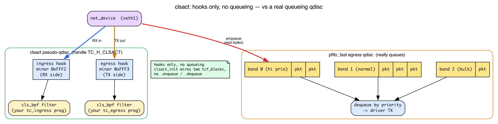
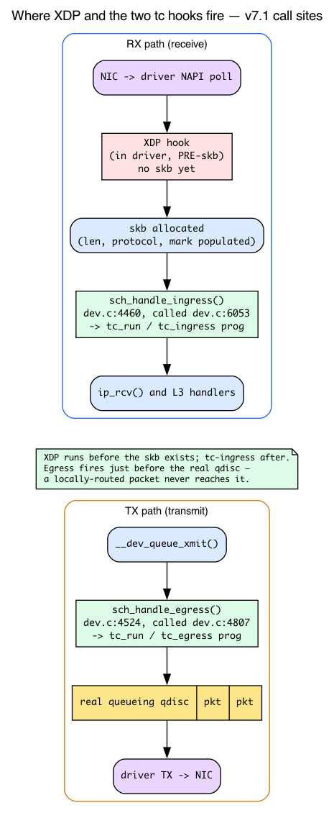

# Day 16 — tc-bpf: BPF in the kernel network stack

> **Today's mission:** attach BPF to a network interface's ingress *and* egress with classic tc, learn the traffic-control machinery (qdisc / classifier / filter / clsact) that every `tc` command leans on, see why XDP can't do everything, and feel the pain of `tc qdisc` lifecycle that motivated tcx (tomorrow). Total time: ~110 minutes.

## Why tc, when XDP exists

Days 14–15 put your BPF program in the NIC driver with XDP, before the kernel built anything. That's the fastest place — and also its limit: there's *no skb* yet. No connection-tracking metadata, no socket lookup, no routing decision, no skb control block. For programs that need that information (e.g., "tag packets belonging to flows my conntrack already saw"), XDP isn't enough.

**tc-bpf** runs *after* skb allocation. You see `struct __sk_buff` — a typed view of the kernel's `struct sk_buff` (the universal packet container you dissected on Day 1 of the companion networking book: the descriptor with `head`/`data`/`tail`/`end` pointers and page-fragment payload). All the metadata that XDP couldn't show you is now populated.


The other big difference: **tc has both ingress and egress hooks**. XDP is ingress-only. If you want to drop or modify packets *on their way out* (e.g., adding tunnel encapsulation, marking based on cgroup), you need tc.

But before we write a line of BPF, we have to confront a wall of unfamiliar vocabulary. Every command in today's lab — `tc qdisc add dev veth1 clsact`, `tc filter add ... bpf da obj`, `tc filter show` — comes from a subsystem that predates BPF by a decade and was built for something else entirely. If you've only done XDP, you have never met a *qdisc*, a *classifier*, a *filter*, or a thing called *clsact*. Let's fix that first, so none of the lab is cargo-cult.

## The tc traffic-control model: qdisc, classifier, filter

`tc` is short for **traffic control**. Long before BPF existed, Linux needed a way to do **QoS** — shape, prioritize, and rate-limit outgoing traffic so that, say, your VoIP packets jump ahead of a bulk file upload. That subsystem is what `tc` configures, and its central object is the **qdisc**.

### What a qdisc is

A **qdisc** (queueing discipline) is an object attached to a `net_device` that decides *how packets are queued and scheduled* on their way out. When the stack wants to transmit a packet, it doesn't hand it straight to the driver — it *enqueues* it on the device's qdisc, and the qdisc later *dequeues* packets in whatever order its algorithm dictates. Historically this only existed on the **egress (TX)** path, because that's the side you control: you can't make a remote sender slow down, but you can choose the order in which *your* packets leave.

The default qdisc on most interfaces is **`pfifo_fast`** — a simple three-band priority FIFO. It really does queue: packets go in, packets come out, possibly reordered by priority. That is the *normal* job of a qdisc — actual buffering and scheduling of bytes.

### The classifier → filter → action pipeline

A pure FIFO is dumb; for real QoS you need to *classify* traffic ("this is VoIP, that is bulk") and treat classes differently. So `tc` grew a three-stage pipeline that hangs off a qdisc:

- A **filter** inspects a packet and decides whether it matches. `tc` ships many filter types — `u32` (match raw header bytes), `flower` (match parsed fields), and the one we care about, **`bpf`** (run a BPF program). The filter is the *classifier*: its job is to say "this packet belongs to class X."
- An **action** then decides the packet's *fate* — drop it, redirect it, re-mark it, pass it along.

So the conceptual flow is **classifier → filter → action**. BPF was bolted onto this old machinery as just *another filter type* (`cls_bpf`). That is the single most important thing to understand today, because it explains why attaching a tc-bpf program needs **two** commands: one to install a qdisc that provides the hook, and one to add your BPF program as a *filter* on that qdisc.

You can see the classic classifier entry point in the kernel. When a packet reaches a `bpf` filter, the kernel calls:

```c
/* net/sched/cls_bpf.c:81 */
TC_INDIRECT_SCOPE int cls_bpf_classify(struct sk_buff *skb,
                                       const struct tcf_proto *tp,
                                       struct tcf_result *res)
```

registered as the `.classify` handler of the `bpf` filter ops:

```c
/* net/sched/cls_bpf.c:685 */
.classify = cls_bpf_classify,
```

This function — over ten years old — is the legacy path your `tc filter add ... bpf` command lights up.

### clsact: a qdisc that queues nothing

Here is the twist. To attach BPF you need a qdisc to provide a hook point — but you do **not** want any of the queueing/shaping behavior a real qdisc brings. You just want a place to hang a classifier on *both* ingress and egress.

That is exactly what **`clsact`** is: a special **pseudo-qdisc** that does *not* queue or schedule a single byte. It exists solely to expose two classification hook points — one for ingress, one for egress — so that tc-bpf has somewhere to attach. This is why this chapter (and the kernel community) call it a **scaffold**: hooks only, no queueing.

You can ground that claim in the source. `clsact` is registered as a qdisc whose `.init` is `clsact_init`:

```c
/* net/sched/sch_ingress.c:341 */
.init = clsact_init,
/* net/sched/sch_ingress.c:337 */
.cl_ops = &clsact_class_ops,
```

and `clsact_init` (`net/sched/sch_ingress.c:243`) does nothing but wire up two **blocks** — an ingress block and an egress block — that will hold the filters. A "block" (`tcf_block`) is just the kernel's container for the chain of filters attached at a hook. The egress side is plumbed by `clsact_egress_block_set` (`sch_ingress.c:222`) / `clsact_egress_block_get` (`sch_ingress.c:236`); the ingress side reuses the plain-ingress plumbing `ingress_ingress_block_set` (`sch_ingress.c:63`). No `.enqueue`/`.dequeue` that actually moves packets — contrast that with `pfifo_fast`, which is all enqueue/dequeue.

**The ingress/egress choice is encoded in a handle.** A qdisc handle is a 32-bit number written `major:minor`. `clsact` claims a fixed reserved handle, and the *minor* number selects which hook your filter lands on:

```c
/* include/uapi/linux/pkt_sched.h */
#define TC_H_CLSACT       TC_H_INGRESS   /* :77  the clsact qdisc handle itself */
#define TC_H_MIN_INGRESS  0xFFF2U        /* :80  the ingress hook */
#define TC_H_MIN_EGRESS   0xFFF3U        /* :81  the egress hook */
```

This is the secret behind the words `ingress` and `egress` you'll type in `tc filter add dev veth1 ingress ...`. They are **not** device names or free-form keywords — they are shorthand for these reserved *minor handles* that pick the direction. `ingress` → `0xFFF2`, `egress` → `0xFFF3`.

And it explains Break 1 below in advance: **without `clsact` installed, there is no `tcf_block` to hold your filter**, so `tc filter add` fails with `Parent Qdisc doesn't exists.` The qdisc is the parent; the filter is the child; no parent, no child.



## Where the two hooks actually fire in the datapath

You now know tc-bpf "runs after skb allocation" and that there are two hooks — but *where in the receive and transmit paths* do they execute? That placement is what lets you reason about ordering (the Check question) and about why a locally-routed packet skips egress (the namespace trick in the lab).

The RX path skeleton (driver → NAPI poll → `__netif_receive_skb_core` → L3 handlers) and the TX path (`__dev_queue_xmit` → qdisc → driver) are taught in full in the companion networking book (Days 2–3). Here we only need the two hook *placements*:

- **Ingress tc** runs from inside the RX software path, **after** the driver/NAPI has built the skb but **before** the packet is handed to L3 protocol handlers (`ip_rcv` and friends). That's the concrete meaning of "after skb allocation": by the time your program runs, `__sk_buff` already carries `len`, `protocol`, `mark`, and the rest.
- **Egress tc** runs from inside the transmit path, **just before** the packet is enqueued to the real (queueing) qdisc and driver. A packet that is *locally delivered* — e.g. routed over loopback to an address on the same host — never enters this transmit path on `veth1`, which is precisely why today's lab forces traffic into a separate namespace so the UDP datagram actually traverses `veth1`'s egress hook.

In v7.1 the two hooks are reached through `sch_handle_ingress` and `sch_handle_egress`:

```c
/* net/core/dev.c:4460 — reads skb->dev->tcx_ingress; called at dev.c:6053 in the RX path */
static __always_inline struct sk_buff *
sch_handle_ingress(struct sk_buff *skb, struct packet_type **pt_prev, int *ret, ...)

/* net/core/dev.c:4524 — reads dev->tcx_egress; called at dev.c:4807 in __dev_queue_xmit */
static __always_inline struct sk_buff *
sch_handle_egress(struct sk_buff *skb, int *ret, struct net_device *dev)
```

Both first try `tcx_run` (the modern Day-17 path) and fall back to the classic `tc_run(tcx_entry(entry), skb, ...)` — *the same hook point* is shared by classic tc-bpf and tcx:

```c
/* net/core/dev.c:4485 (ingress) and dev.c:4544 (egress) */
sch_ret = tc_run(tcx_entry(entry), skb, &drop_reason);
```

`tcx_run` itself (`net/core/dev.c:4439`) just walks its program list and runs each with `bpf_prog_run`. The takeaway: because ingress tc sits at a fixed point in the RX path *after* the skb exists, and XDP sits *before* the skb exists in the driver, the XDP → tc-ingress order is deterministic and sequential — which is exactly what today's Check question is about.



## The tc context: `struct __sk_buff`

A read-mostly typed view of `struct sk_buff` (abridged — the real definition in `include/uapi/linux/bpf.h` continues with socket and timestamp fields):

```c
struct __sk_buff {
    __u32 len;
    __u32 pkt_type;        /* PACKET_HOST, PACKET_BROADCAST, ... */
    __u32 mark;            /* socket/skb mark */
    __u32 queue_mapping;
    __u32 protocol;        /* L3 protocol */
    __u32 vlan_present;
    __u32 vlan_tci;
    __u32 vlan_proto;
    __u32 priority;
    __u32 ingress_ifindex;
    __u32 ifindex;
    __u32 tc_index;        /* tc classification slot */
    __u32 cb[5];           /* skb control block — pass data between progs */
    __u32 hash;            /* skb hash */
    __u32 tc_classid;
    __u32 data;            /* same idea as xdp_md */
    __u32 data_end;
    __u32 napi_id;
    /* and more — family/remote_ip4/...; data_meta, tstamp, sk, etc. */
};
```

Use `data` and `data_end` for direct packet access (same bounds-checking discipline as XDP). Use `mark`, `cb`, etc. to coordinate with kernel state.

### `mark`: a scratch tag the whole stack shares

Today's lab writes `skb->mark = 0xCAFE` in the ingress program and later matches it from `iptables`. For that to make sense you need to know what `mark` *is* and why a value a BPF program writes is visible to a completely different subsystem.

- **`mark` is a 32-bit scratch field on the skb** (kernel `struct sk_buff.mark`, surfaced here as `__sk_buff.mark`). It is **not part of the packet on the wire** — nothing in the Ethernet/IP/TCP bytes changes. It is *metadata that travels with the skb* through the stack, like a sticky note on the descriptor.
- It is the **same field** that netfilter calls the packet *mark* (a.k.a. **fwmark** / **nfmark**) and that policy routing matches on. That shared identity is exactly why a tc-bpf write is later matchable by `iptables -m mark`: both are reading the one `skb->mark` slot. (The iptables/netfilter side — the `LOG` target, the `INPUT` chain, `-m mark` — is companion-book netfilter material; see the linux-net netfilter chapter for the matching machinery.)
- `mark` is one of the **few `__sk_buff` fields a tc program is allowed to *write*** (see Break 3's writable-field list), which is what makes this coordination pattern legal in the first place. We can confirm it directly: in `tc_cls_act_is_valid_access` (`net/core/filter.c:9186`), the `BPF_WRITE` allow-list opens with `case bpf_ctx_range(struct __sk_buff, mark):` (`filter.c:9193`).
- Because the mark is per-skb and is **not reset between hooks**, it is the canonical way BPF coordinates with kernel state — which is the chapter's whole motivation: tag a packet in BPF, act on the tag later in conntrack / routing / iptables.

## Action constants for tc

```c
#define TC_ACT_OK         0   /* let the packet through */
#define TC_ACT_RECLASSIFY 1   /* reclassify */
#define TC_ACT_SHOT       2   /* drop */
#define TC_ACT_PIPE       3   /* pass to next filter */
#define TC_ACT_STOLEN     4   /* steal: don't free, prog took it */
#define TC_ACT_QUEUED     5
#define TC_ACT_REPEAT     6
#define TC_ACT_REDIRECT   7   /* paired with bpf_redirect() */
```

Most programs return `TC_ACT_OK` (allow), `TC_ACT_SHOT` (drop), or `TC_ACT_REDIRECT`.

### `da` = direct-action: your return value *is* the verdict

Every attach command below uses `bpf da obj tc.bpf.o`, and `tc -s filter show` literally prints `direct-action`. What is `da`?

Recall the classic pipeline: a *classifier* returns a classid, and a *separate* tc *action object* actually drops or redirects. That indirection — classifier here, action there — is the historical default, and it's clumsy: you'd have to create an action object and wire it to the classifier.

**`da` = direct-action** collapses that. It tells `cls_bpf` that the BPF program's **return value itself is the `TC_ACT_*` verdict** — no separate action object needed. That is why the lab's program can simply `return TC_ACT_SHOT` / `TC_ACT_OK` and have it take effect.

Internally this is the `TCA_BPF_FLAG_ACT_DIRECT` flag. The parse path validates and records it:

```c
/* net/sched/cls_bpf.c:473 */
if (bpf_flags & ~TCA_BPF_FLAG_ACT_DIRECT) { ret = -EINVAL; ... }
/* net/sched/cls_bpf.c:478 */
have_exts = bpf_flags & TCA_BPF_FLAG_ACT_DIRECT;
```

and `tc filter show` reports it back (`cls_bpf.c:611`: `bpf_flags |= TCA_BPF_FLAG_ACT_DIRECT;`), which is the `direct-action` string you see. The return value is consumed as the verdict inside `cls_bpf_classify` (`cls_bpf.c:81`). Without `da` you'd be hand-wiring classifier-plus-action plumbing; effectively *all* modern tc-bpf uses direct-action, and it's conceptually what tcx inherits tomorrow.

> ### There are no Dumb Questions
>
> **Q: Does tc see GRO-coalesced packets or individual packets?**
>
> A: tc on ingress sees what NAPI/GRO produced. Recall NAPI receive polling from the companion networking book (Days 1–2: the driver drains the RX descriptor ring in softirq). **GRO (Generic Receive Offload)** is a software step layered on top of that: during NAPI receive, the kernel *merges consecutive same-flow segments into one larger skb* before delivering it up the stack. So tc-ingress — which sits *after* that merge in the RX path — may see a single coalesced "superpacket" rather than the individual frames that arrived on the wire. GRO improves throughput but hides per-frame structure, which is why tools that need exact per-packet semantics (Cilium, for instance) disable GRO. On **egress** the concern doesn't disappear — it just changes offload. The egress hook (`sch_handle_egress`) fires inside `__dev_queue_xmit` *before* the real qdisc and well *before* segmentation: `skb_gso_segment` runs later, in `validate_xmit_skb` on the way to `dev_hard_start_xmit` (and is skipped entirely when the NIC does TSO in hardware). So a TCP sender's large GSO/TSO buffer reaches the egress hook as a single super-skb (`gso_segs > 1`, spanning many MTU-worth of data) — the egress analog of a GRO superpacket, *not* a per-frame view. tc-egress sees skbs *pre*-segmentation, so the same coalescing caveat applies outbound that GRO creates inbound.
>
> **Q: Why is the attach mechanism so awkward (`tc qdisc add` + `tc filter add`)?**
>
> A: As the model section explained, tc predates BPF. It was originally a packet-classifier system for QoS (queueing disciplines), and BPF programs got bolted on as a *filter* type. The qdisc gives you a hook point; the filter is your BPF. Hence two commands. tcx (tomorrow) ditches this entirely.

## The lab: tc on ingress and egress

### `tc.bpf.c`

```c
#include "vmlinux.h"
#include <bpf/bpf_helpers.h>
#include <bpf/bpf_endian.h>

/* vmlinux.h does not export these UAPI macros, and <linux/pkt_cls.h> can't be
   mixed with vmlinux.h (it redefines struct tc_stats etc.). So we define the
   handful we need locally, the same way the kernel's own BPF selftests do
   (tools/testing/selftests/bpf/progs/bpf_tracing_net.h). IPPROTO_UDP already
   comes from vmlinux.h. */
#define TC_ACT_OK   0
#define TC_ACT_SHOT 2
#define ETH_P_IP    0x0800

char LICENSE[] SEC("license") = "GPL";

/* The ELF section name (SEC) is what `tc filter add ... sec tc_ingress` selects;
   the C function symbol must differ from it, or clang errors with
   "symbol 'tc_ingress' is already defined". */
SEC("tc_ingress")
int mark_ingress(struct __sk_buff *skb)
{
    void *data = (void *)(long)skb->data;
    void *end  = (void *)(long)skb->data_end;
    struct ethhdr *eth = data;
    if (eth + 1 > end) return TC_ACT_OK;
    if (eth->h_proto != bpf_htons(ETH_P_IP)) return TC_ACT_OK;
    struct iphdr *ip = (void *)(eth + 1);
    if (ip + 1 > end) return TC_ACT_OK;
    /* Mark packets so userspace iptables can pick them up */
    skb->mark = 0xCAFE;
    return TC_ACT_OK;
}

SEC("tc_egress")
int drop_udp_egress(struct __sk_buff *skb)
{
    /* Drop every UDP packet outbound to demonstrate egress */
    void *data = (void *)(long)skb->data;
    void *end  = (void *)(long)skb->data_end;
    struct ethhdr *eth = data;
    if (eth + 1 > end) return TC_ACT_OK;
    if (eth->h_proto != bpf_htons(ETH_P_IP)) return TC_ACT_OK;
    struct iphdr *ip = (void *)(eth + 1);
    if (ip + 1 > end) return TC_ACT_OK;
    if (ip->protocol == IPPROTO_UDP) return TC_ACT_SHOT;
    return TC_ACT_OK;
}
```

### Setup: build the object and a namespaced veth pair

First build the object (Days 14–15 drove this with `make`; here is the explicit compile):

```bash
clang -O2 -g -target bpf -c tc.bpf.c -o tc.bpf.o   # or: make
```

Now the topology. Unlike Day 14 we put one end of the veth pair in its **own network namespace**. This matters for the egress demo: as the datapath section explained, the egress hook only fires from inside the *transmit* path. If both ends live in the root namespace, a packet sent to `veth1`'s own address (`10.0.0.2`) is routed over loopback and **never traverses `veth1`'s egress hook** — so the egress drop below would silently never fire. A namespace forces the packet out through `veth1`.

```bash
sudo ip netns add ns1
sudo ip link add veth0 type veth peer name veth1
sudo ip link set veth1 netns ns1
sudo ip addr add 10.0.0.1/24 dev veth0
sudo ip link set veth0 up
sudo ip netns exec ns1 ip addr add 10.0.0.2/24 dev veth1
sudo ip netns exec ns1 ip link set veth1 up
sudo ip netns exec ns1 ip link set lo up
```

(If a `veth0`/`ns1` from a previous run is lying around, run the Detach/cleanup at the bottom first.)

### Attach the classic way

`veth1` lives in `ns1`, so every `tc` command runs inside that namespace with `ip netns exec ns1`:

```bash
sudo ip netns exec ns1 tc qdisc add dev veth1 clsact

sudo ip netns exec ns1 tc filter add dev veth1 ingress \
     bpf da obj tc.bpf.o sec tc_ingress

sudo ip netns exec ns1 tc filter add dev veth1 egress \
     bpf da obj tc.bpf.o sec tc_egress

# verify:
sudo ip netns exec ns1 tc filter show dev veth1 ingress
sudo ip netns exec ns1 tc filter show dev veth1 egress
```

Read those three commands with the model section in mind: the first installs the `clsact` pseudo-qdisc (the scaffold — `clsact_init` wires up the ingress and egress blocks, but queues nothing). The next two add your BPF as a *filter* on each block; `ingress`/`egress` select the `0xFFF2`/`0xFFF3` minor handles, and `da` makes the program's return value the verdict.

### Run

Generate traffic from **inside** `ns1` so it egresses `veth1`:

```bash
# ICMP passes — the egress program only drops UDP:
sudo ip netns exec ns1 ping -c 3 10.0.0.1

# UDP is dropped on veth1's egress. A `nc -u` send never reports an
# application error even when the datagram is silently dropped, so don't
# wait for nc to "fail" — instead watch the *peer* veth0 in the root ns:
# UDP never arrives, ICMP does. Start the sniffer first, then send.
sudo timeout 4 tcpdump -i veth0 -nn 'udp port 9999 or icmp' &
sudo ip netns exec ns1 ping -c 1 10.0.0.1
sudo ip netns exec ns1 nc -u -w1 10.0.0.1 9999 <<< "hi"
wait
```

You'll see the ICMP echo request reach `veth0` but **no UDP packet to port 9999** — the egress program shot it on `veth1` before it ever left:

```
IP 10.0.0.2 > 10.0.0.1: ICMP echo request, ...
IP 10.0.0.1 > 10.0.0.2: ICMP echo reply, ...
```

> **Why not `tc -s filter show ... egress`?** With `bpf da` (direct-action) there is *no* separate tc action object to accumulate stats, so on this kernel (iproute2 6.19.0, v7.1.0) `tc -s filter show` prints only the filter line — no `Sent ... (dropped N ...)` counter. The drop is real (tcpdump proves it); the classic per-action stats line just isn't emitted for direct-action filters. If you want a counter, add a `BPF_MAP_TYPE_ARRAY` to the egress program, bump it before `return TC_ACT_SHOT`, and read it with `bpftool map dump`.

### Verify the mark in iptables

The ingress program stamps `skb->mark = 0xCAFE` on incoming IP packets — that shared fwmark slot we covered above. To observe it from userspace, add an `iptables` rule inside `ns1` that *matches* that mark and watch its packet counter climb:

```bash
sudo ip netns exec ns1 iptables -A INPUT -m mark --mark 0xCAFE -j ACCEPT
sudo ip netns exec ns1 ping -c 3 10.0.0.1
sudo ip netns exec ns1 iptables -L INPUT -v -n
```

The rule's own `pkts` counter ticks up for every inbound packet carrying the mark — proof the BPF ingress program set it and that netfilter reads the *same* `skb->mark` slot (note the kernel prints the mark lowercase):

```
Chain INPUT (policy ACCEPT ...)
 pkts bytes target  prot opt in   out  source     destination
    3   252 ACCEPT  all  --  *    *    0.0.0.0/0  0.0.0.0/0   mark match 0xcafe
```

> **Why not `-j LOG` + `dmesg`?** A netfilter `LOG` target firing inside a *non-init* network namespace does **not** reach the kernel ring buffer unless `net.netfilter.nf_log_all_netns=1` (it defaults to `0`), so `sudo dmesg | tail` would show nothing here. The `-v` packet counter above is non-mutating and works inside the netns, keeping the lab self-contained. (If you must use `LOG`, run `sudo sysctl -w net.netfilter.nf_log_all_netns=1` first and reset it to `0` afterward.)

### Detach and clean up

```bash
sudo ip netns exec ns1 tc filter del dev veth1 ingress
sudo ip netns exec ns1 tc filter del dev veth1 egress
sudo ip netns exec ns1 tc qdisc del dev veth1 clsact
# remove the mark-match rule we added above:
sudo ip netns exec ns1 iptables -D INPUT -m mark --mark 0xCAFE -j ACCEPT
# tear down the topology (deleting the namespace also removes veth1, and
# that removes its peer veth0):
sudo ip netns del ns1
```

Three commands to undo. If your test process crashes mid-test, you have to remember to clean up. **No FD-based ownership.** This is the pain point tcx fixes.

---

## What to break, in order

### Break 1 — Forget `clsact`

```bash
# Skip `tc qdisc add ... clsact` and jump straight to the filter:
sudo ip netns exec ns1 tc filter add dev veth1 ingress bpf da obj tc.bpf.o sec tc_ingress
# Error: Parent Qdisc doesn't exists.
```

This is the failure the model section predicted: without `clsact`, `clsact_init` never ran, so there is **no `tcf_block`** to hold the filter — there are no ingress/egress slots at all. Note also that `ingress` here is the parent-*direction* keyword (the `0xFFF2` minor handle), not a device name — so the kernel reports a missing *parent qdisc*, not a missing device. (The exact text is iproute2-version-specific: 6.x prints `Error: Parent Qdisc doesn't exists.`; older iproute2 prints `RTNETLINK answers: No such file or directory`.) Add `clsact` first.

### Break 2 — Try a BPF helper that doesn't work in tc

Add an XDP-only helper inside `tc_ingress`, rebuild, and re-attach:

```c
/* inside tc_ingress() — bpf_xdp_adjust_head's real signature is
   (struct xdp_md *, int), so this is the wrong program type for it */
bpf_xdp_adjust_head(skb, 0);
```

```bash
clang -O2 -g -target bpf -c tc.bpf.c -o tc.bpf.o
sudo ip netns exec ns1 tc filter add dev veth1 ingress bpf da obj tc.bpf.o sec tc_ingress 2>&1 | tail
# program of this type cannot use helper bpf_xdp_adjust_head#44
```

Note this is a *disallowed-helper* rejection, not an "unknown func" — the helper exists (it's helper number 44; you can confirm with `FN(xdp_adjust_head, 44, ...)` at `include/uapi/linux/bpf.h:5949`), but each program type has its own helper allowance table, and `bpf_xdp_adjust_head` is XDP-only.

### Break 3 — Set `skb->len`

```c
skb->len = 100;
```

Verifier rejects — `__sk_buff` is read-only for most fields. For tc programs the writable ones are listed explicitly in `tc_cls_act_is_valid_access` (`net/core/filter.c`): `mark`, `tc_index`, `priority`, `tc_classid`, `cb[0..4]`, `tstamp`, and `queue_mapping`. `len` is not among them. (This is the same allow-list that *permits* the `skb->mark = 0xCAFE` write in our ingress program — `mark` is on it, `len` is not.)

### Break 4 — Multiple programs at one priority

```bash
sudo ip netns exec ns1 tc filter add dev veth1 ingress pref 100 handle 1 bpf da obj tc.bpf.o sec tc_ingress
sudo ip netns exec ns1 tc filter add dev veth1 ingress pref 100 handle 1 bpf da obj tc.bpf.o sec tc_ingress
# Error: Filter already exists.
```

The collision is on the **priority + handle** pair, not the priority alone. A second `pref 100` add with *no* explicit handle does **not** fail — it gets auto-handle `0x2` and both filters chain, running in handle order. Only reusing the same `pref`+`handle` errors. To run programs in a controlled order you use distinct prefs (`pref 100`, `pref 200`); replacing an existing filter requires del+add (or `tc filter replace`). Inspect with `sudo ip netns exec ns1 tc -s filter show dev veth1 ingress`. **This clumsiness is exactly what tcx's mprog API fixes.**

---

## What to read in the kernel

- **`net/sched/cls_bpf.c`** — the classic tc-bpf classifier (`cls_bpf_classify` at `:81`). Ages ~10 years old. Search `TCA_BPF_FLAG_ACT_DIRECT` (`:478`, `:611`) to see direct-action parsed and reported.
- **`net/sched/sch_ingress.c`** — `clsact_init` (`:243`) and the ingress/egress block plumbing (`clsact_egress_block_set` at `:222`). This is the whole "scaffold" qdisc.
- **`net/core/dev.c`** — `sch_handle_ingress` (`:4460`) and `sch_handle_egress` (`:4524`); the call sites in the RX path (`:6053`) and `__dev_queue_xmit` (`:4807`) show exactly where the hooks fire.
- **`tools/lib/bpf/netlink.c`** — search `bpf_tc_attach`. The libbpf wrapper for the legacy interface.

---

## Bullet Points

- A **qdisc** is a per-device object that queues/schedules egress traffic for QoS; the default `pfifo_fast` actually queues. tc's pipeline is **classifier → filter → action**, and BPF is just a *filter* type (`cls_bpf`).
- **`clsact`** is a pseudo-qdisc that queues *nothing* — it only exposes ingress (`0xFFF2`) and egress (`0xFFF3`) hook points so tc-bpf has somewhere to attach. No clsact ⇒ no `tcf_block` ⇒ `Parent Qdisc doesn't exists.`
- The two hooks fire at fixed datapath points: **ingress** after the skb is built but before L3 (`sch_handle_ingress`), **egress** just before the real qdisc in `__dev_queue_xmit` (`sch_handle_egress`). Locally-routed packets skip egress on `veth1` — hence the namespace.
- **`da` (direct-action)** makes the program's return value *be* the `TC_ACT_*` verdict (`TCA_BPF_FLAG_ACT_DIRECT`), so no separate action object is needed.
- **tc-bpf** runs after skb allocation; sees `__sk_buff` with full kernel metadata. Has both **ingress and egress** hooks (XDP is ingress only).
- **`skb->mark`** is a 32-bit per-skb scratch tag (fwmark/nfmark) that is *not* on the wire and *is* writable by tc — the canonical way BPF coordinates with netfilter/routing.
- Action constants: `TC_ACT_OK`, `TC_ACT_SHOT`, `TC_ACT_REDIRECT`.
- Classic attach: `tc qdisc add ... clsact` + `tc filter add ... bpf`. **Three commands to set up, three to tear down.** No FD-based ownership; cleanup on crash is fragile.
- **Use tcx (Day 17)** for new code. tc-bpf classic is legacy.

---

## Check question

You attach the same BPF program to both XDP and tc-ingress on the same interface. Both run on every incoming packet. Will you see them invoked in a deterministic order?

<details>
<summary>Click to reveal answer</summary>

**Answer:** Yes. **XDP runs first** (in the driver, before skb alloc). If XDP returns `XDP_PASS`, the packet flows on; the kernel allocates skb and calls tc-ingress (via `sch_handle_ingress`). If XDP returns `XDP_DROP`, tc-ingress never sees the packet. They're sequential, not concurrent — XDP's decision gates whether tc even runs.

</details>

---

## Tomorrow

Day 17: tcx — same hook position as tc-bpf (the very `sch_handle_ingress`/`sch_handle_egress` call sites we read today, taking the `tcx_run` branch instead of `tc_run`) but with `bpf_link` lifecycle, multi-program ordering via `mprog`, and zero `tc qdisc` ceremony.
