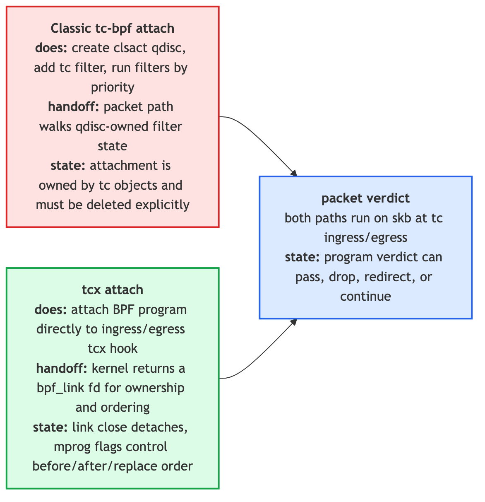
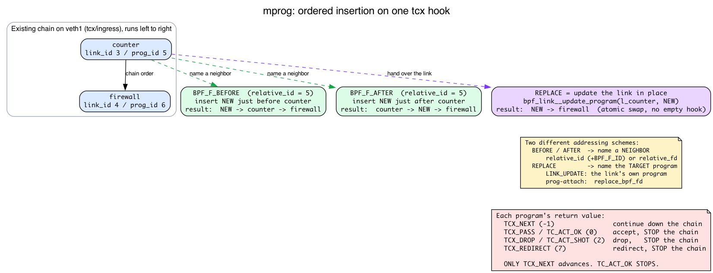
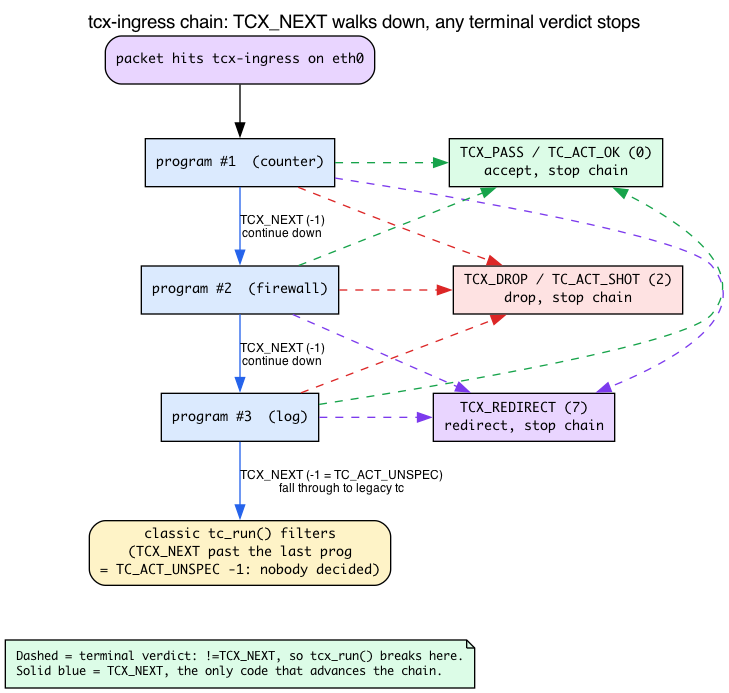

# Day 17 — tcx: link-based multi-program networking

> **Today's mission:** rewrite yesterday's program with tcx, attach two programs to the same hook in a defined order, and feel why this replaces classic tc-bpf for new code. Along the way we'll pin down the one thing every tcx tutorial gets backwards — the *chain-advance* return code — and learn how mprog names the program you want to insert next to. Total time: ~110 minutes.

## What tcx fixes

Yesterday's tc-bpf had three friction points:
1. **Three commands to attach** (qdisc, filter, program) and three to detach.
2. **No `bpf_link` ownership** — if your loader process crashes, the BPF stays attached, and you have to manually clean up.
3. **Multiple programs at one hook** is awkward — you juggle filter priorities by hand.

tcx (Linux 6.6+, commit `e420bed02507`) addresses all three.



One syscall to attach. Returns a `bpf_link` FD. Closing the FD detaches. And ordering between multiple programs uses **mprog**, the same multi-program abstraction that backs tcx and netkit.

### Refresher: what a `bpf_link` is (Day 14, Day 16)

You met `bpf_link` on **Day 14** with XDP: `bpf_program__attach_xdp` returned a `struct bpf_link`, and closing its FD auto-detached the program (`day14.md:166,185,213`). **Day 16** contrasted that with classic tc-bpf, which has *no* FD ownership at all (`day16.md:210,278`). One line to carry forward:

> A `bpf_link` is a kernel object representing **one attachment** and holding **one reference** to the program. The userspace FD *owns* that link — close the FD (or exit the process) and the ref drops, detaching the program. The program itself is unloaded only when its **last** reference (link, pinned fd, or open program fd) goes away.

In v7.1, libbpf names this link type `"tcx"` (`tools/lib/bpf/libbpf.c:153`, `BPF_LINK_TYPE_TCX`), and the per-device chain it plugs into is `struct bpf_mprog_entry __rcu *tcx_ingress;` on the net device (`include/linux/netdevice.h:2196`).

## mprog: ordered chains of BPF programs

Multiple BPF programs can attach to the same hook (one tcx-ingress on `eth0` can have N programs). `mprog` defines deterministic ordering with attach-time flags:



- `BPF_F_BEFORE` — attach before the named program.
- `BPF_F_AFTER` — attach after the named program.
- `BPF_F_REPLACE` — replace a specific program in place.
- `BPF_F_LINK` — interpret the relative target as a *link* ID/fd rather than a program ID/fd.
- `BPF_F_ID` — interpret the relative target as an *ID* rather than an fd (used with `relative_id`).

The chain runs each program in order — but **how a program says "keep going" is the one thing you must get right**, and it is *not* what classic tc-bpf taught you.

### The verdict that advances the chain: `TCX_NEXT`, not `TC_ACT_OK`

Here is the kernel's per-hook chain runner, `tcx_run()` in `net/core/dev.c` (line 4439). Read it slowly — it is short, and every line matters:

```c
/* net/core/dev.c:4439 */
static __always_inline enum tcx_action_base
tcx_run(const struct bpf_mprog_entry *entry, struct sk_buff *skb,
        const bool needs_mac)
{
    const struct bpf_mprog_fp *fp;
    const struct bpf_prog *prog;
    int ret = TCX_NEXT;                 /* :4444 — seed: "no decision yet" */

    if (needs_mac)
        __skb_push(skb, skb->mac_len);
    bpf_mprog_foreach_prog(entry, fp, prog) {   /* :4448 */
        bpf_compute_data_pointers(skb);
        ret = bpf_prog_run(prog, skb);          /* :4450 */
        if (ret != TCX_NEXT)                     /* :4451 */
            break;                               /*  ← ANY other value stops the chain */
    }
    if (needs_mac)
        __skb_pull(skb, skb->mac_len);
    return tcx_action_code(skb, ret);
}
```

Stare at `if (ret != TCX_NEXT) break;`. A program continues the chain **only** by returning `TCX_NEXT`. *Any other return value* — including the familiar `TC_ACT_OK` — terminates the chain right there.

That is the trap. On Day 16 you learned the classic tc-bpf verdicts: `TC_ACT_OK` ("accept, let it proceed"), `TC_ACT_SHOT` ("drop"), `TC_ACT_REDIRECT` ("redirect"). It is *very* tempting to assume `TC_ACT_OK` is how one tcx program lets the next one run. It is not. Look at the numbers, side by side:

```c
/* include/uapi/linux/bpf.h:6530 — the NEW tcx contract */
enum tcx_action_base {
    TCX_NEXT     = -1,
    TCX_PASS     = 0,
    TCX_DROP     = 2,
    TCX_REDIRECT = 7,
};

/* include/uapi/linux/pkt_cls.h:63 — the legacy tc-classic codes */
#define TC_ACT_UNSPEC   (-1)
#define TC_ACT_OK        0
#define TC_ACT_SHOT      2
#define TC_ACT_REDIRECT  7
```

The *terminal* numbers line up on purpose (the uapi comment says tcx codes "must remain compatible with their TC_ACT_* counter-parts"): `TCX_PASS == TC_ACT_OK == 0`, `TCX_DROP == TC_ACT_SHOT == 2`, `TCX_REDIRECT == TC_ACT_REDIRECT == 7`. The genuinely new value is **`TCX_NEXT = -1`**, which has *no* tc-classic verdict equivalent — its numeric twin is `TC_ACT_UNSPEC` ("nobody decided").

So `return TC_ACT_OK;` returns `0`, which equals `TCX_PASS`, which is `!= TCX_NEXT`, so the chain **stops with an accept verdict**. It does the *opposite* of "let the next program run."

### Where `-1` goes after the chain: `tcx_action_code()` and the tc fall-through

What does `tcx_run()` do with that seeded-or-returned `ret`? It funnels it through `tcx_action_code()` (`include/net/tcx.h:145`):

```c
/* include/net/tcx.h:145 */
static inline enum tcx_action_base tcx_action_code(struct sk_buff *skb, int code)
{
    switch (code) {
    case TCX_PASS:
        skb->tc_index = qdisc_skb_cb(skb)->tc_classid;
        fallthrough;
    case TCX_DROP:
    case TCX_REDIRECT:
        return code;            /* a real verdict — pass it straight through */
    case TCX_NEXT:
    default:
        return TCX_NEXT;        /* TCX_NEXT or anything unrecognized -> TCX_NEXT (-1) */
    }
}
```

`TCX_PASS`/`TCX_DROP`/`TCX_REDIRECT` come back as themselves — a final verdict. But `TCX_NEXT` (and any unknown code) maps to `TCX_NEXT == -1`. And `-1` is exactly `TC_ACT_UNSPEC`, which the ingress dispatcher reads as "no tcx program decided — fall through to classic tc":

```c
/* net/core/dev.c:4481 */
sch_ret = tcx_run(entry, skb, true);
if (sch_ret != TC_ACT_UNSPEC)        /* :4482 */
    goto ingress_verdict;            /* a real verdict — act on it */
sch_ret = tc_run(tcx_entry(entry), skb, &drop_reason);   /* :4485 — else legacy tc filters */
```

So if the **last** program in the chain returns `TCX_NEXT`, control falls through to legacy `tc_run()` filters — *not* "accept." `TCX_NEXT` means "I defer," all the way down to the classic tc layer.



### The mental model to keep

A tcx program has two jobs it can do per packet:

- **Defer** — "let the next link decide" — by returning `TCX_NEXT`. Counters, tracers, observability programs that don't make policy return `TCX_NEXT`.
- **Decide** — make the final call and short-circuit the rest of the chain — by returning a terminal verdict: `TCX_PASS`/`TC_ACT_OK` (accept), `TCX_DROP`/`TC_ACT_SHOT` (drop), or `TCX_REDIRECT` (redirect). Firewalls and policy programs return a terminal verdict.

This is composable: a counter, a firewall, a tracer can each be installed independently and their ordering controlled at attach time — as long as the observability links return `TCX_NEXT` so the policy links downstream actually run.

> ### There are no Dumb Questions
>
> **Q: If I close the link FD, does the BPF object get unloaded?**
>
> A: Only if there are no other references. The link is one ref to the program; closing it drops that ref. If userspace still holds a `bpf_program__fd` or the program is pinned in `/sys/fs/bpf`, it stays loaded but unattached.
>
> **Q: Does `tcx` work alongside legacy `tc filter add ... bpf`?**
>
> A: Yes. They share the same hook point; multiple attach mechanisms can coexist. In fact you just saw the coexistence in the source: a tcx chain that ends in `TCX_NEXT` falls through to `tc_run()`'s classic filters. But you generally don't want to mix — pick one for a given system.
>
> **Q: Does mprog also exist for XDP?**
>
> A: There's `xdp_multi`-attach but the abstraction is slightly different (XDP doesn't use mprog the same way). For XDP, multi-program is typically done with a "dispatcher" program in front and `BPF_PROG_RUN` tail calls. We won't cover that today.

## The lab

### Refresher: `__sk_buff` direct packet access and `PERCPU_ARRAY` (Day 14, Day 16)

The firewall below reads packet bytes and the counter uses a per-CPU map. Both are concepts earlier days own — one line each:

- **`struct __sk_buff` + `data`/`data_end`** (Day 16, `day16.md:15-58,83-109`): `__sk_buff` is the typed BPF view of the kernel's `sk_buff`; `data`/`data_end` bound the packet window, and **every** pointer step must be re-bounds-checked before you dereference it — the same discipline as XDP. The terminal verdicts `TC_ACT_OK`/`TC_ACT_SHOT`/`TC_ACT_REDIRECT` carry over from tc-bpf unchanged; only the chain-advance code `TCX_NEXT` is new (above).
- **`BPF_MAP_TYPE_PERCPU_ARRAY`** (Day 14, `day14.md:108,133,142,174-179`): each CPU gets its own value slot, so the in-kernel increment needs **no atomic**; userspace must **sum across all CPUs** (`libbpf_num_possible_cpus()`) to get the true total.

### `tcx.bpf.c`

```c
#include "vmlinux.h"
#include <bpf/bpf_helpers.h>
#include <bpf/bpf_endian.h>
#include <linux/pkt_cls.h>

char LICENSE[] SEC("license") = "GPL";

struct {
    __uint(type, BPF_MAP_TYPE_PERCPU_ARRAY);
    __uint(max_entries, 2);
    __type(key, __u32);
    __type(value, __u64);
} stats SEC(".maps");

static __always_inline void bump(__u32 idx) {
    __u64 *c = bpf_map_lookup_elem(&stats, &idx);
    if (c) (*c)++;
}

SEC("tcx/ingress")
int counter(struct __sk_buff *skb)
{
    bump(0);            /* count all */
    return TCX_NEXT;    /* DEFER: let the next link (firewall) decide */
}

SEC("tcx/ingress")
int firewall(struct __sk_buff *skb)
{
    void *data = (void *)(long)skb->data;
    void *end  = (void *)(long)skb->data_end;
    struct ethhdr *eth = data;
    if (eth + 1 > end) return TCX_NEXT;
    if (eth->h_proto != bpf_htons(ETH_P_IP)) return TCX_NEXT;
    struct iphdr *ip = (void *)(eth + 1);
    if (ip + 1 > end) return TCX_NEXT;
    if (ip->protocol == IPPROTO_UDP) {
        bump(1);
        return TC_ACT_SHOT;   /* DECIDE: drop the UDP datagram, stop the chain */
    }
    return TCX_NEXT;          /* DEFER on everything else */
}
```

Two design points, both consequences of `tcx_run()`:

- **`counter` returns `TCX_NEXT`, not `TC_ACT_OK`.** This is the correction that makes the lab work. If `counter` returned `TC_ACT_OK` (= `0` = `TCX_PASS`), `tcx_run()` would see `ret != TCX_NEXT`, `break` after the first program, and **`firewall` would never run** — `udp_drop` would stay `0` forever. Returning `TCX_NEXT` is what lets the chain advance to `firewall`.
- **`firewall` returns `TCX_NEXT` for traffic it doesn't care about** (non-IP, non-UDP) and the terminal `TC_ACT_SHOT` only for the UDP it actually drops. Since `firewall` is last in the chain, its `TCX_NEXT` falls through to classic `tc` (here: nothing), which accepts the packet — exactly what we want for the ICMP we're letting through.

### Attach via tcx, ordered

```c
#include <bpf/libbpf.h>
#include <bpf/bpf.h>
#include <net/if.h>
#include <stdio.h>
#include <unistd.h>
#include <signal.h>
#include "tcx.skel.h"          /* generated by `bpftool gen skeleton tcx.bpf.o` */

static volatile sig_atomic_t exiting = 0;
static void on_sigint(int sig) { exiting = 1; }

int main(int argc, char **argv) {
    int ifindex = if_nametoindex(argv[1]);
    struct tcx_bpf *skel = tcx_bpf__open_and_load();

    /* counter goes first */
    LIBBPF_OPTS(bpf_tcx_opts, opts1);
    struct bpf_link *l1 = bpf_program__attach_tcx(
        skel->progs.counter, ifindex, &opts1);
    if (!l1) return 1;

    /* firewall goes after counter */
    LIBBPF_OPTS(bpf_tcx_opts, opts2, .flags = BPF_F_AFTER);
    struct bpf_link *l2 = bpf_program__attach_tcx(
        skel->progs.firewall, ifindex, &opts2);
    if (!l2) return 1;

    signal(SIGINT, on_sigint);

    /* PERCPU_ARRAY: sum each key across all CPUs to get the totals */
    int fd = bpf_map__fd(skel->maps.stats);
    int ncpu = libbpf_num_possible_cpus();
    while (!exiting) {
        __u64 total = 0, udp_drop = 0, vals[ncpu];
        __u32 k = 0;                                /* key 0: all packets */
        if (bpf_map_lookup_elem(fd, &k, vals) == 0)
            for (int i = 0; i < ncpu; i++) total += vals[i];
        k = 1;                                      /* key 1: dropped UDP */
        if (bpf_map_lookup_elem(fd, &k, vals) == 0)
            for (int i = 0; i < ncpu; i++) udp_drop += vals[i];
        printf("total: %llu  udp_drop: %llu\n", total, udp_drop);
        sleep(2);
    }

    bpf_link__destroy(l2);  /* detaches; FD-based */
    bpf_link__destroy(l1);
    tcx_bpf__destroy(skel);
}
```

Two programs, both at tcx-ingress. The `counter` runs first; because it returns `TCX_NEXT`, the chain advances and `firewall` runs after. (If `counter` had returned a terminal code such as `TC_ACT_SHOT`, the chain would stop and `firewall` would never see the packet — that's the whole point of the verdict section above.)

### Set up the topology

The lab needs an interface to attach to and real traffic crossing it. Build a `veth` pair with the far end in its own namespace — exactly as on Day 14:

```bash
sudo ip netns add ns1
sudo ip link add veth0 type veth peer name veth1
sudo ip link set veth1 netns ns1
sudo ip addr add 10.0.0.1/24 dev veth0
sudo ip link set veth0 up
sudo ip netns exec ns1 ip addr add 10.0.0.2/24 dev veth1
sudo ip netns exec ns1 ip link set veth1 up
```

Why the namespace? If both ends shared the root namespace, `10.0.0.2` would be a *local* address and the kernel would short-circuit `ping 10.0.0.2` through `lo` — the packet would never cross the wire into `veth1`'s ingress, and neither `counter` nor `firewall` would ever run. Putting `veth1` in `ns1` forces traffic across the link. We attach inside `ns1`; pinging from the host sends packets out `veth0`, into `veth1`'s ingress where the tcx chain fires.

### Inspect the chain

The attachments live on `veth1`, which is inside `ns1`, so query `bpftool` in that namespace:

```bash
sudo ip netns exec ns1 bpftool net show
```

You'll see:
```
xdp:
tc:
   veth1(3) tcx/ingress counter prog_id 5 link_id 3
   veth1(3) tcx/ingress firewall prog_id 6 link_id 4
```

Note the `prog_id` and `link_id` columns — these are the **mprog IDs**. A `link_id` is the handle you reach for when you want to *replace* a program (Break 4 updates the link); a `prog_id`/`link_id` is what you pass as `relative_id` to position a *new* program `BEFORE`/`AFTER` an existing one. Keep this output in mind.

### Run

```bash
make
sudo ip netns exec ns1 ./tcx_loader veth1 &
# From the host (root namespace):
ping -c 3 10.0.0.2                     # works (counter defers, firewall passes ICMP)
echo ping | nc -u -w1 10.0.0.2 9999    # blocked (firewall drops the UDP datagram)
```

The loader prints the summed per-CPU counters every 2 seconds. After the `ping` and the single UDP send:
```
total: 4  udp_drop: 1
```

The 3 ICMP packets arriving on `veth1`'s ingress plus the 1 UDP datagram make `total: 4`; the firewall drops that one UDP datagram, so `udp_drop: 1`. (The dropped datagram gets no reply, so there is nothing else to count.) This `total: 4 udp_drop: 1` is exactly what proves the chain advanced past `counter`: if `counter` had ended the chain, `firewall` could never have incremented `udp_drop`.

The loader runs backgrounded under `sudo`, so Ctrl-C (delivered to the foreground process group) won't reach it. Signal it directly:

```bash
sudo pkill -INT tcx_loader                  # closing its bpf_link FDs auto-detaches both programs
sudo ip netns exec ns1 bpftool net show     # the tcx entries on veth1 are now gone
```

Then tear down the topology:

```bash
sudo ip link del veth0    # deletes the pair (veth1 goes with it)
sudo ip netns del ns1     # remove the namespace
```

---

## What to break, in order

### Break 1 — Forget `BPF_F_AFTER`

Both programs use default flags. With no `BPF_F_BEFORE`/`BPF_F_AFTER` and no relative target, mprog defaults to appending after existing programs (`bpf_mprog_attach` sets `idx = bpf_mprog_total(entry)` and `flags = BPF_F_AFTER`, `kernel/bpf/mprog.c`). So the order ends up `counter → firewall` here by default — but don't rely on it implicitly; pass `BPF_F_BEFORE`/`BPF_F_AFTER` to make ordering explicit. Inspect with `bpftool net show` to verify.

### Break 2 — Pin the link

```c
bpf_link__pin(l1, "/sys/fs/bpf/counter_link");
```

This is the **bpffs pinning** you met on Day 15 (sharing/keeping BPF objects alive across process lifetime, `day15.md:193,197,234`) and Day 03 (the `/sys/fs/bpf` pin/rm mechanics, `day03.md:373`). One line to carry forward:

> Pinning creates a bpffs reference that keeps the link — and therefore the attachment — alive after the loader process exits; removing the pin drops that reference and detaches.

Now even if your loader exits, the link persists (the bpffs pin holds a reference). Useful for daemons that load BPF then exit. Watch it survive: with the loader still running, the counter shows up attached and as a pinned link object —

```bash
sudo ip netns exec ns1 bpftool net show              # counter listed on veth1
sudo bpftool link show pinned /sys/fs/bpf/counter_link
```

Now stop the loader (`sudo pkill -INT tcx_loader`). The *unpinned* `firewall` link detaches, but the pinned `counter` link survives — re-run both commands and the counter is still attached and still pinned, even though no process holds it. (`bpffs` must be mounted at `/sys/fs/bpf`, which is why these need `sudo`.) Detach it for real by removing the pin:

```bash
sudo rm /sys/fs/bpf/counter_link
sudo ip netns exec ns1 bpftool net show              # counter now gone — hook empty
```

That before/after contrast is the whole point of pinning.

### Break 3 — Mix XDP and tcx

Attach an XDP counter and a tcx counter to the same interface. Both run, in order: XDP first (no skb), tcx after (with skb). Useful pattern: XDP for raw drops, tcx for skb-aware logic.

### Break 4 — Replace a link

To swap the program behind an existing tcx `bpf_link`, you **update the link in place** — you *do* hand over the link handle:

```c
/* l1 is the bpf_link returned by bpf_program__attach_tcx for `counter`.
   Swap its program for new_prog atomically, with no empty-hook window. */
int err = bpf_link__update_program(l1, skel->progs.new_prog);   /* LINK_UPDATE */
```

This issues `BPF_LINK_UPDATE`. Inside the kernel, `tcx_link_update()` builds the mprog call for you — it does **not** ask you to name a neighbor. It targets the link's *current* program explicitly (`kernel/bpf/tcx.c:232`):

```c
/* kernel/bpf/tcx.c:232 — inside tcx_link_update() */
ret = bpf_mprog_attach(entry, &entry_new, nprog, link, oprog,
                       BPF_F_REPLACE | BPF_F_ID,
                       link->prog->aux->id, 0);   /* old prog named by the link itself */
if (!ret)
    oprog = xchg(&link->prog, nprog);             /* :237 — atomic swap */
```

The kernel synthesizes `BPF_F_REPLACE | BPF_F_ID` against `link->prog->aux->id` internally and swaps via `bpf_mprog_replace` — there is no window where the hook is empty. The v7.1 selftest proves this is the only way: `tc_links.c:718-759` asserts that a *fresh* attach carrying `BPF_F_REPLACE` **fails** (`link_attach_should_fail`), then performs the replace via `bpf_link__update_program()` (`tc_links.c:759`).

Why can't a fresh `bpf_program__attach_tcx` replace a link's program? Look at `struct bpf_tcx_opts` (`tools/lib/bpf/libbpf.h:900`) — its *entire* surface:

```c
struct bpf_tcx_opts {
    size_t sz;
    __u32  flags;
    __u32  relative_fd;
    __u32  relative_id;
    __u64  expected_revision;
};
#define bpf_tcx_opts__last_field expected_revision
```

There is **no replace-target field**. A fresh attach issues `LINK_CREATE`, whose uapi only carries `relative_fd` / `relative_id` / `expected_revision` (`include/uapi/linux/bpf.h:1836-1839`) — there is nowhere to name the program being replaced. On the link-create path the kernel passes `prog_old = NULL` into `bpf_mprog_attach` (`kernel/bpf/mprog.c:225`), so `bpf_mprog_pos_exact()` looks up a `NULL` program, returns `-ENOENT`, and the attach fails. That absent field is precisely why link replacement must go through `bpf_link__update_program`.

**The two roles, untangled.** `relative_id` / `relative_fd` (with `BPF_F_ID` / `BPF_F_LINK`) name a **neighbor** — and they are consumed **only** for `BPF_F_BEFORE` / `BPF_F_AFTER`. `BPF_F_REPLACE` names the **target program**, not via the relative tuple at all:

- In the non-link prog-attach API, the target is `attr->replace_bpf_fd` (`kernel/bpf/tcx.c:25-26`).
- In `LINK_UPDATE`, the target is the link's own current program (`kernel/bpf/tcx.c:232`, shown above).

The kernel resolves a relative neighbor through `bpf_mprog_tuple_relative()` (`kernel/bpf/mprog.c:53`):

```c
/* kernel/bpf/mprog.c */
bool id = flags & BPF_F_ID;          /* BPF_F_ID set? -> the u32 is an ID, not an fd */
...
if (!id && !id_or_fd)                 /* neither flag nor value -> "first/last position" */
    return 0;
```

So the single `u32` is interpreted **as a program/link ID** when `BPF_F_ID` is set (use `relative_id`), or **as a file descriptor** when it isn't (use `relative_fd`) — but this addressing applies to the `BEFORE`/`AFTER` neighbor, never to the replace target.

**What the flags do at attach time** (`kernel/bpf/mprog.c`, inside `bpf_mprog_attach`; line numbers are the **call sites** in `bpf_mprog_attach`, with each helper's **definition** in parentheses):

| Flag | Position helper | Effect |
|---|---|---|
| `BPF_F_BEFORE` | `bpf_mprog_pos_before` (call `:261`, def `:193`) | insert before the named neighbor |
| `BPF_F_AFTER` | `bpf_mprog_pos_after` (call `:269`, def `:209`) | insert after the named neighbor |
| `BPF_F_REPLACE` | `bpf_mprog_pos_exact` (call `:250`, def `:178`) | swap out the *exact* named program |
| *(none, no target)* | default | `idx = bpf_mprog_total(entry); flags = BPF_F_AFTER;` (`:281`) — append at the end |

That last row is exactly the default Break 1 relies on.

**`expected_revision`: optimistic concurrency.** Each mprog entry carries a `revision` counter. If you pass a non-zero `expected_revision` that doesn't match the live one, the attach fails:

```c
/* kernel/bpf/mprog.c:240 */
if (revision && revision != bpf_mprog_revision(entry))
    return -ESTALE;
```

This lets a chain manager notice that *someone else changed the chain* since it last looked, instead of blindly clobbering it. You can leave it `0` to opt out (as our lab does); pass the value you read to get a compare-and-swap. `expected_revision` rides along on a fresh `LINK_CREATE` attach — it is the one optimistic-concurrency knob `bpf_tcx_opts` exposes.

So Break 4 splits cleanly in two: to **insert** a program next to a neighbor you use `BPF_F_BEFORE`/`BPF_F_AFTER` with `relative_id`/`relative_fd`; to **replace** the program behind a link you call `bpf_link__update_program(link, new_prog)` and let the kernel swap `link->prog` atomically — no window where the hook is empty.

---

## What to read in the kernel

- **`kernel/bpf/tcx.c`** — the whole file is ~350 lines (346 in v7.1). Read it.
- **`kernel/bpf/mprog.c`** — the multi-program ordering machinery. Used by tcx, netkit, and others. Read `bpf_mprog_attach` (`:225`) and `bpf_mprog_tuple_relative` (`:53`) to see the BEFORE/AFTER/REPLACE and ID-vs-fd logic from Break 4.
- **`net/core/dev.c`** — `tcx_run` (`:4439`) and `sch_handle_ingress` (`:4459`). This is where the `TCX_NEXT`-vs-terminal split and the fall-through to `tc_run()` actually live.
- **`tools/lib/bpf/libbpf.c`** — search `bpf_program__attach_tcx`. The userspace wrapper.
- **`tools/testing/selftests/bpf/prog_tests/tc_opts.c`** — extensive tcx tests.

---

## Bullet Points

- **tcx** is the modern attach for tc-position BPF programs. Same hook position as tc-bpf classic, better lifecycle.
- Returns a `bpf_link` FD; closing it detaches (Day 14/16 ownership model). Pin into bpffs (Day 15/03) to survive loader exit.
- **The chain advances only on `TCX_NEXT` (-1).** `tcx_run()` does `if (ret != TCX_NEXT) break;` — any other value, *including `TC_ACT_OK` (0)*, terminates the chain. Observability programs return `TCX_NEXT` to defer; policy programs return a terminal verdict (`TCX_PASS`/`TC_ACT_OK`=0, `TCX_DROP`/`TC_ACT_SHOT`=2, `TCX_REDIRECT`=7) to decide and stop.
- A trailing `TCX_NEXT` (= `TC_ACT_UNSPEC` = -1) falls through to classic `tc_run()` filters, not "accept."
- **mprog** orders multiple programs via attach-time flags: `BPF_F_BEFORE`/`BPF_F_AFTER` position a new program relative to a **neighbor** named by `relative_id` (+`BPF_F_ID`) or `relative_fd`. `BPF_F_REPLACE` is different — it names the *target* program directly (via `replace_bpf_fd` in prog-attach, or the link itself in `LINK_UPDATE`/`bpf_link__update_program`), not via the relative tuple. `expected_revision` is an `-ESTALE`-guarded compare-and-swap. Default with no target: append (`BPF_F_AFTER`).
- `BPF_MAP_TYPE_PERCPU_ARRAY` (Day 14): per-CPU slots, no atomic in kernel, sum across CPUs in userspace.
- No `tc qdisc add clsact` ceremony — kernel installs the hook implicitly.
- Inspect with `bpftool net show` (it prints the `prog_id`/`link_id` you feed to mprog).
- For new code, **always tcx, never classic tc-bpf**.

---

## Check question

You attach three programs to tcx-ingress on `eth0`, in order: `count`, `firewall`, `log`. You want every packet counted and logged, with `firewall` dropping UDP in between. What must `count` return so that `firewall` and `log` run at all — and what happens to a UDP packet versus a TCP packet as it walks the chain?

<details>
<summary>Click to reveal answer</summary>

**Answer:** `count` must return **`TCX_NEXT`** (-1). `tcx_run()` continues the chain only while each program returns `TCX_NEXT`; if `count` returned `TC_ACT_OK` (0 = `TCX_PASS`), the runner's `if (ret != TCX_NEXT) break;` would fire and the chain would stop after `count` — `firewall` and `log` would never run. This is the opposite of the classic tc-bpf intuition where `TC_ACT_OK` means "proceed."

For a **TCP** packet: `count` returns `TCX_NEXT` → `firewall` sees TCP, returns `TCX_NEXT` → `log` runs, returns `TCX_NEXT` → chain falls through to classic `tc` (and is accepted). All three programs ran.

For a **UDP** packet: `count` returns `TCX_NEXT` → `firewall` returns the terminal `TC_ACT_SHOT` (2 = `TCX_DROP`), which is `!= TCX_NEXT`, so the chain **stops there**. `log` never runs for that packet, and the packet is dropped.

Lesson, corrected for tcx: order observability **before** policy, and make observability programs return `TCX_NEXT` (defer) — only the program that makes the final decision returns a terminal verdict, and that verdict short-circuits everything after it. If you put `log` *after* `firewall`, dropped UDP is never logged.

</details>

---

## Tomorrow

Day 18: AF_XDP — bypass the kernel network stack entirely. Get raw packets to a userspace ring at 30+ Mpps per core.
