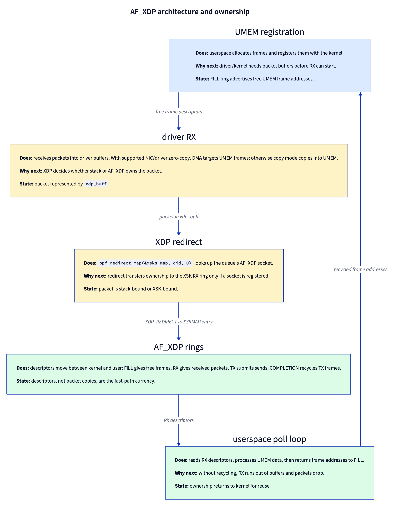
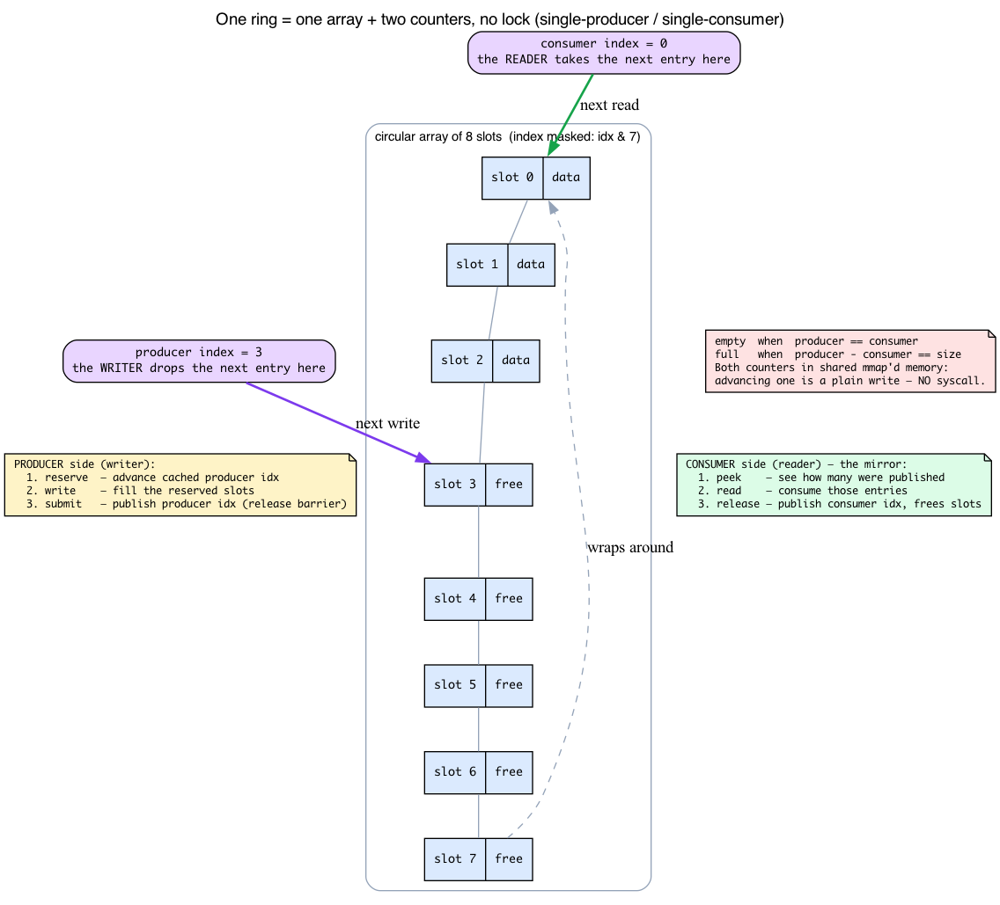
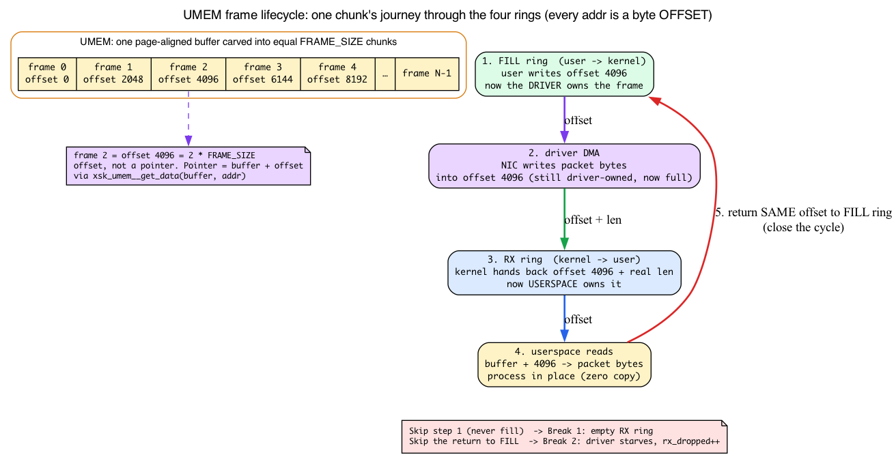
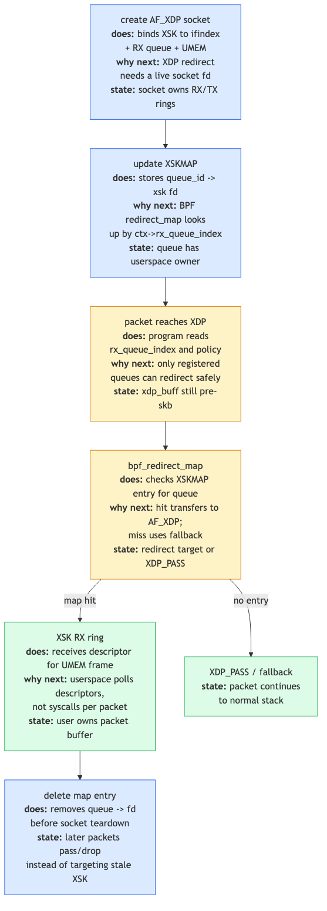
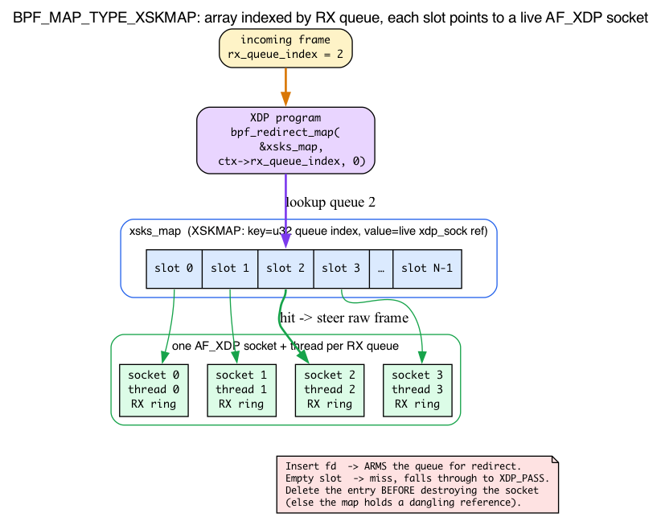
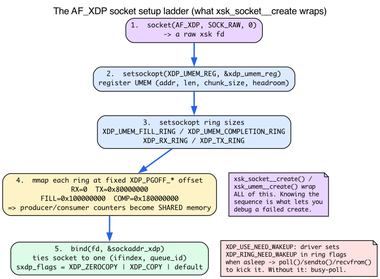

# Day 18 — AF_XDP: packets to userspace at line rate

> **Today's mission:** redirect raw packets from XDP to a userspace ring at line rate without copying. Build a tiny zero-copy packet receiver — and, on the way, finally learn the one mechanism the whole thing turns on: the lock-free shared ring. Total time: ~120 minutes. This builds directly on the XDP redirect machinery from Days 14–17 — if `bpf_redirect_map`, `ctx->rx_queue_index`, and the XDP return-code model aren't familiar, revisit Day 14 first.

## Why bypass the stack

The Linux network stack is general-purpose. For most workloads that's fine — sockets, retransmits, congestion control, all done for you. But for packet-processing apps (DPI, custom load balancers, network testing, telemetry pipelines), the stack adds overhead you don't want: skb allocation, protocol parsing you'll redo anyway, syscalls per packet.

**AF_XDP** is the kernel's answer to DPDK: packet receive directly into userspace-managed rings, with no syscalls in the steady-state receive loop (with the `XDP_USE_NEED_WAKEUP` flag the driver may ask you to `poll()`/`recvfrom()` to wake it — see below). On NICs and drivers with zero-copy support, packets DMA directly into UMEM; otherwise AF_XDP still works in copy mode with lower throughput.



The trick: userspace pre-allocates a memory region (UMEM) and registers it with the kernel. In zero-copy mode, the NIC driver DMAs incoming packets directly into that memory. In copy mode, the kernel copies packet data into UMEM but keeps the same ring and descriptor model. An XDP program redirects to an AF_XDP socket bound to that UMEM, and userspace polls descriptors pointing into UMEM.

Throughput on supported zero-copy NICs can reach 30+ Mpps per core. A veth lab is still useful for learning the lifecycle, but it demonstrates functional/copy-mode behavior rather than NIC DMA zero-copy performance.

Today's lab leans on four ideas the previous chapters never taught. Rather than hand you libxdp wrappers and hope, we'll build each one up before we use it:

1. **What a lock-free single-producer/single-consumer ring actually is** — the producer index, the consumer index, and the reserve/submit/peek/release dance. This is *the* abstraction; everything else is plumbing around it.
2. **UMEM** — the chunked frame pool: what a descriptor address really means (spoiler: it's an offset, not a pointer) and who owns each frame at each instant.
3. **`BPF_MAP_TYPE_XSKMAP`** — a map whose *values are live sockets*, the redirect target.
4. **The AF_XDP socket itself** — the real `socket()`/`setsockopt()`/`bind()`/`mmap()` sequence that libxdp wraps.

We'll teach each *as we hit the part of the lab that depends on it.* By the end you'll be able to read `net/xdp/xsk_queue.h` and know exactly what every barrier is fighting against.

## The ring: one array, two counters, no lock

Stop. Before any of the four rings makes sense, you have to know what *a* ring is — because the chapter keeps saying "user and kernel both advance their pointers, no syscalls needed," and that sentence is doing enormous work.

**The intuition.** A ring is a fixed-size array plus two 32-bit counters:

- a **producer index** — where the *writer* will drop the next entry;
- a **consumer index** — where the *reader* will take the next entry.

The array is treated as circular: you mask the index down to the array size to get a slot. The ring is **empty when `producer == consumer`** and **full when `producer - consumer == size`**. That's the entire state. No lock, no list, no allocation — just two counters chasing each other around a circular array.

The magic property is **single-producer, single-consumer**: each ring has *exactly one* writer and *exactly one* reader. When there is only one of each, and they each only ever *advance* their own counter, you don't need a lock — you need a couple of memory barriers (more on that in a moment). And crucially, the two sides sit on **opposite sides of the user/kernel boundary**. One side is your program; the other side is the kernel. Both counters live in memory that *both* sides have mapped, so advancing a counter is just a memory write — no syscall.

That last sentence is the whole reason AF_XDP can do millions of packets per second. In the steady state, receiving a packet is: read a counter, read a descriptor, write a counter. No `read()`, no context switch, no copy. The syscall is amortised away.



### The two-step producer protocol, and its mirror

You never write a slot and bump the producer index in one motion, because the reader could observe the new index *before* your data lands. Instead both sides use a two-step protocol.

**Producer side (the writer):**

1. **reserve** N slots — advance a *local cached* copy of the producer index, reserving room. Nothing is published yet.
2. **write** the N entries into those slots.
3. **submit** — publish the real producer index *with a release barrier*, so the other side sees the data only after it has been written.

**Consumer side (the reader) — the mirror:**

1. **peek** N available entries — see how many the producer has published.
2. **read** them.
3. **release** — publish the consumer index, telling the producer those slots are free again.

In libxdp these are exactly `xsk_ring_prod__reserve` / `__submit` on the producer side and `xsk_ring_cons__peek` / `__release` on the consumer side — names you'll see all over the lab. When the code does `reserve → fill_addr → submit`, that's the producer protocol; when it does `peek → rx_desc → release`, that's the consumer protocol. They are not arbitrary libxdp ceremony; they are the ring contract.

### What this looks like in v7.1

The kernel's ring header is `net/xdp/xsk_queue.h` — 508 lines total, which is why this chapter calls it "tight, copy-this-pattern" code. The shared state is a `struct xdp_ring`:

```c
/* net/xdp/xsk_queue.h:16 */
struct xdp_ring {
	u32 producer ____cacheline_aligned_in_smp;   /* line 17 */
	/* Hinder the adjacent cache prefetcher to prefetch the consumer
	 * pointer if the producer pointer is touched and vice versa.
	 */
	u32 pad1 ____cacheline_aligned_in_smp;
	u32 consumer ____cacheline_aligned_in_smp;    /* line 22 */
	u32 pad2 ____cacheline_aligned_in_smp;
	u32 flags;
	u32 pad3 ____cacheline_aligned_in_smp;
};
```

There they are: a `producer` counter and a `consumer` counter, nothing else. Notice `____cacheline_aligned_in_smp` on each, and read the comment: the producer and consumer are deliberately placed on **separate cache lines** so the two sides don't ping-pong a shared line. (The CPU moves memory in 64-byte lines, so if the writer's counter and the reader's counter shared a line, every update on one side would invalidate the other side's cached copy. The padding stops even the *adjacent-line prefetcher* from cross-touching them. The companion **linux-net** book, Day 1, covers cache lines in full.)

Two flavors of ring share that header. The RX and TX rings carry full descriptors; the FILL and COMPLETION rings carry bare 64-bit addresses:

```c
/* net/xdp/xsk_queue.h:29 — RX and TX: descriptor rings */
struct xdp_rxtx_ring {
	struct xdp_ring ptrs;
	struct xdp_desc desc[] ____cacheline_aligned_in_smp;
};

/* net/xdp/xsk_queue.h:35 — FILL and COMPLETION: bare u64 addresses */
struct xdp_umem_ring {
	struct xdp_ring ptrs;
	u64 desc[] ____cacheline_aligned_in_smp;
};
```

The kernel's own bookkeeping per ring is `struct xsk_queue`, and it keeps **cached copies of the peer's index** so it doesn't have to re-read the other side's counter on every single entry:

```c
/* net/xdp/xsk_queue.h:40 */
struct xsk_queue {
	u32 ring_mask;
	u32 nentries;
	u32 cached_prod;   /* line 43 */
	u32 cached_cons;   /* line 44 */
	struct xdp_ring *ring;
	/* ... */
};
```

`cached_prod`/`cached_cons` are the same trick libxdp uses on the userspace side: peek once, process a whole batch, then publish once. Re-reading the peer counter per entry would bounce a cache line across the user/kernel boundary every iteration.

### The barriers are why you use the wrappers

The header carries a long comment (lines 62–84) explaining the exact memory ordering, drawn straight from `Documentation/core-api/circular-buffers.rst`:

```
 * producer                         consumer
 *
 * if (LOAD ->consumer) {  (A)      LOAD.acq ->producer  (C)
 *    STORE $data                   LOAD $data
 *    STORE.rel ->producer (B)      STORE.rel ->consumer (D)
 * }
```

Read it as: the producer must **write the data before publishing the new producer index** (B), and the consumer must **read the index before the data** (C). Get this wrong and the consumer loads stale or garbage frames — it sees the index move and races ahead of the bytes. This is precisely why you call libxdp's `reserve`/`submit`/`peek`/`release` wrappers instead of poking the counters yourself: the wrappers contain the right acquire/release barriers. Hand-rolling the index arithmetic is the classic way to ship a receiver that works on x86 (strongly ordered) and corrupts packets on arm64 (weakly ordered).

## The ring quartet

Now the four rings make sense, because each is just *one* of these single-producer/single-consumer rings, and the only question is *which side is the producer*:

- **FILL ring** (user → kernel): userspace produces, kernel consumes. "Here are free buffers in UMEM you can DMA into."
- **RX ring** (kernel → user): kernel produces, userspace consumes. "Here are packets I just received."
- **TX ring** (user → kernel): userspace produces, kernel consumes. "Send these for me."
- **COMPLETION ring** (kernel → user): kernel produces, userspace consumes. "TX done; recycle these buffers."

That's the directionality the kernel comment spelled out: *for the RX and completion ring, the kernel is the producer and userspace is the consumer; for the TX and fill rings, the kernel is the consumer and userspace is the producer.* User and kernel both advance their own counters; no syscalls needed in the steady state. (You do call `sendto()` to kick TX after enqueueing, but the kernel handles batching.)

## UMEM: the frame pool the rings point into

The rings carry *addresses*. Addresses of what? Of frames in **UMEM** — and UMEM has more structure than "a memory region." You can't understand Break 1 or Break 2 without it, because both are about frame ownership.

**The intuition.** UMEM is one big, page-aligned userspace buffer that you allocate once (the lab uses `posix_memalign(&buffer, 4096, …)`) and **register with the kernel once** via the `XDP_UMEM_REG` setsockopt. After registration, the NIC driver is allowed to DMA packet bytes *directly into your pages*. That's the "zero copy": as Day 14 recapped, the NIC's DMA engine normally writes incoming frames straight into driver-owned RX-ring pages — here the DMA target is *your registered UMEM* instead of kernel skb pages, so the bytes never get copied on their way to your program. (The companion **linux-net** book, Day 1, derives the DMA/RX-ring machinery in full.)

UMEM is carved into **equal-size chunks**. One chunk is one **frame**. In the lab, `FRAME_SIZE = 2048` and there are `UMEM_NUM_FRAMES = 4096` of them. The registration struct says exactly this:

```c
/* include/uapi/linux/if_xdp.h:84 */
struct xdp_umem_reg {
	__u64 addr;             /* start of the UMEM region */
	__u64 len;              /* total length */
	__u32 chunk_size;       /* size of one frame, e.g. 2048 */
	__u32 headroom;         /* bytes reserved before each packet */
	__u32 flags;
	__u32 tx_metadata_len;
};
```

`headroom` reserves bytes *before* the packet in each chunk for your own metadata or encapsulation (the same idea as the kernel's `NET_SKB_PAD` skb headroom — see the companion **linux-net** book, Day 1 — but here it's under your control). `chunk_size` bounds the largest single-buffer packet; bigger packets chain multiple frames via a continuation bit (below).

### A descriptor address is a byte offset, not a pointer

This is the part that trips everyone. When the lab pre-fills the FILL ring it writes `i * FRAME_SIZE`, and when it reads an RX descriptor it does `xsk_umem__get_data(buffer, addr)`. Why the multiply, why the helper?

Because **a descriptor address is a `u64` byte *offset* into UMEM, not a memory pointer.** Frame *i* lives at offset `i * FRAME_SIZE`. To turn an offset back into a usable pointer you add it to the base of your UMEM mapping — which is exactly what `xsk_umem__get_data(buffer, addr)` does (`buffer + addr`). The rings can carry plain `u64`s precisely because they're offsets, not addresses; that's also why a FILL/COMPLETION entry is a bare `__u64`:

```c
/* include/uapi/linux/if_xdp.h:166 */
struct xdp_desc {
	__u64 addr;
	__u32 len;
	__u32 options;
};

/* UMEM descriptor is __u64  (the comment right below xdp_desc) */
```

The RX/TX rings carry the full `xdp_desc` (offset **+** the real packet `len` the driver fills in); the FILL/COMPLETION rings carry just the `__u64` offset. There's one wrinkle worth a sentence: in *unaligned* mode the high bits of `addr` pack a second offset, which is why there's a shift constant — `XSK_UNALIGNED_BUF_OFFSET_SHIFT 48` and `XSK_UNALIGNED_BUF_ADDR_MASK` (`if_xdp.h:116`). Mention it, don't dwell; the lab uses aligned mode.

Multi-buffer packets (a packet larger than `chunk_size`) chain frames using a continuation bit in `desc->options`:

```c
/* include/uapi/linux/if_xdp.h:179 */
#define XDP_PKT_CONTD (1 << 0)
```

### Frame ownership is a cycle — and the breaks are about breaking it

Here is the mental model that makes Break 1 and Break 2 obvious. **Every frame has exactly one owner at every instant, and ownership moves in a cycle through the four rings:**

1. Userspace puts a free frame's **offset on the FILL ring** → now the *driver* owns it.
2. The driver **DMAs a packet into it** → still driver-owned, now full.
3. The driver hands it to userspace on the **RX ring** (with the real packet length) → now *userspace* owns it.
4. Userspace **processes the bytes**, then returns the **same offset to the FILL ring** → back to step 1.

Skip step 1 (never fill) and the driver never had any frames → **Break 1**: empty RX ring.
Skip step 4 (never recycle) and the driver runs out of frames → **Break 2**: starvation drops.

That's the whole lifecycle. When the driver has no frame to DMA into, the kernel counts a drop — `xs->rx_dropped++` (`net/xdp/xsk.c:313` and `:330`) and `xs->rx_queue_full++` (`:199`, `:334`) — which is the kernel side of the two breaks you're about to run.



One more thing that surprises people: **the four rings are not inside UMEM.** UMEM holds packet *bytes*; the rings hold *descriptors* (offsets into UMEM). The rings are separate kernel-allocated buffers that you `mmap` into your address space at fixed page offsets — which is why the UAPI defines distinct offsets for each:

```c
/* include/uapi/linux/if_xdp.h:110 */
#define XDP_PGOFF_RX_RING		  0
#define XDP_PGOFF_TX_RING		 0x80000000
#define XDP_UMEM_PGOFF_FILL_RING	0x100000000ULL
#define XDP_UMEM_PGOFF_COMPLETION_RING	0x180000000ULL
```

Four different `mmap` offsets = four separately mapped rings, all distinct from the UMEM region itself.

## XDP and AF_XDP cooperate



The XDP program decides per packet: pass to stack, drop, or **redirect to an AF_XDP socket**. But how does an XDP program — running in the kernel before any skb exists — *name* a userspace socket? Through a map type you haven't met yet.

### `BPF_MAP_TYPE_XSKMAP` — a map whose values are sockets

On Days 14–15 your map values were plain data: a `PERCPU_ARRAY` of counters, an `LPM_TRIE` of prefixes. An **XSKMAP** is different in kind: its value slot holds a **reference to a live AF_XDP socket.** You write a socket's *file descriptor* into the map from userspace, and the kernel stores a refcounted pointer to the underlying `xdp_sock`. Inserting that fd is what **arms** a queue for redirect.

The key is always a 4-byte queue index — the kernel enforces this at map-creation time:

```c
/* net/xdp/xskmap.c:64 */
static struct bpf_map *xsk_map_alloc(union bpf_attr *attr)
{
	/* :70 */
	if (attr->max_entries == 0 || attr->key_size != 4 ||
	    attr->value_size != 4 || ...)
		return ERR_PTR(-EINVAL);
	/* :76 — an array of socket slots, sized by max_entries */
	size = struct_size(m, xsk_map, attr->max_entries);
```

So an XSKMAP is an array of socket slots indexed by `u32` queue index, `max_entries` of them. The redirect decision is a single helper:

```c
SEC("xdp")
int xdp_redirect_to_xsk(struct xdp_md *ctx) {
    return bpf_redirect_map(&xsks_map, ctx->rx_queue_index, 0);
}
```

`bpf_redirect_map(&xsks_map, queue_index, flags)` looks up the socket bound at that queue and, if one is present, steers the **raw frame to that socket's RX ring before any skb is built.** If the slot is empty, the program falls through to `XDP_PASS` — which is exactly the lookup-then-redirect guard in `xsk.bpf.c` below. The kernel path a hit drives into is `__xsk_map_redirect(struct xdp_sock *xs, struct xdp_buff *xdp)` (`net/xdp/xsk.c:472`). Like other redirect maps, XSK redirects are **batched and flushed at the end of the NAPI poll** rather than one-at-a-time: see the `lh_xsk` flush list and `__xsk_map_flush(lh_xsk)` in `net/core/filter.c` (lines 4360 and 4368).

Why `ctx->rx_queue_index` as the key? Because it's the natural one: RSS/RPS already spreads incoming packets across the NIC's RX queues, so keying the map by queue index lands each queue's packets in its own socket (and its own thread). One socket per RX queue is the canonical pattern, and it's exactly what Break 3 scales out.

**Lifecycle ordering matters, and teardown depends on it.** You must insert the fd *after* the socket is created and bound, and `bpf_map_delete_elem` the entry *before* destroying the socket — otherwise the map holds a dangling reference to a freed socket. That's why the lab deletes the map entry before `xsk_socket__delete`. (Contrast with earlier maps: `PERCPU_ARRAY` and `LPM_TRIE` store plain bytes; XSKMAP — like `PROG_ARRAY` and `DEVMAP` — stores *kernel-object references* and exists specifically to be a redirect target.)



> ### There are no Dumb Questions
>
> **Q: Is this DPDK?**
>
> A: Conceptually similar (kernel-bypass, zero-copy, polled rings) but cooperative with the kernel rather than commandeering the NIC. AF_XDP keeps the driver in the kernel; DPDK takes the device entirely. AF_XDP is easier to install/maintain and supports per-queue split (some queues to AF_XDP, others to the kernel stack).
>
> **Q: Can I run AF_XDP on any NIC?**
>
> A: There's *zero-copy* mode for NICs with explicit driver support (Mellanox mlx5, Intel ice/i40e/ixgbe/igb/igc, Netronome nfp, stmmac, and a growing list). For unsupported NICs — including common Realtek r8169 desktop parts, which have no AF_XDP zero-copy path — "copy mode" works (one copy per packet) at lower throughput.
>
> **Q: This sounds complicated. Is there a tool I can use?**
>
> A: `xdp-tools` from the XDP project provides example senders/receivers. `libxdp` (a sister to libbpf) wraps the AF_XDP plumbing. We'll use libxdp's helpers in the lab.

## What libxdp is actually wrapping: the AF_XDP socket

The lab calls `xsk_umem__create` and `xsk_socket__create` and then admits "libxdp helps but doesn't hide everything." When a create fails — or when you go read `xsk.c` as instructed — those wrappers are a black box unless you've seen the raw API once. So here it is.

**AF_XDP is a real socket address family.** You get one with `socket(AF_XDP, SOCK_RAW, 0)`. Everything `xsk_socket__create` does is a wrapper around this plus the steps below; knowing the sequence is what lets you debug a failed create.

1. **`socket(AF_XDP, SOCK_RAW, 0)`** → a raw xsk fd.
2. **`setsockopt(XDP_UMEM_REG, …)`** registers your UMEM (the `xdp_umem_reg` struct above), then **`XDP_UMEM_FILL_RING` / `XDP_UMEM_COMPLETION_RING`** size its two rings, and **`XDP_RX_RING` / `XDP_TX_RING`** size the socket's own rings. The optnames are fixed integers:

   ```c
   /* include/uapi/linux/if_xdp.h:75 */
   #define XDP_RX_RING			2
   #define XDP_TX_RING			3
   #define XDP_UMEM_REG			4
   #define XDP_UMEM_FILL_RING		5
   #define XDP_UMEM_COMPLETION_RING	6
   #define XDP_STATISTICS			7
   ```

3. **`mmap` each ring** into your address space at the fixed `XDP_PGOFF_*` offsets you saw above. *This* is the step that makes the producer/consumer counters shared memory — after the mmap, both you and the kernel see the same `producer`/`consumer` words, which is the whole no-syscall premise.
4. **`bind(fd, sockaddr_xdp, …)`** ties the socket to one `(ifindex, queue_id)`:

   ```c
   /* include/uapi/linux/if_xdp.h:48 */
   struct sockaddr_xdp {
       __u16 sxdp_family;
       __u16 sxdp_flags;
       __u32 sxdp_ifindex;
       __u32 sxdp_queue_id;
       __u32 sxdp_shared_umem_fd;
   };
   ```

   `sxdp_flags` selects the mode: `XDP_ZEROCOPY` (`1<<2`, *require* driver DMA into UMEM — fails if the driver can't), `XDP_COPY` (`1<<1`, force the universal one-copy path), or default (let the kernel pick). `sxdp_shared_umem_fd` lets several sockets share one UMEM — that's the multi-socket Break-3 pattern.

**The wakeup flag the intro mentioned.** `XDP_USE_NEED_WAKEUP` (`if_xdp.h:27`, `1<<3`) makes the driver set `XDP_RING_NEED_WAKEUP` (`if_xdp.h:57`, `1<<0`) in a ring's `flags` when it has gone to sleep. When you see that bit, you must `poll()`/`sendto()`/`recvfrom()` to kick the driver awake. Without the flag you busy-poll the rings; with it you can sleep efficiently. That's why the chapter says you still sometimes call into the kernel even though the steady state is syscall-free.

**Stats, the driver-independent way.** `getsockopt(fd, SOL_XDP, XDP_STATISTICS, …)` fills a `struct xdp_statistics`:

```c
/* include/uapi/linux/if_xdp.h:93 */
struct xdp_statistics {
	__u64 rx_dropped;             /* dropped for other reasons */
	__u64 rx_invalid_descs;
	__u64 tx_invalid_descs;
	__u64 rx_ring_full;
	__u64 rx_fill_ring_empty_descs;
	__u64 tx_ring_empty_descs;
};
```

This is exactly the socket-layer counter Break 2 recommends. The kernel side is `xsk_getsockopt` (`net/xdp/xsk.c:1734`), `case XDP_STATISTICS` (`:1750`), populating `stats.rx_dropped` from `xs->rx_dropped` (`:1766`).

**Why `poll()` and `sendto()` Just Work on an xsk fd.** Because AF_XDP plugs into the normal socket machinery: its `proto_ops` table wires up `.poll = xsk_poll` (`xsk.c:1226`, table at `:1950`) and `.sendmsg = xsk_sendmsg` (`:1178`, table at `:1956`). An xsk fd is a real socket, so the standard `poll`/`sendto` paths reach into the AF_XDP driver-wakeup logic.



That's the whole BPF side for AF_XDP, and now the whole socket side too — the rest of the work happens in the userspace receive loop.

## The lab

This is the densest lab so far; budget the full time. Everything in the listings below is one of the four mechanisms you just learned: a ring operation, a UMEM offset, an XSKMAP insert, or a socket-setup call wrapped by libxdp.

### Setup

```bash
# BPF + userspace build toolchain: clang/llvm compile the BPF object,
# bpftool generates vmlinux.h, libxdp/libbpf supply the AF_XDP ring + loader helpers.
sudo apt install clang llvm bpftool libxdp-dev libbpf-dev linux-headers-$(uname -r)
# On some distros bpftool ships in linux-tools-$(uname -r) / linux-tools-common instead.
# On a self-built kernel the matching linux-headers-$(uname -r) package may not exist
# in apt; use your in-tree headers (the kernel source you built from) instead.
```

Unlike the earlier network days, this lab links against **libxdp** (`-lxdp`) for the AF_XDP ring helpers in addition to libbpf. The repository's lab build supplies the `xdp/xsk.h` include path and the `-lxdp` link flag for this day; the anchored listings below are the exact bytes it compiles.

The BPF object includes `vmlinux.h`, generated from the pinned vendored header by the lab build. If you compile it standalone instead, generate the header first with bpftool:

```bash
bpftool btf dump file /sys/kernel/btf/vmlinux format c > vmlinux.h
```

### `xsk.bpf.c`

```c
{{#include ../labs/day18/xsk.bpf.c:book}}
```

The `if (bpf_map_lookup_elem(...))` guard is the "is a socket armed on this queue?" check we discussed: a hit redirects the raw frame into that socket's RX ring; a miss falls through to `XDP_PASS` so the kernel stack still gets the packet.

### `xsk.c` — userspace receiver (complete, buildable loader)

Unlike a reference sketch, this is the whole program the lab compiles and runs. It loads the XDP object through its skeleton, attaches it to the interface itself (trying native mode, then falling back to SKB/generic so it runs on veth and drivers without a native path), creates the UMEM and AF_XDP socket with libxdp, arms the XSKMAP slot, pre-fills the FILL ring, and runs the poll-driven receive/recycle loop until SIGINT/SIGTERM. Teardown removes the XSKMAP entry before destroying the socket, then detaches XDP.

Read it as four mechanisms stacked: the FILL/RX operations are the ring protocol (§"The ring"), `i * FRAME_SIZE` and `xsk_umem__get_data` are UMEM offsets (§"UMEM"), `bpf_map_update_elem(map_fd, …)` is the XSKMAP arm/disarm (§"XSKMAP"), and `xsk_umem__create`/`xsk_socket__create` are the socket setup ladder (§"socket"). It's busier than previous labs because AF_XDP exposes the rings directly — libxdp helps but doesn't hide everything. It passes `XSK_LIBXDP_FLAGS__INHIBIT_PROG_LOAD` so libxdp neither loads its own program nor manages the map: the loader owns both.

```c
{{#include ../labs/day18/xsk.c:book}}
```

### Run

First build a topology. XDP/AF_XDP on `veth1` only ever sees frames arriving **into** `veth1`, so the traffic has to originate from the peer end — we put that peer in its own namespace:

```bash
# Topology: veth0 (in lab netns) <-> veth1 (host, runs the AF_XDP receiver)
sudo ip netns add lab
sudo ip link add veth0 type veth peer name veth1
sudo ip link set veth0 netns lab
sudo ip netns exec lab ip addr add 10.0.0.1/24 dev veth0
sudo ip netns exec lab ip link set veth0 up
sudo ip addr add 10.0.0.2/24 dev veth1
sudo ip link set veth1 up
```

Now build and run the receiver, binding it to `veth1`:

```bash
make xsk
sudo ./.output/day18/xsk veth1
```

In another terminal, drive ingress **into** `veth1` from the peer side:

```bash
sudo ip netns exec lab ping -c 5 10.0.0.2
```

You should see raw frame bytes / per-packet stats printed by the receiver. The XDP program redirects the ICMP echo requests to the AF_XDP socket *before* they reach the stack, so `ping` itself gets no replies — that's expected; all you care about is that the receiver prints the frames it pulled off the RX ring. On veth, stop there: it proves the redirect/ring lifecycle. Use a supported physical NIC and driver before making zero-copy throughput claims with packet generators (`pktgen`, `trafgen`).

Tear down the lab when you're done (this also removes the veth pair):

```bash
sudo ip netns del lab
```

---

## What to break, in order

Each break severs one edge of the frame-ownership cycle you learned in the UMEM section. Keep that cycle in mind as you run them.

### Break 1 — Forget the FILL ring

Skip the pre-fill (the FILL-ring pre-fill step, `umem_prefill`). You never hand the driver a single free frame, so it has nothing to DMA into — the cycle never gets its first frame. The RX ring stays empty and the receiver prints nothing. Confirm the pings are actually arriving with `sudo tcpdump -ni veth1 icmp` in another terminal — when tcpdump shows the echo requests but the receiver still prints nothing, you know the empty RX ring is caused by the missing FILL pre-fill, not by absent traffic. The FILL ring is your handshake to the driver.

### Break 2 — Don't recycle

Skip the "refill FILL ring" step in the polling loop (the recycle at the end of the receive loop, `umem_recycle`). Now you consume frames off the RX ring but never return their offsets — so after 4096 packets the FILL ring is empty and the driver has nowhere to DMA new frames. It drops them, and the kernel bumps `rx_dropped`/`rx_queue_full` (the counters at `xsk.c:313`/`:330`/`:334` we saw earlier). Watch the per-queue drop counter climb in another terminal:

```bash
watch -n1 "ethtool -S veth1 | grep -E 'rx_queue.*drops'"
```

On **veth**, a redirect into a starved AF_XDP socket fails the `xdp_do_redirect()` call, and veth accounts that on the `rx_drops` counter — surfaced by ethtool as `rx_queue_N_drops` (see `veth_xdp_rcv_one`/`veth_xdp_rcv_skb` in `drivers/net/veth.c`, the `XDP_REDIRECT` case bumps `stats->rx_drops` on failure). Note that veth's separate `xdp_drops` string counts only `XDP_DROP`/`XDP_ABORTED` returned *by your program* — it does **not** move on a redirect-to-starved-socket failure, so `grep xdp_drops` shows nothing here; grep `drops` (or the queue you bound to) instead. Physical drivers name and bucket these stats differently, which is why the next check is the portable one. A more direct, driver-independent check is to poll the socket's own counters with `getsockopt(xsk_fd, SOL_XDP, XDP_STATISTICS, &stats, &len)` and watch `stats.rx_dropped` rise, since redirect-to-a-starved-socket drops are accounted at the socket layer regardless of driver. (That `stats.rx_dropped` is the `struct xdp_statistics` field at `if_xdp.h:93`, populated by `xsk_getsockopt` at `xsk.c:1766` — the kernel side of this exact check.)

### Break 3 — Multi-queue

Real NICs have multiple RX queues. Spawn one userspace thread per queue, one AF_XDP socket each, all in the xskmap (one socket per slot, keyed by queue index — exactly the XSKMAP layout from earlier; sockets can share one UMEM via `sxdp_shared_umem_fd`). RPS/RSS distributes packets across queues; `bpf_redirect_map(&xsks_map, ctx->rx_queue_index, 0)` sends each queue's packets to its own socket, and each thread processes its queue independently. This is how you scale linearly with cores.

---

## What to read in the kernel

- **`net/xdp/xsk.c`** — the AF_XDP implementation. ~2100 lines. Read the top to understand the ring structures.
- **`net/xdp/xsk_queue.h`** — the lock-free ring code. Tight, copy-this-pattern level.
- **`include/uapi/linux/if_xdp.h`** — UAPI for AF_XDP rings, descriptors, configurations.
- **`tools/testing/selftests/bpf/xskxceiver.c`** — comprehensive AF_XDP test suite. Best example.
- **`tools/testing/selftests/bpf/xdp_hw_metadata.c`** — compact userspace AF_XDP example (UMEM + `xsk_socket__create`, diverts UDP into an AF_XDP socket).

---

## Bullet Points

- A **ring** is a fixed-size array + a **producer index** and a **consumer index** (empty when equal, full when they differ by the size). Single-producer/single-consumer means **no lock** — just barriers. Both counters live in shared mmap'd memory, so advancing them is a plain memory write: **no syscall**, which is what makes line rate possible. Producer does **reserve→write→submit**; consumer does **peek→read→release** (`struct xdp_ring`, `xsk_queue.h:16`, producer/consumer on separate cache lines).
- **AF_XDP** is kernel-bypass for packet processing — polled rings and no syscalls in the steady-state receive loop (with `XDP_USE_NEED_WAKEUP`, poll the driver when it sets the need-wakeup flag); zero-copy requires driver/NIC support.
- Architecture: **UMEM** (a registered userspace buffer carved into fixed `chunk_size` frames) + 4 rings (FILL, RX, TX, COMP) + XDP redirect. A descriptor **`addr` is a byte *offset* into UMEM, not a pointer** (`xsk_umem__get_data(buf, addr)` converts it). The rings are mmap'd separately from UMEM at the `XDP_PGOFF_*` offsets.
- **Frame ownership is a cycle:** FILL → driver DMA → RX → userspace → back to FILL. Skip the start (Break 1) or the end (Break 2) and the driver starves; the kernel counts `rx_dropped`/`rx_queue_full`.
- BPF side is one line: `bpf_redirect_map(&xsks_map, ctx->rx_queue_index, 0)`. The **`BPF_MAP_TYPE_XSKMAP`** is special: its values are **live socket references** (4-byte queue-index key), and inserting an fd is what *arms* a queue. Delete the entry before destroying the socket.
- The **AF_XDP socket** is a real address family: `socket(AF_XDP)` → `setsockopt(XDP_UMEM_REG / ring sizes)` → `mmap(each ring)` → `bind(sockaddr_xdp: ifindex+queue+mode)`. `xsk_socket__create` wraps all of it. `getsockopt(XDP_STATISTICS)` returns `struct xdp_statistics` for driver-independent drop counts.
- Throughput: **30+ Mpps per core** is a supported-NIC zero-copy result; veth/copy mode is for functional learning.
- Use **libxdp** (`xsk.h`) for ring helpers — its `reserve`/`submit`/`peek`/`release` carry the right memory barriers; raw kernel UAPI is doable but verbose and easy to get wrong on weakly-ordered CPUs.
- Modes: zero-copy (best), copy-mode (universal, slower). Cooperates with the kernel — you can split queues between AF_XDP and the kernel stack.

---

## Check question

If you don't refill the FILL ring, what's the symptom?

<details>
<summary>Click to reveal answer</summary>

**Answer:** The kernel runs out of UMEM buffers to DMA new packets into. New packets are silently dropped at the driver level (an NIC stat increments). After the initial frames drain, the RX ring goes quiet even though traffic is still hitting the wire. In terms of the ownership cycle: you consumed frames off the RX ring but never returned their offsets to the FILL ring, so the driver has no free frame to DMA into. The "feed me more" half of the loop is FILL-ring refilling — every consumed packet's address must be returned for reuse, or you starve the driver (this is Break 2, visible as `rx_queue_N_drops` via ethtool on veth or — portably across drivers — `rx_dropped` via `getsockopt(XDP_STATISTICS)`).

</details>

---

## Tomorrow

Day 19: cgroup BPF and sockops — per-cgroup network policy and TCP tuning. Less hot-path, more configuration-plane.
