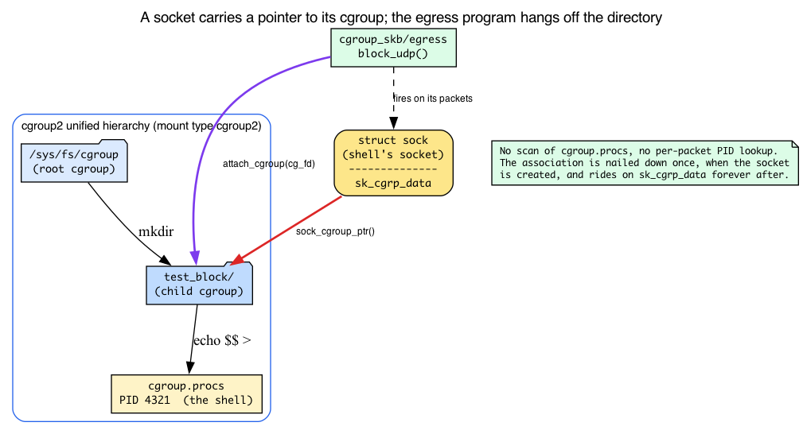
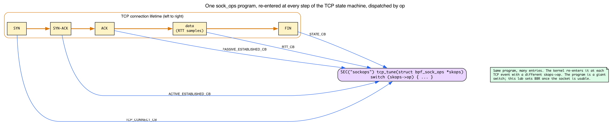
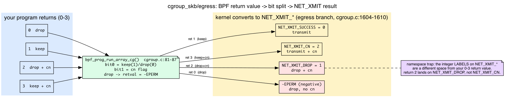

# Day 19 — cgroup BPF and sockops: policy at the socket layer

> **Today's mission:** filter network access per cgroup, then tune TCP behavior per cgroup. Learn what a cgroup v2 actually *is*, how a socket carries its cgroup with it, how the kernel turns your program's return value into a packet verdict, and how one `sock_ops` program gets re-entered at every step of a TCP handshake. End of Phase 3. Total time: ~110 minutes.

## Above the packet, below the socket

Days 14–18 worked at the packet layer. Today goes higher: the **socket** and **cgroup** layers. Two related families:


- **`cgroup_skb`** — fires per-packet for sockets in a cgroup. Returns 0 (drop) or 1 (allow). Used for namespaced firewalls.
- **`sock_ops`** — fires at TCP state-machine events (connect, ESTABLISHED, RTT updates, header option negotiation). Tune connection params per cgroup.
- **`sk_msg`** — fires on `sendmsg` for sockets in a sockmap; used for L7 load balancing (Cilium service mesh).
- **`cgroup_sock_addr`** — fires on `connect()`, `bind()`, `sendmsg()` to UDP, etc. Modify sockaddr (do socket-level NAT).

These programs run in **process context** with the full non-sleepable helper set, so they can call helpers like `bpf_setsockopt`. (They are *not* sleepable — see `can_be_sleepable()` in the verifier if you ever need the exact list of program types that are.)

But every one of those program types rests on a single idea this chapter has to make solid first: a cgroup. Everything else today — *why* a packet's egress program knows which policy applies to it, *why* a process that joins a directory is instantly subject to a firewall, *why* you can pick BBR for one set of connections and CUBIC for another — falls out of one fact about how Linux ties a socket to a cgroup. So we start there.

## What a cgroup v2 actually is

You have heard "cgroups partition resources (CPU, memory, IO, network)" a hundred times. That sentence is true and useless. Here is the part that matters for BPF.

**A cgroup v2 hierarchy is a single tree of directories**, mounted once at `/sys/fs/cgroup` with filesystem type `cgroup2`. That word *single* is the whole point. Old cgroup v1 had a *separate* tree per controller — one mount for `cpu`, another for `memory`, another for `net_cls` — and a process could sit in different places in each tree at once. v2 collapsed all of that into **one unified hierarchy**: every process lives at exactly one node in one tree, and all controllers (cpu, memory, io, …) are just knobs enabled on the nodes of that one tree. When you `mount | grep cgroup2` and see `cgroup2 on /sys/fs/cgroup type cgroup2`, you are looking at the root of that single tree.

**Each directory is a cgroup. Membership is a file.** Make a directory under `/sys/fs/cgroup` and you have created a child cgroup. Inside it the kernel materializes control files — `cgroup.procs`, `cgroup.controllers`, and so on. The one that matters today is `cgroup.procs`: **writing a PID into a cgroup's `cgroup.procs` file moves that task (and all its threads) into that cgroup.** That is *literally all* membership is — a number written into a file. When a controlled child runs `echo $$ > "$CG/cgroup.procs"`, `$$` is that child shell's PID and the write relocates only that child into the owned cgroup. Membership can be changed again with another `cgroup.procs` write, but this lab deliberately leaves your interactive shell untouched.



### How a packet's program knows which cgroup it belongs to

Here is the question the old version of this chapter waved away. The "Dumb Questions" answer below asserts "the kernel knows which cgroup the destination socket belongs to." *How?* It is not magic, and it is not a lookup. **It is a pointer stored on the socket.**

Every socket records the cgroup of the task that created it. The kernel embeds a small struct directly inside `struct sock`:

```c
/* include/linux/cgroup-defs.h:920 */
/* sock_cgroup_data is embedded at sock->sk_cgrp_data and contains
 * per-socket cgroup information except for memcg association. */
```

So `struct sock` carries a `struct sock_cgroup_data sk_cgrp_data` field, and the helper `sock_cgroup_ptr()` resolves it to the owning `struct cgroup *`. When a packet leaves a socket, the cgroup BPF dispatch path does exactly this:

```c
/* kernel/bpf/cgroup.c:1574, inside __cgroup_bpf_run_filter_skb() */
cgrp = sock_cgroup_ptr(&sk->sk_cgrp_data);
```

That single line *is* "the kernel knows which cgroup the socket belongs to." It dereferences a pointer the socket has been carrying since birth, gets the cgroup, and runs that cgroup's attached programs. There is no scan of `cgroup.procs`, no per-packet PID lookup — the association was nailed down once, when the socket was created, and rides along on the socket forever after.

One guard sits right above that line: cgroup_skb only applies to IP sockets.

```c
/* kernel/bpf/cgroup.c:1571 */
if (sk->sk_family != AF_INET && sk->sk_family != AF_INET6)
    return 0;
```

A Unix-domain socket or a netlink socket sails straight through your egress firewall untouched — the hook returns 0 (allow) before your program ever runs. Good to know before you wonder why your "block everything" program let the X server talk to its clients.

### How you attach, and what "hierarchical" means

A cgroup BPF program does **not** attach to an interface or a PID. It attaches to a **cgroup directory's file descriptor**. That is why the loader does `open(cg_path, O_RDONLY | O_DIRECTORY)` — it is opening the explicitly supplied *directory* to get an fd, and `bpf_program__attach_cgroup` hands that fd to the kernel. From then on the program fires for **every socket whose `sk_cgrp_data` points at that cgroup** (or a descendant of it). This is why a process that joins the cgroup *after* you attach is immediately covered: it inherits the cgroup, its new sockets get `sk_cgrp_data` pointing there, and the dispatch path finds your program. Nothing has to be re-attached.

Attachment is **hierarchical**: a program on a parent cgroup also covers its children. When more than one level wants a program, v7.1 gives you attach flags to choose how they combine:

```c
/* include/uapi/linux/bpf.h:1200-1219 */
/* BPF_F_ALLOW_OVERRIDE: a child's program yields to / replaces the parent's. */
/* BPF_F_ALLOW_MULTI:    programs from multiple levels all run, in FIFO order
 *                       (child programs first, then this cgroup, then parent). */
```

You will not need either today — libbpf's `attach_cgroup` uses the default single-program semantics (one program per cgroup, NONE flags). But know multi-attach exists: it is how a node-level agent and a pod-level policy can coexist on the same socket.

## Why cgroups, for BPF specifically

Now the one-liner finally lands. BPF cgroup hooks let you attach policy to a cgroup directory that runs only for the sockets of processes in that cgroup — because those sockets carry a pointer back to the cgroup. This is how systemd, Cilium, and Kubernetes sidecars implement per-pod or per-service network rules without iptables overhead: a pod *is* a cgroup, so "this pod's traffic" is just "sockets whose `sk_cgrp_data` points here."

## sockops example: per-cgroup TCP tuning


When a TCP connection event fires (e.g., `BPF_SOCK_OPS_TCP_CONNECT_CB`), your BPF program can call `bpf_setsockopt(skops, ..., TCP_CONGESTION, "bbr", 3)` to set BBR for *this socket*. Combined with cgroup attachment, you've got "all sockets from cgroup X use BBR; all sockets from cgroup Y use CUBIC." We'll unpack what `bpf_setsockopt` and `TCP_CONGESTION` actually are below, right before Part B uses them.

> ### There are no Dumb Questions
>
> **Q: When does `cgroup_skb` run vs `tc`?**
>
> A: `cgroup_skb/ingress` runs *after* IP routing decided this packet is for a local socket; the kernel knows which cgroup the destination socket belongs to. `cgroup_skb/egress` runs *after* the socket sent — kernel knows the source socket's cgroup. tc runs at L2/L3, before/after socket layer. Use cgroup_skb when policy is "this cgroup's traffic" rather than "this interface's traffic."
>
> **Q: How is sock_ops different from setting sysctls?**
>
> A: Sysctls are global; sock_ops is per-socket and conditional. You can set RTO_MIN to 500ms for cgroup A and 5ms for cgroup B without touching sysctls. The conditional check happens in BPF, evaluated per connection.
>
> **Q: Are these used much in practice?**
>
> A: Yes — Cilium uses cgroup_sock_addr extensively for socket-level service translation (kube-proxy replacement). Service meshes use sk_msg for L7 routing. Most users don't touch them directly because tools abstract them.

## The lab — two parts

### Part A: cgroup_skb firewall

Create a test cgroup and block egress UDP for any process in it.

> **Prerequisite:** cgroup v2 (unified hierarchy) mounted at `/sys/fs/cgroup` — verify with `mount | grep cgroup2` (expect `cgroup2 on /sys/fs/cgroup type cgroup2 ...`) — and a kernel built with `CONFIG_CGROUP_BPF=y` (check `zgrep CGROUP_BPF /proc/config.gz` or `/boot/config-$(uname -r)`). On cgroup v1 / hybrid hosts the path and attach semantics differ.

```bash
CG=/sys/fs/cgroup/practical-ebpf-day19-$$
sudo mkdir "$CG"
```

Do **not** move your interactive shell. Each trigger below starts a short-lived child shell, writes only that child's PID to `$CG/cgroup.procs`, and then `exec`s the test command. Every socket that controlled child opens has `sk_cgrp_data` pointing at the owned cgroup; your terminal and SSH connection stay in the root cgroup.

`fw.bpf.c`:
```c
{{#include ../labs/day19/fw.bpf.c:book}}
```

**Wait — why does `data` point straight at the IP header here?** Recall from Day 16 that `__sk_buff` exposes `data`/`data_end` for bounds-checked direct packet access: every read you make must be *proven* in-range before the verifier accepts it (that's why the `if (ip + 1 > end)` check is mandatory before touching `ip->protocol`). Same discipline applies here. But there's a difference Day 16 didn't prepare you for, and it would trip you up if nobody flagged it.

On Day 16 the tc program saw the **Ethernet header first** — `data` pointed at an `ethhdr`, and you had to parse past it before reaching the IP header. Here there is **no `ethhdr` parse step at all**: `fw.bpf.c` casts `data` straight to `struct iphdr *`. That is not a bug. For `cgroup_skb`, the data pointer starts at the **network (IP) header**, because the hook runs at the socket layer, not the L2 framing layer. The kernel arranges this explicitly before invoking your program:

```c
/* kernel/bpf/cgroup.c:1561-1577, __cgroup_bpf_run_filter_skb() */
unsigned int offset = -skb_network_offset(skb);
...
__skb_push(skb, offset);                       /* move data back to the IP header */
bpf_compute_and_save_data_end(skb, &saved_data_end);
```

`__skb_push` rewinds `skb->data` to the network header, then `bpf_compute_and_save_data_end` sets the `data`/`data_end` window your program sees. So for cgroup_skb, `[data, data_end)` spans from the IP header onward — cast and go. (Contrast Day 16's tc code, which had to parse `ethhdr` first because tc runs below the socket, where L2 framing is still present.)

Note: `cgroup_skb/ingress` returns **1 = allow, 0 = drop**. `cgroup_skb/egress` is wider — the verifier enforces a return range of **0-3**: `0`=drop, `1`=keep, `2`=drop and notify TCP of congestion (cn), `3`=keep and cn. Returning anything outside that range is rejected at load time. (We dissect exactly where that range is enforced and how it becomes a packet verdict in Break 1 — it is the chapter's headline mechanism, and worth understanding before you trust it.)

Userspace attach. Compile this loader with the day's Makefile (same skeleton-driven pattern as earlier days) and **keep it running** while you test — `bpf_program__attach_cgroup` returns a `struct bpf_link *` whose lifetime is tied to the process. When the loader exits, the link is freed and UDP egress is allowed again:

```c
int cg_fd = open(cg_path, O_RDONLY | O_DIRECTORY);   /* explicit DIRECTORY fd */
struct fw_bpf *skel = fw_bpf__open_and_load();
struct bpf_link *l = bpf_program__attach_cgroup(skel->progs.block_udp, cg_fd);
printf("attached, Ctrl-C to detach\n");
pause();   /* keep the process (and the link) alive */
```

Notice the attach target is `cg_fd`, the **cgroup directory fd** — not an interface, not a PID. That is the attachment model from the cgroup section made concrete: the program now fires for every socket whose `sk_cgrp_data` points at `$CG`.

A production policy can pin the link to a uniquely owned bpffs path, but this lab intentionally keeps it process-owned: stopping the exact loader PID is guaranteed to detach it. The trigger itself is a controlled child placed in `$CG`.

The complete loader (`fw.c`) wraps that sketch with signal handling and safe cgroup-argument handling: it requires an explicit cgroup-v2 directory path and opens it with `O_DIRECTORY`, so it cannot silently attach to a fixed or unexpected cgroup. Build it with `make -C ebpf/labs fw`:

```c
{{#include ../labs/day19/fw.c:book}}
```

Test. Use a UDP probe whose success/failure is *visible* — `dig` defaults to UDP/53, exactly the protocol/port the filter drops, so the timeout-vs-answer contrast is unambiguous (raw `nc -u` would hang identically in both cases and reveal nothing):

```bash
make -C ebpf/labs day19
sudo ebpf/labs/.output/day19/fw "$CG" &
FW_PID=$!
trap 'sudo kill -INT "$FW_PID" 2>/dev/null || true; wait "$FW_PID" 2>/dev/null || true; sudo rmdir "$CG" 2>/dev/null || true' EXIT
sleep 0.5

# only this controlled child enters the cgroup (UDP/53 is dropped):
sudo sh -c 'echo $$ > "$1/cgroup.procs"; exec dig +tries=1 +timeout=2 @1.1.1.1 example.com' _ "$CG"
#   -> communications error / no servers could be reached
sudo sh -c 'echo $$ > "$1/cgroup.procs"; exec ping -c 3 1.1.1.1' _ "$CG"
#   -> works: ICMP is not UDP

# this ordinary process remains outside the cgroup and receives an answer:
dig +tries=1 +timeout=2 @1.1.1.1 example.com
```

The ordinary process sees its packets sail through because its sockets' `sk_cgrp_data` points at the root cgroup, not `$CG` — the program is simply not in their dispatch path. This ties back to the chapter's own check question: DNS over UDP/53 is exactly what a `cgroup_skb/egress` UDP drop kills.

**Teardown** is the trap installed above: it signals the exact loader PID, waits for skeleton destruction to detach the link, and removes only `$CG`. The trigger commands `exec`, so their temporary cgroup is already empty when they exit. Your interactive shell never moved and needs no recovery step.

### Part B: sock_ops TCP tuning

Part A fired your program once per packet. `sock_ops` is a different animal: **one program, invoked many times over the life of a single connection**, once at each interesting TCP event. To read the example you need two pieces of background the old chapter skipped — what the `bpf_sock_ops` context is, and what `bpf_setsockopt`/`TCP_CONGESTION` actually do.

#### The `bpf_sock_ops` context and the `op` state-machine

A `sock_ops` program is handed a `struct bpf_sock_ops *`, and its **very first field tells you why you were called**:

```c
/* include/uapi/linux/bpf.h:6900 */
struct bpf_sock_ops {
    __u32 op;                 /* WHICH event fired — your switch key   */
    union { __u32 args[4]; __u32 reply; ... };  /* per-op in/out values */
    __u32 family;
    __u32 remote_ip4, local_ip4;
    __u32 remote_port, local_port;
    __u32 is_fullsock;
    __u32 snd_cwnd;
    __u32 srtt_us;            /* smoothed RTT << 3, microseconds        */
    __u32 state;             /* a TCP_* state (TCP_ESTABLISHED = 1, …) */
    ...
    __u64 bytes_acked;
    ...
};
```

The program is a **giant switch on `op`**. The kernel re-enters the *same* program at each step of the TCP state machine — active connect, passive/active establishment, RTT sample, retransmit, state change, header-option parse/write — each time with a different `op`. The op values are a UAPI enum; the three this lab cares about:

```c
/* include/uapi/linux/bpf.h:7048 */ BPF_SOCK_OPS_TCP_CONNECT_CB        /* right before an active connect    */
/* include/uapi/linux/bpf.h:7051 */ BPF_SOCK_OPS_ACTIVE_ESTABLISHED_CB /* SYN-ACK finished an outbound 3WHS */
/* include/uapi/linux/bpf.h:7055 */ BPF_SOCK_OPS_PASSIVE_ESTABLISHED_CB/* ACK finished an inbound 3WHS      */
```

`tune.bpf.c` below checks all three because it wants to set the congestion control once the socket is *usable*, no matter how the connection came to be — whether this host dialed out (active) or accepted a connection (passive).

Beyond `op`, the context exposes **live TCP state** you may read: `family`, remote/local ip+port, `state` (a `TCP_*` value — `TCP_ESTABLISHED = 1` per `include/net/tcp_states.h:13`), `srtt_us`, `snd_cwnd`, `bytes_acked`, and more. So a real policy can be conditional on connection properties — "use BBR only for long-haul connections with srtt > 20ms" — not just "always set BBR." The `args[4]`/`reply` union lets some op callbacks pass arguments in and return a value out (RTO/RWND-init ops return a value that way); for our setsockopt use-case the program just returns 0.



#### What `bpf_setsockopt` and `TCP_CONGESTION` do

`bpf_setsockopt(ctx, level, optname, optval, optlen)` is the **kernel-internal twin of the userspace `setsockopt(2)` syscall**. Same `level`/`optname` constants (`SOL_TCP`, `TCP_CONGESTION`), same effect — but called from *inside* a BPF program, on the very socket the hook is firing for, with no syscall boundary to cross. It is offered only to socket-context program types (sock_ops, cgroup_sock_addr, …), which is exactly why this hook family can tune connections at all. The kernel wires it into the sock_ops helper set explicitly:

```c
/* net/core/filter.c:8597, in sock_ops_func_proto() */
case BPF_FUNC_setsockopt: return &bpf_sock_ops_setsockopt_proto;
```

and the implementation behind it is `__bpf_setsockopt(struct sock *sk, int level, int optname, ...)` at `net/core/filter.c:5598` — it operates directly on the `struct sock`, no copy from userspace.

`TCP_CONGESTION` (`#define TCP_CONGESTION 13`, `include/uapi/linux/tcp.h:107`) takes a **string naming a registered congestion-control module** — `"bbr"`, `"cubic"`, `"reno"`, `"dctcp"`. The kernel looks the name up in its CC registry, so `"bbr"` only resolves if `tcp_bbr` is built in or `modprobe`'d (the prerequisite below). The modules really are separate files: `net/ipv4/tcp_bbr.c`, `net/ipv4/tcp_cubic.c`. An unknown name returns `-ENOENT` (the CC registry lookup misses) — and a BPF helper reports that as a *return value*, not an exception, which is why Break 3's failure is silent.

Brief framing only — we do **not** teach the algorithm here (that's Days 22–23, struct_ops congestion control): congestion control is the pluggable kernel logic that decides how big the send window may grow. CUBIC is the default; BBR is rate/RTT-based. The point *for Day 19* is that you can pick a different one **per socket / per cgroup** without touching the global `net.ipv4.tcp_congestion_control` sysctl. That per-socket selectability is the entire value proposition of this hook.

`tune.bpf.c` (the full file adds the usual `vmlinux.h`/`bpf_helpers.h` includes, the GPL `LICENSE`, and fallback `SOL_TCP`/`TCP_CONGESTION` defines — those UAPI constants are `#define`s, not BTF types, so `vmlinux.h` does not supply them):
```c
{{#include ../labs/day19/tune.bpf.c:prog}}
```

Attach to a cgroup:
```c
struct bpf_link *l = bpf_program__attach_cgroup(skel->progs.tcp_tune, cg_fd);
```

The complete loader (`tune.c`) shares `fw.c`'s safe cgroup-argument handling — required explicit cgroup path plus `O_DIRECTORY` — and attaches `tcp_tune` instead. Build it with `make -C ebpf/labs tune`:

```c
{{#include ../labs/day19/tune.c:book}}
```

Verify. There's nothing to observe until a *fresh* TCP connection fires sockops from inside the cgroup, and BBR must actually be available — otherwise `bpf_setsockopt(...,"bbr",...)` fails silently (that's Break 3). Also scope `ss` to the target so you don't match unrelated sockets (e.g. your SSH session, which may itself be on BBR):

```bash
# prerequisite: BBR must be available
sudo modprobe tcp_bbr 2>/dev/null   # no-op if built in
sysctl net.ipv4.tcp_available_congestion_control

# stop Part A's exact loader, then attach sockops to the same owned cgroup:
sudo kill -INT "$FW_PID"; wait "$FW_PID" || true
sudo ebpf/labs/.output/day19/tune "$CG" &
TUNE_PID=$!
trap 'sudo kill -INT "$TUNE_PID" 2>/dev/null || true; wait "$TUNE_PID" 2>/dev/null || true; sudo rmdir "$CG" 2>/dev/null || true' EXIT
sleep 0.5

# only this short-lived child enters the cgroup and opens the fresh TCP socket:
sudo sh -c 'echo $$ > "$1/cgroup.procs"; exec curl -s https://speed.cloudflare.com/__up -T /dev/zero --max-time 4' _ "$CG" >/dev/null &
CLIENT_PID=$!
sleep 1
ss -ti dst :443 | grep bbr
wait "$CLIENT_PID" || true
```

Expected: the in-cgroup connection's `ss -i` info line contains `bbr`. A socket opened from a shell **not** in the cgroup shows the *host default* CC instead — which differs from your per-cgroup choice as long as the default isn't already `bbr` (on this devbox the default happens to be `bbr`, so to see the contrast pick a non-default name like `"cubic"` in `tune.bpf.c`). Same reason as Part A: a non-cgroup socket's cgroup pointer doesn't name `$CG`, so `tcp_tune` never runs for it. If `ss` is empty, either no fresh connection was made from the cgroup, or BBR is not loaded (the `bpf_setsockopt` failed silently — Break 3).

---

## What to break, in order

### Break 1 — Out-of-range return

Return `5` (or any value > 3) from a `cgroup_skb/egress` program. The verifier rejects it at load: egress return values must fall in `retval_range(0, 3)` (`kernel/bpf/verifier.c`). The defined values are `0`=drop, `1`=keep, `2`=drop+cn, `3`=keep+cn — so returning `TC_ACT_SHOT` (which is `2`) actually *loads and runs*, but it means "drop and signal congestion," not "allow." It's a **defined egress value**, not a coincidental pass. On ingress the range is just `0`/`1`. Don't borrow tc's `TC_ACT_*` constants here — the conventions only overlap by accident.

This is the chapter's headline mechanism, so let's ground every word of it in the source. **Two stages enforce the contract.**

**Stage 1 — the verifier clamps the range at load time, per program type.** The default exit range for any program is 0-1; the CGROUP_SKB egress attach type *widens* it to 0-3:

```c
/* kernel/bpf/verifier.c:16747 — default */
*range = retval_range(0, 1);
...
/* kernel/bpf/verifier.c:16772-16773 — CGROUP_SKB egress only */
if (env->prog->expected_attach_type == BPF_CGROUP_INET_EGRESS)
    *range = retval_range(0, 3);
```

So `return 5` is rejected *before the program ever runs* — that is exactly Break 1. Ingress never hits that `if`, so it keeps the default 0-1: drop/allow, no widening. The asymmetry is deliberate, not an oversight.

**Stage 2 — at runtime the kernel maps your 0-3 to a `NET_XMIT_*` code.** Before the egress branch even sees a value, the run-array loop splits your 0-3 return bit-by-bit:

```c
/* kernel/bpf/cgroup.c:81-87, in bpf_prog_run_array_cg() */
func_ret = run_prog(prog, ctx);
if (ret_flags) {
    *(ret_flags) |= (func_ret >> 1);   /* bit 1 -> the cn flag   */
    func_ret &= 1;                     /* bit 0 -> keep(1)/drop(0) */
}
if (!func_ret && !IS_ERR_VALUE((long)run_ctx.retval))
    run_ctx.retval = -EPERM;           /* drop becomes a negative err */
```

This is where your 0-3 is split: bit 0 is the keep/drop decision, bit 1 is the cn flag. A drop (bit 0 = 0) sets `retval` to `-EPERM` — that is the negative value the egress branch below then maps. So the `ret` and `flags` the next snippet reads are *not* your raw return value; they are already this post-split pair.

The egress branch of `__cgroup_bpf_run_filter_skb()` then does the final translation into a `NET_XMIT_*` code. **Heads up — the integers in this kernel comment are the *post-conversion* `NET_XMIT_*` result codes, a different namespace from your program's 0-3 return values.** Your return 1 (keep) converts to `NET_XMIT_SUCCESS=0`; your return 2 (drop+cn) becomes `NET_XMIT_DROP=1`; return 3 (keep+cn) becomes `NET_XMIT_CN=2`; return 0 (drop) becomes a negative `-err`:

```c
/* kernel/bpf/cgroup.c:1589-1610 (egress branch) */
/* left column = the post-conversion NET_XMIT result, NOT your return value:
 *   0: NET_XMIT_SUCCESS  skb should be transmitted
 *   1: NET_XMIT_DROP     skb should be dropped and cn
 *   2: NET_XMIT_CN       skb should be transmitted and cn
 *   3: -err              skb should be dropped              */
cn = flags & BPF_RET_SET_CN;
if (ret && !IS_ERR_VALUE((long)ret))
    ret = -EFAULT;
if (!ret)  ret = (cn ? NET_XMIT_CN : NET_XMIT_SUCCESS);
else       ret = (cn ? NET_XMIT_DROP : ret);
```

with the codes themselves defined at `include/linux/netdevice.h:119-121`:

```c
#define NET_XMIT_SUCCESS  0x00   /* transmit            */
#define NET_XMIT_DROP     0x01   /* drop + congestion-notify */
#define NET_XMIT_CN       0x02   /* transmit + congestion-notify */
```

The "cn" bit is a *separate channel* (`BPF_RET_SET_CN`), which is the source of truth behind "2 = drop+cn, 3 = keep+cn." Mind the namespace trap in the box above, though: that left column (`0..3`) is the **resulting `NET_XMIT_*` code**, *not* the value your program returned. The two spaces do **not** line up one-to-one. `bpf_prog_run_array_cg()` (`cgroup.c:81-87`, the Stage-2 snippet above) splits your return value bit-by-bit before this branch ever runs — the low bit is keep(1)/drop(0), the high bit becomes the cn flag — so program-return `2` (drop+cn) converts to **`NET_XMIT_DROP`**, and the `NET_XMIT_CN` result is instead produced by program-return `3` (keep+cn). That still confirms the subtle point: `TC_ACT_SHOT == 2` "works" on egress only because `2` is a defined *program-return* value there (drop+cn), not because tc and cgroup share a convention — and emphatically not because it equals `NET_XMIT_CN`. They overlap by accident. Ingress, by contrast, is the simple branch — range 0/1, no cn channel — matching the note on the egress code box and the Bullet Points below.



### Break 2 — Forget the IPPROTO check

Drop *all* packets in cgroup_skb/egress (`return 0` always). The controlled child in `$CG` loses network access; your terminal does not. Recover by signaling the exact loader PID, which destroys the link, or simply let the child exit and the trap remove the now-empty owned cgroup. This is why the lab never moves your interactive shell into a policy it is deliberately breaking.

### Break 3 — TCP CC not loaded

`bpf_setsockopt(..., "bbr_invalid", ...)`. The kernel looks `"bbr_invalid"` up in its CC registry, finds nothing, and returns `-ENOENT` (`tcp_set_congestion_control()` in `net/ipv4/tcp_cong.c` sets `err = -ENOENT` when `tcp_ca_find*` returns NULL) — but `bpf_setsockopt` surfaces that as a *return value*, not a fault, so nothing crashes and nothing logs. The connection still succeeds with the system default. Symptom: your sockops "doesn't work" — it's running, but the helper failed silently. Always check return values: `if (bpf_setsockopt(...) < 0) { /* handle */ }`.

### Break 4 — Use `cgroup_sock_addr` for socket-level NAT

```c
SEC("cgroup/connect4")
int rewrite_connect(struct bpf_sock_addr *ctx)
{
    if (ctx->user_port == bpf_htons(8080)) {
        ctx->user_port = bpf_htons(80);
        return 1;
    }
    return 1;
}
```

This attaches as `BPF_CGROUP_INET4_CONNECT` (`include/uapi/linux/bpf.h:1108`) and rewrites the destination port *inside the `connect()` syscall, before the SYN is built*. Now connections from this cgroup to port 8080 are silently redirected to port 80. The `bpf_sock_addr` context fields (`user_port`, `user_ip4`, …) are real (`include/uapi/linux/bpf.h:6871`). This is how Cilium's "socket-level service translation" works — kube-proxy without iptables, done one cgroup at a time using the same socket-carries-its-cgroup mechanism you learned this chapter.

---

## What to read in the kernel

- **`kernel/bpf/cgroup.c`** — the cgroup BPF infrastructure. ~2750 lines. Read the dispatch path `__cgroup_bpf_run_filter_skb` (the `sock_cgroup_ptr` → run-array → `NET_XMIT_*` mapping you just dissected).
- **`include/linux/bpf-cgroup.h`** — interface and program types.
- **`net/core/filter.c`** — search `sock_ops_func_proto` (`:8588`). Helpers available to sockops, including `bpf_setsockopt`.
- **`tools/testing/selftests/bpf/progs/sockopt_*.c`** — sockops examples.
- **`Documentation/bpf/prog_cgroup_sockopt.rst`** — official docs.

---

## Bullet Points

- A **cgroup v2** is one unified tree mounted at `/sys/fs/cgroup` (type `cgroup2`); each directory is a cgroup and writing a PID into its `cgroup.procs` file moves that task in. v1 had a separate tree per controller; v2 has exactly one.
- **A socket carries its cgroup.** `struct sock` embeds `sk_cgrp_data`; `sock_cgroup_ptr(&sk->sk_cgrp_data)` (`cgroup.c:1574`) resolves it to the owning cgroup. That pointer — set when the socket was created — is how the kernel "knows" which cgroup a packet's program belongs to. No scan, no lookup.
- Cgroup programs attach to a **cgroup directory fd**, fire for every socket whose `sk_cgrp_data` names that cgroup (or a descendant), and are **hierarchical** (`BPF_F_ALLOW_OVERRIDE`/`MULTI` for multi-level). cgroup_skb only applies to `AF_INET`/`AF_INET6` (`cgroup.c:1571`).
- **`cgroup_skb`** runs per-packet for sockets in a cgroup. Ingress returns 1=allow/0=drop; egress allows 0-3 (0=drop, 1=keep, 2=drop+cn, 3=keep+cn), verifier-enforced. The verifier widens the range to 0-3 only for `BPF_CGROUP_INET_EGRESS` (`verifier.c:16772`); the kernel maps it to `NET_XMIT_*` at `cgroup.c:1588`.
- For cgroup_skb, `skb->data` starts at the **IP header** (kernel does `__skb_push(skb, -skb_network_offset(skb))`), not the Ethernet header — unlike tc on Day 16. Same Day 16 bounds-check discipline still applies.
- **`sock_ops`** is one program re-entered at each TCP event; `skops->op` selects which (`TCP_CONNECT_CB`, `ACTIVE/PASSIVE_ESTABLISHED_CB`, …). The context also exposes live state (`state`, `srtt_us`, `snd_cwnd`, `bytes_acked`) for conditional policy.
- **`bpf_setsockopt`** is the in-kernel twin of `setsockopt(2)`, available to socket-context programs (`filter.c:8597`). `TCP_CONGESTION` (`tcp.h:107`) takes a CC *name string* resolved against the kernel's CC registry — so per-socket/per-cgroup CC without touching the global sysctl. Unknown name → silent `-ENOENT`.
- **`cgroup_sock_addr`** lets you rewrite sockaddrs at `connect`/`bind` — socket-level NAT (`BPF_CGROUP_INET4_CONNECT`).
- These hooks run in **process context** — full non-sleepable helper set, can call `bpf_setsockopt`.
- Used heavily in production: Cilium, systemd, Kubernetes service meshes.

---

## Check question

You attach a `cgroup_skb/egress` program that returns `0` (drop) for every packet. A process in the cgroup runs `wget google.com`. Does the DNS lookup happen?

<details>
<summary>Click to reveal answer</summary>

**Answer:** No. DNS uses UDP/53; both UDP and TCP egress are filtered by `cgroup_skb`. The lookup `socket()`, `connect()`, and `sendmsg()` all succeed (cgroup_skb fires later, on packet send), but the actual UDP packet leaving the cgroup is dropped by your program. `wget` times out. To allow DNS specifically, gate by destination port in BPF.

</details>

---

## End of Phase 3

You can now write BPF programs at every layer of the network stack: XDP at the driver, tc/tcx at the skb layer, AF_XDP for kernel bypass, cgroup_skb for per-cgroup filtering, sock_ops for TCP tuning, sk_msg for L7. That's the full surface — and you now know the one fact that ties the cgroup hooks together: a socket carries a pointer to its cgroup, and every policy decision hangs off that pointer.

Phase 4 (Days 20–24) shifts to modern primitives: kfuncs, kptrs, struct_ops, BTF spelunking. The infrastructure that makes 2024–2026 BPF feel different from 2019 BPF. (Days 22–23 in particular pick up the congestion-control thread we deliberately left dangling here — you'll *write* a CC algorithm as a struct_ops, not just select one by name.)
