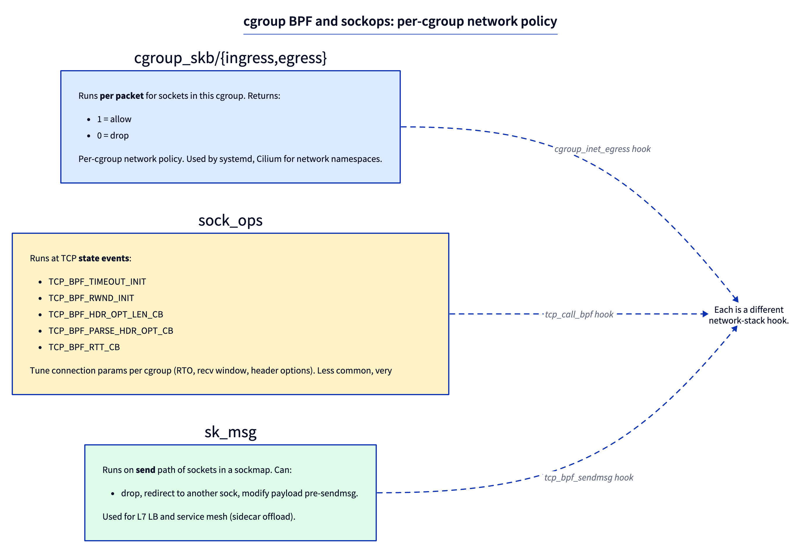
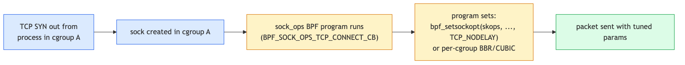

# Day 19 — cgroup BPF and sockops: policy at the socket layer

> **Today's mission:** filter network access per cgroup, then tune TCP behavior per cgroup. End of Phase 3. Total time: ~75 minutes.

## Above the packet, below the socket

Days 14–18 worked at the packet layer. Today goes higher: the **socket** and **cgroup** layers. Two related families:



- **`cgroup_skb`** — fires per-packet for sockets in a cgroup. Returns 0 (drop) or 1 (allow). Used for namespaced firewalls.
- **`sock_ops`** — fires at TCP state-machine events (connect, ESTABLISHED, RTT updates, header option negotiation). Tune connection params per cgroup.
- **`sk_msg`** — fires on `sendmsg` for sockets in a sockmap; used for L7 load balancing (Cilium service mesh).
- **`cgroup_sock_addr`** — fires on `connect()`, `bind()`, `sendmsg()` to UDP, etc. Modify sockaddr (do socket-level NAT).

These programs run in **process context** with full kernel scheduling, so they can use sleepable variants and call helpers like `bpf_setsockopt`.

## Why cgroups

Linux cgroups partition resources (CPU, memory, IO, network). BPF cgroup hooks let you attach policy to a cgroup that runs only for processes in that cgroup. This is how systemd, Cilium, and Kubernetes sidecars implement per-pod or per-service network rules without iptables overhead.

## sockops example: per-cgroup TCP tuning



When a TCP connection event fires (e.g., `BPF_SOCK_OPS_TCP_CONNECT_CB`), your BPF program can call `bpf_setsockopt(skops, ..., TCP_CONGESTION, "bbr", 3)` to set BBR for *this socket*. Combined with cgroup attachment, you've got "all sockets from cgroup X use BBR; all sockets from cgroup Y use CUBIC."

> ### There are no Dumb Questions
>
> **Q: When does `cgroup_skb` run vs `tc`?**
>
> A: `cgroup_skb/ingress` runs *after* IP routing decided this packet is for a local socket; the kernel knows which cgroup the destination socket belongs to. `cgroup_skb/egress` runs *after* the socket sent — kernel knows the source socket's cgroup. tc runs at L2/L3, before/after socket layer. Use cgroup_skb when policy is "this cgroup's traffic" rather than "this interface's traffic."
>
> **Q: How is sock_ops different from setting sysctls?**
>
> A: Sysctls are global; sock_ops is per-socket and conditional. You can set RTO_MIN to 500ms for cgroup A and 5ms for cgroup B without touching sysctls. The conditional check happens in BPF, evaluated per connection.
>
> **Q: Are these used much in practice?**
>
> A: Yes — Cilium uses cgroup_sock_addr extensively for socket-level service translation (kube-proxy replacement). Service meshes use sk_msg for L7 routing. Most users don't touch them directly because tools abstract them.

## The lab — two parts

### Part A: cgroup_skb firewall

Create a test cgroup and block egress UDP for any process in it.

```bash
sudo mkdir /sys/fs/cgroup/test_block
echo $$ | sudo tee /sys/fs/cgroup/test_block/cgroup.procs   # only this shell
```

`fw.bpf.c`:
```c
#include "vmlinux.h"
#include <bpf/bpf_helpers.h>
#include <bpf/bpf_endian.h>

char LICENSE[] SEC("license") = "GPL";

SEC("cgroup_skb/egress")
int block_udp(struct __sk_buff *skb)
{
    void *data = (void *)(long)skb->data;
    void *end  = (void *)(long)skb->data_end;
    struct iphdr *ip = data;
    if (ip + 1 > end) return 1;       /* allow if can't parse */
    if (ip->protocol == IPPROTO_UDP) return 0;  /* drop UDP */
    return 1;
}
```

Note: `cgroup_skb` returns **1 = allow, 0 = drop** (different from tc).

Userspace attach:
```c
int cg_fd = open("/sys/fs/cgroup/test_block", O_RDONLY);
struct fw_bpf *skel = fw_bpf__open_and_load();
struct bpf_link *l = bpf_program__attach_cgroup(skel->progs.block_udp, cg_fd);
```

Test:
```bash
# from the shell that's in test_block:
nc -u 1.1.1.1 53 <<< "test"   # blocked
ping 1.1.1.1                  # works (ICMP, not UDP)

# from another shell (not in test_block):
nc -u 1.1.1.1 53 <<< "test"   # works
```

### Part B: sock_ops TCP tuning

`tune.bpf.c`:
```c
SEC("sockops")
int tcp_tune(struct bpf_sock_ops *skops)
{
    if (skops->op == BPF_SOCK_OPS_TCP_CONNECT_CB ||
        skops->op == BPF_SOCK_OPS_PASSIVE_ESTABLISHED_CB ||
        skops->op == BPF_SOCK_OPS_ACTIVE_ESTABLISHED_CB) {
        /* Set BBR for connections in this cgroup */
        char cc[] = "bbr";
        bpf_setsockopt(skops, SOL_TCP, TCP_CONGESTION, cc, sizeof(cc));
    }
    return 0;
}
```

Attach to a cgroup:
```c
struct bpf_link *l = bpf_program__attach_cgroup(skel->progs.tcp_tune, cg_fd);
```

Verify:
```bash
ss -ti | grep bbr   # connections from this cgroup show 'bbr'
```

---

## What to break, in order

### Break 1 — Wrong return convention

Return `TC_ACT_SHOT` (which is 2) from cgroup_skb. The kernel reads any nonzero as "allow" — packet flows through. You need 0 to drop. Each program type has its own return convention; don't mix them.

### Break 2 — Forget the IPPROTO check

Drop *all* packets in cgroup_skb/egress (`return 0` always). Your shell loses all network access. Rejoin from another shell. Be careful with cgroup attachment — you can lock yourself out as easily as with `iptables -P OUTPUT DROP`.

### Break 3 — TCP CC not loaded

`bpf_setsockopt(..., "bbr_invalid", ...)`. Returns -EINVAL silently. The connection still succeeds with the system default. Symptom: your sockops "doesn't work" — it's running but the helper failed. Always check return values.

### Break 4 — Use `cgroup_sock_addr` for socket-level NAT

```c
SEC("cgroup/connect4")
int rewrite_connect(struct bpf_sock_addr *ctx)
{
    if (ctx->user_port == bpf_htons(8080)) {
        ctx->user_port = bpf_htons(80);
        return 1;
    }
    return 1;
}
```

Now connections from this cgroup to port 8080 are silently redirected to port 80. This is how Cilium's "socket-level service translation" works — kube-proxy without iptables.

---

## What to read in the kernel

- **`kernel/bpf/cgroup.c`** — the cgroup BPF infrastructure. ~1500 lines. Read the dispatch path.
- **`include/linux/bpf-cgroup.h`** — interface and program types.
- **`net/core/filter.c`** — search `bpf_sock_ops_func_proto`. Helpers available to sockops.
- **`tools/testing/selftests/bpf/progs/sockopt_*.c`** — sockops examples.
- **`Documentation/bpf/prog_cgroup_sockopt.rst`** — official docs.

---

## Bullet Points

- **`cgroup_skb`** runs per-packet for sockets in a cgroup. Return 1=allow, 0=drop.
- **`sock_ops`** runs at TCP state events; can call `bpf_setsockopt` to tune the connection.
- **`sk_msg`** runs on send for sockets in a sockmap; used for L7 routing.
- **`cgroup_sock_addr`** lets you rewrite sockaddrs at `connect`/`bind` — socket-level NAT.
- These hooks run in **process context** — sleepable variants exist, full helpers available.
- Used heavily in production: Cilium, systemd, Kubernetes service meshes.

---

## Check question

You attach a `cgroup_skb/egress` program that returns `0` (drop) for every packet. A process in the cgroup runs `wget google.com`. Does the DNS lookup happen?

.  
.  
.

**Answer:** No. DNS uses UDP/53; both UDP and TCP egress are filtered by `cgroup_skb`. The lookup `socket()`, `connect()`, and `sendmsg()` all succeed (cgroup_skb fires later, on packet send), but the actual UDP packet leaving the cgroup is dropped by your program. `wget` times out. To allow DNS specifically, gate by destination port in BPF.

---

## End of Phase 3

You can now write BPF programs at every layer of the network stack: XDP at the driver, tc/tcx at the skb layer, AF_XDP for kernel bypass, cgroup_skb for per-cgroup filtering, sock_ops for TCP tuning, sk_msg for L7. That's the full surface.

Phase 4 (Days 20–24) shifts to modern primitives: kfuncs, kptrs, struct_ops, BTF spelunking. The infrastructure that makes 2024–2026 BPF feel different from 2019 BPF.
