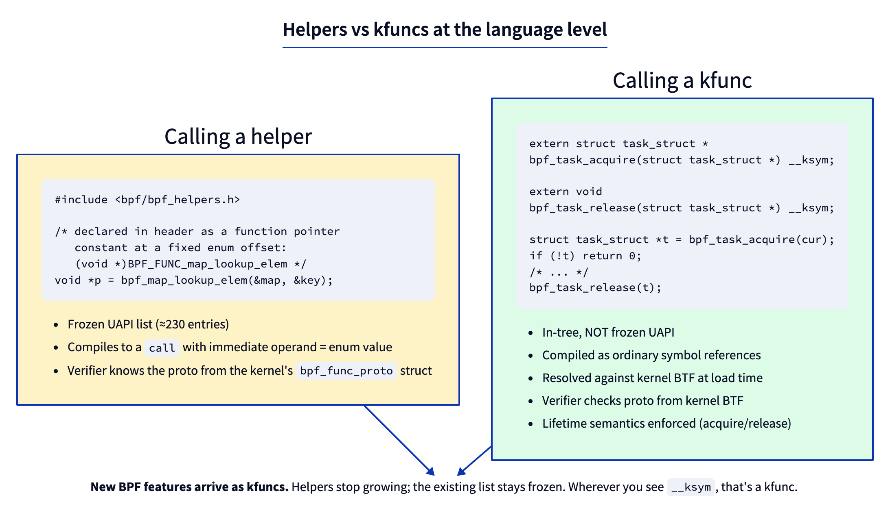
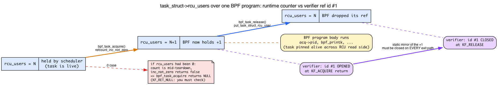
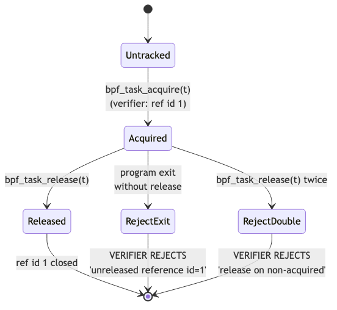

# Day 20 — kfuncs: the modern kernel-extension mechanism

> **Today's mission:** call a kfunc from BPF, understand the acquire/release reference-counting semantics that the verifier enforces, learn what a kernel *refcount* actually is and why a task carries two of them, and know why new BPF features ship as kfuncs rather than helpers. Total time: ~100 minutes.

> **Phase 4 starts here.** Days 20–24 cover the modern primitives that distinguish 2024+ BPF from the older days: kfuncs, kptrs, struct_ops, and BTF spelunking.

## What a kfunc is

You met the helper-vs-kfunc split on Day 7: helpers are frozen UAPI (a fixed number and signature in `enum bpf_func_id`, a forever commitment), while kfuncs are ordinary in-tree kernel functions matched by name against kernel BTF and explicitly allowed to evolve. That's why the kernel community stopped adding helpers around 2022 and ships new capabilities as kfuncs. Today we actually call one and learn the reference-counting semantics the verifier enforces around it.



Concretely, a kfunc is a regular C function in the kernel, marked with `__bpf_kfunc`, registered against a `BTF_KFUNCS_START`/`BTF_KFUNCS_END` block, and resolved by name (against kernel BTF) at BPF program load time.

```c
/* In kernel/bpf/helpers.c — line 2733 */
__bpf_kfunc struct task_struct *bpf_task_acquire(struct task_struct *p)
{
    /* take a refcount on p */
    if (refcount_inc_not_zero(&p->rcu_users))
        return p;
    return NULL;
}

/* line 2744 */
__bpf_kfunc void bpf_task_release(struct task_struct *p)
{
    put_task_struct_rcu_user(p);
}

/* And later, registered: */
BTF_KFUNCS_START(generic_btf_ids)
BTF_ID_FLAGS(func, bpf_task_acquire, KF_ACQUIRE | KF_RCU | KF_RET_NULL)
BTF_ID_FLAGS(func, bpf_task_release, KF_RELEASE)
/* ... */
BTF_KFUNCS_END(generic_btf_ids)

register_btf_kfunc_id_set(BPF_PROG_TYPE_TRACING, &kfunc_set);
```

The flags annotate the function's behavior for the verifier:

- **`KF_ACQUIRE`** — returns a refcounted resource. Verifier tracks it; you must release.
- **`KF_RELEASE`** — releases a previously-acquired resource. Verifier marks the ref id closed.
- **`KF_TRUSTED_ARGS`** — argument pointers must be `PTR_TO_BTF_ID | PTR_TRUSTED` (not from arbitrary load).
- **`KF_RCU`** — argument is RCU-protected; valid for the duration of the program's RCU read section.
- **`KF_SLEEPABLE`** — only callable from sleepable BPF programs.
- **`KF_RET_NULL`** — return value may be NULL; the verifier requires checking.

These flags are how the verifier knows what safety properties to check.

Notice that the two-line bodies above are *doing something* — `refcount_inc_not_zero`, `put_task_struct_rcu_user` — and those operations, not the flags, are the real subject of today's chapter. The flags are a *static checker* the verifier layers on top of a *runtime mechanism* that already lives in the kernel. To understand why `bpf_task_acquire` can return `NULL`, why it carries `KF_RET_NULL`, and why the release function is named `put_task_struct_rcu_user` and not plain `put_task_struct`, we have to look at that runtime mechanism: the kernel reference count.

## What a refcount actually is (and why a task has two)

> *Recall the `sk_buff` two-refcount model from linux-net Day 1 — `skb->users` counting holders of the descriptor and `dataref` counting sharers of the data buffer. A `task_struct` does exactly the same thing with two counters named `usage` and `rcu_users`. If that split is fresh in your mind, this section is mostly "tasks do it too, here's the BPF-specific twist."*

A **`refcount_t`** is a single atomic integer that answers one question: *how many independent holders currently need this shared object to stay alive?* The contract is dead simple, and it is the same contract `skb->users` followed on Day 1:

- A holder that wants to keep the object alive **increments** the counter (`refcount_inc`) — "I'm using this, don't free it."
- When that holder is done it **decrements** (`refcount_dec_and_test`) — "I'm done."
- The decrement that drives the count to **0** is the one that actually frees the object. The *last* holder out turns off the lights.

`refcount_t` is not just a bare `atomic_t`: it is **saturating and overflow-/underflow-protected**. If a buggy code path over-increments toward wraparound, or decrements below zero, the kernel's refcount API catches it and warns rather than silently corrupting the count — which would be a use-after-free or a leak. This is the *runtime* contract. The verifier's `KF_ACQUIRE`/`KF_RELEASE` tracking is a *static* enforcement of exactly this contract, applied to references a BPF program holds.

### `refcount_inc_not_zero`: the detail behind `KF_RET_NULL`

Look again at the body of `bpf_task_acquire`. It does not call `refcount_inc`. It calls `refcount_inc_not_zero`:

```c
if (refcount_inc_not_zero(&p->rcu_users))
    return p;
return NULL;
```

`refcount_inc_not_zero` increments the counter **only if it is currently greater than zero**, and returns a `bool` telling you whether the bump happened. Its signature is even marked `__must_check` so you cannot accidentally ignore the result:

```c
/* include/linux/refcount.h:333 */
static inline __must_check bool refcount_inc_not_zero(refcount_t *r);
```

Why "not zero"? Because **a count of 0 means the object is already being torn down.** Remember the contract: the holder that drops the count to 0 is the one freeing the object. If you came along and blindly incremented from 0 to 1, you'd be claiming a reference to memory that is mid-destruction — a classic use-after-free. `refcount_inc_not_zero` refuses: it returns `false`, the increment doesn't happen, and `bpf_task_acquire` therefore returns `NULL`.

**This is the whole reason `bpf_task_acquire` carries `KF_RET_NULL`.** You just saw two things stated separately — the verifier rule "the return value may be NULL — you must check it," and the body that can return NULL — and they are the *same fact*: the task you tried to acquire might already be dying, the refcount might already be 0, the bump might fail. `KF_RET_NULL` is the verifier forcing you to handle that exact case at load time.

### Two refcounts on one task: `usage` vs `rcu_users`

Here is the BPF-specific wrinkle. A `task_struct` carries **two** independent `refcount_t` fields, guarding **two different lifetimes**:

```c
/* include/linux/sched.h:840 */
refcount_t usage;
/* include/linux/sched.h:1564 */
refcount_t rcu_users;
```

- **`usage`** guards the `task_struct` *allocation itself*. While `usage > 0`, the memory holding the struct will not be freed.
- **`rcu_users`** guards an *RCU-grace-period extension* of the task's lifetime — it keeps the task reachable and valid across an RCU read-side section.

`bpf_task_acquire` deliberately bumps **`rcu_users`**, not `usage`. And `bpf_task_release` calls **`put_task_struct_rcu_user`** — the matching drop for that counter:

```c
/* kernel/exit.c:234 */
void put_task_struct_rcu_user(struct task_struct *task)
{
    if (refcount_dec_and_test(&task->rcu_users))
        call_rcu(&task->rcu, delayed_put_task_struct);
}
```

See the contract in action: `refcount_dec_and_test` decrements and returns true exactly when the count reached 0; on that last drop it schedules the real free (`call_rcu(...delayed_put_task_struct)`). So while *any* holder keeps `rcu_users > 0`, the task stays alive — indefinitely, for as long as the reference is held. Only when the last holder drops `rcu_users` to 0 does `refcount_dec_and_test` fire and `call_rcu` defer the actual free until after the next RCU grace period. "Kept alive while held" and "freed one grace period after the final drop" are two distinct windows.

This is also why the release function is `put_task_struct_rcu_user` and not a plain `put_task_struct`: the two functions drop two different counters.

What about the `KF_RCU` flag on the registration (`helpers.c:4725`)? It is *not* a statement about the reference this kfunc returns or about the choice of `rcu_users`. As the flag list above already noted, `KF_RCU` constrains the *input* argument: it tells the verifier the passed-in `p` may be only RCU-protected (`MEM_RCU`) rather than fully trusted. An RCU-protected pointer is guaranteed not to be freed under you, but — per `kfuncs.rst` §2.5.6 — "the object's refcount could have reached zero." That is the real upstream reason the body must call `refcount_inc_not_zero` (the bump can fail) and the kfunc must carry `KF_RET_NULL`. The docs say it almost verbatim: "a KF_ACQUIRE kfunc that is KF_RCU should very likely also be KF_RET_NULL." The causal chain is `KF_RCU` (arg may be RCU-only, refcount possibly 0) → `refcount_inc_not_zero` → bump may fail → `KF_RET_NULL`. The decision to bump `rcu_users` rather than `usage` is a separate, body-internal lifetime choice, invisible to the verifier and unrelated to the `KF_RCU` bit.



### Why this makes BPF safer than hand-written kernel C

Now you can see *exactly* why the verifier makes BPF safer than ordinary kernel code in the reference-management dimension, in terms of the two functions above:

- In ordinary kernel C, **forgetting** a `put_task_struct_rcu_user` leaks the task — the count never reaches 0, the memory is never freed. These leaks are notoriously hard to find because nothing crashes; memory just slowly disappears.
- In ordinary kernel C, **forgetting to NULL-check** the result of `refcount_inc_not_zero` is a use-after-free — you proceed to use a task that was already being destroyed.

Both bugs are classic and painful. The verifier turns *both* into **load-time rejections**: forget the release and you get `Unreleased reference id=N`; use an unacquired reference and you get `reference has not been acquired before`. That conversion of two whole bug classes into compile-time errors is the payoff this chapter is reaching for. Keep these two functions and the two counters in mind — everything below is the verifier mechanizing the contract you just learned.

## Calling a kfunc from BPF

Declare it in your BPF source as an extern with `__ksym`:

```c
extern struct task_struct *bpf_task_acquire(struct task_struct *p) __ksym;
extern void bpf_task_release(struct task_struct *p) __ksym;
```

The `__ksym` attribute tells libbpf "look this up by name in the kernel's BTF at load time." If the name doesn't resolve, the load fails — no silent miss. (You met `__ksym` on Day 7; nothing new here.)

Use:

```c
struct task_struct *cur = bpf_get_current_task_btf();   // Day 3
struct task_struct *acq = bpf_task_acquire(cur);
if (!acq) return 0;             // KF_RET_NULL: must check (refcount may have been 0)

/* now we hold a refcount on acq; verifier knows ref id #1 is open */

bpf_printk("acquired pid=%d", acq->pid);

bpf_task_release(acq);          // closes ref id #1
return 0;
```

That `if (!acq) return 0;` is not boilerplate — it is the load-bearing handling of the `refcount_inc_not_zero`-returned-false case you just learned. Skip it and the verifier rejects the program.

## The verifier's reference tracking

The single most important kfunc-related verifier behavior is the **acquire/release lifetime check**.



When you call a `KF_ACQUIRE` function, the verifier:
1. Creates a fresh **reference id** (an integer, e.g., id #1).
2. Marks the return-value register with that id.
3. Tracks the id through your program's flow: copies, branches, stores into maps.
4. **At every program exit point**, requires the id to be either released or transferred to a place where the kernel can release it (e.g., a kptr-typed map slot).

The ref id is the verifier's static stand-in for the runtime `rcu_users` increment: id #1 is "open" for exactly the span during which the real counter is sitting at +1. Closing the id corresponds to the `put_task_struct_rcu_user` that drops it back.

If you forget to release on any path:

```
Unreleased reference id=1 alloc_insn=2
```

If you release a non-acquired pointer:

```
kfunc bpf_task_release#0 reference has not been acquired before
```

If you release twice:

```
kfunc bpf_task_release#0 reference has not been acquired before
```

(The second release sees the ref id as already closed; same error.)

These are checked **at load time**, not runtime — runtime is safe.

### Why reference tracking is necessary

This is the leak-on-forget / corrupt-on-stray-release pair from the refcount section — a BPF program that takes a reference but never releases it leaks kernel memory, and one that releases a reference it didn't acquire drives the count toward 0 prematurely and frees an object other holders still use. Verifier-time tracking is what turns both into load-time rejections, making BPF safer than hand-written kernel C in this dimension. See the refcount section above for the full argument.

## Per-program-type registration

Not every kfunc is available in every BPF program type. The registration is **explicit**:

```c
register_btf_kfunc_id_set(BPF_PROG_TYPE_TRACING, &generic_kfunc_set);
register_btf_kfunc_id_set(BPF_PROG_TYPE_STRUCT_OPS, &cpumask_kfunc_set);
```

Tracing programs (`fentry`, `fexit`, etc.) get the generic set. struct_ops programs get the cpumask set. XDP also gets the generic set (it's registered for `BPF_PROG_TYPE_XDP` too), so `bpf_task_acquire` *does* load in an XDP program — but it's semantically meaningless there, because XDP runs in NIC-driver softirq context with no meaningful `current` task. The cpumask family, by contrast, is registered only for TRACING/STRUCT_OPS/SYSCALL, so calling `bpf_cpumask_create` from XDP genuinely fails the verifier with `calling kernel function bpf_cpumask_create is not allowed`.

## Discovery: what kfuncs exist?

Three approaches:

1. **Kernel source.** Grep `BTF_KFUNCS_START` blocks in `kernel/bpf/` and elsewhere:

   ```bash
   cd ~/code/linux
   grep -rn 'BTF_KFUNCS_START' kernel/bpf net/ drivers/ | head
   ```

   Each block lists kfuncs in one logical family.

2. **Documentation.** `Documentation/bpf/kfuncs.rst` lists categories: cpumask, dynptr, lists, refcount, task, etc.

3. **bpftool BTF dump:**

   ```bash
   sudo bpftool btf dump file /sys/kernel/btf/vmlinux | grep "FUNC.*bpf_" | head -30
   ```

   Filters all `FUNC` entries with `bpf_` prefix. Many are kfuncs (and many are helpers, mixed in).

Day 24 covers BTF spelunking in detail.

## The lab

```c
/* kfunc_demo.bpf.c */
#include "vmlinux.h"
#include <bpf/bpf_helpers.h>
#include <bpf/bpf_tracing.h>

char LICENSE[] SEC("license") = "GPL";

extern struct task_struct *bpf_task_acquire(struct task_struct *p) __ksym;
extern void bpf_task_release(struct task_struct *p) __ksym;

SEC("fentry/filename_unlinkat")
int BPF_PROG(on_unlink)
{
    struct task_struct *cur = bpf_get_current_task_btf();
    struct task_struct *acq = bpf_task_acquire(cur);
    if (!acq) return 0;

    bpf_printk("acquired pid=%d", acq->pid);

    bpf_task_release(acq);
    return 0;
}
```

Build, load, attach, observe:

```bash
make
sudo ./kfunc_demo &                              # loads + attaches the fentry
sudo cat /sys/kernel/debug/tracing/trace_pipe &  # stream events live
for i in 1 2 3; do touch /tmp/x$i && rm /tmp/x$i; done
```

You should see one `acquired pid=N` line per delete:

```
            rm-12345   [001] ...1   842.713604: bpf_trace_printk: acquired pid=12345
            rm-12348   [000] ...1   842.714902: bpf_trace_printk: acquired pid=12348
            rm-12351   [001] ...1   842.716071: bpf_trace_printk: acquired pid=12351
```

`filename_unlinkat` fires once per `rm`, so the count of lines matches the number of deletes. The loader must stay backgrounded while you observe — killing it detaches the fentry. When done, tear everything down:

```bash
sudo pkill -f trace_pipe   # stop the streaming cat
sudo pkill kfunc_demo      # detach the fentry (loader was started with sudo)
```

## What to break

### Forget release

Comment out `bpf_task_release(acq)`. Verifier rejects:

```
Unreleased reference id=1 alloc_insn=2
```

The number tells you which acquire was leaked (multiple acquires get distinct ids). In runtime terms: you bumped `rcu_users` and never dropped it — exactly the leak the static check exists to forbid.

### Conditional release

```c
if (acq->pid > 1000)
    bpf_task_release(acq);
return 0;
```

Verifier rejects — there's an exit path (when `pid <= 1000`) where the ref is leaked. The rejection is the same class of leak error as the forget-release case:

```
Unreleased reference id=1 alloc_insn=2
```

The id is `1` because there is only a single acquire in this program. The verifier requires release on **every** exit path. Fix: release before any conditional return:

```c
__u32 pid = acq->pid;
bpf_task_release(acq);
if (pid > 1000) return 0;
```

### Double release

```c
bpf_task_release(acq);
bpf_task_release(acq);
```

Rejected: the second call sees the id as already closed. (Statically this is the verifier refusing; at runtime an unchecked double-drop would push `rcu_users` below the live set and free a task other holders still use.)

### Call a kfunc the program type isn't allowed

```c
extern struct bpf_cpumask *bpf_cpumask_create(void) __ksym;
extern void bpf_cpumask_release(struct bpf_cpumask *cm) __ksym;

SEC("xdp")
int xdp_prog(struct xdp_md *ctx) {
    struct bpf_cpumask *cm = bpf_cpumask_create();
    if (cm) bpf_cpumask_release(cm);
    return XDP_PASS;
}
```

Unlike the three breaks above, this one **can't** be reproduced by editing the fentry lab — cpumask kfuncs *are* allowed for tracing programs, so the edit has to be a separate, complete XDP object with its own loader (the program above is loadable as written). The cpumask kfunc family is registered only for TRACING, STRUCT_OPS, and SYSCALL program types (`kernel/bpf/cpumask.c`), **not** XDP. The verifier rejects at the call site — before it ever reaches the return-path or reference-leak checks — with:

```
calling kernel function bpf_cpumask_create is not allowed
```

(Note: the generic set — including `bpf_task_acquire` — *is* registered for XDP, so that one would load; it's just meaningless there. The cpumask family is the one that genuinely isn't in XDP's allowance set.)

## There are no Dumb Questions

> **Q: Why does `bpf_task_acquire` bump `rcu_users` instead of `usage`? Wouldn't `usage` keep the struct alive too?**
>
> A: Both counters keep the allocation alive, but they express different intents. `usage` guards the raw allocation; `rcu_users` guards the task's reachability across an RCU grace period — which is the lifetime model BPF programs run under (RCU read sides). Bumping `rcu_users` keeps the task valid for exactly as long as a BPF program is allowed to look at it, and the matching drop, `put_task_struct_rcu_user`, schedules the real free via `call_rcu` only after a grace period. Using `usage` would be the wrong lifetime for the RCU-based access pattern. (Don't confuse this body-internal choice with the `KF_RCU` flag — that flag is about the *input* argument's trust level, not which counter the body bumps.)
>
> **Q: If the verifier guarantees I release every reference, why does `refcount_t` still need runtime overflow/underflow protection?**
>
> A: Because BPF is not the only thing touching that counter. The same `rcu_users` is incremented and decremented by ordinary kernel code throughout the task's life. `refcount_t`'s saturation is a defense-in-depth property of the counter *itself*, independent of who holds it. The verifier proves *your BPF program* is balanced; the `refcount_t` API protects the counter against bugs *anywhere* in the kernel.
>
> **Q: The error says `reference has not been acquired before` for both a stray release and a double release. Are they really the same thing?**
>
> A: To the verifier, yes. It tracks open ref ids; a release either closes an open id or it doesn't. A double release closes the id on the first call, so the second call is releasing something with no matching open id — indistinguishable from releasing a pointer you never acquired. Same internal condition, same message.

## What to read in the kernel

- **`Documentation/bpf/kfuncs.rst`** — official categories and flags. Read top to bottom; ~10 pages. The reference for what each KF_* flag means.

- **`kernel/bpf/helpers.c:2733`** and surrounding — `bpf_task_acquire`, `bpf_task_release`, and friends. Real kfunc implementations. Note the `__bpf_kfunc` annotation and how short these are — kfuncs are usually thin wrappers around kernel APIs (here, around `refcount_inc_not_zero` and `put_task_struct_rcu_user`).

- **`include/linux/refcount.h:333`** — `refcount_inc_not_zero`. Read the comment block above it: the "increment unless zero" rule and the `__must_check` annotation are the runtime reason `bpf_task_acquire` can return NULL.

- **`include/linux/sched.h:840`** and **`:1564`** — the two task refcounts, `usage` and `rcu_users`. See them declared side by side; note `rcu_users` sits next to `struct rcu_head rcu`.

- **`kernel/exit.c:234`** — `put_task_struct_rcu_user`. Six lines: `refcount_dec_and_test` then `call_rcu`. The release half of the contract.

- **`kernel/bpf/helpers.c:4703`** — `BTF_KFUNCS_START(generic_btf_ids)`. The big "general purpose" kfunc set; `bpf_task_acquire` is registered at `:4725` with `KF_ACQUIRE | KF_RCU | KF_RET_NULL`. Skim the list — it's the catalog of what a tracing program can call.

- **`kernel/bpf/cpumask.c`** — a *complete* kfunc family in one file (~530 lines). Read top to bottom. Notice the pattern: short C functions + a `BTF_KFUNCS_START` block + a `register_btf_kfunc_id_set` call at module init. This is the template for adding new kfuncs.

- **`kernel/bpf/btf.c:8996`** — `register_btf_kfunc_id_set`. The registration entry. Short function (~15 lines). Note the per-`enum bpf_prog_type` registration.

- **`kernel/bpf/verifier.c`** — search `KF_ACQUIRE`. The verifier check that creates a new ref id. Trace forward to see how `acquire_reference_state` interacts with `release_reference_state`.

- **`tools/testing/selftests/bpf/progs/task_kfunc_*.c`** — test programs exercising every aspect of acquire/release/store-in-map. Real, working examples.

## Bullet Points

- A **`refcount_t`** is a saturating, overflow-protected atomic counter the kernel uses to decide *when* to free a shared object: holders increment on acquire, drop on release, and the drop that reaches **0** frees. The verifier's acquire/release tracking statically enforces this runtime contract.
- **`refcount_inc_not_zero`** increments *only if the count is > 0*. A 0 count means the object is already dying, so the bump fails and `bpf_task_acquire` returns NULL — which is exactly why it carries **`KF_RET_NULL`**. "Must check for NULL" and "refcount could be zero" are the same fact.
- A `task_struct` has **two** refcounts: **`usage`** (`sched.h:840`) guards the allocation; **`rcu_users`** (`sched.h:1564`) guards the RCU-grace-period lifetime. `bpf_task_acquire` bumps `rcu_users`; `bpf_task_release` calls **`put_task_struct_rcu_user`**. Separately, **`KF_RCU`** on the registration constrains the *input* arg (it may be RCU-only, so its refcount could be 0) — which is why the body needs `refcount_inc_not_zero` and the kfunc needs `KF_RET_NULL`.
- **kfuncs** are in-tree kernel functions exposed to BPF via BTF. Not UAPI; **can evolve**.
- Marked **`__bpf_kfunc`**, registered in **`BTF_KFUNCS_START`** blocks.
- **`KF_ACQUIRE`** / **`KF_RELEASE`** flags drive verifier reference-tracking.
- Declare in BPF code with **`extern T name(args) __ksym;`**.
- The verifier statically tracks reference lifetimes — leaks (`Unreleased reference id=N`) and stray releases (`reference has not been acquired before`) are rejected at load time, turning two classic kernel-C bug classes into compile errors.
- **Per-program-type registration:** not all kfuncs everywhere.
- Discover: kernel source `BTF_KFUNCS_START`, `Documentation/bpf/kfuncs.rst`, `bpftool btf dump`.
- New BPF features (cpumask, dynptr, lists, refcount, ...) ship as kfuncs, not helpers.

## Check question

Why does the verifier check release lifetimes statically rather than at runtime?

<details>
<summary>Click to reveal answer</summary>

**Answer:** Static checking is **fast** and **total**. A runtime ref-leak detector would either (a) impose per-call overhead on every BPF program (fail at scale where BPF is in the data path), or (b) only catch leaks after the fact, which is too late — by then the `rcu_users` increment has already happened and the kernel resource is unrecoverable.

Static analysis catches every leak at load time, before the program ever runs. The cost is paid by the **author** (writing release-correct code) instead of by every kernel that runs the program. The verifier already tracks every register's type, so adding reference-id tracking — one ref id per `KF_ACQUIRE` return, closed by the matching `KF_RELEASE` — is a small extension of the existing analysis. The tradeoff is well-understood: more friction at load time in exchange for guaranteed safety at runtime.

The same principle drives the rest of the verifier — bounds checks, pointer types, register typing — all done statically. BPF's safety story is: prove it before running it. And it goes one step further than ordinary kernel C: the very `refcount_t` operations that a kernel developer must balance by hand (forget one and you leak; double one and you corrupt) become things the verifier proves balanced for you.

</details>

---

## Tomorrow

Day 21: store an acquired kptr in a map across program invocations.
