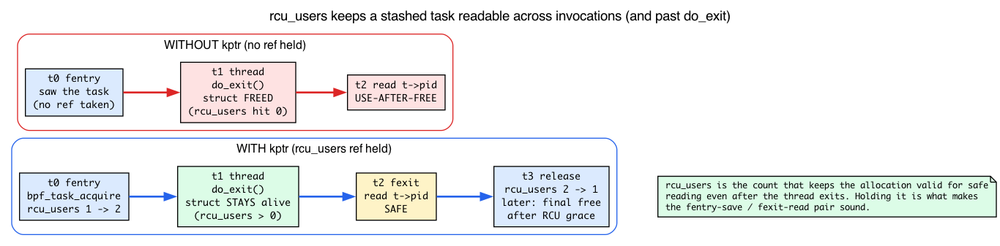
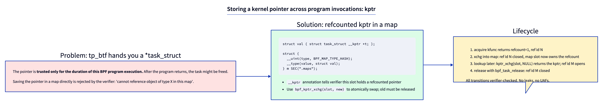
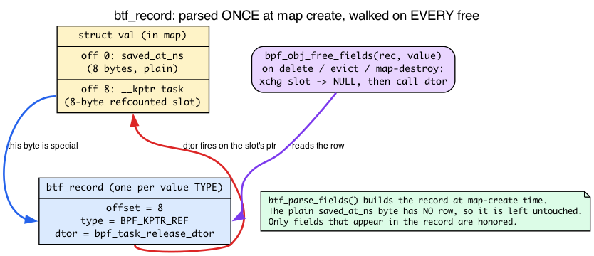
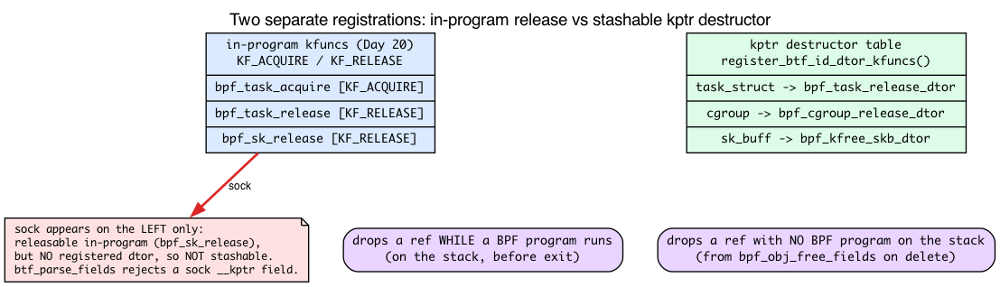
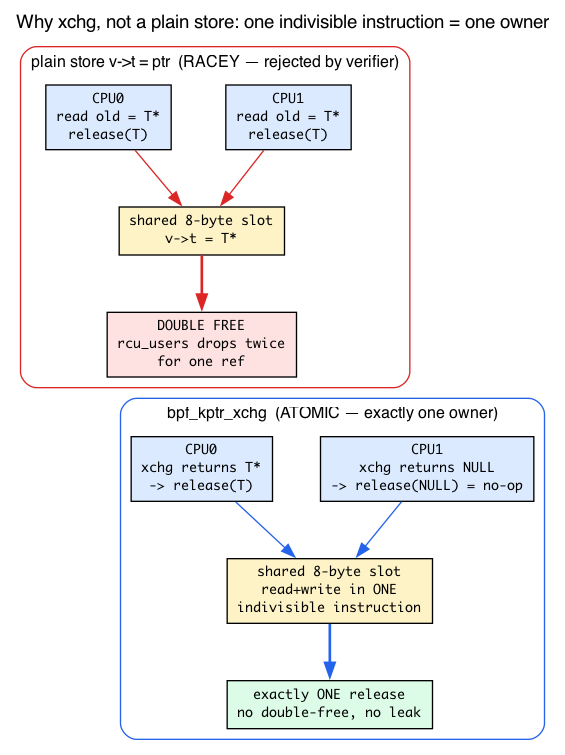
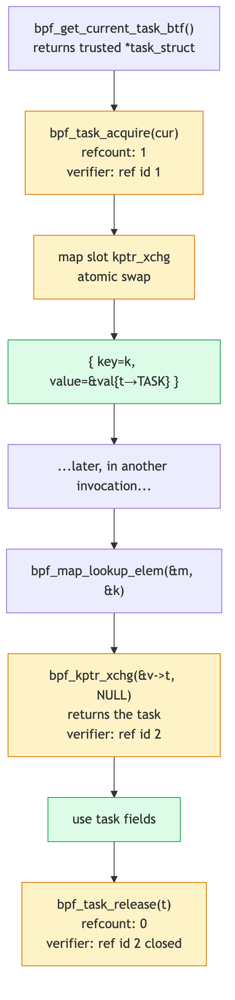

# Day 21 — kptrs in maps: cross-invocation refcounted state

> **Today's mission:** save a `task_struct *` into a hash map at one event, retrieve it later in another, and use the fields — all with refcounts that the verifier proves correct end to end. Along the way you'll learn three things:
>
> - the *one* mechanism behind "auto-release on map delete" (the kernel's `btf_record`),
> - why a release kfunc is necessary-but-not-sufficient to stash a pointer,
> - and exactly why the slot op must be an atomic exchange and not a plain store.
>
> Total time: ~110 minutes.

## The problem with raw pointers

Day 20's lab acquired and released a kernel pointer within a single BPF program invocation. That's safe because the resource's lifetime is bounded by the function call — you ran *in the task's own context*, so the task was trivially alive the whole time.

But often you need to **save** a pointer across invocations. Examples:

- A tracing program that tags an outgoing connection with the originating task, looks the task up later when the connection completes.
- A sched_ext program that remembers a task's last-seen state across enqueue and dispatch.
- A networking program that associates an L2 socket with the parent process.

Naively saving an acquired `task_struct *` into a plain (non-`__kptr`) map value field fails — the verifier rejects storing the referenced pointer:

```
R1 leaks addr into map
```

(the real message, `verifier.c:6355`). The verifier doesn't trust that the pointer will remain valid. **The task could be freed between the save and the read; reading would be a use-after-free.** That last sentence is the whole problem, and to believe today's solution defuses it you need to know exactly *what* keeps a `task_struct` alive — so let's pin that down before we reach for the fix.

### Refresher: the `rcu_users` refcount that keeps an exited task readable

Day 20 walked through the mechanics: `bpf_task_acquire` does `refcount_inc_not_zero(&p->rcu_users)` and `bpf_task_release` calls `put_task_struct_rcu_user(p)`. The one new point that makes cross-invocation stashing *sound* is what that dedicated `rcu_users` count (`refcount_t rcu_users;` at `include/linux/sched.h:1564`) buys you: it keeps the `task_struct` allocation alive for safe reading *even after the thread has called `do_exit()`*. So between your fentry-time save and your fexit-time read (or a read minutes later), the traced thread may exit — and the bytes your stashed pointer points at are still a valid `task_struct`, not freed-and-reused memory.

Two consequences fall out of this:

- **The NULL check on acquire isn't ceremony.** `refcount_inc_not_zero` returns false if the task is *already* at zero `rcu_users` — i.e. fully dying. That's why `bpf_task_acquire` is `KF_RET_NULL` (Day 20) and the lab below checks `if (!acq) return 0;`. The NULL case is literally "task already gone."
- **Releasing can free the struct.** When the last `rcu_users` ref drops — whether via your `bpf_task_release` or via the destructor the kernel runs at map-delete time — `put_task_struct_rcu_user` schedules the final free (after an RCU grace period). The stashed ref genuinely participates in the task's lifetime; the kptr machinery isn't a side-channel.



So the lifetime guarantee is real. What we need now is a way to *hold* that `rcu_users` ref inside a map slot, and to drop it correctly later — even if no BPF program is running when "later" arrives.

## kptrs: refcounted pointer slots

The solution is **`__kptr`** — a struct annotation that tells the verifier "this slot holds a refcounted kernel pointer; track it like the kfunc machinery does, but stored persistently in a map."

```c
struct val {
    struct task_struct __kptr *t;
};

struct {
    __uint(type, BPF_MAP_TYPE_HASH);
    __uint(max_entries, 1024);
    __type(key, __u32);
    __type(value, struct val);
} stash SEC(".maps");
```



The `__kptr` annotation modifies the field: the verifier and the BPF runtime both treat that 8-byte slot as a refcounted pointer that may be NULL or may hold a valid kernel object. The runtime knows how to release it (via the kptr's registered destructor) when the map entry is deleted.

Two flavors:

- **`__kptr`** — the slot owns a refcount. Inserting must consume an acquired reference; reading must take ownership atomically. (Older code may use `__kptr_ref`, but that spelling was removed — current libbpf defines `__kptr`, `__kptr_untrusted`, `__percpu_kptr`, and `__uptr` in `tools/lib/bpf/bpf_helpers.h:193-196`, each a `btf_type_tag` attribute.)
- **`__kptr_untrusted`** — an untrusted kptr: no refcount, no liveness guarantee. It may be stored with a plain assignment and loaded directly, but the loaded pointer is marked `PTR_UNTRUSTED`, so dereferences are treated as potentially-faulting (probe-read) accesses rather than trusted ones.

We focus on `__kptr` (refcounted).

But "the runtime knows how to release it" is doing a *lot* of work in that paragraph. How does the runtime know that one particular 8-byte field, out of all the bytes in your value struct, is special? And how does it know which function to call to free it? That's the mechanism the rest of this chapter is built on, so we'll teach it before the lab — not after.

## How the kernel knows a field is special: `btf_record`

Here is the central idea, and once you have it the whole "auto-release on delete" story stops being magic.

When you create a map whose value type contains a `__kptr` (or a `bpf_spin_lock`, a `bpf_timer`, a `bpf_list_head`, …), the kernel parses the value's BTF **once, at map-creation time**, and builds a small table called a **`btf_record`**. The record lists each "special" field: its byte offset, its type tag, and — for kptrs — the destructor to call when the field is freed.

A `__kptr` is not a language feature the runtime understands intrinsically. It is **just one entry in a general "this field needs special handling" framework.** The field-type tags live in `enum btf_field_type` (`include/linux/bpf.h:194`):

```c
/* include/linux/bpf.h:194 */
enum btf_field_type {
    BPF_SPIN_LOCK   = (1 << 0),   /* :195 */
    BPF_TIMER       = (1 << 1),   /* :196 */
    BPF_KPTR_UNREF  = (1 << 2),   /* :197  — the __kptr_untrusted slot */
    BPF_KPTR_REF    = (1 << 3),   /* :198  — refcounted; what THIS chapter uses */
    BPF_KPTR_PERCPU = (1 << 4),   /* :199 */
    BPF_KPTR        = BPF_KPTR_UNREF | BPF_KPTR_REF | BPF_KPTR_PERCPU,  /* :200 */
    BPF_LIST_HEAD   = (1 << 5),   /* :201 */
    /* ... timers, lists, rbtrees, refcount, workqueue ... */
};
```

The builder is **`btf_parse_fields()`** (`kernel/bpf/btf.c:4072`). It walks the value struct's members and recognizes the `btf_type_tag("kptr")` that the `__kptr` macro emits; when it finds one it records `{offset, BPF_KPTR_REF, dtor}`. This is the deep reason a plain `v->t = ptr` is meaningless to the runtime: the slot is "special" *precisely because it appears in the `btf_record`*, and only operations the verifier routes through that knowledge (the xchg, the free walker) honor it.

Now the payoff. On **every** element free — userspace map delete, whole-map destroy, hashtab eviction — the kernel calls **`bpf_obj_free_fields(record, value)`** (`kernel/bpf/syscall.c:810`), which loops the record and dispatches per field type:

```c
/* kernel/bpf/syscall.c:810 — bpf_obj_free_fields, abridged */
for (i = 0; i < rec->cnt; i++) {
    ...
    switch (fields[i].type) {
    case BPF_SPIN_LOCK:           break;                       /* nothing to free */
    case BPF_TIMER:               bpf_timer_cancel_and_free(...); break;
    case BPF_KPTR_UNREF:          WRITE_ONCE(*(u64 *)field_ptr, 0); break;  /* just zero it */
    case BPF_KPTR_REF:
    case BPF_KPTR_PERCPU:
        xchgd_field = (void *)xchg((unsigned long *)field_ptr, 0);  /* atomic-take */
        if (xchgd_field)
            field->kptr.dtor(xchgd_field);    /* call the registered destructor */
        break;
    ...
    }
}
```

**This loop is the "automatic release."** Notice three things:

1. It's the *same* loop that cancels timers and drains lists — kptrs are not a special case, they're one `case` in a general walker.
2. For a refcounted kptr it does an `xchg`-to-NULL first, then calls `field->kptr.dtor` — the destructor that `btf_parse_fields` stored in the record at map-creation time.
3. It runs **unconditionally on free**. That is the precise reason you *can't leak by deleting*: whether userspace deletes one entry, the map is torn down, or your program crashed and userspace drains the map afterward, every path routes through `bpf_obj_free_fields`. You can see the hashtab call sites for yourself at `kernel/bpf/hashtab.c:475, 852, 1022, 1032, 1040` — per-element free and delete all funnel here.



> ### There are no Dumb Questions
>
> **Q: Is the `btf_record` per-map or per-entry?**
>
> A: Per-map (really per value *type*). It's built once when the map is created and shared by every entry. An entry is just bytes; the record is the schema that says which of those bytes are special and how to free them.
>
> **Q: What if my value struct has no special fields?**
>
> A: Then `btf_parse_fields` returns a NULL/empty record, and `bpf_obj_free_fields` early-returns (`IS_ERR_OR_NULL(rec)`). Plain maps pay nothing. The machinery only kicks in when you actually declare a kptr (or spinlock, timer, list, …).

## What you can store — and the destructor *registration* table

So `bpf_obj_free_fields` calls `field->kptr.dtor`. Where does that function pointer come from, and why can you stash a `task_struct` but not a `struct sock`? This is the part that trips up everyone fresh off Day 20.

Day 20 taught **acquire/release kfuncs** (`KF_ACQUIRE` / `KF_RELEASE`). Those govern refcount handling *within a single program run* — a BPF program calls `bpf_task_release` itself, on the stack, before it exits. Stashing a kptr needs something **extra**: the kernel must be able to drop the ref *later*, from `bpf_obj_free_fields`, with **no BPF program on the stack at all**. That requires a separate, independently-registered lookup table mapping *type → destructor function*.

That table is installed by **`register_btf_id_dtor_kfuncs(dtors, count, module)`** (`kernel/bpf/btf.c:9083`, `EXPORT_SYMBOL_GPL` at `:9156`). It takes an array of `{btf_id, kfunc_btf_id}` pairs meaning "for objects of *this* struct type, call *this* function to release one ref." **Only types that appear in some registered dtor table can be a `__kptr` (`BPF_KPTR_REF`) map slot.** If `btf_parse_fields` finds a kptr field whose type has no registered destructor, it rejects the map.

There's a subtle shape difference worth seeing. The destructor entry point is a thin `void(void *)` wrapper, *distinct* from the typed release kfunc:

```c
/* kernel/bpf/helpers.c:2744 — the typed kfunc BPF programs call */
__bpf_kfunc void bpf_task_release(struct task_struct *p)
{
    put_task_struct_rcu_user(p);
}

/* kernel/bpf/helpers.c:2749 — the void* destructor the kernel calls generically */
__bpf_kfunc void bpf_task_release_dtor(void *p)
{
    put_task_struct_rcu_user(p);
}
CFI_NOSEAL(bpf_task_release_dtor);   /* :2753 */
```

The `void *` shape is what `bpf_obj_free_fields` can call without knowing the type; the typed `bpf_task_release` is what your program calls. They drop the **same `rcu_users` ref** — which ties back to the refresher above: "auto-release on map delete" and your in-program release are the *identical* operation, reached two different ways.

The pairing is built from a BTF id list (`kernel/bpf/helpers.c`):

```c
/* helpers.c:4768 area */
BTF_ID(struct, task_struct)            /* :4769 */
BTF_ID(func,   bpf_task_release_dtor)  /* :4770 */
#ifdef CONFIG_CGROUPS
BTF_ID(struct, cgroup)                 /* :4772 */
BTF_ID(func,   bpf_cgroup_release_dtor)/* :4773 */
#endif
```

and registered as `generic_dtors[]` (`helpers.c:4877`) via `register_btf_id_dtor_kfuncs(generic_dtors, ...)` at `helpers.c:4896`.

### The supported set (and the sock/nf_conn gotcha)

The stashable set is assembled *across subsystems*, each calling `register_btf_id_dtor_kfuncs` at init — which is why "the list grows each release." As of 7.x:

- `struct task_struct __kptr *` — released by `bpf_task_release` (dtor `bpf_task_release_dtor`, registered in `kernel/bpf/helpers.c`).
- `struct cgroup __kptr *` — released by `bpf_cgroup_release` (dtor at `helpers.c:2779`).
- `struct bpf_cpumask __kptr *` — released by `bpf_cpumask_release` (registered in `kernel/bpf/cpumask.c:529`).
- `struct sk_buff __kptr *` — released by `bpf_kfree_skb_dtor` (`net/sched/bpf_qdisc.c:205`, registered at `bpf_qdisc.c:471`, BTF id at `:458`).
- `struct bpf_crypto_ctx __kptr *` — released by the crypto dtor (registered in `kernel/bpf/crypto.c:394`).

Note: `struct sock` is released by a legacy **helper** (`bpf_sk_release`, `BPF_FUNC_sk_release` — a `BPF_CALL_1` at `net/core/filter.c:7199`, *not* a `KF_RELEASE` kfunc), while `struct nf_conn` is released by a release **kfunc** (`bpf_ct_release`, `KF_RELEASE`, `net/netfilter/nf_conntrack_bpf.c:513`). Different mechanisms — but **neither type is registered as a kptr destructor via `register_btf_id_dtor_kfuncs`**, so neither is stashable in a `__kptr` map slot. **"Has a release helper/kfunc" and "is registered as a kptr destructor" are two different registrations.** `bpf_sk_release`/`bpf_ct_release` exist and are callable in-program; nobody registered a `struct sock → destructor` or `struct nf_conn → destructor` entry, so `btf_parse_fields` finds no dtor and rejects the field. Acquire/release within a single program works; cross-invocation map storage does not.



The list grows with each kernel release. Check `Documentation/bpf/kfuncs.rst` for the current set.

## How operations work: the xchg-only API

The only legal operations on a `__kptr` slot are via **`bpf_kptr_xchg`**:

```c
struct task_struct *bpf_kptr_xchg(struct task_struct **dst, struct task_struct *new);
```

It atomically swaps `*dst` with `new` and returns the old value. Plain stores (`v->t = ptr;`) are rejected. Before we list the rules, let's understand *why* it must be an atomic exchange — because that "why" is exactly what the Check question at the end leans on.

### Why an atomic exchange, not a plain store

Recall from Day 2 that **a map slot is shared kernel memory, readable and writable concurrently across CPUs** — that's why bumping a counter there needs an atomic `__sync_fetch_and_add`. The same is true of a kptr slot: two program invocations on different CPUs can touch the same 8-byte field at the same instant.

Here's the kptr-specific twist Day 2 didn't cover: **ownership of a refcount must move atomically.** `xchg(slot, new)` reads the old pointer *and* writes the new one in a single, indivisible instruction, so **exactly one caller observes each old value.** Picture the alternative — two steps, "read old" then "store new":

- Two CPUs both read the same non-NULL old pointer, both call `bpf_task_release` on it → **double-free** (the `rcu_users` count drops twice for one ref).
- Or a store clobbers a pointer whose ref nobody released → **leak** (an `rcu_users` ref stranded forever).

A plain store `v->t = ptr` is rejected at verify time for exactly this reason: it writes the new pointer but never hands back the old one, so the previous occupant's refcount is silently dropped on the floor — and it isn't indivisible anyway. `bpf_kptr_xchg` is the *only* op because it's the only one that both **transfers ownership** and **surfaces the previous owner** for you to release.

The "take" direction is the same trick: `bpf_kptr_xchg(&slot, NULL)` atomically lifts the pointer out and zeroes the slot, so a concurrent taker on another CPU gets `NULL` instead of a second copy of the same ref. That's what makes the retrieve path in the lab safe.

The implementation is literally one instruction (`kernel/bpf/helpers.c:1731`):

```c
/* kernel/bpf/helpers.c:1731 — bpf_kptr_xchg */
BPF_CALL_2(bpf_kptr_xchg, void *, dst, void *, ptr)
{
    unsigned long *kptr = dst;
    return xchg(kptr, (unsigned long)ptr);
}
```

All the safety is in the hardware atomicity plus the verifier's insistence that you account for the returned old value.



### The ref-tracking rules

1. To **store** an acquired pointer into the slot: `bpf_kptr_xchg(&v->t, acq)`. The verifier transfers the ref id from `acq` (your local variable) to the map slot. The slot now owns the refcount.
2. The **return value** of `bpf_kptr_xchg` is the previous occupant. **You must release it.** If non-NULL, call `bpf_task_release(old)`.
3. To **take** the pointer out: `bpf_kptr_xchg(&v->t, NULL)` — atomic-take, leaving slot empty. The returned pointer carries a fresh ref id you must release later.
4. **If the map entry is deleted** while the slot is non-NULL, the kernel automatically calls the registered destructor (`bpf_task_release_dtor` for tasks) on the slot's pointer at `bpf_obj_free_fields` time — the walker we dissected above. No manual cleanup needed; you can't leak by deleting.



## Multiple kptrs in one value struct

You can have multiple kptr fields in the same value:

```c
struct val {
    struct task_struct __kptr *task;
    struct cgroup       __kptr *cg;
    __u64 saved_at_ns;
};
```

Each is exchanged independently. The `btf_record` for this value type has **two** kptr entries (one per offset) plus nothing for `saved_at_ns` — which is plain memory. When the map entry is destroyed, `bpf_obj_free_fields` walks the record and releases *every* kptr field in turn; the non-kptr bytes are ignored. Same mechanism, two rows in the table.

## The lab

```c
{{#include ../labs/day21/task_assoc.bpf.c:book}}
```

Why `filename_unlinkat`? It's a real, stable function — `int filename_unlinkat(int dfd, struct filename *name)` at `fs/namei.c:5536` — on the path of every `rm`/`unlink`. The fentry program runs on the way *in* and stashes; the fexit program runs on the way *out* (the function's return) and retrieves. So the save and the read are genuinely separated in time by the body of `filename_unlinkat`, which is the cross-invocation scenario this whole chapter is about.

Note the manual-release path inside the failed-lookup branch: if the `bpf_map_lookup_elem` right after the upsert somehow returns NULL, `acq` still holds an `rcu_users` ref that the map never took ownership of, so you must `bpf_task_release(acq)` yourself or leak it. The kptr machinery only auto-frees what actually made it *into* a slot.

Build and run (the loader is the standard skeleton open/load/attach pattern and attaches both the fentry and fexit programs):

```c
{{#include ../labs/day21/task_assoc.c:book}}
```

```bash
make task_assoc
sudo ./.output/day21/task_assoc &
touch /tmp/x && rm /tmp/x       # fentry stashes on entry, fexit retrieves on return
sudo cat /sys/kernel/debug/tracing/trace_pipe
```

You'll see one line per `filename_unlinkat` showing the retrieved task and elapsed time.

When you're done watching, stop the loader so the fentry/fexit programs detach:

```bash
sudo pkill -f task_assoc       # or, since it's job 1: kill %1
```

## What to break

### Plain store

```c
vp->task = acq;
```

Verifier rejects with a distinct message — not the leak-class `Unreleased reference` of the next two items, but:

```
store to referenced kptr disallowed
```

The kptr field can only be assigned via `bpf_kptr_xchg`. As the atomic-exchange section explained, a plain store writes the new pointer but never hands back the old one — so it would leak a refcount by overwriting, and it isn't indivisible against a racing CPU. The check lives in `check_map_kptr_access` (`kernel/bpf/verifier.c:4721`); the rejection of any non-load store class targeting a `BPF_KPTR_REF`/`BPF_KPTR_PERCPU` field — `store to referenced kptr disallowed`, returning `-EACCES` — is at `verifier.c:4747`.

### Forget to release the previous occupant

```c
bpf_kptr_xchg(&vp->task, acq);
/* discarded the return value */
```

Verifier rejects with `Unreleased reference id=N alloc_insn=M`. The xchg returned a (possibly non-NULL) old value with its own ref id; discarding that id is a leak.

The pattern is always:

```c
struct task_struct *old = bpf_kptr_xchg(&vp->task, acq);
if (old) bpf_task_release(old);
```

### Forget to release the retrieved kptr

```c
struct task_struct *t = bpf_kptr_xchg(&vp->task, NULL);
if (!t) return 0;
return 0;     /* leak: t still holds a refcount */
```

Rejected at exit: `Unreleased reference id=N alloc_insn=M`.

### Map deletion releases automatically

When userspace deletes a map entry whose kptr slot is still **populated**, the kernel runs the registered destructor (`bpf_task_release_dtor` → `put_task_struct_rcu_user` for tasks) on the slot's pointer at `bpf_obj_free_fields` time — the exact `BPF_KPTR_REF` case of the walker we read earlier. No leak, no manual cleanup, even if your program terminates abnormally and userspace drains the map afterward: the free walker runs whether or not any BPF program is on the stack.

The trouble with demonstrating this in the lab as written: the fexit handler already `bpf_kptr_xchg`'s the slot back to NULL on return (the `struct task_struct *t = bpf_kptr_xchg(&vp->task, NULL)` block through `bpf_task_release(t)` in `on_unlink2`), so by the time any userspace delete runs, the slot is empty and deletion frees nothing. To actually see the destructor fire, **temporarily comment out that fexit retrieval in `on_unlink2`** so entries stay populated, then delete them from userspace:

```c
/* userspace — fd and key are real, not placeholders */
int fd = bpf_map__fd(skel->maps.stash);

/* tid is a per-rm-process key you don't know a priori, so iterate: */
__u32 key = 0, next;
struct val v;
while (bpf_map_get_next_key(fd, &key, &next) == 0) {
    bpf_map_lookup_and_delete_elem(fd, &next, &v);   /* delete fires the kptr dtor */
    key = next;
}
```

Observe the destructor firing — in a second terminal, before you delete:

```bash
sudo bpftrace -e 'kprobe:bpf_task_release_dtor { @releases = count(); printf("dtor fired\n"); }'
```

Probe **`bpf_task_release_dtor`**, not `bpf_task_release` — they are the two distinct symbols we dissected above (the `void *` destructor the kernel calls generically vs. the typed kfunc your program calls). The map-delete path runs `bpf_obj_free_fields` → `field->kptr.dtor`, which is `bpf_task_release_dtor`; it does **not** go through the typed `bpf_task_release`. So this probe fires *only* on the kernel's auto-release path.

Expected result: `@releases` increments once per deleted **populated** slot — that is the kernel invoking the registered kptr destructor on your behalf. Without the kptr machinery you would leak one task refcount per stashed entry.

Nice consequence: because `bpf_task_release_dtor` is a separate symbol from the typed `bpf_task_release(t)` your fexit path calls, this probe naturally isolates the map-delete releases — it does *not* count the in-program release at all, so there's no need to disable the fexit path or compare counts. (If you instead probe `kprobe:bpf_task_release`, you'd catch the in-program release and miss the dtor entirely — the opposite of what you want here.) To confirm the slots were populated before deleting, dump the live map first with `sudo bpftool map dump pinned /sys/fs/bpf/stash` (if you pin the map).

## What to read in the kernel

- **`kernel/bpf/helpers.c:1731`** — `bpf_kptr_xchg`. The implementation. Tiny — it's just `xchg()` plus return. The complexity is in the type checking, not the runtime.

- **`include/linux/bpf.h:194`** — `enum btf_field_type`. The catalog of "special" field tags (`BPF_KPTR_REF` at `:198`, plus spinlocks, timers, lists). A kptr is one entry in this general framework.

- **`kernel/bpf/btf.c:4072`** — `btf_parse_fields`. Walks struct fields, identifies kptrs (and other special types), builds the `btf_record` — looking up each kptr's destructor at parse time and storing it. Read this to understand what makes a struct field "special."

- **`kernel/bpf/btf.c:9083`** — `register_btf_id_dtor_kfuncs`. The `type → destructor` registration entry point. Grep for its callers (`helpers.c:4896`, `cpumask.c:529`, `crypto.c:394`, `bpf_qdisc.c:471`) to see the stashable set assembled across subsystems.

- **`kernel/bpf/syscall.c:810`** — `bpf_obj_free_fields`. The destructor walker. When a map entry is deleted, this iterates the value's `btf_record` and dispatches per field type — `xchg`-to-NULL then dtor for `BPF_KPTR_REF`. This is what frees your kptrs at map-delete time; the hashtab call sites are at `hashtab.c:475, 852, 1022, 1032, 1040`.

- **`kernel/bpf/verifier.c`** — `check_map_kptr_access` (`:4721`) for the store-rejection logic; search `mark_btf_ld_reg` for how the verifier types kptr fields at use sites, and trace `check_kfunc_call` for the acquire/release reference-tracking logic.

- **`tools/testing/selftests/bpf/progs/cpumask_*.c`** — extensive kptr tests, including kptr-in-map patterns.

## Bullet Points

- **kptrs** let BPF programs store refcounted kernel pointers in maps across invocations.
- Annotation: **`__kptr`** in the value struct.
- The kernel knows a field is a kptr because **`btf_parse_fields` builds a `btf_record`** at map-creation time — a table of `{offset, type, dtor}` for each special field. A kptr is one entry in `enum btf_field_type`, alongside spinlocks/timers/lists.
- On every element free, **`bpf_obj_free_fields` walks that record** and fires each kptr's destructor — the *same* loop that cancels timers and drains lists. That is the "automatic release"; it runs with no BPF program on the stack.
- A type is stashable only if some subsystem registered a **`type → destructor` pair via `register_btf_id_dtor_kfuncs`** — a *separate* registration from Day 20's acquire/release kfuncs. (`sock`/`nf_conn` have release kfuncs but no registered dtor, so they're not stashable.)
- The destructor (`bpf_task_release_dtor`) and the in-program release (`bpf_task_release`) drop the **same `rcu_users` ref** — the count that keeps a `task_struct` readable even after the thread exits.
- All access via **`bpf_kptr_xchg`** (atomic exchange). Plain stores rejected — only `xchg` both transfers ownership *and* surfaces the previous owner for you to release; a plain store would leak or race into a double-free.
- xchg returns the old value — **you must release if non-NULL**.
- Map deletion **automatically releases** stored kptrs (registered destructor invoked) — you can't leak by deleting.
- Multiple kptrs per value are independent — each is its own `btf_record` row, released individually on free.
- Supported types (registered kptr destructors): task_struct, cgroup, bpf_cpumask, sk_buff, bpf_crypto_ctx; more added each release.

## Check question

You xchg a new task into a map slot but don't capture the return value. The slot was previously empty. Why does the verifier still reject this?

<details>
<summary>Click to reveal answer</summary>

**Answer:** Because the verifier doesn't know statically that the slot was empty. Even if your program logic guarantees the slot was just initialized to NULL, the verifier has to assume the slot might hold a previously-stored kptr (e.g., from another concurrent invocation that ran in a different CPU context — the lookup-then-xchg pattern is only "atomic" at the xchg, not over the whole sequence).

So `bpf_kptr_xchg(&v->t, acq)` may return a non-NULL refcounted pointer, and the verifier requires every possible non-NULL return to be released. The check is conservative (over-rejects in cases where you happen to know the slot was empty) but it's the only way to be sound — the alternative is "trust the programmer's analysis" which has historically gone badly for kernel safety.

The runtime cost is a no-op when the slot is empty: `bpf_task_release(NULL)` is a NULL-check-then-skip, ~1 ns. The verifier requirement adds zero runtime cost; it just demands you write the conditional.

</details>

---

## Tomorrow

Day 22: struct_ops. Replace a kernel function-pointer table with BPF programs.
