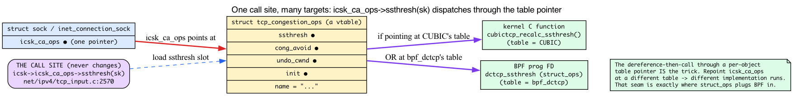
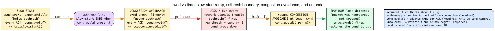
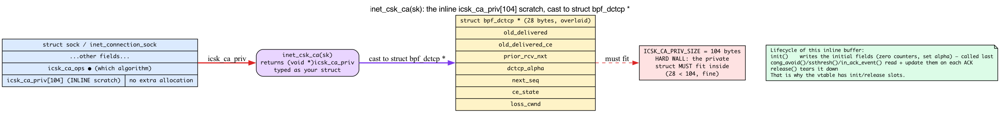

# Day 22 — struct_ops: BPF replaces kernel vtables

> **Today's mission:** load a BPF-implemented TCP congestion control algorithm and use it on a real connection. But first, understand the machine underneath: what a kernel *vtable* is and how the kernel calls through one, what TCP congestion control actually *does* as an algorithm, and where a connection's per-socket scratch state lives. Then watch struct_ops turn BPF from "tracing hooks" into "kernel extension language." Total time: ~120 minutes.

For 21 days, every BPF program you wrote was an **observer**. A kprobe fires, you read some state, you return. An XDP program inspects a packet, you decide pass or drop. Even when you *modified* things — rewrote a packet, set a sockopt — you were standing at a fixed call site the kernel had pre-drilled for you, doing your thing, and handing control back. The kernel did its job; your program watched and nudged.

Today that flips. Today your BPF program *becomes the kernel's job*. It doesn't watch the congestion-control algorithm run — it **is** the congestion-control algorithm. To see how that's even possible, we need to understand the mechanism the kernel already uses to swap algorithms in and out of itself: the **vtable**.

We'll teach three pieces of background before the lab, because without them the canonical example (`bpf_dctcp.c`, which the kernel ships and which this chapter tells you to read end to end) is just opaque slot names:

1. **What a vtable is** — a struct full of function pointers — and how the kernel calls through one to get runtime polymorphism in plain C.
2. **What TCP congestion control means** — `cwnd`, `ssthresh`, slow-start, and the per-ACK callback rhythm — so the slot names `ssthresh`/`cong_avoid`/`undo_cwnd` stop being noise.
3. **Where a CC algorithm keeps its per-connection state** — the inline `icsk_ca_priv` scratch buffer that every `bpf_dctcp` callback reaches via `inet_csk_ca(sk)`.

We'll teach each as we hit the part of struct_ops that depends on it.

---

## What a vtable is: function-pointer tables and runtime polymorphism in C

Start with a problem the kernel faces constantly. There is **one** TCP stack, but there are **many** congestion-control algorithms — CUBIC, BBR, Reno, DCTCP — and a given connection uses exactly one of them, chosen at runtime. The stack's fast path can't `if (using_cubic) … else if (using_bbr) …` at every ACK; that's unmaintainable and slow. C has no classes, no virtual methods. So how does one call site invoke many different implementations?

**The answer is a struct of function pointers — a vtable.** You declare a struct whose members are pointers-to-functions, one per operation. Each algorithm fills in a *separate instance* of that struct, pointing each member at its own implementation. To swap behavior, you don't change the call site — you repoint the object at a different filled-in struct. One call site, many implementations, selected by which table you're pointing at. That is C's way of doing what C++ would call runtime polymorphism.

The kernel's congestion-control vtable is `struct tcp_congestion_ops`. Here it is with fields reordered and trimmed for first reading:

```c
/* include/net/tcp.h:1316 — fields reordered/trimmed for readability;
 * the real layout puts fast-path callbacks first and init/release LAST */
struct tcp_congestion_ops {
    u32   (*ssthresh)(struct sock *sk);
    void  (*cong_avoid)(struct sock *sk, u32 ack, u32 acked);
    void  (*set_state)(struct sock *sk, u8 new_state);
    void  (*cwnd_event)(struct sock *sk, enum tcp_ca_event ev);
    void  (*in_ack_event)(struct sock *sk, u32 flags);
    void  (*pkts_acked)(struct sock *sk, const struct ack_sample *sample);
    u32   (*undo_cwnd)(struct sock *sk);
    /* ... ~10 callbacks ... */
    char name[TCP_CA_NAME_MAX];
    /* ... */
    void  (*init)(struct sock *sk);     /* private-data setup, called last */
    void  (*release)(struct sock *sk);  /* private-data teardown */
};
```

That ordering is honest about being rearranged: in the real `include/net/tcp.h:1316`, the struct opens with a comment saying *"fast path fields are put first to fill one cache line,"* the fast-path callbacks (`cong_avoid`, `cong_control`, `ssthresh`) come first, the control/slow-path fields and `init`/`release` come **last**, and the whole struct ends `____cacheline_aligned_in_smp` — the same cache-line discipline you met for `sk_buff` on Day 1, now applied to a vtable.

### How the kernel actually calls through it

A vtable is useless until something dispatches through it. Each TCP socket carries **one pointer** to the `tcp_congestion_ops` it's currently using:

```c
/* include/net/inet_connection_sock.h:97 */
const struct tcp_congestion_ops *icsk_ca_ops;   /* "Pluggable congestion control hook" */
```

Selecting an algorithm for a connection is nothing more than pointing `icsk_ca_ops` at that algorithm's table. And the TCP fast path calls operations *indirectly, through that pointer*, never naming a concrete algorithm:

```c
/* net/ipv4/tcp_input.c:2570 — on a loss/ECN event, ask the CC for the new threshold */
WRITE_ONCE(tp->snd_ssthresh, icsk->icsk_ca_ops->ssthresh(sk));

/* net/ipv4/tcp_input.c:3517 — per ACK, let the CC advance the window */
icsk->icsk_ca_ops->cong_avoid(sk, ack, acked);

/* net/ipv4/tcp_input.c:3864 — or, if the CC took full control, hand it everything */
icsk->icsk_ca_ops->cong_control(sk, ack, flag, rs);
```

Read `icsk->icsk_ca_ops->ssthresh(sk)` slowly. It means: *follow the socket's CC pointer to a table, load the `ssthresh` slot out of that table, and call whatever function lives there.* If `icsk_ca_ops` points at CUBIC's table, this calls CUBIC's C function. If it points at BBR's, it calls BBR's. **The call site never changes; the target does.** That indirection — the dereference-then-call through a per-object table pointer — is the entire trick, and it is exactly the seam struct_ops plugs BPF into.

Registration is how a table joins the pool of selectable algorithms: `tcp_register_congestion_control()` adds the table to a global list (`tcp_cong_list`) so it can later be looked up by name and assigned to a socket's `icsk_ca_ops`.



### Why this is "kernel extension," not "tracing"

Hold the two models side by side, because this is the whole thesis of the day:

- A **tracing** hook (kprobe, tracepoint, fentry — everything up to Day 21) *observes* at a fixed, pre-drilled call site. The kernel reaches the site, runs its own logic, and on the way past lets your program peek. Your program is a spectator with write access.
- A **struct_ops** program *becomes the call target*. There is no separate "kernel logic" running alongside it — when `icsk_ca_ops->ssthresh(sk)` fires, **your BPF program is the function that runs.** You're not watching the algorithm. You are the algorithm.

That is why this earns the name *kernel extension language* rather than *tracing*. And it ties back to BTF, which you've leaned on since Day 1's `vmlinux.h` and CO-RE (Day 3): the kernel publishes the layout of `struct tcp_congestion_ops` in its own BTF, so when you supply BPF programs for the slots, the verifier can match each callback's signature **slot by slot** against the C struct's declared types. The vtable's shape is the contract; BTF is how both sides agree on it.

The classic example is exactly this — **TCP congestion control**. CUBIC, BBR, Reno, DCTCP are all implementations of `tcp_congestion_ops` in C, each registered via `tcp_register_congestion_control()`. Now you can write one in **BPF**.


---

## What TCP congestion control actually does

The slot names above (`ssthresh`, `cong_avoid`, `undo_cwnd`) are opaque until you know what the algorithm they implement is *for*. The ebpf book hasn't taught congestion control — Day 19 only *named* one via `bpf_setsockopt(..., "bbr")`. So here's exactly enough to read `bpf_dctcp.c` without a networking textbook.

**The problem CC solves.** A TCP sender can't see the network. It doesn't know how much bandwidth is free or how deep the queues are. If it sends too fast, routers drop packets and everyone's throughput collapses; too slow and the link sits idle. Congestion control is the sender's *guessing game*: probe the network, react to feedback, converge on a sending rate.

**`cwnd` — the congestion window.** This is the sender's self-imposed cap on how many **segments** (MSS-sized packets) it will let be "in flight" (sent but not yet ACKed) at once. (Linux's `tp->snd_cwnd` and `tcp_snd_cwnd()` count segments, not bytes — RFCs define `cwnd` in bytes conceptually, but the field and the tooling are in segments.) It's TCP's running guess at how much the network can absorb. `cwnd` is literally what `ss -ti` prints as `cwnd:10` in today's lab — `cwnd:10` means **10 segments**, the algorithm's current guess.

**`ssthresh` — the slow-start threshold.** `cwnd` grows in two different regimes, and `ssthresh` is the boundary between them:

- **Below `ssthresh`: slow-start.** `cwnd` grows roughly *exponentially* — it ramps up fast to find the network's ceiling quickly. You can see the ceiling enforced directly:

  ```c
  /* net/ipv4/tcp_cong.c:456 — tcp_slow_start() */
  u32 cwnd = min(tcp_snd_cwnd(tp) + acked, tp->snd_ssthresh);
  ```
  Every ACK bumps `cwnd` by the number of newly-ACKed segments (`acked`), but it's clamped to `snd_ssthresh`. The moment `cwnd` would cross the threshold, slow-start ends.

- **Above `ssthresh`: congestion avoidance.** `cwnd` grows roughly *linearly* — cautious probing, one segment per round-trip-ish, because we're now near the suspected limit.

The **`ssthresh` callback** is invoked when the network signals trouble (a loss, or an ECN congestion mark) to compute the *new* threshold to drop down to. Reno's is the textbook "cut in half":

```c
/* net/ipv4/tcp_cong.c:515 — tcp_reno_ssthresh() */
return max(tcp_snd_cwnd(tp) >> 1U, 2U);   /* halve cwnd, floor at 2 */
```

That's why `ssthresh` is **required**: a CC algorithm must be able to say how far to back off on congestion. No back-off, no congestion control.

**`cong_avoid` — the per-ACK heartbeat.** Recall the dispatch site `icsk->icsk_ca_ops->cong_avoid(sk, ack, acked)` fires on every eligible ACK (whenever the CC doesn't provide `cong_control`), and the callback itself picks the regime — slow-start below `ssthresh`, linear growth above it. Reno's reference implementation routes through slow-start below the threshold and the linear `tcp_cong_avoid_ai()` above it (`tcp_cong.c:496`). This is why the framework requires **either `cong_avoid` or `cong_control`**: you either let the core stack drive (`cong_avoid` does just the cwnd math, the stack handles pacing/ECN/idle for you), or you take the wheel completely (`cong_control` gets every delivered-packet event and owns all of it). One or the other — that disjunction is real, and it's the literal subject of today's check question.

**`undo_cwnd` — reverse a mistake.** Sometimes TCP cuts `cwnd` for a "loss" that turns out to be spurious (the packet was just reordered, not dropped). `undo_cwnd` restores `cwnd` afterward (`tcp_cong.c:523`). It's **required** so the framework can always reverse a reduction it later regrets.

Now the kernel's required-ops gate reads as plain English — and *this exact function is the answer to today's check question*:

```c
/* net/ipv4/tcp_cong.c:78 — tcp_validate_congestion_control() */
if (!ca->ssthresh || !ca->undo_cwnd ||
    !(ca->cong_avoid || ca->cong_control)) {
    pr_err("%s does not implement required ops\n", ca->name);
    return -EINVAL;
}
```

A minimal real vtable fills exactly those three required slots — here's Reno, the whole thing:

```c
/* net/ipv4/tcp_cong.c:531 */
struct tcp_congestion_ops tcp_reno = {
    .flags    = TCP_CONG_NON_RESTRICTED,
    .name     = "reno",
    .owner    = THIS_MODULE,
    .ssthresh = tcp_reno_ssthresh,    /* required */
    .cong_avoid = tcp_reno_cong_avoid, /* required: cong_avoid OR cong_control */
    .undo_cwnd  = tcp_reno_undo_cwnd,  /* required */
};
```

**The rhythm and the timing.** These callbacks fire on the data-path ACK processing, which runs in **softirq** context. That's why — recall Day 12 — congestion-control struct_ops programs are **non-sleepable**: you cannot block on the ACK fast path. Keep that in mind; it shows up again in "What's verified."

**DCTCP specifically.** Data Center TCP reacts to **ECN CE marks** (explicit congestion notification set by switches *before* they drop) rather than waiting for actual loss, and it adjusts a fractional `alpha` estimate of how congested the path is. That's why `bpf_dctcp.c` implements `set_state`, `in_ack_event` (to fold in ECN feedback), and a `cong_avoid` that leans on Reno's — enough context now to read it without a textbook.



---

## Where a connection keeps its CC state: `inet_csk_ca()`

One more piece, because every callback in `bpf_dctcp.c` opens with the same line and you need to know what it touches:

```c
struct bpf_dctcp *ca = inet_csk_ca(sk);   /* the first line of nearly every callback */
```

DCTCP needs to remember things *per connection* — its `alpha` estimate, a CE-state flag, byte counters. Where does that live? Not in a separate allocation per socket — that'd be a malloc on every connection. Instead, **every TCP socket reserves a fixed inline scratch buffer** for whatever CC algorithm it currently uses:

```c
/* include/net/inet_connection_sock.h:141 */
u64 icsk_ca_priv[104 / sizeof(u64)];   /* 104 bytes of inline per-socket CC scratch */
#define ICSK_CA_PRIV_SIZE sizeof_field(struct inet_connection_sock, icsk_ca_priv)
```

That's 104 bytes sitting *inside* every `inet_connection_sock`, costing nothing extra to allocate. The accessor just hands back a pointer into it, reinterpreted as the algorithm's private struct:

```c
/* include/net/inet_connection_sock.h:153 */
static inline void *inet_csk_ca(const struct sock *sk)
{
    return (void *)inet_csk(sk)->icsk_ca_priv;
}
```

So `inet_csk_ca(sk)` is just *"give me this socket's CC scratch, typed as my struct."* This is why the vtable has `init` and `release` slots, and why `init` is described as "called last": when a socket adopts an algorithm, `init` runs to **lay out that scratch** (zero the counters, set initial `alpha`); `release` tears it down. The slots exist precisely to manage this inline buffer's lifecycle.

There's a hard constraint hiding here: the buffer is **size-bounded** by `ICSK_CA_PRIV_SIZE` (104 bytes). A CC algorithm's private struct *must fit*. That bounds what a BPF struct_ops CC can stash per connection — worth one sentence of respect.

And it connects straight to the lab. `bpf_dctcp.c` declares:

```c
/* tools/testing/selftests/bpf/progs/bpf_dctcp.c:40 */
struct bpf_dctcp {
    __u32 old_delivered;
    __u32 old_delivered_ce;
    __u32 prior_rcv_nxt;
    __u32 dctcp_alpha;
    __u32 next_seq;
    __u32 ce_state;
    __u32 loss_cwnd;
};
```

That 28-byte struct is exactly what lands in `icsk_ca_priv` (well within the 104-byte cap). It's the state `init` writes once, that `cong_avoid`/`ssthresh`/`in_ack_event` read and update on each ACK, and that `release` would tear down.



---

## How struct_ops works

Now the mechanism. A struct_ops module has three parts in BPF source:

1. **Each callback is a separate BPF program** with `SEC("struct_ops/<callback_name>")`.
2. **The vtable instance** is declared in `SEC(".struct_ops")` (or `SEC(".struct_ops.link")` for the modern link-based variant) — a struct of the right type with function pointers pointing at the BPF programs.
3. **The kernel reads the BTF** at load time, validates each callback's signature against the vtable's expected types (the slot-by-slot match we described), and calls `register_${subsystem}` (e.g., `tcp_register_congestion_control`) automatically.

Example skeleton:

```c
SEC("struct_ops/dctcp_init")
void BPF_PROG(my_init, struct sock *sk) { /* ... */ }

SEC("struct_ops/dctcp_ssthresh")
u32 BPF_PROG(my_ssthresh, struct sock *sk) { return /* ... */; }

/* Reuse Reno's cwnd math without rewriting it: declare the kernel's
 * exported function as a kfunc, then CALL it from a one-line BPF program. */
extern void tcp_reno_cong_avoid(struct sock *sk, __u32 ack, __u32 acked) __ksym;

SEC("struct_ops")
void BPF_PROG(my_cong_avoid, struct sock *sk, __u32 ack, __u32 acked)
{
    tcp_reno_cong_avoid(sk, ack, acked);   /* tail into Reno's linear growth */
}

/* ... other callbacks ... */

SEC(".struct_ops.link")
struct tcp_congestion_ops my_dctcp = {
    .init       = (void *)my_init,
    .ssthresh   = (void *)my_ssthresh,
    .cong_avoid = (void *)my_cong_avoid,   /* a BPF program that calls Reno */
    .name       = "my_dctcp",
};
```

Notice the `.cong_avoid = (void *)my_cong_avoid` line. A struct_ops slot **always holds a BPF program** — never a raw kernel function. So how do you "reuse" Reno's existing C math? You don't drop `tcp_reno_cong_avoid` into the slot; you declare it as a **kfunc** (`extern ... __ksym;`) and *call it* from inside a one-line BPF program (`my_cong_avoid`), then assign that BPF wrapper to the slot. The slot is BPF; the BPF body tail-calls into Reno's linear-growth math. (This is exactly what the kernel's own `bpf_dctcp.c` does at `bpf_dctcp.c:231-236,253`: `extern ... tcp_reno_cong_avoid(...) __ksym;`, a `bpf_dctcp_cong_avoid` program whose body is just `tcp_reno_cong_avoid(sk, ack, acked);`, and `.cong_avoid = (void *)bpf_dctcp_cong_avoid`.) Required and optional slots are subsystem-specific. TCP congestion control demands the required-ops gate from earlier (`tcp_validate_congestion_control`); other callbacks may be left NULL only if the TCP CC framework defines that as optional.

> **A note on the `SEC` suffix.** We write `SEC("struct_ops/dctcp_init")` with a named suffix, but the suffix is **optional** — the kernel's own `bpf_dctcp.c` selftest uses a bare `SEC("struct_ops")` on every callback and lets the assignment in the `.struct_ops` vtable bind each program to its slot. Both work; libbpf resolves the binding from the vtable struct, not the section name. Don't be confused if the source you're comparing against omits the suffix.

## The lifecycle


When you load a struct_ops object via libbpf:

1. **Each callback** is loaded as a separate BPF program (separate prog FD).
2. **A struct_ops map** is created — keyed by function-pointer slot, valued by the BPF program FDs that implement each. (This map *is* the in-kernel `tcp_congestion_ops` table that a socket's `icsk_ca_ops` will eventually point at.)
3. **The kernel calls the registration function** of the relevant subsystem. For TCP CC: `tcp_register_congestion_control(my_dctcp)`. The new algorithm name appears in `/proc/sys/net/ipv4/tcp_available_congestion_control`.
4. **Userspace selects it** via `setsockopt(TCP_CONGESTION, "my_dctcp")` per socket, or `sysctl tcp_congestion_control=my_dctcp` system-wide — which, under the hood, repoints that socket's `icsk_ca_ops` at your table.

When the BPF object is unloaded, the registration is reversed and the algorithm goes away.

## What's verified

The verifier does extensive checking on struct_ops modules:

- **Each callback's signature must match** the kernel's vtable definition. Mismatches are rejected at load time — this is the slot-by-slot BTF comparison from earlier.
- **Each callback's BPF program follows normal verifier rules** (no unbounded loops, all pointers checked, etc.).
- **Helper allowance** is per-callback-context. A `struct_ops/dctcp_init` callback runs in TCP slow-path; certain helpers are allowed; XDP-only helpers aren't.
- **Sleepable / non-sleepable** is per-callback. TCP CC callbacks aren't sleepable (they run in softirq on the ACK path, exactly as the CC section explained); some struct_ops vtables (sched_ext) have sleepable subsets.

The **type matching** uses BTF: the kernel knows `struct tcp_congestion_ops` from its own BTF, the BPF object's BTF describes its callbacks' signatures, and the framework (in `bpf_struct_ops.c`) walks the field-by-field comparison. The subsystem also gets a final say: `bpf_struct_ops.c:861` calls `st_ops->validate(kdata)` before `st_ops->reg(kdata, ...)` at `:883` — for TCP CC, `validate` is the very `tcp_validate_congestion_control` required-ops gate you read.

## Why this is huge

It's how **sched_ext** works. Sched_ext exposes `struct sched_ext_ops` — `enqueue`, `dispatch`, `init`, `select_cpu`, etc. A sched_ext BPF scheduler is just a struct_ops module against that vtable. Same plumbing as TCP CC, different vtable — the CPU scheduler's dispatch loop calls through `sched_ext_ops` exactly the way TCP calls through `icsk_ca_ops`.

It's how **Cilium** plans to do certain bits of advanced policy (still evolving). It's how you'd implement a custom HMAC or compression algorithm. Anywhere the kernel has a function-pointer table, struct_ops can let BPF supply implementations.

The general structure of the kernel was already vtable-heavy (`file_operations`, `net_device_ops`, `sched_class`, ...) — every one of those is a `tcp_congestion_ops`-shaped seam: a struct of function pointers the kernel dispatches through. struct_ops makes most of them *potentially* BPF-pluggable, given suitable kernel-side enabling and verifier rules. **One plumbing, many vtables.**

## The lab — load BPF DCTCP

The kernel ships `tools/testing/selftests/bpf/progs/bpf_dctcp.c` — a BPF reimplementation of DCTCP that you can load directly. Everything you just learned is in there: the `struct bpf_dctcp` that lands in `icsk_ca_priv`, reached via the `inet_csk_ca(sk)` line each callback opens with, and the assembled `tcp_congestion_ops` vtable filling the required slots.

### Build and load

```bash
cd ~/code/linux/tools/testing/selftests/bpf
make -j$(nproc)
sudo ./test_progs -t bpf_tcp_ca/dctcp
```

You should see `#NN/1 bpf_tcp_ca/dctcp:OK`. (The DCTCP case lives under the `bpf_tcp_ca` test now; `-t dctcp` on its own matches nothing.) The test loaded the BPF struct_ops, attached it, ran a connection through it, and verified the behavior — but then **tore it down on exit**. `test_progs` only proves the module loads, verifies, and works; it does *not* leave `bpf_dctcp` registered. Check and you'll see no `bpf_dctcp`:

```bash
cat /proc/sys/net/ipv4/tcp_available_congestion_control
# reno cubic bbr
```

Note there's no native `dctcp` in that list by default: on this kernel DCTCP is built as a loadable module (`CONFIG_TCP_CONG_DCTCP=m`) and isn't loaded unless you `sudo modprobe tcp_dctcp`. Its absence here is expected, not a sign the lab failed. (If you *do* load the module, the `dctcp` you'd then see is the kernel's **native C** implementation, `net/ipv4/tcp_dctcp.c` — not our BPF one; don't mistake native `dctcp` for proof the BPF lab worked.)

To make the BPF version persist so the next steps have something to use, register the prebuilt object yourself. `register` installs the struct_ops map in the kernel, which is what keeps the algorithm alive after `bpftool` exits (this object's vtable uses the map-based `SEC(".struct_ops")`, so nothing is actually pinned into the directory — it stays empty):

```bash
# the selftest build above produced bpf_dctcp.bpf.o in this dir
sudo mkdir -p /sys/fs/bpf/dctcp
sudo bpftool struct_ops register bpf_dctcp.bpf.o /sys/fs/bpf/dctcp
```

`bpf_dctcp.bpf.o` carries **two** vtables (`dctcp` → name `bpf_dctcp`, and `dctcp_nouse` → name `bpf_dctcp_nouse`). On v7.1 only `bpf_dctcp` registers — `dctcp_nouse` is intentionally incomplete (it defines only `init`/`set_state`, not the required `ssthresh`/`undo_cwnd`/`cong_avoid`), so `tcp_validate_congestion_control` rejects it with the `does not implement required ops` error and `bpftool` prints a non-fatal error while still registering the valid one. This is the required-ops gate from earlier firing in real life:

```bash
sudo bpftool struct_ops register bpf_dctcp.bpf.o /sys/fs/bpf/dctcp
# Error: can't register struct_ops dctcp_nouse: Invalid argument
# Registered tcp_congestion_ops dctcp id <id>

cat /proc/sys/net/ipv4/tcp_available_congestion_control
# reno cubic bbr bpf_dctcp
# (registration is purely additive — the base algorithms stay; bpf_dctcp is appended)
```

When you're done with the whole lab, unregister the algorithm. Because `bpf_dctcp.c` uses the map-based `SEC(".struct_ops")` (not `.struct_ops.link`), `register` does not pin a link into the directory — so removing the directory alone does **not** unregister it. Use `unregister`, then clean up the (empty) pin dir:

```bash
sudo bpftool struct_ops unregister name dctcp
sudo rm -rf /sys/fs/bpf/dctcp
```

### Use it on a connection

In a small C program:
```c
int sock = socket(AF_INET, SOCK_STREAM, 0);
setsockopt(sock, IPPROTO_TCP, TCP_CONGESTION, "bpf_dctcp", 9);
/* now this connection's icsk_ca_ops points at our BPF table */
```

Or via iperf3 against a local loopback server (install iperf3 if it's missing). This needs `bpf_dctcp` registered from the step above. An unprivileged `setsockopt(TCP_CONGESTION)` only accepts algorithms in `tcp_allowed_congestion_control`, which by default is a subset of the *available* list — so add `bpf_dctcp` to it first (save the original to restore later):

```bash
ORIG=$(cat /proc/sys/net/ipv4/tcp_allowed_congestion_control)
sudo sysctl -w net.ipv4.tcp_allowed_congestion_control="$ORIG bpf_dctcp"
```

In terminal 1:

```bash
iperf3 -s
```

In terminal 2, run a transfer long enough to inspect mid-flight, asking for the BPF CC:

```bash
iperf3 -c 127.0.0.1 -C bpf_dctcp -t 30
```

In terminal 3, while the transfer runs, confirm the socket actually negotiated it. `ss -ti` prints the congestion-control name at the **start** of each connection's TCP-info line, so a substring match is enough — and the `cwnd:` field you'll see there is the exact congestion window the CC section taught:

```bash
ss -ti dst 127.0.0.1 | grep bpf_dctcp
#	 bpf_dctcp wscale:7,7 rto:204 rtt:0.05/0.02 ... cwnd:10 ...
```

A hit proves this connection is running BPF-provided DCTCP — that socket's `icsk_ca_ops` is pointing at a table whose slots are your BPF programs, and the kernel's `cong_avoid`/`ssthresh` dispatch sites are calling into them on every ACK. (Don't use `grep -A1` — the CC name is inline on the info line, not the line after.) If `iperf3 -c` fails with `unable to set TCP_CONGESTION: Supplied congestion control algorithm not supported on this host`, the algorithm isn't registered or isn't in the *allowed* list — go back and run the `bpftool struct_ops register` and `sysctl ... tcp_allowed_congestion_control` steps. When you're done, restore the allowed list: `sudo sysctl -w net.ipv4.tcp_allowed_congestion_control="$ORIG"`.

### Inspect

These need the struct_ops live, so run them only after the `bpftool struct_ops register` step above (after `test_progs` exits, nothing is loaded and `list` prints nothing while `dump` returns `[]`). The registered map takes the name of its `SEC(".struct_ops")` variable — **`dctcp`** — not the algorithm name `bpf_dctcp` set in `.name`, so `dump name dctcp` is what matches (and `dctcp_nouse` was rejected at register time):

```bash
sudo bpftool struct_ops list
# <id>: dctcp            tcp_congestion_ops

sudo bpftool struct_ops dump name dctcp
```

`dump` shows the vtable field-by-field, with each implemented function-pointer slot (`ssthresh`, `cong_avoid`, `init`, `undo_cwnd`, ...) resolved to the BPF prog id that serves it. That's the payoff, and it's the literal picture from the start of the day: a kernel function-pointer table whose entries are BPF programs, ready for a socket's `icsk_ca_ops` to point at.

## There are no Dumb Questions

> **Q: If a vtable is just a struct of function pointers, what stops me from writing garbage into a slot and crashing the kernel?**
>
> A: The verifier and the BTF signature match. You don't write a raw pointer — you supply a *BPF program* for each slot, and the kernel checks that program's signature against the vtable field's declared type (slot by slot, via BTF) before it'll bind it. A type mismatch is rejected at load time. Then the subsystem's own `validate` callback (`bpf_struct_ops.c:861`) gets a veto — for TCP CC that's `tcp_validate_congestion_control`, which rejects you for missing required ops. C lets *kernel* code stuff any function pointer into a vtable; struct_ops deliberately does not extend that trust to BPF.

> **Q: I want Reno's `cong_avoid` math without rewriting it — can I just put `.cong_avoid = (void *)tcp_reno_cong_avoid` in the slot?**
>
> A: No — a struct_ops slot can only hold a *BPF program*, never a raw kernel function. Writing the kernel symbol directly into the `.struct_ops` vtable emits a relocation against an undefined extern, and the object fails to load (libbpf demands every slot resolve to a `BPF_PROG_TYPE_STRUCT_OPS` program). The trick is one level of indirection: declare `tcp_reno_cong_avoid` as a kfunc (`extern void tcp_reno_cong_avoid(struct sock *sk, __u32 ack, __u32 acked) __ksym;`), write a one-line BPF program whose body just *calls* it (`tcp_reno_cong_avoid(sk, ack, acked);`), and assign **that BPF wrapper** to the slot. So the slot holds your BPF trampoline; the dispatch site calls your BPF program, which tail-calls into Reno's C math. That's the kernel's own pattern in `bpf_dctcp.c`.

> **Q: Where does my per-connection state actually live, and what bounds its size?**
>
> A: In the socket's inline `icsk_ca_priv[104]` buffer, reached via `inet_csk_ca(sk)`. Your private struct (the BPF `struct bpf_dctcp`) is overlaid onto those 104 bytes — no separate allocation. The hard cap is `ICSK_CA_PRIV_SIZE` (104 bytes). If your CC needs more per-connection memory than that, you'd have to stash the overflow in a BPF map keyed by socket, not in `icsk_ca_priv`.

## What to read in the kernel

- **`kernel/bpf/bpf_struct_ops.c`** — the framework. ~1500 lines. Read top to bottom (it's surprisingly readable). Key entry points:
  - `bpf_struct_ops_map_alloc_check` (line 1021) — validates a struct_ops map type.
  - `bpf_struct_ops_map_alloc` (line 1043) — creates the map and binds BPF prog FDs to vtable slots.
  - `st_ops->validate` then `st_ops->reg` (lines 861 / 883) — the subsystem's signature/required-ops check, then the actual registration.
  - `bpf_struct_ops_link_create` (line 1360) — for `SEC(".struct_ops.link")`, creates a bpf_link.
  - `bpf_struct_ops_test_run` — used by selftests to invoke a callback in a controlled environment.

- **`include/net/tcp.h:1316`** — `struct tcp_congestion_ops`. The vtable shape that BPF DCTCP implements. Read each callback's docstring; that's what your BPF program is expected to do. Note the "fast path fields first / control paths last" comments.

- **`net/ipv4/tcp_cong.c`** — the CC framework core. Read `tcp_validate_congestion_control` (line 78 — the required-ops gate), `tcp_slow_start` (line 456 — the `ssthresh` ceiling), and the Reno reference (`tcp_reno_cong_avoid`/`tcp_reno_ssthresh`/`tcp_reno_undo_cwnd` at 496/515/523, assembled into `tcp_reno` at 531). This is the minimal real vtable to compare yours against.

- **`net/ipv4/tcp_dctcp.c`** — the **C** reference implementation of DCTCP. Compare against `tools/testing/selftests/bpf/progs/bpf_dctcp.c` field-by-field. The BPF version is a near-mechanical port; reading both side-by-side teaches the conversion idiom.

- **`tools/testing/selftests/bpf/progs/bpf_dctcp.c`** — the canonical BPF struct_ops example. Read end to end. Notice the `inet_csk_ca(sk)` line atop each callback (your `struct bpf_dctcp` overlaid on `icsk_ca_priv`), the bare `SEC("struct_ops")` per callback, and the `SEC(".struct_ops")` containing the assembled vtable.

- **`kernel/sched/ext.c`** — sched_ext. ~10000 lines. The other big struct_ops user. Same pattern: a vtable (`struct sched_ext_ops`), per-callback BPF programs, dispatched through a function-pointer table.

- **`Documentation/bpf/struct_ops.rst`** — official guide. Brief but pointed. (Not present in the v7.1 tree; check the in-tree `Documentation/bpf/` index for the current struct_ops write-up.)

## Bullet Points

- **A vtable** is a struct of function pointers; the kernel keeps one pointer per operation and dispatches *indirectly* (`icsk_ca_ops->ssthresh(sk)`) so one call site can invoke many implementations. Swapping behavior = repointing the table pointer. That indirection is the seam struct_ops fills.
- **Tracing observes; struct_ops becomes the target.** A struct_ops BPF program *is* the function the kernel calls — that's why it's "kernel extension," not "tracing."
- **TCP congestion control:** `cwnd` is the in-flight cap in **segments** (the `cwnd:10` in `ss -ti` = 10 segments); `ssthresh` is the slow-start→congestion-avoidance boundary; `cong_avoid` runs per ACK; `undo_cwnd` reverses spurious cuts. CC callbacks run in **softirq → non-sleepable**.
- **Required ops (TCP CC):** `ssthresh`, `undo_cwnd`, and **either** `cong_avoid` **or** `cong_control` — enforced by `tcp_validate_congestion_control` (`tcp_cong.c:78`).
- **Per-connection state** lives in the socket's inline `icsk_ca_priv[104]` buffer, reached via `inet_csk_ca(sk)`; `init`/`release` set it up and tear it down; it's size-capped at `ICSK_CA_PRIV_SIZE`.
- **struct_ops** lets BPF supply implementations for kernel function-pointer tables. Each callback is a separate BPF program (`SEC("struct_ops/X")`); the vtable struct lives in `SEC(".struct_ops")` or `.struct_ops.link`.
- Loading the map auto-registers the implementation with the kernel subsystem (TCP CC, sched_ext, etc.). **The verifier checks each callback's signature against the kernel's BTF** for the vtable struct — mismatches caught at load time.
- **Partial implementations are subsystem-specific**: TCP CC requires the three ops above; optional slots may remain NULL. To reuse a kernel C routine like Reno's `cong_avoid`, you can't put the C function in the slot — declare it as a kfunc and call it from a one-line BPF program assigned to the slot.
- **Used by:** TCP CC, sched_ext, congestion-control modules, struct_ops growing per release. Inspect with `bpftool struct_ops list/dump`.

## Check question

If you load a BPF struct_ops module that defines only some callbacks (e.g., `init` and `ssthresh` but not `cong_avoid`), what happens to TCP connections using your CC?

<details>
<summary>Click to reveal answer</summary>

**Answer:** For TCP congestion control, that object is rejected unless the required callbacks are present — the required-ops gate from earlier (`tcp_validate_congestion_control`, `net/ipv4/tcp_cong.c:78`; the required-ops `if` is at `:81-82`) `pr_err`s `does not implement required ops` and returns `-EINVAL`. (That's exactly why `dctcp_nouse` in the lab — which defines only `init`/`set_state` — fails to register.) If you want Reno's `cong_avoid` behavior, you can't drop the C function into the slot: declare `tcp_reno_cong_avoid` as a kfunc and call it from a one-line BPF `cong_avoid` program, then assign *that* program to the slot.

Struct_ops does not have a universal "unset slots fall back" rule. Each subsystem decides which callbacks are required, which are optional, and what a NULL optional callback means. sched_ext, TCP CC, and future struct_ops users have different contracts.

</details>

---

## Tomorrow

Day 23: actually modify BPF DCTCP. Add ringbuf logging that emits per-ACK telemetry, and watch a real iperf3 run produce per-segment data — reading your `struct bpf_dctcp` state out of `icsk_ca_priv` as each ACK fires.
