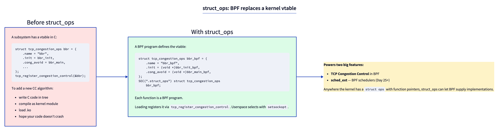
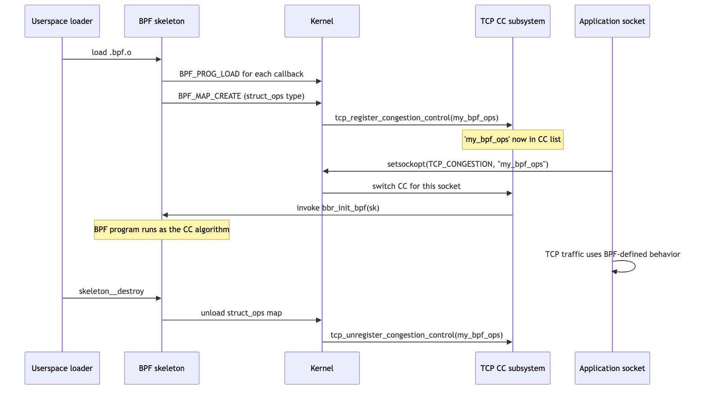

# Day 22 — struct_ops: BPF replaces kernel vtables

> **Today's mission:** load a BPF-implemented TCP congestion control algorithm and use it on a real connection. Understand how struct_ops turns BPF from "tracing hooks" into "kernel extension language." Total time: ~75 minutes.

## What changed in BPF around 2022

For most of BPF's history, BPF programs were **hooks** — fire on event, observe or modify, return. Useful but reactive. Tracing programs read state. Networking programs decide pass/drop. None of them *implemented kernel functionality* — the kernel did its work; BPF watched.

Around 2022, the pattern flipped. BPF programs can now **provide implementations** for kernel function-pointer tables — the same vtables the kernel itself uses internally for pluggable algorithms.



The classic example is **TCP congestion control**. The kernel has a vtable:

```c
/* include/net/tcp.h:1315 */
struct tcp_congestion_ops {
    void  (*init)(struct sock *sk);
    void  (*release)(struct sock *sk);
    u32   (*ssthresh)(struct sock *sk);
    void  (*cong_avoid)(struct sock *sk, u32 ack, u32 acked);
    void  (*set_state)(struct sock *sk, u8 new_state);
    void  (*cwnd_event)(struct sock *sk, enum tcp_ca_event ev);
    u32   (*undo_cwnd)(struct sock *sk);
    void  (*pkts_acked)(struct sock *sk, const struct ack_sample *sample);
    /* ... ~10 callbacks ... */
    char name[TCP_CA_NAME_MAX];
    /* ... */
};
```

CUBIC, BBR, Reno, DCTCP — all implementations of this vtable in C, registered via `tcp_register_congestion_control()`. Now you can write one in **BPF**.

## How struct_ops works

A struct_ops module has three parts in BPF source:

1. **Each callback is a separate BPF program** with `SEC("struct_ops/<callback_name>")`.
2. **The vtable instance** is declared in `SEC(".struct_ops")` (or `SEC(".struct_ops.link")` for the modern link-based variant) — a struct of the right type with function pointers pointing at the BPF programs.
3. **The kernel reads the BTF** at load time, validates each callback's signature against the vtable's expected types, and calls `register_${subsystem}` (e.g., `tcp_register_congestion_control`) automatically.

Example skeleton:

```c
SEC("struct_ops/dctcp_init")
void BPF_PROG(my_init, struct sock *sk) { /* ... */ }

SEC("struct_ops/dctcp_ssthresh")
u32 BPF_PROG(my_ssthresh, struct sock *sk) { return /* ... */; }

/* ... other callbacks ... */

SEC(".struct_ops.link")
struct tcp_congestion_ops my_dctcp = {
    .init       = (void *)my_init,
    .ssthresh   = (void *)my_ssthresh,
    .cong_avoid = (void *)tcp_reno_cong_avoid,  /* fall back to Reno's C impl */
    .name       = "my_dctcp",
};
```

Notice the `.cong_avoid = tcp_reno_cong_avoid` line — **you can mix BPF callbacks with the kernel's existing C callbacks**. Unset slots fall back to defaults. Partial overrides are supported.

## The lifecycle



When you load a struct_ops object via libbpf:

1. **Each callback** is loaded as a separate BPF program (separate prog FD).
2. **A struct_ops map** is created — keyed by function-pointer slot, valued by the BPF program FDs that implement each.
3. **The kernel calls the registration function** of the relevant subsystem. For TCP CC: `tcp_register_congestion_control(my_dctcp)`. The new algorithm name appears in `/proc/sys/net/ipv4/tcp_available_congestion_control`.
4. **Userspace selects it** via `setsockopt(TCP_CONGESTION, "my_dctcp")` per socket, or `sysctl tcp_congestion_control=my_dctcp` system-wide.

When the BPF object is unloaded, the registration is reversed and the algorithm goes away.

## What's verified

The verifier does extensive checking on struct_ops modules:

- **Each callback's signature must match** the kernel's vtable definition. Mismatches are rejected at load time.
- **Each callback's BPF program follows normal verifier rules** (no unbounded loops, all pointers checked, etc.).
- **Helper allowance** is per-callback-context. A `struct_ops/dctcp_init` callback runs in TCP slow-path; certain helpers are allowed; XDP-only helpers aren't.
- **Sleepable / non-sleepable** is per-callback. TCP CC callbacks aren't sleepable (run in softirq); some struct_ops vtables (sched_ext) have sleepable subsets.

The **type matching** uses BTF: the kernel knows `struct tcp_congestion_ops` from its own BTF, the BPF object's BTF describes its callbacks' signatures, and the verifier (in `bpf_struct_ops.c`) walks the field-by-field comparison.

## Why this is huge

It's how **sched_ext** works. Sched_ext exposes `struct sched_ext_ops` — `enqueue`, `dispatch`, `init`, `select_cpu`, etc. A sched_ext BPF scheduler is just a struct_ops module against that vtable. Same plumbing as TCP CC, different vtable.

It's how **Cilium** plans to do certain bits of advanced policy (still evolving). It's how you'd implement a custom HMAC or compression algorithm. Anywhere the kernel has a function-pointer table, struct_ops can let BPF supply implementations.

The general structure of the kernel was already vtable-heavy (file_operations, net_device_ops, sched_class, ...). struct_ops makes most of those *potentially* BPF-pluggable, given suitable kernel-side enabling and verifier rules.

## The lab — load BPF DCTCP

The kernel ships `tools/testing/selftests/bpf/progs/bpf_dctcp.c` — a BPF reimplementation of DCTCP that you can load directly.

### Build and load

```bash
cd ~/code/linux/tools/testing/selftests/bpf
make -j$(nproc)
sudo ./test_progs -t dctcp
```

You should see `#NN/N dctcp:OK`. The test loaded the BPF struct_ops, registered it as `bpf_dctcp`, and verified that a connection using it behaves correctly.

After the test completes, the algorithm stays registered if the test left it loaded. Verify:

```bash
cat /proc/sys/net/ipv4/tcp_available_congestion_control
# Should include 'bpf_dctcp' alongside cubic, reno, etc.
```

### Use it on a connection

In a small C program:
```c
int sock = socket(AF_INET, SOCK_STREAM, 0);
setsockopt(sock, IPPROTO_TCP, TCP_CONGESTION, "bpf_dctcp", 9);
/* now this connection uses BPF-provided DCTCP */
```

Or via iperf3:
```bash
iperf3 -c <server> -C bpf_dctcp
```

### Inspect

```bash
sudo bpftool struct_ops list
sudo bpftool struct_ops dump name dctcp
```

Shows the vtable bound and which BPF prog FD serves each callback.

## What to read in the kernel

- **`kernel/bpf/bpf_struct_ops.c`** — the framework. ~1500 lines. Read top to bottom (it's surprisingly readable). Key entry points:
  - `bpf_struct_ops_map_alloc_check` — validates a struct_ops map type.
  - `bpf_struct_ops_map_alloc` — creates the map and binds BPF prog FDs to vtable slots.
  - `bpf_struct_ops_link_create` (line 1360) — for `SEC(".struct_ops.link")`, creates a bpf_link.
  - `bpf_struct_ops_test_run` — used by selftests to invoke a callback in a controlled environment.

- **`include/net/tcp.h:1315`** — `struct tcp_congestion_ops`. The vtable shape that BPF DCTCP implements. Read each callback's docstring; that's what your BPF program is expected to do.

- **`net/ipv4/tcp_dctcp.c`** — the **C** reference implementation of DCTCP. Compare against `tools/testing/selftests/bpf/progs/bpf_dctcp.c` field-by-field. The BPF version is a near-mechanical port; reading both side-by-side teaches the conversion idiom.

- **`tools/testing/selftests/bpf/progs/bpf_dctcp.c`** — the canonical BPF struct_ops example. Read end to end. Notice the `SEC("struct_ops/...")` per callback and the `SEC(".struct_ops")` containing the assembled vtable.

- **`kernel/sched/ext.c`** — sched_ext. ~5000 lines. The other big struct_ops user. Same pattern: a vtable (`struct sched_ext_ops`), per-callback BPF programs.

- **`Documentation/bpf/struct_ops.rst`** — official guide. Brief but pointed.

## Bullet Points

- **struct_ops** lets BPF supply implementations for kernel function-pointer tables (vtables).
- Each callback is a separate BPF program (`SEC("struct_ops/X")`); the vtable struct lives in `SEC(".struct_ops")` or `.struct_ops.link`.
- Loading the map auto-registers the implementation with the kernel subsystem (TCP CC, sched_ext, etc.).
- The **verifier checks each callback's signature** against the kernel's BTF for the vtable struct — mismatches caught at load time.
- **Partial implementations** are supported: unset slots fall back to default callbacks.
- **Used by:** TCP CC, sched_ext, congestion-control modules, struct_ops growing per release.
- Inspect: `bpftool struct_ops list/dump`.

## Check question

If you load a BPF struct_ops module that defines only some callbacks (e.g., `init` and `ssthresh` but not `cong_avoid`), what happens to TCP connections using your CC?

<details>
<summary>Click to reveal answer</summary>

**Answer:** Unset slots fall back to default implementations defined in the kernel. For TCP CC specifically, `cong_avoid` falls back to `tcp_reno_cong_avoid` (or whatever the framework's default is). So your CC behaves like Reno-with-custom-ssthresh for the unset callback. This is **partial implementation**, and it's useful when you only want to override one or two policies and inherit the rest. The kernel doesn't reject your incomplete vtable — it accepts it and substitutes defaults for missing slots.

This is the same pattern used by struct_ops users in the rest of the kernel — sched_ext schedulers commonly implement only a subset of `sched_ext_ops` callbacks, letting the framework fill in safe defaults for the rest. It encourages "build minimal, evolve incrementally" — you don't need a 30-callback implementation to test one new idea.

</details>

---

## Tomorrow

Day 23: actually modify BPF DCTCP. Add ringbuf logging that emits per-ACK telemetry, and watch a real iperf3 run produce per-segment data.
