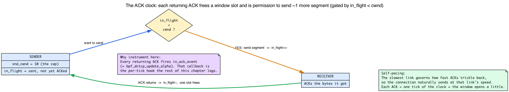
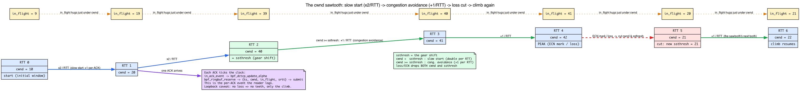

# Day 23 — Modify BPF DCTCP and instrument it

> **Today's mission:** take yesterday's BPF DCTCP, learn what TCP's congestion control actually *does* (so the numbers mean something), add per-ACK telemetry to a ringbuf, run a real `iperf3`, and watch TCP's internal state in real time. Total time: ~110 minutes.

## Why this exercise

Yesterday loaded a stranger's BPF DCTCP. Today changes one and observes the effect. This is the most important struct_ops skill: **small, surgical modifications to working code**.

Goal: emit one event per ACK to a ringbuf, with the connection's current `cwnd`, `in_flight`, and `srtt`. Watch a transfer; correlate transfer events to internal TCP state.

This pattern — instrument an existing struct_ops module without changing its policy — is invaluable. You can debug a misbehaving CC algorithm, study how an unfamiliar one works, or feed real-time TCP state into your own monitoring system.

But here's the catch: the payoff of this whole chapter is that you can *read* the four numbers you're about to log — `cwnd`, `in_flight`, `srtt`, `ssthresh` — and know what they mean. Day 22 introduced `cwnd` and `ssthresh` and let you watch `cwnd:10` scroll by in `ss -ti`. Today we add the two numbers it didn't cover — `in_flight` (how full the pipe is *right now*) and `srtt` (the smoothed RTT) — plus the framing that ties all four together: the **ACK clock**. We'll recap `cwnd`/`ssthresh` in a sentence each and link back to Day 22 rather than rebuild them. Skip this section and the telemetry is just noise; read it and the ringbuf becomes a window into TCP's heartbeat.

## The thing TCP is fighting: the ACK clock

Picture a sender with a 1 GB file and a network of unknown capacity. If it blasts all 1 GB onto the wire at once, it overruns some router's queue, that router drops packets, and everyone's throughput collapses. So TCP does the opposite of blasting: it sends a *little*, waits to hear that it arrived, and only then sends a little more. The "hearing that it arrived" is the **ACK** — the receiver acknowledges bytes it got.

This feedback loop is the **ACK clock**. Each ACK that comes back is permission to send roughly one more segment's worth of data. The connection self-paces to the speed of the slowest link, because that link is what governs how fast ACKs trickle back. Everything TCP congestion control does is bookkeeping around this one idea: *how much am I allowed to have outstanding, and how do I adjust that as ACKs arrive?*

That bookkeeping is exactly four numbers.



### `cwnd` — the congestion window (the speed limit)

*Recap from Day 22:* `snd_cwnd` is the cap on how many segments may be unacknowledged — *in flight* — at any instant, measured in **packets** (MSS-sized segments), not bytes. New connections start at the kernel's initial window of 10 segments (`cwnd:10` is what you saw in `ss -ti`) and grow it as the path proves it can take more. The only addition for today: `cwnd` is the speed limit that `in_flight` rides just underneath.

```c
/* include/linux/tcp.h:225 */
u32	snd_cwnd;	/* Sending congestion window		*/
```

### `in_flight` — how full the pipe currently is

`in_flight` is the count of segments **sent but not yet ACKed**. The fundamental rule of the ACK clock is:

> the sender may keep sending only while `in_flight < cwnd`.

When a segment is sent, `in_flight` goes up. When an ACK arrives covering that segment, `in_flight` drops and a slot in the window frees up — which is precisely *why `in_ack_event` is the natural instrumentation hook*. That callback fires on each incoming ACK, i.e. each tick of the ACK clock, each moment the window opens a little. Watching the ringbuf is literally watching the clock tick.

The kernel doesn't store `in_flight` as a field; it computes it (we'll see the exact formula below) from `packets_out`:

```c
/* include/linux/tcp.h:308 */
u32	packets_out;	/* Packets which are "in flight"	*/
```

### `ssthresh` — the gear shift between two growth modes

*Recap from Day 22:* `snd_ssthresh` (the *slow-start threshold*) is the boundary between TCP's two growth phases — slow start below it (`cwnd` grows ~exponentially, doubling per RTT) and congestion avoidance at/above it (`cwnd` grows ~linearly, +1 per RTT). Day 22 derived both; the kernel's test is one comparison:

```c
/* include/linux/tcp.h:248 */
u32	snd_ssthresh;	/* Slow start size threshold		*/
```

```c
/* include/net/tcp.h:1520 */
static inline bool tcp_in_slow_start(const struct tcp_sock *tp)
{
	return tcp_snd_cwnd(tp) < tp->snd_ssthresh;
}
```

What's new for today is the **gear-shift / cutback** framing: DCTCP's `bpf_dctcp_ssthresh` callback is what computes the *new* `ssthresh` when a congestion signal arrives — it decides where the gear shift lands after a cutback, which feeds the sawtooth below.

### Loss: the sawtooth collapse

What happens on congestion (a loss, or for DCTCP an ECN signal)? TCP **cuts `cwnd`** and sets `ssthresh` to the reduced value. Classic Reno halves it; that's the famous **sawtooth**: a slow linear climb, a sudden halving, climb again, halve again. This collapse is the entire basis of the anomaly-detection use case at the end of today — *a sudden drop in `in_flight`/`cwnd` correlated with an RTT spike is a loss event.* (And it's why the loopback caveat later matters: over `127.0.0.1` there is no loss, so you only ever see the monotonic climb, never the teeth.)



### `srtt` — the smoothed round-trip time

The last number is timing. `srtt_us` is the **smoothed RTT**: an exponentially weighted moving average (EWMA) of measured round-trip samples. TCP uses it to set retransmit timeouts — "if I haven't heard back in roughly `srtt` plus some slack, assume the segment is lost." A single fluky sample shouldn't swing the timeout wildly, so TCP smooths.

```c
/* include/linux/tcp.h:307 */
u32	srtt_us;	/* smoothed round trip time << 3 in usecs */
```

Note the `<< 3`: the field is stored in **eighths of a microsecond**. The kernel keeps three extra low bits of precision so the EWMA can track sub-microsecond changes without floating point. To read microseconds you shift right by 3 — which is exactly the `>> 3` you'll write in Step 2, and the bug you'll deliberately introduce later if you forget it.

### Putting it together

One ACK arrives → `tcp_in_ack_event` calls your `in_ack_event` callback → inside it `cwnd` may have just grown, `in_flight` has dropped by the acked amount, and `srtt` has been updated from the new RTT sample. Three of the four numbers move on *every* ACK; `ssthresh` moves only at the gear shift or a cutback. Logging them per ACK is logging the connection's pulse.

> **Where DCTCP fits.** Plain Reno reacts only to *loss*. DCTCP (Data Center TCP) reacts earlier and more smoothly to **ECN marks** — routers set a Congestion Experienced bit *before* their queues overflow. DCTCP counts what fraction of recently-acked packets were ECN-marked and scales its window reduction by that fraction, tracked as an EWMA called `alpha`. The marked-packet counter is `delivered_ce`:
>
> ```c
> /* include/linux/tcp.h:310-311 */
> u32	delivered;	/* Total data packets delivered incl. rexmits */
> u32	delivered_ce;	/* Like the above but only ECE marked packets */
> ```
>
> The function you are about to edit — `bpf_dctcp_update_alpha` — is the one that consumes `delivered_ce` to update `alpha`. You're inserting telemetry *at the top* of it and leaving that alpha math untouched.

## What's in `bpf_dctcp.c` already

Open `tools/testing/selftests/bpf/progs/bpf_dctcp.c`. Take a minute to skim. Key callbacks DCTCP overrides:

- **`init`** (`bpf_dctcp_init`) — set up per-socket DCTCP state (`alpha`, EWMA params).
- **`ssthresh`** (`bpf_dctcp_ssthresh`) — slow-start threshold computation (uses ECN ratio). This is the "gear shift / cutback" callback from the model above.
- **`in_ack_event`** (`bpf_dctcp_update_alpha`) — fires per ACK; updates the ECN/alpha EWMA from `delivered_ce`. *This is where we'll add our telemetry.*
- **`cwnd_event`** (`bpf_dctcp_cwnd_event`) — handle congestion-window events.
- **`cong_avoid` / `undo_cwnd` / `set_state`** — Reno-style cwnd growth, loss recovery, and CA-state transitions.

(Note: DCTCP does **not** implement `pkts_acked`. Its per-ACK accounting lives entirely in `in_ack_event` / `bpf_dctcp_update_alpha`.)

The full vtable is in `SEC(".struct_ops") struct tcp_congestion_ops dctcp = { ... }` near the bottom.

The `in_ack_event` callback is ideal for our purpose: it fires per incoming ACK, which is roughly per outgoing-data segment ACKed — one tick of the ACK clock. The argument is `struct sock *sk` plus a flags bitmap.

## The instrumentation

### Step 1: declare a ringbuf

Add near the top of `bpf_dctcp.c`:

```c
struct tcp_event {
    __u64 ts_ns;
    __u32 srtt_us;
    __u32 cwnd;
    __u32 in_flight;
    __u64 sk_cookie;
};

struct {
    __uint(type, BPF_MAP_TYPE_RINGBUF);
    __uint(max_entries, 256 * 1024);
} rb SEC(".maps");
```

### Step 2: add telemetry without replacing the policy

Do **not** replace `.in_ack_event` with a logging-only callback. DCTCP's alpha update depends on that callback. Instead, insert the telemetry at the top of the existing `bpf_dctcp_update_alpha` function (the BPF program bound to the `.in_ack_event` slot) and leave the original logic below it unchanged:

```c
SEC("struct_ops/bpf_dctcp_update_alpha")
void BPF_PROG(bpf_dctcp_update_alpha, struct sock *sk, __u32 flags)
{
    struct tcp_sock *tp = (void *)sk;

    struct tcp_event *e = bpf_ringbuf_reserve(&rb, sizeof(*e), 0);
    if (e) {
        e->ts_ns     = bpf_ktime_get_ns();
        e->srtt_us   = tp->srtt_us >> 3;          /* srtt is stored in eighths of a us */
        e->cwnd      = tp->snd_cwnd;              /* see note: kernel C uses tcp_snd_cwnd(tp) */
        e->in_flight = tp->packets_out - (tp->sacked_out + tp->lost_out) + tp->retrans_out;
        e->sk_cookie = (__u64)(unsigned long)sk;  /* per-flow id; see note below */
        bpf_ringbuf_submit(e, 0);
    }

    /* Keep the original DCTCP alpha-update logic here. */
}
```

Each field maps straight back to the mental model: `srtt_us >> 3` is the smoothed RTT in real microseconds; `snd_cwnd` is the current speed limit in segments; the `in_flight` expression is how full the pipe is *right now*. When you watch these scroll by, you're watching the ACK clock tick.

If you prefer a wrapper, rename the original body to a helper and call it from the wrapper after emitting the event. Either way, the original alpha update must still run.

> **Why not `bpf_get_socket_cookie(sk)`?** It is **not** available to `tcp_congestion_ops` programs. The helper set for this program type is whatever `bpf_tcp_ca_get_func_proto()` (`net/ipv4/bpf_tcp_ca.c`) exposes — `tcp_send_ack`, `bpf_sk_storage_get`/`_delete`, `bpf_{set,get}sockopt`, `ktime_get_coarse_ns` — plus the base helpers; `get_socket_cookie` is only offered to skb/sock_ops/sock_addr program types. The verifier rejects it at load (`program of this type cannot use helper bpf_get_socket_cookie`), so the program never attaches. We instead cast the trusted `struct sock *sk` to a scalar: under root/CAP_PERFMON (`allow_ptr_leaks` is on, the normal case for loading struct_ops) the trusted `PTR_TO_BTF_ID` casts cleanly, giving a stable per-flow id for the life of the connection. `sk_cookie` then prints the kernel socket address rather than an SO_COOKIE id. If you need a true SO_COOKIE-style identity, stash one in a `BPF_MAP_TYPE_SK_STORAGE` via `bpf_sk_storage_get(&map, sk, &init, BPF_SK_STORAGE_GET_F_CREATE)` — that helper *is* in the tcp_ca set.

#### Sidebar: what `BPF_MAP_TYPE_SK_STORAGE` is

That last sentence drops a new map type on you, and it's worth four sentences because it's the *right* way to mint per-flow state. **Socket-local storage** attaches a private value to an individual socket — the value lives and dies *with that socket*. Unlike a hash map keyed by the `sk` pointer (where you'd have to remember to delete the entry, and risk a stale key if a new socket reused the address), the kernel reclaims SK_STORAGE automatically when the socket is freed — **no stale-key problem, ever.** You touch it with one helper, which gets-or-creates per-flow state in a single call:

```c
struct flow_id *fid = bpf_sk_storage_get(&sk_ids, sk, &init,
                                         BPF_SK_STORAGE_GET_F_CREATE);
```

With `BPF_SK_STORAGE_GET_F_CREATE` it allocates and initializes the blob on first touch, then returns the same blob on every later call — the canonical *get-or-create per-flow state* idiom, and the kernel-blessed alternative to casting the raw `sk` pointer. (The helper is in the `tcp_ca` allowlist, as the citation at the end of the previous note shows.) We won't build a full SK_STORAGE lab today — for our purposes the raw-pointer cast is enough — but now you know the proper tool when you outgrow it.

### Step 3: keep the callback slot, change only the algorithm name

Find the `SEC(".struct_ops") struct tcp_congestion_ops dctcp = { ... }` block. Keep the `.in_ack_event` slot pointed at the DCTCP implementation and change the name to avoid colliding with the original:

```c
SEC(".struct_ops")
struct tcp_congestion_ops dctcp = {
    /* existing entries... */
    .in_ack_event = (void *)bpf_dctcp_update_alpha,
    .name = "bpf_dctcp_log",
};
```

> **Name length matters.** Congestion-control names are capped at `TCP_CA_NAME_MAX - 1` = **15 usable characters** because the struct field is `char name[16]` and needs room for a trailing NUL. Since we load this CC as a BPF **struct_ops** module, a 16-character name fails at *load* time, not at selection. When the kernel initializes the `name` member, `bpf_tcp_ca_init_member()` (`net/ipv4/bpf_tcp_ca.c:228`) calls `bpf_obj_name_cpy(tcp_ca->name, ..., sizeof(name)=16)`. That helper (`kernel/bpf/syscall.c:1208`) copies until it hits a NUL within the 16-byte window; with 16 non-NUL chars there's no room for a terminator, `src` reaches `end`, and it returns `-EINVAL`. `init_member` propagates that negative return, and `__bpf_struct_ops_map_update_elem` (`kernel/bpf/bpf_struct_ops.c:763`) does `goto reset_unlock` — so the whole struct_ops map update **fails with EINVAL**. A 16-character name like `bpf_dctcp_logged` therefore never registers at all: it never appears in `tcp_available_congestion_control`, so there is no "registers fine," no later truncated lookup, and no `ENOENT`-on-select. (That truncated-select-then-`ENOENT` story is only how the *legacy kernel-module* registration path behaves, which is not what this chapter does.) Keep the name to 15 chars or fewer: `bpf_dctcp_log` is 13 characters and safe.

> **Two field-access notes.** (1) We read `tp->snd_cwnd` directly, which works in BPF (the real `bpf_dctcp.c` does the same). Kernel C convention, however, is the `tcp_snd_cwnd(tp)` accessor (`include/net/tcp.h`) — don't be surprised when the C source uses the helper instead of the bare field. (2) The full kernel formula is `tcp_packets_in_flight(tp) = packets_out - (sacked_out + lost_out) + retrans_out`; we include `retrans_out` above. Omitting it (as a simplification) undercounts in-flight bytes during loss recovery.

## Userspace consumer

`logged_dctcp` is a **new, out-of-tree libbpf program** — not something `make` inside `selftests/bpf` produces (that builds `test_progs`). Copy your edited `bpf_dctcp.c` into your own project, generate the skeleton with `bpftool gen skeleton bpf_dctcp.bpf.o > bpf_dctcp.skel.h`, and build the loader against `libbpf` (reuse the Day 22 struct_ops loader and the Day 13 ringbuf consumer — this is just those two stitched together).

The load is a struct_ops attach (distinct from a normal program attach), then a standard ringbuf poll loop:


```c
struct bpf_dctcp *skel = bpf_dctcp__open_and_load();
/* struct_ops-specific attach — registers the CC in the kernel */
struct bpf_link *link = bpf_map__attach_struct_ops(skel->maps.dctcp);

struct ring_buffer *rb =
    ring_buffer__new(bpf_map__fd(skel->maps.rb), handle_event, NULL, NULL);
while (!stop)
    ring_buffer__poll(rb, 100 /* ms */);
```

In `handle_event`, print per event:

```c
printf("[sk=%llu t=%lluns] cwnd=%u in_flight=%u srtt=%uus\n",
       e->sk_cookie, e->ts_ns, e->cwnd, e->in_flight, e->srtt_us);
```

Build it with your project's libbpf `Makefile` so `make` produces the `logged_dctcp` binary the Run section uses.

## Run

```bash
sudo ./logged_dctcp &              # loads + attaches the struct_ops CC (job %1)

# Verify it registered
cat /proc/sys/net/ipv4/tcp_available_congestion_control   # should now list bpf_dctcp_log

# Selecting a non-default CC needs CAP_NET_ADMIN or membership in the allowed list.
# A freshly registered struct_ops CC is added to *available* but NOT *allowed*, so an
# unprivileged client gets EPERM ("Operation not permitted"). Either run the client with
# sudo, or add the algorithm to the allowed list (keep cubic so other sockets still work):
sudo sysctl -w net.ipv4.tcp_allowed_congestion_control="cubic bpf_dctcp_log"

# Server
iperf3 -s &                        # job %2

# Client (in another terminal)
iperf3 -c 127.0.0.1 -C bpf_dctcp_log
```

Output (the `sk=` value is now the kernel socket address — a stable per-flow id for the life of the connection, not an SO_COOKIE id):

```
[sk=18446612345678900 t=12345...] cwnd=10 in_flight=0  srtt=24us
[sk=18446612345678900 t=12346...] cwnd=11 in_flight=10 srtt=31us
[sk=18446612345678900 t=12348...] cwnd=14 in_flight=12 srtt=29us
...
```

You're now seeing TCP's internal CC decisions in real time, per ACK, in a flow that runs through your custom BPF-defined algorithm. Read it against the model: `cwnd` starts at 10 (the kernel's initial window) and **grows** — and because each ACK bumps it by ~1, you're watching slow start's exponential ramp. `srtt` updates per ACK as new RTT samples arrive. `in_flight` tracks how full the pipe is, hugging just under `cwnd` — exactly the in_flight curve from the sawtooth diagram. What you *won't* see here is the teeth, and the next box explains why.

> **Loopback caveat.** Over `127.0.0.1` there is no packet loss and the RTT is microseconds, so you only ever see `cwnd` grow monotonically — you will **not** see the loss-driven `cwnd` collapse and RTT spikes that the anomaly-detection use case below depends on. To make those dynamics observable, run the transfer across a `netem`-delayed `veth` pair: create a `veth` pair in a separate netns and apply `sudo tc qdisc add dev <veth> root netem delay 20ms loss 1%`, then `iperf3 -c <veth-peer-ip> -C bpf_dctcp_log`. With 1% loss injected, you'll finally see `cwnd` cut on a drop and climb back — the sawtooth made real.

### Cleanup

```bash
kill %2 2>/dev/null              # iperf3 -s
sudo pkill -f logged_dctcp       # exiting the loader detaches the struct_ops link
                                 # and unregisters bpf_dctcp_log from the CC framework
# restore the allowed list. Your build's default varies — check it *before* mutating
# with `sysctl net.ipv4.tcp_allowed_congestion_control` and restore that exact value
# (on this BBR-enabled kernel it's `reno cubic bbr`). The sysctl change isn't persistent
# across reboot anyway, so a reboot also restores it.
sudo sysctl -w net.ipv4.tcp_allowed_congestion_control="reno cubic bbr"
```

## What to do with this data

A few things you couldn't do before:

- **Per-flow performance graphs:** export to a TSDB, plot cwnd over time per `sk_cookie`.
- **Anomaly detection:** alert when `in_flight` collapses (loss event), correlated with RTT spikes — that's the sawtooth tooth, and on a real lossy path you can catch it live.
- **Verify CC behavior:** see whether your tuning is actually changing TCP's reaction.
- **Capacity planning:** understand the cwnd distribution of your real workload, not synthetic benchmarks.

## There are no Dumb Questions

**Q: Why cast the `sk` pointer to a scalar instead of using a socket cookie?**

A: `bpf_get_socket_cookie` isn't in the `tcp_ca` helper set, so the verifier rejects it at load (see the instrumentation step). Casting the trusted `struct sock *sk` to a `u64` gives a stable per-flow id for the life of the connection at zero cost — it's the kernel socket address, which doesn't change while the socket lives. If you need a *true* SO_COOKIE-style identity that survives address reuse, mint one in `BPF_MAP_TYPE_SK_STORAGE` instead (that helper *is* allowed).

**Q: Why instrument `in_ack_event` and not `pkts_acked`?**

A: DCTCP doesn't implement `pkts_acked` at all — its per-ACK accounting lives entirely in `in_ack_event` / `bpf_dctcp_update_alpha`. Hooking the callback the algorithm actually runs means our telemetry rides the exact code path that already fires per ACK, with no extra slot to wire up. (You *can* add a `pkts_acked` callback as a brand-new slot — that's the "Add another callback" exercise below — but for logging the four numbers, `in_ack_event` is where the data already flows.)

**Q: Does emitting to the ringbuf change what the CC algorithm does?**

A: No. We only *read* fields and submit a copy; the original alpha-update math runs untouched right below the telemetry. Pure observation is safe — it's *mutation* of TCP state from a callback that needs care (see the Check question).

## What to break

### Wrong field semantics

```c
e->srtt_us = tp->srtt_us;  /* without >> 3 */
```

`tp->srtt_us` is stored in eighths of a microsecond (gives sub-µs precision without floats — the `<< 3` in the model section). Reading it directly produces values 8× too large. Symptom: latency reports look like RTT is hundreds of ms when it's actually tens. Lesson: **kernel field semantics matter** — read the field's docstring (or `include/linux/tcp.h`) before assuming.

### Forget to release

```c
struct tcp_event *e = bpf_ringbuf_reserve(&rb, sizeof(*e), 0);
if (!e) return;
e->ts_ns = ...;
/* forgot bpf_ringbuf_submit */
return;
```

Verifier rejects: `Unreleased reference id=N alloc_insn=M`. The ringbuf-reserve return is a refcounted resource, exactly like a kfunc acquire. Same rules: every path must submit or discard.

### Run with high concurrency

Run `100` parallel iperf3 streams. Watch ringbuf drops via the percpu drop counter (Day 13 pattern). At ~100K events/sec, you'll start dropping. Fix:

- Filter (only emit when cwnd changes by > N).
- Size up the ringbuf.
- Aggregate per-sk in a map; emit summary periodically.

### Add another callback

DCTCP itself doesn't use `pkts_acked`, but `tcp_congestion_ops` has the slot — so you can add it as a *new* callback in your module to capture per-ACK packet/ECN accounting:

```c
SEC("struct_ops/dctcp_pkts_acked_logged")
void BPF_PROG(my_pkts_acked, struct sock *sk, const struct ack_sample *sample)
{
    /* emit packet count, RTT sample, etc. */
}
```

Add `.pkts_acked = (void *)my_pkts_acked` to the vtable. Now you have two BPF programs in the same struct_ops module, both fed real-time data. (This is a *new* slot you're populating, not a DCTCP callback you're overriding — the upstream DCTCP leaves `pkts_acked` NULL.)

## What to read in the kernel

- **`net/ipv4/tcp_input.c`** — search `in_ack_event`. The C call site that invokes your BPF callback per incoming ACK. Trace the call path from `tcp_v4_rcv` down to the `in_ack_event` invocation. Note that the kernel calls *only the socket's selected* CC's callback — a single indirect call through `icsk->icsk_ca_ops->in_ack_event` — so your callback runs only for connections actually using your algorithm, not for every registered CC.

- **`include/uapi/linux/tcp.h`** — `struct tcp_info`. The same per-connection fields you read off the BTF `struct tcp_sock` pointer are also surfaced to userspace here via `getsockopt(TCP_INFO)`. When you wonder "what other state can I expose?" — this is the catalog. (Note `bpf_get_socket_cookie` returns an SO_COOKIE `u64`, not a `tcp_info`, and isn't available here — see the instrumentation step.)

- **`include/linux/tcp.h`** — the kernel-internal `struct tcp_sock`. ~170 fields. Read once. The relationship: `struct tcp_info` (UAPI) is a curated subset of `struct tcp_sock` (internal); BPF programs can read either by casting `struct sock *sk → struct tcp_sock * = (void *)sk`. The four numbers you logged today live at lines 225 (`snd_cwnd`), 248 (`snd_ssthresh`), 307 (`srtt_us`), and 308 (`packets_out`).

- **`include/net/tcp.h`** — the accessors and helpers from the model: `tcp_snd_cwnd()` (`:1509`), `tcp_in_slow_start()` (`:1520`), and `tcp_packets_in_flight()` (`:1502`) = `packets_out - tcp_left_out(tp) + retrans_out`, with `tcp_left_out()` (`:1483`) = `sacked_out + lost_out`. This is where the `in_flight` formula you typed comes from.

- **`tools/testing/selftests/bpf/progs/bpf_cubic.c`** — another struct_ops example, full Cubic implementation. Compare against `bpf_dctcp.c` for stylistic differences.

- **`net/ipv4/tcp_cong.c`** — CC framework. `tcp_register_congestion_control`. How your `bpf_dctcp_log` ends up callable. Day 16 (network book) covered this in detail.

## Bullet Points

- **The ACK clock is the whole game.** TCP self-paces: each incoming ACK frees window space and is permission to send ~1 more segment. `in_ack_event` fires on each tick, which is why it's the natural per-segment hook.
- **Four numbers tell the story.** `cwnd` (snd_cwnd) is the speed limit in *segments*; `in_flight` is how many are outstanding (`cwnd` caps it); `ssthresh` is the gear shift — below it slow start doubles `cwnd` per RTT, at/above it congestion avoidance adds ~1 per RTT; `srtt_us` (stored `<< 3`, eighths of a µs) is the smoothed RTT for timeouts. Loss/ECN cuts `cwnd` and `ssthresh` — the sawtooth.
- struct_ops modules are ordinary BPF programs you can edit, instrument, and test.
- **Add a ringbuf to one callback** to get per-event telemetry without modifying the kernel.
- The verifier still applies; standard ringbuf reserve/submit and reference rules.
- **`BPF_MAP_TYPE_SK_STORAGE`** (`bpf_sk_storage_get(..., BPF_SK_STORAGE_GET_F_CREATE)`) is the kernel-blessed per-socket store — auto-reclaimed with the socket, and in the `tcp_ca` allowlist — when you need a real per-flow id.
- The pattern works for **any struct_ops vtable**: TCP CC, sched_ext, future ones.
- For high-rate observability, drop counters and rate-limiting filters in BPF are essential.

## Check question

You add `bpf_ringbuf_reserve` to a struct_ops callback that fires per ACK at line rate. What's the worst-case impact on TCP performance?

<details>
<summary>Click to reveal answer</summary>

**Answer:** Each callback adds ~50–100 ns. At 1 Mpps (a high-rate flow on a fast link), that's 5–10% extra CPU just for the BPF reserve+submit cost. If the ringbuf fills (consumer can't keep up), `bpf_ringbuf_reserve` returns NULL and your code skips the emit entirely; **TCP itself is unaffected** — the original CC logic still runs.

The bigger risk is if your BPF logic *blocks* somehow. It can't — non-sleepable struct_ops can't sleep, take regular mutexes, or do anything that schedules. It also can't *modify TCP state* in a way the algorithm wasn't expecting (you can — be careful). Pure observation (read fields, emit to ringbuf) is safe up to whatever overhead you can tolerate; **mutation needs explicit care** because you're now changing what the CC algorithm does, not just watching it.

For 99% of telemetry use cases, the worst case is: (a) some events get dropped under load (handle via drop counter); (b) ~5% extra CPU on hot connections. Both manageable.

</details>

---

## Tomorrow

Day 24: BTF spelunking. Find a kfunc on your kernel that you've never used, read its signature, write a program that calls it.
