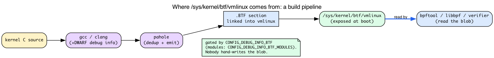
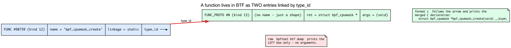
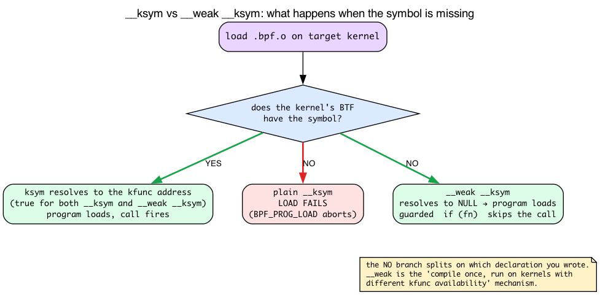

# Day 24 — BTF spelunking: finding and using kfuncs you haven't met

> **Today's mission:** find a kfunc on your kernel that you've never used, read its signature from BTF, write a program that calls it. Along the way: learn *how* BTF stores a function (the surprising answer is "in two pieces"), *where* the vmlinux BTF blob physically comes from, and *how* to make a program degrade gracefully on a kernel that's missing the kfunc you want. Total time: ~95 minutes. End of Phase 4.

## Why discoverability matters

The kernel has **hundreds** of kfuncs. They're partially documented in `Documentation/bpf/kfuncs.rst` but the doc is incomplete and lags behind the kernel. The authoritative source is **BTF in your running kernel**.

Today's skill: navigate that authoritative source — and to navigate it confidently, you have to know two things the earlier days only name-dropped. First, *where the BTF blob comes from* (so you can trust it as ground truth). Second, *how BTF physically stores a function* — because the way it stores a function is the whole reason today's central trick, `bpftool btf dump ... format c`, exists.

## How BTF describes the kernel

You've met BTF before. **Recall from Days 3–4:** BTF is a compact, deduplicated table of every type and (selected) function the kernel exposes; it lives at **`/sys/kernel/btf/vmlinux`** (the running kernel's BTF, a ~5–10 MB binary blob) and at **`/sys/kernel/btf/<module>`** for loadable modules; libbpf reads it for CO-RE; and Day 4 enumerated the ~19 BTF *kinds* (INT, PTR, STRUCT, FUNC, FUNC_PROTO, …) — each entry in the table is one `struct btf_type` whose `info` field encodes which kind it is. BPF programs reference kernel symbols **by name** against this table; libbpf and the verifier resolve those names to BTF entries at load time.


Two of those kinds — **FUNC** and **FUNC_PROTO** — are the ones that matter today, and the relationship between them is the single fact this whole chapter turns on. We'll get there in a moment. First, the question Days 3–4 left open: where does the `vmlinux` blob actually come from?

### Where vmlinux BTF physically comes from: pahole + DWARF

Nobody hand-writes `/sys/kernel/btf/vmlinux`. It's a build artifact. When the kernel is compiled with **`CONFIG_DEBUG_INFO_BTF`** set, the build first compiles the kernel with ordinary **DWARF** debug info, then runs **`pahole`** over that DWARF to emit a compact, deduplicated `.BTF` section, which gets linked into `vmlinux` and exposed at `/sys/kernel/btf/vmlinux` at boot. Per-module BTF (`/sys/kernel/btf/<module>`) is produced the same way, gated by **`CONFIG_DEBUG_INFO_BTF_MODULES`**.

That's the *production* side; Days 3–4 only showed the *consumer* side (libbpf/bpftool reading the blob). You don't need more than three sentences of it — its only job here is to justify trusting BTF as ground truth. But one detail pays off later: the pahole feature flags are **version-gated**. In v7.1, `scripts/Makefile.btf` selects `--btf_features=...,decl_tag_kfuncs` for new-enough pahole — and `decl_tag_kfuncs` is what annotates *which* FUNC entries are actually kfuncs. That's why a newer kernel's BTF can tell you more about kfuncs than an old one's: the inventory is only as rich as the pahole that built it.

- **`scripts/Makefile.btf:3`** — `pahole-ver := $(CONFIG_PAHOLE_VERSION)`; **`:17`** the `--btf_features=...,decl_tag_kfuncs` flag (pahole-driven, version-gated).
- **`lib/Kconfig.debug:398`** — `config DEBUG_INFO_BTF` (the switch that turns vmlinux BTF generation on); **`:428`** — `config DEBUG_INFO_BTF_MODULES` (`depends on DEBUG_INFO_BTF && MODULES`).



### A function lives in BTF as *two* entries, not one

Here is the fact that makes today's tooling make sense. When BTF describes a function, it does **not** put the name and the arguments in one record. It uses two separate `btf_type` entries linked by a reference:

- A **`BTF_KIND_FUNC`** entry (kind = 12) carries only the function's **name**, a **`linkage`** field, and a **`type_id`** that points at —
- a **`BTF_KIND_FUNC_PROTO`** entry (kind = 13), which carries the **return type** and the **ordered argument types**. The FUNC_PROTO has *no name* — it's just the shape of a signature.

The FUNC's `type_id` is the only link between the name and the arguments. Concretely, every BTF entry is a `struct btf_type` (`include/uapi/linux/btf.h:43`) whose first field is `name_off` (`:44`, an offset into the string table) and whose `info` field packs the kind — extracted by the `BTF_INFO_KIND(info)` macro (`:68`). The kind constants are `BTF_KIND_FUNC = 12` (`:85`) and `BTF_KIND_FUNC_PROTO = 13` (`:86`). For a FUNC, the `type_id` reuses the `btf_type` union's `type` slot — it *is* the pointer to the FUNC_PROTO.

This is why a raw `bpftool btf dump` line for a function shows **no arguments**:

```
[98739] FUNC 'bpf_address_lookup' type_id=59431 linkage=static
```

The name is `bpf_address_lookup`, in single quotes (there is **no `name=` token** — that's why the grep idiom below matches the quoted name). The `linkage` is `static`. And the arguments? They're not here. They live in entry `#59431`, a separate FUNC_PROTO that this line merely points at via `type_id`. To see the signature from the raw dump you'd have to go find that entry and read it yourself.

**`linkage`** comes from `enum btf_func_linkage` (`include/uapi/linux/btf.h:169-172`): `BTF_FUNC_STATIC = 0`, `BTF_FUNC_GLOBAL = 1`, `BTF_FUNC_EXTERN = 2`. Most in-kernel functions are `static`. The kfuncs you *call from BPF* show up as `extern` references **from your object's** BTF — your `.bpf.o` says "I need an external symbol of this shape," and libbpf resolves it against the kernel's BTF at load time.



### What `format c` does that the raw dump can't

So reading a signature out of the *raw* dump means manually chasing `type_id` from FUNC to FUNC_PROTO and decoding the argument list. Nobody wants to do that. **`bpftool btf dump ... format c` does it for you**: it walks the FUNC → FUNC_PROTO link, resolves every argument and the return type, and reconstructs a complete C declaration —

```c
extern struct bpf_cpumask *bpf_cpumask_create(void) __weak __ksym;
```

— which is almost exactly what you'd paste into your BPF source. (`format c` decorates *every* kfunc with `extern ... __weak __ksym` — more on that decoration below; for now, note that you can copy the line verbatim, or drop `__weak` if you want a hard dependency that fails the load when the kfunc is absent.) *That resolution step* is why `format c` is the right tool for reading signatures and the raw dump is not. (Note: Day 3 ran the *raw* dump on `parent.bpf.o` to inspect a small program's own BTF; the `format c` reconstruction is the new tool today.) You can see both forms side by side:

```bash
sudo bpftool btf dump file /sys/kernel/btf/vmlinux | head -20            # raw: FUNC one-liners, no args
sudo bpftool btf dump file /sys/kernel/btf/vmlinux format c | head -30    # resolved: full C header
```

## Three approaches to finding a kfunc


### 1. Search kernel source for `BTF_KFUNCS_START`

Each kfunc family is declared in a block:

```bash
cd ~/code/linux
grep -rn 'BTF_KFUNCS_START' kernel/bpf net/ drivers/ 2>/dev/null
```

You'll see ~30+ hits. Each block looks like:

```c
BTF_KFUNCS_START(generic_kfunc_set)
BTF_ID_FLAGS(func, bpf_obj_new_impl, KF_ACQUIRE | KF_RET_NULL)
BTF_ID_FLAGS(func, bpf_obj_drop_impl, KF_RELEASE)
BTF_ID_FLAGS(func, bpf_refcount_acquire_impl, KF_ACQUIRE)
BTF_ID_FLAGS(func, bpf_list_push_front_impl)
/* ... */
BTF_KFUNCS_END(generic_kfunc_set)
```

This tells you what kfuncs exist and their flags (`KF_ACQUIRE`, `KF_RELEASE`, `KF_RCU`, `KF_TRUSTED_ARGS`, etc.). Kernel source is the source of truth.

### 2. Dump kernel BTF and search for FUNC entries

```bash
sudo bpftool btf dump file /sys/kernel/btf/vmlinux \
    | grep "FUNC 'bpf_" | head -20
```

The **raw** (non-`format c`) dump prints each function as a single line with the name in single quotes and no args (recall: the args live in the FUNC_PROTO that `type_id=` points at):

```
[98739] FUNC 'bpf_address_lookup' type_id=59431 linkage=static
[98740] FUNC 'bpf_adj_branches' type_id=59432 linkage=static
[98744] FUNC 'bpf_arch_text_copy' type_id=59434 linkage=static
...
```

This filters all `FUNC` BTF kinds whose name starts with `bpf_` — on this kernel there are ~1700 of them. Many are kfuncs; many are helpers; many are internal kernel functions exposed for other reasons. To narrow down to *actual* kfuncs, cross-reference with the source method (the `BTF_KFUNCS_START` blocks) — or, on a kernel whose pahole emitted `decl_tag_kfuncs`, the kfunc FUNCs carry a decl-tag you can spot. (If you prefer JSON, `bpftool btf dump -j ... | grep '"name":"bpf_'` matches the `name` key instead — note the compact JSON has no space after the colon.)

### 3. Documentation

`Documentation/bpf/kfuncs.rst` lists categories: cpumask, dynptr, lists, refcount, task, etc. Get the names from there, then look up signatures in BTF for the latest details. The doc is a useful tour map but not an inventory.

## Reading a kfunc signature from BTF

Once you have a name (say, `bpf_cpumask_create`), get the signature with `format c`, which resolves the FUNC → FUNC_PROTO link for you:

```bash
sudo bpftool btf dump file /sys/kernel/btf/vmlinux format c \
    | grep -B2 -A5 'bpf_cpumask_create'
```

Output:

```c
extern struct bpf_cpumask *bpf_cpumask_create(void) __weak __ksym;
```

That's what you'd write in your BPF source (drop `__weak` if you want a hard dependency — see below).

For more complex signatures (multiple args, struct returns), use the same `format c` approach:

```bash
sudo bpftool btf dump file /sys/kernel/btf/vmlinux format c \
    | grep 'bpf_dynptr_from_skb('
```

```c
extern int bpf_dynptr_from_skb(struct __sk_buff *s, u64 flags, struct bpf_dynptr *ptr__uninit) __weak __ksym;
```

Don't read those args from the *raw* dump — the `FUNC` line has no adjacent arg block. For the definitive signature, read the `__bpf_kfunc int bpf_dynptr_from_skb(...)` definition in `net/core/filter.c` (`net/core/filter.c:12176`) — it matches the `format c` output above, argument for argument.

### `__weak __ksym`: the kfunc might not be there

You'll have noticed that *every* declaration `format c` printed — `bpf_cpumask_create`, `bpf_dynptr_from_skb`, all of them — ends in `__weak __ksym`, not just `__ksym`. That's not per-kfunc: bpftool marks **every** kfunc weak by default. It can do this precisely because pahole's `decl_tag_kfuncs` (the version-gated feature from earlier) tags which FUNC entries are kfuncs, so bpftool emits the safe weak form uniformly. The decoration is a tool default, not a property of any one kfunc. But what `__weak __ksym` *means* is genuinely new and worth a section — and it's also what tells you when you'd want to drop the `__weak` and ask for a hard `__ksym` instead.

**Recall from Day 20:** plain `__ksym` is a **hard dependency**. The macro expands to `__attribute__((section(".ksyms")))` (`tools/lib/bpf/bpf_helpers.h:192`); it tells libbpf "resolve this name against the running kernel's BTF." If the name doesn't resolve, libbpf aborts the entire `BPF_PROG_LOAD`. No silent miss — the load fails.

**`__weak __ksym` downgrades that to a soft dependency.** `__weak` is just the toolchain's `__attribute__((weak))` (`tools/lib/bpf/bpf_helpers.h:60-61`). Combined with `__ksym`, it changes libbpf's relocation behavior: an unresolved *weak* ksym resolves to **address 0 (NULL)** instead of failing the load. The program loads either way — on a kernel that has the kfunc, the symbol points at the kfunc; on a kernel that lacks it, the symbol is NULL.

That NULL is the catch. Because the symbol can be NULL at runtime, you must **guard the call site** yourself — the verifier won't save you from calling through a NULL weak ksym:

```c
extern int bpf_some_kfunc(...) __weak __ksym;

if (bpf_some_kfunc)                 /* skip the call when the kfunc is absent */
    bpf_some_kfunc(...);
```

This is the mechanism behind "compile once, run on kernels with different kfunc availability": the *same* `.bpf.o` loads on a kernel missing the kfunc (the guarded call is skipped) and on one that has it (the call fires). The kernel's own `bpf_helpers.h` ships the canonical example — the `bpf_iter_num_*` family is declared exactly this way:

```c
/* tools/lib/bpf/bpf_helpers.h:345 */
extern int  bpf_iter_num_new(struct bpf_iter_num *it, int start, int end) __weak __ksym;
extern int *bpf_iter_num_next(struct bpf_iter_num *it) __weak __ksym;
extern void bpf_iter_num_destroy(struct bpf_iter_num *it) __weak __ksym;
```

For a stronger guard than a raw NULL check, pair `__weak` with **`bpf_core_type_exists(...)`** (`tools/lib/bpf/bpf_core_read.h:240`), which tests at load/run time whether a given type exists in the target kernel's BTF. We use exactly that pattern in today's Check question.



## A complete example: `bpf_cpumask_*`

`bpf_cpumask_*` is a family of kfuncs for working with CPU masks (one bit per CPU). Useful for: scheduler hints, CPU affinity inspection, sched_ext.

The family is defined at `kernel/bpf/cpumask.c`. Read the file's `BTF_KFUNCS_START` block to see what's available:

```c
BTF_KFUNCS_START(cpumask_kfunc_btf_ids)
BTF_ID_FLAGS(func, bpf_cpumask_create, KF_ACQUIRE | KF_RET_NULL)
BTF_ID_FLAGS(func, bpf_cpumask_release, KF_RELEASE)
BTF_ID_FLAGS(func, bpf_cpumask_acquire, KF_ACQUIRE)
BTF_ID_FLAGS(func, bpf_cpumask_first, KF_RCU)
BTF_ID_FLAGS(func, bpf_cpumask_setall)
BTF_ID_FLAGS(func, bpf_cpumask_set_cpu)
BTF_ID_FLAGS(func, bpf_cpumask_clear_cpu)
BTF_ID_FLAGS(func, bpf_cpumask_test_cpu)
BTF_ID_FLAGS(func, bpf_cpumask_or, KF_RCU)
BTF_ID_FLAGS(func, bpf_cpumask_equal, KF_RCU)
/* ... */
BTF_KFUNCS_END(cpumask_kfunc_btf_ids)
```

This block is real: `kernel/bpf/cpumask.c:477` opens `BTF_KFUNCS_START(cpumask_kfunc_btf_ids)`, `:478` flags `bpf_cpumask_create` as `KF_ACQUIRE | KF_RET_NULL`, and `:479` flags `bpf_cpumask_release` as `KF_RELEASE`. Each entry is a regular C function in the same file. Read the `__bpf_kfunc` definitions to see what they actually do.

### Using them

```c
/* cpumask_demo.bpf.c */
#include "vmlinux.h"
#include <bpf/bpf_helpers.h>
#include <bpf/bpf_tracing.h>

char LICENSE[] SEC("license") = "GPL";

extern struct bpf_cpumask *bpf_cpumask_create(void) __ksym;
extern void bpf_cpumask_release(struct bpf_cpumask *cpumask) __ksym;
extern void bpf_cpumask_set_cpu(__u32 cpu, struct bpf_cpumask *cpumask) __ksym;
extern bool bpf_cpumask_test_cpu(__u32 cpu, const struct cpumask *cpumask) __ksym;

SEC("fentry/filename_unlinkat")
int BPF_PROG(p)
{
    struct bpf_cpumask *m = bpf_cpumask_create();
    if (!m) return 0;       /* KF_RET_NULL — must check */

    /* Set bits for CPUs 0, 2, 4 */
    bpf_cpumask_set_cpu(0, m);
    bpf_cpumask_set_cpu(2, m);
    bpf_cpumask_set_cpu(4, m);

    /* Test some bits */
    bool b0 = bpf_cpumask_test_cpu(0, (struct cpumask *)m);
    bool b1 = bpf_cpumask_test_cpu(1, (struct cpumask *)m);

    bpf_printk("cpu0=%d cpu1=%d", b0, b1);

    bpf_cpumask_release(m);  /* KF_ACQUIRE → must release */
    return 0;
}
```

Note the cast `(struct cpumask *)m` — `bpf_cpumask_test_cpu` takes the *base* type (`struct cpumask`), not the BPF-specific wrapper (`bpf_cpumask`). The verifier accepts the cast because `bpf_cpumask` **embeds `cpumask` as its first field**, so a `bpf_cpumask *` and a `cpumask *` point at the same address. You can see it in the struct definition:

```c
/* kernel/bpf/cpumask.c:25 */
struct bpf_cpumask {
    cpumask_t cpumask;     /* first field — same address as the wrapper */
    refcount_t usage;
};
```

and `bpf_cpumask_test_cpu` really does take `const struct cpumask *` (`kernel/bpf/cpumask.c:195`: `__bpf_kfunc bool bpf_cpumask_test_cpu(u32 cpu, const struct cpumask *cpumask)`). The cast is therefore sound, and this idiom shows up across the kfunc family.

### Run

```bash
make
sudo ./cpumask_demo &
touch /tmp/x && rm /tmp/x
sudo cat /sys/kernel/debug/tracing/trace_pipe
```

Output: `cpu0=1 cpu1=0`.

## What to break

### Forget release

```c
struct bpf_cpumask *m = bpf_cpumask_create();
/* ... use ... */
return 0;   /* without bpf_cpumask_release */
```

Verifier rejects: `Unreleased reference id=1 alloc_insn=M`. `bpf_cpumask_create` is `KF_ACQUIRE`; the rules from Day 20 apply.

### Use a kfunc not registered for your program type

Try `bpf_cpumask_create` from an XDP program:

```c
SEC("xdp")
int xdp_prog(struct xdp_md *ctx) {
    struct bpf_cpumask *m = bpf_cpumask_create();
    /* ... */
}
```

Verifier rejects: `calling kernel function bpf_cpumask_create is not allowed`. Check `kernel/bpf/cpumask.c`'s registration:

```c
register_btf_kfunc_id_set(BPF_PROG_TYPE_TRACING, &cpumask_kfunc_set);
register_btf_kfunc_id_set(BPF_PROG_TYPE_STRUCT_OPS, &cpumask_kfunc_set);
register_btf_kfunc_id_set(BPF_PROG_TYPE_SYSCALL, &cpumask_kfunc_set);
```

Cpumask is registered for tracing, struct_ops, and syscall — not XDP (verified at `kernel/bpf/cpumask.c:526-528`). The verifier knows.

### Discover a new family

Try `bpf_dynptr_*`:

```bash
sudo bpftool btf dump file /sys/kernel/btf/vmlinux format c | grep 'bpf_dynptr'
```

You'll see `bpf_dynptr_data`, `bpf_dynptr_read`, `bpf_dynptr_write`, `bpf_dynptr_from_skb`, etc. These let BPF programs handle variable-size buffers safely. Try one in a program; the kfunc family is a good way to learn the dynptr pattern (a verifier-tracked variable-size pointer). And you can read each one's full signature straight from BTF.

## There are no Dumb Questions

> **Q: The raw dump shows `type_id=59431`. Can I just dump entry 59431 directly to see the args?**
>
> A: Yes — `bpftool btf dump file /sys/kernel/btf/vmlinux | grep '^\[59431\]'` shows the FUNC_PROTO and its argument entries. But it's a chase: the FUNC_PROTO's arguments are themselves `type_id` references to *other* entries (a PTR to a STRUCT, an INT, …), so you'd be hand-walking a graph. `format c` walks it for you and prints C. Use the raw dump to *find* a function by name; use `format c` to *read its signature*.
>
> **Q: Why does BTF split FUNC from FUNC_PROTO at all? Why not store the args next to the name?**
>
> A: Deduplication. Two functions with the same signature (`void f(int)` and `void g(int)`) can **share one FUNC_PROTO** entry — only the FUNC entries (name + linkage + a `type_id`) differ. Since the kernel has thousands of functions and far fewer distinct *shapes*, the split shrinks the BTF blob. It's the same dedup principle that lets one `struct task_struct` BTF entry back every pointer to a task.
>
> **Q: If `__weak __ksym` resolves a missing kfunc to NULL, why doesn't the verifier just reject the program for a possible NULL call?**
>
> A: Because at *load* time on a kernel that *has* the kfunc, the symbol is a valid address, and your guarded `if (bpf_some_kfunc)` is provably true on that path — there's nothing to reject. On a kernel that *lacks* it, the symbol is NULL but your guard skips the call. The verifier checks the program against the *target* kernel's reality, and the guard is what makes both realities valid. Drop the guard and you're on your own.

## What to read in the kernel

- **`Documentation/bpf/kfuncs.rst`** — the official tour. Read end to end. ~10 pages.

- **`kernel/bpf/cpumask.c`** — full kfunc family in one file (~700 lines). Read top to bottom. The structure is:
  1. Implementation — `__bpf_kfunc` functions.
  2. ID list — `BTF_KFUNCS_START` block (`:477`).
  3. `register_btf_kfunc_id_set` calls at module init (`:526-528`).

  This is the **template** for adding kfuncs. If you ever want to add one, this is what your patch will look like.

- **`kernel/bpf/helpers.c`** — search `BTF_KFUNCS_START`. The biggest set of generic kfuncs (`generic_btf_ids` at `:4703`, `common_btf_ids` at `:4776`). Skim to know the catalog.

- **`kernel/sched/ext.c`** — sched_ext registers many sched-specific kfuncs. The eBPF book's Day 25–27 use these.

- **`tools/lib/bpf/btf.c`** — userspace BTF library. The `btf__find_by_name_kind` function (`:1166`) is what libbpf uses to resolve `__ksym` references against BTF at load time — it's literally how a name like `bpf_cpumask_create` becomes a FUNC entry, which then leads (via `type_id`) to its FUNC_PROTO.

- **`include/uapi/linux/btf.h`** — `struct btf_type` (`:43`), the `BTF_KIND_*` constants (FUNC `:85`, FUNC_PROTO `:86`), the `BTF_INFO_KIND` macro (`:68`), and `enum btf_func_linkage` (`:169-172`). The vocabulary of BTF. (`include/linux/btf.h` is the in-kernel companion with the helper API.)

- **`bpftool` source** at `tools/bpf/bpftool/btf.c` — useful to read just to learn what BTF queries are easy from the CLI, including how `format c` reconstructs declarations.

## Bullet Points

- **BTF is a build artifact:** the kernel is compiled with DWARF, then `pahole` emits the `.BTF` section linked into `vmlinux` and exposed at `/sys/kernel/btf/vmlinux` — gated by `CONFIG_DEBUG_INFO_BTF` (modules: `CONFIG_DEBUG_INFO_BTF_MODULES`). Trust it as ground truth.
- **A function is two BTF entries.** A `BTF_KIND_FUNC` (kind 12) holds the name + `linkage` + a `type_id`; the `type_id` points at a separate `BTF_KIND_FUNC_PROTO` (kind 13) that holds the return type and argument types. The raw dump shows only the FUNC line (no args); `format c` follows the link and prints a full C declaration.
- **Discover kfuncs** via: kernel source `BTF_KFUNCS_START` blocks, `bpftool btf dump`, or `Documentation/bpf/kfuncs.rst`.
- **Signatures** come from BTF; read them with `bpftool btf dump file ... format c` and declare in BPF code with `extern T name(args) __ksym;`.
- **`__ksym` is a hard dependency** (load fails if unresolved); **`__weak __ksym` is a soft one** (unresolved → NULL, program still loads) — so you must **guard the call site**. This is how one `.bpf.o` runs across kernels with different kfunc availability.
- **Acquire/release** semantics from Day 20 apply uniformly — every kfunc family follows the same model.
- **Per-program-type registration**: not all kfuncs are everywhere; the verifier rejects unregistered combinations (cpumask: tracing/struct_ops/syscall, not XDP).
- The kernel's kfunc set grows release-by-release; check `bpftool feature probe` for what's available.

## Check question

You write `extern int my_fn(int x) __ksym;` and reference `my_fn`. The kernel doesn't have a kfunc by that name. What happens at compile time vs at load time?

<details>
<summary>Click to reveal answer</summary>

**Answer:** **Compile time succeeds.** The `__ksym` attribute is a marker for libbpf, not a compile-time check; the C compiler treats `extern` as "this exists somewhere." The reference compiles fine into a relocation entry in the `.bpf.o` file (saying "I need a symbol named `my_fn`") — recorded in your object's BTF as an `extern`-linkage FUNC.

**At load time, libbpf fails:** `libbpf: cannot find kernel BTF type ID of 'my_fn'`. libbpf walks the program's relocations, looks up each `__ksym` reference against the running kernel's BTF (via `btf__find_by_name_kind`), and aborts if the name doesn't resolve.

This is the right design: `__ksym` references are resolved at runtime against the *target* kernel's BTF, not at compile time against the *build* kernel. That's how you compile once and run on multiple kernels with potentially different kfunc availability — a kernel that has the kfunc loads your program; a kernel that doesn't returns the descriptive error.

For graceful degradation across kernel versions, combine the **`__weak __ksym`** form with **`bpf_core_type_exists()`** checks: declare the kfunc weak so an absent symbol resolves to NULL instead of failing the load, then test at runtime whether it (or a type it needs) is available and skip the call if not. That's the full "load everywhere, call only where supported" pattern — the same shape the kernel uses for its own `bpf_iter_num_*` family.

</details>

---

## End of Phase 4

You can now use kfuncs, store kptrs in maps, write struct_ops modules, instrument them with ringbuf, and discover new kfuncs by reading BTF and degrading gracefully with `__weak __ksym` when a kfunc might be absent. That's the modern BPF surface as of 2026.

Phase 5 (Days 25–30) is the frontier — sched_ext, BPF schedulers, and a capstone project.

## Tomorrow

Day 25: sched_ext. We leave tracing behind and start *steering* the kernel — writing a scheduler in BPF via struct_ops, calling the sched-specific kfuncs registered in `kernel/sched/ext.c` that you can now discover and read straight from BTF.
