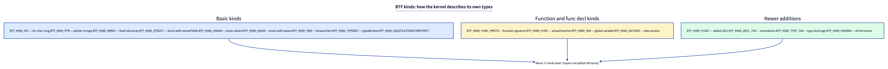
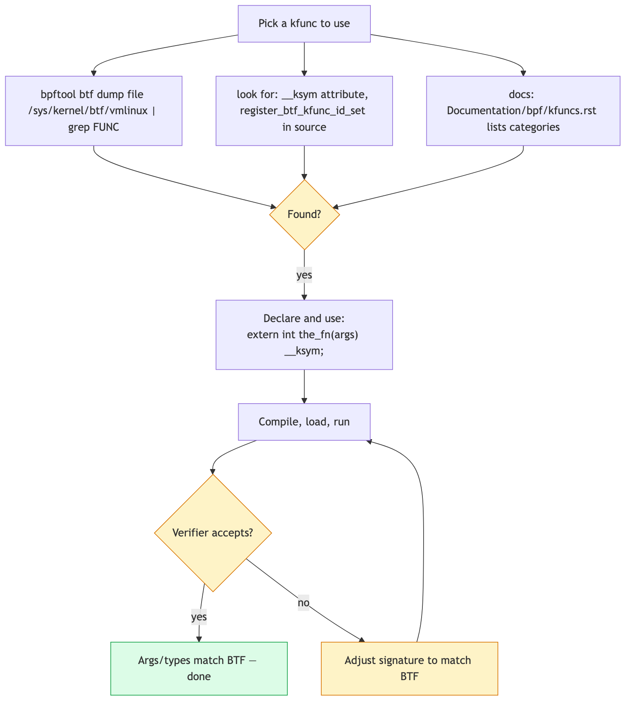

# Day 24 — BTF spelunking: finding and using kfuncs you haven't met

> **Today's mission:** find a kfunc on your kernel that you don't know about, read its signature from BTF, write a program that uses it. Total time: ~75 minutes. End of Phase 4.

## Why discoverability matters

The kernel has **hundreds** of kfuncs. They're documented in `Documentation/bpf/kfuncs.rst` but the doc is incomplete. The authoritative source is BTF in your running kernel.

Today's skill: navigate that authoritative source.



## How to find a kfunc



Three approaches, in order of preference:

### 1. Search kernel source for `register_btf_kfunc_id_set`

Each call registers a set of kfuncs:

```bash
cd ~/code/linux
grep -rn 'BTF_KFUNCS_START' kernel/bpf net/ drivers/ 2>/dev/null
```

You'll see ~30 hits. Each block looks like:

```c
BTF_KFUNCS_START(generic_kfunc_set)
BTF_ID_FLAGS(func, bpf_obj_new_impl, KF_ACQUIRE | KF_RET_NULL)
BTF_ID_FLAGS(func, bpf_obj_drop_impl, KF_RELEASE)
BTF_ID_FLAGS(func, bpf_refcount_acquire_impl, KF_ACQUIRE)
BTF_ID_FLAGS(func, bpf_list_push_front_impl)
/* ... */
BTF_KFUNCS_END(generic_kfunc_set)
```

That tells you what kfuncs exist and their flags (`KF_ACQUIRE`, `KF_RELEASE`, `KF_RCU`, etc.).

### 2. Dump kernel BTF and search for FUNC entries

```bash
sudo bpftool btf dump file /sys/kernel/btf/vmlinux | grep "FUNC.*bpf_" | head -20
```

You'll see thousands of FUNC entries. Filter for ones that look kfunc-like (often start with `bpf_`).

### 3. Read the docs

`Documentation/bpf/kfuncs.rst` lists categories: cpumask, dynptr, lists, refcount, task. Get the names from there, then look up signatures in BTF.

## Reading a kfunc signature from BTF

Once you have a name (say, `bpf_cpumask_create`), get the signature:

```bash
sudo bpftool btf dump file /sys/kernel/btf/vmlinux \
    | awk '/FUNC.*name=bpf_cpumask_create/{f=1} f{print; if(/}/ || /^$/)exit}'
```

Or simpler:

```bash
sudo bpftool btf dump file /sys/kernel/btf/vmlinux format c \
    | grep -B2 -A5 'bpf_cpumask_create'
```

You'll see the prototype:

```c
extern struct bpf_cpumask *bpf_cpumask_create(void) __ksym;
```

## The lab: use `bpf_cpumask_*` kfuncs

`bpf_cpumask_*` is a family of kfuncs for working with CPU masks (one bit per CPU). Useful for: scheduler hints, CPU affinity inspection, sched_ext.

### `cpumask_demo.bpf.c`

```c
#include "vmlinux.h"
#include <bpf/bpf_helpers.h>
#include <bpf/bpf_tracing.h>

char LICENSE[] SEC("license") = "GPL";

extern struct bpf_cpumask *bpf_cpumask_create(void) __ksym;
extern void bpf_cpumask_release(struct bpf_cpumask *cpumask) __ksym;
extern void bpf_cpumask_set_cpu(__u32 cpu, struct bpf_cpumask *cpumask) __ksym;
extern bool bpf_cpumask_test_cpu(__u32 cpu, const struct cpumask *cpumask) __ksym;

SEC("fentry/do_unlinkat")
int BPF_PROG(p)
{
    struct bpf_cpumask *m = bpf_cpumask_create();
    if (!m) return 0;

    /* Set bits for CPUs 0, 2, 4 */
    bpf_cpumask_set_cpu(0, m);
    bpf_cpumask_set_cpu(2, m);
    bpf_cpumask_set_cpu(4, m);

    /* Test some bits */
    bool b0 = bpf_cpumask_test_cpu(0, (struct cpumask *)m);
    bool b1 = bpf_cpumask_test_cpu(1, (struct cpumask *)m);

    bpf_printk("cpu0=%d cpu1=%d", b0, b1);

    bpf_cpumask_release(m);
    return 0;
}
```

What's new:

- **`bpf_cpumask_create`** is `KF_ACQUIRE` — you must release.
- The cast `(struct cpumask *)m` is required because `test_cpu` takes the *base* type, not the BPF wrapper. The verifier accepts the cast for kfuncs that take `struct cpumask *` parameters.

### Run

```bash
make
sudo ./cpumask_demo &
touch /tmp/x && rm /tmp/x
sudo cat /sys/kernel/debug/tracing/trace_pipe
```

Output: `cpu0=1 cpu1=0`.

---

## What to break, in order

### Break 1 — Forget release

The verifier rejects with `unreleased reference id=1` — same lesson as Day 20.

### Break 2 — Use a kfunc that's not registered for your program type

Try `bpf_cpumask_create` from an XDP program:

```c
SEC("xdp")
int xdp_prog(struct xdp_md *ctx) {
    struct bpf_cpumask *m = bpf_cpumask_create();
    /* ... */
}
```

Verifier rejects with `program type ... can not call kernel function`. Most cpumask kfuncs are registered for tracing and sched_ext, not XDP.

### Break 3 — Discover a new kfunc family

Try `bpf_dynptr_*`:

```bash
sudo bpftool btf dump file /sys/kernel/btf/vmlinux format c | grep 'bpf_dynptr'
```

You'll see `bpf_dynptr_data`, `bpf_dynptr_read`, `bpf_dynptr_write`, `bpf_dynptr_from_skb`, etc. Try one in a program.

### Break 4 — Look at `kernel/bpf/cpumask.c`

Open the file. ~500 lines, all kfunc registration and implementation. Notice the patterns:
- One C function per kfunc.
- Marked with `__bpf_kfunc` annotation.
- Registered at the bottom in a `BTF_KFUNCS_START`/`BTF_KFUNCS_END` block.

This is the canonical example of "how a kfunc family is built." If you ever want to add one, this is the template.

---

## What to read in the kernel

- **`Documentation/bpf/kfuncs.rst`** — read end-to-end.
- **`kernel/bpf/cpumask.c`** — full kfunc family in one file. Read top to bottom.
- **`kernel/bpf/helpers.c`** — search `BTF_KFUNCS_START`. The biggest set of generic kfuncs.
- **`kernel/sched/ext.c`** — sched_ext registers many sched-specific kfuncs. Tomorrow's reading.

---

## Bullet Points

- **Discover kfuncs** via: kernel source `BTF_KFUNCS_START` blocks, `bpftool btf dump`, or `Documentation/bpf/kfuncs.rst`.
- **Signatures** come from BTF; declare with `extern T name(args) __ksym;`.
- **Acquire/release** semantics from yesterday apply uniformly.
- **Per-program-type registration** — not all kfuncs are everywhere.
- The kernel's kfunc set grows release-by-release; check `bpftool feature probe` for what's available.

---

## Check question

You write `extern int my_fn(int x) __ksym;` and reference `my_fn`. The kernel doesn't have a kfunc by that name. What happens?

<details>
<summary>Click to reveal answer</summary>

**Answer:** libbpf load fails: `cannot find kernel BTF type ID of 'my_fn'`. The reference is checked at load time against vmlinux BTF. There's no "stub" or graceful fallback — typos and version drift produce immediate, descriptive errors.

</details>

---

## End of Phase 4

You can now use kfuncs, store kptrs in maps, write struct_ops modules, instrument them with ringbuf, and discover new kfuncs by reading BTF. That's the modern BPF surface.

Phase 5 (Days 25–30) is the frontier — sched_ext, BPF schedulers, and a capstone project.
