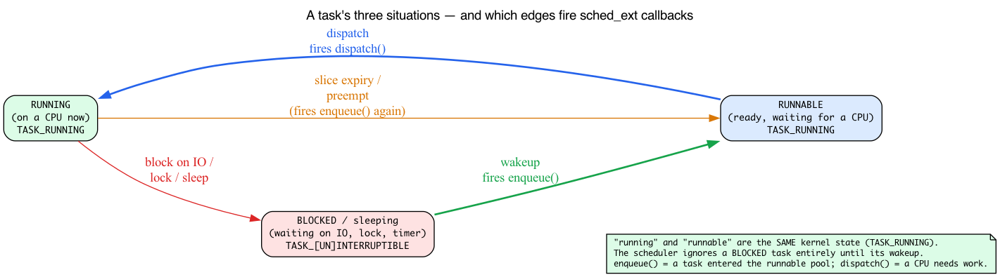
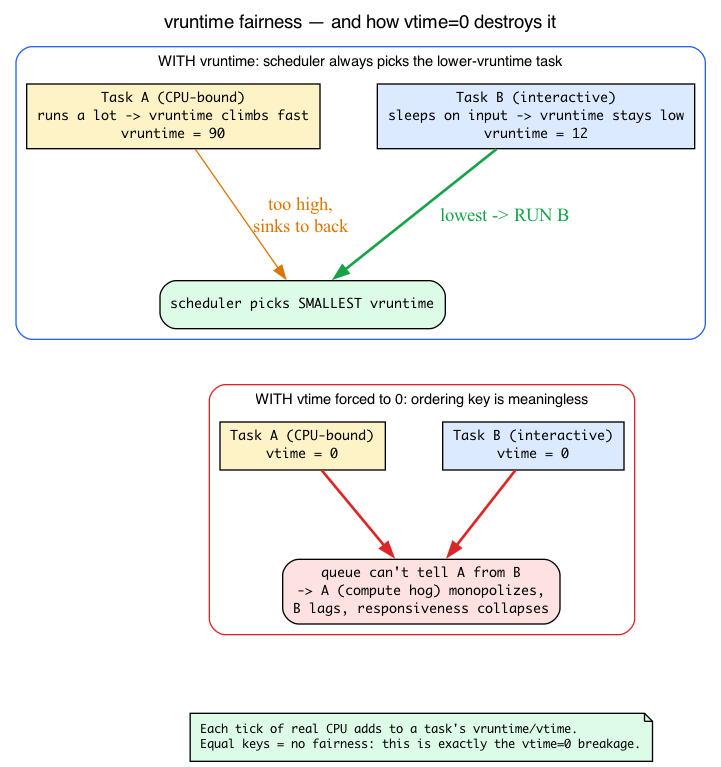

# Day 25 — sched_ext: a BPF scheduler

> **Today's mission:** load `scx_simple` on your system, watch it actually scheduling tasks, understand the enqueue/dispatch cycle, and see why this is the most ambitious BPF feature shipped to date. Along the way you'll learn what a CPU scheduler even *is* — task states, time slices, preemption, context switches — and what "fairness" means underneath CFS, so the whole chapter stops being vocabulary you nod along to. Total time: ~100 minutes.

> **Phase 5 starts here.** Days 25–30 are about the frontier. You'll run a BPF scheduler, modify it, then build a capstone project of your choosing. By Day 30, you've shipped one substantial piece of BPF work.

## What sched_ext is

The Linux scheduler decides *which task runs on which CPU at which time*. Until 2024, this logic lived entirely inside the kernel — `kernel/sched/fair.c` (the CFS implementation), with policy hardcoded. Changing scheduling required a kernel patch, kernel rebuild, reboot, and hope that you didn't break things in subtle ways.

**sched_ext** (merged into 6.12, October 2024) makes the scheduler **pluggable via BPF**. You write a struct_ops module against `struct sched_ext_ops`. Loading it activates your scheduler. Unloading it reverts to CFS.


This is qualitatively different from previous BPF features. Tracing programs *observe*. Networking programs *filter*. sched_ext programs *make scheduling decisions* — the most performance-critical, ultra-hot-path code in the kernel.

The motivation: scheduling policy isn't one-size-fits-all. Cloud workloads want fairness across cgroups; HFT wants latency at all costs; mobile wants energy minimization; gaming wants frame-time stability. Each has been argued for in academic papers and tested in research kernels. Sched_ext lets researchers and operators **iterate on scheduling policy at userspace velocity** — change BPF code, rebuild in seconds, load, measure, iterate.

> Quick refresher (from Phase 4, "Modern primitives"): a **struct_ops** is a BPF object whose programs fill in a kernel **vtable** — a struct of function pointers the kernel calls at the right moments. Loading and attaching the struct_ops *link* installs your callbacks. sched_ext is just struct_ops where the vtable happens to be `struct sched_ext_ops` (`kernel/sched/ext_internal.h:292`) and "attach" means "become the system scheduler" (the install path is `scx_enable(struct sched_ext_ops *ops, struct bpf_link *link)` at `kernel/sched/ext.c:7447`). Everything you already know about struct_ops — the vtable, BTF, link attachment — applies unchanged.

## First, what a scheduler actually does

The rest of this chapter throws words like *runnable*, *blocked*, *time slice*, *preempted*, and *context switch* at you constantly. If those are fuzzy, sched_ext will feel like magic. They aren't magic — they're a tiny state machine. Let's nail it down first; it pays off immediately.

### Every task is in one of three situations

A task (a thread — the kernel's unit of scheduling, one `struct task_struct` each) is always in exactly one of these:

- **Running** — it is *right now* executing on some CPU.
- **Runnable** — it is ready to run and just waiting for a CPU to become free. Nothing is stopping it except that there are more runnable tasks than CPUs.
- **Blocked (sleeping)** — it is waiting for *something* before it can make progress: a disk read to finish, a lock to be released, a timer to fire, a packet to arrive. It is **not** a candidate for the CPU at all until that something happens.

Here is the subtlety the kernel encodes, and you should internalize it: **"running" and "runnable" are the *same* kernel state.** Both are `TASK_RUNNING`:

```c
/* include/linux/sched.h:107 */
#define TASK_RUNNING            0x00000000
#define TASK_INTERRUPTIBLE      0x00000001   /* sched.h:108 — blocked, wakeable by signals */
#define TASK_UNINTERRUPTIBLE    0x00000002   /* sched.h:109 — blocked, not signal-wakeable */
```

A `TASK_RUNNING` task is "schedulable" — it belongs in the scheduler's pool of candidates, whether or not it has a CPU at this instant. A blocked task is `TASK_INTERRUPTIBLE` (can be woken by a signal — e.g. `read()` on a pipe) or `TASK_UNINTERRUPTIBLE` (must wait for the exact event — e.g. a disk I/O), and the scheduler simply ignores it. It isn't picked again until its wait condition is satisfied and the kernel flips it back to `TASK_RUNNING` — that flip is a **wakeup**.

> **There are no Dumb Questions**
>
> **Q: If "running" and "runnable" are the same `TASK_RUNNING` state, how does the kernel know which tasks are *actually* on a CPU right now?**
>
> A: That's tracked separately. Each CPU's runqueue records its currently-running task in `rq->curr`. `TASK_RUNNING` only means "eligible to run" — being *on* a CPU is a property of the runqueue, not of the task's state field. So the state machine has three task *states* but only two task-state *values*, and the CPU-occupancy bit lives elsewhere.



### The scheduler's job, in one sentence

Of the set of **runnable** tasks, the scheduler picks **which one runs on each CPU, and for how long.**

That "how long" is the **time slice** — a budget of CPU time. When a task's slice expires, the kernel **preempts** it: yanks it off the CPU (even though it would happily keep running), drops it back into the runnable pool, and re-picks. Preemption is what keeps one CPU-hog from freezing everyone else — without it a busy loop would own a core forever.

The act of taking task A off a CPU and putting task B on is a **context switch**: save A's registers, program counter, and stack pointer; load B's. It's the physical transition the scheduler causes. It isn't free (you pay cache and TLB costs), which is why schedulers don't switch on every nanosecond.

### The two events a scheduler must handle

Boil all of the above down and a scheduler really only reacts to two moments:

- A task **enters** the runnable pool (it was just created, just woke from I/O, or was just preempted). Something has to decide *where it goes* and *with what slice*. This is **enqueue**.
- A CPU **finishes** with its current task (the task blocked, or used up its slice) and needs the next one. Something has to *hand it a task*. This is **dispatch**.

That enqueue → dispatch cycle is the entire skeleton of a scheduler, and — you guessed it — it's exactly the two callbacks sched_ext makes you implement. "Wakes up from I/O" now reads precisely: a blocked task's wait condition was satisfied, the kernel flips it to `TASK_RUNNING`, and that wakeup is what fires `select_cpu`/`enqueue` to re-place it.

### Where sched_ext hangs its per-task data

Each task already carries its scheduling bookkeeping inside `struct task_struct`. sched_ext bolts its own per-task data on through an embedded member:

```c
/* include/linux/sched.h:876, inside task_struct */
struct sched_ext_entity        scx;
```

So when `scx_simple` reads `p->scx.dsq_vtime`, it's reading a field the kernel keeps *per task*, right there in the task structure:

```c
/* include/linux/sched/ext.h:231, inside struct sched_ext_entity */
u64                     dsq_vtime;
```

Hold onto `dsq_vtime` — the next section explains what that number *means*.

## What "fairness" means: CFS and virtual runtime

The scheduler sched_ext replaces (and reverts to on unload) is **CFS, the Completely Fair Scheduler**, implemented in `kernel/sched/fair.c`. The chapter will keep saying "falls back to CFS," "CFS's fair-share guarantees," and "vtime-ordered." You can't evaluate any of that without knowing CFS's one big idea.

### The idea: charge every task for the CPU time it uses

Imagine you want N runnable tasks to each get a fair, equal share of a CPU. The naive approach — round-robin fixed slices — falls apart the moment tasks have different priorities or sleep at different times.

CFS's trick is **virtual runtime** (`vruntime`): each task accumulates a running tally of how much CPU it has consumed, scaled by its priority/weight.

```c
/* include/linux/sched.h:594, per scheduling entity */
u64                     vruntime;
```

The fairness *intuition* is simple: a task that has run a lot has a high `vruntime`, so it sinks to the back; a task that has barely run has a low `vruntime`, so it floats to the front. Over time everyone's consumed time stays roughly equal — *that* is what "fair" means.

The exact selection algorithm in this kernel is a refinement of that intuition. Since 6.6 the fair class is **EEVDF** (the file is still `kernel/sched/fair.c` and the class is still called CFS, but the picking logic changed). The runqueue's red-black tree (`cfs_rq->tasks_timeline` at `kernel/sched/sched.h:695`) is ordered by each entity's virtual **deadline**, not its raw `vruntime`: `entity_before()` (`fair.c:589`) compares deadlines and `__entity_less` (`fair.c:974`) builds the tree on that. Selection is `pick_eevdf()` (`fair.c:1136`), which walks for the leftmost **eligible** entity (`entity_eligible()`, `fair.c:939`) — eligibility roughly meaning the task hasn't yet consumed more than its fair share. So it's selection-by-deadline-among-eligible, not literally "smallest `vruntime` wins" (that was the pre-6.6 CFS rule). The fairness outcome is the same — a CPU hog earns a later deadline and becomes ineligible, sinking to the back — which is the intuition you should hold onto.

### Why new and just-woken tasks don't get a free lunch — or a penalty

What `vruntime` does a brand-new task get? Or a task that just woke after sleeping for a minute? If it started at 0, it would have a *much* smaller `vruntime` than everyone else and would hog the CPU until it caught up. If it inherited its old stale value, a task that slept a long time would be penalized for sleeping.

EEVDF splits the difference: a new or just-woken task is placed around the runqueue's weighted-**average** virtual time, computed by `avg_vruntime()` (`kernel/sched/fair.c:780`), with a lag adjustment (the `PLACE_LAG` path in `place_entity()`, `kernel/sched/fair.c:5381`) so the task keeps its prior virtual lag rather than being reset to a floor:

```c
/* kernel/sched/sched.h:687, the runqueue's virtual-time zero-point */
u64                     zero_vruntime;
```

The runqueue's virtual-time zero-point is `cfs_rq->zero_vruntime`, and placement uses the weighted average `avg_vruntime()` — *not* the minimum. Placing a newcomer at the average means it gets to run *soon* but **can't hoard the CPU by having been idle** (placing it at the minimum would hand a long-sleeper an unfair head start, which EEVDF deliberately avoids). This is exactly mirrored later when `scx_simple` clamps an idling task's budget so a long-sleeping task can't accumulate unlimited priority.

> Watch the names: the per-task `min_vruntime` at `include/linux/sched.h:580` is a *different* thing. It lives inside `struct sched_entity` (which opens at line 575), where it's the augmented-rbtree subtree minimum used by the deadline tree — **not** a runqueue-wide floor. The classic per-runqueue `cfs_rq->min_vruntime` floor was removed in the EEVDF rework; `struct cfs_rq` (`kernel/sched/sched.h:678`) has no `min_vruntime` member anymore.

### sched_ext's vtime-ordered DSQ is the same trick

A sched_ext dispatch queue can be ordered two ways, and the kernel header says so plainly:

```c
/* include/linux/sched/ext.h:76 */
 * A dispatch queue (DSQ) can be either a FIFO or p->scx.dsq_vtime ordered
```

A **FIFO** DSQ is just a queue — first in, first out, no notion of fairness. A **vtime-ordered** DSQ keeps its tasks sorted by their `dsq_vtime` key, in a red-black tree, the same structure CFS uses:

```c
/* include/linux/sched/ext.h:85 */
struct rb_root          priq;   /* used to order by p->scx.dsq_vtime */
```

You insert with `scx_bpf_dsq_insert_vtime(..., vtime, ...)`, the queue stays sorted, and dispatch pulls the lowest `vtime` — reinventing CFS fairness in BPF. This is also why a *built-in* FIFO DSQ like `SCX_DSQ_GLOBAL` **can't** be used as a vtime priority queue (you'll see this note again below): a FIFO has no ordering key to sort on.

### This is exactly why the `vtime=0` breakage is a breakage

Later you'll deliberately set every task's `vtime` to 0 and watch interactivity collapse. Now you can see *why*: with all `vtime` equal, the ordering is meaningless. A CPU-bound compute hog and a keystroke-waiting editor look identical to the queue, so the hog is never sunk to the back and the editor never floats to the front. That's precisely the unfairness `vruntime` was invented to prevent.



## The watchdog: what makes this safe

A faulty BPF scheduler that fails to dispatch tasks could freeze the system. The kernel catches this:

- **Dispatch stall watchdog.** If any task stays runnable but undispatched past the stall timeout, the kernel concludes the BPF scheduler is broken, ejects it, and re-enables CFS. The timeout defaults to 30 seconds (`SCX_WATCHDOG_MAX_TIMEOUT = 30 * HZ`) and can be tightened via `ops.timeout_ms` — but never lengthened past 30 seconds (the kernel caps it).
- **Fallback to CFS.** Recovery is automatic — worst case, up to a 30-second freeze, then back to normal CFS.

This safety net is what makes sched_ext shippable. Without it, no one would risk loading user code into the scheduler hot path.

### Where "30 seconds" comes from: HZ and jiffies

The constant is written `30 * HZ`, not `30`. To read kernel timing code you need two units:

- **HZ** is the kernel's timer-tick frequency — how many scheduler/timer ticks happen per second.
- A **jiffy** is one tick. So a duration of N seconds is `N * HZ` jiffies. Kernel timeouts are very often expressed this way.

On this kernel:

```
/* ~/code/linux/.config:542 */
CONFIG_HZ=1000
```

So HZ = 1000, and `30 * HZ` = 30000 jiffies = **30 seconds**:

```c
/* kernel/sched/ext_internal.h:14 */
SCX_WATCHDOG_MAX_TIMEOUT        = 30 * HZ,
```

That's the literal derivation behind the "30 seconds" the watchdog enforces — no black box. Whenever you see a kernel constant written as `N * HZ`, mentally divide by `CONFIG_HZ` to get seconds.

## The core cycle: enqueue → DSQ → dispatch

Every BPF scheduler implements callbacks for two main events — the same enqueue/dispatch pair we derived above.


### `enqueue(task, flags)`

A task becomes runnable (it just woke up from I/O, was created, or was preempted — i.e. it just entered the `TASK_RUNNING` pool). The BPF scheduler decides **where to put it** — on which **DSQ** (Dispatch Queue), in what order, with what slice (time budget).

### `dispatch(cpu, prev)`

A CPU has nothing to run (its current task blocked or used up its slice). The BPF scheduler decides **which task to give it** — typically by pulling from a DSQ.

### `select_cpu(p, prev_cpu, wake_flags)`

When a task wakes up, this callback decides **which CPU to wake it on**. Optional; defaults to "the CPU it last ran on, with some adjustments."

### Other callbacks

`init`, `exit`, `running`, `stopping`, `update_idle`, `cpu_release`, `set_cpumask` — all defined in `struct sched_ext_ops` (`kernel/sched/ext_internal.h:292`). The full vtable has ~37 callbacks; most BPF schedulers implement only 4–8 of them and let CFS-equivalent defaults handle the rest.

## DSQs (Dispatch Queues)

DSQs are kernel-managed queues that hold runnable tasks waiting to be dispatched. You don't implement them; you consume an API:

- **`scx_bpf_dsq_insert(p, dsq_id, slice, flags)`** — enqueue task `p` onto the FIFO DSQ identified by `dsq_id`, with time slice `slice` (ns).
- **`scx_bpf_dsq_insert_vtime(p, dsq_id, slice, vtime, flags)`** — enqueue task `p` into a vtime-ordered DSQ (the fairness mechanism from the CFS section: the queue stays sorted by `vtime`).
- **`scx_bpf_dsq_move_to_local(dsq_id, flags)`** — move the next task from a DSQ to the current CPU's local DSQ; called from `dispatch` to make a task runnable locally.
- **`scx_bpf_create_dsq(id, node)`** — create a new DSQ with the given numeric id, on NUMA node `node`. (NUMA node: on multi-socket machines, memory is physically attached to a particular CPU socket — a "node"; creating the DSQ on a given node keeps its memory local to the CPUs that use it. `scx_simple` passes `-1` for "any node.")

Built-in DSQs:
- **`SCX_DSQ_GLOBAL`** — single shared queue, all CPUs pull from it. (Note: a built-in DSQ like `SCX_DSQ_GLOBAL` *cannot* be used as a vtime priority queue — you can't `scx_bpf_dsq_insert_vtime` into it, because a FIFO has no ordering key. That's why `scx_simple` creates its own custom shared DSQ instead; see below.)
- **`SCX_DSQ_LOCAL`** — per-CPU queue. Each CPU has its own.

Custom DSQs (created via `scx_bpf_create_dsq`) let you implement more complex policies: per-cgroup queues, priority queues, NUMA-local queues, etc.

## The lab — run scx_simple

`scx_simple` is the "hello world" of sched_ext: a BPF scheduler that dispatches everything to a single shared queue. (scx_simple creates its own DSQ rather than `SCX_DSQ_GLOBAL` — see the DSQ section for why a built-in FIFO can't be vtime-ordered.)

### Repo lab: build and run the exact upstream scheduler

The book's lab doesn't reimplement `scx_simple` — Day 25 is about running the
*unmodified* in-tree example. `make -C ebpf/labs day25` builds it straight from
the locked Linux v7.1 tree with the kernel's own `tools/sched_ext` Makefile,
sending every artifact under `.output/` so the pinned source stays clean:

{{#include ../labs/day25/build.sh:book}}

`run.sh` is the opt-in, self-cleaning runner: it loads that binary for a bounded
interval on a disposable sched_ext-capable VM, then ejects it so CFS is restored:

{{#include ../labs/day25/run.sh:book}}

The rest of this section is the same thing done by hand, so you can watch each
step.

### Build

```bash
cd ~/code/linux/tools/sched_ext
make
ls build/bin
# scx_central  scx_cpu0  scx_flatcg  scx_pair  scx_qmap  scx_sdt  scx_simple  scx_userland
```

Note: the compiled scheduler binaries are emitted under `build/bin/`, not in the source directory — a bare `ls` in `tools/sched_ext` shows the `.c`/`.bpf.c` (and a few `.h`) sources, the `Makefile`, `Kconfig`, `README.md`, `include/`, and the `build/` directory.

### Run

```bash
sudo ./build/bin/scx_simple
```

Output (the line reprints about once per second with cumulative counts that climb under load):
```
local=842 global=58
local=1577 global=141
```

`local` counts tasks dispatched straight to a CPU's local DSQ (because `select_cpu` found an idle CPU for them); `global` counts tasks that went through the shared, vtime-ordered DSQ via `ops.enqueue`. On a busy system `global` is normally non-zero. That climbing counter *is* the proof tasks are flowing through scx_simple's enqueue/dispatch cycle.

> These two counters live in a per-CPU map. Recall per-CPU maps from the Phase 2 tracing days: `scx_simple` declares its `stats` map as `BPF_MAP_TYPE_PERCPU_ARRAY` with `max_entries 2 /* [local, global] */`, so each CPU bumps its own private slot with no locking, and the userspace `local=`/`global=` totals are the **sum across all CPUs**. That's why a busy multi-core box racks up counts fast without any contention on the counters.

That's it. **Your system is now scheduled by BPF.**

Run something that exercises scheduling. `stress-ng` isn't part of a base install — install it first (`sudo apt-get install -y stress-ng` on Debian/Ubuntu, `sudo dnf install -y stress-ng` on Fedora/RHEL). If you can't install a package, a portable fallback is `for i in $(seq $(nproc)); do yes >/dev/null & done` (stop it later with `pkill yes`).

```bash
# In another terminal:
stress-ng --cpu 4 --timeout 30
```

While it runs, confirm scx_simple is actually in control:

```bash
cat /sys/kernel/sched_ext/state
# enabled
```

(When no BPF scheduler is loaded this reads `disabled`.) Watch the `local=N global=M` line scx_simple prints each second — both counters should climb as stress-ng's workers cycle through the scheduler. With `scx_simple`, basic responsiveness is preserved (it's a working scheduler, just simple) but you're not getting CFS's fair-share guarantees — it's literally a shared queue, FIFO-ish.

### Read the source

`tools/sched_ext/scx_simple.bpf.c`. The whole scheduler is ~30 lines of BPF:

```c
void BPF_STRUCT_OPS(simple_enqueue, struct task_struct *p, u64 enq_flags)
{
    /* Place into the shared vtime-ordered DSQ with the default slice */
    u64 vtime = p->scx.dsq_vtime;
    /* cap idle budget at one slice (the min_vruntime trick) */
    if (time_before(vtime, vtime_now - SCX_SLICE_DFL))
        vtime = vtime_now - SCX_SLICE_DFL;
    scx_bpf_dsq_insert_vtime(p, SHARED_DSQ, SCX_SLICE_DFL, vtime, enq_flags);
}

void BPF_STRUCT_OPS(simple_dispatch, s32 cpu, struct task_struct *prev)
{
    scx_bpf_dsq_move_to_local(SHARED_DSQ, 0);
}
```

That two-line clamp is the `min_vruntime`-style floor from the CFS section, reappearing verbatim: it caps how much priority a long-sleeping task can bank to a single slice.

The real source wraps this in an `if (fifo_sched)` toggle (a FIFO mode vs. the default vtime mode); we show only the default vtime branch — that's the line you'll edit in the experiments below.

Read those two functions against everything above. `simple_enqueue` is the "a task became runnable, where does it go?" callback — it reads the task's per-task `p->scx.dsq_vtime` and inserts into the vtime-ordered `SHARED_DSQ`, so fairer (lower-vtime) tasks sort to the front. `simple_dispatch` is the "a CPU needs work" callback — it pulls the front task into the local DSQ. Enqueue and dispatch, exactly the two-event skeleton.

(`BPF_STRUCT_OPS` already expands to `SEC("struct_ops/"#name)` internally — you never write the `SEC()` line yourself, and doing so would cause a section conflict.)

Plus `init`, `exit`, and the vtable instance. That's the whole scheduler.

The userspace component (`scx_simple.c`) is ~110 lines and handles:
- Loading the BPF object.
- Attaching the struct_ops link.
- Periodic stats output.
- Graceful exit on Ctrl-C (which causes the kernel to revert to CFS).

### Stop it

Ctrl-C in the `scx_simple` terminal. The watchdog's not needed — scx_simple exits cleanly, the kernel detects the link drop, CFS takes over. Confirm: `cat /sys/kernel/sched_ext/state` now reads `disabled`. Re-run `stress-ng` and watch per-thread CPU share with `pidstat -t 1` or `top -H` — under CFS the worker threads converge to roughly equal CPU% (that's `vruntime` fairness at work), in contrast to scx_simple's single shared FIFO-ish queue. (Stop the `yes` fallback, if you used it, with `pkill yes`.)

## What to break

### Don't dispatch

Comment out `scx_bpf_dsq_move_to_local(SHARED_DSQ, 0)` in `simple_dispatch`. Run; CPUs have nothing to run; tasks pile up in the queue. After ~30s, watchdog ejects:

```
sched_ext: BPF scheduler "simple" disabled (runnable task stall)
sched_ext: simple: stress-ng[12345] failed to run for 30.000s
```

Check `dmesg`. The system recovers automatically. **Don't break dispatch in production. Production sched_ext schedulers all have safety paths to fall back if their custom logic can't dispatch.**

### Always dispatch with vtime=0

Set `vtime = 0` in `simple_enqueue`. Every task has the same priority. As the CFS section explained, with all `vtime` equal the vtime-ordered queue can no longer distinguish a compute hog from an interactive task — long-running tasks dominate; interactive tasks lag. CFS's vtime accounting is the simplest fairness mechanism; copying it is the path of least surprise. Try it without; observe responsiveness drop.

### Add per-CPU DSQs

Replace `SHARED_DSQ` with per-CPU DSQs. Each CPU pulls from its own. No cross-CPU contention but no automatic load balancing — you'd manually rebalance in `dispatch` when own DSQ empty. This is what `scx_central` does (Day 27).

### Add a tracepoint

Inside `simple_enqueue`, emit to ringbuf:

```c
struct event *e = bpf_ringbuf_reserve(&rb, sizeof(*e), 0);
if (e) { e->pid = p->pid; ...; bpf_ringbuf_submit(e, 0); }
```

You're now observing every scheduler decision in real time. Throughput consideration: at high context-switch rates (1M+/sec), even a few ns per emit becomes meaningful. Filter aggressively (sample 1 in N, or only emit specific tasks) or aggregate in BPF.

## What to read in the kernel

- **`kernel/sched/ext.c`** — the framework. ~10,000 lines. **Read the file's top comment** for the design overview. Don't try to read everything today; just orient.

- **`kernel/sched/ext_internal.h:292`** — `struct sched_ext_ops` definition. The vtable shape: every callback your BPF scheduler can implement.

- **`kernel/sched/ext.c:7447`** — `scx_enable(struct sched_ext_ops *ops, struct bpf_link *link)`. The function called when a struct_ops scheduler is loaded; activates it as the system scheduler.

- **`kernel/sched/ext_idle.c`** — idle CPU integration. How sched_ext schedulers handle the case "no task to run; CPU should idle."

- **`kernel/sched/fair.c`** — the fair-class (EEVDF) implementation: the scheduler sched_ext replaces while loaded and reverts to on unload. Skim `pick_eevdf()` and `place_entity()` to see how virtual deadlines and `avg_vruntime()` drive selection and placement — that's the fairness model your vtime-ordered DSQ is imitating.

- **`tools/sched_ext/scx_simple.bpf.c`** — read in full. The minimal example.

- **`tools/sched_ext/include/scx/common.bpf.h`** — kfunc declarations and helpers your BPF scheduler will use.

- **`Documentation/scheduler/sched-ext.rst`** — official guide. Read once. Concise.

## Bullet Points

- **A scheduler** picks, from the **runnable** (`TASK_RUNNING`) tasks, which runs on each CPU and for how long (its **time slice**). Blocked tasks (`TASK_INTERRUPTIBLE`/`TASK_UNINTERRUPTIBLE`) aren't candidates until a **wakeup**. Slice expiry causes **preemption**; swapping tasks is a **context switch**. The two events: **enqueue** (task becomes runnable) and **dispatch** (CPU needs a task).
- **CFS** is the default scheduler; its fairness comes from **`vruntime`** (CPU time consumed, weighted) — the intuition is "run the task that's run least." (In this kernel the fair class is EEVDF: it picks the leftmost *eligible* entity by virtual *deadline* via `pick_eevdf()`, same fairness outcome.) New/woken tasks are placed near the runqueue's weighted-average virtual time (`avg_vruntime()`), not a minimum floor. sched_ext's **vtime-ordered DSQ** reproduces this; `vtime=0` everywhere destroys it.
- **sched_ext** lets BPF programs implement Linux schedulers via `struct sched_ext_ops` (struct_ops). Per-task scheduling data lives in `task_struct.scx` (e.g. `p->scx.dsq_vtime`).
- **DSQs** are kernel-managed dispatch queues, either FIFO or vtime-ordered. Built-in: `SCX_DSQ_GLOBAL` (FIFO only), `SCX_DSQ_LOCAL`. Custom via `scx_bpf_create_dsq`.
- **Dispatch stall watchdog** ejects stalled BPF schedulers and falls back to CFS. Default and max timeout is 30 seconds (`SCX_WATCHDOG_MAX_TIMEOUT = 30 * HZ`; HZ=1000 here, so 30000 jiffies), tunable shorter via `ops.timeout_ms`.
- `scx_simple` is the minimal example; `scx_central`, `scx_flatcg`, `scx_lavd` are progressively richer.
- Loading a BPF scheduler is a **system-wide** operation — every task on the system schedules through it.
- Source: `kernel/sched/ext.c` (~10,000 lines) + `kernel/sched/ext_internal.h` (struct definitions) + `tools/sched_ext/`.

## Check question

What guarantees that loading a BPF scheduler doesn't permanently freeze your machine?

<details>
<summary>Click to reveal answer</summary>

**Answer:** The dispatch stall watchdog. The kernel monitors task wait times across all CPUs; if any task has been runnable but not dispatched past the stall timeout, the framework concludes the BPF scheduler is broken, ejects it, and re-enables CFS. Recovery is automatic.

The watchdog timeout defaults to 30 seconds (`SCX_WATCHDOG_MAX_TIMEOUT = 30 * HZ` in `kernel/sched/ext_internal.h`). A scheduler can request a *shorter* timeout via `ops.timeout_ms`, but the kernel caps it at 30 seconds — you can never disable or lengthen it past that. The default threshold is conservative — long enough that no legitimate scheduling delay would trigger it, short enough that a fully-stalled BPF scheduler doesn't make the system hang for minutes.

This is the design that makes BPF scheduling practical. Without it, an infinite loop in dispatch (or a logic error that fails to consume any DSQ) would deadlock the system requiring a power cycle. With it, the worst case is a 30-second pause, then full recovery and CFS-managed normalcy. The barrier to "let me try this scheduler" drops from "are you sure" to "sure, why not — worst case, 30 seconds."

</details>

---

## Tomorrow

Day 26: modify scx_simple to prioritize a specific cgroup. See your changes affect a real workload.
