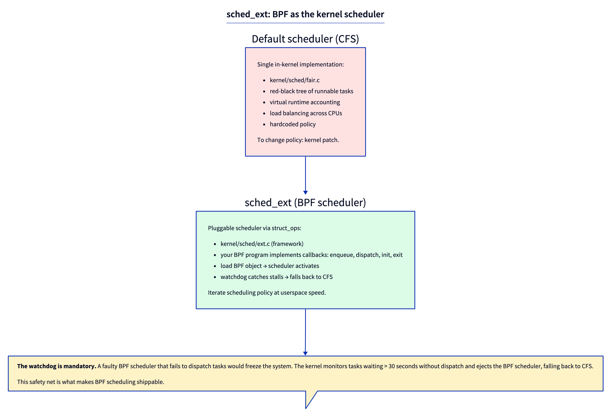
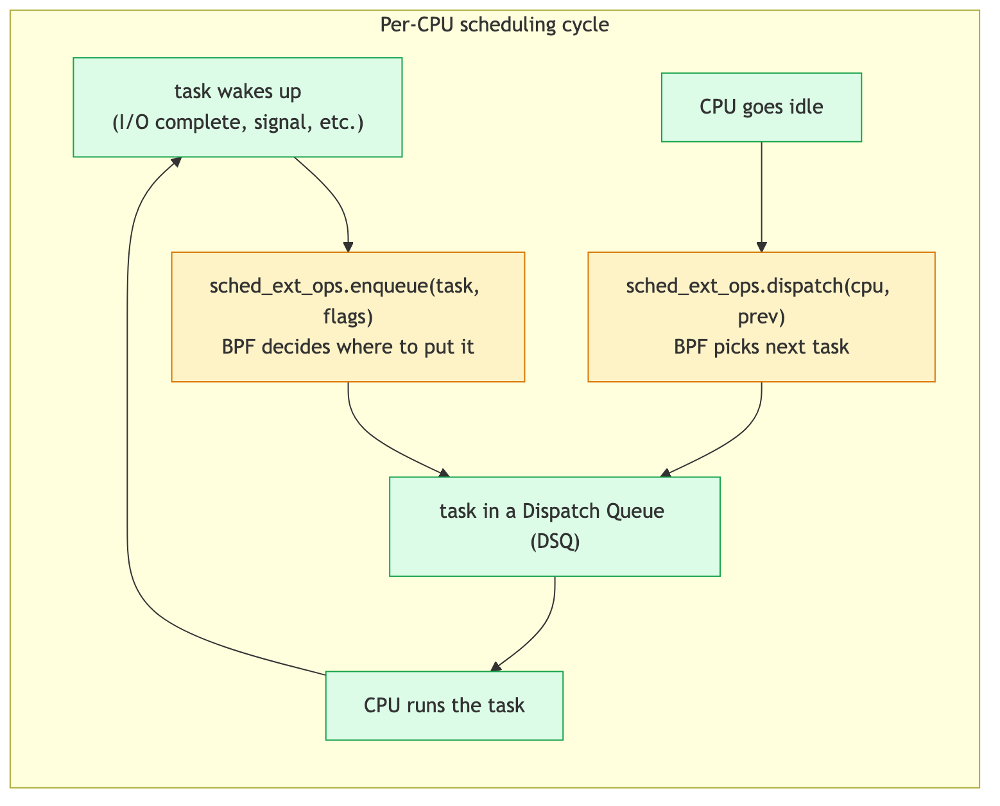

# Day 25 — sched_ext: a BPF scheduler

> **Today's mission:** load `scx_simple` on your system, watch it actually scheduling tasks, understand the enqueue/dispatch cycle, and see why this is the most ambitious BPF feature shipped to date. Total time: ~75 minutes.

> **Phase 5 starts here.** Days 25–30 are about the frontier. You'll run a BPF scheduler, modify it, then build a capstone project of your choosing. By Day 30, you've shipped one substantial piece of BPF work.

## What sched_ext is

The Linux scheduler decides *which task runs on which CPU at which time*. Until 2024, this logic lived entirely inside the kernel — `kernel/sched/fair.c` (the CFS implementation), with policy hardcoded. Changing scheduling required a kernel patch, kernel rebuild, reboot, and hope that you didn't break things in subtle ways.

**sched_ext** (merged into 6.12, October 2024) makes the scheduler **pluggable via BPF**. You write a struct_ops module against `struct sched_ext_ops`. Loading it activates your scheduler. Unloading it reverts to CFS.



This is qualitatively different from previous BPF features. Tracing programs *observe*. Networking programs *filter*. sched_ext programs *make scheduling decisions* — the most performance-critical, ultra-hot-path code in the kernel.

The motivation: scheduling policy isn't one-size-fits-all. Cloud workloads want fairness across cgroups; HFT wants latency at all costs; mobile wants energy minimization; gaming wants frame-time stability. Each has been argued for in academic papers and tested in research kernels. Sched_ext lets researchers and operators **iterate on scheduling policy at userspace velocity** — change BPF code, rebuild in seconds, load, measure, iterate.

## The watchdog: what makes this safe

A faulty BPF scheduler that fails to dispatch tasks could freeze the system. The kernel catches this:

- **Dispatch stall watchdog.** If any task stays runnable but undispatched past the stall timeout, the kernel concludes the BPF scheduler is broken, ejects it, and re-enables CFS. The timeout defaults to 30 seconds (`SCX_WATCHDOG_MAX_TIMEOUT = 30 * HZ`) and can be tightened via `ops.timeout_ms` — but never lengthened past 30 seconds (the kernel caps it).
- **Fallback to CFS.** Recovery is automatic — worst case, up to a 30-second freeze, then back to normal CFS.

This safety net is what makes sched_ext shippable. Without it, no one would risk loading user code into the scheduler hot path.

## The core cycle: enqueue → DSQ → dispatch

Every BPF scheduler implements callbacks for two main events:



### `enqueue(task, flags)`

A task becomes runnable (it just woke up from I/O, was created, or was preempted). The BPF scheduler decides **where to put it** — on which **DSQ** (Dispatch Queue), in what order, with what slice (time budget).

### `dispatch(cpu, prev)`

A CPU has nothing to run (its current task blocked or used up its slice). The BPF scheduler decides **which task to give it** — typically by pulling from a DSQ.

### `select_cpu(p, prev_cpu, wake_flags)`

When a task wakes up, this callback decides **which CPU to wake it on**. Optional; defaults to "the CPU it last ran on, with some adjustments."

### Other callbacks

`init`, `exit`, `running`, `stopping`, `update_idle`, `cpu_release`, `set_cpumask` — all defined in `struct sched_ext_ops` (`kernel/sched/ext_internal.h:292`). The full vtable has ~37 callbacks; most BPF schedulers implement only 4–8 of them and let CFS-equivalent defaults handle the rest.

## DSQs (Dispatch Queues)

DSQs are kernel-managed FIFO queues that hold runnable tasks waiting to be dispatched. You don't implement them; you consume an API:

- **`scx_bpf_dsq_insert(p, dsq_id, slice, flags)`** — enqueue task `p` onto the FIFO DSQ identified by `dsq_id`, with time slice `slice` (ns).
- **`scx_bpf_dsq_insert_vtime(p, dsq_id, slice, vtime, flags)`** — enqueue task `p` into a vtime-ordered DSQ.
- **`scx_bpf_dsq_move_to_local(dsq_id, flags)`** — move the next task from a DSQ to the current CPU's local DSQ; called from `dispatch` to make a task runnable locally.
- **`scx_bpf_create_dsq(id, node)`** — create a new DSQ with the given numeric id, on NUMA node `node`.

Built-in DSQs:
- **`SCX_DSQ_GLOBAL`** — single shared queue, all CPUs pull from it. (Note: a built-in DSQ like `SCX_DSQ_GLOBAL` *cannot* be used as a vtime priority queue — you can't `scx_bpf_dsq_insert_vtime` into it. That's why `scx_simple` creates its own custom shared DSQ instead; see below.)
- **`SCX_DSQ_LOCAL`** — per-CPU queue. Each CPU has its own.

Custom DSQs (created via `scx_bpf_create_dsq`) let you implement more complex policies: per-cgroup queues, priority queues, NUMA-local queues, etc.

## The lab — run scx_simple

`scx_simple` is the "hello world" of sched_ext: a BPF scheduler that dispatches everything to a single shared queue. (It creates its own custom DSQ with ID 0 — named `SHARED_DSQ` in the source — rather than using the built-in `SCX_DSQ_GLOBAL`, because its default mode orders that queue by vtime, which the built-in global DSQ doesn't support.)

### Build

```bash
cd ~/code/linux/tools/sched_ext
make
ls build/bin
# scx_central  scx_cpu0  scx_flatcg  scx_pair  scx_qmap  scx_sdt  scx_simple  scx_userland
```

Note: the compiled scheduler binaries are emitted under `build/bin/`, not in the source directory — a bare `ls` in `tools/sched_ext` shows only the `.c`/`.bpf.c` sources, the `Makefile`, `include/`, and the `build/` directory.

### Run

```bash
sudo ./build/bin/scx_simple
```

Output (the line reprints about once per second with cumulative counts that climb under load):
```
local=842 global=58
local=1577 global=141
```

`local` counts tasks dispatched straight to a CPU's local DSQ (because `select_cpu` found an idle CPU for them); `global` counts tasks that went through the shared, vtime-ordered DSQ via `ops.enqueue`. On a busy system `global` is normally non-zero. That climbing counter *is* the proof tasks are flowing through scx_simple's enqueue/dispatch cycle.

That's it. **Your system is now scheduled by BPF.**

Run something that exercises scheduling. `stress-ng` isn't part of a base install — install it first (`sudo apt-get install -y stress-ng` on Debian/Ubuntu, `sudo dnf install -y stress-ng` on Fedora/RHEL). If you can't install a package, a portable fallback is `for i in $(seq $(nproc)); do yes >/dev/null & done` (stop it later with `pkill yes`).

```bash
# In another terminal:
stress-ng --cpu 4 --timeout 30
```

While it runs, confirm scx_simple is actually in control:

```bash
cat /sys/kernel/sched_ext/state
# enabled
```

(When no BPF scheduler is loaded this reads `disabled`.) Watch the `local=N global=M` line scx_simple prints each second — both counters should climb as stress-ng's workers cycle through the scheduler. With `scx_simple`, basic responsiveness is preserved (it's a working scheduler, just simple) but you're not getting CFS's fair-share guarantees — it's literally a shared queue, FIFO-ish.

### Read the source

`tools/sched_ext/scx_simple.bpf.c`. The whole scheduler is ~30 lines of BPF:

```c
void BPF_STRUCT_OPS(simple_enqueue, struct task_struct *p, u64 enq_flags)
{
    /* Place in global DSQ with default slice */
    u64 vtime = p->scx.dsq_vtime;
    scx_bpf_dsq_insert_vtime(p, SHARED_DSQ, SCX_SLICE_DFL, vtime, enq_flags);
}

void BPF_STRUCT_OPS(simple_dispatch, s32 cpu, struct task_struct *prev)
{
    scx_bpf_dsq_move_to_local(SHARED_DSQ, 0);
}
```

(`BPF_STRUCT_OPS` already expands to `SEC("struct_ops/"#name)` internally — you never write the `SEC()` line yourself, and doing so would cause a section conflict.)

Plus `init`, `exit`, and the vtable instance. That's the whole scheduler.

The userspace component (`scx_simple.c`) is ~110 lines and handles:
- Loading the BPF object.
- Attaching the struct_ops link.
- Periodic stats output.
- Graceful exit on Ctrl-C (which causes the kernel to revert to CFS).

### Stop it

Ctrl-C in the `scx_simple` terminal. The watchdog's not needed — scx_simple exits cleanly, the kernel detects the link drop, CFS takes over. Confirm: `cat /sys/kernel/sched_ext/state` now reads `disabled`. Re-run `stress-ng` and watch per-thread CPU share with `pidstat -t 1` or `top -H` — under CFS the worker threads converge to roughly equal CPU%, in contrast to scx_simple's single shared FIFO-ish queue. (Stop the `yes` fallback, if you used it, with `pkill yes`.)

## What to break

### Don't dispatch

Comment out `scx_bpf_dsq_move_to_local(SHARED_DSQ, 0)` in `simple_dispatch`. Run; CPUs have nothing to run; tasks pile up in the queue. After ~30s, watchdog ejects:

```
sched_ext: BPF scheduler "simple" disabled (runnable task stall)
sched_ext: simple: stress-ng[12345] failed to run for 30.000s
```

Check `dmesg`. The system recovers automatically. **Don't break dispatch in production. Production sched_ext schedulers all have safety paths to fall back if their custom logic can't dispatch.**

### Always dispatch with vtime=0

Set `vtime = 0` in `simple_enqueue`. Every task has the same priority. Long-running tasks dominate; interactive tasks lag. CFS's vtime accounting is the simplest fairness mechanism; copying it is the path of least surprise. Try it without; observe responsiveness drop.

### Add per-CPU DSQs

Replace `SHARED_DSQ` with per-CPU DSQs. Each CPU pulls from its own. No cross-CPU contention but no automatic load balancing — you'd manually rebalance in `dispatch` when own DSQ empty. This is what `scx_central` does (Day 27).

### Add a tracepoint

Inside `simple_enqueue`, emit to ringbuf:

```c
struct event *e = bpf_ringbuf_reserve(&rb, sizeof(*e), 0);
if (e) { e->pid = p->pid; ...; bpf_ringbuf_submit(e, 0); }
```

You're now observing every scheduler decision in real time. Throughput consideration: at high context-switch rates (1M+/sec), even a few ns per emit becomes meaningful. Filter aggressively (sample 1 in N, or only emit specific tasks) or aggregate in BPF.

## What to read in the kernel

- **`kernel/sched/ext.c`** — the framework. ~10,000 lines. **Read the file's top comment** for the design overview. Don't try to read everything today; just orient.

- **`kernel/sched/ext_internal.h:292`** — `struct sched_ext_ops` definition. The vtable shape: every callback your BPF scheduler can implement.

- **`kernel/sched/ext.c:7447`** — `scx_enable(struct sched_ext_ops *ops, struct bpf_link *link)`. The function called when a struct_ops scheduler is loaded; activates it as the system scheduler.

- **`kernel/sched/ext_idle.c`** — idle CPU integration. How sched_ext schedulers handle the case "no task to run; CPU should idle."

- **`tools/sched_ext/scx_simple.bpf.c`** — read in full. The minimal example.

- **`tools/sched_ext/include/scx/common.bpf.h`** — kfunc declarations and helpers your BPF scheduler will use.

- **`Documentation/scheduler/sched-ext.rst`** — official guide. Read once. Concise.

## Bullet Points

- **sched_ext** lets BPF programs implement Linux schedulers via `struct sched_ext_ops` (struct_ops).
- Two main callbacks: **`enqueue`** (task becomes runnable) and **`dispatch`** (CPU needs a task).
- **DSQs** are kernel-managed dispatch queues. Built-in: `SCX_DSQ_GLOBAL`, `SCX_DSQ_LOCAL`. Custom via `scx_bpf_create_dsq`.
- **Dispatch stall watchdog** ejects stalled BPF schedulers and falls back to CFS. Default and max timeout is 30 seconds (`SCX_WATCHDOG_MAX_TIMEOUT`), tunable shorter via `ops.timeout_ms`.
- `scx_simple` is the minimal example; `scx_central`, `scx_flatcg`, `scx_lavd` are progressively richer.
- Loading a BPF scheduler is a **system-wide** operation — every task on the system schedules through it.
- Source: `kernel/sched/ext.c` (~10,000 lines) + `kernel/sched/ext_internal.h` (struct definitions) + `tools/sched_ext/`.

## Check question

What guarantees that loading a BPF scheduler doesn't permanently freeze your machine?

<details>
<summary>Click to reveal answer</summary>

**Answer:** The dispatch stall watchdog. The kernel monitors task wait times across all CPUs; if any task has been runnable but not dispatched past the stall timeout, the framework concludes the BPF scheduler is broken, ejects it, and re-enables CFS. Recovery is automatic.

The watchdog timeout defaults to 30 seconds (`SCX_WATCHDOG_MAX_TIMEOUT = 30 * HZ` in `kernel/sched/ext_internal.h`). A scheduler can request a *shorter* timeout via `ops.timeout_ms`, but the kernel caps it at 30 seconds — you can never disable or lengthen it past that. The default threshold is conservative — long enough that no legitimate scheduling delay would trigger it, short enough that a fully-stalled BPF scheduler doesn't make the system hang for minutes.

This is the design that makes BPF scheduling practical. Without it, an infinite loop in dispatch (or a logic error that fails to consume any DSQ) would deadlock the system requiring a power cycle. With it, the worst case is a 30-second pause, then full recovery and CFS-managed normalcy. The barrier to "let me try this scheduler" drops from "are you sure" to "sure, why not — worst case, 30 seconds."

</details>

---

## Tomorrow

Day 26: modify scx_simple to prioritize a specific cgroup. See your changes affect a real workload.
