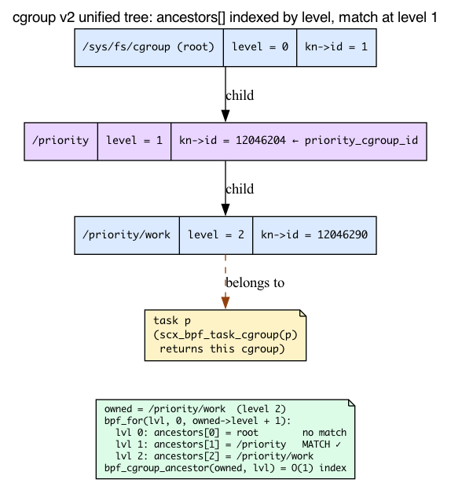
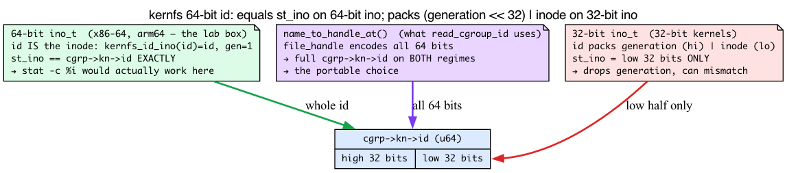
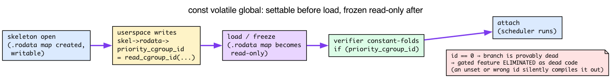
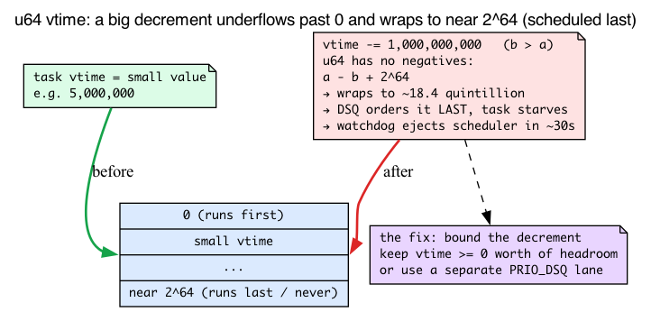
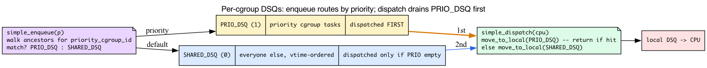

# Day 26 — Modify scx_simple: priority for one cgroup

> **Today's mission:** make a custom variant of `scx_simple` that gives scheduling priority to tasks in a chosen cgroup, and watch that workload get preferential treatment under load. Three small things will bite you along the way — what a cgroup really is in v7.1, which cgroup id to match on, and how one `const volatile` global becomes load-time configuration — and the body sections introduce each as we hit it. Total time: ~110 minutes.

## Why this exercise

Yesterday you ran a stranger's BPF scheduler. Today you change one and observe the effect. This is the most important sched_ext skill: **small, surgical modifications to a working scheduler**.

The goal is to get comfortable with the iteration loop:

1. Edit one callback.
2. Compile, load.
3. Generate a workload.
4. Observe the effect with measurements.
5. Tune; iterate.

Today's specific modification: tasks in `/sys/fs/cgroup/priority` get a 2× time slice and lower vtime (so they run earlier). Tasks elsewhere use the default.

That one sentence hides three things that will bite you if you don't understand them, and most of today is about making them obvious:

1. **What a cgroup is**, how the kernel arranges them into a tree, and why the BPF code has to *walk* that tree with a kfunc instead of following a `parent` pointer (there isn't one).
2. **Why the id you match against is the full 64-bit kernfs id** — on 64-bit Linux it equals the inode `stat` prints, but on a 32-bit kernel it doesn't, so we read it the portable way — and why getting it wrong silently disables the whole feature.
3. **How a `const volatile` global** becomes a knob userspace sets once, before load, that the verifier then bakes in as a constant.

We'll teach each as we hit the part of the lab that depends on it. A few things you've already met carry over and we'll only *refresh*, not re-teach: vtime-ordered DSQs and `p->scx.dsq_vtime` (Day 25), kfunc acquire/release reference discipline and `KF_ACQUIRE`/`KF_RELEASE` (Day 20), `bpf_cgroup`-as-a-refcounted-type and `bpf_cgroup_release` (Day 21), bounded loops with `bpf_for` (Day 5), the null-check-must-dominate-deref rule (Day 4), and per-callback sleepable struct_ops (Day 22).

## What a cgroup is, and the tree it lives in

Before we touch the scheduler, let's get concrete about the thing we're prioritizing.

A **cgroup** (control group) is a *node in a tree of processes*. Every task on the system belongs to exactly one cgroup, and a cgroup can hold many tasks. In cgroup **v2** — the "unified hierarchy" — there is a *single* tree for all controllers (cpu, memory, io, …), mounted at `/sys/fs/cgroup`. That filesystem **is** the tree: each directory is a cgroup, and nesting directories nests cgroups.

You build the tree with ordinary filesystem operations:

- **`mkdir /sys/fs/cgroup/priority`** creates a *child* cgroup of the root.
- **Writing a PID into `/sys/fs/cgroup/priority/cgroup.procs`** moves that task — and every process it later forks — into that cgroup.

That is exactly what the setup section does below: it makes one new cgroup and drops your shell into it.

### Each cgroup knows its depth: `level`

Here is the field the whole modification hinges on. In v7.1, `struct cgroup` carries an `int level`:

```c
/* include/linux/cgroup-defs.h:474 */
struct cgroup {
	/* self css with NULL ->ss, points back to this cgroup */
	struct cgroup_subsys_state self;

	unsigned long flags;

	/*
	 * The depth this cgroup is at.  The root is at depth zero and each
	 * step down the hierarchy increments the level.  This along with
	 * ancestors[] can determine whether a given cgroup is a
	 * descendant of another without traversing the hierarchy.
	 */
	int level;          /* cgroup-defs.h:486 */
	/* ... */
	struct kernfs_node *kn;   /* cgroup kernfs entry — cgroup-defs.h:526 */
	/* ... */
	/* All ancestors including self — cgroup-defs.h:636 */
	struct cgroup *ancestors[];
};
```

Read the comment carefully, because it tells you the trick the kernel — and our BPF code — uses. The root cgroup is `level == 0`; each step down adds one. `/priority` is `level 1`; `/priority/work` is `level 2`. And crucially, **every cgroup keeps an `ancestors[]` array indexed by level** — `ancestors[0]` is the root, `ancestors[1]` is its level-1 ancestor, up to `ancestors[level]` which is the cgroup itself. So asking "what is my ancestor at level N?" is an **O(1) array lookup**, not a pointer-chase up the tree. That is what makes a *verifier-friendly bounded loop* possible: we iterate `lvl` from `0` to `owned->level`, indexing `ancestors[lvl]` each time.



### There is deliberately no `cgrp->parent`

Now the subtle part, the one the chapter leans on hard. You might expect to walk the tree by hand: `for (cg = mine; cg; cg = cg->parent)`. **You can't — `struct cgroup` has no `parent` field at all.** Look back at the struct: `level`, `kn`, `ancestors[]`, but no `struct cgroup *parent`.

Where did the parent go? It lives one level down, on the cgroup's *embedded self css*. Every cgroup contains a `struct cgroup_subsys_state self`, and *that* is where the parent link sits:

```c
/* include/linux/cgroup-defs.h:246, inside struct cgroup_subsys_state */
struct cgroup_subsys_state *parent;
```

So the parent of a cgroup is reachable as `cgrp->self.parent` — but notice the **type**: it's a `struct cgroup_subsys_state *`, *not* a `struct cgroup *`. You can't write `cg = cg->parent` and you can't even write `cg = cg->self.parent` and expect a `cgroup *` back. Hand-rolling the walk means juggling css↔cgroup conversions, and a manual pointer-chasing loop is hard to make the verifier accept anyway.

That is *why* the BPF side uses the `bpf_cgroup_ancestor()` kfunc instead. It takes the `ancestors[]` shortcut for you:

```c
/* kernel/bpf/helpers.c:2792 */
__bpf_kfunc struct cgroup *bpf_cgroup_ancestor(struct cgroup *cgrp, int level)
{
	struct cgroup *ancestor;

	if (level > cgrp->level || level < 0)
		return NULL;

	/* cgrp's refcnt could be 0 here, but ancestors can still be accessed */
	ancestor = cgrp->ancestors[level];
	if (!cgroup_tryget(ancestor))
		return NULL;
	return ancestor;
}
```

It's a guarded array index — return `NULL` if `level` is out of range, otherwise hand back `ancestors[level]` with a fresh reference taken on it. "Walk the hierarchy" is really "index the ancestors array, one level per loop iteration."

### Each cgroup is a kernfs directory: `cgrp->kn`

One more field from that struct: `cgrp->kn`, a `struct kernfs_node *`. **kernfs** is the in-kernel pseudo-filesystem machinery that backs `/sys/fs/cgroup` (and `/sys` generally). Every cgroup directory is a kernfs node, and that node carries a stable identifier — `cgrp->kn->id` — which is the value the BPF side matches against to recognize "this is the priority cgroup." We need to understand that id precisely, because it's the single most common way to get this lab wrong.

## Setting up the priority cgroup

```bash
sudo mkdir /sys/fs/cgroup/priority
stat -c %i /sys/fs/cgroup/priority     # cgroup's kernfs inode — equals kn->id on 64-bit Linux

# Put a shell into it (subprocess inheritance)
echo $$ | sudo tee /sys/fs/cgroup/priority/cgroup.procs
echo $$    # this shell now lives in /priority
```

Anything spawned from this shell will be in `/priority` until you move it back.

> **Heads up about that `stat -c %i`.** On your 64-bit box this prints the directory's *inode*, which **equals** the id the BPF side compares against (`kn->id`) — so it would actually work here. We still read the id with `name_to_handle_at()` in userspace because that's the portable choice: it returns the full 64-bit id on a 32-bit kernel too, where `stat`'s inode would be truncated. The next section explains the split.

## The id you match on: the full 64-bit kernfs id

The BPF side matches on `cgrp->kn->id`, which is a **`u64`**:

```c
/* include/linux/kernfs.h:226 */
/*
 * 64bit unique ID.  On 64bit ino setups, id is the ino.  On 32bit,
 * the low 32bits are ino and upper generation.
 */
u64			id;
```

Read the comment carefully, because the behavior splits by platform:

- **On 64-bit `ino_t` systems** — x86-64, arm64, essentially every modern 64-bit Linux, including this lab machine — the id *simply is the inode*. There is no packing: `kernfs_id_ino(id)` returns the whole 64-bit `id` and `kernfs_id_gen(id)` is a fixed `1`. The inode is set from that same full id (`iget_locked(sb, kernfs_ino(kn))`, `kernfs/inode.c:252`), and `i_ino` is an `unsigned long` (64-bit), so `st_ino == cgrp->kn->id` **exactly**, high bits and all.
- **On 32-bit `ino_t` builds** (32-bit kernels) the id **packs two things** — the inode in the low 32 bits and a *generation* counter in the high 32 bits — because `ino_t` can't hold all 64 bits.

The kernel hands you helpers whose two branches make exactly this split explicit:

```c
/* include/linux/kernfs.h:347 */
static inline ino_t kernfs_id_ino(u64 id)   /* low bits: the inode */
{
	if (sizeof(ino_t) >= sizeof(u64))
		return id;                  /* 64-bit ino: the WHOLE id */
	else
		return (u32)id;             /* 32-bit ino: low 32 bits only */
}

/* include/linux/kernfs.h:356 */
static inline u32 kernfs_id_gen(u64 id)     /* high 32 bits: the generation */
{
	if (sizeof(ino_t) >= sizeof(u64))
		return 1;                   /* 64-bit ino: no generation, fixed 1 */
	/* else: id >> 32 */
}
```

So on your x86-64 box `stat -c %i` would in fact print the *correct* matching value — I verified this against `name_to_handle_at()` for `/sys/fs/cgroup`, `/init.scope`, and `/system.slice` and the two agreed in every case. Truncation only bites on a 32-bit-`ino_t` build, where `stat`'s `ino_t` carries just the low 32 bits and would drop a nonzero generation.



We still read the id with `name_to_handle_at()` rather than `stat`, because it is the **unambiguous, portable** choice: it returns the full 64-bit `kn->id` on *both* regimes, so the lab works the same on a 32-bit kernel as on your 64-bit one without a platform caveat. That's the load-bearing reason the userspace driver below uses a syscall instead of `stat()`. (For confidence that `kn->id` really is *the* canonical cgroup identifier: production sched_ext code uses it directly — `scx_flatcg.bpf.c:391` does `scx_bpf_dsq_insert(p, cgrp->kn->id, ...)`, keying a whole DSQ on it.)

> **There are no Dumb Questions**
>
> **Q: Why match on `kn->id` instead of the cgroup path string?**
> A: The path can change (a cgroup can be renamed/moved) and string-comparing paths on the scheduler hot path would be slow and verifier-hostile. `kn->id` is a stable 64-bit integer the kernel already has on `cgrp`, so the match is a single `u64` compare.
>
> **Q: Why not just hard-code the id as a literal in the BPF source?**
> A: The id doesn't exist until you `mkdir` the cgroup at runtime, so there's nothing to hard-code at compile time. That's exactly the gap the `const volatile` global fills — userspace reads the live id and sets it before load (next section).
>
> **Q: Why release the ancestor reference on the *no-match* path too, not just on a match?**
> A: `bpf_cgroup_ancestor()` is `KF_ACQUIRE` — it hands back a *refcounted* reference every time it returns non-NULL, match or not. The verifier forces a `bpf_cgroup_release()` on every path that holds one, or the program won't load. (More on this in "Reference discipline" below.)

## Configuring a BPF program at load time: `const volatile` and `.rodata`

The BPF side needs to *know* which cgroup id is "the priority one." It can't be hard-coded — the id is only known at runtime, after you `mkdir` the cgroup. But it also shouldn't be a per-packet map lookup on the scheduler hot path. The idiom for "a constant chosen by userspace, baked in before the program runs" is a **`const volatile` global**.

```c
const volatile __u64 priority_cgroup_id = 0;   /* full kernfs id; set from userspace */
```

This is *not* an ordinary runtime variable. libbpf places every `const volatile` global into the program's **`.rodata`** ELF section, which becomes a single-entry, read-only BPF array map. The two qualifiers each do a job:

- **`const`** tells the verifier the value is fixed once the program loads. Because the verifier then treats `priority_cgroup_id` as a *known constant*, it can constant-fold and **dead-code-eliminate** — for example, if the value is `0`, the entire `if (priority_cgroup_id) { ... }` branch is provably dead and gets removed.
- **`volatile`** stops the *compiler* from doing that folding too early. Without it, clang would see the initializer `= 0`, conclude the value is always `0`, and fold the branch away at compile time — before userspace ever gets a chance to set it. `volatile` forces clang to emit a real load from `.rodata`, leaving the value "unknown until load."

Userspace can write this map **only in the window between skeleton open and load**:

```
skeleton open  →  write skel->rodata->priority_cgroup_id  →  load (map frozen read-only)  →  verifier constant-folds the if()  →  attach
```

Setting `skel->rodata->priority_cgroup_id = ...` mutates the map's backing memory; `load` then freezes it read-only. That's why the driver sets it *before* `scx_simple__attach()`, and why we describe `rodata` as "settable before load, read-only after." It's the same `.rodata` idiom already in the file you're editing — `scx_simple.bpf.c:27` declares `const volatile bool fifo_sched;` the same way.

The flip side is the failure mode that makes the fail-loud guard matter: because the verifier sees `priority_cgroup_id` as a constant, leaving it `0` doesn't just "skip" the feature at runtime — the gated branch is *removed at verification time*. A `0` here truly compiles the feature out. So a wrong id (from `stat`'s truncation, say) and an unset id fail the same silent way, which is exactly why we check it loudly below.



## The modification

Two files to change: `tools/sched_ext/scx_simple.bpf.c` and the userspace driver `tools/sched_ext/scx_simple.c`.

### BPF side: read a config variable, branch on cgroup

The complete derivative lives in the lab as `scx_priority.bpf.c` — a copy of
`scx_simple.bpf.c` with exactly this change. First the one new load-time global:

{{#include ../labs/day26/scx_priority.bpf.c:config}}

and then the rewritten `simple_enqueue` (the two lines that clamp idle budget are
carried over unchanged from stock scx_simple):

{{#include ../labs/day26/scx_priority.bpf.c:enqueue}}

Two effects:
- **Lower vtime** = pushed earlier in the vtime-ordered DSQ; runs sooner.
- **Longer slice** = more CPU time per scheduling round before being preempted.

#### Reading the loop line by line

Several things you've met before are doing quiet work here; let's name them.

**Vtime, refreshed (Day 25).** A task's `p->scx.dsq_vtime` is its accumulated virtual runtime, and the vtime-ordered DSQ dispatches the *lowest* vtime first — it's literally an rbtree keyed on vtime (`struct rb_root priq; /* used to order by p->scx.dsq_vtime */`, `include/linux/sched/ext.h:85`). So *subtracting* from vtime pushes a task earlier in line. The base slice we double is `SCX_SLICE_DFL = 20 * 1000000` (20 ms, `sched/ext.h:30`).

**The ancestor walk uses `bpf_cgroup_ancestor()`, not `cg->parent`.** As the cgroup section established, `struct cgroup` has **no `parent` field**, so we use the `bpf_cgroup_ancestor(cgrp, level)` kfunc — it returns the ancestor at a given depth as an acquired reference (release it with `bpf_cgroup_release`).

**`bpf_for(lvl, 0, owned->level + 1)` is a bounded loop (Day 5).** The verifier needs a provable iteration bound even though the limit (`owned->level`) is a runtime value read from memory; `bpf_for()` supplies it, where a plain `for` comparing against `owned->level` would be rejected. The upper bound is `owned->level + 1` precisely because `ancestors[]` is indexed `0 .. level` inclusive — we want to check the root (`0`), the task's own cgroup (`level`), and everything between. This is the exact idiom `scx_flatcg.bpf.c:207` uses: `bpf_for(level, 0, cgrp->level + 1)`. You don't need to add any include for it: `<scx/common.bpf.h>` (already included by `scx_simple.bpf.c`) pulls `bpf_for` in transitively — exactly as `scx_flatcg.bpf.c` uses it with no `bpf_experimental.h` include. (Adding `#include <bpf/bpf_experimental.h>` yourself actually breaks the scx build: that header isn't on the sched_ext include path and clang fails with `'bpf/bpf_experimental.h' file not found`.)

**Reference discipline (Day 20/21) plus one new wrinkle.** Both `scx_bpf_task_cgroup(p)` and `bpf_cgroup_ancestor()` are `KF_ACQUIRE` kfuncs — each returns a refcounted cgroup the verifier *forces* you to release on every path, which is why there's a `bpf_cgroup_release()` on the match path, the no-match path, and the outer `owned`. You can confirm the flags in the source:

```c
/* kernel/bpf/helpers.c:4738 */
BTF_ID_FLAGS(func, bpf_cgroup_ancestor, KF_ACQUIRE | KF_RCU | KF_RET_NULL)
/* kernel/bpf/helpers.c:4737 */
BTF_ID_FLAGS(func, bpf_cgroup_release, KF_RELEASE)
/* kernel/sched/ext.c:9798 */
BTF_ID_FLAGS(func, scx_bpf_task_cgroup, KF_IMPLICIT_ARGS | KF_RCU | KF_ACQUIRE)
```

The new wrinkle: notice `bpf_cgroup_ancestor` is also **`KF_RET_NULL`** (and `KF_RCU`). That means `anc` *can* be `NULL`, and the verifier applies the same null-domination rule you learned on Day 4 — you must guard `if (!anc) continue;` *before* you dereference `anc->kn->id`. The `if (!anc) continue;` isn't defensive politeness; the program won't load without it.

### Userspace side: pass the cgroup ID

The lab's `scx_priority.c` is the stock `scx_simple.c` driver plus a portable
cgroup-id reader:

{{#include ../labs/day26/scx_priority.c:read_cgroup_id}}

Both sides must use the *same* 64-bit value or the equality at `anc->kn->id == priority_cgroup_id` never fires: the kernel stores the full `u64` in `kn->id`, and `read_cgroup_id()` copies the first `__u64` out of the file handle — the same 64 bits. (`rodata->priority_cgroup_id` is the userspace handle for the BPF program's `const volatile __u64 priority_cgroup_id` — settable before load, read-only after, as the `.rodata` section above explained.)

**Confirm the printed id is NON-ZERO** — it should look like:

```
priority cgroup id = 12046204
```

If it prints `0`, `name_to_handle_at()` failed (wrong path, or the directory isn't on cgroup2). Verify `/sys/fs/cgroup/priority` exists and `mount | grep cgroup2` lists `/sys/fs/cgroup`. A `0` here is dead-code-eliminated by the verifier (see the `.rodata` section), so the feature is compiled out entirely — which is why the driver sets the id and fails loudly, all in the `.rodata` window before load:

{{#include ../labs/day26/scx_priority.c:set_id}}

### Build and run

The repo lab builds this derivative against the locked v7.1 sched_ext support
(`make -C ebpf/labs day26`) and ships a safe, self-cleaning runner. `run.sh`
creates a throwaway priority cgroup it *owns*, starts a small workload in it,
loads `scx_priority` pointed at that cgroup for a bounded interval, and on any
exit ejects the scheduler and removes only the cgroup it made:

{{#include ../labs/day26/run.sh:book}}

To explore the effect by hand instead — the manual, contrast-driven workflow the
rest of this section walks through:

**Prerequisites.** This step needs three non-default tools — install them first:

```bash
sudo apt-get install -y stress-ng sysbench   # load generator + CPU benchmark
```

(It also assumes the kernel built at `~/code/linux` with sched_ext enabled, established on earlier days.)

```bash
cd ~/code/linux/tools/sched_ext
make
sudo ./scx_simple &

# The "Setting up" section moved THIS shell into /priority. Move it back to the
# root cgroup first, so the heavy load below inherits root (NOT /priority) —
# otherwise BOTH the load and the benchmark run in /priority and there is no
# contrast to observe.
echo $$ | sudo tee /sys/fs/cgroup/cgroup.procs

# Heavy load (root cgroup, NOT /priority):
stress-ng --cpu 8 --timeout 60 &

# Prove the split before benchmarking:
cat /proc/$(pgrep -n stress-ng)/cgroup    # expect 0::/   (stress-ng in root)
cat /proc/$$/cgroup                        # expect 0::/   (shell still in root)

# NOW move this shell into the priority cgroup and run the benchmark:
echo $$ | sudo tee /sys/fs/cgroup/priority/cgroup.procs
cat /proc/$$/cgroup                        # expect 0::/priority
sysbench --threads=1 --cpu-max-prime=20000 cpu run

# Compare to running WITHOUT the priority modification (revert and re-test).
```

The two `cat /proc/.../cgroup` lines are the contrast check: the load shows `0::/` while the benchmark shell shows `0::/priority`. Your sysbench in the priority cgroup should complete faster than baseline despite the competing stress-ng.

### Measure

Measure throughput directly — run the same benchmark once from inside `/priority` and once from the root cgroup, both while `stress-ng` loads the box, and compare the `events per second` lines. (Don't wrap it in `schedtool -p N`: that sets a real-time policy, which moves the task OUT of the sched_ext class entirely, so it would no longer exercise your cgroup-priority logic.)

```bash
stress-ng --cpu 8 --timeout 60 &

# Run A — inside the priority cgroup:
echo $$ | sudo tee /sys/fs/cgroup/priority/cgroup.procs
sysbench --threads=8 --cpu-max-prime=20000 cpu run | grep -E 'events per second|total time'

# Run B — back in the root cgroup:
echo $$ | sudo tee /sys/fs/cgroup/cgroup.procs
sysbench --threads=8 --cpu-max-prime=20000 cpu run | grep -E 'events per second|total time'
```

Under contention, Run A (in `/priority`) should report a noticeably higher `events per second` than Run B. Cross-check with the per-cgroup CPU accounting:

```bash
cat /sys/fs/cgroup/priority/cpu.stat
cat /sys/fs/cgroup/cpu.stat
```

Compare the `usage_usec` fields — `/priority` should have accumulated more CPU time:

```
usage_usec 20946205000
user_usec 16795163000
system_usec 4151042000
...
```

With the priority modification, the priority cgroup gets noticeably more CPU under contention; without it the two runs should be roughly equal.

## What to break, in order

### Walk the cgroup hierarchy correctly

If your priority cgroup contains *child* cgroups (e.g., `/priority/work` and `/priority/play`), tasks in those children should also count. The `bpf_cgroup_ancestor` walk above handles this — it checks every ancestor from the task's own cgroup up to the root, so a match at the `/priority` level still triggers for tasks nested below it. This is exactly the payoff of the `level`/`ancestors[]` design: a task in `/priority/work` (level 2) has `ancestors[1] == /priority`, so iterating `lvl` from `0` to `2` finds the match at `lvl == 1`.

**To *verify* it triggers, give the matched branch a direct observable.** Throughput alone is too noisy to confirm a nested match. Add a `bpf_printk` inside the matched-ancestor branch in `simple_enqueue`, right before the `break`:

```c
if (anc->kn->id == priority_cgroup_id) {
    vtime -= 1000000;
    slice *= 2;
    bpf_printk("prio match: comm=%s\n", p->comm);   /* observe the hit */
    bpf_cgroup_release(anc);
    break;
}
```

Then create the child cgroup, run a task in it, and watch the trace:

```bash
sudo mkdir -p /sys/fs/cgroup/priority/work
echo $$ | sudo tee /sys/fs/cgroup/priority/work/cgroup.procs
sudo cat /sys/kernel/debug/tracing/trace_pipe &
sysbench --threads=1 --cpu-max-prime=20000 cpu run
```

Expect `trace_pipe` to print a line like `prio match: comm=sysbench` for the task spawned in `/priority/work`, confirming the ancestor walk matched at the parent (`/priority`) level for the nested task. (`p->comm` is the right field for the task name.) If you'd rather not print on the hot path, increment a file-scope counter — `u64 prio_hits = 0;` then `prio_hits++;` in the branch — and read it with `sudo bpftool map dump name scx_simp.bss`; the count should climb once the nested task is enqueued.

### Negative vtime

```c
vtime -= 1000000000;     /* huge decrement */
```

This is where signed intuition betrays you. `dsq_vtime` is a **`u64`** (`include/linux/sched/ext.h:231` — `u64 dsq_vtime;`), so there is no such thing as a "negative" vtime. Subtracting more than the task has accumulated doesn't make the value small or negative — it **wraps around near 2^64**, producing an *enormous* number. The wraparound rule, stated plainly: `a -= b` on a u64 where `b > a` gives `a - b + 2^64`. So a moderate decrement on a task with a small accumulated vtime underflows to a value near `2^64`, which the vtime-ordered DSQ treats as "schedule this task *last*, basically never" — the opposite of what you wanted. Push the decrement the *other* way (a small vtime that keeps winning) and the priority tasks monopolize the CPU and starve everyone else. Either way the symptom is the same end state: some runnable tasks never get dispatched, and the **watchdog ejects your scheduler after ~30s**.



**To confirm the watchdog actually fired** (rather than the box just being slow), watch two things. The backgrounded `scx_simple` process exits on its own and prints an exit reason to its terminal. On the kernel side, run this in another terminal to catch the disable message:

```bash
sudo dmesg -w | grep sched_ext
```

Within ~30s of the stall you'll see a line of the form:

```
sched_ext: BPF scheduler "simple" disabled (runnable task stall ...)
```

The exact reason text varies by kernel version (a non-stall fault shows `(runtime error)` instead), but the `BPF scheduler "..." disabled` shape is constant. If `scx_simple` is still running and no such line appears, the watchdog has *not* ejected — the box is just slow.

Bound your decrement to reasonable values, or use a separate priority queue. (See "alternative: per-cgroup DSQs" below.)

### Don't break the watchdog

Make sure even priority tasks get dispatched promptly. Don't, e.g., refuse to enqueue them. Don't loop in dispatch waiting for "the right" task. The watchdog catches stalls regardless of *why* they happened.

### Per-cgroup DSQ — a cleaner alternative

Instead of vtime tricks, give the priority cgroup its own DSQ that you consume from first:



```c
#define PRIO_DSQ 1ULL

/* init creates a DSQ, and scx_bpf_create_dsq is a sleepable kfunc, so the
 * callback MUST use BPF_STRUCT_OPS_SLEEPABLE — a plain BPF_STRUCT_OPS init
 * won't load. */
s32 BPF_STRUCT_OPS_SLEEPABLE(simple_init)
{
    /* This snippet REPLACES the stock simple_init, so it must still create
     * SHARED_DSQ. SHARED_DSQ (#defined as 0 in scx_simple.bpf.c) is a
     * user-created DSQ — id 0 routes through find_user_dsq, not a built-in
     * global DSQ — so inserting into it without creating it first triggers a
     * scx_bpf_error and the scheduler is ejected on the first non-priority
     * enqueue. Create both. */
    s32 ret = scx_bpf_create_dsq(SHARED_DSQ, -1);
    if (ret)
        return ret;
    return scx_bpf_create_dsq(PRIO_DSQ, -1);
}

void BPF_STRUCT_OPS(simple_enqueue, struct task_struct *p, u64 enq_flags)
{
    u64 vtime = p->scx.dsq_vtime;
    bool priority = false;

    if (priority_cgroup_id) {
        struct cgroup *owned = scx_bpf_task_cgroup(p);
        if (owned) {
            int lvl;
            bpf_for(lvl, 0, owned->level + 1) {
                struct cgroup *anc = bpf_cgroup_ancestor(owned, lvl);
                if (!anc)
                    continue;
                if (anc->kn->id == priority_cgroup_id)
                    priority = true;
                bpf_cgroup_release(anc);
                if (priority)
                    break;
            }
            bpf_cgroup_release(owned);
        }
    }

    if (priority)
        scx_bpf_dsq_insert(p, PRIO_DSQ, SCX_SLICE_DFL, enq_flags);
    else
        scx_bpf_dsq_insert_vtime(p, SHARED_DSQ, SCX_SLICE_DFL, vtime, enq_flags);
}

void BPF_STRUCT_OPS(simple_dispatch, s32 cpu, struct task_struct *prev)
{
    /* Priority queue first */
    if (scx_bpf_dsq_move_to_local(PRIO_DSQ, 0)) return;
    /* Fall back to default queue */
    scx_bpf_dsq_move_to_local(SHARED_DSQ, 0);
}
```

Why must `simple_init` be `BPF_STRUCT_OPS_SLEEPABLE` and not plain `BPF_STRUCT_OPS`? Recall from Day 22 that struct_ops sleepable-ness is **per-callback**, and sched_ext exposes a sleepable subset: a callback declared `BPF_STRUCT_OPS_SLEEPABLE` may call kfuncs marked `KF_SLEEPABLE`; a non-sleepable callback may not, and the verifier rejects the load. `scx_bpf_create_dsq` *is* such a kfunc — `kernel/sched/ext.c:8815` registers it `BTF_ID_FLAGS(func, scx_bpf_create_dsq, KF_IMPLICIT_ARGS | KF_SLEEPABLE)`. So the "must be sleepable" claim is verifiable, not folklore — and the stock `simple_init` is already `BPF_STRUCT_OPS_SLEEPABLE(simple_init)` (`scx_simple.bpf.c:134`) for exactly this reason.

This is more deterministic than vtime tricks. Closer to how production schedulers work — strict priority lanes plus a default lane.

## What to read in the kernel

- **`kernel/sched/ext.c`** — search `scx_bpf_dsq_insert` and `scx_bpf_dsq_move_to_local` to see how DSQ ops bind to internals. The functions are kfuncs registered for `BPF_PROG_TYPE_STRUCT_OPS` with sched_ext-specific properties.

- **`kernel/sched/ext.c`** — search `scx_bpf_task_cgroup`. The kfunc that returns a task's cgroup pointer.

- **`tools/sched_ext/scx_central.bpf.c`** — production-grade example with multi-DSQ. Read after today's exercise.

- **`tools/sched_ext/scx_flatcg.bpf.c`** — cgroup-aware scheduler. Read this if you're interested in how production sched_ext schedulers handle cgroups at scale; note the same `bpf_for(level, 0, cgrp->level + 1)` ancestor idiom at line 207 and `cgrp->kn->id` used as a DSQ key at line 391.

- **`include/linux/cgroup-defs.h`** — `struct cgroup` definition. Note that there is **no `parent` field**; the parent is `cgrp->self.parent` (a `cgroup_subsys_state *`). The fields you commonly deref from BPF are `cgrp->kn->id` (the full 64-bit kernfs id) and `cgrp->level`.

- **`include/linux/kernfs.h`** — the `u64 id` field (line 226) and the `kernfs_id_ino()` / `kernfs_id_gen()` helpers (lines 347/356). Their `sizeof(ino_t) >= sizeof(u64)` branch is *why* `st_ino` equals the id on 64-bit Linux but only carries the low 32 bits on a 32-bit kernel.

- **`Documentation/scheduler/sched-ext.rst`** — particularly the section on cgroup integration.

## Bullet Points

- Modifying a sched_ext example is the fastest way to learn the API in depth.
- A **cgroup v2** is a node in the single unified tree at `/sys/fs/cgroup`; `mkdir` makes a child, writing a PID to `cgroup.procs` moves a task. `struct cgroup` carries `int level` (root = 0) and an `ancestors[]` array indexed by level, so "find my ancestor at level N" is an O(1) array lookup.
- **`scx_bpf_task_cgroup(p)`** returns an acquired cgroup reference; walk ancestors with **`bpf_cgroup_ancestor(cgrp, level)`** (each `KF_ACQUIRE | KF_RET_NULL`, so null-check then release every ref with `bpf_cgroup_release()`). `struct cgroup` has no `parent` field — the parent link is `cgrp->self.parent`, a `cgroup_subsys_state *` — so don't hand-roll a `cg->parent` walk; drive `bpf_cgroup_ancestor` with `bpf_for(lvl, 0, owned->level + 1)`.
- **Match on the full 64-bit `cgrp->kn->id`** — on 64-bit-`ino_t` Linux (x86-64, arm64) it equals `st_ino`, so `stat` would work; on a 32-bit-`ino_t` kernel the id packs `(generation << 32) | inode` and `st_ino` drops the generation. Read it with `name_to_handle_at()` for a portable result that's the full id on both.
- A **`const volatile` global** lives in `.rodata` as a frozen one-entry map: settable via `skel->rodata->...` only between open and load, then read-only. The verifier treats it as a known constant and **dead-code-eliminates** the `if (priority_cgroup_id)` branch when it's `0` — which is why an unset/wrong id silently compiles the feature out, and why the fail-loud guard matters.
- **Vtime is a `u64`** (`p->scx.dsq_vtime`): lower runs sooner, but a big decrement **underflows near 2^64**, not "negative" — either way runnable tasks stall and the watchdog ejects.
- An init callback that calls a sleepable kfunc like **`scx_bpf_create_dsq`** (registered `KF_SLEEPABLE`) must be **`BPF_STRUCT_OPS_SLEEPABLE`**, not plain `BPF_STRUCT_OPS`.
- **Per-cgroup DSQs** are cleaner than vtime tricks: separate priority lane consumed first.
- The watchdog catches mistakes — develop with confidence. Test under realistic load (`stress-ng` + benchmarks), not just synthetic timings.

## Check question

If your priority cgroup gets *too much* CPU (starves other tasks for >30s), what happens?

<details>
<summary>Click to reveal answer</summary>

**Answer:** **The watchdog ejects your scheduler.** Other tasks have been runnable but undispatched (because you kept favoring priority tasks). The 30-second watchdog detects this and reverts to CFS. Fairness is restored automatically; the priority logic is gone until you reload.

The watchdog enforces a **minimum service guarantee**: no matter how clever your prioritization policy, every runnable task on the system must be dispatched within 30 seconds. If your policy can't meet that, your scheduler is rejected.

This is good. It means you can experiment aggressively — try aggressive prioritization, see the watchdog kick in, refine. The recovery loop is short. In production schedulers (`scx_layered`, `scx_lavd`), aging logic explicitly bounds how long any task can wait, ensuring the watchdog never fires; that aging code is what distinguishes a "tested example" from a production scheduler.

</details>

---

## Tomorrow

Day 27: read `scx_central` — production-grade BPF scheduler with central-dispatch architecture.
