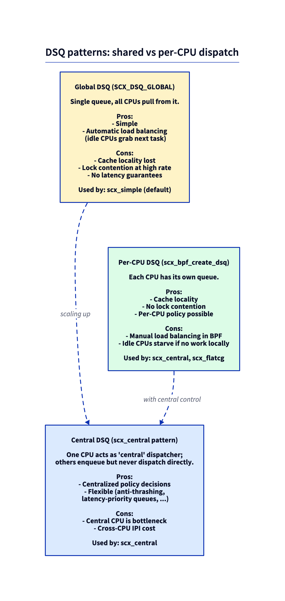

# Day 27 — scx_central: read a real BPF scheduler

> **Today's mission:** read `scx_central.bpf.c` — a more sophisticated sched_ext scheduler with central-dispatch architecture. Understand the patterns experienced sched_ext authors use. Total time: ~75 minutes. Reading-heavy, not coding-heavy.

## Why read this one

`scx_simple` is illustrative but trivial. It dispatches everything to one global queue with vtime ordering — a thin shell over CFS-equivalent fairness. `scx_central` is the next step up: realistic. It handles per-CPU dispatch queues, cross-CPU coordination, central scheduling decisions, and the kinds of details you'd hit on day one of writing a real scheduler.

Reading code that someone else wrote — *and understanding why they wrote it that way* — is a separate skill from writing your own. Today is for that skill.

## DSQ patterns: three architectures



Three architectures show up across the in-tree examples:

### 1. Global DSQ (scx_simple)

One queue, all CPUs pull from it. Easy to write. Suffers from cache locality (any task can run on any CPU) and lock contention at scale. Fine for ~few-CPU systems or low-rate scheduling.

### 2. Per-CPU DSQs

Each CPU has its own queue. Tasks inserted directly to the CPU they should run on; CPUs only pull from their own queue. Excellent cache locality. Cross-CPU coordination requires explicit logic — when one CPU's queue is empty and another's is full, the empty one steals work. This is what CFS does in C with elaborate load-balancing logic.

### 3. Central DSQ (scx_central)

One CPU is designated *central*. Other CPUs only consume from per-CPU DSQs. The central CPU runs the dispatch logic for everyone — handles enqueue, decides which CPU each task should go to, IPI-kicks the destination CPU when work arrives.

This sounds like a bottleneck — and it is — but the central architecture trades throughput for **simplicity**. All scheduling decisions live in one place; no cross-CPU coordination logic; the central CPU is just a single-threaded decision-maker. For research workloads or specialized scheduling (anti-thrashing, latency-priority queues, gang scheduling), this is often the easiest path to a correct scheduler.

## Reading `scx_central.bpf.c`

Open `tools/sched_ext/scx_central.bpf.c`. ~350 lines. Walk through it in this order:

> **Heads-up: the code blocks below are *simplified pseudocode*, not literal quotes from the file.** They capture the central-dispatch *shape* so you can follow the logic, but the real `scx_central.bpf.c` is more involved. When you open the actual file you'll see it uses a `BPF_MAP_TYPE_QUEUE` of pids (`central_q`) rather than a fallback DSQ for the hand-off, calls `bpf_task_from_pid()` to turn a dequeued pid back into a `task_struct`, dispatches with `scx_bpf_dsq_insert(p, SCX_DSQ_LOCAL_ON | cpu, ...)` to target a specific CPU's local queue, and drives tickless preemption from a `bpf_timer` (`central_timerfn`). Read the simplified versions for intuition, then read the real file for the details.

### 1. Globals

Look near the top:

```c
const volatile s32 central_cpu;        /* which CPU is "central" — set from userspace */
const volatile u32 nr_cpu_ids;          /* number of CPUs on the system */

struct cpu_ctx {
    bool                   gimme_task;
    /* ... per-CPU state ... */
};

struct {
    __uint(type, BPF_MAP_TYPE_PERCPU_ARRAY);
    __type(value, struct cpu_ctx);
    __uint(max_entries, 1);
} cpu_ctx_map SEC(".maps");
```

`central_cpu` is set from userspace at attach time. `cpu_ctx` is per-CPU local state — read with `bpf_map_lookup_elem(&cpu_ctx_map, &zero)`.

### 2. The `init` callback

```c
s32 BPF_STRUCT_OPS_SLEEPABLE(central_init)
{
    return scx_bpf_create_dsq(FALLBACK_DSQ_ID, -1);
}
```

Just creates a fallback DSQ. Because `scx_bpf_create_dsq` is a sleepable kfunc, the callback uses `BPF_STRUCT_OPS_SLEEPABLE` (not plain `BPF_STRUCT_OPS`) — a plain version won't load. The interesting work happens in dispatch.

### 3. The `select_cpu` callback

```c
s32 BPF_STRUCT_OPS(central_select_cpu, struct task_struct *p, ...)
{
    /* Always pick central_cpu. */
    return central_cpu;
}
```

When a task wakes, route it to the central CPU. The central CPU will then enqueue and dispatch. **This is the key inversion**: in scx_simple, tasks wake on whatever CPU last ran them. In scx_central, tasks wake on the central CPU so it can do all the dispatch work.

### 4. The `enqueue` callback

```c
void BPF_STRUCT_OPS(central_enqueue, struct task_struct *p, u64 enq_flags)
{
    /* Push into the fallback DSQ; central CPU will pick it up. */
    scx_bpf_dsq_insert(p, FALLBACK_DSQ_ID, SCX_SLICE_INF, enq_flags);

    /* Make sure central CPU is awake to handle this */
    scx_bpf_kick_cpu(central_cpu, SCX_KICK_PREEMPT);
}
```

`scx_bpf_kick_cpu(cpu, flags)` is a kfunc that triggers an IPI to the named CPU, ensuring it wakes up to run dispatch logic. This is how you ensure the central CPU dispatches when work appears, even if the central CPU is currently idle. The real `scx_central` passes `SCX_KICK_PREEMPT` here (preempt whatever's running so dispatch runs promptly); other call sites use `SCX_KICK_IDLE` or plain `0`.

### 5. The `dispatch` callback

```c
void BPF_STRUCT_OPS(central_dispatch, s32 cpu, struct task_struct *prev)
{
    if (cpu != central_cpu)
        return;     /* Only central decides. Other CPUs just consume. */

    bpf_for(i, 0, nr_cpu_ids) {
        if (!scx_bpf_dsq_move_to_local(FALLBACK_DSQ_ID, 0))
            break;
        /* the real file dispatches to a specific CPU's local queue with
         * scx_bpf_dsq_insert(p, SCX_DSQ_LOCAL_ON | cpu, ...) */
    }
}
```

The pattern: only `central_cpu`'s call into `dispatch` actually does work. Other CPUs receive the kick from enqueue and drop into idle.

### 6. The vtable

```c
SEC(".struct_ops.link")
struct sched_ext_ops central_ops = {
    .select_cpu = (void *)central_select_cpu,
    .enqueue    = (void *)central_enqueue,
    .dispatch   = (void *)central_dispatch,
    .init       = (void *)central_init,
    .name       = "central",
};
```

`SEC(".struct_ops.link")` is the modern variant that creates a link FD (lifecycle bound to userspace process; closes when userspace exits).

In-tree schedulers don't hand-write this struct. They use the `SCX_OPS_DEFINE(central_ops, ...)` macro (from `tools/sched_ext/include/scx/compat.bpf.h`), which expands to exactly the `SEC(".struct_ops.link") struct sched_ext_ops central_ops = { ... }` shown above. The real `scx_central` also sets `.flags = SCX_OPS_ENQ_LAST` inside that macro, plus `.running`, `.stopping`, and `.exit` callbacks omitted here for brevity.

## Why central architecture works

The central CPU is a bottleneck *for scheduling decisions*, but **not for actual task execution**. Tasks run on every CPU; only the *decision of where to run* is centralized. For workloads where:

- The total scheduling rate is bounded (a few hundred thousand decisions per second per central CPU).
- The scheduling logic benefits from global state (the central CPU sees all decisions, can apply global policy).
- Cache locality of the *running* task matters more than cache locality of the *scheduling*.

...this trades a single CPU's worth of overhead for simpler, more correct scheduling logic.

For workloads where the scheduling rate exceeds what one CPU can sustain, you need per-CPU dispatchers (`scx_layered`, `scx_lavd`, real production schedulers).

## scx_flatcg — read after this one

If you have appetite for more reading, open `tools/sched_ext/scx_flatcg.bpf.c`. ~600 lines. Same shape as scx_central but cgroup-aware: each cgroup gets its own DSQ; vtime is per-cgroup; dispatch picks the cgroup with the lowest vtime first.

This is closer to how a real "fair-share + isolation" scheduler looks — like CFS with cgroup awareness, but in BPF.

## What to read in the kernel

- **`tools/sched_ext/scx_central.bpf.c`** — the file we just walked through. Read end to end with the diagram above as a guide.

- **`tools/sched_ext/scx_central.c`** — the userspace driver. ~200 lines. Note how it sets `central_cpu` before attach and runs a stats loop.

- **`tools/sched_ext/scx_flatcg.bpf.c`** — the cgroup-aware scheduler. Read after central. Notice the per-cgroup vtime tracking.

- **`kernel/sched/ext.c`** — search for `scx_bpf_kick_cpu`. The kfunc that triggers an IPI. Read how `kick_cpu` decides whether to actually IPI or whether the target CPU is already running and doesn't need a kick.

- **`include/scx/common.bpf.h`** in `tools/sched_ext/include/scx/` — kfunc declarations. The "API" your BPF scheduler can call.

- **`Documentation/scheduler/sched-ext.rst`** — particularly the section on patterns and best practices.

## Bullet Points

- `scx_central` shows the **central-dispatch** pattern: one CPU makes all scheduling decisions; others consume from per-CPU DSQs.
- **`scx_bpf_kick_cpu(cpu, 0)`** triggers an IPI to wake a CPU that's currently idle.
- **`SEC(".struct_ops.link")`** (vs `.struct_ops`) creates link-managed scheduler instances; closes with userspace process exit.
- Read order: globals → init → select_cpu → enqueue → dispatch → vtable.
- **scx_flatcg** is the next step up: cgroup-aware fair-share with per-cgroup DSQs.
- For very-high-rate scheduling, central architecture isn't enough — production schedulers go fully per-CPU.

## Check question

In `scx_central`, every task wake-up is routed to `central_cpu`. Why doesn't this catastrophically increase wake-up latency?

<details>
<summary>Click to reveal answer</summary>

**Answer:** Because `select_cpu` returning `central_cpu` doesn't actually run the task there — it just routes the *enqueue* and *dispatch* logic to that CPU. The task itself is dispatched (in the dispatch callback's loop) to whichever CPU has capacity. The central CPU is a **policy** bottleneck, not a **mechanism** bottleneck.

The flow:
1. Task `T` wakes up. `select_cpu(T)` returns `central_cpu` → kernel's wake-up logic targets central_cpu.
2. Central CPU's `enqueue(T)` runs: puts T on the FALLBACK_DSQ, kicks central_cpu (no-op since we're already on it).
3. Central CPU's `dispatch()` callback runs (because the kernel just gave central CPU its slot back): consumes T from FALLBACK_DSQ, decides "T should run on CPU 5" via dispatch logic, places T on CPU 5's local DSQ via `scx_bpf_dsq_insert(..., SCX_DSQ_LOCAL_ON | 5, ...)` or moves a fallback task local with `scx_bpf_dsq_move_to_local()`.
4. CPU 5 finishes its current task, calls `dispatch`, consumes T, runs T.

So T actually runs on CPU 5. The central CPU's overhead is one trip through dispatch logic plus an IPI; T's wake-up latency is ~microseconds, dominated by IPI delivery.

The bottleneck only matters at the **rate** of scheduling decisions: one CPU's worth of decision-making caps the system at maybe 1–2 million scheduling events per second. Past that, you need per-CPU dispatchers.

</details>

---

## Tomorrow

Days 28–30: capstone. Pick one project, build it, ship it.
