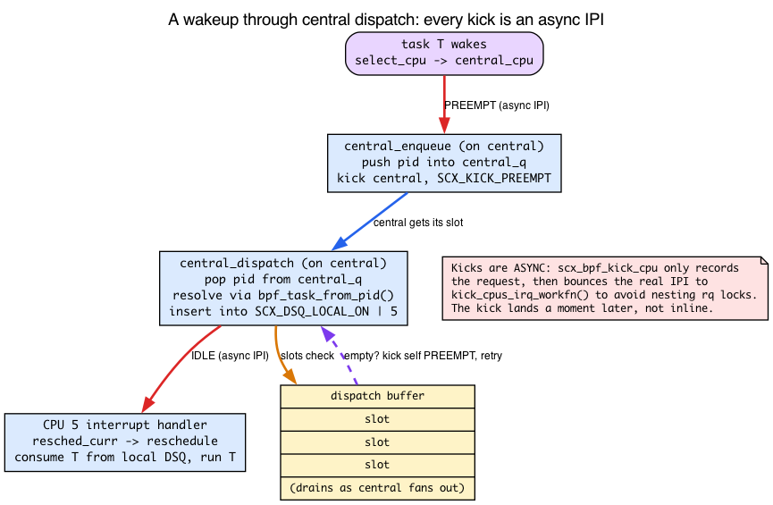
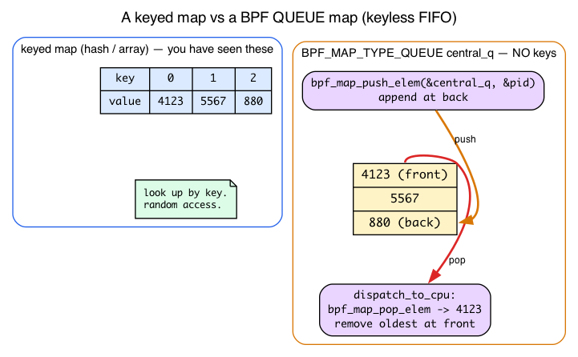
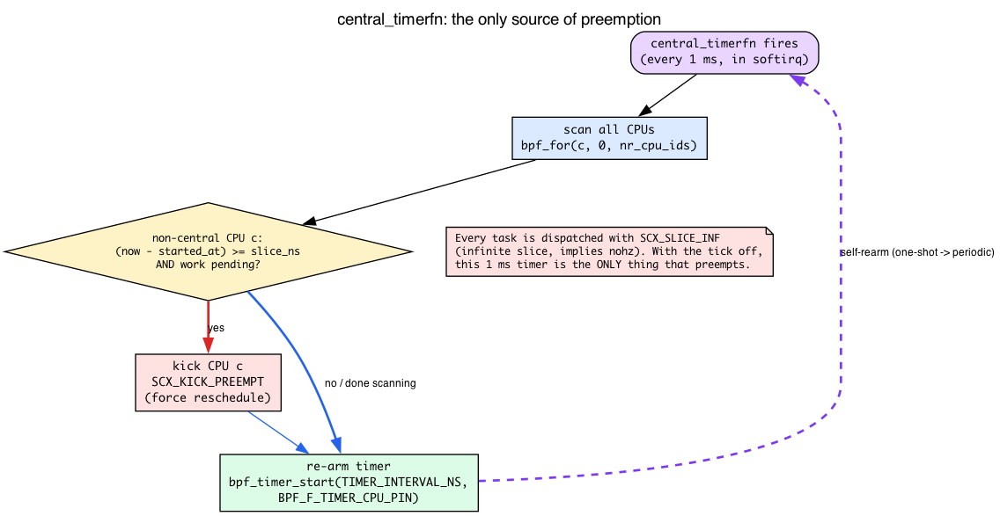
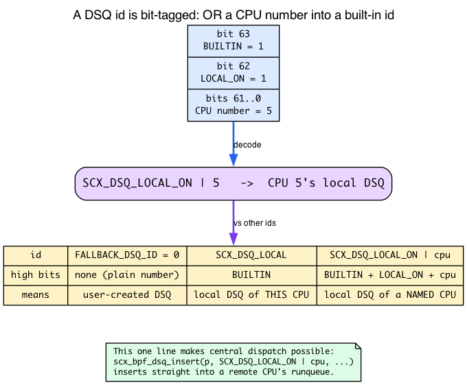
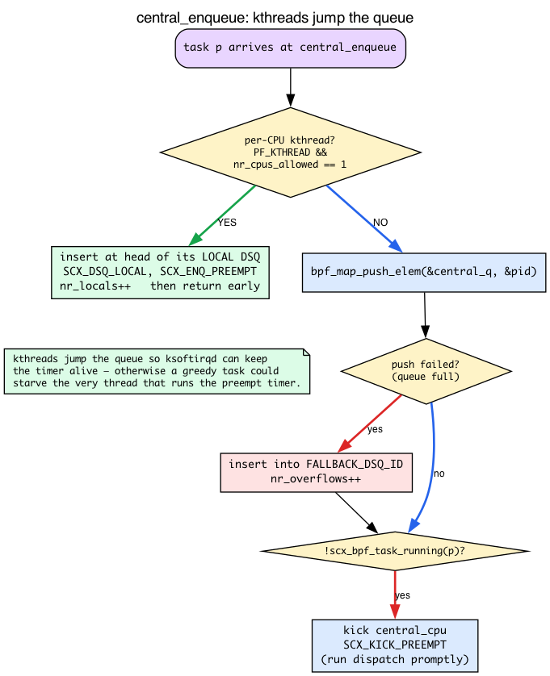

# Day 27 — scx_central: read a real BPF scheduler

> **Today's mission:** read `scx_central.bpf.c` — a more sophisticated sched_ext scheduler with central-dispatch architecture. Learn the cross-CPU machinery a real scheduler is built on: what an IPI actually is and the three flavors of `scx_bpf_kick_cpu`, BPF queue maps, BPF timers and tickless preemption, how a DSQ id encodes a target CPU, why per-CPU kthreads jump the queue, and the dispatch-buffer batching limit. Understand the patterns experienced sched_ext authors use. Total time: ~110 minutes. Reading-heavy, not coding-heavy.

## Why read this one

`scx_simple` (Days 25–26) is illustrative but trivial. It dispatches everything to one shared queue with vtime ordering — a thin shell over CFS-equivalent fairness. `scx_central` is the next step up: realistic. It handles per-CPU dispatch queues, cross-CPU coordination, central scheduling decisions, tickless preemption, and the kinds of details you'd hit on day one of writing a real scheduler.

Reading code that someone else wrote — *and understanding why they wrote it that way* — is a separate skill from writing your own. Today is for that skill.

But there's a wrinkle. The real `scx_central.bpf.c` leans on five mechanisms no earlier day has taught: inter-processor interrupts, BPF queue maps, BPF timers, the `SCX_DSQ_LOCAL_ON | cpu` id trick, and a forward-progress hack for kernel threads. If you opened the file cold you'd hit twenty lines you have no framework for. So today is structured as *background first, then the file*. We teach each mechanism with intuition, then point at the exact line in the source where it earns its keep.

## DSQ patterns: three architectures


Three architectures show up across the in-tree examples:

### 1. Global DSQ (scx_simple)

One queue, all CPUs pull from it. Easy to write. Suffers from cache locality (any task can run on any CPU) and lock contention at scale. Fine for ~few-CPU systems or low-rate scheduling. This is exactly what you read in `scx_simple` on Day 25 — everything goes into `SHARED_DSQ`, every CPU's `dispatch` pulls from it.

### 2. Per-CPU DSQs

Each CPU has its own queue. Tasks inserted directly to the CPU they should run on; CPUs only pull from their own queue. Excellent cache locality. Cross-CPU coordination requires explicit logic — when one CPU's queue is empty and another's is full, the empty one steals work. This is what CFS does in C with elaborate load-balancing logic.

### 3. Central DSQ (scx_central)

One CPU is designated *central*. Other CPUs only consume from per-CPU DSQs. The central CPU runs the dispatch logic for everyone — handles enqueue, decides which CPU each task should go to, IPI-kicks the destination CPU when work arrives.

This sounds like a bottleneck — and it is — but the central architecture trades throughput for **simplicity**. All scheduling decisions live in one place; no cross-CPU coordination logic; the central CPU is just a single-threaded decision-maker. For research workloads or specialized scheduling (anti-thrashing, latency-priority queues, gang scheduling), this is often the easiest path to a correct scheduler.

That "IPI-kicks the destination CPU" phrase is doing a *lot* of work in that paragraph, and nothing so far has explained it. The whole central design is *built* on who kicks whom, with which flag. So that's where we start.

## Background 1 — IPIs and the three flavors of kicking

### What an IPI is

Here is a fact that's easy to forget because most code never confronts it: **on a multi-core box, CPU A cannot directly run code on CPU B.** A CPU only runs the instruction stream in front of it. If CPU 0 decides "CPU 5 should stop what it's doing and reschedule," CPU 0 has no way to reach into CPU 5 and make that happen by writing a variable.

The hardware mechanism that *does* let one CPU poke another is an **IPI — inter-processor interrupt.** CPU 0 writes to the interrupt controller saying "raise an interrupt on CPU 5." CPU 5's hardware traps into the kernel's interrupt handler, and *that handler*, running on CPU 5, does the work — in our case, marks the current task as needing reschedule so CPU 5 picks a new task to run. An IPI is the cross-CPU coordination primitive the entire central design leans on. Every time this chapter says "kick a CPU," it means "send that CPU an IPI so it re-enters the scheduler."

### `scx_bpf_kick_cpu` — and why it's asynchronous

The kfunc your scheduler calls is `scx_bpf_kick_cpu(cpu, flags)`. The signature in v7.1 is at `kernel/sched/ext.c:8945`:

```c
/* kernel/sched/ext.c:8945 */
__bpf_kfunc void scx_bpf_kick_cpu(s32 cpu, u64 flags, const struct bpf_prog_aux *aux)
```

(The `aux` is a hidden implicit argument the kernel injects; from BPF you just call `scx_bpf_kick_cpu(cpu, flags)`.)

Here's the subtlety that explains a lot of the file's shape: **the kick does not happen synchronously inside the kfunc.** You're calling this from inside `enqueue` or `dispatch`, which already hold the runqueue lock for the current CPU. Sending an IPI and immediately processing it would risk nesting runqueue locks and deadlocking. So the kfunc just *records* the request and defers the work to a local irq_work (it queues `kick_cpus_irq_workfn` on the *caller's* CPU). The comment is explicit at `kernel/sched/ext.c:8902`:

```c
/* kernel/sched/ext.c:8902 */
/* Actual kicking is bounced to kick_cpus_irq_workfn() to avoid nesting
 * rq locks ... */
```

The deferred handler `kick_cpus_irq_workfn` (`kernel/sched/ext.c:7906`) then walks the pending CPUs and calls `resched_curr` on each target via `kick_one_cpu()` / `kick_one_cpu_if_idle()` — that's what sends the actual cross-CPU reschedule IPI, the function that marks "you need to reschedule." So the model is: *you ask; the kick lands a moment later, asynchronously.* Keep that in mind every time you see a `scx_bpf_kick_cpu` call — it's a request posted to a queue, not an instant context switch.

### The three flags — they are different policies

`flags` is not a yes/no. The three `SCX_KICK_*` bits encode genuinely different policies. Their definitions and the kernel's own comments are in `kernel/sched/ext_internal.h`:

```c
/* kernel/sched/ext_internal.h:1201 */
SCX_KICK_IDLE     = 1LLU << 0,   /* nudge only if the CPU is idle / going idle; noop otherwise */
/* kernel/sched/ext_internal.h:1209 */
SCX_KICK_PREEMPT  = 1LLU << 1,   /* clear the running task's slice to 0 so dispatch runs NOW */
/* kernel/sched/ext_internal.h:1217 */
SCX_KICK_WAIT     = 1LLU << 2,   /* block until the target's current SCX task switches out */
```

- **`SCX_KICK_IDLE`** — only wake the CPU if it's idle (or about to go idle). If the target is already going to reschedule on its own, this is a no-op. Use it when you've *given* a CPU work and want it to notice, but you don't want to disturb it if it's already busy doing useful things.
- **`SCX_KICK_PREEMPT`** — force the issue. The kernel clears the currently-running SCX task's `->scx.slice` to zero so the task "expires" immediately and the dispatch path runs *now*. Use it when you need dispatch to happen promptly — e.g. fresh work just arrived and the central CPU must process it.
- **`SCX_KICK_WAIT`** — the call returns only after the target's current SCX task switches out. This is for gang/core scheduling, where you need to know a sibling actually vacated. `scx_central` doesn't use it; you should know it exists.

**PREEMPT/WAIT and IDLE are mutually exclusive.** ORing `SCX_KICK_IDLE` with either is a usage error, and the kernel raises `scx_error` for it:

```c
/* kernel/sched/ext.c:8909 */
if (unlikely(flags & (SCX_KICK_PREEMPT | SCX_KICK_WAIT)))
    scx_error(sch, "PREEMPT/WAIT cannot be used with SCX_KICK_IDLE");
```

And a flag value the older bullet list got wrong: **`flags == 0` is not "kick only if idle."** Zero means an unconditional reschedule kick with no special policy — neither the idle-only restriction nor the slice-clearing preemption. `scx_central` uses plain `0` exactly once, in `init` (`tools/sched_ext/scx_central.bpf.c:355`), purely to bootstrap the central CPU into its very first dispatch:

```c
/* scx_central.bpf.c:355, in central_init */
scx_bpf_kick_cpu(central_cpu, 0);
```

Now you can read every kick site in the file and know *why each picked the flag it did*:

| Call site | Flag | Why |
|---|---|---|
| `central_enqueue` (`:131`) | `SCX_KICK_PREEMPT` | new task queued — make central run dispatch promptly |
| `dispatch_to_cpu` (`:174`) | `SCX_KICK_IDLE` | just fed a remote CPU work — wake it only if idle, don't disturb a busy one |
| `central_dispatch` self-retry (`:251`) | `SCX_KICK_PREEMPT` | dispatch buffer drained mid-fan-out — kick self to retry with a fresh buffer (see Background 6) |
| non-central dispatch branch (`:273`) | `SCX_KICK_PREEMPT` | a CPU ran dry — force central to refill it now |
| `central_timerfn` (`:328`) | `SCX_KICK_PREEMPT` | a CPU outran its slice — preempt it |
| `central_init` (`:355`) | `0` | one-time bootstrap kick to start the central loop |



## Background 2 — BPF queue maps

The hand-off from `enqueue` to `dispatch` in `scx_central` doesn't go through a DSQ. It goes through a **BPF queue map** called `central_q`. No earlier day taught queue maps — Days 12–13 covered ringbuf and arrays, Day 21 covered kptrs — so here it is.

A `BPF_MAP_TYPE_QUEUE` (`include/uapi/linux/bpf.h:1036`) is a **value-only FIFO**. Unlike the hash and array maps you already know, it has **no keys**. You don't look anything up; you push a value onto the back and pop the oldest off the front:

- `bpf_map_push_elem(&q, &val, flags)` — append a value.
- `bpf_map_pop_elem(&q, &val)` — remove and return the oldest value.
- `bpf_map_peek_elem(&q, &val)` — look at the oldest without removing it.

(The uapi describes the QUEUE/STACK push/pop/peek semantics at `include/uapi/linux/bpf.h:589`, `:598`, `:605`. `BPF_MAP_TYPE_STACK` at `:1037` is the LIFO sibling — same API, pops newest instead of oldest.)



In `scx_central` the queue is declared at the top of the file holding raw `s32` pids, 4096 deep:

```c
/* scx_central.bpf.c:70 */
struct {
    __uint(type, BPF_MAP_TYPE_QUEUE);
    __uint(max_entries, 4096);
    __type(value, s32);
} central_q SEC(".maps");
```

Two design choices worth noticing:

- **It stores pids, not task pointers.** Holding a refcounted `task_struct` across the enqueue→dispatch boundary would mean acquiring and releasing a reference (the kptr dance from Day 21). Storing a bare `s32` pid sidesteps that entirely; the pid is resolved back to a task only at pop time, via `bpf_task_from_pid()` (`:145`).
- **Why a queue map at all, instead of a DSQ?** The file's top comment is refreshingly honest (`scx_central.bpf.c:3`): bouncing through one global BPF queue "isn't the most straightforward... It'd be easier to bounce through per-CPU BPF queues. **The current design is chosen to maximally utilize and verify various SCX mechanisms.**" In other words, `scx_central` is partly a *test* of SCX features. A more practical scheduler would do something simpler.

The push and pop are the literal backbone of the hand-off:

```c
/* scx_central.bpf.c:122, in central_enqueue */
if (bpf_map_push_elem(&central_q, &pid, 0)) {
    __sync_fetch_and_add(&nr_overflows, 1);
    scx_bpf_dsq_insert(p, FALLBACK_DSQ_ID, SCX_SLICE_INF, enq_flags);
    return;
}
```

```c
/* scx_central.bpf.c:140, in dispatch_to_cpu */
if (bpf_map_pop_elem(&central_q, &pid))
    break;
```

**Always check the return of `bpf_map_push_elem`.** A push can fail if the queue is full (4096 entries deep). When it does, `scx_central` falls back to the user DSQ `FALLBACK_DSQ_ID` and bumps `nr_overflows`. That fallback DSQ is *only* the overflow path — used here when the push fails (`:122`) and in one other spot when a task can't run on its target CPU (`:157`, a cpumask mismatch). The normal path is always queue→pop.

## Background 3 — BPF timers and tickless preemption

Here's a puzzle. `scx_central` dispatches *every* task with an **infinite time slice** — `SCX_SLICE_INF`, which is literally `U64_MAX`:

```c
/* include/linux/sched/ext.h:32 */
SCX_SLICE_INF = U64_MAX,   /* infinite, implies nohz */
```

A task with an infinite slice never expires on its own. So what ever preempts it? In a normal scheduler, a periodic **scheduler tick** fires `HZ` times per second on every CPU and forces the running task to yield. But `scx_central` is built for **tickless operation**: on `CONFIG_NO_HZ_FULL` kernels, a CPU running a single task can stop its periodic tick entirely to cut overhead (you can watch the tick interrupts dwindle in `/proc/interrupts`). The file's top comment spells this out at `scx_central.bpf.c:16`.

If the tick is off and slices are infinite, preemption has to come from somewhere else. That somewhere is a **BPF timer**.

### What a BPF timer is

A `bpf_timer` is a kernel `hrtimer` you arm from BPF code. The lifecycle is a three-step dance, documented in `kernel/bpf/helpers.c:1148`:

```c
/* kernel/bpf/helpers.c, comment block ~1143 */
/* bpf_timer_init() allocates 'struct bpf_hrtimer', inits hrtimer ...
 * bpf_timer_set_callback() ... assign bpf callback_fn.
 * bpf_timer_start() arms the timer. */
```

So in code: `bpf_timer_init(&t, &map, CLOCK_MONOTONIC)`, then `bpf_timer_set_callback(&t, fn)`, then `bpf_timer_start(&t, interval_ns, flags)`. The callback fires *later*, in softirq/timer context — not inline at the call site. One hard rule: **the `struct bpf_timer` must live inside a map value.** The uapi struct is just a placeholder; the kernel allocates the real `bpf_hrtimer` behind it during `bpf_timer_init`, and the map owns it. That's why `scx_central` wraps its timer in a one-element array map:

```c
/* scx_central.bpf.c:80 */
struct central_timer {
    struct bpf_timer timer;
};
struct {
    __uint(type, BPF_MAP_TYPE_ARRAY);
    __uint(max_entries, 1);
    __type(key, u32);
    __type(value, struct central_timer);
} central_timer SEC(".maps");
```

`init` does the init + set_callback (`:352`–`:353`), and the timer is armed via `start_central_timer()`. The interval is `TIMER_INTERVAL_NS = 1 * MS_TO_NS` — **1 ms**.

### The self-rearming trick

`bpf_timer_start` arms a *one-shot* timer. To get a *periodic* 1 ms tick, the callback re-arms itself at its own tail:

```c
/* scx_central.bpf.c:331, last lines of central_timerfn */
bpf_timer_start(timer, TIMER_INTERVAL_NS, BPF_F_TIMER_CPU_PIN);
__sync_fetch_and_add(&nr_timers, 1);
```

Every 1 ms, `central_timerfn` (`:293`) wakes up, scans all CPUs, and for each non-central CPU checks: has the running task outrun its `slice_ns`, and is there work pending? If so, it kicks that CPU with `SCX_KICK_PREEMPT` (`:328`) to force a reschedule. **The timer is the *only* source of preemption** in this scheduler — without it, the first task to grab each CPU would run forever.



### A graceful-degradation pattern worth stealing

The timer is armed with `BPF_F_TIMER_CPU_PIN` (`include/uapi/linux/bpf.h:7665`), which pins it to the calling CPU so it stays on central:

```c
/* scx_central.bpf.c:198, in start_central_timer */
ret = bpf_timer_start(timer, TIMER_INTERVAL_NS, BPF_F_TIMER_CPU_PIN);
```

But `BPF_F_TIMER_CPU_PIN` is new (≥6.7). On an older kernel, `bpf_timer_start` returns `-EINVAL`. Rather than fail, `scx_central` retries unpinned and remembers it did:

```c
/* scx_central.bpf.c:206 */
if (ret == -EINVAL) {
    timer_pinned = false;
    ret = bpf_timer_start(timer, TIMER_INTERVAL_NS, 0);
}
```

And because an unpinned timer might run on the wrong CPU, `central_timerfn` defensively checks at runtime (`:300`) and errors out if it finds itself off-central. This is a CO-RE-flavored "use the new feature if present, fall back cleanly if not" pattern — the comment even laments that the unnamed enum prevents using `bpf_core_enum_value_exists()` here.

## Background 4 — encoding a target CPU into a DSQ id

On Day 25 you learned that DSQ ids name queues: `SCX_DSQ_GLOBAL`, `SCX_DSQ_LOCAL`, and custom numeric DSQs you create with `scx_bpf_create_dsq`. What you didn't learn is that the id space is **bit-tagged**, and you can OR a CPU number into a built-in id to target a *remote* CPU's queue. That trick is the heart of "central decides where each task runs."

The id is a 64-bit value. Bit 63 is a flag marking the id as *built-in* rather than a user-created numeric DSQ:

```c
/* include/linux/sched/ext.h:54 */
SCX_DSQ_FLAG_BUILTIN  = 1LLU << 63,
SCX_DSQ_FLAG_LOCAL_ON = 1LLU << 62,
/* :58 */ SCX_DSQ_GLOBAL   = SCX_DSQ_FLAG_BUILTIN | 1,
/* :59 */ SCX_DSQ_LOCAL    = SCX_DSQ_FLAG_BUILTIN | 2,
/* :61 */ SCX_DSQ_LOCAL_ON = SCX_DSQ_FLAG_BUILTIN | SCX_DSQ_FLAG_LOCAL_ON,
```

So:

- **User DSQs** (like `FALLBACK_DSQ_ID = 0` here, or `SHARED_DSQ` from Day 25) are plain small numbers with the high bit *clear*.
- **`SCX_DSQ_LOCAL`** means "the local DSQ of *whichever* CPU I'm currently on." That's all `scx_simple` ever used.
- **`SCX_DSQ_LOCAL_ON`** is the parameterized version: it sets bit 62, and you OR in the **target CPU number** in the low bits. `SCX_DSQ_LOCAL_ON | 5` means "**CPU 5's** local DSQ" — a *specific, possibly remote* CPU.



This is the one line that makes central dispatch possible. The central CPU inserts a task straight into a *different* CPU's local runqueue and then kicks it:

```c
/* scx_central.bpf.c:171, in dispatch_to_cpu */
scx_bpf_dsq_insert(p, SCX_DSQ_LOCAL_ON | cpu, SCX_SLICE_INF, 0);
```

Contrast with Day 25/26's `scx_simple`, which only ever moved tasks to the *current* CPU's local DSQ via `scx_bpf_dsq_move_to_local`. A per-CPU scheduler never needs `LOCAL_ON | cpu` because it only ever touches its own queue. Central needs it because it makes decisions *for* every CPU from one place. (One exception: per-CPU kthreads, which central inserts into `SCX_DSQ_LOCAL` — the current CPU's queue — at `:117`; more on that next.)

## Background 5 — per-CPU kthreads and the forward-progress trap

This is the single biggest thing the simplified pseudocode below hides, and it's a *correctness* requirement, not an optimization. When you open the real `central_enqueue` you'll find it does **not** push per-CPU kernel threads through `central_q` at all. Understanding why requires two new concepts.

**What a kthread is.** A *kthread* is a kernel thread — a task with no userspace address space, marked by `PF_KTHREAD` in `p->flags`:

```c
/* include/linux/sched.h:1779 */
#define PF_KTHREAD  0x00200000  /* I am a kernel thread */
```

Some kthreads are **per-CPU**: pinned to exactly one CPU (`p->nr_cpus_allowed == 1`) to do that CPU's housekeeping. `ksoftirqd/N` is the classic example — it processes CPU N's softirq backlog.

**The forward-progress trap, unique to central dispatch.** Remember from Background 3 that the *only* thing preempting tasks is the BPF timer. And BPF timers fire in **softirq context — which may run from `ksoftirqd`.** Now picture the deadlock: a greedy user task is hogging a CPU. The timer that would preempt it needs `ksoftirqd` to run. But `ksoftirqd` is a normal task too — if the central scheduler queued it behind that same greedy user task, `ksoftirqd` can't run, so the timer can't fire, so nothing preempts the user task, so `ksoftirqd` never runs. The scheduler has wedged itself.

The fix: per-CPU kthreads **skip the central queue entirely** and go straight to the head of their own CPU's local DSQ with an enqueue-time preempt flag, guaranteeing they always outrank user threads:

```c
/* scx_central.bpf.c:115 */
if ((p->flags & PF_KTHREAD) && p->nr_cpus_allowed == 1) {
    __sync_fetch_and_add(&nr_locals, 1);
    scx_bpf_dsq_insert(p, SCX_DSQ_LOCAL, SCX_SLICE_INF,
                       enq_flags | SCX_ENQ_PREEMPT);
    return;
}
```

**`SCX_ENQ_PREEMPT` is an *enqueue* flag, not a kick flag.** It rides along with a DSQ insert and means "preempt whatever is running on that local DSQ's CPU to run this task." Don't confuse it with the `SCX_KICK_*` flags from Background 1 — those target a CPU via IPI; this one is a property of the insertion itself:

```c
/* kernel/sched/ext_internal.h:1107 */
SCX_ENQ_PREEMPT = 1LLU << 32,
```



> **There are no Dumb Questions**
>
> **Q: If the central CPU is a bottleneck, why not just run `dispatch` on every CPU like a per-CPU scheduler?**
> A: You can — that's exactly what `scx_layered`/`scx_lavd` do, and what "a more practical implementation" means in the file's own top comment. The price is cross-CPU coordination logic: work stealing, per-CPU locking, deciding who refills whom. Central trades throughput for having *all* policy in one single-threaded place, which is far easier to get correct. It's the right call for research and specialized scheduling, not for max scheduling rate.
>
> **Q: Why store pids in `central_q` instead of task pointers?**
> A: A `task_struct *` is refcounted — holding one across the enqueue→dispatch boundary means the kptr acquire/release dance from Day 21. A bare `s32` pid sidesteps refcounting entirely; the pid is resolved back to a task only at pop time via `bpf_task_from_pid()` (`:145`).

**One more vtable flag this explains: `SCX_OPS_ENQ_LAST`.** By default the kernel can *skip* calling your `enqueue` for the last runnable task on a CPU — an optimization, since there's nothing to choose between. But central offloads *all* decisions, so "being the last task" means nothing special; it still must go through central's logic. Setting `SCX_OPS_ENQ_LAST` (`kernel/sched/ext_internal.h:130`) forces `enqueue` even for that last task. The comment in the vtable explains it at `scx_central.bpf.c:366`.

## Background 6 — the dispatch buffer and `scx_bpf_dispatch_nr_slots()`

The last mechanism. When you call `scx_bpf_dsq_insert` from inside a `dispatch()` callback, **it does not commit immediately.** Inserts are staged in a bounded per-CPU **dispatch buffer** and flushed by the core afterward. `scx_bpf_dispatch_nr_slots()` (`kernel/sched/ext.c:8448`) returns how many staged inserts you have left before that buffer is full.

Overflowing it is **fatal** — the core raises an error:

```c
/* kernel/sched/ext.c:8139 */
scx_error(sch, "dispatch buffer overflow");
```

For most schedulers this never matters: they dispatch one or two tasks per call. But `scx_central` dispatches for *every CPU in one pass* through its `bpf_for` loop, so it can easily exhaust the buffer mid-fan-out. That's why the loop checks slots and bails:

```c
/* scx_central.bpf.c:230, in central_dispatch */
if (!scx_bpf_dispatch_nr_slots())
    break;
```

And it's why, after the fan-out, central may have skipped some CPUs *and* not yet dispatched for itself. The retry pattern is "I couldn't finish; schedule myself to try again with a fresh buffer" — which ties straight back to Background 1:

```c
/* scx_central.bpf.c:249 */
if (!scx_bpf_dispatch_nr_slots()) {
    __sync_fetch_and_add(&nr_retries, 1);
    scx_bpf_kick_cpu(central_cpu, SCX_KICK_PREEMPT);   /* kick self, retry */
    return;
}
```

The `dispatch_to_cpu` mismatch path checks slots too (`:165`), for the same reason: it just pushed a task onto the fallback DSQ without satisfying the target CPU, so it must stop before the next insert fails.

## Reading `scx_central.bpf.c`

Now you have every mechanism the file uses. Open `tools/sched_ext/scx_central.bpf.c` — ~380 lines — and walk through it in this order: **globals → init → select_cpu → enqueue → dispatch → vtable.**

### Repo lab: build and run the exact upstream scheduler

Like Day 25, the lab runs the *unmodified* in-tree `scx_central`. `make -C
ebpf/labs day27` builds it from the locked Linux v7.1 tree with the kernel's own
`tools/sched_ext` Makefile, emitting artifacts under `.output/`:

{{#include ../labs/day27/build.sh:book}}

`run.sh` loads it for a bounded interval on a disposable sched_ext-capable VM,
then ejects it — the central-dispatch scheduler drives every CPU from one, so it
is strictly opt-in:

{{#include ../labs/day27/run.sh:book}}

> **Heads-up: the code blocks below are *simplified pseudocode*, not literal quotes from the file.** They capture the central-dispatch *shape* so you can follow the logic; the real `scx_central.bpf.c` uses a `central_q` queue map of pids, per-CPU kthread bypass, `SCX_DSQ_LOCAL_ON | cpu` targeting, slot checks, and a `bpf_timer` — all taught in the Background sections above, and each `### N` walkthrough cross-links the relevant one. Read the simplified versions for intuition, then read the real file for the details.

### 1. Globals

Look near the top:

```c
const volatile s32 central_cpu;        /* which CPU is "central" — set from userspace */
const volatile u32 nr_cpu_ids = 1;     /* number of CPUs; !0 for veristat, set during init */
const volatile u64 slice_ns;           /* per-task slice the timer enforces */
```

`central_cpu` is set from userspace at attach time. Alongside these you'll see the `central_q` queue map (Background 2), the `central_timer` array map (Background 3), and a pile of `u64` counters (`nr_total`, `nr_queued`, `nr_overflows`, `nr_timers`, `nr_retries`, ...) that the userspace driver prints as stats.

### 2. The `init` callback

```c
s32 BPF_STRUCT_OPS_SLEEPABLE(central_init)
{
    scx_bpf_create_dsq(FALLBACK_DSQ_ID, -1);   /* the overflow DSQ */
    bpf_timer_init(timer, &central_timer, CLOCK_MONOTONIC);
    bpf_timer_set_callback(timer, central_timerfn);
    scx_bpf_kick_cpu(central_cpu, 0);          /* bootstrap central's first dispatch */
    return 0;
}
```

Three jobs: create the fallback DSQ, set up (but don't yet arm) the timer, and fire one plain `flags=0` kick to bootstrap the central CPU into its first dispatch. Because `scx_bpf_create_dsq` is a sleepable kfunc, the callback uses `BPF_STRUCT_OPS_SLEEPABLE` (not plain `BPF_STRUCT_OPS`) — a plain version won't load. The timer is actually *armed* later, in `start_central_timer()` on the first dispatch (Background 3).

### 3. The `select_cpu` callback

```c
s32 BPF_STRUCT_OPS(central_select_cpu, struct task_struct *p, ...)
{
    /* Always steer to central_cpu. */
    return central_cpu;
}
```

When a task wakes, route it to the central CPU. **This is the key inversion**: in `scx_simple`, tasks wake on whatever CPU last ran them. In `scx_central`, tasks wake on the central CPU so it can do all the dispatch work. The real comment notes this is safe because `select_cpu` is only a *hint* — if `p` can't run on central, the kernel picks a fallback automatically.

### 4. The `enqueue` callback

```c
void BPF_STRUCT_OPS(central_enqueue, struct task_struct *p, u64 enq_flags)
{
    /* (real file) per-CPU kthreads jump the queue — see Background 5 */
    /* push the pid into the central queue; central CPU will pick it up */
    bpf_map_push_elem(&central_q, &pid, 0);   /* on failure: fallback DSQ + nr_overflows++ */

    /* make sure central CPU is awake to handle this */
    if (!scx_bpf_task_running(p))
        scx_bpf_kick_cpu(central_cpu, SCX_KICK_PREEMPT);
}
```

The real `central_enqueue` (`:103`) does three things in order: the per-CPU-kthread bypass (Background 5), the `bpf_map_push_elem` into `central_q` with a fallback-DSQ overflow path (Background 2), and finally — only if `p` isn't already running — a `SCX_KICK_PREEMPT` at central so dispatch runs promptly (Background 1). It guards the kick with `!scx_bpf_task_running(p)` to avoid a redundant kick when the task is already on a CPU.

### 5. The `dispatch` callback

```c
void BPF_STRUCT_OPS(central_dispatch, s32 cpu, struct task_struct *prev)
{
    if (cpu == central_cpu) {
        start_central_timer();
        bpf_for(c, 0, nr_cpu_ids) {
            if (!scx_bpf_dispatch_nr_slots())   /* Background 6 */
                break;
            /* if CPU c asked for work, pop a pid from central_q,
             * resolve it, and insert into SCX_DSQ_LOCAL_ON | c, then
             * kick c with SCX_KICK_IDLE */
            dispatch_to_cpu(c);
        }
        /* ran out of slots? kick self with PREEMPT and retry */
        /* otherwise dispatch one task for central itself */
    } else {
        /* non-central CPU: try the fallback DSQ; if dry, set gimme=true
         * and kick central with PREEMPT to refill me */
    }
}
```

Only `central_cpu`'s call into `dispatch` does real work. It arms the timer on first entry (Background 3), fans out to every CPU that asked for work via `dispatch_to_cpu` (Background 4 + 6), retries by kicking itself if the dispatch buffer drained (Background 6 + 1), then dispatches one task for itself. A non-central CPU that runs dry just flags `gimme = true` and kicks central with `SCX_KICK_PREEMPT` (`:273`) to get refilled.

### 6. The vtable

```c
SCX_OPS_DEFINE(central_ops,
               .flags      = SCX_OPS_ENQ_LAST,   /* Background 5 */
               .select_cpu = (void *)central_select_cpu,
               .enqueue    = (void *)central_enqueue,
               .dispatch   = (void *)central_dispatch,
               .running    = (void *)central_running,
               .stopping   = (void *)central_stopping,
               .init       = (void *)central_init,
               .exit       = (void *)central_exit,
               .name       = "central");
```

In-tree schedulers don't hand-write a `SEC(".struct_ops.link") struct sched_ext_ops`. They use the `SCX_OPS_DEFINE(...)` macro (from `tools/sched_ext/include/scx/compat.bpf.h`), which expands to exactly that — a `SEC(".struct_ops.link")` struct, which creates a link FD whose lifecycle is bound to the userspace process (it closes when userspace exits). Note the real file sets `.flags = SCX_OPS_ENQ_LAST` (Background 5) and adds `.running`, `.stopping`, and `.exit` callbacks: `running`/`stopping` record per-CPU `started_at` timestamps (`:277`, `:285`) so the timer can tell when a task has outrun its slice; `exit` records the exit info for userspace.

## Why central architecture works

The central CPU is a bottleneck *for scheduling decisions*, but **not for actual task execution**. Tasks run on every CPU; only the *decision of where to run* is centralized. For workloads where:

- The total scheduling rate is bounded (hundreds of thousands to a few million decisions per second per central CPU).
- The scheduling logic benefits from global state (the central CPU sees all decisions, can apply global policy).
- Cache locality of the *running* task matters more than cache locality of the *scheduling*.

...this trades a single CPU's worth of overhead for simpler, more correct scheduling logic.

For workloads where the scheduling rate exceeds what one CPU can sustain, you need per-CPU dispatchers (`scx_layered`, `scx_lavd`, real production schedulers). The file's own top comment agrees: "A more practical implementation would likely put the scheduling loop outside the central CPU's dispatch() path and add some form of priority mechanism."

## scx_flatcg — read after this one

If you have appetite for more reading, open `tools/sched_ext/scx_flatcg.bpf.c`. ~950 lines. Same shape as scx_central but cgroup-aware: each cgroup gets its own DSQ; vtime is per-cgroup; dispatch picks the cgroup with the lowest vtime first.

This is closer to how a real "fair-share + isolation" scheduler looks — like CFS with cgroup awareness, but in BPF.

## What to read in the kernel

- **`tools/sched_ext/scx_central.bpf.c`** — the file we just walked through. Read end to end with the diagrams and the six Background sections as a guide. Pay special attention to `central_enqueue` (`:103`), `dispatch_to_cpu` (`:134`), `central_dispatch` (`:219`), and `central_timerfn` (`:293`).

- **`tools/sched_ext/scx_central.c`** — the userspace driver. ~125 lines. Note how it sets `central_cpu` before attach and runs a stats loop printing the `nr_*` counters.

- **`tools/sched_ext/scx_flatcg.bpf.c`** — the cgroup-aware scheduler. Read after central. Notice the per-cgroup vtime tracking.

- **`kernel/sched/ext.c`** — search for `scx_bpf_kick_cpu` (`:8945`). The kfunc that triggers an IPI. Read how the kick is bounced to `kick_cpus_irq_workfn` (`:7906`) and lands on `resched_curr`. Also read `scx_bpf_dispatch_nr_slots` (`:8448`) and the "dispatch buffer overflow" error (`:8139`).

- **`kernel/sched/ext_internal.h`** — the `SCX_KICK_*` flag definitions with their comments (`:1201`, `:1209`, `:1217`), `SCX_OPS_ENQ_LAST` (`:130`), and `SCX_ENQ_PREEMPT` (`:1107`).

- **`include/linux/sched/ext.h`** — the DSQ id bit-encoding (`SCX_DSQ_FLAG_BUILTIN` `:54`, `SCX_DSQ_LOCAL_ON` `:61`) and `SCX_SLICE_INF` (`:32`).

- **`include/scx/common.bpf.h`** in `tools/sched_ext/include/scx/` — kfunc declarations. The "API" your BPF scheduler can call.

- **`Documentation/scheduler/sched-ext.rst`** — particularly the section on patterns and best practices.

## Today's experiment

You don't write a scheduler today. You watch the one you just read.

### Watch the central timer's tick

`scx_central` arms a 1 ms self-rearming BPF timer. Trace its callback firing:

```bash
sudo bpftrace -e 'kfunc:bpf_timer_start { @[comm] = count(); } interval:s:5 { exit(); }'
```

(You'll see timer arming activity across the system; the central scheduler's re-arm at `:331` shows up when it's loaded.)

### Watch IPIs fly

The whole architecture is built on cross-CPU kicks. Watch reschedule IPIs per CPU:

```bash
sudo cat /proc/interrupts | grep -i 'rescheduling\|Function call\|Local timer'
```

Run it twice a few seconds apart and diff the counts. Under a central scheduler the *kicked* CPUs accumulate reschedule interrupts driven from the central CPU. On a `NO_HZ_FULL` kernel, also note how the *local timer* (`LOC`) interrupt counts on a single-task CPU stay nearly flat — that's tickless operation, the thing `SCX_SLICE_INF` enables. (If no scx scheduler is loaded the `LOC` line may simply read 0 on idle CPUs.)

### Observe the kick flags in the source

No tool needed — just confirm the table from Background 1 against the file:

```bash
grep -n 'scx_bpf_kick_cpu' ~/code/linux/tools/sched_ext/scx_central.bpf.c
```

Six hits: `:131` (PREEMPT), `:174` (IDLE), `:251` (PREEMPT, retry self), `:273` (PREEMPT), `:328` (PREEMPT), `:355` (0). Read each in context and say out loud *why* it picked that flag.

---

## Bullet Points

- `scx_central` shows the **central-dispatch** pattern: one CPU makes all scheduling decisions; others consume from per-CPU DSQs and kick central when they run dry.
- An **IPI** (inter-processor interrupt) is how one CPU forces another into the kernel to reschedule. `scx_bpf_kick_cpu(cpu, flags)` posts a kick *asynchronously* (bounced to `kick_cpus_irq_workfn` to avoid nesting rq locks). **`SCX_KICK_IDLE`** = nudge only if idle; **`SCX_KICK_PREEMPT`** = clear the slice and run dispatch now; **`SCX_KICK_WAIT`** = block until the target switches out. PREEMPT/WAIT can't be ORed with IDLE. **`flags == 0`** is a plain unconditional reschedule kick (used once, to bootstrap central), *not* idle-only.
- A **`BPF_MAP_TYPE_QUEUE`** is a keyless FIFO: `bpf_map_push_elem` / `bpf_map_pop_elem`. `central_q` holds raw pids (not task pointers) for the enqueue→dispatch hand-off; always check the push return and fall back on overflow.
- A **`bpf_timer`** lives in a map value and is armed with init → set_callback → start; the callback runs later in softirq context and **re-arms itself** for a periodic tick. With every task on **`SCX_SLICE_INF`** (infinite slice, implies nohz / tickless), the 1 ms timer is the *only* source of preemption.
- DSQ ids are **bit-tagged**: bit 63 marks built-in ids. **`SCX_DSQ_LOCAL_ON | cpu`** names a *specific* CPU's local DSQ, which is how central inserts into a remote CPU's runqueue.
- **Per-CPU kthreads** (`PF_KTHREAD && nr_cpus_allowed == 1`) bypass the central queue and go to their local DSQ head with **`SCX_ENQ_PREEMPT`** — a *correctness* requirement so `ksoftirqd` (which runs the timer) can't be starved. **`SCX_OPS_ENQ_LAST`** forces `enqueue` even for the last runnable task, since central decides everything.
- **`scx_bpf_dispatch_nr_slots()`** bounds how many `scx_bpf_dsq_insert`s you can stage per dispatch; overflowing it is fatal, so central's fan-out checks slots and **kicks itself to retry** when the buffer drains.
- **`SEC(".struct_ops.link")`** (via the `SCX_OPS_DEFINE` macro) creates link-managed scheduler instances; closes with the userspace process.
- Read order: globals → init → select_cpu → enqueue → dispatch → vtable.
- **scx_flatcg** is the next step up: cgroup-aware fair-share with per-cgroup DSQs.

## Check question

In `scx_central`, every task wake-up is routed to `central_cpu`. Why doesn't this catastrophically increase wake-up latency?

<details>
<summary>Click to reveal answer</summary>

**Answer:** Because `select_cpu` returning `central_cpu` doesn't actually run the task there — it just routes the *enqueue* and *dispatch* logic to that CPU. The task itself is dispatched (in the dispatch callback's loop) to whichever CPU has capacity. The central CPU is a **policy** bottleneck, not a **mechanism** bottleneck.

The flow:
1. Task `T` wakes up. `select_cpu(T)` returns `central_cpu` → kernel's wake-up logic targets central_cpu.
2. Central CPU's `enqueue(T)` runs: pushes T's pid onto `central_q`, kicks central_cpu with `SCX_KICK_PREEMPT` (no-op if T is already running).
3. Central CPU's `dispatch()` callback runs (because the kernel just gave central CPU its slot back): pops T's pid from `central_q`, resolves it with `bpf_task_from_pid()`, decides "T should run on CPU 5," places T on CPU 5's local DSQ via `scx_bpf_dsq_insert(T, SCX_DSQ_LOCAL_ON | 5, ...)`, and kicks CPU 5 with `SCX_KICK_IDLE`.
4. CPU 5's interrupt handler reschedules, CPU 5 consumes T from its local DSQ, runs T.

So T actually runs on CPU 5. The central CPU's overhead is one trip through dispatch logic plus an IPI; T's wake-up latency is ~microseconds, dominated by IPI delivery (which, recall, is itself bounced through an irq_work — asynchronous, not instant).

The bottleneck only matters at the **rate** of scheduling decisions: one CPU's worth of decision-making caps the system somewhere in the range of hundreds of thousands to a few million scheduling events per second. Past that, you need per-CPU dispatchers.

</details>

---

## Tomorrow

Days 28–30: capstone. Pick one project, build it, ship it.
