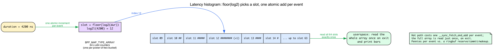
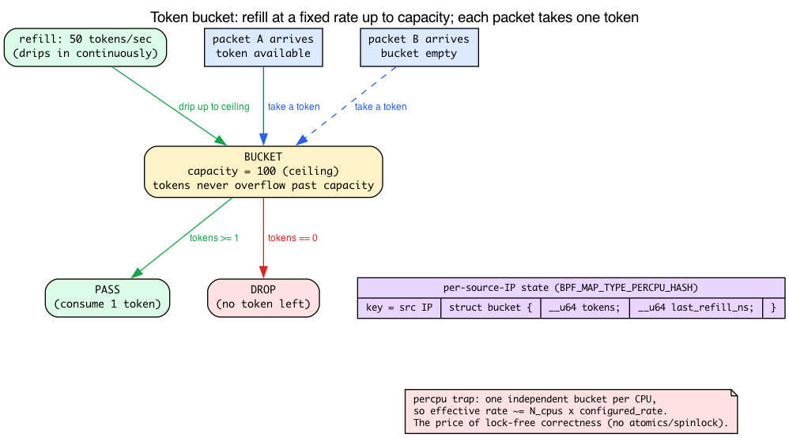
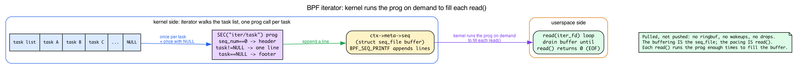

# Days 28–30 — Capstone

> **Mission:** ship one substantial BPF project that consolidates everything from Days 1–27. Along the way, learn the four pieces of background the project options lean on but nothing earlier taught you outright: how to build a latency **histogram** by hand in BPF (and the truth about `lhist`), the **token-bucket** rate-limiting algorithm, how a BPF **iterator** emits output that userspace reads like a file, and what an **EWMA** actually is. Three days, ~7–10 hours total.

This isn't a lab. It's *your* project. The point is to build something end-to-end without a guide, while the muscle memory from Days 1–27 is fresh.

But there's a trap in "build it without a guide." Each of the five options below name-drops a technique the earlier days *used* but never *taught the construction of*. Option A says "histogram-bucket via `lhist`" — and you'll go looking for an `lhist` helper that does not exist. Option B says "token bucket in percpu hash" — an algorithm Day 23 only mentioned by name. Option E says "emit via `bpf_seq_printf`… read it like a file" — a whole iterator/seq_file mechanism the book has only gestured at. Option C says "track RTT EWMA" — a term Day 23 repeats without ever defining.

So before you pick, this chapter teaches those four prerequisites properly: intuition first, then the concrete v7.1 source. After that, the five options and the three-day plan are exactly as designed.


The development loop, again:
1. **Sketch** (1 hour). Write a one-page README before any code.
2. **Build minimal version** that compiles and loads (3–4 hours). Get to "loads cleanly" first; functionality second.
3. **Verifier rejects?** Read log; identify type/lifetime issue; fix. Often 30–60 minutes per cycle on first attempts.
4. **Test on realistic load** (1 hour). Synthetic benchmarks lie; real workloads reveal bugs.
5. **Polish** (1–2 hours). Drop counters, README, build instructions, one screenshot.

---

## Prerequisite 1: building a latency histogram in BPF — and the truth about `lhist`

Option A's whole reason to exist is a latency tracer with a **histogram**. Its skeleton says "histogram-bucket via `lhist`." Stop right there, because this is the single most common wrong turn on this capstone.

**There is no `lhist` helper in libbpf/CO-RE BPF.** `lhist` and `hist` are **bpftrace builtins** — they exist inside the bpftrace language (you used them in the Day 1 headroom experiment of the *networking* book and in `bpftrace -e '... = lhist(...)'` one-liners). They are *not* BPF helpers you can call from a hand-written `.bpf.c` program. When you write a libbpf program, you build the histogram **yourself**. If you go hunting for a `bpf_lhist()` in `bpf_helpers.h`, you'll waste an hour. Don't.

So how *do* you build one? The intuition first.

### The intuition: an array of counters, one per power-of-two

A histogram is just *counting how many samples fell into each bucket*. For latencies, the useful buckets are **powers of two**: 0–1 ns, 1–2, 2–4, 4–8, … up to seconds. A latency that's "around 4 microseconds" and one that's "around 4.1 microseconds" belong in the same bucket; you don't care about the exact nanosecond, you care about the *order of magnitude*.

That means: declare a small **fixed-size array** — say 64 `u64` slots, one per power-of-two bucket. For each event, compute which slot it belongs in (`slot = floor(log2(duration))`) and add one to that slot. At the end, userspace reads the whole array **once** and prints bars.

Recall from Day 2 that `__sync_fetch_and_add(p, 1)` on a map value is the lock-free counter primitive — the lookup hands you an *unlocked* live pointer, so concurrent CPUs racing on the same slot would lose counts without an atomic. The histogram is the **same tool, new shape**: instead of one counter keyed by PID, it's an *array* of counters indexed by log2(duration). One atomic increment per event.



### Why this scales where ringbuf doesn't

This is the crucial performance point, and it's *why* a histogram is the right tool for Option A's hot path. A ringbuf event (Day 13) costs a reserve + commit + a userspace wakeup **per event**. A histogram increment costs **one atomic add** per event, and exactly **one** array read for the entire run, on exit. Histograms are pennies; per-event emission is dollars. That's why real tracers like `biolatency`/`funclatency`/`runqlat` aggregate into histograms in-kernel; the per-event-ringbuf-for-outliers hybrid is the extra step Option A asks you to add on top.

### The concrete v7.1 code: branchless log2

Here's the part that surprises people: you can't just call `log2()` from libm — BPF has no libc, and the verifier hates unbounded loops, so a naive "shift until zero" loop is a fight. The in-tree samples solve it with a **branchless shift-and-test** idiom. This is the canonical implementation, straight from `~/code/linux/samples/bpf/lwt_len_hist.bpf.c:24`:

```c
/* samples/bpf/lwt_len_hist.bpf.c:24 — 32-bit branchless log2 */
static unsigned int log2(unsigned int v)
{
    unsigned int r;
    unsigned int shift;

    r = (v > 0xFFFF) << 4; v >>= r;
    shift = (v > 0xFF) << 3; v >>= shift; r |= shift;
    shift = (v > 0xF)  << 2; v >>= shift; r |= shift;
    shift = (v > 0x3)  << 1; v >>= shift; r |= shift;
    r |= (v >> 1);
    return r;
}
```

Read it as a binary search over the bit position: "is the value bigger than 16 bits? then the answer is at least 16, shift those off and keep going." No loop, no branch the verifier can't fold — five comparisons, done. Latencies are 64-bit nanoseconds, so you need the 64-bit version, which splits the value into hi/lo 32-bit halves (`~/code/linux/samples/bpf/lwt_len_hist.bpf.c:37`):

```c
/* samples/bpf/lwt_len_hist.bpf.c:37 — 64-bit: log2 of the high half + 32, else the low half */
static unsigned int log2l(unsigned long v)
{
    unsigned int hi = v >> 32;
    if (hi)
        return log2(hi) + 32;
    else
        return log2(v);
}
```

And the increment is exactly the Day 2 pattern — lookup the slot, null-check, atomic-add (`~/code/linux/samples/bpf/lwt_len_hist.bpf.c:46`):

```c
/* samples/bpf/lwt_len_hist.bpf.c:46 — key = log2l(len), increment that slot */
SEC("len_hist")
int do_len_hist(struct __sk_buff *skb)
{
    __u64 *value, key, init_val = 1;

    key = log2l(skb->len);
    value = bpf_map_lookup_elem(&lwt_len_hist_map, &key);
    if (value)
        __sync_fetch_and_add(value, 1);
    else
        bpf_map_update_elem(&lwt_len_hist_map, &key, &init_val, BPF_ANY);
    return 0;
}
```

That sample uses a hash keyed by the log2 value; for a dense 0–63 histogram a `BPF_MAP_TYPE_ARRAY` (or `PERCPU_ARRAY`) of 64 slots is even cheaper — direct index, no hashing.

**Decade-scaled buckets (optional polish).** Powers of two give you ~3 buckets per order of magnitude, which is a bit coarse for a latency display. `~/code/linux/samples/bpf/tracex3.bpf.c:39` shows the trick to rescale into ~10 buckets per decade using the identity `log10(x)*10 = log2(x)*3`:

```c
/* samples/bpf/tracex3.bpf.c:39 */
static unsigned int log2l(unsigned long long n)
{
#define S(k) if (n >= (1ull << k)) { i += k; n >>= k; }
    int i = -(n == 0);
    S(32); S(16); S(8); S(4); S(2); S(1);
    return i;
#undef S
}
```

with the comment block at `tracex3.bpf.c:78` documenting the decade scaling (`index = 29 ~ 1 usec`, `index = 59 ~ 1 msec`, `index = 89 ~ 1 sec`) via `index = (l * 64 + (delta - base) * 64 / base) * 3 / 64`. Use the simple powers-of-two version first; reach for this only when polishing the display.

### Per-stack-id histograms (what Option A actually asks for)

Option A wants the histogram *bucketed by stack id* — a separate latency distribution per call site. That's a one-line change in shape: instead of keying the map by `slot` alone, key it by the pair `(stackid, slot)`. The stackid comes from `bpf_get_stackid()` exactly as you used it on Day 9 to aggregate by stack. So:

- a struct key `{ __u32 stackid; __u32 slot; }`,
- `slot = log2l(duration_ns)`,
- `__sync_fetch_and_add` on the looked-up value.

Userspace reads the whole map once, groups rows by `stackid`, and prints one histogram per stack — connecting Day 9's stackid aggregation to today's log2 bucketing. The outliers (above your threshold) still emit per-event via ringbuf with full kernel+user stacks; the histogram handles the common case for pennies.

---

## Prerequisite 2: the token-bucket rate-limiting algorithm

Option B's skeleton says "per-source-IP rate limiting (token bucket in percpu hash)." Day 23 told you "rate-limiting filters in BPF are essential" and moved on — it never showed the algorithm. Here it is, because you can't build B without it.

### The intuition: a bucket that refills at a fixed rate

Picture a bucket that holds **tokens**. It has a **capacity** (the burst size — say 100 tokens) and a **refill rate** (say 50 tokens/sec). Tokens drip in continuously up to the capacity ceiling; they never overflow past it. Every arriving packet must **take one token**: if a token is available, the packet passes and the token is consumed; if the bucket is empty, the packet is dropped.

This gives you exactly the behavior you want from a rate limiter: a burst of up to `capacity` packets is allowed instantly (the bucket was full), but the *sustained* rate is capped at the refill rate, because that's how fast tokens come back.



### The math: lazy refill on each packet

You don't run a timer dripping tokens in. That'd be wasteful. Instead you refill **lazily**, computing how many tokens *would have* accumulated since you last looked. Each key (source IP) stores just two fields:

```c
struct bucket {
    __u64 tokens;          /* tokens currently available (fixed-point or whole) */
    __u64 last_refill_ns;  /* timestamp of the last refill */
};
```

On each packet:

1. `now = bpf_ktime_get_ns()`
2. `elapsed = now - last_refill_ns`
3. `tokens += elapsed * rate / 1000000000` (tokens that accrued since last time), **capped at capacity**
4. `last_refill_ns = now`
5. if `tokens >= 1`: consume one (`tokens -= 1`), **PASS**; else **DROP**

The clock in step 1 is `bpf_ktime_get_ns()`, the monotonic nanosecond clock — `~/code/linux/kernel/bpf/helpers.c:178` (`BPF_CALL_0(bpf_ktime_get_ns)`), which is `ktime_get_mono_fast_ns()` and NMI-safe. There's a boot-inclusive sibling at `~/code/linux/kernel/bpf/helpers.c:190` (`BPF_CALL_0(bpf_ktime_get_boot_ns)`); the difference is that the boot variant keeps counting across suspend. For a rate limiter, *monotonic* (`get_ns`) is what you want — you're measuring short intervals, and you don't want a suspend to suddenly "refill" the bucket to full. Mention it only if your reader's tracer needs wall-vs-uptime semantics.

### The percpu trap (read this before you benchmark)

Option B says "percpu hash," and that choice has a subtlety that *will* surprise you on the benchmark if nobody warns you: **a per-CPU map keeps one independent bucket per CPU.** A source IP hashing to a given key has *N* separate buckets, one per logical CPU, and a packet only ever touches the bucket on the CPU it landed on (recall the per-CPU memory model from Day 2 — same key, physically different memory per CPU). So the effective *global* rate is roughly `N_cpus × configured_rate`. Configure 50 tokens/sec on an 8-CPU box and your attacker can push ~400/sec.

Is that a bug? No — it's a deliberate trade. The reason to pick percpu here is **lock-free correctness**: with a per-CPU map there is **no cross-CPU race** on the bucket, so you need no atomics and no spinlock on the value. A *shared* hash would force you to either atomically CAS the `{tokens, last_refill}` pair or take a `bpf_spin_lock` on the value — slower, and contended exactly when you're under attack. Percpu sidesteps all of that. The cost is precision: it's coarse DoS protection, not an exact global limiter. **Call this out in your README** so your benchmark numbers don't look like a bug. If you need a precise global limit, that's a shared hash with a spin-locked value — note the trade and move on.

### Where it fits with Day 15

Connect it back: Day 15's **LPM-trie denylist** is the *static* allow/deny decision (is this CIDR banned, yes/no). The token bucket is the *dynamic* per-source throttle layered on top (this IP is allowed, but not at *that* rate). Option B's full design is: XDP program does LPM lookup first (drop if denied), then token-bucket check (drop if over rate), then PASS — and tcx egress logs the drops. Two map types, two jobs, one packet path.

---

## Prerequisite 3: how a BPF iterator emits output, and how userspace reads it like a file

Option E is built entirely on a mechanism the book has only gestured at: a `SEC("iter/task")` program that walks every task, "emits via `bpf_seq_printf`," and is read by userspace "like a file." Day 12 mentioned `iter.s/task` only as an example of a *sleepable* SEC name — its real subject was page faults. The seq_file emit/read machinery is new, so here it is.

### The intuition: pulled, not pushed

Every tracing program you've written so far **pushes** events: something happens in the kernel, your program fires and shoves a record into a ringbuf, userspace drains it. An iterator is the **opposite** — it's **pulled** by userspace. Userspace says "give me the next chunk of output" via `read()`, and the kernel *runs your BPF program on demand* to produce that chunk. No ringbuf, no wakeups, no drops. This is the underused capability Option E showcases.

### The kernel side: one call per object, plus a NULL footer

An iterator program receives a context whose `ctx->meta->seq` is a kernel `struct seq_file` — a growable text buffer. You write into it with the `BPF_SEQ_PRINTF(seq, fmt, ...)` macro. The exact context Option E's program receives is `~/code/linux/kernel/bpf/task_iter.c:170`:

```c
/* kernel/bpf/task_iter.c:170 */
struct bpf_iter__task {
    __bpf_md_ptr(struct bpf_iter_meta *, meta);
    __bpf_md_ptr(struct task_struct *, task);
};
```

The kernel invokes your program **once per object** being iterated (one call per task), and then **one final call with the object pointer NULL** so you can emit a footer or summary. Two idioms fall out of that, both visible in the reference program `~/code/linux/tools/testing/selftests/bpf/progs/bpf_iter_tasks.c:20`:

```c
/* tools/testing/selftests/bpf/progs/bpf_iter_tasks.c:20 */
SEC("iter/task")
int dump_task(struct bpf_iter__task *ctx)
{
    struct seq_file *seq = ctx->meta->seq;
    struct task_struct *task = ctx->task;
    static char info[] = "    === END ===";

    if (task == (void *)0) {                 /* end-of-iteration: emit footer */
        BPF_SEQ_PRINTF(seq, "%s\n", info);
        return 0;
    }
    if (ctx->meta->seq_num == 0)             /* first call: emit header row */
        BPF_SEQ_PRINTF(seq, "    tgid      gid\n");

    BPF_SEQ_PRINTF(seq, "%8d %8d\n", task->tgid, task->pid);
    return 0;
}
```

- **`task == NULL`** ⇒ you're past the last task; emit the footer/summary.
- **`ctx->meta->seq_num == 0`** ⇒ this is the first invocation; emit the header row exactly once.

The `BPF_SEQ_PRINTF` macro is backed by the `bpf_seq_printf` helper at `~/code/linux/kernel/trace/bpf_trace.c:458` (`BPF_CALL_5(bpf_seq_printf, struct seq_file *m, ...)`), which validates the format/args and calls `seq_bprintf(m, ...)` to append into the buffer.

### The userspace side: read the iter fd like a file

This is the "read it like a file" part. Userspace:

1. attaches the program to get an **iter link**,
2. calls `bpf_iter_create(link_fd)` to get an **fd**,
3. `read()`s that fd in a loop until EOF.

Each `read()` makes the kernel run your BPF program enough times to fill the read buffer, draining task by task. When the iteration is exhausted, `read()` returns 0 (EOF). That's literally all "read it like a file" means — and it's why iterators need no ringbuf: the buffering *is* the seq_file, and the pacing *is* the `read()` syscall.



### Why sleepable matters here

Day 12 established that `iter.s/task` is **sleepable**. That pays off in an iterator: while walking tasks you may want to read the *walked task's* user memory (e.g., its argv, a cgroup path string) with `bpf_copy_from_user_task`, a sleepable-only helper. Be careful which helper you reach for: `bpf_copy_from_user` reads `current`'s address space, and during an iterator walk `current` is the userspace process doing the `read()`, **not** `ctx->task` — so it would silently read the wrong process. `bpf_copy_from_user_task(dst, size, user_ptr, task, flags)` (`helpers.c:682`) takes the target `task_struct` and uses `access_process_vm(tsk, …)` to read *that* task's memory; pass `ctx->task`. Because the iterator runs in process context (driven by a `read()` syscall), it *can* sleep — so it can call those helpers a hot-path tracer cannot. That's the tie-back to Day 12; no need to re-explain sleepability.

---

## Prerequisite 4: what an EWMA is (one paragraph — see Day 23 for the CC context)

Option C says "modify `bpf_dctcp` to track RTT EWMA, branch on a threshold." Day 23 says "alpha EWMA" repeatedly but never defines the term. Quick refresher (the congestion-control context is Day 23's territory, so this stays short):

An **EWMA** (exponentially weighted moving average) is a single-variable smoother: `avg = avg + ((sample - avg) >> shift)` (the parentheses matter — without them, `+`/`-` bind tighter than `>>` and the running average is discarded). It weights recent samples more heavily than old ones, and — crucially for BPF — it needs **no array of history**, just one number per socket. The `>> shift` *is* the weight: a bigger shift means slower adaptation. You can see the exact pattern in the kernel's own dctcp at `~/code/linux/tools/testing/selftests/bpf/progs/bpf_dctcp.c:44` (the per-socket state `__u32 dctcp_alpha;`), updated at `bpf_dctcp.c:131` as `alpha -= min_not_zero(alpha, alpha >> dctcp_shift_g)` — that's `(1-g)*alpha` in fixed point, the EWMA decay step. For Option C you read `srtt_us` off the `tcp_sock` and feed *it* into your own EWMA. That field is `~/code/linux/include/linux/tcp.h:307`: `u32 srtt_us; /* smoothed round trip time << 3 in usecs */`. Note the `<< 3`: it's already in eighths of a microsecond, and it's **already an EWMA** — the kernel smooths RTT for you. So your EWMA is a *coarser* smoother layered on an already-smoothed signal; keep that in mind when you tune the 1 ms threshold, or you'll chase noise that isn't there.

---

## Pick one

Five suggested projects, ordered roughly from "consolidates earlier days" to "frontier / harder."

### Option A: Latency tracer with histogram and outlier flame graphs

**What:** Generic latency tracer for any kernel function (chosen via env var). Histogram bucketed by stack id. Outliers above a threshold emit per-event with full kernel + user stack.

**Consolidates:** Days 6 (fentry/fexit), 9 (stack traces), 13 (ringbuf scaling), 3 (CO-RE for the entry-arg parsing).

**Why this is good capstone material:** every BPF developer eventually writes a tracer like this. It's the "hello, real world" of BPF. The simple version is ~150 lines; production-quality is ~500 lines (drop counters, sampling, fold-format export, real-time TUI).

**Skeleton plan:**
- BPF: fentry on a configurable function name; store entry timestamp in TID-keyed map; fexit computes duration; histogram-bucket the duration with the hand-built `log2l` slot index from Prerequisite 1 (there is **no** `lhist` helper — you build it); if dur > threshold, emit ringbuf event with stack ids.
- Userspace: parse args (function name, threshold), load + attach, polling loop, read the histogram array once on exit, emit folded format on stop.
- Bonus: live histogram in TUI (use Rust's `ratatui` or Python's `rich`); flamegraph SVG output.

### Option B: XDP firewall with userspace control plane

**What:** XDP-based packet filter with userspace agent for adding/removing rules. CIDR-based denylist (LPM trie) + per-source-IP rate limiting (token bucket in percpu hash) + tcx egress logging of drop events.

**Consolidates:** Days 14 (XDP), 15 (LPM), 17 (tcx), 13 (drop counters).

**Why this is good:** firewall-style applications are how Cilium and similar projects start. Concrete, measurable, immediately useful.

**Skeleton plan:**
- BPF: XDP program with deny (LPM lookup) + rate-limit (the token-bucket algorithm from Prerequisite 2) logic; tcx egress for outbound logging; shared maps for rules. Remember the percpu trap: effective rate ≈ `N_cpus × configured_rate` — document it.
- Userspace: REST or unix-socket CLI for rule management; stats endpoint; configuration file format.
- Bonus: persist rules to disk; clean detach on exit; deploy in a real veth-based test network.

### Option C: BPF TCP CC with adaptive heuristic

**What:** BPF-implemented TCP congestion control that adapts between two policies based on observed RTT. Below 1 ms RTT (local network), behave like Reno. Above, behave like BBR-ish.

**Consolidates:** Days 22 (struct_ops), 23 (instrumentation), 7 (BPF_PROG).

**Why this is good:** struct_ops is one of BPF's most powerful and least-used features. Building a CC is the canonical example. You'll learn how careful TCP is.

**Skeleton plan:**
- Start from `bpf_dctcp.c`; read `srtt_us` off the `tcp_sock`, feed it into your own EWMA (Prerequisite 4), branch on a 1 ms threshold. Remember `srtt_us` is already smoothed and in usec `<< 3`.
- Userspace: load, register as `bpf_adaptive`, expose stats.
- Bonus: A/B benchmark vs Cubic on 100 ms vs 0.1 ms paths; produce a graph.

### Option D: Custom sched_ext scheduler

**What:** Implement a simple two-class scheduler — interactive class (round-robin within priority cgroup) + background class (fair-share with vtime). Tasks self-classify by cgroup membership.

**Consolidates:** Days 25 (sched_ext), 26 (modify), 27 (read), eBPF Day 19 (cgroup awareness from networking book).

**Why this is good:** sched_ext is the bleeding edge. Writing a scheduler — even a simple one — puts you in a small club.

**Skeleton plan:**
- Start from `scx_simple.bpf.c`. Add per-cgroup classification, two DSQs, dispatch priority.
- Userspace: configurable cgroup paths; safety checks (refuse to load if priority cgroup empty).
- Bonus: latency benchmark (interactive vs background) under load; produce a graph.

### Option E: Iterator-based richer `ps`

**What:** A BPF iterator that walks every task and emits `{pid, comm, cgroup, rss, runtime, ...}` to a file descriptor. Userspace tool replaces `/proc` parsing for a `ps`-like utility.

**Consolidates:** Day 7 (BPF_PROG), Day 24 (kfunc/BTF), Day 12 (iterators are sleepable).

**Why this is good:** less hot-path, more "kernel introspection at scale" — useful for monitoring stacks. Iterator programs are an underused BPF capability.

**Skeleton plan:**
- BPF: `SEC("iter/task")` walking, emitting via `BPF_SEQ_PRINTF` into `ctx->meta->seq` — header on `seq_num == 0`, footer on `task == NULL` (Prerequisite 3).
- Userspace: `bpf_iter_create()` to get an fd, then read it like a file in a loop until EOF.
- Bonus: enrich output (cgroup paths, ns memberships, fd counts) faster than `/proc/<pid>/...` parsing; use the iterator's sleepability to `bpf_copy_from_user_task(ctx->task, …)` for the walked task's strings.

---

## Day 28 — Sketch and start

Pick one. Spend the first hour sketching:

- What BPF programs (one or many)?
- What maps and sizes (and concurrency considerations)?
- What userspace responsibilities?
- Where is the verifier most likely to push back?

Write a one-page README with the design **before any code**. **If you can't articulate the design, you're not ready to code.** The README forces concreteness; vague designs become obvious when you try to write them down.

Then build the minimum viable version. Goal for end of Day 28: it **compiles and loads**. It might not do anything useful. That's fine — a loading-but-broken program is way ahead of a perfect-but-unfinished one.

## Day 29 — Iterate

Run on a real workload. Measure. Fix verifier rejections. Add the outlier/control-plane/tuning feature you sketched.

Write tests if you can. Selftests in `tools/testing/selftests/bpf/` are good models for what BPF tests look like — and as you saw above, they double as reference implementations (`bpf_iter_tasks.c`, `bpf_dctcp.c`) for the very techniques the options use.

The bulk of your time today is **debugging**: verifier logs, kernel dmesg, ringbuf drops, missing fields. Don't get discouraged — every BPF programmer hits these.

## Day 30 — Polish and write up

Drop counters, error messages, clean detach paths. README explaining design decisions and one or two unexpected findings. Take a screenshot of it running.

Write **one paragraph** on:
> "The verifier rejected X. I fixed it by Y. Here's why."

This paragraph is the most valuable artifact of the entire 30 days. It crystallizes one piece of knowledge that's now permanently yours — a verifier rule you understand at the gut level, not just intellectually.

> ### There are no Dumb Questions
>
> **Q: I searched `bpf_helpers.h` and `bpf_helper_defs.h` for `lhist` and `hist` and found nothing. Am I on an old kernel?**
>
> A: No — they were never there. `lhist`/`hist` are **bpftrace language builtins**, not BPF helpers. In a hand-written libbpf/CO-RE program you build the histogram yourself: a fixed array map plus the branchless `log2l` slot index from `samples/bpf/lwt_len_hist.bpf.c`. If a tutorial implies a histogram helper exists for libbpf programs, it's confusing bpftrace with libbpf.
>
> **Q: My token-bucket limiter is set to 1000 pps but the source clearly pushed several thousand. Bug?**
>
> A: Almost certainly the percpu trap. A `BPF_MAP_TYPE_PERCPU_HASH` keeps an independent bucket *per CPU*, so the effective global allowance is roughly `N_cpus × configured_rate`. That's the deliberate price of lock-free correctness. For a precise global cap you need a shared hash with a `bpf_spin_lock` (or atomic CAS) on the `{tokens, last_refill}` value — slower and contended. Decide which you want and write it in the README.
>
> **Q: My iterator prints nothing. The program loads and attaches fine.**
>
> A: Did you `read()` the iter fd? An iterator is *pulled*, not *pushed* — the kernel only runs your program when userspace reads. Attaching gets you a link; you still need `bpf_iter_create()` to get an fd and a `read()` loop to drain it. No reads, no output. Also check your end condition: `read()` returning 0 is normal EOF (iteration exhausted), not an error.
>
> **Q: For Option C, my EWMA never moves even though RTT clearly varies.**
>
> A: Two common causes. First, `srtt_us` is in **microseconds `<< 3`** — if you compare it to a threshold in plain microseconds without shifting, your branch is off by 8×. Second, your shift is too large, so the EWMA adapts slower than your test runs. Remember you're smoothing an already-smoothed signal (`srtt_us` is itself an EWMA), so a gentle shift goes a long way.

---

## What to read in the kernel

- **`samples/bpf/lwt_len_hist.bpf.c`** — the canonical hand-built histogram: branchless `log2` (`:24`), 64-bit `log2l` (`:37`), and the lookup/`__sync_fetch_and_add` increment (`:46`). This is the pattern Option A needs.
- **`samples/bpf/tracex3.bpf.c`** — `log2l` (`:39`) plus the decade-scaling trick (`:78`, `log10(x)*10 = log2(x)*3`) for prettier latency buckets.
- **`kernel/bpf/helpers.c`** — `bpf_ktime_get_ns` (`:178`) and `bpf_ktime_get_boot_ns` (`:190`); the clocks the token-bucket refill math depends on (monotonic vs boot-inclusive).
- **`tools/testing/selftests/bpf/progs/bpf_iter_tasks.c`** — the reference `SEC("iter/task")` program (`:20`): `ctx->meta->seq`, the `task == NULL` footer, the `seq_num == 0` header, `BPF_SEQ_PRINTF`.
- **`kernel/bpf/task_iter.c`** — `struct bpf_iter__task` (`:170`), the exact context an iterator receives.
- **`kernel/trace/bpf_trace.c`** — `bpf_seq_printf` (`:458`), the helper behind `BPF_SEQ_PRINTF`.
- **`include/linux/tcp.h`** — `srtt_us` (`:307`), the smoothed-RTT field Option C branches on.
- **`tools/testing/selftests/bpf/progs/bpf_dctcp.c`** — `dctcp_alpha` (`:44`) and its EWMA decay update (`:131`); the model Option C extends.
- **`kernel/bpf/verifier.c`** — when your project gets rejected, this is where the message comes from. You've read pieces of it all month; now read whatever function printed *your* error.

---

## Today's experiment

Before you commit to an option, *measure the gap* the corresponding prerequisite fills, so the design lands in your hands and not just your head.

### Prove there is no `lhist` helper (Option A)

```bash
grep -rn 'lhist\|bpf_hist' ~/code/linux/tools/lib/bpf/ ~/code/linux/tools/testing/selftests/bpf/bpf_helpers.h 2>/dev/null
```

You'll find nothing in libbpf — then find the real thing only in the bpftrace ecosystem and in hand-rolled samples. Now grep the sample that *does* build one:

```bash
grep -n 'log2\|__sync_fetch_and_add' ~/code/linux/samples/bpf/lwt_len_hist.bpf.c
```

### Watch the monotonic clock the token bucket uses (Option B)

```bash
sudo bpftrace -e 'kprobe:do_nanosleep { printf("%llu\n", nsecs); }' | head -3
```

`nsecs` in bpftrace is the same monotonic clock `bpf_ktime_get_ns()` returns. Watch it advance — that's the value your refill math subtracts `last_refill_ns` from.

### See an iterator get pulled (Option E)

```bash
sudo bpftool iter pin $(find ~/code/linux/tools/testing/selftests/bpf -name 'bpf_iter_tasks.bpf.o' 2>/dev/null | head -1) /sys/fs/bpf/task_iter 2>/dev/null; sudo cat /sys/fs/bpf/task_iter | head
```

The argument order is `bpftool iter pin OBJ PATH` — the ELF object first, the pin path second. bpftool has **no** built-in task iterator; you always supply an object. If the prebuilt `bpf_iter_tasks.bpf.o` isn't present, build it first:

```bash
make -C ~/code/linux/tools/testing/selftests/bpf bpf_iter_tasks.bpf.o
```

`cat`-ing the pinned iter file is exactly the "read it like a file" loop — each `read()` runs the BPF program on demand to fill the buffer.

---

## After Day 30

You're not done; you're **operationally fluent**.

Next steps depending on direction:

### Production tooling

Productize your capstone or contribute to existing projects (Cilium, bpftrace, Parca, Tetragon). Look at issues with `good-first-issue` labels.

### Upstream contribution

Watch the bpf mailing list (`vger.kernel.org/bpf`). Pick small selftest improvements. Submit your first patch. The barrier is lower than people think — well-written selftest contributions are welcomed.

### Frontier

Read what's coming next: arena, BPF lists/rbtree, dynptr extensions. Each is a chapter not in this 30-day plan because it's still maturing.

### Specialization

Pick a vertical:
- **Networking** (XDP/Cilium): build packet-path features, contribute to upstream.
- **Observability** (Pixie / Parca / bpftrace): build tracing tools, contribute to ecosystem.
- **Security** (Tetragon, BPF LSM): write security policy enforcement.
- **Scheduling** (sched_ext): build domain-specific schedulers — `scx_layered`, `scx_lavd`, `scx_rusty` are good prior art.

---

## Bullet Points

- **There is no `lhist`/`hist` helper for libbpf programs** — those are bpftrace builtins. In a hand-written BPF program you build the histogram: a fixed array map of `u64` slots, `slot = floor(log2(duration))` via the branchless `log2l` idiom, one `__sync_fetch_and_add` per event, read the whole array once on exit. Per-stack-id histograms just key by `(stackid, slot)` (Day 9).
- **Histograms scale where per-event ringbuf doesn't** — one atomic add per event vs. a reserve/commit/wakeup per event; that's why real tracers aggregate in-kernel and only emit outliers per-event.
- **Token bucket:** store `{tokens, last_refill_ns}` per key; on each packet lazily refill `tokens += elapsed * rate / 1e9` (capped at capacity) using `bpf_ktime_get_ns()`, consume one to PASS or DROP when empty.
- **The percpu token-bucket trap:** one independent bucket per CPU means effective rate ≈ `N_cpus × configured_rate`. It's the price of lock-free correctness (no atomics/spinlock). Coarse DoS protection, not a precise global limit — document it.
- **A BPF iterator is *pulled*, not *pushed*.** It writes into `ctx->meta->seq` (a `struct seq_file`) with `BPF_SEQ_PRINTF`; the kernel calls it once per object plus once with the object NULL (footer); `seq_num == 0` is the header. Userspace `bpf_iter_create()`s an fd and `read()`s it like a file — each read runs the program on demand. Being sleepable, it may `bpf_copy_from_user_task(ctx->task, …)` to read the walked task's memory while iterating (Day 12).
- **EWMA in one line:** `avg = avg + ((sample - avg) >> shift)` — one variable, no history array (mind the parens: `>>` binds looser than `+`/`-`). For Option C, `srtt_us` (`tcp.h:307`) is microseconds `<< 3` and already an EWMA; your EWMA is a coarser layer on top, so tune the threshold accordingly.
- The most valuable artifact of all 30 days is one paragraph: **"The verifier rejected X. I fixed it by Y. Here's why."**

---

## Check question

You're building Option A. You write the BPF histogram, run your tracer under a heavy workload across all 8 CPUs, and on exit your userspace reads the array and the bars look *too short* — far fewer total samples than the events you know occurred. The increment is a plain `hist[slot]++` on a shared `BPF_MAP_TYPE_ARRAY`. Then you switch the map to `BPF_MAP_TYPE_PERCPU_ARRAY` (still `hist[slot]++`, summing across CPUs in userspace), and now the counts are right *and* it's faster. Why?

<details>
<summary>Click to reveal answer</summary>

**Answer:** A plain `hist[slot]++` on a *shared* array is a non-atomic read-modify-write: eight CPUs racing on the same hot slot read the same old value, each add one, and write back — so concurrent increments clobber each other and counts are genuinely **lost**. That's the "too short" bars. The naive fix is `__sync_fetch_and_add(&hist[slot], 1)`, which is correct but *contended* — eight CPUs serialize on the atomic, costing throughput under load. `BPF_MAP_TYPE_PERCPU_ARRAY` sidesteps both: each CPU increments its **own** copy of the slot with an ordinary store — no lost counts, no atomic, no cross-CPU contention (the Day 2 per-CPU memory model). Userspace then reads the per-CPU array and **sums across CPUs** to get the logical total. So: percpu trades a tiny bit of userspace summation work for both correctness *and* zero kernel-side contention — the same reason percpu maps win for high-rate counters, and (deliberately, in Option B) the same reason a percpu token bucket gives a per-CPU rather than global rate. If your bars are *still* too short after switching, you forgot to sum the per-CPU values — read all `nr_cpus` entries, not just index 0.

</details>

---

## End of 30-day plan

You've come from "what is BPF?" to "I shipped a thing." Specifically:

- Day 1: First fentry program with ringbuf
- Day 5: Verifier intuition (PTR_TO_MAP_VALUE_OR_NULL, bounded loops)
- Day 10: Userspace tracing via uprobes
- Day 15: XDP-based firewall
- Day 20: kfuncs and acquire/release semantics
- Day 25: BPF scheduler
- Day 30: Your project

The codebase keeps moving. Your fluency is durable; specific APIs are not. Re-read `kernel/bpf/verifier.c` every six months. Subscribe to the bpf list. Run `tools/testing/selftests/bpf/test_progs` after kernel upgrades and read what changed.

Welcome to the party.
