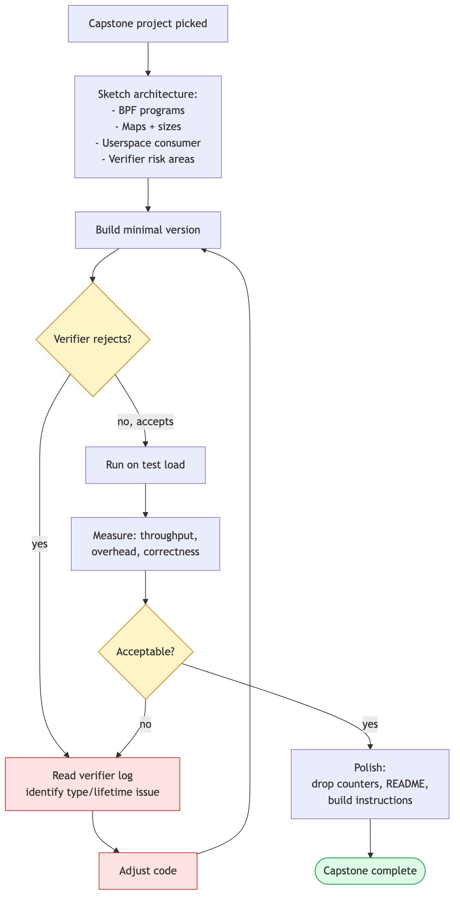

# Days 28–30 — Capstone

> **Mission:** ship one substantial BPF project that consolidates everything from Days 1–27. Three days, ~6–9 hours total.

This isn't a lab. It's *your* project. The point is to build something end-to-end without a guide, while the muscle memory from Days 1–27 is fresh.

The development loop, again:
1. Sketch (1 hour).
2. Build minimal version that compiles and loads (3–4 hours).
3. Verifier rejects? Read log, identify type/lifetime issue, fix (variable).
4. Test on realistic load (1 hour).
5. Polish — drop counters, README, build instructions (1–2 hours).

## Pick one

### Option A: Latency tracer with histogram + outlier flame graphs

**What:** Generic latency tracer for any kernel function (chosen via env var). Histogram bucketed by stack id. Outliers above a threshold emit per-event with full kernel + user stack.

**Why:** Consolidates Days 6 (fentry/fexit), 9 (stack traces), 13 (ringbuf scaling), and a touch of CO-RE.

**Skeleton:**
- BPF: fentry on configurable function, store entry ts; fexit, compute duration, increment hist bucket; if dur > threshold, emit ringbuf event with stack ids.
- Userspace: parse args (function name, threshold), load+attach, polling loop, emit folded format on stop.
- Bonus: live histogram in TUI; flamegraph SVG output.

### Option B: XDP firewall with userspace control plane

**What:** XDP-based packet filter with a userspace agent for adding/removing rules. CIDR-based denylist (LPM trie) + per-source-IP rate limiting (token bucket in percpu hash) + tcx egress logging of dropped attempts.

**Why:** Consolidates Days 14 (XDP), 15 (LPM), 17 (tcx), 13 (drop counters).

**Skeleton:**
- BPF: XDP program with deny + rate-limit logic; tcx egress for outbound logging.
- Userspace: REST or unix-socket CLI for rule management; stats endpoint.
- Bonus: persist rules to disk; clean detach on exit; deploy to a real veth-based test network.

### Option C: BPF TCP CC with adaptive heuristic

**What:** BPF-implemented TCP congestion control that switches between two policies based on observed RTT. Below 1ms RTT (local network), behave like Reno; above, behave like BBR-ish.

**Why:** Consolidates Days 22 (struct_ops), 23 (instrumentation), 7 (BPF_PROG).

**Skeleton:**
- Start from `bpf_dctcp.c`, modify to track RTT EWMA, branch on threshold.
- Userspace: load, register as `bpf_adaptive`, expose stats.
- Bonus: A/B benchmark vs Cubic on 100ms vs 0.1ms paths.

### Option D: A custom sched_ext scheduler

**What:** Implement a simple two-class scheduler — interactive class (round-robin within priority cgroup) + background class (fair-share with vtime). Tasks self-classify by cgroup membership.

**Why:** Consolidates Days 25 (sched_ext), 26 (modify), 27 (read), 19 (cgroup).

**Skeleton:**
- Start from `scx_simple.bpf.c`. Add per-cgroup classification, two DSQs.
- Userspace: configurable cgroup paths.
- Bonus: latency benchmark (interactive vs background) under load.

### Option E: Iterator-based richer `ps`

**What:** A BPF iterator that walks every task and emits `{pid, comm, cgroup, rss, runtime}` to a file descriptor. Userspace tool replaces `/proc` parsing for a `ps`-like utility.

**Why:** Consolidates Days 7 (BPF_PROG), 24 (kfunc/BTF), 12 (iterators are sleepable).

**Skeleton:**
- BPF: `SEC("iter/task")` walking, emitting via `bpf_seq_printf`.
- Userspace: open the iter, read it like a file.

## Day 28 — Sketch and start

Pick one. Spend the first hour sketching:

- What BPF programs?
- What maps and sizes?
- What userspace?
- Where will the verifier likely complain?

Write a one-page README with the design before any code. **If you can't articulate the design, you're not ready to code.**

Build the minimum viable version. Get it to **compile and load** before doing anything else. A loading-but-broken program is way ahead of a perfect-but-unfinished one.

## Day 29 — Iterate

Run on a real workload. Measure. Fix verifier rejections. Add the outlier/control-plane/tuning feature you sketched.

Write tests if you can — selftests in the kernel tree are good models for what BPF tests look like.

## Day 30 — Polish and write up

Drop counters, error messages, clean detach paths. README explaining design and one or two unexpected findings.

Take a screenshot of it running.

Write *one paragraph* on:
> "The verifier rejected X. I fixed it by Y. Here's why."

This paragraph is the most valuable artifact. It crystallizes one piece of knowledge that's now permanently yours.

## After Day 30

You're not done; you're operationally fluent.

Next steps depending on direction:

**Production tooling.** Productize your capstone or contribute to existing projects (Cilium, bpftrace, parca). Look at the open issues on those repos with a `good-first-issue` label.

**Upstream.** Watch the bpf mailing list (`vger.kernel.org/bpf`). Pick small selftest improvements. Send your first patch.

**Frontier.** Read what's coming next: arena, BPF lists/rbtree, dynptr extensions. Each is a chapter not in this 30-day plan because it's still maturing.

**Specialization.** Pick a vertical: networking (XDP/Cilium), observability (Pixie/Parca/bpftrace), security (Tetragon, BPF LSM), scheduling (sched_ext schedulers — `scx_layered`, `scx_lavd`, etc.).

---

## End of 30-day plan

You've come from "what is BPF" to "I shipped a thing." Specifically:

- Day 1: First fentry program with ringbuf
- Day 5: Verifier intuition (PTR_TO_MAP_VALUE_OR_NULL, bounded loops)
- Day 10: Userspace tracing via uprobes
- Day 15: XDP-based firewall
- Day 20: kfuncs and acquire/release semantics
- Day 25: BPF scheduler
- Day 30: Your project

The codebase keeps moving. Your fluency is durable; specific APIs are not. Re-read kernel/bpf/verifier.c every six months. Subscribe to the bpf list. Run `tools/testing/selftests/bpf/test_progs` after kernel upgrades and read what changed.

Welcome to the party.
