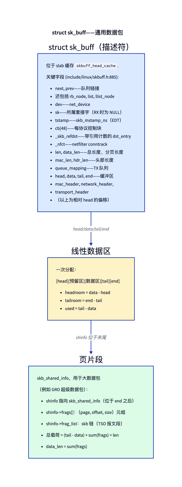
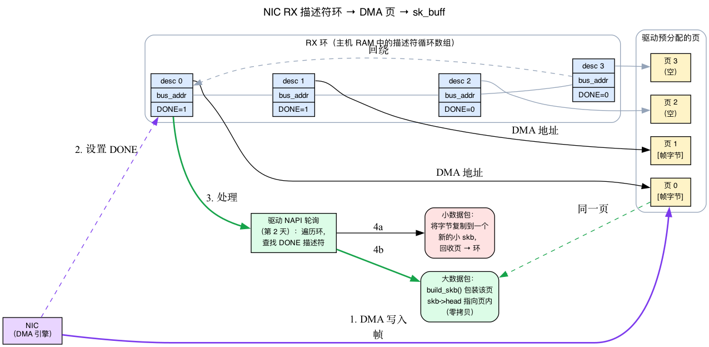
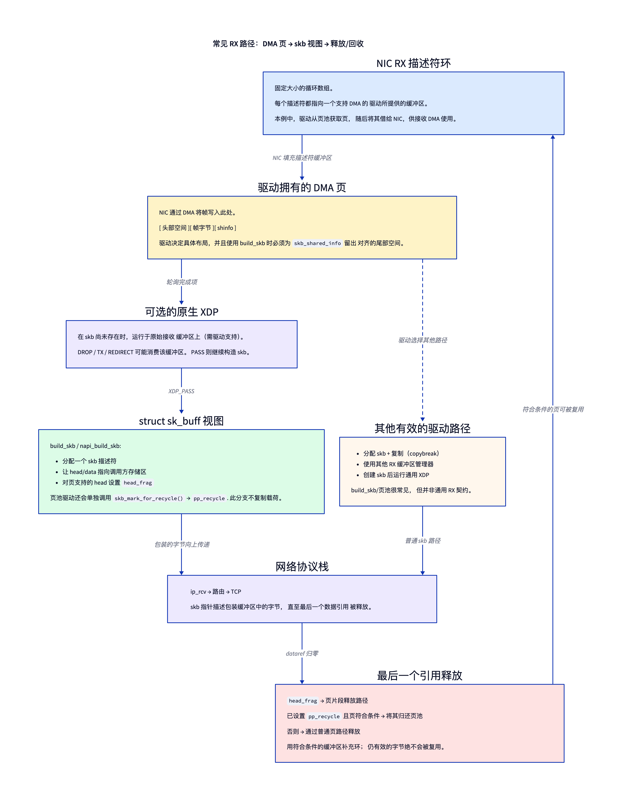
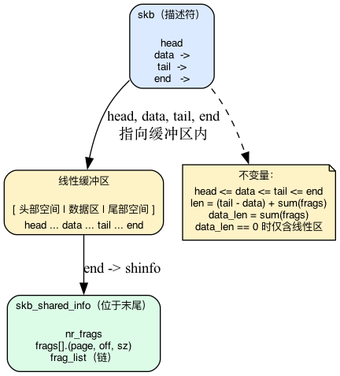
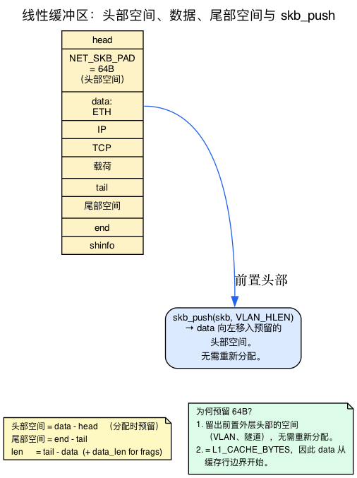
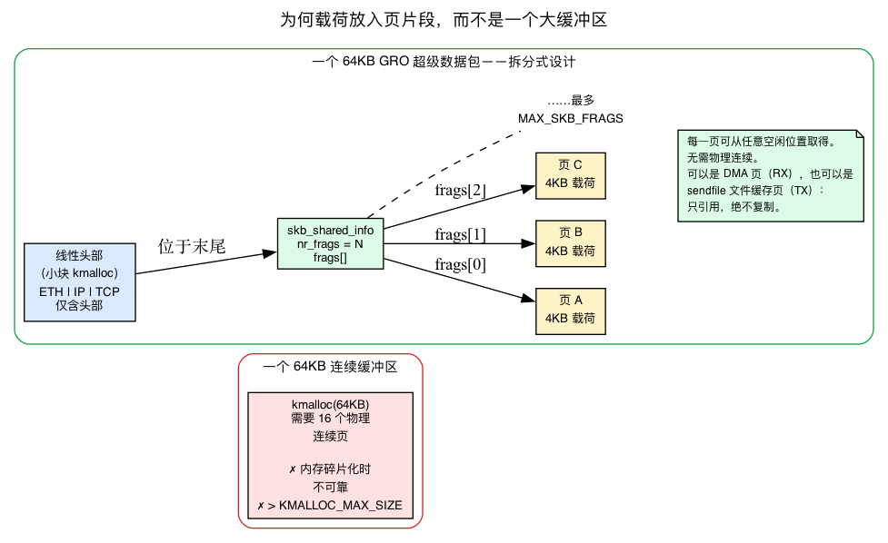
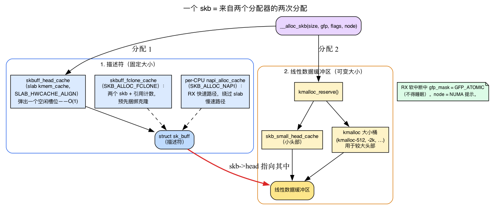
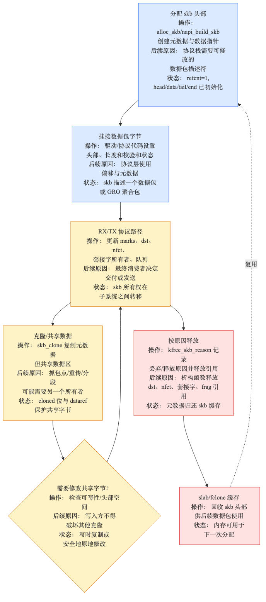
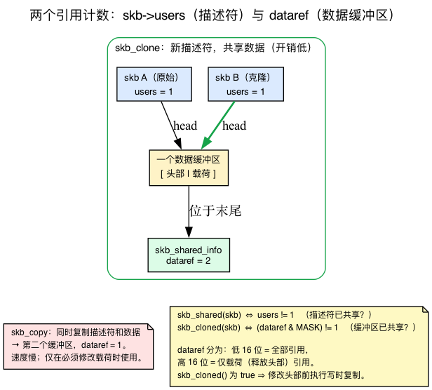
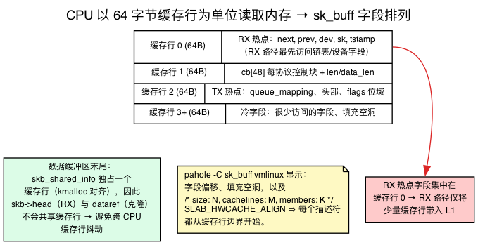

# 第1天 — `struct sk_buff`：通用数据包容器

> **今日任务：** 理解 Linux 网络中使用最频繁的数据结构。学习它的解剖结构、生命周期，以及它所进行的布局技巧，以及这些技巧背后的硬件与内存机制。总时长：约 75 分钟。

> **第一阶段从这里开始。** 第1至第5天涵盖基础知识：sk_buff、RX/TX 路径、NAPI、分段卸载、网络命名空间。到第5天，你将能够从上至下阅读内核的 RX 路径而不会迷失。

## 为什么 sk_buff 比任何其他结构都重要

每一个穿过内核网络协议栈任意一层的数据包都装载在一个 `sk_buff` 中。来自 NIC 的 RX、到线路的 TX、数据包过滤、路由、封装、分段 —— 所有操作都在这个结构上进行。了解它是如何工作的，是流畅阅读内核网络代码与在两个函数调用后迷失之间的区别。

该结构定义在 **`include/linux/skbuff.h`**（7.1 版本第 886 行），实现在 **`net/core/skbuff.c`**（截至 7.1 版本约 7500 行 —— 文件的约 80% 是工具函数）。

不过，这里有个要点：`sk_buff` 并非孤立存在。它是内核对一个非常物理问题的回答 —— *一张网卡刚刚将一些字节写入你的 RAM，而多个不同的子系统都希望查看这些字节而不进行复制操作。* 要真正理解 `sk_buff` 的结构为何如此设计，你需要掌握四个大多数教程都会跳过的背景知识：

1.  网卡实际如何将数据包交付到内存（描述符环 + DMA）。
2.  内核如何以固定大小的池分配内存（slab 分配器）。
3.  物理内存如何被切分为页，以及为什么你不能总是获得一个大的连续块。
4. CPU 如何以 64 字节为单位读取内存，这决定了字段的排列顺序。

讲到 `sk_buff` 中依赖这些背景的部分时，我们会逐一介绍。到结束时，你将能够阅读 `__alloc_skb` 和 `build_skb`，并确切知道每一行代码在对抗什么。



## 数据包的来源：网卡、描述符环形缓冲区和 DMA

在我们查看结构体之前，先来跟踪一下字节。当一个帧在线路上传输时，**CPU 不会参与将其复制到内存中**。这项工作由网卡（NIC）本身完成，通过一种称为 *DMA* 的机制实现。

**DMA（直接内存访问）** 指的是设备自行读写主机 RAM，而无需 CPU 逐个加载/存储字节。CPU 只需告诉设备 *在 RAM 中的何处* 放置数据；设备的 DMA 引擎执行传输并在完成后发出信号。为了保证安全，缓冲区必须先被 **`dma_map`**：内核向设备提供一个它可使用的 *总线地址*，该映射确保 CPU 缓存和设备对内存的视图保持一致。

那么网卡如何知道将传入的帧放入何处呢？通过一个 **RX 描述符环形队列**：

- **环形队列**是驻留在主机内存中的固定大小循环**描述符**数组，由驱动程序在初始化时设置。
- 每个 **描述符** 是一个小型记录，其中包含 **DMA（总线）地址** 和 **状态位**。
- 启动时，驱动程序为每个描述符**预先分配一个缓冲区**（通常是一个页面，或页面的一个片段），并将该缓冲区的总线地址写入描述符中。这就是你到处会看到的“驱动程序预分配的页面”。
- 当一个帧到达时，NIC 的 DMA 引擎会将帧字节**直接写入由下一个空闲描述符指定的缓冲区**，然后在该描述符中**翻转 DONE 位**并（最终）引发中断。

关键后果：**CPU 开始运行时，数据包字节已经位于 RAM 中的一个页里了。** 驱动程序并没有将它们复制到那里——是硬件完成的。驱动程序在其接收例程中的工作（在 Linux 中运行于 *NAPI 轮询* 内部——第2天的全部主题）是遍历环形队列，找到 DONE 位被设置的描述符，并将每个已填充的 DMA 页转换成一个 `sk_buff` 协议栈可以处理的。

最后一步就是 `sk_buff` 的作用，它有两种策略：

- **小数据包（例如 64 字节的 ACK）：** 将少量字节从 DMA 页复制到一个新的、小的 skb 缓冲区中，并立即将该 DMA 页回收回环形队列。这是廉价操作，因为复制量很小。
- **大数据包：** *完全不进行复制。* 将现有的 DMA 页包装成一个 skb，使得 skb 的 `data` 指针指向 **NIC 已经填充的页面。** 这就是 **零拷贝接收路径**，也是 `build_skb()` 存在的目的。我们稍后会见到它。

**TX 是 RX 的镜像。** 要传输时，驱动程序获取一个传出的 skb，`dma_map` 其线性缓冲区和每个页片段，将这些总线地址写入 **TX 环形描述符** 中，并启动 NIC。NIC 的 DMA 引擎直接从这些页面中读取字节并发送到线路，然后引发 *完成* 中断，驱动程序知道可以取消映射并释放该 skb。

记住一个概念：**数据包的有效载荷通常存在于内核希望引用而非复制的独立页中**——RX 时是 DMA 页，TX 时是 `sendfile()` 文件缓存页。这个单一事实正是 `sk_buff` 被拆分为一个小的“描述符 + 头部”部分和一个“页片段”列表的原因，我们稍后会看到。



> 后文衔接：**第2天的 RX 路径就从驱动程序的 NAPI 轮询开始，处理的正是这个环形队列。** 今天我们只需要知道该环形队列存在，并且它将数据包字节预先放置在页面中。

## 一种常见的零拷贝 RX 路径：DMA 页 → skb 窗口

这里是最常被忽略的部分，也是让其他一切变得清晰的关键。在常见的高性能接收路径中，驱动程序会为 NIC 提供一个内核拥有的缓冲区用于 DMA，然后将同一块存储空间包装成 skb，而不是复制帧。这是一条重要的路径 —— **并非每个驱动程序都必须遵循的约定**。



现代 NIC 和其驱动程序通常通过一个 **描述符环形队列** 进行通信：一个固定大小的循环数组，每个接收描述符都命名了一个支持 DMA 的缓冲区。在基于页池的驱动程序中，握手过程如下所示：

1. **在数据包到达之前**，驱动程序从页池中获取一个页（通常如此），将其映射用于 DMA，并将它的 DMA 地址写入一个空闲的接收描述符。内核拥有该内存；描述符将它借给 NIC。
2. **帧到达**。NIC 的 DMA 引擎将字节写入该缓冲区，标记描述符完成，并最终触发 NAPI 轮询运行。
3. **驱动程序处理完成事件**。当支持并附加了原生 XDP 时，可以在此检查原始缓冲区。在 `XDP_PASS` 后，许多驱动程序会调用 **`build_skb`** 或 `napi_build_skb`：该辅助函数分配一个 skb 描述符，并将 `skb->head` 指向调用者提供的存储空间。该分支避免了有效载荷复制。
4. **skb 向上穿过协议栈** —— `ip_rcv`，路由，TCP —— 其指针描述着该缓冲区中的字节。
5. **最后一个数据引用释放头部**。`head_frag` 告诉 `skb_free_head()`，该头部来自一个页或页片段。另外，一个感知页池的驱动程序会调用 `skb_mark_for_recycle()`，设置 `pp_recycle`；只有在那时，释放路径才会尝试将该页返回到其页池中。没有该标记，页片段的释放路径会正常释放它。

替代方案很重要。有些驱动程序使用 `napi_alloc_skb()` 分配一个 skb 并将小帧复制进去（接收 **copybreak**）；其他驱动程序则使用不同的缓冲区管理器。通用 XDP 也在已有 skb 后运行。因此，`build_skb` 意味着“包装调用者提供的存储空间”，而不是“所有 RX 都是页池零拷贝。”

这就是为什么 `build_skb` 与 `__alloc_skb` 并存的原因。`__alloc_skb` 分配一个描述符和全新的线性存储空间。`build_skb` 在调用者提供的存储空间周围分配描述符；该存储空间可能是一个 DMA 填充的页，但辅助函数本身既不知道 NIC 环形队列，也不会将 skb 加入页池回收。

这种常见的页支持路径带来三个结果：

- **`head_frag` 和 `pp_recycle` 回答不同的问题。** `head_frag` 选择页片段释放而不是 `kfree`；`pp_recycle` 要求页池路径回收合格的存储空间。
- **原生 XDP 可以在构建 skb 之前运行。** 因此，丢弃或重定向可以完全避免分配 skb 描述符。（第27天。）
- **驱动程序有意保留头部空间和尾部空间。** `NET_SKB_PAD` 式头部空间允许稍后的 `skb_push`；尾部空间必须包含对齐的 `skb_shared_info`。确切的布局因驱动程序而异。

发送端使用相关的环形缓冲区，但不是完美的所有权镜像（第3天）。TCP 可能在重传树中保留其原始的 skb，而一个计入内存开销的 skb 克隆体则会经过 IP、队列规则和驱动程序。驱动程序为下游的 skb 映射 TX 描述符，完成时释放下游引用。

请记住这个带有限定条件的流程：**RX 描述符 → 驱动拥有的 DMA 缓冲区 → 可选的原生 XDP → skb 视图（或拷贝）→ 协议栈 → 释放/回收。** 第2天和第3天将逐函数地讲解这个流程。

## 描述符和数据

`sk_buff` 本身是一个 *描述符*。数据包字节存放在别处：一个单独分配的线性缓冲区，以及可选的尾部页片段。



四个指针在 `sk_buff` 中定义了线性区域：

- `head` — 分配的起始位置。创建后不会移动。
- `data` — 当前头部视图中的第一个有效字节。当你推入或拉出头部时会移动。
- `tail` — 最后一个有效字节的下一个字节。
- `end` — 边界；`skb_shared_info` 尾部（片段列表 + 缓冲区引用计数，如下定义）位于此处。

不变量：
- `head ≤ data ≤ tail ≤ end`
- `headroom = data - head`, `tailroom = end - tail`
- 对于仅线性 skb，`len == tail - data` 和 `data_len == 0`。

当内核推入外部头部（例如，添加 IP 头部以封装）时，它执行 `skb_push(skb, header_len)` — 这会减少 `data`。头部空间缩小；新增的字节现在属于数据包的一部分。相反的操作是 `skb_pull` — 增加 `data`，用于剥离已处理过的头部。

### 为什么要预留头部空间？详解 `NET_SKB_PAD`

注意 `skb_push` 只有在 `data` 之前有空闲空间可以推入时才能工作。这块空闲区域就是**头部空间**，在接收路径上，驱动程序会故意预先保留一些空间。为什么？

因为当接收的数据包在网络协议栈中向上传递时，各层经常需要在数据包前部添加字节：重新插入硬件剥离的 VLAN 标签、为隧道封装外部 IP/UDP 头等。如果没有头部空间，每次 `skb_push` 都必须通过 `pskb_expand_head` 重新分配整个缓冲区来腾出空间 —— 这很昂贵。在分配时预留少量头部空间意味着这些推入操作几乎是免费的。

RX 分配器预留的空间量为 **`NET_SKB_PAD`**，它并非魔法常数 —— 它是相对于缓存行定义的。

```c
#define NET_SKB_PAD     max(32, L1_CACHE_BYTES)   /* include/linux/skbuff.h:3319 */
```

在 x86_64 上，`L1_CACHE_BYTES` 是 64（`CONFIG_X86_L1_CACHE_SHIFT=6` → `1 << 6 = 64`），所以 **`NET_SKB_PAD = 64`**。这个取值兼顾两件事：

1. **有足够的外层头部空间。** 64 字节足以容纳 VLAN 标签、隧道头部等，因此常见的前置操作永远不会重新分配。
2. **缓存对齐。** 因为填充等于缓存行大小，数据包的第一个字节（`data`，以太网头部开始处）始于缓存行边界 —— 接收路径和 `memcpy` 都会因此受益。（我们稍后会详细解释缓存行；现在：对齐的数据访问更快。）

你会看到的另一个较小的填充是 **`NET_IP_ALIGN`**。某些架构要求 **IP 头部** 4 字节对齐。由于以太网头部是 14 字节，所以在 `data` 前加 2 字节填充可使字节 14（即 IP 头部开始处）落在 4 字节边界上。但 `NET_IP_ALIGN = 2`（`skbuff.h:3295`）只是 **通用回退值** —— 它定义在 `#ifndef NET_IP_ALIGN` 下。在 **x86 上，架构会将其覆盖为 `0`**（`arch/x86/include/asm/processor.h:46`: `#define NET_IP_ALIGN 0`），因此在该处完全不插入 IP 对齐填充 —— 并非驱动程序选择跳过 2 字节填充，而是常量直接为零。这就是为什么 `napi_alloc_skb` 保留 `NET_SKB_PAD + NET_IP_ALIGN`（`skbuff.c:886`）在 x86 上等于 64 + 0 = 64，与头部空间实验所承诺的“约 64 字节”一致。只有在对齐敏感的架构上才会保留这 2 字节填充，而不会额外消耗资源。

记住 `NET_SKB_PAD = 64` —— 它会在头部空间实验和今天的检查问题中再次出现。



## 页片段——用于大型数据包和零拷贝

许多实际数据包 —— 特别是来自 `sendfile()` 的大型出站数据包或大型 GRO 入站数据包 —— 无法放入一次分配中。内核使用 `skb_shared_info`（放置在线性缓冲区的 `end` 之后）来链接页片段：

```c
struct skb_shared_info {
    __u8 nr_frags;
    skb_frag_t frags[MAX_SKB_FRAGS];   /* (netmem, offset, len) tuples; see below */
    struct sk_buff *frag_list;         /* chain of skbs (TSO) */
    /* ... */
};
```

`data_len` 保存了页片段中的字节数。`len = (tail - data) + data_len`。大多数代码使用辅助函数（`skb_frag_size`，`skb_frag_page`）而不是直接操作这些字段。

### 什么是“页”，以及为什么有效载荷要放入页片段中

要理解内核为什么要使用单独的页片段列表而不是一个大缓冲区，你需要了解内核的物理内存单位：**页**。

- 物理 RAM 以固定大小的 **页帧** 进行管理，每个页帧大小为 `PAGE_SIZE`（x86_64 上为 4 KB）。每一块物理内存分配最终都是若干个这样的页帧。
- **伙伴分配器**会分配连续的 **2^阶页块**：0 阶 = 4 KB，1 阶 = 8 KB，3 阶 = 32 KB，依此类推。阶数越高，需要的*物理连续*内存越多。
- **`kmalloc` 返回物理上连续的内存**，因此其大小受到上限限制（`KMALLOC_MAX_SIZE`，`slab.h:591`）。超过 `KMALLOC_MAX_CACHE_SIZE`（`slab.h:593`）后，`kmalloc` 停止使用按大小分桶的 slab 缓存，直接转向伙伴分配器/页分配器（仍需物理连续）；单次分配的最大上限是 `KMALLOC_MAX_SIZE`。在繁忙系统上请求一个 **64 KB 物理连续** 的块是不可靠的：可能有大量 *空闲* 页，但没有 16 个 *连续* 的页。这种状况 —— 空闲但不连续的内存 —— 称为 **内存碎片压力**。

现在这个设计就说得通了。可以把一个 `skb_frag_t` 想象成一个 **(页，偏移量，大小)** 的引用 —— 页中的某些字节 —— 这是合理的初步近似。7.1 中的实际结构体是一个 `(netmem, offset, len)` 元组：`struct skb_frag { netmem_ref netmem; unsigned int len; unsigned int offset; }`（`skbuff.h:361`）。`netmem_ref`（`include/net/netmem.h:140`）是一个 *不透明* 的引用，它编码了 **要么** 一个 `struct page` **要么** 一个 `net_iov`（非页内存，例如 devmem-TCP），这就是为什么一个 frag 不会被保证由 `struct page` 支持 — `skb_frag_page()` 首先检查 `skb_frag_is_net_iov(frag)` 并对非页情况返回 `NULL`。始终通过辅助函数 `skb_frag_page()` / `skb_frag_off()` / `skb_frag_size()` 访问 frag，而不要直接访问字段。不同 frag 引用的内存**不必彼此连续，也不必与线性头部连续。** 所以一个 64 KB 的 GRO 超数据包变成：

- 一个**小型线性头部**，仅包含以太网/IP/TCP 报头（一个小的 `kmalloc`，易于满足），以及
- 最多 **`MAX_SKB_FRAGS`** 个页片段，用于承载有效载荷 —— 每个都是从任意空闲位置获取的普通 4 KB 页面。

永远不需要 64 KB 的连续分配。而正是这种结构使得**零拷贝**成为可能：frag 页面可以是 RX 时 NIC 的 DMA 页面，或 TX 时 `sendfile()` 的文件缓存页面 —— 被*引用*，而不是被复制。

`MAX_SKB_FRAGS` 限制了一个 `skb_shared_info` 持有多少个 frag。在 v7.1 中它是可配置的：

```c
/* include/linux/skbuff.h */
#ifndef CONFIG_MAX_SKB_FRAGS
# define CONFIG_MAX_SKB_FRAGS 17
#endif
#define MAX_SKB_FRAGS CONFIG_MAX_SKB_FRAGS
```

`net/Kconfig` 还声明了 `config MAX_SKB_FRAGS`，其取值范围为 `range 17 45`，默认值为 `default 17`；调高该值有助于 GRO/BIG TCP 在每个 skb 中容纳更多有效载荷。



> ### 常见疑问
>
> **问：为什么线性缓冲区不能总是足够大？**
>
> 答：因为每个 skb 在数据包接收时都可能分配其线性缓冲区。对于不携带有效载荷的 64 字节 ACK，分配 1500 字节会浪费内存。对于 64 KB GRO 超数据包，使用 64 KB 线性缓冲区并不现实（受 kmalloc 最大阶和内存碎片压力限制）。这种分离设计使内核可以只分配足够的头部空间用于线性分配，并使用页片段处理有效载荷。
>
> **问：cb[48] 是做什么用的？**
>
> 答：它是每个数据包的临时存储区。每一层协议都可以在那里存放状态信息。TCP 使用 `TCP_SKB_CB(skb)` 来保存序列号、标志和 SACK 信息。在 `skb_clone` 中，`cb` 的内容被 *逐字复制* 到克隆体中 — `__copy_skb_header` (`net/core/skbuff.c:1552`) 执行 `memcpy(new->cb, old->cb, sizeof(old->cb))` — 因此克隆体从相同的控制数据开始。需要独立于克隆体状态的层必须自行重置 `cb`。48 字节是充裕的 —— 大多数层只使用一部分。
>
> **问：一个全新的 sk_buff 描述符有多大？**
>
> 答：在 x86_64 上大约是 230 字节（验证方法：在编译后于你的构建目录中查看 `pahole sk_buff` —— 精确大小取决于配置）。该结构体经过精心设计以对齐缓存行，并且字段顺序经过优化以实现热/冷分离。阅读字段声明周围的注释，了解哪些是哪些是“RX 热点”，哪些是“TX 热点”。

## 内核如何分配内存：slab 分配器

我们即将阅读分配路径，并且它会提到几个“缓存”。在理解这些之前，你需要了解 **slab 分配器**（Linux 的实现称为 **SLUB**）。

通用的 `malloc` 灵活但有开销：它需要跟踪可变大小的块、搜索空闲列表，并且会随时间产生碎片。内核反复分配 *相同的少数对象类型* —— 例如，数百万个 `sk_buff` —— 因此它使用了一种专门的方案：

- slab 分配器将整个 **页面划分为固定大小的对象槽位**。
- 一个 **`kmem_cache`** 是一个专门用于 **一种对象大小/类型** 的池。分配本质上是“弹出一个空闲槽位”，释放则是“将其推回”——**O(1)** 复杂度，且具有优秀的缓存行为，因为相同类型的对象会聚集在一起。
- 通用的 `kmalloc(n)` 是建立在一组 **按大小分桶** 的缓存之上的（`kmalloc-512`，`kmalloc-2k`，…）。`kmalloc(n)` 将 `n` 向上舍入到下一个桶，并从该缓存中提取。

现在来看关于 `sk_buff` 的关键结构洞察：**描述符和数据来自两个不同的分配器。**

- 描述符（`struct sk_buff` 本身）来自一个专用的、固定大小的缓存，因此每个 skb 都是相同大小，并且保持在缓存中热度较高。在 v7.1 中，该缓存名为 **`"skbuff_head_cache"`**，并通过 `net_hotdata.skbuff_cache` 访问。

  ```c
  /* net/core/skbuff.c:5189, in skb_init() */
  net_hotdata.skbuff_cache = kmem_cache_create_usercopy("skbuff_head_cache",
                          sizeof(struct sk_buff), 0,
                          SLAB_HWCACHE_ALIGN | SLAB_PANIC | FLAG_SKB_NO_MERGE, ...);
  ```

- **线性数据缓冲区** 是一个 **独立** 的分配，大小与数据包一致。这就是为什么 `__alloc_skb` 需要 *两次* 分配。

在 `skb_init()` 中创建了三个与 skb 相关的缓存：

| 缓存（v7.1 名称） | 它所包含的内容 | 创建时间 |
|---|---|---|
| `skbuff_head_cache` | `struct sk_buff` 描述符（固定大小） | `skbuff.c:5189` |
| `skbuff_fclone_cache` | 一个 `struct sk_buff_fclones` = **两个** skb + 引用计数 | `skbuff.c:5199` |
| `skb_small_head_cache`（slab 名称 `"skbuff_small_head"`） | 小型线性数据缓冲区（`SKB_SMALL_HEAD_CACHE_SIZE`） | `skbuff.c:5208` |

**Fclones。** 当代码知道它将很快 *克隆* 一个 skb 时（TCP 持续这样做 —— 它保留一份副本用于重传，同时将克隆体发送到协议栈中），它会设置 `SKB_ALLOC_FCLONE`。这会从 `skbuff_fclone_cache` 中分配，其对象是一个 `struct sk_buff_fclones { struct sk_buff skb1; struct sk_buff skb2; refcount_t fclone_ref; }`（`skbuff.h:1396`）。预期的克隆体（`skb2`）**就在同一个分配中** —— 当克隆发生时无需进行第二次描述符分配。

**每个 CPU 快速路径。** RX 是热点，因此有一个每个 CPU 的回收描述符存储区，称为 **`napi_alloc_cache`**（一个每个 CPU 的 `skb_cache[]` 数组，`skbuff.c:231`）。`napi_skb_cache_get()`（`skbuff.c:284`）从中弹出；当其为空时，它会通过 `kmem_cache_alloc_bulk(net_hotdata.skbuff_cache, ...)` 批量补充。使用 `SKB_ALLOC_NAPI` 分配 skb（或在软中断上下文中简单分配）会从这个每个 CPU 缓存中取出一个描述符，并 **完全跳过 slab 分配器的慢路径**。这就是 NAPI 分配器所宣传的“每个 CPU 缓存”。

**GFP 标志。** 每次分配都使用一个 `gfp_mask`（例如 `GFP_KERNEL`，`GFP_ATOMIC`）。它告诉分配器它可以 *做什么* —— 最重要的是，**是否可以睡眠**。RX 路径运行在软中断/IRQ（原子）上下文中，禁止睡眠，因此它使用 **`GFP_ATOMIC`**。这就是分配函数传递 `gfp_mask`（以及 NUMA `node`）的原因。



## sk_buff 生命周期：从诞生到消亡



现在分配路径变得清晰，因为你知道每个缓存和标志的含义。

**分配路径**（全部在 `net/core/skbuff.c` 中）：

- `__alloc_skb(size, gfp_mask, flags, node)` —— 主力。从 `net_hotdata.skbuff_fclone_cache` 分配 **描述符**（当 `SKB_ALLOC_FCLONE` 被设置时，适合需要克隆的 skb）或默认的 `skbuff_head_cache` —— 或者使用 `SKB_ALLOC_NAPI`，从每个 CPU 的 `napi_alloc_cache` 分配。然后通过 `kmalloc_reserve`（`skbuff.c:604`）单独分配 **线性缓冲区**，小型头部会从 `skb_small_head_cache` 分配，或在较大时回退到按大小分桶的 `kmalloc` 缓存。两次分配，两个分配器 —— 正如 slab 部分所预测的那样。（`__alloc_skb` 位于 `skbuff.c:672`。）
- `__netdev_alloc_skb(dev, len, gfp_mask)` —— 驱动程序 RX 端的分配器。其缓冲区“内置了 `NET_SKB_PAD` 头部空间”（内核文档注释在 `skbuff.c:753` 中原话如此）以便廉价地插入头部。
- `napi_alloc_skb(napi, len)` —— NAPI 快速路径分配器，具有上述每个 CPU 的描述符缓存；还保留了 `NET_SKB_PAD`。
- `build_skb(data, frag_size)` / `slab_build_skb(data)` —— 将一个 *已存在的* 缓冲区（驱动程序预分配的 DMA 页面）包装成 skb。**这是来自 NIC 部分的零拷贝接收路径。** 不是分配数据缓冲区并复制帧，而是只分配描述符（`kmem_cache_alloc(net_hotdata.skbuff_cache, ...)`），并将 skb 指向 NIC 已填充的页面。`__build_skb` 位于 `skbuff.c:488`；`build_skb` 位于 `skbuff.c:506` 然后设置 `skb->head_frag = 1`（skb 的头部*就是*一个页片段，`skbuff.h:828`），并调用 `skb_propagate_pfmemalloc(...)`。`napi_build_skb()`（`skbuff.c:574`）是 NAPI 上下文的变体，它也从每个 CPU 的缓存中获取其描述符。`__build_skb` 的文档注释阐明了我们所教授的 RX 模型：*“在 IO 之前，驱动程序只分配数据缓冲区，其中 NIC 放入传入帧…… RX 队列只包含数据缓冲区，而不是完整的 skb。”*

**克隆路径** — 要理解这些路径你需要掌握引用计数模型，所以我们先构建它。

### 两个引用计数，而非一个：`skb->users` 对 `dataref`

`skb_clone` 对 skb 做了一个廉价的拷贝。要理解 *为什么它是廉价的* 以及 *之后可以安全地做什么*，你必须知道 skb 跟踪 **两个完全独立的引用计数**。

**1. `skb->users` — 对描述符的引用。**
```c
refcount_t users;   /* include/linux/skbuff.h:1099 */
```
这用于统计有多少个位置持有 *这个 `sk_buff` 指针。* `skb_get()` 增加它；`kfree_skb()` 减少它，并且 **仅当其归零时才真正释放。** `skb_shared(skb)` 就是字面意义上的 `refcount_read(&skb->users) != 1`（`skbuff.h:2112`）。两个子系统对同一个 skb 进行排队时会使用它。

**2. `skb_shared_info.dataref` — 对数据缓冲区的引用。**
```c
atomic_t dataref;   /* include/linux/skbuff.h:612 */
```
这会统计有多少个 `sk_buff` **描述符指向同一个数据缓冲区**。这是 `skb_clone` 所触及的：克隆会获得一个 **全新的描述符**，但不是复制字节，而是 **增加 `dataref`**。*这就是* 为什么克隆是廉价的 —— 不需要复制有效载荷。

因为克隆共享缓冲区，你不能随意写入克隆 skb 的头部 —— 这会破坏其他持有者的视图。因此 `dataref` 被巧妙地 **分为两半** （`SKB_DATAREF_SHIFT = 16`，`skbuff.h:658`）：

- **低 16 位** 统计对缓冲区的 *总体* 引用次数；
- **高 16 位** 统计其中有多少是 **仅有效载荷**（头部释放）的引用。

内核自身的文档块（`skbuff.h`，"DOC: dataref and headerless skbs"）解释了这一点：TCP 通过 `nohdr` 标记一个 skb `__skb_header_release()`，这会设置 `dataref = 1 + (1 << SKB_DATAREF_SHIFT)`（`skbuff.h:2101`），使得下层知道可以安全地在共享缓冲区中添加头部。`skb_header_cloned()`（`skbuff.h:2070`）计算 `(dataref & MASK) - (dataref >> SHIFT)` 来决定是否可以在原地修改 **头部**。

这让你明白两个你到处都会看到的辅助函数的确切含义：

- **`skb_cloned(skb)`**（`skbuff.h:2031`）在数据缓冲区被共享时为真（`(dataref & SKB_DATAREF_MASK) != 1`）。如果为真，你必须 **不要** 在不先通过 `pskb_expand_head` 进行写时复制的情况下修改头部。
- **`skb_shared(skb)`** 测试的是 *描述符* 计数（`users != 1`），这是完全不同的问题。

有了这些，克隆路径就显而易见了：

- `skb_clone(skb, gfp)`（`skbuff.c:2088`） —— 新的描述符，**共享** 数据缓冲区（增加 `dataref`）。廉价。在数据包套接字（`tcpdump`）和 netfilter LOG 中大量使用。（如果可用 fclone，它会重用预先分配的 `skb2` —— 完全不需要描述符分配。）
- `skb_copy(skb, gfp)` — 完整复制描述符 **和** 数据（新缓冲区，`dataref = 1`）。速度慢；仅在必须修改有效载荷时使用。
- `pskb_copy(skb, gfp)` — 复制线性头部，但 **共享页片段**（增加页的引用计数）。

这种两层方案解释了为何 `tcpdump`，即克隆 *每个* 数据包，每个数据包依然保持廉价，但在高频率下仍明显可见 —— 今日的克隆追踪实验使其变得清晰。



**释放路径**：

- `kfree_skb(skb)` — 标准释放方式。递减引用计数（包括 `users` 和当 `users` 归零时缓冲区上的 `dataref`）；仅在是最后一个引用时释放数据。
- `kfree_skb_reason(skb, reason)` — 较新方式；使用 `enum skb_drop_reason` 使内核的丢弃监控器可以归因于该丢弃。**在新代码中应优先使用此方式**。原因枚举定义在 `include/net/dropreason-core.h`。
- `consume_skb(skb)` — 与 `kfree_skb` 相同，但不触发丢弃追踪点（用于“成功”处置）。

## CPU 对内存的视图：缓存行和字段排序

最后一点背景知识，它解释了你将在结构体中读到的注释以及今日 `pahole` 实验的全部意义。

**CPU 并不会一个字节一个字节地读取内存。** 它以固定的**缓存行**为单位移动内存 — `L1_CACHE_BYTES`，**x86_64 上是 64 字节。** 触摸单个字段时，CPU 会将该字段所在的整个 64 字节行加载到 L1 缓存中。触摸不同行中的字段，则会再获取第二行。

这对频繁访问的结构体有直接的性能影响，例如 `sk_buff`：

- **热/冷分离。** 如果某个代码路径使用的字段分散在多个缓存行中，则该路径会将多行加载到缓存中。如果这些字段 **被分组到同一行中**，则该路径只访问少量行，运行更快。因此 `sk_buff` 的布局使得 **RX 热点字段聚集、TX 热点字段聚集，而很少使用的（冷）字段独立放置**，以免污染热点行。这就是为什么最前面的字段是 `next`、`prev`，以及 `dev`/`sk` 区域（`skbuff.h:886`） —— 这些是 RX 路径首先访问的列表和设备字段。

- **位打包标志。** 布尔状态如 `cloned:1, nohdr:1, fclone:2, head_frag:1, pfmemalloc:1, …` 被打包到共享的 `__u8` 位域中（`skbuff.h:956`），部分是为了保持热点区域紧凑 —— 一个字节中包含多个标志，而不是每个标志占用一个字节。

- **描述符对齐。** 记住 `skbuff_head_cache` 是使用 **`SLAB_HWCACHE_ALIGN`** 创建的？这使得 **每个描述符都从缓存行边界开始**，因此某个字段的偏移量可以可预测地映射到某一行。

- **将头部与 `skb_shared_info` 分离。** 再次查看 `__alloc_skb` 中的注释（在 `kmalloc_reserve` 之前）：
  ```c
  /* We do our best to align skb_shared_info on a separate cache line.
   * It usually works because kmalloc(X > SMP_CACHE_BYTES) gives aligned
   * memory blocks ... Both skb->head and skb_shared_info are cache line aligned.
   */
  ```
  内核将 `skb_shared_info` 放置在数据缓冲区末尾的缓存行边界上，这样 `skb->head`（在 RX 上写入）和 `skb_shared_info`（由克隆操作的引用计数字段访问）**不会共享同一行** —— 否则该行会在 CPU 之间频繁跳动。

将其与 `NET_SKB_PAD = max(32, L1_CACHE_BYTES)` 关联起来：这是相同的 `L1_CACHE_BYTES`，用于确保数据起始位置落在缓存行边界上。缓存行是本文件中布局决策背后隐藏的常量之一。

这正是 **`pahole` 所揭示的内容**：它打印每个字段的偏移量、**填充空洞**，以及一个 `/* size: N, cachelines: M, members: K */` 尾部信息，显示结构体如何填满其缓存行。今天的实验将教你如何阅读这些内容。



## 今日实验

今天你不需要编写代码。你需要检查正在运行的内容。

### 查看 sk_buff 分配的实时情况

```bash
sudo bpftrace -e 'kprobe:__alloc_skb { @[comm, kstack] = count(); } interval:s:5 { exit(); }' | head -50
```

按调用者分组的 5 秒内 skb 分配情况。你会看到驱动程序和协议层的调用情况。

### 查看各类丢包及其原因

```bash
sudo perf trace --no-syscalls -e skb:kfree_skb -- sleep 5
```

输出显示了内核中每个丢弃的 skb 在何处被处理，以及如果使用了 `kfree_skb_reason` 则会显示丢弃原因。

### 检查当前内核构建中的 skb 大小

```bash
cd ~/code/linux
# After building vmlinux once (needs CONFIG_DEBUG_INFO_BTF=y or DWARF):
pahole -C sk_buff vmlinux
```

`pahole` 从已编译的 `vmlinux` 的调试信息中读取结构体布局，而不是从头文件源码中读取 —— 在编译器对类型进行布局之前，`.h` 没有偏移量或填充。`-C sk_buff` 仅选择该结构体（不需要 `grep`）；它以 `/* size: N, ... */` 尾部信息打印字段级布局。揭示了大小、填充和字段级布局。注意 `next, prev, dev, sk` 位于顶部 —— 这是 RX 路径首先接触的缓存热区域。现在你已经知道什么是缓存行，可以将填充孔和 `cachelines:` 计数视为我们刚刚讨论的热/冷分离的地图。

### 跟踪数据包的头部空间变化

```bash
sudo bpftrace -e '
fentry:ip_rcv { @h[comm] = lhist((uint64)args->skb->data - (uint64)args->skb->head, 0, 256, 16); }
interval:s:5 { exit(); }'
```

进入 `ip_rcv` 的数据包的头部空间直方图。你会看到大多数数据包具有 ~64 字节的头部空间（NET_SKB_PAD）。这个 `0` 与 `64` 的划分正是头部空间部分的重点：RX 分配器（`__netdev_alloc_skb`，`napi_alloc_skb`）预先保留 `NET_SKB_PAD`，以便后续外层头部的 `skb_push` 不会重新分配，而普通的 `__alloc_skb` 则不保留任何空间（某些驱动程序会额外保留 *更多* 空间用于加密卸载或 XDP）。

### 观察 tcpdump 运行时的克隆计数

数据包套接字捕获会克隆每个数据包。启动捕获（`-w /dev/null` 会丢弃数据包，因此 `tcpdump` 不会刷屏你的终端）：

```bash
sudo tcpdump -i any -w /dev/null &
```

然后追踪 `skb_clone`：

```bash
sudo bpftrace -e 'fentry:skb_clone { @[kstack] = count(); } interval:s:5 { exit(); }' | head -30
```

`skb_clone` 在每个数据包上触发，因为捕获路径会克隆每个数据包。每个克隆都是一个全新的描述符，它只增加缓冲区的 `dataref`（而不是有效载荷拷贝），这使得每个数据包的成本保持较低 —— 但是在高数据包速率下，即使是这种廉价的克隆也是可以测量的，这就是为什么 `tcpdump` 增加了开销。完成时停止捕获：

```bash
sudo pkill tcpdump
```

---

## 内核中需要阅读的内容

- **`include/linux/skbuff.h`** — `struct sk_buff` 定义（第 886 行）。阅读字段注释。然后查看辅助函数（`skb_push`、`skb_pull`、`skb_reserve`、`skb_put`）。同时略读位域块（约第 955 行）和 "DOC: dataref and headerless skbs" 注释。
- **`net/core/skbuff.c`** — `__alloc_skb`（第 672 行）、`__build_skb`（第 488 行）、`kfree_skb_reason`、`skb_clone`（第 2088 行）。注意在 `skb_init` 中创建的三个缓存（第 5189–5208 行）。总共约 7500 行，但分配路径小于 100 行。
- **`include/linux/skbuff_ref.h`** — 引用计数辅助函数；快速阅读。
- **`include/net/dropreason-core.h`** — `enum skb_drop_reason` 列表（约 124 个原因，见 7.1）。略读。你将在 `perf trace` 中看到这些内容。
- **`Documentation/networking/skbuff.rst`** — 官方参考文档。只需阅读一次。

---

## 要点回顾

- 网卡通过 **DMA 将数据包传入由 RX 环形队列描述符指定的预分配页中** — 数据在 CPU 运行前就已经在 RAM 中。驱动程序将每个完成的描述符转换为一个 skb。
- **`sk_buff`** 是描述符；数据存储在线性缓冲区 + 可选的页片段中。一个 **frag** 是一个 `(netmem, offset, len)` 元组 — `netmem` 引用一个页面 *或* 一个 net_iov（使用 `skb_frag_page()`/`skb_frag_off()`/`skb_frag_size()`） — 所以有效载荷可以位于非连续的页面中 — DMA 页面或 `sendfile` 页面 — 并且永远不需要被复制。
- 指针不变量：`head ≤ data ≤ tail ≤ end`。`headroom`，`tailroom`，`len`，`data_len`。RX 分配器预保留 **`NET_SKB_PAD = max(32, L1_CACHE_BYTES) = 64`** 以便 `skb_push` 外层头部不会重新分配。
- 一个 64 KB 的线性缓冲区是不切实际的，因为 **`kmalloc` 返回物理连续的内存** 且上限为 `KMALLOC_MAX_SIZE`，并且 **碎片化** 使得大块连续区域稀缺 — 因此采用线性头部 + 页片段分割。
- **slab 分配器** 提供 O(1) 的固定大小池。skb **描述符** 来自 `skbuff_head_cache`；**线性缓冲区** 来自 `skb_small_head_cache`/`kmalloc` 桶 — **两次分配**。`skbuff_fclone_cache` 预打包一个克隆；**每个 CPU 的 `napi_alloc_cache`** 为 RX 快速路径提供服务。**`GFP_ATOMIC`** 在原子 RX 上下文中使用。
- **`cb[48]`** 是每个协议层使用的逐数据包临时存储区。
- 通过 **`__alloc_skb`** / **`napi_alloc_skb`** / **`build_skb`**（DMA 页面的零拷贝封装）分配；通过 **`kfree_skb_reason`** 释放。
- **两个引用计数：** `skb->users` 计算描述符引用（`skb_shared`）；`skb_shared_info.dataref` 计算共享数据缓冲区的描述符数量（分为所有引用 / 仅有效载荷两部分）。**`skb_clone`** 增加 `dataref` 并共享数据；**`skb_copy`** 复制全部内容（`dataref = 1`）。`skb_cloned()` ⇒ 在修改头部前进行写时复制。
- **`enum skb_drop_reason`** 是新的且必需的丢包归因方式。
- 该结构体较大（约 230 字节；可用 pahole 验证，与配置相关）；**CPU 以 64 字节缓存行读取内存**，因此字段按 **缓存行顺序排列** 用于 RX 热 / TX 热 / 冷分离，描述符是 `SLAB_HWCACHE_ALIGN` 的，而 `skb_shared_info` 单独放在一行 — 请阅读注释，并阅读 `pahole` 的 `cachelines:` 页脚。

---

## 检查问题

你在 NIC 处收到一个数据包。驱动程序通过 `napi_alloc_skb(napi, 1500)` 分配了一个 skb。该数据包包含 100 字节的以太网 + IP + TCP。请逐步说明在驱动程序完成设置但 `ip_rcv` 运行之前，四个指针（`head`、`data`、`tail`、`end`）分别指向何处。

<details>
<summary>点击显示答案</summary>

**答案：** `head` 指向线性分配的起始位置。`data` 指向以太网头部的起始位置（驱动程序在保留了 NET_SKB_PAD = 64 字节的头部空间后，将字节放置于此）。`tail` 指向 `data` 之后第 100 字节（即数据包字节）。`end` 位于线性缓冲区的末尾（1500 + 对齐）。因此：`headroom = 64`、`len = 100`、`data_len = 0`、`tailroom = ~1400`。当 `ip_rcv` 运行时，`eth_type_trans` 已经向前推进了 `data`，跳过了以太网头部（调整了 `mac_header` 等），因此现在 `data` 指向 IP 头部。（在零拷贝 `build_skb` 的情况下，字节从未被复制 —— `head` 会指向 NIC 的 DMA 页面，且 `skb->head_frag` 会被设置 —— 但此处 `napi_alloc_skb` 分配了一个全新的线性缓冲区，驱动程序将小帧复制到其中。）

</details>

---

## 明天

第2天 — 接收路径。NAPI 轮询 → 驱动程序 → `__netif_receive_skb` → `ip_rcv`。我们跟踪一个数据包经过每个阶段，并查看每个 `skb_*` 辅助函数在何处被调用 —— 从驱动程序的 NAPI 轮询开始，清空我们今天遇到的 RX 描述符环形队列。
