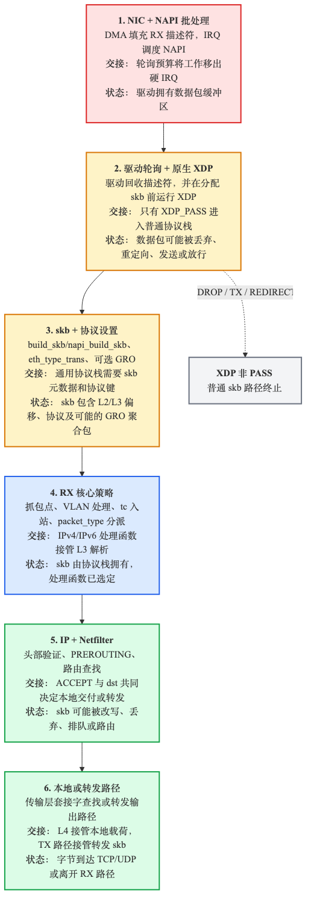
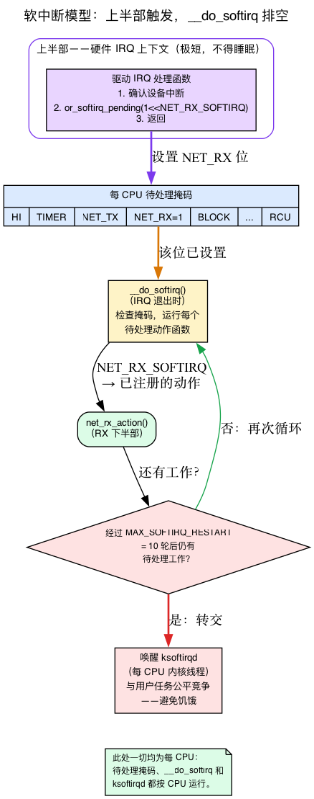
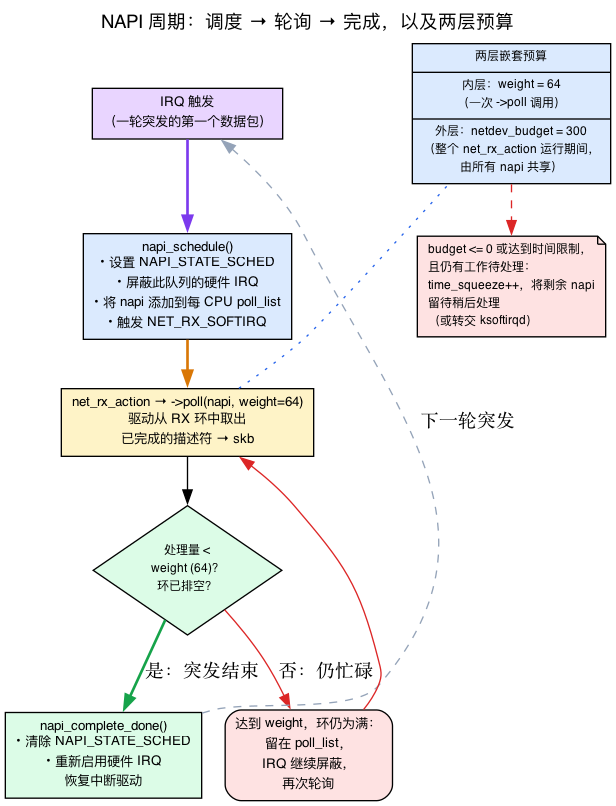
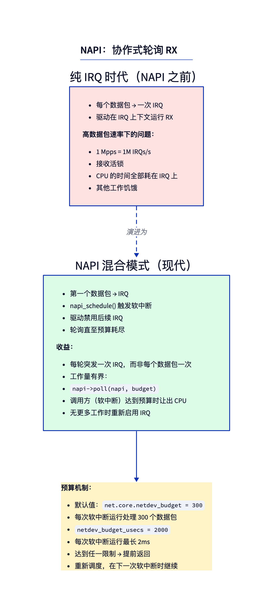
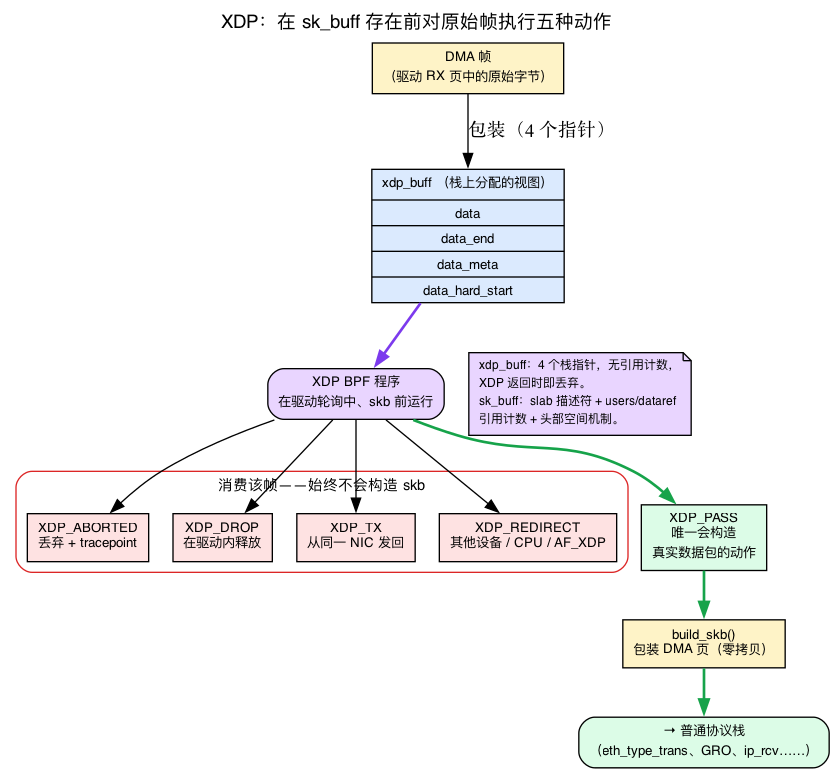
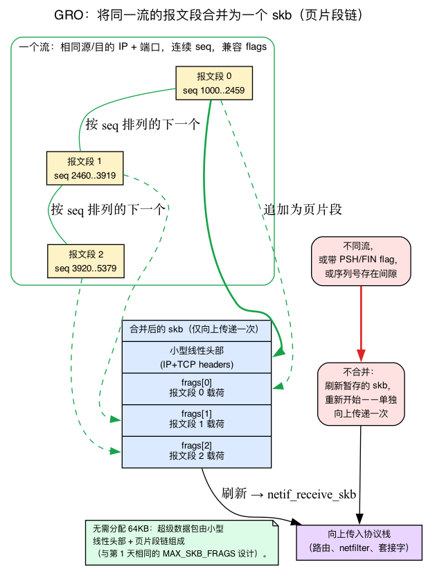
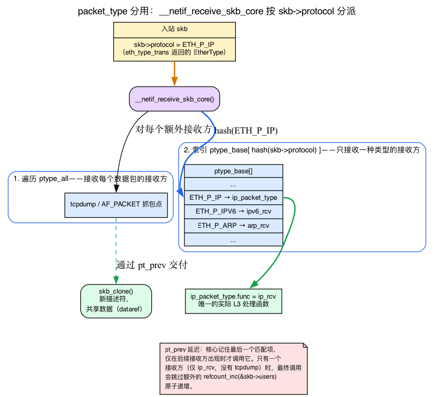
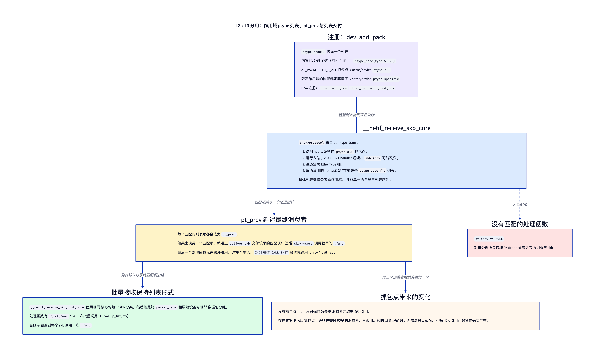
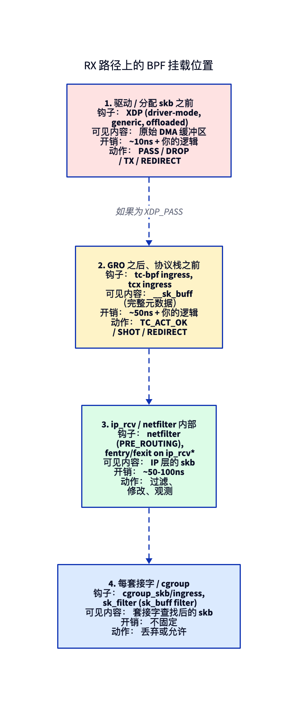

# 第2天 — RX 路径：从线路到 `ip_rcv`

> **今日任务：** 追踪一个数据包从到达 NIC 的那一刻起，直到它进入 `ip_rcv` 的过程。观察每一步 —— 并学习这条路径建立在五种机制之上（软中断、NAPI、XDP、GRO、packet_type 解复用），让沿途不再有任何黑箱。总时长：约 110 分钟。

## 整体流程概览



在典型的 Linux 主机上，每个接收到的数据包都会经历一系列的交接过程。硬件通过 DMA 将帧写入内核拥有的 RX 内存，中断仅调度工作，NAPI 在预算下轮询驱动程序，原生 XDP 可以在 skb 存在之前做出决定，经过 `XDP_PASS` 后构建 `sk_buff`，GRO 可能合并相关的 TCP 报文段，核心协议栈将数据包分发到正确的 L3 协议处理函数。

这句话列举了本章所依赖的五样东西，但你从未正式学习过：*软中断*、*NAPI* 状态机、*XDP*、*GRO* 累加器和 *packet_type* 解复用。第1天提前提到过它们，却没有展开讲解。所以在我们沿着路径前行之前，我们会逐一讲解每一项内容——先给出直觉理解，然后是具体的 v7.1 结构体或函数——只有在理解之后，才会追踪数据包的流程，使每个阶段都建立在你已知的内容之上。

我们将以 `~/code/linux` 检出版本中的特定文件/函数为基准（行号来自内核 7.1）。

> 第1天的两项内容是今天的关键基础，这里不再重复讲解：
> - **RX 描述符环 + DMA。** 回顾第1天的内容 —— 网卡的 DMA 引擎将每个帧写入由 RX 环描述符指定的预分配页中，并翻转 DONE 位；驱动程序的 NAPI 轮询会处理这些已完成的描述符。在 CPU 运行之前，字节已经存在于 RAM 中。
> - **`build_skb` 零拷贝封装。** `build_skb` 对已经填充的 DMA 页（`head_frag = 1`）进行封装，而不是复制它，从而实现零拷贝接收。我们在第1天的生命周期一节中见过它。

---

## 背景 1：软中断究竟是什么

整个 RX 路径都运行在*软中断*中。在可以说“IRQ 引发 `NET_RX_SOFTIRQ`，软中断运行 `net_rx_action`”之前，你需要知道那套机制 *是什么*。

### 问题：硬件 IRQ 处理函数必须尽可能小

当 NIC 触发中断时，CPU **会停止当前正在执行的工作** 并跳转到驱动程序的 IRQ 处理函数。该处理函数运行在一个极其受限的环境中：

- 它 **抢占** 当前正在运行的任务（该任务从未同意被中断）。
- 它运行在小而专用的 **IRQ 栈** 上。
- 它 **不能睡眠** —— 不能进行阻塞式分配，也不能等待可能睡眠的锁。
- 它运行时会屏蔽同优先级的中断，因此在它运行期间，该级别的其他设备都会被阻塞。

在处理函数中执行完整的接收路径 —— 路由查找、netfilter、BPF、交付到套接字 —— 将是一场灾难：它会使机器停滞并使所有其他任务饥饿。因此 Linux 将中断工作分为两个部分：

- **上半部** 是实际的硬件 IRQ 处理函数。它只做最必要的事情：确认设备并 **调度延迟工作**。然后返回。
- **下半部** 是稍后在宽松环境中运行的延迟工作，允许其从容处理。

**软中断**是 Linux 主要的下半部机制。

### “软中断”具体指什么

软中断是**静态定义的每 CPU 下半部机制。**“静态定义”很重要：内核中编译了一个固定的小型软中断向量枚举 —— 你不能在运行时创建一个新的。下面是完整的列表 (`include/linux/interrupt.h:550`):

```c
enum
{
    HI_SOFTIRQ=0,
    TIMER_SOFTIRQ,
    NET_TX_SOFTIRQ,
    NET_RX_SOFTIRQ,
    BLOCK_SOFTIRQ,
    IRQ_POLL_SOFTIRQ,
    TASKLET_SOFTIRQ,
    SCHED_SOFTIRQ,
    HRTIMER_SOFTIRQ,
    RCU_SOFTIRQ,    /* Preferable RCU should always be the last softirq */
    NR_SOFTIRQS
};
```

网络协议栈拥有其中两个：**`NET_RX_SOFTIRQ`**（接收）和 **`NET_TX_SOFTIRQ`**（传输）。每个向量在启动时通过 `open_softirq()`（`kernel/softirq.c:806`）注册一个 **动作函数**。网络协议栈在其 `net/core/dev.c` 中注册了这两个函数：

```c
open_softirq(NET_TX_SOFTIRQ, net_tx_action);   // net/core/dev.c:13288
open_softirq(NET_RX_SOFTIRQ, net_rx_action);   // net/core/dev.c:13289
```

所以 `net_rx_action` 是 *接收* 的下半部。今天剩下的内容主要是讲述 `net_rx_action` 做了什么。

### 引发与运行并不是一回事

这里有个容易让人困惑的细节。“引发”软中断**不会**立即执行处理函数。它只是设置每 CPU 的**待处理位**。热路径的引发是 `raise_softirq_irqoff` (`kernel/softirq.c:773`) → `__raise_softirq_irqoff` (`:799`)，它恰好只做了一件有意义的事：

```c
or_softirq_pending(1UL << nr);   // kernel/softirq.c:803
```

仅此而已：把一个位或入当前 CPU 的待处理掩码。实际的*处理*发生在其他地方：`__do_softirq` (`kernel/softirq.c:654`) 检查待处理掩码并运行每个待处理向量的动作函数。它在 IRQ 退出时（上半部返回后）以及从几个其他点被调用。因此上半部负责“引发”（置位后返回）；稍后，在退出中断上下文的过程中，`__do_softirq` 注意到这个位并调用 `net_rx_action`。

### 为什么数据包洪流不会冻结命令行：ksoftirqd

软中断运行优先级高于用户线程 — 那么是什么阻止无尽的数据包洪流让 `__do_softirq` 循环永远进行下去并饿死你的登录 shell？一个安全阀。如果 `__do_softirq` 在最多 **`MAX_SOFTIRQ_RESTART` = 10** 次（`kernel/softirq.c:544`）后仍然有软中断待处理，它就会放弃并 **唤醒每 CPU 内核线程 `ksoftirqd`** (`run_ksoftirqd`, `kernel/softirq.c:1068`) 来作为普通可调度线程完成工作。该线程与用户任务公平竞争，因此软中断工作可以很繁重但永远无法 *无限期* 阻止用户空间。这种移交正是“软中断优先级低于硬件 IRQ 但高于用户线程”的具体含义。

### 每 CPU 设计贯穿始终

注意这个反复出现的词：**每 CPU**。每个 CPU 都有自己的待处理掩码，运行自己的 `__do_softirq`，并拥有其自己的 `ksoftirqd`。这就是为什么下游所有东西都是每 CPU 的 —— NAPI 使用的 `poll_list`，`softnet_data` 结构体，`/proc/net/softnet_stat` 计数器。之后再看到“每 CPU”时，它直接追溯到这里。



---

## 背景 2：NAPI 和两个预算

你会不断读到 "`napi_schedule`"，"`poll_list`"，以及“轮询函数在预算下处理数据包”。现在是时候让这些变得具体 —— 并消除一个常见误解：存在 **两个不同的预算**，而不是一个。

### NAPI 的思想：停止中断，开始轮询

一个在负载下的 10/40/100-Gbit 网卡每秒可能产生 *数百万* 个中断。即使顶部处理程序非常小，这也相当于千刀万剐 —— 仅中断开销就会耗尽 CPU（“接收活锁”）。NAPI（“新 API”，尽管它已经是 ~20 年的 API）通过一种权衡解决了这个问题：在收到第一个数据包时，**屏蔽设备的 RX 中断并切换到轮询模式。** 内核随后反复询问驱动程序“还有更多吗？”直到环形缓冲区清空，然后才重新启用中断。从每个数据包一个中断变成每个突发一个中断。

### `struct napi_struct`：每个队列的轮询上下文

每个 NIC 接收队列注册一个 `struct napi_struct` —— 即将驱动程序的轮询例程与核心轮询循环（`include/linux/netdevice.h:381`）关联起来的上下文：

```c
struct napi_struct {
    unsigned long       state;       /* NAPI_STATE_SCHED bit lives here */
    struct list_head    poll_list;   /* links onto the per-CPU poll_list */
    int                 weight;      /* per-poll packet cap (default 64) */
    int                 (*poll)(struct napi_struct *, int);  /* driver callback */
    struct net_device   *dev;
    struct sk_buff      *skb;
    struct gro_node     gro;         /* the GRO accumulator (Background 4) */
    /* ... timers, ids, control-path fields ... */
};
```

今天重要的四个字段：**`state`**（保存 `NAPI_STATE_SCHED` 位 —“我被安排轮询”），**`poll_list`**（将此 napi 挂在每个 CPU 轮询列表上的链表节点），**`weight`**（每次轮询的预算 — 更多内容见下文），以及 **`poll`**（驱动程序的耗尽例程，例如 `e1000_clean`、`mlx5e_napi_poll`）。

### 调度 → 轮询 → 完成的完整循环

这是完整循环。跟随 `NAPI_STATE_SCHED` 位和硬件 IRQ 的翻转状态：

1. **IRQ 触发。** 驱动程序的上半部分调用 `napi_schedule`（或在热路径上使用 `__napi_schedule_irqoff`）。其第一步，`napi_schedule_prep` (`net/core/dev.c:6736`) 原子性地设置 `NAPI_STATE_SCHED`（如果 `SCHED` 已经被设置，则设置 `NAPI_STATE_MISSED`）。然后 `____napi_schedule` (`net/core/dev.c:4957`) 将 napi 添加到此 CPU 的轮询列表中 —

   ```c
   list_add_tail(&napi->poll_list, &sd->poll_list);   // net/core/dev.c:4984
   ...
   raise_softirq_irqoff(NET_RX_SOFTIRQ);              // net/core/dev.c:4990
   ```

   — 并引发 `NET_RX_SOFTIRQ`（这就是背景 1 中的机制）。驱动程序此时还会*屏蔽其自身的 RX 中断*。从现在到步骤 3，这个队列不会产生 IRQ。

2. **软中断运行 `net_rx_action`**，遍历轮询列表并调用每个 napi 的 `->poll(napi, weight)`。驱动程序从环形队列中取出已完成的描述符（即第1天介绍的环形队列），将其转换为 skb。

3. **环形队列在处理数未达 `weight` 时便已排空。**当驱动程序发现数据包数量少于其权重时，就知道突发传输结束了，并调用 `napi_complete_done`（`net/core/dev.c:6771`）。这会**清除 `NAPI_STATE_SCHED`** 并**返回 `true` 通知驱动程序突发传输结束**；*驱动程序*随后**重新启用其硬件 RX 中断**（例如 `if (napi_complete_done(napi, work)) <write the device's IRQ-enable register>`）。回到中断驱动模式，直到下一个数据包。

这就是“每个突发一次 IRQ”的确切机制。如果驱动程序达到其权重（环形队列仍然满），它不会完成 —— 而是返回完整的权重，留在轮询列表中，并再次被轮询。在流量较重时，中断保持屏蔽状态。

### 两个预算：`weight`（64）与 `netdev_budget`（300）

这是大家经常混淆的部分。有两个独立的上限：

- **`weight`** — 限制 **单个 `->poll` 调用** 可处理的数据包数量。这是传递给 `->poll` 的值。默认为 **`NAPI_POLL_WEIGHT` = 64**（`include/linux/netdevice.h:2839`）。每个 NAPI 轮询包装器读取它（`__napi_poll`，`net/core/dev.c:7719`）：`weight = n->weight; work = n->poll(n, weight);`。

- **`netdev_budget`** — 限制在一次 `net_rx_action` 软中断运行中 **所有 napi 的总数据包数量**。默认为 **300**（`net/core/hotdata.c:14`）。还有一个时间上限，`netdev_budget_usecs`（`net/core/hotdata.c:16`，= 2 jiffies）。

因此，在一次软中断运行中，`net_rx_action` 从预算 300 开始，并在所有待处理队列之间分配，每次单独的轮询调用最多可领取 64。循环（`net/core/dev.c:7914`）：

```c
int budget = READ_ONCE(net_hotdata.netdev_budget);   // 300, the OUTER budget
...
n = list_first_entry(&list, struct napi_struct, poll_list);
budget -= napi_poll(n, &repoll);                     // each poll capped at weight=64
```

想象成嵌套的限制：内环（一次轮询）最多 64；外环（一次软中断运行）最多 300，分布在所有队列中。

### `time_squeeze` 和 `softnet_data`

当 `net_rx_action` 退出循环时，如果 **预算用完或时间限制到期** 但仍有工作 *待处理*，它会增加一个名为 **`time_squeeze`** 的计数器，并将剩余的 napi 留到后续软中断（或提交给 `ksoftirqd`）中轮询。这个计数器正是今日 softnet_stat 实验所观察的对象：一个递增的 `time_squeeze` 表示接收工作超出了单个软中断处理窗口的处理能力。

所有这些每 CPU 账务都位于 **`struct softnet_data`**（`DEFINE_PER_CPU_ALIGNED(struct softnet_data, softnet_data)`、`net/core/dev.c:462`）中：`poll_list`、`processed`/`drop`/`time_squeeze` 计数器。`/proc/net/softnet_stat` 直接从这些字段中每 CPU 打印一行（`net/core/net-procfs.c:145`）。



---

## 阶段 1：NIC → IRQ → 软中断

现在，阶段 1 的流程已经一目了然。现代 NIC 使用 **中断聚合**：每次 IRQ 处理多个数据包，可通过 `ethtool -c` 配置。当 IRQ 触发时，驱动程序不会在 IRQ 上下文中处理数据包（背景 1 告诉你为什么它 *不能* 这样做）。相反，其上半部分调用 `napi_schedule()`（或热路径上的 `__napi_schedule_irqoff`），这（背景 2）：

1. 设置 `NAPI_STATE_SCHED`（通过 `napi_schedule_prep`）。
2. 将 napi 添加到每 CPU 的 `poll_list` 中。
3. 引发 `NET_RX_SOFTIRQ`。

另外，驱动程序在其 IRQ 处理函数中屏蔽其自身的 RX 中断（背景 2，步骤 1）—— `napi_schedule` 本身不接触硬件。

软中断运行 `net_rx_action`（`net/core/dev.c:7914`），它遍历每个 CPU 的轮询列表，在你刚刚学到的两个预算下调用每个 napi 的 `poll` 函数（背景 2）：内层限制是每次 `->poll` 调用最多处理 `weight`（64）个数据包，外层限制是整轮所有 napi 合计不超过 `netdev_budget`（300）。



核心 `napi_poll` 包装器调用驱动程序注册的 `->poll`（例如 `e1000_clean`、`mlx5e_napi_poll`），驱动程序的轮询函数继而调用 RX 辅助函数，如 `e1000_clean_rx_irq` / `mlx5e_poll_rx_cq`。

---

## 背景 3：什么是 XDP

第二阶段围绕 XDP 构建，第27天将全面介绍。但为了理解 RX 的流程，这里只需掌握基本概念即可理解交接过程。

**XDP（eXpress Data Path）** 是驱动程序在 **任何 `sk_buff` 存在之前运行的 eBPF 程序** —— 这是最早的软件钩子。因为它在 skb 之前运行，所以可以在线路速率下丢弃或重定向 *而无需承担 skb 分配的成本*（你在第1天学到的 slab 分配和引用计数机制）。这就是它的全部意义：DDoS 防护中的丢弃或负载均衡器中的重定向，甚至不构建数据包对象。

XDP 查看什么？一个 **`xdp_buff`** —— 一个轻量级的、**栈分配** 的描述符，覆盖 DMA 区域（`include/net/xdp.h:86`）：

```c
struct xdp_buff {
    void *data;            /* first byte of the frame */
    void *data_end;        /* one past the last byte */
    void *data_meta;       /* scratch metadata area */
    void *data_hard_start; /* start of the buffer */
    /* ... */
};
```

将它与你在第1天花费的 `sk_buff` 对比一下：没有 slab 分配，没有 `users`/`dataref` 引用计数，也没有头部空间预留机制 —— 只是四个指向 DMA 页面的指针。`xdp_buff` 在 XDP 返回的**瞬间就被丢弃了**。它只是查看这些字节的临时视图，而不是一个数据包对象。

XDP 程序返回五个 **动作代码** 之一（`enum xdp_action`, `include/uapi/linux/bpf.h:6548`）：

```c
enum xdp_action {
    XDP_ABORTED = 0,   /* error path — drop + tracepoint */
    XDP_DROP,          /* free the frame in-driver, no skb ever built */
    XDP_PASS,          /* the ONLY code that proceeds to build an sk_buff */
    XDP_TX,            /* bounce the frame back out the same NIC */
    XDP_REDIRECT,      /* send to another device / CPU / AF_XDP socket */
};
```

`XDP_ABORTED`、`XDP_DROP`、`XDP_TX` 和 `XDP_REDIRECT` 都在**消耗帧** —— 正常协议栈永远不会看到它。**`XDP_PASS` 是唯一一种动作，表示“将此转换为真实数据包”** —— 只有此时驱动程序才会构建 skb 并进入本章其余部分所描述的路径。第二阶段的整个移交都依赖于那个返回值。

**原生与通用。** *原生* XDP 在 DMA 缓冲区的驱动轮询中运行，处于 skb 之前 —— 快速，这是设计意图。*通用* XDP（`do_xdp_generic` → `netif_receive_generic_xdp`、`net/core/dev.c:5656`/`:5576`）是为没有原生支持的驱动提供的回退机制：它在核心协议栈中运行，*在* skb 已经存在之后。它较慢（你已经付出了构建 skb 的开销）—— 这就是为什么本章指出通用 XDP“运行较晚”。完整的 XDP 编程、映射和 AF_XDP 是第27天的内容；这里只是足够理解 RX 移交的必要知识。



---

## 第二阶段：驱动 → 原生 XDP → skb → GRO

在驱动轮询中，对于每个完成的 RX 描述符（回想第1天 —— 描述符的 DONE 位已设置，并且帧已经 DMA 到其页面）：

1. **构建一个 `xdp_buff` 视图，用于 DMA 缓冲区。** 原生 XDP 在数据包仍只是驱动拥有的 RX 内存中的字节时运行 —— 此时尚未分配 `sk_buff`（背景 3）。
2. **如果已附加，则调用 XDP。** `XDP_DROP`、`XDP_TX` 和 `XDP_REDIRECT` 在驱动/XDP 层消耗数据包。只有 `XDP_PASS` 表示“将其转换为正常的内核数据包”。
3. **将 DMA 缓冲区封装成 skb。** 在 `XDP_PASS` 之后，现代驱动使用 `build_skb` / `napi_build_skb`（回想第1天：零拷贝 —— 驱动已经通过 DMA 将字节写入页面，因此 skb 的 `head/data/tail` 只需指向它，并且 `head_frag = 1`）。通用 XDP 是例外：它在已创建的 skb 上运行（`net/core/dev.c:5576`）。
4. **通过 `eth_type_trans`（`net/ethernet/eth.c:155`）设置 `skb->protocol`。** 它将 `mac_header` 重置为指向以太网头部（`skb_reset_mac_header`），从 `data` 中提取 14 字节的以太网头部，使 `data` 现在指向 L3 头部（`eth_skb_pull_mac` → `skb_pull` `ETH_HLEN`），并**返回以太网类型。** 暂且记住这一点：它返回的值将成为第三阶段中的**解复用键**。
5. **传递到 GRO：** 驱动程序调用 `napi_gro_receive(napi, skb)`，这是一个 `static inline`，位于 `include/linux/netdevice.h:4286` 中，用于将数据传入 `gro_receive_skb(&napi->gro, skb)`（以及 `dev_gro_receive`）的 NAPI GRO 累加器。*GRO 合并的内容在下一节中介绍（背景 4）。*

## 背景 4：GRO 合并的内容，以及 64 KB 的去向

GRO（通用接收卸载）尝试将同一流的连续报文段合并为一个大的 skb *在协议栈看到它之前*。一个 64 KB 的 GRO 超大包意味着只需向上走一次协议栈，而不是 40 多次 —— 你只需支付一次路由查找、netfilter 和套接字传递的开销，而不是每个报文段都支付。

“合并相同流报文段”这个短语隐藏了两个先决条件：

- **什么算作“相同的流”？** 对于 GRO 来说，是 L3/L4 身份：匹配 **源/目标 IP、协议和 TCP 端口**，并且具有 **有序、连续的序列号** 和兼容标志。`gro_list_prepare`（`net/core/gro.c:355`）构建比较键，并且每个协议的回调函数（`tcp4_gro_receive`，`net/ipv4/tcp_offload.c:419`）做出最终的可合并性判断。一个标志不匹配（PSH/FIN）或序列号有间隙的数据包 **不会** 被合并 —— 它会刷新持有的 skb 并重新开始。因此 GRO 比较的是流身份 *和* 序列连续性，而不仅仅是“两个 TCP 数据包”。

- **64 KB 是如何在没有 64 KB 分配的情况下容纳的？** 它不会增长线性缓冲区 —— 每个合并报文段的有效载荷都作为 **页片段** 追加到持有的 skb 上。（仅作复习 —— 这正是第1天所讲的线性头部 + `MAX_SKB_FRAGS` 页片段设计；一个 64 KB 超大包是一个小的线性头部加上一连串的页片段，从未分配过连续的 64 KB。）

累加器是 `napi->gro`（一个 `struct gro_node`，`include/linux/netdevice.h:358`）。当以下任何一种情况发生时它会 **刷新** —— 通过 `netif_receive_skb` 将组装好的 skb 传递下去：NAPI 预算/权重耗尽、调用 `gro_normal_one`（`net/core/gro.c:299`）、到达不可合并的数据包，或 GRO 刷新超时触发（`__gro_flush`，`net/core/gro.c:324`）。

要阅读的代码：`net/core/gro.c` — `dev_gro_receive`（主力函数，`:474`），导出的 `gro_receive_skb`、`gro_list_prepare`、`gro_complete`。**追踪注意事项：** `napi_gro_receive` 本身是在 `include/linux/netdevice.h` 中定义的 `static inline`（`:4286`），因此它 **不可** 被 fentry 追踪 —— 应该改为附加到 `gro_receive_skb`。



---

## 背景 5：packet_type 解复用

阶段 3 中说 `__netif_receive_skb_core`“调用每个已注册的 `packet_type`”和“`pt_prev->func` 将其分发给 L3 处理函数。” 要理解这句话，你需要知道什么是 `packet_type`，内核如何从列表中选择 `ip_rcv`，以及 `pt_prev` 技巧能带来什么好处。

### 一个 `packet_type` 是一个注册记录

当某个协议想要接收数据包时，它会注册一个 `struct packet_type` (`include/linux/netdevice.h:2968`）：

```c
struct packet_type {
    __be16  type;        /* EtherType, e.g. htons(ETH_P_IP) — the demux key */
    /* ... */
    int     (*func)(struct sk_buff *, struct net_device *,
                    struct packet_type *, struct net_device *);  /* the callback */
    /* ... */
    struct list_head list;
};
```

它将一个 **EtherType** (`type`) 与一个 **回调函数** (`func`) 进行配对。IPv4 在 `net/ipv4/af_inet.c:1881` 中注册了一个。

```c
static struct packet_type ip_packet_type __read_mostly = {
    .type = cpu_to_be16(ETH_P_IP),
    .func = ip_rcv,                  // af_inet.c:1883
};
...
dev_add_pack(&ip_packet_type);       // af_inet.c:2006
```

所以 `ip_rcv` 并不是由名称在核心中调用的 —— 它是通过以太类型（EtherType）进行查找的。那个以太类型来自哪里？**`eth_type_trans` 在第二阶段。** 它将帧的以太类型返回到 `skb->protocol`，而该值就是核心现在进行哈希运算的键。这就是第二阶段建立的连接。

### 两个列表：`ptype_all` 和 `ptype_base`

内核将协议接收器保存在两个结构中：

- **`ptype_all`** —— 想要接收 **所有** 数据包的接收器，无论类型如何。这就是 `AF_PACKET` 套接字和 `tcpdump` 捕获路径的方式。
- **`ptype_base[]`** —— 一个以太类型（EtherType）为键的哈希表（`net/core/dev.c:172`），其中存放着精确类型的接收器：`ip_rcv`（ETH_P_IP）、IPv6 处理器、ARP。桶是 `ptype_base[ntohs(pt->type) & PTYPE_HASH_MASK]`（`net/core/dev.c:608`）。

`__netif_receive_skb_core` 先遍历 `ptype_all`（捕获），然后通过 `skb->protocol` 索引 `ptype_base` 来找到一个真正的 L3 处理器。

### `pt_prev` 延迟技巧

观察核心如何分发。它不会立即调用每个匹配的处理函数，而是将 **最后一个** 匹配记录在一个指针 `pt_prev` 中，仅在发现存在 *后续* 捕获者时才真正调用处理函数。该调用通过 `deliver_skb`（`net/core/dev.c:2485`）进行：

```c
static int deliver_skb(struct sk_buff *skb, struct packet_type *pt_prev,
                       struct net_device *orig_dev)
{
    ...
    refcount_inc(&skb->users);                        // bump the descriptor refcount
    return pt_prev->func(skb, skb->dev, pt_prev, orig_dev);
}
```

为什么要引入间接调用？因为 `deliver_skb` 对每个接收者都执行一次 `refcount_inc(&skb->users)`（来自第1天的 **描述符** 引用计数）。在绝大多数情况下，即 **恰好只有一个接收者**（只有 `ip_rcv`，没有运行 tcpdump），这种延迟机制可以让核心调用那个单一处理函数时 **不** 增加额外的原子引用计数 —— 它知道没有其他接收者。这正是阶段 3 通过 `pt_prev->func()` 调度，而不是直接调用 `ip_rcv` 的原因。

**回顾第1天：** 当确实存在多个接收者（例如 tcpdump 的 `ptype_all` 套接字 **和** `ip_rcv`），`deliver_skb` 通过增加 `skb->users` 来给每个早期接收者分配对 **相同 skb 描述符** 的另一个引用；它不会调用 `skb_clone`。最后一个接收者在不进行额外原子增量的情况下消耗原始引用。



### 全局桶之外的作用域与批处理



这两个全局结构只是第一层。AF_PACKET 添加了作用域列表，而不是让每个套接字都成为全局协议处理器。`ETH_P_ALL` 捕获钩子位于接收网络命名空间的 `ptype_all` 列表或设备的 `ptype_all` 列表中；协议绑定的报文套接字可以存在于命名空间/设备的 `ptype_specific` 列表中。`__netif_receive_skb_core` 会在入口处理可能重定向或更改 `skb->dev` 之前，先访问所有协议钩子。在入口、VLAN 和任何 RX 处理器之后，它会遍历全局 ethertype 桶，然后是适用的命名空间/原始/当前设备的协议特定列表。`ip_rcv` 通常是来自全局桶的最终匹配。

**`pt_prev` 延迟贯穿所有这些遍历过程**。`deliver_ptype_list_skb` 只在发现后续匹配项时才使用 `deliver_skb` 刷新之前的匹配；`deliver_skb` 在调用早期回调函数前增加 `skb->users`。当只有一个匹配的 L3 处理器且没有捕获钩子时，最终的 `pt_prev` 会到达 `__netif_receive_skb_one_core`，它通过 `INDIRECT_CALL_INET(..., ipv6_rcv, ip_rcv, ...)` 调度处理，完全避免了额外的引用操作。添加一个 `ETH_P_ALL` 捕获钩子意味着必须在后续 L3 消费者之前刷新该钩子，这也是报文捕获具有可测量成本的原因。

还存在一种 **列表接收路径**。IPv4 注册了 `.list_func = ip_list_rcv` 与 `.func = ip_rcv` 一起。`__netif_receive_skb_list_core` 沿同一核心路径对每个 skb 进行分类，将具有相同最终 `packet_type` 和原始设备的相邻数据包分组，然后调用该列表回调函数。没有这种列表处理能力的处理器则回退到逐 skb 的 `.func` 调用。标量延迟和列表批处理是同一优化的两个层次：为单个消费者避免不必要的引用，然后为可以一起处理的消费者保留批处理。

如果没有匹配的处理器，`pt_prev` 保持 `NULL`，`dev_core_stats_rx_dropped_inc` 记录未处理协议，`kfree_skb_reason` 释放该报文。

---

## 阶段 3：GRO → `netif_receive_skb` → `__netif_receive_skb_core`

当 NAPI 的轮询预算耗尽（或调用 `gro_normal_one`）时，累积的 GRO 超大包会通过 `netif_receive_skb` 刷出：

```c
int netif_receive_skb(struct sk_buff *skb)        // net/core/dev.c:6454
```

调用进入：

```c
static int __netif_receive_skb_core(struct sk_buff **pskb, bool pfmemalloc,
                                    struct packet_type **ppt_prev)  // line 5972
```

这是执行大部分工作的函数，有了背景知识 5 的帮助，它的每一行都变得清晰明了：

- **VLAN/入站钩子处理**（`__skb_push` 用于在硬件剥离 VLAN 后重新添加 VLAN）。
- **调用每个已注册的 `packet_type`** — 遍历 `ptype_all`（tcpdump 的 AF_PACKET 套接字、AF_BRIDGE 等），然后是 `ptype_base` 桶中的 `skb->protocol`。
- **tc 入站钩子** 在此处运行（`tcx`/`tc-bpf` ingress）。
- **`pt_prev->func()`** 通过延迟技巧分发到 L3 协议处理函数。

对于 IPv4 数据包，`pt_prev->func` 是 `ip_rcv` — 在 `net/ipv4/af_inet.c` 中静态注册为 `static struct packet_type ip_packet_type`（背景知识 5）。

---

## 阶段 4：`ip_rcv` 和 netfilter

```c
int ip_rcv(struct sk_buff *skb, struct net_device *dev,
           struct packet_type *pt, struct net_device *orig_dev)  // net/ipv4/ip_input.c:603
{
    struct net *net = dev_net(dev);
    skb = ip_rcv_core(skb, net);
    if (skb == NULL)
        return NET_RX_DROP;
    return NF_HOOK(NFPROTO_IPV4, NF_INET_PRE_ROUTING,
                   net, NULL, skb, dev, NULL,
                   ip_rcv_finish);
}
```

`ip_rcv_core` (`net/ipv4/ip_input.c:499`) 执行健全性检查（IP 头长度、版本、如果未由硬件验证则包含校验和），并将 skb 裁剪至 IP 头声明的 `tot_len`。然后 **`NF_HOOK(NFPROTO_IPV4, NF_INET_PRE_ROUTING, ...)`** 在 PREROUTING 运行所有 netfilter 链（这是 iptables/nftables/conntrack 参与的地方）。第20天将详细讲解 netfilter。

如果钩子通过了 skb，则调用 **`ip_rcv_finish`** (`net/ipv4/ip_input.c:478`)。它执行路由查找（`ip_route_input_noref` → FIB 查找），然后 `dst_input(skb)`，这会调用 `ip_local_deliver` (`net/ipv4/ip_input.c:250`) 用于本地套接字，或 `ip_forward` 用于转发流量。

---

## BPF 可附加的位置



内核在 RX 路径上的四个位置暴露了 BPF 钩子点：**XDP** 在驱动程序（背景 3——构建 skb 之前），**tcx** 在 `__netif_receive_skb_core`，**fentry** 在 `ip_rcv` 本身，**cgroup_skb** 在套接字查找之后。我们今天不会编写任何 BPF —— 此图的目的是让这些附加点在 *此* 路径中有明确位置。今天的实验只使用单行 BPF 工具（`bpftrace`）作为检查机制，而不是用于编写。

---

## 常见疑问

> **问：如果引发软中断只是设置了一个位，那么到底是什么实际运行 `net_rx_action`？**
>
> 答：`__do_softirq` (`kernel/softirq.c:654`)。它在退出中断上下文时（以及少数其他点）被调用，检查每个 CPU 的待处理掩码，并调用每个待处理向量的动作函数。上半部分只设置了 `NET_RX_SOFTIRQ` 位并返回；`__do_softirq` 在稍后执行清除操作。如果它必须重启超过 `MAX_SOFTIRQ_RESTART`（10）次，其余工作将交给 `ksoftirqd`。

> **问：这里反复出现“预算”，究竟是 64 还是 300？**
>
> 答：两者都有，在不同范围内。**`weight`（64）** 是单个 `->poll` 调用的上限 —— 传递给驱动程序的上限。**`netdev_budget`（300）** 是每个 `net_rx_action` 软中断运行的预算，跨该运行中所有被轮询的 napi 共享。一个软中断运行可以轮询多个队列；每次单独轮询最多消耗 64，一旦累计达到 300（或时间限制）则停止 —— 如果仍有工作，则增加 `time_squeeze`。

> **问：为什么 `__netif_receive_skb_core` 通过 `pt_prev->func()` 调度而不是直接调用 `ip_rcv`？**
>
> 答：这是 `pt_prev` 延迟（背景 5）。它会延迟每次传递，以便在常见单接收器情况下跳过原子性的 `skb->users` 增加。通过 `ptype_base` 中的以太网类型查找到达 `ip_rcv`，而不是通过名称 —— 以太网类型的值是 `eth_type_trans`，存储在驱动程序中的 `skb->protocol`。

> **问：XDP 程序返回了 `XDP_PASS`。发生了什么变化？**
>
> 答：目前没有变化 —— `XDP_PASS` 是 *唯一* 允许驱动程序继续构建 `sk_buff` 并进入正常协议栈的动作。其他四个（`ABORTED`/`DROP`/`TX`/`REDIRECT`）在帧仍只是 DMA 页面上的 `xdp_buff` 时就消耗掉了，从未分配过 skb。

---

## 今日实验

追踪真实数据包的路径。

### 使用 ftrace 查看调用链

`trace-cmd` 默认未安装 —— `sudo apt-get install -y trace-cmd`（它需要
`CONFIG_FUNCTION_GRAPH_TRACER`，在典型内核中默认开启）。这需要 **两个终端**：记录器会阻塞 5 秒，你必须在该窗口期间发送数据包。

在终端 1 中开始记录：

```bash
sudo trace-cmd record -p function_graph \
    -g netif_receive_skb \
    -e net:netif_receive_skb \
    -O nofuncgraph-overhead \
    -O funcgraph-tail \
    sleep 5
```

在终端 2 中，在这 5 秒内生成一个数据包：

```bash
ping -c 1 8.8.8.8
```

录制器退出后，渲染追踪结果：

```bash
sudo trace-cmd report | head -100
```

你会看到函数调用树：`netif_receive_skb` → `__netif_receive_skb_one_core` → `__netif_receive_skb_core.constprop.0` → `ip_rcv` → `ip_rcv_core` → `nf_hook_slow` → `ip_rcv_finish_core` → `ip_local_deliver` → `icmp_rcv`。（编译器会为这些符号中的某些添加 `.constprop.N`/`.isra.N` 后缀，而外部的 `ip_rcv_finish` 包装被内联了，因此你在跟踪中实际看到的是 `ip_rcv_finish_core`。）叶子节点是 `icmp_rcv`，因为一个 `ping` 回显回复是一个 ICMP 数据包 — `icmp_rcv` 然后调用 `icmp_echo`。（触发一个 TCP 流 — 例如`curl -s http://example.com >/dev/null` — 那么叶子节点就变成 `tcp_v4_rcv`。）`pt_prev->func()` 分发（背景 5）会经过 `deliver_skb`，但在该内核中 `deliver_skb` 被 **内联** 到了 `__netif_receive_skb_core` 中，因此它不会在 `function_graph` 中显示为单独的节点 — 不要试图去寻找它。为了直接观察分发过程，请使用 kprobe 附加：`sudo bpftrace -e 'kprobe:deliver_skb { @[comm]=count(); }'`。

### 或者使用 BPF 来实现自定义视图

```bash
sudo bpftrace -e '
fentry:ip_rcv { @ip[args->skb->dev->name] = count(); }
fentry:tcp_v4_rcv { @tcp[args->skb->dev->name] = count(); }
fentry:udp_rcv { @udp[args->skb->dev->name] = count(); }
interval:s:6 { exit(); }' &

# Generate receives during the window, then let it exit:
ping -c 5 -i 0.3 8.8.8.8 >/dev/null; curl -s http://example.com >/dev/null
wait
```

每个接口的协议接收计数。典型输出：

```
@ip[lo]: 4
@tcp[eth0]: 21
@udp[eth0]: 2
@udp[lo]: 4
```

`@tcp`/`@udp` 是可靠的信号。**注意 `@ip` 映射：** 在某些虚拟 NIC（云/virtio）上，
`fentry:ip_rcv` 会附加但可能不会为物理接口触发 —— 即使在有 `eth0` 流量的情况下，你也可能只看到 `@ip[lo]`（或
没有任何内容）。在其他主机上，`@ip[eth0]` 会正常填充。无论如何，这是一个跟踪环境的特例，并非丢包问题；相信 `@tcp[eth0]`/`@udp[eth0]` 来确认接收确实发生了。

### 检查每个 CPU 的 RX 状态

```bash
cat /proc/net/softnet_stat
```

每个 CPU 一行 —— 这些是背景 2 中的每个 CPU `softnet_data` 计数器。每一列都是一个 32 位计数器，以 **十六进制**（零填充）显示 `%08x`，**没有表头行** —— 不要按十进制读取这些值。列的顺序是：处理的数据包数、丢弃数、`time_squeeze`（预算耗尽），然后是几个零，最后是 `received_rps`（确切的尾随列取决于内核版本 —— 参见 `net/core/net-procfs.c:145`）。使用 `printf '%d\n' 0x<value>` 将一个值转换为十进制。较高的 `time_squeeze` 表示软中断运行持续遇到 `budget <= 0`（或时间限制）且仍有工作待处理 —— 也就是说，你的 `netdev_budget` 对于当前负载来说太小了。

调整预算。单独执行**设置**步骤（在单独的步骤中设置，这样你可以观察主机以新值运行）：

```bash
old_budget=$(cat /proc/sys/net/core/netdev_budget)
echo 600 | sudo tee /proc/sys/net/core/netdev_budget
cat /proc/sys/net/core/netdev_budget   # confirm it changed
```

然后，在 **持续接收负载** 下（例如，从另一台主机 `iperf3 -c <host> -P 16` 发送，或进行数据包洪泛），
重复读取 `/proc/net/softnet_stat` 并观察 `time_squeeze` 列。诚实地面对你所看到的内容：**在空闲主机上 `time_squeeze` 永远不会移动** —— 只有当软中断在高接收负载下真正耗尽其预算时它才会增加，即使在负载情况下，它在快速 CPU / 多队列 NIC 上也可能保持不变。计数器不变化是正常的，并非表示更改失败（你已经在上面通过 `cat` 确认了更改）。

**恢复** 原始预算，以免主机保留被更改的 RX 调度行为：

```bash
echo "$old_budget" | sudo tee /proc/sys/net/core/netdev_budget
```

---

## 内核中需要阅读的内容

- **`kernel/softirq.c`** — 软中断引擎。`__do_softirq`（第 654 行），`raise_softirq_irqoff`（第 773 行）→ `__raise_softirq_irqoff`（第 799 行），`open_softirq`（第 806 行），`run_ksoftirqd`（第 1068 行），以及 `#define MAX_SOFTIRQ_RESTART 10`（第 544 行）。
- **`net/core/dev.c`** — 中央接收分发。
  - `____napi_schedule`（第 4957 行）— 添加到 `poll_list`（第 4984 行），触发 `NET_RX_SOFTIRQ`（第 4990 行）。（`NAPI_STATE_SCHED` 位在更早的 `napi_schedule_prep` 中由第 6736 行设置。）
  - `net_rx_action`（第 7914 行）— 软中断循环；读取 300 的预算（第 7920 行）。
  - `__napi_poll`（第 7719 行）— 每个 NAPI 轮询；读取 `weight` 并调用 `->poll`。
  - `__netif_receive_skb_core`（第 5972 行）— 工作核心；packet_type 遍历。
  - `netif_receive_skb`（第 6454 行）— 来自 drivers/GRO 的入口。
  - `deliver_skb`（第 2485 行）— `pt_prev->func()` 分发 + `users` 增加。
  - `napi_complete_done`（第 6771 行）—— 清除 SCHED，返回 `true` 以便驱动程序重新启用其 IRQ。
- **`net/core/hotdata.c`** — `netdev_budget = 300`（第 14 行），`netdev_budget_usecs`（第 16 行）。
- **`net/core/gro.c`** — GRO 机制。阅读 `dev_gro_receive`（第 474 行），`gro_receive_skb`，`gro_list_prepare`（第 355 行），`gro_complete`，`__gro_flush`（第 324 行）。（`napi_gro_receive` 是 `static inline` 中的 `netdevice.h:4286`，而不是这里 —— 不可 fentry 跟踪。）
- **`net/ipv4/ip_input.c`** — IPv4 接收。`ip_rcv`（第 603 行），`ip_rcv_core`（第 499 行），`ip_rcv_finish`（第 478 行），`ip_local_deliver`（第 250 行）。
- **`net/ipv4/af_inet.c`** — 搜索 `ip_packet_type`（第 1881 行），查看 `ip_rcv` 是如何通过 `dev_add_pack`（第 2006 行）注册的。
- **`include/linux/netdevice.h`** — `struct napi_struct`（第 381 行），`NAPI_POLL_WEIGHT 64`（第 2839 行），`struct packet_type`（第 2968 行），`struct gro_node`（第 358 行）。
- **`include/linux/interrupt.h`** — 软中断向量枚举（第 550 行）。
- **`include/net/xdp.h`** — `struct xdp_buff`（第 86 行）；**`include/uapi/linux/bpf.h`** — `enum xdp_action`（第 6548 行）。

---

## 要点回顾

- **软中断**是静态定义的每 CPU 下半部机制。上半部（硬件 IRQ）只确认设备并*引发*一个待处理位；`__do_softirq` 稍后*运行*相应动作。网络接收向量是 **`NET_RX_SOFTIRQ` → `net_rx_action`**。超过 10 次重启后，剩余工作会转交 **`ksoftirqd`**，避免用户空间任务饥饿。
- **NAPI** 把中断洪流变成每个突发一次 IRQ：`napi_schedule` 设置 `NAPI_STATE_SCHED` 并将 napi 入队（驱动程序在处理函数中屏蔽 IRQ）；环形队列排空时，`napi_complete_done` 清除 `SCHED` 并返回 `true`，驱动程序据此重新启用 IRQ。整个状态机由 `NAPI_STATE_SCHED` 位驱动。
- **有两个预算，而不是一个：** `weight`（`NAPI_POLL_WEIGHT` = 64）限制*一次* `->poll` 调用；`netdev_budget`（300）限制一次 `net_rx_action` 运行中所有 napi 的*总处理量*。`time_squeeze` 统计预算或时间耗尽而仍有工作待处理的情况。
- **原生 XDP** 在任何 skb 出现之前运行于 `xdp_buff`（4 个栈上指针，没有引用计数）；只有 **`XDP_PASS`** 会继续构建 skb。`DROP`/`TX`/`REDIRECT`/`ABORTED` 都在驱动程序中消耗帧。
- **`build_skb`** 把已有的 DMA 缓冲区封装成 skb，实现零拷贝接收（回顾第1天）。
- **GRO**（`net/core/gro.c`）把连续的**同流**报文段（IP、协议和端口相同，序列号连续）合并成一个 skb，其有效载荷由**页片段**链承载（回顾第1天），从而把数十次协议栈处理合并为一次。
- **`packet_type`** 将 EtherType 与回调函数配对；`ip_rcv` 注册为 `ip_packet_type`，核心根据 `eth_type_trans` 返回并存入 `skb->protocol` 的值进行哈希查找。`ptype_all` 是捕获分流器（tcpdump），`ptype_base[]` 是 L3 哈希表。**`pt_prev` 延迟**可在只有一个接收者时省去一次原子 `users` 增加。
- RX 路径中最核心的函数是 **`__netif_receive_skb_core`**，位于 `net/core/dev.c:5972`。
- 后续路径为 `ip_rcv` → netfilter PREROUTING → `ip_rcv_finish` → 路由 → `ip_local_deliver` 或 `ip_forward`。

---

## 检查问题

为什么内核在硬件 IRQ 上下文之外运行软中断（以及 RX 路径的大部分内容）？

<details>
<summary>点击显示答案</summary>

**答案：** 硬件 IRQ 上下文有严格的限制：它会抢占正在运行的任务，使用有限的栈空间，阻止同一优先级的其他 IRQ，并且不能睡眠。如果在 IRQ 上下文中执行完整的 RX 路径（路由查找、BPF 程序、conntrack、数据包传递），将会（1）使其他 CPU 工作得不到调度 —— 在高负载下出现接收活锁；（2）施加严格的时序预算，复杂路径无法满足；（3）强制 RX 路径中调用的每个辅助函数都是 IRQ 安全的。软中断以略高于用户线程但低于 IRQ 的优先级运行，拥有各自的每 CPU 栈空间，并且可以被 IRQ 抢占。如果软中断工作本身变得过多，`__do_softirq` 会将其重启次数限制在 `MAX_SOFTIRQ_RESTART`（10）次，并将剩余部分交给 `ksoftirqd` 内核线程，该线程与用户任务公平竞争 —— 因此 RX 处理可以很密集，但不会无限期地阻止用户空间。NAPI 沿着这一界限分割 RX 工作：IRQ 只需发出“更多工作”的信号（设置 `NAPI_STATE_SCHED`，引发 `NET_RX_SOFTIRQ`）；软中断在预算内执行实际处理。

</details>

---

## 明天

第3天 — TX 路径。从 `sendmsg` 到线路。套接字缓冲区计费、队列规则、驱动程序的 `ndo_start_xmit`。
