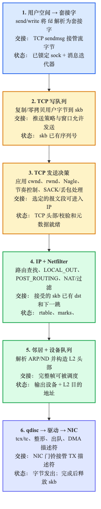
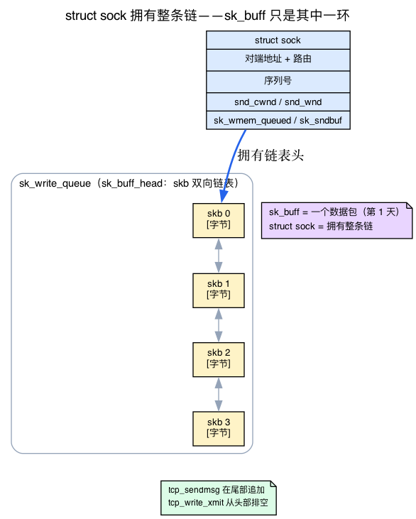
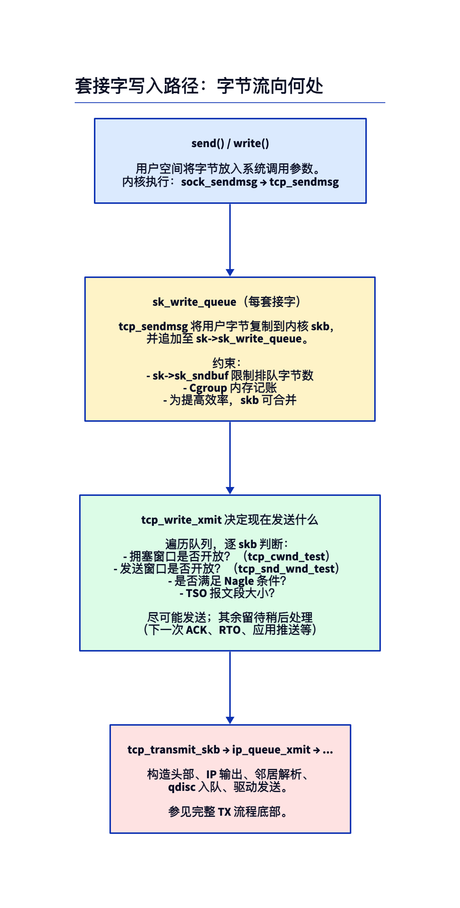
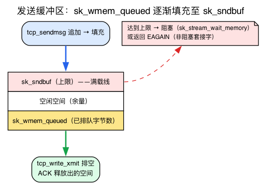
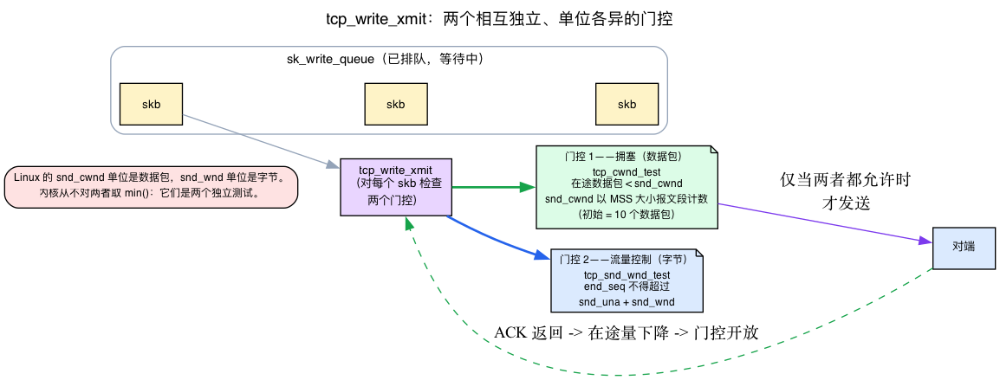
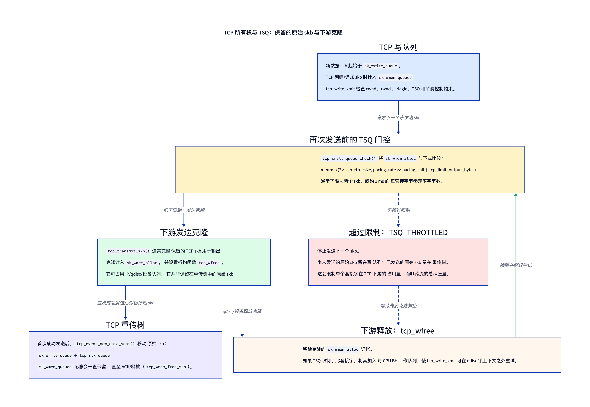
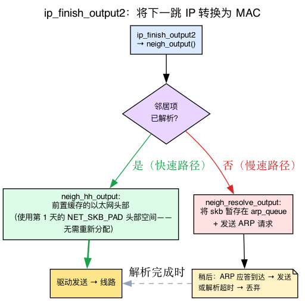
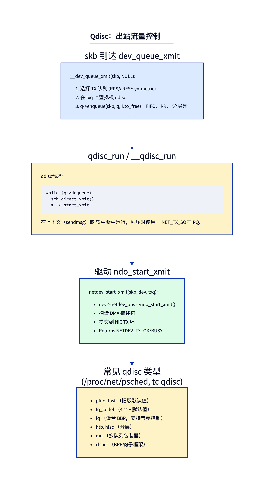
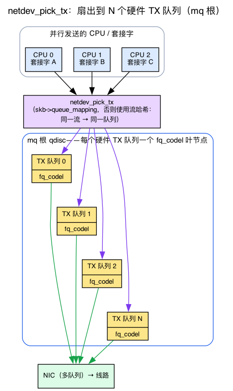

# 第3天 — 发送路径：从 `sendmsg` 到线路

> **今日任务：** 跟踪一个 TCP 数据包从用户空间 `send()` 到离开 NIC 的时刻 —— 并认识在发送路径上最终决定它去向的四个结构体：套接字及其发送缓冲区、决定当前可发送内容的窗口、调度数据包的队列规则，以及最终添加 MAC 地址的邻居表项。总时长：约 110 分钟。

## 旅程的镜像

昨天的 RX 路径是线路 → 驱动程序 → IP → 套接字。今天的 TX 路径则相反：



在你的 `send()` 系统调用和字节到达线路之间，有六层工作。每一层都有自己的职责，也都有可能出错。

但还存在一种更深层的不对称性，值得提前指出，因为它会改变你阅读代码的方式。**RX 路径是以 skb 为中心，TX 路径则以 sock 为中心。**

在 RX 中，一个数据包突然到来 —— NIC 通过 DMA 将一些字节写入页面，驱动程序将这些字节封装成一个 `sk_buff`（第1天），然后这个 skb 作为自包含的对象沿着协议栈向上传递。直到最顶层的套接字认领它之前，没有任何人“拥有”它。

在 TX 中，故事则从另一个方向开始。这些字节一开始就在一个进程中 —— 这个进程已经有一个打开的连接 —— 一个长期存在的对象，记住对端地址、序列号、网络能接受多少、接收方会接受多少。这个对象是 **`struct sock`**，在发送过程中，每个 skb 都是由 sock *生成并拥有* 的。因此，在我们阅读任何一行 `tcp_sendmsg` 之前，必须先认识这个 sock。

## 阶段 0：连接对象 —— `struct sock`

第1天介绍了你 `sk_buff`：**一个数据包**。第2天沿着数据包追踪了 RX 路径。但两者从未引入 *拥有* 连接上数据包的实体。我们首先填补这个空白，因为整个 TX 路径都依赖于它。

这里有个直觉。TCP 连接不是一个数据包 —— 它是一个 *关系*，存在数秒、数分钟或数小时，并承载数千个数据包。必须有人在两次 `send()` 调用之间记住：

- 对方是谁，以及到达它的路由，
- 下一个要使用的序列号，
- 有多少字节的数据包已经在线路上但尚未被确认，
- 内核在该连接上仍被允许使用的缓冲区大小，
- 一个 **数据包链**，这些数据包已排队但尚未（完全）发送。

这个人就是 `struct sock` ——“套接字”。当一个 `sk_buff` 是一个信封，**一个套接字是一个完整的邮箱**：一个长期存在的端点对象，拥有 *数据包链表* 以及围绕它们的所有簿记信息。



我们今天关心的发送侧字段都位于 `include/net/sock.h`：

```c
struct sk_buff_head  sk_write_queue;   /* include/net/sock.h:491 — the chain of queued skbs */
int                  sk_wmem_queued;   /* include/net/sock.h:484 — memory charged for unfreed send-side skbs */
int                  sk_sndbuf;        /* include/net/sock.h:526 — the cap on those bytes */
```

`sk_write_queue` 是一个 `sk_buff_head` —— 就是你在 RX 队列中见过的 skb 双向链表 —— 不过这里它挂载在 *套接字* 上，保存了 TCP 已构建但尚未交给线路的数据包。`tcp_sendmsg` 从尾部追加；`tcp_write_xmit` 从头部取出。

### 一个套接字如何到达正确的协议代码：`proto` 虚函数表

当用户空间调用 `send()` 时，内核手中有一个通用的 `struct sock`，但需要运行 **TCP** 的发送逻辑 —— 而不是 UDP 的，也不是原始 IP 的。它通过一个经典技巧避免了庞大的 `if (protocol == TCP)` 判断链：一个函数指针的 **虚函数表**。

每个套接字都携带 `sk->sk_prot`，指向一个 `struct proto`：

```c
struct proto {                              /* include/net/sock.h:1291 */
        int  (*sendmsg)(struct sock *sk, struct msghdr *msg, ...);  /* :1321 */
        /* ...recvmsg, connect, close, ... */
};
```

对于 TCP 套接字，`sk_prot` 指向 `tcp_prot`，其 `.sendmsg` 插槽连接到 `tcp_sendmsg`：

```c
/* net/ipv4/tcp_ipv4.c:3353 */
.sendmsg = tcp_sendmsg,
```

所以 `sock_sendmsg → inet_sendmsg → sk->sk_prot->sendmsg(...)` 在 `tcp_sendmsg` 中落地，且没有分支。完全相同的间接寻址在 L3 层再次出现：连接保持一个 `icsk->icsk_af_ops->queue_xmit` 指针（`include/net/inet_connection_sock.h:36`），对于 AF_INET 套接字而言，该指针是 `ip_queue_xmit`。请记住这幅 vtable 图景 —— “通过指针分发，而不是通过 `if` 分发”是整个协议栈保持与协议无关性的方法。

## 阶段 1：从系统调用到套接字

当用户空间调用 `send(fd, buf, len, 0)`（或在套接字上调用 `write(fd, ...)`）时，内核会执行以下操作：

```
sys_sendto / sys_write
  → sock_sendmsg
    → inet_sendmsg
      → sk->sk_prot->sendmsg     // dispatch by protocol (the vtable above)
```

对于 TCP 而言，这是 `tcp_sendmsg` 在 `net/ipv4/tcp.c:1447`。该函数锁定套接字，然后调用 `tcp_sendmsg_locked`（第 1117 行），这是真正执行工作的函数。

## 阶段 2：复制并入队



`tcp_sendmsg_locked` 做了 **两件不同的事情**：

1. **从用户空间把字节复制到内核 skb 中。** 通过 `tcp_stream_alloc_skb` 分配 skb，通过 `copy_from_iter` 复制数据（或者，使用 `MSG_ZEROCOPY`，固定用户页面并将 skb *frags* 指向它们 —— 不复制；回想一下第1天的页片段设计）。将每个 skb 追加到 `sk->sk_write_queue`。

2. **可能触发传输。** 调用 `tcp_push`（`net/ipv4/tcp.c:741`），最终调用 `tcp_write_xmit`（在 `tcp_output.c` 的第 2963 行）。

这种分离很重要：**入队是廉价的；发送是受限制的。** 追加到 `sk_write_queue` 只需要复制和链表插入操作。而真正将字节放到线路中需要拥塞窗口打开、接收窗口允许、Nagle 约束满足（这些将在下一阶段解释）。因此，一个 `send()` 可能入队 1 MB 字节的数据，但目前只传输 64 KB —— 剩余部分在 `sk_write_queue` 中等待确认。

### 发送缓冲区：`sk_wmem_queued` 对比 `sk_sndbuf`

如果一个套接字可以无限制地入队数据，那么一个快速写入器与慢速网络通信时会无限膨胀内核内存。因此每个套接字都有一个 **发送缓冲区上限**，并有计数机制来强制执行：

- `sk_wmem_queued` —— 总 *内存*（所有尚未被内核释放的发送端 skb 的 `skb->truesize` 之和）占用。这跨越了两个队列：仍在 `sk_write_queue` 中尚未发送的 skb，**以及**已经传输但尚未收到确认的 skb，后者在 v7.1 中已迁移到独立的重传队列 `tcp_rtx_queue`（一个 rbtree）。只有当数据最终被确认时才会释放。注意这是一个 *内存* 数字 —— 它包括头部空间和每个 skb 的开销，不仅仅是有效载荷字节数。
- `sk_sndbuf` —— 这部分内存的上限。

检查在头文件中只有一行：

```c
static inline bool __sk_stream_memory_free(const struct sock *sk, int wake)
{                                                  /* include/net/sock.h:1413 */
        if (READ_ONCE(sk->sk_wmem_queued) >= READ_ONCE(sk->sk_sndbuf))
                return false;                      /* buffer full → not free */
        /* ... */
}
```

当缓冲区满时，`tcp_sendmsg_locked` 会查询 `sk_stream_memory_free`（`net/ipv4/tcp.c:1248`），然后执行以下操作之一：

- **阻塞** — `sk_stream_wait_memory`（`net/ipv4/tcp.c:1405`）会休眠调用线程，直到 ACK 释放空间（默认为阻塞套接字）；或者
- **返回 `EAGAIN`** — 对于非阻塞套接字，这样事件循环可以在稍后回来。



`sk_sndbuf` 并非固定数值 — 内核会根据每个套接字在 `net.ipv4.tcp_wmem`（最小值、默认值、最大值）系统控制参数的范围内自动调节，为那些能有效利用更多空间的连接增大其值。这正是 `ss -tim` 所呈现的内存账务：`w` 值在 `skmem:(...)` 中 *就是* `sk_wmem_queued`（计入的内存），而 `tb` 是 `sk_sndbuf`。`Send-Q` 列是一个 *独立* 的量 — `write_seq - snd_una`，未确认序列（有效载荷）字节数的计数 — 更接近于在途/未发送的积压，而不是内存计数器。两者相关但以不同单位衡量（有效载荷序列字节与计费内存，后者包括每个 skb 的开销）。实验 2 会使它们发生变化。

## 阶段 2.5：实际决定传输的因素

第二阶段提到发送被三者“限制”了。这三个术语 — 拥塞窗口、接收窗口、Nagle — 将在后续详细讲解（拥塞控制是第 16–17 天的内容），但你若不理解一个基本图景，就无法阅读 `tcp_write_xmit`，因此这里一次性说明。目标很明确：理解 **为什么一个 `send()` 可以排队 1 MB 数据却现在只能传输更少**。

把通往对端的路径想象成一根管道。两个独立的限制决定了在任意时刻“在管道中”（已发送但尚未确认）的数据量 —— 关键是，**Linux 用不同的单位衡量它们，并通过两种独立测试执行，而不是单一 `min()`**：

- **拥塞窗口 — `snd_cwnd`**（`include/linux/tcp.h:225`），以 **数据包** 为单位（MSS 大小的报文段 —— 初始值 `TCP_INIT_CWND` = 10 个数据包，*不是* 字节数如教科书中的 cwnd）。这是发送方对自己估计的网络路径在不丢包的情况下能容纳多少报文段。该值并非协商得出；发送方根据 ACK 到达情况增长它，在丢包时缩小它。它是发送方保护网络免受自身影响的一种方式。由 `tcp_cwnd_test`（`net/ipv4/tcp_output.c:2323`）强制执行：在途 *数据包* 必须少于 `snd_cwnd`。

- **接收窗口 — `snd_wnd`**（`include/linux/tcp.h:223`，注释为“我们期望收到的窗口”），以 **字节** 为单位。对端所通告的可接受缓冲区大小。这是流量控制 —— 它阻止快速发送方压垮慢速接收方。由 `tcp_snd_wnd_test`（`net/ipv4/tcp_output.c:2380`）强制执行：报文段的结束序列号不能超过 `snd_una + snd_wnd`（`tcp_wnd_end`）。

将它们组合在一起的规则：

> **一个报文段只有在通过 *两个* 独立门限的情况下才能发出：飞行中的 *数据包* < `snd_cwnd`（拥塞测试，以数据包为单位）*并且*其结束序列 ≤ `snd_una + snd_wnd`（流量控制测试，以字节为单位）。**

只有在两个测试都有空间时才能发送新数据。随着 ACK 返回、飞行中数据包减少，门限打开，`tcp_write_xmit` 会从 `sk_write_queue` 中释放更多数据。拥塞测试使用的飞行中数量是 `tcp_packets_in_flight(tp)` = `packets_out − (sacked + lost) + retrans` (`include/net/tcp.h:1502`)。`ss -tim` 的 `unacked` 列（= `tp->packets_out`）*近似* 该值；两者只有在没有 SACK、丢失或重传报文段的干净连接上才相等。

第三个门限是 **Nagle 算法**。直观理解：如果应用程序进行许多小写入（比如通过 SSH 每次只写一个字符），每个都简单地变成最小尺寸的报文段，并在线路中充斥“微小数据包”，大部分是头部。Nagle 的说法是：*在前一个小报文段尚未被确认时，不要发送新的小报文段* —— 应该合并。是否禁用该算法记录在 `tp->nonagle`（`include/linux/tcp.h:291`）中；`TCP_NODELAY` 为对延迟敏感的应用程序将其设置为“关闭”。

这三个门限都在一个循环中应用：

```c
/* net/ipv4/tcp_output.c:2963 */
static bool tcp_write_xmit(struct sock *sk, unsigned int mss_now, int nonagle, ...)
```

`tcp_write_xmit` 从头部开始遍历 `sk_write_queue`，并对每个 skb 询问：拥塞窗口是否允许？发送窗口是否允许？Nagle 算法是否允许？（以及要切分多大的 TSO 块 —— 第4天）。它会在第一个被拒绝的 skb 处停止；其余的保持排队。连接甚至会记录是哪个条件阻止了它，即 `is_cwnd_limited`（`include/linux/tcp.h:234`）。



> **前向引用：** 拥塞窗口如何增长和收缩的 *机制*（慢启动、拥塞避免、CUBIC/BBR 算法）属于第 3 阶段，第 13–19 天。今天你只需要知道：排队是廉价的，传输被门控，而 ACK 是重新开启门控的触发因素。

## 如何防止单个流淹没队列规则：TCP 小队列

上面的场景悄悄地制造了一种张力。一个 `send()` 可以占用一兆字节的 TCP 写入内存，而 `tcp_write_xmit` 可能拥有较大的拥塞窗口。为什么一个批量流不会一次性将整个窗口推入队列规则和设备队列中？**TCP 小队列（TSQ）** 在每次新传输前对每个套接字施加后压。



首先将两个容易被合并为一个“发送队列”的生命周期分开：

- 一个新构建的数据 skb 开始于 **`sk_write_queue`**，并被计入 `sk_wmem_queued`。
- 在首次成功传输后，`tcp_event_new_data_sent()` 会将原始 skb 从 `sk_write_queue` 中解链，并插入到 **`tcp_rtx_queue`** 中，TCP 在此保留该 skb 直到收到 ACK 或释放以供可能的重传。其 `sk_wmem_queued` 计数在转移过程中保持不变；只有当 TCP 释放该 skb 时，`tcp_wmem_free_skb()` 才会移除计数。
- `tcp_transmit_skb()` 通常会将保留的 TCP skb 的一个 **克隆** 发送到 IP 层。下游的克隆被计入 `sk_wmem_alloc`，并具有 `tcp_wfree` 作为其析构函数。这个第二个计数代表仍由队列规则/设备端引用持有的内存，而不是 TCP 在写入和重传队列中保留的字节数。

TSQ 使用下游计数器作为其门控：

1. **在发送另一个 skb 之前**，`tcp_small_queue_check()` 计算 `min(max(2 * skb->truesize, sk_pacing_rate >> sk_pacing_shift), tcp_limit_output_bytes)`。通常的位移值 10使得配速项约为一毫秒的字节数，而双 skb 的下限防止了过小的限制。重传路径可以乘以该限制。对于空或单条目重传树也有一个逃生机制，这样延迟完成不会导致进度死锁。
2. 如果 `sk_wmem_alloc` 超过限制，TSQ 设置 `TSQ_THROTTLED` 并 `tcp_write_xmit` 停止。未发送的原始数据包保留在 `sk_write_queue`；已发送的原始数据包保留在 `tcp_rtx_queue`。这两个队列都不是 qdisc 的积压。
3. 当一个下游 skb 被释放时，`tcp_wfree()` 扣除这部分计费。如果套接字被节流，则它将该套接字排队到每 CPU 的 BH 工作队列上，以便 TCP 可以在 qdisc 锁定上下文之外尝试 `tcp_write_xmit`。

收益是 TCP 以下的**每流**占用空间有限：一个套接字不能把任意大小的拥塞窗口一次性倾倒进 qdisc 和驱动队列中。这通常能保持较低的延迟，但这并不保证整个 qdisc 是空的——许多流仍可能累积总体积压，而某些设备（特别是 Wi-Fi 聚合）需要足够的排队字节以维持吞吐量。BBR 主动设置的节奏速率会影响 TSQ 上限，而像 `fq` 这样的配速 qdisc 则单独调度数据包离开的时间。

## 阶段 3：TCP 头和 IP 层

`tcp_transmit_skb` 在待发送的 skb 上构建 TCP 头（序列号、ACK、标志、窗口，以及未卸载时的校验和）。（`tcp_transmit_skb` 是一个会内联到 `__tcp_transmit_skb` 中，因此你在 ftrace 输出中实际看到的是这个名字。）然后它通过我们在阶段 0 中遇到的 L3 vtable 插槽调用 IP 层。

```c
icsk->icsk_af_ops->queue_xmit(...)
  → ip_queue_xmit                  // net/ipv4/ip_output.c:546
```

`ip_queue_xmit` 构建 IP 头（如果路由未缓存则先进行路由查找），设置 TTL/DSCP，然后：

```c
ip_local_out                       // net/ipv4/ip_output.c:125
  → __ip_local_out
    → NF_HOOK(NFPROTO_IPV4, NF_INET_LOCAL_OUT, ...)
  → dst_output
    → ip_output                    // net/ipv4/ip_output.c:428
      → NF_HOOK(NFPROTO_IPV4, NF_INET_POST_ROUTING, ...)
      → ip_finish_output
        → ip_finish_output2        // net/ipv4/ip_output.c:200
```

### 出站方向的两个 netfilter 钩子

你已经在 RX 方向上遇到了 `NF_HOOK` 机制（第2天，阶段 4，其中 `NF_INET_PRE_ROUTING` 在 `ip_rcv` 中触发；完整的 netfilter 处理将推迟到第20天）。TX 路径也有其自己的两个钩子点 —— 机制相同，位置不同：

- **`NF_INET_LOCAL_OUT`**（`include/uapi/linux/netfilter.h:46`）在 `__ip_local_out` 中触发，刚好在为本地生成的数据包设置 IP 头部 **之后**。
- **`NF_INET_POST_ROUTING`**（`:47`）在 `ip_output` 中触发，**路由之后、设备之前** —— 这是 iptables/nftables 能够操作数据包的最后一个位置。

无需重新学习钩子是什么；只需将这两个放在路径上即可。

### 最后的 L3 步骤：将下一跳 IP 转换为 MAC

`ip_finish_output2` 是数据包最终获得链路层目标地址的地方 —— 这是一个此前章节未曾介绍的子系统，因此这里提供你需要的背景知识。

路由生成了一个 **下一跳 IP 地址**（网关，或者如果目标位于同一链路，则为目标本身）。但 NIC 无法发送到 IP —— 以太网帧是通过 **MAC 地址** 来寻址的。必须有某种机制将 *下一跳 IP → MAC* 进行映射。这个机制就是 **邻居子系统**：IPv4 使用 ARP，IPv6 使用 NDP。它会解析一次映射并缓存在 `struct neighbour` 中，因此到同一下一跳的第二个数据包无需再次进行解析。

当 `ip_finish_output2` 调用 `neigh_output`（`include/net/neighbour.h:547`）时，有两种结果：

- **已解析（快速路径）**。如果邻居可达并且有缓存的硬件头部，`neigh_hh_output`（`include/net/neighbour.h:507`）只需 **添加预先计算好的以太网头部** 并发送。这是 L2 头部最终被推入 skb 的时刻 —— 而且几乎没有额外开销，因为 `tcp_stream_alloc_skb` (`net/ipv4/tcp.c:927`) 预留了 `MAX_TCP_HEADER` 头部空间（`alloc_skb_fclone(MAX_TCP_HEADER)` 然后 `skb_reserve`）。`MAX_TCP_HEADER` 预留了 `MAX_HEADER`/`LL_MAX_HEADER` —— 链路层头部空间 —— 所以在 `data` 前面已经预留了空间，可以推入以太网头部而无需重新分配。（这与第1天的头部空间预留 *原理* 相同，但 TX 端常量是 `MAX_TCP_HEADER`，而不是 RX 分配器更小的 `NET_SKB_PAD`。）

- **未解决（慢速路径）。** `neigh_resolve_output` (`include/net/neighbour.h:364`) **将 skb 暂存在邻居的 `arp_queue` 中** 并触发 ARP 请求。该数据包将在回复到达后发送 —— 或者在解析超时后丢弃。这就是为什么到新下一跳的新流量在此处可能会短暂 *停滞*。



> **前向引用：** 邻居子系统完整内容 —— ARP/NDP 状态机、`NUD_*` 状态、垃圾回收 —— 属于第 2 阶段（第 6–12 天）。今天你只需要知道：这是 MAC 地址解析和以太网头部构建的地方，也是数据包可能停滞的地方。

## 阶段 4：设备队列和 qdisc

`dev_queue_xmit`（**`__dev_queue_xmit` 在 `net/core/dev.c:4766`** 的封装）是 L3 和设备层之间的边界。这里有三个新概念：出站 eBPF 钩子、TX 队列选择，以及 **qdisc** —— 软件数据包调度器。我们按照代码执行顺序来构建它们。



### 第 1 步 —— 出站 eBPF 钩子（一行）

首先，`__dev_queue_xmit` 运行 `sch_handle_egress` (`net/core/dev.c:4524`，在 `dev.c:4807` 调用)，它通过 `tcx_run` (`dev.c:4439`) 运行任何附加的 **tcx / tc-bpf 出站** 程序。这仅仅是 tcx *入站* 附加点的出站对等体，你在 RX 路径（第2天，“BPF 可附加的位置”）中看到过。它在队列选择和 qdisc *之前* 运行。这里没有新的 BPF 需要学习。

### 第 2 步 —— 选择 TX 队列（多队列 NIC）

现代 NIC 并不只有一条传输路径 —— 它暴露 **许多硬件 TX 队列**，以便不同的 CPU 可以并行传输而无需争夺单个锁。在接触任何 qdisc 之前，`__dev_queue_xmit` 必须决定此 skb 使用 *哪个* TX 队列（因此使用哪个根 qdisc）：

```c
queue_index = netdev_pick_tx(dev, skb, sb_dev);   /* net/core/dev.c:4736 */
```

`netdev_pick_tx` (`net/core/dev.c:4691`) 按优先级顺序选择：

1. 明确的 `skb->queue_mapping`，如果上游设置了（例如 XPS 或套接字转向）—— 这个优先；
2. 否则使用 **流哈希**，因此一个连接的所有数据包都落在 *同一个* 队列上，并保持 TCP 的顺序。



这正是为什么实验 3 的输出显示一个 **`mq` 根节点，每个硬件队列有一个 `fq_codel` 叶子节点**：每个 TX 队列一个 qdisc。

### 第 3 步 —— qdisc 是什么以及它为什么存在

这是新结构。在 IP/设备层和驱动之间有一个 **队列规则（qdisc）** —— 每个 TX 队列的软件 FIFO 加调度器。它存在是因为驱动/NIC 不能总是立即处理一个数据包（环可能已满，或者你可能希望限制速率或让多个流公平交错）。qdisc 是内核在硬件前的缓冲和调度阶段：它可以保存数据包、重新排序、速率限制，并选择下一个流。

整个 qdisc 抽象归结为 `struct Qdisc_ops` 中的 **两个函数指针**：

```c
int             (*enqueue)(struct sk_buff *skb, struct Qdisc *q,   /* include/net/sch_generic.h:314 */
                           struct sk_buff **to_free);
struct sk_buff *(*dequeue)(struct Qdisc *q);                       /* include/net/sch_generic.h:317 */
```

- **`enqueue`** — 协议栈把一个数据包送入队列。`__dev_queue_xmit` 调用所选队列的根 qdisc 的 `q->enqueue(skb, q, &to_free)`。
- **`dequeue`** — 调度循环从队列中取出下一个数据包交给驱动程序。

这个调度循环是 `qdisc_run → __qdisc_run` (`net/sched/sch_generic.c:440`)，一个循环调用 `q->dequeue`，然后是 `sch_direct_xmit` (`net/sched/sch_generic.c:344`)，然后是 `netdev_start_xmit`，最后是驱动程序 —— 以设备能接受的速度清空队列。

因此每个队列的统计信息 `tc -s qdisc` 打印直接映射到该机制上：

- **backlog** — 当前在 qdisc 中排队等待的数据包，已入队但尚未出队。
- **drops** — qdisc 丢弃的数据包（队列满，或像 CoDel 这样的主动队列管理算法决定丢弃）。
- **requeues** — 因为驱动程序返回 `NETDEV_TX_BUSY`（环形缓冲区满）而被 *退回* 的数据包；qdisc 会保留这些数据包以重试。

在空闲主机上这三项都读取为 0。这不是错误 —— 它意味着没有堆积。实验 4 故意使 backlog 非零，以便你可以观察它如何变化。

### 默认 qdisc：内置值与配置值

有一个值得弄清楚的细节。内核的 **编译时** 默认 qdisc 是 `pfifo_fast` —— 一个简单的三带优先级 FIFO：

```c
/* net/sched/sch_generic.c:37 */
const struct Qdisc_ops *default_qdisc_ops = &pfifo_fast_ops;
```

但是大多数发行版通过 `net.core.default_qdisc` sysctl 将 **运行时** 默认值更改为 `fq_codel`（使用 CoDel AQM 的公平排队），该 sysctl 由 `set_default_qdisc` (`net/core/sysctl_net_core.c:595`) 处理。因此：

> 现代系统上的默认队列规则是 `fq_codel`（通过 `net.core.default_qdisc` sysctl 选择；内核的内置默认值仍然是 `pfifo_fast`）。

第23天详细介绍了队列规则。

### `__dev_queue_xmit` 内部步骤总结

1. **tcx/tc-bpf 出站钩子**首先运行（在 TX 队列选择和队列规则查找之前）。
2. **选择一个 TX 队列。** `netdev_pick_tx` 使用套接字的缓存 TX 队列（`sk_tx_queue_get`），然后是 XPS（`get_xps_queue`），再后是流哈希（`skb_tx_hash`）。现代 NIC 有多个 TX 队列用于并行处理。
3. **在该队列上查找根队列规则**（`txq->qdisc`）。
4. **入队**：`q->enqueue(skb, q, &to_free)`。
5. **泵送**：`qdisc_run` → `__qdisc_run` → `q->dequeue` → `sch_direct_xmit` → `netdev_start_xmit` → 驱动程序的 `ndo_start_xmit`。

## 阶段 5：驱动程序和硬件

`netdev_start_xmit(skb, dev, txq, more)` (`include/linux/netdevice.h:5371`) 调用 `dev->netdev_ops->ndo_start_xmit(skb, dev)` (`include/linux/netdevice.h:1441`)。每个驱动程序的实现方式不同 —— 但本质上它是第1天介绍的 RX 描述符环的镜像，反向运行：构建一个 DMA 描述符，将其写入 **TX 环**，然后写入 NIC 的门铃寄存器。NIC 的 DMA 引擎随后直接从 skb 的页面中读取字节并将其发送到线路上（回想一下：零拷贝，有效载荷页面是 *被引用* 而不是被复制）。

返回值：

- **`NETDEV_TX_OK`** (`include/linux/netdevice.h:135`) — 已提交到 NIC。
- **`NETDEV_TX_BUSY`** (`include/linux/netdevice.h:136`) — TX 环已满，因此驱动程序拒绝该 skb；队列规则（qdisc）会保留它并重试（这是阶段 4 中的 *requeues* 计数器）。

> ### 常见疑问
>
> **问：TSO/GSO 在此流程中扮演什么角色？**
>
> 答：第4天。简而言之：TSO（TCP 分段卸载）允许内核将一个 64 KB 的 skb 发送给 NIC，然后由 NIC 将其切分为 MSS 大小的数据包。GSO（通用分段卸载）在 NIC 不支持 TSO 时在软件中执行相同的操作。两者都发生在 *稍后* —— 在队列规则/驱动程序边界，而不是在 `tcp_sendmsg` 期间。
>
> **问：内核为何有时会阻塞 sendmsg 而不是返回 EAGAIN？**
>
> 答：套接字标志。默认套接字阻塞（休眠直到有空间）——来自第二阶段的 `sk_stream_wait_memory`。非阻塞套接字（`O_NONBLOCK`）返回 `EAGAIN`。`epoll` 型服务器使用非阻塞 + `EPOLLOUT` 通知来知晓发送缓冲区已清空到足以重试的程度。
>
> **问：MSG_ZEROCOPY 是什么？**
>
> 答：这是用于 `send()` 的一个标志位。内核锁定用户页，直接将 skb 片段指向这些页（无需复制到 `sk_write_queue` —— 片段引用用户页），并在传输完成时通过套接字的错误队列通知用户空间。适用于非常大的传输；用户空间必须在收到通知前保持缓冲区。

## 今日实验

### 实验 1 — 跟踪 TCP 发送全过程

在记录命令内部运行触发器，以确保发送在捕获窗口期间一定会发生 —— 无需第二个终端，也无须与 `sleep` 竞争。

```bash
sudo trace-cmd record -p function_graph \
    -g tcp_sendmsg \
    -O nofuncgraph-overhead \
    -O funcgraph-tail \
    bash -c 'echo hello | nc -q 1 example.com 80; sleep 1'

sudo trace-cmd report | head -200
```

> **先决条件：** 这需要出站 TCP 可达性，并且在抓包期间完成三次握手 —— 任何你可以实际到达的主机都可以。`example.com:80` 可靠地接受连接；`8.8.8.8:80` 在许多网络上被过滤，因此三次握手从未完成，承载有效载荷的 `tcp_sendmsg` 从未触发。`-q 1` 是一个 BSD/传统 `nc` 标志 —— 在 nmap 的 `ncat` 上，丢弃它（使用 `nc example.com 80`）。

你会看到从 `tcp_sendmsg` 开始的调用树，经过 `tcp_write_xmit`、`tcp_transmit_skb`、`ip_queue_xmit`，最终到 `dev_hard_start_xmit`，然后是驱动程序的 xmit。`trace-cmd` 是全局的，因此无关的发送（例如后台 sshd）也可能出现 —— 你的 `nc` 发送是那个以完整的 `ip_queue_xmit → ... → dev_hard_start_xmit` 链结尾的发送。

### 实验 2 —— 观察套接字缓冲区计数

在一个空闲主机上 `ss -tim` 只显示你的 SSH 会话，缓冲区/窗口计数器保持静态且接近零 —— 第二阶段的发送缓冲区计数在没有活动传输时是不可见的。因此先生成一个持续发送，然后快照：

```bash
# Sustained upload so the send buffer actually has bytes in flight:
curl -s -o /dev/null -T /dev/zero --max-time 4 https://speed.cloudflare.com/__up &
ss -tim                      # watch the uploading socket while curl runs
```

每个套接字你会得到：发送缓冲区已使用、拥塞窗口、RTO、重传次数。`ss` 不会原样打印名为 `wmem_queued` 的字段；它将第二阶段的发送端内存计费（`sk_wmem_queued`）作为 `w` 值显示在 `skmem:(...)` 内。`Send-Q` 列是一个 *不同* 的量 —— `write_seq - snd_una`，未确认的有效载荷序列字节数 —— 它以有效载荷字节而非计费内存的形式追踪相同的积压数据。当 `curl` 运行时，**上传**套接字（到 `:https`，而不是你的空闲 SSH 会话）显示较大的 `Send-Q` 和 `skmem` `w`，以及 `cwnd`、`unacked` 和 `pacing_rate`：

```
ESTAB  0  2765014  10.0.0.4:36872  162.159.140.220:https
  skmem:(r0,rb131072,t0,tb4194304,f2858,w2811094,o0,bl0,d0) cubic wscale:13,10
  ... cwnd:1950 ... unacked:266 ... pacing_rate 1.42Gbps delivery_rate 120Mbps
```

`unacked` (= `tp->packets_out`) 是已发送但尚未被确认的报文段 —— 它*近似*了第二阶段 2.5 中拥塞测试所限制的在途数量（确切数字是 `tcp_packets_in_flight()`；在出现丢包或 SACK 的情况下两者会有所偏差）。`skmem` `w` 值是尚未释放的尚未释放的发送端 skb所占用的内存（`sk_wmem_queued`）。这些正好是第二阶段 / 第二阶段 2.5 中需要比较的数量。（你的 `cc` 可能读取的是 `bbr` 而非 `cubic`，这取决于 `net.ipv4.tcp_congestion_control`。）如果你没有互联网出口，本地接收端可以工作，但无法完全测试缓冲区上限（回环接口没有瓶颈，因此其消耗速度与填充速度一致）。

### 实验 3 — 检查队列规则统计信息

```bash
tc -s qdisc show dev eth0
```

丢包数、重入队列数、当前积压数 —— 第 4 阶段的三个计数器。在空闲主机上，这三个计数器都读取为 0 —— 这是预期行为，不是失败：

```
qdisc mq 0: root
 Sent 1279377437 bytes 1467116 pkt (dropped 0, overlimits 0 requeues 0)
 backlog 0b 0p requeues 0
qdisc fq_codel 0: parent :1 limit 10240p flows 1024 quantum 1514 ...
 Sent 895133146 bytes 775553 pkt (dropped 0, overlimits 0 requeues 0)
 backlog 0b 0p requeues 0
```

(在多队列 NIC 上，根节点是 `mq`，每个硬件 TX 队列有一个 `fq_codel` 叶子节点 —— 正好是第 4 阶段、步骤 2 中的 `netdev_pick_tx` 扇出 —— 因此你会看到多个段落。下一个实验强制 `backlog` 非零，这样你就可以实际观察到它移动。

### 实验 4 — 强制产生积压并观察

> **警告：** 这会限制 `eth0` 上的所有出站流量。如果你通过该接口连接，SSH/管理流量将与测试传输争夺相同的 1mbit 带宽，会话可能会停滞 —— 在一个一次性 VM 或非管理 NIC 上运行。

首先捕获实际存在的 qdisc 以便你可以精确恢复它（这里的实时默认值是 `mq`，而不是 `fq_codel`），然后应用速率限制：

```bash
ORIG=$(tc qdisc show dev eth0 | awk 'NR==1{print $2}')   # remember the real default
sudo tc qdisc replace dev eth0 root tbf rate 1mbit burst 32kbit latency 50ms
# now egress is rate-limited; large transfers back up at the qdisc
```

产生实际离开 `eth0` 的流量。只有从该设备出站的流量才会导致积压增长 —— 一个 `127.0.0.1` 传输会通过 `lo` 队列规则，并显示积压 `0b 0p`，因此回环接口 *不是* 替代方案。在第二台主机上运行 `iperf3 -s`，然后在这里运行：

```bash
iperf3 -c <that-host-IP> -t 30 &
watch -n1 'tc -s qdisc show dev eth0'   # the `backlog ...b ...p` line climbs
```

没有第二台机器或者 `iperf3`？任何经由 `eth0` 的持续上传都会以同样的方式阻塞队列规则：

```bash
curl -s -o /dev/null -T /dev/zero --max-time 20 https://speed.cloudflare.com/__up &
watch -n1 'tc -s qdisc show dev eth0'
```

恢复（回退到原来的真实状态，并停止传输）：
```bash
kill %1 2>/dev/null                       # stop the backgrounded transfer
sudo tc qdisc del dev eth0 root           # restores the kernel/runtime default
# or, to put back exactly what you captured: sudo tc qdisc replace dev eth0 root "$ORIG"
```

---

## 内核中阅读什么内容

- **`include/net/sock.h`** — `struct sock` 发送端字段：`sk_write_queue` (491)，`sk_wmem_queued` (484)，`sk_sndbuf` (526)；`struct proto` 虚函数表 (1291) 及其 `sendmsg` 插槽 (1321)；`__sk_stream_memory_free` (1413)。
- **`net/ipv4/tcp.c`** — `tcp_sendmsg` (第 1447 行)，`tcp_sendmsg_locked` (第 1117 行)，`tcp_push` (741)，发送缓冲区等待在 1248/1405。TCP 用户端语义的核心。
- **`net/ipv4/tcp_output.c`** — `tcp_write_xmit` (第 2963 行)，`tcp_transmit_skb`。决定何时发送，应用 cwnd/snd_wnd/Nagle。
- **`include/linux/tcp.h`** — `snd_wnd` (223)，`snd_cwnd` (225)，`is_cwnd_limited` (234)，`nonagle` (291)。
- **`net/ipv4/ip_output.c`** — `ip_queue_xmit` (第 546 行)，`ip_local_out` (第 125 行)，`ip_output` (428)，`ip_finish_output2` (200) 及其 `neigh_output` 调用 (237)。
- **`include/net/neighbour.h`** — `neigh_output` (547)，`neigh_hh_output` (507)，`neigh_resolve_output` (364)。
- **`net/core/dev.c`** — `__dev_queue_xmit` (第 4766 行)，`sch_handle_egress` (4524)，`netdev_pick_tx` (4691)，队列规则处理流程。
- **`net/sched/sch_generic.c`** — `__qdisc_run` (440)，`sch_direct_xmit` (344)，`pfifo_fast_ops` (942)，队列规则调度循环；`default_qdisc_ops = &pfifo_fast_ops` 行 (37)。
- **`include/net/sch_generic.h`** — `Qdisc_ops.enqueue` (314) / `dequeue` (317)。
- **`include/linux/netdevice.h`** — `ndo_start_xmit` （第 1441 行），`netdev_start_xmit` (5371)，`NETDEV_TX_OK`/`NETDEV_TX_BUSY` (135–136)。
- **`Documentation/networking/scaling.rst`** — 多队列 TX 的工作方式。

---

## 要点回顾

- TX **以套接字为中心**，而 RX 以 skb 为中心：一个 **`struct sock`** 是长期存在的连接，它 *拥有* 一串 skb；一个 `sk_buff` 只是一个数据包。
- TX 路径：`sendmsg → tcp_sendmsg → tcp_write_xmit → tcp_transmit_skb → ip_queue_xmit → dev_queue_xmit → qdisc → driver → wire`。
- 协议分发是一个 **虚表**：`sk->sk_prot->sendmsg` 是 `tcp_sendmsg`；`icsk->icsk_af_ops->queue_xmit` 是 `ip_queue_xmit`。没有 `if` 链。
- **`sk_write_queue`** 保存已排队但尚未传输的 skb；传输后，TCP 会将原始数据保留在 **`tcp_rtx_queue`** 中，直到收到确认或释放。**`sk_wmem_queued`** 跨越这两个队列，按占用内存（`skb->truesize`）计入 **`sk_sndbuf`** 的上限。缓冲区满 ⇒ 阻塞 (`sk_stream_wait_memory`) 或 `EAGAIN`。由 `tcp_wmem` 自动调节。
- **`tcp_write_xmit`** 根据 cwnd、snd_wnd、Nagle 和 TSO 大小决定 *现在* 发送什么。只有当报文段通过 **两个独立的门** 时才会发出：未确认 *数据包* < `snd_cwnd` (拥塞控制，以数据包为单位 — `tcp_cwnd_test`) **并且** 其结束序列 ≤ `snd_una + snd_wnd` (流量控制，以字节为单位 — `tcp_snd_wnd_test`)。Linux 的 `snd_cwnd` 以 MSS 大小的数据包计算，因此这两个条件不能被 `min()`。ACK 会重新打开这些门。（完整的拥塞控制：第 16–17 天。）
- **TX 上的两个 netfilter 钩子**：`NF_INET_LOCAL_OUT` 和 `NF_INET_POST_ROUTING`。
- **邻居解析**（ARP/NDP）发生在 `ip_finish_output2`：已解析 ⇒ `neigh_hh_output` 会在前部添加缓存的以太网头部（利用第1天介绍的头部空间）；未解析 ⇒ skb 停留在 `arp_queue` 上 + 发送 ARP。（完整的邻居子系统见第 2 阶段。）
- **`__dev_queue_xmit`** 运行 tcx/tc-bpf 出站钩子，选择一个 TX 队列（`netdev_pick_tx`），然后将数据包入队到该队列的根 qdisc。
- **qdisc** 是每个 TX 队列的软件 FIFO 加调度器，具有 `enqueue`/`dequeue`；`__qdisc_run` 将数据包调度给驱动程序。**backlog/drops/requeues** 是其计数器。多队列 NIC 显示一个 `mq` 根节点，每个队列有一个 `fq_codel` 叶子节点。
- 现代 Linux 上的默认 qdisc 是 **`fq_codel`**（通过 `net.core.default_qdisc`）；内置默认值仍然是 `pfifo_fast`。
- 驱动程序的 **`ndo_start_xmit`** 是最终交接：写入 TX 环形队列描述符，敲响门铃，NIC 执行 DMA。`NETDEV_TX_BUSY` = 环形队列已满 ⇒ qdisc 重新入队。

---

## 检查问题

你在一个 RTT 为 100 ms 的 TCP 套接字上调用 `send(fd, buf, 1MB, 0)`，其 **BDP**——*带宽时延积*，即带宽与往返时间的乘积，也就是一次能够有效保持在途的最大数据量—— 远小于 1 MB。发送立即返回并写入了完整的 1 MB。这些字节此刻物理上在哪里？

<details>
<summary>点击显示答案</summary>

**答案：** 在多个发送端阶段中，不一定都在一个队列中。尚未传输的字节仍留在 `sk_write_queue`；已发送但未确认的原始数据包位于 `tcp_rtx_queue`；临时的发送克隆体可能位于 TCP 下方的 IP、qdisc 或设备队列中，也可能已经在线路上。由于 BDP 较小，当 `send()` 返回时，通常仍有一大部分 1 MB 的数据未发送，但各阶段之间的确切分布可能随并发处理而变化。该调用返回是因为 `sk_sndbuf` 足够大以接受已计入的内存——并非因为字节离开了主机。如果你查看 `/proc/<pid>/status`，会发现这些内存属于内核 TCP 账务，而非进程 RSS。要检查分配情况，请运行 `ss -tim`：`unacked` 统计已发送但未确认的报文段，而 `skmem` `w` 报告 TCP 保留的发送端 skb 所占的 `sk_wmem_queued`。`Send-Q` 是相关但不同的 `write_seq - snd_una` 有效载荷字节数。

</details>

---

## 明天

第4天 — GRO、GSO、TSO。为什么一个 64 KB 的数据包进入了 `ip_rcv`，尽管以太网的 MTU 是 1500。
