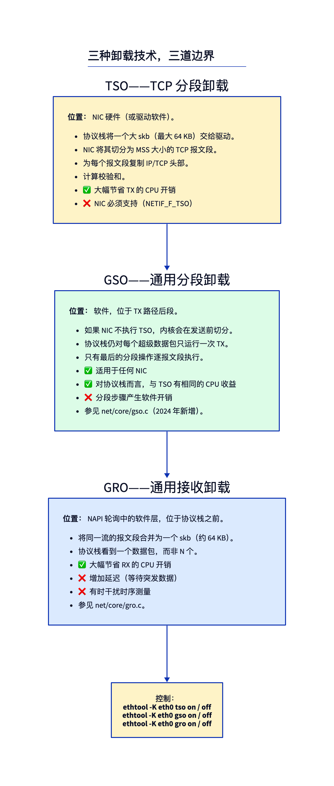
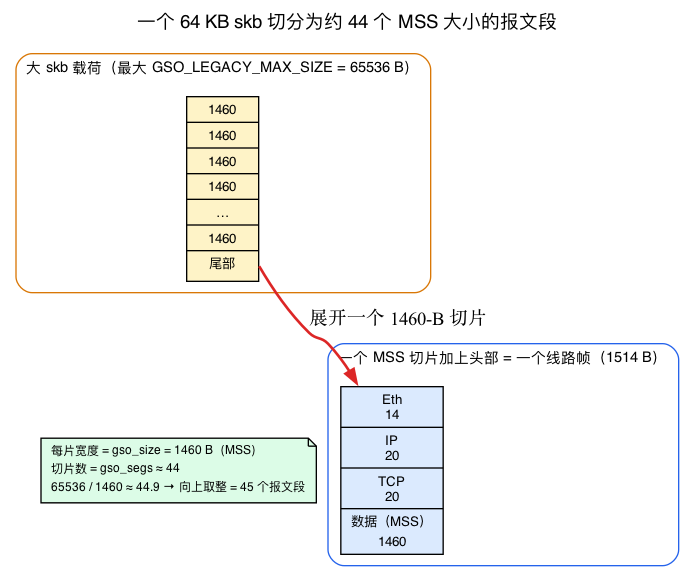
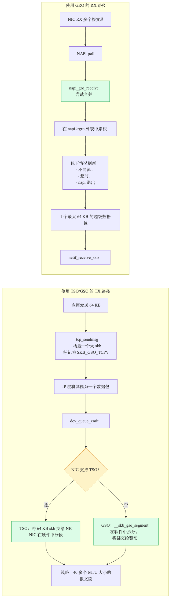
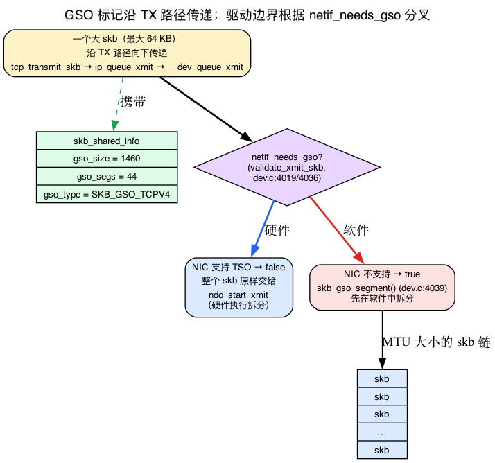
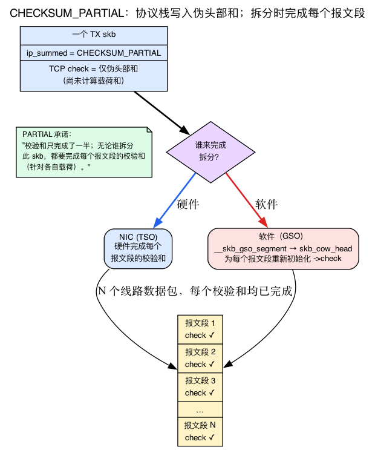
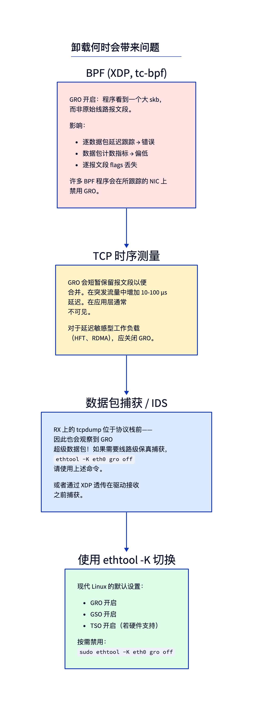

# 第4天 — GRO、GSO、TSO：分段卸载

> **今日任务：** 理解为什么一个进入 `ip_rcv` 的单个 skb 可能代表 40 多个线路数据包，以及为什么内核在 TX 端构造一个 64 KB 的 skb。你将遇到 *分段单位*（MSS）、内核为每个大 skb 打上的三字段 GSO 标记，以及让硬件完成工作的校验和契约 —— 然后用 bpftrace 观察这一切的运作过程。总时长：约 110 分钟。

## 问题

以太网的 MTU 是 1500 字节。大多数 NIC 可以处理约 9000 字节（巨帧），但不能更多。因此，一个通过内核发送一 GB 数据的 TCP 连接会产生约 700,000 个线路数据包。

如果内核为每个线路数据包都运行其 **完整的 TCP 发送代码路径**（队列、构建头部、路由查找、qdisc、驱动程序 —— 整个第3天的旅程），每个数据包的开销将压垮吞吐量。在 RX 上也一样：700,000 次调用第2天接收路径太多了。

三种卸载技术将这些工作转移到硬件或批量软件处理中，使协议栈按*聚合*粒度运行，而不是逐报文段运行。



但在它们中的任何一种有意义之前，你需要知道它们所计算的 **块大小**。介绍中承诺的“一个 skb 产生 40 多个线路数据包”—— 这个数字并非魔法，而是算术运算，而其底层单位是 **MSS**。

## 背景 1：MTU、MSS 和报文段单元

你已经知道 **MTU** —— 第3天的 TX 路径结束于线路，而上面的介绍中提到了它：**链路所能承载的最大 L2 有效载荷**，标准以太网为 1500 字节。这就是单个 *帧* 内容的上限。

但是 TCP 并不是按帧来思考的；它按报文段来思考。因此在本章中，每个卸载操作实际上都基于一个第二个数字进行计数：**MSS——最大报文段大小（Maximum Segment Size）**。它是单个报文段可承载的最大 TCP 有效载荷，等于 MTU 减去头部开销。

```
MSS = MTU − IP header − TCP header
    = 1500 − 20 − 20
    = 1460 bytes        (no-options IPv4)
```

就是这样。一个以太网帧携带 1500 字节的 L2 有效载荷；其中，20 字节用于 IP 头部，20 字节用于 TCP 头部，剩余 **1460 字节为实际数据**。因此，线路中的完整报文段变为 1460（数据）+ 20（TCP）+ 20（IP）+ 14（以太网）= **1514 字节**。

有两点让 MSS 看起来不像一个常量：

- **它是按连接的，而不是全局的。** MSS 在 SYN 时间协商（每一方都通告其可接收的最大值），并且 **当路径 MTU 改变时重新计算**（PMTU 发现）。通过隧道传输的连接，或遇到 ICMP“需要分片”的连接，会使用 *更小* 的 MSS。因此不存在单一的全系统 MSS —— 每个连接都有自己的 MSS。
- **内核存储每个报文段必须使用的值，按 skb 存储。** 因为 MSS 是按连接的，并且可能在传输途中改变，分段步骤 **不会** 实时重新计算“MTU 减去头部”。TCP TX 路径将适用于 *此* skb 的 MSS 写入该 skb 本身，然后分段器读取回来。（该存储字段是 `gso_size` —— 背景 2。）

### 整个章节建立的计算基础

现在做一次计算，因为这是今天实验中每个直方图背后的乘数。内核构建 **一个大的 skb**，携带最多约 64 KB 的有效载荷（我们稍后会确定该界限）。在 MSS 为 1460 时：

```
65536 bytes / 1460 bytes-per-segment ≈ 44.9  →  ceil = 45 segments
```

所以 **一个 64 KB 的 skb 会变成约 44 个线路数据包** —— 而协议栈只运行了一次 TX 路径就生成了所有这些数据包。这就是引言中承诺的“一个 skb 产生 40+ 个线路数据包”，你在 bpftrace 下观察到的聚合比例就是这个数字反过来的情况。

每个 skb 的 MSS 存储在哪里，64 KB 的上限来自哪里？两个锚点：

- 分段器通过 **`tcp_skb_mss()`** (`include/net/tcp.h:1214`) 读取每个 skb 的 MSS，它只是返回 `TCP_SKB_CB(skb)->tcp_gso_size` —— TCP 存储在 skb 控制块中的值。
- “一个大的 skb”受 **`GSO_LEGACY_MAX_SIZE = 65536u`** (`include/linux/netdevice.h:2446`) 和 **`GSO_MAX_SEGS = 65535u`** (`netdevice.h:2445`) 限制。那个 65536 就是本章到处引用的“64 KB”。

> **区分 MTU 和 MSS。** 本章在几段话之间切换了“MTU 大小的 skb”（GSO 输出的内容）和“MSS 大小的块”（描述 TSO 的方式）。它们指的是同一个线路数据包的两个方面：一个 MSS 大小的*有效载荷*（1460 B）被封装在头部中 *就是* 一个 MTU 大小的 *帧*（L2 有效载荷为 1500 B）。当你读到“MSS 大小的块”时，想象的是 1460 字节的数据；当你读到“MTU 大小的 skb”时，想象的是同样的数据加上其 IP/TCP 头部。



## 背景 2：GSO 标记—— `gso_size`, `gso_segs`, `gso_type`

这就是整个章节默默依赖的结构。当内核决定一个 skb 应该在 *稍后* 被分段时，它不会改变 skb 的形状 —— 它只是在协议栈每一层都已携带的 **一个位置** 留下 **三个字段的备注**：即你第1天遇到的 **`skb_shared_info`** 尾部（位于线性缓冲区的 `end` 之后，保存着 `nr_frags`、`frags[]`、`frag_list`）。

第1天介绍了这些片段字段。它 **没有** 讲同一个结构体中存储的三个 GSO 字段。它们是：

```c
struct skb_shared_info {
        /* ... nr_frags, frags[] from Day 1 ... */
        unsigned short  gso_size;   /* include/linux/skbuff.h:598 — MSS each segment carries */
        unsigned short  gso_segs;   /* skbuff.h:600 — how many segments this becomes */
        struct sk_buff  *frag_list; /* skbuff.h:601 — the Day 1 frag-list chain */
        unsigned int    gso_type;   /* skbuff.h:606 — bitmask naming the protocol */
};
```

将其视为一份食谱来阅读：

- **`gso_size`** = 每个输出报文段应携带的 MSS（在我们的示例中为 1460）。这是背景 1 中的每个 skb 的 MSS —— 报文段分割器读取该值，而不是重新计算 MTU 减去头部。
- **`gso_segs`** = 一个 skb 将会变成多少个报文段（约 44）。这是今天“破坏/观察什么”部分中告诉你的数字，当你想要获得真正的线路数据包计数时需要将其乘上。
- **`gso_type`** = 一个命名协议的 **位掩码**，以便选择正确的分割回调函数。这些位在 `skbuff.h` 中定义：**`SKB_GSO_TCPV4 = 1 << 0`** (`skbuff.h:669`)、**`SKB_GSO_DODGY = 1 << 1`** (`skbuff.h:672`，“该数据包来自不受信任的源，需要验证”）、**`SKB_GSO_TCPV6 = 1 << 4`** (`skbuff.h:679`)。

因此当正文说一个 skb 被“标记为 `SKB_GSO_TCPV4`”时，意思是 **`gso_type` 中设置了该位**。而当后续文本说路径“检测到 GSO 标记”时，实际测试是 `skb_is_gso(skb)` (`skbuff.h:5267`)，在 v7.1 中返回 `skb_shinfo(skb)->gso_size` —— 一个非零的 `gso_size` *确实* 表示“该 skb 需要分割”。

### 谁来写入标记

TCP 发送路径在将其传递给第3天路径之前会打上该标记。在 `tcp_transmit_skb` 中：

```c
skb_shinfo(skb)->gso_segs = tcp_skb_pcount(skb);   /* net/ipv4/tcp_output.c:1704 */
skb_shinfo(skb)->gso_size = tcp_skb_mss(skb);      /* tcp_output.c:1705 */
```

这是关键一步。TCP 填写 `gso_size = MSS` 和 `gso_segs = segment count`，然后 **同一个结构体原样通过** `ip_queue_xmit` → `__dev_queue_xmit` → 队列规则 → 驱动程序，这正是第3天所描述的路径。skb 带着自己的分段配方一路向下；中间任何环节都不需要理解它。

### 谁来读取标记位，以及 TSO 与 GSO 的切换

这个决定发生在第3天发送路径的最底层，在 **`validate_xmit_skb()`**（`net/core/dev.c:4019`）中进行，该函数从队列规则出队路径 / `sch_direct_xmit` 路径调用，就在驱动程序之前。它只问一个问题 —— **`netif_needs_gso(skb, features)`**（`dev.c:4036`）：

- **NIC 可以在硬件中分段这个 `gso_type`（TSO）。** 大的 skb 直接交给驱动程序的 `ndo_start_xmit` **原样处理** —— 硬件完成拆分。`netif_needs_gso` 返回 false；不再有其他操作。
- **NIC 不能（GSO）。** 内核调用 **`skb_gso_segment()`**（`dev.c:4039`）在驱动程序看到 skb *之前* 在软件中拆分它。

这是统一本章所介绍的三种技术的单一切换点：**`gso_type` + NIC 能力**。无论哪种方式，都是 *同一个大的 skb* —— 唯一的问题是 **由硬件还是软件** 来完成拆分。记住这个想法；下面的所有内容都是它的特殊情况。



聚焦于这个分支 —— 大的 skb 的 GSO 标记位是唯一决定硬件与软件的因素：



## 背景 3：`ip_summed` 和校验和卸载

还有一个与大尺寸 skb 相关的约束条件，本章末尾的校验和问答完全基于此：**`skb->ip_summed`**，它记录了 *谁负责校验和* —— 协议栈还是网卡。第2天在 `ip_rcv_core` 中提到了“如果未由硬件验证则进行校验和”，但从未定义过这些状态，因此这里给出它们。正好有四种（`include/linux/skbuff.h:248–251`）：

```c
#define CHECKSUM_NONE         0   /* nobody has computed/verified it */
#define CHECKSUM_UNNECESSARY  1   /* RX: NIC already verified — stack may skip */
#define CHECKSUM_COMPLETE     2   /* RX: NIC handed up a raw sum for the stack to fold in */
#define CHECKSUM_PARTIAL      3   /* TX: stack wrote the pseudo-header sum; NIC finishes it */
```

内核自身的头文件在一段长注释中记录了这一约定（`skbuff.h:98–136`）。其中两个状态是 RX 端的（`UNNECESSARY`，`COMPLETE`）——即网卡告知协议栈它已经完成的校验。对于分段而言，TX 端的 **`CHECKSUM_PARTIAL`** 是关键。

### 为什么卸载 *需要* `CHECKSUM_PARTIAL`

考虑一下：一个 GSO/TSO 的 skb **还没有每个报文段的校验和**——它们 *无法* 存在，因为这些报文段直到拆分发生前都不存在。那么协议栈会把什么放进这个大 skb 的校验和字段中？

它放入的是 **伪头部校验和**（即对 IP 地址、协议和长度部分进行计算的部分——除了有效载荷之外的所有内容），并设置 `ip_summed = CHECKSUM_PARTIAL`。该状态是一个 **承诺**：“校验和已经完成了一半；任何拆分此 skb 的人将负责为每个报文段的有效载荷完成其校验和。”对于 **TSO**，网卡会完成它；对于 **GSO**，软件分段器会在拆分过程中完成它。该头部直接说明了这种耦合关系：如果 `gso_type` 是 `SKB_GSO_TCPV4`/`V6`，则表示 TCP 校验和卸载被隐含启用，并且 `ip_summed` 为 `CHECKSUM_PARTIAL`（`skbuff.h:239–242`）。

这正是背景知识 2 中 TSO 与 GSO 切换逻辑也会检查 `ip_summed` 的原因。再次查看 `netif_needs_gso`（`include/linux/netdevice.h:5480`）：

```c
return skb_is_gso(skb) && (!skb_gso_ok(skb, features) ||
        unlikely((skb->ip_summed != CHECKSUM_PARTIAL) &&
                 (skb->ip_summed != CHECKSUM_UNNECESSARY)));
```

一个 GSO skb 如果其校验和 **不是** `PARTIAL`（或 `UNNECESSARY`）的话，就无法安全地直接交给硬件处理，因此它会被强制走 **软件** 分段路径。硬件能力 *和* 校验和契约共同决定了选择 TSO 而不是 GSO。

这也是为什么分段器会在每个报文段中重新初始化校验和字段的原因。**`__skb_gso_segment()`**（`net/core/gso.c:88`）调用 `skb_cow_head()` 正是为了能在每个新的 TCP/UDP 头部中写入一个全新的 `->check` 字段（`gso.c:97`，“我们将初始化 TCP 或 UDP 头部中的 ->check 字段”）：原始 skb 只携带了 *部分*（伪头部）校验和，因此每个报文段都需要计算出完整的校验和。这就是下面问答中建议你在调试校验和问题时阅读 `__skb_gso_segment` 的具体原因。

> 还有一个相关点：校验和卸载本身也是一个 ethtool 特性（`rx-checksumming` / `tx-checksumming`），它就位于今天实验中切换的分段特性旁边。它们之间会相互影响 —— 禁用 tx 校验和卸载可能影响分段，因为一个非 `PARTIAL` 的 skb 不能直接走 TSO 路径。



## TSO——TCP 分段卸载

现在 TSO 可以看作上述切换逻辑的一种情况。内核将一个 **大的 skb**（最大可达 64 KB，即 `GSO_LEGACY_MAX_SIZE`）交给 NIC，该 skb 的 `gso_type` 字段设置了 `SKB_GSO_TCPV4`（或 `SKB_GSO_TCPV6`），而其 `ip_summed` 字段为 `CHECKSUM_PARTIAL`。因为 NIC 的特性标志表明它可以对这个 `gso_type` 进行分段，`netif_needs_gso` 返回 false，于是这个大 skb 直接进入 `ndo_start_xmit`。然后 NIC 硬件执行以下操作：

1. 读取 skb 的 TCP 头部作为模板。
2. 以 **MSS 大小的块**（即每个 `gso_size` 字节 —— 背景 1）遍历有效载荷。
3. 对于每个块，构建一个 IP+TCP 头部（克隆模板，推进 TCP 序列号，增加 IP id，**完成校验和** 这个 `CHECKSUM_PARTIAL` 承诺中未完成的部分），加上以太网头部，然后发送。（像 TTL 这样的字段直接从模板复制 —— 同一流的所有报文段都携带 *相同的* TTL；只有序列号、IP id、长度和校验和在每个报文段中变化。）

结果：约 44 个线路数据包，**一次** 内核调用 `ndo_start_xmit`。每个数据包的协议栈开销降低约 44 倍。

启用/检查：

```bash
ethtool -k eth0 | grep tcp-segmentation-offload
# tcp-segmentation-offload: on
ethtool -K eth0 tso off
```

（该功能名为 `tcp-segmentation-offload`，而不是 `tso` —— 搜索 `tso` 不会匹配到任何内容。）

NIC 必须支持该功能（大多数现代 NIC 都支持）。

## GSO——通用分段卸载

同样的大 skb，同样的标记 —— 但是 NIC *无法* 对此 `gso_type` 进行分段，因此分段发生在 **软件中**，在网络协议栈 TX 路径的后期。回想一下第3天的 qdisc → `ndo_start_xmit` 边界：大的 GSO skb 按原样通过该路径，而分段则附加在路径的末端。

1. TCP 构建一个大 skb，就像 TSO 一样，标记 `gso_size`/`gso_segs`/`gso_type`（背景 2）。
2. skb 按照 `tcp_transmit_skb`、`ip_queue_xmit`、`dev_queue_xmit` 的顺序向下传输，就像它是一个单一数据包一样 —— 正好是第3天的旅程。
3. 在 `ndo_start_xmit` 之前，在 `validate_xmit_skb()`（`net/core/dev.c:4019`）中，`netif_needs_gso()`（`dev.c:4036`）检测到 NIC 无法完成该操作，并调用 `skb_gso_segment()`（`dev.c:4039`）→ **`__skb_gso_segment`（`net/core/gso.c:88`）**，将 skb 分割成一系列 MTU 大小的 skb（L2 分割通过 `skb_mac_gso_segment`、`gso.c:37`；TCP 特定的回调函数是 `tcp_gso_segment`、`net/ipv4/tcp_offload.c:133`）。
4. 驱动程序接收该链并逐个传输。

GSO 是通用的 —— 适用于任何 NIC。分段的 CPU 成本是真实的，但比每个数据包运行完整协议栈的成本要小。

## GRO——通用接收卸载

接收端的对应机制。**回想一下 NAPI 轮询循环和 `napi_gro_receive` → `gro_receive_skb` 这一漏斗结构：** GRO 在驱动程序的 NAPI 轮询中运行，在 `XDP_PASS` 将 DMA 字节转换为 skb 之后、以及协议栈入口之前。（第2天还解释了 *为什么* 要跟踪 `gro_receive_skb` 而不是 `napi_gro_receive` — 后者是在 `include/linux/netdevice.h:4286` 中定义的 `static inline`，无法通过 fentry 追踪；导出的入口点是 `gro_receive_skb` 位于 `net/core/gro.c:636`，而主要工作函数是 `dev_gro_receive` 位于 `gro.c:474`。）

GRO 引擎将每个新的 skb 与“飞行中”的相同流的 skb 列表进行比较。如果可以合并（连续的序列号、相同的流元组、无标志变化），它会将有效载荷附加到现有 skb **作为页片段**（`skb_gro_receive`，`gro.c:92` — 从不通过扩展线性数据缓冲区实现）。回想第1天的线性头部 + 页片段模型：一个 64 KB 的 GRO 超大包是一个小的线性头部加上一串页片段链，*永远* 不会是 64 KB 的连续分配。（还有一种第二类组装形式 — `skb_shared_info.frag_list`（`skbuff.h:601`，由 `skb_has_frag_list()` 在 `skbuff.h:4206` 测试）将*完整的 skb*连接在一起，而不是使用 `frags[]` 的页数组；一些 GSO/分片列表路径会使用这种形式。知道这一点即可；你最常遇到的仍是 `frags[]` 模型。）

结果：一次 `ip_rcv` 调用处理了大约 44 个线路数据包。

刷新触发条件：
- 不同流到达。
- 超时（每个设备的 `/sys/class/net/<dev>/gro_flush_timeout`，或通过 netlink 的每个 NAPI）。
- **NAPI 轮询退出** — GRO 累加器按 NAPI 分配（`napi->gro`），因此在软中断让出 CPU 之前必须清空。
- 特殊标志（FIN，RST，PSH）。

> ### 常见疑问
>
> **问：为什么 TSO 不会破坏 TCP 正确性？**
>
> 答：因为执行分段的 NIC 生成的是 *正确的线路数据包* — 就像内核自己处理的一样。从对端的角度来看，流量是无法区分的。只有本地协议栈节省了工作量。GRO 同样如此：合并后的 skb 包含与原始报文段相同的字节数；本地协议栈只是将它们视为一个数据包。
>
> **问：何时应该禁用这些功能？**
>
> 答：对于对延迟敏感的测量（高频交易、微秒级计时、取证用的数据包捕获）—— GRO 可能会短暂保留数据包，等待可能的合并对象。增加的延迟通常小于 100 微秒，但仍可观察到。对于每个数据包的可观测性（需要看到线路数据包的 BPF 程序）—— 驱动程序中的 GRO 会隐藏这些数据包。
>
> **问：GSO 如何与校验和卸载交互？**
>
> 答：密切相关——背景知识 3 已经给出了相关机制。简而言之：在拆分之前不存在每个报文段的校验和，因此协议栈只发送 `CHECKSUM_PARTIAL`（仅伪首部校验和），然后由拆分器完成每个报文段的计算——对于 TSO 是网卡完成，`__skb_gso_segment` 用于 GSO。这也是为什么 `netif_needs_gso` 强制将非 `PARTIAL` 的 skb 走软件分段路径。如果遇到校验和错误，请重新阅读背景知识 3。

## 启用卸载功能时的陷阱



最大的陷阱是 **可观测性**。如果你追踪 `ip_rcv` 并统计数据包，你统计的是 GRO 超大数据包，而不是线路数据包。如果你有这个信息，可以乘以 `skb_shinfo(skb)->gso_segs`（背景 2 — 内核打上的报文段计数）；或者在测量期间禁用 GRO。

对于挂载到协议栈的 BPF 程序（XDP 在 GRO *之前* 运行；tc-bpf 在 *之后* 运行），这一点很重要：XDP 看到的是每个报文段，tc 看到的是合并后的数据包。

## 今日实验

### 查看卸载状态

```bash
ethtool -k eth0 | grep -E "segmentation-offload|receive-offload"
```

输出（典型）：
```
tcp-segmentation-offload: on
generic-segmentation-offload: on
generic-receive-offload: on
large-receive-offload: on
```

这些特性的*名称*是 `tcp-segmentation-offload` / `generic-*-offload` — 它们不包含子字符串 `tso`/`gso`/`gro`，所以一个 `grep -E "tso|gso|gro"` 只会匹配无关行，而从不打印这些。匹配真实名称。（`large-receive-offload` 是硬件 LRO，是 GRO 的表亲；它可能在不支持该功能的 NIC 上读取 `off` 或 `off [fixed]`。）

### 观察 GRO 的运行

GRO 将多个线路数据包合并为一个超级数据包，因此 *入口*探针（`gro_receive_skb`）每到达一个报文段触发一次，而 *GRO 后*探针触发次数少得多，且每次处理的 skb 更大。我们同时观察长度和调用次数：

```bash
sudo bpftrace -e '
fentry:gro_receive_skb {
  @gro_lengths = lhist(args->skb->len, 0, 65536, 8192);
  @gro_calls = count();
}
tracepoint:net:netif_receive_skb {
  @postgro_lengths = lhist(args->len, 0, 65536, 8192);
  @postgro_calls = count();
}
interval:s:8 { exit(); }' &

# While that window is open, pull a real bulk download (server-less, follows redirects).
curl -sL -o /dev/null --max-time 6 \
  https://cloud-images.ubuntu.com/releases/24.04/release/ubuntu-24.04-server-cloudimg-amd64.img
wait
```

在 bpftrace 窗口中运行下载命令，因此将追踪器置于后台 (`&`) 并 `wait`。典型输出
（数字随传输量变化）：

```
@gro_calls: 237409          <- once per arriving segment, mostly small
@gro_lengths:
[0, 8K)           219020 |@@@@@@@@@@@@@@@@@@@@@@@@@@@@@@@@@@@@@@@@@@@@@@@@@@@@|
[8K, 16K)          11732 |@@                                                |
 ...
@postgro_calls: 30527       <- ~8x fewer: GRO merged ~8 segments per superpacket
@postgro_lengths:
[0, 8K)            11056 |@@@@@@@@@@@@@@@@@@@@@@@@@@@@@@@@@@@@@@@@@@@@@@@@@@@@|
[8K, 16K)           7203 |@@@@@@@@@@@@@@@@@@@@@@@@@@@@@@@@                  |
[56K, 64K)          3260 |@@@@@@@@@@@@@@@                                    |
```

关键信息在两个 `*_calls` 中：`gro_calls` ≫ `postgro_calls`（这里约为 8:1）是合并比例，
而 `postgro_lengths` 扩展到大桶中——这些是协议栈一次性处理的合并超级数据包，而不是八次分别处理。

> **为什么是 `netif_receive_skb` 而不是 `ip_rcv`？** `tracepoint:net:netif_receive_skb` 是 GRO 合并后的入口
> 进入协议栈，并在每个 NIC 上触发。`fentry:ip_rcv` 适用于裸金属 NIC，但在许多虚拟
> NIC（云/virtio）上它附加但从不触发——你会看到一个空的直方图并错误地得出结论
> GRO 已关闭。使用 tracepoint；如果想在裸金属上确认，也添加 `fentry:ip_rcv { @ip = lhist(args->skb->len,0,65536,8192); }`
> 。

### 禁用 GRO 并重新测量

现在关闭 GRO 并运行 *相同* 的观察。对比才是重点：

```bash
sudo ethtool -K eth0 gro off

sudo bpftrace -e '
tracepoint:net:netif_receive_skb {
  @postgro_lengths = lhist(args->len, 0, 65536, 8192);
  @postgro_calls = count();
} interval:s:8 { exit(); }' &
sleep 1
curl -sL -o /dev/null --max-time 6 \
  https://cloud-images.ubuntu.com/releases/24.04/release/ubuntu-24.04-server-cloudimg-amd64.img
wait

# Always restore — leaving GRO off slows every later experiment:
sudo ethtool -K eth0 gro on
```

在 GRO 关闭时，`postgro_calls` 大致回到报文段数量（这里约为 233 000，而 GRO 开启时约为 30 000，增加了约 8 倍），而 `postgro_lengths` 几乎完全集中在 `[0, 8K)` 桶中：网络协议栈现在会对每个线上实际大小的数据包处理一次，而不是对每个超级数据包处理一次。这种额外的每个数据包工作就是 GRO 所隐藏的 CPU 成本。

### 逐报文段计数

TSO 是一种 *发送* 卸载：网络协议栈将大的 skb 交给 NIC，然后由 NIC 将其分割成线路数据包。因此你需要一个 **上传** 来观察它（下载的 TX 端只是小的 ACK）。在推送数据时注意进入设备队列的 skb 大小：

```bash
sudo bpftrace -e 'fentry:__dev_queue_xmit {
  @tx_skb_len = lhist(args->skb->len, 0, 65536, 8192);
} interval:s:6 { exit(); }' &

# Server-less upload sink; --max-time bounds it, the timeout exit is expected (|| true).
curl -s -o /dev/null -T /dev/zero --max-time 4 https://speed.cloudflare.com/__up || true
wait
```

典型输出 —— 顶部桶中出现强烈峰值，这是网络协议栈传下来的 64 KB GSO/TSO skb：

```
@tx_skb_len:
[0, 8K)              206 |@@@@@@                                            |
[8K, 16K)            120 |@@@                                               |
 ...
[56K, 64K)          1660 |@@@@@@@@@@@@@@@@@@@@@@@@@@@@@@@@@@@@@@@@@@@@@@@@@@@@|
```

这些 ~64 KB 的 skb 变成了 40 多个 MTU 大小的线路数据包（来自背景知识 2 中的 `gso_segs`），但是网络协议栈针对每个 skb 只执行了一次 TX 路径。你也可以在 NIC 计数器中看到这个乘法效应 —— 线路数据包的数量增长远快于 skb 的数量：

```bash
ethtool -S eth0 | grep -iE 'tx_packets|tx_queue.*packets'   # NIC's per-queue / aggregate wire packets
cat /sys/class/net/eth0/statistics/tx_packets               # kernel-level tx_packets
```

该字段名为 `tx_packets` / `tx_queue_N_packets` — **不是** `tx_pkts`，后者在任何驱动中都不匹配任何内容。计数器布局因驱动而异：在虚拟化 NIC（例如 Azure/`mlx5` VF）上，`tx_queue_N_packets` 行可能显示 `0`，而真实计数位于 `vf_tx_packets` / `cpuN_tx_packets`。

---

## 内核中需要阅读的内容

- **`net/core/gso.c`** — 分段引擎。约 300 行。`__skb_gso_segment` 是入口（`gso.c:88`）；`skb_mac_gso_segment` 执行 L2 分割（`gso.c:37`）；注意 `skb_cow_head` 调用（`gso.c:97`），它重新初始化每个报文段的校验和字段。
- **`net/core/gro.c`** — 合并引擎。约 800 行。`dev_gro_receive` 是工作主体（`gro.c:474`）；`gro_receive_skb` 是导出入口（`gro.c:636`）；`napi_gro_receive` 本身是在 `netdevice.h:4286` 中定义的 `static inline`；每个协议的回调函数（`tcp4_gro_receive`）位于协议文件中。
- **`net/ipv4/tcp_offload.c`** — TCP 特定的 GRO/GSO 回调函数；在 `tcp_offload.c:133` 处 `tcp_gso_segment`。
- **`include/linux/netdev_features.h`** — `NETIF_F_GSO_*`、`NETIF_F_TSO_*`、`NETIF_F_GRO_*` 标志。
- **`include/linux/skbuff.h`** — `skb_shared_info` 中的 GSO 标记：`gso_size`（598）、`gso_segs`（600）、`gso_type`（606）；`SKB_GSO_*` 位（`SKB_GSO_TCPV4` 在 669）；`ip_summed` 契约（`CHECKSUM_*` 在 248–251，文档化于 98–136）。
- **`net/core/dev.c`** — TX 分割点：`validate_xmit_skb`（4019）、`netif_needs_gso` 测试（4036）、`skb_gso_segment`（4039）。
- **`Documentation/networking/segmentation-offloads.rst`** — 官方指南。

---

## 要点回顾

- **MSS** = MTU − IP − TCP = 1500 − 20 − 20 = **1460 B**（无选项 IPv4）—— 每个卸载计算的块大小。它是 **每个连接**的，存储在每个 skb 中，因此分段器读取它（`tcp_skb_mss()`，`tcp.h:1214`），而不是重新计算。一个 skb 中的 64 KB 数据按 1460 字节分段，约得到 **44 个报文段**。
- **GSO 标记** 存在于 `skb_shared_info` 中：`gso_size`（MSS，`skbuff.h:598`），`gso_segs`（计数，600），`gso_type`（协议位掩码，606）。TCP 在 `tcp_transmit_skb` 中标记它（`tcp_output.c:1704–1705`）；同一个大 skb 然后以不变的方式通过第3天的 TX 路径。
- **一个切换点统一了三者：** `gso_type` + NIC 能力。`validate_xmit_skb` → `netif_needs_gso`（`dev.c:4019/4036`）将整个 skb 交给硬件（TSO）或调用 `skb_gso_segment`（`dev.c:4039`）进行软件分割（GSO）。
- **`ip_summed`** 是校验和契约（`CHECKSUM_NONE/UNNECESSARY/COMPLETE/PARTIAL`，`skbuff.h:248–251`）。TX 卸载要求 **`CHECKSUM_PARTIAL`**：协议栈只写伪头部校验和，每个报文段的真实校验和在分割后完成（TSO 由 NIC 完成，`__skb_gso_segment`→`skb_cow_head` 由 GSO 完成）。
- **TSO**：硬件将大的 skb 分段为线路数据包。节省协议栈开销约 44 倍。
- **GSO**：在 TX 中后期进行软件分段（`net/core/gso.c:__skb_gso_segment`，`gso.c:88`）。与 TSO 相同的协议栈节省；适用于任何 NIC。
- **GRO**：NAPI 轮询中的接收侧合并（`net/core/gro.c:dev_gro_receive`，`gro.c:474`）—— 回想第2天的漏斗。每个超级数据包一次协议栈处理；有效载荷附加为页片段（第1天）或较少见地通过 `frag_list` 链接。
- 三者都由 `ethtool -K` 控制。现代 NIC 通常**默认开启**这三项功能。
- 副作用：**除非你禁用 GRO 或者乘以 `skb_shinfo(skb)->gso_segs`，否则每个数据包的可观测性都是错误的**。
- 对于对延迟敏感的工作负载，有时会禁用 GRO（低于 100 微秒的延迟下限）。

---

## 检查问题

你运行 `iperf3`，在传输开始的瞬间，报告的吞吐量短暂读数 *高于* 网卡线路速率，然后趋于稳定。发生了什么？

<details>
<summary>点击显示答案</summary>

**答案：** iperf3 测量的是用户空间套接字的字节数，而不是线路的字节数。在传输刚开始时，内核的套接字发送缓冲区吸收了比网卡处理更快的一波写入 —— 应用程序测得的每秒字节数暂时反映了数据进入套接字缓冲区的速度，而不是离开线路的速度。一旦缓冲区填满并且 TCP 受 ACK 节奏控制，读数就会稳定到真正的线路速率（受网卡限制）。TSO 加剧了这种错觉：那些缓冲的字节以内核中的 64 KB skb 形式离开，而网卡对它们进行分段，因此“协议栈级吞吐量”会短暂激增，然后流量控制将其压制。稳定状态下的 iperf3 吞吐量与线路速率一致。

</details>

---

## 明天

第5天 — 网络命名空间。为什么单个内核可以同时运行数十个独立的网络协议栈，以及 `struct net` 是如何让它工作的。
