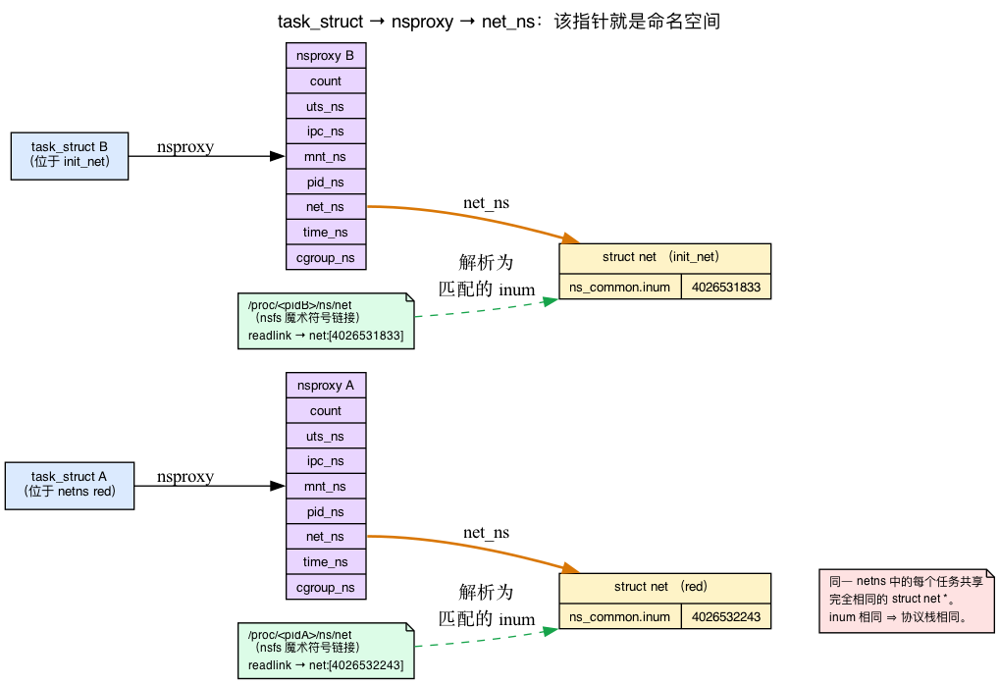
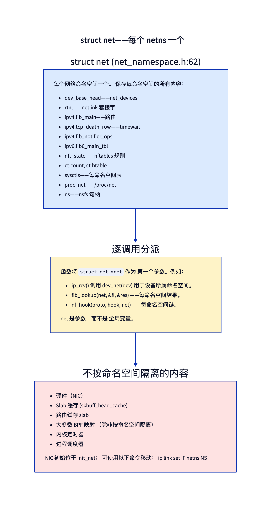
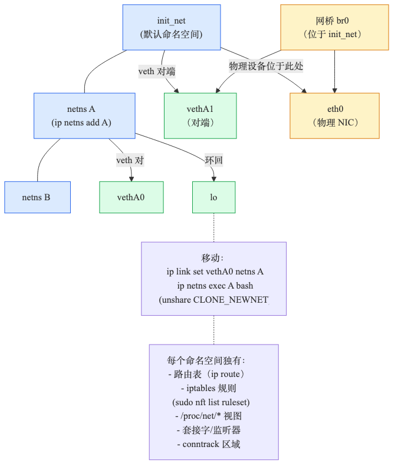
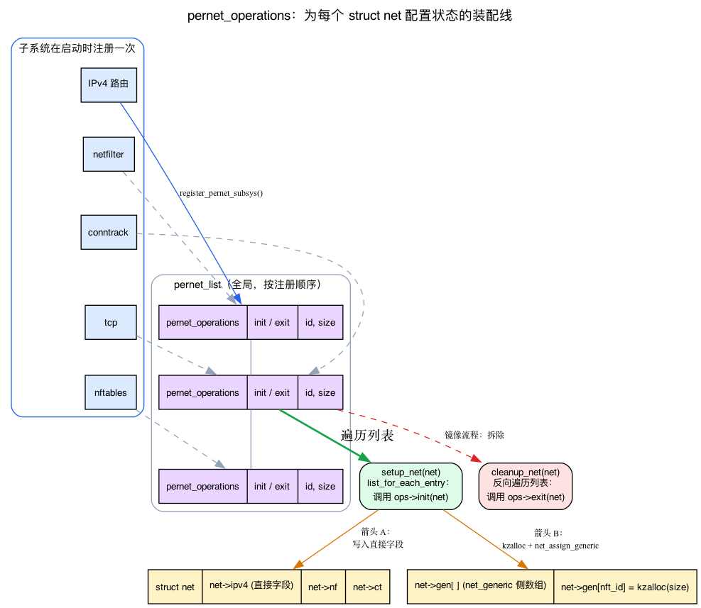
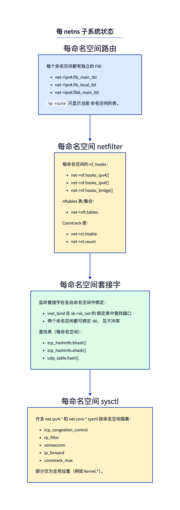
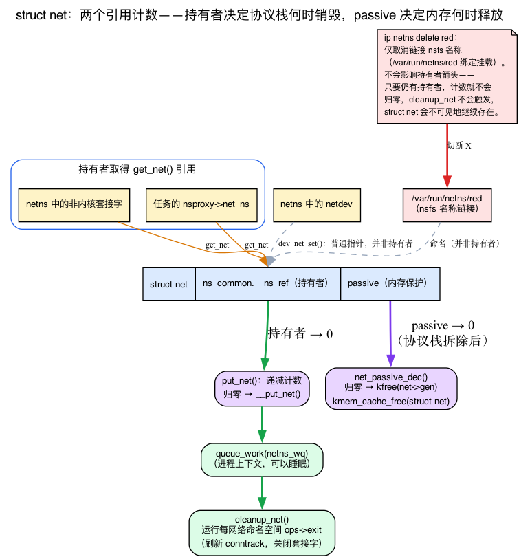

# 第5天 — 网络命名空间与 `struct net`

> **今日任务：** 理解什么是 *命名空间*，进程如何绑定到一个命名空间，以及内核如何保持多个独立的网络协议栈隔离。然后创建一个网络命名空间，为其分配一个虚拟接口，在其中运行一个进程，并用 bpftrace 观察网络命名空间的创建与销毁。第 1 阶段结束。总时长：约 110 分钟。

## 命名空间的含义（在接触网络命名空间之前）

第 1–4 天从未提到 *命名空间* 这个词，所以我们从头构建这个概念 —— 这是今天所有内容的基础。

**命名空间** 是内核范围内的 *作用域* 机制。取一个全局资源 —— 比如“网络接口列表”，或“挂载的文件系统集合”，或“进程 ID 表”—— 并使其表现为 **N 个独立副本** 而非一个共享对象。处于同一种类型的不同命名空间中的两个进程查看同一全局资源，每个进程看到的是私有、隔离的视图。这和虚拟机管理程序对整台机器所用的技巧相同，只不过内核是按资源进行操作，以软件方式实现，几乎无开销。

Linux 有多种**命名空间类型**，每种作用域不同：

| 命名空间 | 作用域 |
|---|---|
| `mnt` | 挂载表（哪些文件系统在何处可见） |
| `pid` | 进程 ID（内部 PID 1 ≠ 外部 PID 1） |
| `net` | **整个网络协议栈** —— 今天的话题 |
| `uts` | 主机名和域名 |
| `ipc` | System V IPC / POSIX 消息队列 |
| `time` | 时钟偏移（启动时间、单调时间） |
| `cgroup` | 进程所见的 cgroup 根目录 |

容器本质上只是一个进程，其 `mnt`、`pid`、`net` 等指针已被替换为新的命名空间。内核中没有“容器”对象 —— 只是一个持有命名空间指针集合的进程。今天我们只关注其中一个指针：**net**。

**网络命名空间** 作用于整个协议栈。每个命名空间都有其自己的：

- 网络接口列表，
- 路由表，
- netfilter 规则（内核的数据包过滤/防火墙框架；nftables 是其现代规则集），
- 套接字和绑定端口，
- proc/sysctl 视图，
- conntrack 表（连接跟踪 —— 内核对活动流的记录，NAT 和有状态防火墙会用到它）。

这就是使容器和虚拟机（使用 TAP/MACVTAP）成为可能的原因。每个 Docker/Podman/Kubernetes 的 pod 都运行在自己的 netns 中。Linux 可以同时创建数万个这样的 netns。

### 进程如何绑定到其命名空间：`nsproxy`

那么进程将指向“这是我的 netns”的指针保存在哪里呢？并不是直接保存在 `task_struct` 中。每个任务都指向一个称为 **`struct nsproxy`** 的小型共享集合，其中包含每个命名空间类型的指针：

```c
/* include/linux/nsproxy.h:32 */
struct nsproxy {
	refcount_t count;
	struct uts_namespace *uts_ns;
	struct ipc_namespace *ipc_ns;
	struct mnt_namespace *mnt_ns;
	struct pid_namespace *pid_ns_for_children;
	struct net           *net_ns;        /* <-- the network namespace */
	struct time_namespace *time_ns;
	struct time_namespace *time_ns_for_children;
	struct cgroup_namespace *cgroup_ns;
};
```

今天重要的字段是 **`net_ns`**，它是一个 `struct net *`。**同一个网络命名空间中的所有任务都共享同一个 `struct net *`** —— 这个指针 *就是* 命名空间。`nsproxy` 本身是引用计数的（`count`），并且在具有相同命名空间包的任务之间共享，这就是为什么不带 `CLONE_NEW*` 的 fork 的开销很低：子进程只是增加了父进程的 `nsproxy`。

因此你在代码中看到的链是：`task_struct → nsproxy → net_ns → struct net`。当内核代码想要获取“当前任务的网络命名空间”时，它正是沿这条路径查找（`current->nsproxy->net_ns`，通常封装在 `sock_net(sk)` 或 `dev_net(dev)` 等辅助函数中）。



### `struct net` —— 每个命名空间一个



每个命名空间是一个 **`struct net`**（定义在 `include/net/net_namespace.h:62`）。内核网络函数将 `struct net *net` 作为一等参数 —— 任何需要路由表、netfilter 链、端口分配器的函数，都会通过 `net` 查找。（当我们讲到下面的 `pernet_operations` 时，会看到为什么这个指针足以访问每个子系统的命名空间状态。）

引导时的“默认”命名空间是 **`init_net`**（`net/core/net_namespace.c:49`：`struct net init_net;`）。内核的第一个网络设备（回环，然后是物理 NIC）都从这里开始。新命名空间在放入设备之前是空的。

### 命名空间的 inode：`ns_common` 和 nsfs

这是让今天第一个实验有意义的部分。嵌入在 `struct net` 内部的是一个小型通用头，被 *所有* 命名空间类型共享：

```c
/* include/net/net_namespace.h:97 — inside struct net */
struct ns_common	ns;
```

而 `ns_common` 携带命名空间的**标识符**，即一个 inode 号：

```c
/* include/linux/ns/ns_common_types.h:111 */
struct ns_common {
	struct { refcount_t __ns_ref; } ____cacheline_aligned_in_smp;
	u32 ns_type;
	struct dentry *stashed;
	const struct proc_ns_operations *ops;
	unsigned int inum;          /* <-- the unique identity */
	/* ... */
};
```

那个 `inum` 是在创建命名空间时分配的唯一 inode 号。不过要分清这个编号代表哪一层身份。**内核内部通过 `struct net *` 指针来识别命名空间，而不是通过 `inum`。**“这两个是否在同一个 netns 中？”是通过 `net_eq(net1, net2)` 来回答的，这实际上就是 `return net1 == net2` (`include/net/net_namespace.h:302`) —— 一个指针比较 —— 并且整个协议栈中的同一 netns 检查（例如`inet_bind_bucket` 匹配）都会在指针上调用 `net_eq`。`inum` 是 **面向用户空间** 的名称，通过 nsfs 暴露为 `net:[<inum>]`。因为每个存活的 `struct net` 都被分配了一个唯一的 `inum`，所以用户空间 *可以* 通过比较两个 `net:[...]` 字符串来回答“是否在同一个 netns 中？”并对**当前仍存活的命名空间**得到正确答案 —— 但这只是基于 1:1 映射构建的用户空间便利功能，并非内核本身执行的比较。（一旦命名空间被释放，inum 就会被回收 —— `ns_common` 注释中提到 inum“对于非初始命名空间会快速回收”—— 所以 inum 只在存活命名空间之间是稳定的，而指针才是存活期间的权威键。）

你如何从用户空间 *看到* 那个数字？通过 **nsfs**，一个内部的微型伪文件系统，其唯一任务就是将命名空间暴露为文件。每种类型的命名空间在 `/proc/<pid>/ns/` 下显示为一个 **魔法符号链接**。读取 `net` 项（`readlink /proc/<pid>/ns/net`）会打印出 `net:[<inum>]`。相同的 `inum` ⇒ 相同命名空间；不同的 `inum` ⇒ 不同的 `struct net`。这就是本章后面元数据实验背后的完整机制。

启动时的命名空间 `init_net` 获得一个 **预定义且固定的** inode 号，而不是新分配的一个 —— `NET_NS_INIT_INO = 0xEFFFFFF9` (`include/uapi/linux/nsfs.h:54`)，通过 `ns_init_inum()` (`include/linux/ns/ns_common_types.h:144`) 固定。因此在每台 Linux 主机上，init_net 的 `net:[...]` 都以相同的数字结尾；只有你 *创建* 的命名空间才会获得新的。

> ### 常见疑问
>
> **问：回环设备是每个命名空间独立的吗？**
>
> 答：是的。每个 ns 拥有其自己的 `lo`。所以 ns A 中的 `127.0.0.1` 与 ns B 中的 `127.0.0.1` 无关。两个进程（分别在不同 ns 中）都可以 `bind()` 127.0.0.1:80 而不会冲突。
>
> **问：ns A 能看到 ns B 的流量吗？**
>
> 答：只能通过 *连接设备* 看到。常见模式：一个 `veth` 对（两个虚拟 NIC，作为线路使用 —— 每个 ns 中各一个），一个连接 init_net 中 veth 的 Linux bridge，或是一个移动到某个 ns 的物理 NIC。
>
> **问：共享状态存储在哪里？**
>
> 答：硬件（NIC 本身），slab 缓存（sk_buff 分配是内核范围的 —— 回想一下第1天的 `skbuff_head_cache` 和每个 CPU 的 `napi_alloc_cache`），调度器。一个 NIC 在 ns 意义下是独立的，因为其 `dev->nd_net` 指向一个 ns —— 但底层硬件是一个物理实体。

## 设置 netns

Linux 通过 `iproute2` 暴露 ns 操作：

```bash
# Create namespace 'red'
sudo ip netns add red

# Run a shell in it
sudo ip netns exec red bash

# (in that shell) network is empty:
ip link
# 1: lo: <LOOPBACK> ... state DOWN
ip route
# (nothing)
```

你处于一个完全隔离的网络协议栈中。启动环回接口，你可以 ping 本地回环地址，但其他地址均不可达。

### 连接到外部网络

两个 veth 端点，分别位于不同的命名空间中：

```bash
# in init_net:
sudo ip link add veth_red type veth peer name veth_red_peer
sudo ip link set veth_red_peer netns red

# inside 'red' (or use ip netns exec):
sudo ip netns exec red ip link set veth_red_peer up
sudo ip netns exec red ip addr add 10.99.99.2/24 dev veth_red_peer

# back in init_net:
sudo ip link set veth_red up
sudo ip addr add 10.99.99.1/24 dev veth_red

# now:
sudo ip netns exec red ping 10.99.99.1     # works
ping 10.99.99.2                              # works (init→red)
```



*该图显示了一般模式 —— 用 `red` 替代“netns A”，用 `veth_red`/`veth_red_peer` 替代 vethA0/vethA1.*

## 如何组装 `struct net`：`pernet_operations`

我们一直在说 `struct net`“聚合了所有每命名空间子系统状态”但谁来 *填充* 它呢？当 `ip netns add red` 运行时，内核分配了一个空白的 `struct net` —— 路由表、netfilter 链、conntrack 计数器和 TCP 状态是如何全部出现在其中的？之后，谁来将它们全部拆除？答案是一个优雅的注册机制，一旦你看到它，本章的核心主张（“大多数内核网络功能首先获取 `struct net *net`”）就不再是口号，而是显而易见的。

### 直觉：子系统注册初始化/退出回调函数

设想每一个网络子系统 —— IPv4 路由、netfilter、conntrack、TCP、nftables —— 都是一个希望在现在和将来创建的 *所有* `struct net` 中都拥有私人房间的租户。在启动时，每个租户通过向核心提供一对回调函数来注册一次：“当一个新的 netns 出生时，调用我的 **init** 来布置我的房间；当它死亡时，调用我的 **exit** 来清理它。” 核心将这些注册信息保存在一个列表中，并为每个命名空间重放它们。

注册表单是 **`struct pernet_operations`**：

```c
/* include/net/net_namespace.h:459 */
struct pernet_operations {
	struct list_head list;
	int  (*init)(struct net *net);   /* :483 — furnish my per-ns state   */
	void (*pre_exit)(struct net *net);
	void (*exit)(struct net *net);   /* :485 — tear it down               */
	void (*exit_batch)(struct list_head *net_exit_list);
	void (*exit_rtnl)(struct net *net, struct list_head *dev_kill_list);
	unsigned int * const id;         /* :490 — net_generic slot id        */
	const size_t size;               /* :491 — bytes to allocate for it   */
};
```

一个子系统将其注册到 **`register_pernet_subsys()`** (`include/net/net_namespace.h:513`)，它只是将该节点附加到一个名为 `pernet_list` 的全局列表。这就是全部的注册过程。例如，IPv4 路由的 `/proc` 操作：

```c
/* net/ipv4/route.c:379 */
static struct pernet_operations ip_rt_proc_ops __net_initdata = { ... };
/* and registered at route.c:386 (plus sysctl_route_ops / ip_rt_ops / rt_genid_ops at :3782+) */
register_pernet_subsys(&ip_rt_proc_ops);
```

### 分发：`setup_net` 遍历列表

当创建命名空间时，**`setup_net()`** 遍历 `pernet_list` 从前向后并调用每个已注册的 `init`：

```c
/* net/core/net_namespace.c:436 */
static __net_init int setup_net(struct net *net)
{
	const struct pernet_operations *ops;
	/* ... */
	list_for_each_entry(ops, &pernet_list, list) {
		error = ops_init(ops, net);          /* :446 */
		if (error < 0)
			goto out_undo;
	}
	/* ... */
}
```

**这个循环就是装配线。** 每个子系统的 `init` 按照注册顺序依次填充其对应的命名空间状态片段。这就是为什么一个全新的命名空间在 `ip netns add` 返回的瞬间就已具备可用（尽管是空的）路由表、netfilter 钩子等。

### 存储每命名空间状态的两种方式：直接字段与 `net_generic`

子系统将状态 *放在* 哪里？有两种策略，而本章的“每命名空间状态”列表混合了这两种策略：

1. **`struct net` 的直接字段** — 对于热点、核心子系统，其状态直接嵌入到结构体中：`net->ipv4` (`net_namespace.h:138`), `net->nf` (`:149`), `net->ct` (`:151`), `net->nft` (`:154`)。访问快速，无间接寻址。

2. **`net_generic`——辅助数组** — 用于处理其他所有情况。若将每个模块的字段都直接加入 `struct net` 中，会导致其膨胀。相反，如果 `pernet_operations` 设置了 `id` 和 `size`，调度器会按需分配空间。请查看 `ops_init`：

   ```c
   /* net/core/net_namespace.c:120 */
   static int ops_init(const struct pernet_operations *ops, struct net *net)
   {
       void *data = NULL;
       if (ops->id) {
           data = kzalloc(ops->size, GFP_KERNEL);          /* allocate the room */
           err = net_assign_generic(net, *ops->id, data);  /* :131 — stash pointer in net->gen */
       }
       /* ... */
       if (ops->init)
           err = ops->init(net);                            /* then furnish it */
   }
   ```

   指针落在 **`net->gen`** (`net_namespace.h:163`) 中，这是一个由子系统 `id` 索引的可调整大小的数组。代码通过 `net_generic(net, id)` 将其取回。这正是 `nft_pernet(net)` 在底层所做的事情 —— 这也是本章称 nftables 状态为 “由 net_generic 支持”的原因：它不是一个直接字段，而是存在于 `net->gen[nft_id]` 中。

无论怎样，**所有状态都能从一个 `struct net *` 访问。** 直接字段或 `net->gen[id]`，子系统都从那个单一指针开始，并找到*属于自己的*每命名空间状态。*这才是*“大多数内核网络函数将 `struct net *net` 作为第一个参数的原因”—— 这个指针是通往建筑中每个命名空间房间的关键。

### 清理操作是对称的

在销毁时，`cleanup_net`（将在下一部分介绍）遍历相同的注册项并运行每个 `exit` 回调函数 —— 匹配的“清空房间”步骤。因为每个已注册子系统都必须依次执行其退出操作（刷新连接跟踪、关闭套接字、释放路由表），**删除繁忙命名空间很慢**：它需要对每个租户进行串行遍历。



## 每命名空间状态



每个命名空间的状态包括（上面的 `struct net` 图已经预览了这个清单；这里我们标记哪些是直接字段还是由 net_generic 支持，现在你已了解区别）：

- **路由**：`net->ipv4.fib_main`、`ipv4.fib_default`、`ipv6.fib6_main_tbl` —— 直接字段，位于 `net->ipv4` 下。`ip route` 仅显示当前命名空间的表。
- **Netfilter**：`net->nf.hooks_ipv4[]`（每个钩子数组，直接字段），`nft_pernet(net)->tables`（**net_generic-backed**），每个命名空间的连接跟踪统计在 `net->ct`。nftables 和连接跟踪状态是独立的。
- **套接字**：TCP 绑定哈希表（`tcp_hashinfo.bhash[]`）本身是 **全局/共享的**，而不是每个命名空间独有 —— 隔离性来自每个绑定桶记录其所属的网络命名空间。`struct inet_bind_bucket` 携带 `ib_net`，桶匹配测试是 `net_eq(ib_net(tb), net) && tb->port == port`，而 `net` 指针通过 `inet_bhashfn(net, port, ...)` 混合进哈希值。因此两个命名空间如果都 `bind()` `0.0.0.0:80`，它们会落在 **同一个共享表中由其 `struct net` 键入的独立桶中** —— 相同端口，无冲突。（只有 *ehash* 可通过 `tcp_child_ehash_entries` 选择性地按命名空间划分；`net->ipv4.tcp_death_row.hashinfo` 是每个命名空间的哈希信息指针，但默认仍指向共享的绑定表。）
- **sysctl**：大多数 `net.ipv4.*` 是按命名空间划分的（`tcp_congestion_control`，`rp_filter`，`ip_forward`）。
- **proc/net**：每个命名空间看到的是其自己的 `/proc/net`，`/proc/sys/net`。

## 一个 `struct net` 的生与死

本章的生命周期实验追踪一个命名空间的诞生（`copy_net_ns`/`setup_net`）和消亡（`cleanup_net`）。要理解你所看到的内容 —— 并理解 *为什么* 删除一个网络命名空间有时实际上不会释放它 —— 你需要了解引用计数模型。好消息：这与你在第1天学到的规则相同。

### 回顾：归零时释放的引用计数

第1天介绍了 `sk_buff` 使用一个 `refcount_t`（`skb->users`），它由 `skb_get()` 增加，由 `kfree_skb()` 减少，在归零时才释放。**`struct net` 使用了相同的模式** —— 只是被保护的结构不同。关于引用计数 *如何* 工作并没有什么新内容需要学习；我们只是将其应用于命名空间。

### 一级：持有者（`get_net` / `put_net`）

主要计数保存在嵌入的 `ns_common.__ns_ref` 中。任何需要命名空间 **保持存活** 的操作都会获取一个引用：

- 该命名空间中的一个 **非内核套接字**（`sk_alloc` → `get_net_track`；具有 `sk_net_refcnt == 0` 的内核套接字只获取被动计数，不获取持有者计数）
- 一个任务的 **nsproxy → net_ns** 指向它（`copy_net_ns` 为非 `CLONE_NEWNET` 的情况取一个 `get_net`；一个新创建的网络命名空间从一个 `__ns_ref` 开始）
- 一个打开的 **文件描述符或绑定挂载** 的 ns（nsfs 名称使其保持固定）。

一个 **网络设备不持有对其网络命名空间的引用。** 其 `nd_net` 是一个普通指针：`dev_net_set()` → `write_pnet(&dev->nd_net, net)` (`netdevice.h:2774`) 是一次不带引用计数的裸指针写入 — `grep -cE 'get_net\b|get_net_track' net/core/dev.c` 返回 0。网络设备唯一接触的计数是 *单独* 的被动（内存保护）计数，且仅在 `rtnl_net_dev_lock/unlock` 内临时使用。事实上，该设计与“设备锁定其命名空间”的说法相反：因为设备 **不** 保持命名空间存活，因此拆卸机制必须主动驱逐它们。`default_device_ops`（通过 `register_pernet_device` 注册）在拆卸时运行 `default_device_exit_net`，该函数将可迁移的物理设备移回 `init_net` 并删除虚拟设备（veth）。之所以存在该驱逐代码，*正是* 因为网络设备无法保持命名空间存活 —— 如果可以的话，任何包含设备的命名空间都将永远不会被释放。

`get_net(net)` 增加计数；`put_net(net)` 减少计数：

```c
/* include/net/net_namespace.h:276, :295 */
static inline struct net *get_net(struct net *net)
{
	ns_ref_inc(net);          /* bump ns_common.__ns_ref */
	return net;
}
static inline void put_net(struct net *net)
{
	if (ns_ref_put(net))      /* drop; true when it hit zero */
		__put_net(net);
}
```

还有 `maybe_get_net()` (`:282`)，这是谨慎变体，如果计数已经为零则失败（返回 `NULL`）——当你有一个指针但不确定命名空间是否仍然存活时使用。

### 为什么最后一个 `put_net` 不会原地释放——工作队列

这里有个微妙之处。当 `put_net` 将持有计数减少到零时，它会调用 `__put_net`，这 **不会** 立即释放任何内容：

```c
/* net/core/net_namespace.c:745 */
void __put_net(struct net *net)
{
	ref_tracker_dir_exit(&net->refcnt_tracker);
	/* Cleanup the network namespace in process context */
	if (llist_add(&net->cleanup_list, &cleanup_list))
		queue_work(netns_wq, &net_cleanup_work);   /* :750 — punt to a workqueue */
}
```

它将待销毁的命名空间附加到 `cleanup_list` 并 **将清理工作入队**。销毁被推迟到 **工作队列**。

**工作队列** 是内核在 *内核线程* 中运行延迟函数的机制 —— 即在 **进程上下文** 中，代码被允许 **睡眠**。这与你在第2天遇到的软中断/NAPI 上下文不同，后者是原子的且 **不能** 睡眠。命名空间拆卸为什么需要睡眠？因为拆卸子系统（`synchronize_rcu()`，刷新 conntrack，关闭套接字）会阻塞 —— 而 `put_net` 可以从任何地方调用，包括禁止阻塞的原子上下文中。所以规则是：廉价且原子地减少引用计数，然后将繁重、需要睡眠的拆卸工作交给内核线程。

工作项及其函数在静态定义中关联：

```c
/* net/core/net_namespace.c:743 */
static DECLARE_WORK(net_cleanup_work, cleanup_net);
```

`cleanup_net` (`net/core/net_namespace.c:662`) 是最终在该工作队列线程上运行的函数。它反向遍历 `pernet_operations` 注册项并调用每个子系统的 `exit` —— 这是上一节中装配线的拆卸部分。

这也是一种便捷的跟踪事实：因为 `cleanup_net` 是一个通过 `DECLARE_WORK` 注册的真实、非内联函数，**`fentry:cleanup_net` 可以可靠挂载**。而出生侧的 `setup_net` 则不同，它可能是 `static __net_init` 的，并且可能被内联 —— 这正是下面生命周期实验中的警告。

### 第二层：被动引用（内存保护）

在 `struct net` 上还有一个 *第二* 个、独立的引用计数：

```c
/* include/net/net_namespace.h:66 */
refcount_t		passive;
```

为什么是两个？持有者计数回答的问题是“这个网络协议栈是否仍处于 *运行中* 状态？”而 `passive` 计数回答的是一个更窄的问题：“是否还有人正在访问这个 struct net 的*内存*？”瞬时查找可能需要暂时固定该结构体的内存，而无需保持整个协议栈处于活跃状态。`passive` 初始化为 1（`net/core/net_namespace.c:410`：`refcount_set(&net->passive, 1)`），而 `net_passive_dec()`（`:530`）执行最终的清理工作 —— 释放 `net->gen` 并最终通过 `kmem_cache_free` 释放该结构体 —— 当它归零时，*在* 运行中清理已经完成之后。两个层级：持有者计数决定 *协议栈何时死亡*，被动计数决定 *内存何时被释放*。



### `ip netns delete` 实际做了什么

现在章节的核心谜题得到了清晰的解决。`ip netns delete red` 只会解除*名称*的链接 —— 即 `/var/run/netns/red` 下的 nsfs 绑定挂载。它 **不会** 强制命名空间死亡。如果任何进程、套接字或打开的文件描述符仍持有 `get_net` 引用，则持有计数会保持在零以上，`__put_net` 永远不会被调用，`cleanup_net` 永远不会运行，并且 **命名空间会在不可见状态下继续存在** 直到最后一个持有者退出。名称已从 `ip netns list` 中消失，但 `struct net` 仍然存在。这正是“如果进程仍在其中怎么办？”的问题：Linux 会一直保留 `struct net` 直到最后一个引用消失 —— 进程退出、文件描述符关闭等。

## 今日实验

### 查看 ns 元数据

```bash
sudo ip netns add green
ls /var/run/netns/        # one entry per ns

# nsfs link to /proc/<pid>/ns/net:
readlink /proc/$$/ns/net           # current shell's netns (init_net)
sudo ip netns exec green readlink /proc/self/ns/net   # green's netns
```

```
net:[4026531833]    # init_net (your number differs)
net:[4026532243]    # green — a different inode
```

你看到的是通过 nsfs 解析的两个 `ns_common.inum` 值 —— 每个命名空间的用户空间可见名称（内核本身使用 `struct net *` 指针进行键控，但每个存活的网络命名空间都映射到唯一的 inum，因此这里的不同字符串表示不同的命名空间）。注意第二个命令中使用了 `/proc/self`，而不是 `/proc/$$`。`$$` 在 `ip netns exec` 运行之前由你的 *外部* 交互式 shell（位于 init_net 中）展开，因此它会解析仍在 init_net 中的进程的符号链接，并打印相同的 inode 两次。`/proc/self` 是由 `readlink` 进程解析的，该进程实际被 `ip netns exec` 放入 green 命名空间中，因此这两个 inode 确实不同 —— 这就是内核识别进程所属命名空间的方式。

### 每个命名空间的 sysctl

```bash
# In init_net — show YOUR actual value (don't assume a specific one):
cat /proc/sys/net/ipv4/tcp_congestion_control
# cubic (whatever your box uses — often cubic)

# What's even compiled in? (reno is always built in)
cat /proc/sys/net/ipv4/tcp_available_congestion_control
# reno cubic dctcp bbr htcp

# In green:
sudo ip netns exec green cat /proc/sys/net/ipv4/tcp_congestion_control
# cubic (a new ns inherits init_net's congestion control)

# Set green to reno — always built in, so guaranteed distinct from a default-cubic box:
sudo ip netns exec green sysctl -w net.ipv4.tcp_congestion_control=reno

# Confirm green changed but init_net did NOT:
sudo ip netns exec green cat /proc/sys/net/ipv4/tcp_congestion_control   # reno
cat /proc/sys/net/ipv4/tcp_congestion_control                            # unchanged (your original value)
```

各命名空间的值不同 — 现在 green 读取 `reno` 而 init_net 保持其原始值，证明这些表是独立的。每个命名空间的 sysctl 表位于 `net->sysctls`。（如果你的 init_net 已经运行了 `reno`，则将 green 设置为 `cubic` — 目的是选择一个与 init_net 当前值不同的值。）

### 每个命名空间的路由

```bash
# In red (with veth set up):
sudo ip netns exec red ip route
# 10.99.99.0/24 dev veth_red_peer scope link

# In init_net:
ip route
# (your normal routes, including 10.99.99.0/24 if the host added one)
```

不同的表，不同的视图。

### 观察 ns 生命周期

```bash
sudo bpftrace -e '
fentry:setup_net  { printf("setup_net %p\n", (void *)args->net); }
fentry:cleanup_net { printf("cleanup_net work %p\n", (void *)args->work); }
'

# In another terminal:
sudo ip netns add demo
sudo ip netns delete demo
```

> **注意：** `setup_net` 是 `static __net_init` (`net/core/net_namespace.c:436`)，因此它可能在引导后被内联或释放，`fentry:setup_net` 可能无法可靠附加。如果它不触发，请跟踪其调用者 `copy_net_ns` (`net/core/net_namespace.c:549`) — 但请注意 `copy_net_ns` 的 `struct net *` 参数 (`args->old_net`) 是旧的/父命名空间，而不是新的。新创建的 `struct net` 是函数的返回值，因此你必须使用 `fexit` 和 `retval`：
>
> ```bash
> sudo bpftrace -e 'fexit:copy_net_ns { printf("new net %p\n", retval); }'
> ```
>
> (`copy_net_ns` 也运行于 `CLONE` 而无 `CLONE_NEWNET`，此时它仅返回旧的网络指针；当 `ip netns add` 运行时才出现不同的堆地址。） `cleanup_net` 是一个工作队列函数（通过 `DECLARE_WORK` 在 `net/core/net_namespace.c:743` 注册），并能可靠附加 — 正如生命周期部分所解释的那样。

你会看到命名空间被创建和销毁。将其与引用计数模型联系起来：`cleanup_net` 行仅在 **持有者计数归零** 且 `__put_net` 将清理工作入队后才触发 — 对于一个新创建、无残留进程或套接字的空 `demo`，这几乎是立即发生的。

## 当你删除一个网络命名空间时会发生什么

你刚刚看到 `cleanup_net` 触发 — 回想引用计数部分，它仅在 `demo` 没有残留持有者时才运行。（如果进程、套接字或文件描述符仍持有 `get_net` 引用，则 `ip netns delete` 仅取消链接 nsfs 名称，而 `struct net` 将在最后一个持有者消失前隐形存在。）

---

## 内核中需要阅读的内容

- **`include/linux/nsproxy.h`** — `struct nsproxy`（第 32 行）。查看每个命名空间类型的单指针布局；`net_ns` 是当前关注的字段。
- **`include/net/net_namespace.h`** — `struct net` 定义（第 62 行）。一次性阅读所有字段。注意嵌入的 `ns_common ns`（第 97 行）、`passive` 引用计数（第 66 行）、`gen` 指向 net_generic 的指针（第 163 行），以及直接字段 `ipv4`/`nf`/`ct`（第 138/149/151 行）。另请查看 `struct pernet_operations`（第 459 行）和 `register_pernet_subsys`（第 513 行）。
- **`include/linux/ns/ns_common_types.h`** — `struct ns_common`（第 111 行）；`inum` 字段（第 ~118 行）是 nsfs 打印的标识符。
- **`net/core/net_namespace.c`** — 生命周期：`setup_net`（第 436 行）、`ops_init`/`net_assign_generic`（第 120/83 行）、`copy_net_ns`（第 549 行）、`__put_net`（第 745 行）、`cleanup_net`（第 662 行）、`net_passive_dec`（第 530 行），以及 `struct net init_net`（第 49 行）。
- **`include/linux/netdevice.h`** — 搜索 `dev_net(dev)`。大多数代码调用此函数以从 netdev 获取 ns。
- **任何 `*_pernet_ops` 注册** — 例如 `net/ipv4/route.c` `register_pernet_subsys(&ip_rt_proc_ops)`（第 386 行）。每个子系统在此处注册 init/exit 回调函数。
- **`Documentation/admin-guide/sysctl/net.rst`** — 哪些 sysctl 是 per-ns 的，哪些是全局的。

---

## 尝试破坏什么

### 尝试将物理 NIC 移动到 netns

首先找到真实的接口名称 —— 许多云/测试 VM 使用可预测的名称，如 `ens5` 或 `enp0s3`，而不是 `eth0`：
```bash
ip route get 1.1.1.1     # read the 'dev <name>' field; substitute it for eth0 below
```

```bash
sudo ip link set eth0 netns red    # **CAREFUL** — your SSH may go away
```

如果你在正在使用的实际网络接口上执行此操作，你的 SSH 会话将断开连接（init_net 不再包含 eth0）。对于真正的测试，请使用非关键接口或通过控制台进行。在底层，移动 NIC 只是将它的 `dev->nd_net` 重新分配给 red 的 `struct net` —— 这是一个普通的指针写入操作，**而不是**一个 `get_net` 引用。该设备不会使 red 保持存活：在 red 被销毁时，`default_device_exit_net` 会自动将 eth0 恢复到 `init_net`。

从控制台恢复 —— 注意设备回来时处于 **down** 状态并且地址被清空，因此你必须将其启用并重新获取地址：
```bash
sudo ip netns exec red ip link set eth0 netns 1   # back to init_net
sudo ip link set eth0 up
sudo dhclient eth0        # if your distro uses DHCP; otherwise re-add the static address you had before
```

### 观察每个命名空间中的 conntrack 数量

```bash
sudo ip netns exec red sysctl net.netfilter.nf_conntrack_count
# 0 (red has no traffic)

sysctl net.netfilter.nf_conntrack_count
# possibly thousands (init_net has all real traffic)
```

这两种视图是独立的 — `net->ct` 是 conntrack 自身的 `pernet_operations` 初始化在 red 被创建时提供的每个命名空间切片。

### 清理

这些实验会留下持久的命名空间和 veth 对。将其拆除，以免累积陈旧的接口和 ns 挂载：

```bash
sudo ip link del veth_red 2>/dev/null     # removes both ends of the pair
sudo ip netns delete green 2>/dev/null
sudo ip netns delete red 2>/dev/null      # also reaps the peer living inside it
```

记住：每个 `ip netns delete` 只会丢弃 *名称*。而 `struct net` 实际上只有在最后一个持有者（你刚刚删除的 veth，或者你留下的任何仍打开的 `ip netns exec` 终端）消失后，并且 `cleanup_net` 运行完毕时才会被释放。

---

## 要点回顾

- **命名空间** 是一种内核范围机制，它将一个全局资源转换为 N 个隔离的副本。种类包括：`uts`、`ipc`、`mnt`、`pid`、`net`、`time`、`cgroup`。进程通过 `task_struct → nsproxy` 指向所有这些命名空间；`nsproxy->net_ns` 是 netns。
- **网络命名空间** = `struct net`（`net_namespace.h:62`）。每个命名空间一个；聚合所有每命名空间子系统状态。默认命名空间是 `init_net`。
- 命名空间的 **用户空间标识** 是 `ns_common.inum`，一个通过 **nsfs** 暴露的 inode 编号，形式为 `/proc/<pid>/ns/net` → `net:[<inum>]`。内核本身通过比较 `struct net *` 指针（`net_eq` 是 `net1 == net2`）进行判断；inode 编号是活动命名空间的 1:1 用户空间名称（在释放后会被回收）。init_net 的是固定的 `NET_NS_INIT_INO`。
- 每个命名空间的状态由 **`pernet_operations`** 组装：每个子系统通过 `register_pernet_subsys` 注册初始化/退出回调函数；`setup_net` 遍历列表并调用每个 `init`，`cleanup_net` 调用每个 `exit`。状态可以存在于 **直接字段**（`net->ipv4`/`nf`/`ct`）或 **`net_generic`**（`net->gen[id]`，例如 nftables）中。
- 这个单一机制就是为什么 **大多数内核网络函数首先接受 `struct net *net`** —— 指针可以到达每个命名空间的状态切片。
- `struct net` 使用与第1天 sk_buff 相同的**引用归零即释放规则**：持有者（`get_net`/`put_net` 在 `ns_common.__ns_ref` 上）保持协议栈存活；一个独立的 `passive` 引用计数保护最终内存释放。
- 最后一个 `put_net` 不会立即释放 —— `__put_net` 将 `cleanup_net` 加入到 **`netns_wq` 工作队列**（进程上下文，可能睡眠），与第2天的软中断上下文不同。
- **`ip netns delete`** 只会解除 nsfs 名称的链接；如果还有持有者存在，该命名空间将不可见地持续存在直到最后一个持有者退出。
- **`veth`** 对是将命名空间连接到外部世界的最常见方式。
- 按命名空间区分：路由、netfilter 规则、conntrack、套接字、sysctls、/proc/net。不按命名空间区分：硬件、slab 缓存、调度器。
- `ip netns add/del/exec` 用于管理；`unshare(CLONE_NEWNET)` 用于程序化创建。

---

## 检查问题

两个 TCP 服务器运行，一个在 init_net 中，另一个在名为“red”的命名空间中，两者都绑定到 `0.0.0.0:80`。两者都对套接字具有完整的读写权限。来自 init_net 的客户端连接到 `127.0.0.1:80`。哪个服务器会收到连接？

<details>
<summary>点击显示答案</summary>

**答案：** init_net 中的服务器。套接字绑定表是按命名空间区分的：`0.0.0.0:80` 在 init_net 中是一个条目；`0.0.0.0:80` 在 red 中是另一个独立条目。内核通过命名空间路由 SYN 包：客户端在 init_net 中，SYN 会通过 init_net 的协议栈，查找 init_net 的绑定表会找到 init_net 的监听器。red 的监听器永远不会看到该数据包。要访问 red 的监听器，你需要一个在 red 中的进程来连接（例如 `ip netns exec red curl 127.0.0.1`），或者设置路由 + nftables 规则将流量转发到 red。

</details>

---

## 第 1 阶段结束

你现在可以从 sk_buff 开始阅读内核网络协议栈。接收路径、发送路径、卸载和命名空间。这些术语已经不再抽象：当你看到 `dev_net(skb->dev)`、`napi->poll`、`__qdisc_run`、`gso_segs`、`get_net(sock_net(sk))` 时，你知道它们在做什么。

第 2 阶段（第 6–12 天）详细讲解 L2/L3 层：以太网、ARP、FIB、IPv6、网桥和隧道。
