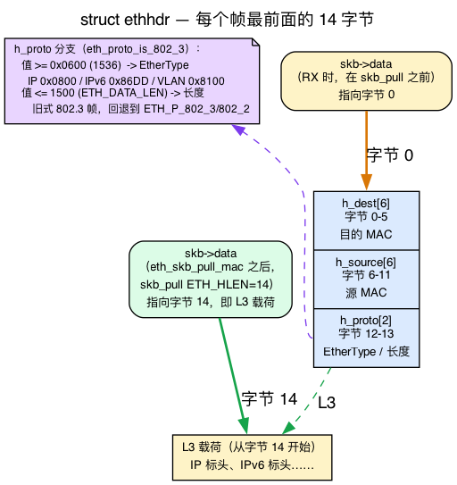
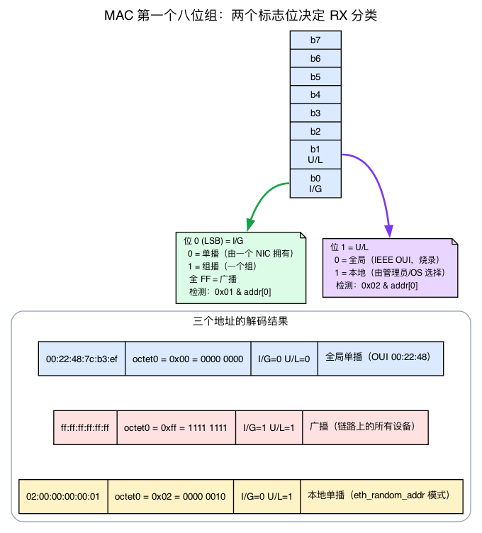
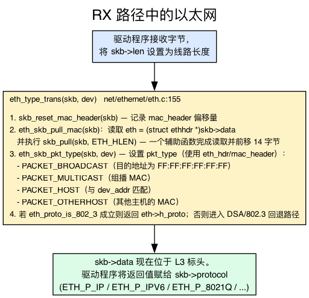
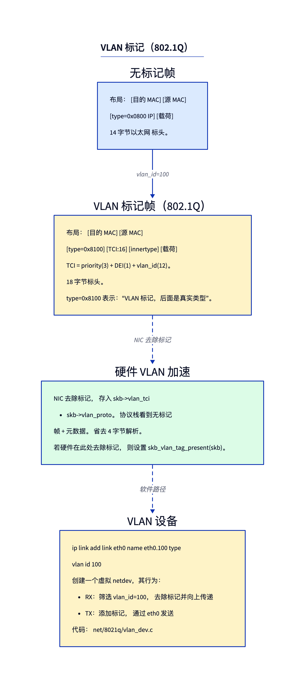
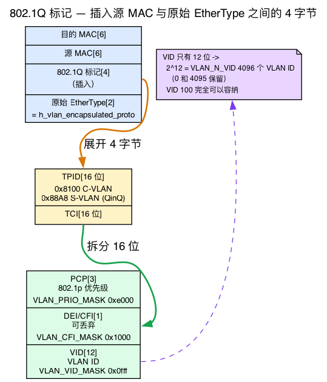
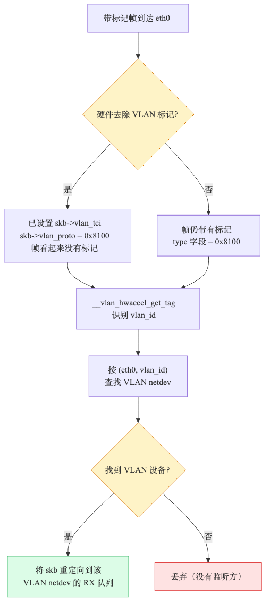

# 第6天 — 以太网、VLAN 与 L2 层

> **今日任务：**观察 `eth_type_trans` 如何处理每个接收到的数据包，并掌握它背后四项不可或缺的线路格式知识：以太网头部布局、MAC 地址的位语义、网络字节序和 802.1Q 标签内部结构，从而看懂沿途出现的每个常量。然后创建 VLAN 设备，观察标签如何出现和消失。总用时：约 110 分钟。

> **第二阶段从这里开始。**第 6～12 天将详细讲解 L2/L3 层：以太网、ARP、IP 路由、IPv6、网桥和隧道。

## Linux 中的 L2 是什么

Linux 中的“第 2 层”代码规模不大，却无处不在。每个接收帧都会经过它；每个发送帧的以太网头部也都在这里构建。其实现主要位于 **`net/ethernet/eth.c`**（约 640 行）。

这一层最重要的函数是 `eth_type_trans`——每个以太网驱动在每次 RX 时都会调用它。第2天结束时，你曾在 RX 路径的第 2 阶段看到驱动调用它：它设置 `skb->protocol`，该值随后成为核心协议栈用于哈希、选择 `ip_rcv` 的多路分发键。今天我们来拆解它。

但 `eth_type_trans` 解析的是线路上的原始字节；要准确读懂它，必须先弄清这些字节的含义。因此，走读函数前先用三个简短的背景小节介绍以太网头部、MAC 地址中的标志位和字节序：先建立直觉，再看具体的 v7.1 结构体。有了这些基础，函数逻辑便一目了然。第四项线路格式知识——802.1Q VLAN 标签（背景 4）——安排在函数之后的 VLAN 一节，因为带标签的帧正是在这里交给专门的 VLAN 子系统。

> 今天会直接用到第1天的一项关键知识，这里**不再**重复讲解：
> - **skb 的四个指针**（`head ≤ data ≤ tail ≤ end`）以及 **`skb_pull`/`skb_push`。** 回想第1天：`skb->data` 指向当前头部视图的第一个有效字节，`skb_pull(skb, n)` 则把 `data` 向前移动 `n` 字节，剥掉已经处理完的头部。`eth_type_trans` 恰好执行一次 14 字节的 `skb_pull`；“越过以太网头部”的技巧仅此而已。

---

## 背景 1：以太网头部的 14 个字节

`eth_type_trans` 要开始工作，首先必须知道接收帧开头几个字节的含义。在以太网上，每一帧都以固定的 **14 字节头部**开头；这个头部非常简单，只有三个连续字段，既没有选项，长度也不会变化。

`struct ethhdr` 正是这个头部（`include/uapi/linux/if_ether.h:177-181`）：

```c
struct ethhdr {
    unsigned char   h_dest[ETH_ALEN];   /* destination eth addr  */
    unsigned char   h_source[ETH_ALEN]; /* source ether addr     */
    __be16          h_proto;            /* packet type ID field  */
} __attribute__((packed));
```

其中 `ETH_ALEN 6`（`if_ether.h:32`），`ETH_HLEN 14`（`if_ether.h:34`）。把它画成字节标尺：



- **字节 0～5：`h_dest`**——目标 MAC（这个帧是发给*谁*的）。
- **字节 6～11：`h_source`**——源 MAC（是谁*发送*了它）。
- **字节 12～13：`h_proto`**——2 字节的 EtherType（里面装的*是什么*）。

6 + 6 + 2 = **14 = `ETH_HLEN`**。这正是 `skb_pull` 向前移动的字节数。帧到达时，驱动已将 `skb->data` 放在字节 0（`h_dest` 的起点）上。`eth_type_trans` 执行 `skb_pull(skb, ETH_HLEN)` 后，`skb->data` 恰好落在字节 14——L3 头部（通常是 IP 头部）的第一个字节。无需解析，也无需计算长度：以太网头部大小固定，因此一次固定长度的 pull 就能剥掉它。这就是执行该操作的辅助函数 `eth_skb_pull_mac` 如此简短的原因（`etherdevice.h:640-645`）：

```c
static inline struct ethhdr *eth_skb_pull_mac(struct sk_buff *skb)
{
    struct ethhdr *eth = (struct ethhdr *)skb->data;  /* read the 14 bytes */
    skb_pull_inline(skb, ETH_HLEN);                   /* then step past them */
    return eth;
}
```

### EtherType 有时是长度

这里有一个例外。出于历史原因，2 字节的 `h_proto` 字段被**复用**了：

- 如果值 **≥ 0x0600 (1536)**，它就是真正的**协议类型**——即“Ethernet II”成帧格式。例如：`ETH_P_IP` 0x0800（`if_ether.h:52`）、`ETH_P_IPV6` 0x86DD（`:74`）、`ETH_P_ARP` 0x0806（`:54`）、`ETH_P_8021Q` 0x8100（`:71`，VLAN）、`ETH_P_8021AD` 0x88A8（`:93`，QinQ）。
- 如果值 **≤ 1500**，它表示的是**帧长度**而非类型——这是原始 IEEE 802.3 成帧格式，其中协议由载荷*内部*的 LLC 头部标识。

两种解释以常量 `ETH_P_802_3_MIN 0x0600`（`if_ether.h:127`）为界；其注释明确说明：*“以太网类型值大于该值时，帧采用 Ethernet II 格式，否则采用 802.3 格式。”*内核通过 `eth_proto_is_802_3()`（`etherdevice.h:220`）判断属于哪种情况。因此，在函数末尾，`eth_type_trans` 只有在 `if (eth_proto_is_802_3(...))` 成立时才返回 `eth->h_proto`；否则会退回到一个表示“该字段其实是长度”的占位协议 ID。本章稍后所说的“`h_proto` 是长度字段（< 1536）”并非神秘规则，只是 < 1536 / ≥ 0x0600 这条分界的具体体现。

---

## 背景 2：MAC 地址究竟编码了什么

`eth_type_trans` 通过查看目标 MAC（`h_dest`）来分类每个帧：它是发给*我们*、发给*所有人*、发给*某个组*，还是发给*其他人*？要理解这一点——以及为什么稍后的实验要构造地址 `02:00:00:00:00:01`——你需要知道，MAC 地址并非只是六个随机字节。**第一个八位组**中的两个位具有特殊含义。

MAC 地址是 **48 位 / 6 个八位组**。**第一个八位组**的两个最低有效位很特别：



- **位 0——I/G（Individual/Group）：**`0` = 单播（该帧发给*一块* NIC）；`1` = 组播/群组（发给*一组* NIC）。
- **位 1——U/L（Universal/Local）：**`0` = 全局唯一、由厂商烧录（前 3 个八位组是厂商的 OUI）；`1` = 本地管理，即由软件分配。

内核用最简单的测试读取“组播位”——`is_multicast_ether_addr()` 实际上就是 `0x01 & addr[0]`（`etherdevice.h:130`）。这一个位就是本章反复提及的组播位。而 `is_local_ether_addr()` 是 `0x02 & addr[0]`（U/L 位，`etherdevice.h:163`）。

**广播是组播的一种特殊情况。**广播地址 `ff:ff:ff:ff:ff:ff` 的每个位都是 1——包括位 0——所以它*确实*是一个组播地址，只不过是全 1 的那个。`is_broadcast_ether_addr()` 检查全部六个八位组是否都等于 `0xff`（`etherdevice.h:176`）。这正是分类器先检查组播，再问“它具体是不是广播地址”的原因。观察 `eth_skb_pkt_type()` 如何执行（`etherdevice.h:623-638`）：

```c
static inline void eth_skb_pkt_type(struct sk_buff *skb,
                                    const struct net_device *dev)
{
    const struct ethhdr *eth = eth_hdr(skb);

    if (unlikely(!ether_addr_equal_64bits(eth->h_dest, dev->dev_addr))) {  /* not us */
        if (unlikely(is_multicast_ether_addr_64bits(eth->h_dest))) {      /* group bit set? */
            if (ether_addr_equal_64bits(eth->h_dest, dev->broadcast))
                skb->pkt_type = PACKET_BROADCAST;   /* the all-ones one */
            else
                skb->pkt_type = PACKET_MULTICAST;   /* some other group */
        } else {
            skb->pkt_type = PACKET_OTHERHOST;       /* unicast, but not our MAC */
        }
    }
    /* else: leaves the default PACKET_HOST — dst == our dev_addr */
}
```

四种结果对应 `pkt_type` 常量（`include/uapi/linux/if_packet.h:26-29`）：`PACKET_HOST 0`、`PACKET_BROADCAST 1`、`PACKET_MULTICAST 2`、`PACKET_OTHERHOST 3`。注意，该函数只有在目标**不是**本设备的 `dev_addr` 时才*设置*值；skb 的默认 `pkt_type` 已经是 `PACKET_HOST`，因此“发给我们”的情况无需赋值。

### 为什么 `02:00:00:00:00:01` 是典型的“可安全构造”MAC

现在，实验中的神秘常量就能自行解释了。第一个八位组 `0x02` 的二进制是 `0000 0010`：

- **位 0 = 0** → 单播。配置了此地址的 NIC 会把发给它的帧视为 `PACKET_HOST`（我们）。
- **位 1 = 1** → 本地管理。按照定义，它不会与任何厂商的全局唯一 OUI 冲突。

因此，`02:00:...:01` 可以保证：（a）它是普通单播地址；（b）绝不会与真实硬件冲突。正因如此，它是临时接口最常用的示例地址——“设置非默认 MAC”实验也会采用它。

---

## 背景 3：网络字节序与 `__be16` 类型

阅读 `eth_type_trans` 之前还必须了解一件事，它也是今天的 bpftrace 实验打印出一个“看起来不对”的数字的陷阱：**字节序**。

像 `h_proto` 这样的 2 字节字段容纳一个 16 位数字，而这两个字节在内存中有两种排列方式：

- **大端序**（“网络字节序”）：最高有效字节在前。值 `0x0800` 存储为字节 `08 00`。
- **小端序：**最低有效字节在前。同一个值 `0x0800` 存储为 `00 08`。

**线路上始终使用大端序。**每个多字节协议字段——EtherType、IP 地址、端口号——都以最高有效字节优先的顺序传输。但 **x86 和 ARM 主机使用小端序。**因此，如果取出线路上的两个原始字节 `08 00`，再把它们作为主机 `u16` 读取，CPU 会按*自己的*顺序解释，得到 `0x0008` 而不是 `0x0800`：

| 线路上（大端序） | 作为主机 `u16` 原样读取（小端 x86） | 经过 `ntohs()` 后 |
|---|---|---|
| 字节 `08 00` | `0x0008` | `0x0800` = `ETH_P_IP` |

这张表就是今天实验对 IP 帧打印 `type=0x0008` 的*完整*解释。字节没有错；只是读取顺序错了。

**`__be16` / `__be32`** 是内核用于标注大端值的注解（由 `sparse` 静态分析器检查）。看到 `__be16 h_proto` 时，它是在提醒你：*在把它转换成本机整数前，不要对它做算术或比较。*转换辅助函数是：

- `ntohs()` / `ntohl()`——**n**etwork-**to**-**h**ost，线路 → 主机（16 位 / 32 位）。
- `htons()` / `htonl()`——**h**ost-**to**-**n**etwork，主机 → 线路。

### 串起第2天知识的细节

这里有一点值得牢记。`eth_type_trans` 返回的 `h_proto` 是 **`__be16`，没有交换字节**——`return eth->h_proto;` 位于 `net/ethernet/eth.c:177`，函数签名的返回类型也是 `__be16`（`eth.c:155`）。驱动把这个仍为大端序的值直接存入 `skb->protocol`。所以 **`skb->protocol` 从头到尾都保持网络字节序。**

最终在哪里发生交换？就在第2天介绍的 L3 多路分发处。处理程序用 `htons(pt->type)` 注册其 EtherType 对应的桶（注册辅助函数 `ptype_head()`，位于 `net/core/dev.c:608`）；RX 时，`__netif_receive_skb_core` 使用 `ntohs()` 索引同一张哈希表——`ptype_base[ntohs(type) & PTYPE_HASH_MASK]`，其中 `type = skb->protocol`（`net/core/dev.c:6147`，`type` 从 `skb->protocol` 赋值的位置在 `:6142`）。注册和多路分发采用相同方式哈希。回想第2天——这就是 `skb->protocol`（大端序）如何与已注册处理程序匹配并到达 `ip_rcv`。所以 RX 路径上没有任何地方会对 `skb->protocol` 本身做字节交换；比较是在网络字节序下完成的。这也正是 bpftrace 中原始的 `%04x` 打印显示交换后数值的原因：你看到的是如实、未经交换的线路字节。

实用判断方法：原样打印线路字段时，如果结果看起来发生了字节交换，就**查看末尾两个十六进制数字**，或者在 bpftrace 中用 `bswap()` 包裹该字段。

---

## `eth_type_trans`——通用 RX 头部解析器



现在这个函数读起来很清楚了。`eth_type_trans(skb, dev)`（`net/ethernet/eth.c:155`）紧接着完成四件事：

1. **`skb_reset_mac_header(skb)`**——通过记录 `skb->data` 在缓冲区内的偏移（`skb->data - skb->head`），保存以太网头部所在位置；此时它就在 `skb->data` 处（背景 1：字节 0，即 `h_dest` 的起点）。
2. **通过一个辅助函数同时读取头部并向前移动——`eth_skb_pull_mac(skb)`。**这一次调用既读取 `eth = (struct ethhdr *)skb->data`（背景 1 中的三字段头部），**又**执行 `skb_pull(skb, ETH_HLEN)`，让 `skb->data` 越过 14 字节头部。这一步结束时，`skb->data` 已经指向 L3 载荷；读取头部和向前移动并非两个独立阶段。
3. 根据目标 MAC **设置 `skb->pkt_type`**（在向前移动*之后*调用 `eth_skb_pkt_type`）——采用的正是背景 2 中先判断组播、再区分广播和其他主机的逻辑。尽管头部刚刚被越过，这个判断仍然有效：`eth_skb_pkt_type` 通过 `eth_hdr(skb)` 查找头部，后者使用第 1 步记录的 `mac_header` 偏移，而不是 `skb->data`。
   - `PACKET_BROADCAST`：目标为 `ff:ff:ff:ff:ff:ff`。
   - `PACKET_MULTICAST`：设置了组播位（`addr[0] & 1`）。
   - `PACKET_OTHERHOST`：目标是单播，但不匹配 `dev->dev_addr`（普通 NIC 会丢弃；混杂模式会保留）。否则保留默认的 `PACKET_HOST`，表示目标匹配 `dev_addr`（我们）。
4. **返回协议 ID**——通常是 `eth->h_proto`（`ETH_P_IP` 0x0800、`ETH_P_IPV6` 0x86DD 或 `ETH_P_8021Q` 0x8100，即 VLAN），但只在 `if (eth_proto_is_802_3(...))` 时如此——也就是背景 1 中 ≥ 0x0600 / < 1536 的分界。在此之前有两个短路分支：如果设备使用 DSA 标签（Distributed Switch Architecture，嵌入式交换机会在帧前加上自己的标签），它不查看数据包就返回 `ETH_P_XDSA`（0x00F8）；如果 `h_proto` 是长度字段（< 1536，即低于 `ETH_P_802_3_MIN` 0x0600），则退回到 `ETH_P_802_3`（IPX 魔数）或 `ETH_P_802_2`（802.2 LLC）。返回值为 `__be16`，**不会**交换字节（背景 3）。

驱动把返回值赋给 `skb->protocol`，然后将 skb 交给 GRO / `netif_receive_skb`（回想第2天的 RX 路径）。从这里开始，L3 分发器使用 `skb->protocol` 查找正确的处理程序（IP 对应 `ip_rcv`）——按背景 3 所述通过 `ntohs()` 对其进行哈希。

## 背景 4：802.1Q VLAN 标签

到目前为止，每个帧都是 14 字节头部加上载荷。**VLAN 标签**会在该头部中插入额外 4 个字节，以标明这个帧属于哪个虚拟 LAN。下面分解这 4 个字节——它们正是 `skb->vlan_tci` 和“VLAN ID 100”存在的原因。



完整的 802.1Q 标签为 **4 字节**（`VLAN_HLEN 4`，`if_vlan.h:16`），插在源 MAC 和 EtherType 字段*之间*。它分为两半：

- 一个 2 字节的 **TPID**（Tag Protocol IDentifier）——802.1Q 为 `0x8100`，堆叠式 802.1ad/QinQ 的*外层*标签则为 `0x88A8`。TPID 位于 EtherType 通常所在的位置，因此 NIC 能据此知道后面还有一个标签。
- 一个 2 字节的 **TCI**（Tag Control Information）——实际的标签，分解见下文。

原来的 EtherType（例如 IP 的 `0x0800`）移到标签*之后*。具体的结构体清楚展示了这种布局（`if_vlan.h:48-55`）：

```c
struct vlan_ethhdr {
    unsigned char   h_dest[ETH_ALEN];        /* bytes  0–5  */
    unsigned char   h_source[ETH_ALEN];      /* bytes  6–11 */
    __be16          h_vlan_proto;            /* bytes 12–13: TPID, 0x8100   */
    __be16          h_vlan_TCI;              /* bytes 14–15: TCI            */
    __be16          h_vlan_encapsulated_proto; /* bytes 16–17: inner type   */
};
```

（`struct vlan_hdr` 位于 `if_vlan.h:35-38`，只有 TCI 加内层 ethertype——即 TPID 后面的两个 `__be16`，而不是完整的 4 字节标签。）

### 分解 16 位 TCI

TCI 把三个子字段装进 16 位：



- **位 15～13（最高 3 位）：PCP**——Priority Code Point，即 802.1p 服务类别（0～7）。掩码 `VLAN_PRIO_MASK 0xe000`，移位量 `VLAN_PRIO_SHIFT 13`。
- **位 12：DEI/CFI**——Drop Eligible Indicator（旧称 Canonical Format Indicator）。掩码 `VLAN_CFI_MASK 0x1000`。
- **位 11～0（最低 12 位）：VID**——VLAN ID。掩码 `VLAN_VID_MASK 0x0fff`。

（四个常量都位于 `if_vlan.h:73-77`。）12 位可提供 `VLAN_N_VID 4096` 个 ID（0 和 4095 保留，因此有 **4094 个可用**——实验上限由此而来）。VID 就是实验使用的“VLAN ID 100”。

现代 NIC 在硬件中剥离标签（HW 加速）时，会把 TCI 存入 `skb->vlan_tci`，把 TPID 存入 `skb->vlan_proto`。二者复用同一个 `u32`，便于快速判断标签是否存在（`include/linux/skbuff.h:1052-1055`）：

```c
union {
    u32       vlan_all;        /* test this for "any tag present?" */
    struct {
        __be16 vlan_proto;     /* the TPID  */
        __u16  vlan_tci;       /* the TCI   */
    };
};
```

这就是为什么 `skb_vlan_tag_present(skb)` 实际上就是 `!!skb->vlan_all`（`if_vlan.h:82`）：任一半非零就表示有标签。访问器则完全按照位图所示拆分 TCI——`skb_vlan_tag_get_id(skb)` 是 `vlan_tci & VLAN_VID_MASK`（`if_vlan.h:84`），`skb_vlan_tag_get_prio` 移位取出 PCP，`skb_vlan_tag_get_cfi` 测试 DEI 位。

内核以两种方式处理 VLAN：

1. **HW 加速**——即上文所述的 `vlan_all` 联合体路径（NIC 在 RX 时剥离标签，协议栈看到无标签帧加元数据，并通过 `skb_vlan_tag_present` 测试）。在 TX 时，内核把可能不带标签的 skb 交给 NIC，NIC 按要求添加标签。

2. **软件路径**——对于不支持 HW VLAN 的 NIC 或堆叠 VLAN（QinQ），`vlan_do_receive`（位于 `net/8021q/vlan_core.c`）会解析标签并分发。

**VLAN 设备**（`eth0.100`）是一种按 VLAN ID 过滤帧的虚拟 netdev：

```bash
sudo ip link add link eth0 name eth0.100 type vlan id 100
sudo ip link set eth0.100 up
sudo ip addr add 192.168.100.5/24 dev eth0.100
```

此时，`eth0.100` 已是功能完备的接口，拥有自己的路由、MTU 和 IP。带 VLAN ID 100、从 `eth0` 到达的帧会转入 `eth0.100` 的 RX 路径；通过 `eth0.100` 发送的帧则会加上标签，再经 `eth0` 发出。这个重定向由 `vlan_do_receive()`（`net/8021q/vlan_core.c:10`）完成：它通过 `skb_vlan_tag_get_id(skb)`（即位图中的 `& VLAN_VID_MASK`）读取 VID，再调用 `vlan_find_dev(skb->dev, vlan_proto, vlan_id)` 查找匹配设备。如果已为该（接口，VID）组合注册设备，帧就会转交给它；否则查找返回 `NULL`，`vlan_do_receive` 返回 false（检查题考查的正是这一点）。



> ### 常见疑问
>
> **问：`skb->protocol` 与类型字段有什么区别？**
>
> 答：它们来自同一个来源（`eth->h_proto`），但协议栈使用 `skb->protocol` 进行分发。对于带 VLAN 标签的帧，内核处理完标签后，会把 `skb->protocol` 设为*内层*类型（`h_vlan_encapsulated_proto`）。因此，一个 VLAN 上承载 TCP 的帧经过 VLAN 处理后，最终会有 `skb->protocol = ETH_P_IP`。（二者都以大端序存储——见背景 3。）
>
> **问：可以在 VLAN 中再放一个 VLAN 吗？**
>
> 答：可以，而且有两种形式。最简单的是普通的 **802.1Q-in-802.1Q 双重标签**，外层和内层标签都使用 TPID 0x8100：`ip link add link eth0.100 name eth0.100.200 type vlan id 200` 会在第一个标签上再堆叠一个采用默认协议（0x8100）的标签。真正的 **QinQ（802.1ad）**则使用 0x88a8 的*外层* S-tag 和 0x8100 的内层标签——但必须显式请求该协议，因为 VLAN netlink 默认使用 802.1Q（0x8100）。先用 `type vlan proto 802.1ad id 100` 创建外层设备，再用 `type vlan proto 802.1q id 200` 堆叠内层设备。上面的简单命令**不会**产生 0x88a8 的外层标签。
>
> **问：内核如何为出站帧选择源 MAC？**
>
> 答：取自出站设备的 `dev->dev_addr`。现代 NIC 允许在启动时使用随机 MAC（systemd-networkd 通过 `MACAddressPolicy=random` 提供隐私保护）——而随机生成的 MAC 总会设置本地管理位（背景 2），因此不会与厂商 OUI 冲突。以太网头部在 `dev_hard_header` → `eth_header`（`net/ethernet/eth.c`）中构建。

## 今日实验

### 观察 `eth_type_trans` 的实际运行

```bash
sudo bpftrace -e '
fentry:eth_type_trans {
  $eth = (struct ethhdr *)args->skb->data;
  printf("dst=%02x:%02x:%02x:%02x:%02x:%02x type=0x%04x\n",
         $eth->h_dest[0], $eth->h_dest[1], $eth->h_dest[2],
         $eth->h_dest[3], $eth->h_dest[4], $eth->h_dest[5], $eth->h_proto);
}' &
sleep 3                 # let the fentry BTF probe attach before we trigger traffic
ping -c 5 8.8.8.8
sleep 1                 # let the last frames drain through the probe
sudo killall bpftrace
```

`sleep 3` 很重要：BTF `fentry` 探针需要一两秒才能挂载，而一次 `ping -c 1` 几百毫秒就会完成——如果没有这段延迟，触发和终止都会发生在探针生效之前，你将看不到任何内容。`eth_type_trans` 会在*每一个*接收帧上触发，因此只要探针运行几秒，即使不考虑 ping，也会得到输出：

```
dst=00:22:48:7c:ffffffb3:ffffffef type=0x0008
dst=00:22:48:7c:ffffffb3:ffffffef type=0x0008
dst=00:22:48:7c:ffffffb3:ffffffef type=0x0008
```

你会看到真实的 MAC 地址和 EtherType 不断流过，而且背景章节中的两个陷阱会同时出现：

- **MAC 八位组**按有符号字节打印，因此 ≥ 0x80 的值会被符号扩展成 `ffffffb3`——读取最低两个十六进制数字（`b3`）即可。（这是 bpftrace 的打印特性，与背景 2 中的位语义无关。）
- **类型发生了字节交换。**`h_proto` 是 `__be16`（线路上采用大端序，见背景 3），因此在小端主机上，原始 `%04x` 会把 IP 显示为 `0x0008` 而不是 `0x0800`。在头脑中交换字节，或者用 `bswap()` 包裹该字段。

### 创建 VLAN 并观察流量

```bash
sudo ip link add link eth0 name eth0.100 type vlan id 100
sudo ip link set eth0.100 up
sudo ip addr add 10.100.0.1/24 dev eth0.100

# verify
ip -d link show eth0.100   # see vlan_id 100, vlan_protocol 802.1Q

# capture both:
sudo tcpdump -i eth0 -e -n vlan 100 &
sudo tcpdump -i eth0.100 -n &
sleep 1

# trigger: no peer answers, but the ARP request for 10.100.0.2
# egresses eth0 tagged with VID 100 (and untagged on eth0.100)
ping -c 3 -W1 10.100.0.2
sleep 1
```

你应该能看到*同一个*帧两次——在 `eth0` 上，它带有 `-e` 展示的 802.1Q 标签（`vlan 100, p 0, ethertype ARP ...`）；在 `eth0.100` 上，它已经被剥离标签。`vlan 100, p 0` 是解码后的 TCI：VID 100、PCP 0（背景 4 中的 TCI 位字段）。这种并排对照正是 VLAN 设备在出站时插入标签、入站时移除标签的体现。ping 不会收到回复（10.100.0.2 上没有主机）——没关系；重点是带标签的 ARP 请求。

```bash
# cleanup
sudo pkill tcpdump            # stop both backgrounded captures (and drop promisc mode)
sudo ip link del eth0.100     # also removes the 10.100.0.1/24 address
```

### 查看 pkt_type 统计

```bash
sudo bpftrace -e '
fexit:eth_type_trans {
  @pkt_types[args->skb->pkt_type] = count();
}
interval:s:5 { exit(); }'
```

PACKET_HOST=0、BROADCAST=1、MULTICAST=2、OTHERHOST=3（背景 2 中的常量）。我们挂载在 `fexit`（函数返回）而非 `fentry` 上：`eth_type_trans` 正是*设置* `pkt_type`（通过 `eth_skb_pkt_type`）的函数，因此函数入口处该字段仍保留原值（通常是 0）。函数返回时赋值已经完成。`fexit` 也通过 `args->` 暴露输入参数，这一点与 `fentry` 相同。

## 故障实验

### 切换混杂模式

```bash
sudo ip link set eth0 promisc on

# re-run the "See pkt_type stats" trace above while generating traffic

sudo ip link set eth0 promisc off   # restore
```

现在，内核会处理那些并非发给你的 MAC 的数据包（此时 `pkt_type == PACKET_OTHERHOST`——目标不匹配 `dev_addr` 的单播帧，见背景 2）。`tcpdump` 会隐式启用该模式。

> **注意：**在镜像/SPAN 端口、集线器或共享网段上，你会看到 `@pkt_types[3]`（PACKET_OTHERHOST）出现。在普通交换链路或云 vNIC 上，交换机根本不会把其他主机的单播流量送到你的端口，因此即使打开混杂模式，键 3 也可能一直为 0——这是正常现象，不是错误。操作结束后务必执行 `promisc off`，不要让 NIC 留在混杂模式。

### 设置非默认 MAC

> **警告：**不要更改承载 SSH 会话的接口 MAC。`eth0` 通常是云主机或测试 VM 的管理接口——更改其 MAC（或为此关闭链路）会中断连接，而且许多驱动会拒绝在链路开启时更改地址。请改用临时接口：

```bash
# Option A (safe): a dummy interface, so you never touch the SSH link.
sudo ip link add mac-test type dummy
sudo ip link set mac-test address 02:00:00:00:00:01
ip link show mac-test            # observe the new MAC
sudo ip link delete mac-test     # cleanup

# Option B: a real spare NIC (NOT the one carrying SSH).
IF=eth1                          # NOT your SSH interface; eth1 is illustrative —
                                 # substitute an actual spare NIC present on your box
orig=$(cat /sys/class/net/$IF/address)
sudo ip link set $IF down
sudo ip link set $IF address 02:00:00:00:00:01
sudo ip link set $IF up
ip link show $IF                 # confirm; re-run the eth_type_trans trace
sudo ip link set $IF down
sudo ip link set $IF address "$orig"   # restore the original MAC
sudo ip link set $IF up
```

我们有意选择 `02:00:00:00:00:01`（背景 2）：第一个八位组 `0x02` 的单播位为 0，本地管理位为 1，因此它必然会被视为普通单播地址，也不会与任何厂商烧录的 OUI 冲突。此时，`eth_type_trans` 会把 `02:00:00:00:00:01` 识别为“本机”——发往该地址的帧属于 PACKET_HOST。这很适合用来测试地址身份判断。

---

## 内核源码阅读指南

- **`net/ethernet/eth.c`**——`eth_type_trans`（第 155 行）、`eth_header`、header_ops。整个文件约 640 行。
- **`include/uapi/linux/if_ether.h`**——`struct ethhdr`（第 177 行）、`ETH_ALEN`/`ETH_HLEN`、`ETH_P_*` EtherType 常量以及 `ETH_P_802_3_MIN`（第 127 行，类型与长度的分界）。
- **`include/linux/etherdevice.h`**——`is_multicast_ether_addr`（第 130 行）、`is_broadcast_ether_addr`（第 176 行）、`eth_proto_is_802_3`（第 220 行）、`eth_skb_pkt_type`（第 623 行）、`eth_skb_pull_mac`（第 640 行）。
- **`include/linux/if_vlan.h`**——`struct vlan_ethhdr`（第 48 行）、TCI 掩码（`VLAN_VID_MASK` 等，第 73～77 行）、`skb_vlan_tag_present`/`skb_vlan_tag_get_id`（第 82～84 行）。
- **`net/8021q/vlan_core.c`**——VLAN 接收路径（`vlan_do_receive`，第 10 行）。
- **`net/8021q/vlan_dev.c`**——VLAN 设备实现。
- **`include/linux/skbuff.h`**——搜索 `vlan_tci`、`vlan_proto`、`vlan_all`（第 1052 行的联合体）。

---

## 要点回顾

- **以太网头部为 14 字节**（`ETH_HLEN`）：`h_dest[6]` + `h_source[6]` + `h_proto[2]`（`struct ethhdr`）。正因为大小固定，`skb_pull(skb, 14)` 才能让 `skb->data` 恰好落在 L3 头部上。
- **EtherType `h_proto` 被复用**：≥ 0x0600 = 真实类型（IP 0x0800、IPv6 0x86DD、ARP 0x0806、VLAN 0x8100）；≤ 1500 = 帧长度（802.3）。分界为 `ETH_P_802_3_MIN 0x0600`，由 `eth_proto_is_802_3()` 判断。
- **MAC 的第一个八位组含两个标志位**：位 0 = I/G（0 单播，1 组播）；位 1 = U/L（0 全局/厂商，1 本地管理）。“组播位”就是 `addr[0] & 1`。广播 `ff:ff:ff:ff:ff:ff` 只是全 1 的组播地址。`02:00:..:01` = 安全的合成单播地址（本地管理 + 非组播）。
- **网络字节序是大端序。**`__be16`/`__be32` 标记线路值；使用 `ntohs`/`htons` 转换。`eth_type_trans` 返回的 `h_proto` **未经交换**，因此 `skb->protocol` 从头到尾保持大端序；多路分发时才执行 `ntohs()`。在小端 x86 上原样打印会把 IP 显示为 `0x0008`。
- **`eth_type_trans`** 是通用 RX 头部解析器；每个以太网驱动都会调用它。它设置 `skb->dev`、`skb->mac_header` 和 `skb->pkt_type`，让 `skb->data` 越过 L2 头部，并**返回** L3 协议 ID（驱动再将其赋给 `skb->protocol`——`eth_type_trans` 自己从不写该字段）。
- `skb->pkt_type`：HOST / BROADCAST / MULTICAST / OTHERHOST。
- **VLAN** = 位于源 MAC 与 EtherType 之间的 4 字节标签（`VLAN_HLEN`）：2 字节 TPID（0x8100，QinQ 则为 0x88a8）+ 2 字节 TCI。**TCI** 分为 PCP[15:13] + DEI[12] + VID[11:0]；12 位 VID → 4094 个可用 ID。
- **HW VLAN 加速**：NIC 剥离标签，内核读取 `skb->vlan_tci`/`vlan_proto`（`vlan_all` 联合体）。`skb_vlan_tag_present` = `!!vlan_all`；`skb_vlan_tag_get_id` = `vlan_tci & VLAN_VID_MASK`。否则走 `net/8021q/` 中的软件路径。
- **VLAN 设备**是按 VLAN ID 过滤并剥离标签的虚拟 netdev；`vlan_do_receive` 通过 `vlan_find_dev` 查找它们。
- TX 侧：`dev_hard_header` → `eth_header` 构建 L2 帧，并使用 `dev->dev_addr` 作为源 MAC。

---

## 检查题

一个带 VLAN 标签 100 的帧到达 eth0，但不存在 `eth0.100` 设备。会发生什么？

<details>
<summary>点击查看答案</summary>

**答案：**`vlan_do_receive()` 通过 `skb_vlan_tag_get_id(skb)`（= `vlan_tci & VLAN_VID_MASK` = 100）读取 VID，再通过 `vlan_find_dev` 查找为（eth0，100）注册的 VLAN 设备；查找不到，于是返回 false（`net/8021q/vlan_core.c:10`，查找在 dev.c:6077 失败）。该帧不会被重定向到 VLAN netdev；`__netif_receive_skb_core` 会把它标记为 `PACKET_OTHERHOST`（`net/core/dev.c:6111`），并通过普通 ptype 分发将它**交给** L3 接收处理程序 `ip_rcv`——但 `ip_rcv`（在 `ip_rcv_core` 中）会立即因为 `pkt_type == PACKET_OTHERHOST` 而丢弃它，并增加 `rx_otherhost_dropped` 核心统计值（通过 `dev_core_stats_rx_otherhost_dropped_inc`，`net/ipv4/ip_input.c:509`）。所以它到达了 L3 入站处，却不会被路由或处理。要接收无标签的“未知 VLAN”流量，应配置支持 VLAN 的网桥，并在端口上启用相应 VID。

</details>

---

## 明天

第7天：ARP 与邻居子系统。了解内核如何学习对端的 MAC 地址，以及邻居条目变为陈旧状态时会发生什么。
