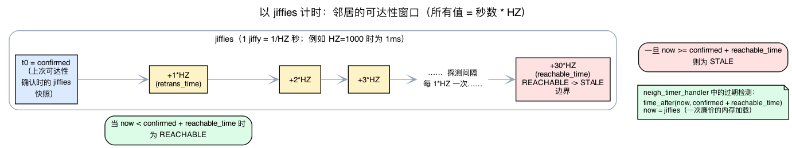
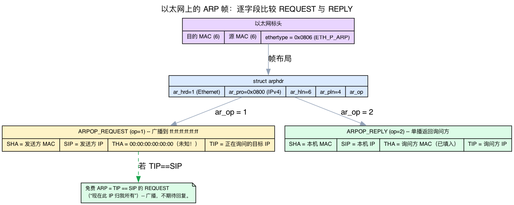
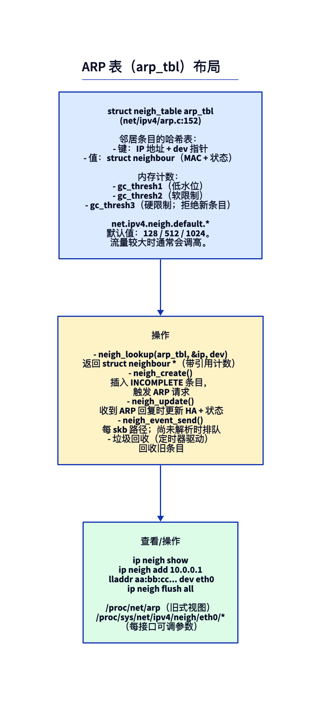
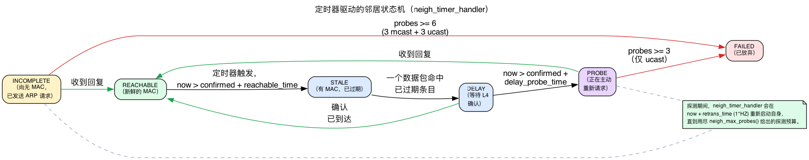
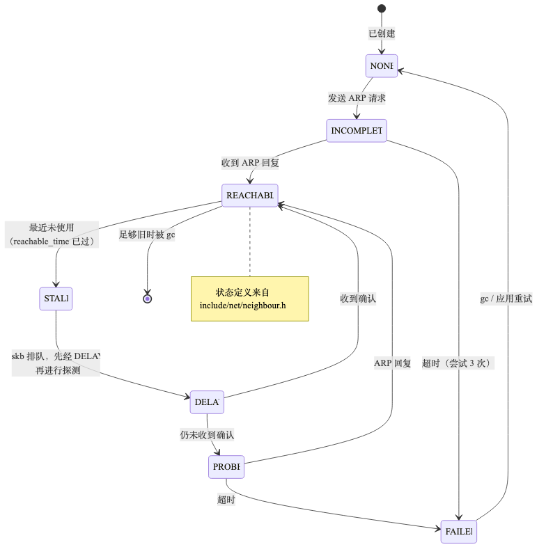
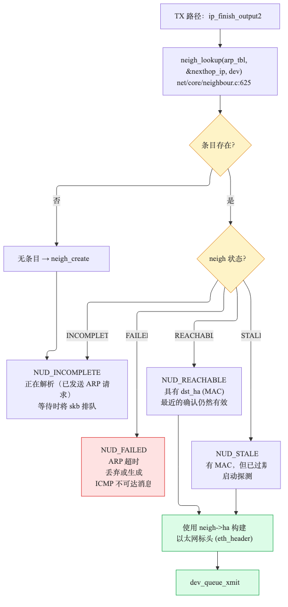
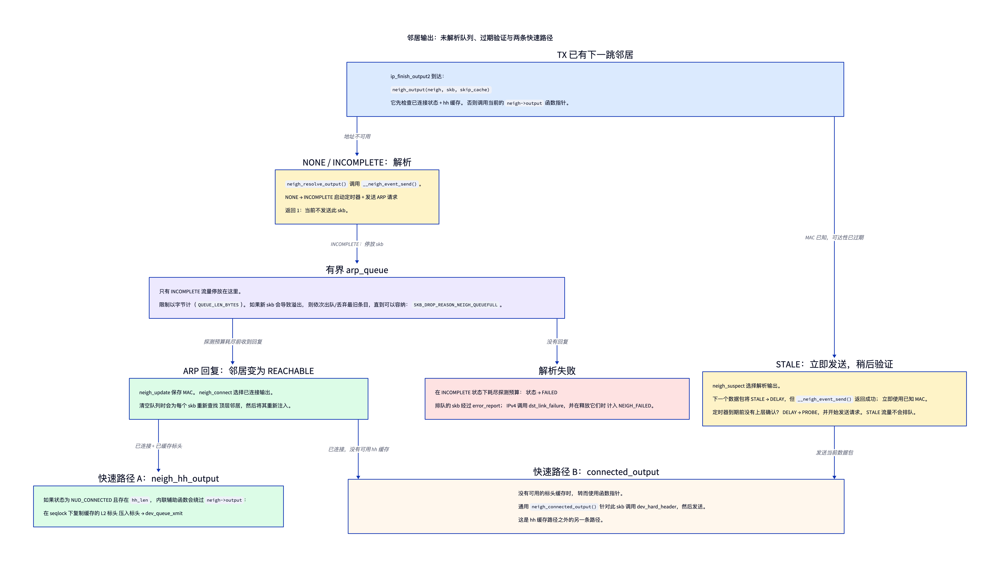

# 第7天 — ARP 与 `neighbour` 子系统

> **今日任务：**了解 Linux 如何获知对端的 MAC 地址、ARP 条目会经历怎样的状态转换，以及规模增大后会出现什么问题；同时掌握理解这套状态机所需的四项背景知识：内核如何表示*时间*、用什么*定时器*推动状态转换、ARP 数据包在线路上的格式，以及看似平坦的“表”如何实现为带哈希和垃圾回收机制的缓存。总用时：约 110 分钟。

## 用一段话解释 ARP

Linux 想把 IP 数据包发送到直连网络上的某个下一跳 IP 时，需要知道目标的 MAC。完成这项工作的协议是 **ARP**（RFC 826）：广播查询、接收回复、缓存结果。`ip neigh` 显示的就是这份缓存。

但 Linux 中的“ARP”是更通用的 **neighbour 子系统**（位于 `net/core/neighbour.c`）的一个具体应用。同一套代码还处理 IPv6 NDP（Neighbour Discovery Protocol）和 InfiniBand IPoIB。L4 协议特有的部分位于 `net/ipv4/arp.c`。

到达的 ARP 帧究竟如何进入这些代码？回想第6天的 `eth_type_trans`：它读取以太网帧的 EtherType 并将其存入 `skb->protocol`，核心协议栈再用该值选择处理程序。ARP 帧携带 **`ETH_P_ARP` = 0x0806**（`include/uapi/linux/if_ether.h:54`），因此会被分发给 `arp_rcv`，而不是 `ip_rcv`（0x0800）。这就是你在 RX 路径上见过的同一个多路分发机制——只是使用了不同的 EtherType 键。

本章大部分内容都与*时间*有关：“REACHABLE 保持 30s”“每 1s 探测一次”“60s 后变陈旧”。所以在开始之前，必须先弄清楚内核所说的一秒是什么意思。

## 背景：jiffies 与 HZ——内核的时间概念

内核不可能在每个数据包上调用 `gettimeofday()`——对于热路径而言，这太昂贵了。它改为维护一个简单、读取成本极低的计数器，由周期性定时器中断按固定频率递增：

- 一个 **jiffy** 是内核周期性定时器中断的一次滴答。
- 全局计数器 **`jiffies`** 在每次滴答时加一。读取它只需一次内存加载——这是内核低成本的单调时钟。
- **`HZ`** 是滴答*频率*（每秒滴答数）。它是编译期常量——`# define HZ CONFIG_HZ`（`include/asm-generic/param.h:8`）——常见值为 100、250 或 1000。在 `HZ=1000` 的内核上，一个 jiffy 为 1 ms；在 `HZ=250` 时则为 4 ms。

关键结论是：**以秒表示的时长等于 `seconds * HZ` 个 jiffies。**所以内核源码写的是 `30 * HZ`、`1 * HZ`、`5 * HZ`，而不是字面上的毫秒数——无论内核用什么 `HZ` 构建，同一个表达式都会得到正确的滴答数。看看 ARP 的默认值（`net/ipv4/arp.c:152`）：

```c
struct neigh_table arp_tbl = {
    .parms = {
        .reachable_time = 30 * HZ,          /* REACHABLE lasts ~30s   */
        .data = {
            [NEIGH_VAR_MCAST_PROBES]   = 3,
            [NEIGH_VAR_UCAST_PROBES]   = 3,
            [NEIGH_VAR_RETRANS_TIME]   = 1 * HZ,   /* probe spacing ~1s */
            [NEIGH_VAR_DELAY_PROBE_TIME] = 5 * HZ, /* DELAY window ~5s  */
            [NEIGH_VAR_GC_STALETIME]   = 60 * HZ,  /* GC after ~60s     */
            /* ... */
        },
    },
    .gc_thresh1 = 128, .gc_thresh2 = 512, .gc_thresh3 = 1024,
};
```

因此，本章说“REACHABLE 保持 30s”或“重传间隔 1s”时，结构体中实际保存的是 `30 * HZ` 和 `1 * HZ` 个 *jiffies*——不是秒，也不是毫秒。

> **30s 是一个*基准值*，而非固定窗口。**`.reachable_time = 30 * HZ` 只是种子：每个条目的实际 `reachable_time` 会由 `neigh_rand_reach_time`（`net/core/neighbour.c:130`）随机化到 `(1/2)*base … (3/2)*base`，即大约 **15～45s**，并定期重新随机化。这是为了避免大量条目在同一个 jiffy 上同时过期。因此，本章通篇的“约 30s”是指“基准 30s，实际 15～45s”。

邻居的时间戳字段同样是 jiffies 快照。在 `struct neighbour`（`include/net/neighbour.h:140`）中：

```c
unsigned long confirmed;   /* neighbour.h:145 — jiffies at last reachability confirmation */
unsigned long updated;     /* neighbour.h:146 — jiffies at last state change            */
```

因此，判断“这个条目是否陈旧”时，内核不会用现实时间做计算，而是进行类似 `time_after(now, confirmed + reachable_time)` 的 jiffy 比较，其中 `now = jiffies`。稍后会在定时器处理程序中看到这一模式。

> **一个让 sysctl 更容易理解的补充。**由于单位是 jiffies，同一个 `.data[]` 槽位会以*两个*名称暴露给用户空间——一个滴答形式和一个 `*_MS` 毫秒别名（例如 `NEIGH_VAR_RETRANS_TIME` 与 `RETRANS_TIME_MS`）。所以 `ip-sysctl.rst` 允许你通过 `retrans_time`（jiffies）或 `retrans_time_ms`（毫秒）读写同一个底层值。



## ARP 线路格式

在缓存 MAC 之前，先看看 ARP 数据包中实际装了什么——否则“请求是广播、回复是单播”和“无偿 ARP”就只是未经解释的断言。ARP 消息由一个很小的固定头部加四个可变长度地址字段组成。固定头部是 `struct arphdr`（`include/uapi/linux/if_arp.h:145`）：

```c
struct arphdr {
    __be16        ar_hrd;   /* hardware type (1 = Ethernet)        */
    __be16        ar_pro;   /* protocol type (0x0800 = IPv4)       */
    unsigned char ar_hln;   /* hardware address length (6 for MAC) */
    unsigned char ar_pln;   /* protocol address length (4 for IPv4)*/
    __be16        ar_op;    /* opcode: request or reply            */
};
/* then, for ARP-over-Ethernet (commented in the header at if_arp.h:156-159): */
/*   ar_sha[6]  sender hardware address (SHA)  */
/*   ar_sip[4]  sender IP address       (SIP)  */
/*   ar_tha[6]  target hardware address (THA)  */
/*   ar_tip[4]  target IP address       (TIP)  */
```

区分两种消息的是**操作码**（`ar_op`）（`include/uapi/linux/if_arp.h:107-108`）：

- **`ARPOP_REQUEST` = 1**——“谁拥有 TIP？请告诉 SIP。”它发往以太网**广播** MAC `ff:ff:ff:ff:ff:ff`，让网段上的每台主机都能看到。发送方填入 SHA + SIP + TIP，并让 **THA = 00:00:00:00:00:00**（它还不知道目标的 MAC——这正是查询的目的）。
- **`ARPOP_REPLY` = 2**——“TIP 位于 THA。”拥有 TIP 的主机将自己的 MAC 填入 THA，并把消息直接**单播**回查询者。

这正是下方实验中 `tcpdump -e` 抓包会显示的内容：一个目标 MAC 为空的广播请求，以及一个目标 MAC 已填入的单播回复。解析发生在 `arp_process`（`net/ipv4/arp.c:702`）中，从 `arp_rcv`（`net/ipv4/arp.c:967`）到达；出站请求/回复则由 `arp_send`（`net/ipv4/arp.c:323`）构建并发送。

从这种布局可以直接理解**无偿 ARP**：它只是一个 **TIP 等于 SIP** 的*请求*。结合这些字段来看，节点是在宣告“我（SIP）现在拥有这个 IP”；由于这是广播请求，其他主机会主动更新缓存，而不必事先发起查询。它不需要回复，目的就是完成这次宣告。



## 邻居表



`struct neigh_table arp_tbl`（`net/ipv4/arp.c:152`）保存所有 IPv4 邻居条目。每个条目都是一个 `struct neighbour`（`include/net/neighbour.h:140`），包含：

- `primary_key`（`neighbour.h:169`）：下一跳 IP 地址——查找键。
- `ha[MAX_ADDR_LEN]`：硬件地址（MAC）。
- `dev`：可经由哪个 netdev 到达该邻居。
- `nud_state`：状态机（REACHABLE、STALE、INCOMPLETE……）。
- `confirmed`/`updated`：jiffies 快照（jiffies 章节中的时间戳）。
- `arp_queue`：等待解析的 skb。

### 它是哈希表，不是链表

我们一直称它为“表”，但它不是一条扁平链表。`arp_tbl.nht`（`include/net/neighbour.h:244`）指向一个 **`struct neigh_hash_table`**（`include/net/neighbour.h:201`）：

```c
struct neigh_hash_table {
    struct hlist_head *hash_heads;   /* array of hash buckets        */
    unsigned int       hash_shift;   /* current size = 1 << shift     */
    __u32              hash_rnd[NEIGH_NUM_HASH_RND]; /* random seeds (=4, anti-collision) */
    struct rcu_head    rcu;
};
```

条目所在的桶由其键（下一跳 IP）与 `dev` 共同哈希决定。每个 `struct neighbour` 通过 `struct hlist_node hash;`（`neighbour.h:141`）链接到桶中。查找——`neigh_lookup`（`net/core/neighbour.c:625`）或快速内联版本 `__neigh_lookup`——会对键进行哈希，然后只遍历**该桶**的 hlist。随着条目数量增长，表会**重新哈希**到更大的尺寸，让链保持较短。这就是为什么拥有数千个对端的网关仍能以近似 O(1) 的成本解析每个下一跳。

有两个细节让热路径既安全又低成本：

- **RCU 读侧。**桶遍历发生在 RCU 读侧保护下——每数据包查找路径上*无需加锁*。（用一句话解释 RCU：读者无锁运行，被移除的对象要等所有并发读者结束后才真正释放，因此，即使另一个 CPU 正在删除对象，查找也能安全持有其指针。）
- **引用计数，通过 RCU 释放。**每个条目都有 `refcount_t refcnt;`（`neighbour.h:148`）和 `struct rcu_head rcu;`（`neighbour.h:166`）。这与第1天学到的 `sk_buff->users` *归零时释放*引用计数规则相同，只是应用到了邻居上：使用条目时持有引用，用完后释放；只有当计数归零且 RCU 确认没有读者仍能看到它时，才回收对象。

## 背景：驱动状态机的定时器

状态图没有展示一个关键事实：状态不会自行改变。每个条目都有一个**内核定时器**，正是它推动邻居从 REACHABLE 变成 STALE，或从 INCOMPLETE 变成 FAILED。

每个 `struct neighbour` 都内嵌了一个（`include/net/neighbour.h:151`）：

```c
struct timer_list timer;
```

**`timer_list`** 是内核最基本的一次性定时器：先用 **jiffies** 指定未来的到期时刻；当 `jiffies` 到达该值时，内核定时器机制便调用预先注册的回调函数。邻居子系统在构造条目时绑定回调函数（`net/core/neighbour.c:534`）：

```c
timer_setup(&n->timer, neigh_timer_handler, 0);
```

> 第5天在销毁 netns 时介绍了*工作队列*——工作会推迟到进程上下文中执行，并且可以睡眠。`timer_list` 是第5天未曾讲解的另一种机制：它的回调在**原子上下文**（softirq 上下文，不可睡眠）中运行，并在**预定的 jiffy** 触发，而不是“等工作线程有空时”再执行。邻居子系统用每条目一个*定时器*管理各自状态，另外再用一个 `delayed_work` 处理整张表的垃圾回收——稍后会看到后者。

定时器触发时，`neigh_timer_handler`（`net/core/neighbour.c:1103`）开始运行。它读取 `now = jiffies`（`neighbour.c:1114`），检查 `nud_state` 和时间常量，然后要么**重新启动定时器**以继续探测，要么**转换条目状态**。源码中的实际转换如下：

- **REACHABLE** → 如果 `now` 已超过 `confirmed + reachable_time`，降级为 **STALE**（如果最近使用过该条目，则为 **DELAY**）。（`neighbour.c:1120-1139`）
- **DELAY** → 如果收到了确认，重新提升为 **REACHABLE**；否则进入 **PROBE** 并开始主动探测。（`neighbour.c:1140-1162`）
- **PROBE / INCOMPLETE** → 在 `now + retrans_time` 重新设定，发送下一次探测——直到探测预算耗尽。

这个预算就是“6 次探测 / 3 次探测”背后缺失的环节。它由 `neigh_max_probes`（`net/core/neighbour.c:1054`）计算：

```c
static __inline__ int neigh_max_probes(struct neighbour *n)
{
    struct neigh_parms *p = n->parms;
    return NEIGH_VAR(p, UCAST_PROBES) + NEIGH_VAR(p, APP_PROBES) +
           (n->nud_state & NUD_PROBE ? NEIGH_VAR(p, MCAST_REPROBES)
                                     : NEIGH_VAR(p, MCAST_PROBES));
}
```

使用 ARP 默认值（`UCAST_PROBES = 3`、`MCAST_PROBES = 3`、`MCAST_REPROBES = 0`、`APP_PROBES = 0`）：

- **INCOMPLETE**（尚未进入 PROBE）：阈值为 `3 + 0 + 3 = 6`。
- **PROBE**（已经有 MAC，正在重新确认）：阈值为 `3 + 0 + 0 = 3`。

但对 INCOMPLETE 而言，*阈值*与*实际发送的数据包数*不同。`__neigh_event_send` 首次将条目推入 INCOMPLETE 时，会把探测计数器**预设**为 `UCAST_PROBES` = 3（`neighbour.c:1224`，`atomic_set(&neigh->probes, UCAST_PROBES)`）。随后，定时器会在每次组播探测时递增计数器，从 3 → 4 → 5 → 6；达到 6 时等于阈值，条目失败。因此，INCOMPLETE 中实际只发送 **3 个组播 ARP 请求**——而且它们*全都是*组播，因为 `arp_solicit` 会计算 `probes -= UCAST_PROBES`（`arp.c:376`），此处结果始终 ≥ 0，因而每次都会进入组播分支。INCOMPLETE 状态下不可能进行单播探测：此时没有可供单播使用的 MAC。（这些 `UCAST_PROBES` 单播探测属于 PROBE 状态下的重新验证，此时条目已经有陈旧的 MAC。）

当 INCOMPLETE 或 PROBE 条目的 `probes >= neigh_max_probes(neigh)` 时，处理程序放弃（`neighbour.c:1164-1169`）：INCOMPLETE → **NUD_FAILED**，PROBE → STALE/FAILED。*这*就是“第一次 ping 多花约 1ms”（条目变成 REACHABLE 前需要一次解析往返）以及“经过探测后 INCOMPLETE → FAILED”背后的定时器驱动机制。



## 状态机



邻居条目会经历以下状态——现在你已经知道，推动转换的是定时器：

- **NONE**——刚创建，尚未尝试解析。
- **INCOMPLETE**——已发送 ARP 请求，正在等待回复。发往该邻居的 skb 会在此排队。
- **REACHABLE**——信息新鲜，最近收到过确认（默认 `reachable_time = 30s`，即 `30 * HZ` 个 jiffies）。
- **STALE**——有 MAC，但已陈旧。下一个数据包会触发确认探测。
- **DELAY**——已发送一个数据包，期望 L4 很快确认可达性。
- **PROBE**——正在通过 ARP 主动探测。
- **FAILED**——解析超时。INCOMPLETE 会以约 1s 的间隔发送约 3 个组播 ARP 请求，然后失败；PROBE 状态下的重新验证（条目已有陈旧 MAC）则最多发送 3 个*单播*探测。（完整推导——为什么预算为 6 却只发送 3 次——见上面的定时器背景章节。）

这个状态机是“为什么第一次 ping 比后续 ping 慢 1ms？”的标准答案——第一个数据包要经历 INCOMPLETE → REACHABLE；后续数据包直接命中缓存条目。

## TX 时查找



### 触发 ARP 的数据包：异步解析、有界队列和两条快速路径



`ip_finish_output2` 不会直接调用 ARP。它会到达内联辅助函数 **`neigh_output(neigh, skb, skip_cache)`**，后者作出两个判断：能否立即使用缓存的 L2 头部；若不能，`neigh->output` 当前指向哪个函数？应顺着状态理解，而不要把这个指针当作整条快速路径：

1. **第一个数据包，没有可用地址。**新的 NUD_NONE 条目有 `neigh->output = neigh->ops->output`；对于普通 ARP，它就是 `neigh_resolve_output`。`neigh_event_send` → `__neigh_event_send` 会把 NONE 改为 INCOMPLETE、设定定时器、发送请求、将传入的 skb 入队，并返回 `1`。因此，`neigh_resolve_output` 不会发送该 skb；TX 会返回，而不会阻塞等待一次 ARP 往返。

2. **只有未解析的数据包才排队。**状态为 INCOMPLETE 时，skb 会暂存在每邻居 `arp_queue` 中。其 `arp_queue_len_bytes` 受 `QUEUE_LEN_BYTES` 限制；如果加入新 skb 会超限，循环就会将**最旧的**条目出队，并以 `SKB_DROP_REASON_NEIGH_QUEUEFULL` 丢弃，直到新 skb 能放得下。因此，一个不可达邻居只能占用固定的内存预算。

3. **回复到达。**`arp_rcv` → `neigh_update` 保存 MAC，并把状态改为 REACHABLE。`neigh_connect` 写入 `neigh->output = neigh->ops->connected_output`，`neigh_update_process_arp_queue` 排空未解析队列。它会在重新注入每个 skb 前重新查找顶层邻居，因为整形器等 qdisc 可能导致使用不同的邻居对象。

4. **已连接输出有两种形式。**在普通调用路径上，`neigh_output()` 首先检查 `NUD_CONNECTED` 与 `hh.hh_len`。如果二者都成立，**`neigh_hh_output()`** 会在序列锁保护下复制缓存的 L2 头部、将其 push 进去，再调用 `dev_queue_xmit`，完全不会调用 `neigh->output`。如果没有可用的头部缓存，该辅助函数会落入函数指针路径；通用的 **`neigh_connected_output()`** 使用 `dev_hard_header` 重新构建头部并发送。`hh_cache` 与 `neigh_connected_output` 是替代关系，而不是合并在一起的一条快速路径。

5. **STALE 可用，并非未解析。**可达性过期后，`neigh_suspect` 会恢复解析输出函数。下一个数据包到达 `neigh_resolve_output`；`__neigh_event_send` 把 STALE 改为 DELAY，但返回成功，所以该数据包会立即使用已知 MAC 发送。如果在 `delay_first_probe_time` 期间没有收到上层确认，定时器会进入 PROBE 并发送请求。处于 STALE 的数据包**不会**进入 `arp_queue`。

如果 INCOMPLETE 探测耗尽预算，`neigh_timer_handler` 会设置 FAILED，`neigh_invalidate` 在清除其余 skb 前通过 `ops->error_report` 移除排队 skb。对于 IPv4，`arp_error_report` 会调用 `dst_link_failure`，并以 `SKB_DROP_REASON_NEIGH_FAILED` 释放 skb；用户实际看到的错误取决于路由/套接字上下文。

这也为后续内容作了铺垫：路由负责选择下一跳，邻居子系统负责解析该下一跳；这种有界且优先淘汰最旧条目的模式，还会在第23天讨论队列时再次出现。

> ### 哪些 IP 实际会被 ARP？直连与经由网关
>
> 下方的 FAILED 实验依赖一个路由事实，规则如下（完整 FIB 见第8天）。**内核只对*下一跳*发起 ARP，而下一跳由路由决定：**
>
> - **直连**子网（链路内）上的目标以*自身为下一跳*——内核直接对它发起 ARP。
> - 位于所有本地子网**之外**的目标需要*经由网关*到达——所以内核对**网关**发起 ARP，绝不会对远端 IP 本身发起 ARP。
>
> “直连”仅仅意味着目标匹配某个接口已配置的子网前缀（例如 `192.168.1.0/24` 位于 `eth0` 上）。这就是第3天提到的、`ip_finish_output2` 交给邻居子系统的同一个下一跳 IP：路由选择下一跳 IP，邻居子系统将它解析为 MAC。邻居表本身也印证了这一点——`arp_tbl` 的 `key_len = 4`，并以 `primary_key`（`neighbour.h:169`）为键，即**每个下一跳 IPv4 地址**一个条目。
>
> 正因如此，“观察 FAILED 状态”实验必须选择你自己子网**内**一个未使用的地址：只有这时目标才是它自己的下一跳，你的数据包才会触发一次真实 ARP，并最终超时变为 FAILED。像 `10.99.99.99` 这样的链路外地址只会解析网关（通常已缓存），绝不会为你输入的地址产生 FAILED 条目。

> ### 常见疑问
>
> **问：什么是“无偿 ARP”？**
>
> 答：节点主动宣告自己的 MAC（例如接口启动或故障转移后）。Linux 会从 `inetdev_send_gratuitous_arp`（位于 `net/ipv4/devinet.c`）调用目标 IP == 源 IP 的 `arp_send(ARPOP_REQUEST, ETH_P_ARP, ...)`。其他节点无须先行查询，就会更新各自缓存。（结合线路格式来看：它是 TIP == SIP 的请求——见 ARP 线路格式章节。）
>
> **问：`arp_announce` 有什么用途？**
>
> 答：这个 sysctl 控制内核在 ARP 请求中使用*哪个* IP 作为源地址。默认值 0（任意本地 IP）；1 优先选择同子网地址；2 始终使用出站接口的主 IP。它对多宿主服务器很重要。
>
> **问：为什么有 gc_thresh1/2/3？**
>
> 答：gc_thresh3 是硬上限；超过它的新 ARP 尝试会失败。高流量网关经常碰到默认值 1024——症状是 dmesg 中出现 `neighbor table overflow!`。可通过 sysctl 调高。（具体机制见下一节。）

## 垃圾回收如何实施 gc_thresh1/2/3

表不能无限增长，因此每次创建条目时都会递增一个每表原子计数器 **`gc_entries`**——而创建流程会在分配前检查三个阈值。创建路径中的检查如下（`net/core/neighbour.c:507`）：

```c
entries = atomic_inc_return(&tbl->gc_entries) - 1;
gc_thresh3 = READ_ONCE(tbl->gc_thresh3);
if (entries >= gc_thresh3 ||
    (entries >= READ_ONCE(tbl->gc_thresh2) &&
     time_after(now, READ_ONCE(tbl->last_flush) + 5 * HZ))) {
    if (!neigh_forced_gc(tbl) && entries >= gc_thresh3) {
        net_info_ratelimited("%s: neighbor table overflow!\n", tbl->id);
        NEIGH_CACHE_STAT_INC(tbl, table_fulls);
        goto out_entries;          /* returns -ENOBUFS */
    }
}
```

这就是完整的三级行为，而且都有源码依据：

- **低于 `gc_thresh1`（128）：**周期性 GC 甚至不会扫描——`neigh_periodic_work` 使用 `if (atomic_read(&tbl->entries) < gc_thresh1) goto out;`（`net/core/neighbour.c:1000`）跳过桶扫描，而 `out:` 路径仍会重新排入 delayed_work，因此工作程序会继续周期性调度自身。（该周期 GC 就是第5天在销毁 netns 时介绍过的、运行于进程上下文中的 `delayed_work`，这里无须重复讲解。）
- **达到/超过 `gc_thresh2`（512）**，并且距离上次刷新超过 5 s（`5 * HZ`）：运行**同步强制 GC** `neigh_forced_gc`（`net/core/neighbour.c:253`），回收陈旧条目，使数量降回 `gc_thresh2` 附近。
- **达到/超过 `gc_thresh3`（1024）：**如果连强制 GC 都无法让数量降到上限以下，创建会以 **`-ENOBUFS` 失败**，并打印限速的 **`"%s: neighbor table overflow!"`**——这正是本章和检查题所描述的 dmesg 症状。

需要分清两件事：

- **数据包并不是*因为*这一步而被丢弃。**内核只是无法*创建邻居条目*；其表现为解析失败/短暂停顿，而不是 GC 层直接扔掉数据包。（这也是检查题答案中“它只会拒绝创建新条目”的依据。）
- **回收以 STALE/旧条目为目标；`NUD_PERMANENT` 条目不受影响**，永远不会被 GC。这就是为什么实验中静态设置的 `nud permanent` 固定条目能在 GC 压力下存活。

## 今日实验

> **开始前：**下列命令以 `eth0` 和网关 `192.168.1.1` 为例。请替换成*你的*接口和默认网关——可从 `ip route show default` 推导二者：
>
> ```bash
> IFACE=$(ip route show default | awk '{print $5; exit}')
> GW=$(ip route show default | awk '{print $3; exit}')
> echo "iface=$IFACE gateway=$GW"
> # iface=eth0 gateway=10.0.0.1
> ```
>
> 如果机器使用 `ens3`/`enp0s3` 接口或不同网关，原样运行会导致 `ip neigh flush dev eth0` 报错“Cannot find device”，`ping 192.168.1.1` 也不会有结果。请使用 `$IFACE`/`$GW`（或你的真实值）替换下文每处 `eth0`/`192.168.1.1`。

### 查看 ARP 表

```bash
ip neigh show
# 192.168.1.1 dev eth0 lladdr aa:bb:cc:11:22:33 REACHABLE
# 192.168.1.20 dev eth0 lladdr aa:bb:cc:44:55:66 STALE
```

### 从零开始触发 ARP

```bash
sudo ip neigh flush dev eth0
ping -c 1 192.168.1.1
ip neigh show
# entry now REACHABLE
```

### 观察 ARP 数据包

```bash
sudo tcpdump -i eth0 -n arp -e &
sudo ip neigh flush dev eth0
ping -c 1 192.168.1.1
sudo pkill tcpdump   # stop the background capture
```

你会看到 ARP 请求（广播）和回复（单播）——现在可以逐字段阅读：请求发往 `ff:ff:ff:ff:ff:ff`，使用 `ARPOP_REQUEST`（操作码 1），目标 MAC 为空；回复以单播返回，使用 `ARPOP_REPLY`（操作码 2），目标 MAC 已填入。`pkill` 不可省略：否则，一个没有计数/超时限制、在后台运行的 `tcpdump` 会永远持续，把链路上后续的每个 ARP 都刷到终端。

### 跟踪邻居状态变化

```bash
sudo bpftrace -e '
fentry:neigh_update {
  printf("update: state=%d new_state=%d\n",
         args->neigh->nud_state, args->new);
}'
```

这些数字是 NUD 位掩码值（`include/uapi/linux/neighbour.h`）：`1`=INCOMPLETE、`2`=REACHABLE、`4`=STALE、`8`=DELAY、`16`=PROBE、`32`=FAILED。在另一个终端中刷新并再次 ping 网关，以触发一次解析。`neigh_update()` 是由**数据包/netlink 驱动**的路径——它只会以 `NUD_STALE`、`NUD_REACHABLE`、`NUD_FAILED` 或用户/ndisc 提供的状态调用，因此这个钩子会捕获到达回复时 INCOMPLETE→REACHABLE 等转换：

```
# update: state=1 new_state=2   (INCOMPLETE -> REACHABLE, ARP reply received)
```

这个钩子**永远不会**显示内部的 `STALE→DELAY`、`DELAY→PROBE` 或超时驱动的 `INCOMPLETE→FAILED` 转换：这些转换是直接执行的 `WRITE_ONCE(neigh->nud_state, ...)` 存储，位于 `__neigh_event_send`（`neighbour.c:1249`）和 `neigh_timer_handler` 内部，根本不会经过 `neigh_update()`。要观察*这些*转换，请在 `neigh_timer_handler` 上挂载 fentry，或直接跟踪 `nud_state` 字段。

这些变化直接对应本章开头的状态机。（如果更想查看原始十六进制值，可将 `%d` 换成 `%x`；这个 `printf` 会显示原始的十六进制 `#define` 值。）

### 检查 gc 阈值

```bash
sysctl net.ipv4.neigh.default.gc_thresh1   # default 128
sysctl net.ipv4.neigh.default.gc_thresh2   # default 512
sysctl net.ipv4.neigh.default.gc_thresh3   # default 1024

# bump for high-fanout servers:
sudo sysctl -w net.ipv4.neigh.default.gc_thresh3=8192

# restore the default when you're done (this change is non-persistent —
# it's lost on reboot and not written to sysctl.conf):
sudo sysctl -w net.ipv4.neigh.default.gc_thresh3=1024
```

这些正是 `arp_tbl`（`net/ipv4/arp.c:152`）中的 `gc_thresh1/2/3` 字段；创建条目时对它们进行的检查会产生 `neighbor table overflow!`。

## 故障实验

### 静态固定错误的 MAC

> **警告：**不要在用于 SSH 的接口上为网关固定错误的 MAC——在你来得及执行撤销命令前，会话就会中断并把你锁在外面。应选择一个非网关的 LAN 对端，或从本地控制台运行。

```bash
sudo ip neigh add 192.168.1.1 lladdr aa:bb:cc:00:00:00 dev eth0 nud permanent
ping -c 3 -W 1 192.168.1.1   # no replies — packets sent to a MAC nobody owns

# undo:
sudo ip neigh del 192.168.1.1 dev eth0
```

这说明在内核重新解析前，缓存就是权威结果。`-c 3 -W 1` 很重要：不带限制的 `ping` 会一直运行，直到按 Ctrl-C；在此之前，`del` 那一行无法执行，条目也会一直处于错误状态。（`nud permanent` 条目同样不受 GC 影响——即使邻居表承受压力，它也会保留到你主动删除为止。）

### 观察 FAILED 状态

要真正观察 INCOMPLETE → FAILED，必须满足两个条件：（a）选择一个*直连*地址——从 `eth0` 子网中选取一个**未使用**的 IP，而不是 `10.99.99.99` 之类的非直连地址（后者会经网关路由，因此内核不会对其发起 ARP——见“直连与经由网关”说明框）；（b）发送真实流量以启动解析。另请注意，`ip neigh add IP dev eth0` 如果不带 `lladdr`/`nud`，现代 iproute2 会直接拒绝（“No link layer address given”），不会创建任何条目。

```bash
# pick an unused IP in your eth0 subnet, e.g. 192.168.1.250
sudo ip neigh flush 192.168.1.250 dev eth0 2>/dev/null
ping -c1 -W1 192.168.1.250 || true   # queues a packet -> kernel starts ARPing
sleep 8                              # past the INCOMPLETE probe budget: counter climbs from its UCAST_PROBES seed (3) to neigh_max_probes()=6, sending 3 multicast probes ~1s apart
ip neigh show 192.168.1.250
# 192.168.1.250 dev eth0  FAILED     (briefly INCOMPLETE first)
sudo ip neigh del 192.168.1.250 dev eth0   # cleanup
```

等待 8 秒并非随意选择：它超过了 INCOMPLETE 探测预算。计数器以 `UCAST_PROBES`（3）为初值，每次组播请求递增一次，所以会以 `retrans_time`（`1 * HZ`）为间隔发送 3 个组播探测（约 3s 的探测），然后 `neigh_max_probes()` = 6 触发，定时器把条目变为 FAILED。八秒留出了充足余量。

---

## 内核源码阅读指南

- **`net/core/neighbour.c`**——通用子系统。阅读 `neigh_lookup`（第 625 行）、`___neigh_create`（第 646 行）、`neigh_update`、`neigh_timer_handler`（第 1103 行——状态机引擎）、`neigh_max_probes`（第 1054 行——探测预算），以及创建时的 GC 检查（第 507～516 行）。
- **`net/ipv4/arp.c`**——ARP 特有协议。`arp_rcv`（第 967 行）、`arp_send`（第 323 行）、`arp_process`（第 702 行）、`arp_solicit` 以及 `arp_tbl`（第 152 行）。约 1500 行。
- **`include/net/neighbour.h`**——`struct neighbour`（第 140 行）、`struct neigh_hash_table`（第 201 行）、`nht` 字段（第 244 行）、NUD_* 状态常量。
- **`include/uapi/linux/if_arp.h`**——`struct arphdr`（第 145 行）、`ARPOP_REQUEST`/`ARPOP_REPLY`（第 107～108 行）。
- **`Documentation/networking/ip-sysctl.rst`**——`neigh.*` sysctl（GC 阈值、探测次数、定时器以及 jiffies 与 `*_ms` 的别名）；请与源码配合阅读。

---

## 要点回顾

- 内核使用 **jiffies** 计时（`jiffies` 在每个定时器滴答时递增一次；每秒 `HZ` 个滴答）。一个时长等于 `seconds * HZ` 个 jiffies——所以源码中有 `30 * HZ`、`1 * HZ`。`neighbour.confirmed`/`updated` 是 jiffies 快照；陈旧判断是一次 `time_after(now, confirmed + reachable_time)` 比较。
- **ARP 数据包**由 `struct arphdr`（硬件/协议类型、长度、操作码）+ SHA/SIP/THA/TIP 构成。`ARPOP_REQUEST`（1）是 THA 为空的广播；`ARPOP_REPLY`（2）是 THA 已填入的单播。**无偿 ARP** = TIP == SIP 的请求。
- 邻居子系统（IPv4 使用 ARP，IPv6 使用 NDP）位于 `net/core/neighbour.c`。“表”是一个**可调整大小、受 RCU 保护的哈希表**（`neigh_hash_table`），以每下一跳 IP 为键；查找无锁遍历一个桶；条目采用引用计数并通过 RCU 释放（与第1天 sk_buff 的归零释放模型相同）。
- **每条目的 `timer_list`** 驱动状态机：`neigh_timer_handler` 重新设定或转换条目。ARP 默认值下，`neigh_max_probes()` 对 INCOMPLETE 为 6、对 PROBE 为 3；但由于计数器被预设为 `UCAST_PROBES`（3），INCOMPLETE 条目在 FAILED 前实际发送 **3 个组播** ARP 请求；3 个单播探测属于对已有（陈旧）MAC 的 PROBE 状态重新验证。
- 条目循环经历 **NONE → INCOMPLETE → REACHABLE → STALE → DELAY → PROBE → REACHABLE/FAILED**。
- 内核只对**下一跳**发起 ARP：链路内目标以自身为下一跳；链路外目标解析**网关**（完整 FIB 见第8天）。
- TX 侧查找是一次**无锁 RCU** 哈希查找——`ip_neigh_for_gw` → `__ipv4_neigh_lookup_noref` 位于 `ip_finish_output2` 中，未命中时退回 `__neigh_create`（导出的 `neigh_lookup` 供 netlink/proc 调用方使用，不是每数据包路径）。邻居处于 INCOMPLETE 时，skb 在 `arp_queue` 上排队。
- **GC 阈值**（`gc_thresh1/2/3`，默认 128/512/1024）通过创建时检查的 `gc_entries` 计数器限制条目数；强制 GC 后仍超过 `gc_thresh3` 会返回 `-ENOBUFS` 并记录 `neighbor table overflow!`。`NUD_PERMANENT` 条目不受 GC 影响。
- 查看：`ip neigh show`。操作：`ip neigh add/del/replace`。

---

## 检查题

你在一台拥有 500 个活跃客户端对端的服务器上设置 `net.ipv4.neigh.default.gc_thresh3=128`。会出现什么症状？

<details>
<summary>点击查看答案</summary>

**答案：**`neighbor table overflow!` 消息会出现在 `dmesg` 中。对于 ARP 条目已被淘汰的对端，新连接会在 ARP 重新解析时短暂停顿；如果条目淘汰速度快于重新解析速度，流量就会停滞。修复方法是提高 `gc_thresh3`（并按比例提高 `gc_thresh1/2`——繁忙服务器通常使用 4096/8192/16384）。内核不会因此直接丢弃数据包；它只是拒绝创建新条目，表现为解析失败。

</details>

---

## 明天

第8天：IP 路由——FIB。了解内核如何决定把数据包发往何处（从而决定邻居子系统要解析*哪个*下一跳 IP），以及为什么现代硬件上的路由查找如此低成本。
