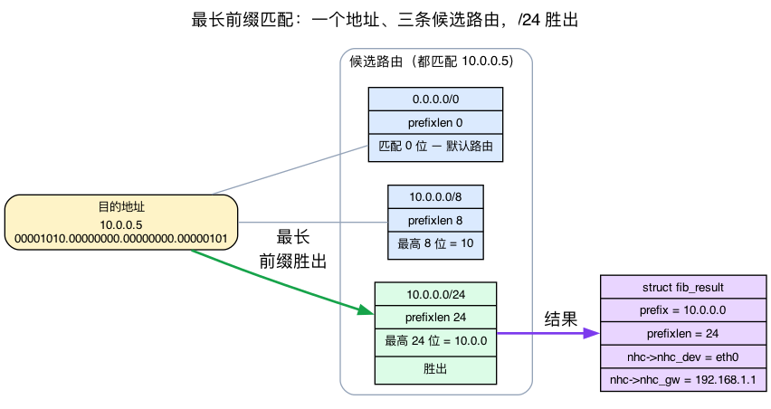
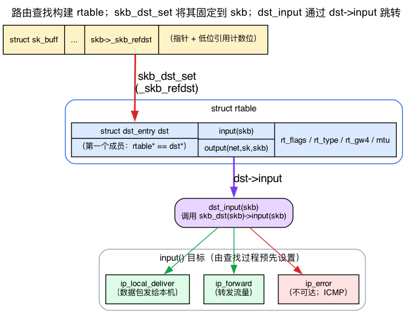
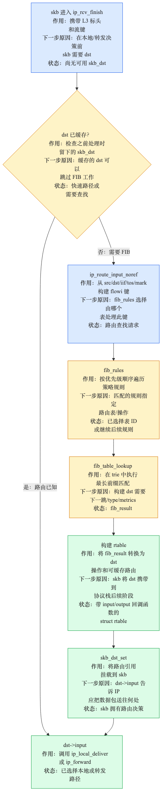
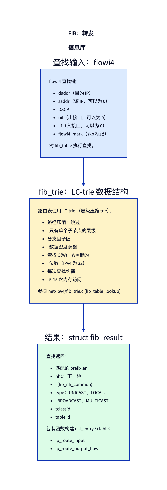
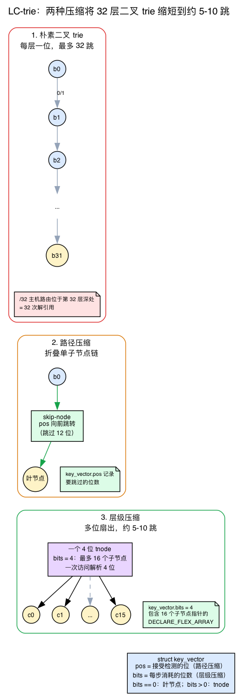
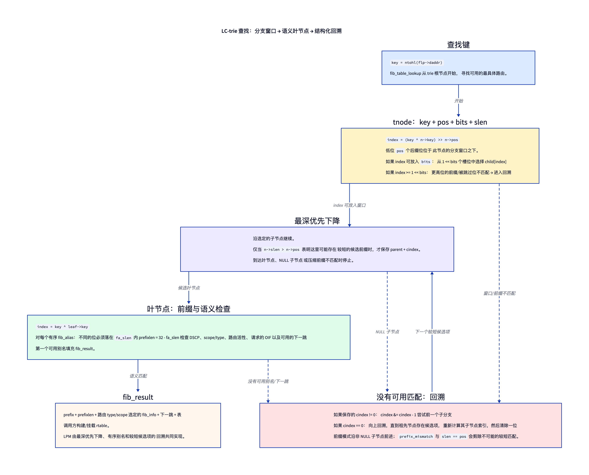
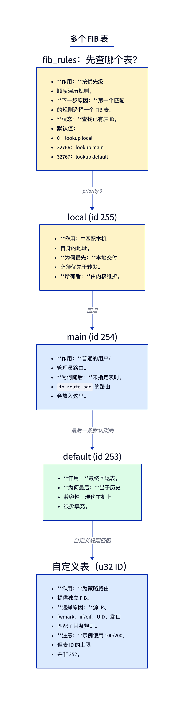
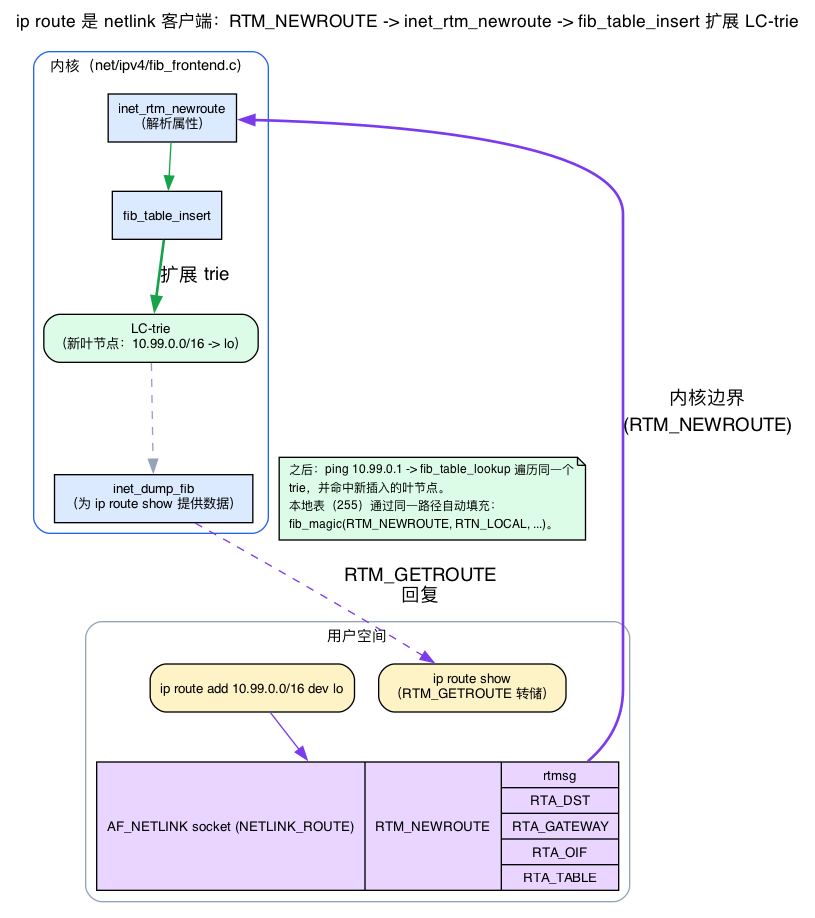

# 第8天 — IP 路由：FIB

> **今日任务：**了解 Linux 如何决定数据包的去向，学习支撑路由查找的数据结构，弄清查找结果如何附到数据包上，以及 `ip route` 究竟怎样把路由写入表中。本章会讲解路由路径依赖的四种机制：`dst_entry` 句柄、最长前缀匹配语义、LC-trie 和 rtnetlink 配置通道，让整个路径不留黑箱。总用时：约 110 分钟。

## Linux 中的“路由”是什么

每个需要前往*本机之外某处*的数据包都需要一次路由决策：选择哪个下一跳、哪个输出接口、哪个源 IP。这个决策很快——在现代硬件上，即使路由表中有数十万条路由，也只需不到一微秒。

这种速度来自 **FIB**（Forwarding Information Base）及其底层的 **LC-trie**（level-compressed trie）数据结构。不过，在接触 trie 之前，必须先补齐本章默认读者已经掌握的几个概念：*一条路由“匹配”究竟意味着什么*、*查找结果通过什么句柄交付*、*trie 本身如何工作*，以及*路由最初怎样进入表中*。第 1～7 天都没有讲过这些内容。前两个概念会在开头说明；trie 本身和写侧配置通道则在首次用到时逐步展开——先建立直觉，再看具体的 v7.1 结构体。

## 背景 1：最长前缀匹配——“路由匹配”究竟是什么意思

把路由表想象成一叠规则，每条规则都说“以这些位*开头*的地址走这条路”。所谓“以这些位开头”就是**前缀**，而一条路由就是一个**前缀加前缀长度**：

- `10.0.0.0/24` 表示“最高 **24** 位等于 `10.0.0.0` 的地址”。
- `10.0.0.0/8` 表示“最高 **8** 位等于 `10` 的地址”。
- `0.0.0.0/0`——**默认路由**——前缀长度为 **0**，所以需要匹配的位数为*零*。它匹配**所有地址**。

让路由变得有意思的关键在于：一个目标地址可以同时匹配**多条**路由。发往 `10.0.0.5` 的数据包会同时匹配上述三条路由。那么哪一条胜出？

**规则是：最具体的匹配胜出——即最长的前缀长度。**`10.0.0.0/24`（24 位）胜过 `10.0.0.0/8`（8 位），后者又胜过 `0.0.0.0/0`（0 位）。这就是**最长前缀匹配（LPM）**，它使路由决策具有确定性。它也解释了默认路由*为什么*是最后的选择：只有没有更具体的匹配时，`0.0.0.0/0` 才会胜出。（这正是本章稍后的“破坏默认路由”实验能够成立的原因——移除具体路由后，`/0` 会接住数据包。）



查找结果会记录*哪个*前缀胜出。该结果是一个 `struct fib_result`（`include/net/ip_fib.h:173`）：

```c
struct fib_result {
    __be32          prefix;     /* the matched prefix, e.g. 10.0.0.0 */
    unsigned char   prefixlen;  /* its length, e.g. 24 — how the winner was chosen */
    unsigned char   nh_sel;
    unsigned char   type;       /* RTN_UNICAST, RTN_LOCAL, RTN_BROADCAST, ... */
    unsigned char   scope;
    struct fib_nh_common *nhc;  /* next-hop info */
    struct fib_info *fi;
    struct fib_table *table;
    /* ...tclassid, dscp, fa_head in v7.1... */
};
```

`prefix` 和 `prefixlen` 是匹配到的前缀及其长度——LPM 竞赛的胜出者。最值得关注的字段是 **`nhc`**，即下一跳，它是一个 `struct fib_nh_common`（`include/net/ip_fib.h:83`）：

```c
struct fib_nh_common {
    struct net_device   *nhc_dev;     /* egress interface */
    int                  nhc_oif;
    u8                   nhc_gw_family;
    union {
        __be32          ipv4;         /* gateway IP, if any */
        struct in6_addr ipv6;
    } nhc_gw;
    /* ... */
};
```

它告诉你出站设备（`nhc_dev`/`nhc_oif`）以及网关 IP（如有）（`nhc_gw_family` + `nhc_gw`）。（首选源 IP 和路由 MTU *不在* `fib_nh_common` 中——它们分别来自外层 `fib_nh` 的 `nh_saddr` 和 `dst` 上的路由度量。）

**`type`** 字段解释了为什么同一套机制既能回答“转发这个数据包”，也能回答“这是发给我们的”。`RTN_UNICAST`（`include/uapi/linux/rtnetlink.h:263`）表示网关或直连路由；`RTN_LOCAL`（`:264`）表示“在本地接收”；`RTN_BROADCAST`（`:265`）。内核把本机 IP 作为 `RTN_LOCAL` 条目保存在一张单独的表中——下文会进一步说明。

再建立一个联系：LPM 正是 FIB 使用**按地址位索引的 trie**、而不是哈希表的原因。哈希提供精确匹配——很适合回答“这个确切键是否存在？”但路由需要回答“哪个最长前缀与该地址的*起始位*相同？”逐位 trie 天然适合这个问题：只要地址位继续吻合就不断向下，能匹配到的最深前缀就是答案。这正是背景 3 将逐步介绍的数据结构。

## 背景 2：`dst_entry`——路由结果如何附在数据包上

查找已经选出了最佳路由。接下来呢？内核不会只返回“经 192.168.1.1 从 eth0 发出”这样一份原始结果，再让调用者自行解释。它会构建一个小对象，将其**附到 skb 上**，让数据包随身携带“下一步如何处理”的指令。这个对象就是 **`dst_entry`**（“destination entry”），也是转发路径中最重要的句柄。

### 直觉：每数据包一张带两个函数指针的“下一步”指令卡

把 `dst_entry` 想成钉在数据包上的一张小指令卡。卡片有两个槽位：

- **`input(skb)`**——在**接收/转发**侧如何处理数据包。
- **`output(net, sk, skb)`**——在**发送**侧如何处理数据包。

这与第3天为 `proto_ops` 和 `Qdisc_ops` 介绍的“函数指针充当虚函数表”思想相同：不必针对数据包类型构建巨大的 `if/else`，只需存储一个函数指针并通过它调用。`dst_entry` 结构体本身是新的，但这种*分发模式*你已经见过。

结构体如下（`include/net/dst.h:26`）：

```c
struct dst_entry {
    union {
        struct net_device       *dev;
        struct net_device __rcu *dev_rcu;
    };
    struct dst_ops          *ops;                               /* :31 */
    /* ...metrics, expires, xfrm... */
    int  (*input)(struct sk_buff *);                            /* :39 */
    int  (*output)(struct net *net, struct sock *sk, struct sk_buff *skb); /* :40 */
    unsigned short flags;
    /* ... */
};
```

### 路由查找不返回 `dst`——它返回内嵌该结构的 `rtable`

IPv4 路由查找结束时，会产生一个 `struct rtable`（路由表条目，`include/net/route.h:57`）：

```c
struct rtable {
    struct dst_entry    dst;     /* <-- the very FIRST member */
    int                 rt_genid;
    unsigned int        rt_flags;
    __u16               rt_type;
    /* ...rt_gw4/rt_gw6, rt_iif, mtu... */
};
```

看第一个成员：`struct dst_entry dst`。由于它位于结构体最前面，**`rtable *` 与 `dst_entry *` 指向同一个地址**——可以把 `rtable` 看成末尾追加了更多字段的 `dst`。反向转换时，也就是从裸 `dst` 指针恢复完整的 `rtable`，内核会使用 `container_of` 辅助宏（`include/net/route.h:80`）：

```c
#define dst_rtable(_ptr) container_of_const(_ptr, struct rtable, dst)
```

这是经典的 Linux 技巧：“把通用结构体内嵌为第一个成员，再通过 `container_of` 恢复具体结构体”。路由代码根据查找结果填入 `rt->dst.input` 和 `rt->dst.output`（`net/ipv4/route.c`）：

- `rt->dst.input = ip_local_deliver`——数据包发给本机（`:1668`）。
- `rth->dst.input = ip_forward`——中转流量（`:1894`）。
- `rth->dst.input = ip_error`——不可达；限速并发送 ICMP（`:2442`）。
- `rt->dst.output = ip_output`——TX 方向（`:1666`）。

（`ip_local_deliver` 位于 `net/ipv4/ip_input.c:250`；`ip_forward` 位于 `net/ipv4/ip_forward.c:83`——第2天提过但没有解释的两个处理程序。）

### 附到 skb 上：`skb_dst_set` 与 `dst_input`

两个 skb 辅助函数把 `dst` 与数据包连接起来：

- **`skb_dst_set(skb, &rt->dst)`**（`include/linux/skbuff.h:1217`）把 dst 附到 skb 上。它存储在 `skb->_skb_refdst`（`skbuff.h:923`）中——这是一个 `unsigned long`，既保存指针，也借用最低位记录“是否采用引用计数”。
- **`skb_dst(skb)`**（`skbuff.h:1159`）将其读回。

而整个“分发下一步”机制只有一个内联函数，即 **`dst_input`**（`include/net/dst.h:478`）：

```c
static inline int dst_input(struct sk_buff *skb)
{
    return INDIRECT_CALL_INET(READ_ONCE(skb_dst(skb)->input),
                              ip6_input, ip_local_deliver, skb);
}
```

去掉 `INDIRECT_CALL_INET` 包装（这是针对 retpoline/推测执行的优化，用于提示两个最可能的目标），代码就是：**调用 `skb_dst(skb)->input(skb)`。**仅此而已。“skb 的 `dst->input` 分发下一步”这一说法的全部实现，就是通过路由查找预先装入的函数指针进行一次跳转。



### 快速路径：如果已经附有 dst，就跳过查找

RX 代码首先检查 skb 是否*已经*附有可用 dst；若有，就跳过整个查找。执行该检查的是 **`skb_valid_dst`**（`include/net/dst_metadata.h:93`）：

```c
static inline bool skb_valid_dst(const struct sk_buff *skb)
{
    struct dst_entry *dst = skb_dst(skb);
    return dst && !(dst->flags & DST_METADATA);
}
```

“有 dst，而且它是*真实*路由（而非隧道使用的元数据占位符）。”如果为真，数据包已经知道要去哪里，内核会直接跳到 `dst_input`。

## 查找流水线



对于入站数据包，`ip_rcv_finish`（通过 `ip_rcv_finish_core`）首先检查 skb 是否已经附有 dst（`skb_valid_dst` → 快速路径，见背景 2）。如果没有，它调用 `ip_route_input_noref`（`net/ipv4/route.c:2546`），后者：

1. 调用 `fib_lookup` → 遍历 `fib_rules` 以选择一张表。
2. 在该表上调用 `fib_table_lookup`（`net/ipv4/fib_trie.c:1420`）——即 LC-trie 遍历（背景 3）。
3. 根据结果构建 `rtable`，通过 `skb_dst_set` 将其附到 skb 上——同时按背景 2 所述装入 `rt->dst.input`。

随后，skb 的 `dst->input` 函数指针通过 `dst_input` 分发下一步，跳转到查找时装入的处理程序（`ip_local_deliver` / `ip_forward` / `ip_error`——见背景 2）。这里唯一需要明确的新细节是：`ip_error` 处理路由类型 `RTN_UNREACHABLE`（它限速并发送 ICMP *Destination Unreachable*），而 TTL 超限*不在*此处分发——它在 `ip_forward` 内检测，随后发出 ICMP *Time Exceeded*。

## 一次查找的组成



查找键是一个 `struct flowi4`：
```c
struct flowi4 {
    __be32  saddr;
    __be32  daddr;
    dscp_t  flowi4_dscp;
    __u32   flowi4_mark;
    int     flowi4_oif;
    int     flowi4_iif;
    __u8    flowi4_proto;
    /* ... ports, etc. */
};
```

（在 v7.1 中，这些字段实际上是 `#define` 别名，指向内部 `struct flowi_common __fl_common`——例如 `flowi4_oif` 就是 `__fl_common.flowic_oif`。上面的扁平视图是合理简化；下方跟踪实验使用真实的 `flp4->__fl_common.flowic_oif` 形式。）

结果就是背景 1 中见过的 `struct fib_result`——`prefix`/`prefixlen` 记录哪个 LPM 候选胜出，而 **`nhc`** 携带出站设备（`nhc_dev`）和网关（`nhc_gw`）。（首选源 IP 和 MTU 位于其他地方——分别是外层 `fib_nh` 的 `nh_saddr` 和 `dst` 上的路由度量——不在 `fib_nh_common` 中。）

## 背景 3：LC-trie——它是什么，为什么快

全球互联网大约有 100 万条 IPv4 路由，线性扫描显然不可行。FIB 使用 **LC-trie**（“level-compressed trie”）；本章一直强调它速度快，下面从基本原理出发说明原因。

### 从 trie 开始

**trie** 是一种沿着*键的组成位*逐步查找、而不是每次比较完整键的树。对于 IP 路由，键是 IPv4 地址的 32 个位，因此最简单的实现是**二叉 trie**：每个节点检查地址的*一个位*，再向左（0）或向右（1）分支。前缀长度为 `L` 的路由位于深度 `L`——必须走过 `L` 个位才能到达。

问题在于深度。一个 `/32` 主机路由位于 **32 层深处**，所以最坏情况下的查找需要 **32 次内存解引用**——每个位一次。对于包含百万条路由的表，这太慢了。这个朴素二叉 trie 是 LC-trie 通过两种压缩改进的基线。

### 压缩 #1：路径压缩（第一个“C”）

沿二叉 trie 向下时，经常会遇到很长的一段，其中每个节点都只有**一个**子节点——这片地址空间下只有一条路由。为了穿过这段路径而让每个位都占用一个节点（和一次内存访问），纯属浪费。

**路径压缩**把任何只有单个子节点的内部节点链折叠成**一个**节点，该节点只需记录*要跳过多少位*。很长的单子节点链不再需要每个位一个节点。

### 压缩 #2：层级压缩（第二个“C”）

在 trie 的*稠密*区域——几乎每条分支都有内容——可以采取与跳过相反的做法：**扩大扇出**。**层级压缩**不再每层按一位分支，而是用一个节点替代多个二叉层级，一次按**多个位**分支：消耗 `k` 位的节点最多有 `2^k` 个子节点，只需**一次**内存访问就能解析 `k` 个地址位。

### v7.1 如何在一个节点中编码两种压缩

两种压缩都位于同一个结构体 `struct key_vector`（`net/ipv4/fib_trie.c:121`）中：

```c
struct key_vector {
    t_key key;
    unsigned char pos;    /* which bit position this node tests */
    unsigned char bits;   /* how many bits this node consumes */
    unsigned char slen;
    union {
        struct hlist_head leaf;                              /* if IS_LEAF */
        DECLARE_FLEX_ARRAY(struct key_vector __rcu *, tnode); /* if IS_TNODE — :130 */
    };
};
```

两个字段承载了整个方案：

- **`pos`** 是该节点检查的位位置——*路径压缩*体现在这里，因为 `pos` 可以跨过被跳过的位。
- **`bits`** 是该节点一步消耗的位数——*层级压缩*体现在这里。`bits == 0` 表示**叶节点**（`IS_LEAF`，`:119`）；`bits > 0` 表示内部 **tnode**（`IS_TNODE`，`:118`）。`bits = 4` 的节点最多有 **16** 个子节点（子指针的 `DECLARE_FLEX_ARRAY` 就是内存中的多位扇出），并且一次消耗 4 个地址位。

键长度由地址宽度决定：`KEYLENGTH = 8 * sizeof(t_key)`（`:112`），而 `typedef unsigned int t_key`（`:115`），因此 IPv4 的 `KEYLENGTH = 32`——也就是起初朴素 trie 的 32 层。内部节点封装在 `struct tnode`（`:134`）中，后者还保存子节点占用统计（`empty_children`、`full_children`）和 `parent` 指针。

### 收益

在真实互联网路由表上，稠密区域被展平（层级压缩减少层数），稀疏的单子节点链被跳过（路径压缩），因此无论表有多大，一次查找平均只需访问 **约 5～10 个节点**——而不是最多 32 个。这就是本章承诺的“快”。



最后，把它重新关联到 LPM（背景 1）：遍历会跟随地址位**下降到叶节点**，然后检查叶节点的 `fib_alias` 列表，寻找位确实匹配键的最具体前缀。trie *缩小*候选范围；叶节点检查*确认*匹配长度。详细过程请阅读 `net/ipv4/fib_trie.c`（`fib_table_lookup`，第 1420 行）和 `Documentation/networking/fib_trie.rst`——二者都有充分注释。

### 实际遍历方式：每个 tnode 拥有一个分支窗口

普通二叉 trie 每层检查一个地址位。LC-trie 同时压缩路径和层级：每个内部 `key_vector`（tnode）存储 `pos` 和 `bits`，从 32 位主机序键中选出一个多位窗口，并拥有大小为 `1 << bits` 的子节点数组。



`fib_table_lookup` 从 `key = ntohl(flp->daddr)` 开始，并使用：

```c
struct key_vector {
    t_key key;
    unsigned char pos;   /* low-order suffix bits below this window */
    unsigned char bits;  /* width of this node's child index        */
    unsigned char slen;  /* longest suffix length below this node   */
    /* leaf hlist, or a (1 << bits)-entry child array                */
};
```

热路径中的关键表达式是 `index = get_cindex(key, n) = (key ^ n->key) >> n->pos`。右移会丢弃该节点分支窗口**下方**的低 `pos` 个后缀位，而不会丢弃向下遍历时已经检查过的位。如果更高位前缀以及路径压缩所跨过的各位都与 `n->key` 一致，剩余值就能容纳在 `n->bits` 中，并直接索引一个子节点。因此，`bits = 4` 的 tnode 只需一次解引用，就能从 16 个子节点中作出选择。如果 `index >= 1 << n->bits`，说明窗口上方存在不同的位，这棵子树不可能包含该键，查找随即进入前缀回溯。

第一次向下遍历以最精确的候选为目标。当 `index` 在范围内且 `bits == 0` 时，查找便到达一个键已通过当前比较的叶节点。叶节点保存按顺序排列的 `fib_alias` 路由 hlist；`fa_slen` 表示该别名前缀排除的低位后缀位数，因此 `prefixlen = 32 - fa_slen`。填充 `fib_result` 前，后续条件检查还会核对 DSCP、路由是否可用及其类型和作用域、输出接口约束，以及可用的下一跳。

### 回溯枚举有效的较短前缀候选

如果下降时遇到缺失的子节点、前缀不匹配，或没有可用别名/下一跳，查找不会从根重新开始。它只会保存父节点 `pn` 和子节点索引 `cindex`，而且仅限 `slen > pos` 表明该位置下方可能存在更短前缀时。

在 `backtrace` 处，非零 `cindex` 会通过 `cindex &= cindex - 1` 改写，清除最低的置位，并在该子节点数组中选择下一个与前缀对齐的前驱分支。如果 `cindex` 已经为零，代码就沿父节点向上回溯，直到找到仍有其他候选的祖先，再用 `get_index` 重新计算该祖先的子节点索引并继续。随后，前缀匹配模式会沿候选子树中的第一个非 NULL 子节点前进，而 `prefix_mismatch(key, n)` 和 `n->slen == n->pos` 会剪掉不可能包含更短匹配的分支。

在候选叶节点处，`index = key ^ n->key`；只有每个不同的位都落在别名忽略的后缀中时，该别名才符合条件（`index < 1 << fa_slen`，源码还包含 32 位保护）。因此，最长前缀行为来自最深优先下降、按前缀长度排序的别名，以及朝较短候选进行的这种结构化回溯三者的组合——并不是“第一个叶节点总会胜出”，也不是为每个前缀位盲目向上爬一层 trie。

插入路由时，内核会调整 tnode 大小以维持结构效率：`inflate` 扩大稠密的分支窗口，`halve` 缩小稀疏窗口。这些操作会改变 `bits` 和子节点位置，但不会改变查找语义。

可以直接查看最终结构：

```bash
cat /proc/net/fib_trie
```

每个 `+--` 行都是一个内部 tnode，打印格式为 `prefix/len bits full_children empty_children`；每个 `|--` 行都是带有其路由的叶节点。在繁忙分支上观察值为 2 或 3 的 `bits`——这就是层级压缩将节点扇出到 4 或 8 个子节点，使遍历跳过整个层级。

如果想了解调整大小的数学原理，请阅读 `net/ipv4/fib_trie.c`；查找循环本身（第 1420～1545 行）是最值得从头到尾阅读的部分。

## 多张表

Linux 支持多张路由表。默认表如下：



- **local**（255）——本地接口上的 IP；由内核维护。
- **main**（254）——用户添加的路由默认进入这里。
- **default**（253）——优先级最低；很少使用。
- **custom**——通过 `ip route add ... table N` 创建。小型示例常使用小于 253 的 ID，但内核以 `u32` 携带表 ID；较大 ID 通过 `RTA_TABLE` 等 netlink 属性传输（背景 4）。

（这些值对应 `RT_TABLE_LOCAL=255` / `RT_TABLE_MAIN=254` / `RT_TABLE_DEFAULT=253`，定义于 `include/uapi/linux/rtnetlink.h:360`。）

`fib_rules` 根据数据包属性决定查找*哪张*表：源 IP、fwmark、OIF、IIF。第9天会详细讲解。

## 背景 4：一条路由如何*进入* FIB——rtnetlink 路径

本章每个实验都使用 `ip route add/del/show`，而查找侧会遍历由这些命令填充的 trie。但 `ip route add 10.99.0.0/16 dev lo` 实际如何*变成* LC-trie 中的一个叶节点？到目前为止，我们只看了读侧。下面来看写侧。

### `ip route` 是 netlink 客户端

`ip route` **不会**通过 ioctl 或 `/proc` 直接修改内核。它会打开一个 `AF_NETLINK` 套接字，使用 `NETLINK_ROUTE` 族（“rtnetlink”），并发送一条**结构化消息**：

- 添加路由 → **`RTM_NEWROUTE`** 消息（`include/uapi/linux/rtnetlink.h:44`，值为 24）。
- 删除 → **`RTM_DELROUTE`**（`:46`）。
- `ip route show` → **`RTM_GETROUTE`** 转储（`:48`）。

消息由一个 `struct rtmsg` 和若干带类型的属性组成（TLV，即 type-length-value 记录）：`RTA_DST`（前缀）、`RTA_GATEWAY`、`RTA_OIF`（出站接口）和 `RTA_TABLE`（`:385`）——最后一个正是“多张表”一节提到的、用于较大表 ID 的属性。

### 内核侧：按消息类型注册、修改 FIB 的处理程序

每种消息类型都注册到一个处理函数（`net/ipv4/fib_frontend.c:1694`）：

```c
static const struct rtnl_msg_handler fib_rtnl_msg_handlers[] __initconst = {
    {.protocol = PF_INET, .msgtype = RTM_NEWROUTE,
     .doit = inet_rtm_newroute, .flags = RTNL_FLAG_DOIT_PERNET},
    {.protocol = PF_INET, .msgtype = RTM_DELROUTE,
     .doit = inet_rtm_delroute, .flags = RTNL_FLAG_DOIT_PERNET},
    {.protocol = PF_INET, .msgtype = RTM_GETROUTE, .dumpit = inet_dump_fib, ...},
};
```

所以 `RTM_NEWROUTE` → **`inet_rtm_newroute`**（`:910`），`RTM_DELROUTE` → **`inet_rtm_delroute`**（`:876`），`RTM_GETROUTE` → **`inet_dump_fib`**（`:1018`，支撑 `ip route show` 的转储）。`inet_rtm_newroute` 解析属性并调用 **`fib_table_insert`**（`:930`）——正是它实际扩展查找侧遍历的 LC-trie。

由此闭合整个环路：

```
ip route add 10.99.0.0/16 dev lo
  → AF_NETLINK socket: RTM_NEWROUTE { rtmsg + RTA_DST/RTA_OIF/RTA_TABLE }
    → inet_rtm_newroute → fib_table_insert → new leaf in the LC-trie
ping 10.99.0.1
  → fib_table_lookup walks the trie → hits that freshly-inserted leaf
```



### 为什么 local 表会自行填充

这也解释了内核自身的主机 IP 路由来自哪里。当接口被分配 IP 时，内核会在内部发出**同样的 `RTM_NEWROUTE`**——类型为 `RTN_LOCAL`——并通过 `fib_magic` 完成（`net/ipv4/fib_frontend.c:1156`：`fib_magic(RTM_NEWROUTE, RTN_LOCAL, addr, 32, ...)`）。这个过程不需要用户空间参与；local 表（255）通过与你的 `ip route add` 相同的插入路径填充。这里无须深入 netlink 消息的封装细节（nlmsghdr、属性解析）——需要掌握的只是：*配置以 rtnetlink 消息形式到达，再按类型分发给修改 FIB 的处理程序。*

> ### 常见疑问
>
> **问：内核如何缓存路由？**
>
> 答：现代 Linux（约从 3.6 起）**不会**按流缓存 rtable。路由查找已经足够低成本，可以逐数据包执行。例外是出站 connect 路径的每 CPU 缓存，以及 lwtunnel 使用的 `dst_cache` 机制。3.6 之前的“rt_cache”存在安全隐患，现已移除。
>
> **问：内核把本机 IP 保存在哪里？**
>
> 答：保存在 `local` FIB 表（ID 255）中。接口获得 IP 时，内核会通过背景 4 中的内部 `fib_magic(RTM_NEWROUTE, RTN_LOCAL, ...)` 路径自动插入条目。`ip route show table local` 可以列出它们。
>
> **问：实际查找有多快？**
>
> 答：在现代 x86_64 上，针对典型 Linux 服务器的小型 FIB，约为 50ns～150ns。拥有 100 万条路由的互联网路由器每次查找约需 200～500ns，主要受内存访问模式和缓存效应影响。

## 今日实验

### 查看路由

```bash
ip route show table main
ip route show table local
ip rule show
```

`ip rule` 就是 fib_rules 列表。原生内核会安装三条规则（local、main、default）；某些发行版或主机服务会添加额外规则（例如 `220: from all lookup 220` 条目），所以你可能会看到更多。（每次运行的 `ip route show` 都是一次 `RTM_GETROUTE` 转储，由 `inet_dump_fib` 处理——见背景 4。）

### 观察一次路由查找

```bash
sudo bpftrace -e '
fentry:fib_table_lookup {
  printf("lookup daddr=%s table_id=%d\n",
         ntop(args->flp->daddr),
         args->tb->tb_id);
}'

# in another terminal:
ping -c 1 8.8.8.8
```

每个本机发出的数据包至少会触发一次 fib_table_lookup；具体次数会随 dst 缓存而变化。

### 添加路由

```bash
sudo ip route add 10.99.0.0/16 dev lo
ip route show

# remove:
sudo ip route del 10.99.0.0/16
```

添加成功时没有输出；`ip route show` 会列出新前缀，从而确认成功：

```
10.99.0.0/16 dev lo scope link
```

在底层，这条 `ip route add` 会发送一条 `RTM_NEWROUTE` 消息，进入 `inet_rtm_newroute → fib_table_insert`，在 main 表的 LC-trie 中插入一个新叶节点（背景 4）。为了把这一过程重新关联到 FIB *查找*，让上一节的 `fentry:fib_table_lookup` 跟踪保持运行，然后在另一个终端执行：

```bash
ping -c 1 10.99.0.1
```

跟踪会打印 `lookup daddr=10.99.0.1 table_id=254`——main 表（254）中的 LC-trie 现在能解析刚添加的前缀。完成后请记得执行上面的 `ip route del`，让主机路由表保持干净。

### 跟踪 `ip_route_output_flow`

```bash
sudo bpftrace -e '
fentry:ip_route_output_flow {
  printf("out: daddr=%s oif=%d\n", ntop(args->flp4->daddr), args->flp4->__fl_common.flowic_oif);
}'

# in another terminal:
ping -c 1 8.8.8.8
```

这是 `ip_route_input` 的出站对应项——每个本机发出的数据包都会触发它。每次出站路由查找都会输出一行：

```
out: daddr=8.8.8.8 oif=0
```

`oif=0` 表示调用方没有固定出站接口，因此查找可以自由选择。（持续与网络通信的机器还会打印后台查找，例如 DNS 解析器等。）按 Ctrl-C 停止。

## 故障实验

### 在命名空间内安全地破坏默认路由

不要替换主机真实的默认路由。把故障放进一个可随时丢弃的命名空间：

```bash
sudo ip netns add fibbreak
sudo ip -n fibbreak link set lo up
# onlink: tell the kernel to trust this gateway even though it is
# not on any subnet configured on lo (lo carries only 127.0.0.1/8).
sudo ip -n fibbreak route add default via 10.99.99.99 dev lo onlink
sudo ip -n fibbreak route show                  # default via 10.99.99.99 dev lo onlink
sudo ip netns exec fibbreak ping -c 1 8.8.8.8   # 100% packet loss, namespace only

sudo ip netns del fibbreak
```

使用 `onlink` 后，路由可以成功安装，FIB 查找也能解析出下一跳——但 10.99.99.99 不会回应 ARP，数据包无法继续发送，ping 会报告 100% 数据包丢失。（如果不加 `onlink`，内核会以 `Error: Nexthop has invalid gateway.` 直接拒绝这个不在子网内的网关，路由根本不会添加。）无论哪种情况，主机路由表都不会改变；`ip netns del` 会彻底销毁该命名空间及其中的路由。

这也是 LPM 的一个微型例子（背景 1）：唯一存在的路由是 `0.0.0.0/0`，所以发往 `8.8.8.8` 的数据包会匹配它，因为没有更具体的路由。

### 检查 rt 缓存统计（旧接口）

```bash
cat /proc/net/stat/rt_cache
```

按流缓存命中列（`in_hit`/`out_hit`）为零，因为按流 `rt_cache` 已经消失——这就是教学重点。`in_slow_tot`/`out_slow_tot`/`in_martian_src` 列只是累计查找计数器，所以会是非零值。该 proc 文件为兼容性保留下来。

---

## 内核源码阅读指南

- **`net/ipv4/route.c`**——`ip_route_input_noref`（第 2546 行）、`ip_route_output_flow`（第 2929 行）。另请查看 `rt->dst.input`/`rt->dst.output` 的赋值（第 1666～1668、1894、2442 行）。
- **`net/ipv4/fib_trie.c`**——`fib_table_lookup`（第 1420 行）。LC-trie 实现；`struct key_vector`（第 121 行）、`IS_TNODE`/`IS_LEAF`（第 118～119 行）。
- **`net/ipv4/fib_frontend.c`**——netlink 接口：`inet_rtm_newroute`（第 910 行）、`inet_rtm_delroute`（第 876 行）、`inet_dump_fib`（第 1018 行）、处理程序表（第 1694 行）、`fib_magic`（定义于第 1099 行；`RTN_LOCAL` 调用点在第 1156 行），以及 `fib_lookup` 包装函数。
- **`net/ipv4/fib_rules.c`**——fib_rules 实现。
- **`include/net/dst.h`**——`struct dst_entry`（第 26 行）、`dst_input`（第 478 行）。
- **`include/net/route.h`**——`struct rtable`（第 57 行）、`dst_rtable`（第 80 行）。
- **`include/net/flow.h`**——`struct flowi4`。
- **`include/net/ip_fib.h`**——`struct fib_result`（第 173 行）、`struct fib_nh_common`（第 83 行）。
- **`Documentation/networking/fib_trie.rst`**——LC-trie 内部原理；**`Documentation/networking/ip-sysctl.rst`**——路由相关 sysctl。

---

## 要点回顾

- **路由是一个（prefix，prefixlen）对。**多条路由可以匹配同一个地址；**最长前缀胜出**（LPM）。`0.0.0.0/0`（默认路由）匹配所有地址，是最后的选择。
- 查找结果是 `struct fib_result`：`prefix`/`prefixlen` 记录 LPM 胜出者；`nhc`（一个 `fib_nh_common`）携带出站设备和网关 IP——首选源 IP（`nh_saddr`）和 MTU 位于外层 `fib_nh`/路由度量中，不在 `nhc` 中。`type`（`RTN_UNICAST`/`RTN_LOCAL`/`RTN_BROADCAST`）使同一套机制既能处理“转发”，也能处理“发给我们”。
- **`dst_entry`** 是每数据包的“下一步”句柄，携带 `input(skb)`（RX/转发）和 `output(net,sk,skb)`（TX）函数指针。路由查找构建一个 `struct rtable`，其**首成员是 `dst_entry`**（因此 `rtable* == dst*`；使用 `dst_rtable` 恢复）。`skb_dst_set` 将其固定到数据包上；**`dst_input` 只是调用 `skb_dst(skb)->input(skb)`**——这就是整个分发机制。
- `rt->dst.input` 设置为 `ip_local_deliver` / `ip_forward` / `ip_error`。`skb_valid_dst` 是已经附有真实 dst 时跳过查找的快速路径检查。
- **FIB** 是内核的路由表；查找通过 `fib_table_lookup` 在 **LC-trie** 上完成。朴素二叉 trie 深达 32 层；**路径压缩**跳过单子节点链，**层级压缩**使用多位（2^bits 路）节点，因此无论表大小如何，平均只需访问约 5～10 个节点。`struct key_vector{pos,bits}` 编码了二者（`bits==0` = 叶节点）。
- 查找键是 `struct flowi4`；结果是 `struct fib_result`。
- 三张众所周知的表：**local（255）**、**main（254）**、**default（253）**。自定义表 ID 是 `u32`；小 ID 只是方便示例。**`fib_rules`** 决定查找哪张表。
- **`ip route` 是 netlink 客户端。**add/del/show 映射到 `RTM_NEWROUTE`/`RTM_DELROUTE`/`RTM_GETROUTE` → `inet_rtm_newroute`/`inet_rtm_delroute`/`inet_dump_fib`；插入通过 `fib_table_insert`。内核经由同一路径（`fib_magic`、`RTN_LOCAL`）自动填充 local 表。
- 从约 3.6 起不再有流级 rt_cache——查找已经足够低成本，可以逐数据包执行。

---

## 检查题

你添加了 `ip route add 10.0.0.0/24 via 192.168.1.1 dev eth0`。一个 daddr 为 `10.0.0.5` 的数据包进入。请走读查找过程。

<details>
<summary>点击查看答案</summary>

**答案：**`ip_rcv_finish` → `ip_route_input_noref` → `fib_lookup` 按优先级顺序遍历规则：首先查找 `local` 规则（`from all lookup local`），但 local 表没有 `10.0.0.5` 的条目，因此继续执行内核默认的 `from all lookup main`。`fib_table_lookup(main, &flowi4)` 遍历 LC-trie。可能有多个前缀匹配 `10.0.0.5`（默认的 `0.0.0.0/0`、也许还有 `10.0.0.0/8`，以及刚添加的 `10.0.0.0/24`），但**最长前缀匹配会选择 `/24`**——最具体的一个。`fib_result` 中有 `prefix=10.0.0.0`、`prefixlen=24`、`nhc->nhc_gw.ipv4=192.168.1.1`、`nhc->nhc_dev=eth0`。该路由采用网关形式，因此内核知道发送时要对 192.168.1.1 发起 ARP（第7天的邻居子系统）。内核构建 rtable，并通过 `skb_dst_set` 附到 skb 上；查找装入了 `rt->dst.input = ip_forward`（假设本机不是 10.0.0.5），因此 `dst_input(skb)` 会跳转到 `ip_forward`，继续进行转发。

</details>

---

## 明天

第9天：多路径、策略路由与基于源的路由。届时将深入讲解 fib_rules 机制——正是它决定每次 `fib_table_lookup` 应查找*哪张*表。
