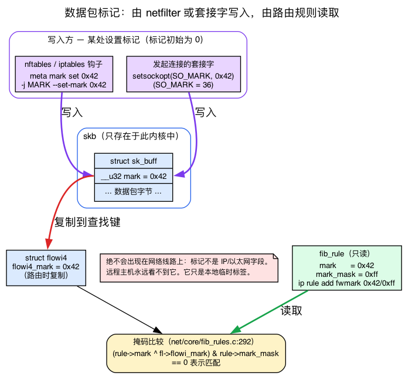
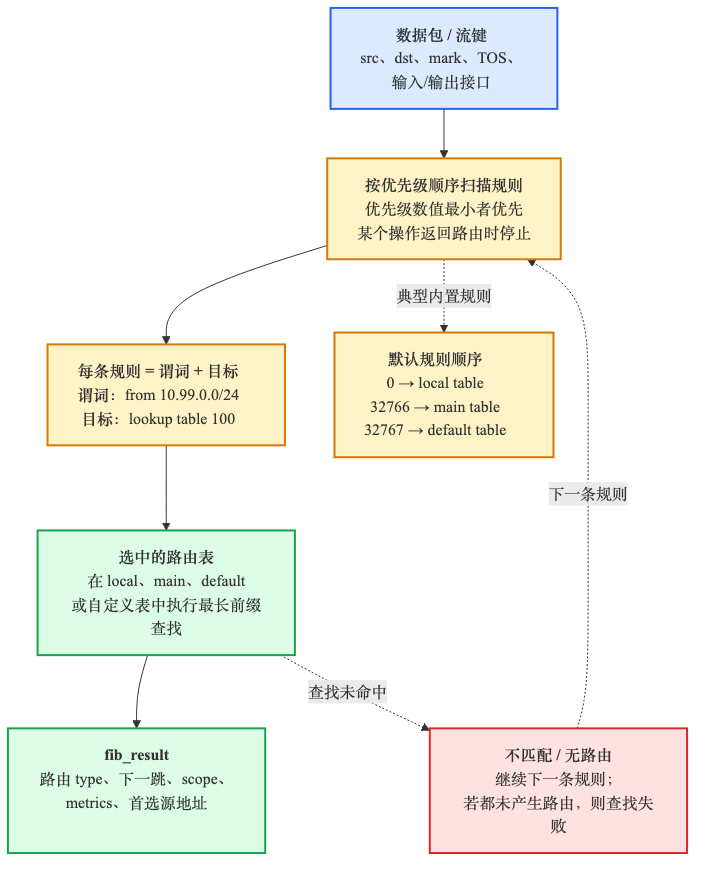
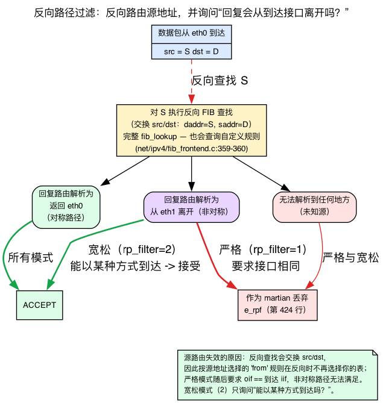
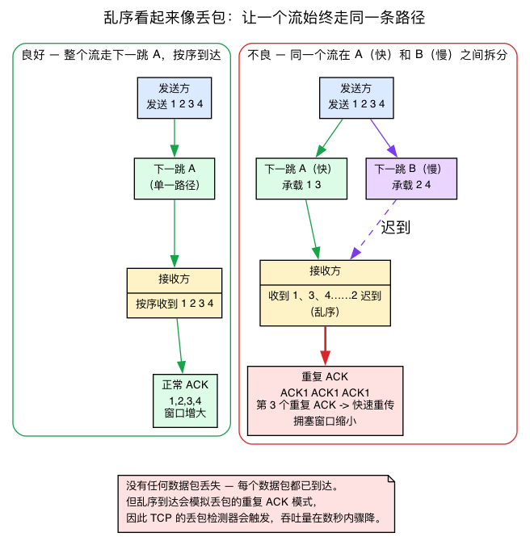
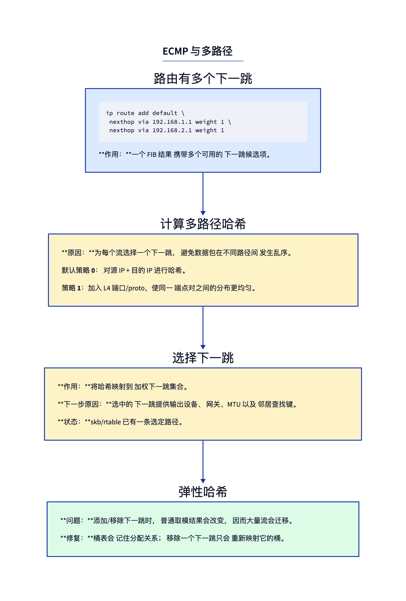
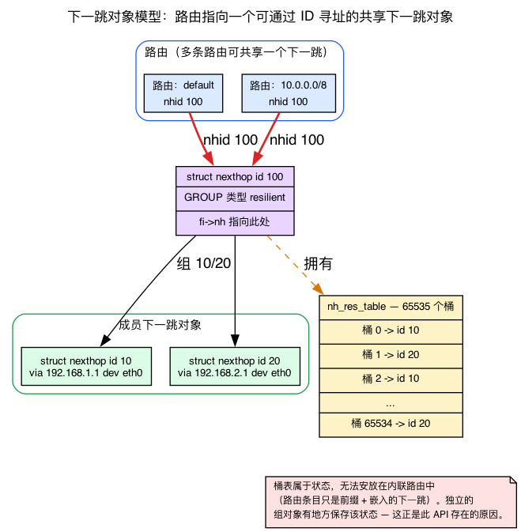

# 第9天 — 多路径、策略路由、基于源的路由

> **今日任务：**根据目标 IP *以外*的信息为数据包选择路由。掌握全章依赖的四个概念——数据包 mark、反向路径过滤、TCP 为什么难以承受乱序，以及 nexthop 对象模型——进而熟练使用多张 FIB 表、策略规则和 ECMP。预计用时约 130 分钟；如果已经了解 fwmark、rp_filter 和 DSCP，可以略读四个背景说明框。

## 只按目标路由不够用时

昨天（第8天）的查找是单一输入的函数：目标 IP。你把一个 `struct flowi4` 交给 `fib_table_lookup`，遍历 **main** 表中的 LC-trie，得到一个包含下一跳的 `struct fib_result`。这是简单模型，能覆盖约 95% 的真实路由场景——你的笔记本、大多数服务器和大多数嵌入式设备。但在一些棘手场景中，确实需要更多输入才能作出决策：

- **基于源的路由。**两个租户共用一台路由器；租户 A 的流量必须经过网关 A，租户 B 的流量必须经过网关 B。目标可能相同；区分它们的是源 IP。
- **基于 mark 的路由。**防火墙规则把这个数据包归类为“VPN 流量”，并给它加上一个 *mark*。你希望路由遵循该分类。
- **多路径（ECMP）。**到同一目标有两条等价路径。把连接分散到两条路径上，但让每条流始终走单一路径（避免数据包乱序）。
- **策略路由。**“来自这个 UID、从这个入站接口进入、携带这个 DSCP 的流量，去那张表。”策略规则的组合数量催生了多张路由表。

Linux 用同一套机制解决所有这些问题：**`fib_rules`** 加上**多张 FIB 表**。

这里涉及的 mark、反向路径过滤、DSCP 字节和流哈希，都依赖此前尚未正式介绍的概念；resilient hashing 一节还需要补充 nexthop 对象模型。本章会在首次用到它们时穿插讲解，先建立直觉，再进入具体机制，从而让每个选择器和每条 `ip` 命令都清晰可读。

---

## 背景 1：数据包 mark 究竟是什么

上面的项目列表、`fwmark` 选择器、整个“基于 mark 的路由”章节以及今天的检查题，全都依赖“mark”。设置 mark 的防火墙子系统 Netfilter 要到第20天才会讲，因此你还没正式见过它。现在先补上，因为这个概念很简单，而且今天会一直用到。

**mark 是一个位于 skb 本身上的 u32 临时字段。**回想第1天的 `sk_buff`：它是通用数据包容器，是一份伴随数据包字节移动的描述符。其中一个字段是 32 位整数，内核只把它用作**内部分类标签**（`include/linux/skbuff.h:1069`）：

```c
union {
    __u32  mark;
    __u32  reserved_tailroom;
};
```

关于该字段，需要理解两件事：

1. **它随数据包在内核*内部*传递，永远不会出现在线路上。**它既不是 IP 头部的一部分，也不是以太网字段，远端主机完全看不到。它只在 skb 存活于*本机*内核期间存在。可以把它想成前一个子系统贴在数据包上的便签，供后续子系统读取。
2. **在路由能匹配它之前，必须有某个组件先设置它。**mark 初始为 0。它通过以下两种方式之一获得非零值：
   - **nftables/iptables 规则**——`meta mark set 0x42`（nftables）或 `-j MARK --set-mark 0x42`（iptables）。这是防火墙钩子在数据包经过时为其盖章。
   - **发起通信的套接字**——进程调用 `setsockopt(fd, SOL_SOCKET, SO_MARK, ...)`，该套接字发送的每个数据包在诞生时就带有该 mark。`SO_MARK` 是编号为 36 的选项（`include/uapi/asm-generic/socket.h:56`）：

     ```c
     #define SO_MARK    36
     ```

下文会看到的 `fwmark` *规则选择器*只会**读取** mark，绝不会设置它。这一点最容易混淆，务必记住：**路由规则读取 mark；netfilter 或套接字写入 mark。**

### mark 如何进入路由查找

下面把它关联回第8天。内核准备路由数据包时，会把 skb 的 mark 复制到查找键中——具体是 `flowi4_mark`，这个字段已在第8天的 `struct flowi4` 列表中出现。这样规则引擎才有可比较的值。通用规则匹配器正是这样做的（`net/core/fib_rules.c:292`）：

```c
if ((rule->mark ^ fl->flowi_mark) & rule->mark_mask)
    goto out;   /* mismatch — this rule does not apply */
```

这是一次**带掩码比较**，也是 `fwmark` 选择器采用 `VALUE/MASK` 形式的原因。异或 `(rule->mark ^ fl->flowi_mark)` 在双方位相同的位置恰好为零；`& rule->mark_mask` 会忽略你不关心的位。因此，`fwmark 0x42` 在掩码后的位等于 `0x42` 时匹配，而 `fwmark 0x42/0xff` 表示“只查看低字节”。创建规则时，iproute2 会把你的值放入 `rule->mark`（`net/core/fib_rules.c:622`）：

```c
nlrule->mark = nla_get_u32(tb[FRA_FWMARK]);
```

**提前说明：**mark *如何*设置——包括 nftables/iptables 规则语法、各条链的执行时机，以及 conntrack 如何恢复回复流量上的 mark——属于 Netfilter 的职责，将在第20天讲解。今天只需把 mark 视为前序钩子写入数据包的标签，重点关注路由*如何响应*它。



---

## fib_rules：查找哪张路由表

`fib_rules` 是各协议各自使用的一条决策流水线。每条规则由一个*谓词*（用于匹配数据包属性的选择器）和一个*目标*（要查找的路由表）组成。查找时，内核按优先级依次遍历规则，并采用第一个匹配项。具体实现是 `net/core/fib_rules.c:313` 中的 `fib_rules_lookup`。



### 默认规则

在干净系统上运行 `ip rule show`，会恰好得到三条规则：

```
0:      from all lookup local
32766:  from all lookup main
32767:  from all lookup default
```

- **优先级 0 → 表 255（local）。**保存*本机*接口的 IP。执行 `ip addr add` 时由内核自动填充。始终最先尝试，确保发给自己的数据包能正确解析。
- **优先级 32766 → 表 254（main）。**`ip route add` 的默认目标。用户添加的路由进入这里。
- **优先级 32767 → 表 253（default）。**优先级最低；很少填充。用于历史兼容。

优先级数字越小，规则越早被查找。自定义规则可插在它们之间。

### 选择器：每条规则可以匹配什么

每条规则都支持一组选择器。完整列表见 `include/net/fib_rules.h:20` 的 `struct fib_rule` 和每协议扩展 `struct fib4_rule`，其中包括：

- **`from PREFIX`**（`src` 字段）：按源 IP/前缀匹配。
- **`to PREFIX`**（`dst` 字段）：按目标匹配（通常用处不大——FIB 查找本来就在做这件事）。
- **`iif IFNAME`**：按*输入*接口匹配。对于需要按到达端口应用不同策略的转发路由器非常强大。
- **`oif IFNAME`**：按*输出*接口匹配。较少使用；通常你希望路由来*选择* OIF，而不是反过来。
- **`tos VALUE`** / **`dsfield VALUE`**：匹配 IPv4 头部第二个字节中的 **DSCP** 类别（最高 6 位——由应用或边缘路由器设置的 QoS 等级，例如高优先级与尽力而为；最低 2 位是 **ECN**，明确*不参与*匹配）。第8天列出 `struct flowi4` 时已经见过 `flowi4_dscp`；这个选择器把该字段与线路上的字节对应起来，使高优先级流量和大批量流量可以分别进入不同路由表。两种写法检查的位宽不同：**`dsfield`** 匹配完整的 6 位 DSCP（掩码 `0xfc`——`flowi4_dscp` 是已清除 ECN 位的 `dscp_t`，因此 ECN 始终不参与）；**`tos`** 为保持向后兼容，还会屏蔽最高三位，只将较低的 DSCP 位与 `INET_DSCP_LEGACY_TOS_MASK`（`0x1c`）比较——见 `fib_dscp_masked_match`（`include/net/ip_fib.h:441`）。运行时，它对应的仍是与 mark 相同的带掩码比较：`(r->dscp ^ fl4->flowi4_dscp) & r->dscp_mask`（`net/ipv4/fib_rules.c:197`）。
- **`fwmark VALUE/MASK`**：匹配数据包 mark（背景 1）。对于防火墙驱动的策略至关重要。
- **`uidrange UID-UID`**：按套接字所有者 UID 匹配。可让特定用户的流量采用不同路由（按用户使用 VPN）。
- **`ipproto PROTO`**、**`sport`/`dport RANGE`**：按 L4 匹配。虽然打破分层，却很强大。

### 基于源的路由——经典示例

两个租户：租户 A 使用 10.99.0.0/24，必须经 192.168.99.1 出站；租户 B 使用 10.100.0.0/24，经 192.168.100.1 出站。

```bash
# Custom tables for each tenant:
sudo ip route add default via 192.168.99.1 table 100
sudo ip route add default via 192.168.100.1 table 200

# Rules:
sudo ip rule add from 10.99.0.0/24  lookup 100 priority 100
sudo ip rule add from 10.100.0.0/24 lookup 200 priority 200
```

此后，源地址以 10.99 开头的数据包会先查表 100；源地址以 10.100 开头的数据包会查表 200；其他数据包则继续查找 main 表。规则优先级（100 和 200）表示**规则遍历顺序**，不是表 ID——不要混淆。

**陷阱：**Linux 默认使用**严格反向路径过滤**（许多系统上的 `net.ipv4.conf.all.rp_filter = 1`），它会悄无声息地丢弃你刚刚精心引导的流量。要理解*为什么*，需要知道反向路径过滤究竟做什么——紧接着的背景 2 会说明。修复方法是在相关接口上放宽为宽松模式（`rp_filter=2`）；再读两段，你就会明白这为何有效。

---

## 背景 2：反向路径过滤的机制

反向路径过滤（rp_filter）是一项**防欺骗检查**。其直觉是：当一个数据包到达并声称来自某个源地址时，内核会怀疑地问——*“如果必须给这个发送方回复，我是否会把回复从这个数据包刚刚进入的同一个接口发出去？”*如果答案是否定的，数据包的源地址很可能是伪造的，内核会把它作为 **martian**（不可能的数据包）丢弃。

巧妙之处在于，内核使用的正是**第8天学过的 FIB 查找机制**，只是将它*反向*运行：取数据包的**源**地址，把它当作**目标**，再执行一次路由查找。RX 路径的入口是 `fib_validate_source`（`net/ipv4/fib_frontend.c:429`），它会调用 `__fib_validate_source`（`net/ipv4/fib_frontend.c:345`）。该辅助函数通过 `int rpf` 参数选择模式，两种模式在这里分开：

```c
if (rpf == 1)        /* strict: net/ipv4/fib_frontend.c:405 */
    goto e_rpf;
...
if (rpf)             /* loose: net/ipv4/fib_frontend.c:417 */
    goto e_rpf;
```

`e_rpf:` 标签（`net/ipv4/fib_frontend.c:424`）是报告 martian 源丢弃的位置——第 425 行的 `return -SKB_DROP_REASON_IP_RPFILTER;`。（不要把它与单独的 `fib_validate_source` 包装函数中第 447 行的注释混淆，后者所说的“位于同一容器内时，将其视为 martian 源”路径会在第 451 行返回 `-SKB_DROP_REASON_IP_LOCAL_SOURCE`——那是另一项本地源检查，并非 rp_filter 判定。）三种模式为：

- **严格（1）：**反向查找必须解析回数据包到达的**同一个接口**。非对称路径会被拒绝。
- **宽松（2）：**只要源地址能通过**任意**接口到达即可。非对称路径能够通过。
- **关闭（0）：**完全不检查。

### 为什么它会破坏基于源的路由

现在，上一节的陷阱就解释得通了。反向路径检查会执行完整的 `fib_lookup`——一旦添加了*任何* `ip rule`（正是当前场景），`net->ipv4.fib_has_custom_rules` 就为真，因此查找*确实会*遍历你的自定义规则（只有不存在自定义规则时，`fib_lookup` 才会直接短路到 main；见 `include/net/ip_fib.h:374`）。流量仍被丢弃的原因更加微妙：反向查找在构建时**交换了源和目标**——`fl4.daddr = src; fl4.saddr = dst`（`net/ipv4/fib_frontend.c:359-360`）。你的 `from <tenant-prefix>` 规则按*源*字段选择，但在反向方向上，租户的源地址现在变成了查找的*目标*，所以该规则不再选择自定义表。即使找到路由，严格模式仍要求其输出接口等于数据包的到达接口（`if (rpf == 1) goto e_rpf`，`net/ipv4/fib_frontend.c:405`）；在非对称路由或策略路由下，二者并不相同，于是内核把数据包判定为“martian”，在它到达预期路由规则之前便将其丢弃。

切换到**宽松模式（2）**可以修复，因为它只问“是否能以*某种方式*到达这个源地址？”——答案是能——而不要求路径对称。这就是基于源的路由配置要求在相关接口上设置 `rp_filter=2` 的全部原因。每接口 sysctl 细节见 `Documentation/networking/ip-sysctl.rst`（注意：实际生效值是 `conf.all.rp_filter` 和 `conf.<iface>.rp_filter` 中的**最大值**）。



## 基于 mark 的路由

这是第二个经典的 `fib_rules` 配置方式（第一个是上面的基于源路由），它把路由侧与 Netfilter 配合起来——实际应用背景 1 的 mark。

```bash
# Rule: marked traffic uses table 200
sudo ip rule add fwmark 0x42 lookup 200 priority 200
sudo ip route add default via 192.168.42.1 table 200

# Mark anything destined for example.com:
sudo nft add rule inet filter output ip daddr 93.184.216.34 meta mark set 0x42
```

`meta mark set 0x42` 是背景 1 中*写入* mark 的 Netfilter 侧；`ip rule add fwmark 0x42` 是*读取*它的路由侧。策略路由器、VPN 客户端（`mwan3`）和按应用 VPN 配置都是这样工作的。

**陷阱：**现在，mark 说明框中的执行顺序细节有了具体体现——如果在 `OUTPUT` 中设置 mark 时，路由早已在 `connect()` 处绑定，该连接的路径早已固定。为了在 mark 改变时强制重新路由，应用通常把 `setsockopt(SO_MARK)`（背景 1——套接字在每个数据包诞生、尚未路由前就盖上 mark）与路由查找结合使用，或者使用 `suppress_prefixlength 0` 规则动作，使内核忽略之前缓存的路由决策并重新运行规则。

## 多张 FIB 表详解

现代 netlink（`RTA_TABLE`）中的路由表 ID 是 **32 位值**。熟悉的 253/254/255 是众所周知的默认 ID，示例常使用 100 或 200 等小数字，但内核并不限于 256 张表。每张表都是独立的 FIB，只要向其中添加路由便会存在。列出特定表：

```bash
ip route show table 100
ip route show table all   # everything everywhere
```

可以在 `/etc/iproute2/rt_tables` 中给表命名（这是规范路径；在某些发行版——例如 Azure Linux——文件位于 `/usr/share/iproute2/rt_tables`，你可能需要先创建 `/etc/iproute2/`）：

```
# echo "100  vpn"  >> /etc/iproute2/rt_tables
# now you can use 'vpn' as the table name
sudo ip route add default via 10.0.0.1 table vpn
```

---

## 背景 3：为什么数据包乱序会摧毁 TCP

下一节的核心设计出发点——也是稍后 resilient nexthop group 的全部依据——是*“让一条流始终走一条路径”*。本章马上会指出，把一个连接拆到两条路径上会让“TCP 吞吐量在数秒内暴跌”。但 TCP 要到第13天以后才会讲，不能让这一关键观点只靠读者照单全收。下面补充足够的背景，让这条规则不言自明。

**首先，定义“流”。**流是共享同一个 **5 元组**的数据包集合：源 IP、目标 IP、源端口、目标端口和协议。一个 TCP 连接的每个数据包都有相同的 5 元组。ECMP 的任务是对连接的固定字段进行哈希，使**同一连接的每个数据包都落在同一个下一跳上**——这正是多路径哈希器的行为。默认情况下（哈希策略 0），内核只对源/目标 IP 对进行哈希，因此同一对主机之间的所有连接共享一个下一跳；启用策略 1 后会加入 L4 端口，实现真正按 5 元组分散。无论哪种方式，单个连接的哈希始终相同，所以其数据包留在同一个下一跳上。阅读 `fib_multipath_hash`（`net/ipv4/route.c:2066`）可看到内核如何定义“流”：`case 0` 只哈希 v4 源和目标地址；`case 1` 再加入 L4 端口。这些字段*就是*流的身份。

**接着解释为什么必须让一条流保持在一起。**TCP 没有直接的“数据包丢失”信号——它通过*顺序*来**推断**丢失。接收方确认已经收到的最高连续字节。如果数据包乱序到达，接收方会不断重发同一个 ACK 号——即**重复 ACK**。发送方看到**三个重复 ACK** 时，就会断定数据包丢失，触发**快速重传**，并**削减拥塞窗口**（即发送速率）。吞吐量下降，然后只能缓慢爬升恢复。

问题在于：**实际上什么都没有丢。**如果把同一连接的数据包分散到延迟不同的两条路径上，所有数据包*确实都能*到达——只是慢路径负责的部分来得更晚，打乱了到达顺序。可这种乱序恰好会产生与丢失*相似*的重复 ACK 模式。TCP 的丢失检测器随之触发，拥塞窗口急剧缩小，吞吐量在数秒内暴跌。只要路径持续制造乱序，这一过程就会反复发生，最终让一个“能工作”的多路径配置表现得极其糟糕。

所以，**“同一流 → 同一下一跳”**并非为了*正确性*——无论如何数据包都能到达。它是为了**避免欺骗 TCP 的丢失检测器。**这正是 ECMP 按流而不是按数据包哈希的原因，也是把流重新哈希到新路径（下一节的全部主题）为何破坏性如此之强的原因。

（完整的重复 ACK / 快速重传 / 拥塞窗口故事见第16天。今天只需记住：**对 TCP 来说，乱序看起来像丢失，而看起来像丢失会损害吞吐量。**）



## ECMP——一个目标对应多个下一跳

当两条到达同一目标的路径在路由协议意义上的代价相同时，你希望同时使用二者。Linux 的解决方案是 **ECMP（Equal-Cost Multi-Path）**：一条带有多个下一跳的路由条目。内核对每条流的固定字段元组（背景 3 中刚刚认识的“流”）进行哈希，选择一个下一跳并让该连接保持在上面——图中展示了整体形态，下面讲解具体机制。



使用 `ip route` 的多行形式配置：

```bash
sudo ip route add default \
    nexthop via 192.168.1.1 weight 1 \
    nexthop via 192.168.2.1 weight 1
```

### 内核如何选择一个下一跳

对于每条新流，内核根据数据包字段计算哈希，并通过 **hash-threshold** 算法（RFC 2992）将其映射到下一跳，*不是*做取模。每个下一跳拥有 `0..2^31-1` 哈希空间中的一段连续区域，其大小由权重决定：`fib_rebalance`（`net/ipv4/fib_semantics.c:824`）为每个下一跳赋予一个累积的 `upper_bound = DIV_ROUND_CLOSEST_ULL((u64)w << 31, total) - 1`，`fib_select_multipath`（`net/ipv4/fib_semantics.c:2164`）选择第一个满足 `hash <= nh_upper_bound` 的下一跳。因为哈希基于 5 元组（背景 3），一个连接的每个数据包都会产生*相同*哈希，因而落在*相同*区间——ECMP 正是这样把一条流保持在一起。

哈希函数可通过 `net.ipv4.fib_multipath_hash_policy` 配置：

- **0**——仅 L3：哈希 `(src_ip, dst_ip)`。**同一个源—目标对始终使用一个 nexthop**，即使二者之间有许多连接。对于客户端较少的客户端—服务器工作负载，均衡效果不佳。
- **1**——L4：哈希 `(src_ip, dst_ip, src_port, dst_port, proto)`。来自同一客户端的不同连接会分散到各 nexthop 上。当少数客户端/服务器对承载大量连接时很有用，但它是需要主动启用的 sysctl 设置，不是内核默认值。
- **2**——内层 L3：对于隧道流量，哈希*内层* IP，而不是外层 IP。用于一个隧道承载许多应分散到不同路径的流。
- **3**——自定义：按通过 `net.ipv4.fib_multipath_hash_fields` 选择的字段位掩码进行哈希。模式本身由 `fib_multipath_hash_policy` 选择（接受 0～3，`extra2 = SYSCTL_THREE`）；选择模式 3 时，字段位掩码来自 `fib_multipath_hash_fields`（一个根据 `fib_multipath_hash_fields_all_mask` 验证的掩码）。你可以精确挑选进入哈希的 L3/L4 字段。

内核默认模式为 0。希望在同一对端点之间的大量 L4 流上获得更好均衡时，选择模式 1。模式 2 用于外层地址相同、内层承载许多流的覆盖网络（VXLAN、GRE）。

### 乱序权衡

只要 nexthop 集合不变，ECMP 就能保证一个连接的数据包保持在同一路径上。一旦添加或移除 nexthop，`fib_rebalance` 会重新计算每个区间边界——因此，哈希值落入*发生移动*的范围的流会在传输中途跳到另一个 nexthop。（在 hash-threshold 下并非字面上的*每条*流都会移动——哈希仍落在未移动范围中的流会保持不变——但由于边界移动，变动仍很显著。）这些被重新分配的流会发生乱序或改变路由——现在你完全了解其代价：背景 3 中的重复 ACK 雪崩、快速重传和窗口削减。TCP 吞吐量在数秒内暴跌，不是因为有任何数据丢失，而是因为乱序*看起来*像丢失。

---

## 背景 4：nexthop 对象模型

边界移动问题的修复方案（下一节的 resilient hashing）马上会从刚才使用的内联 `nexthop via ...` 语法切换到完全不同的路由写法：

```bash
sudo ip nexthop add id 10 ...
sudo ip nexthop add id 100 group 10/20 ...
sudo ip route add default nhid 100
```

第8天只展示过*内嵌在路由中*的下一跳（`fib_nh_common` 位于 `fib_result` 内）。你还从未见过作为**独立、可通过 ID 寻址的内核对象**的下一跳。下面介绍这个模型。

**现代 Linux（5.3+）允许下一跳成为拥有自己 ID 的一等对象。**不必把网关/设备固化到每个路由条目中，而是只创建下一跳*一次*，赋予一个 `id`，然后让任意多条路由通过 `nhid` 指向它。该对象是 `struct nexthop`（`include/net/nexthop.h:142`）——它携带 ID，可以被许多路由引用。

**nexthop 对象既可以是单个下一跳，也可以是一个组。**`group 10/20` 形式会创建一个*组*对象，其成员是其他 nexthop 对象（ID 10 和 ID 20）。组有一种类型：

- **`mpath`**——经典 hash-threshold ECMP（普通内联多路径提供的机制）：按权重划分哈希空间，集合改变时重新计算。
- **`resilient`**——桶表方案（下一节）。

**为什么 resilient hashing 必须使用这个 API：**桶到 nexthop 的映射表是*状态*，必须存放在某个地方。旧的内联路由格式没有地方附加它——路由条目只是一个前缀加内嵌下一跳。独立的组**对象**有空间保存这张表。这就是新语法存在的全部原因。

**与第8天清楚对比。**第8天的 `fib_result.nhc` 是*内联*下一跳指针。在对象模型中，路由的 `fib_info` 改为通过 `fi->nh` 指向共享的 `struct nexthop`。可以在 `fib_select_multipath`（`net/ipv4/fib_semantics.c:2164`）中看到内核恰好在这里分支：

```c
struct fib_info *fi = res->fi;
...
if (unlikely(res->fi->nh)) {        /* a nexthop OBJECT, not an inline array */
    nexthop_path_fib_result(res, hash);
    return;
}
/* else: walk fi's inline nexthop array, the Day-8 form */
```

因此，`res->fi->nh` 非 NULL 表示“这条路由指向共享 nexthop 对象”；NULL 则表示“旧式内联下一跳”。同一个 `fib_select_multipath` 可以处理这两种数据来源。



### Resilient 下一跳组（内核 5.13+）

解决集合变化时边界移动的方法是 **resilient hashing**。普通 ECMP 会在集合变化时重新计算加权哈希空间区间，因而移动边界。Resilient hashing 则在哈希与 nexthop 之间插入一张固定大小的**桶表**：`nexthop_select_path_res` 以 `bucket_index = hash % res_table->num_nh_buckets` 索引该表（`net/ipv4/nexthop.c:1479`），而桶数（最多 65535）**不随 nexthop 数量变化**。因此，添加或移除 nexthop 时模数保持不变——只有原先*指向*被移除 nexthop 的桶需要重新分配；其他桶以及不在被移除路径上的流都不受影响，从而把背景 3 所述的性能损失限制在受影响的流上。

```bash
sudo ip nexthop add id 10 via 192.168.1.1 dev eth0
sudo ip nexthop add id 20 via 192.168.2.1 dev eth0
sudo ip nexthop add id 100 group 10/20 type resilient buckets 65535 idle_timer 120
sudo ip route add default nhid 100
```

三条 `ip nexthop` 命令体现了背景 4 的对象模型：先创建两个成员对象，再创建引用它们的 `resilient` 组对象，最后添加一条通过 `nhid` 指向该组的路由。`buckets 65535` 设置桶表大小——`nexthop_res_table_alloc`（`net/ipv4/nexthop.c:561`）会按照 `cfg->nh_grp_res_num_buckets`（即 `buckets` 关键字）指定的大小分配该表；每个桶的状态记录使用 `struct nh_res_bucket`（`include/net/nexthop.h:74`），并保存在 `struct nh_res_table`（`include/net/nexthop.h:82`）中。`idle_timer` 指定桶空闲多久后内核可以重新均衡它；默认值为 120 秒（`net/ipv4/nexthop.c:20`——`#define NH_RES_DEFAULT_IDLE_TIMER (120 * HZ)`），也就是上面采用的值。`unbalanced_timer` 则是强制重新均衡的软期限。

实现位于 `net/ipv4/nexthop.c:563` 及周边（`num_nh_buckets`/`nh_res_table` 机制）。后台工作程序 `nh_res_table_upkeep`（`net/ipv4/nexthop.c:1841`）会遍历桶表，只迁移必须移动的桶。

**生产环境中有多个上行链路的网关应使用 resilient hashing。**普通 ECMP 适合对称且稳定的拓扑（实践中很少见）。

## 今日实验

```bash
# Source-based test on local interfaces. Save cleanup first.
cleanup() {
  sudo ip rule del from 10.99.0.0/24 lookup 99 priority 99 2>/dev/null || true
  sudo ip route del default via 127.0.0.1 table 99 2>/dev/null || true
  sudo ip route del 10.99.0.0/24 dev lo 2>/dev/null || true
  sudo ip addr del 10.99.0.5/32 dev lo 2>/dev/null || true
}
trap cleanup EXIT

# 10.99.0.5 must be a real local address — `ping -I` binds the socket to it,
# and the kernel rejects the bind if the address isn't assigned to an interface.
sudo ip addr add 10.99.0.5/32 dev lo
sudo ip rule add from 10.99.0.0/24 lookup 99 priority 99
sudo ip route add default via 127.0.0.1 table 99

# Trace which table is consulted
sudo bpftrace -e '
fentry:fib_table_lookup { printf("table_id=%d\n", args->tb->tb_id); }
' &
tracer=$!
sleep 2   # let bpftrace attach its fentry probes before we send traffic

# Send packet from 10.99 source — should hit table 99
ping -I 10.99.0.5 -c 1 8.8.8.8

# And from default — should hit main (254)
ping -c 1 8.8.8.8

sudo kill "$tracer"
```

每次 ping 时，首先会看到一行或多行 `table_id=255`——这是始终优先执行的 `local` 表查找（规则 0），对于 8.8.8.8 这样的外部目标会查找失败。第一个 ping 随后会显示 `table_id=99`——证明 `from 10.99.0.0/24` 规则把它引入表 99；第二个 ping 则会落入 `table_id=254`（main）。开头的 255 行是正常现象：`fib_rules_lookup` 每次查找都会先遍历规则 0，因此即使 255 重复出现也不必惊讶。

两个 ping 都不会真正收到 8.8.8.8 的回复——这是预期行为。表 99 的下一跳 `127.0.0.1` 是有意设置的死路，只用于强制选择另一张表，而且路由绑定到回环接口。我们只关心 bpftrace 打印的 `table_id=...` 行，不关心 ping 结果。

## 常见疑问

> **问：如果 mark 永远不会上线路，连接的*另一端*如何按 mark 路由回复流量？**
>
> 答：它看不到*你的* mark。mark 只属于一个本地内核。在回复侧，该主机自己的 Netfilter（通常通过 conntrack 恢复已保存的 mark）会给回复 skb 加上自己的 mark。每个内核独立添加 mark。第20天会讲解 conntrack 的“保存/恢复 mark”模式，它让两端*看起来*协调一致。

> **问：我在 OUTPUT 链中设置了 mark，但连接仍走旧路径。是错误吗？**
>
> 答：不是——这是粘滞性陷阱。路由在套接字绑定时就已经选择，而你的 OUTPUT 规则在此之后才运行。最干净的修复方法是在源头通过 `setsockopt(SO_MARK)`（背景 1）设置 mark，使数据包在路由*之前*诞生时就带有 mark。稍后设置 mark 只会影响 mark 已存在之后才进行路由的连接。

> **问：rp_filter 丢弃了我的流量，但防火墙日志中什么都没有。它去了哪里？**
>
> 答：rp_filter 不是防火墙规则——它是 `fib_validate_source` 执行的 martian 检查（背景 2），默认会静默丢弃；可以设置 `net.ipv4.conf.<iface>.log_martians=1`，让内核把这些事件写入日志。如果基于源的路由“就是不工作”且看不到任何丢弃记录，应首先怀疑严格模式的 `rp_filter`，并在入站接口上将其设为 `2`。

> **问：为什么不按数据包哈希，从而实现完美均衡？**
>
> 答：按数据包分散会让流在延迟不同的路径间乱序，而 TCP 会把它视为丢失——见背景 3（“为什么数据包乱序会摧毁 TCP”）。按流哈希牺牲少量均衡效果，以免欺骗 TCP 的丢失检测器。

## 内核源码阅读指南

- **`net/core/fib_rules.c:313`**——`fib_rules_lookup`。所有协议（IPv4、IPv6）使用的规则遍历分发器。从头到尾阅读（函数本身约 50 行）。注意它如何按优先级遍历 `ops->rules_list`，为每条规则的谓词调用 `ops->match`，并在找到匹配后调用 `ops->action`。协议特有的规则类型接入这个通用引擎。

- **`net/ipv4/fib_rules.c`**——IPv4 特化。`match` 回调 `fib4_rule_match` 检查 src、dst、tos/dscp、fwmark、ipproto。阅读它可以看到每个规则选择器在运行时编译成什么——只是一连串针对 `flowi4` 字段的带掩码比较（例如第 197 行的 `dscp` 比较，与通用 `mark` 比较形式相同）。

- **`net/ipv4/fib_frontend.c:429`**——`fib_validate_source`（以及第 345 行的 `__fib_validate_source`）。这就是反向路径过滤。观察 `rpf == 1`（严格，第 405 行）与 `rpf`（宽松，第 417 行）的分支，以及 `e_rpf:` 标签（第 424 行）；其 `return -SKB_DROP_REASON_IP_RPFILTER;`（第 425 行）就是 martian 丢弃。它是一次反向 FIB 查找——第8天的机制在源地址上反向运行（并交换 src/dst）。

- **`net/ipv4/fib_semantics.c:2164`**——`fib_select_multipath`。根据预先计算的哈希选择一个 nexthop。注意顶部的 `res->fi->nh` 分支（nexthop *对象*与内联数组，见背景 4），然后看遍历 `fib_info` 下一跳数组并比较 `hash <= nh_upper_bound` 的循环——每个 nexthop 拥有哈希空间中按权重划分的区间（上界由第 824 行的 `fib_rebalance` 设置），不涉及取模。

- **`net/ipv4/route.c:2066`**——`fib_multipath_hash`。阅读 `case 0`（仅 v4 src/dst）和 `case 1`（加入 L4 端口），可看到哈希器如何精确定义“一条流”（背景 3）。

- **`include/net/ip_fib.h:556`**——`fib_multipath_hash_from_keys`。用于 `fib_multipath_hash_policy=0/1/2/3` 的哈希函数。注意它如何把选定字段折叠到 `flow_keys` 结构体中，再运行 `flow_hash_from_keys_seed`——即带密钥的 siphash（`net/core/flow_dissector.c:1803` 中的 `siphash()` 调用位于 `__flow_hash_from_keys` 内）。阅读它能回答“内核究竟哈希哪些字节来执行 ECMP？”

- **`net/ipv4/nexthop.c:563`** 及周边——resilient nexthop group。`num_nh_buckets`/`nh_res_table` 和桶迁移机制。查看 `nh_res_table_upkeep`（第 1841 行），了解在 nexthop 添加/移除时，内核如何决定迁移哪些桶而不打扰其他桶。

- **`include/net/fib_rules.h:20`**——`struct fib_rule`。选择器就是其中的字段。快速阅读即可获得所有可匹配项的完整词汇表。

- **`Documentation/networking/ip-sysctl.rst`**——这里使用的路由/rp_filter/多路径 sysctl 的官方参考。通读一次；它会完整解释这些开关。

## 要点回顾

- **数据包 mark** 是 skb 上的 `u32` 临时字段（`sk_buff.mark`），在内核内部随数据包移动，**永不上线路**。Netfilter（`meta mark set`）或套接字（`setsockopt(SO_MARK)`）**写入**它；`fwmark` 规则选择器只通过带掩码比较 `(rule->mark ^ flowi_mark) & mark_mask` **读取**它。
- **`fib_rules`** 决定查找*哪张*路由表。默认顺序：local → main → default。
- 选择器：`from`、`iif`、`oif`、`tos`/`dsfield`（IPv4 DSCP 类别 → `flowi4_dscp`；排除 ECN 位）、`fwmark`、`uidrange`、`ipproto`、`sport`/`dport`。
- **路由表 ID 是 `u32`。**通过 `ip route add … table N` 使用自定义表。名称位于 `/etc/iproute2/rt_tables`。
- **基于源的路由**是最常见的用例；**基于 mark 的路由**用于防火墙集成。
- **反向路径过滤**（`fib_validate_source`）是针对源地址执行的防欺骗反向 FIB 查找。**严格模式（`rp_filter=1`）**要求回复路径回到到达接口，因此会**静默丢弃**采用非对称源路由的流量；在相关接口上设置**宽松模式（`2`）**。
- **ECMP**：多 nexthop 路由，内核按流哈希选择一个——**默认哈希源/目标 IP 对（哈希策略 0）；只有策略 1 才使用完整 5 元组**。**同一流 → 同一 nexthop**，因为让一条流跨路径乱序对 TCP 来说像是丢失（重复 ACK → 快速重传 → 削减窗口），而不是因为数据包真的会丢失。
- **哈希策略**：0（L3——内核默认）、1（L4，需要主动启用以更好地分散流）、2（隧道的内层 L3）、3（通过 `fib_multipath_hash_fields` 自定义字段）。
- **普通 ECMP 在 nexthop 集合改变时会移动加权哈希空间边界**，从而迁移哈希落入变化范围的流。**nexthop 对象模型**（`ip nexthop add id …`，通过 `nhid` 引用）让下一跳成为独立/分组对象——为使用固定 `hash % num_buckets` 模数（与 nexthop 数量无关）、只重新映射被移除 nexthop 所属桶的 **resilient** 桶表提供存放位置。生产环境的稳定网关应使用它。

## 检查题

你添加了 `ip rule add from 192.168.1.0/24 lookup 100 priority 50` 和 `ip rule add fwmark 0x42 lookup 200 priority 100`。一个数据包的 src 为 `192.168.1.5`，并且 fwmark 为 `0x42`。会查找哪张表？

<details>
<summary>点击查看答案</summary>

**答案：**表 100。规则按优先级顺序遍历，数字越小越先执行。优先级 50 < 100，因此首先检查源前缀规则。数据包匹配（`192.168.1.5` 位于 `192.168.1.0/24` 中），所以查找进入表 100，规则遍历*停止*——`fib_rules_lookup` 在第一个匹配规则处返回。即使存在 mark `0x42`，mark 规则也没有执行机会（回想一下，mark 只是前面某个钩子盖在 skb 上的 `u32` 标签；规则只会*读取*它）。要让 mark 优先，请给它更低的优先级数字（例如 `priority 30`）。

</details>

---

## 明天

第10天：IPv6 特有机制——NDP、自动配置、扩展头部。
