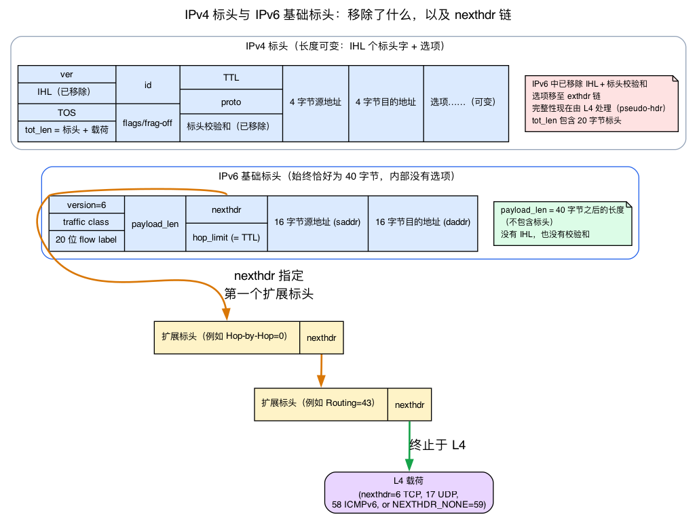
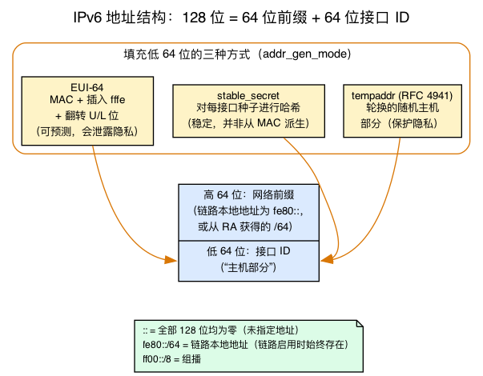
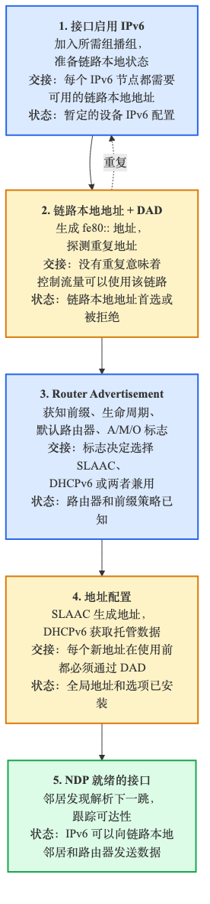
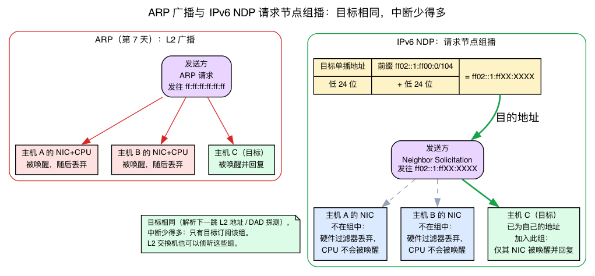
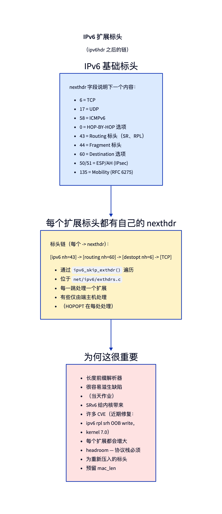

# 第10天 — IPv6 特有机制：NDP、自动配置、扩展头部

> **今日任务：**了解 IPv6 与你已经跟踪了九天的 IPv4 究竟有哪些真正不同——40 字节基本头部及其 `nexthdr` 链、带前缀/主机划分的 128 位地址、自动配置流程、取代 ARP 的邻居发现协议，以及曾导致真实 CVE 的扩展头部链。总用时：约 110 分钟。

## 为什么 IPv6 值得单独用一天讲解

IPv4 与 IPv6 共享内核网络协议栈的大部分内容：套接字层、路由基础设施、Netfilter、设备队列、qdisc。但 IPv6 有一些结构上截然不同、不能一带而过的特性：

1. **不同的基本头部和可扩展头部链。**固定 40 字节，内部没有选项，也没有校验和——另有一个 `nexthdr` 字节，可以先指向一*串*可变长度扩展头部，最后才到达 L4。
2. **内置作用域和前缀/主机划分的 128 位地址。**它不是“数字更大的 IPv4”——地址*结构*本身会驱动自动配置。
3. **自动配置。**IPv6 主机无需 DHCP，只需监听路由器通告，就能自行配置地址。
4. **NDP** 取代 ARP。思想相同（解析下一跳链路层地址），但构建于语义更丰富的 ICMPv6 上，而且关键在于使用*组播*而非广播。
5. **扩展头部。**位于 IPv6 基本头部与 L4 协议之间的可变长度链式头部。功能强大、脆弱，多年来导致过多个 CVE。

第 1～9 天学到的内容都是 IPv4 专属的：第1天的 `sk_buff`、第2天的 RX 路径和协议多路分发、第7天的 `neighbour`/ARP 子系统。IPv6 复用了其中大量机制——所以本章会充分依赖这些知识，只讲真正新增的内容。每个新概念都先建立直觉，再指向 `~/code/linux` 检出中具体的 v7.1 结构体或函数（行号来自内核 7.1）。

---

## 基本头部：固定 40 字节和一个 `nexthdr` 字节

今天的一切都建立在一个结构体上，所以先从它开始。自然的对比对象是 IPv4 头部（`struct iphdr`，`include/uapi/linux/ip.h:87`），其长度*可变*：4 位 `ihl` 字段以 32 位字为单位统计头部加选项的长度，因此可以内嵌选项。IPv6 完全抛弃了这一设计。基本头部**始终恰好为 40 字节**——没有长度字段，内部没有选项：

```c
/* include/uapi/linux/ipv6.h:118 — simplified: real struct uses endian
 * bitfield guards + __struct_group(addrs,...) wrapping saddr/daddr */
struct ipv6hdr {
        __u8    priority:4,
                version:4;          /* version == 6 */
        __u8    flow_lbl[3];        /* 8-bit traffic class is split: priority
                                       nibble + top 4 bits of flow_lbl;
                                       low 20 bits of flow_lbl = flow label */
        __be16  payload_len;        /* length of everything AFTER these 40 bytes */
        __u8    nexthdr;            /* what comes next: an L4 proto OR an ext header */
        __u8    hop_limit;          /* IPv6's name for IPv4's TTL */
        struct in6_addr saddr;      /* 16 bytes */
        struct in6_addr daddr;      /* 16 bytes */
};
```

逐字段阅读：

- **`version` = 6**，外加一个 4 位 `priority` 半字节（8 位 Traffic Class 的上半部分；下半部分位于 `flow_lbl[3]` 的最高 4 位）和一个占据 `flow_lbl[3]` 最低 20 位的 20 位 **flow label**。flow label 使路由器无需解析 L4 即可对流进行哈希。
- **`payload_len`**——如果你从 IPv4 转来，这是最大的陷阱。它是 *40 字节头部之后所有内容*的长度，**不包括头部本身**。IPv4 的 `tot_len` 包括 20 字节头部；IPv6 的 `payload_len` 不包括。（所以 `ip6_rcv_core` 会把 skb 裁剪到 `40 + payload_len`，而不只是 `payload_len`。）
- **`nexthdr`**——协议选择器。对于普通 TCP 流量，它就是 `6`。但它也可以表示一个*扩展头部*，后者又携带自己的 `nexthdr`，从而形成一条链。下文会构建这条链。
- **`hop_limit`**——与 TTL 完全相同，只是改了名称。每一跳递减；到零时丢弃数据包。
- **`saddr` / `daddr`**——两个 16 字节地址（下一节）。

### 需要牢记的三个结构差异

与 IPv4 头部（`struct iphdr`，即第2天由 `ip_rcv_core` 解析的头部）相比，有三项内容消失或改变，而每一项都解释了今天稍后会见到的一项设计决策：

1. **头部长度固定——没有 IHL 字段，基本头部中没有选项。**这*正是*选项必须移到单独的扩展头部链中的原因。固定基本头部解析成本低且可预测；可变内容放到别处。
2. **完全没有头部校验和字段。**grep 可以证明——`include/uapi/linux/ipv6.h` 中字符串 `check` 的出现次数为零。IPv4 路由器每一跳都要重新计算头部校验和（因为会递减 TTL）；IPv6 路由器无需这样做，因为根本没有校验和。完整性留给 L4 校验和（它覆盖 IPv6 伪头部）。结论是：**遍历 `nexthdr` 链是每一跳唯一的解析成本**——快速路径上无需验证/更新校验和。
3. **`hop_limit` 取代 TTL。**机制相同，名称不同。

### `nexthdr` 数字空间——理解整条链的关键

有一个核心认识可以让扩展头部“链”变得易于理解：**`nexthdr` 使用一个共享的单字节协议号空间，基本头部和每个扩展头部都以完全相同的方式使用它。**无论 `6` 位于基本头部，还是已经经过七个扩展头部，它始终表示“接下来是 TCP”。内核在 `include/net/ipv6.h:32` 中命名这些值：

```c
#define NEXTHDR_HOP        0   /* Hop-by-Hop options    */
#define NEXTHDR_TCP        6   /* TCP                   */
#define NEXTHDR_ROUTING    43  /* Routing header (SRv6) */
#define NEXTHDR_FRAGMENT   44  /* Fragment header       */
#define NEXTHDR_ESP        50  /* IPsec ESP             */
#define NEXTHDR_AUTH       51  /* IPsec Authentication  */
#define NEXTHDR_NONE       59  /* nothing follows       */
#define NEXTHDR_DEST       60  /* Destination options   */
#define NEXTHDR_MOBILITY   135 /* Mobile IPv6           */
```

因此，解析 IPv6 是一个循环：读取 `nexthdr`；如果它表示扩展头部，就解析该头部（其长度可自描述，并携带下一个 `nexthdr`），然后重复；如果它表示 L4 协议（TCP、UDP、ICMPv6……），就停止——已经到达载荷。`NEXTHDR_NONE`（59）表示“链在此结束，后面没有载荷”。

`ip6_rcv_core`（`net/ipv6/ip6_input.c:188`）是第2天 `ip_rcv_core` 的 IPv6 对应项：它验证 `version == 6`，使用 `payload_len` 把 skb 裁剪到正确长度，然后把 `nexthdr` 留给扩展头部和 L4 处理程序解析。`ipv6_rcv`（`net/ipv6/ip6_input.c:344`）是约 10 行的包装函数，调用 `ip6_rcv_core`，随后运行 Netfilter PRE_ROUTING 钩子——结构上与 IPv4 的 `ip_rcv` 完全相同。



---

## IPv6 地址解剖：128 位、作用域与 /64 划分

下文的自动配置和 NDP 会频繁使用 `fe80::/64`、`::`、`ff02::1`、“主机部分”和“前缀”——如果不知道 128 位地址究竟*是什么*，这些词就没有意义。第 1～9 天只处理过 32 位 IPv4 点分四元组（`__be32`）。IPv6 宽度是它的四倍，而且具有结构。

### 结构体：16 字节

```c
/* include/uapi/linux/in6.h:33 */
struct in6_addr {
        union {
                __u8    u6_addr8[16];   /* 16 bytes  = 128 bits */
                __be16  u6_addr16[8];   /* 8 groups of 16 bits  */
                __be32  u6_addr32[4];   /* 4 words of 32 bits   */
        } in6_u;
};
#define s6_addr   in6_u.u6_addr8        /* the byte view */
```

这与第9天之前一直使用的裸 4 字节 `__be32` 形成鲜明对比。使用联合体是因为不同代码需要不同的访问粒度——文本格式化时逐字节访问（`s6_addr[16]`），比较时则逐个 32 位字访问（`s6_addr32[4]`）；今天会看到这两种形式。

### 阅读文本表示法

这里只讲够读懂本章的内容。一个地址由**八组 16 位值**构成，以十六进制表示，用冒号分隔：`2001:0db8:0000:0000:0000:0000:0000:0001`。有两种缩写：

- **删除每组前导零**：`2001:db8:0:0:0:0:0:1`。
- **一个 `::` 可折叠一段连续的全零组**——而且只能使用一次（否则会产生歧义）：`2001:db8::1`。

现在解析本章反复出现的示例：

- **`::`**——全部 128 位为零。这是**未指定地址**，在重复地址检测期间用作*源*地址（“我还没有地址”）。
- **`fe80::/64`**——**链路本地前缀**（`fe80::` 后接 64 位主机部分）。
- **`ff02::1`**、**`ff02::2`**——**链路本地作用域组播**地址（所有节点、所有路由器）。NDP 章节会进一步讲解组播。

### /64 划分——前缀半部 + 主机半部

整个 SLAAC/EUI-64 故事都依赖这一结构。普通单播 IPv6 地址在概念上由两个 64 位半部组成：

```
|<------ 64 bits: network prefix ------>|<------ 64 bits: interface ID ------>|
   fe80::  (link-local)  OR  from an RA       the "host portion" you keep hearing about
```

- **高 64 位**是**网络前缀**——链路本地地址使用 `fe80::`，全局可路由地址则使用从路由器通告中学到的前缀。
- **低 64 位**是**接口标识符**，也称“主机部分”。EUI-64、`stable_secret` 和 `tempaddr`（都会在自动配置章节出现）只是**填充这低 64 位的三种不同方式。**

### 作用域是地址结构的一部分

在 IPv4 中，“作用域”大多只是约定；在 IPv6 中，它是地址结构本身的一部分，也是理解本章后续内容的关键：

- **链路本地**（`fe80::/10`）：永远不会被路由到链路之外。**每个接口始终都有一个**，链路启动时立即生成——在收到任何路由器消息之前。这让你在拥有全局地址*之前*就能执行 DAD 和 NDP。
- **全局**（可路由）：根据路由器通告的前缀分配。
- **组播**（`ff00::/8`）：一对多；NDP 运行的基础。

由于链路本地地址会立即存在，从链路启动的第一毫秒起，内核就能通过它进行邻居发现和地址自动配置。

### 代码从哪里开始

`addrconf_addr_gen`（`net/ipv6/addrconf.c:3417`）把上述概念落实到了代码中。它先初始化链路本地基址，再根据各接口的地址生成模式进入不同分支：

```c
/* paraphrased from addrconf_addr_gen() */
ipv6_addr_set(&addr, htonl(0xFE800000), 0, 0, 0);  /* fe80:: ... upper half */
switch (idev->cnf.addr_gen_mode) {                 /* ... then fill lower 64 bits */
case IN6_ADDR_GEN_MODE_EUI64:        /* from the MAC */
case IN6_ADDR_GEN_MODE_STABLE_PRIVACY:
case IN6_ADDR_GEN_MODE_RANDOM:
case IN6_ADDR_GEN_MODE_NONE:
}
```

四种模式是一个枚举（`include/uapi/linux/if_link.h:459`），其值正是通过 sysctl 设置的 `0/1/2/3`：

```c
enum in6_addr_gen_mode {
        IN6_ADDR_GEN_MODE_EUI64,            /* 0 */
        IN6_ADDR_GEN_MODE_NONE,             /* 1 */
        IN6_ADDR_GEN_MODE_STABLE_PRIVACY,   /* 2 */
        IN6_ADDR_GEN_MODE_RANDOM,           /* 3 */
};
```



### 常见疑问

**问：如果链路本地地址在链路启动时、收到任何路由器消息之前就会自动生成，我为什么还需要路由器通告？**

答：因为链路本地地址*不可路由*。`fe80::/10` 永远不会离开本地链路，路由器也不会转发它。它足以支持同一网段内的邻居通信以及 DAD 和 NDP，但要访问链路外的目标，还需要一个**全局可路由前缀**；主机通过自动配置获得这种前缀的唯一途径就是 RA。链路本地地址负责完成初始通信，RA 则让主机接入互联网。

**问：为什么划分总是 /64？为什么不能使用其他前缀/主机边界？**

答：因为 SLAAC 和 EUI-64 都以 **64 位接口标识符**为前提。“把主机部分追加到前缀后面”这套机制——无论是 EUI-64 向 48 位 MAC 中插入 `fffe`，还是 stable-privacy 生成 64 位哈希——天生都会得到一个 64 位低半部。长于 /64 的前缀无法为它留下足够空间，所以 SLAAC 不会在非 /64 前缀上运行。/64 边界已经固化在自动配置机制中，并非只是一项约定。

---

## 自动配置

第一次启动启用 IPv6 的接口时，内核会经历以下流程——大部分发生在用户提供任何配置之前：



### 第 1 步：分配链路本地地址

每个 IPv6 接口至少会获得一个 `fe80::/64` 中的链路本地地址。正如刚才所见，它由 `fe80::`（高 64 位）加上通过以下方式之一派生的主机部分（低 64 位）组成：

- **EUI-64**：在 MAC 地址两半之间插入 `fffe`（并翻转 U/L 位）。对于 MAC `aa:bb:cc:dd:ee:ff`，得到 `fe80::a8bb:ccff:fedd:eeff`。可以预测，但会泄露隐私——MAC 在不同网络上保持不变。
- **`stable_privacy`**（RFC 7217，通过 `stable_secret` sysctl 配置）：使用加密 RNG，将每接口种子进行哈希。每次全新启动或接口重置都不同。这就是下文 `addr_gen_mode=2` 选择的机制。
- **`tempaddr`**（RFC 4941）：隐私扩展；定期轮换主机部分。

重要的 sysctl：
- `net.ipv6.conf.<dev>.addr_gen_mode`：0 = EUI-64，1 = none，2 = stable_privacy，3 = random（初始化随机 secret，然后通过 stable_privacy 算法生成）。
- `net.ipv6.conf.<dev>.use_tempaddr`：0 = 不使用隐私地址，1 = 使用但优先 stable，2 = 优先隐私地址。

实现：`net/ipv6/addrconf.c:3417` 的 `addrconf_addr_gen`——按 `addr_gen_mode` 分支并调用正确生成器（即上面读过的函数）。

### 第 2 步：重复地址检测（DAD）

在正式启用地址前，主机会针对它发送 ICMPv6 **Neighbor Solicitation**——源地址为你现在已经认识的未指定地址 `::`，告诉所有人“我暂时声明使用这个地址”。如果有人回复，说明地址已被使用；内核会将其标记为 `dadfailed` 并拒绝使用。如果经过 `dad_transmits` 次重试（默认 1），每次间隔 `RetransTimer`（默认 1 s）仍无人回复，地址会从 `tentative` 变为 `preferred`。

不过，这个 NS 要发往*哪里*？它不是广播，而是发往目标的**请求节点组播地址**（根据地址最低 24 位派生的每地址组，将在下方 NDP 章节构建）。这个机制使 DAD（和 ARP 式查找）成本很低。现在先运行：

```bash
ip -6 addr show dev eth0     # look for 'tentative' or 'dadfailed' flags
```

规范要求必须执行 DAD；可以通过 `net.ipv6.conf.<dev>.accept_dad=0` 在少数特殊场景（尚无邻居的链路）中禁用，但绝不要在共享 LAN 上禁用。

### 第 3 步：监听路由器通告

ICMPv6 类型 134——由路由器周期性发送（内核本身不发起 RA；这由 `radvd` 等用户空间守护程序负责，其 `MaxRtrAdvInterval` 默认 600 s——RFC 4861 允许 4 s～1800 s；非请求 RA 实际以 `MinRtrAdvInterval`（默认约 200 s）与 `MaxRtrAdvInterval`（600 s）之间的随机间隔发送），或者按需响应刚启动主机发送的 **Router Solicitation**（类型 133）。RA 携带的信息包括：

- 带有链路内/自动配置标志的**前缀**列表。
- 默认路由（路由器自身）。
- MTU。
- M 标志（“Managed”——使用 DHCPv6 获取地址）。
- A 标志（“Autonomous”——使用该前缀执行 SLAAC）。
- O 标志（“Other”——使用 DHCPv6 获取 DNS 等非地址配置）。
- RDNSS 选项——递归 DNS 服务器（RFC 8106）。

如果某个前缀的 A=1，主机就运行 **SLAAC**：取通告的 64 位前缀，追加其 64 位主机部分（第 1 步的接口标识符），对结果执行 DAD，并安装地址。如果 M=1，内核会启动 DHCPv6 客户端（由用户空间处理——`dhclient -6`、`wpa_supplicant`、NetworkManager 等）。二者可以同时成立。

### 第 4 步：由 NDP 维护后续邻居状态

地址设置完成后，NDP 会持续更新邻居状态。其底层机制与第7天的 `neighbour` 子系统相同——`net/ipv6/ndisc.c:109` 中有一个 `struct neigh_table nd_tbl`，结构上与 `arp_tbl` 完全一致。它使用相同的 NUD 状态（REACHABLE、STALE 等）、相同的 GC 阈值，也通过相同的 `ip neigh show` 查看。这里**不再**重复讲解邻居子系统——有关 NUD 和 `nd_tbl` 内部原理，请回看第7天。

---

## NDP——详解 Neighbor Discovery Protocol

NDP 运行在 **ICMPv6** 上。在消息表之前，先介绍两个新的背景知识：ICMPv6 数据包究竟*如何*到达 NDP 处理程序，以及 NDP 的组播*为什么*比 ARP 广播成本低。

### 入站数据包如何到达 `ndisc_rcv`（ICMPv6 作为 NDP 载体）

NDP 消息不像第7天的 ARP 那样使用新的 EtherType。它们是 **ICMPv6 消息**——`IPPROTO_ICMPV6 = 58`，像其他 L4 协议一样位于 `nexthdr` 链的*末端*。因此，在看到 NDP 之前，前面的扩展头部遍历必须完成。

这种分发*机制*是第2天已注册处理程序多路分发的 IPv6 对应项，所以不再重复讲解：**`inet6_protos[]` 是第2天 `inet_protos[]` 的 IPv6 对应项**——它是一个受 `RCU` 保护、大小为 `MAX_INET_PROTOS` 的 `struct inet6_protocol` 数组，按协议号索引（`net/ipv6/protocol.c:25`）。ICMPv6 把自己注册在槽位 58（`net/ipv6/icmp.c:96`）：

```c
static const struct inet6_protocol icmpv6_protocol = {
        .handler = icmpv6_rcv,        /* net/ipv6/icmp.c:1101 */
        ...
};
```

真正新增的是 ICMPv6 内部的第二级多路分发。与 IPv4 的 `icmp_rcv`（只承载回显和错误消息）不同，ICMPv6 身兼数职——既承载回显和错误消息，也承载整个邻居发现控制平面，以及另一套 MLD 消息。因此，`icmpv6_rcv` 会根据 ICMPv6 的*类型字节*执行 switch，并把五种 NDP 类型（133～137）交给 `ndisc_rcv`（`net/ipv6/icmp.c:1188`）：

```c
/* icmpv6_rcv(), net/ipv6/icmp.c */
case NDISC_ROUTER_SOLICITATION:
case NDISC_ROUTER_ADVERTISEMENT:
case NDISC_NEIGHBOUR_SOLICITATION:
case NDISC_NEIGHBOUR_ADVERTISEMENT:
case NDISC_REDIRECT:
        reason = ndisc_rcv(skb);
```

随后，`ndisc_rcv`（`net/ipv6/ndisc.c:1805`）再次按类型执行 switch，进入具体处理程序——Neighbor Solicitation 对应 `ndisc_recv_ns`（`net/ipv6/ndisc.c:1831`），通告对应 `ndisc_recv_na`（`net/ipv6/ndisc.c:1836`），依此类推。这两级 switch 把“NDP 运行在 ICMPv6 上”与下方各处理程序完整衔接起来。IPv6 中**没有 ARP EtherType，也没有独立的 ARP 处理程序**——所有消息都汇入这一个 `inet6_protos` 槽位。

### 五种消息类型

| 类型 | 名称 | 用途 |
|------|------|---------|
| 133 | Router Solicitation | “链路上有路由器吗？”——主机启动时发送 |
| 134 | Router Advertisement | 路由器通告自身及前缀 |
| 135 | Neighbor Solicitation | “谁拥有这个地址？”（≈ ARP 请求）；也用于 DAD |
| 136 | Neighbor Advertisement | 对 NS 的回复；也可主动发送（≈ 无偿 ARP） |
| 137 | Redirect | “发往 X 的数据包请经 Y 发送，不要再经我” |

（类型常量：`include/net/ndisc.h:9`——`133` RS、`134` RA、`135` NS、`136` NA、`137` Redirect。）

### 为什么 NS 比 ARP 广播成本低：请求节点组播

第7天的 ARP 通过在 L2 **广播**来解析邻居——网段上的每块 NIC 都会收到并处理该帧，然后（几乎全部）将其丢弃。NDP 使用**组播**做得更好，比较表中“基于组播，节省带宽”真正指的就是这个机制。

最小组播模型：
- **`ff00::/8`** 是整个组播地址空间。**第二个半字节编码作用域**——`ff02::` 是链路本地作用域（NDP 只需要这一种作用域）。
- 两个会立即遇到的地址：**`ff02::1`**（所有节点）和 **`ff02::2`**（所有路由器——Router Solicitation 发往这里）。

关键在于**请求节点组播地址**。对于任意目标单播地址，取其**最低 24 位**，追加到众所周知的前缀 `ff02::1:ff00:0/104` 后，便得到 `ff02::1:ffXX:XXXX`。主机会为自己的**每个地址加入对应的请求节点组。**因此，想解析某个特定地址或对它执行 DAD 探测时，只需把 NS 发往*该地址对应的*请求节点组——而在绝大多数情况下，**只有目标订阅了该组**，所以只有目标 NIC 会触发中断。其他主机的硬件组播过滤器会直接丢弃该帧，不必唤醒 CPU。它实现了与 ARP 广播相同的目标，却显著减少中断；L2 交换机还可以侦听这些组。

内核通过一个辅助函数计算它（`include/net/addrconf.h:484`）：

```c
static inline void addrconf_addr_solict_mult(const struct in6_addr *addr,
                                             struct in6_addr *solicited)
{
        ipv6_addr_set(solicited,
                      htonl(0xFF020000), 0,         /* ff02::         */
                      htonl(0x1),                   /* ...1:          */
                      htonl(0xFF000000) | addr->s6_addr32[3]); /* ff + low 24 bits */
}
```

这个机制把第 2、3 步衔接起来。DAD（第 2 步）会针对*暂定*地址发送 NS，以 `::` 为源地址，以**该地址对应的请求节点组播地址**为目标——目标地址正由这个辅助函数计算。NS 的发送路径会调用它：`net/ipv6/ndisc.c:382` 与 `net/ipv6/ndisc.c:395` 都使用 `addrconf_addr_solict_mult` 选择目标。`ndisc_send_na`（`net/ipv6/ndisc.c:524`）则携带表中提到的 solicited/override/router 标志。NA 会安装一个 neigh 条目——仍然使用第7天介绍的 `nd_tbl`/NUD 机制。



实现入口：
- `ndisc_recv_ns`——接收 Neighbor Solicitation。
- `ndisc_recv_na`——接收通告。
- `ndisc_send_na`、`ndisc_send_ns`——发送。

`net/ipv6/ndisc.c` 约 2000 行，但大部分是选项解析。

与 ARP 相比，NDP 在其他方面也更丰富：
- 可通过 SEND（RFC 3971）进行**认证**，尽管很少部署。
- 主动**检测不可达性**（双向可达性检查，而非只按需进行）。
- **携带选项**，包括 MTU、源链路层地址、前缀信息、路由信息。

---

## 扩展头部——能力与陷阱

本章开头已经介绍了 `nexthdr` 链，现在来看看如何遍历它。基本头部为 40 字节；其中的 `nexthdr` 可以指向一个*扩展头部*，后者又携带自己的 `nexthdr`，由此形成一条最终抵达 L4 协议（或 `NEXTHDR_NONE`）的链：



### 链中的头部

- **Hop-by-Hop Options（0）**——路径上的每个路由器都必须处理。用于巨型数据报 Jumbogram（>64KB）、MLD 和 RPL。如果存在，必须位于首位。
- **Routing（43）**——用于 SRv6、RPL 的 Source Routing Header（SRH）。
- **Fragment（44）**——IPv6 分片（只能由源主机执行；路由器不分片）。
- **Destination Options（60）**——终端主机选项。
- **Authentication Header（51）** / **ESP（50）**——IPsec。
- **Mobility（next-header 135——不同于上面 ICMPv6 消息*类型* 135，即 Neighbor Solicitation；二者属于不同命名空间）**——Mobile IPv6。

每种扩展头部都由注册在 `inet6_protos[]`（也就是 ICMPv6 所在的表）中的对应协议处理程序解析。Routing 处理程序是 `ipv6_rthdr_rcv`（`net/ipv6/exthdrs.c:658`），Destination 处理程序是 `ipv6_destopt_rcv`（`net/ipv6/exthdrs.c:299`），依此类推。

### 一个选项如何编码：TLV 格式

Hop-by-Hop 与 Destination Options 头部不携带固定字段——它们携带一组 **TLV**（Type-Length-Value）记录；要理解下方检查题和 CVE 类别，必须知道这种布局。

每个选项分为三部分：

```
+--------+--------+--------------------------+
| Type   | Length | Value (Length bytes)     |
| 1 byte | 1 byte | <-- exactly Length -->   |
+--------+--------+--------------------------+
```

- **Type**（1 字节）——选项类型。
- **Length**（1 字节）——后续 **Value** 的长度。
- **Value**（`Length` 字节）——选项数据。

Hop-by-Hop 或 Destination Options 头部就是一条这样的 TLV 链，并用两个特殊选项填充到 8 字节对齐：**Pad1**（一个零字节）和 **PadN**（值为 N 个零字节的 TLV）。**这是经典的“带长度前缀的缓冲区解析器”模式**——而 Length 字节**由攻击者控制**，这就是整个 CVE 故事的起点。

### Type 字节的最高两位：未知选项动作

这是检查题依赖的确切机制。**Type 字节的最高 2 位**告诉节点，在无法识别选项时**必须**执行什么操作：

| 最高 2 位 | 遇到未知选项时的动作 |
|-----------|--------------------------|
| `00` | **跳过**该选项并继续解析 |
| `01` | **丢弃**数据包，不发出通知 |
| `10` | **丢弃**并且**始终**发送 ICMPv6 Parameter Problem |
| `11` | **丢弃**；只有目标*不是*组播时才发送 Parameter Problem |

（另一个标志位 `0x20` 用来表示该选项是否可在*传输途中改变*——这与 Authentication Header 有关。）

内核在 `ip6_tlvopt_unknown`（`net/ipv6/exthdrs.c:65`）中精确实现了这一行为；`ip6_parse_tlv`（`net/ipv6/exthdrs.c:114`）会为每个无法识别的选项调用它。它根据这两个位分发（`net/ipv6/exthdrs.c:79` 的 switch）：

```c
switch ((skb_network_header(skb)[optoff] & 0xC0) >> 6) {
case 0: /* ignore */                 return true;   /* skip, keep parsing */
case 1: /* drop packet */            break;         /* silent drop        */
case 3: /* ICMP unless multicast */  ... fallthrough;
case 2: /* send ICMP, always drop */ icmpv6_param_prob_reason(...); return false;
}
```

`ip6_tlvopt_unknown` 由 `ip6_parse_tlv` 的选项循环（`net/ipv6/exthdrs.c:195` 和 `:211`）调用；该循环通过 `ipv6_destopt_rcv`（`net/ipv6/exthdrs.c:329`）处理 **Destination Options**，并在 `net/ipv6/exthdrs.c:1084` 处理 **Hop-by-Hop**；`hopbyhop` 布尔参数区分两个调用方。Jumbo Payload 选项的解析器 `ipv6_hop_jumbo`（`net/ipv6/exthdrs.c:996`）由 Hop-by-Hop 选项表分发——这是一个很小但很有启发性的长度字段解析器，而且历史上曾出现错误。

### 为什么它很危险

扩展头部解析器位于网络协议栈深处，是用 C 编写的长度前缀缓冲区解析器，而每个 TLV 的 Length 字节都由攻击者控制。如果解析器信任该 Length，却不根据头部自身声明的长度进行边界检查，就会产生一类不断重现的错误。多年来，这类解析器一直是 CVE 的来源：

- **2026（内核 7.1）：**SRv6 RPL 越界写——`ipv6_rpl_srh_rcv`（`net/ipv6/exthdrs.c:491`）可能压入一个超过预留头部空间的重新压缩 SRH，导致 `skb_mac_header_rebuild`（在 `net/ipv6/exthdrs.c:615` 调用）把 `mac_header` 下溢至约 65530，并让 `memmove` 在 `skb->head` 之后约 64KiB 处写入 14 字节。修复提交为 `9e6bf146b559`。
- **2022：**设置 HMAC 数据时，SRv6 Segment Routing Header 发生越界读取（CVE-2022-48687，“IPv6 SR：修复设置 HMAC 数据时的越界读取”）。
- `ipv6_hop_jumbo`（`net/ipv6/exthdrs.c:996`）中的多种 jumbogram 错误。

共同模式是：攻击者控制扩展头部的*长度*，解析器却错误计算了需要分配的内存或实际有效的字节数。（2026 年的 SRv6 错误属于 skb 缓冲区布局问题——`mac_header` 下溢，`memmove` 越过 `skb->head`。这正对应**第1天 `sk_buff` 章节**讲过的 head/data/tail/end 与预留头部空间的关系；请回看该章，这里不再推导。）编写扩展头部解析器时，从一开始就应把它列为模糊测试目标。

### 跳过链

为了到达 L4，代码会调用 `ipv6_skip_exthdr(skb, start, &nexthdr, &frag_off)`——遍历链直到遇到非扩展 `nexthdr`，然后返回偏移。签名如下（`net/ipv6/exthdrs_core.c:72`）：

```c
int ipv6_skip_exthdr(const struct sk_buff *skb, int start,
                     u8 *nexthdrp, __be16 *frag_offp);
```

注意事项：

- 某些 L4 查找需要跳过*所有*扩展头部；另一些调用方（例如 conntrack）则要检查特定头部。
- 格式错误的链（循环、过大）会让 `ipv6_skip_exthdr` 返回 `-1`，内核随即丢弃数据包。
- 它接受 `frag_off`，因为 Fragment 头部表明数据包是一个更大原始数据包的一部分——调用方可能需要推迟处理。

---

## 今日实验

```bash
# See your IPv6 addresses and their states
ip -6 addr show
# Look for: 'global', 'mngtmpaddr', 'dynamic', 'tentative', 'deprecated'

# Watch DAD on bring-up
sudo bpftrace -e 'fentry:ndisc_send_ns {
  printf("NS sent target=%s\n", ntop(args->solicit->in6_u.u6_addr8));
}' &
sudo ip link set eth0 down && sleep 1 && sudo ip link set eth0 up

# Watch NDP traffic globally
sudo tcpdump -i eth0 -nn icmp6 and not host ::

# Inspect autoconfiguration sysctls for one interface
sysctl net.ipv6.conf.eth0 | grep -E "addr_gen_mode|accept_ra|use_tempaddr|dad_transmits"

# Trace extension-header parsing
sudo bpftrace -e 'fentry:ipv6_skip_exthdr { printf("skip nexthdr=%d start=%d\n", *args->nexthdrp, args->start); }'
```

## 内核源码阅读指南

- **`net/ipv6/ip6_input.c:188`**——`ip6_rcv_core`。IPv6 接收核心逻辑（约 145 行，其中约 80 行是真正逻辑）。`ipv6_rcv`（第 344 行）是约 10 行的包装函数，调用 `ip6_rcv_core`，然后运行 Netfilter PRE_ROUTING 钩子。注意它如何解析基本头部、验证 `version=6`、按 `payload_len` 裁剪，再通过注册的 `inet6_protos[]` 表分发——模式与 IPv4 的 `ip_rcv` 相同，只是第一个处理程序是扩展头部解析器。

- **`net/ipv6/addrconf.c`**——自动配置状态机。约 7600 行，但只需关注几个入口：
  - `addrconf_dad_start`（搜索函数；没有固定行号）——启动 DAD。
  - `addrconf_rs_timer`——未收到路由器消息时周期性发送 RS 请求。
  - `addrconf_prefix_rcv`——处理 RA 中的前缀：安装地址并对其执行 DAD。
  - `addrconf_addr_gen`（第 3417 行）——生成主机部分。

  先阅读文件顶部的注释；其模型是每个 `inet6_dev` 一个状态机。

- **`net/ipv6/ndisc.c:109`**——`nd_tbl`，邻居表实例。其结构体与 IPv4 的 `arp_tbl` 完全相同——这证明了邻居子系统的通用性。周围的 `ndisc_recv_ns`、`ndisc_recv_na`、`ndisc_send_na`、`ndisc_send_ns` 是协议处理程序；`ndisc_rcv`（第 1805 行）是它们所依附的类型 switch。

- **`net/ipv6/exthdrs.c`**——扩展头部解析器。
  - `ipv6_rthdr_rcv`（第 658 行）：Routing 头部。阅读它来理解 SRv6——开发最活跃的扩展，也是大多数 CVE 所在之处。
  - `ipv6_destopt_rcv`（第 299 行）：Destination Options。更简单，适合热身。调用 `ip6_parse_tlv`。
  - `ip6_parse_tlv`（第 114 行）：通用 TLV 遍历器，未知选项动作在第 79 行分发。
  - `ipv6_hop_jumbo`（第 996 行）：HOPOPT 中 Jumbo Payload 选项的解析器。很小，但很有启发性。

- **`include/uapi/linux/in6.h`** 和 **`include/net/ipv6.h`**——规范结构体（`struct ipv6hdr`、`struct in6_addr`、`NEXTHDR_*` 常量）。

- **`Documentation/networking/ipv6.rst`**——概述。内容不多，但提供了 RFC 编号指引。

- **建议浏览的 RFC**：8200（IPv6 规范）、4861（NDP）、4862（SLAAC）、4941（隐私扩展）、7136（修改版 EUI-64）、8754（SRv6）。

## 要点回顾

- **基本头部固定为 40 字节**：version=6、一个 `priority` 半字节加 `flow_lbl[3]`（二者共同容纳 8 位 traffic class——priority + flow_lbl 的最高 4 位——以及位于 flow_lbl 最低 20 位的 20 位 flow label）、`payload_len`（头部**之后**的长度——不同于 IPv4 `tot_len`）、`nexthdr`、`hop_limit`（TTL 改名）、两个 16 字节地址。**没有 IHL，没有头部校验和**——选项移入扩展头部链。
- `nexthdr` 是**共享的协议号空间**（6=TCP、0=HopByHop、43=Routing、44=Fragment、59=None、60=DestOpts）：以循环方式解析，直到遇到 L4 协议。
- **IPv6 地址是 128 位**（`struct in6_addr`，16 字节），分为 **64 位前缀 + 64 位主机部分**。`::` = 未指定，`fe80::/64` = 链路本地（始终存在），`ff00::/8` = 组播。
- IPv6 主机自动配置：立即生成链路本地地址（fe80::/64），根据 RA 获得全局地址。
- **地址生成模式**（`addr_gen_mode`）：EUI-64（0，内核默认）、none（1）、stable_privacy（2）、random（3）。
- **DAD** 是强制要求：以 `::` 为源地址，向暂定地址对应的**请求节点组播组**（`ff02::1:ffXX:XXXX`，取目标最低 24 位）发送 NS，等待确认后再启用该地址。
- **请求节点组播**是 NDP 优于 ARP 的原因：只有目标主机订阅该组，因此只有它的 NIC 被唤醒——相比之下，ARP L2 广播会由每台主机处理。
- **ICMPv6（协议 58）承载 NDP。**`inet6_protos[]`（第2天 `inet_protos[]` 的对应项）→ `icmpv6_rcv` →（按类型 switch）→ `ndisc_rcv` → `ndisc_recv_ns`/`_na`/……
- **NDP** = ICMPv6 消息 133～137：RS、RA、NS、NA、Redirect。它取代 ARP。`neighbour` 子系统（`nd_tbl`）在结构上与 IPv4 的 `arp_tbl` 相同（第7天）。
- **扩展头部**链接在 IPv6 基本头部和 L4 之间。由 `ipv6_skip_exthdr` 遍历。重要类型：HopByHop（0）、Routing（43，SRv6）、Fragment（44）、DestOpts（60）、AH/ESP（51/50）。
- HopByHop/DestOpts 选项使用 **TLV 编码**（Type、Length、Value）。**Type 的最高 2 位**选择遇到未知选项时的动作：跳过 / 丢弃 / 丢弃+ICMP / 丢弃+ICMP（目标非组播时）（`ip6_parse_tlv`）。
- 扩展头部解析器必须处理由攻击者控制的 Length 字节——这是反复出现的 CVE 来源，也应成为模糊测试的重点区域。

## 检查题

一个节点收到 IPv6 数据包，其第一个扩展头部为 `nexthdr=0`（Hop-by-Hop Options）。即使数据包是发给某个对端（并非发给本机），内核也必须执行什么操作？

<details>
<summary>点击查看答案</summary>

**答案：**处理 Hop-by-Hop 选项。HopByHop 很特殊——路径上的每个路由器都必须检查它，无论数据包的目标是否为本机。（这正是“hop-by-hop”的含义。）内核会在基本头部后立即通过上文介绍的同一个 `ip6_parse_tlv` 遍历器（其 `hopbyhop` 调用方）解析 Hop-by-Hop 选项。如果某个选项未知，而且选项类型字节的高位设置为“遇到未知选项时丢弃数据包”，该数据包就会被丢弃（并可能返回 ICMPv6 Parameter Problem）。Destination Options 等其他扩展只在目标处处理——内核会在转发路径上跳过它们。Hop-by-Hop 的处理要求也解释了为什么这个头部如果存在就**必须**是第一个扩展头部；位于更后面不符合规范。

</details>

---

## 明天

第11天：网桥子系统。把 Linux 用作软件 L2 交换机。
