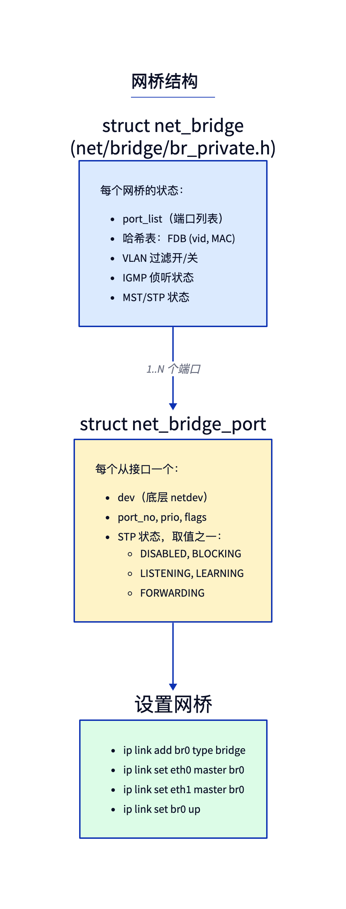
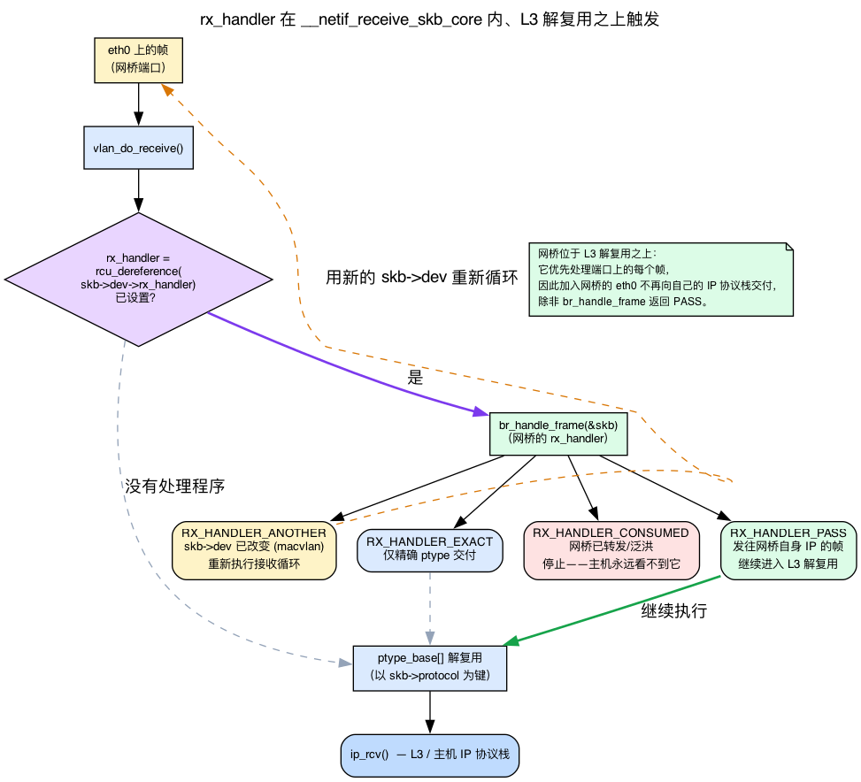
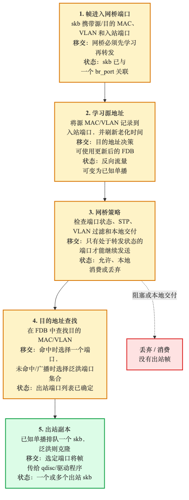
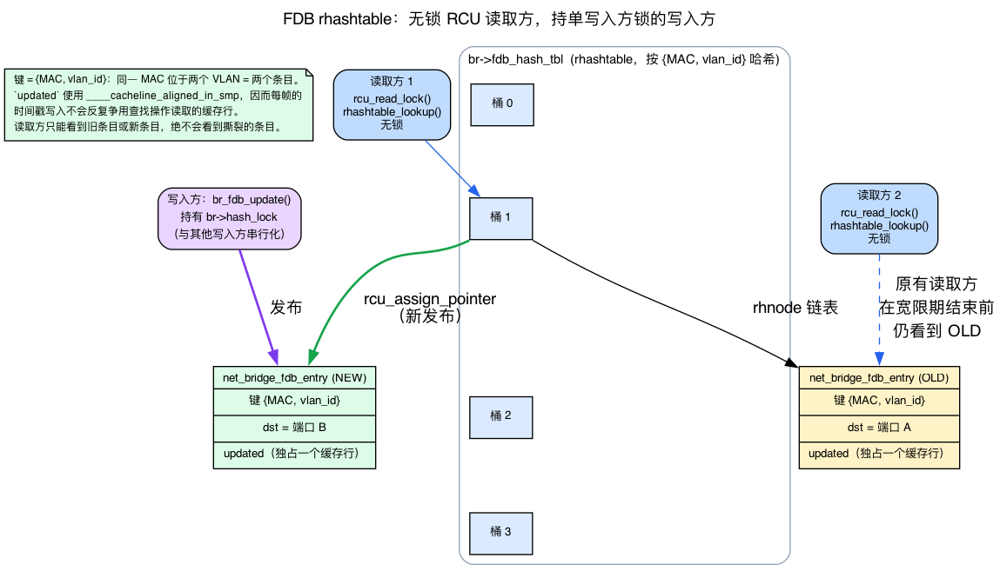
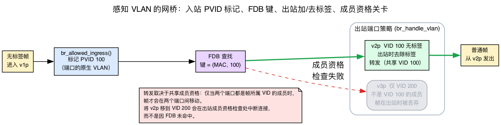
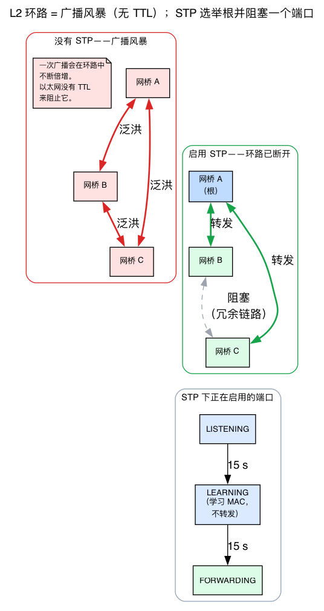

# 第11天 — 网桥子系统

> **今日任务：** 创建一个 Linux 软件网桥，将两个接口连接到网桥，并在流量经过时观察 FDB 学习 MAC。一路上，你会学习网桥赖以构建的四种机制——劫持 NIC 帧的 `rx_handler` 钩子、让 FDB 读取者无锁运行的 RCU 保护哈希表、为什么 L2 环路会带来灾难性后果（以及生成树如何应对），以及 `br_netfilter` 如何把桥接帧拉入 iptables——还会了解支持 VLAN 的网桥如何提供真正的交换机行为。总耗时：约 110 分钟。

## 什么是 Linux 网桥，以及为什么你的系统里会有它

Linux 网桥是一台软件 L2 交换机。它看起来像一个 netdev（可以给它分配 IP、对它执行 ping、配置经由它的路由），但它的职责是根据目标 MAC 在成员端口之间转发以太网帧。和任何交换机一样，它会*学习*哪个 MAC 位于哪个端口之后，并把这种映射存入名为 **FDB**（转发数据库）的表中。其实现位于 `net/bridge/`（顶层 `.c` 文件约 29k 行）。

即使你从未显式创建过网桥，也一直在使用它：

- **容器运行时。**Docker 默认创建 `docker0`；Podman 创建 `cni-podman0`；CNI 插件创建 `cni0`/`cbr0`。它们都是把容器 veth 接入主机网络的 Linux 网桥。
- **虚拟机。**libvirt 的“default”网络是一个网桥（`virbr0`）；qemu 中的 `bridge=br0` 模式会把虚拟机的 TAP（一种把帧交给 qemu 之类用户空间进程的软件 NIC）直接接入主机网桥。
- **充当交换机的多 NIC 服务器。**带有多块以太网 NIC 的机器可以通过一条 `ip link add br0 type bridge`，再为每个端口执行 `ip link set <if> master br0`，把它们桥接起来。

网桥是内核中最快的 L2 转发平面——它比 IP 路由路径快得多，因为它只按目标 MAC 进行交换，跳过了 L3 所做的一切：没有 L3/FIB 查找，不递减 TTL，也不重写首部校验和，并且（默认情况下——参见 `br_netfilter`）不经过 netfilter，也不执行解封装。

本章依赖四种此前各天都未讲过的机制：把从属 NIC 收到的帧转入网桥代码的 **`rx_handler`** 钩子；支撑转发数据库的 **RCU 保护 `rhashtable`**；解释交换机为何需要 STP 的**广播风暴/生成树**问题；以及 `br_netfilter` 暴露的 **netfilter 链**。我们会在网桥依赖每种机制的位置讲解它们——先建立直觉，再看具体的 v7.1 结构体或函数。

> 今天有两个来自前面章节的概念至关重要，**不会**重新讲解：
> - **RX 路径。**回忆第2天——NIC 的 NAPI 轮询构建 skb，然后 `__netif_receive_skb_core` 遍历 `ptype_base` 哈希表，寻找 L3 处理程序（IPv4 对应 `ip_rcv`）。今天的全部内容都围绕一个在该多路分派*之前*触发的钩子展开。
> - **CPU 缓存行。**回忆第1天——CPU 以 64 字节行为单位读取内存，因此写入频繁的字段会与以读取为主的缓存行分开，避免伪共享。我们会在 FDB 条目中再次遇到这一思想。

## 结构剖析



一个网桥由两个协同工作的结构体组成：

- **`struct net_bridge`**（`net/bridge/br_private.h:495`）——网桥本身。它保存 FDB（转发数据库）——任何 L2 交换机的核心，即 MAC 地址到端口的映射表——以及端口列表、VLAN 配置、IGMP 侦听状态、MST/STP 状态。每个 `brN` netdev 对应一个实例。
- **`struct net_bridge_port`**（`net/bridge/br_private.h:387`）——每个从属接口对应一个。它保存 `dev` 指针（底层 netdev）、端口号、STP 状态（DISABLED、LEARNING、FORWARDING……）以及每端口标志（BPDU 防护、根防护、发夹模式等）。

执行 `ip link set eth0 master br0` 时，内核把一个 `net_bridge_port` 连接到 `eth0`，将 `br_handle_frame` 注册为 `eth0` 的 `rx_handler`，之后从属接口的帧就会流入网桥逻辑，而不是普通协议栈。这句话隐藏了本章最重要的机制——下面把它展开。

## 背景 1：`rx_handler`——如何接管从属 NIC 的帧

回忆第2天的 RX 路径：帧通过 DMA 进入，NAPI 构建 skb，随后 `__netif_receive_skb_core` 索引 `ptype_base`，索引依据是 `skb->protocol`，由此找到唯一的 L3 处理程序（`ip_rcv`、IPv6 处理程序、ARP……）。这就是“普通协议栈”。网桥必须在 L3 多路分派运行*之前*拿到帧——否则，发往其他主机的帧会被送入*本机*的 IP 协议栈，而不是从另一个端口交换出去。

内核恰好为此提供了 **`rx_handler`** 钩子。

### 每个 netdev 一个函数指针

每个 `struct net_device` 都有一个可选且唯一的 `rx_handler` 槽位（`include/linux/netdevice.h:2189`）：

```c
rx_handler_func_t __rcu  *rx_handler;
void __rcu               *rx_handler_data;
```

设置该指针后，`__netif_receive_skb_core` 会在第2天跟踪过的 `ptype_base` 数据包类型遍历**之前**调用它。因此，rx_handler 恰好位于 RX 路径中原本将运行 L3 多路分派的位置，并拥有对帧的优先处理权。每个设备只能有一个 rx_handler——注册第二个会返回 `-EBUSY`（`include/linux/netdevice.h:461-477`）。网桥、bonding、macvlan 和 OVS 都争用同一个插件槽位；所谓“加入 master”的设备，就是安装了 rx_handler 的设备。

### 返回值决定帧的命运

处理程序通过 `enum rx_handler_result`（文档位于 `include/linux/netdevice.h:461-477`）告诉接收路径如何处理 skb。重要的两个值是：

- **`RX_HANDLER_CONSUMED`**——“我已经接管 skb；不要再处理它。”该帧不会到达 `ptype_base`，也不会在*从属 NIC 上*到达 `ip_rcv`。网桥对**每个**数据帧都返回这个值——包括发往网桥自身 IP 的帧。最后一种情况较为微妙：`br_handle_frame` 仍返回 CONSUMED，但 `br_handle_frame_finish` 会发现目标是一个 `BR_FDB_LOCAL` 条目，并调用 `br_pass_frame_up()`；后者把 skb **重新注入**网桥 netdev（`skb->dev = br0`），并通过 `netif_receive_skb`（`net/bridge/br_input.c:218-220`）继续处理。因此，“对 `br0` 执行 ping”依靠的是在 `br0` 上重新注入，而*不是*让帧从属端口继续通过。
- **`RX_HANDLER_PASS`**——“什么也不做；像没有运行处理程序一样继续。”网桥仅在真正需要继续通过时使用它：`PACKET_LOOPBACK`，以及通过 `__br_handle_local_finish` 在本地消费的链路本地控制帧（STP BPDU、LLDP）。帧**不是**通过这种方式到达网桥自身 IP 的。

（另外还有两个值——`RX_HANDLER_ANOTHER`，表示因 `skb->dev` 已变化而重新循环；以及 `RX_HANDLER_EXACT`，表示强制精确投递——今天网桥并不依赖它们。）

### 网桥在哪里安装它

回到 `br_add_if`（`ip link set eth0 master br0` 背后的代码路径），网桥会注册自己的处理程序（`net/bridge/br_if.c:613`）：

```c
err = netdev_rx_handler_register(dev, br_get_rx_handler(dev), p);
```

这一次调用完成三件事：

1. `br_get_rx_handler(dev)`（`net/bridge/br_input.c:463`）为普通端口返回 **`br_handle_frame`**（DSA 交换机端口使用特殊的虚拟处理程序）。
2. `netdev_rx_handler_register` 把 `br_handle_frame` 放入 `dev->rx_handler`。
3. 第三个参数——`p`，即 `net_bridge_port`——保存为 `rx_handler_data`，这样以后帧到达时，`br_handle_frame` 就能找回它属于*哪个端口和哪个网桥*。

`br_handle_frame` 本身位于 `net/bridge/br_input.c:339`：

```c
static rx_handler_result_t br_handle_frame(struct sk_buff **pskb)
```



因此，整体图景是：从属 NIC 上的帧到达 `__netif_receive_skb_core`，后者检查 `dev->rx_handler`。该字段已经设置，于是运行 `br_handle_frame`。对于任何数据帧——无论是被交换的帧，还是发往网桥自身 IP 的帧——它都会返回 `RX_HANDLER_CONSUMED`，所以从属 NIC 的视角看，该帧已经消失。发往网桥自身 IP 的帧仍会到达 `ip_rcv`，但方式是在 `br0` 上**重新注入**（经由 `br_pass_frame_up` → `netif_receive_skb`），而不是继续落入从属接口的 `ptype_base` 多路分派。`RX_HANDLER_PASS` 只保留给回环帧和在本地处理的链路本地控制帧。

## 转发决策



对于到达网桥端口的每个帧，内核都会运行同一棵紧凑的决策树：

1. **丢弃或转发控制帧。**STP BPDU（桥协议数据单元——生成树控制帧，将在背景 3 中介绍；目标为 `01:80:c2:00:00:00`）会得到特殊处理；非网桥组播可能被泛洪，也可能被侦听。
2. **学习源地址。**在 FDB——转发数据库，其内部结构见下方背景 2——中插入或刷新 `(src MAC, vid, port)`，具体通过 `br_fdb_update`（`net/bridge/br_fdb.c:972`）完成。老化定时器随之推进。
3. **查找目标地址。**`br_fdb_find_rcu`（`net/bridge/br_fdb.c:263`）遍历哈希表。
4. **作出决定：**
   - **命中，同一端口** → 丢弃（不要把帧环回其来源）。
   - **命中，不同端口** → `br_forward`（`net/bridge/br_forward.c:144`）——仅从该端口发出。
   - **未命中** → `br_flood`（`net/bridge/br_forward.c:201`）——发送到除输入端口外的每个端口。
   - **广播/组播**——泛洪，可能受 IGMP/MLD 侦听过滤。

“未命中 → 泛洪”这条规则让网桥能够*自学习*。最初的帧会被泛洪；应答会让 FDB 学到源地址所在端口；后续帧则使用单播。

实际入口点是 **`br_handle_frame`**（`net/bridge/br_input.c:339`），接口加入网桥时，它会被注册为 rx_handler。沿着 `br_handle_frame` → `br_handle_frame_finish`（`net/bridge/br_input.c:76`）这条路径，即可在约 250 行代码中看完整个 L2 转发过程。

## 背景 2：FDB 是受 RCU 保护的 `rhashtable`

上面的第 2 步和第 3 步都会访问 FDB——一次写入、一次读取——而且发生在**每一个帧**上。在线速下，这意味着每秒数百万次查找，因此底层数据结构必须允许读取者运行时永不互相阻塞，也不阻塞写入者。两个内核机制实现了这一点，而此前都没有介绍过，下面从头建立理解。

### `rhashtable`：内核的可调整大小哈希表

`rhashtable` 是内核通用且会自动调整大小的哈希表。FDB 用一个很小的参数块对其进行配置（`net/bridge/br_fdb.c:27`）：

```c
static const struct rhashtable_params br_fdb_rht_params = {
    .head_offset = offsetof(struct net_bridge_fdb_entry, rhnode),
    .key_offset  = offsetof(struct net_bridge_fdb_entry, key),
    .key_len     = sizeof(struct net_bridge_fdb_key),
    .automatic_shrinking = true,
};
```

**键**不只是 MAC，而是 `{MAC, vlan_id}` 对（`net/bridge/br_private.h:286`）：

```c
struct net_bridge_fdb_key {
    mac_addr addr;
    u16      vlan_id;
};
```

仅这一事实就解释了你在后面 VLAN 实验中将看到的行为：两个不同 VLAN 中的*同一个* MAC 地址对应*两个*独立的 FDB 条目，因为 VID 是键的一部分。查找操作是 `rhashtable_lookup(tbl, &key, br_fdb_rht_params)`（`net/bridge/br_fdb.c:216`）。

### 一段话讲清 RCU（这里首次出现）

**RCU（Read-Copy-Update，读取-复制-更新）**是一种针对读多写少数据优化的同步方案。读取者**完全不加锁**：它们调用 `rcu_read_lock()`、遍历结构，再调用 `rcu_read_unlock()`。写入者要删除条目时，先解除链接，让新的读取者无法找到它，然后**推迟实际释放内存，直到所有可能仍持有该指针的读取者都已结束**（即“宽限期”）。这给 FDB 带来了巨大收益：即使另一个 CPU 正忙于学习新 MAC，每帧转发快速路径也能零锁竞争地查找目标。

按照约定，**`_rcu` 后缀**出现在 `br_fdb_find_rcu` 名称中，正是在声明：“必须在 RCU 读取侧临界区内调用我，而且我返回的指针只在 `rcu_read_unlock()` 之前有效。”因此：

- **读取者**——转发路径——调用 `br_fdb_find_rcu`（`net/bridge/br_fdb.c:263`）→ `rhashtable_lookup`，每帧不加锁。
- **写入者**——学习路径——调用 `br_fdb_update`（`net/bridge/br_fdb.c:972`）。关键是，常见的每帧情况（源地址*已经存在*）会**无锁**刷新条目的 `updated`/`dst` 字段，具体通过 `WRITE_ONCE()` 完成——完全不加锁。只有在获取 `br->hash_lock`（`net/bridge/br_private.h:497`）后才能走插入全新条目（`fdb_create`）或删除条目的慢速路径。

### 再次呼应第1天的缓存行

每个学习帧都会改动 `updated` 时间戳——它写入频繁。FDB 查找字段（`key`、`dst`）则以读取为主。如果它们共享一个 64 字节缓存行，每次写入老化时间戳都会使查找正在读取的缓存行失效——这就是*伪共享*（回忆第1天）。因此，内核特意把 `updated` 放在单独的缓存行中（`net/bridge/br_private.h`）：

```c
/* write-heavy members should not affect lookups */
unsigned long  updated ____cacheline_aligned_in_smp;
```

这个 `____cacheline_aligned_in_smp` 运用了第1天的缓存行知识，把写入频繁的老化数据移出以读取为主的查找路径。



综合来看：读取者无锁运行。写入者通过 `rhashtable` 插入（`hlist_add_head_rcu`）让新条目以原子方式变得可见，而删除条目的内存只会在一个 RCU 宽限期后回收——因此，正在并发遍历的读取者总能看到一致且完整的条目，绝不会看到撕裂或已释放的条目。对已有源地址的 `updated`/`dst` 字段进行每帧刷新，是一次无锁的原地 `WRITE_ONCE()`，既不加锁，也不需要宽限期。这就是 FDB 查找得以扩展的原因。

## 支持 VLAN 的网桥

默认情况下，网桥忽略 VLAN 标签——它只是一台 L2 交换机。开启 VLAN 感知：

```bash
sudo ip link set br0 type bridge vlan_filtering 1
```

此时网桥会实现正确的 802.1Q 交换：

- 每个端口都有允许通过的 VLAN 列表（出站时带标签或不带标签）和一个 PVID（未标记入站帧的默认 VLAN）。
- 帧只能在共享同一 VLAN 的端口之间转发。
- FDB 以 `(MAC, vid)` 而不是仅以 MAC 为键——同一 MAC 位于不同 VLAN 时会产生两个独立条目（这就是背景 2 中的 `net_bridge_fdb_key`）。

```bash
# Allow VLAN 100 on two ports, untagged on port A, tagged on port B:
sudo bridge vlan add dev v1p vid 100 pvid untagged
sudo bridge vlan add dev v2p vid 100 tagged
```

现在，来自 `v1p` 的未标记帧会在内部被标上 VID 100，可以转发到 `v2p`（该端口要求带标签）；出站时，网桥会为它们加上标签再发出。

这正是网络命名空间（你在第5天构建过的 netns）以及采用 VLAN 分段的主机配置中，支持 VLAN 的网桥所依赖的基础——例如 libvirt/KVM 虚拟机托管，以及按 VLAN 划分的容器/命名空间网络（`bridge vlan_filtering`）。



入站时，未标记帧会被打上端口的 PVID（`br_allowed_ingress`）；FDB 查找使用 `{MAC, vid}` 作为键；出站时，每个端口应用自己的加标签/去标签策略（`br_handle_vlan`）。转发受**共同成员资格**门控——只有当两个端口都是该 VID 的成员时，帧才能在它们之间移动。因此，把 `v2p` 移到 VID 200 会在出站成员资格检查处破坏连通性，而*不是*因为 FDB 未命中。

> ### 常见疑问
>
> **问：为什么网桥默认不直接运行 netfilter（iptables）？**
>
> 答：因为网桥工作在 IP *之下*——它按 MAC 交换帧，并且早在任何 L3 路由决策之前就返回 `RX_HANDLER_CONSUMED`，所以 IP 路径上的 iptables 规则看不到桥接流量。让每个 L2 帧都经过 netfilter 也会增加快速路径的性能开销。你可以加载 `br_netfilter`（背景 4）来选择启用，它会把桥接帧拉入 IP 链——代价是一个数据包有时会两次经过 iptables。
>
> **问：为什么泛洪时排除输入端口？**
>
> 答：这是水平分割。帧已经从该端口到达，再从该端口发回，轻则浪费，重则在共享介质上形成环路。这种排除由结构保证：`should_deliver()` 在 `skb->dev == p->dev` 时返回 false（除非启用了 `BR_HAIRPIN_MODE`）；这与 FDB 学到了什么无关。
>
> **问：为什么启用 VLAN 过滤后，同一 MAC 会有两个 FDB 条目？**
>
> 答：FDB 的键是 `{MAC, vlan_id}`，而不只是 MAC（`struct net_bridge_fdb_key`）。同一 MAC 出现在 VLAN 100 和 VLAN 200 中时，会哈希为两个不同的键，因此占据两个独立条目——这正是 VLAN 能够相互隔离的原因。

## 背景 3：为什么 L2 环路会带来灾难，以及 STP 如何应对

本章稍后会让你“启用 STP，并观察端口依次经过 LISTENING → LEARNING → FORWARDING”。但 STP 解决的是一个你尚未见过的问题；如果不先说明病因，就只是在启用一种不知用途的疗法。下面就是这个问题。

### 广播风暴

网桥自身的规则——**未命中 → 泛洪，广播 → 泛洪**——会把帧发送到除来源端口外的*每一个*端口。在树形拓扑中，这完全安全。但假设两个网桥之间通过**两条**链路连接（为了冗余），形成一个物理环路。此时，一个广播帧会：

1. 到达网桥 A，A 将它通过两条链路都泛洪到网桥 B；
2. 网桥 B 把*每个*副本泛洪到其他端口——包括经由*另一条*链路发回 A；
3. A 再次泛洪这些副本……

该帧会永远循环，并且在**每一跳都成倍增加**。几毫秒内，链路就会被同一帧的数十亿个副本占满——形成彻底摧毁该网段的**广播风暴**。最致命的细节是：以太网帧**没有 TTL 字段**。IP 数据包经过路由器时，TTL 会递减并最终被丢弃；与之不同，帧自身没有任何机制能终止环路。拓扑必须无环，否则网络就会崩溃。

### STP：把图裁剪成树

**STP（生成树协议，IEEE 802.1D）**就是解决方案。网桥彼此通信，**选举唯一的根网桥**，并在物理图上计算一棵无环生成树。会闭合环路的冗余链路会进入 **BLOCKING** 状态——不承载数据帧，因此任意两个端口之间都只有一条活动路径。如果活动链路发生故障，原本阻塞的链路会重新启用以恢复连通性。这样既保留冗余，又不会产生风暴。

### 从内核实现理解端口状态

实验要求你观察的过渡状态对应一个真实的内核枚举（`include/uapi/linux/if_bridge.h:49-53`）：

```c
#define BR_STATE_DISABLED   0
#define BR_STATE_LISTENING  1
#define BR_STATE_LEARNING   2
#define BR_STATE_FORWARDING 3
#define BR_STATE_BLOCKING   4
```

启用 STP 后，刚刚启动的端口不会立即转发——生成树尚未收敛时，它可能制造短暂环路。因此，端口会依次经过 **LISTENING → LEARNING → FORWARDING**，在每个过渡阶段停留一个*转发延迟*，让拓扑稳定下来。默认转发延迟为 `15 * HZ`（15 秒），在 `br_dev_setup`（`net/bridge/br_device.c:528`）中设置：

```c
br->bridge_forward_delay = br->forward_delay = 15 * HZ;
```

两个阶段 × 15 秒 ≈ 实验中观察到的**约 30 秒**启动延迟——这也准确解释了为什么在拓扑受控且确定没有环路的容器和虚拟机环境中，STP 会保持**关闭**。当 STP 被禁用（或转发延迟为 0）时，内核会完全跳过 LISTENING/LEARNING 过程，直接让端口进入 FORWARDING（`net/bridge/br_stp.c:454`）：

```c
if (br->stp_enabled == BR_NO_STP || br->forward_delay == 0) {
    br_set_state(p, BR_STATE_FORWARDING);
    ...
}
```

### BPDU：STP 交换的控制帧

STP 网桥通过 **BPDU**（桥协议数据单元）通信，其目标是保留组 MAC `01:80:c2:00:00:00`。这类帧绝不能像普通数据一样转发——必须在本地消费并处理。`br_handle_frame` 会在转发数据帧*之前*，根据目标地址的低字节进行分支，对整个链路本地 `01:80:c2:00:00:0X` 范围作特殊处理（`net/bridge/br_input.c:382-408`）：

```c
switch (dest[5]) {
case 0x00:  /* Bridge Group Address — STP BPDUs */
    ...
case 0x01:  /* IEEE MAC (Pause) */
    ...
case 0x0E:  /* 802.1AB LLDP */
    ...
}
```

因此，控制帧在这里转入其他分支；其余帧继续进入学习/查找/转发决策树。



## 背景 4：网桥与 netfilter（提前预告）

下一节以及一个“故障注入”实验会讨论如何让桥接帧通过“iptables”“FORWARD 链”和“PREROUTING”。你此前只短暂见过一次 netfilter——第2天的跟踪中一闪而过的 `nf_hook_slow`。完整内容属于第 4 阶段（第 20～22 天）。下面只介绍足以理解今天网桥特有变化的内容，不再多讲。

**netfilter** 是内核的数据包过滤框架。**iptables** 和 **nftables** 等工具会把规则安装到具名的**链**中，这些链挂载在 IP 路径上固定的**钩子点**——`PREROUTING`、`FORWARD`、`POSTROUTING` 等。通常只有在数据包**经 L3 路由**时才会遇到这些链。

现在来看本节真正要讲的网桥特有要点：**默认情况下，桥接帧完全不会进入 IP（iptables）netfilter 链。**网桥工作在 IP *之下*——它按 MAC 交换帧，并且早在任何 L3 路由决策之前就返回 `RX_HANDLER_CONSUMED`。因此，一条 `iptables` 规则若位于 `FORWARD` 链中，根本看不到桥接流量。（网桥*协议族* netfilter——ebtables/nft `bridge`——另当别论，它始终可用；见下文。）

加载可选的 **`br_netfilter`** 模块会改变这一点。它设置 `net.bridge.bridge-nf-call-iptables=1`，强行让桥接帧*经过 IP netfilter 链*——这正是实验中一条 `FORWARD -j DROP` 规则会突然阻断从未离开 L2 的 ping 的原因。其机制如下：对于**每一个**转发帧，`br_handle_frame` 的完成路径都会经过 `nf_hook_bridge_pre()`（`net/bridge/br_input.c:267`），该函数分派所有已注册的 `NFPROTO_BRIDGE` PRE_ROUTING 钩子（供 ebtables/nft bridge 协议族使用）；若没有钩子，则直接落入 `br_handle_frame_finish`（`if (!e) goto frame_finish;`，`br_input.c:282-284`）。这段分派逻辑**不是** `br_netfilter` 新增的。`br_netfilter`（`net/bridge/br_netfilter_hooks.c`）所做的是在 `NF_BR_PRE_ROUTING` 注册一个钩子，将桥接帧重定向到 IP（iptables）链——真正让 `FORWARD -j DROP` 规则生效的是这次注册，而非分派循环本身。

> **后续预告：**第 20～22 天会完整介绍 netfilter、链、conntrack 和钩子。今天只需记住两个事实：iptables 规则位于 IP 路径上，而 `br_netfilter` 是让桥接帧受这些规则约束的开关。我们有意在此止步——不提前讲授第 4 阶段的其余内容。

## STP 与 netfilter 开关（运维视角）

理解了*原因*之后，面向运维人员的开关就很简单。

**启用 STP：**
```bash
sudo ip link set br0 type bridge stp_state 1
```
启用 STP 后，网桥会发送/处理 BPDU，计算无环拓扑，并让冗余端口进入 BLOCKING。对于拓扑受控的容器/虚拟机场景，应关闭 STP——它会带来背景 3 所述约 30 秒的启动延迟。

**启用 `br_netfilter`：**
```bash
sudo modprobe br_netfilter
```
适用场景：对共享同一网桥的虚拟机之间的流量应用 iptables、透明代理、主机充当防火墙等。

**注意：**`br_netfilter` 会付出性能代价（每个桥接帧现在都要经过 netfilter）；它的语义也很棘手（单个数据包可能两次经过 iptables 链——一次作为网桥入站流量，一次作为 IP 转发流量）。若只需纯 L2 转发而不需要 IP 层过滤，请关闭 `br_netfilter`。

## 今日实验

构建一个由网桥连接的双命名空间网络（veth 对和网络命名空间来自第5天）：

```bash
sudo ip link add br0 type bridge
sudo ip link set br0 up

sudo ip link add v1 type veth peer name v1p
sudo ip link add v2 type veth peer name v2p
sudo ip link set v1p master br0
sudo ip link set v2p master br0
sudo ip link set v1p up
sudo ip link set v2p up

sudo ip netns add ns1
sudo ip netns add ns2
sudo ip link set v1 netns ns1
sudo ip link set v2 netns ns2

sudo ip netns exec ns1 ip addr add 10.0.0.1/24 dev v1
sudo ip netns exec ns1 ip link set v1 up
sudo ip netns exec ns2 ip addr add 10.0.0.2/24 dev v2
sudo ip netns exec ns2 ip link set v2 up

# Test
sudo ip netns exec ns1 ping -c 2 10.0.0.2
```

检查 FDB：
```bash
bridge fdb show dev v1p     # learned MAC of v1
bridge fdb show dev v2p     # learned MAC of v2
```

`bridge fdb show` 会为每个端口打印多行——不要以为只有一行：

```text
92:56:a0:eb:25:81 master br0                 # <- the learned entry (v1's MAC)
ee:72:dd:99:36:fa vlan 1 master br0 permanent
ee:72:dd:99:36:fa master br0 permanent
33:33:00:00:00:01 self permanent
01:00:5e:00:00:01 self permanent
```

学习到的条目是唯一一条形如 `<mac> master br0` 且**没有** `permanent` 标志的行——它是 v1 的 MAC，由 ns1 的流量学习而来，并会在 300 秒后老化（默认 `ageing_time`）。`... permanent` 行是端口自身的 MAC；`33:33:.../01:00:5e:... self permanent` 行表示组播组成员资格——它们都不是从流量中学习到的。

跟踪学习路径。`br_fdb_update`（背景 2 中的 FDB 写入者）运行在每帧学习路径上，因此用 `interval` 退出限制探针时长，并在探针运行期间制造流量：

```bash
sudo bpftrace -e 'fentry:br_fdb_update {
  printf("learn vid=%d port=%s\n", args->vid, args->source->dev->name);
} interval:s:10 { exit(); }'
```

（如果先尝试用 `bpftrace -l "fentry:br_fdb_update"` *列出*探针，结果会是空的——`br_fdb_update` 是可加载 `bridge` 模块中的局部符号，而列出模块 fentry 探针时需要模块限定符：`fentry:bridge:br_fdb_update`。上面不带限定符的*运行*形式仍能正常挂载；实际探测时不需要该限定符。）

探针运行时，在另一个终端刷新 FDB（让重新学习触发探针），然后执行 ping：

```bash
sudo bridge fdb flush dev v1p master
sudo ip netns exec ns1 ping -c 5 10.0.0.2
```

`br_fdb_update` 会在学习状态端口收到的**每个**帧上触发，因此你会看到每个数据包、每个源端口对应一行 `learn`（包含 5 个数据包的 ping 会为 `v1p` 打印约 5 行）——而不是每个 MAC 只触发一次。对于已知源地址，每次调用都会无锁刷新条目的 `updated` 时间戳（背景 2），具体通过 `WRITE_ONCE()` 完成——活动条目正是借此避免老化。（此处出现 `vid=0`，因为 `vlan_filtering` 仍处于关闭状态；只有在下面启用过滤后，它才会变为 `100`。）探针会在 10 秒后自动退出。

然后开启 VLAN 过滤：
```bash
sudo ip link set br0 type bridge vlan_filtering 1
sudo bridge vlan add dev v1p vid 100 pvid untagged
sudo bridge vlan add dev v2p vid 100 pvid untagged
sudo bridge vlan show

# After flushing FDB, traffic should still pass (both ports in VLAN 100).
# The `master` scope flushes the entries the bridge LEARNED on each port.
# Without it, iproute2 defaults to `self`, and a veth has no self-FDB delete
# handler, so the kernel returns "Operation not supported" and nothing flushes:
sudo bridge fdb flush dev v1p master
sudo bridge fdb flush dev v2p master
sudo ip netns exec ns1 ping -c 2 10.0.0.2

# Now move v2p to a different VLAN:
sudo bridge vlan del dev v2p vid 100
sudo bridge vlan add dev v2p vid 200 pvid untagged
# ping should now fail — v1p in VLAN 100, v2p in VLAN 200, frame dropped at egress:
sudo ip netns exec ns1 ping -c 2 -W 1 10.0.0.2   # 100% packet loss, exit code 1
```

## 故障注入

- **在没有环路的网桥上设置 `stp_state 1`。**要真正观察状态机运行，请启用 STP 后再让端口上下线——如果网桥端口已经处于转发状态，仅设置 `stp_state 1` 会让它们继续转发，因为 `listening → learning` 过程只会在端口于 STP 下启动时发生：
  ```bash
  sudo ip link set br0 type bridge stp_state 1
  sudo ip link set v1p down; sudo ip link set v1p up
  watch -n1 bridge link show dev v1p
  ```
  你会在约 30 秒内看到 `state listening` → `learning` → `forwarding`（默认转发延迟为 15 秒，每个阶段应用一次——参见背景 3）。容器通常无法容忍这种延迟；请关闭 STP。
- **启用 `br_netfilter`，并在网桥上添加一条 iptables DROP 规则。**加载模块后，`net.bridge.bridge-nf-call-iptables=1` 默认为启用状态，这正是让桥接帧经过 iptables 的设置（背景 4）：
  ```bash
  sudo modprobe br_netfilter
  sudo iptables -A FORWARD -j DROP
  sudo ip netns exec ns1 ping -c2 -W1 10.0.0.2   # now fails — iptables sees bridged frames
  ```
  清理时应**删除这条确切规则**。注意，`iptables -P FORWARD ACCEPT` 只会重置链的*策略*——它**不会**删除追加的 `-A` 规则，因此连通性仍会中断：
  ```bash
  sudo iptables -D FORWARD -j DROP
  sudo modprobe -r br_netfilter
  ```
- **混用 VLAN：**把 `v1p` 和 `v2p` 放入不同 VLAN。FDB 未命中 → 泛洪，但泛洪仍遵守 VLAN 成员资格，因此帧会被丢弃。`bridge -s vlan show` 可以显示相应规则。

## 内核源码阅读

- **`net/bridge/br_input.c:339`**——`br_handle_frame`。这是 `br_add_if` 安装的 rx_handler。自上而下阅读（约 110 行，包括无端口时的提前返回）。注意它把 BPDU 与数据帧分开分派（第 382 行的 `switch (dest[5])`），应用 VLAN 过滤，然后要么调用 netfilter PREROUTING 钩子（如果已加载 `br_netfilter`），要么直接跳到 `br_handle_frame_finish`。

- **`net/bridge/br_input.c:76`**——`br_handle_frame_finish`。真正的交换逻辑。逐步阅读：FDB 查找、组播处理、转发或泛洪决策。Linux 网桥的交换速度受该函数的性能限制——这里的每个周期都位于每帧快速路径上。

- **`net/bridge/br_fdb.c:263`**——`br_fdb_find_rcu`。哈希查找。注意其受 RCU 保护的设计——读取者不加锁，写入者无锁更新已有条目的字段，只有插入/删除时才获取 `br->hash_lock`。FDB 是内核的 `rhashtable`（第 27 行的 `br_fdb_rht_params`），以 `{MAC, vlan_id}`（`struct net_bridge_fdb_key`，`br_private.h:286`）为键，并通过 `rhashtable_lookup`（第 216 行）查找。

- **`net/bridge/br_fdb.c:972`**——`br_fdb_update`。学习路径——FDB 的*写入者*。对于已知源地址，它会原地刷新条目的 `dst` 和缓存行隔离的 `updated` 字段，具体通过 `WRITE_ONCE()` 完成（不加锁）；只有获取 `br->hash_lock` 后，才会通过 `fdb_create` 创建新条目。注意 `BR_FDB_ADDED_BY_EXT_LEARN` 标志（`br_private.h:278`，通过 `test_bit` 在 `fdb->flags` 上测试；netlink 路径上为 `NTF_EXT_LEARNED`）——SDN 控制器正是通过它从用户空间推送条目。

- **`net/bridge/br_forward.c:144`**——`br_forward`。单端口出站。更新统计信息，应用 `BR_HAIRPIN_MODE`（让帧从输入端口环回发出——某些虚拟网络模式会使用它），然后调用 `br_forward_finish`，后者把帧交给 `dev_queue_xmit`。

- **`net/bridge/br_forward.c:201`**——`br_flood`。遍历端口，跳过输入端口和已清除 `BR_FLOOD` 的端口，并通过 `__br_forward` 向每个端口发送。注意这项优化：原始 skb 由**最后一个**出站端口消费；此前每个端口都会收到一个 `skb_clone()`（`deliver_clone()`）。延迟处理会把上一个匹配端口保存在 `prev` 中，只有出现*后续*可投递端口时才为其克隆，因此恰好省下一次克隆（最后一个端口复用原始 skb）。

- **`include/linux/netdevice.h:2189`**——`rx_handler` 字段位于 `struct net_device` 上；这里还包括 `enum rx_handler_result` 在 `:461-477` 的文档（CONSUMED 与 PASS、单处理程序/`-EBUSY` 规则）。`net/bridge/br_if.c:613` 展示了 `netdev_rx_handler_register` 调用如何接入 `br_handle_frame`。

- **`net/bridge/br_vlan.c`**——支持 VLAN 的网桥逻辑。约 2350 行。两个主要函数是 `br_allowed_ingress`（入站过滤）和 `br_handle_vlan`（出站加标签）。

- **`net/bridge/br_stp_*.c`**——STP/RSTP 实现。略读 `br_stp_set_bridge_priority` 和 `br_become_root_bridge`，了解高层状态机；`br_stp.c:454` 是跳过 listening/learning 过程的无 STP 快速路径。

- **`net/bridge/br_netfilter_hooks.c`**——网桥 ↔ netfilter 粘合层。`br_nf_*` 函数挂入桥接流量的 PRE_ROUTING 和 POST_ROUTING。如果你需要排查“iptables 看到了桥接帧”一类问题，请阅读这里。（netfilter 完整内容：第 20～22 天。）

- **`Documentation/networking/bridge.rst`**——官方指南。简短但切中要点。

## 要点回顾

- Linux 网桥 = 软件 L2 交换机。使用 `ip link add br0 type bridge` 创建。
- **每帧三项操作**：学习（用 src 更新 FDB）、查找（dst）、转发或泛洪。
- **`rx_handler`** 是每 netdev 钩子（`netdevice.h:2189`），它在 `__netif_receive_skb_core` 内部、第2天介绍的 `ptype_base` 多路分派*之前*触发。网桥在此安装 **`br_handle_frame`**；它对每个数据帧都返回 `RX_HANDLER_CONSUMED`——即使帧发往网桥自身 IP，后者也是通过重新注入到达 `ip_rcv`，重新注入发生在 `br0` 上（`br_pass_frame_up`），而不是继续通过。`RX_HANDLER_PASS` 仅保留给回环帧和链路本地控制帧（STP/LLDP）。每个设备一个处理程序——注册第二个会返回 `-EBUSY`。
- **FDB** 是受 RCU 保护的 **`rhashtable`**，以 `{MAC, vlan_id}` 为键。**读取者**（`br_fdb_find_rcu`）不加锁；**写入者**（`br_fdb_update`）通过 `WRITE_ONCE()` 无锁刷新已知源地址的字段，仅在插入/删除条目时获取 `br->hash_lock`。写入频繁的 `updated` 字段使用 `____cacheline_aligned_in_smp`，避免伪共享（回忆第1天）。默认老化时间 300 秒；使用 `bridge fdb` 检查。
- **`vlan_filtering 1`** 把网桥变成具有每端口 VLAN 配置的真正 802.1Q 交换机；由于键为 `{MAC, vid}`，同一 MAC 位于两个 VLAN 时对应两个条目。
- **L2 环路会带来灾难**——以太网没有 TTL，因此泛洪帧会在环路中无限倍增（广播风暴）。**STP** 选举根网桥并 BLOCK 冗余链路以打破环路；端口在每个阶段停留 15 秒，依次经过 LISTENING → LEARNING → FORWARDING（约 30 秒），这就是容器/虚拟机环境关闭 STP 的原因。
- **`br_netfilter`** 模块让 iptables 应用于桥接帧（设置 `bridge-nf-call-iptables=1`）——很有用，但会减慢数据路径。（netfilter 本身：第 20～22 天。）
- 发夹模式让帧从输入端口环回发出；某些 SDN 模式会使用它。

## 检查问题

一个网桥有 4 个端口。目标 MAC 为 `aa:bb:cc:dd:ee:ff` 的帧从端口 1 到达。FDB 中没有该 MAC 的条目。该帧会从哪些端口发出？为什么实现方式是“除输入端口外的所有端口”？

<details>
<summary>点击查看答案</summary>

**答案：**端口 2、3 和 4——网桥会把帧泛洪到除输入端口外的所有转发端口（这就是“水平分割”）。输入端口由结构排除：把帧发回同一端口，要么只是浪费（源端已经拥有该帧），要么会在共享/类似集线器的介质上形成环路。一旦某个泛洪目标返回应答，并在源 MAC 中携带 `aa:bb:cc:dd:ee:ff`，FDB 就会完成学习，后续单播帧会直接发送。实现上，`br_flood()` 遍历端口列表并对每个端口调用 `should_deliver()`；当 `skb->dev == p->dev` 时，该函数返回 false（除非启用了 `BR_HAIRPIN_MODE`），因此入站端口由结构直接跳过——并非依赖 FDB 学习。

</details>

---

## 明天

第12天：隧道——VXLAN、GRE、IPIP、WireGuard。第 2 阶段结束。
