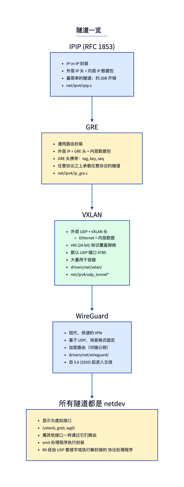
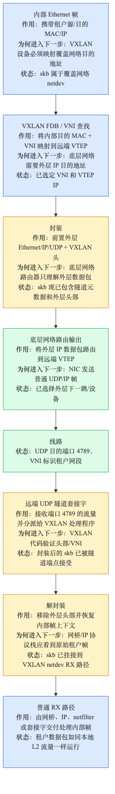
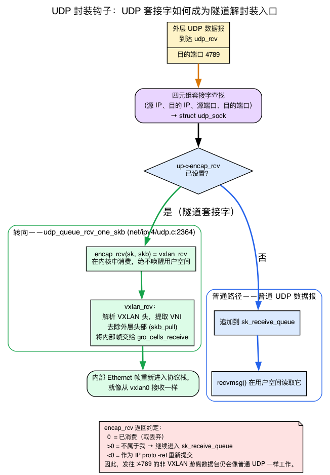
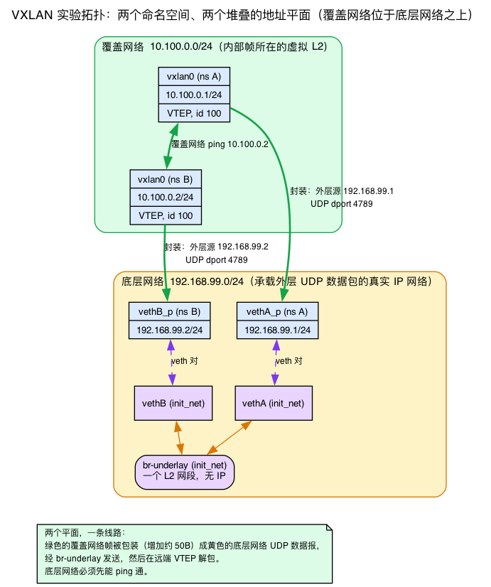
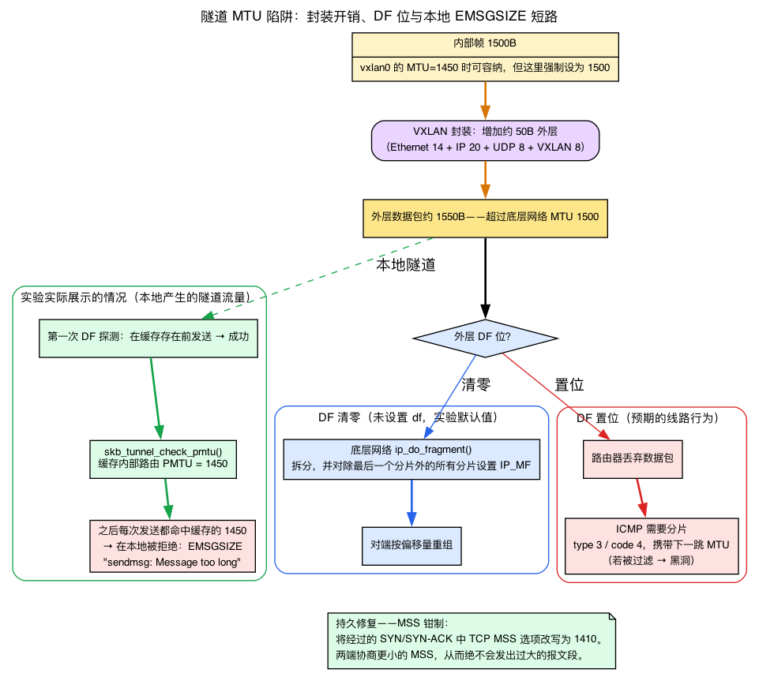

# 第12天 — 隧道：VXLAN、GRE、IPIP、WireGuard

> **今日任务：** 在两个命名空间之间搭建一条 VXLAN 隧道，理解每种隧道都会实现的封装/解封装循环——包括一个被隧道封装的数据包要穿过的两张解复用表，以及让隧道频频出问题的 MTU 机制。第二阶段到此结束。总时长约 110 分钟。

## 一段话说清什么是“隧道”

隧道把一个数据包（*内层*数据包）包进另一个头部（*外层*数据包），使它能够穿越一个原本无法承载它的网络。外层数据包被投递到远端端点，端点剥掉外层头部，在另一侧把内层数据包发出去。不同隧道类型的区别在于*用什么来封装*（IP、UDP、ESP）以及*额外携带哪些元数据*（VNI、GRE key、序列号）。

在 Linux 中，每条隧道都是一个 **netdev**（`vxlan0`、`gre0`、`wg0`）。你像配置其他任何接口一样，通过它配置路由、绑定套接字。隧道的魔法藏在 netdev 的 `ndo_start_xmit`（封装——第3天讲过 `ndo_start_xmit` 是什么）以及与之配对的一个 RX 钩子（解封装）里。

### 两个网络：overlay 与 underlay

在此之前，先固定一对贯穿本章其余部分的词。一条隧道连接两个截然不同的网络：

- **underlay（承载网）**是*真实的* IP 网络，它在物理上把外层数据包在隧道端点之间传输。它像转发普通 IP 流量一样路由这些被封装的数据包。
- **overlay（覆盖网）**是内层数据包所处的*虚拟* L2/L3 网络。它之所以存在，仅仅是因为两个端点约定好进行封装和解封装。

一条隧道恰好就是从 overlay 帧到 underlay 数据包、再反过来的一个映射。在今天的实验里，`br-underlay` 网桥和 `192.168.99.0/24` 地址就**是** underlay；而 `10.100.0.0/24` 这个跑在 `vxlan0` 上的网络就**是** overlay。把这对概念理清，下面每一句关于“外层”与“内层”的话读起来都会顺畅。

## 背景：一个数据包如何*抵达*隧道代码——IP 协议解复用

第2天追踪了一个接收到的数据包从线路一路上行到 `ip_rcv`，并展示了 **L2 → L3 解复用**：核心遍历 `ptype_base[]`——一张以 16 位 EtherType 为键的表——选出 `ip_rcv` 作为 `ETH_P_IP` 的处理函数。但第2天就停在那里了。隧道解封装处理函数——`ipip_rcv`、`gre_rcv`、`vxlan_rcv`——坐落在*更深一层*。当一个数据包确定发往本主机后，必须有东西来判断“这是一个 GRE 包，把它送到 GRE 代码去”。这个机制就是 **L3 协议解复用**，它正是第2天那张 EtherType 表在上一层的精确对应物。

直觉是这样的。IPv4 头部有一个 8 位的 **Protocol** 字段，标明里面装的是什么：TCP=6、UDP=17、IPIP=4、IPv6-in-IPv4=41、GRE=47。在 `ip_rcv` 判定一个数据包发往本地主机之后，它需要把这个包交给负责该协议号的子系统。第2天的 L2 解复用用的是一张以 EtherType 为键的哈希表；L3 解复用用的是**一个直接以协议字节为下标的扁平数组**。

顺着调用链走。`ip_local_deliver` 运行本地投递的 NF 钩子，然后 `ip_local_deliver_finish`（`net/ipv4/ip_input.c:229`）直接从头部里取出协议字节并分发：

```c
/* net/ipv4/ip_input.c:241 */
ip_protocol_deliver_rcu(net, skb, ip_hdr(skb)->protocol);
```

在 `ip_protocol_deliver_rcu`（`net/ipv4/ip_input.c:189`）内部，这次分发就是一次数组索引外加一次间接调用：

```c
ipprot = rcu_dereference(inet_protos[protocol]);          /* ip_input.c:197 */
...
ret = INDIRECT_CALL_2(ipprot->handler, tcp_v4_rcv, udp_rcv, skb);
```

`inet_protos[]` 是 `ptype_base[]` 在 L3 上的镜像：

```c
/* net/ipv4/protocol.c:27 */
struct net_protocol __rcu *inet_protos[MAX_INET_PROTOS] __read_mostly;
```

`MAX_INET_PROTOS` 是 256——为这个 8 位字段的每个可能取值各留一个槽位。每个槽位存放一个 `struct net_protocol`，其 `handler` 就是接收入口（`include/net/protocol.h:37`）：

```c
struct net_protocol {
    int (*handler)(struct sk_buff *skb);
    ...
};
```

一个子系统通过在初始化时调用 `inet_add_protocol(&proto, N)` 来“插入”。安装器不过是往槽位里做一次比较并交换（`net/ipv4/protocol.c:32`）：

```c
int inet_add_protocol(const struct net_protocol *prot, unsigned char protocol)
{
    return !cmpxchg(&inet_protos[protocol], NULL, prot) ? 0 : -1;
}
```

因此，`inet_protos[]` 中每个槽位都有明确的归属——但要留意*真正占用槽位的究竟是谁*，因为它并不总是你会猜到的那个驱动：

- **GRE“注册为 proto=47”**，并且确实直接拥有它的槽位：`gre_demux.c` 在槽位 47 安装了单一处理函数（`net/ipv4/gre_demux.c:199`）：

  ```c
  static const struct net_protocol net_gre_protocol = {
      .handler     = gre_rcv,
      .err_handler = gre_err,
  };
  ...
  inet_add_protocol(&net_gre_protocol, IPPROTO_GRE);   /* gre_demux.c:208 */
  ```

  那唯一的 `gre_rcv` 接着*按 GRE 头部版本进行二级分发*（v0 标准 GRE、v1 PPTP）。“按 GRE 头部版本分发”的意思是：协议表把你带到了 GRE；GRE 自己的头部再告诉它你是哪种 GRE 变体。

- **IPIP“是 proto=4”**——意思是一个 proto-4 的数据包*最终会到达* `ipip_rcv`——但槽位 4 **并非**由 `ipip.c` 拥有。`inet_protos[IPPROTO_IPIP=4]` 是由 `net/ipv4/tunnel4.c` 通过 `inet_add_protocol(&tunnel4_protocol, IPPROTO_IPIP)`（`tunnel4.c:241`）注册的，其处理函数是 `tunnel4_rcv`（`tunnel4.c:218`，函数体在 `:95`）。`tunnel4_rcv` 接着遍历一个第二级的 `struct xfrm_tunnel` 处理函数列表，而 `ipip.c` 通过 `xfrm4_tunnel_register(&ipip_handler, AF_INET)`（`ipip.c:654`）加入该列表。所以真正的链条是 `inet_protos[4] = tunnel4_rcv → tunnel4_handlers list → ipip_rcv`。这里存在一个中间分发器——在结构上和 GRE 的版本分支*同一个*形状，只是位于协议表下方一层。
- **6in4“是 proto=41”**也是同理：`inet_protos[41]` 是 `tunnel64_protocol`/`tunnel64_rcv`（`tunnel4.c:244`），而 `sit.c` 的 `ipip6_rcv` 把自己挂到 `tunnel64_handlers` 列表上，用的是 `xfrm4_tunnel_register(..., AF_INET6)`。同样是一个共享的解复用，而非直接抢占槽位。

**要记住的教训：** 在 `inet_protos[]` 中拥有一个槽位是字面意义的，但这里只有 GRE 直接占用了自己的槽位；IPIP 和 6in4 是经由共享的 `tunnel4`/`tunnel64` 解复用到达各自的处理函数的，而这多出了一个中间分发步骤，就像 GRE 的版本分支一样。不要以为 `grep ipip_rcv` 会翻出一条 `inet_add_protocol` 调用——它不会。

**整章的关键组织事实：** IPIP 和 GRE 是经由 `inet_protos[]` 到达的——它们有自己的 IP 协议号，并*在（或恰好在其下方）IP 协议表处*分支。基于 UDP 的隧道（VXLAN、GENEVE、FoU/GUE）则**完全**得不到一个协议槽位——它们承载于 UDP（proto 17）之中，像任何 UDP 包一样到达 `udp_rcv`，然后在更深的一层、在 UDP 套接字处被*第二次*解复用。那第二次解复用是下一个背景小节。请记住这张双表图景：IPIP/GRE 在协议数组处分支（可能再多一小跳到达确切的处理函数）；VXLAN/GENEVE 则在 UDP 封装钩子处分支。

![L3 协议解复用：以 IPv4 Protocol 字节为下标的 inet_protos[]](diagrams/day12_ip_proto_demux.png)

## 隧道大观园

下面这五种隧道的区别只在于用什么来封装、携带什么元数据——图把它们并排列出来，让你在正文逐一列举之前就能看出这个家族的相似之处。



### IPIP——IP-in-IP（RFC 2003）

最简单的隧道：外层 IPv4 头部 + 内层 IP 数据包。20 字节开销。没有额外元数据。

- **是什么：** 前置一个 `proto=4` 的外层 IPv4 头部，并携带一个内层 IP 数据包。（`net/ipv4/ipip.c` 也以同样方式承载 MPLS-in-IPv4。）IPv6-in-IPv4——`proto=41`，即“6in4”——是一种*同族*封装，由独立的 `sit` 驱动（在 `net/ipv6/sit.c` 中）处理，而非 `ipip.c`。
- **为什么：** 让 IP 数据包穿越一个无法直接看到它们的网络（例如让私有子网穿越公共互联网）。
- **何时用：** 如今很少被直接选用，通常 GRE 或 VXLAN 胜出。
- **坑：** 没有对端认证——任何人都能伪造一个 IPIP 包。结合 IPsec（传输模式）来保证安全，或按源 IP 过滤。
- **在哪里：** `net/ipv4/ipip.c`。RX 入口 `ipip_rcv`（第 266 行）→ `ipip_tunnel_rcv`（第 215 行）。TX `ipip_tunnel_xmit`（第 282 行）。

### GRE——通用路由封装（Generic Routing Encapsulation，RFC 2784）

外层 IP + 4 字节 GRE 头部 + 内层数据包。GRE 头部是可变的：可选的 4 字节 *key*（用于租户隔离的标签）、4 字节*序列号*、4 字节*校验和*。可承载任何 L3 协议（IPv4、IPv6、MPLS，甚至通过 NVGRE 承载以太网）。

- **是什么：** 通用的 L3-over-L3 隧道，带可选元数据（key、序列号）。
- **为什么：** 以可选流量标签承载任意协议之上的任意协议。最初用于 Cisco 路由器互联；如今常见于 MPLS-over-IP、ERSPAN 端口镜像和一些 VPN 部署。
- **何时用：** 当你需要带一个标签（32 位 GRE key）的轻量隧道，并想要点到点或点到多点时。ERSPAN（Cisco 端口镜像）构建在 GRE 之上。
- **坑：** GRE key 不是认证——它是隔离。安全方面与 IPIP 有相同的注意事项；需要机密性时搭配 IPsec。
- **在哪里：** `net/ipv4/ip_gre.c`。RX `gre_rcv`（第 440 行）→ `__ipgre_rcv`（第 366 行）。TX `ipgre_xmit`（第 652 行）。ERSPAN 变体有自己的路径（第 267、704 行）。

### VXLAN——虚拟可扩展局域网（Virtual eXtensible LAN，RFC 7348）

数据中心 overlay 的标准。外层以太网 + 外层 IP + 外层 UDP（端口 4789）+ 8 字节 VXLAN 头部 + 内层以太网帧。

- **是什么：** 以太网封装进 UDP。VXLAN 头部里的 24 位 VNI（“VXLAN Network Identifier”）标识 overlay——每个 IP underlay 可有 1600 万个 overlay。
- **为什么：** 突破 4096 个 VLAN 的限制（802.1Q 上限）。让单个物理 IP 网络承载许多相互隔离的 L2 网络。每个 VNI 都是它自己的广播域。
- **何时用：** Kubernetes pod 网络（Flannel、某些模式下的 Calico、Cilium）、数据中心 SDN、多租户云平台。当今主流的 overlay。
- **坑：** **MTU。** 外层头部要花掉约 50 字节。如果 underlay MTU 是 1500，隧道 netdev 的 MTU 就应是 1450。否则内层 1500 字节的数据包放不下；要么路径 MTU 发现救你（如果 ICMP 能通），要么你的连接被黑洞吞掉。解法：(1) 把隧道 MTU 设置正确；(2) 用 nftables（`tcp option maxseg size set 1410`）或 iptables（`-j TCPMSS --set-mss 1410`）**对 TCP 做 MSS 钳制**——改写每个 TCP SYN 中的*最大报文段长度*（Maximum Segment Size，MSS）选项，让两端都同意发送足够小、在约 50B 隧道开销之后仍能装下的报文段（我们会在第三阶段正式讲 TCP MSS）；(3) 让 underlay 使用巨型帧。下面的分片小节会把这套机制讲具体。（第二个部署陷阱：4789 是 IANA 分配的端口，但 Linux 模块出于向后兼容的*历史默认值*是 8472——务必像实验那样显式设置 `dstport`。）
- **在哪里：** `drivers/net/vxlan/vxlan_core.c`。RX `vxlan_rcv`（第 1643 行）——注册为一个 UDP 封装处理函数。TX `vxlan_xmit`（第 2722 行）。

### GENEVE——VXLAN 的继任者

同样是以太网封装进 UDP 的思路，但可以可以把它理解为支持在头部中附加带类型字段的 VXLAN：它提供可扩展的 TLV 选项。它被设计来把 VXLAN、NVGRE 和 STT 统一进一个有增长余地的协议。UDP 端口 6081。选项解析路径更重，但已投入生产（某些 Kubernetes 部署、OVN）。和 VXLAN 一样，它没有 `inet_protos[]` 槽位——它承载于 UDP，并注册一个封装处理函数。代码：`drivers/net/geneve.c`。

### WireGuard——现代 VPN（自 5.6 起进入主线）

外层 UDP + WireGuard 自己的成帧（握手消息，或带 ChaCha20-Poly1305 的传输消息）。它是**加密路由（crypto-routed）**的：内核根据一个数据包由哪个密钥签名来决定它去哪里，而不是根据配置好的隧道端点——对端由 Curve25519 公钥标识，而非由 IP 标识。

- **是什么：** 基于 UDP 的经认证、加密的 L3 VPN。
- **为什么：** 唯一一个经过严肃密码学与代码审查的现代内核内 VPN。在大多数用例中取代 OpenVPN（用户空间，慢）、IPsec（复杂）以及其他方案。
- **何时用：** 点到点或点到多点 VPN。漫游客户端（移动设备）。任何你原本会考虑 OpenVPN 的场景。
- **坑：** **`AllowedIPs`** 既是路由规则*又是*源地址过滤器。一个对端只能从其 `AllowedIPs` 里的 IP *发送*数据包；一个对端也只能*接收*发往其 `AllowedIPs` 里 IP 的数据包。配错了就会得到没有任何诊断信息的静默丢包。
- **在哪里：** `drivers/net/wireguard/`。RX 在 `receive.c`，TX 在 `send.c`。

## VXLAN 详解（典型案例）

线路上的一个帧——总共 50 字节开销：

```
[outer Ethernet 14] [outer IP 20] [outer UDP 8] [VXLAN hdr 8] [inner Ethernet ...]
```

VXLAN 头部布局：Flags(1B) | Reserved(3B) | VNI(3B) | Reserved(1B)。Flags 字节的“I”位必须置位；VNI 是打包进接下来三个字节的 24 位。这与内核内的结构体完全一致（`include/net/vxlan.h:25`）：

```c
struct vxlanhdr {
    __be32 vx_flags;   /* the "I" bit is VXLAN_HF_VNI = cpu_to_be32(BIT(27)) */
    __be32 vx_vni;     /* 24-bit VNI in the high 3 bytes */
};
```



### 背景：VTEP 与 VXLAN 转发数据库（FDB）

下面会用到十几次的一个术语需要一句话的定义：**VTEP**（“VXLAN Tunnel End Point”，VXLAN 隧道端点）是执行封装/解封装的实体——具体来说就是一个 `vxlan` netdev。它的 *underlay* IP 是外层数据包被发往的地址。**远端 VTEP** 是对端的 underlay IP。

当一个 VXLAN netdev 发送一个内层帧时，它必须回答：*哪个远端 VTEP 持有这个目的 MAC？* 它通过**转发数据库（forwarding database，FDB）**来回答——而你已经从第11天知道 FDB 是怎么工作的了。回忆第11天：网桥 FDB 是一个以 `(vlan, MAC)` 为键的学习型哈希，有着相同的老化和未命中泛洪行为。**不要重新学习哈希或学习机制**——这里是完全相同的（每个 VXLAN 的 FDB 是同一种哈希，`FDB_HASH_BITS = 8`，`include/net/vxlan.h:40`）。

唯一值得一提的 VXLAN 变化是：第11天的网桥 FDB 把一个内层 MAC → 映射到一个本地出口*端口*；而 VXLAN FDB 把一个内层 MAC → 映射到一个远端 *underlay IP*（要封装并发往的那个 VTEP），存放为 `rdst->remote_ip`（`drivers/net/vxlan/vxlan_core.c:188`）。数据结构的角色相同，值不同。TX 路径上的查找是 `vxlan_find_mac_tx`（`vxlan_core.c:395`）。未命中时，VXLAN 会像第11天的网桥一样泛洪——但这里的“泛洪”意味着把*已封装*的帧发往配置好的远端单播 IP（或一个组播 underlay 组），而不是发往本地端口。这就是为什么实验里配置了 `remote 192.168.99.2`：它是未知单播的泛洪目标。

### 封装路径

当一个数据包命中 VXLAN netdev 的 TX 时：

1. **解析出目的 VTEP**——对于单播内层 MAC，网桥式 FDB（来自网桥那一章、第11天的转发数据库；上面已回顾）告诉你哪个远端 VTEP IP 持有那个 MAC。对于未知单播/组播，则发往配置好的组播 underlay 组（示例中常用 `239.1.1.1`）或配置好的远端单播 IP。*因为我们的实验设置了静态的 `remote=`，它用的是最简单的单播形式——不涉及组播组，也不触发 FDB 泛洪；FDB/组播路径要在一个 VTEP 与许多远端通信时才重要。*
2. **构建外层头部**——以太网、IP、UDP、VXLAN。源 UDP 端口由内层流哈希得出（在 underlay 上带来类似 ECMP——Equal-Cost Multi-Path，等价多路径，把多个流散布到并行的 underlay 链路上——的散布效果）。
3. **`udp_tunnel_xmit_skb`**——位于 `net/ipv4/udp_tunnel_core.c:174` 的通用 UDP 隧道发送辅助函数。它让外层数据包走 underlay 的正常 IP 协议栈。所有基于 UDP 的隧道（VXLAN、GENEVE、FoU、GUE）共用它——它是你即将见到的那个封装钩子在 TX 侧的镜像。

### 背景：UDP 封装钩子——一个 UDP 套接字如何成为解封装入口

下面的解封装路径会说端口 4789 上的那个 UDP 套接字很“特殊”。这里就把*特殊*具体化——而这正是本章许诺过的第二张解复用表。

首先，先向一条你还没完全见过的路径做个一句话的前向铺垫（第14天会完整讲普通 UDP 接收）：一个普通的 UDP 数据报由它的 `(src IP, dst IP, src port, dst port)` 四元组匹配到一个套接字，然后 skb 被追加到该套接字的 **`sk_receive_queue`**，供之后的一次 `recvmsg()` 调用读取。而隧道需要的正好*相反*：在*内核内部*消费这个数据报并重新注入内层数据包，绝不唤醒用户空间。

`struct udp_sock` 恰好为此携带了一个可选的函数指针（`include/linux/udp.h:79`）：

```c
int (*encap_rcv)(struct sock *sk, struct sk_buff *skb);
```

当 `encap_rcv` 被设置后，UDP 接收路径会在 skb 抵达 `sk_receive_queue` **之前**就把它转交给该函数。那个单独的指针就是“特殊套接字”的含义。这个转交发生在 `udp_queue_rcv_one_skb`（`net/ipv4/udp.c:2349`）里，并被保护起来，使得没有隧道存在时这次检查是零成本的：

```c
if (static_branch_unlikely(&udp_encap_needed_key) &&
    READ_ONCE(up->encap_type)) {              /* net/ipv4/udp.c:2364 */
    ...
    encap_rcv = READ_ONCE(up->encap_rcv);     /* :2380 */
    if (encap_rcv) {
        int ret = encap_rcv(sk, skb);
        if (ret <= 0) { ...; return -ret; }   /* consumed */
    }
    /* FALLTHROUGH -- it's a normal UDP packet */
}
```

安装器是 `setup_udp_tunnel_sock`（`net/ipv4/udp_tunnel_core.c:71`）。它把配置里的处理函数拷进套接字，并打开静态键，好让上面那次转交检查真正开始工作：

```c
udp_sk(sk)->encap_type = cfg->encap_type;
udp_sk(sk)->encap_rcv  = cfg->encap_rcv;     /* udp_tunnel_core.c:85 */
...
udp_tunnel_encap_enable(sk);                 /* arms udp_encap_needed_key */
```

VXLAN 把 `vxlan_rcv` 作为 `cfg->encap_rcv` 传入（`drivers/net/vxlan/vxlan_core.c:3612`）。于是**两级解复用完成了**：

```
IP proto 17 → inet_protos[17] → udp_rcv → (encap_rcv set?) → vxlan_rcv
```

——第一级在 `inet_protos[]`（上面那一节），第二级在 UDP 套接字。`encap_rcv` 的**契约**就是代码里看到的三态返回值：`0` = 已消费（或被处理函数丢弃），`>0` = “不是我的，作为普通 UDP 数据报重新提交”（它会落到 `sk_receive_queue`），`<0` = 作为 IP proto `-ret` 重新提交。VXLAN 自己只走 `0` 这条路：`vxlan_rcv` 总是返回 `0`——无论它是成功解封装并重新注入了一个帧，*还是*命中它的 `drop:` 标签（头部畸形、缺少 VNI 标志、未知 VNI、保留位被置位）——所以一个发往端口 4789、但不是有效 VXLAN 的杂散 UDP 包会被**丢弃**，而不是交还给套接字队列。返回 `>0`、将其“作为普通 UDP 重新提交”的路径确实存在，但被*其他*封装处理函数（例如 ESP-in-UDP）使用，VXLAN 不用。



### 解封装路径

一个帧到达 underlay，穿过 `ip_rcv`（第 2–3 天讲的 RX 路径），落到 UDP。端口 4789 上的那个 UDP 套接字很特殊——它是由 `setup_udp_tunnel_sock`（`net/ipv4/udp_tunnel_core.c:71`）注册的“隧道套接字”。内核不会把它排到普通的 `sk_receive_queue` 上，而是调用注册好的封装处理函数——对 VXLAN 而言就是 **`vxlan_rcv`**，位于 `drivers/net/vxlan/vxlan_core.c:1643`（其机制正是你刚看到的 `encap_rcv` 转交）。

在 `vxlan_rcv` 内部：
1. 解析 8 字节的 VXLAN 头部，取出 24 位 VNI。
2. 通过 `vxlan_vs_find_vni`（`vxlan_core.c:1679`）在本 netns 中为该 VNI 找到正确的 VXLAN netdev。
3. 用 `skb_pull` 剥掉外层头部（回忆第1天的 `skb_pull`——它把 `data` 前移，越过你已处理完的头部）。
4. 通过 `gro_cells_receive`（`vxlan_core.c:1799`）把内层以太网帧交给内层协议栈。

最后那一步值得单说一句。内层帧必须*仿佛它是刚刚在 `vxlan0` 上被接收到的一样*重新进入协议栈。`gro_cells` 是一个每 netdev 的轻量 GRO+RPS 包装器，做的正是这种重新注入——它排队到一个 percpu backlog，并对内层流跑 GRO。回忆第2天的 GRO 与 RX 重新进入（`napi_gro_receive` / `netif_receive_skb`）；`gro_cells_receive`（`net/core/gro_cells.c:14`）不过就是“第2天的 RX 入口，为内层数据包被再一次调用”。不需要新的 GRO 理论——内层帧现在开始上行穿过协议栈，看起来就像一个正常到达 `vxlan0` 的帧。

> **常见疑问**
>
> **问：VXLAN 为什么承载于 UDP，而不像 GRE 那样使用独立的 IP 协议号？**
> 答：有两个实际好处。NAT 与防火墙穿越——中间盒理解 UDP 并乐于转发它，而一个新奇的 IP 协议号往往会被丢弃。还有 **ECMP**：源 UDP 端口被设为内层流的哈希，于是按 5 元组散布的 underlay 路由器会自动把并行的流分散到各条链路上。GRE 使用固定的 proto-47 头部且没有端口，无法自然获得这些好处。
>
> **问：我的实验用了 `remote=`——我一直读到的那个组播组在哪儿？**
> 答：哪儿都没有，是故意的。静态的 `remote=` 是最简单的点到点形式：每一次未知单播的“泛洪”都只发往那一个 IP。组播 underlay 组（例如 `239.1.1.1`）和真正的 FDB 学习，只有当一个 VTEP 服务许多远端、必须发现哪个远端持有给定 MAC 时才会登场。

## 今日实验——搭建 VXLAN 隧道

两个命名空间（网络命名空间，第5天），二者都有 VTEP，通过充当 underlay 的宿主机（`init_net`，也在第5天）互相通信：



```bash
sudo ip netns add A
sudo ip netns add B

# Underlay: bridge both host-side veths into one L2 segment (init_net is the underlay).
# Without the bridge, vethA and vethB are two separate L2 segments and ARP for the
# underlay peer never resolves — the tunnel can't carry a single packet.
sudo ip link add vethA type veth peer name vethA_p
sudo ip link add vethB type veth peer name vethB_p
sudo ip link set vethA_p netns A
sudo ip link set vethB_p netns B
sudo ip link add br-underlay type bridge
sudo ip link set vethA master br-underlay
sudo ip link set vethB master br-underlay
sudo ip link set vethA up
sudo ip link set vethB up
sudo ip link set br-underlay up
sudo ip netns exec A ip addr add 192.168.99.1/24 dev vethA_p
sudo ip netns exec B ip addr add 192.168.99.2/24 dev vethB_p
sudo ip netns exec A ip link set vethA_p up
sudo ip netns exec B ip link set vethB_p up

# The VTEP underlay addresses live only on the namespace ends; the bridge needs no IP.
# Confirm the underlay works *before* building the tunnel on top of it:
sudo ip netns exec A ping -c1 192.168.99.2   # underlay must work first

# VXLAN endpoints
sudo ip netns exec A ip link add vxlan0 type vxlan \
    id 100 local 192.168.99.1 remote 192.168.99.2 dstport 4789
sudo ip netns exec A ip addr add 10.100.0.1/24 dev vxlan0
sudo ip netns exec A ip link set vxlan0 up

sudo ip netns exec B ip link add vxlan0 type vxlan \
    id 100 local 192.168.99.2 remote 192.168.99.1 dstport 4789
sudo ip netns exec B ip addr add 10.100.0.2/24 dev vxlan0
sudo ip netns exec B ip link set vxlan0 up

# Test
sudo ip netns exec A ping -c 2 10.100.0.2
```

注意这两个网络在发挥作用：`192.168.99.0/24` 是 **underlay**（被桥接的 veth），`10.100.0.0/24` 是 **overlay**（在 `vxlan0` 上）。`remote 192.168.99.2` 就是远端 VTEP——未知单播内层 MAC 的泛洪目标。

然后观察被封装的流量。要*在*生成流量*之前*就启动抓包——如果你在 ping 已经退出之后才附上 tcpdump，得到的会是一次空抓包。用 `timeout` 给抓包设界，免得它永远跑下去：
```bash
sudo timeout 8 tcpdump -i br-underlay -nn 'udp port 4789' &
sleep 1
sudo ip netns exec A ping -c 5 10.100.0.2
wait
```

每一个 ICMP echo/reply 都表现为两个 underlay VTEP（192.168.99.1 与 192.168.99.2）之间一个发往端口 4789 的 UDP 数据报——即被 VXLAN 封装的 ping。tcpdump 会解码出这层封装，而源 UDP 端口是内层流哈希，所以它是变化的：
```
IP 192.168.99.1.<hashed> > 192.168.99.2.4789: VXLAN, flags [I] (0x08), vni 100
IP 192.168.99.2.<hashed> > 192.168.99.1.4789: VXLAN, flags [I] (0x08), vni 100
```

## 背景：分片、DF 位与 MSS 钳制

今天的实验以及自测问题都取决于当一个被封装的数据包对 underlay 来说太大时会发生什么。这依赖于第4天只讲了一部分的 IP 层机制，所以我们先把它建起来，再把它弄坏。

**回顾（第4天——只用一句话，不再推导）：** MTU 是一条链路能承载的最大 L2 载荷（以太网上是 1500）；MSS = MTU − IP − TCP；路径 MTU 发现（PMTUD）在路径无法承载全尺寸帧时缩小一条连接的 MSS。都在第4天讲过。

**新增内容——DF 位。** IPv4 头部的 16 位 `frag_off` 字段打包了三个标志位加一个 13 位的分片偏移（`include/net/ip.h`）：

```c
#define IP_DF     0x4000   /* ip.h:143  "Don't Fragment" */
#define IP_MF     0x2000   /* ip.h:144  "More Fragments" */
#define IP_OFFSET 0x1FFF   /* ip.h:145  the 13-bit offset */
```

**DF 清零**时，遇到超尺寸数据包的路由器会用 `ip_do_fragment`（`net/ipv4/ip_output.c:761`）把它*切开*，并在除最后一个之外的所有分片上置 `IP_MF`；接收方按偏移重组。**DF 置位**时，路由器*不得*分片——它转而丢弃该数据包并回送一个错误。

**新增内容——“需要分片”究竟是什么。** 那个错误是 ICMP **类型 3**（Destination Unreachable，`ICMP_DEST_UNREACH = 3`，`include/uapi/linux/icmp.h:27`）**代码 4**（`ICMP_FRAG_NEEDED = 4`，`icmp.h:47`），它携带了下一跳的 MTU。源端收到它，为那个目的地缓存一个较低的 PMTU，于是后续数据包缩小以适配。**但**如果某个防火墙丢弃这些 ICMP 消息——极其常见——源端就永远学不到，会继续发送超尺寸的 DF 数据包，连接便**陷入黑洞**：小包能通，大包消失。这正是今天自测问题背后的确切机制。

**新增内容——隧道带来的变化（为什么实验显示 `EMSGSIZE`，而非线路上的 ICMP）。** 对于一条*本地发起*的隧道，内核会短路 PMTUD。`skb_tunnel_check_pmtu`（`net/ipv4/ip_tunnel_core.c:437`）计算外层头部之后剩下的空间，并在内层帧超尺寸时，把那个较低的 PMTU 缓存到*内层*路由上：

```c
u32 mtu = dst_mtu(encap_dst) - headroom;     /* ip_tunnel_core.c:440 */
...
skb_dst_update_pmtu_no_confirm(skb, mtu);    /* cache it on the inner dst */
```

`vxlan_xmit_one` 在 TX 路径上调用它（`drivers/net/vxlan/vxlan_core.c:2514` 和 `:2586`）。后果是：*第一个* DF 探测包早于被缓存的 PMTU，所以它成功；每个*后续*的 DF 发送都命中被缓存的那个较低 PMTU，于是在任何数据包离开主机之前就在*本地*以 `EMSGSIZE`（“sendmsg: Message too long”）被拒绝。这就是为什么实验看到一次成功随后是若干错误，而不是一次 ICMP 的线路抓包。

**新增内容——以 MSS 钳制作为持久修复。** 因为经由 ICMP 的 PMTUD 不可靠，稳健的修复是把经过的 SYN/SYN-ACK 数据包里的 TCP **MSS 选项**改写成一个能装进隧道的值（例如 1410）。两端于是协商出一个更小的 MSS，*永远*不会发出一个大到无法封装的报文段。自测答案里的那条 `nft` 规则做的正是这种 SYN 改写——它不是魔法，就是在握手飞过时编辑 MSS 选项。



## 故障注入——破坏 MTU

```bash
# Default: vxlan0 MTU = 1500. Because this VXLAN dev is NOT bound to a lower dev
# (no `dev PHYS_DEV` on the `ip link add`), the kernel does NOT auto-subtract the
# ~50B overhead — the netdev keeps the 1500 default. But the effective path budget
# is still only ~1450, which is the bug we exploit below.
sudo ip netns exec A ip link show vxlan0

# The 1500 default is already too large for the 1450-effective path, so just send a
# 1500-byte DF packet that won't fit:
sudo ip netns exec A ping -M do -s 1472 -c 2 10.100.0.2   # don't fragment, 1500 total
# The first probe slips through; every later DF send is rejected locally — see below.

# The real fix: set a correct, fitting MTU that accounts for the overhead.
sudo ip netns exec A ip link set vxlan0 mtu 1450
```

你实际看到的是什么——以及*为什么*它不是你可能预期的那种线路上的 ICMP：

```
PING 10.100.0.2 (10.100.0.2) 1472(1500) bytes of data.
1480 bytes from 10.100.0.2: icmp_seq=1 ttl=64 time=... ms
ping: sendmsg: Message too long

--- 10.100.0.2 ping statistics ---
2 packets transmitted, 1 received, +1 errors, 50% packet loss
```

这就是上面分片背景里讲的本地 `EMSGSIZE` 短路：`skb_tunnel_check_pmtu` 在第一次看到超尺寸帧时缓存了一个降低了的内层路由 PMTU，所以最开始那个 DF 探测包（在缓存存在之前发出）在 `icmp_seq=1` 成功，而每个后续的 DF 发送都命中被缓存的 1450 PMTU，并在*本地*以 `EMSGSIZE` 被拒绝——`ping: sendmsg: Message too long`。它**不是**线路上的 ICMP“需要分片”，**也不是**静默丢包。（把 `df set` 追加到 `ip link add ... type vxlan` 那几行末尾可让它变得确定：那样*每个*数据包都会以 `Message too long` 失败，100% 丢包，因为外层头部现在拒绝分片了。）

这就是经典的 VXLAN 部署故障。生产数据中心要么在 underlay 上使用巨型帧（MTU 9000），要么严格地对 TCP 做 MSS 钳制。

## 清理

拆掉实验创建的一切。删掉这两个命名空间会自动移除它们的 veth 端和 `vxlan0`——veth 对是对称删除的，所以 init_net 侧的对端 `vethA`/`vethB` 会随它们在命名空间内的那一端一同消失。网桥住在 init_net 里，删除命名空间*不会*移除它，所以要显式删掉它：

```bash
sudo ip netns del A
sudo ip netns del B
sudo ip link del br-underlay
```

## 内核源码阅读

- **`drivers/net/vxlan/vxlan_core.c:1643`**——`vxlan_rcv`。解封装入口。从头读到尾（约 300 行，含选项处理）。追踪 VNI 是如何被取出的、正确的 VXLAN netdev 是如何经由 `vxlan_vs_find_vni` 查到的，以及内层以太网帧是如何被交给 `gro_cells_receive` 送进内层协议栈的。

- **`drivers/net/vxlan/vxlan_core.c:2722`**——`vxlan_xmit`。封装入口。注意 FDB 查找（每个 VXLAN 的网桥式 FDB）、外层头部的构建，以及对 `vxlan_xmit_one` 的调用——后者最终会调用 `udp_tunnel_xmit_skb`。

- **`net/ipv4/ip_input.c:189`**——`ip_protocol_deliver_rcu`。L3 协议解复用：`inet_protos[protocol]->handler`。看看 `ip_local_deliver_finish`（第 229 行）是如何把 IPv4 Protocol 字节喂给它的。

- **`net/ipv4/protocol.c:32`**——`inet_add_protocol`。GRE（`gre_demux.c:208`）是如何直接认领 `inet_protos[]` 中的槽位 47 的。IPIP 和 6in4 *不*自己调用它：槽位 4 和 41 由 `tunnel4.c` 的 `tunnel4_rcv`/`tunnel64_rcv`（`tunnel4.c:241`、`:244`）拥有，它们把请求分发到 `ipip_rcv`/`ipip6_rcv`，走的是第二级的 `xfrm_tunnel` 列表（`ipip.c:654`）。

- **`net/ipv4/udp.c:2349`**——`udp_queue_rcv_one_skb`。UDP 封装转交（`encap_rcv` 在第 2380 行）——把一个 VXLAN 包送到 `vxlan_rcv` 而非套接字队列的第二次解复用。

- **`net/ipv4/udp_tunnel_core.c:71`**——`setup_udp_tunnel_sock`。一条隧道如何把自己注册为一个 UDP 封装处理函数。短函数（约 30 行）。读读注释，看每个 `udp_tunnel_sock_cfg` 字段是干什么的。

- **`net/ipv4/udp_tunnel_core.c:174`**——`udp_tunnel_xmit_skb`。通用的外层侧 TX。所有基于 UDP 的隧道（VXLAN、GENEVE、FoU、GUE）都用它。注意其中的 GSO（Generic Segmentation Offload，通用分段卸载，第4天）交互——隧道会设好 gso_type，让分段对外层数据包做正确的事。

- **`net/ipv4/ip_tunnel_core.c:437`**——`skb_tunnel_check_pmtu`。缓存一个较低的内层路由 PMTU、并产生实验里那个 `EMSGSIZE` 的隧道 PMTU 检查。

- **`net/ipv4/ip_tunnel.c`**——被 IPIP 和 GRE 使用的通用 IP 隧道基础设施。搜索 `ip_tunnel_xmit` 找到共同的封装路径。是与 `vxlan_xmit` 对照的有用参考点。

- **`net/ipv4/gre_demux.c:146`**——`gre_rcv`。*这个*才是 proto-47 入口，经由 `inet_add_protocol(&net_gre_protocol, IPPROTO_GRE)`（`gre_demux.c:208`）注册。它读取 GRE 头部的版本字节（`skb->data[1] & 0x7f`）并分发 `gre_proto[ver]`：v0（`GREPROTO_CISCO`）→ `ip_gre.c`，v1（`GREPROTO_PPTP`）→ `drivers/net/ppp/pptp.c`（`include/net/gre.h`）。

- **`net/ipv4/ip_gre.c:440`**——`gre_rcv`。在上面的解复用*之后*到达的 version-0 处理函数（用 `gre_add_protocol(&ipgre_protocol, GREPROTO_CISCO)` 注册）。它绝不会看到 v1/PPTP；它分发的是 ERSPAN 与普通 GRE 的区分（检查 `tpi.proto == ETH_P_ERSPAN`），然后 `ipgre_rcv` → `__ipgre_rcv`。关于 key/序列号/校验和的解析，看 `gre_parse_header`。

- **`net/ipv4/ipip.c:266`**——`ipip_rcv`。最简单的隧道解封装。把它当作参考来读；其他隧道都是在它之上添加特性。

- **`drivers/net/wireguard/`**——WireGuard。读 `device.c` 看 netdev 集成，读 `receive.c` 和 `send.c` 看数据路径。

- **`Documentation/networking/vxlan.rst`**——官方指南。篇幅简短。

## 要点回顾

- 所有隧道都是 netdev；它们的 `ndo_start_xmit` 封装，一个配对的 RX 钩子解封装。
- **两张解复用表把一个数据包送到隧道处理函数。** L3 解复用以 IPv4 Protocol 字节为下标索引 `inet_protos[]`（第2天 EtherType `ptype_base[]` 在 L3 的镜像）：proto 47 → `gre_rcv`（它直接拥有自己的槽位），proto 4 → `tunnel4_rcv` → `ipip_rcv`，proto 41 → `tunnel64_rcv` → 6in4（这两者是经由一个共享的第二级分发到达其处理函数的）。UDP 隧道**没有**槽位——它们经由 proto 17 → `udp_rcv`，并在 UDP 的 `encap_rcv` 钩子处第二次分支。
- **`encap_rcv`** 是让一个 UDP 套接字成为隧道入口的那个指针：`setup_udp_tunnel_sock` 安装它，`udp_queue_rcv_one_skb` 在 `sk_receive_queue` 之前转交给它。返回 0=已消费，>0=普通 UDP，<0=重新提交。
- **overlay 与 underlay：** underlay 是承载外层数据包的真实 IP 网络；overlay 是内层数据包所处的虚拟网络。解封装之后，`gro_cells_receive` 重新注入内层帧（第2天的 RX 入口，第二次登场）。
- **VTEP** = 封装/解封装端点（一个 `vxlan` netdev）；**VXLAN FDB** 把内层 MAC → 映射到远端 VTEP IP（第11天的网桥 FDB 把 MAC → 映射到本地端口）。
- **IPIP**：20 字节开销，最简单。如今很少作为首选。
- **GRE**：可选的 32 位 key、序列号、校验和。用在 ERSPAN 和一些 MPLS-over-IP 部署中。
- **VXLAN**：以太网封装进 UDP，24 位 VNI，端口 4789。容器/云 overlay 的标准。
- **GENEVE**：VXLAN 的 TLV 可扩展继任者。UDP 6081。
- **WireGuard**：现代 UDP VPN，自 5.6 起进入主线。经由对端公钥做加密路由。
- **MTU 永远是那个陷阱。** 隧道 netdev MTU = underlay MTU − 开销。DF 位决定分片还是丢弃；一个被过滤掉的 ICMP frag-needed（类型 3/代码 4）会让流陷入黑洞。用巨型帧或 MSS 钳制来修复。
- **用 `ip -d link show` 检查**以查看隧道参数（VNI、remote、端口）。

## 检查问题

在两台主机之间搭建了一条 VXLAN 隧道（underlay MTU 1500）。一位用户抱怨：短 ping 一切正常，但文件传输在传了几 KB 之后就卡住。最可能的原因是什么，最简单的修复是什么？

<details>
<summary>点击展开答案</summary>

**答案：** **路径 MTU 问题。** 短 ICMP ping 装得进被封装后 1500 字节的预算里。文件传输（TCP）试图用上路径的完整 MSS——TCP 是基于*接口* MTU 协商出 MSS 的，但隧道加了约 50 字节的开销，而 underlay 丢弃超尺寸的数据包。当报文段上置了 DF，一个装不下它们的路由器本应回送 ICMP“需要分片”（类型 3，代码 4），好让发送方降低它的 PMTU——但如果那条 ICMP 正被过滤（非常常见），发送方就永远学不到该减小 MSS，连接便陷入黑洞。最简单的修复是 **MSS 钳制**：`nft add rule inet filter forward tcp flags syn / syn,rst tcp option maxseg size set 1410`——内核在数据包穿过时改写 SYN 的 MSS 选项，迫使两端使用一个能装下的更小 MSS。备选方案：把隧道 MTU 设置正确（Linux 为 VXLAN over 1500 自动推导出 1450，*仅当* VXLAN 设备用 `dev PHYS_DEV` 绑定到一个下层设备时；否则 netdev 保持 1500 默认值，你必须自己设置它）、在 underlay 上启用巨型帧（MTU 9000），或者放开 ICMP“需要分片”让 PMTUD 自然工作。

</details>

---

## 第二阶段结束

你现在能读懂内核网络协议栈的 L2/L3 层了。以太网解析、VLAN、ARP/NDP、FIB 与路由规则、IPv6 细节、网桥、隧道。

第三阶段（第 13–19 天）向上进入 L4：套接字、UDP、TCP 状态机、拥塞控制、重传、sockopt、epoll/io_uring。第13天从套接字层开始——每条连接背后的那个 `struct sock`——并一路上行到 TCP 状态机。
