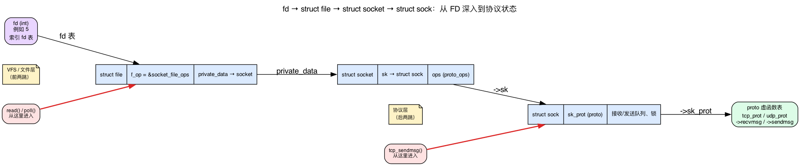
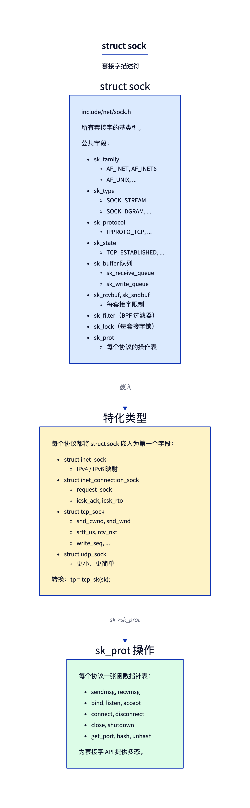
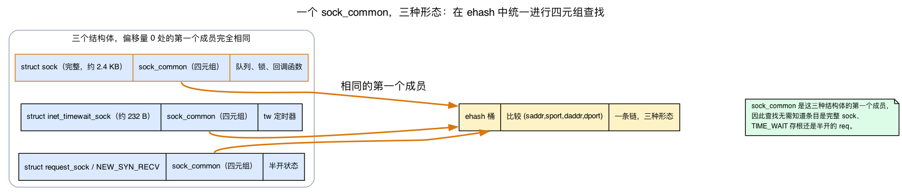
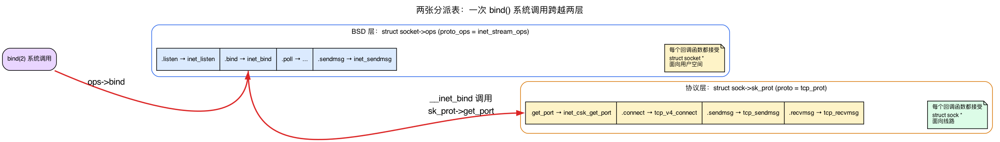
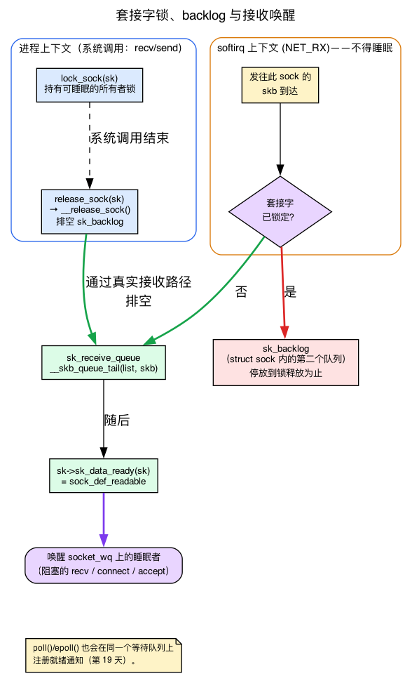
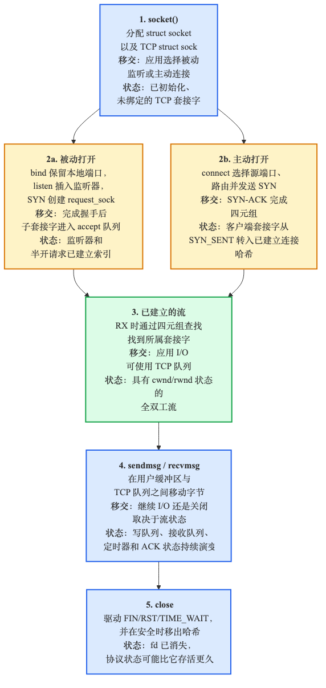
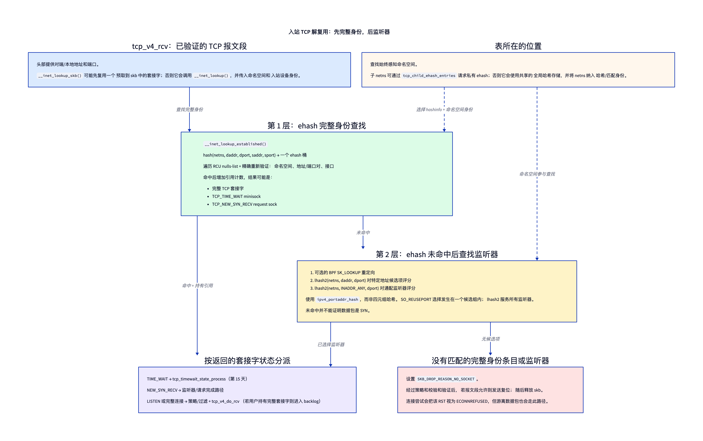

# 第13天 — 套接字层：`struct sock`

> **今日任务：** 理解 `socket()`、`bind()`、`listen()`、`connect()`、`accept()` 在内核一侧发生的事情。看看 `struct sock` 如何位于每个网络系统调用的底层——并学习套接字层赖以构建的机制（FD → socket 桥接、`sock_common`、两张分派表、套接字锁与接收唤醒模型，以及 slab 缓存），这些内容将在背景 1–5 中逐一讲解，确保生命周期中的每一步都有据可循。总用时约 120 分钟。

> **第三阶段从这里开始。** 第 13–19 天覆盖 L4：套接字、UDP、TCP 状态机、拥塞控制、重传、套接字选项、epoll/io_uring。

第一阶段（第 1–5 天）把一个数据包从线路一路走到了 `ip_rcv`。第二阶段为它做了路由。现在我们抵达了应用程序真正打交道的那一层：**套接字**。你程序里调用的每一个 `socket()`、`bind()`、`connect()`、`send()`、`recv()` 都落到这里。今天的任务是把 `struct sock`——内核为每条连接维护的状态对象——彻底讲具体，并讲清楚第三阶段后续每一章都依赖的五种机制。

我们把一切都锚定到你 `~/code/linux` 检出中的某个具体文件/函数（行号来自内核 7.1）。

## 必须分清的两个结构体：`struct socket` 与 `struct sock`

内核里有*两个*“socket”结构，名字极其相似，很容易混淆：

- **`struct socket`**（`include/linux/net.h`）——BSD API 层面的句柄。每个文件描述符对应一个。它拥有与协议无关的东西：文件指针、类型（SOCK_STREAM/SOCK_DGRAM/……）、等待队列，以及指向 `proto_ops` 表的指针。
- **`struct sock`**（`include/net/sock.h:365`）——*协议层面*的状态。它拥有接收/发送队列、协议的发送/接收函数、路由表引用（`sk_dst_cache`）、套接字选项存储等。

每个 `struct socket` 都有一个 `struct sock *sk`，指向它的协议状态。它们分开是因为：
1. 同一套 `struct socket` API 适用于 AF_INET、AF_UNIX、AF_NETLINK、AF_PACKET 等——差异极大的各种协议栈。
2. 有些套接字是内核内部使用的，没有用户空间 FD（例如内核用于路由通知的 netlink 套接字）。

当内核代码说“socket”时，它通常指 `struct sock`，而不是 `struct socket`。用户空间 API 谈论的是 FD；内核网络代码谈论的是 `sk` 指针。

## 背景 1：一个文件描述符如何变成 `struct socket`

下面每个生命周期步骤都以同一句话开头：*“从 FD 查出 `struct socket`。”* 但一个小整数——`fd = 5`——如何对应到内核中的 C 结构体？这是每个套接字系统调用做的第一件事，所以在走生命周期之前，我们先把它讲实。

### 套接字 FD 只是一个 VFS 文件描述符

当你调用 `socket(AF_INET, SOCK_STREAM, 0)` 时，内核返回一个 `int`。那个整数和你从 `open("/etc/passwd")` 得到的*是同一种 FD*。它索引进你进程的文件描述符表，其中每个槽位指向一个 **`struct file`**。`read()`、`write()`、`close()`、`poll()` 之所以都能作用于套接字 FD，正是因为在 VFS（Virtual File System，虚拟文件系统）层看来，套接字*就是*一个文件。

诀窍在于，套接字在任何真实磁盘上都没有路径。因此 `socket()` 在一个名为 **sockfs** 的特殊的、仅供内核内部使用的文件系统上创建一个**匿名 inode**——这个文件系统存在的唯一目的就是给套接字一个 VFS 身份。然后它构建一个 `struct file`，其 **`f_op`** 指向 `socket_file_ops`（把 `read`/`write`/`poll` 路由进网络协议栈的文件操作表），其 **`private_data`** 指向 `struct socket`。

### 从文件找回套接字

所以从 FD 回到协议状态的链条是固定且短的。内核使用两个辅助函数：

```c
/* net/socket.c:590 — given the struct file, return its socket */
struct socket *sock_from_file(struct file *file)
{
        if (likely(file->f_op == &socket_file_ops))
                return file->private_data;     /* set in sock_alloc_file */
        return NULL;
}

/* net/socket.c:612 — given the FD, fget() the file, then sock_from_file() */
struct socket *sockfd_lookup(int fd, int *err);
```

`sock_from_file` 首先*检查* `file->f_op == &socket_file_ops`——它就是这样拒绝把一个普通文件 FD 传到期望套接字的地方的（你会得到 `-ENOTSOCK`）。一旦确认该文件是套接字，`struct socket` 就是 `file->private_data`。而 `struct socket` 同时携带一个指回文件的反向指针和 `sk`（`include/linux/net.h:137`）：

```c
struct socket {
        socket_state            state;
        short                   type;
        unsigned long           flags;
        struct file             *file;   /* back-pointer to the VFS file  */
        struct sock             *sk;     /* the protocol-level state      */
        const struct proto_ops  *ops;    /* the BSD-API vtable (Background 3) */
        struct socket_wq        wq;      /* wait queue (Background 4)      */
};
```

于是完整的下行路径是：**`fd` → `struct file`（经由 fd 表）→ `file->private_data` = `struct socket` → `socket->sk` = `struct sock` → `sk->sk_prot` = 协议 vtable。** 前两跳是 **VFS / 文件层**；后两跳是**协议层**。在一个 TCP FD 上调用 `read()` 从 `struct file` 进入（经过 `socket_file_ops`），被路由到套接字，最终落到 `sk->sk_prot->recvmsg`。



### 没有 FD 的套接字

这种两层拆分也*正是*内核内部套接字能工作的原因。内核用于路由通知的 netlink 套接字（上文提到的）有一个 `struct socket` 和一个 `struct sock`，但**没有 `struct file`、也没有 FD**——它由 **`sock_create_kern`**（`net/socket.c:1739`）创建，该函数构建协议状态，但完全跳过 sockfs 文件。用户空间没有什么可以 `read()` 的；内核只是直接持有 `sk` 指针。FD 桥接是一个可分离的层，内部套接字干脆不去理会它。

## `struct sock`：多态的描述符



`struct sock` 很庞大（大小取决于配置，x86_64 上约 800 字节——本次构建中为 808），其中大多数字段用于保存协议专属状态。有两个结构性技巧使它易于管理：一个共享的**首成员**（下文的 `sock_common`），以及对协议专属各层的**内嵌**。

### 背景 2：`struct sock_common`，共享的首成员

查看 `struct sock`，首先映入眼帘的*不是*普通字段（`include/net/sock.h:365`）：

```c
struct sock {
        /*
         * Now struct inet_timewait_sock also uses sock_common, so please
         * just don't add nothing before this first member (__sk_common) --acme
         */
        struct sock_common      __sk_common;
#define sk_family       __sk_common.skc_family
#define sk_state        __sk_common.skc_state
#define sk_daddr        __sk_common.skc_daddr
#define sk_rcv_saddr    __sk_common.skc_rcv_saddr
#define sk_dport        __sk_common.skc_dport
#define sk_prot         __sk_common.skc_prot
#define sk_net          __sk_common.skc_net
        /* ... ~30 more #defines, then the real fields ... */
};
```

这里最容易让人困惑：你会看到写成 `sk->sk_state`、`sk->sk_family`、`sk->sk_daddr`、`sk->sk_dport`、`sk->sk_prot` 的每一个“字段”，都是一个 **`#define` 别名**，指向 `__sk_common.skc_*`。它们根本不是 `struct sock` 的直接成员；它们都位于偏移量 0 处内嵌的 `sock_common` 中。这些别名的存在是为了让代码读起来自然；存储是共享的。

这为什么重要？因为 `sock_common` 是*刻意作为三个不同结构体的首成员*的：

- **完整套接字**——`struct sock`（`__sk_common`，`include/net/sock.h:365`）；
- **TIME_WAIT 迷你套接字**——`struct inet_timewait_sock`（`__tw_common`，`include/net/inet_timewait_sock.h:38`）；
- **request-sock / 半开路径**——`struct request_sock`（`__req_common`，`include/net/request_sock.h:51`），即 `TCP_NEW_SYN_RECV` 状态。

因为这三者都以一个完全相同的 `sock_common` 块开头，所以**已建立连接哈希表**（`ehash`，下文）可以按 4 元组 `(saddr, sport, daddr, dport)` 统一地存储和比较它们中的*任意一个*——这些字段都住在 `sock_common` 里，因此查找永远不必知道某个哈希表项到底是一个几千字节的完整套接字、一个精简的 TIME_WAIT 占位对象，还是一个半开的 request。一个桶，三种形态，一次比较。这就是一个约 230 字节的 TIME_WAIT/request 迷你套接字（`sock_common` 本身为 136 字节；`inet_timewait_sock` 和 `request_sock` 各为 232 字节）和一个约 2.4 KB 的 `tcp_sock` 能够共存于同一条哈希链中的根本原因。



### 内嵌：协议专属的各层

*同样*的首字段技巧被向上应用了一层，用来构建协议层次结构。每个更丰富的套接字类型都把更简单的那个作为自己的首成员内嵌进来：

```c
struct sock { struct sock_common __sk_common; /* + queues, locks, callbacks */ ... };

struct inet_sock { struct sock sk; /* IPv4/IPv6-common stuff */ ... };
struct inet_connection_sock { struct inet_sock icsk_inet; /* + retransmit/RTO */ ... };
struct tcp_sock { struct inet_connection_sock inet_conn; /* + cwnd/snd_wnd/srtt/... */ ... };
struct udp_sock { struct inet_sock inet; /* + udp-specific */ ... };
```

一个指向 `tcp_sock` 的指针*同时也是*一个有效的 `inet_connection_sock` 指针、*也是*一个有效的 `inet_sock` 指针、*也是*一个有效的 `sock`——它们都从同一个地址开始。这是 C 语言经由“首字段”内嵌实现的结构性继承。辅助宏完成这些转换：

```c
struct tcp_sock *tp = tcp_sk(sk);     // container_of: compile-time cast to tcp_sock
struct udp_sock *up = udp_sk(sk);
struct inet_sock *inet = inet_sk(sk);
```

这些都是 `container_of`（`tcp_sk` 即 `container_of_const(ptr, struct tcp_sock, inet_conn.icsk_inet.sk)`，`include/linux/tcp.h:561`）。对首成员而言，`container_of` 计算的是“指针减去 `offsetof(member)`”，而此处偏移量为 **0**，所以它是一次免费的、空操作的指针转换。（`tcp_sk` 的成员链 `inet_conn.icsk_inet.sk` 恰好全是首成员——`inet_conn` 在 `tcp_sock` 偏移 0 处，`icsk_inet` 在 `inet_connection_sock` 偏移 0 处，`sk` 在 `inet_sock` 偏移 0 处——所以其累计偏移仍是 0，一次空操作。同一个宏也适用于真正*非*首成员的情形，那时它减去的是一个非零偏移。）

## 背景 3：两张分派表——`proto_ops` 与 `proto`

多态性——“同一个系统调用对 TCP 和 UDP 做不同的事”——存在于**函数指针表（vtable）**中。但它们有**两张**，位于两个不同的层，而把它们搞混是在这段代码里迷路的最常见方式。下面分别说明这两张表。

### BSD 层：`struct socket->ops`（一个 `proto_ops`）

`struct socket->ops` 指向一个 **`struct proto_ops`**（`include/linux/net.h:181`）——即 **BSD API 层**。它被*所有* AF_INET 流套接字共享（其实例是 `inet_stream_ops`，`net/ipv4/af_inet.c:1062`）。它的职责是与协议*无关*的粘合逻辑：参数校验，然后向下分派。

```c
struct proto_ops {
        int  family;
        int  (*release)(struct socket *sock);
        int  (*bind)   (struct socket *sock, struct sockaddr_unsized *, int);
        int  (*connect)(struct socket *sock, struct sockaddr_unsized *, int, int);
        int  (*accept) (struct socket *sock, struct socket *newsock, ...);
        __poll_t (*poll)(struct file *, struct socket *sock, ...);
        int  (*listen) (struct socket *sock, int len);
        int  (*sendmsg)(struct socket *sock, struct msghdr *, size_t);
        /* ... */
};
```

注意这些签名：每一个都接收一个 `struct socket *`。VFS 层正是通过这张表访问套接字操作。`inet_stream_ops` 把 `.listen = inet_listen`、`.bind = inet_bind`、`.sendmsg = inet_sendmsg` 等接上（`net/ipv4/af_inet.c:1062`）。

### 协议层：`struct sock->sk_prot`（一个 `proto`）

`struct sock->sk_prot` 指向一个 **`struct proto`**（`include/net/sock.h:1291`）——即**协议层**。TCP 的实例是 `tcp_prot`；UDP 的是 `udp_prot`。它的职责是真正的协议逻辑。

```c
struct proto {
        void (*close)     (struct sock *sk, long timeout);
        int  (*connect)   (struct sock *sk, struct sockaddr_unsized *, int);
        struct sock *(*accept)(struct sock *sk, struct proto_accept_arg *arg);
        int  (*init)      (struct sock *sk);
        int  (*sendmsg)   (struct sock *sk, struct msghdr *, size_t);
        int  (*recvmsg)   (struct sock *sk, struct msghdr *, size_t, ...);
        int  (*bind)      (struct sock *sk, struct sockaddr_unsized *, int);
        int  (*hash)      (struct sock *sk);
        int  (*get_port)  (struct sock *sk, unsigned short snum);
        /* ... ~40 more callbacks ... */
        struct kmem_cache *slab;        /* per-protocol object cache (Background 5) */
        unsigned int       obj_size;
};
```

注意*这些*签名接收的是 `struct sock *`。有些动词名字在两张表里都出现（`connect`、`sendmsg`、`bind`）——这恰恰是它们容易被搞混的原因。

### 一个系统调用横跨两张表

这两层是叠起来的：BSD 层做校验并向下分派到协议层。最干净的例子是 `bind()`。BSD 级的 `inet_bind`（`net/ipv4/af_inet.c:472`，一个 `proto_ops .bind`）做与协议无关的校验——地址长度、`SO_REUSEADDR`/`REUSEPORT` 检查——然后向下调用：

```c
/* inside __inet_bind, net/ipv4/af_inet.c:543 */
err = sk->sk_prot->get_port(sk, snum);   /* a *proto* op: TCP's inet_csk_get_port */
```

于是单个 `bind(2)` 系统调用触及了**两张** vtable：`socket->ops->bind`（`proto_ops` 的 `inet_bind`）→ `sk->sk_prot->get_port`（`proto` 的操作 `inet_csk_get_port`）。同样地 `send()` 也横跨两张表：`socket->ops->sendmsg`（`inet_sendmsg`）→ `sk->sk_prot->sendmsg`（`tcp_sendmsg`）。

有些操作主要住在一张表里。`listen()` 没有 `proto->listen` 槽位，所以它只经由 `proto_ops`（`inet_listen`）分派——但 `inet_listen` 仍会调用 `proto` 中的操作（`get_port`、`hash`）并分配 accept 队列。`connect()`、`get_port` 以及真正的 TCP 逻辑都是 `proto` 操作。而 RAW 套接字是那种少见的直接定义 `sk_prot->bind` 的情况（大多数协议把它留为 NULL，依赖 `inet_bind` → `get_port`）。

心智模型：**`proto_ops` 位于 `struct socket` 层，面向用户空间；`proto` 位于 `struct sock` 层，面向网络数据路径。** 所以当下面的生命周期说某个系统调用“经由 `sk->sk_prot` 分派”时，那只是故事的下半段——上半段先经过了 `socket->ops`。



> **常见疑问**
>
> **问：为什么要有两个结构体——`struct socket` *和* `struct sock`——而不是一个？**
>
> 答：因为它们服务于两类不同的受众。`struct socket` 是 BSD API 句柄：每个 FD 一个，与协议无关，供 VFS 层经由 `proto_ops` 访问。`struct sock` 是协议状态：队列、`proto` vtable、路由缓存——供网络数据路径使用。这样拆分让*同一套* `struct socket` API 能驱动 AF_INET、AF_UNIX、AF_NETLINK 等，也让内核内部套接字得以存在——它有一个 `sock`，却完全没有承载 FD 的 `socket`/`file`（背景 1）。
>
> **问：那为什么 `bind()` 非得触及*两张* vtable？**
>
> 答：因为工作在两层之间干净地分开了。与协议无关的那一半——校验地址长度、遵守 `SO_REUSEADDR`/`REUSEPORT`——住在 BSD 层（`proto_ops->bind` = `inet_bind`）。协议专属的那一半——真正在 TCP 的 bind 哈希表里预留端口——住在协议层（`proto->get_port` = `inet_csk_get_port`）。一个系统调用就这样依次经过两张表。

### 你会到处见到的关键字段

```c
sk_family            // AF_INET, AF_INET6, AF_UNIX, AF_NETLINK, ...  (alias into sock_common)
sk_type              // SOCK_STREAM, SOCK_DGRAM, SOCK_RAW, ...
sk_protocol          // IPPROTO_TCP, IPPROTO_UDP, ...
sk_state             // TCP_ESTABLISHED, TCP_LISTEN, ... (alias into sock_common;
                     //   TCP-specific but reused by UDP for connected sockets)
sk_receive_queue     // skb_queue: incoming packets waiting to be read
sk_write_queue       // skb_queue: outgoing skbs not yet ACKed (TCP)
sk_backlog           // packets parked here while the socket lock is held (Background 4)
sk_rcvbuf, sk_sndbuf // per-socket buffer limits
sk_filter            // BPF socket filter (sk_attach_filter)
sk_lock              // the special socket lock (lock_sock / release_sock — Background 4)
sk_data_ready        // callback fired when data arrives (Background 4)
sk_prot              // the proto vtable (alias into sock_common)
sk_dst_cache         // refcounted route entry — see Day 8
sk_net               // pointer back to the netns (alias into sock_common)
```

## 背景 4：套接字锁与接收唤醒模型

上面的字段列表提到了 `sk_lock`、`sk_backlog`、`sk_receive_queue` 和 `sk_data_ready`，下面的生命周期还会说 `connect()`/`accept()` “睡眠直到有东西到达”。要准确理解这些行为，必须先弄清三件事：那把*特殊的*套接字锁、那个 *backlog* 队列，以及一个到达的数据包如何*唤醒*一个正在睡眠的读者。这些机制是第三阶段后续每一章（UDP/TCP 接收，以及第19天的 epoll）的基础。

### `sk_lock` 不是一把普通的自旋锁

一个套接字会同时被两个完全不同的上下文触及：

- **进程上下文**——你的 `recv()`/`send()` 系统调用，运行在一个可调度、*允许睡眠*的任务里；
- **软中断（softirq）上下文**——来自第2天的 NET_RX 路径，投递一个到达的数据包，它*绝不能睡眠*。

一把普通自旋锁无法在两者之间架桥：进程上下文可能需要跨越一次睡眠持有套接字（例如等待缓冲区空间），但进入睡眠时不能继续持有自旋锁。所以 `sk_lock` 是一把混合的**属主锁（owner lock）**。`lock_sock()`（`include/net/sock.h:1711`，它调用 `lock_sock_nested`，位于 `:1709`）取得供进程上下文使用、允许睡眠的属主锁。当一个系统调用持有它时，软中断上下文的投递**不被允许触及该套接字的接收队列**。

### backlog：数据包在锁期间等待的地方

但在你的系统调用持有锁期间，数据包持续到达。它们不能被丢弃，也不能进入 `sk_receive_queue`（锁的属主可能正在遍历途中）。所以它们会暂存在 **backlog** 中——一个位于 `struct sock` *内部*的小小第二队列（`include/net/sock.h:420`）：

```c
struct {
        atomic_t        rmem_alloc;
        int             len;
        struct sk_buff  *head;
        struct sk_buff  *tail;
} sk_backlog;
#define sk_rmem_alloc sk_backlog.rmem_alloc
```

这*正是* `struct sock` 同时携带 `sk_receive_queue` 和 `sk_backlog` 子结构的原因。决策是：**如果套接字被锁住，把 skb 推到 `sk_backlog` 上；否则正常入队。** 当系统调用结束时，**`release_sock()`**（`net/core/sock.c:3819`）调用 **`__release_sock()`**（`net/core/sock.c:3208`），后者在放开锁之前**把 backlog 通过真正的接收路径排空**。什么都不会丢失；只是被推迟到了临界区之后。

### 唤醒：`sk_data_ready` 与等待队列

现在是另一半——被*阻塞*的 `recv()` 是如何被唤醒的？当协议栈把一个数据包排入接收队列时，它调用套接字的 data-ready 回调（`net/core/sock.c:514`–`518`）：

```c
        __skb_queue_tail(list, skb);
        ...
        sk->sk_data_ready(sk);
```

`sk_data_ready`（`include/net/sock.h:453`）是一个函数指针。其默认值由 `sock_init_data`（`net/core/sock.c:3779`，它设置 `sk->sk_data_ready = sock_def_readable`，位于 `:3734`）接上，即 **`sock_def_readable`**（`net/core/sock.c:3614`）。它唤醒任何睡在套接字**等待队列**上的进程。

等待队列在哪里？它住在 `struct socket->wq`（一个 `socket_wq`）里，从 `sock` 一侧经由 `sk->sk_wq` / `sk_sleep(sk)` 够到。一个阻塞的 `accept()`/`recvmsg()` 把自己加入那个队列并调度让出；当数据（或一条完成的连接）到达时，**`sk_data_ready`**（默认 `sock_def_readable`，`net/core/sock.c:3614`）运行，其唤醒回调将睡眠任务恢复为可运行状态。阻塞的 `connect()` 也会等待在同一个队列上，但唤醒方式不同：握手完成（`tcp_finish_connect`）把状态翻转为 `ESTABLISHED` 并触发 **`sk->sk_state_change(sk)`**（默认 `sock_def_wakeup`，`net/core/sock.c:3591`，在 `:3733` 处接上），而不是 `sk_data_ready`。两个回调唤醒的是同一个 `sk_wq->wait` 队列，所以“睡眠直到 SYN-ACK 到达”无论如何都能解决——但对 `connect` 而言，指名的机制是状态变更/`sock_def_wakeup` 路径，而 `recvmsg`/`accept` 走的是 `sk_data_ready`/`sock_def_readable`。

正是这同一个等待队列，让 `poll()`/`epoll()` 注册以获得就绪通知——这也正是第19天在其之上构建 epoll 的方式。而决定这些队列何时算作“满”的那些限制是 `sk_rcvbuf` / `sk_sndbuf`（在字段列表里）——正是今天的实验用 `ss -tim` 查看的那些数字。



## 生命周期



现在从内核一侧走一遍 TCP 服务器的生命周期，其中每一处“从 FD 查出套接字”都由背景 1 支撑，每一处“分派”都由背景 3 支撑。

### `socket(AF_INET, SOCK_STREAM, 0)`

1. 用户空间调用系统调用——在 `net/socket.c:1819` 的 `SYSCALL_DEFINE3(socket, ...)` 处处理。
2. **`__sock_create`**（`net/socket.c:1594`）分配 `struct socket`（经由 `sock_alloc()`），然后遍历 `net_families[AF_INET]` 找到协议族的 `create` 回调，并用那个已经分配好的套接字来调用它。
3. 对 AF_INET 而言那个回调是 **`inet_create`**（`net/ipv4/af_inet.c:259`）。它：
   - 分配 `struct sock`：通过 **`sk_alloc`**（`net/ipv4/af_inet.c:333`）从协议的 slab 缓存中取出一整个 `tcp_sock`（或 `udp_sock` 等），即协议的 `prot->slab`（背景 5）。它*不*分配 `struct socket`（上面已完成）或 `struct file`（稍后创建）。
   - 调用 **`sock_init_data`**（`net/ipv4/af_inet.c:362`）来接上通用默认值——包括来自背景 4 的 `sk_data_ready = sock_def_readable`——这发生在协议的 `prot->init` 运行*之前*。
   - 然后调用协议的 `prot->init`（`net/ipv4/af_inet.c:390`）——对 TCP 是 **`tcp_init_sock`**（`net/ipv4/tcp.c:421`）——做 TCP 专属的初始化：snd_cwnd、ssthresh、平滑后的 RTT/RTO、重传（写）队列、sndbuf/rcvbuf。（这里没有 accept 队列——那是 `listen()` 时的分配；见下文。）
   - 返回。回到 `__sys_socket`，**`sock_map_fd`** → **`sock_alloc_file`**（`net/socket.c:1780`）随后创建 sockfs 的 `struct file` 并安装 FD：FD 指向文件，文件的 `private_data` 指向套接字，套接字的 `sk` 指向 sock。

### 背景 5：`sock` 对象从哪里来（slab——回顾第1天）

第 3 步中的那次分配值得单独说一句。回顾第1天的 **slab 分配器**：固定大小的对象缓存，使分配变成 O(1) 的“弹出一个空闲槽位”。每个 `struct proto` 都拥有它**自己**专属的 slab 缓存（`prot->slab`，带 `prot->obj_size`，`include/net/sock.h:1382`），所以分配一个 `tcp_sock` 是一次快速的固定大小 slab 分配，而不是通用的 `kmalloc`。对象大小是**完整的派生结构体**——一整个 `tcp_sock`（约 2 KB），而不只是 `struct sock`——这正是 `obj_size` 要按协议设置的原因。`inet_create`（`net/ipv4/af_inet.c:259`）经由这个按协议划分的缓存进行分配。

### `bind(fd, ...)`

1. 从 FD 查出 `struct socket`（背景 1：`fd` → `file` → `private_data`）。
2. 调用 `sock->ops->bind`——对 AF_INET TCP 而言是 **`inet_bind`**（`net/ipv4/af_inet.c:472`），一个 `proto_ops` 操作（背景 3）。
3. `__inet_bind` 做校验，然后调用 **`sk->sk_prot->get_port(sk, snum)`**（`net/ipv4/af_inet.c:543`）——一个 `proto` 操作，从 BSD 表跨到协议表。对 TCP 而言那是 **`inet_csk_get_port`**（`net/ipv4/inet_connection_sock.c:500`），它在按 netns 划分的 bind 哈希表（`tcp_hashinfo.bhash`）里预留端口。（还存在一个单独的 `sk_prot->bind` 钩子，但只有 RAW 套接字定义它。）
4. bind 表以 `(netns, port)` 为键——这就是为什么两个 netns 都能绑定 `:80`。

### `listen(fd, backlog)`

一个纯 `proto_ops` 操作（`inet_listen`，`net/ipv4/af_inet.c:237`）。将 sock 标记为 `TCP_LISTEN`。分配 **accept 队列**：一个由*已完成*连接组成、等待 `accept()` 的 FIFO 列表（`request_sock_queue.rskq_accept_head`）。半开握手（SYN_RECV）并不存放在这里——它们而是以 `TCP_NEW_SYN_RECV` request sock 的形式（那些来自背景 2、以 `sock_common` 打头的迷你套接字）保存在已建立连接哈希表中，直到握手完成。

### `connect(fd, ...)`——客户端一侧

1. 从 FD 查出 sock。
2. 调用 `sk->sk_prot->connect`——对 TCP 而言是 **`tcp_v4_connect`**（`net/ipv4/tcp_ipv4.c:221`），一个 `proto` 操作。
3. 把 sock 状态设为 `TCP_SYN_SENT`，然后调用 `inet_hash_connect` 挑选一个源端口（临时端口范围）并插入到已建立连接哈希表（`tcp_hashinfo.ehash`）中，以 4 元组为键。
4. 调用 `tcp_connect` 构建并发送 SYN。
5. 返回 `EINPROGRESS`（非阻塞）或**睡眠直到 SYN-ACK 到达**（阻塞）——那次睡眠正是背景 4：任务等待在套接字的等待队列上，握手完成经由状态转换到 `ESTABLISHED`（`sk_state_change`/`sock_def_wakeup`）唤醒它，而不是 `sk_data_ready`。

### `accept(fd, ...)`——服务器一侧

1. 从 accept 队列弹出一条已完成的连接（若队列为空，经由同一套等待队列机制阻塞）。
2. 分配一个新 FD 来包裹新的 `sock`（一个全新的 sockfs 文件，背景 1）。
3. 返回该 FD。

原来的监听套接字保持不变——accept 只会为该连接返回一个*新*套接字。

## 两张哈希表：`bhash` 与 `ehash`

`struct inet_hashinfo`（供 TCP 使用——UDP 有它自己的 `struct udp_table`，见第14天）持有两个关键数据结构：

- **`bhash`**——bind 哈希表。以端口号为键；每个桶持有一个已绑定套接字的列表（若 `SO_REUSEPORT` 则可能多个）。在 `bind()` 时以及在到达的 SYN 上查找监听者时进行查找。
- **`ehash`**——已建立连接哈希表。以 4 元组 `(saddr, sport, daddr, dport)` 为键。在每个到达的 TCP 数据包上查找以找到已有连接。这就是那张让完整 sock、TIME_WAIT 迷你 sock 和 `TCP_NEW_SYN_RECV` request sock 共同存放的哈希表——这只有在这三者都共享 `sock_common` 作为首成员时才可能（背景 2）。

按 netns 划分。在 `bhash`/`ehash` 之外，`struct inet_hashinfo` 携带一张单独的监听者表 **`lhash2`**，以 `(local port, local address)` 哈希。它与 bind 表、已建立连接表并列，不属于 `bhash`，用来加速在到达的 SYN 上查找监听套接字（它还携带 `SO_REUSEPORT` 组，监听者查找随后从中选择——第24天）。

### 一个到达的报文段如何找到它的套接字：两级查找

这里是上面那个静态字段列表略过的部分，而它正是这两张表存在的全部理由。每个从线路到达的 TCP 报文段都只是一串字节，其头部里带着一个 4 元组——`(saddr, sport, daddr, dport)`。内核里某处可能有一个 `struct sock` 拥有这段对话，或者有一个监听者愿意开启一段，也可能根本不存在匹配项。**解复用（demultiplexing）**就是把那个 4 元组变成正确的 `sk` 指针这一动作，它发生在*每一个入站数据包*上。理解这个模型后，L4 的其余内容便有了清晰的脉络，因为后面每一天（TCP 状态机、拥塞控制、重传）都假定报文段已经被路由到了它的 sock。



入口点是 `tcp_v4_rcv`，它调用 `__inet_lookup_skb` → `__inet_lookup`。那个辅助函数**按一个刻意安排的顺序，分两级**搜索：

1. **先试 ehash——带完整身份的表项。** `__inet_lookup_established` 计算 `inet_ehashfn(net, daddr, dport, saddr, sport)`，选定一个桶，并在 RCU 下遍历其 nulls 列表。`inet_match` 校验命名空间、精确的地址/端口对，以及接口约束。一次命中可以是一条完整连接、一个 TIME_WAIT 迷你 sock，或一个 `TCP_NEW_SYN_RECV` request sock；`tcp_v4_rcv` 在进入常规的完整套接字处理之前，会对这些特殊状态分支处理。第15天顺着 TIME_WAIT 分支走完从完整套接字到迷你 sock 的交接以及最终的定时器到期。
2. **只有当 ehash 未命中时，才试监听者查找。** `__inet_lookup_listener` 在启用时首先把报文段交给 BPF `SK_LOOKUP` 钩子。然后它对 `(netns, daddr, dport)` 用 `ipv4_portaddr_hash` 做哈希并搜索那个 `lhash2` 桶；如果没有匹配的特定地址监听套接字，它就以 `INADDR_ANY` 重复一次。候选项的评分会综合考虑命名空间、地址以及绑定设备的匹配精确度。若候选项属于 reuseport 组，则会调用 `reuseport_select_sock`，但 lhash2 是正常的监听者表，不是一个只服务于 reuseport 的结构。

ehash 未命中并不能证明报文段是一个 SYN——游离的 ACK 和其他未匹配的报文段也走同一条回退路径。是 TCP 状态处理来决定一个监听者接受什么。这个顺序仍然优化了常见的数据路径：已建立连接的流量执行一次完整身份的桶查找，而通配/打分式的监听者选择只在那次未命中之后才运行。

由此引出两个后果：

- **ehash 命中后会增加引用计数。** `__inet_lookup_established` 使用 `refcount_inc_not_zero` 并在返回前重新校验匹配，所以因此 established/request/TIME_WAIT 表项不会在 RX 处理期间消失。监听者路径受 RCU 保护并报告 `refcounted = false`；其调用者遵循相应的监听者生命周期规则。
- **两级都未命中就是“无套接字”路径。** `tcp_v4_rcv` 赋予 `SKB_DROP_REASON_NO_SOCKET`，并在策略/校验和检查之后，对一个允许发送复位的报文段发送一个复位。一次连接尝试会把那个复位观察为 `ECONNREFUSED`；并非每个无套接字数据包都对应一次用户空间的 connect。

## 今日实验

```bash
# Inspect socket state
ss -tan       # TCP all numeric
ss -ti        # TCP with internal info: rtt, cwnd, retrans

# Trace lifecycle of one connection
sudo bpftrace -e '
fentry:tcp_init_sock { printf("init %p\n", args->sk); }
fentry:inet_csk_get_port { printf("get_port port=%d\n", args->snum); }
fentry:tcp_v4_connect { printf("connect %p\n", args->sk); }
fentry:tcp_set_state { printf("set_state %p -> %d\n", args->sk, args->state); }
'

# In another terminal:
nc -l 9999 &
echo hi | nc -q 1 localhost 9999

# Stop tracer (Ctrl-C in the bpftrace shell)
```

你会看到 init → get_port（服务器）→ init（客户端）→ connect → set_state 经过 SYN_SENT → ESTABLISHED → CLOSE_WAIT → LAST_ACK → CLOSE。

`tcp_set_state` 把*新*状态打印成一个原始整数，而不是名字——所以像 `set_state 0xffff... -> 2` 这样一行的意思是“这个 sock 移动到了 SYN_SENT”。映射关系（来自 `include/net/tcp_states.h`）是：`1`=ESTABLISHED，`2`=SYN_SENT，`3`=SYN_RECV，`4`=FIN_WAIT1，`5`=FIN_WAIT2，`6`=TIME_WAIT，`7`=CLOSE，`8`=CLOSE_WAIT，`9`=LAST_ACK，`10`=LISTEN，`11`=CLOSING。（那个枚举里还有一个 `TCP_NEW_SYN_RECV`——来自背景 2 的半开迷你套接字状态——但 `tcp_set_state` 不是设置它的那条路径。）两个不同的 `%p` sock 指针把服务器监听者和客户端连接区分开来——每一个都经过它自己的序列转换。要直接把状态读作名字，可以在一个 `BEGIN` 块里解码它们（这样映射只填充一次，而不是每次命中都重新赋值）：

```bash
sudo bpftrace -e '
BEGIN { @sn[1]="ESTABLISHED";@sn[2]="SYN_SENT";@sn[3]="SYN_RECV";@sn[4]="FIN_WAIT1";@sn[5]="FIN_WAIT2";@sn[6]="TIME_WAIT";@sn[7]="CLOSE";@sn[8]="CLOSE_WAIT";@sn[9]="LAST_ACK";@sn[10]="LISTEN";@sn[11]="CLOSING"; }
fentry:tcp_set_state { printf("set_state %p -> %s\n", args->sk, @sn[args->state]); }
END { clear(@sn); }
'
```

### 查看 bind/已建立连接哈希表

```bash
# Bound listening sockets:
sudo ss -tlnp

# Only the established (ehash) entries, with owning process:
sudo ss -tnp state established

# (ss -tap would also include LISTEN sockets from the bhash above —
#  the `state established` filter isolates the ehash side of the contrast.)

# Memory accounting:
ss -tim
```

`ss` 从 `/proc/net/tcp`（以及基于 netlink 的 `INET_DIAG`）读取。这些数字直接来自每个 sock 的状态——包括 `sk_rcvbuf`/`sk_sndbuf` 限制，以及背景 4 讲过的、支配唤醒和“队列满”决策的接收队列占用量。

## 内核源码阅读

- **`net/socket.c:590`**——`sock_from_file`。三行：`f_op == &socket_file_ops` 检查，然后 `return file->private_data`。这*就是* FD → socket 桥接。
- **`net/socket.c:612`**——`sockfd_lookup`。`fget(fd)` → `sock_from_file`。每个系统调用起手时都要做的那整个“从 FD 查出套接字”步骤。
- **`include/linux/net.h:137`**——`struct socket`。注意 `file`、`sk`、`ops`、`wq` 并肩排列。
- **`include/linux/net.h:181`**——`struct proto_ops`。BSD/套接字级的 vtable（每个回调都接收 `struct socket *`）。

- **`include/net/sock.h:365`**——`struct sock`。读完所有字段（约 150 行结构体）。先注意偏移 0 处的 `struct sock_common __sk_common`，以及紧随其后的那一长串 `#define sk_* __sk_common.skc_*` 块——正是那些别名让 `sk->sk_state` 能工作。然后是把字段分组进冷/热缓存行的 `__cacheline_group_begin`/`__cacheline_group_end` 宏（`sock_write_rx`、`sock_read_rx` 等）。这个结构体是内核中缓存行调优最讲究的结构之一；尊重它的布局。

- **`include/net/sock.h:420`**——`sk_backlog` 子结构（带 `#define sk_rmem_alloc`）。持有套接字锁期间使用的第二接收队列。
- **`include/net/sock.h:453`**——`sk_data_ready`（及附近的回调指针）。接收唤醒钩子。
- **`include/net/sock.h:1291`**——`struct proto`。协议/sock 级的 vtable（每个回调都接收 `struct sock *`）；注意 `hash`/`get_port`（在 `:1339`/`:1342`）以及 `slab`/`obj_size`（在 `:1382`）。
- **`include/net/sock.h:1711`**——`lock_sock`（以及 `lock_sock_nested`，位于 `:1709`；`release_sock` 声明于 `:1717`）。那把特殊的可睡眠属主锁。
- **`net/core/sock.c:3208`**——`__release_sock`。把 `sk_backlog` 排空进真正的接收路径。`net/core/sock.c:3614`——`sock_def_readable`，默认的 `sk_data_ready`，唤醒 `sk_sleep(sk)`。`net/core/sock.c:3779`——`sock_init_data`，各默认值在此接上。

- **`include/net/inet_sock.h:218`**——`struct inet_sock`。加上 IPv4/IPv6 通用字段：地址、端口、ttl、mc_addr、sk_dst_cache。快速浏览即可。
- **`include/net/inet_connection_sock.h:81`**——`struct inet_connection_sock`。加上重传定时器、accept 队列、ack 延迟定时器。TCP 和 DCCP 的“面向连接”基类。
- **`include/linux/tcp.h:197`**——`struct tcp_sock`。完整的 TCP 状态。约 150 个字段，覆盖 snd_wnd、snd_cwnd、srtt_us、rcv_nxt、write_seq、sack 信息、RACK、重传队列。无须死记；只要知道它在那儿，需要某个具体字段时 grep 一下即可。（`tcp_sk` 以 `#define` 定义于 `include/linux/tcp.h:561`。）

- **`net/socket.c:1819`**——`SYSCALL_DEFINE3(socket, ...)`。用户空间入口。约 50 行。走一遍，看看一个系统调用如何变成一个 `struct socket`。
- **`net/socket.c:1594`**——`__sock_create`。协议族分派。读取 `net_families[family]` 并调用注册的 create 回调。（`sock_create_kern`，位于 `net/socket.c:1739`，是供内核内部套接字使用的无 FD 变体。）
- **`net/ipv4/af_inet.c:259`**——`inet_create`。AF_INET 的 create。从协议的 slab 缓存分配 sock，设置 inet_sk 字段，调用协议专属的 init。
- **`net/ipv4/af_inet.c:472`**——`inet_bind`。bind 路径（一个 `proto_ops .bind`）。校验 addr_len，检查 SO_REUSEADDR/REUSEPORT，然后在 `net/ipv4/af_inet.c:543` 处分派到 `sk->sk_prot->get_port`。有助于理解为什么 `bind(0.0.0.0, port)` 和 `bind(127.0.0.1, port)` 行为不同。
- **`net/ipv4/inet_connection_sock.c:500`**——`inet_csk_get_port`。端口预留。读它来理解 SO_REUSEPORT（第24天）：该函数遍历 bind 哈希桶，并基于 `reuse` 标志和 UID 匹配决定是否允许冲突。
- **`net/ipv4/tcp.c:421`**——`tcp_init_sock`。TCP 的每套接字初始化。设置 cwnd、ssthresh、RTT 估计器、重传（写）队列、sndbuf/rcvbuf。（不是 accept 队列——那是在 `listen()` 时由 `inet_csk_listen_start` 分配的。）读一遍，看看一个全新的 TCP 套接字以什么状态起步。
- **`net/ipv4/tcp_ipv4.c:221`**——`tcp_v4_connect`。客户端 connect 路径。走一遍：路由查找、源端口分配、ehash 插入、SYN 构建/发送。
- **`Documentation/networking/kapi.rst`**——网络内核 API 参考，包括套接字/`struct sock` 接口。简短。

## 要点回顾

- 一个 FD 经由 **VFS 层**抵达内核套接字：`fd` → `struct file` → `file->private_data` = `struct socket` → `socket->sk` = `struct sock`。`sock_from_file`/`sockfd_lookup`（`net/socket.c:590`/`:612`）完成还原；内核内部套接字（`sock_create_kern`）完全跳过 FD。
- `struct socket` 是 BSD 级描述符（每个 FD 一个）；`struct sock` 是协议级状态。它们经由 `sock->sk` 相连。
- `struct sock` 的首成员是 **`struct sock_common __sk_common`**，而像 `sk_state`/`sk_daddr`/`sk_prot` 这样的字段都是指向它的 `#define` 别名。`sock_common` *同样*是 `inet_timewait_sock` 和 `request_sock` 的首成员，这正是 **ehash** 能按 4 元组进行统一比较完整 sock、TIME_WAIT 迷你 sock 和 `TCP_NEW_SYN_RECV` request sock 的原因。
- **经由内嵌实现的多态：** `tcp_sock` 内嵌 `inet_connection_sock` 内嵌 `inet_sock` 内嵌 `sock`。`tcp_sk()`/`udp_sk()`/`inet_sk()` 辅助函数都是 `container_of`（这里是偏移 0 的空操作转换）。
- **两张分派表：** `struct socket->ops` 是一个 **`proto_ops`**（BSD 层——`inet_stream_ops`：bind/listen/poll/sendmsg，都接收 `struct socket *`）；`struct sock->sk_prot` 是一个 **`proto`**（协议层——`tcp_prot`：get_port/connect/sendmsg，都接收 `struct sock *`）。一个系统调用横跨两者：`bind()` = `inet_bind`（proto_ops）→ `get_port`（proto）。
- **套接字锁**（`lock_sock`/`release_sock`）是一把可睡眠的属主锁。当进程上下文持有它时，到达的数据包被停放在 **`sk_backlog`** 而不是 `sk_receive_queue`；`release_sock` 排空 backlog。到达的数据调用 **`sk_data_ready`**（默认 `sock_def_readable`），它唤醒任何睡在套接字等待队列上的任务——这就是阻塞式 `recv()` 背后以及 epoll（第19天）背后的机制。
- 每个 `struct proto` 都拥有一个专属的 **slab 缓存**（`prot->slab`，`obj_size` = 像 `tcp_sock` 这样的完整派生结构体）——与第1天相同的 slab 分配器。
- bind 表（`tcp_hashinfo.bhash`）和已建立连接表（`ehash`）都是**按 netns 划分**的。
- `accept()` 返回一个从监听者 accept 队列取出的*新* `sock`——监听者保持不变。
- 用 `ss` 检查，尤其是用 `ss -tipsm` 获取完整的每套接字元数据。

## 检查问题

为什么 `struct tcp_sock` 和 `struct udp_sock` 都把 `struct inet_sock` 作为首字段内嵌，而不是直接内嵌 `struct sock`？

<details>
<summary>点击显示答案</summary>

**答案：** `inet_sock` 加上了任何基于 IP 的协议都需要的 IPv4/IPv6 通用字段（rcv_saddr、daddr、sport、dport、ttl 等）。通过从 `inet_sock` 继承，TCP 和 UDP 无需重复就能共享这些字段，而辅助函数 `inet_sk(sk)` 对两者都返回一个有意义的指针。像 UNIX 套接字（`struct unix_sock`）这样的非 IP 协议跳过 `inet_sock`、直接内嵌 `sock`，因为它们没有 IP 语义——不存在源/目的 IP 地址。这个层次结构本质上是“协议族基类”：`sock` 面向一切，`inet_sock` 面向基于 IP 的，`inet_connection_sock` 面向面向连接的基于 IP 的。（再深一层，`sock` 本身以 `sock_common` 打头，那是连迷你套接字也共享的基。）

</details>

---

## 明天

第14天：UDP——更简单的协议。从 `sendmsg` 到线路再回来，配上让 UDP 接收变得廉价的按端口查找——以及你刚学到的接收队列加 `sk_data_ready` 唤醒真正投入实用。
