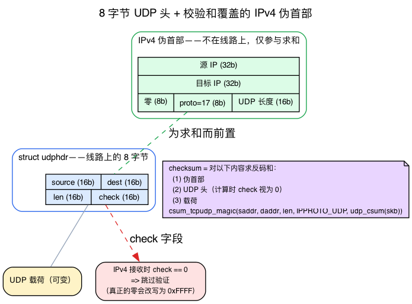
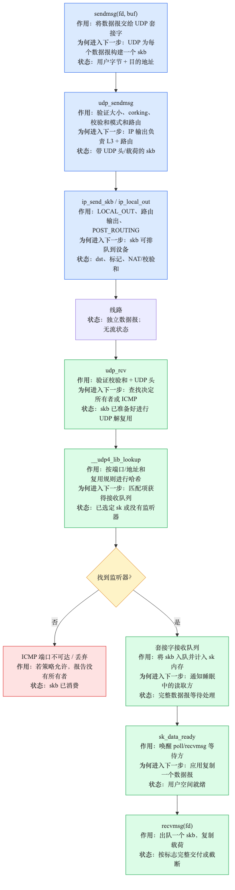
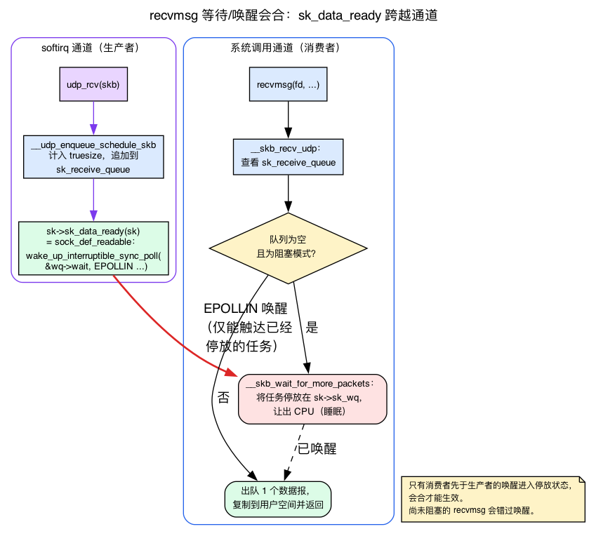
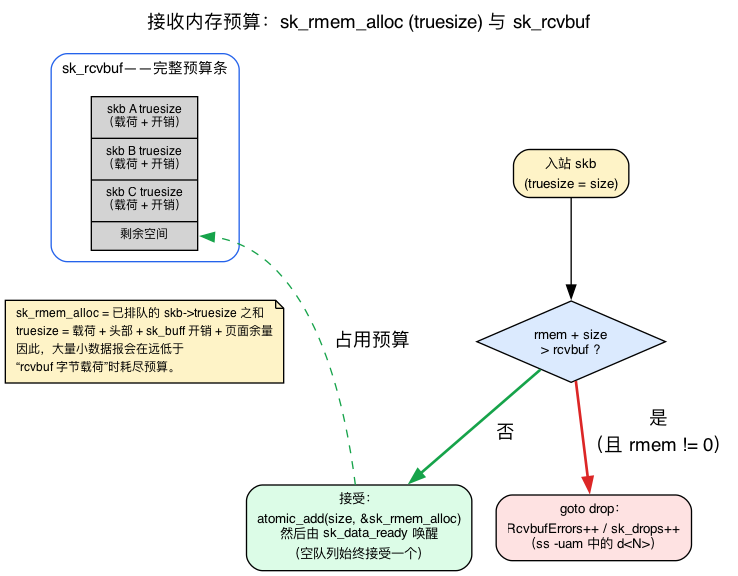
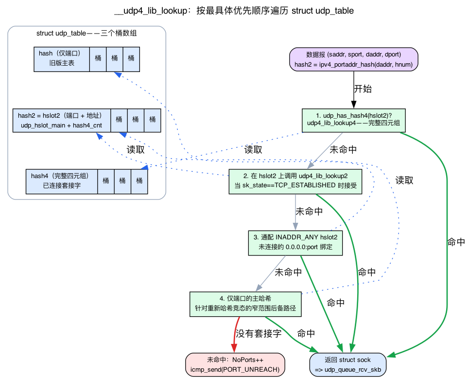

# 第14天 — UDP：简单的协议

> **今日任务：** 端到端跟踪一个 UDP 数据包。看清“无连接”为何让内核侧代码大幅简化，并理解这条路径所依赖的四种机制（8 字节的线路头部及其校验和、`recvmsg` 背后的睡眠/唤醒会合、决定数据包是否被丢弃的接收内存预算，以及找到你套接字的 UDP 哈希表），这样路径上就没有任何一处是黑盒。总时长：约 130 分钟。

从用户空间看，UDP 平平无奇：调用 `sendto`、`recvfrom`，仅此而已。但这份简单建立在四种内核机制之上，本章会反复依赖它们。我们会先解释每种机制的直观原理，再给出具体的 v7.1 结构体或函数，最后再完整走一遍路径，让每个阶段都建立在你已经理解的东西之上。

> 今天的内容依赖前几天讲过的若干概念，**不会**再完整重讲：
> - **`struct sock`、`sk_receive_queue`、`sk_prot` 虚表分发**——第13天。当用户空间调用 `sendto`，内核分发到 `sk->sk_prot->sendmsg`，对 UDP 而言就是 `udp_sendmsg`。
> - **`bhash`（按端口键）与 `ehash`（按四元组键）**——第13天讲过 TCP 在 `struct inet_hashinfo` 中的两表拆分。UDP 有类似的拆分，但放在它**自己的** `struct udp_table` 里；第13天把细节推迟到了今天，我们在下面讲解。
> - **伪头部与 `CHECKSUM_PARTIAL` 卸载约定**——第4天。L4 校验和覆盖一个由 IP 地址构建的伪头部；在 `CHECKSUM_PARTIAL` 下，内核填入伪头部之和，由 NIC 完成对负载的折叠求和（`skbuff.h:248-251`）。今天我们把它具体套用到 UDP 上。
> - **`skb->truesize`**——第3天在 TCP *发送*侧引入了它（`sk_wmem_queued`）：一个 skb 的真实内存开销是负载**加上**头部**加上**每个 skb 的结构体开销和页片余量，而不是它的线路长度。今天我们在*接收*侧再次遇到同一个数值。
> - **`sk->sk_wq`，套接字等待队列**——第13天把它作为 `struct socket` 的一个字段提到过。今天我们讲真正用到它的唤醒路径。
> - **TX/IP 输出路径**——第3天。一旦 `udp_sendmsg` 把数据报交给 `ip_send_skb`，它就沿着你已经追过的那条 `ip_local_out → ip_output` 路走。

## 为什么先讲 UDP

UDP 没有状态机、没有重传、没有拥塞控制。一次 `sendmsg` 产生一个线路数据包（若大小 > 路径 MTU，则产生一个被分片的数据包）。一次 `recvmsg` 返回一个数据报。其余一切——丢包恢复、按序交付、流控——都是应用程序自己的事。

理解 UDP 会给你 L4 路径的*基线*。TCP（第 15–17 天）就是“UDP 加一个状态机加重传加拥塞控制”——知道简单版在哪里结束，有助于你看清 TCP 的复杂度都花在了哪里。

## 背景 1：UDP 线路头部，以及校验和保护什么

在追踪 `sendmsg` 之前，先看看真正在线路上传输的内容。本章后面会讨论 UDP-Lite 的“部分校验和”、`InCsumErrors` 计数器，并且反复提到“一次 `sendmsg` 产生一个线路数据包”——如果不看清 `udp_sendmsg` 构建的这 8 字节头部，这些都无法讲清楚。

### 整个协议就是 8 字节

整个 UDP 线路头部是四个 16 位大端字段（`include/uapi/linux/udp.h:23`）：

```c
struct udphdr {
    __be16  source;   /* source port      */
    __be16  dest;     /* destination port */
    __be16  len;      /* UDP header + payload length, in bytes */
    __sum16 check;    /* checksum (see below) */
};
```

这就是**线路上的完整协议头部**——8 字节。对比 TCP 20+ 字节的头部，它携带序列号、确认号、一个窗口和若干标志位。UDP 没有序列号，因为 UDP 从不重排或重传；没有窗口，因为 UDP 不做流量控制；也没有标志位，因为不存在需要通告的连接状态。这个极简头部*就是*“UDP 为何简单”。`udp_send_skb`（`net/ipv4/udp.c:1092`）在把 skb 交给 IP 之前填写这四个字段：

```c
uh = udp_hdr(skb);
uh->source = inet_sk(sk)->inet_sport;
uh->dest   = fl4->fl4_dport;
uh->len    = htons(len);
uh->check  = 0;                 /* finalised below */
```

### 校验和折叠覆盖什么

UDP 的 `check` 字段是对以下三样东西按顺序求得的反码和：

1. **伪头部**——源 IP、目的 IP、一个零字节、协议号（`IPPROTO_UDP` = 17）以及 UDP 长度。（回忆第4天的伪头部——与 TCP 使用的是同一种构造。）把 IP 地址纳入 L4 校验和，将数据报与其端点绑定，这样一个*误投*到错误主机或错误协议的数据包也能被发现，即便单凭 L4 无从分辨。
2. **UDP 头部**（上面那 8 字节，计算时 `check` 取为零）。
3. **负载**。

在 v7.1 中，这恰好就是 `csum_tcpudp_magic` 调用，位于 `udp_send_skb` 的末尾：

```c
uh->check = csum_tcpudp_magic(fl4->saddr, fl4->daddr, len,
                              IPPROTO_UDP, udp_csum(skb));
if (uh->check == 0)
    uh->check = CSUM_MANGLED_0;
```

`csum_tcpudp_magic` 把伪头部加到 `udp_csum(skb)`（即头部+负载之和）上。`CHECKSUM_PARTIAL` 卸载分支（第4天的约定）走的是另一条路——`udp4_hwcsum` 预先填入伪头部的校验和，让 NIC 完成对负载的折叠——但*覆盖范围*是相同的。

### 为什么在 IPv4 上零校验和表示“跳过”

注意上面的 `if (uh->check == 0) uh->check = CSUM_MANGLED_0;`。在 **IPv4 上 UDP 校验和是可选的**：一个*收到的*数据报若其 `check` 字段字面为零，意味着“发送方没有计算校验和；不要校验”。因为一个真正计算出的校验和有可能合法地折叠为零，发送方会把这唯一的一个值改写为等价的 `0xFFFF`（`CSUM_MANGLED_0`），这样，线路上的零便可以明确表示“未提供校验和”。接收侧在 `udp4_csum_init`（`net/ipv4/udp.c:2536`）中通过 `skb_checksum_init_zero_check` 尊重这一点——`uh->check == 0` 会彻底短路校验。

为什么允许这么做？因为 IPv4 有自己的头部校验和，所以即使 L4 跳过校验，损坏的*地址*也会在 L3 被检测出来。**IPv6 没有头部校验和**，无处回退，因此 UDP 校验和在那里是**强制的**——IPv6 接收时 `check` 为零是一个错误。

**UDP-Lite** 调整的正是这条“可选且需改写零值”的规则。UDP-Lite 保持校验和*强制*，但允许应用程序缩小*被覆盖的字节范围*（`UDPLITE_SEND_CSCOV`/`UDPLITE_RECV_CSCOV` 套接字选项）：只覆盖前 N 字节——通常是媒体帧头部——这样，即使视频负载部分损坏，仍可将其*交付*给应用，而不是直接丢弃。线路上是同一个 `udphdr`；改变的只是 `len`/覆盖范围的含义。

### 校验和失败会体现在哪里

当一个*收到的*数据报的校验和不折叠为零时，内核会递增 `Udp: InCsumErrors`。MIB 枚举顺序（`include/uapi/linux/snmp.h:158-162`）与这些列在 `/proc/net/snmp` 中出现的顺序相同：

```c
UDP_MIB_INDATAGRAMS,    /* InDatagrams  */
UDP_MIB_NOPORTS,        /* NoPorts      */
UDP_MIB_INERRORS,       /* InErrors     */
UDP_MIB_OUTDATAGRAMS,   /* OutDatagrams */
UDP_MIB_RCVBUFERRORS,   /* RcvbufErrors */
/* ... SndbufErrors, InCsumErrors, IgnoredMulti, MemErrors */
```

所以 `InCsumErrors` 表示“一个数据报到达了，但它的校验和没有通过校验”——这是一次*损坏*失败，区别于 **`NoPorts`**（一个数据报到达了某个无监听者的端口）和 **`RcvbufErrors`**（一个数据报到达了，但接收队列没有空间）。本章末尾的丢包实验会盯着这三者；现在你知道每一个是什么意思了。



## TX 侧



```c
sendmsg(fd, msg, flags)
  → sock_sendmsg
    → udp_sendmsg                       // net/ipv4/udp.c:1233
      → ip_make_skb / ip_append_data    // net/ipv4/ip_output.c:1553, 1359
      → udp_send_skb                     // net/ipv4/udp.c:1092 (builds the 8-byte header above)
        → ip_send_skb                    // net/ipv4/ip_output.c:1506
          → ip_local_out → ip_output → ... (Day 3's TX path)
```

`udp_sendmsg` 大约是 **274 行**代码——其中大部分是选项处理（MSG_CONFIRM、MSG_MORE、GSO_BY_FRAGS、控制消息处理）以及目的地的路由查找。真正的数据报构建就是一次对 `ip_make_skb` 的调用，或者在 cork 模式下调用 `ip_append_data`。你刚介绍的四字段头部由 `udp_send_skb` 在调用 `ip_send_skb` 之前填入。

### 为什么有两条路径（`ip_make_skb` 和 `ip_append_data`）？

- **`ip_make_skb`**：直接从一个用户空间缓冲区构建一个 skb。快速路径；一次系统调用，一个数据包。
- **`ip_append_data`**（corked）：当设置了 `MSG_MORE` 或 `UDP_CORK` 时使用。内核把多次写入累积到一个部分 skb 中；下一次 `sendmsg`（或 `UDP_CORK off`）将其组合成一个数据报。当应用程序有多个数据源要组成一个数据包时很有用（头部和负载分别构建）。

### 没有套接字级别的发送队列

与 TCP 不同，UDP 不保留一个存放未发送 skb 的 `sk_write_queue`。`udp_sendmsg` 一旦构建好数据报，就把它交给 IP，此后 UDP 层便不再保留它。为什么？因为 UDP 没有重传的概念——没有理由把这些字节留着。套接字缓冲区（`sk_sndbuf`）只对 `sendmsg` 自身的背压有意义：如果 IP 栈此刻无法接受这个数据包（例如 qdisc 满了），`sendmsg` 会阻塞或返回 `EAGAIN`。

## 背景 2：`recvmsg` 背后的阻塞与唤醒机制

接收队列用于衔接两方：softirq *生产者*把一个数据报放进去，系统调用*消费者*把它取出来。关键情形是消费者比生产者**先**到达——在一个空队列上阻塞的 `recvmsg` 必须以某种方式*等待*，然后在数据包落地的一瞬间*被唤醒*。这套机制无法直接从调用链看出，因此先单独讲解，再追踪那些调用链。

### 问题：不要空转

一个在空队列上阻塞的 `recvmsg` 绝不能通过忙等持续占用 CPU。相反，它会把调用任务**挂起**在套接字的等待队列上，并让出 CPU。每个 `struct sock` 都恰好有这样一个等待队列，通过 `sk->sk_wq` 抵达（第13天提到过这个字段；这里正是它发挥作用之处）。被挂起的任务会进入睡眠，直到有东西显式唤醒它。

### 唤醒：`sk_data_ready`

把“一个数据包落进队列”变成“应用程序的 `recvmsg` 返回”的关键钩子是 `sk->sk_data_ready`。它的默认值在 `sock_init_data`（`net/core/sock.c:3734`）中为每个套接字设置：

```c
sk->sk_data_ready = sock_def_readable;
```

`sock_def_readable`（`net/core/sock.c:3614`）很短，它就是整条唤醒路径：

```c
void sock_def_readable(struct sock *sk)
{
    struct socket_wq *wq;
    trace_sk_data_ready(sk);
    rcu_read_lock();
    wq = rcu_dereference(sk->sk_wq);
    if (skwq_has_sleeper(wq))
        wake_up_interruptible_sync_poll(&wq->wait, EPOLLIN | EPOLLPRI |
                                        EPOLLRDNORM | EPOLLRDBAND);
    sk_wake_async_rcu(sk, SOCK_WAKE_WAITD, POLL_IN);
    rcu_read_unlock();
}
```

发生了两件事：任何正在 `sk_wq` 上等待的任务都会收到带 `EPOLLIN` 轮询掩码的唤醒（这会解除 `recvmsg` 的阻塞状态），并且 `sk_wake_async_rcu` 触发异步/SIGIO 以及 epoll/io_uring 通知。因此，`sk_data_ready` 通过一个生产者侧钩子即可服务*各种*等待方式——阻塞的 `recvmsg`、`select`/`poll`/`epoll`，以及 SIGIO。

### 把它接起来

生产者侧在把数据报计入队列之后立即调用这个钩子。在 `__udp_enqueue_schedule_skb`（`net/ipv4/udp.c:1745`）中：

```c
INDIRECT_CALL_1(READ_ONCE(sk->sk_data_ready),
                sock_def_readable, sk);
```

`INDIRECT_CALL_1` 只是内核的间接调用包装器——它调用 `sk->sk_data_ready`（那个函数指针），同时向编译器提示目标几乎总是 `sock_def_readable`，这样常见情形就能避免 retpoline。实际效果就是调用 `sk->sk_data_ready(sk)`。

消费者侧在出队路径中循环。`__skb_recv_udp`（`net/ipv4/udp.c:1923`）是 `recvmsg` 路径驱动的 UDP 出队入口；它从 `sk_receive_queue`（经由其 `reader_queue`）查看数据或执行出队，如果队列为空且套接字是阻塞的，**它自己的**出队循环会调用 `__skb_wait_for_more_packets`（`net/core/datagram.c:89`，从 `net/ipv4/udp.c:1984` 调用）来睡眠，直到 `sk_data_ready` 唤醒它——或者超时或信号触发。（UDP **不**走 `__skb_recv_datagram` 通用循环，即 `net/core/datagram.c:305` 处的那个；那条路径服务于其他数据报协议。UDP 自带循环，以便它能拼接生产者侧队列并做自己的内存记账。）

这也正是为什么后面的实验坚持要你**在发送之前先挂上探针**：一次唤醒只能到达一个*已经进入等待状态*的任务。同理，一个挂得太晚的探针什么都看不见，尚未阻塞的 `recvmsg` 不需要这次唤醒——只有生产者到达时消费者已经在等待，这次唤醒才有对象。



## 背景 3：接收内存预算（`sk_rmem_alloc` 对 `sk_rcvbuf`）

下面的丢包故事完全建立在“如果队列满了，数据包就被丢弃”之上。但*满的是什么*？不是数据报的计数，也不是负载字节数——答案是一项内存预算。准确理解其计量方式，才能预测何时会发生丢包。

### 预算与用量计数

每个套接字的接收队列都有一个**内存预算**：`sk_rcvbuf`，从 `net.core.rmem_default` 初始化，并可通过 `SO_RCVBUF` 提升到 `net.core.rmem_max`。记录**当前用量**的是 `sk_rmem_alloc`，一个原子计数器。

计入预算的是 **`skb->truesize`**——回忆第3天（发送侧的 `sk_wmem_queued` 记账）：truesize 是负载**加上**头部**加上** `sk_buff` 结构体开销**加上**页片余量，*而不是*线路长度。接收侧用的就是同一个数值。直接后果是：许多小数据报，每个装在自己的小 skb 里，每个都带着固定的每 skb 开销，可以在**远低于**“rcvbuf 字节的负载”时就耗尽预算。一个 20 字节的数据报轻易就要花掉几百字节的 truesize。

### 入队检查

`__udp_enqueue_schedule_skb`（`net/ipv4/udp.c:1655`）读取计量表和预算，然后执行入队检查（`net/ipv4/udp.c:1679`）：

```c
rmem   = atomic_read(&sk->sk_rmem_alloc);
rcvbuf = READ_ONCE(sk->sk_rcvbuf);
size   = skb->truesize;
/* ... */
if (rmem + size > rcvbuf) {
    if (rcvbuf > INT_MAX >> 1)
        goto drop;
    /* Accept the packet if queue is empty. */
    if (rmem)
        goto drop;
}
```

这段代码的含义是：**如果 `rmem + truesize > rcvbuf`，就丢弃**——但有一项特殊处理。如果队列当前为*空*（`rmem` 为零），这个数据包仍会被接受，因此即使单个超大数据报超过整个预算，也不会永远无法入队。`INT_MAX >> 1` 守卫处理了无符号转换的边界检查。超出预算的丢弃会计入 `RcvbufErrors` / `sk_drops`——也就是 `ss -uam` 中的 `d<N>` 记号，以及本实验关注的 `RcvbufErrors` 列。

通过入队检查后（`net/ipv4/udp.c:1695`），当队列超过半满时（`rmem > rcvbuf >> 1`），内核调用 `skb_condense(skb)` 来收缩 skb 的 truesize——通过一次线性拷贝回收页片余量——从而提高这项内存预算的利用率。计费用 `atomic_add(q_size, &sk->sk_rmem_alloc)`（`net/ipv4/udp.c:1736`）在 `sk_data_ready` 唤醒**之前**提交，这样一个被唤醒的 `recvmsg` 总能看到一致的计量表。

这正是为什么“调整 `rmem_max` + `SO_RCVBUF`”是应对突发流量压垮慢速接收者的方法：你是在抬高 truesize 预算，让接收队列能够容纳瞬时突发流量，而不是在 `recvmsg` 来得及排干之前就被丢弃。



## RX 侧

```c
ip_rcv → ip_local_deliver → ip_local_deliver_finish
  → udp_rcv(skb)                         // net/ipv4/udp.c:2588
    → __udp4_lib_lookup                   // net/ipv4/udp.c:667 — find sock by 4-tuple
    → udp_queue_rcv_skb                  // net/ipv4/udp.c:2422
      → __udp_queue_rcv_skb               // net/ipv4/udp.c:2307
        → __udp_enqueue_schedule_skb      // the truesize gate from Background 3
        → sk->sk_data_ready(sk)           // the wake from Background 2
```

### 背景 4：UDP 哈希表与最具体优先的查找

第13天讲过 TCP 的 `bhash`/`ehash` 拆分，并说“UDP 有它自己的 `struct udp_table`，见第14天”。这就是那一节。当一个数据报带着 `(saddr, sport, daddr, dport)` 到达时，内核必须把它变成一个 `struct sock`，而它遍历的那张表*不是* TCP 的 `inet_hashinfo`。

**两种绑定**驱动了这个设计：

- **未连接**（默认）：绑定到 `(local_addr, local_port)`。无论来源如何，都接收发往该端口的数据报。
- **已连接**（`connect()` 作用于一个 `SOCK_DGRAM` 之后）：绑定到特定四元组。只接收来自匹配对端的数据报——并被标记为 `TCP_ESTABLISHED`（UDP 复用了 TCP 的状态常量）。

**三个哈希数组。** `struct udp_table`（`include/net/udp.h:94`，通过 `net->ipv4.udp_table` 按 netns 划分）持有三个，从最一般到最具体排列：

```c
struct udp_table {
    struct udp_hslot      *hash;    /* keyed by local port only — legacy primary */
    struct udp_hslot_main *hash2;   /* keyed by (local port, local address) — the hslot2 */
    struct udp_hslot      *hash4;   /* keyed by full 4-tuple — connected (out under CONFIG_BASE_SMALL) */
    unsigned int mask;
    unsigned int log;
};
```

一个桶是一个 `struct udp_hslot`（`include/net/udp.h:57`）——一个套接字列表头 + 计数 + 自旋锁，缓存对齐（`__aligned(2 * sizeof(long))`）：

```c
struct udp_hslot {
    union { struct hlist_head head; struct hlist_nulls_head nulls_head; };
    int       count;
    spinlock_t lock;
} __aligned(2 * sizeof(long));
```

`hash2` 的桶是一个更丰富的 `struct udp_hslot_main`（`include/net/udp.h:76`），它内嵌一个 `hslot` 外加一个 `hash4_cnt`——已连接（`hash4`）的、共享该 `(port, addr)` 的套接字的计数。`udp_has_hash4(hslot2)` 快速路径测试读取的正是该计数器：它让查找过程判断是否有必要查询已连接套接字的四元组表。

**查找遵循最具体匹配优先原则。** `__udp4_lib_lookup`（`net/ipv4/udp.c:667`）走四步：

```c
hash2  = ipv4_portaddr_hash(net, daddr, hnum);
hslot2 = udp_hashslot2(udptable, hash2);

if (udp_has_hash4(hslot2)) {                 /* 1. connected 4-tuple table first */
    result = udp4_lib_lookup4(net, saddr, sport, daddr, hnum, dif, sdif, udptable);
    if (result) return result;
}
/* 2. non-wildcard (daddr,dport) hslot2 — accept if it's a connected socket */
result = udp4_lib_lookup2(net, saddr, sport, daddr, hnum, dif, sdif, hslot2, skb);
if (!IS_ERR_OR_NULL(result) && result->sk_state == TCP_ESTABLISHED)
    goto done;
/* ... (BPF sk_lookup redirect omitted) ... */
if (result) goto done;
/* 3. wildcard INADDR_ANY hslot2 — unconnected binds to 0.0.0.0:port */
hash2  = ipv4_portaddr_hash(net, htonl(INADDR_ANY), hnum);
hslot2 = udp_hashslot2(udptable, hash2);
result = udp4_lib_lookup2(net, saddr, sport, htonl(INADDR_ANY), hnum, dif, sdif, hslot2, skb);
if (!IS_ERR_OR_NULL(result)) goto done;
/* 4. primary port-only hash as a race fallback */
result = udp4_lib_lookup1(net, saddr, sport, daddr, hnum, dif, sdif, udptable);
```

按顺序来看：（1）如果这个 `(port, addr)` 存在任何已连接套接字，先试完整四元组表；（2）否则查找非通配 `hslot2`（对应 `(daddr, dport)`），仅当它是 `TCP_ESTABLISHED`（即一个已连接套接字）时才接受；（3）回退到通配 `INADDR_ANY` `hslot2`——它持有未连接的 `0.0.0.0:port` 绑定；（4）主端口专用 `hash` 覆盖一个狭窄的重哈希竞态。这正是为什么**已连接 UDP 胜过对同一端口的未连接绑定**——而且，正如你会在实验中看到的，为什么*第二个*带新源端口的 `nc` 会未能通过已连接四元组匹配，从而不会被投递。

有了 `SO_REUSEPORT`，一组套接字共享一个 `hash2` 槽，内核对四元组做哈希以从组里挑一个（相关内容推迟到第24天）；这也具体说明了“多个套接字共享绑定槽”时，究竟由哪个数组保存这些套接字。

**在未命中时**，查找返回无套接字，`udp_rcv` 走无监听者路径（`net/ipv4/udp.c:2662`）：

```c
__UDP_INC_STATS(net, UDP_MIB_NOPORTS);
icmp_send(skb, ICMP_DEST_UNREACH, ICMP_PORT_UNREACH, 0);
```

那次 `UDP_MIB_NOPORTS` 递增加上 ICMP 端口不可达，正是丢包实验通过向关闭的端口批量发送数据报所触发的那条路径。



> ### 常见疑问
>
> **问：如果 UDP 是无连接的，那么 `connect()` 一个 `SOCK_DGRAM` 究竟做了什么？**
>
> 答：它把套接字绑定到一个固定四元组并标记为 `TCP_ESTABLISHED`，这样上面的最具体优先查找只交付来自那一个对端的数据报——并让内核跳过每次 `sendmsg` 的路由查找，转而缓存目的地。此过程不会交换任何数据包；它纯粹是本地绑定操作。
>
> **问：为什么校验和在 IPv6 上强制，在 IPv4 上可选？**
>
> 答：IPv4 有自己的 L3 头部校验和，所以即使 L4 跳过校验，损坏的*地址*也会在 L3 被检测出来（背景 1）。IPv6 为了省去每跳的开销丢掉了头部校验和，所以 UDP 校验和是仅剩的完整性检查——它不能是可选的。

### 入队

`udp_queue_rcv_skb` 把 skb 追加到套接字的 `sk_receive_queue`（一个 skb 双向链表），并经过背景 3 介绍的 `__udp_enqueue_schedule_skb` 入队检查。如果通过这项检查，计费被提交，`sk_data_ready` 触发背景 2 的唤醒；如果预算被超出，数据报被丢弃，`RcvbufErrors` 上涨。UDP 不对发送方回压（没有 ACK 机制），所以超出预算的突发数据报只能被丢弃。

## recvmsg 路径

```c
recvmsg(fd, msg, flags)
  → sock_recvmsg
    → udp_recvmsg                         // net/ipv4/udp.c:2031
      → __skb_recv_udp                    // net/ipv4/udp.c:1923 — dequeue (or park on sk_wq if empty+blocking)
      → skb_copy_datagram_msg              // copy into user buffer
      → skb_consume_udp                    // free the skb (UDP-specific wrapper)
```

每次 `recvmsg` *恰好*返回一个数据报。如果用户缓冲区比数据报小，剩余部分被静默截断，并设置 `MSG_TRUNC`（在 `msg->msg_flags` 中）。（TCP 不这么做——TCP 给你字节，UDP 给你数据包。）

`MSG_PEEK` 返回数据但不出队——对定长头部协议很有用，你先窥视以得知长度，然后再真正读取。它花费更多 CPU，因为 skb 留在队列里。

当队列为空且套接字采用阻塞模式时，消费者会在 `__skb_recv_udp` 中等待于 `sk_wq`（背景 2），直到生产者通过 `sk_data_ready` 将其唤醒。

## UDP-Lite、GSO 及其他变体

- **UDP-Lite（RFC 3828）**：背景 1 里那条可选校验和的调整——强制校验和，但覆盖范围经由 `CSCOV` 缩小到前 N 字节。Linux 把它作为 `IPPROTO_UDPLITE` 暴露；代码路径是同样的 `udp_sendmsg`/recv 逻辑加一个覆盖标志。
- **UDP GSO**（`UDP_SEGMENT` 套接字选项）：应用程序发送一个大缓冲区，内核在软件里把它分片成 MTU 大小的数据报。这就是 QUIC/HTTP3 实现如何从用户空间获得高吞吐量——一次系统调用交付许多数据包。（`udp_send_skb` 也有一条 GSO 路径，由 `cork->gso_size` 守卫，它设置 `SKB_GSO_UDP_L4`，让分段稍后在 `udp_offload.c` 里发生——见阅读清单。）
- **UDP-encap**（IPsec、VXLAN、GENEVE、FoU）：使用特殊端口的 UDP 套接字；它不会进入 `sk_receive_queue`，而是调用已注册的 `encap_rcv` 处理函数。第12天介绍过 VXLAN 如何使用这一机制。

## 今日实验

顺序很重要：探针必须**在发送任何数据报之前挂载**，否则跟踪不到任何事件。（这正体现了背景 2 的机制——唤醒只对已经等待的任务有效，探针也只能看到挂载之后发起的调用。）请使用两个终端。

**终端 1**——先启动一个 UDP 监听器，然后挂上跟踪并等待 `Attached 3 probes`：
```bash
nc -ul 9999 &

sudo bpftrace -e '
fentry:udp_sendmsg           { printf("send %d bytes from sk=%p\n", args->len, args->sk); }
fentry:udp_rcv               { printf("recv at sk-lookup\n"); }
fentry:udp_queue_rcv_one_skb { printf("queue to sk=%p\n", args->sk); }
'
```

**终端 2**——只有在跟踪打印出 `Attached 3 probes` 之后，才从一个*单一*客户端进程发送两个数据报，这样它们共享一个源端口：
```bash
{ echo hello; sleep 1; echo world; } | nc -u -q1 127.0.0.1 9999
```

`-q1` 让客户端在 EOF 后 1 秒退出，而不是挂在打开的 UDP 套接字上。观察终端 1；你会看到每个数据报都是一次 send → 一次 rcv → 一次 queue，然后 Ctrl-C 停止跟踪：
```text
Attached 3 probes
send 6 bytes from sk=0xffff8bf601ed5400
recv at sk-lookup
queue to sk=0xffff8bf61237f380
send 6 bytes from sk=0xffff8bf601ed5400
recv at sk-lookup
queue to sk=0xffff8bf61237f380
```

没有状态机参与——每个数据报都走相同的、无状态的三步路径。

做完后，停止监听器：`kill %1`  # (or: `pkill nc`)

**这种安排避开了两个陷阱：**

- **为什么用一个客户端进程，而不是两个 `echo | nc`？** 用这里使用的 OpenBSD `nc`，未连接的 `nc -ul 9999` 会在收到第一个数据报后，通过 `connect()` 绑定到*第一个*发送者的地址。第二个独立的 `echo | nc` 是一个新进程，带一个新鲜的临时源端口，所以它在 `__udp4_lib_lookup` 里未能通过已连接套接字四元组匹配，**不会**被投递给监听器——你会看到它的 `recv`，但没有 `queue` 行。这正是背景 4 里那个最具体优先的查找：一旦监听器已连接，步骤 1/2 要求完整四元组，而一个新源端口不再匹配。用一个进程驱动两次写入，使源端口保持稳定，让两个数据报都匹配。（不要把它们合并成 `printf 'hello\nworld\n' | nc`——单次管道读取会变成一次 `sendto`，即一个数据报。）
- **为什么用 `udp_queue_rcv_one_skb` 而不是 `__udp_queue_rcv_skb`？** 静态的 `__udp_queue_rcv_skb`（上面 RX 图里命名的那个符号）在大多数构建中被内联进 `udp_queue_rcv_one_skb`——`grep __udp_queue_rcv_skb /proc/kallsyms` 什么都不返回，`fentry:__udp_queue_rcv_skb` 挂不上，这会让 bpftrace 中止*整个*程序（你会得到零输出）。未内联的包装器 `udp_queue_rcv_one_skb` 可靠可挂，并且携带同样的 `args->sk`。运行前用 `bpftrace -l 'fentry:vmlinux:udp_queue_rcv_one_skb'` 验证。

### 观察 UDP 丢包

在一台空闲机器上每个丢包计数器都读作 0，所以先**制造一次丢包**以便观察计数变化。向一个关闭的 UDP 端口发送会递增 `NoPorts`（NO_SOCKET）计数器——这是最容易稳定复现的 UDP 交付失败，也正是背景 4 里的 `__udp4_lib_lookup` 未命中 → `UDP_MIB_NOPORTS` + `icmp_send` 路径：
```bash
# Baseline:
grep -E '^Udp:' /proc/net/snmp

# Trigger: 50 datagrams to a closed port (each is dropped with NO_SOCKET):
for i in $(seq 1 50); do echo x | nc -u -w0 127.0.0.1 1; done

# Read again — NoPorts climbs by ~50:
grep -E '^Udp:' /proc/net/snmp
nstat -az | grep -i '^Udp'

# Per-socket drops:
ss -uam   # u=UDP, a=all, m=memory
```

预期——`NoPorts` 列（第 2 个值）恰好跳增所发送的 50 个数据报：
```text
Udp: InDatagrams NoPorts InErrors OutDatagrams RcvbufErrors SndbufErrors InCsumErrors IgnoredMulti MemErrors
Udp: 1547 88 0 1636 0 0 0 1 0      # before
Udp: 1547 138 0 1686 0 0 0 1 0     # after (NoPorts 88 → 138)
```

**如何解读输出：**

- `grep -E '^Udp:' /proc/net/snmp` 打印两行：第一行列出计数器*名字*，第二行列出*值*；第 N 个值对应第 N 个名称（这就是背景 1 里的 `UDP_MIB_*` 枚举顺序）。`:`（在 `^Udp:` 中的那个）排除了单独的 `UdpLite:` 块。盯着 **`NoPorts`**（目的端口没有套接字——上面触发的情形）、**`InErrors`**（一般接收错误）、**`InCsumErrors`**（一个数据报到达了但它的校验和没通过校验——背景 1），以及 **`RcvbufErrors`**（`sk_rcvbuf` 预算被超出——背景 3）。
- `nstat -az` 按名字显示同样的计数器（`UdpNoPorts`、`UdpInErrors`、`UdpRcvbufErrors`）。用 `-az`——**`-a`** 给出绝对值（自启动以来的累积值），**`-z`** 包含取零值的计数器；裸 `nstat` 只打印自上次运行以来*发生变化*的计数器并重写它的历史文件，所以第二次运行什么都不显示。
- `ss -uam` 把每套接字丢包报告为 `d<N>` 记号，它位于每行 `skmem:(...)` 的末尾；在一个空闲套接字上它读作 `d0`（而 `rb<bytes>` 是那个套接字的 `sk_rcvbuf`——背景 3 里的预算值），这就是为什么触发很重要。

`NoPorts` 是一次*交付*失败（没有监听者）而非队列溢出；`RcvbufErrors` 情形需要一个配置了较小 `SO_RCVBUF` 的慢速接收者遭遇大量数据报才能触发——即把 `sk_rmem_alloc` 推过 `sk_rcvbuf` 的速度快于 `recvmsg` 排干的速度。

繁忙服务器上 UDP 丢包的一个常见原因：**sk_rcvbuf 太小**。默认是 `net.core.rmem_default`（常为 212KB）。对一个高吞吐量的 UDP 接收者：
```bash
sudo sysctl -w net.core.rmem_max=33554432
# Then in app: setsockopt(fd, SOL_SOCKET, SO_RCVBUF, ..., 16MB)
```
记住背景 3：你是在抬高 *truesize* 预算，而不是负载的字节数——所以要按每 skb 开销来估算，而不只是按数据速率。

## 内核源码阅读

- **`net/ipv4/udp.c:1233`**——`udp_sendmsg`。TX 侧。自上而下阅读（约 274 行）。注意三个部分：控制消息解析（cmsg 循环）、路由查找，以及 skb 构建（`ip_make_skb` 对 `ip_append_data` 的分支）。如果想弄清“MSG_CONFIRM 做什么？”——搜索这个文件。

- **`net/ipv4/udp.c:1092`**——`udp_send_skb`。背景 1 里填写那 8 字节头部的地方，以及校验和模式（`CHECKSUM_NONE` / `CHECKSUM_PARTIAL` / 完整的 `csum_tcpudp_magic`）在 `ip_send_skb` 之前被敲定的地方。

- **`net/ipv4/udp.c:2588`**——`udp_rcv`。RX 入口。很短（约 107 行）。执行基本检查（长度、经由 `udp4_csum_init` 的校验和），经由 `__udp4_lib_lookup` 查找目的套接字，分发到多播/单播路径，在未命中时递增 `NoPorts` + 发送 ICMP 端口不可达。

- **`net/ipv4/udp.c:667`**——`__udp4_lib_lookup`。四元组 → 套接字的查找。走一遍背景 4 里的最具体优先次序：已连接 `hash4`、非通配 `hslot2`（若 `TCP_ESTABLISHED` 则接受）、通配 `INADDR_ANY` `hslot2`、主端口专用 `hash`。读这个能澄清“已连接 UDP”在内核侧到底意味着什么。

- **`include/net/udp.h:57,76,94`**——`struct udp_hslot`、`struct udp_hslot_main`、`struct udp_table`。三数组结构（`hash` / `hash2` / `hash4`）以及 `hash4_cnt` 字段——它为 `udp_has_hash4` 快速路径提供动力。

- **`net/ipv4/udp.c:1655`**——`__udp_enqueue_schedule_skb`。背景 3 里的接收内存闸门：`rmem + truesize > rcvbuf` ⇒ 丢弃（带空队列接受）、压力下的 `skb_condense`，然后是 `atomic_add` 计费和 `sk_data_ready` 唤醒。

- **`net/ipv4/udp.c:2422`**——`udp_queue_rcv_skb`。排队路径。它是一个薄薄的（约 21 行）包装器；真正的工作——SO_FILTER / sk_filter 检查（BPF 套接字过滤器）、多播成员检查，以及回压处理——都在它所引出的调用链中（`udp_queue_rcv_one_skb` → `__udp_queue_rcv_skb` → `__udp_enqueue_schedule_skb`），连同那条慢速路径总共约运行 200 行。

- **`net/ipv4/udp.c:2031`**——`udp_recvmsg`。出队侧。读一读 MSG_PEEK 的处理——它出人意料地微妙（锁住套接字，遍历队列而不移除）。

- **`net/core/sock.c:3614`**——`sock_def_readable`。背景 2 里的默认 `sk_data_ready`：`sk_wq` 睡眠者唤醒加上异步/epoll 通知。在 `net/core/sock.c:3734` 处装上。

- **`net/core/datagram.c:89`**——`__skb_wait_for_more_packets`。一个阻塞的 `recvmsg` 究竟如何睡眠；对 UDP 而言它从 `__skb_recv_udp` 自己的出队循环于 `net/ipv4/udp.c:1984` 调用（不是 `__skb_recv_datagram` 通用循环，即 `net/core/datagram.c:305` 处的那个，它服务于其他数据报协议）。

- **`net/ipv4/ip_output.c:1553`**——`ip_make_skb`。一个单发 UDP 数据包如何构建。与 corked 的 `ip_append_data` 对比，以理解其权衡。

- **`net/ipv4/udp_offload.c`**——UDP GSO/GRO。搜 `udp4_ufo_fragment` 找分段函数，搜 `udp_gro_receive` 找接收侧合并。如果你在推高速率 UDP（QUIC）并想理解 GSO 为何重要，就读这个。

- **`net/ipv4/udp.c`** UDP_GRO / UDP_SEGMENT 套接字选项处理器——没有专门的 `udp.rst`；UDP GSO/GRO 和错误队列主要在代码和原始提交日志里有记录。（`Documentation/networking/udplite.rst` 涵盖 UDP-Lite 变体。）

## 要点回顾

- 整个 UDP 线路头部是 **8 字节**——`source, dest, len, check`（`udp.h:23`）。没有序列号/ACK/窗口/标志位；那个极简头部*就是*“UDP 为何简单”。
- 校验和覆盖**伪头部（源/目的 IP、proto=17、UDP len）+ UDP 头部 + 负载**。在 **IPv4 上它是可选的**（`check==0` ⇒ 跳过校验；一个真正的零被改写为 `0xFFFF`）；在 **IPv6 上它是强制的**。UDP-Lite 保持它强制，但缩小被覆盖的字节范围。一次校验失败递增 **`InCsumErrors`**。
- TX：`udp_sendmsg → ip_make_skb → udp_send_skb → ip_send_skb → ...`。**没有发送队列**——数据报立即交给 IP（UDP 从不重传）。
- RX：`udp_rcv → __udp4_lib_lookup → udp_queue_rcv_skb → enqueue + wake`。
- **查找**最具体优先地遍历 `struct udp_table` 的三个数组：已连接 `hash4`（四元组）→ 非通配 `hash2`/`hslot2`（若 `TCP_ESTABLISHED` 则接受）→ 通配 `INADDR_ANY` `hash2` → 主端口专用 `hash`。一次未命中递增 **`NoPorts`** 并发送 ICMP 端口不可达。
- **阻塞的 `recvmsg`** 让任务在 `sk->sk_wq` 上等待；软中断中的 `sk->sk_data_ready`（`sock_def_readable`）发出一次 `EPOLLIN` 唤醒。任务通过 `__skb_wait_for_more_packets` 进入睡眠。
- **丢包**发生在 `sk_rmem_alloc + skb->truesize > sk_rcvbuf` 时——这是一个 **truesize** 预算（负载 + 开销），而不是负载字节数的计数。空队列总是接受一个；超预算递增 **`RcvbufErrors`** / `sk_drops`。用 `net.core.rmem_max` + `SO_RCVBUF` 修正。
- **MSG_PEEK** 读取而不出队；**MSG_TRUNC** 标记被截断的读取。
- **UDP GSO**（`UDP_SEGMENT` 套接字选项）让一次系统调用 → 许多 MTU 大小的数据报。QUIC 会使用这项能力。

## 检查问题

为什么 UDP 有一个每套接字的接收队列（`sk_receive_queue`），却没有发送队列？

<details>
<summary>点击揭晓答案</summary>

**答案：** UDP 不*重传*——没有 ACK，一个数据报一旦交给 IP 就没有理由记住它。发送路径在 `udp_sendmsg` 中构建一个 skb 并立即进入 IP 输出路径；什么都不被留下。相比之下，TCP *必须*把已发送的 skb 保留在 `sk_write_queue` 里，因为当 ACK 没有到达时它可能需要重传它们（第17天）。接收队列*是*需要的，因为内核带着一个数据报到达时，应用程序还没调用 `recvmsg` 去消费它；队列把它留住直到应用程序露面。两个协议都有接收队列；只有 TCP 需要发送队列。

</details>

---

## 明天

第15天：TCP 状态机——十一个状态，`tcp_input.c` 中约 7,700 行的状态处理代码。
