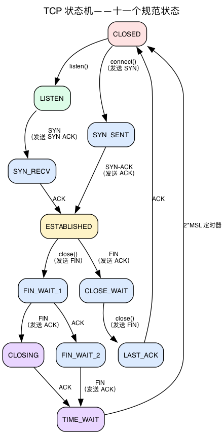
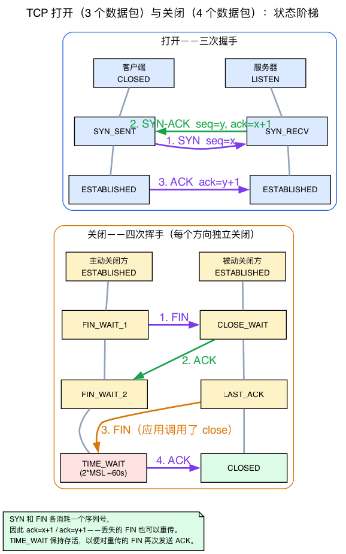
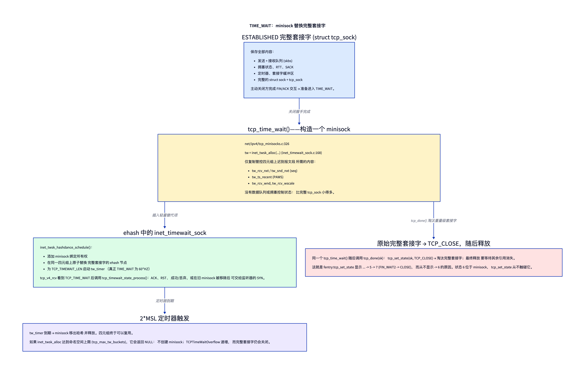

# 第15天 — TCP 状态机

> **今日任务：** 跟踪一条 TCP 连接走过每一个状态。先弄清驱动状态转换的那些*字节*——TCP 头部及其控制标志位——再看推动状态迁移的三次与四次报文交换，最后通过 TIME_WAIT minisock 解开本章最值得关注的谜题。理解 TIME_WAIT 为何存在、FIN_WAIT_2 为何有时会挂住，以及内核如何实现每一次转换。总时长：约 110 分钟。

## 这里的“状态机”究竟指什么

TCP 是面向连接的协议——每条连接在其整个生命周期里，两端都维护着*状态*。这些状态编码了“这条连接下一步合法的动作是什么？”。状态转换由以下事件触发：

- 应用调用（`connect`、`listen`、`accept`、`close`）。
- 收到的报文段（SYN、SYN-ACK、ACK、FIN、RST）。
- 定时器事件（RTO 触发、2MSL 到期）。

由接收报文段驱动的转换集中在 `tcp_rcv_state_process`（`net/ipv4/tcp_input.c:7119`）中处理，而来自其他位置的显式状态变更则由 `tcp_set_state`（`net/ipv4/tcp.c:2961`）处理。读懂这两个函数，你就掌握了 TCP 控制流的 80%。

不过，这份列表留下了一个几乎所有 TCP 教程都会略过的问题。中间那一项——“收到的报文段（SYN、SYN-ACK、ACK、FIN、RST）”——列出了五个*事件*，本章后续讲解的状态机正是由这些事件驱动的。但 SYN 到底*是什么*？它住在哪里？“SYN-ACK”是一个包还是两个包？在谈状态之前，我们得先谈那些触发转换的字节。我们就从这里开始。

## 背景 1：TCP 报文段及其控制标志位

第3天讲了 TX 的套接字一侧——`sendmsg`、写队列、`snd_nxt`。今天我们看看真正在线路上传输的内容，尤其是其中状态机会响应的少数几个比特位。

### 先建立直觉：标志位是比特，不是包的类型

一个 TCP *报文段*不过是一个 TCP 头部，后面跟着可选选项，再跟着载荷字节。头部固定为 **20 字节**（有选项时更长）。埋在其中的是一组**单比特控制标志位**。状态机读取这些标志位时，并不是像辨别邮件中形状不同的信封那样辨别不同类型的包——它关注的是同一种 TCP 头部中*哪些彼此独立的比特被置位*。

这是今天要内化的最重要的一点：**SYN、ACK、FIN、RST、PSH 是相互独立的比特。**它们不是互斥的包类型。一个报文段可以同时置位好几个：

- **SYN-ACK** 不是两个包——它是*一个*同时置位了 SYN 比特和 ACK 比特的报文段。
- 握手的最后一个包是一个**裸 ACK**（只置位 ACK 比特）。
- FIN 几乎不会单独出现——它通常与 ACK 同时置位，所以线路上你看到的是 **FIN+ACK**。（握手之后的每个报文段都置位 ACK，因为 TCP 会把确认捎带在一切东西上。）

每个比特对状态机意味着什么：

- **SYN**——“打开”。同步序列号；只在连接建立期间出现。
- **ACK**——“本报文段确认了已经收到的数据”。基本上除第一个 SYN 外，之后的一切都会置位。
- **FIN**——“我这一方向已经发送完毕；现在优雅地关闭发送侧”。
- **RST**——“立即中止”。没有优雅的往返，也不期待任何确认。
- **PSH**——“立即把数据交给应用”；不驱动状态。
- **URG / ECE / CWR / AE**——紧急指针与 ECN/AccECN 信令；与状态机无关。

### 具体的结构体：`struct tcphdr`

下面是 v7.1 中实际在线路上传输的头部（`include/uapi/linux/tcp.h:25`，展示的是小端布局）：

```c
struct tcphdr {
    __be16  source;
    __be16  dest;
    __be32  seq;        /* sequence number of the first payload byte    */
    __be32  ack_seq;    /* next byte I expect from you (set when ack=1)  */
    __u16   ae:1,
            res1:3,
            doff:4,     /* data offset: header length in 32-bit words    */
            fin:1,
            syn:1,
            rst:1,
            psh:1,
            ack:1,
            urg:1,
            ece:1,
            cwr:1;
    __be16  window;
    __sum16 check;
    __be16  urg_ptr;
};
```

那些标志位就是字面上的那几个 `:1` 位域——`fin:1, syn:1, rst:1, psh:1, ack:1`。它们上方的两个 `__be32` 字段 `seq` 和 `ack_seq` 才是协议的核心：`seq` 标记当前一方发出的字节，`ack_seq` 则表示它期望从对端收到的下一个字节。

![20 字节的 TCP 头部及其标志位字段（tcp[12-13]）](diagrams/day15_tcp_header.png)

### 内核读取标志位的两种方式

内核以两种不同的方式接触这些标志位，读代码时你会看到两者：

1. **直接从线路上的位域读取。** 手里握着 `struct tcphdr *th` 的代码会直接读 `th->syn`、`th->fin`、`th->rst` 等。还有一个辅助函数 `tcp_flags_ntohs(th)`（`include/net/tcp.h:1062`），它把所有标志位一次性提取为一个主机序的值。

2. **预先提取到 skb 控制块中。** 回忆第1天的 `cb[48]` 暂存区——它是各层按数据包暂存状态的区域。TCP 用 `struct tcp_skb_cb` 覆盖它，通过 `TCP_SKB_CB(skb)` 宏（`include/net/tcp.h:1149`）访问。在输入路径的早期，标志位字节被拷贝进 `TCP_SKB_CB(skb)->tcp_flags`——一个注释为“TCP header flags (tcp[12-13])”的 `__u16`（`include/net/tcp.h:1115`）——这样输入路径的其余部分就能廉价地对标志位 `switch`，而无需重新解析头部。

每个具名比特都有一个用于掩码的 `BIT()` 常量（`include/net/tcp.h:1050-1054`）：

```c
#define TCPHDR_FIN  BIT(0)
#define TCPHDR_SYN  BIT(1)
#define TCPHDR_RST  BIT(2)
#define TCPHDR_PSH  BIT(3)
#define TCPHDR_ACK  BIT(4)
```

### 整章都在默默依赖的事实：SYN 和 FIN 各消耗一个序列号

一个纯 ACK 不携带载荷，也不占据字节流里的任何位置——它只是报告一个数字。但 **SYN 和 FIN 各消耗一个序列号**，就像各自占用了一个虚拟的数据字节。这不是什么怪癖；正是这一机制保证了优雅关闭的*可靠性*：

- 因为 FIN 占用一个真实的序列号位置，对端能够**专门确认它**（它的 ACK 指向 FIN 之后的那个字节）。
- 因为它被确认了，一旦 ACK 丢失，它就能像任何其他字节一样被**重传**（回忆第3天的 `snd_nxt`——FIN 会让它前进 1）。

记住这一点。它*正是*本章后面 TIME_WAIT“保持存活以便 ACK 一个被重传的 FIN”这一保证能成立的原因。

### RST 是这一切的例外

`RST` 很特别：它**不携带载荷**，不占据序列槽位，也**不被确认**。它根本不参与优雅的 FIN 往返——它会立即拆除连接。这正是为什么当应用在接收队列里仍有未读数据时调用 `close()`，`__tcp_close` 会发送一个 **RST 而不是 FIN**（你会在“内核源码阅读”一节看到）：优雅地排空一条根本没人在听的连接毫无意义。

## 十一个状态



定义于 `include/net/tcp_states.h:13`：

```c
enum {
    TCP_ESTABLISHED = 1,
    TCP_SYN_SENT,
    TCP_SYN_RECV,
    TCP_FIN_WAIT1,
    TCP_FIN_WAIT2,
    TCP_TIME_WAIT,
    TCP_CLOSE,
    TCP_CLOSE_WAIT,
    TCP_LAST_ACK,
    TCP_LISTEN,
    TCP_CLOSING,
    TCP_NEW_SYN_RECV,
    TCP_BOUND_INACTIVE,
};
```

（最后两个属于内部子状态——NEW_SYN_RECV 是监听套接字上的一个半开 SYN 条目；BOUND_INACTIVE 是一个刚绑定但尚未 listen 的套接字。）

这个枚举的*顺序*不是装饰性的——它决定了稍后 bpftrace 实验需要解码的整数值：`TCP_ESTABLISHED=1`、`TCP_SYN_SENT=2`、`TCP_SYN_RECV=3`，以此类推。把这些数字记在心里；几节之后你就要从探针上直接读它们的原始值。

### 连接建立阶段的状态

- **CLOSED**——无连接。初始状态与最终状态。
- **LISTEN**——被动打开：服务器的监听套接字。等待到来的 SYN。
- **SYN_SENT**——主动打开：客户端已发出 SYN，等待 SYN-ACK。
- **SYN_RECV**——服务器收到了 SYN，发出了 SYN-ACK，等待完成三次握手的那个 ACK。
- **ESTABLISHED**——握手完成，数据正在流动。

### 背景 2：三次握手，逐包拆解

本章的状态图直接给出了 `CLOSED → SYN_SENT → ESTABLISHED` 以及服务器的 `LISTEN → SYN_RECV → ESTABLISHED`，仿佛连接建立过程已经显而易见。其实不然——所以这里给出真正推动这些边的三个包。

第13天已经讲过**套接字一侧的处理流程**：`connect()` 发出 SYN 并把客户端置于 SYN_SENT；`listen()` 构建 accept 队列；半开的握手作为一个 `TCP_NEW_SYN_RECV` 请求 sock 存活在 ehash 里；而 `accept()` 弹出一条已完成的连接。这些是内核侧的机制，回顾第13天的内容即可。今天新增的是**线路上的报文交换过程**。

打开是**三个包**：

1. **客户端 → 服务器：SYN**，`seq=x`。（客户端进入 SYN_SENT。）
2. **服务器 → 客户端：SYN-ACK**，`seq=y, ack=x+1`。（服务器创建半开条目并发出它；注意 `ack=x+1`，因为那个 SYN 消耗了序列号 `x`。）
3. **客户端 → 服务器：ACK**，`ack=y+1`。（服务器在收到它时移入 ESTABLISHED；客户端在 SYN-ACK 到达的那一刻就已移入 ESTABLISHED。）

这次交换真正的*目的*并非形式上的确认——而是**每一侧都学到了对方的初始序列号**（`x` 和 `y`）。没有这次交换，两端都不知道对方的字节流从何处开始。

把每个包映射到一条状态边：

| 包 | 谁在迁移 | 边 |
|--------|-----------|------|
| 发出 SYN | 客户端 | CLOSED → SYN_SENT |
| 收到 SYN | 服务器 | LISTEN →（半开）→ 发出 SYN-ACK |
| 收到 SYN-ACK | 客户端 | SYN_SENT → ESTABLISHED |
| 收到最终 ACK | 服务器 | SYN_RECV → ESTABLISHED |

这就是状态图*左半边*的具体化。**关闭**与之对称，但用的是 FIN，而且需要**四个**包（FIN、ACK、FIN、ACK）而非三个——因为每个方向都*独立地*关闭。这种不对称正是关闭那半边的图为何是由多个状态组成的分支，而不是一条简单边的根本原因；我们接下来就讲它。

在内核里，`tcp_rcv_state_process`（`net/ipv4/tcp_input.c:7119`）按连接的*当前*状态分派，然后才检查标志位。`TCP_SYN_SENT` 和 `TCP_SYN_RECV` 两个 case（这个 switch 在 `tcp_input.c:7128`，`case TCP_LISTEN` 在 `:7133`）之所以是函数的主体，恰恰是因为握手的完成是 TCP 控制流中最精细的部分。



### 优雅关闭阶段的状态

TCP 连接的关闭是*双向的*：每个方向都可以独立地关停（“半关闭”）。这产生了由多个状态组成的关闭分支。它是一次四包交换——每一侧都发出自己的 FIN 并确认对方的 FIN。

先调用 `close()` 的一侧依次进入：

- **FIN_WAIT_1**——已发出 FIN，等待 ACK 或对端的 FIN。
- **FIN_WAIT_2**——对端已 ACK 我们的 FIN；等待对端的 FIN。
- **TIME_WAIT**——收到对端的 FIN；已 ACK；我们在完全关闭前等待 2\*MSL（两倍的最大报文段生命期）。

接收关闭请求的一侧依次进入：

- **CLOSE_WAIT**——收到 FIN；应用还没调用 `close()`。
- **LAST_ACK**——应用已调用 `close()`；我们发出了自己的 FIN；等待 ACK。

如果两侧同时关闭，还可能进入：

- **CLOSING**——已发出 FIN，对端的 FIN 在我们的 ACK 之前到达；两侧现在都在关闭。

## 状态变化的驱动因素

### 应用发起的

| 调用 | 效果 |
|------|--------|
| `socket()` + `listen()` | CLOSED → LISTEN |
| `connect()` | CLOSED → SYN_SENT（发出 SYN） |
| 从 ESTABLISHED 调用 `close()` | ESTABLISHED → FIN_WAIT_1（发出 FIN） |
| 从 CLOSE_WAIT 调用 `close()` | CLOSE_WAIT → LAST_ACK（发出 FIN） |
| `shutdown(SHUT_WR)` | 半关闭：与 close 相同，但套接字仍为读打开 |

### 报文段驱动的

核心函数是 `tcp_rcv_state_process`（`net/ipv4/tcp_input.c:7119`）。它按当前状态分派，然后处理标志位（正是背景 1 里的那些 `th->syn`/`th->fin`/`TCP_SKB_CB(skb)->tcp_flags` 比特）。伪代码：

```c
switch (sk->sk_state) {
case TCP_LISTEN:    handle SYN -> create child sock in NEW_SYN_RECV
case TCP_SYN_SENT:  handle SYN-ACK -> ESTABLISHED, send ACK
case TCP_SYN_RECV:  handle ACK -> ESTABLISHED
default:            handle FIN, RST, ACKs that drive close states
}
```

对于非平凡的状态（ESTABLISHED、FIN_WAIT_*），代码会进入 `tcp_data_queue` 进行常规的数据交付，并在 FIN 到达时运行关闭状态的转换。

### 定时器驱动的

- **SYN-ACK 重传定时器**：在 SYN_SENT 和 SYN_RECV 中，若没有进展，SYN/SYN-ACK 会以指数退避重传。
- **重传定时器（RTO）**：在 ESTABLISHED 中，当一个 ACK 逾期未到时触发（第17天）。
- **TIME_WAIT 定时器（2*MSL）**：在 Linux 上约 60 秒，硬编码为 `TCP_TIMEWAIT_LEN`（`60*HZ`，`include/net/tcp.h:140`），不可配置。它与 `net.ipv4.tcp_fin_timeout` 是分开的——后者（尽管名字如此）控制的是 FIN_WAIT_2 的超时，而不是 TIME_WAIT。
- **保活定时器**（若设置了 `SO_KEEPALIVE`）：探测空闲连接。

## TIME_WAIT 为何存在

TIME_WAIT 是最常引发疑问的 TCP 状态。有两个原因：

1. **确保我们最后的 ACK 抵达对端。** 如果我们最终的 ACK 丢失，对端的 `LAST_ACK` 会重传它的 FIN。我们需要处于 TIME_WAIT——仍然能够发送 ACK——以处理那次重传。如果我们已经进入 CLOSED，就会用 RST 回复，而对端会把它解读为一个错误。*（这正是背景 1 里“FIN 消耗一个序列号，因此可以被单独确认和重传”这一机制真正发挥作用的地方——被重传的 FIN 是一个真实的、可 ACK 的报文段。）*
2. **防止来自该 4 元组上一个连接实例的旧包被投递给新连接。** 若没有 TIME_WAIT，在同一 4 元组上刚刚打开的连接可能会收到旧连接迟到的包。MSL（Maximum Segment Lifetime，最大报文段生命期，约 30 秒）是单个在途包的最大生命期，受 IP TTL 和路由器排队所约束。TIME_WAIT 保持 **2\*MSL**（Linux 上约 60 秒）以覆盖一个完整的往返——主动关闭方最终的 ACK 最多可能要一个 MSL 才抵达对端，而若它丢失，对端重传的 FIN 最多还要一个 MSL 才回来。2\*MSL 之后，两个方向上的旧重复包都必然已从网络中消失。

### 常见疑问

> **问：SYN-ACK 是一个包还是两个包？**
>
> 答：一个。它是一个置位了*两个*控制比特的单个 TCP 报文段——SYN 比特和 ACK 比特——这两个比特都位于每个 TCP 头部唯一的标志位字段中（背景 1）。“SYN-ACK”命名的是一种比特组合，而不是一种包类型；握手中间那一步没有单独的 ACK 包。
>
> **问：`tcp_fin_timeout` 听起来像是控制 TIME_WAIT 的——为什么不是？**
>
> 答：这个名字有误导性。`net.ipv4.tcp_fin_timeout` 约束的是我们在 **FIN_WAIT_2** 中等待对端 FIN 的时长。TIME_WAIT 的持续时间是硬编码的 `TCP_TIMEWAIT_LEN`（`60*HZ`），不是一个 sysctl——不重新编译就无法调整它。
>
> **问：为什么是 2\*MSL 而不是 1\*MSL？**
>
> 答：因为最坏情况是一个完整的*往返*，而不是单程。我们最终的 ACK 最多可能要一个 MSL 才抵达对端；如果它丢失，对端重传的 FIN 最多还要一个 MSL 才回来。等待 2\*MSL 保证我们还在，能够重新 ACK 那个 FIN，并且两个方向上滞留的重复包都已过期。

### 背景 3：TIME_WAIT minisock

这里有一个本章关键实验所依赖的细节，值得单开一节：**进入 TIME_WAIT 的那个套接字，并不是你最初的那个套接字。**

当一条连接进入 TIME_WAIT 时，内核**不会**让完整的 `struct sock`——连同它的发送/接收队列、拥塞状态以及其余一切——继续占用内存 60 秒。在繁忙的服务器上，这会造成极大的内存浪费。取而代之，它分配一个小巧精简的对象：一个 `struct inet_timewait_sock`（`include/net/inet_timewait_sock.h:33`），通常称为 **minisock**。

minisock 只保留识别并正确确认重传 FIN 所需的信息：

- 连接的 **4 元组**（这样 ehash 查找仍能找到它），
- 最后的**序列号/ACK 号**（`tw_rcv_nxt`、`tw_snd_nxt`），
- **时间戳**（用于 PAWS / `tcp_tw_reuse`），
- 在 `TCP_TIMEWAIT_LEN` 之后触发的 **death-row（回收）定时器**钩子。

#### 精确交接：替换完整套接字而不产生查找空档



`tcp_time_wait()` 执行一次受控的替换：

1. `inet_twsk_alloc()` 分配一个 `inet_timewait_sock`/`tcp_timewait_sock`，并拷贝连接标识，以及判断迟到报文段所需的有限序列、接收窗口、时间戳、mark 以及队列映射状态。它没有 TCP 数据队列，也没有拥塞控制状态。
2. `inet_twsk_hashdance_schedule()` 把 minisock 加入 bind 所有权，然后在持有 ehash 锁时，用 minisock 节点原子替换完整套接字的 ehash 节点。因此对同一命名空间和 4 元组的查找会继续找到一个对象，没有空档。minisock 分别获得 bind 链接、ehash 链接和定时器所需的引用，且当这是真正的 TIME_WAIT 时，定时器会按 `TCP_TIMEWAIT_LEN` 启动。
3. 回到 `tcp_time_wait()` 里，`tcp_done(sk)` 把**原始的完整套接字**移到 TCP_CLOSE。它的内存只在其剩余引用耗尽之后才被释放。这就是为什么对完整套接字使用 `fentry:tcp_set_state` 会显示 `… → 5 → 7`，而从不是 `→ 6`；minisock 是直接以 `TCP_TIME_WAIT` 初始化的，不经过 `tcp_set_state`。
4. 之后的报文段仍然先命中 ehash（第13天）。`tcp_v4_rcv` 看到返回对象的 `TCP_TIME_WAIT` 状态，就调用 `tcp_timewait_state_process`，它可能请求发送 ACK 或 RST、消费该报文段，或者在移除旧 minisock 后，让符合条件的 SYN 重新查找监听套接字。定时器到期最终会把它从哈希中摘除并释放。

由此也能明确 TIME_WAIT 的**实际开销**：每个 TIME_WAIT 消耗一个小 minisock 加一个 ehash 槽位。这就是为什么一台繁忙的短连接服务器（HTTP、微服务）会累积数万个，也是为什么有一个上限——`tcp_max_tw_buckets`——限制其总数。

还有一个值得知道的失败模式：如果 `inet_twsk_alloc` **失败**（内存不足，或者达到了 TIME_WAIT 桶数量上限），就无法用 minisock 再次确认重传报文段。对应的 `else` 分支（位于 `tcp_time_wait` 中）只是把 `NET_INC_STATS(net, LINUX_MIB_TCPTIMEWAITOVERFLOW)` 加一，然后落到 `tcp_done(sk)`——这条连接**完全跳过 TIME_WAIT** 并立即关闭，不发送 RST。“故障注入”实验会刻意触发这条路径，并观察该计数器。

### TIME_WAIT 的开销

回忆背景 3，每个 TIME_WAIT 都占用一个小型 minisock 加一个 ehash 槽位——因此一台繁忙的短连接服务器（HTTP、微服务）会累积数万个。缓解办法有：

- **`SO_REUSEADDR`** 让一个新套接字即使在某条近期连接的 TIME_WAIT 条目占据着该 4 元组时也能绑定。
- **`net.ipv4.tcp_max_tw_buckets`** 限制全局 TIME_WAIT 数量。溢出走的正是背景 3 里那条跳过 TIME_WAIT 的路径（没有 minisock，没有 RST；`TCPTimeWaitOverflow` 递增）。默认值是 `ehash_entries / 2`，因此它随系统内存伸缩（常为数万到数十万）。
- **`net.ipv4.tcp_tw_reuse=1`** 让内核为新的出站连接复用 TIME_WAIT 套接字（利用 TCP 时间戳确保不重叠）。适用于客户端侧；不影响监听套接字。
- （~~`tcp_tw_recycle`~~ 已在 4.12 中移除——在 NAT 之后不安全。）

### FIN_WAIT_2 与 60 秒超时

如果对端 ACK 了我们的 FIN 却从不发送它自己的 FIN（也许应用卡住了），连接就会停留在 FIN_WAIT_2。为避免泄漏，内核在 `net.ipv4.tcp_fin_timeout` 秒（默认 60）后超时并强制关闭。因此，异常对端不会让本端永远停留在该状态。

## 今日实验

```bash
# Watch state in real time
watch -n 0.5 'ss -tan'

# In another terminal
nc -l 9999 &
sleep 0.5
nc localhost 9999      # both ends in ESTAB
# In each: Ctrl-D to close

# You'll see:
# initial:   LISTEN (server)
# connect:   ESTAB (both)
# nc client closes:  FIN_WAIT_2 (client) / CLOSE_WAIT (server) briefly
# nc server closes:  TIME_WAIT (client) / CLOSED (server)
# 60s later: TIME_WAIT entry expires
```

跟踪状态转换。这个探针会在系统中的任意套接字改变状态时触发，但空闲机器上可能没有网络活动，因此请**让探针保持运行，并在另一个终端重新执行下方[主动关闭代码块](#force-close-to-see-time_wait)中的 `nc -l 9999 &` / `echo q | nc -q 0 localhost 9999` 监听端与客户端命令**，以触发状态转换。`interval:s:10` 会让探针在 10 秒后正常退出：

```bash
sudo bpftrace -e '
fentry:tcp_set_state {
  printf("sk=%p state=%d -> %d\n", args->sk, args->sk->__sk_common.skc_state, args->state);
}
interval:s:10 { exit(); }'
```

这些整数就是上面 `tcp_states.h` 的枚举值：`1`=ESTABLISHED、`2`=SYN_SENT、`3`=SYN_RECV、`4`=FIN_WAIT1、`5`=FIN_WAIT2、`6`=TIME_WAIT、`7`=CLOSE、`8`=CLOSE_WAIT、`9`=LAST_ACK。因为探针是系统范围的，你会看到客户端与服务器的转换交错在一起，各自以内核的 `sk` 指针标记。一次客户端的 connect/close 大致打印出：

```
sk=0xffff…  state=7 -> 2    # CLOSE -> SYN_SENT       (client connect)
sk=0xffff…  state=2 -> 1    # SYN_SENT -> ESTABLISHED
sk=0xffff…  state=1 -> 4    # ESTABLISHED -> FIN_WAIT1  (active closer)
sk=0xffff…  state=4 -> 5    # FIN_WAIT1 -> FIN_WAIT2
sk=0xffff…  state=5 -> 7    # FIN_WAIT2 -> CLOSE
```

注意你在这里**不会**看到一次进入 TIME_WAIT（状态 `6`）的转换——本章的头号状态。这正是背景 3 的可视化：进入 TIME_WAIT 会启动一个独立的 **minisock** 并调用 `tcp_done()`，后者把*原始*套接字置为 TCP_CLOSE（`7`）。所以对完整套接字的 `tcp_set_state` 走的是 `… -> 5 -> 7`，从不是 `-> 6`——状态 6 活在 minisock 上，它属于该探针没有挂载到的另一个对象。要观察 TIME_WAIT 本身，就用下面的 `ss -tan`。

### 主动关闭以观察 TIME_WAIT {#force-close-to-see-time_wait}

```bash
# Server accepts one connection then exits; client (nc -q 0) closes first -> client TIME_WAIT
nc -l 9999 &
sleep 0.1
echo q | nc -q 0 localhost 9999

# Immediately:
ss -tan | grep 9999
# tcp  TIME-WAIT  0  0  127.0.0.1:NNNN  127.0.0.1:9999   # Local = ephemeral client port, Peer = :9999
```

观察：客户端是主动关闭方（`nc -q 0` 一旦 stdin 命中 EOF 就关闭），所以它的临时端口在 TIME_WAIT 里待约 60 秒——注意 `ss` 先打印 `Local Address:Port`，再打印 `Peer Address:Port`，所以临时端口是 `Local`，而 `:9999` 是 `Peer`。普通的 `nc -l` 接受单条连接，并在其关闭时退出，所以只剩下客户端的 TIME-WAIT（没有 LISTEN 行）。服务器一侧立即回到 CLOSED。

## 故障注入

- **设置 `tcp_fin_timeout=5`**，然后把一条连接驱入 FIN_WAIT_2——只有当对端确认了你的 FIN、却始终不发送自己的 FIN 时，连接才会进入该状态。普通的 `nc` 关闭做不到（对端会以它自己的 FIN 回应），所以用一个只接受但从不关闭的监听者：

  ```bash
  sudo sysctl -w net.ipv4.tcp_fin_timeout=5

  # Listener that accepts but never closes (its kernel ACKs the FIN; the app sends none back):
  python3 -c 'import socket,time; s=socket.socket(); s.setsockopt(socket.SOL_SOCKET,socket.SO_REUSEADDR,1); s.bind(("127.0.0.1",9999)); s.listen(); c,_=s.accept(); time.sleep(600)' &
  sleep 0.3

  # Client connects then closes its write side -> FIN_WAIT_1, then FIN_WAIT_2 after the server's ACK:
  exec 3<>/dev/tcp/127.0.0.1/9999; exec 3>&-

  watch -n0.5 'ss -tan state fin-wait-2'   # the FIN_WAIT_2 row appears, then vanishes after ~5s

  sudo sysctl -w net.ipv4.tcp_fin_timeout=60   # restore the default
  ```

  这项实验有助于诊断连接泄漏。
- **压低 `tcp_max_tw_buckets` 并触发上限**：限制全局 TIME_WAIT 数量，观察溢出计数器攀升。这就是背景 3 里的 `LINUX_MIB_TCPTIMEWAITOVERFLOW` 路径——一旦命中上限，`inet_twsk_alloc` 就被拒绝，不构建 minisock，关闭就跳过 TIME_WAIT。先捕获默认值以便恢复：

  ```bash
  orig=$(cat /proc/sys/net/ipv4/tcp_max_tw_buckets)
  sudo sysctl -w net.ipv4.tcp_max_tw_buckets=100

  nc -l -k 9999 &                              # persistent listener (OpenBSD nc -k)
  nstat -az TcpExtTCPTimeWaitOverflow          # baseline (-z shows zero-valued counters)
  for i in $(seq 1 500); do echo q | nc -q 0 localhost 9999; done
  nstat -az TcpExtTCPTimeWaitOverflow          # the count has risen (e.g. ~400)

  sudo sysctl -w net.ipv4.tcp_max_tw_buckets=$orig   # restore
  kill %1                                            # stop the listener
  ```

  一旦命中上限，新的关闭就跳过 TIME_WAIT 并立即关闭（不发送 RST），所以 `ss -tan | grep TIME-WAIT | wc -l` 会保持在低位——攀升的 `TCPTimeWaitOverflow` 计数器，而不是可见的 TIME_WAIT 数量，才是可靠的信号。
- **为纯出站工作负载试用 `tcp_tw_reuse=1`**：它让内核为新的*出站*连接复用本地 TIME_WAIT 槽位（需要 TCP 时间戳），为频繁连往同一服务器的客户端（测试客户端、基准测试工具）缓解桶压力。按以下方式观察效果：

  ```bash
  sudo sysctl -w net.ipv4.tcp_tw_reuse=1
  nc -l -k 9999 &
  watch -n0.5 'ss -tan state time-wait | wc -l'   # in one terminal
  # in another, open many short outgoing connections to the same server:
  for i in $(seq 1 2000); do echo q | nc -q 0 localhost 9999; done
  # the TIME_WAIT count stays bounded as the kernel reuses slots for new connects
  sudo sysctl -w net.ipv4.tcp_tw_reuse=2          # restore the default
  ```

## 内核源码阅读

- **`include/uapi/linux/tcp.h:25`**——`struct tcphdr`。上线路的头部。查看这些 `fin:1, syn:1, rst:1, psh:1, ack:1` 位域，以及它们上方的 `seq`/`ack_seq` `__be32`。这些位域就是状态机事件在线路头部中的具体位置。

- **`include/net/tcp.h:1050`**——`TCPHDR_*` 的 `BIT()` 标志常量、`tcp_flags_ntohs`（`:1062`），以及 `struct tcp_skb_cb` 的 `tcp_flags` 字段（`:1115`）——它经由 `TCP_SKB_CB(skb)`（`:1149`）访问。这就是输入代码执行 switch 时使用的预提取标志位路径。

- **`include/net/tcp_states.h:13`**——状态枚举。文件很短（约 50 行）。通过它了解规范的名字以及 bpftrace 解码所依赖的整数顺序。

- **`net/ipv4/tcp_input.c:7119`**——`tcp_rcv_state_process`。核心状态机函数（约 300 行，包括所有分支）。对照状态图通读一遍。注意：它按当前状态分派（`switch (sk->sk_state)`），并处理每个状态可能收到的事件。主体是 SYN_SENT 和 SYN_RECV 两个 case（握手完成）；其余状态共享一条落向数据处理外加关闭-标志位处理的 fall-through。

- **`net/ipv4/tcp.c:2961`**——`tcp_set_state`。显式的状态变更函数。注意每个状态的 SNMP 计数器递增（`TCP_INC_STATS`）；`nstat` 报告的 `Tcp.CurrEstab` 等就是这么来的。也注意在进入/离开 ESTABLISHED 的转换上对 ehash 的插入/移除。

- **`net/ipv4/tcp.c:3310`**——`tcp_close`。应用调用 `close()` 时会发生什么。这是一个薄薄的包装；把 `__tcp_close`（`net/ipv4/tcp.c:3138`）里那段实质性的约 170 行实现从头到尾读一遍。注意 LINGER 的处理、多步状态转换（ESTABLISHED → FIN_WAIT_1 等），以及内联的接收队列冲刷：它遍历 `skb_peek(&sk->sk_receive_queue)` 释放任何未读的 skb，且如果仍有数据未读，就发送一个 **RST** 而不是优雅的 FIN（`data_was_unread` → `tcp_send_active_reset`）——这就是背景 1 里的 RST-与-FIN 抉择。

- **`net/ipv4/tcp_ipv4.c:2068`**——`tcp_v4_rcv`。IP 层的入口。经由 ehash（4 元组匹配）查找 sock 并分派进状态机。读它以看到一个包如何到来、如何与一个 sock 关联，以及如何继续。

- **`net/ipv4/tcp_minisocks.c:326`**——`tcp_time_wait`，背景 3 里的 minisock 转换。TIME_WAIT 套接字是*缩减过的* sock 对象（`struct inet_timewait_sock`，`include/net/inet_timewait_sock.h:33`），只持有刚好够 ACK 被重传 FIN 的东西。看它拷贝 `tw_rcv_nxt`/`tw_snd_nxt`、把 minisock 通过 hashdance 放进 ehash、在 alloc 失败时把 `LINUX_MIB_TCPTIMEWAITOVERFLOW` 加一，并用 `tcp_done(sk)` 结束原始 sock。

- **`net/ipv4/tcp_timer.c`**——所有 TCP 定时器。`tcp_keepalive_timer`、`tcp_compressed_ack_kick` 等。当某个状态卡住而你在琢磨应该由哪个定时器推动它时很有帮助。

- **`Documentation/networking/ip-sysctl.rst`**（TCP 一节）和 **`Documentation/networking/proc_net_tcp.rst`**——sysctl 参考以及 `/proc/net/tcp` 格式。简短。

## 要点回顾

- 一个 **TCP 报文段**是一个 20 字节的 `struct tcphdr`（`include/uapi/linux/tcp.h:25`）+ 选项 + 数据。状态机响应的是其中**相互独立的单比特标志位**——`syn`、`ack`、`fin`、`rst`、`psh`——所以 **SYN-ACK 是一个置位了两个比特的报文段**，握手的最后一个包是一个裸 ACK，而 FIN 通常以 FIN+ACK 的形式出现。
- 内核以两种方式读标志位：从线路上读（`th->syn`、`tcp_flags_ntohs`）以及在 `TCP_SKB_CB(skb)->tcp_flags` 里预提取的形式。`TCPHDR_*` 的 `BIT()` 常量为每个比特命名（`include/net/tcp.h:1050`）。
- **SYN 和 FIN 各消耗一个序列号**——这正是能让一个 FIN 被单独 ACK 和重传的原因，而这支撑着 TIME_WAIT。**RST** 一个都不消耗，不被 ACK，并立即中止。
- **打开 = 3 个包**（SYN → SYN-ACK → ACK）；**关闭 = 4 个包**（FIN、ACK、FIN、ACK），因为每个方向都独立关闭——于是有了那堆关闭状态的菱形。
- **`include/net/tcp_states.h` 里的 11 个 TCP 状态**。ESTABLISHED 是稳态；其余状态都用于建立或关闭连接时的转换。
- **`tcp_rcv_state_process`** 驱动报文段驱动的转换；**`tcp_set_state`** 做显式变更。
- **TIME_WAIT** 跑在一个 **minisock**（`inet_timewait_sock`）上，而不是原始的 `struct sock`；原始的被置为 `TCP_CLOSE`（经由 `tcp_done()`）。保持 `2*MSL`（约 60 秒，`TCP_TIMEWAIT_LEN`）。两个目的：(1) ACK 被重传的 FIN，(2) 防止新旧连接实例重叠。
- **`tcp_fin_timeout`** 控制 FIN_WAIT_2 超时（默认 60），*而非* TIME_WAIT。
- **`tcp_max_tw_buckets`** 限制全局 TIME_WAIT 数量；溢出把 `TCPTimeWaitOverflow` 加一并跳过 TIME_WAIT（没有 minisock，没有 RST）。
- **`tcp_tw_reuse=1`** 允许客户端为新连接复用 TIME_WAIT 槽位（安全）。
- 用 `ss -tan` **检查**。用 `bpftrace fentry:tcp_set_state` 跟踪转换（记住：你不会在原始 sock 上看到状态 6）。

## 检查问题

TIME_WAIT 为何存在？它解决了什么问题，为什么偏偏是 2*MSL 秒？

<details>
<summary>点击展开答案</summary>

**答案：**两个不同的问题。**(1) 最终 ACK 的可靠性。**当我们关闭时，最终的 ACK 可能丢失；对端（处于 LAST_ACK）会重传它的 FIN。为了用又一个 ACK 回应，我们必须仍然作为一个 TCP 实体存在——TIME_WAIT 让我们保持可响应。如果我们已经进入 CLOSED，就会发送 RST，而对端会把它解读为一个错误。（这之所以成立，是因为一个 FIN 消耗一个序列号，因此它是一个真实的、可确认的、可重传的报文段。）**(2) 连接实例隔离。**同一 4 元组上的一条新连接可能在旧的关闭后不久就被创建。如果旧的包仍在网络中在途，它们可能被误投给新连接。这里 MSL（“Maximum Segment Lifetime”，最大报文段生命期，约 30 秒）是*单个*报文段在网络中能存活的最坏情况时间（受 IP TTL 和路由器排队所约束）。TIME_WAIT 等待 **2\*MSL**（Linux 上约 60 秒）——一个完整的往返——因为主动关闭方最终的 ACK 最多可能要一个 MSL 才到达，而若它丢失，对端重传的 FIN 最多还要一个 MSL 才回来。2\*MSL 之后，两个方向上每一个旧的重复包都必然已被丢弃；该 4 元组可以安全复用了。

</details>

---

## 明天

第16天：TCP 拥塞控制。CUBIC、BBR，以及让你能够替换算法的那套框架。
