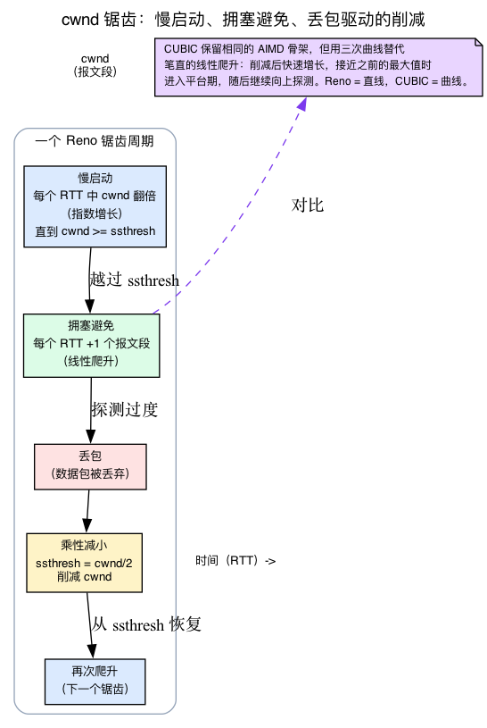
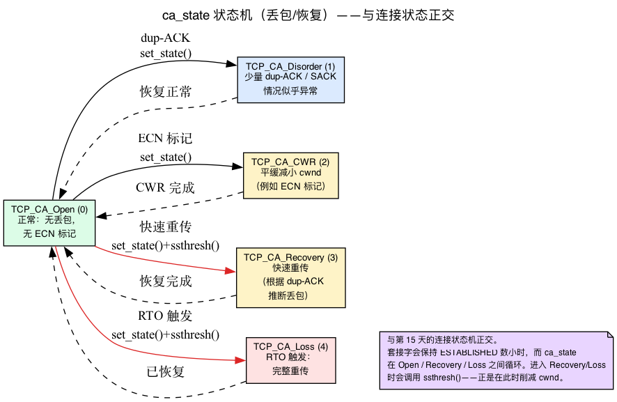
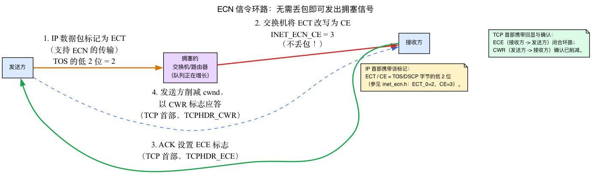
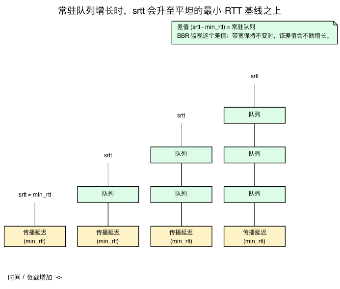
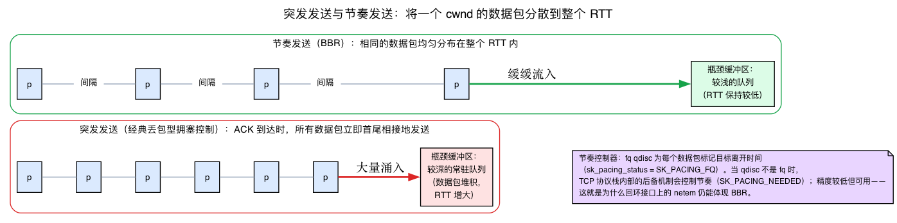
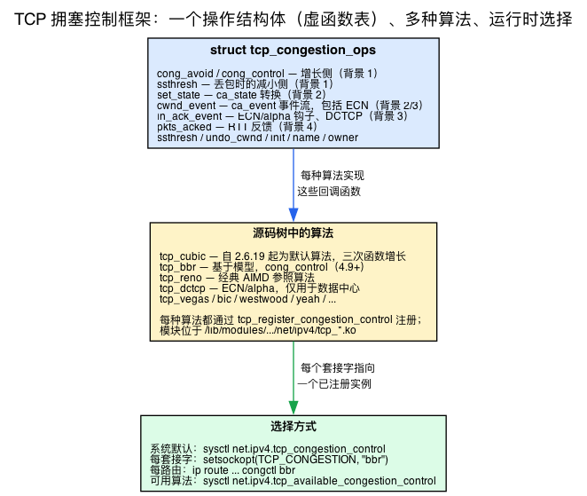

# 第16天 — TCP 拥塞控制：CUBIC、BBR 与框架

> **今日任务：** 理解 TCP 连接如何决定“可以发送多少”，掌握各种算法共同基于或演化自的 cwnd 动态机制（慢启动、AIMD、锯齿形态、ECN 和发送节奏控制），在相同工作负载下比较内核树内算法，并理解支持运行时切换算法的内核可插拔框架。总用时：约 110 分钟。

## 为什么需要拥塞控制

TCP 发送方在任一时刻能够保留多少在途数据，受两个窗口限制：

1. **接收窗口**（发送方一侧的 `snd_wnd`）——接收方通告自己能够缓冲多少数据，发送方会记录这个值。每个 TCP 头都会携带该窗口。（对应的 `rcv_wnd` 则是本套接字在反方向上向对端通告的接收窗口。）
2. **拥塞窗口**（`snd_cwnd`）——发送方估计其与接收方之间的网络在不丢包时能够容纳多少数据。这个值不会在线路上传递，而是由发送方根据观察到的丢包和 RTT 自行估算。

拥塞控制算法负责计算 `snd_cwnd`。发送太少会浪费带宽；发送太多则会引发丢包，迫使重传，不仅进一步浪费带宽，还可能挤占其他流的资源。拥塞控制所做的，正是在两者之间权衡。

（这三个字段都真实存在：对端接收方通告的窗口位于 `snd_wnd`——“我们预期接收的窗口”——见 `include/linux/tcp.h:223`；本机自身通告的窗口是 `rcv_wnd`，位于 `:318`；`snd_cwnd` 位于 `:225`。内核通过 `snd_wnd` 限制新发送：`tcp_wnd_end()` = `snd_una + snd_wnd`，见 `include/net/tcp.h:1569`。）

第3天有意暂缓了 `snd_cwnd` 如何增长和骤降的具体机制，今天就来补上这部分内容。在阅读可插拔框架——也就是每种算法都要填写的回调函数表（虚函数表）——之前，必须先理解这些回调所操作的模型。因此，本章先集中介绍五项背景知识：先建立直觉，再对应到 v7.1 中的具体结构体或函数：

1. `cwnd` 实际如何变化：慢启动、拥塞避免、AIMD、锯齿形态。
2. 拥塞控制状态机（`ca_state`）——它不是第15天的连接状态机。
3. ECN——网络如何在不丢包的情况下发出拥塞信号。
4. RTT 估算：平滑 RTT（`srtt`）及其方差，也就是 `ss` 打印的两个值。
5. Pacing 与缓冲区膨胀——BBR 构建于其上的两个概念。

只有介绍完这些内容，我们才会打开 `struct tcp_congestion_ops`，届时每个字段都会变得清晰。

## 背景 1：`cwnd` 实际如何变化——慢启动、AIMD 与锯齿形态

一张图就能说明整个过程。连接并不知道路径有多快，所以它会进行探测：从少量数据开始，不断加速，直到出现问题，再退让，然后重复。对于经典 TCP，“出现问题”的信号就是**丢包**。其他一切——具体的爬升形状、什么算作“出现问题”、退让多少——都是这个循环的变体。



### cwnd 以数据包而非字节计量

首先要明确一件事：在 Linux 上，`snd_cwnd` 以**报文段（数据包）**而非字节计数。新连接从 `TCP_INIT_CWND = 10`（`include/net/tcp.h:269`）开始——第一个 ACK 返回之前可以有十个报文段尚未确认。第3天已经讲过这一点；这里直接据此展开：当我们说“cwnd 翻倍”时，指的是数据包数量翻倍。

### 阶段 1：慢启动（尽管名字如此，它却呈指数增长）

新连接进入**慢启动**。规则很简单：ACK 每确认一个报文段，就把 `cwnd` 增加一。确认十个报文段后，`cwnd` 从 10 变为 20；下一个往返周期变为 40，然后是 80……所以“慢”只是历史遗留名称——它实际是**指数增长，每个 RTT 翻倍。**慢启动的目的是快速找到路径容量，同时避免在第一个 RTT 就发出巨大的突发流量。

内核辅助函数是 `tcp_slow_start`（`net/ipv4/tcp_cong.c:456`）：

```c
__bpf_kfunc u32 tcp_slow_start(struct tcp_sock *tp, u32 acked)
{
    u32 cwnd = min(tcp_snd_cwnd(tp) + acked, tp->snd_ssthresh);

    acked -= cwnd - tcp_snd_cwnd(tp);          /* leftover ACKs */
    tcp_snd_cwnd_set(tp, min(cwnd, tp->snd_cwnd_clamp));
    return acked;                              /* spill into congestion avoidance */
}
```

它直接把 `acked` 加到 `cwnd` 上——但最多只能到 `snd_ssthresh`，即**慢启动阈值**（`include/linux/tcp.h:248`）。这个上限就是两个阶段的分界线。

### 阶段 2：拥塞避免（呈线性增长）

一旦 `cwnd` 达到 `snd_ssthresh`，连接就切换到**拥塞避免**，增长变为**线性：大约每个 RTT 增加 1 个报文段。**选择阶段的判断只有一次比较，即 `tcp_in_slow_start`（`include/net/tcp.h:1520`）：

```c
static inline bool tcp_in_slow_start(const struct tcp_sock *tp)
{
    return tcp_snd_cwnd(tp) < tp->snd_ssthresh;
}
```

低于阈值 → 慢启动（指数增长）。达到或高于阈值 → 拥塞避免（线性增长）。

线性的“每个 RTT 增加 1”实现起来比听上去更麻烦，因为内核按 ACK 处理事件，而不是按 RTT 处理。通用辅助函数 `tcp_cong_avoid_ai`（“ai”表示*加性增大*，`net/ipv4/tcp_cong.c:470`）借助余量累加器 `snd_cwnd_cnt`（“线性增长计数器”，`include/linux/tcp.h:425`）实现这一点：

```c
__bpf_kfunc void tcp_cong_avoid_ai(struct tcp_sock *tp, u32 w, u32 acked)
{
    ...
    tp->snd_cwnd_cnt += acked;
    if (tp->snd_cwnd_cnt >= w) {
        u32 delta = tp->snd_cwnd_cnt / w;
        tp->snd_cwnd_cnt -= delta * w;
        tcp_snd_cwnd_set(tp, tcp_snd_cwnd(tp) + delta);
    }
    ...
}
```

需要 `w` 个 ACK 才会把 `cwnd` 增加一。传入 `w = cwnd`，就能得到经典的“每个 RTT 增加 1”：需要一整个窗口的 ACK 才增加一个报文段。

### AIMD：加性增大 / 乘性减小

把两种响应放在一起，就得到了经典 TCP 核心规则 **AIMD**：

- **增大（加性）：**拥塞避免期间每个 RTT 增加 1 个报文段——即上面缓慢、谨慎的爬升。
- **减小（乘性）：**发生丢包时，*减半*。Reno 的 `ssthresh` 回调通过 `tcp_reno_ssthresh`（`net/ipv4/tcp_cong.c:515`）计算新阈值：

  ```c
  __bpf_kfunc u32 tcp_reno_ssthresh(struct sock *sk)
  {
      const struct tcp_sock *tp = tcp_sk(sk);
      return max(tcp_snd_cwnd(tp) >> 1U, 2U);     /* cwnd/2, floor 2 */
  }
  ```

  `cwnd >> 1` 就是 `cwnd / 2`——乘性削减，下限为 2，确保连接永远不会完全停顿。

这就是著名的 TCP **锯齿形态**：线性爬升，丢包时减半，再次爬升，再次减半。在 Reno 参考实现 `tcp_reno_cong_avoid`（`net/ipv4/tcp_cong.c:496`）中可以看到两部分连接在一起——低于阈值时慢启动，否则加性增大：

```c
__bpf_kfunc void tcp_reno_cong_avoid(struct sock *sk, u32 ack, u32 acked)
{
    struct tcp_sock *tp = tcp_sk(sk);
    if (!tcp_is_cwnd_limited(sk))
        return;
    if (tcp_in_slow_start(tp)) {                 /* exponential phase */
        acked = tcp_slow_start(tp, acked);
        if (!acked)
            return;
    }
    tcp_cong_avoid_ai(tp, tcp_snd_cwnd(tp), acked);  /* linear phase */
}
```

**这正是“其他一切都是变体”的实际含义。**CUBIC 保留 AIMD 的骨架，但把*线性爬升*替换为三次函数曲线（丢包后立即激进增长，在此前最大值附近进入平台期，然后向上探测）。BBR 则完全抛弃丢包驱动的循环，改用带宽模型。但你应该把 Reno 的形态记在脑中。

现在，今日虚函数表中最重要的两个回调已经有了明确含义：

- **`cong_avoid`** 运行*增大*一侧——它决定使用慢启动还是拥塞避免，并增大 `cwnd`。
- **`ssthresh`** 运行*减小*一侧——它计算丢包后的新阈值。

## 背景 2：拥塞控制状态机（`ca_state`）

虚函数表中还有 `set_state(sk, new_state)`；在运行路径中也会看到“发生丢包时，内核调用 `set_state(sk, CA_Loss)`”。这里的 `CA_Loss` 属于一套你**尚未**接触过的状态机。

**它不是第15天的连接状态机。**套接字可以在 `ESTABLISHED` 中停留数小时；`ca_state` 是一个*独立、正交*的跟踪器，表示连接处于**丢包/恢复周期**的哪个位置。这五个值（`enum tcp_ca_state`，`include/uapi/linux/tcp.h:194`）是：

- **`TCP_CA_Open` (0)**——正常。最近没有乱序、丢包或 ECN 标记。
- **`TCP_CA_Disorder` (1)**——出现少量重复 ACK / SACK。看起来有些异常，但尚未确认丢包。
- **`TCP_CA_CWR` (2)**——*拥塞窗口已减小*。发送方正在温和地减小 `cwnd`，例如响应 ECN 标记（背景 3）。
- **`TCP_CA_Recovery` (3)**——正在快速重传 / 快速恢复（根据重复 ACK 推断出丢包，而不是发生超时）。
- **`TCP_CA_Loss` (4)**——重传超时（RTO）触发。最坏的情况：完整重传。

内核调用 **`set_state(sk, new_state)`** 告知算法已在这些状态之间移动。算法为什么关心？因为进入 `Recovery`/`Loss` 正是调用 `ssthresh()` 并削减 `cwnd` 的时刻，而离开它们则是算法可能恢复增长的时刻。CUBIC 通过这个钩子记住丢包前的最大值（以便在该处进入平台期），BBR 也由此知道不应对单次丢包过度反应。



### `ca_event`：粒度更细的通知流

除完整状态变化外，内核还会发出 **`ca_event`** 通知（`enum tcp_ca_event`，`include/net/tcp.h:1242`），并通过 `cwnd_event` 回调传递：

```c
enum tcp_ca_event {
    CA_EVENT_TX_START,      /* first transmit when no packets in flight */
    CA_EVENT_CWND_RESTART,  /* congestion window restart */
    CA_EVENT_COMPLETE_CWR,  /* end of congestion recovery */
    CA_EVENT_LOSS,          /* loss timeout */
    CA_EVENT_ECN_NO_CE,     /* ECT set, but not CE marked */
    CA_EVENT_ECN_IS_CE,     /* received CE marked IP packet */
};
```

最后两个——`CA_EVENT_ECN_NO_CE` / `CA_EVENT_ECN_IS_CE`——是 DCTCP 赖以工作的 ECN 事件。先记住这一点；背景 3 会解释这些标记，后面的 DCTCP 简介则会把它们串联起来。

深入内容——RTO 定时器、快速重传、RACK、恢复机制——留到明天（第17天）。今天只需掌握这些词汇，让回调不再晦涩。

## 背景 3：ECN——显式拥塞通知

DCTCP 算法会在**任何数据包被丢弃之前**响应拥塞。这听起来不可能——如果没有丢失任何内容，发送方如何得知网络拥塞？答案是 **ECN**，它也是本章中唯一横跨 IP 和 TCP 头的机制。

第9天已经看到，IP TOS/DSCP 字节的低 2 位是 ECN 位，并被有意排除在规则匹配之外。下面来看看它们*做什么*。

### 第 1 步：发送方把 IP 数据包标记为 ECT

支持 ECN 的发送方把这 2 位设为 **ECT**（支持 ECN 的传输），表示“我理解拥塞标记——请标记我，而不是丢弃我”。这些值位于 `include/net/inet_ecn.h:14`：

```c
enum {
    INET_ECN_NOT_ECT = 0,
    INET_ECN_ECT_1   = 1,
    INET_ECN_ECT_0   = 2,
    INET_ECN_CE      = 3,
    INET_ECN_MASK    = 3,
};
```

### 第 2 步：拥塞的交换机把 ECT 改写为 CE

当路由器或交换机的队列不断增长时，它不会丢弃 ECT 数据包，而是把这些位翻转为 **`INET_ECN_CE`**——*已经历拥塞*（`= 3`）。检测函数是 `INET_ECN_is_ce()`（`include/net/inet_ecn.h:23`）：

```c
static inline int INET_ECN_is_ce(__u8 dsfield)
{
    return (dsfield & INET_ECN_MASK) == INET_ECN_CE;
}
```

**这就是“在丢包前响应”背后的关键思想：**无需丢包即可发出拥塞信号。

### 第 3 步：接收方通过 ECE 将其回显；发送方通过 CWR 确认

CE 标记位于*发往接收方*的 *IP* 头中——但需要减速的是*发送方*。因此接收方使用 *TCP* 头标志 **ECE**（ECN 回显）将其回显，而发送方则用 **CWR**（拥塞窗口已减小）标志确认它已减小窗口。这些标志位于 `include/net/tcp.h:1056`：

```c
#define TCPHDR_ECE  BIT(6)
#define TCPHDR_CWR  BIT(7)
```

ECE ↔ CWR 握手把单向 IP 标记转变为发送方可据以行动的闭环信号。



### 第 4 步：信号如何到达算法

进入算法有两条不同路径，值得加以区分：

- **传入 ACK 上的 ECE**（发送方得知自己应该减速）。当 ACK 携带 ECE 位时，内核设置 **`CA_ACK_ECE`** 标志（`net/ipv4/tcp_input.c:4154`；`enum tcp_ca_ack_event_flags`，`include/net/tcp.h:1255`），并将其传给 **`in_ack_event`** 回调。DCTCP 的处理函数 `dctcp_update_alpha`（`net/ipv4/tcp_dctcp.c:127`，接到 `.in_ack_event`，位于 `:257`）每个 RTT 都根据 `tp->delivered_ce`/`tp->delivered` 重新计算 **alpha**——这是对被标记数据包*比例*的持续估计——并按该比例缩放其 `cwnd` 削减幅度。少量标记 → 少量削减；大量标记 → 大幅削减。这种按比例响应正是 DCTCP 挂接 `in_ack_event` 而非 `cong_avoid` 的原因。
- **收到带 CE 标记的 IP 数据包**（数据接收侧决定是否回显 ECE）。`tcp_ecn_check_ce()` 触发 **`CA_EVENT_ECN_IS_CE`** / **`CA_EVENT_ECN_NO_CE`**（`net/ipv4/tcp_input.c:362`/`:380`），并通过 **`cwnd_event`** 回调传递；DCTCP 在 `dctcp_cwnd_event`（`net/ipv4/tcp_dctcp.c:193`，接到 `.cwnd_event`，位于 `:258`）中捕获它，以更新 `ce_state`。这条路径关乎回显 ECE，而不是 alpha 估计。

因此，驱动 DCTCP 按比例削减的 alpha 估计来自 `in_ack_event`/`delivered_ce` 路径，而非 `CA_EVENT_ECN_IS_CE`。

这也是 DCTCP **只能用于数据中心**的原因。经典 Reno/CUBIC 把任何拥塞信号都视为需要完整乘性削减；DCTCP 则按比例响应。把二者混用于同一路径，流量共享就会不公平——这为下文 DCTCP 简介中“不得用于公共互联网”的规则提供了依据。

## 背景 4：RTT 估算——平滑 RTT 及其方差

`pkts_acked` 回调向算法传递“最新 RTT 测量值”，而 `ss -tin` 实验要求读取 `rtt:<srtt>/<rttvar>`。这两个数字是什么？

每个 ACK 都会测量 **RTT**（往返时间）：从报文段发出到得到确认所经历的时间。这个原始样本就是 `pkts_acked` 通过 `struct ack_sample`（`include/net/tcp.h:1283`）传递的内容：

```c
struct ack_sample {
    u32 pkts_acked;
    s32 rtt_us;        /* the raw RTT measurement, microseconds */
    u32 in_flight;
};
```

但内核**不会**根据原始样本行动——它们存在抖动。内核维护一个指数加权移动平均值 **`srtt_us`**（“平滑往返时间”，`include/linux/tcp.h:307`），以及平滑后的*偏差* **`rttvar_us`**（`:243`；底层平均偏差累加器是 `mdev_us`，位于 `:272`）。`ss` 将它们打印为 `rtt:<srtt>/<rttvar>`。

比较 `ss` 输出与原始结构体值时有一个易错点：注释称 `srtt_us` 是“以微秒表示的平滑往返时间 **<< 3**”——存储时左移 3 位（即 ×8），以获得定点数精度。`ss` 已经把它除回原值，因此打印的是实际毫秒数；内核字段则大 8 倍。

拥塞控制关心它的原因是：**最小** RTT 是没有队列时路径的传播延迟。BBR 维护自己的 `min_rtt_us`（`net/ipv4/tcp_bbr.c:91`，一个普通 `u32`），在 `bbr_update_min_rtt`（`net/ipv4/tcp_bbr.c:942`）中使用约 10 秒时间窗口的最小值——初始化时从核心协议栈的 `tcp_min_rtt(tp)`（`net/ipv4/tcp_bbr.c:1054`）获取一次种子，之后作为独立过滤器运行。通用的 `struct minmax rtt_min`（`include/linux/tcp.h:249`）是*核心协议栈*的窗口最小值估算器，由 `tcp_update_rtt_min` 更新并通过 `tcp_min_rtt()` 读取。（BBR 内部的 `struct minmax` 是 `bbr->bw`，即带宽估计，而不是最小 RTT。）当 `srtt` 上升到最小 RTT *之上*时，这个差值就是正在积累的常驻队列——也就是背景 5 所讨论的信号。



完整的 RTO/定时器数学留到第17天；今天只需理解平滑处理和 `ss` 的这两个字段。

## 背景 5：pacing 与缓冲区膨胀（BBR 的前置知识）

BBR 会“按估算带宽对发送方进行 pacing”，并“应对缓冲区膨胀”。这两个术语此前都还没有定义。

### Pacing：让窗口内的数据在时间上均匀分布

当 ACK 为窗口腾出空间时，经典的基于丢包的拥塞控制会把刚获准发送的数据包**背靠背地立即发出**，形成突发流量，并依赖网络将其吸收。**发送节奏控制（pacing）**则把一个窗口内的数据包**均匀分散到整个 RTT。**BBR 根据带宽估计计算目标发送*速率*（字节/秒），内核再按时间间隔发包，以匹配该速率。这对 BBR 尤其重要：如果 BBR 自身产生突发流量，突发就会抬高测得的 RTT，进而破坏其赖以工作的带宽估计。



**Pacing 在哪里发生。**回想第3天的 qdisc——每个 TX 队列的软件调度器。**`fq`** qdisc 能给每个数据包标记目标离开时间，并在到时后释放。因此 BBR“需要 `fq`（或硬件 pacing）”。从 Linux 4.13 开始，TCP 协议栈中还有一种由 `sk->sk_pacing_status`（`include/net/sock.h:506`）驱动的内部后备方案，其取值为（`include/net/sock.h:612`）：

```c
enum sk_pacing {
    SK_PACING_NONE   = 0,
    SK_PACING_NEEDED = 1,
    SK_PACING_FQ     = 2,
};
```

出站 qdisc *是* `fq` 时，状态为 `SK_PACING_FQ`，由 `fq` 执行 pacing。否则，TCP 协议栈会在内部执行 pacing（精度较低，但可以工作）——这正是今日回环 `netem` 实验即便 `lo` 的 qdisc 不是 `fq` 也仍能展示 BBR 的原因。

### 缓冲区膨胀：缓冲区大到掩盖丢包

基于丢包的拥塞控制只有在数据包**被丢弃**时才会退让，而数据包只有在缓冲区**溢出**时才会被丢弃。因此，在路由器/交换机缓冲区过大的路径上，CUBIC 会持续推送——让该缓冲区充满数十毫秒的*常驻队列*——直到缓冲区最终溢出才停止。缓冲区发生了“膨胀”；即使吞吐量看起来不错，延迟也非常糟糕。基于丢包的拥塞控制不仅容忍缓冲区膨胀，还会主动*制造*它。

BBR 的模型绕开了这个问题。它分别跟踪 `min_rtt_us`（传播延迟）和最大带宽，并监视一个明显迹象：**带宽保持不变而 RTT 上升**，意味着队列正在增长。BBR 会在*此时*——丢包之前——退让，而不是等待溢出。这就是“比 CUBIC 更好地应对缓冲区膨胀”的实质。`bbr_max_bw()`（`net/ipv4/tcp_bbr.c:216`）与 `min_rtt_us` 是该模型的两部分；`bbr_main`（`net/ipv4/tcp_bbr.c:1028`，接到 `.cong_control`，位于 `:1149`）每个 ACK 都会驱动它。

（BDP——带宽时延积——与 qdisc 概念本身已在第3天介绍；这里不再推导。）

## 框架：`struct tcp_congestion_ops`



现在可以读懂这个虚函数表了。**这正是你已经熟悉的“ops 结构体 = 虚函数表”模式**——就像第3天的 `struct Qdisc_ops`（每个 TX 队列的 qdisc 接口），或第13天套接字底层的 `*_ops` 结构体：每种算法提供一个实例并注册它，核心协议栈通过函数指针进行多态分派。切换算法就是切换套接字指向的结构体。这里不再重复讲解这种模式。

拥塞控制的*新规则*是 v7.1 结构体注释明确说明的一点：算法只能提供 **`cong_avoid` 或 `cong_control`，二者互斥，绝不能同时提供。**定义位于 `include/net/tcp.h:1316`：

```c
struct tcp_congestion_ops {
    /* A congestion control (CC) must provide one of either:
     *
     * (a) a cong_avoid function, if the CC wants the core TCP stack's
     *     default "classic" (Reno/CUBIC-style) loss response, ECN, pacing
     *     rate computations, etc.  ->  runs the Background-1 increase side.
     *
     * (b) a cong_control function, for custom behavior with complete
     *     control of all congestion-control behaviors.  BBR uses this.
     */
    void (*cong_avoid)(struct sock *sk, u32 ack, u32 acked);
    void (*cong_control)(struct sock *sk, u32 ack, int flag,
                         const struct rate_sample *rs);

    /* return slow start threshold (required) — the Background-1 decrease side. */
    u32 (*ssthresh)(struct sock *sk);

    /* call before changing ca_state (Background 2). */
    void (*set_state)(struct sock *sk, u8 new_state);

    /* call when a cwnd event occurs (Background 2's ca_event stream). */
    void (*cwnd_event)(struct sock *sk, enum tcp_ca_event ev);

    /* call on every ACK — DCTCP consumes ECN marks here (Background 3). */
    void (*in_ack_event)(struct sock *sk, u32 flags);

    /* per-ACK RTT/ECN feedback via struct ack_sample (Background 4). */
    void (*pkts_acked)(struct sock *sk, const struct ack_sample *sample);

    /* new value of cwnd after loss (required). */
    u32  (*undo_cwnd)(struct sock *sk);

    char name[TCP_CA_NAME_MAX];
    struct module *owner;
    struct list_head list;       /* registry */
    /* ... */
};
```

因此，前面建立的“回调到阶段”映射正好对应 API 表面：`cong_avoid` = 增大一侧，`ssthresh` = 减小一侧，`set_state`/`cwnd_event` = `ca_state`/`ca_event` 状态机，`in_ack_event` = ECN 钩子，`pkts_acked` = RTT 反馈。经典拥塞控制会填充 `cong_avoid` + `ssthresh`；BBR 这样的模型算法则改为填充 `cong_control`，并忽略默认丢包响应。

每种算法都通过 `tcp_register_congestion_control`（`net/ipv4/tcp_cong.c:93`）注册一个实例。内核维护一个全局列表；按名称选择时通过 `tcp_ca_find`（`net/ipv4/tcp_cong.c:26`）遍历该列表。

## 树内算法

### Reno——原始算法

`net/ipv4/tcp_cong.c:531`——参考实现与默认后备方案。纯 AIMD，完全遵循背景 1 构建的模型：慢启动期间每个 RTT 将 `cwnd` 翻倍，拥塞避免期间每个 RTT 增加 1，丢包时减半。这是经典 TCP 行为；其他一切都是它的变体。

### CUBIC

`net/ipv4/tcp_cubic.c:475`——近 20 年来的 Linux 默认算法（从 2006 年的内核 2.6.19 起成为默认算法，在 7.1 中依然如此）。它保留 AIMD 的丢包响应，但把背景 1 的*线性*爬升替换为三次函数：丢包后立即激进增长，在此前最大值附近进入平台期（跨越 `ca_state` 转换记住该值），然后缓慢向上探测。它专为高 BDP 网络（长肥管道）而设计，因为 Reno 的线性增长在那里过于缓慢。

- **是什么：**采用三次增长曲线、基于丢包的 AIMD。
- **为什么：**Reno 无法充分利用长 RTT 链路；CUBIC 能更快填满链路。
- **何时使用：**通用默认算法。对典型互联网工作负载依然非常出色。
- **易错点：**它仍然基于丢包——与使用 BBR（无需丢包就会退让）的相邻流竞争时可能不公平。

相关数学位于 `bictcp_update`（`net/ipv4/tcp_cubic.c:211`），由 `cubictcp_cong_avoid`（`net/ipv4/tcp_cubic.c:321`）调用。

### BBR——瓶颈带宽与往返传播时间

`net/ipv4/tcp_bbr.c:1144`——Google 的算法（RFC 草案，约 2016 年，从 4.9 起进入内核树）。它完全不把丢包用作信号；而是估算瓶颈带宽与最小 RTT（背景 4），并按该带宽对发送方进行 pacing（背景 5）。它填充 `cong_control`（`bbr_main`），而非 `cong_avoid`。

- **是什么：**基于模型——跟踪近期最大带宽和最小 RTT，并根据估算的 BDP 控制发送节奏。
- **为什么：**比 CUBIC 更好地应对缓冲区膨胀（背景 5）；在有损路径上实现更高吞吐量。
- **何时使用：**WAN、卫星、移动网络，以及任何高 BDP、有损路径。Google 的 CDN/服务大量采用它。
- **易错点：**对相邻 CUBIC 流可能不公平——BBR 的带宽估计不会像 CUBIC 那样响应丢包，因此它可能占据超过公平份额的带宽。BBR v2/v3（存在于某些内核中）缓解了这一问题。
- **Pacing 要求：**BBR 需要 `fq` qdisc（或硬件 pacing），以估算速率对数据包进行 pacing（背景 5）。没有 `fq` 时会使用内部 `sk_pacing_status` 后备方案，但精度会下降。

### DCTCP——数据中心 TCP

`net/ipv4/tcp_dctcp.c:255`。它使用 ECN-CE 标记（背景 3）而非丢包作为拥塞信号——交换机在丢弃之前进行标记，DCTCP 通过 `in_ack_event`（`dctcp_update_alpha`）直接读取标记。它能显著降低排队延迟（从数十毫秒降至亚毫秒）。

- **是什么：**由 ECN 驱动；与被标记数据包的比例（其 `alpha`）成比例地响应。
- **为什么：**数据中心交换机在丢弃前进行标记；DCTCP 直接读取这些标记。
- **何时使用：**只能用于数据中心——要求支持 ECN 标记的交换机，且所有主机使用相同的拥塞控制选择。
- **易错点：****绝不能**用于公共互联网。与 Reno/CUBIC 的完全削减响应相比，它的比例响应会导致不公平共享（背景 3）。

### 其他算法

Vegas、Westwood、YeAH、Veno、BIC、HighSpeed（HSTCP）、Hybla、LP、NV 等。每种都有其适用场景。大多数算法有一两篇论文和几百行代码。感兴趣的话可以阅读 `net/ipv4/tcp_*.c`。

## 选择算法

```bash
# What's available
sysctl net.ipv4.tcp_available_congestion_control
# Typically: cubic reno (order, and whether bbr already appears,
# depend on what's loaded — after 'modprobe tcp_bbr' bbr joins the list)

# Default for new sockets (system-wide)
sysctl net.ipv4.tcp_congestion_control

# Set system-wide:
sudo sysctl -w net.ipv4.tcp_congestion_control=bbr

# Per-connection (in code):
const char cc[] = "bbr";
setsockopt(fd, IPPROTO_TCP, TCP_CONGESTION, cc, sizeof(cc));

# Per-route:
sudo ip route change 10.0.0.0/24 via 192.168.1.1 congctl bbr

# Per-cgroup (via BPF sockops — see eBPF book Day 19)
```

有些算法是内核模块（`tcp_bbr.ko`、`tcp_dctcp.ko`）；使用 `modprobe tcp_bbr` 加载。CUBIC 通常编译在内核中。

## 运行时如何串联起来

对于每个 TCP 连接：

1. **创建套接字时**：`tcp_init_sock`（`net/ipv4/tcp.c:421`）调用 `tcp_assign_congestion_control`（`:463`）选择算法（按路由、默认值、应用 sockopt）。
2. **`init` 回调**运行一次。在 `icsk_ca_priv` 中分配每个套接字的私有状态——`inet_connection_sock` 内部正好 **104 字节**的暂存空间（`include/net/inet_connection_sock.h:141`）。
3. **每个 ACK**：`tcp_ack`（`tcp_input.c`）为经典拥塞控制（CUBIC/Reno——背景 1 的增大一侧）调用 `cong_avoid(sk, ack, acked)`。改为定义 `cong_control` 的算法（BBR）会接收到 `cong_control(sk, ack, flag, rs)`，其中带有完整的 `rate_sample`。无论哪种方式，算法都会根据其模型更新 `tp->snd_cwnd`。
4. **发生丢包/RTO 时**：内核调用 `set_state(sk, CA_Loss)`（背景 2）和 `ssthresh(sk)`（背景 1 的减小一侧）。算法计算新阈值，`cwnd` 朝该值下降。
5. **获得 RTT 样本时**：内核调用 `pkts_acked(sk, sample)`，并传入最新的 `struct ack_sample`（背景 4）。这是提供给算法的纯反馈。

典型拥塞控制算法约有 300 行 C 代码，其中 90% 是 `cong_avoid` 以及丢包/恢复处理。

## 今日实验

```bash
# Load BBR (if not already)
sudo modprobe tcp_bbr

# iperf3 isn't installed by default on minimal images
sudo apt-get install -y iperf3

# Start an iperf3 server
iperf3 -s -p 5201 &

# Run with CUBIC
iperf3 -c 127.0.0.1 -p 5201 -C cubic -t 30 -J | jq '.end.streams[0].sender'

# Now BBR
iperf3 -c 127.0.0.1 -p 5201 -C bbr -t 30 -J | jq '.end.streams[0].sender'
```

在本地主机上，差异很小（没有真正的瓶颈）。可以使用 `tc netem` 增加延迟和丢包，进行更有趣的测试：

```bash
sudo tc qdisc add dev lo root netem delay 50ms loss 1%
iperf3 -c 127.0.0.1 -p 5201 -C cubic -t 30
iperf3 -c 127.0.0.1 -p 5201 -C bbr -t 30
sudo tc qdisc del dev lo root

# Stop the background iperf3 server when done
pkill iperf3   # or, in the same interactive shell: kill %1
```

CUBIC 基于丢包的响应会在每次丢包时放弃带宽（背景 1 的乘性削减）；BBR 的带宽模型方法在有损路径上应该表现得更好。

注意：尽管 `lo` 的根 qdisc 现在是 `netem` 而非 `fq`，BBR 仍会在此执行 pacing。从 Linux 4.13 起，TCP 协议栈提供了由 `sk->sk_pacing_status`（背景 5）驱动的内部 pacing 后备方案，当出站 qdisc 不是 `fq` 时就会启用。其精度低于 `fq` 基于时间戳的 pacing，但能够工作——因此这个本地主机测试仍能展示 BBR 的行为。在真实 NIC 上，应在 BBR 前使用 `fq`（或硬件 pacing），以实现精确的逐包 pacing。

### 观察 cwnd 的变化

```bash
sudo bpftrace -e '
kprobe:tcp_write_xmit {
  $tp = (struct tcp_sock *)arg0;
  @cwnd = lhist($tp->snd_cwnd, 0, 1000, 50);
}
interval:s:10 { exit(); }'
```

`tcp_write_xmit`（`net/ipv4/tcp_output.c:2963`）只会在实际发送数据时触发，因此在空闲机器上，这个直方图会为空。为它提供流量：在一个终端中使用 `iperf3 -c 127.0.0.1 -p 5201 -C cubic -t 30` 启动 30 秒传输（实验中的服务器仍在运行），然后在第二个终端运行上面的 bpftrace——10 秒窗口会捕获实时传输中的 `snd_cwnd`。再使用 `-C bbr` 重复操作，比较两种分布。（你正在直接观察背景 1 的锯齿形态：出现丢包时，CUBIC 的直方图应该比 BBR 向更低值扩散。）

### 每套接字 TCP 信息

```bash
ss -tin
# Look for: the CC algo as a bare token (cubic / bbr), cwnd:N,
#           rtt:<srtt>/<rttvar>, retrans:X/Y (only appears after retransmissions)
```

要查看具有实时 cwnd 的 `bbr` 套接字，请在上述某个传输进行期间运行 `ss -tin`（使用 `-t 30`，并通过 `-C bbr` 固定算法）。在空闲机器上，`ss -tin` 只会显示 SSH 会话（使用系统默认拥塞控制——`cubic` 或 `bbr`）和停留在 `cwnd:10` 的监听器（这就是背景 1 中的 `TCP_INIT_CWND`）。已建立套接字的真实输出如下：

```
ESTAB 0 0  10.0.0.4:22  ...:62372
	 bbr wscale:6,10 rto:219 rtt:18.897/2.546 ato:40 mss:1448 cwnd:37 ...
	 bbr:(bw:7349256bps,mrtt:10.98,pacing_gain:2.88672,cwnd_gain:2.88672) ...
```

注意，输出会直接显示拥塞控制算法名称（`bbr` / `cubic`），不附加字段标签；平滑 RTT 显示为 `rtt:<srtt>/<rttvar>`（背景 4——`srtt` 已从内核的 `<<3` 形式还原），重传则显示为 `retrans:X/Y`（至少发生过一次重传后才会出现）。`bbr:(bw:...,mrtt:...)` 这一行展示 BBR 的模型状态：`bw` 对应 `bbr_max_bw`，`mrtt` 对应以毫秒表示的 `min_rtt_us`（背景 5）。

`ss -tin` 读取 `tcp_get_info`（`net/ipv4/tcp.c`，搜索该函数），后者填充 `struct tcp_info`，数据来自实时 `tcp_sock` 状态。

## 常见疑问

> **问：慢启动是“指数”增长，而拥塞避免是“线性”增长。连接当前处于哪一种？**
>
> 答：取决于 `cwnd` 位于 `snd_ssthresh` 的哪一侧。`tcp_in_slow_start(tp)` 实际判断的就是 `cwnd < ssthresh`：低于阈值时，连接每个 RTT 将 `cwnd` 翻倍（慢启动）；达到或高于阈值时，每个 RTT 增加 1（拥塞避免）。丢包会把 `ssthresh` 重置为 `cwnd/2`，所以下一次爬升仍从慢启动开始，但会更早切换到线性增长。

> **问：`CA_Loss` 是否等同于连接离开 `ESTABLISHED`？**
>
> 答：不是——二者完全正交。连接仍停留在 `ESTABLISHED`（第15天的状态机）。`ca_state` 是跟踪丢包/恢复周期的*第二个*状态机：`Open → Disorder → Recovery`（快速重传），或 `Open → Loss`（RTO）。内核通过 `set_state()` 发出转换信号；进入 Recovery/Loss 时会调用 `ssthresh()`。

> **问：网络如何在不丢包的情况下要求我减速？**
>
> 答：使用 ECN。拥塞的交换机把 IP ECT 位改写为 CE，而不是丢包；接收方以 TCP ECE 标志回显；发送方削减 `cwnd` 并回复 CWR。DCTCP 与被标记数据包的*数量*成比例地响应——这就是它能在数据中心实现亚毫秒延迟，以及不能在开放互联网中与 Reno/CUBIC 混用的原因。

## 内核阅读指南

- **`include/net/tcp.h`**——`struct tcp_congestion_ops`（第 1316 行）。虚函数表。阅读 `(a) cong_avoid` 与 `(b) cong_control` 互斥的注释——这是拥塞控制特有的一条规则。另请阅读 `enum tcp_ca_event`（第 1242 行）和 `struct ack_sample`（第 1283 行）。

- **`include/uapi/linux/tcp.h`**——`enum tcp_ca_state`（第 194 行）。五种丢包/恢复状态。

- **`net/ipv4/tcp_cong.c`**——注册框架 + AIMD 原语。关键函数：
  - `tcp_register_congestion_control`（第 93 行）：将算法添加到全局列表。
  - `tcp_ca_find`（第 26 行）：名称 → 算法查找。
  - `tcp_set_congestion_control`（第 412 行）：切换套接字的拥塞控制。
  - `tcp_init_congestion_control`（第 236 行）：每套接字初始化。
  - `tcp_slow_start`（第 456 行）：指数增长阶段。
  - `tcp_cong_avoid_ai`（第 470 行）：加性增大（线性）辅助函数。
  - `tcp_reno_cong_avoid`（第 496 行）/ `tcp_reno_ssthresh`（第 515 行）：AIMD 参考实现。
  - `tcp_reno` 实例（第 531 行）：其他每种算法都是“Reno 加上一些巧思”。

- **`net/ipv4/tcp_input.c`**——搜索 `tcp_ack`。该函数为每个传入 ACK 调用 `cong_avoid`。跟踪一次执行过程，看看内核如何在调用算法之前判断“有效 ACK”与“重复 ACK”。

- **`net/ipv4/tcp_cubic.c:475`**——`cubictcp` 实例。阅读 `cubictcp_cong_avoid`（第 321 行）；相关数学主要位于 `bictcp_update`（第 211 行）。

- **`net/ipv4/tcp_bbr.c:1144`**——`tcp_bbr_cong_ops`，其中 `.cong_control = bbr_main`（每个 ACK 的入口位于第 1028 行）。文件很长（约 1200 行），但结构清晰；阅读文件顶部注释，并留意 `min_rtt_us`（第 91 行）和 `bbr_max_bw`（第 216 行）。

- **`net/ipv4/tcp_dctcp.c:255`**——DCTCP。短小且富有启发性。注意 `dctcp_update_alpha`（第 127 行）如何接到 `.in_ack_event`（第 257 行），以使用 ECN 标记。

- **`include/net/inet_ecn.h`**——`INET_ECN_CE` 和 `INET_ECN_is_ce()`（第 14–24 行）。IP 层 ECN 标记。

- **`Documentation/networking/ip-sysctl.rst`**——`tcp_congestion_control` sysctl 及相关开关。DCTCP 细节另见 `Documentation/networking/dctcp.rst`。

## 要点回顾

- TCP 拥塞控制计算 `snd_cwnd`——发送方认为网络能吸收多少数据（区别于接收方能缓冲多少数据的 `rcv_wnd`）。
- **cwnd 以数据包计数。**连接从 `TCP_INIT_CWND = 10` 开始，在慢启动期间**每个 RTT 翻倍**（指数增长，直到 `cwnd >= snd_ssthresh`），然后在拥塞避免期间**每个 RTT 增加 1**（通过 `tcp_cong_avoid_ai` 线性增长）。
- **AIMD = 加性增大 / 乘性减小。**每个 RTT 增加 1，丢包时减半（`ssthresh = cwnd/2`）。这就是**锯齿形态**。CUBIC 用三次函数曲线替换线性爬升；BBR 用带宽模型替换丢包循环。
- **`ca_state`**（Open/Disorder/CWR/Recovery/Loss）是一个与第15天连接状态*相互独立*的状态机——它跟踪丢包/恢复。`set_state` 发出状态转换信号；`cwnd_event` 传递粒度更细的 `ca_event` 流（包括 ECN 事件）。
- **ECN** 在*无需丢包*的情况下发出拥塞信号：交换机把 IP ECT 改写为 CE，接收方回显 TCP ECE，发送方回复 CWR。DCTCP 通过 `in_ack_event` 按比例响应。
- **srtt/rttvar：**内核将原始 RTT 样本（`ack_sample.rtt_us`）平滑为 `srtt_us`（以 `<<3` 形式存储）和 `rttvar_us`；`ss` 打印 `rtt:<srtt>/<rttvar>`。srtt 上升到最小 RTT 之上 = 队列正在增长。
- **Pacing** 把一个窗口分布在整个 RTT 中（需要 `fq` qdisc 或 `sk_pacing_status` 后备方案）；**缓冲区膨胀**是超大缓冲区在不丢包时增加常驻延迟。BBR 在丢包*之前*因 RTT 上升而退让；CUBIC 则等待溢出。
- 可插拔框架：每种算法都是一个 `struct tcp_congestion_ops`（虚函数表，类似第3天的 `Qdisc_ops`），通过 `tcp_register_congestion_control` 注册。算法提供 `cong_avoid` **或** `cong_control`，二者互斥。
- **CUBIC**——基于丢包、三次增长、长期默认算法。**BBR**——基于模型，需要 `fq` 进行 pacing。**DCTCP**——基于 ECN，只用于数据中心。**Reno**——约 30 行的参考实现；其他算法都是“Reno，但是……”。
- 通过 sysctl、sockopt（`TCP_CONGESTION`）或按路由切换。BPF（`sock_ops`）可按 cgroup 覆盖。每连接状态位于 `icsk_ca_priv`（`inet_connection_sock` 内部的 104 字节）。

## 检查问题

既然 BBR 更新而且通常性能更好，内核为什么不总是使用 BBR？

<details>
<summary>点击查看答案</summary>

**答案：**有三个原因。**(1) 公平性。**BBR 基于延迟；它估算路径带宽并据此进行 pacing。在瓶颈缓冲区同时服务 CUBIC 流的网络上，BBR 并不友好：它低估缓冲区所发挥的作用，占据超过公平原则所允许的份额，并可能饿死相邻流。CUBIC 仍是默认算法，因为它已经在公共互联网上经过二十年验证，与其他 CUBIC 流之间的行为可预测。**(2) Pacing 要求。**BBR 依赖精确的逐包 pacing，需要 `fq` qdisc 或硬件 pacing。没有它，突发流量会破坏 BBR 的带宽估计。许多系统默认并不运行 `fq`。**(3) 应用敏感性。**某些应用（实时、低延迟的请求/响应）对算法*方差*的敏感度高于对峰值吞吐量的敏感度；CUBIC 在这方面的行为更可预测。因此：对于控制两端、以 WAN 吞吐量为关键的工作负载，使用 BBR；对于公共互联网和大多数通用服务器，使用 CUBIC。

</details>

---

## 明天

第17天：TCP 重传与恢复——RTO、快速重传、RACK、恢复状态。届时将完整讲解背景 2 中的 `ca_state` 状态机。
