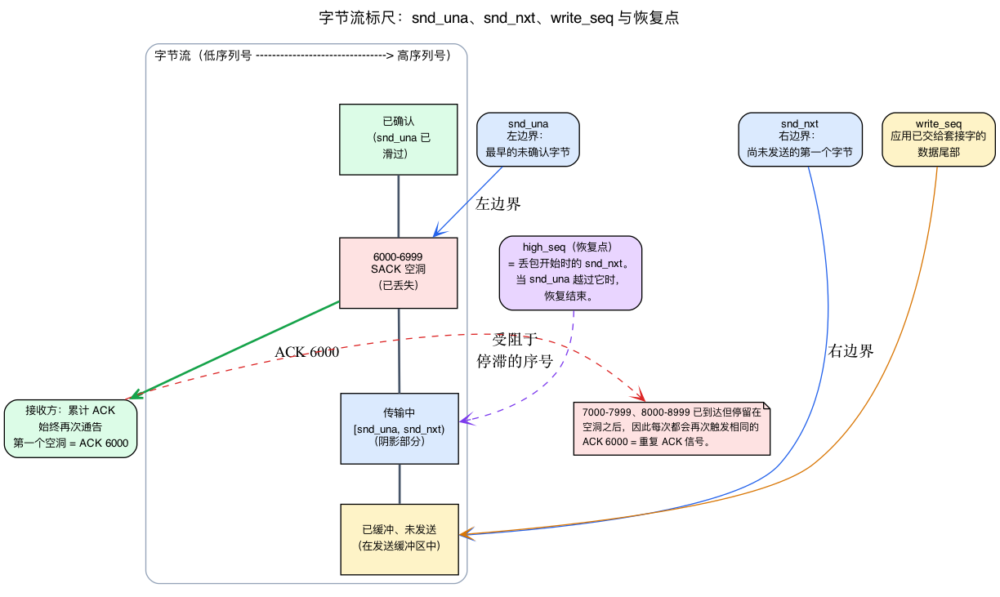
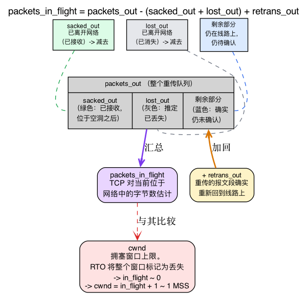
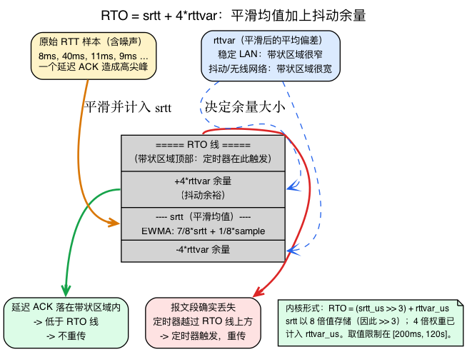
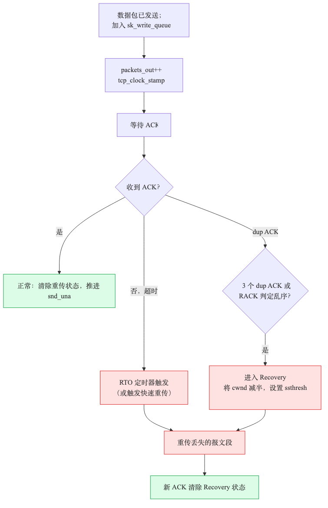

# 第17天 — TCP 重传、RACK 与恢复

> **今日任务：** 理解 TCP 如何检测丢包，并在不破坏数据顺序的前提下完成恢复。本章会介绍三种检测机制、一种恢复状态和大量定时器，以及它们共同依赖的三套 TCP 基础机制：序列号、在途数据记账和 RTT 估算器。总用时：约 110 分钟。

## “丢包”对 TCP 意味着什么

TCP 承诺按序、可靠地交付数据，而互联网本身既不保证顺序，也不保证可靠性。TCP 必须检测丢包和乱序并进行重传，同时向应用程序呈现这样的结果：“一切正常，这是按序到达的字节流。”

发送方会把每个已发送但尚未确认的报文段保存在**重传队列**中（共 `tp->packets_out` 个报文段，存放于 `sk->tcp_rtx_queue` 红黑树）。它通过 ACK 判断哪些数据已经送达；一旦怀疑某个报文段丢失，就会再发送一份副本。

真正困难的是：既要及时*判断丢包*，又不能对普通的乱序反应过度。

要理解这些内容，必须先讲清此前未曾完整介绍、而本章后文会反复依赖的三件事：

1. **序列号究竟是什么**，以及 `snd_una`/`snd_nxt` 分别表示什么——因为本章的每一种丢包信号，归根结底都在说明*哪些字节已经得到确认*。
2. **内核如何根据四个独立计数器算出“在途数据包”**——因为只有先理解这个数值，才能看懂 RTO 的惩罚性行为（`cwnd = packets_in_flight + 1`）。
3. **TCP 如何用平滑均值与方差构造超时值**——RTO 公式是第一种检测机制；若不理解它*为何*采用这种形式，看到的就只是一连串费解的位移运算。

第13天已经介绍过 `struct tcp_sock`；今天将赋予其中的重传相关字段以实际意义。第15天和第16天跟踪了连接状态和 `cwnd`，但从未引入字节流/ACK 模型——因此从这里开始。

---

## 背景 1：序列号、`snd_una`、`snd_nxt` 与累积 ACK

### TCP 对字节而非数据包编号

一切内容都建立在这个基础观念上：**TCP 为流中的每个*字节*分配序列号，而不是为每个数据包分配序列号。**报文段头携带其*第一个*字节的序列号。如果一个报文段携带从序列号 5000 开始的 1000 字节，它就涵盖字节 5000–5999，下一个报文段将从 6000 开始。

接收方同样不会确认数据包。其 ACK 携带的是**下一个预期字节**的序列号——也就是已收到的最后一个*连续*字节之后的位置。如果接收方拥有截至字节 5999 的所有内容，它就发送 `ACK 6000`，意思是“我已经拥有截至并包括 5999 的所有字节；接下来请给我 6000。”

整个机制的关键就在**连续**二字，请特别留意。

### 发送方的两条边：`snd_una` 与 `snd_nxt`

发送方使用两个序列号（都位于 `struct tcp_sock` 中）跟踪在途窗口：

- **`snd_una`**——“我们希望得到确认的第一个字节”。这是在途窗口的**左边缘**：已经发送但尚未确认的最早字节。
- **`snd_nxt`**——“我们发送的下一个序列号”。这是**右边缘**：尚未发送的第一个字节。

```c
/* include/linux/tcp.h */
u32     rcv_nxt;        /* What we want to receive next         (:303) */
u32     snd_nxt;        /* Next sequence we send                (:304) */
u32     snd_una;        /* First byte we want an ack for        (:305) */
u32     write_seq;      /* Tail(+1) of data held in tcp send buffer (:269) */
u32     packets_out;    /* Packets which are "in flight"        (:308) */
```

半开区间 **`[snd_una, snd_nxt)`** 内的一切都已发送但尚未确认——*它正是本章关注的重传队列*。`packets_out` 是以报文段为单位衡量的该区间大小。`write_seq` 位于更右侧：它是应用程序已经交给套接字、但 TCP 尚未放到线路上的数据尾部。

内核把这两个区间拆分到两个独立队列中。发送时，`tcp_event_new_data_sent`（`net/ipv4/tcp_output.c:88`）执行 `__skb_unlink(skb, &sk->sk_write_queue); tcp_rbtree_insert(&sk->tcp_rtx_queue, skb)`——因此 **`sk_write_queue` 只保存未发送区间 `[snd_nxt, write_seq)`**，而 **`sk->tcp_rtx_queue`（一棵红黑树）保存已发送但未确认区间 `[snd_una, snd_nxt)`**——也就是真正的重传队列。

确认新数据的 ACK 到达后，内核把 `snd_una` 向右滑动，并从重传队列中释放现已确认的报文段。窗口“打开”，新数据得以发出。



### 为什么丢失的报文段会产生*重复* ACK

ACK 是**累积式**的：对 N 的 ACK 表示“我拥有截至 N−1 的*每个*字节”，仅此而已。接收方无法用普通累积 ACK 表示“我拥有 5000–5999，也拥有 7000–7999”——它只能再次通告其最高的*连续*位置。

现在设想突发流量中间丢失了一个报文段。字节 6000–6999 消失，但 7000–7999、8000–8999 等仍陆续到达。接收方仍然只拥有截至字节 5999 的所有内容，因此这些后续到达的每个报文段都会触发**相同的** ACK：不断重复 `ACK 6000`。即使数据持续到达，累积 ACK 号也被*卡住*。

**这个停滞、重复的 ACK 号本身就是重复 ACK 信号**，它会触发快速重传（下面的机制 2）。重复 ACK 并不是错误状态——接收方只是在累积 ACK 协议允许的范围内，以唯一可用的方式礼貌地大喊：“我仍缺少字节 6000。”

### 恢复点：`high_seq`

发送方最终检测到丢包并进入恢复时，会把当前 `snd_nxt` 快照保存到 **`high_seq`**（“拥塞开始时的 snd_nxt”）：

```c
/* include/linux/tcp.h:446 */
u32     high_seq;       /* snd_nxt at onset of congestion (the recovery point) */
```

这就是**恢复点**。当且仅当 `snd_una` 越过 `high_seq` 时，恢复才会结束——也就是*丢包开始时所有尚未完成的数据*最终都得到确认。请记住这一点：后文说“当 `snd_una` 到达恢复点时退出”，指的就是这个字段。

执行所有这些分派的逐 ACK 状态机 `tcp_fastretrans_alert` 接收一个 `prior_snd_una` 参数——处理当前 ACK *之前*的 `snd_una` 值——从而判断当前 ACK 是推进了左边缘（真正的新确认），还是仅仅重复旧编号（dupack）：

```c
/* net/ipv4/tcp_input.c:3328 */
tcp_fastretrans_alert(struct sock *sk, const u32 prior_snd_una, ...)
```

> ### 常见疑问
>
> **问：如果 TCP 为每个字节编号，序列号不会很快溢出吗？**
>
> 答：它是一个会回绕的 32 位数。内核从不使用普通 `<` 比较序列号；它使用 `before()`/`after()` 辅助函数（位于 `include/net/tcp.h`）执行有符号差值比较，从而正确处理回绕。今天只需把它看作“单调递增的字节计数器”。
>
> **问：第一个序列号来自哪里——是零吗？**
>
> 答：不是。握手期间，每个方向都会选择一个随机的**初始序列号**（第15天的 SYN/SYN-ACK 携带了它）。从可预测的值开始会造成安全漏洞。`snd_una`、`snd_nxt` 等都以该 ISN 为基准偏移。

---

## 背景 2：计算“在途数据包”

本章接下来会不断引用四个计数器和一个派生量。先明确它们之间的关系，因为在此之前，RTO 的标志性行为——`cwnd = packets_in_flight + 1`——根本无法理解。

### 四个每套接字计数器

它们都位于 `struct tcp_sock` 中，以报文段为单位衡量重传队列：

```c
/* include/linux/tcp.h */
u32     lost_out;       /* Lost packets                         (:227) */
u32     sacked_out;     /* SACK'd packets                       (:228) */
u32     retrans_out;    /* Retransmitted packets out            (:244) */
u32     packets_out;    /* Packets which are "in flight"        (:308) */
```

- **`packets_out`**——已发送但尚未得到*累积*确认的报文段。它是以报文段为单位的重传队列原始大小。
- **`sacked_out`**——接收方通过 SACK 告知我们它*确实*收到的报文段，即使这些报文段位于空洞之后。下文会完整介绍 SACK：这是一个允许接收方指出空洞后所持有字节范围的 TCP 选项。这些报文段已知被接收，不再位于线路上。
- **`lost_out`**——TCP *推定*丢失的报文段。推定已经消失，因此也不再占用瓶颈。
- **`retrans_out`**——我们*重新发送*的报文段。重新发送的报文段确实又回到了线路上。

### 记账恒等式

内核进行拥塞决策时从不只相信 `packets_out`，因为它掌握其中一些报文段的*其他证据*。它减去已知离开网络的内容，再加回重新放入网络的内容：

```c
/* include/net/tcp.h:1483 */
static inline unsigned int tcp_left_out(const struct tcp_sock *tp)
{
        return tp->sacked_out + tp->lost_out;
}

/* include/net/tcp.h:1502 */
static inline unsigned int tcp_packets_in_flight(const struct tcp_sock *tp)
{
        return tp->packets_out - tcp_left_out(tp) + tp->retrans_out;
}
```

按照内核自身注释的方式来读：

> “发送一次后位于传输队列中的数据包”减去“已离开网络但尚未被如实确认的数据包”，再加上“快速重传的数据包”。

已 SACK 和已丢失的报文段都“离开了网络”——前者已收到，后者已消失——所以要从计数中*减去*。重传要*加回*，因为它们确实再次给线路带来负载。结果 **`packets_in_flight`** 是 TCP 对当前网络中所含字节的最佳估计，也是拥塞控制与 `cwnd` 比较的量。

这恰好解释了**为什么把 `cwnd = packets_in_flight + 1` 的 RTO 会让发送方骤降至约 1 个报文段。**超时时，内核会把尚未完成的窗口标记为丢失——最近一个 RTT 内发送的报文段除外（`tcp_timeout_mark_lost` 会保留它们）——所以 `packets_in_flight` 朝零骤降，在典型情况下，`cwnd = packets_in_flight + 1` 也降到约 1 MSS——从头开始慢启动（回想第16天的慢启动）。这也说明 SACK *带来了什么*：SACK 把每个报文段从“仍待处理”移入 `sacked_out`，都会从在途计数中减去一个报文段，从而释放窗口去发送新内容，而不是停滞。



### 每个 skb 的后备存储

这些每套接字计数器只是摘要。事实依据位于重传队列中的每个 skb 上，存放在其 TCP 控制块内部的位域中：

```c
/* include/net/tcp.h */
TCPCB_SACKED_ACKED   = (1 << 0),   /* SKB ACK'd by a SACK block    (:1082) */
TCPCB_SACKED_RETRANS = (1 << 1),   /* SKB retransmitted            (:1083) */
TCPCB_LOST           = (1 << 2),   /* SKB is lost                  (:1084) */
...
__u8    sacked;                    /* State flags for SACK         (:1117) */
```

SACK 处理把 skb 标记为 `TCPCB_SACKED_ACKED` 时，会增加 `sacked_out`；RACK 把它标记为 `TCPCB_LOST` 时，会增加 `lost_out`；其余情况以此类推。套接字计数器与每个 skb 的位始终同步——`tcp_verify_left_out` 甚至会执行 `WARN_ON(tcp_left_out(tp) > tp->packets_out)`，以捕获记账错误。

---

## 背景 3：RTT 估算器——作为 EWMA 的 srtt 与 rttvar

第一种检测机制是重传超时。要构造超时值，需要一个目标 RTT——但**不能依据单次 RTT 测量进行超时判断，因为 RTT 存在噪声。**一个样本可能是 8 ms，下一个却因为 ACK 被大数据包阻塞而成为 40 ms。依据原始样本超时，就会在完全健康的路径上不断误判丢包。

### 平滑：EWMA

TCP 会维护 RTT 的*持续平滑平均值*。每个新样本只会稍微推动估计值，而不会替换它：

```
srtt = 7/8 · srtt + 1/8 · new_sample
```

这就是 **EWMA**（指数加权移动平均）：近期样本权重更大，旧样本则按指数衰减。它就是内核的 `tcp_rtt_estimator`，基本原样取自 Jacobson 1988 年的 SIGCOMM 论文。可以直接看到其中的位移：

```c
/* net/ipv4/tcp_input.c:1070  tcp_rtt_estimator() */
m -= (srtt >> 3);              /* m is now error in rtt est */
srtt += m;                     /* rtt = 7/8 rtt + 1/8 new   */
...
m -= (tp->mdev_us >> 2);       /* similar update on mdev    */
tp->mdev_us += m;              /* mdev = 3/4 mdev + 1/4 new */
```

### 方差：为什么只有均值还不够

平滑均值能反映*典型* RTT，却无法说明 RTT 的*抖动*程度。因此，TCP 还会跟踪**平均偏差**（`mdev_us`），并将其平滑为 **`rttvar_us`**。稳定路径（例如负载平稳的 LAN）的 `rttvar` 很小；拥塞路径或无线链路的 `rttvar` 则较大。

超时值不仅要超过平均值，还必须留出**抖动**空间——否则，在抖动路径上正常但迟到的 ACK 会被误认为丢失。这就是 RFC 6298 如下规定的原因：

```
RTO = srtt + 4 · rttvar
```

`4·rttvar` 是自适应安全余量。如果只有 `srtt`，就只能选择一个固定余量：在抖动路径上太紧（导致虚假重传和不必要的 `cwnd` 削减），或者在稳定路径上太松（真正丢包后长时间空等）。方差项会根据路径自动调整余量大小。



### 现在缩放方式就能说通了

```
RTO = (srtt_us >> 3) + rttvar_us    (clamped to [200ms, 120s])
```

这就是 RFC 6298 的 `RTO = srtt + 4·rttvar` 形式：`srtt_us` 以 ×8 存储（因此要 `>> 3`），而 `rttvar_us` 已按平均偏差的 ×4 比例维护——所以经典的 ×4 权重已经*内置于* `rttvar_us`，内核只需把两个字段相加。（不要再乘以 4。）

内核的 `__tcp_set_rto`（`include/net/tcp.h:881`）实际上就是这样：

```c
static inline u32 __tcp_set_rto(const struct tcp_sock *tp)
{
        return usecs_to_jiffies((tp->srtt_us >> 3) + tp->rttvar_us);
}
```

而 `tcp_set_rto`（`net/ipv4/tcp_input.c:1175`）调用它，并把结果存入 `icsk_rto`。相关字段如下：

```c
/* include/linux/tcp.h */
u32     srtt_us;        /* smoothed round trip time << 3 in usecs (:307) */
u32     rttvar_us;      /* smoothed mdev_max                      (:243) */
u32     mdev_us;        /* medium deviation                       (:272) */
```

结果被限制在 **[200ms, 120s]**（`TCP_RTO_MIN = HZ/5`、`TCP_RTO_MAX = 120s`，位于 `include/net/tcp.h`），因此即使 LAN RTT 极小，也会得到合理的最小值，而损坏的路径无法让 RTO 增长到无穷大。

---

## 三种检测机制

掌握序列号、在途记账和 RTT 估算器后，就能清楚地理解三种丢包检测机制。



### 1. RTO——重传超时

这是直接建立在背景 3 的 RTO 值上的经典机制。如果在第一个未确认报文段（位于 `snd_una` 的报文段）的 RTO 时间内没有 ACK 到达，定时器就会触发：

- 重传第一个未确认报文段。
- 内核进入 CA_Loss 状态。
- `cwnd` 被重置为 `tcp_packets_in_flight(tp) + 1`——超时后实际上约为 1 MSS（从头开始慢启动，正如背景 2 所解释：窗口大部分被标记为丢失——最近一个 RTT 内发送的报文段除外——所以在途值朝约 0 骤降）。
- RTO 翻倍（指数退避）。

实现：**`tcp_retransmit_timer`**，位于 `net/ipv4/tcp_timer.c:535`。请至少完整阅读一次——这是标准的丢包恢复入口点。

RTO 是最悲观的检测方式：它等待数百毫秒才判定丢包。作为后备方案很有用，但延迟代价高昂。另外两种机制响应更快。

### 2. 重复 ACK / 快速重传

如果某个报文段丢失但之后的报文段已经到达，接收方会持续确认最高的*连续*序列号，从而产生重复 ACK（“dupacks”）。这就是背景 1 中停滞的累积 ACK 信号——由于无法越过空洞，接收方反复发送相同的 ACK 号。

经典 Reno 规则：**3 个 dupack → 快速重传**。发送方立即重传缺失的报文段，而不等待 RTO。

这适用于单个报文段丢失。对于突发丢包（多个空洞），Reno 需要 SACK 才能继续。

### 3. RACK——近期 ACK（从 4.4 起成为现代默认机制）

`net/ipv4/tcp_recovery.c`。RACK 使用 ACK *时间*而非重复 ACK 计数。其直觉如下：

> “如果报文段 Y 先于 X 发送，而 X 已得到确认，那么 Y 很可能已经丢失。”

具体来说：如果某个发送时间*更晚*的报文段已经被 SACK，且间隔 >= 乱序窗口，就会把尚未确认的早期报文段判定为丢失。与 Reno 的 3-dupack 规则相比，这能更快捕获丢包，尤其是在存在乱序时。

RACK 是当前默认机制（`net.ipv4.tcp_recovery=1`）。如果设置 `tcp_recovery=0`，就会退回旧式 3-dupack 检测——更慢、更保守。

> **历史说明——FACK。**旧文档和内核注释（`tcp_recovery.c`、`tcp_vegas.c`）中仍会提到“FACK”（前向确认）。FACK 是一种较旧的基于 SACK 的丢包启发式算法；它在**约 4.11 版本时从内核中移除**，由 RACK 取代，后者使用 ACK 时间推广了相同思路。如今只剩注释——已没有可供阅读的 FACK 代码路径。

## SACK——选择性确认（RFC 2018）

默认情况下，ACK 是累积式的：“我拥有截至序列号 N 的所有内容”（背景 1）。这对 Reno 已经足够，却限制了并行性——接收方无法告诉发送方它拥有空洞*之后*的数据。有了 **SACK**，ACK 最多可以包含 4 个范围：“我拥有截至 N 的内容，也拥有块 A-B、C-D、E-F。”发送方借此避免重传接收方已有的报文段，并把这些报文段移入 `sacked_out`（背景 2），使它们不再占用 `cwnd`。

SACK 默认开启。状态结构包括：`tcp_sock->sacked_out`、`tp->lost_out`、`tp->retrans_out` 跟踪各报文段的状态。重传队列中的每个 skb 都有一个 `tcb->sacked` 位域（`TCPCB_SACKED_ACKED`、`TCPCB_LOST`、`TCPCB_SACKED_RETRANS`）——它正是背景 2 所述这些计数器的每 skb 后备存储。

## 恢复状态

检测到丢包（通过以上任一机制）时，内核调用 **`tcp_enter_recovery`**（`net/ipv4/tcp_input.c:3177`）：

1. 设置 `icsk->icsk_ca_state = TCP_CA_Recovery`。
2. 把 `cwnd` 朝 `ssthresh` 减小（PRR——比例速率降低；在整个 RTT 中平稳降低）。降低多少取决于拥塞控制：默认 CUBIC 降至约 70%（β = 717/1024），经典 Reno 则减半至 50%。
3. 调用拥塞控制算法的 `set_state(CA_Recovery)`——大多数算法会记录此次丢包事件。

这里也会把 `high_seq` 设置为当前 `snd_nxt`——即背景 1 中的恢复点。处于 Recovery 时，内核以降低后的速率发送新报文段，并选择性重传丢失的报文段。当 `snd_una` 前进并越过 `high_seq`（“恢复点”）时，恢复结束——内核调用 `tcp_end_cwnd_reduction` 并返回 CA_Open。

对于 RTO 驱动的丢包，内核改用 **`tcp_enter_loss`**（`net/ipv4/tcp_input.c:2554`）——惩罚要严厉得多（cwnd=1，慢启动）。

## 恢复状态机：`tcp_fastretrans_alert`

`net/ipv4/tcp_input.c:3328`——在每个可能需要恢复操作的 ACK 上进入。它接收 `prior_snd_una`（背景 1），从而区分真正的新确认和 dupack。这就是第16天概述并留待后续的完整 `ca_state` 状态机。其状态转换如下：

```
Open      → Disorder    (first dupack or SACK)
Disorder  → Recovery    (loss confirmed; start retransmits)
Recovery  → Open        (recovery point reached: snd_una crosses high_seq)
Open      → Loss        (RTO fired)
Loss      → Open        (after RTO recovery)
```

每种状态都有自己的发送方式和 cwnd 计数逻辑。约 114 行；请完整阅读一次。

## ACK 时钟与 PRR

发送方进入 Recovery 时，问题变成“应以多快速度重传？”

- 朴素答案：立即发出所有缺失的报文段。这很糟糕——会过冲并造成更多丢包。
- PRR 的答案：严格按照 ACK 返回的节奏进行重传，逐步把 cwnd 降至新的 `ssthresh`（上一节中的降低目标）。

PRR（RFC 6937）是内核的恢复速率控制策略。`prr_out`、`prr_delivered` 字段位于 `tcp_sock` 中，用于跟踪其状态。

## 今日实验

使用 `tc netem` 注入丢包并观察恢复过程。

**前置条件：**安装 `iperf3`——Debian/Ubuntu 使用 `sudo apt-get install -y iperf3`，Fedora/RHEL 使用 `sudo dnf install -y iperf3`；通过 `iperf3 --version` 确认。`tc netem` 步骤需要 `sch_netem` 模块；它会在运行 `tc qdisc add ... netem` 时自动加载，任何标准内核都包含该模块（无需手动 `modprobe`）。

```bash
# Inject 5% loss on loopback
sudo tc qdisc add dev lo root netem loss 5%

# Start the server, then run the client in the BACKGROUND (&) so the shell
# stays free to inspect the socket while the 30s transfer is still live.
iperf3 -s -p 5201 &
sleep 1                 # give the server a moment to bind before connecting
iperf3 -c 127.0.0.1 -p 5201 -t 30 &

# A few seconds in — WHILE the transfer is still running — inspect the socket.
# ss must run during the transfer: once the client exits the iperf3 socket is
# gone and you'll only see unrelated connections (e.g. your SSH session).
ss -tin '( dport = :5201 or sport = :5201 )'

# nstat is cumulative, so it's fine to run this even after the transfer ends.
nstat | grep -i Retrans
```

传输进行期间，`ss` 会列出 iperf3 套接字，其中 `cwnd` 已降低，并带有 `retrans:A/B` 字段；随着 netem 丢弃报文段，第二个数字会不断增加（该字段会在下面的*每连接重传信息*中说明）。随后，`nstat | grep -i Retrans` 会报告 `TcpRetransSegs`、`TcpExtTCPSackRecovery` 等累积计数器。

跟踪恢复入口。它每 10 秒循环一次——按 **Ctrl-C** 停止——并且只在实际发生丢包恢复时计数，因此需要**同时**运行有损传输：保持上面的 netem qdisc 活跃，并在第二个终端运行 `iperf3 -c 127.0.0.1 -p 5201 -t 30`。对于空闲系统，每个 10 秒窗口都会打印零。

```bash
sudo bpftrace -e '
fentry:tcp_enter_recovery { @rec = count(); }
fentry:tcp_enter_loss { @loss = count(); }
fentry:tcp_retransmit_skb { @retx = count(); }
interval:s:10 { print(@rec); print(@loss); print(@retx); clear(@rec); clear(@loss); clear(@retx); }'
```

预期结果：大量重传、数次进入 Recovery（每次丢包事件一次），偶尔进入 Loss（RTO 触发时）。

完成后，移除注入的丢包并停止后台服务器：

```bash
# Restore
sudo tc qdisc del dev lo root
kill %1 2>/dev/null   # stop the background iperf3 server (or: pkill -f 'iperf3 -s')
```

### 每连接重传信息

```bash
ss -tin | grep -A 1 ESTAB
# look for: cwnd:N retrans:OUTSTANDING/TOTAL
```

机器上某个连接的真实输出：

```
ESTAB 0 0  10.0.0.4:22  ...:53179
     cubic wscale:6,10 rto:219 ... cwnd:10 ssthresh:48 ... retrans:0/2 reord_seen:2 ... minrtt:10.33
```

`ss` 为连接打印 `retrans:A/B`。`A` 是当前仍**未完成 / 在途**的重传数（`tcpi_retrans`，位于 `uapi/linux/tcp.h`）——它就是暴露到用户空间的背景 2 中的 `retrans_out`；`B` 是连接整个生命周期内的**累计重传总数**（`tcpi_total_retrans`）。上面的 `retrans:0/2` 表示目前有 0 次重传尚未完成，至今总共发生 2 次重传。这两个值与方向无关——此处没有 `RX`/`TX` 字段。（另请注意 `rto:219` 字段——它是背景 3 中的 RTO，以毫秒为单位，且受 200ms 下限约束。）

## 内核阅读指南

- **`net/ipv4/tcp_input.c:3328`**——`tcp_fastretrans_alert`。每个 ACK 都会调用的状态机入口。请从头读到尾。注意它如何使用 `prior_snd_una`（当前 ACK 之前的值）检测新确认并分派到正确操作。

- **`net/ipv4/tcp_input.c:3177`**——`tcp_enter_recovery`。“我们遇到麻烦了”的入口点。约 25 行。逐步查看：减小 cwnd、调用拥塞控制算法的 `set_state`、设置 PRR。

- **`net/ipv4/tcp_input.c:2554`**——`tcp_enter_loss`。RTO 驱动的恢复。惩罚远比 `tcp_enter_recovery` 严厉——仅用于 RTO。注意 cwnd 会重置为 `tcp_packets_in_flight(tp) + 1`（约 1 MSS）。

- **`net/ipv4/tcp_input.c:3602`**——`tcp_clean_rtx_queue`。该函数遍历 `sk->tcp_rtx_queue` 红黑树（通过 `skb_rb_first`）并移除已确认报文段（推进 `snd_una`）。这里的复杂之处在于为每个已确认报文段计算 RTT 样本（正是提供给 `tcp_rtt_estimator` 的样本；存在许多 SACK 边界情况）。

- **`net/ipv4/tcp_recovery.c`**——RACK 实现。很短（约 160 行）。请阅读全部内容。关键函数是 `tcp_rack_detect_loss`——根据最新 ACK 时间和 SACK 信息，决定现在应将哪些较早报文段视为丢失。

- **`net/ipv4/tcp_timer.c:535`**——`tcp_retransmit_timer`。RTO 触发入口。请从头读到尾（约 150 行）。注意“用户超时”处理（即使 RTO 会持续重试，达到 `TCP_USER_TIMEOUT` 后也会放弃），以及重试次数过多时显式退出拥塞状态。

- **`net/ipv4/tcp_output.c:3694`**——`tcp_retransmit_skb`。单个 skb 如何重新发送。注意当 skb 代表多个报文段时的 GSO/TSO 拆分——只重传丢失部分。

- **`net/ipv4/tcp_output.c:3724`**——`tcp_xmit_retransmit_queue`。在恢复期间驱动重传：遍历队列，选择标记为 LOST 的报文段，并按照 PRR 控制的节奏发送。

- **`include/linux/tcp.h:197`**——`struct tcp_sock`。重传相关字段集中在一起：`packets_out`、`lost_out`、`sacked_out`、`retrans_out`、`prr_out`、`prr_delivered`、`rack`。快速浏览一次，了解各自跟踪什么。

- **`include/net/tcp.h:1502`**——`tcp_packets_in_flight` 和 `tcp_left_out`（`:1483`）。它们都是单行函数，却构成背景 2 的记账恒等式——结合上面的注释再读一遍。

- **感兴趣时可以略读的 RFC：**5681（Reno + 拥塞避免）、6675（基于 SACK 的恢复）、6937（PRR）、8985（RACK）。

## 要点回顾

- **TCP 为每个字节编号**，而非每个数据包。`snd_una` = 第一个未确认字节（左边缘），`snd_nxt` = 下一个待发送字节（右边缘）；`[snd_una, snd_nxt)` 是重传队列。ACK 是**累积式**的——后续数据到达时停滞的 ACK 号就是重复 ACK 丢包信号。
- **`packets_in_flight = packets_out − (sacked_out + lost_out) + retrans_out`**——TCP 对线路上字节数的估计，也是 `cwnd` 限制的对象。RTO 会把窗口大部分标记为丢失（最近一个 RTT 内发送的报文段除外），所以在途值 → 约 0，`cwnd = in_flight + 1` ≈ 1 MSS。
- **RTO = (srtt_us >> 3) + rttvar_us**，即 EWMA 均值（`srtt = 7/8·srtt + 1/8·sample`）加上抖动的 `4·rttvar`，并限制在 [200ms, 120s]。×4 已内置于 `rttvar_us`；不要再次相乘。
- TCP 把每个未确认报文段保存在 `sk->tcp_rtx_queue` 红黑树中，直到得到确认；未发送数据则在 `sk_write_queue` 中等待。
- **三种丢包检测机制**：RTO（慢速后备）、3 个 dupack（Reno）、RACK（现代默认机制）。
- **`tcp_recovery=1`** 启用 RACK；从 4.4 起成为默认值。
- **SACK** 允许 ACK 包含不连续范围；默认开启；把报文段移入 `sacked_out`，使其不再占用 `cwnd`。
- **Recovery 状态**：通过 PRR 把 cwnd 朝 ssthresh 降低（CUBIC 约 70%，Reno 为 50%），按照 ACK 返回的节奏重传丢失报文段，并在 `snd_una` 到达恢复点（`high_seq`）时退出。
- **`tcp_retransmit_timer`** 位于 `net/ipv4/tcp_timer.c:535`，是 RTO 入口。
- **`tcp_fastretrans_alert`** 位于 `net/ipv4/tcp_input.c:3328`，是逐 ACK 恢复状态机。
- 检查工具：`ss -tin`（cwnd、retrans、rto）、`nstat`（TCPRetrans、TCPSackRecovery 等）。
- **使用 `tc netem loss N%`** 在受控环境中测试丢包恢复。

## 检查问题

为什么在 RTT 为 100 ms 的路径上丢失 1% 的数据包，会导致吞吐量下降幅度*远远超过* 1%？

<details>
<summary>点击查看答案</summary>

**答案：**因为每次丢包都会使拥塞控制算法削减 cwnd（CUBIC 降至约 70%，Reno 降至 50%），而恢复丢失的窗口需要经历多个 RTT 的增长。Mathis 公式近似给出可实现的吞吐量：

> 吞吐量 ≈ MSS / (RTT × √丢包率)

换算为比特后代入：MSS=1448 B = 11584 bits，RTT=0.1 s，√0.01 = 0.1 → 11584 / (0.1 × 0.1) ≈ **1.16 Mbps**。即使路径容量为 10 Gbps，吞吐量也会被限制在约 1 Mbps。CUBIC 基于丢包作出判断——它把每次丢包都解释为拥塞并主动退让。大约每 100 个数据包就退让一次时，cwnd 永远无法增长到路径实际能够支持的水平。

**BBR 能部分解决这个问题**，因为它不把丢包作为信号——而是直接使用带宽和 RTT。在相同的有损路径上，BBR 可以维持更接近路径实际容量的吞吐量。

</details>

---

## 明天

第18天：套接字选项。大量每套接字调优开关，以及每个开关的实际作用。
