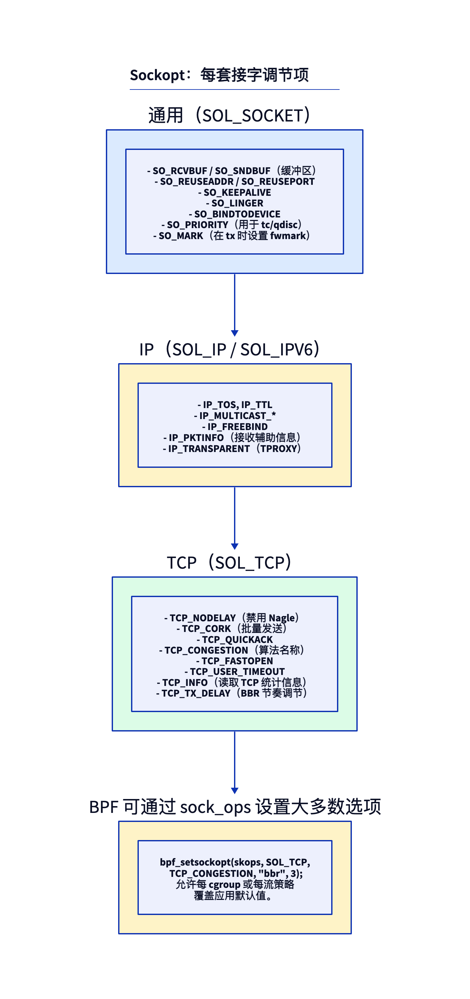
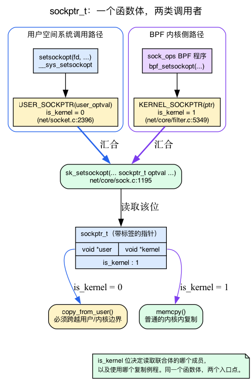
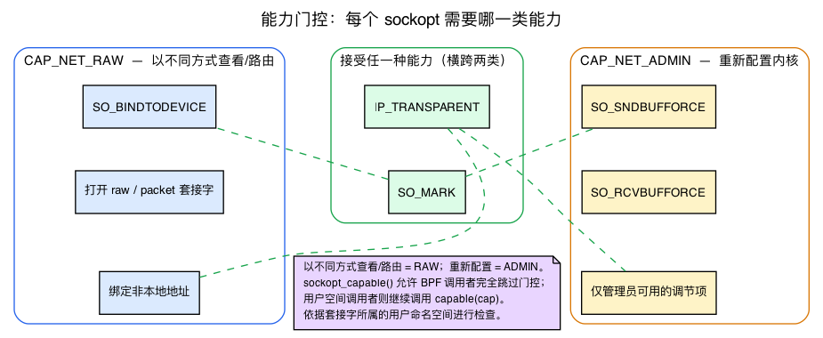
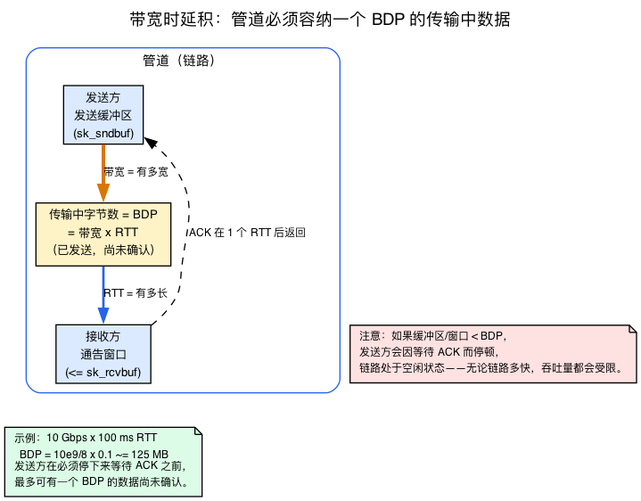
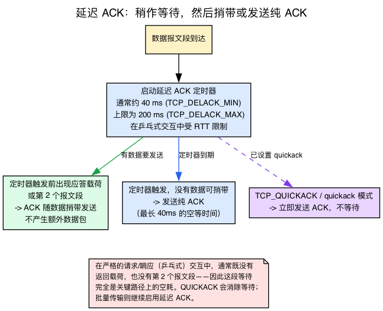

# 第18天 — 套接字选项：逐套接字调优

> **今日任务：** 了解每个 sockopt 会如何改变套接字行为、适合在何时使用，以及改动在内核何处生效。同时补充这些选项所依赖、但本书尚未完整介绍的四项背景知识：能力权限检查、`sockptr_t` 统一指针 ABI、收发缓冲区自动调优与带宽时延积，以及 `TCP_QUICKACK` 所覆盖的延迟 ACK 定时器。总用时：约 110 分钟。

## sockopt 如何工作

套接字选项是通过以下调用设置的每套接字开关：

```c
setsockopt(fd, level, optname, value, valuelen);
getsockopt(fd, level, optname, value, &valuelen);
```

这类调用的四个组成部分共同构成一份契约，值得逐项说明，因为本章其余内容都是它的具体变体：

- **`level`** 选择选项所属的*命名空间*：`SOL_SOCKET`（通用，适用于任何套接字）、`SOL_IP` / `SOL_IPV6`（IP 层）、`SOL_TCP`、`SOL_UDP`（逐协议）。同一个 `optname` 整数在不同层级中可以表示不同含义，因此需要由层级加以区分。
- **`optname`** 选择该命名空间内的具体开关（`SO_RCVBUF`、`TCP_NODELAY`……）。
- **`optval`** 是指向*有类型*值的指针——有时是 `int`，有时是 `struct linger`，有时是像 `"bbr"` 这样的字符串。内核根据 `optname` 重新解释这些字节。
- **`optlen`** 是该值的大小。

`getsockopt` 有一个几乎人人初次使用时都会忽略的细节：**`optlen` 是输入/输出参数。**调用者传入所提供缓冲区的大小，内核再写回实际填充的字节数。因此，今日实验始终以地址形式传递 `&gl` / `&cl`（长度），这样内核才能更新它。漏掉 `&` 会导致结果被截断，或直接得到 `EFAULT`。

### 内核分派路径

系统调用进入内核后，选项必须找到实现它的那个 `case`。分派过程是机械式的：

1. 系统调用到达 `do_sock_setsockopt`（`net/socket.c:2349`）。
2. 对于 `level == SOL_SOCKET`（通用选项），内核调用 `sock_setsockopt`（`net/core/sock.c:1685`）——这是一个立即调用 **`sk_setsockopt`**（`net/core/sock.c:1195`）的薄包装器，实际约 600 行的选项 switch 就在后者中。
3. 对于其他 level，则经过 `sk->sk_prot->setsockopt`（或者对 AF_INET 而言经过 `sock->ops->setsockopt`），分派到每协议代码：`tcp_setsockopt`（`net/ipv4/tcp.c:4175`）、`udp_setsockopt`、`ip_setsockopt`（`net/ipv4/ip_sockglue.c:1409`）等。

第 3 步中的 `sk->sk_prot->setsockopt` 就是**第13天的 `sk_prot` 虚函数表**——挂在每个 `struct sock` 上的每协议函数表。把 `sendmsg` 路由到 `tcp_sendmsg` 或 `udp_sendmsg` 的同一层间接调用，也会把 setsockopt 路由到正确的协议处理函数。（回想第13天完整介绍的 `struct sock`、其 `sk_prot` 分派及 `sk_lock`；今天会同时依赖这三者。）

每个选项都是巨大 switch 语句中的一个 `case`。阅读 `tcp_setsockopt` 时，看到的就是“这个开关改变什么？”的权威参考。



### 一个函数体，两种调用者：`sockptr_t`

仔细查看 v7.1 中 `do_sock_setsockopt` 的签名，有一个参数格外显眼：

```c
int do_sock_setsockopt(struct socket *sock, bool compat, int level,
		       int optname, sockptr_t optval, int optlen)   /* net/socket.c:2349 */
```

`optval` 既不是 `void *`，也不是 `void __user *`——而是 **`sockptr_t`**。这是“内核阅读指南”要求留意的抽象，因此这里真正解释一下。`sockptr_t` 是一个**带标签指针**：内核指针与用户空间指针组成的联合体，再加一位 `is_kernel` 标志（`include/linux/sockptr.h:14`）：

```c
typedef struct {
	union {
		void		*kernel;
		void __user	*user;
	};
	bool		is_kernel : 1;
} sockptr_t;
```

为什么要这样做？因为**同一组选项设置代码有两种完全不同的调用者：**

- **系统调用路径。**`__sys_setsockopt` 使用 `USER_SOCKPTR(user_optval)`（`net/socket.c:2396`）包装用户空间缓冲区，因此 `is_kernel = 0`，内核知道必须先执行 `copy_from_user`，然后才能访问字节。
- **BPF 路径。**`sock_ops` BPF 程序（见下文“BPF 可以覆盖其中大多数选项”）调用 `bpf_setsockopt`，从而复用完全相同的 `sk_setsockopt`；具体做法是使用 `KERNEL_SOCKPTR`（`net/core/filter.c:5349`）包装参数，此时 `is_kernel = 1`，字节通过普通内核内 `memcpy` 复制。

一个函数体、两个入口点，由 `is_kernel` 位选择读取联合体的哪一分支。这就是 `sockptr_t` 存在的全部原因——也解释了为什么能力检查辅助函数带有 `sockopt_` 前缀（见下一节）：内核侧 BPF 调用者必须能够*跳过*用户空间调用者所受的权限检查。



### 谁可以操作：能力权限门

今天有四个选项受到*能力*限制——下文会反复出现“需要 `CAP_NET_RAW`”或“需要 `CAP_NET_ADMIN`”——因此在罗列选项之前，先说明能力*是什么*。

过去，进程要么是 **root**（uid 0，可以做任何事），要么不是。这种划分太粗：抓包工具需要打开原始套接字，却不应该有权重启机器。**POSIX capabilities** 把 root 的全能权限拆分为约 40 项独立特权，每项都能单独授予。进程可以只持有*其中一项*，而不成为完整 root。网络 sockopt 受其中两项限制：

- **`CAP_NET_RAW`**——“查看，或以不同方式路由”：打开原始/数据包套接字，**把已经绑定设备的套接字重新绑定到*不同*设备**（把*未绑定*套接字绑定到设备不需要任何能力），绑定*非本地*地址。
- **`CAP_NET_ADMIN`**——“重新配置内核网络行为”：**强制缓冲区大小越过 sysctl 上限**、修改仅限管理员的开关、设置透明代理。

本章采用的经验法则是：*原始访问 /“只查看，但按自己的方式路由”= `CAP_NET_RAW`；“重新配置内核”= `CAP_NET_ADMIN`。*因此 `SO_*BUFFORCE`（覆盖最大值）需要 ADMIN；`SO_BINDTODEVICE` 需要 RAW；`IP_TRANSPARENT` 和 `SO_MARK` 接受*任一项*（它们横跨两个领域——mark 是“以不同方式路由”，但也是“重新配置”）。

源码中的检查只有一行。缺少对应能力时，`sockopt_capable(CAP_NET_ADMIN)` 向调用者返回 `-EPERM`——例如 `SO_SNDBUFFORCE` 门 `if (!sockopt_capable(CAP_NET_ADMIN))` 位于 `net/core/sock.c:1357`，对应的 `SO_RCVBUFFORCE` 门位于 `net/core/sock.c:1379`。辅助函数本身很小（`net/core/sock.c:1173`，声明于 `include/net/sock.h:1780`）：

```c
bool sockopt_capable(int cap)
{
	return has_current_bpf_ctx() || capable(cap);
}
```

`sockopt_` 前缀的作用在这里体现出来：BPF 调用者（`has_current_bpf_ctx()`）会**完全跳过检查**，因为内核信任自身加载的程序；用户空间调用者则必须通过真正的 `capable(cap)` 检查。

还有一个细节可以解释现实中令人意外的现象：mark 检查使用 `sockopt_ns_capable(sock_net(sk)->user_ns, CAP_NET_X)`，设备绑定检查使用普通 `ns_capable(net->user_ns, CAP_NET_RAW)`——二者都针对**套接字所属用户命名空间**，而非全局命名空间。这就是为什么拥有自身用户命名空间的非特权容器有时可以设置看似应要求 root 的 `SO_MARK`，或重新绑定到设备：它确实在自己的 userns 中持有该能力。（`SO_BINDTODEVICE` 的早期分支是 `if (sk->sk_bound_dev_if && !ns_capable(net->user_ns, CAP_NET_RAW))`，位于 `net/core/sock.c:642`——注意开头的 `sk->sk_bound_dev_if &&`：只有在套接字已经绑定后*更改*设备才需要能力；绑定未绑定的套接字不需要。`SO_MARK` 门在 `net/core/sock.c:1527` 接受 RAW 或 ADMIN。）



### 每个 case 共有的形态

接下来会逐项介绍这些选项。它们都遵循同一套骨架，也就是“内核阅读指南”强调的模式。`sk_setsockopt`（以及各协议的对应函数）中的每个 `case` 都会：

1. **复制传入的 `optval`**，并验证 `optlen`（这就是上面的 `sockptr_t` 复制）；
2. **获取套接字锁**——第13天的 `lock_sock`，它与数据路径串行化，避免开关变更和并发 `sendmsg` 发生竞态；
3. **修改 `struct sock`**（或 `struct tcp_sock`）的一个字段——正是第13天已经学过的结构体；
4. **释放锁**。

因此从机制上看，sockopt 就是“锁定套接字，写入一个字段，解锁”。记住这一点，这份目录就会变成一场关于*每个开关写入哪个字段*的导览。

## SOL_SOCKET——通用选项

这些选项无论协议族如何都适用于任何套接字。实现：`sk_setsockopt`（`net/core/sock.c:1195`），通过薄包装器 `sock_setsockopt`（`net/core/sock.c:1685`）到达。

### `SO_RCVBUF` / `SO_SNDBUF`——缓冲区大小

- **是什么：**套接字接收队列（`sk_rcvbuf`）或发送队列（`sk_sndbuf`）中排队的最大字节数——这是第13天接触过的两个 `struct sock` 字段。
- **为什么：**更大的缓冲区能吸收更多突发流量，而不会丢包或产生反压。对高 BDP 路径而言，默认值可能太小，无法填满管道——参见下面的 BDP 说明框。
- **何时使用：**任何高吞吐量 TCP 服务器。默认 `tcp_rmem`/`tcp_wmem` 三元组提供基线；`SO_RCVBUF`/`SO_SNDBUF` 按套接字覆盖。
- **易错点：**内核会把你设置的值**翻倍**（一半用于内核数据结构）；读取会返回翻倍后的值。这发生在 `sock_setsockopt` 中——SO_SNDBUF case 在 `set_sndbuf` 标签处（约第 1351 行）翻倍。另外，设置这些选项会禁用内核的缓冲区自动调优（下面的 BDP 说明框会准确解释其方式）。
- **位置：**`net/core/sock.c:1337`（SO_SNDBUF case）和 `net/core/sock.c:1369`（SO_RCVBUF case）。

> ### 背景：BDP 与缓冲区自动调优
>
> 上一节有两个承载关键含义、却从未定义的短语——“高 BDP”和“自动调优”。这里给出定义。
>
> **带宽时延积（BDP）** = 带宽 × 往返时间。它是管道满负载运行时“在途”——已经发送但尚未确认——的字节数。可以想象一根软管：带宽是软管有多粗，RTT 是软管有多长；BDP 是软管容纳的水量。为了让链路保持*繁忙*，发送方必须获准拥有至少一个 BDP 的未确认数据，这意味着**发送缓冲区**（以及对端通告的**接收窗口**）都必须至少有一个 BDP 大小。10 Gbps、RTT 100 ms 的链路，其 BDP 为 `10e9/8 × 0.1 ≈ 125 MB`——远大于任何默认缓冲区。*这*就是“高带宽 × 高延迟”措辞重要的原因：在又粗又长的路径上，无论链路多快，过小的缓冲区都会限制吞吐量。
>
> **自动调优**是 Linux 让你无需猜测的应对方式。默认情况下（`tcp_moderate_rcvbuf = 1`），内核会在测得连接 BDP 上升时自行*增大* `sk_rcvbuf`，同时保持在 `tcp_rmem[min, default, max]` 三元组范围内。`tcp_wmem` 是发送侧的对应三元组。放任其自行工作时，繁忙的长肥连接缓冲区会自动膨胀以适应管道。
>
> **这套机制有三个容易忽略的环节：**
>
> 1. **用户锁会退出自动调优。**调用 `setsockopt(SO_RCVBUF)` 或 `SO_SNDBUF` 会设置“用户锁”位——`SOCK_RCVBUF_LOCK` / `SOCK_SNDBUF_LOCK`。可以在 `__sock_set_rcvbuf`（`net/core/sock.c:967`）中看到：`sk->sk_userlocks |= SOCK_RCVBUF_LOCK;` 位于 `:975`。此后，内核不会再替你增大缓冲区。
> 2. **计算顺序是先限制、再翻倍。**你请求的值*首先*被限制为 `sysctl_wmem_max` / `sysctl_rmem_max`（`net/core/sock.c:1343` 限制 SO_SNDBUF；SO_RCVBUF 在 `:1375` 限制），然后再为内核数据开销*翻倍*——`sk_rcvbuf = max_t(int, val * 2, SOCK_MIN_RCVBUF)`（`:987`），注释明确说明了原因。因此，实际存储的缓冲区最大可达 sysctl 上限的**两倍**（`2 * wmem_max` / `2 * rmem_max`）。SO_SNDBUF 路径与 `net/core/sock.c:1343-1351` 中的处理相对应。
> 3. **显式设置过小的值可能适得其反。**关闭自动调优后，*过小*的值会比默认行为更严重地限制吞吐量：你既设定了较低上限，又禁止内核自行提高它。在长肥路径上，要么完全不设置这些选项，要么把值设得足够大。



### `SO_REUSEADDR`——在 TIME_WAIT 上 bind

- **是什么：**即使同一端口上最近的套接字处于 TIME_WAIT，也允许 bind() 成功。
- **为什么：**服务器重启不应等待 TIME_WAIT 清除。（回想第15天的 TIME_WAIT：主动关闭方在其中等待约 60 s，避免迟到的重复报文段被误认为属于新连接。没有 `SO_REUSEADDR` 时，旧连接仍停留其中会让重启服务器的 `bind()` 失败并返回 `EADDRINUSE`。）
- **何时使用：**每台服务器。紧接 `socket()` 后设置。
- **易错点：**它**不**允许两个套接字同时绑定同一端口——那是 `SO_REUSEPORT`。名称相似，语义不同。
- **位置：**`net/core/sock.c:1321`。

### `SO_REUSEPORT`——多个套接字共享一个端口

- **是什么：**让 N 个套接字（位于同一 UID 和 netns）绑定同一个 `(addr, port)`。内核对传入连接进行哈希，以分散到它们之间。
- **为什么：**将多进程/多线程服务器跨核心扩展。每个工作进程都有自己的监听套接字；accept 队列上没有争用。
- **何时使用：**任何高扇出服务器（nginx、envoy、自定义 Go/Rust 服务器）。第24天会详细介绍。
- **易错点：**所有套接字必须在 bind *之前*设置此选项。要求 UID 匹配（安全性：不能让用户 A 抢占用户 B 的端口）。哈希按流进行，因此单个客户端总会落到同一工作进程。
- **位置：**`net/core/sock.c:1324`。分派逻辑位于 `inet_csk_get_port` 和 `__inet_lookup_listener`。

### `SO_KEEPALIVE`——周期性存活探测

- **是什么：**内核周期性发送空 TCP 报文段，以保持空闲连接存活（并检测对端何时消失）。
- **为什么：**无需应用层心跳即可检测失效对端（NAT 设备重启、对端崩溃）。
- **何时使用：**NAT 或负载均衡器后方的长连接（其状态可能超时）。默认关闭；由具体应用开启。
- **易错点：**keepalive 间隔是*全系统* sysctl（`net.ipv4.tcp_keepalive_time` = 7200s，`tcp_keepalive_intvl` = 75s，`tcp_keepalive_probes` = 9）。要按套接字覆盖，请使用 `TCP_KEEPIDLE`、`TCP_KEEPINTVL`、`TCP_KEEPCNT`——参见 SOL_TCP。
- **位置：**`net/core/sock.c:1390`。

### `SO_LINGER`——阻塞 close() 直到数据刷出（或发送 RST）

- **是什么：**struct linger { l_onoff, l_linger }。开启后，`close()` 会阻塞，直到待处理数据发送完毕或经过 `l_linger` 秒；后一种情况下会发送 RST。
- **为什么：**确保对端要么收到数据，要么知道连接已突然结束。
- **何时使用：**很少使用。适合测试（通过 RST 强制立即关闭）或关键数据交付（事务协议）。
- **易错点：**当 `l_onoff=1, l_linger=0` 时，`close()` 会立即发送 RST，而非 FIN——这对强制关闭很有用，但会破坏优雅关闭。当 `l_linger>0` 时，`close()` 最多可能阻塞 `l_linger` 秒。
- **位置：**`net/core/sock.c:1404`。

### `SO_BINDTODEVICE`——限制为一个接口

- **是什么：**把套接字绑定到特定 net_device（按名称）。出站数据包只能通过该设备；入站数据包只有从该设备到达时才匹配。
- **为什么：**在多宿主机上让守护进程使用特定路径（例如始终通过管理 NIC 发送）。
- **何时使用：**管理守护进程、VPN 客户端、自定义多路径逻辑。
- **易错点：**把*未绑定*套接字绑定到设备完全**不需要任何能力**（这是有意为非 root 用户启用的，使非特权进程可以使用 VRF）；只有套接字已经绑定后*更改*设备才需要 **`CAP_NET_RAW`**——防护条件是 `sk->sk_bound_dev_if &&`，位于 `net/core/sock.c:642`。它会绕过正常路由——请注意，你正在禁用内核的路径选择。检查针对套接字的*用户命名空间*，因此拥有自身 userns 的容器可能持有该能力。
- **位置：**`net/core/sock.c:1210`（特殊早期分支）和 `net/core/sock.c:2045`。

### `SO_MARK`——为出站数据包设置 fwmark

- **是什么：**为该套接字发送的每个数据包设置 `skb->mark`。与 `ip rule fwmark X lookup TABLE` 配合，实现套接字驱动的策略路由。
- **为什么：**无需 iptables 标记即可采用不同方式路由该应用的流量（VPN、自定义网关）。（回想第9天：`skb->mark` 是 sk_buff 上的 `u32` 暂存字段，`ip rule fwmark … lookup TABLE` 根据它选择非默认 FIB 表——这就是此选项所输入的策略路由机制。这里只是在*套接字*处标记，而非在 iptables 中。）
- **何时使用：**VPN 客户端、多宿主守护进程、流量工程工具。
- **易错点：**需要 **`CAP_NET_RAW` 或 `CAP_NET_ADMIN`**（v7.1 中任一项都足够——mark 既“以不同方式路由”，又“重新配置”）。标记在*套接字*层应用——该套接字生成的数据包会携带它；接收的数据包不会通过此选项获得标记。
- **位置：**`net/core/sock.c:1527`。

### `SO_PRIORITY`——qdisc 优先级类别

- **是什么：**为出站数据包设置 `skb->priority`。qdisc（尤其是 `pfifo_fast` 的优先级带）使用它进行调度。
- **为什么：**把交互式流量标为更高优先级。
- **何时使用：**控制出站 qdisc 并希望由应用控制调度时。对现代 `fq_codel`（默认）而言，它的重要性较低。
- **位置：**`net/core/sock.c:1223`（`sk_setsockopt` 中的 SO_PRIORITY case）。

## SOL_IP / SOL_IPV6——IP 层选项

实现：`do_ip_setsockopt`（`net/ipv4/ip_sockglue.c:892`）。

### `IP_TOS`——设置 DSCP/ECN 位

- **是什么：**设置出站数据包 IP 头的 TOS 字节。该字节按 **6 + 2** 拆分：高 6 位是 **DSCP** 字段，低 2 位是 **ECN**。
- **为什么：**为 QoS 分类（DSCP）或支持 ECN 的信号标记流量。（回想第9天路由选择器说明框中的 DSCP，以及第16天 DCTCP 使用的 ECN-CE 标记。此选项只是把这些位写入头部的用户空间接口。）
- **何时使用：**支持 QoS 的应用。检查出站 qdisc 是否遵循 DSCP。
- **易错点：**设置值必须符合 qdisc 的预期——许多网络会改写或移除 DSCP。
- **位置：**`net/ipv4/ip_sockglue.c:1057`（case 注释指出它“同时设置 TOS 和 Precedence”）。

### `IP_TTL`——出站 TTL

- **是什么：**覆盖出站数据包的默认 TTL（通常为 64）。
- **何时使用：**traceroute（TTL=1）、数据包实验。大多数应用保留默认值。
- **位置：**`net/ipv4/ip_sockglue.c:1026`。

### `IP_PKTINFO`——接收每个数据包的辅助信息

- **是什么：**设置 `IP_PKTINFO=1` 后，`recvmsg` 辅助数据会包含数据包的目标地址和到达接口。
- **为什么：**绑定到 `0.0.0.0` 的 UDP 服务器需要知道请求*发往*哪个本地 IP（以便回复使用相同源地址）。没有 `IP_PKTINFO`，就必须为每个 IP 绑定一个套接字。
- **何时使用：**DHCP、DNS、SIP 服务器——多宿主机上的任何 UDP 服务。
- **位置：**`net/ipv4/ip_sockglue.c:952`。

### `IP_TRANSPARENT`——绑定非本地地址

- **是什么：**允许 `bind()` 到非本地 IP。结合 iptables `TPROXY`，可以拦截发往其他位置的流量。
- **为什么：**透明代理（squid、使用 `transparent` 的 HAProxy、某些模式下的 Envoy）。
- **何时使用：**L7 透明代理、重新注入数据包的抓包工具。
- **易错点：**需要 **`CAP_NET_RAW` 或 `CAP_NET_ADMIN`**（任一项都足够——参见能力门：绑定非本地地址是“查看/以不同方式路由”，重新配置拦截是“管理”，所以它横跨二者），还需要对应的 TPROXY iptables 规则 + 策略路由。
- **位置：**`net/ipv4/ip_sockglue.c:1010`。

### `IP_FREEBIND`——在配置地址前绑定

- **是什么：**允许 `bind()` 到当前不存在于任何本地接口上的 IP。
- **为什么：**在网络完全配置之前启动的服务（故障转移守护进程、绑定浮动 IP 的守护进程）。
- **位置：**`net/ipv4/ip_sockglue.c:988`。

## SOL_TCP——TCP 专用选项

实现：`do_tcp_setsockopt`（`net/ipv4/tcp.c:3840`）。

### `TCP_NODELAY`——禁用 Nagle

- **是什么：**Nagle 算法批量处理小写入（等待 ACK 或完整报文段后再发送）。`TCP_NODELAY=1` 将其禁用——每次写入立即发出。
- **为什么：**延迟敏感型应用（交互式应用：SSH、X、游戏、实时消息）无法接受批处理等待。（回想第3天的 Nagle，即 TX 路径中的第三道门：*此前的小报文段尚未确认时，不发送新的小报文段——而是进行合并*，记录于 `tp->nonagle`。`TCP_NODELAY` 翻转 `tp->nonagle`，让该门不再扣留小写入。）
- **何时使用：**每个请求小于 1 个报文段且延迟很重要的请求-响应协议。大多数现代服务器。
- **易错点：**NODELAY 和 CORK 均关闭时，应用默认 Nagle。对于任何单次 `write`，NODELAY 的优先级高于 CORK。
- **位置：**`net/ipv4/tcp.c:3970`。

### `TCP_CORK`——缓冲到填满或解除 cork

- **是什么：**NODELAY 的反面。保留写入，直到填满 MSS 大小的报文段或设置 `TCP_CORK=0`。（这是第3天 Nagle 批处理更强、*有意*的版本——它不再是“仅在小报文段尚未确认时合并”，而是“合并一切，直到我要求发送”。）
- **为什么：**构建多部分响应（头 + 正文）的应用希望确保它们在一个报文段中发出。
- **何时使用：**静态文件服务器（`sendfile()` 后解除 cork）、构建结构化响应的 HTTP 服务器。
- **易错点：**即使不解除 cork，套接字*最终*也会发送（约 200 ms 后）。但不要依赖它——请显式解除 cork。
- **位置：**`net/ipv4/tcp.c:4043`。

### `TCP_QUICKACK`——禁用延迟 ACK（一次性）

- **是什么：**TCP 通常会把 ACK 延迟一小段有界时间——一般约 40 ms（`TCP_DELACK_MIN`），在乒乓模式下上限为 200 ms（`TCP_DELACK_MAX`）——希望将其捎带在出站数据上。`TCP_QUICKACK=1` 强制立即确认下一个接收报文段，随后恢复正常模式。
- **为什么：**对于刚刚发送请求、下一个报文段就是响应的请求-响应模式，需要快速确认，让服务器的拥塞控制算法看到 ACK。
- **何时使用：**应用层很少需要。内核已经会在某些场景下自动进入“quickack 模式”。
- **易错点：**它是一次性设置，不会持续生效。
- **位置：**`net/ipv4/tcp.c:4062`（`do_tcp_setsockopt` 中的 TCP_QUICKACK case）。

> ### 背景：“延迟 ACK”究竟是什么
>
> `TCP_QUICKACK` 覆盖的是本书尚未介绍的机制（第17天讲了丢包和重传，但没有讲这个定时器）。**延迟 ACK：**收到数据后，TCP 不会立即确认——它会等待一段较短的有界时间（通常约 40 ms——`TCP_DELACK_MIN` = HZ/25，`include/net/tcp.h:154`；乒乓模式下上限为 200 ms——`TCP_DELACK_MAX` = HZ/5，`:150`；还进一步受连接测得的 RTT 限制），希望*要么*出现回复载荷，使 ACK 可以搭载其上（捎带），*要么*第二个数据报文段到达，使一个 ACK 能覆盖两者。它用少许延迟换取更少的纯 ACK 数据包。定时器位于 TCP 输出路径——`tcp_send_delayed_ack`（`net/ipv4/tcp_output.c:4408`）使用 RTT 估计限制延迟（“用它来限制延迟 ack”，`net/ipv4/tcp_output.c:4424`），发送真实数据则会清除任何待处理的延迟 ACK（“发送它，这会替我们清除延迟 ack”，`net/ipv4/tcp_output.c:4499`）。
>
> 它对请求/响应场景很重要：严格乒乓流量中往往*没有*可供捎带的返回载荷，也*不会*有第二个报文段到达，因此这段等待（通常约 40 ms，最长 200 ms）完全是关键路径上的空耗。`TCP_QUICKACK`（或内核自身的 quickack 启发式规则）可以消除这段延迟。之后会恢复原状，因为在稳定的批量传输中，延迟 ACK 才是正确默认值。



### `TCP_CONGESTION`——选择拥塞控制算法

- **是什么：**拥塞控制算法名称字符串（例如 "cubic"、"bbr"）。为该套接字替换默认算法。
- **为什么：**不同连接需要不同算法；按套接字覆盖是最简洁的方式。（回想第16天：可插拔拥塞控制框架与每套接字 `tcp_set_congestion_control`。它只替换*一个*套接字的拥塞控制模块——之后由新算法驱动拥塞窗口 `snd_cwnd` 和第13天 `struct tcp_sock` 中的其余状态。）
- **何时使用：**专用工作负载（数据中心内希望使用 DCTCP；跨 WAN 希望使用 BBR）。
- **易错点：**算法必须已经加载（`modprobe tcp_bbr`）。检查 `tcp_available_congestion_control`。切换到某些非默认算法需要 `CAP_NET_ADMIN`。
- **位置：**`net/ipv4/tcp.c:3851`。

### `TCP_USER_TIMEOUT`——在指定毫秒后放弃

- **是什么：**如果数据在指定时间内未得到确认，则无论 RTO 重试如何都中止连接。
- **为什么：**keep-alive 不够——你希望得到明确的“30 秒后放弃”语义。
- **何时使用：**过时连接比激进中止更糟的任何应用（RPC 客户端、有截止期限的请求/响应协议）。
- **易错点：**单位为毫秒（其他超时以秒计——请查阅文档）。0 = 使用系统默认值（通过 RTO 重试约为 15 分钟）。
- **位置：**`net/ipv4/tcp.c:3922`。

### `TCP_FASTOPEN`——TCP 快速打开（TFO）

- **是什么：**服务器侧：最多排队 N 个早期数据连接（数据携带在 SYN 中）。客户端侧：基于 cookie 的乐观数据发送。
- **为什么：**为重复连接节省一个连接建立 RTT。
- **何时使用：**频繁重连的服务（CDN 边缘、移动客户端）。
- **易错点：**中间网络设备经常移除 TFO cookie。sysctl `tcp_fastopen` 配置支持情况；位 1 启用客户端，位 2 启用服务器。
- **位置：**`net/ipv4/tcp.c:4101`（`do_tcp_setsockopt` 中的 TCP_FASTOPEN case）。状态机比该选项所暗示的更复杂。

### `TCP_INFO`——读取 tcp_info 结构体

- **是什么：**仅用于 getsockopt。返回包含 rtt、cwnd、重传计数、状态等的 `struct tcp_info`。
- **为什么：**无需解析 `/proc/net/tcp` 即可实现可观测性。（回想第16天：`tcp_get_info` 根据实时 `struct tcp_sock` 填充该结构体——`snd_cwnd`、`srtt_us`、`ca_state`。这是访问该状态的用户空间接口。）
- **何时使用：**监控代理、性能调试。
- **位置：**`net/ipv4/tcp.c`——搜索 `tcp_get_info`（第 4213 行）。阅读该函数：它是 `ss -tin` 所显示内容的事实依据。

### `TCP_TX_DELAY`——人工出站延迟（仅用于测试/仿真）

- **是什么：**把出站数据包延迟固定的微秒数（optname 37）。内核将延迟加到 `skb->skb_mstamp_ns`，并增大连接的 `srtt_us`/`icsk_rto`，让协议栈其余部分表现得仿佛路径 RTT 增加了相应数值。
- **为什么：**用于测试的网络*仿真*——无需真实距离或 `tc netem`，就能让本地主机（或短路径）上的测试表现得像高延迟 WAN 链路。添加于提交 a842fe1425cb。
- **何时使用：**仅限测试工具和基准测试。**不是**生产环境调优开关。
- **易错点：**这与 BBR 或 pacing 无关。BBR 通过 `sk_pacing_rate` + `fq` qdisc 进行 pacing，而不是此选项；`TCP_TX_DELAY` 只会*增加*人工延迟。
- **位置：**`net/ipv4/tcp.c:4157`（`do_tcp_setsockopt` 中的 TCP_TX_DELAY case）。

## BPF 可以覆盖其中大多数选项

`sock_ops` BPF 程序（eBPF 第19天）可以调用 `bpf_setsockopt()`，从内核侧设置 sockopt。它解锁的真正新能力是**按 cgroup 或流而非按应用实施策略**：单个 BPF 程序可以施加应用从未选择的全局规则——例如“来自高优先级 cgroup 的每个套接字都使用 BBR”——覆盖各进程自身的设置。（从机制上看，它正是 `sockptr_t` 一节中的*第二种调用者*：`KERNEL_SOCKPTR` 进入相同的 `sk_setsockopt`，`has_current_bpf_ctx()` 顺利越过能力门。）第19天会构建一个这样的程序。

## 常见疑问

> **问：为什么 `getsockopt` 通过指针接收 `optlen`，而 `setsockopt` 按值接收？**
>
> 答：因为 `getsockopt` 的 `optlen` 是*输入/输出参数*。调用时，它告诉内核缓冲区有多大（避免内核写越界）；返回时，内核再用实际写入的字节数覆盖它。`setsockopt` 只读取该值，所以按值传递即可。这正是今日实验按地址传递 `&gl` 和 `&cl`，并重新初始化 `cl = sizeof cc` 后再*第二次*读取 `TCP_CONGESTION` 的原因——第一次调用已经把它缩小到 `"cubic"` 的长度。

> **问：我把 `SO_RCVBUF` 设为一个很大的值，吞吐量反而*下降*了。为什么？**
>
> 答：你退出了自动调优（设置了 `SOCK_RCVBUF_LOCK` 用户锁），而且根据具体数值，可能把上限设得*低于*内核根据该连接 BDP 自动增长到的大小。也就是说，内核原本能够自行做出更合适的选择。在长肥路径上，要么完全不要设置，要么设置得足够大（还要记住，内核会先把它限制在 `sysctl_rmem_max`，然后再翻倍）。

> **问：我的容器不是 root，却能设置 `SO_MARK`。这是 bug 吗？**
>
> 答：不是。检查是 `sockopt_ns_capable(sock_net(sk)->user_ns, …)`——针对套接字的*用户命名空间*，而非全局命名空间。拥有自身用户命名空间的容器可以合法持有该命名空间内的 `CAP_NET_RAW`/`CAP_NET_ADMIN`，因此从主机视角看似需要特权的 mark，在容器内部是允许的。

> **问：一个 C 函数（`sk_setsockopt`）如何安全接收有时来自用户空间、有时来自内核的指针？**
>
> 答：这正是 `sockptr_t` 的全部工作——一个联合体加一位 `is_kernel`。用户空间调用者使用 `USER_SOCKPTR` 包装（copy_from_user），BPF 调用者使用 `KERNEL_SOCKPTR` 包装（普通 memcpy）。函数读取的是该位，而非你的意图。

## 今日实验

```bash
# See sockopts on live sockets
ss -tipsm | head -20    # m=memory accounting

# SET options and READ them back via getsockopt — exercises the day's core verb
cat << 'EOF' > /tmp/tcpinfo.c
#include <stdio.h>
#include <stdlib.h>
#include <sys/socket.h>
#include <netinet/in.h>
#include <netinet/tcp.h>
#include <arpa/inet.h>
#include <unistd.h>

int main(int argc, char **argv) {
  int s = socket(AF_INET, SOCK_STREAM, 0);

  /* (1) SET a buffer size and watch the kernel double it — no connection needed */
  int v = 65536, g; socklen_t gl = sizeof g;
  setsockopt(s, SOL_SOCKET, SO_RCVBUF, &v, sizeof v);
  getsockopt(s, SOL_SOCKET, SO_RCVBUF, &g, &gl);
  printf("SO_RCVBUF: set %d, got %d (kernel doubled it)\n", v, g);

  /* (2) SET congestion control for THIS socket only (no global sysctl) */
  char cc[32]; socklen_t cl = sizeof cc;
  getsockopt(s, IPPROTO_TCP, TCP_CONGESTION, cc, &cl);
  printf("cc before: %s\n", cc);
  setsockopt(s, IPPROTO_TCP, TCP_CONGESTION, "bbr", 3);

  /* (3) connect, then READ tcp_info + the now-active CC name */
  struct sockaddr_in a = { AF_INET, htons(argc > 2 ? atoi(argv[2]) : 80) };
  inet_aton(argc > 1 ? argv[1] : "8.8.8.8", &a.sin_addr);
  if (connect(s, (struct sockaddr*)&a, sizeof a) < 0) { perror("connect"); return 1; }

  struct tcp_info ti;
  socklen_t l = sizeof ti;
  getsockopt(s, IPPROTO_TCP, TCP_INFO, &ti, &l);
  cl = sizeof cc;
  getsockopt(s, IPPROTO_TCP, TCP_CONGESTION, cc, &cl);
  printf("rtt %u us, cwnd %u, rwnd %u, retrans %u, ca_state %u, cc %s\n",
         ti.tcpi_rtt, ti.tcpi_snd_cwnd, ti.tcpi_snd_wnd,
         ti.tcpi_total_retrans, ti.tcpi_ca_state, cc);
  return 0;
}
EOF
cc /tmp/tcpinfo.c -o /tmp/tcpinfo && /tmp/tcpinfo
```

默认目标为 `8.8.8.8:80`，因此需要能够访问出站 TCP/80。在离线或受出站防火墙限制的机器上，请改为启动本地监听器并让程序指向它（程序以 `host port` 为参数）：

```bash
nc -l 127.0.0.1 18080 &     # any high port avoids needing root to bind :80
/tmp/tcpinfo 127.0.0.1 18080
kill %1                      # stop the listener
```

预期输出（数值会有变化；回环会得到很小的 rtt）：

```
SO_RCVBUF: set 65536, got 131072 (kernel doubled it)
cc before: cubic
rtt 37 us, cwnd 10, rwnd 65483, retrans 0, ca_state 0, cc bbr
```

各行所证明的内容：

- **`set 65536, got 131072`**——本章最重要的易错点（`__sock_set_rcvbuf` 的翻倍）。内核存储的是请求值的*两倍*；额外一半是记账开销。（翻倍后的值限制为 `2 * net.core.rmem_max`，因此特别大的设置值会被截断。）这个 `setsockopt` 还会悄悄设置 `SOCK_RCVBUF_LOCK` 用户锁——该套接字现已退出自动调优。
- **`cc before: cubic` → `cc bbr`**——按套接字的 `setsockopt(TCP_CONGESTION)` 已生效，`getsockopt` 将其读回。`cubic` 是典型内核默认值，但如果机器已默认使用 `bbr`（检查 `sysctl net.ipv4.tcp_congestion_control`），`cc before` 就会读到 `bbr`，覆盖在视觉上没有变化——先把默认值设置为 `cubic`，或阅读源码行确认按套接字写入仍然发生。这只改变*这个套接字*——全系统默认值（`net.ipv4.tcp_congestion_control`）从未改动，因此无需恢复任何全局状态。`bbr` 必须可用（`modprobe tcp_bbr`；检查 `sysctl net.ipv4.tcp_available_congestion_control`）。注意程序在第二次读取前重置 `cl = sizeof cc`——因为第一次 `getsockopt` 已把 `cl` 缩小为 `"cubic"` 的值-结果长度。
- **`rtt`** 是以微秒为单位的 `tcpi_rtt` = `srtt_us >> 3`；**`cwnd 10`** 是初始拥塞窗口；**`ca_state 0`** 是 `TCP_CA_Open`（正常、无丢包状态）。

## 内核阅读指南

- **`net/socket.c:2349`**——`do_sock_setsockopt`。分派器。阅读它，了解 `(level, optname, value)` 如何流向正确的协议代码。注意 `sockptr_t` 抽象让 BPF（内核空间调用者）与用户空间能够共用相同 setsockopt 路径——`USER_SOCKPTR` 在 `:2396` 包装系统调用缓冲区。

- **`include/linux/sockptr.h:14`**——`sockptr_t` 联合体 + `is_kernel` 位本身。只有五行；读过一次，就能理解 BPF 与系统调用如何汇合。

- **`net/core/sock.c:1685`**——`sock_setsockopt`。SOL_SOCKET 入口——但只是薄包装器。实际工作位于 **`sk_setsockopt`**（`net/core/sock.c:1195`）：一个很长的 switch（约 600 行）。阅读关心的选项 case——每个都是独立的微型例程。注意一致模式：从用户空间复制、验证、获取套接字锁（`lock_sock`，第13天）、更新字段、释放锁。单行能力检查 `sockopt_capable` 位于 `:1173`。

- **`net/core/sock.c:967`**——`__sock_set_rcvbuf`。`SOCK_RCVBUF_LOCK` 用户锁和“为开销翻倍”注释位于同一处——两项缓冲区易错点背后的机制。

- **`net/ipv4/tcp.c:4175`**——`tcp_setsockopt`。TCP 专用分派器；继续传给 `do_tcp_setsockopt`（第 3840 行）。如果想知道“TCP_FOO 实际做什么？”，请完整阅读 `do_tcp_setsockopt`——每个选项都在这里有对应 case。

- **`net/ipv4/tcp.c:3970`**——TCP_NODELAY case。约 10 行。最简单的 TCP 选项；适合作为入门参考。

- **`net/ipv4/tcp.c:4043`**——TCP_CORK case。注意它与 TCP_NODELAY 的交互（精神上互斥，但可以同时设置）。

- **`net/ipv4/tcp.c:3851`**——TCP_CONGESTION case。调用 `tcp_set_congestion_control`（第16天）。注意某些非默认算法的 `cap_net_admin` 要求。

- **`net/ipv4/tcp.c:4213`**——`tcp_get_info`。填充 `struct tcp_info`，供 `TCP_INFO` getsockopt 使用。阅读它以了解 `tcp_info` 中有哪些字段及其来源（rtt → `tp->srtt_us >> 3`，位于 `:4300`；cwnd → `tcp_snd_cwnd(tp)`，位于 `:4241`；等等）。

- **`net/ipv4/ip_sockglue.c:892`**——`do_ip_setsockopt`。IP 层分派器。阅读 `IP_PKTINFO`（第 952 行）、`IP_FREEBIND`（第 988 行）、`IP_TRANSPARENT`（第 1010 行）的 case——它们都是一行用户空间代码如何解锁完整行为的启发性示例。

- **`include/uapi/linux/tcp.h`**——TCP 选项常量。快速浏览完整列表。约有 50 个；职业生涯中会遇到其中大多数。

- **`include/uapi/asm-generic/socket.h`**——通用 SO_* 常量。

- **`Documentation/networking/ip-sysctl.rst`**——TCP/IP 行为相关 sysctl（其中许多会与 sockopt 交互）。

## 要点回顾

- sockopt 是 `(level, optname, optval, optlen)`。**`level`** 指定命名空间，**`optname`** 指定开关，**`optval`** 是有类型值，**`optlen`** 是其大小——而在 `getsockopt` 上，`optlen` 是**值-结果参数**（传入缓冲区大小，返回填充大小）。
- 分派：`do_sock_setsockopt`（`socket.c:2349`）→ SOL_SOCKET 经过 `sock_setsockopt` → `sk_setsockopt`（`sock.c:1195`）；其他 level 经过 **`sk_prot` 虚函数表**（第13天）。每个 case 都是：复制传入值、`lock_sock`、写入 `struct sock` 字段、解锁。
- **`sockptr_t`** 是一个联合体（内核指针 / 用户指针）+ `is_kernel` 位，因此一个 `sk_setsockopt` 同时服务**系统调用**路径（`USER_SOCKPTR`）和 **BPF**（`KERNEL_SOCKPTR`）。`sockopt_` 前缀让 BPF 可以跳过权限检查。
- **Capabilities** 将 root 权力拆分：**`CAP_NET_RAW`** = 原始/数据包套接字、*重新绑定*已经绑定设备的套接字、非本地绑定；**`CAP_NET_ADMIN`** = 强制缓冲区、管理员开关、透明代理。`SO_BINDTODEVICE`→把未绑定套接字绑定到设备无需能力，只有*更改*设备才需要 RAW；`SO_*BUFFORCE`→ADMIN，`SO_MARK`/`IP_TRANSPARENT`→任一项。检查针对套接字的**用户命名空间**。
- **`SO_RCVBUF`/`SO_SNDBUF`**——缓冲区。值会**先限制为 `rmem_max`/`wmem_max`，再翻倍**（所以存储的缓冲区可达 `2*rmem_max`/`2*wmem_max`）；显式设置会触发**用户锁**并**禁用自动调优**。**BDP** = 带宽 × RTT = 在途字节；在高带宽 × 高延迟路径上，过小缓冲区会限制吞吐量。
- **`SO_REUSEADDR`**——绑定处于 **TIME_WAIT** 的端口（第15天）。**`SO_REUSEPORT`**——多个套接字、一个端口（第24天）。
- **`TCP_NODELAY`**——禁用 **Nagle**（第3天；翻转 `tp->nonagle`）。**`TCP_CORK`**——其反面；批处理直到解除 cork。
- **`TCP_QUICKACK`**——一次性覆盖**延迟 ACK**（通常等待约 40 ms，以在返回数据上捎带 ACK；乒乓模式上限为 200 ms）。
- **`TCP_CONGESTION`**——按套接字选择拥塞控制算法（第16天）。**`TCP_USER_TIMEOUT`**——未确认数据的硬截止时间（ms）。**`TCP_INFO`**（getsockopt）——来自 `tcp_get_info` 的完整 TCP 统计信息；等同于 `ss -tin`。
- **`IP_TOS`**——TOS 字节 = 6 位 **DSCP**（第9天）+ 2 位 **ECN**（第16天）。**`IP_PKTINFO`**——UDP 服务器得知数据包发往哪个本地 IP。**`IP_TRANSPARENT`**——为透明代理绑定非本地 IP。
- BPF（`cgroup_sockops`）可以通过相同的 `sk_setsockopt` 从内核侧覆盖所有这些选项。

## 检查问题

为什么 `TCP_NODELAY` 与 `TCP_CORK` 看起来互为反面，却有时能在不同时刻对同一个套接字都有用？

<details>
<summary>点击查看答案</summary>

**答案：**它们服务于连接生命周期不同阶段的不同需求。请求/响应服务器可以在构建多部分响应时（头 + 正文——应用多次调用 `write()` 进行组合）设置 **CORK**，然后*解除 cork*——内核会发送一个高效的大报文段。紧接响应之后，应用可以设置 **NODELAY**，这样任何尾部数据（小型“200 OK”后续信息、心跳）都不会等待 Nagle。真实应用会混用二者：cork 用于批量处理准备好的输出，nodelay 用于批次之间的临时小写入。关键在于：应用知道何时批处理有益（组装大型响应），何时延迟更重要（其余情况）。Sockopt 让它可以动态切换。（内核甚至确认二者可以共存：`net/ipv4/tcp.c:3640` 指出“TCP_CORK 可以与 TCP_NODELAY 同时设置，并且它比 TCP_NODELAY 更强”。）

</details>

---

## 明天

第19天：用于套接字的 epoll 与 io_uring。现代用户空间高效等待大量套接字的两种方式。
