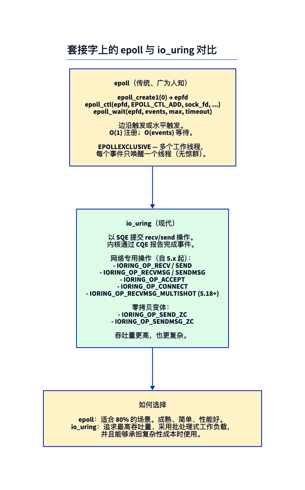
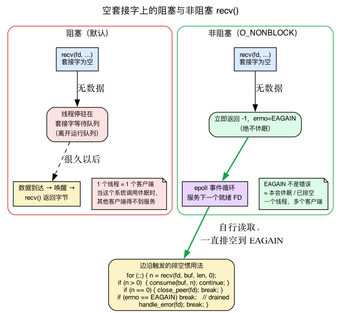
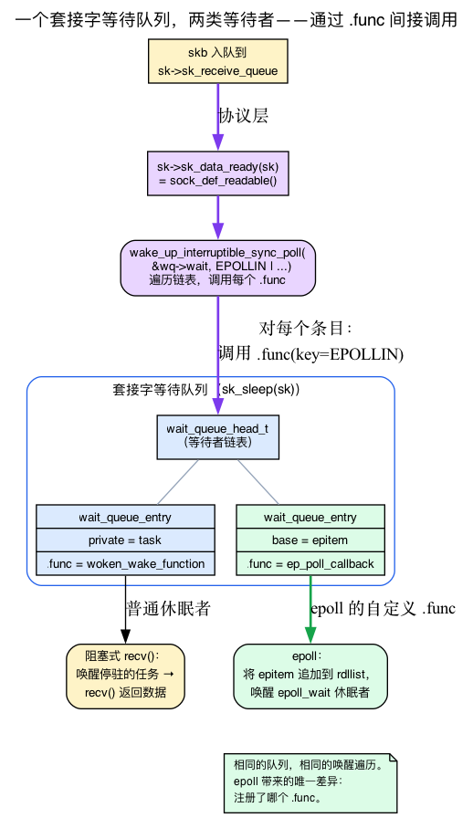
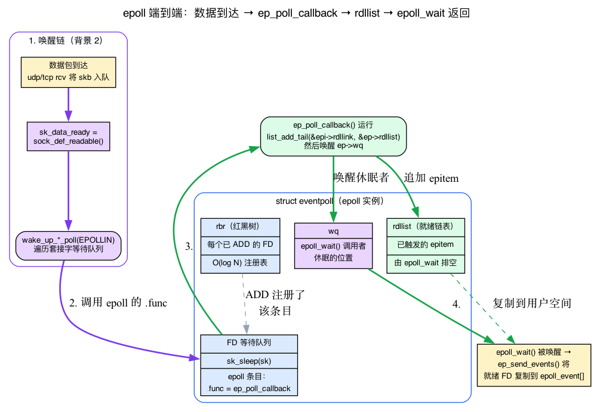

# 第19天 — 套接字上的 epoll 与 io_uring

> **今日任务：** 理解用户空间如何高效等待大量套接字，以及为什么 io_uring 正在最高吞吐量的服务器中逐渐取代 epoll。我们会先讲清整章依赖的两套机制——*阻塞与非阻塞套接字*，以及*套接字休眠所使用的内核等待队列*——然后再剖析 epoll；它的核心正是巧妙挂接到这条等待队列。总用时：约 110 分钟。

## 它们解决的问题

朴素的阻塞服务器一次处理一个客户端。要处理多个客户端，可以：

1. **为每个客户端 fork 一个进程**（Apache prefork，约 21 世纪初的风格）。开销很大。
2. **为每个客户端生成一个线程**（1:1 线程模型）。比进程轻量，但每个客户端仍需约 MB 级内存，并产生大量上下文切换。
3. **用一个线程通过非阻塞 I/O 处理多个客户端。**只在就绪时读写；永远不阻塞在单个套接字上。*这就需要知道哪个套接字已就绪。*

最后一点正是 `epoll` 和 `io_uring` 所解决的问题——但二者机制完全不同。



不过，在理解这些方案之前，必须先准确界定第 3 点中贯穿全章的两个概念：**“阻塞”**和**“就绪”。**`recv()` 发生*阻塞*时究竟发生了什么？内核通过什么机制让线程休眠，又由什么事件将它唤醒？“就绪”检测的又是什么？这几个问题其实指向同一套机制，也是理解 epoll 内部实现的关键。因此，我们会先建立直觉，再查看 v7.1 中的具体结构体，最后才进入 epoll API。

---

## 背景 1：阻塞、非阻塞与 `EAGAIN` 契约

### 阻塞式 `recv()` 会让线程休眠

默认情况下，套接字是**阻塞式**的。在没有数据等待的 TCP 套接字上调用 `recv()`，线程不会自旋、轮询或返回错误——它会**进入休眠**。内核停放该任务，把 CPU 调度给其他任务，只有数据到达时才唤醒你的任务。从用户空间看，它像是一个“花了些时间”的长系统调用；实际上，线程已经完全离开运行队列。

这正是第 3 点“一个线程处理多个客户端”很难实现的原因。如果单个线程在客户端 A 上调用 `recv()`，而 A 很安静，线程就会在该系统调用中休眠——即使客户端 B、C、D 此刻已有数据就绪，它们也得不到服务。一个阻塞线程只能服务一个慢客户端。只有系统调用**永不休眠**时，完整的就绪模型才能工作。

### `O_NONBLOCK` 翻转开关：返回而非休眠

在套接字上设置 **`O_NONBLOCK`** 会改变契约。可以使用 `fcntl(fd, F_SETFL, O_NONBLOCK)` 设置，或者在创建时通过 `SOCK_NONBLOCK` 原子地获得，将其传给 `socket()` / `accept4()` 即可。此后 `recv`、`accept` 和 `send` 都会**立即返回**：

- 如果有数据（或待处理连接，或发送缓冲区空间），它们会执行工作并正常返回。
- 如果**无事可做**，它们不会休眠，而是返回 `-1`，同时 `errno == EAGAIN`。

`EAGAIN`（Linux 上也拼作 `EWOULDBLOCK`——值相同）**不是错误**。它是内核在说：*“当前尚未就绪；这里没有可供你处理的内容，稍后再试。”*它是非阻塞世界中的“本来会休眠”。

### 为什么 epoll 与非阻塞 I/O 是一对

这就是就绪模型缺失的另一半。`epoll_wait`（下文会介绍）告诉你*哪些* FD 已就绪。随后由你自行执行系统调用——而 **`EAGAIN` 是当前已排空该 FD 的信号**，此时停止并转向下一个就绪 FD。

没有 `O_NONBLOCK`，这套设计就可能失效：即使 `epoll_wait` 已报告“FD 可读”，*阻塞式* `recv()` 仍可能进入休眠——例如校验和失败的报文段在就绪通知发出后、实际读取前被丢弃，使套接字重新变空。只要有一次 `recv()` 卡住，整个事件循环都会冻结。非阻塞模式正是循环持续运行的保障。**因此，不配合 `O_NONBLOCK` 使用 epoll 会留下严重隐患。**

### 边缘触发模式使 `EAGAIN` 成为必需

有两种 epoll 就绪报告方式（稍后会正式定义）：

- **水平触发（默认）：**只要 FD 仍有数据，epoll 就会*持续*报告。如果只读取一半字节，下一次 `epoll_wait` 会再次提醒你。很宽容。
- **边缘触发（`EPOLLET`）：**epoll 在**每次新数据到达**时通知你（套接字等待队列的一次新唤醒），而不会在数据尚未读取期间持续通知。它不会自行再次报告未读字节——只有*新的*唤醒才会再次触发。

因此在边缘触发模式下，**必须**循环：

```c
/* Edge-triggered drain: read until the kernel says EAGAIN */
for (;;) {
    ssize_t n = recv(fd, buf, sizeof buf, 0);
    if (n > 0)        { consume(buf, n); continue; }   /* more queued — keep going */
    if (n == 0)       { close_peer(fd);  break;    }   /* orderly shutdown */
    /* n < 0 */
    if (errno == EAGAIN) break;     /* drained: nothing left until next arrival */
    handle_error(fd); break;
}
```

如果提前停止——例如只读取一个缓冲区的内容，然后相信 epoll 会再次提醒——剩余字节就会一直*留在那里*。边缘触发已经为该转换发出过唯一一次通知；下一次 `epoll_wait` 会保持沉默，直到全新数据触发另一个边缘。读取方会卡住，而数据永远无法被取走。排空到 `EAGAIN` 是唯一正确的边缘触发惯用法。水平触发恰恰因为会在数据剩余时再次报告，所以能够容忍部分读取。

在 `EPOLLEXCLUSIVE` 下*接受*连接时（本章后面会介绍）也会出现相同的循环形态：被唤醒的工作进程循环调用 `accept4()`，直到 `EAGAIN`，以排空监听 backlog，然后再次休眠。



---

## 背景 2：等待队列——每个套接字底层的休眠/唤醒机制

刚才说阻塞式 `recv()` 会“进入休眠”，并在“数据到达时被唤醒”。现在把它具体化，因为**epoll 挂接的正是这套机制。**理解它，epoll 的内部实现就不再神秘。

### 等待队列是休眠者列表加唤醒函数

线程需要等待某个事件（例如“此套接字上有数据”）时，内核必须记录*“哪个任务正在休眠，以及应当如何唤醒它”*。这份记录就保存在**等待队列**中：`wait_queue_head_t` 本质上是一个等待者列表；每个等待者都是一个 `struct wait_queue_entry`，既指向休眠任务，也携带事件触发时要执行的**唤醒回调函数**。

```c
/* include/linux/wait.h:15 */
typedef int (*wait_queue_func_t)(struct wait_queue_entry *wq_entry,
                                 unsigned mode, int flags, void *key);

/* include/linux/wait.h:28 */
struct wait_queue_entry {
    unsigned int            flags;
    void                    *private;     /* usually the task to wake */
    wait_queue_func_t       func;         /* the callback — remember this field */
    struct list_head        entry;
};
```

这个 `.func` 字段就是今日整章的关键。对普通休眠者而言，它是通用的“唤醒此任务”例程。稍后会看到，epoll 换入它*自己的*函数——这一替换就是全部诀窍。

### 每个套接字都携带等待队列；`recv()` 在其中休眠

阻塞式 `recv()` 发现套接字为空时，会把自身添加到套接字等待队列并休眠。在 `sk_wait_data`（`net/core/sock.c:3269`）中可以清楚看到：

```c
int sk_wait_data(struct sock *sk, long *timeo, const struct sk_buff *skb)
{
    DEFINE_WAIT_FUNC(wait, woken_wake_function);
    int rc;

    add_wait_queue(sk_sleep(sk), &wait);                 /* park on the socket's queue */
    sk_set_bit(SOCKWQ_ASYNC_WAITDATA, sk);
    rc = sk_wait_event(sk, timeo,
                       skb_peek_tail(&sk->sk_receive_queue) != skb, &wait);
    /* ... woken: remove and return ... */
    remove_wait_queue(sk_sleep(sk), &wait);
    return rc;
}
```

`sk_sleep(sk)` 是套接字的等待队列头。线程把一个 `wait_queue_entry` 链接到其中并阻塞。**请记住这个队列**——后文说 epoll 注册到*“`recvmsg` 会阻塞所在的同一个等待队列”*时，指的就是这个 `sk_sleep(sk)` 队列。

### 唤醒来自 `sk_data_ready` → `sock_def_readable`

那么是谁*唤醒*休眠者？在接收侧，每个套接字都有一个回调指针 `sk->sk_data_ready`，协议层刚刚为套接字将数据包入队时就会触发。（第14天展示过 `__udp_enqueue_schedule_skb` 调用 `sk->sk_data_ready(sk)`（`net/ipv4/udp.c:1745`）来“唤醒任何 `recvmsg` 等待者”——那一行*就是*唤醒。这里解释它所触发的队列。）

默认 `sk_data_ready` 是套接字创建时安装的 `sock_def_readable`（`net/core/sock.c:3734`）。第14天展示过其完整函数体；这里最重要的是唤醒本身（`net/core/sock.c:3614`）：

```c
wake_up_interruptible_sync_poll(&wq->wait, EPOLLIN | EPOLLPRI |
                                EPOLLRDNORM | EPOLLRDBAND);
```

它遍历套接字等待队列，并对每个等待者**调用其 `.func`**，同时把 `EPOLLIN`（及其他标志）作为 `key` 参数传入。对于阻塞式 `recv()`，`.func` 唤醒停放的任务，`recv()` 带着数据返回。*请注意内核传入了 `EPOLLIN`*——正是你会放进 `epoll_event` 的同一个位。这并非巧合；下一点会解释。

### `->poll()`：一次调用同时注册并报告就绪状态

每个可轮询文件（套接字、管道、eventfd，甚至其他 epoll FD）都导出一个 `->poll()` 文件操作。内核通过 `vfs_poll(file, pt)` 调用它，并传入一个称为 **`poll_table`** 的小型辅助对象；`->poll()` 一次完成**两项工作**：

1. 使用 `poll_table` 把调用者**注册**到文件等待队列，以便未来就绪时唤醒调用者。
2. *立即* **返回就绪位掩码**——有数据可读时返回 `EPOLLIN`，发送缓冲区有空间时返回 `EPOLLOUT`，等等。

这就是你的 `EPOLLIN` 在 `epoll_event` 中与内核内部使用相同位的深层原因：就绪状态是 `->poll()`、`sock_def_readable` 的唤醒 key 和用户空间事件结构体共享的**一份位掩码**。它们实际上就是同一组标志。

因此普通阻塞等待恰好贯穿这条链：`recv()` 停放在 `sk_sleep(sk)` 上，数据包的 `sk_data_ready` 遍历队列，条目的 `.func` 唤醒任务，`recv()` 返回（下面的编号流程会列出每一步）。**epoll 只改变了这条链中的一件事：注册的是哪个 `.func`。**下一节就来介绍。



---

## epoll——就绪模型

心智模型：*“当这个 FD 可以进行 I/O 时告诉我。系统调用由我自己执行。”*

```c
int epfd = epoll_create1(0);

struct epoll_event ev = { .events = EPOLLIN | EPOLLET, .data.fd = sock };
epoll_ctl(epfd, EPOLL_CTL_ADD, sock, &ev);

struct epoll_event events[64];
int n = epoll_wait(epfd, events, 64, 100);
for (int i = 0; i < n; i++) {
    /* events[i].data.fd is ready — go read/write it (non-blocking, drain to EAGAIN) */
}
```

三个系统调用：
- **`epoll_create1`**（`fs/eventpoll.c:2200`）：创建 epoll 实例（由返回的 FD 引用的内核对象）。
- **`epoll_ctl`**（`fs/eventpoll.c:2385`）：从实例 ADD、MOD 或 DEL 一个 FD。
- **`epoll_wait`**（`fs/eventpoll.c:2467`）：阻塞，直到一个或多个已注册 FD 就绪，或发生超时。

还要注意 `EPOLLIN | EPOLLET` 和循环中的“排空到 EAGAIN”注释——这就是背景 1 与背景 2 在实际 API 中的体现。

### 内部机制

掌握等待队列后，内部机制很简短。epoll 实例是一个 `struct eventpoll`（`fs/eventpoll.c:172`），其中四个字段承载了整个设计：

```c
struct eventpoll {
    /* ... mutex ... */
    wait_queue_head_t wq;          /* where epoll_wait() callers sleep         */
    wait_queue_head_t poll_wait;   /* for an epoll fd nested inside another epoll */
    struct list_head  rdllist;     /* the READY list: FDs that fired            */
    struct rb_root_cached rbr;     /* the registered FDs, an rb-tree            */
    /* ... */
};
```

其中三个列表或队列与 epoll 的职责一一对应：

- **`rbr`**——由所有通过 ADD 注册的 FD 组成的**红黑树**，支持 O(log N) 的 ADD、DEL 和查找。这就是注册表。每个加入的 FD 都对应一个 `struct epitem`，也就是逐 FD 记录，并存储在 `rbr` 中；FD 触发时，被链接到 `rdllist` 的正是这个 epitem。
- **`rdllist`**——**就绪列表**，保存已经就绪、正等待 `epoll_wait` 报告的 FD。
- **`wq`**——尚无任何 FD 就绪时，`epoll_wait` 调用所休眠的等待队列。它采用背景 2 介绍的同一套等待队列机制，只是现在属于 epoll 对象，而非套接字。

下面来看这些结构如何连接起来。**ADD** 一个 FD 时，`ep_insert`（`fs/eventpoll.c:1566`）会调用该 FD 的 `->poll()`，并传入一个特殊的 `poll_table`；其中负责“注册我”的回调是 `ep_ptable_queue_proc`（`fs/eventpoll.c:1360`）。epoll 的高效之处就在这里：它不会在套接字等待队列中注册通用的“唤醒我”条目，而是安装一个等待队列条目，并把 `.func` 设置为 epoll 自己的 `ep_poll_callback`：

```c
/* fs/eventpoll.c:1360, ep_ptable_queue_proc */
init_waitqueue_func_entry(&pwq->wait, ep_poll_callback);   /* custom .func! */
pwq->whead = whead;
pwq->base  = epi;
if (epi->event.events & EPOLLEXCLUSIVE)
    add_wait_queue_exclusive(whead, &pwq->wait);           /* see EPOLLEXCLUSIVE below */
/* else add_wait_queue(whead, &pwq->wait); */
```

这个 `whead` 正是 `sk_sleep(sk)`——阻塞式 `recv()` 会停放所在的同一个套接字等待队列（背景 2）。epoll 只是在其中挂入了另一种等待者。

因此，数据到达时沿流程跟踪，每一步都是已经学过的内容：

1. 数据包到达；协议层把它放入套接字队列，并调用 `sk->sk_data_ready` → `sock_def_readable` → `wake_up_interruptible_sync_poll(&wq->wait, EPOLLIN|...)`（背景 2）。
2. 它会遍历套接字等待队列，并调用每个条目的 `.func`。对于 epoll 条目，`.func` 是 **`ep_poll_callback`**（`fs/eventpoll.c:1249`）。
3. `ep_poll_callback` 运行，把该 FD 的 `epitem` 链接到 eventpoll 的 **`rdllist`**（`list_add_tail(&epi->rdllink, &ep->rdllist)`，`fs/eventpoll.c:1294`），并**唤醒任何休眠在 `ep->wq` 上的对象**——也就是你的 `epoll_wait`。
4. `epoll_wait` 被唤醒，`ep_send_events`（`fs/eventpoll.c:1765`）把就绪 FD 复制到你的 `epoll_event[]` 数组，最终返回 `n`。

这种以回调替代普通唤醒的间接调用就是全部“魔法”——不过是替换了背景 2 中学到的 `.func`。注册回调的同一个 `->poll()` 还会返回当前就绪位掩码（通过 `ep_item_poll` → `vfs_poll(file, pt)`，`fs/eventpoll.c:1057`），因此 FD 在 ADD 时*已经*就绪，就会立即进入 `rdllist`。



### 水平触发与边缘触发

背景 1 已介绍二者；下面来看它们在代码中的位置。

- **水平触发（LT，默认）：**只要 FD 处于就绪状态，epoll_wait 就会报告。尽可能读取，留下其余内容；下次 epoll_wait 会再次报告。
- **边缘触发（ET，`EPOLLET` 标志）：**只有 FD 的就绪状态*发生变化*（例如从“无数据”变为“数据到达”）时，epoll_wait 才会报告。必须排空 FD，直到得到 `EAGAIN`，否则会错过后续数据。

ET 更快（唤醒更少），但更容易出错。除非确切知道 ET 为何有帮助，否则应使用 LT。

LT/ET 差异由 `ep_send_events` 中的一个分支实现。`EPOLLET` 按 epitem 存储（它是 epoll 私有位之一：`EP_PRIVATE_BITS = (EPOLLWAKEUP | EPOLLONESHOT | EPOLLET | EPOLLEXCLUSIVE)`，`fs/eventpoll.c:86`）——永远不会向下传给 FD 的 `->poll()`，所以重新武装完全是 epoll 侧的决定。把 FD 事件复制到用户空间后，`ep_send_events` 执行（`fs/eventpoll.c:1835`）：

```c
} else if (!(epi->event.events & EPOLLET)) {
    /*
     * If this file has been added with Level Trigger mode, we need to
     * insert back inside the ready list, so that the next call to
     * epoll_wait() will check again the events availability.
     */
    list_add_tail(&epi->rdllink, &ep->rdllist);   /* fs/eventpoll.c:1847 */
    ep_pm_stay_awake(epi);
}
```

对于**水平触发**，FD 会重新添加到 `rdllist`，使*下一次* `epoll_wait` 再次检查它——这就是“数据仍存在时 LT 会再次报告”。对于**边缘触发**，会跳过该分支：FD 离开 `rdllist`，直到新的就绪转换再次触发 `ep_poll_callback` 才会回来。这一个 `if` 就是全部 LT 与 ET 行为，也是 ET 下部分读取会让数据搁浅的源码层原因。

### `EPOLLEXCLUSIVE`——解决惊群

默认语义：当一个 FD 上的事件触发，且有多个 `epoll_wait` 等待者时，*所有*等待者都会被唤醒。对于由 N 个工作进程共享的 `accept` 套接字，这意味着一个新连接完成（最终 ACK 到达，连接加入 accept 队列，`tcp_child_process` 调用监听器的 `sk_data_ready`，`net/ipv4/tcp_minisocks.c:1005`）会唤醒全部 N 个进程——其中 N-1 个立即调用 accept，得到 `EAGAIN`（背景 1——在空 backlog 上进行非阻塞 accept），然后再次休眠。这些都是浪费的唤醒。（请注意，唤醒监听器的是连接*完成*，而非 SYN：SYN 路径只会把请求入队并发送 SYN-ACK。）

`EPOLLEXCLUSIVE`（4.5 添加）告诉 epoll：每个事件只唤醒一个等待者。实现就是已经看到的 `add_wait_queue_exclusive` 分支，它位于 `ep_ptable_queue_proc`（`fs/eventpoll.c:1360`）中——独占等待者会告诉等待队列遍历器在唤醒第一个有响应的线程后停止，而非唤醒整个列表。现代多进程服务器应使用它。

（补充：`SO_REUSEPORT`——第24天——是更强大的替代方案。每个工作进程都有自己的监听套接字；内核对传入 SYN 进行哈希并分散到它们之间，所以每个工作进程的 epoll 只会看到本来就发往*它*的 SYN。）

## io_uring——完成模型（预览）

epoll 的模型是*就绪*：“当这个 FD 就绪时告诉我；系统调用由我自己执行。”io_uring 将其反转为*完成*：**“替我执行这个网络操作——完成时告诉我。”**你不再先得知哪个 FD 就绪，再自行发出 `recv`/`send`，而是通过两个内存映射环形缓冲区，把整个操作交给内核：

- **提交队列（SQ）**：用户空间推入描述待执行工作的提交队列条目（SQE）。
- **完成队列（CQ）**：工作完成时，内核推入完成队列条目（CQE）。

今天最重要的实际对比如下：

- **epoll：每次 I/O 需要 2 个系统调用**——`epoll_wait` 获知就绪，然后 `recv`/`send`。
- **io_uring：每*批*约 1 个系统调用**（一次 `io_uring_enter` 携带多个 SQE），使用 `IORING_SETUP_SQPOLL` 时稳定状态甚至为*零*（内核线程轮询 SQ）。

每线程持续请求速率超过约 100k/秒时，这项节省确实有意义；低于该值则无法察觉，epoll 更小、更久经考验的 API 才是正确默认选择（nginx、redis、通过 libuv 的 node.js，以及大多数 Python/Go/Rust 异步运行时都基于 epoll）。请记住这一项区别——**epoll 表示就绪；io_uring 表示完成**——并在**第28天**深入学习，届时会介绍完整网络操作集、多次触发 recv、预置缓冲区和零拷贝发送。

## 常见疑问

> **问：`EAGAIN` 是应该记录并退出的错误吗？**
>
> 答：不是——恰恰相反。非阻塞套接字上的 `EAGAIN`（Linux 上 == `EWOULDBLOCK`）表示“当前没有内容”。对于刚报告的 FD，它表示“已排空所有排队内容；停止读取，去处理下一个就绪 FD。”把它记录为错误，会在事件循环每次迭代时淹没日志。真正的 `recv` 错误只有 `n < 0` 且 errno 是*其他*值（例如 `ECONNRESET`）。

> **问：如果阻塞式 `recv()` 在套接字等待队列上休眠，epoll 也注册在同一队列上，它们不会冲突吗？**
>
> 答：不会，因为它们是同一列表上不同*种类*的等待者。阻塞式 `recv()` 添加的条目，其 `.func` 会唤醒停放的任务；epoll 添加的条目，其 `.func` 是 `ep_poll_callback`。正如四步流程所示，`sock_def_readable` 遍历队列时，会依次调用每个条目的 `.func`。通常不会在同一 FD 上同时做这两件事，但从结构上看，等待队列完全可以容纳二者——这就是 `.func` 间接调用的意义（背景 2）。

> **问：为什么 `EPOLLET` 要求非阻塞套接字，而 `EPOLLIN`（水平触发）看起来可以容忍阻塞套接字？**
>
> 答：二者搭配阻塞套接字实际上都不安全，但 ET 使 bug 无法避免。每次就绪转换，ET 只触发*一次*通知，所以必须循环 `recv` 直到 `EAGAIN`，以使用所有内容——而该循环*要求* `EAGAIN`，只有非阻塞套接字才会产生。该循环中阻塞套接字的最后一次 `recv` 会永远休眠，而非返回 `EAGAIN`，从而冻结线程。LT *看似*容忍阻塞，是因为它会再次报告，所以每事件读取一次的风格大体可行——直到它允许的某次读取发生阻塞（例如通知后数据消失），整个循环便停滞。epoll 始终应搭配 `O_NONBLOCK`。

> **问：传入的 `EPOLLIN` 位实际去了哪里？**
>
> 答：它是三个位置共享的一份位掩码：你的 `epoll_event.events`、FD 的 `->poll()` 返回值，以及 `key` 参数；`sock_def_readable` 会把该参数传给 `wake_up_interruptible_sync_poll(&wq->wait, EPOLLIN|...)`。epoll 按 epitem 存储你的关注掩码，唤醒把*已触发*位作为 key 传入，`ep_poll_callback` 检查二者交集后才把 epitem 链接到 `rdllist`。端到端都是相同的标志。

## 今日实验

### 跟踪 epoll 唤醒

**准备。**需要一台基于 epoll 的服务器和一个负载生成器。nginx 很合适（每个连接都采用就绪模型），可以用 `ab`（ApacheBench）向它施加负载。安装二者后启动 nginx——绑定端口 80 需要 root 权限，而且 nginx 会自行转为守护进程，因此不需要 `&`：

```bash
sudo apt-get install -y nginx apache2-utils
sudo nginx
```

（任何已经运行的基于 epoll 的服务器也可以——下面的探针作用于整个系统，因此会捕获机器上的每次 `epoll_wait`，而不只是 nginx 的。）

**终端 1——开始跟踪。**它在前台运行并阻塞终端，因此必须从第二个终端发出负载：

```bash
sudo bpftrace -e '
tracepoint:syscalls:sys_enter_epoll_wait,
tracepoint:syscalls:sys_enter_epoll_pwait,
tracepoint:syscalls:sys_enter_epoll_pwait2 { @waits = count(); }
tracepoint:syscalls:sys_exit_epoll_wait,
tracepoint:syscalls:sys_exit_epoll_pwait,
tracepoint:syscalls:sys_exit_epoll_pwait2 /args->ret >= 0/ { @returns = hist(args->ret); }
interval:s:5 { print(@waits); print(@returns); clear(@waits); clear(@returns) }'
```

为什么要跟踪全部三个系统调用？x86_64 上的 nginx 发出普通 `epoll_wait`，但 Go 与 Node/libuv 使用 `epoll_pwait`；而 arm64/riscv 上的 glibc 会把 `epoll_wait()` 路由到 `epoll_pwait`——因此只探测一个系统调用会让 `@waits` 为空，看起来像是损坏。`epoll_pwait2` 从 5.11 起存在。`/args->ret >= 0/` 过滤器会丢弃 `-1`（EINTR）返回，否则 `hist()` 会把它归入令人困惑的负数桶。

**终端 2——生成负载：**

```bash
ab -n 100000 -c 100 http://127.0.0.1/
```

**预期现象。**空闲时（nginx 正在运行，但没有流量），`@returns` 以 `[0]` 桶为主——多数 `epoll_wait` 都在没有 FD 就绪时超时，`@waits` 的值很小：

```
@waits: 8
@returns:
[0]    7 |@@@@@@@@@@@@@@@@@@@@@@@@@@@@@@@@@@@@@@@@@@@@@@@@@@@@|
```

`ab` 运行后，每个区间的 `@waits` 会攀升到数千次，直方图也会填满低位正数桶——此时每个 `epoll_wait` 返回一个或多个就绪套接字：

```
@waits: 438
@returns:
[0]     176 |@@@@@@@@@@@@@@@@@@@@@@@@@@@@@@@@@@@@                |
[1]     252 |@@@@@@@@@@@@@@@@@@@@@@@@@@@@@@@@@@@@@@@@@@@@@@@@@@@@|
[2, 4)    8 |@                                                 |
```

一次返回批量携带多个就绪 FD，正是就绪模型的收益：一个 `epoll_wait` 系统调用平摊到 N 个套接字。以 `[1]` 为主的直方图代表低并发场景；两次调用之间有更多套接字就绪时，各桶会向右移动。这些返回中的每一个都是背景 2 链条触发的尾端：连接完成或数据报文段到达，`sk_data_ready` 遍历套接字等待队列，`ep_poll_callback` 把 FD 追加到 `rdllist` 并唤醒 `ep->wq`，而*这里*就是 `epoll_wait` 被唤醒。

**清理。**完成后停止服务器：

```bash
sudo nginx -s stop
```

（io_uring 一侧——异步 accept 循环和跟踪内核侧网络操作——请参见第28天的实验。）

### 可选：观察唤醒回调本身

要实时查看背景 2 / 内部机制一节的等待队列回调触发，请在负载运行时跟踪 `ep_poll_callback`：

```bash
sudo bpftrace -e 'kprobe:ep_poll_callback { @[comm] = count(); } interval:s:5 { print(@); clear(@); }'
```

每次计数代表一次 FD 就绪转换，它把一个 epitem 移入 `rdllist`。在 `ab` 负载下，可以看到计数与上面的 `@waits` 同步攀升——这就是代码中读到的 `sk_data_ready` → `ep_poll_callback` → `rdllist` → 唤醒路径变得可见。

## 内核阅读指南

- **`fs/eventpoll.c:2200`**——`epoll_create1`。分配 `eventpoll` 结构体并获得 FD 的小型包装器。阅读上方结构体定义；那是每实例状态（刚学过的 `wq`、`rdllist`、`rbr`）。

- **`fs/eventpoll.c:2385`**——`epoll_ctl`。ADD/MOD/DEL 分派器。注意 `EPOLL_CTL_ADD` 如何调用 `ep_insert`，后者在目标 FD 上注册等待队列回调。*魔法就在这里发生*——回调注册后，FD 会自动向 epoll 报告就绪状态。

- **`fs/eventpoll.c:1360`**——`ep_ptable_queue_proc`。这是 `poll_table` 回调，`->poll()` 会调用它来注册等待者。正是在这一行（`init_waitqueue_func_entry(&pwq->wait, ep_poll_callback)`），epoll 把自定义 `.func` 挂接到套接字等待队列，而非使用普通唤醒。

- **`fs/eventpoll.c:1938`**——`ep_poll`。等待路径。请完整阅读（约 120 行）。注意它如何处理虚假唤醒、低延迟场景的忙循环快速路径，以及如何从 rdllist 中出队。

- **`fs/eventpoll.c:1765`**——`ep_send_events`。把就绪列表复制到用户的 `epoll_event` 数组。对于 LT，如果 FD 仍就绪则重新武装（第 1847 行的 `list_add_tail(&epi->rdllink, &ep->rdllist)`）。对于 ET 则不会。

- **`fs/eventpoll.c:1249`**——`ep_poll_callback`。已注册 FD 就绪时调用的等待队列回调。很短（约 100 行）。这里把就绪状态转换为 epoll 事件，并把 epitem 链接到 `rdllist`。

- **`net/core/sock.c:3614`**——`sock_def_readable`，默认 `sk_data_ready`（第 3734 行安装）。这里的 `wake_up_interruptible_sync_poll(&wq->wait, EPOLLIN|...)` 会*触发* `ep_poll_callback`。结合 `sk_wait_data`（第 3269 行）阅读，观察同一队列上阻塞式 `recv()` 的一侧。

- **io_uring**——关于 `io_uring/net.c` 和 `io_uring/io_uring.c` 入口点、liburing 示例及手册页，请参见第28天的“内核阅读指南”。今天请专注于上面的 epoll 路径。

## 要点回顾

- **阻塞式 `recv()` 会休眠**：把 `wait_queue_entry` 停放在套接字等待队列上（`sk_sleep(sk)`，通过 `sk_wait_data`，`net/core/sock.c:3269`）。一个阻塞线程只能服务一个慢客户端——所以就绪模型需要非阻塞 I/O。
- **`O_NONBLOCK`** 使 `recv`/`accept`/`send` 立即返回；“无内容就绪”返回 `-1` / `EAGAIN`（== `EWOULDBLOCK`）。`EAGAIN` **不是**错误——它表示“尚未就绪 / 当前已排空”。epoll 与非阻塞套接字是一对；**`EPOLLET` 使排空到 `EAGAIN` 成为强制要求。**
- **等待队列** = 休眠者列表，每个休眠者都是一个 `wait_queue_entry`，带有 `.func` 回调（`include/linux/wait.h:28`）。RX 上的唤醒路径是 `sk_data_ready` → `sock_def_readable` → `wake_up_interruptible_sync_poll(&wq->wait, EPOLLIN|...)`（`net/core/sock.c:3614`），它会调用每个等待者的 `.func`。
- **`->poll()`** 同时完成两项工作：把调用者注册到文件等待队列，*并*返回就绪位掩码。`EPOLLIN` 在你的 `epoll_event` 中、`->poll()` 返回值中和唤醒 key 中都是**相同**标志。
- **epoll** = 就绪模型。“就绪时告诉我，系统调用由我执行。”它把自定义 `.func`（`ep_poll_callback`）挂接到套接字等待队列，具体通过 `ep_ptable_queue_proc`（`fs/eventpoll.c:1360`）完成；触发时，epitem 被追加到 `rdllist`，`epoll_wait`（休眠在 `ep->wq` 上）被唤醒。三个结构：`rbr`（已注册 FD）、`rdllist`（就绪 FD）、`wq`（epoll_wait 休眠者）。
- 三个系统调用：`epoll_create1`、`epoll_ctl`、`epoll_wait`。
- **水平触发（默认）**把 epitem 重新加入 `rdllist`，这发生在 `ep_send_events`（`fs/eventpoll.c:1847`）中；**边缘触发（`EPOLLET`）**跳过该分支——ET 要求排空到 `EAGAIN`。
- **`EPOLLEXCLUSIVE`**——每个事件只唤醒一个等待者（`add_wait_queue_exclusive`）。解决惊群。
- **io_uring** = 完成模型：提交操作，收集完成结果；每批约 1 个系统调用（使用 `SQPOLL` 时为零）。**第28天**会深入介绍。
- 对大多数服务器，使用 epoll。对于每线程持续 > 100k 次操作/秒或批处理工作负载，使用 io_uring。

## 检查问题

为什么 `EPOLLEXCLUSIVE` 对多工作进程服务器接受连接很重要？还有什么更强大的替代方案？

<details>
<summary>点击查看答案</summary>

**答案：**没有 `EPOLLEXCLUSIVE` 时，连接完成握手并进入由 N 个工作进程共享的监听套接字 accept 队列后，*所有*进程都会从 `epoll_wait` 被唤醒。（唤醒发生在连接*完成*时——最终 ACK 后 `tcp_child_process` 调用监听器的 `sk_data_ready`——而非 SYN 时。）第一个调用 `accept()` 的进程成功；其余进程立即调用 `accept()`，得到 `EAGAIN`（在此时已空的 backlog 上进行非阻塞 accept），然后再次休眠。这就是“惊群”——浪费 CPU、浪费调度器决策、丧失缓存局部性。`EPOLLEXCLUSIVE`（4.5 添加）告诉内核“每个事件只唤醒一个等待者”——实现使用 `add_wait_queue_exclusive`，位于 `ep_ptable_queue_proc` 中，使等待队列遍历器在第一个有响应的线程后停止——从而消除浪费的唤醒。

**更强大的替代方案是 `SO_REUSEPORT`**（第24天）。N 个工作进程不再共享一个监听套接字，而是每个工作进程创建*自己的*监听套接字，绑定到同一个 `(addr, port)`。内核对传入连接的四元组进行哈希，并分派到某个特定套接字。每个工作进程的 epoll 只会看到*属于它*的连接——没有共享 FD，因此根本不可能出现惊群。额外好处是，内核的四元组哈希会确定性地把连接分散到各工作进程（每个连接的数据包始终到达同一工作进程——这是连接亲和性，而非每客户端亲和性，因为哈希包含临时源端口），还可以使用 `SO_ATTACH_REUSEPORT_[CE]BPF` 自定义选择。

</details>

---

## 第 3 阶段结束

现在你已经能够阅读 L4 层：套接字生命周期、UDP、TCP 状态 + 拥塞控制 + 重传、sockopt，以及现代等待 API。

第 4 阶段（第20–26天）将深入内核网络子系统：netfilter、nftables、conntrack、流量控制、`SO_REUSEPORT`、kTLS、MPTCP。

接下来，第20天将打开数据包修改机制：netfilter 的五个钩子点，以及数据包如何遍历它们。
