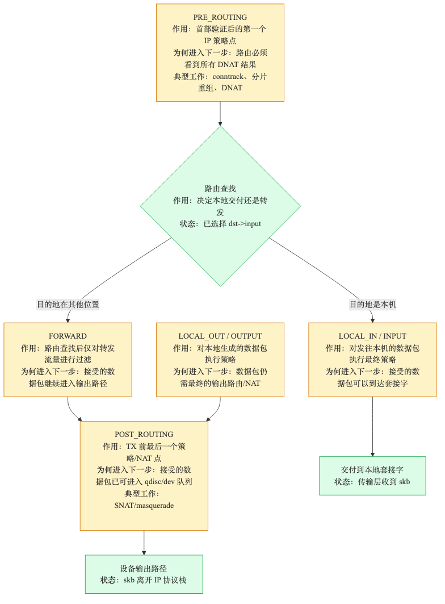
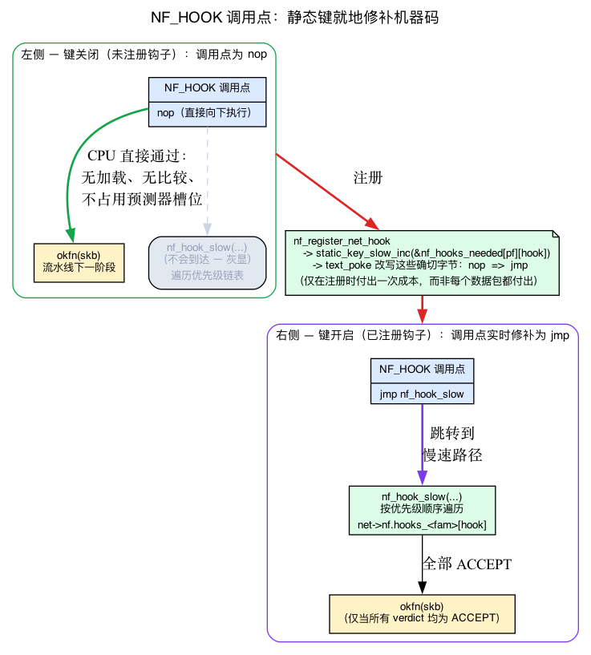
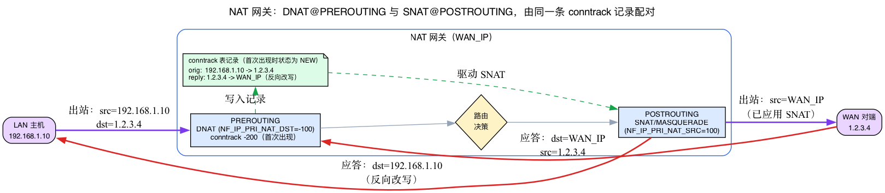
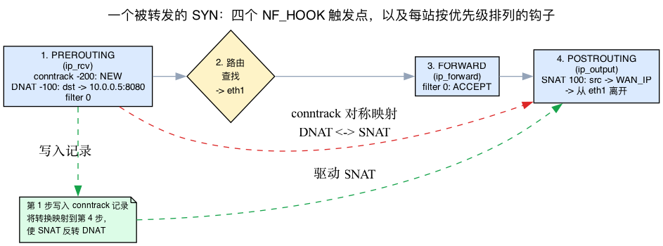

# 第20天 — Netfilter 钩子

> **今日任务：** 准确了解 `iptables`/`nftables` 在网络协议栈中的运行位置、将规则决策转化为数据包操作的裁决流水线，以及实现命名空间隔离的逐协议、逐 netns 钩子表。同时学习本章依赖的两套基础机制：*静态键*（为什么空闲防火墙确实没有每包开销）和 *NAT*（DNAT、SNAT 与 masquerade 实际改写什么，以及为什么必须由 conntrack 将正反向转换配对）。总用时：约 110 分钟。

> **第 4 阶段从这里开始。**第20–26天介绍内核网络子系统：netfilter、nftables、conntrack、流量控制、`SO_REUSEPORT`、kTLS、MPTCP。

## Netfilter 是什么

Netfilter 是内核中的一套框架，用于在网络协议栈中明确定义的位置**检查、修改和丢弃数据包**。iptables、nftables、conntrack、IPVS、ebtables 和 arptables 都挂接在这套框架上。理解钩子的布局，也就理解了每条防火墙或 NAT 规则实际在*何处*运行。

这套框架有意保持精简：它只提供一组钩子点、一个注册 API 和一条裁决流水线。具体的过滤逻辑——如何匹配规则、如何决定操作——由使用这些钩子的子系统（`nf_tables`、`ip_tables`、`nf_conntrack`）实现。

第2天已经见过一次 netfilter：`ip_rcv` 在路由之前的末尾调用 `NF_HOOK(NFPROTO_IPV4, NF_INET_PRE_ROUTING, ...)`。今天就来展开这个宏。

## 五个钩子（每协议族）



对于 IPv4（`NFPROTO_IPV4`），定义位于 `include/uapi/linux/netfilter.h:42`：

```c
enum nf_inet_hooks {
    NF_INET_PRE_ROUTING,    // 0 — after IP header validation, before routing decision
    NF_INET_LOCAL_IN,       // 1 — packets routed to local sockets
    NF_INET_FORWARD,        // 2 — packets being routed through us
    NF_INET_LOCAL_OUT,      // 3 — packets we're generating
    NF_INET_POST_ROUTING,   // 4 — just before TX
    NF_INET_NUMHOOKS
};
```

（真实枚举末尾还带有 `NF_INET_INGRESS = NF_INET_NUMHOOKS`（值 5）——一个特殊用途的 inet 入站钩子；上面五项是本章关注的传统钩子。）

五个钩子位于**路由决策周围**——两个在它之前，紧随其后的 FORWARD/LOCAL_IN 分支，以及之后的 POSTROUTING。这并非随意安排；下面的 NAT 入门会说明布局*为什么*被迫采用这种确切形态。

### 各钩子的触发位置

- **PRE_ROUTING** 在 `ip_rcv`（`net/ipv4/ip_input.c`）中运行，紧接 `ip_rcv_core` 验证头部之后、路由决策*之前*（这就是第2天末尾看到的 `NF_HOOK`，位于 `ip_rcv` 中）。这里执行 **DNAT**（目标 NAT——改变数据包去向），因为路由决策使用改写后的目标地址。

- **LOCAL_IN** 在路由决策确定数据包发往本机后，于 `ip_local_deliver` 中运行。这是交付到套接字前最后的丢弃机会。对应 iptables 的 `INPUT` 链（*链* = 工具在一个钩子上挂载的有序规则列表；第21天会完整介绍）。

- **FORWARD** 在路由确定数据包*不*发往本机后，于 `ip_forward` 中运行。对应 iptables 的 `FORWARD` 链。它是仅用于中转的过滤点，但转发数据包也已在路由查找前通过 PREROUTING，并会在 TX 前通过 POSTROUTING。

- **LOCAL_OUT** 对本机生成的数据包在 `__ip_local_out` 中运行，紧接 IP 头构建之后。注意：触发时**初始路由查找已经完成**（`ip_route_output_flow` 先于 `ip_local_out`，因此 `skb_dst` 已设置）。如果这里的 NAT 规则改变目标地址，原始路由将不再适用，必须重新路由数据包（`ip_route_me_harder`，`net/ipv4/netfilter.c:22`）。

- **POST_ROUTING** 在所有路由决策之后、交给设备之前，于 `ip_output` 中运行。这里执行 **SNAT**（源 NAT，包括 masquerading），因为新的源 IP 不会改变数据包此后去往哪里。

这五个触发位置与第2天（RX）和第8天（路由）走过的位置相同；这里直接依赖该路由决策，而不重复讲授。

### IPv6 有对应钩子

同一个枚举、同样五个钩子，全部使用 `NFPROTO_IPV6`。另外还有 `NFPROTO_BRIDGE`（独立的一组：用于桥接帧的 PREROUTING、LOCAL_IN、FORWARD、LOCAL_OUT、POSTROUTING）和 `NFPROTO_ARP`（用于 ARP 数据包的 3 个钩子）。

## 每 netns、每优先级的钩子列表

每个 `(net, protocol_family, hook_id)` 三元组都有一份独立的已注册回调列表。回想第5天介绍的网络命名空间 `struct net`：这些列表保存在 `net->nf.hooks_ipv4[NF_INET_NUMHOOKS]`（`include/net/netns/netfilter.h:22`；通过 `net->nf` 访问，该字段位于 `include/net/net_namespace.h:149`）、`net->nf.hooks_ipv6[]` 等位置。注册钩子，就是按给定优先级把回调加入相应列表。（这里不再重复介绍 netns；第5天已经详细讲过。只需记住，每个命名空间都拥有彼此独立的钩子表。）

优先级决定顺序。`enum nf_ip_hook_priorities`（`include/uapi/linux/netfilter_ipv4.h`）中的常量如下：

```c
NF_IP_PRI_CONNTRACK_DEFRAG = -400,    // conntrack defrag (earliest)
NF_IP_PRI_RAW              = -300,    // raw table
NF_IP_PRI_CONNTRACK        = -200,    // conntrack itself
NF_IP_PRI_MANGLE           = -150,    // mangle table
NF_IP_PRI_NAT_DST          = -100,    // dnat
NF_IP_PRI_FILTER           =    0,    // filter table
NF_IP_PRI_NAT_SRC          =  100,    // snat
NF_IP_PRI_LAST             =  INT_MAX,
```

数字越小越先运行。因此在 PRE_ROUTING，conntrack 先于 NAT 运行，NAT 又先于用户过滤规则——优先级就是这样排序的。请记住 `NF_IP_PRI_NAT_DST = -100` 和 `NF_IP_PRI_NAT_SRC = 100`；NAT 入门会解释为什么 DNAT 位于过滤规则*之前*，SNAT 位于*之后*。

## 背景：静态键——空闲钩子如何真正做到零开销

本章的核心主张是“空闲机器上的 netfilter 没有可测量的每包开销”。“钩子如何调用”中会再次称其为“零开销”，“内核阅读指南”中也会称为“未使用时零成本机制”。但这个主张依赖于本章尚未点名的一种机制：**静态键**（又称*跳转标签*）。下面把它具体化，否则零成本的说法就只是含糊其辞。

### 普通 `if` 的问题

让功能变为可选的显然方式是使用全局标志：

```c
if (netfilter_enabled)
    nf_hook_slow(...);   // slow path
okfn(skb);               // next pipeline stage
```

这个 `if` 很*便宜*，但并非*免费*。每个数据包——而 RX 路径是内核中最热的代码——都必须**从内存加载 `netfilter_enabled`、比较它，并让分支预测器猜测**。在没有防火墙规则的空闲机器上，这纯属浪费：每秒数百万次支付一次加载和分支，只为发现“没有，仍然禁用”。更糟糕的是，它占用了内核最热路径中的分支预测器槽位。

### 技巧：修补机器码，而非检测变量

**静态键**是一种可在运行时切换的分支，其禁用时成本*确实为零*，因为内核会**修补分支位置的机器码**，而非测试变量。思路如下：

- 键**关闭**时，分支位置包含 `nop`（或直接越过慢速路径的无条件跳转）。CPU 顺畅通过——没有加载、比较或预测器压力。
- 某些操作把键**打开**时，内核会**原地改写这些确切字节**（通过 `text_poke` 代码修补原语），使其变成跳入慢速路径的真实跳转。

因此，这项判断的成本只在**注册时支付一次**，而不会落到每个数据包上；相关开销被完全移出数据路径。这是内核实现“通常关闭，且关闭时必须免费”功能的标准惯用法。跟踪点也采用同一机制；顺带回顾，第12天见过的 UDP 隧道 `encap_rcv` 分流同样如此（`static_branch_unlikely(&udp_encap_needed_key)`，`net/ipv4/udp.c:2364`）。第12天已经*使用*了静态分支，但没有解释其原理；本章现在把这部分补全。

相关原语位于 `include/linux/jump_label.h`——`static_key_false()`、`DEFINE_STATIC_KEY_TRUE/FALSE`（约第 19–24 行）——整个优化由 `CONFIG_JUMP_LABEL` 控制。没有该配置时，代码会退回普通的变量 `if` 分支。

### netfilter 如何使用静态键

Netfilter 为**每个（协议族，钩子）对**维护一个静态键：

```c
/* include/linux/netfilter.h:212 */
extern struct static_key nf_hooks_needed[NFPROTO_NUMPROTO][NF_MAX_HOOKS];
```

`nf_hook()` 顶部的防护（`include/linux/netfilter.h:227`，第 235–240 行快速退出）如下：

```c
#ifdef CONFIG_JUMP_LABEL
    if (__builtin_constant_p(pf) &&
        __builtin_constant_p(hook) &&
        !static_key_false(&nf_hooks_needed[pf][hook]))
        return 1;          // "1" == ACCEPT: just run okfn, no hook walk
#endif
```

这里有两个细节：

1. **为什么使用 `__builtin_constant_p`？**编译器只能为每个 `(family, hook)` 发出一个可修补位置，前提是 `pf` 和 `hook` 是*编译期常量*。这正是每个调用者都传入 `NFPROTO_IPV4, NF_INET_PRE_ROUTING` 这样的字面量而非变量的原因——使编译器固化一个可修补的 `nf_hooks_needed[NFPROTO_IPV4][NF_INET_PRE_ROUTING]` 位置。

2. **谁来翻转它？**注册过程。`__nf_register_net_hook` 调用包装器 `nf_static_key_inc()`（`net/netfilter/core.c:447`），后者执行 `static_key_slow_inc(&nf_hooks_needed[pf][hooknum])`，位于 `:370`；注销则经过 `nf_static_key_dec()`（`:508` → `static_key_slow_dec`，位于 `:385`）。因此，在给定 `(family, hook)` 上注册的*第一个*钩子会把该位置从 `nop` 修补为进入 `nf_hook_slow` 的实时跳转；*最后一个*钩子离开时又修补回原状。（一个细节：对于 `NFPROTO_INET` + `NF_INET_INGRESS`，包装器会先把键重映射到 `nf_hooks_needed[NFPROTO_NETDEV][NF_NETDEV_INGRESS]`，然后再递增。）

收益如下：**没有**注册任何钩子时，`nf_hooks_needed[pf][hook]` 关闭，`NF_HOOK` 位置是 `nop`，无需任何额外操作即可到达下一流水线阶段 `okfn(skb)`——**完全不会调用 `nf_hook_slow`**。注册一个钩子，内核就实时修补单个 `(pf, hook)` 位置。这就是“没有钩子时零开销”的具体含义。



## 钩子如何调用

内核使用宏 `NF_HOOK(pf, hook, net, sk, skb, indev, outdev, okfn)`。结合刚学过的静态键：如果没有注册钩子（`nf_hooks_needed[pf][hook]` 键关闭），被修补掉的位置会直接内联 `okfn(...)`——零开销。如果存在钩子，键已打开，该宏会调用 `nf_hook_slow`（`net/netfilter/core.c:612`）：

1. 按优先级顺序遍历 `net->nf.hooks_<family>[hook]` 中的注册列表。
2. 使用 `nf_hook_state`（上下文）和 skb 调用每个钩子函数。
3. 每个钩子返回一个*裁决*。
4. 如果全部返回 ACCEPT，则调用 `okfn(skb)`——流水线中的下一阶段。

## 裁决

```c
#define NF_DROP        0   // free skb, stop
#define NF_ACCEPT      1   // proceed
#define NF_STOLEN      2   // hook took ownership; don't free
#define NF_QUEUE       3   // queue to userspace via NFQUEUE
#define NF_REPEAT      4   // re-run from the start of this hook
#define NF_STOP        5   // accept, but don't continue to the next hook (rare)
```

- **`NF_ACCEPT`** 是常见路径：继续到下一个钩子，然后到 `okfn`。
- **`NF_DROP`** 结束旅程；skb 被释放（如果使用 `kfree_skb_reason`，还会带有丢弃原因——回想第1天的 `enum skb_drop_reason`）。
- **`NF_STOLEN`** 用于取得所有权并将在之后释放或转发 skb 的钩子（IPVS、conntrack 碎片整理使用它）。
- **`NF_QUEUE`** 通过 NFQUEUE 协议（`libnetfilter_queue`）把 skb 发送给用户空间进程。用户空间通过 netlink 返回裁决。
- **`NF_REPEAT`** 重新运行同一钩子（某些规则引擎会在状态变化后用它重新求值）。
- **`NF_STOP`** 为兼容性保留在 UAPI 中，但已弃用；应把它视作历史遗留，新代码不应返回它。

裁决还可以打包附加数据——对于 `NF_QUEUE` 是队列编号；对于 `NF_DROP` 是 errno。返回值高位携带这些内容：`NF_VERDICT_MASK = 0x000000ff` 提取裁决（`nf_hook_slow` 的 `verdict & NF_VERDICT_MASK` 使用它），而 `NF_VERDICT_QMASK = 0xffff0000` 在高 16 位保存队列编号 / errno。辅助宏 `NF_QUEUE_NR(x)` 和 `NF_DROP_ERR(x)` 打包这些高位；`NF_DROP_GETERR()` 解包 errno。

## 谁注册了什么

可以通过以下命令查看一个 netns 中的所有钩子：

```bash
sudo nft list hooks
```

（需要较新的 nftables。）输出如下：

```
family ip {
    hook prerouting {
        -0000000400 ipv4_conntrack_defrag [nf_defrag_ipv4]
        -0000000200 ipv4_conntrack_in [nf_conntrack]
        -0000000100 nf_nat_ipv4_pre_routing [nf_nat]
         ...
    }
    hook input {
         ...
    }
}
```

每行依次为：优先级、函数名、所属模块。通常会看到 conntrack 位于较低优先级，过滤链位于 0，SNAT/DNAT 位于约 ±100。

## 背景：NAT——DNAT、SNAT 与 masquerade 实际做什么

下面的具体路径跟踪*完全*由 NAT 驱动，而其结论——“SNAT 镜像 DNAT，使回复流量对称返回”——建立在理解地址改写和对称回复问题的基础上。此前章节尚未真正介绍 NAT，第5天只是顺带提到。因此，在分析这条路径之前，先补充必要的基础知识。

### 核心思想：在边界处改写地址

**NAT（网络地址转换）** = 数据包穿过机器时改写其源或目标 IP/端口，使一台机器可以用*不同于自身*的地址与外部世界通信。经典场景是家庭/办公室 LAN 中的 `192.168.1.0/24` 机器都没有公共 IP，却都通过一个网关的单一公共 WAN 地址访问互联网。

它有两个方向，名称直接说明改写哪个字段：

- **DNAT（目标 NAT）** 改写数据包**要去往**的位置——目标 IP/端口。用于端口转发：“发往我的 WAN IP:80 的流量实际应该去内部 Web 服务器 `10.0.0.5:8080`。”
- **SNAT（源 NAT）** 改写数据包看起来**来自**的位置——源 IP/端口。用于使 LAN 机器的数据包看起来来自网关的 WAN IP。
- **Masquerade** 就是新源 IP **自动选择为出站接口当前地址**的 SNAT——适用于 WAN IP 动态变化（DHCP/PPP）的网关，无需硬编码地址。

### 为什么钩子位置是必然的，而非随意的

理解这一点，五个钩子的布局就清楚了。DNAT 与 SNAT 的位置由*路由决策决定*，并非为了方便而随意选择：

- **DNAT 必须在 PREROUTING 运行**——位于路由*之前*。随后的路由决策读取**目标**地址，以决定数据包去向。如果在路由*之后*改写目标，数据包已经走向错误位置。因此 DNAT 必须先在 PREROUTING 执行（优先级 `NF_IP_PRI_NAT_DST = -100`，位于优先级 0 的过滤规则之前）。

- **SNAT 必须在 POSTROUTING 运行**——位于路由*之后*。POSTROUTING 触发时，路由已经完成，**源**地址不再影响数据包去向。因此只有在最后才改写源地址是安全且正确的（优先级 `NF_IP_PRI_NAT_SRC = 100`，位于过滤规则之后）。

内核用自己的话说明了这条规则（`net/netfilter/nf_nat_core.c:682–684`）：

```c
/* ... For NF_INET_POST_ROUTING, we change the source to map into the
 * range. For NF_INET_PRE_ROUTING and NF_INET_LOCAL_OUT, we change the
 * destination ... */
```

而源与目标的选择恰好取决于该钩子。`nf_nat_inet_fn` 根据钩子编号计算 manip 类型（`net/netfilter/nf_nat_core.c:905`）：

```c
/* maniptype == SRC for postrouting. */
enum nf_nat_manip_type maniptype = HOOK2MANIP(state->hook);
```

`HOOK2MANIP` 在 `include/net/netfilter/nf_nat.h:19` 中定义为 `((hooknum) != NF_INET_POST_ROUTING && (hooknum) != NF_INET_LOCAL_IN)`——其注释为 *“SRC manip 发生在 POST_ROUTING 或 LOCAL_IN”*。因此 SNAT（SRC manip）发生在 POSTROUTING *或* LOCAL_IN，其他所有情况都是 DST manip。

*这就是路由决策周围存在五个钩子而非一个钩子的具体原因。*路由决策位于中间，DNAT 必须在其上游，SNAT 必须在其下游。

### 为什么 NAT 必须使用 conntrack

下面来看对称回复问题。假设网关把出站数据包 `192.168.1.10 → 1.2.3.4` 改写为 `WAN_IP → 1.2.3.4`（SNAT）。回复会发往 `WAN_IP`——因为远端只看到过该地址。网关**必须知道要把该回复改写回 `192.168.1.10`**，否则 LAN 机器永远收不到答复。

它如何记住？第一次看到连接（状态为 `NEW`）时，它在 **conntrack 表**中记录该流，并对该流的每个回复数据包应用**逆向改写**。因此：

- NAT 规则写起来仿佛只作用于单个数据包，但实际控制**整个连接**——规则在第一个数据包上触发，conntrack 把转换镜像到其余所有数据包。
- Conntrack 在两个**“初见”**钩子 **PREROUTING 和 LOCAL_OUT** 上进行 NEW 流查找（优先级 `NF_IP_PRI_CONNTRACK` = -200，即位于 NAT 的 -100 *之前*），因此会在 NAT 之前看到每个新流。可以在 `ipv4_conntrack_ops[]`（`net/netfilter/nf_conntrack_proto.c:233`）中看到它植入 PREROUTING：`.hooknum = NF_INET_PRE_ROUTING`、`.priority = NF_IP_PRI_CONNTRACK`。同一个数组还在 POSTROUTING/LOCAL_IN 注册*确认*钩子（`:245`/`:251`，优先级 `NF_IP_PRI_CONNTRACK_CONFIRM`）以提交条目——第22天会完整介绍。

> **这是一个前向依赖。**Conntrack 会在**第22天**用整章完整讲解——包括表结构、状态和超时。这里恰好只需知道一个事实：*conntrack 记录一次每个流，并把转换镜像到回复上。*今天不要深入查找 conntrack 内部实现。



## 一次具体跟踪

现在来看实际效果。对于通过 NAT 设备转发到端口 80 的 TCP SYN——请结合上面的入门内容阅读：

1. 调用 **`ip_rcv`**。它调用 `NF_HOOK(NFPROTO_IPV4, NF_INET_PRE_ROUTING, ...)`。
   - `nf_conntrack_in`（优先级 -200）：创建或查找 conntrack 条目。状态 = NEW。（这就是让第 4 步能够镜像转换的“初见”。）
   - `nf_nat_ipv4_pre_routing`（优先级 -100）：如果存在 DNAT 规则则应用。可能把 dst 从 `1.2.3.4:80` 改写为 `10.0.0.5:8080`。（DNAT 位于路由*之前*，完全符合入门内容的要求。）
   - 优先级 0 的用户过滤器（例如 `nft add rule ip filter prerouting accept`）。
   - 全部 ACCEPT → `okfn = ip_rcv_finish`。
2. **`ip_rcv_finish`** 使用（现在可能已经改写的）目标进行路由查找。决定该数据包发往 `10.0.0.5`，并通过 `eth1`。
3. 调用 **`ip_forward`**（因为数据包发往其他机器）。`NF_HOOK(NFPROTO_IPV4, NF_INET_FORWARD, ...)`。
   - 优先级 0 的用户过滤器（例如 `iptables -A FORWARD -j ACCEPT`）。
4. **`ip_output`** → `NF_HOOK(NFPROTO_IPV4, NF_INET_POST_ROUTING, ...)`。
   - `nf_nat_ipv4_out`（优先级 100）：如果 NAT 规则匹配，则应用 SNAT/MASQUERADE。可能把 src 从 `192.168.1.10` 改写为网关 WAN IP。（SNAT 位于路由*之后*，同样符合要求。）
   - 全部 ACCEPT → 数据包从 `eth1` 离开。

第 1 步 PREROUTING 中创建的 conntrack 条目将第 1 步与第 4 步相连：第 4 步的 SNAT 镜像第 1 步的 DNAT，使回复流量对称返回。（回复到达时，其 PREROUTING 上的 conntrack 会识别该流并应用逆向改写——即 NAT 图中的对称路径。）



## 常见疑问

> **问：如果静态键把禁用钩子变成 `nop`，它与分支预测器每次都“预测不跳转”有何区别？**
>
> 答：预测仍然是*工作*：CPU 会获取标志、发出比较并占用预测器槽位——误预测（虽然少见，但有可能）还会导致流水线刷新。被静态键修补掉的位置**根本没有分支指令**可供预测；字节是 `nop` 或直接通过。没有内容要加载，没有可能误预测，也不会在内核最热路径上产生预测器压力。这就是 netfilter 选择静态键而非全局标志的全部原因。

> **问：我添加了一条 `nft` 规则。是否刚刚拖慢了*每个*钩子？**
>
> 答：不是——只有规则所挂接的那个 `(family, hook)` 位置。`static_key_slow_inc` 只翻转该钩子的 `nf_hooks_needed[pf][hooknum]`（例如只翻转 `LOCAL_IN`，对应一条 `input` 链）。另外四个钩子仍是被修补掉的 `nop`。每钩子独立键正是只有 `input` 过滤器的机器无需在 PREROUTING/FORWARD/POSTROUTING 支付任何代价的原因。

> **问：为什么 NAT 需要 conntrack，而普通 `drop` 规则不需要？**
>
> 答：`drop` 决策是**无状态**的——查看一个数据包并执行操作。NAT 是**有状态**的：它改写出站数据包，还必须对尚未见过的回复应用*逆向*改写。唯一办法就是记住该流。Conntrack 就是这种记忆（第22天完整介绍）。这也解释了为什么 conntrack 注册在更低优先级（-200）——它必须在 NAT（-100）改写之前记录该流。

> **问：SNAT 与 masquerade 到底有什么区别？**
>
> 答：机制上是相同的改写（源地址），但 SNAT 使用你指定的**固定**地址，而 masquerade 在处理数据包时**自动选择出站接口的当前 IP**。WAN IP 静态时使用 SNAT（略微便宜，无需每包接口查找）；动态时（DHCP/PPP）使用 masquerade，避免硬编码可能变化的地址。

## 今日实验

```bash
# See registered hooks (modern nft only)
sudo nft list hooks ip

# Old way: per-table inspection
sudo iptables -L -n -v
sudo nft list ruleset

# Trace which hook fires when
sudo bpftrace -e 'fentry:nf_hook_slow {
  printf("hook %d pf %d\n", args->state->hook, args->state->pf);
}' &
sleep 2            # let the fentry probe finish attaching (compile+load+attach takes ~1-2s)
ping -c 3 8.8.8.8
sleep 1            # let the last packet's events flush
sudo killall bpftrace
```

（`fentry:nf_hook_slow` 之所以会触发，是因为机器上确实为某个钩子注册了内容——该钩子的静态键已经打开。在真正没有钩子的 `(family, hook)` 上，该位置为 `nop`，永远不会进入 `nf_hook_slow`，因此探针会保持沉默。）

输出是原始整数，每经过一个钩子就有一行——使用上面的枚举解码（`hook` 是 `nf_hook_state.hook`，`pf` 是 `nf_hook_state.pf`；结构体位于 `include/linux/netfilter.h:78`）：

```
hook 3 pf 2     # LOCAL_OUT,   AF_INET — the outgoing echo request
hook 4 pf 2     # POSTROUTING — just before TX
hook 0 pf 2     # PREROUTING  — the echo reply arrives
hook 1 pf 2     # LOCAL_IN    — delivered to our socket
```

因此 `hook` 解码为 `0=PREROUTING, 1=LOCAL_IN, 2=FORWARD, 3=LOCAL_OUT, 4=POSTROUTING`，`pf 2 = AF_INET`（IPv4；`pf 10 = AF_INET6`）。在 ICMP 交换中，出站时会看到 LOCAL_OUT（3）和 POSTROUTING（4），回复时则看到 PREROUTING（0）和 LOCAL_IN（1）。

### 通过 nft 添加自己的钩子

```bash
sudo nft add table inet test
sudo nft 'add chain inet test myinput { type filter hook input priority 0 ; policy accept ; }'
sudo nft add rule inet test myinput meta nftrace set 1
# Now any packet going through input gets nftrace logged
sudo nft monitor trace &
ping -c 1 8.8.8.8
sudo pkill -f 'nft monitor'   # stop the backgrounded monitor once you've seen the trace
```

可以看到每条规则的求值及其裁决。

### 丢弃特定端口并观察效果

```bash
sudo nft add rule inet test myinput tcp dport 12345 drop
nc -w 2 localhost 12345    # HANGS, then times out after ~2s — DROP silently blackholes the SYN (no RST/ICMP)
nc -w 2 localhost 22       # connects (different port, not matched by the rule)

# Contrast drop with reject: reject *replies* (RST/ICMP) instead of blackholing.
sudo nft add rule inet test myinput tcp dport 12346 reject
nc -w 2 localhost 12346    # instant 'Connection refused' — reject sends an RST, unlike drop

# Cleanup
sudo nft delete table inet test
```

## 内核阅读指南

- **`net/netfilter/core.c:612`**——`nf_hook_slow`。分派器。请完整阅读（约 33 行）。注意它如何遍历每钩子列表、分派每个钩子并处理每种裁决。其 `switch` 只处理 `NF_ACCEPT`/`NF_DROP`/`NF_QUEUE`/`NF_STOLEN`；其他任何值（包括 `NF_REPEAT`/`NF_STOP`）都会落入 `default: WARN_ON_ONCE(1)`。因此如果在这里寻找 `NF_REPEAT` 处理，将一无所获——repeat 在*使用者*内部实现（例如 conntrack 返回 `-NF_REPEAT` 来重新运行自身），而非在分派器中。

- **`net/netfilter/core.c:550`**——`nf_register_net_hook`。注册函数。模块（nftables、conntrack、IPVS）如何植入钩子回调。注意按优先级插入（有序插入）——以及 `static_key_slow_inc(&nf_hooks_needed[pf][hooknum])` 在 `:370` 如何打开每钩子静态键，实时修补 `NF_HOOK` 位置。

- **`include/linux/netfilter.h`**——`NF_HOOK` 宏及相关内容，以及 `nf_hook()`（第 227 行）中第 235–240 行的静态键快速退出，还有 `nf_hooks_needed[][]` 键数组（第 212 行）。`NF_HOOK` 以 `nf_hooks_needed[pf][hook]` 静态键为条件；没有钩子时，它会完全跳过调用。这就是未使用时零成本机制。

- **`include/linux/jump_label.h`**——静态键/跳转标签 API 本身：`static_key_false()`、`DEFINE_STATIC_KEY_TRUE/FALSE`（约第 19–24 行）。“关闭时零成本”背后的代码修补原语。阅读顶部的大段注释——其中解释了修补分支模型。

- **`include/uapi/linux/netfilter.h`**——裁决、钩子 ID 和 `enum nf_inet_hooks`。词汇定义文件。

- **`net/netfilter/nf_nat_core.c`**——NAT 转换。`:682` 的注释说明 PREROUTING 上 DNAT / POSTROUTING 上 SNAT 的规则；`nf_nat_inet_fn` 通过 `HOOK2MANIP(state->hook)` 选择 SRC 或 DST manip，该调用位于 `:905`（宏位于 `include/net/netfilter/nf_nat.h:19`）。Conntrack 镜像这些转换（第22天）。

- **`net/ipv4/netfilter.c:22`**——`ip_route_me_harder`，LOCAL_OUT DNAT 改变本机生成数据包的目标后重新路由。

- **`net/ipv4/netfilter/ip_tables.c`**——旧式 iptables 后端。阅读顶部，了解如何查询 `xt_table_info`（规则存储）；规则为线性结构，每个数据包都从上到下遍历。与 nftables（下一天）比较，后者通过 `nft_do_chain` 对紧凑表达式序列求值。

- **`net/netfilter/nf_tables_core.c`**——现代 nftables 运行时。表达式解释器。请在明天介绍 nftables *之后*阅读。

- **`net/netfilter/nf_conntrack_core.c`**——conntrack 在 PRE_ROUTING 和 LOCAL_OUT（两个“初见”钩子，优先级 -200）执行 NEW 流查找，并在 POSTROUTING/LOCAL_IN 注册独立确认钩子；参见 `ipv4_conntrack_ops[]`，位于 `nf_conntrack_proto.c:233`。第22天会介绍。

- **`Documentation/networking/netfilter-sysctl.rst`**——netfilter sysctl 开关（最接近树内 netfilter 文档的文件；没有钩子图文本文件）。另见 `nf_conntrack-sysctl.rst` 和 `nf_flowtable.rst`。

- **外部资料：**请参阅 https://wiki.nftables.org 上的 **nftables wiki**，其中有各钩子触发位置的清晰图示。

## 要点回顾

- **五个 IPv4 钩子**：PRE_ROUTING、LOCAL_IN、FORWARD、LOCAL_OUT、POST_ROUTING——位于路由决策*周围*。IPv6 使用相同五个钩子。
- **PREROUTING** = 路由之前（在这里执行 DNAT，因为路由读取 dst）；**POSTROUTING** = 路由之后（在这里执行 SNAT，因为 src 不再影响路由）。位置由路由决策*强制决定*，并非随意安排。
- **NAT** 在边界处改写地址：**DNAT** 改变目标，**SNAT** 改变源，**masquerade** 是从出站接口自动选择源地址的 SNAT。NAT 是*有状态*的——**conntrack** 记录一次每个流（在 PREROUTING/LOCAL_OUT“初见”钩子），并把逆向改写镜像到回复上（第22天完整介绍）。
- **静态键**（跳转标签）使禁用钩子的成本*确实为零*：内核把调用位置修补为 `nop`，只有注册钩子时才把它改写为真实跳转（`static_key_slow_inc`）。**每个（协议族，钩子）**一个键——`nf_hooks_needed[pf][hook]`。这就是空闲机器上 `NF_HOOK` 免费的原因；与第12天的 `udp_encap_needed_key` 机制相同。
- 每个钩子都有按优先级排序、每 netns 独立的回调列表（`net->nf.hooks_ipv4[]`，回想第5天的 `struct net`）。
- 裁决：**ACCEPT、DROP、STOLEN、QUEUE、REPEAT**；**STOP** 是已弃用的 UAPI 兼容项。
- `nf_hook_slow` 是分派器；没有注册钩子时，`NF_HOOK` 会修补为零开销。
- iptables、nftables、conntrack、IPVS——**全部**以不同优先级插入同一钩子系统。
- 使用 `nft list hooks`（现代方式）或 `iptables -L -v`（旧式方式）检查。

## 检查问题

编写 `iptables -A INPUT ...` 时，规则实际挂载到哪个内核钩子，优先级是多少？

<details>
<summary>点击查看答案</summary>

**答案：** **`NF_INET_LOCAL_IN`**，优先级 **0**（`NF_IP_PRI_FILTER`）。iptables/nftables 中的 `INPUT` 链与 `LOCAL_IN` 一一对应——它就是路由确定数据包发往本地套接字后触发的内核钩子。优先级 `NF_IP_PRI_FILTER = 0` 使用户过滤规则位于 conntrack（`NF_IP_PRI_CONNTRACK = -200`）*之后*，但位于数值更高的优先级*之前*。其他 iptables 链也采用类似映射：`OUTPUT` → `LOCAL_OUT`，`FORWARD` → `FORWARD`，`PREROUTING` → `PRE_ROUTING`，`POSTROUTING` → `POST_ROUTING`。这些名称几乎与内核钩子 ID 完全一致，因为 iptables 的设计目标*就是*把它们暴露给用户。

</details>

---

## 明天

第21天：nftables 与 iptables。为什么 nftables 存在、它改进了什么，以及如何转换旧式 iptables 规则。
