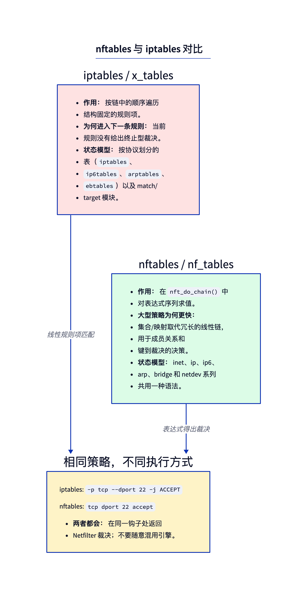
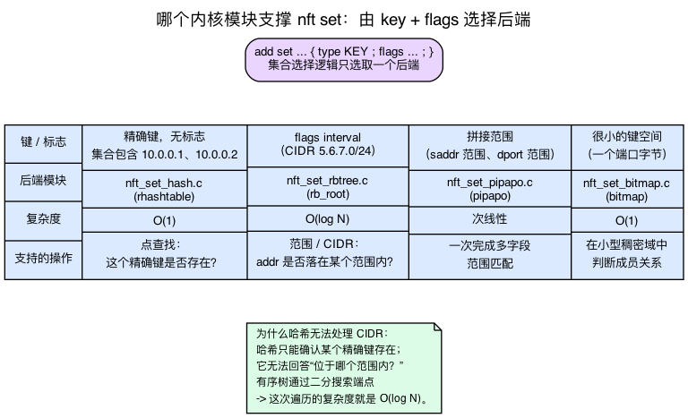
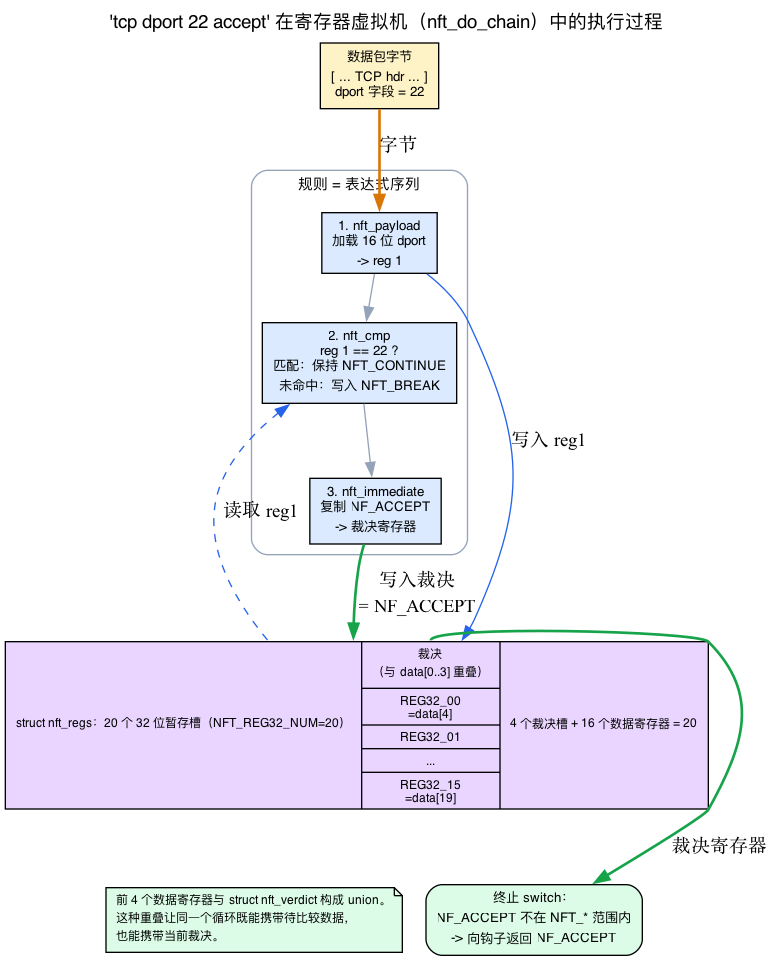
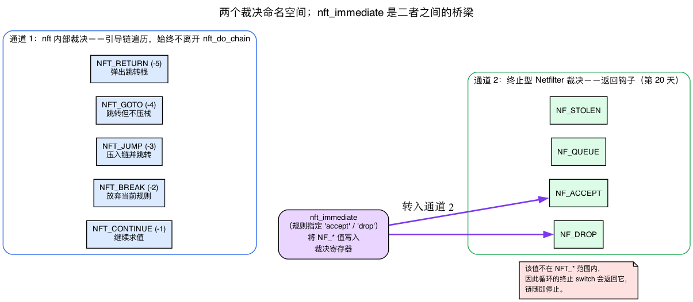
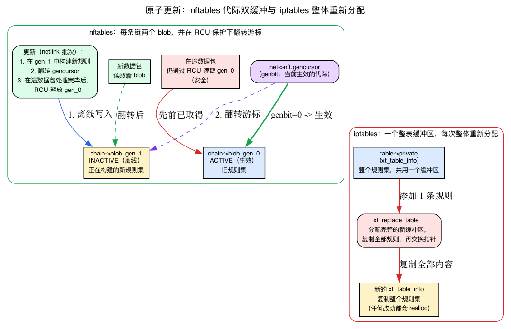

# 第21天 — nftables 与 iptables

> **今日任务：** 理解为什么 nftables 存在，编写一个能完成多项有用功能的真实规则集，并理解相同的钩子如何暴露两个完全不同的规则引擎——包括基于寄存器的微型虚拟机、两个判决命名空间、三种集合后端，以及使这些主要特性得以实现的生成双缓冲机制。总时间：约 110 分钟。



## 同一理念的两个时代

iptables 和 nftables 都接入了相同的 Netfilter 框架（第20天）。它们在 *规则的存储、匹配和执行方式* 上有所不同——这在语法、性能和功能范围方面产生了连锁反应。

### iptables（旧版，2001 年）

- **按协议划分的工具**：`iptables`（IPv4）、`ip6tables`（IPv6）、`arptables`（ARP）、`ebtables`（桥接以太网）。四个并行的二进制文件，具有相似但*不完全相同*的语法。
- **线性匹配**：链中的规则是固定形状条目的数组（`struct ipt_entry` + 匹配 + 目标）。对于每个数据包，内核从上到下遍历数组，评估每个规则的匹配。匹配模块（`xt_*`）是内核模块。
- **实现**：`ipt_do_table`（`net/ipv4/netfilter/ip_tables.c:223`）。所谓“快速路径”，就是一个手工展开的规则条目循环。
- **存储**：`xt_table_info` 数组是大型预分配缓冲区；更新需要分配一个全新的缓冲区并进行原子交换。添加一条规则会重写整个表。

### nftables（现代，自 3.13 / 2014）

- **一个工具**：`nft`。统一的 inet（统一处理 IPv4 和 IPv6）语法，arp、bridge、netdev（按接口处理）。
- **表达式虚拟机**：规则编译为紧凑的表达式序列，由 `nft_do_chain`（`net/netfilter/nf_tables_core.c:250`）运行。每条规则都由一系列 `nft_expr` 操作组成，它们在一小组寄存器上运行；常见表达式有快速路径，但这不是 BPF 风格的 JIT。（我们将在下面详细剖析这个虚拟机——这是“规则编译为表达式”这一想法的核心。）
- **原生集合和映射**：哈希集合、区间/范围集合（红黑树）、拼接范围集合（pipapo）、键→值映射作为一等类型。成员测试是 O(1) 或 O(log N)，而不是 O(N) 的线性遍历。（这三个是*独立的*内核模块——我们将看到内核选择哪一个以及为什么。）
- **原子更新**：更改通过 netlink 事务性应用；添加一条规则不需要重写整个表。（由生成双缓冲 + RCU 支持——见下文。）
- **实现**：`nft_do_chain`（`net/netfilter/nf_tables_core.c:250`）。读取链的表达式列表并逐一执行。

### 性能差异

对于一个简单的“丢弃来自这 100 个 IP 的流量”规则：

- **iptables**：100 条 `-s IP -j DROP` 规则组成的链。每个数据包遍历所有 100 条（直到匹配或结束）。每个数据包 O(N)。
- **nftables**：一条使用精确 IP 集合的规则：`ip saddr @denylist drop`。该集合是哈希表。每个数据包 O(1)，无论大小。

对于 100 个 IP，差异明显；对于 100k 个 IP（例如，一个拒绝列表），iptables 已无法实用，nftables 仍可胜任。O(1) 声称适用于*精确* `/32` 键的集合；一个 CIDR *范围* 的拒绝列表使用区间/红黑树后端，O(log N) —— 见集合后端部分了解为何范围不能是哈希。我们将在本章稍后看到确切的数据结构支持“哈希表”声明。

## 基本 nft 规则集

```bash
# Create an inet table (covers both IPv4 and IPv6)
sudo nft add table inet filter

# Add chains for the standard hook positions, with default policies.
# Run this only in a VM/netns lab: policy drop on host input can lock you out.
sudo nft 'add chain inet filter input   { type filter hook input   priority 0 ; policy drop ; }'
sudo nft 'add chain inet filter forward { type filter hook forward priority 0 ; policy drop ; }'
sudo nft 'add chain inet filter output  { type filter hook output  priority 0 ; policy accept ; }'

# Allow established + related (conntrack — black box today, explained just below / Day 22)
sudo nft add rule inet filter input ct state established,related accept

# Allow loopback
sudo nft add rule inet filter input iif lo accept

# Allow ICMP (so ping works)
sudo nft add rule inet filter input meta l4proto { icmp, icmpv6 } accept

# Allow specific TCP ports
sudo nft add rule inet filter input tcp dport { 22, 80, 443 } accept

# Drop the rest (covered by chain policy 'drop')

# Inspect
sudo nft list ruleset
```

`inet` 家族是特殊的——相同的链匹配 IPv4 和 IPv6 流量，因此你无需重复编写规则。

> **关于 `ct state established,related accept`。** 第一条实质性规则依赖于 **conntrack**，连接跟踪子系统。`ct state` 是一种 *有状态匹配*：它询问 conntrack “我是否见过这个流，处于什么状态？” 你会遇到的状态是 `new`（流的第一个数据包）、`established`（连接跟踪器已跟踪的流）和 `related`（辅助流，如 FTP 数据或与现有连接相关的 ICMP 错误）——内核在 `enum ip_conntrack_info` 中将它们命名为 `IP_CT_NEW`、`IP_CT_ESTABLISHED`、`IP_CT_RELATED`（`include/uapi/linux/netfilter/nf_conntrack_common.h`）中，而 `ct` 表达式的键位于 `enum nft_ct_keys`（`include/uapi/linux/netfilter/nf_tables.h:1159`）。**今天将 conntrack 视为黑盒**——我们明天（第22天）会剖析整个机制。你现在需要知道的是：这条规则让你可以无需为每个流编写匹配的反向规则，就能让回复流量通过。

## 集合和映射

原生数据结构，而非事后补丁。

### 匿名集合内联

```bash
sudo nft add rule inet filter input ip saddr { 10.0.0.1, 10.0.0.2, 10.0.0.3 } accept
```

`{...}` 创建一个匿名哈希集合，仅被此规则使用。

### 命名集合（可从 CLI 修改）

```bash
sudo nft add set inet filter blocked { type ipv4_addr \; flags interval \; }
sudo nft add element inet filter blocked { 1.2.3.4 }
sudo nft add element inet filter blocked { 5.6.7.0/24 }

sudo nft add rule inet filter input ip saddr @blocked drop
```

该集合会持续存在，可在运行时增删元素，规则则通过名称引用它。

### 映射（键 → 值）

```bash
sudo nft add map inet filter port_to_action { type inet_service : verdict \; }
sudo nft add element inet filter port_to_action { 22 : accept, 80 : accept, 443 : accept, 25 : drop }

sudo nft add rule inet filter input tcp dport vmap @port_to_action
```

`vmap`（判决映射）通过查找将匹配值转换为判决。这样便无需再编写一连串 `if dport == X jump Y else...` 规则。

### 区间集合（范围）

```bash
sudo nft add set inet filter trusted_nets { type ipv4_addr \; flags interval \; }
sudo nft add element inet filter trusted_nets { 10.0.0.0/8, 192.168.0.0/16, 172.16.0.0/12 }
```

由区间/范围树支持，而非哈希。查找是 O(log N) 但支持 CIDR。（下一节解释为何不能是哈希。）

### 实际支持集合的：三个内核模块，而非一个

章节中不断提到“哈希集合”、“区间树”、“pipapo”并引用 O(1) / O(log N) —— 但这并非泛泛而谈。它们是**三个独立的内核模块**，当你 `add set ... { type ... ; flags ... ; }` 时，内核根据键类型和标志选择一个。在 devbox 上列出它们：

```
net/netfilter/nft_set_hash.c      # exact-match sets
net/netfilter/nft_set_rbtree.c    # interval / range sets
net/netfilter/nft_set_pipapo.c    # concatenated-range sets
net/netfilter/nft_set_bitmap.c    # small key spaces, ≤ 2 bytes (e.g. a 16-bit port)
```

下面逐一说明：

- **精确匹配集合**（一个普通的 `{ 10.0.0.1, 10.0.0.2 }`，无 `flags interval`）使用 **rhashtable** —— 内核的通用可调整大小哈希表。打开 `nft_set_hash.c` 你会看到 `struct nft_rhash { struct rhashtable ht; ... }`（`net/netfilter/nft_set_hash.c:24-25`），顶部有 `#include <linux/rhashtable.h>`。哈希表只回答一个问题——“这个精确键是否存在？”——在 **O(1)** 时间内。

- **区间集合**（`flags interval`，用于 CIDR 上面）使用 **红黑树**，键为范围端点：`struct nft_rbtree { struct rb_root root; ... }`（`net/netfilter/nft_set_rbtree.c:31`）。这就是 *为何哈希无法完成这项工作*：像 `5.6.7.0/24` 这样的 CIDR 必须匹配一整个**范围**的地址，而非一个精确键。哈希只能确认单个键是否存在；它无法回答“这个地址是否*在*我存储的某个范围内？” 有序结构可以——你对端点进行二分查找。这种有序树遍历正是章节引用的 **O(log N)**，也是为什么 CIDR 成员测试是树遍历而非哈希探测。现在这个简单的复杂度数字有了理由。

- **拼接范围**（同时匹配，例如 *(saddr 范围, dport 范围)*）使用 **pipapo** —— “PIle PAcket POlicies”，其头注释读作 *"PIPAPO: PIle PAcket POlicies: set for arbitrary concatenations of ranges"*（`net/netfilter/nft_set_pipapo.c:3`）。一句话足够了；如果你好奇，该文件的开头注释是树中最好的算法文档之一。

这不过是通用的数据结构常识（有序树 → log-N 范围查找，哈希 → O(1) 点查找）在内核中的具体体现——并不神秘。集合选择逻辑选择后端；你通过选择 `flags` 和键类型来选择*行为*。



## 计数器和配额

```bash
sudo nft add rule inet filter input tcp dport 22 counter accept
# show stats
sudo nft list table inet filter
```

`counter` 累积数据包/字节。内置；无需单独的“计数器表”。

你现在已构建了一个真实的 `inet filter` 表，其 `input` 链包含 `policy drop`，以及几个命名集合和映射。当你完成实验后，用一个事务一次性删除整个规则集，以免留下丢弃策略防火墙（和多余的集合/映射）——这正是检查问题警告的“你忘了另一个规则集正在运行”的陷阱：

```bash
# Removes all chains, rules, named sets, and maps in this table at once
sudo nft delete table inet filter
```

“在一个事务中”并非营销用语。要了解为何在流量中删除整个表是安全的，我们需要理解 nftables 如何使运行时更新原子化——接下来会讲。

## nft_do_chain 的工作原理：一个微型寄存器虚拟机

`nft_do_chain`（`net/netfilter/nf_tables_core.c:250`）是运行时入口。在我们阅读其循环之前，我们需要理解所有东西都依赖的**寄存器文件**这一核心概念。

### 寄存器实际上是什么

想想 CPU 的工作方式：它有少量带名称的临时槽位（寄存器），一条指令写入寄存器，后续指令再从中读取数据。nftables 借用了这个想法的微型版本。**寄存器只是每个数据包临时数组中的一个槽位**。规则中的每个表达式就像一条小指令：它读取一些寄存器，可能写入一个，*下一个*表达式看到前一个留下的内容。这就是整个模型——“规则编译为表达式序列”意味着“规则编译为通过共享寄存器文件传递值的一系列小指令”。

在 v7.1 中，该数组是 `struct nft_regs`（`include/net/netfilter/nf_tables.h:122`）：

```c
#define NFT_REG32_NUM 20            /* include/net/netfilter/nf_tables.h:112 */

struct nft_regs {
    union {
        u32              data[NFT_REG32_NUM];   /* 20 × 32-bit scratch slots */
        struct nft_verdict verdict;             /* aliases the FIRST slots */
    };
};
```

需要注意两点，都至关重要：

1. **临时数组包含 20 个 `u32`，但只有 16 个可寻址的数据寄存器。** `struct nft_regs` 持有 `NFT_REG32_NUM = 20` 个 u32 槽位，但它们*并非* 20 个彼此独立的数据寄存器。前 4 个槽位（`data[0..3]`）与判决寄存器共用存储（见第 2 点），因此剩下 **16 个可寻址的 32 位数据寄存器**：`NFT_REG32_00`..`NFT_REG32_15`。UAPI 明确给出 `NFT_REG32_COUNT == 16`，注释则说明“数据寄存器已改为 16 个大小为 4 字节的寄存器”（`include/uapi/linux/netfilter/nf_tables.h:16-21,30-55`）。所以数据寄存器的正确数量是 16；数组之所以有 20 个槽位，是因为 4 + 16 = 20。
2. **判决寄存器与前几个数据槽位重叠。** 这是一个 `union`：`data[NFT_REG32_NUM]` 与 `struct nft_verdict` 共用同一块存储。内核注释明确说明：“前四个数据寄存器与判决寄存器共用存储”（`include/net/netfilter/nf_tables.h:119-120`）。`struct nft_verdict { u32 code; struct nft_chain *chain; }`（`:100`）占 16 字节，也就是 4 个 u32 槽位，因此覆盖 `data[0..3]`；16 个实际的数据寄存器则位于 `data[4..19]`。**正因为采用这种存储重叠方式，同一个循环才能同时保存待比较的数据和当前判决：**二者位于同一个寄存器文件中，只是采用不同的视图。



### 两种判决 —— 不要混淆

第20天介绍了钩子返回给框架的 **Netfilter 判决**：`NF_ACCEPT`、`NF_DROP`、`NF_QUEUE`、`NF_STOLEN`。nftables 添加了一个**第二个内部判决命名空间**，仅用于引导链遍历——这些从未逃出 `nft_do_chain`（`enum nft_verdicts`、`include/uapi/linux/netfilter/nf_tables.h:68-73`）：

```c
enum nft_verdicts {
    NFT_CONTINUE = -1,   /* keep evaluating */
    NFT_BREAK    = -2,   /* abandon THIS rule, go to the next */
    NFT_JUMP     = -3,   /* push chain, jump to another */
    NFT_GOTO     = -4,   /* jump without pushing */
    NFT_RETURN   = -5,   /* pop the jump stack */
};
```

因此可以把判决分成**两条通道**：

- **内部 nft 判决**（`NFT_CONTINUE/BREAK/JUMP/GOTO/RETURN`）——链流控制，从不返回给钩子。
- **终端 Netfilter 判决**（`NF_ACCEPT/NF_DROP/NF_QUEUE/NF_STOLEN`）——钩子返回给 Netfilter 的值（第20天）。

连接这两条通道的是 `nft_immediate`：当规则说 `accept` 或 `drop` 时，`nft_immediate` 表达式将一个 **Netfilter** 判决写入判决寄存器。因为该值*不在* `NFT_*` 范围内，循环的终端 `switch` 返回它并停止链。



### 真正的循环

了解这两个命名空间后，`nft_do_chain` 的核心循环就很清楚了。这是实际的 v7.1 循环，轻微修剪（`net/netfilter/nf_tables_core.c:273-313`）：

```c
next_rule:
    regs.verdict.code = NFT_CONTINUE;          /* :274 — seed each rule with CONTINUE */
    for (; !rule->is_last ; rule = nft_rule_next(rule)) {
        nft_rule_dp_for_each_expr(expr, last, rule) {
            /* fast-path dispatch for the common expressions ... */
            if (expr->ops == &nft_cmp_fast_ops)
                nft_cmp_fast_eval(expr, &regs);
            else if (expr->ops != &nft_payload_fast_ops ||
                     !nft_payload_fast_eval(expr, &regs, pkt))
                expr_call_ops_eval(expr, &regs, pkt);   /* generic: expr->ops->eval(...) */

            if (regs.verdict.code != NFT_CONTINUE)   /* :287 — an expr changed it */
                break;
        }
        switch (regs.verdict.code) {
        case NFT_BREAK:                          /* :291 — abandon this rule */
            regs.verdict.code = NFT_CONTINUE;
            continue;                            /* ...move to next rule */
        case NFT_CONTINUE:
            continue;
        }
        break;                                   /* anything else: leave the rule loop */
    }

    switch (regs.verdict.code & NF_VERDICT_MASK) {   /* :306 — terminal dispatch */
    case NF_ACCEPT:
    case NF_QUEUE:
    case NF_STOLEN:
        return regs.verdict.code;
    case NF_DROP:
        return NF_DROP_REASON(pkt->skb, SKB_DROP_REASON_NETFILTER_DROP, EPERM);
    }
    /* NFT_JUMP/GOTO/RETURN handled below ... */
```

带着两个命名空间阅读：

- 每条规则都**以 `regs.verdict.code = NFT_CONTINUE`（`:274`）初始化**。如果没有任何表达式触及判决，规则“通过”，评估继续到下一条规则。
- 每个表达式运行；之后，`if (regs.verdict.code != NFT_CONTINUE) break;`（`:287`）在任何写入判决后立即退出*表达式*循环。
- 内部 `switch` 处理**内部**判决：`NFT_BREAK` 重置为 `CONTINUE` 并移动到下一条规则；`NFT_CONTINUE` 同样如此。任何*其他*（跳转/转到/返回，或终端 NF_ 判决）都完全退出规则循环。
- 最终 `switch (regs.verdict.code & NF_VERDICT_MASK)`（`:306`）是**终端**分发：`NF_ACCEPT/NF_QUEUE/NF_STOLEN` 返回给钩子，`NF_DROP` 变成带原因的丢弃。**这是使 `accept` 和 `drop` 成为终端的行。**

**关于顶部的 `if/else` 分支链**：不要被它吓到。`nft_cmp_fast_ops`、`nft_payload_fast_ops` 等只是**内联快速路径**，用于最常见的表达式。回退 `expr_call_ops_eval(expr, &regs, pkt)` 是通用 `expr->ops->eval(expr, regs, pkt)` 调用——简化伪代码显示的确切分发。因此模型“每个表达式都是 `expr->ops->eval(expr, regs, pkt)`”是忠实的；分支链是一种优化，而非不同设计。

### 通过真实循环遍历 `tcp dport 22 accept`

现在主要声明——“规则编译为表达式序列”——变得具体。`tcp dport 22 accept` 编译为三个表达式，每个与一个操作绑定：

1. **`nft_payload`** 从数据包中加载 16 位 TCP 目的端口字段到**数据寄存器**（例如寄存器 1）。（实现见 `nft_payload.c`；快速路径是 `nft_payload_fast_eval`。）
2. **`nft_cmp`** 读取该寄存器并与常量 `22` 比较。在**匹配**时，它将判决留在 `NFT_CONTINUE`（继续到下一个表达式）。在**不匹配**时，它将 `NFT_BREAK` 写入**判决寄存器**——因为 `verdict.code != NFT_CONTINUE`，循环退出此规则并继续，永远不会到达 `accept`。（这就是为什么非端口 22 的数据包干净地跳过此规则。）
3. **`nft_immediate`** 写入终端判决。其评估只有一行：`nft_data_copy(&regs->data[priv->dreg], &priv->data, priv->dlen);`（`net/netfilter/nft_immediate.c:24`，在 `nft_immediate_eval` 中开始于 `:18`）——它将 `NF_ACCEPT` 复制到目标寄存器，而（对于判决）*就是*判决寄存器，因为别名。终端 `switch` 然后返回 `NF_ACCEPT`。

这个主干——负载写入寄存器，比较读取它并可能设置 BREAK，立即设置判决——是整个“约 50 种表达式类型”体系背后的模型。一些常见类型：

- **`nft_payload`** —— 将数据包字节加载到寄存器。
- **`nft_meta`** —— 将 skb 元数据加载到寄存器。
- **`nft_cmp`** —— 将寄存器与常量比较（可能写入 `NFT_BREAK`）。
- **`nft_lookup`** —— 集合成员测试（使用上述后端）。
- **`nft_immediate`** —— 将值或判决写入寄存器。
- **`nft_counter`** —— 增加数据包/字节数；将判决留在 `NFT_CONTINUE`。
- ...约 50 种更多表达式类型。

### 为何顺序重要：在判决前 `counter`

这种控制流直接解释了每个人都遇到的规则：**一个 `counter` 必须在终端判决*之前*，而不是之后。**

`counter` 留下 `regs.verdict.code == NFT_CONTINUE`，因此评估流向下一个表达式。`drop`/`accept`（通过 `nft_immediate`）设置终端 `NF_*` 判决，循环**立即返回**——任何*之后*的表达式都不会被触及。因此：

- `tcp dport 22 counter accept` → 计数器增加，然后接受返回。✅ 计数器触发。
- `tcp dport 22 accept counter` → 接受返回；尾随计数器是死代码。❌ 计数器从不触发。

更新的 `nft` 版本在*解析时*拒绝第二种形式，带有 **“终端语句后的语句无效果”** —— 解析器编码了你刚在循环中读到的确切控制流事实。同样的推理解释了为何 `meta nftrace set 1`（也留下判决在 `NFT_CONTINUE`）必须在今天的实验中先于 `drop`。

### 生成双缓冲：什么是“原子更新”的真正含义

还有一项核心特性需要具体说明：“原子事务更新——添加一条规则不会重写整个表。” 在你编辑时，正在运行的数据包如何看到*一致*的规则集？

首先，复习一下：*配置通路* 是 **netlink** —— 我们在第8天教授的 `AF_NETLINK` 套接字接口（rtnetlink）。`nft` 通过 netlink 与内核通信以提交一批更改。我们不会重新教授 netlink；真正的新机制是*运行时*规则集在该批处理期间发生的变化。

回顾 `nft_do_chain` 的顶部（`net/netfilter/nf_tables_core.c:259-270`）：

```c
bool genbit = READ_ONCE(net->nft.gencursor);   /* :259 — which generation is live? */
...
if (genbit)
    blob = rcu_dereference(chain->blob_gen_1);  /* :268 */
else
    blob = rcu_dereference(chain->blob_gen_0);  /* :270 */
```

每个链保持**两个**已编译的规则 blob：`blob_gen_0` 和 `blob_gen_1`。每个网络命名空间的**生成游标**（`net->nft.gencursor`）表示哪个是当前活跃的。数据包路径读取游标并通过 RCU 解引用活跃 blob（RCU —— 第11天的读多写少方案：读者不加锁；写者推迟释放直到每个在运行的读者完成其宽限期）。当你提交更新时：

1. 内核将**新**规则集构建到**非活跃**生成的 blob 中（数据包未使用的那个）。
2. 它**翻转** `net->nft.gencursor` —— 单个游标写入——新数据包开始读取新 blob。
3. 已获取旧 blob 的在运行数据包继续安全使用它，因为 RCU 不会释放旧 blob 直到它们完成。

这套双缓冲 + RCU 机制*就是*“原子，无全表重写”：没有数据包看到半应用的规则集，添加一条规则只触及离线生成，从不触及整个活跃表。在流量中删除表（清理步骤）是安全的，原因相同。

对比 iptables。`ipt_do_table` 读取整个表缓冲区 `table->private`（`READ_ONCE(table->private)`、`net/ipv4/netfilter/ip_tables.c:260`），一个单一 `struct xt_table_info`（`include/linux/netfilter/x_tables.h:244`）。要更改*任何东西*，iptables 必须分配一个**全新的** `xt_table_info`，将整个规则集复制进去，并原子交换指针（`xt_replace_table`）。一个大缓冲区，每次更改都完全重新分配——而 nftables 是两个小的每链 blob 和一个游标翻转。



阅读 `net/netfilter/nf_tables_core.c:250` 中的实际循环——只有约 100 行，你现在知道每个活动部分：寄存器文件、两个判决命名空间和生成游标。

> ### 常见疑问
>
> **Q: 如果 nftables 更好，为什么 iptables 仍然存在？**
>
> A: 三十年的肌肉记忆和 shell 脚本。无数防火墙配置、容器运行时和云镜像发出 `iptables` 命令；你无法一夜之间重写它们。`iptables-nft` 桥接了差距——它解析旧的 `iptables` 语法并在后台编程 nftables，因此旧工具继续工作，而真正的引擎是现代的。
>
> **Q: 我的匿名集合 `{ 10.0.0.1, 10.0.0.2 }` —— 是哈希后端还是树？**
>
> A: 哈希（`rhashtable`，O(1)）。它们是普通的精确键，无 `flags interval`，因此集合选择逻辑选择了 `nft_set_hash.c`。你只有在请求范围（`flags interval`，例如 CIDR）时才会得到红黑树后端——这正是集合部分的后端选择规则。
>
> **Q: 一条规则能否混合数据寄存器和判决寄存器，如果它们别名？**
>
> A: 可以——这正是采用 `union` 带来的好处。规则自由地将数据写入寄存器 `NFT_REG32_00..15`（位于 `data[4..19]`），而判决寄存器占据 `data[0..3]`。它们不冲突，因此单个链运行同时在一个寄存器文件中携带待比较的值和当前判决。

## iptables 兼容性

现代系统提供 `iptables-nft` —— 一个兼容性桥接器，将旧的 iptables 命令翻译为 nftables 规则在后台。旧的 `iptables-legacy`（使用 `xt_tables` 后端）仍然存在但已弃用。

```bash
update-alternatives --display iptables    # shows which backend you have
```

如果 `iptables-nft` 是活跃替代品，你的 `iptables` 命令填充 nftables 表（通过 `nft list tables` 可见）。如果 `iptables-legacy`，它们进入旧的 `ip_tables` 后端。

## 今日实验

```bash
# Inspect what's running
sudo nft list tables
sudo nft list ruleset

# Build a small ruleset
sudo nft add table inet test
sudo nft 'add chain inet test myinput { type filter hook input priority 0 ; }'
# nftrace/counter must precede the terminal drop (see "Why ordering matters" above):
# once drop fires, nft_do_chain returns and any later expression/rule never runs.
sudo nft add rule inet test myinput meta nftrace set 1
sudo nft add rule inet test myinput tcp dport 12345 counter drop

# In another terminal, monitor
sudo nft monitor trace &

# Test (connect-scan + 2s timeout so each command returns on its own — no Ctrl-C)
nc -z -w2 localhost 12345 ; echo "exit=$?"   # blocked: hangs ~2s then times out, exit!=0
nc -z -w2 localhost 22    ; echo "exit=$?"   # allowed: exit 0 if sshd is listening

# See counters — the dport 12345 rule's counter should show at least one packet
# per nc -z attempt (each SYN to the dropped port is counted before the verdict)
sudo nft list table inet test
#   ...
#   chain myinput {
#       type filter hook input priority filter; policy accept;
#       meta nftrace set 1
#       tcp dport 12345 counter packets 6 bytes 360 drop
#   }
# (packets/bytes scale with how many times you ran nc; 0 here would mean the
#  counter was placed after the verdict and never evaluated — see the note above.)

# Clean up — kill the background monitor too, then drop the table
sudo pkill -f 'nft monitor trace'
sudo nft delete table inet test
```

`nftrace` 导致匹配规则的数据包通过 `nft monitor trace` 记录。因为 nftrace 规则在终端 `drop` *之前*运行，`nc -z localhost 12345` 的跟踪显示 `tcp dport 12345` 匹配后跟 `drop` 判决——这是实验的要点。（如果在丢弃规则之后添加 nftrace，被丢弃的数据包永远不会到达它，只有端口 22 的流量会被跟踪。）这是从 VM 部分可见的控制流：`meta nftrace set 1` 将判决留在 `NFT_CONTINUE`，因此评估继续到 `drop`，后者设置 `NF_DROP` 并返回。

注意 nftables `drop` 不发送 RST，因此被阻止的连接显示为约 2 秒的挂起（`nc -w2` 超时）和非零退出，**而不是**立即“连接被拒绝”。端口 22 只有在 `sshd` 实际监听时才成功；如果未监听，先启动它或预期快速“被拒绝”。

### 查看 iptables-nft 转换

```bash
# If iptables is the nft compat shim:
sudo iptables -A INPUT -p tcp --dport 12346 -j DROP
sudo nft list ruleset    # see the rule appear in an nft table named 'ip filter'

sudo iptables -D INPUT -p tcp --dport 12346 -j DROP   # clean up exactly this rule
```

## 在内核中读什么

- **`net/netfilter/nf_tables_core.c:250`** —— `nft_do_chain`。运行时虚拟机。从头读到尾（约 100 行）。注意 `nft_regs` 结构——每次链运行都获得一个由 20-`u32` 临时数组支持的全新寄存器文件（`NFT_REG32_NUM = 20`），其前四个槽位别名判决寄存器，留下 16 个可寻址数据寄存器（`NFT_REG32_00..15`、`NFT_REG32_COUNT == 16`）。通用分发模式（`expr_call_ops_eval` → `expr->ops->eval(expr, regs, pkt)`）是每种表达式如何贡献；`nft_cmp_fast_ops`/`nft_payload_fast_ops` 分支链只是常见表达式的内联快速路径。每条规则的 `regs.verdict.code = NFT_CONTINUE` 种子（`:274`）、`if (regs.verdict.code != NFT_CONTINUE) break;`（`:287`）和终端 `switch (... & NF_VERDICT_MASK)`（`:306`）是整个控制流故事。生成游标（`net->nft.gencursor`、`:259`）选择 `blob_gen_0`/`blob_gen_1`（`:268-270`）是原子更新机制。

- **`include/net/netfilter/nf_tables.h`** —— `struct nft_regs`（第 122 行）、`#define NFT_REG32_NUM 20`（第 112 行，临时数组宽度）、`struct nft_verdict`（第 100 行），以及内核注释“前四个数据寄存器别名到判决寄存器”（第 119–120 行）。16 个可寻址数据寄存器和 `NFT_REG32_COUNT == 16` 位于 UAPI 头文件（`include/uapi/linux/netfilter/nf_tables.h:30-55`）中。

- **`net/netfilter/nf_tables_api.c`** —— 添加/删除规则的 netlink 接口。约 12000 行。不要直接读；关键条目：`nf_tables_newrule`、`nf_tables_delrule`、`nf_tables_dump_chains`。这是处理事务性、生成翻转更新的地方。

- **`net/netfilter/nft_*.c`** —— 单个表达式实现。选择几个短的读：
  - `nft_immediate.c` —— 设置寄存器值或判决（第 18 行的 `nft_immediate_eval` 是一行代码）。
  - `nft_payload.c` —— 将数据包字节加载到寄存器。
  - `nft_cmp.c` —— 将寄存器与常量比较。
  - `nft_lookup.c` —— 集合成员测试。
  - `nft_meta.c` —— 加载 skb 元数据。

  大小不同（`nft_lookup.c` 约 290 行；`nft_payload.c` 和 `nft_meta.c` 超过 1000），但每个都是自包含的；读 2-3 个可教你表达式模型。

- **`net/netfilter/nft_set_hash.c` / `nft_set_rbtree.c` / `nft_set_pipapo.c`** —— 三个集合后端。`nft_set_hash.c` 包装一个 `rhashtable`（第 25 行）；`nft_set_rbtree.c` 包装一个 `rb_root`（第 31 行）；`nft_set_pipapo.c` 的头注释（第 3 行）清晰地记录了连接范围算法。读每个的前几行显示 O(1)/O(log N) 声称确实是不同的数据结构。

- **`include/uapi/linux/netfilter/nf_tables.h`** —— UAPI 定义。`enum nft_verdicts`（第 68–73 行：`NFT_CONTINUE/BREAK/JUMP/GOTO/RETURN`）、`enum nft_ct_keys`（第 1159 行）、表达式 ID 等。

- **`net/ipv4/netfilter/ip_tables.c:223`** —— `ipt_do_table`。旧的 iptables 运行时。与 `nft_do_chain` 对比。注意它有自己的微循环，带有 `xt_match` 和 `xt_target` 插入，并且它读取整个表 `table->private` 缓冲区（`:260`）——任何更改必须完全重新分配的单一 `xt_table_info`（`include/linux/netfilter/x_tables.h:244`）。热路径约 140 行。

- **`man nft`** —— 全面但密集。使用 **nftables wiki** (https://wiki.nftables.org) 获取示例。

- **`Documentation/networking/`** 没有专门的 nftables 文档；wiki 是权威来源。

## 要点回顾

- **nftables = 现代**（自 3.13）；**iptables = 旧版**（仍通过 `iptables-nft` 桥接工作）。
- 单一工具 `nft`；统一语法用于 v4、v6、ARP、bridge、netdev。
- **表达式虚拟机**（`nft_do_chain`）取代了 `ipt_do_table` 的固定形状线性规则遍历。每个表达式是操作于由 **20-`u32` 临时数组**（`struct nft_regs`、`NFT_REG32_NUM = 20`）支持的寄存器文件的微小指令；前四个槽位**别名判决寄存器**，留下 **16 个可寻址数据寄存器**（`NFT_REG32_COUNT == 16`）。这种别名使一个循环同时携带比较的数据和运行判决。
- **两个判决命名空间**：内部 nft 判决（`NFT_CONTINUE/BREAK/JUMP/GOTO/RETURN`）引导链遍历，从不离开 `nft_do_chain`；终端 Netfilter 判决（`NF_ACCEPT/DROP/QUEUE/STOLEN`）返回给钩子。`nft_immediate` 是桥梁。这解释了为什么 `drop`/`accept` 是终端操作，`counter`/`nftrace` 却不是，也解释了为什么 `counter` 必须放在判决之前。
- **原生集合和映射** 是真实、独立的内核模块：精确键 → `rhashtable`（O(1)）；`flags interval` → 红黑树（O(log N)，因为 CIDR 是哈希无法回答的*范围*）；连接范围 → pipapo。
- **原子事务更新** = 每链 **生成双缓冲**（`blob_gen_0`/`blob_gen_1`）由 `net->nft.gencursor` 选择，在 RCU 下翻转。添加一条规则构建离线生成并翻转游标——从不重分配整个表，这是 iptables 的 `xt_table_info` 所需的。
- `ct state established,related` 是一种 **有状态 conntrack 匹配** —— 今天是黑盒，第22天剖析。
- 相同的 Netfilter 钩子（第20天）；不同的规则引擎。
- `nft list ruleset` 检查；`nft monitor trace` 调试规则评估。

## 检查问题

你在同一系统上编写 `nft add rule inet filter input tcp dport 22 accept` 和 `iptables -A INPUT -p tcp --dport 22 -j ACCEPT`。它们冲突吗？行为相同吗？

<details>
<summary>点击显示答案</summary>

**答案：** 取决于安装了哪个 `iptables`。如果是 `iptables-nft`（兼容性桥接器，默认在现代发行版上），两个命令最终都添加规则到 nftables 表中——但到*不同*的表（`iptables-nft` 使用其自己的名为 `filter` 的表，位于 family `ip`；你的 `nft` 命令添加到 `inet filter`）。它们共存且都触发——同一数据包在 LOCAL_IN 钩子上被两个规则集评估。优先级较低的（或相同优先级时先出现的）先运行。如果都 ACCEPT，数据包继续；如果任一规则 DROP，数据包就会被丢弃。

如果 `iptables` 是旧二进制（`iptables-legacy`），它使用完全独立的 `ip_tables` 后端（`ipt_do_table`）。两者都在 LOCAL_IN 钩子上以优先级 0（过滤器）运行；两者都被评估。功能上仍共存。

为了避免意外：选择一个。不要同时加载防火墙配置和 nftables 规则集——当你忘记另一个也在运行时，调试“为什么我的规则不工作？”就会非常棘手。

</details>

---

## 明天

第22天：conntrack — 让 `ct state established,related accept` 工作的状态防火墙机制。
