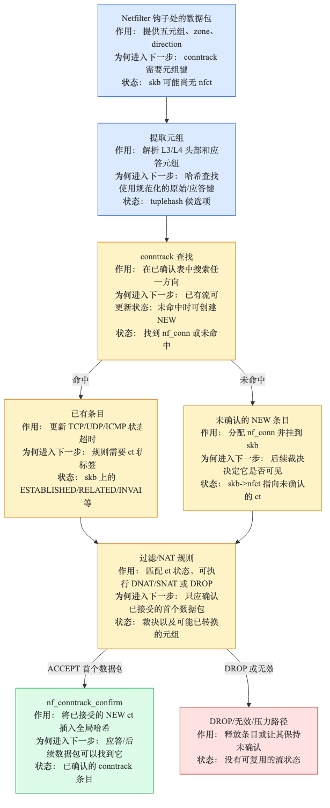
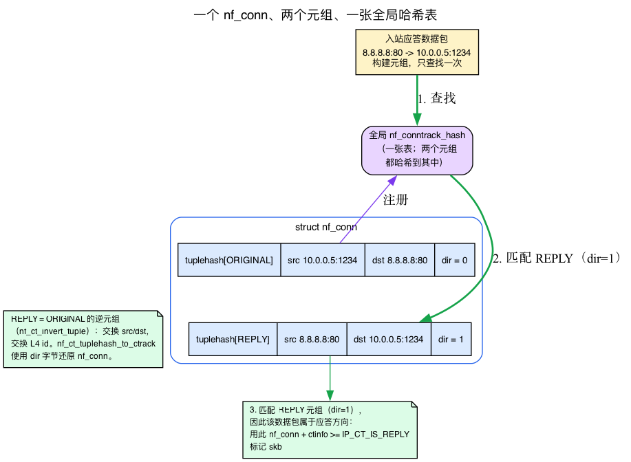
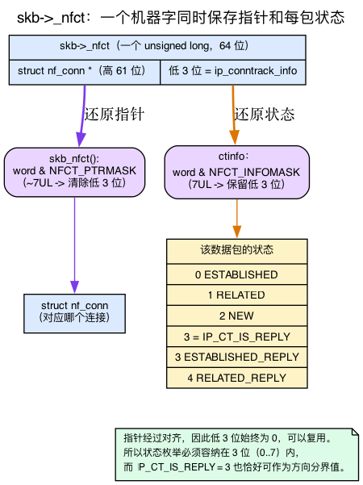
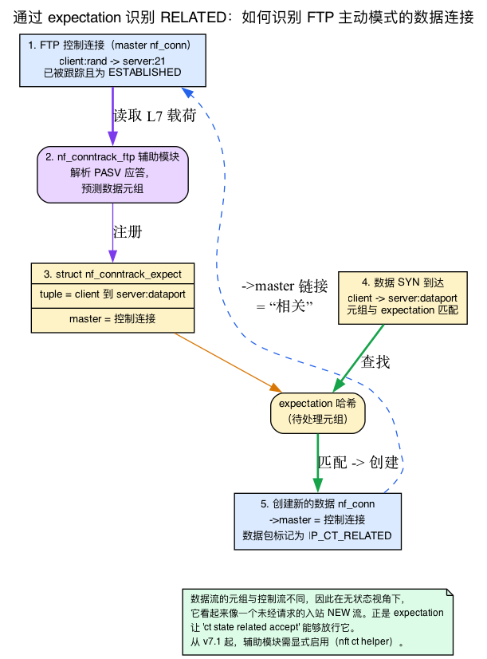
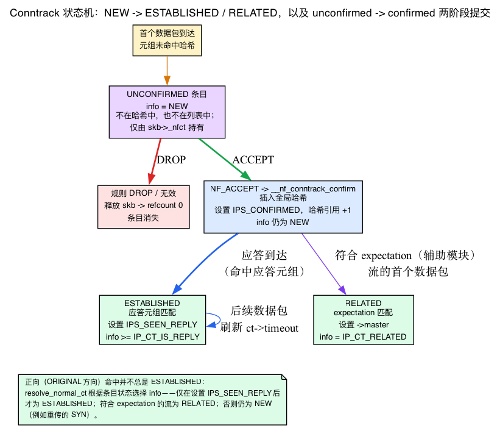
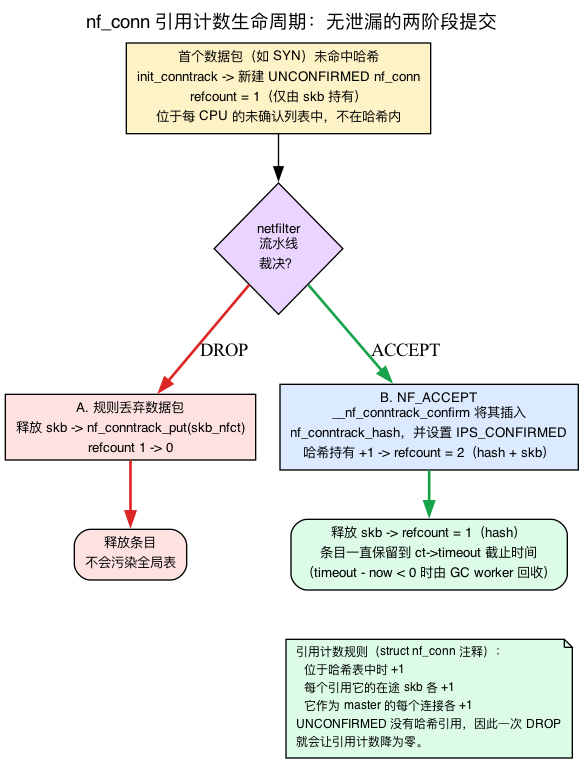
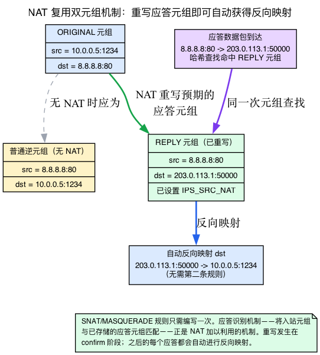

# 第22天 — conntrack：有状态防火墙

> **今日任务：** 了解内核如何跟踪每条连接的状态，为什么“established,related accept”是世界上使用最广泛的防火墙规则，以及 NAT 如何建立在 conntrack 之上。总时间：约 110 分钟。

## 连接跟踪的作用

在此过程中，我们会拆解整个子系统所依赖的四套机制：

1. **连接跟踪元组**（conntrack tuple）以及如何识别回复数据包，
2. 经过打包的 **`skb->_nfct`** 机器字，以及它如何把数据包与连接关联起来，
3. RELATED 背后的**期望机制**（expectation mechanism），
4. 具体支撑条目确认与老化的**引用计数 + 超时模型**（refcount-plus-timeout model）。

**有状态防火墙**（stateful firewall）决定是否允许一个数据包，不仅看数据包本身，还要看它属于哪条**连接**。“允许出站连接的返回流量进入，丢弃未经请求的入站流量”是典型用例 —— 它要求内核*记住*出站连接，以便识别回复。

Linux 内核的连接跟踪子系统是 **conntrack**（`netfilter/nf_conntrack`）。对于每个数据包，conntrack：

1. 根据数据包的 L3 和 L4 头部计算一个**元组键**（tuple key）。
2. 查找已跟踪的连接（`struct nf_conn`）。
3. 如果找到，更新连接状态并在 skb 上记录一个 `nf_conn` 指针和一个 `IP_CT_*` 信息值。
4. 如果未找到，创建一个 **NEW 条目**（暂定状态，只有数据包被 ACCEPT 后才会确认）。

后续规则可以通过 `ct state established,related,new,invalid` 匹配器引用这些状态，也就是第21天介绍的 `ct state` 匹配。NAT 规则则利用 conntrack 保存映射，以便自动反向转换返回流量。



本章会反复出现三个说法，本质上讲的是同一件事：“查找已跟踪的连接”，“通过反向五元组匹配条目”，以及“在 skb 上标记所属连接”。在我们走状态机之前，先把这些概念讲清楚 —— 因为一旦你看到**元组**和经过打包的 **`_nfct`** 机器字，conntrack 的其余部分便主要是状态维护。

## 连接跟踪元组：如何识别回复

回想第13天，TCP 协议栈将已建立的套接字存储在 `ehash` 中，键是四元组 `(saddr, sport, daddr, dport)`。连接跟踪有一个更丰富的双向键，称为**元组**（tuple），它是理解后续内容的主线。

连接跟踪元组**不是**TCP 四元组。TCP 键标识一个方向上的一个套接字。连接跟踪元组标识*任何协议的一个流的一个方向* —— 关键的是，conntrack 为每条连接存储**两个**这样的元组，以便识别*两个方向*的流量。

这是实际的结构体（`include/net/netfilter/nf_conntrack_tuple.h:37`）：

```c
struct nf_conntrack_tuple {
    struct nf_conntrack_man src;       /* source addr + an L4 "id" (port/icmp-id/key) */

    struct {
        union nf_inet_addr u3;         /* destination address (v4 or v6) */
        union {
            __be16 all;
            struct { __be16 port; } tcp;
            struct { __be16 port; } udp;
            struct { u_int8_t type, code; } icmp;   /* <-- not a port! */
            struct { __be16 port; } dccp;
            struct { __be16 port; } sctp;
            struct { __be16 key;  } gre;            /* <-- a GRE key */
        } u;
        u_int8_t protonum;             /* L3 protocol number (TCP=6, UDP=17, ...) */
        u_int8_t dir;                  /* which direction this tuple is */
    } dst;
};
```

请仔细看这个联合体，它正是关键所在。"L4 id" **不总是端口**。TCP/UDP/DCCP/SCTP 使用 16 位端口；**ICMP 使用 `{type, code}`**；**GRE 使用一个键**。这就是*为什么 ping 也能成为可跟踪的“连接”*，即使 ICMP 没有端口：回显标识符充当元组中的 L4 id，因此 conntrack 可以将回显请求与回显回复配对。`src` 部分（`struct nf_conntrack_man`）则通过自身的 `union nf_conntrack_man_proto` 保存源地址以及对应的源端 L4 id。

### 每条连接有两个元组，回复元组是原始元组的逆

每个 `nf_conn` 都在一个数组中存放**两个**元组 —— 这是你在结构体中看到的 `tuplehash[2]`：

```c
struct nf_conntrack_tuple_hash tuplehash[IP_CT_DIR_MAX];   /* [ORIGINAL] and [REPLY] */
```

方向枚举只有三个值（`include/uapi/linux/netfilter/nf_conntrack_tuple_common.h:12`）：

```c
enum ip_conntrack_dir {
    IP_CT_DIR_ORIGINAL,   /* 0 — the way the connection was opened */
    IP_CT_DIR_REPLY,      /* 1 — the way replies come back */
    IP_CT_DIR_MAX         /* 2 — array size */
};
```

**回复元组是原始元组的逆向形式**：交换源和目标地址，交换源和目的 L4 id（端口），对于 ICMP 将回显请求*类型*映射到回显回复*类型*。内核通过 `nf_ct_invert_tuple` 构造它（`net/netfilter/nf_conntrack_core.c:429`，`EXPORT_SYMBOL_GPL` 在 `:466`）。当创建一个全新的连接时，`init_conntrack`（`:1763`）通过反转原始元组计算回复元组：

```c
/* net/netfilter/nf_conntrack_core.c:1780, inside init_conntrack() */
if (!nf_ct_invert_tuple(&repl_tuple, tuple))
    return NULL;
```

两个元组都会加入**同一个**全局表（`nf_conntrack_hash`）。当数据包到达时，conntrack 会计算该数据包的元组并执行查找：

- 如果匹配存储的**ORIGINAL**元组 → 这个数据包是**正向**方向。
- 如果匹配存储的**REPLY**元组 → 这个数据包是**回复**。

正是“两份元组、同一张表”这一机制，使*一个*条目能够识别*两个方向*的流量。NAT 也正是复用这一机制来反向映射返回流量（我们稍后会讲到）。

无论匹配的是哪个元组，内核都通过其中嵌入的 `dir` 字节取得 `nf_conn`：

```c
/* include/net/netfilter/nf_conntrack.h */
static inline struct nf_conn *
nf_ct_tuplehash_to_ctrack(const struct nf_conntrack_tuple_hash *hash)
{
    return container_of(hash, struct nf_conn,
                        tuplehash[hash->tuple.dst.dir]);   /* dir picks the slot */
}
```



### 方向被折叠到状态值中

这里有一个巧妙之处。数据包自身的*状态*（NEW/ESTABLISHED/...）和*方向*（forward/reply）并非分开存储，而是把方向编码进状态值本身。解码它的宏（`include/uapi/linux/netfilter/nf_conntrack_tuple_common.h:44`）：

```c
#define CTINFO2DIR(ctinfo) ((ctinfo) >= IP_CT_IS_REPLY ? IP_CT_DIR_REPLY : IP_CT_DIR_ORIGINAL)
```

任何 `ctinfo` 值**≥ `IP_CT_IS_REPLY`**意味着“这是回复方向”。这就是状态枚举以这种方式排序的*结构性*原因 —— `IP_CT_IS_REPLY` 是阈值值 `3`，回复变体正好是 `forward_state + IP_CT_IS_REPLY`。状态值还兼作方向标志，因此只需几个比特便能同时表达两者。这引出了该值实际存储的位置。

## skb 如何携带 conntrack 信息：打包的 `skb->_nfct` 机器字

前文多次提到“在 skb 上标记所属连接”。回想第1天，`sk_buff` 在数据包字节之外还携带许多元数据指针。conntrack 使用了其中一个字段，并采用了一项值得理解的打包技巧；这项技巧正好解释了为什么状态枚举只有 3 位。

该字段是一个单一的 `unsigned long`（`include/linux/skbuff.h:933`，在 `:822` 中记录为“关联连接，如果有（带 nfctinfo 位）”）：

```c
unsigned long _nfct;
```

一个机器字同时保存**两个东西**：

- **高位**是 `struct nf_conn *` 指针，
- **低 3 位**持有 `ip_conntrack_info` 值（每个数据包的状态）。

堆对象的指针总是对齐的，因此其低位必然为零，因而可以另作他用。掩码（`include/linux/netfilter/nf_conntrack_common.h:24`）：

```c
#define NFCT_INFOMASK   7UL                 /* low 3 bits */
#define NFCT_PTRMASK    ~(NFCT_INFOMASK)    /* everything else = the pointer */
```

两个访问器解包该字（`include/linux/skbuff.h:4987` 和 `:5005`）：

```c
static inline struct nf_conntrack *skb_nfct(const struct sk_buff *skb)
{
    return (void *)(skb->_nfct & NFCT_PTRMASK);   /* mask off low bits -> the pointer */
}

static inline void skb_set_nfct(struct sk_buff *skb, unsigned long nfct)
{
    skb->slow_gro |= !!nfct;
    skb->_nfct = nfct;                            /* pointer | ctinfo, packed together */
}
```

因此，一个带 conntrack 标记的 skb 只用**一个**字段就能回答**两个**问题：*哪个*连接（`nf_conn`，通过 `skb_nfct()` 获取），以及*这个数据包在该连接中属于什么状态*（低位 —— NEW / ESTABLISHED / ... 可能再加上 REPLY 标志）。第21天介绍的 nftables `ct state` 匹配器读取的正是这些低位。

这种打包是 `enum ip_conntrack_info`**必须**适合 3 位（值 0..7）的原因，也是 `IP_CT_IS_REPLY = 3` 能作为方向分界的原因：该枚举从设计上就要装进指针空闲的低位。



清除 skb 上的 conntrack 信息就是反向操作：丢弃引用并清零该字。这是 `nf_reset_ct`（`include/linux/skbuff.h:5140`）：

```c
nf_conntrack_put(skb_nfct(skb));   /* drop our reference to the nf_conn */
skb->_nfct = 0;                    /* pointer AND state cleared in one store */
```

记住这两行清理代码 —— 它直接与章节末尾我们讨论的引用计数清理相关。

## 状态

`enum ip_conntrack_info`（`include/uapi/linux/netfilter/nf_conntrack_common.h:7`）：

```c
IP_CT_ESTABLISHED        // 0: packet is part of an existing connection
IP_CT_RELATED            // 1: related to an existing connection (e.g., FTP data, ICMP error)
IP_CT_NEW                // 2: first packet of a new connection (the SYN, in TCP)
IP_CT_IS_REPLY           // 3: flag/threshold: >= this means the reply direction
IP_CT_ESTABLISHED_REPLY  // 3: ESTABLISHED in the reply direction (= ESTABLISHED + IS_REPLY)
IP_CT_RELATED_REPLY      // 4: RELATED in the reply direction
// (there is no NEW in the reply direction; IP_CT_NEW_REPLY exists only as a
//  userspace-compatibility alias. In the kernel value 7 is IP_CT_UNTRACKED.)
```

注意，回复方向的变体正好等于 `forward + IP_CT_IS_REPLY`，这正是 `CTINFO2DIR` 所利用的算术关系。没有 `IP_CT_INVALID` 枚举器 —— 格式错误或状态不合法的数据包（例如，不属于任何已知序列的 TCP 段）不会关联 conntrack 条目。向用户空间显示的 INVALID 分类是位掩码 `NF_CT_STATE_INVALID_BIT`（在相同头文件中，位 0），而不是 `ip_conntrack_info` 值。

### NEW 如何变成 ESTABLISHED

对于 TCP：

1. 出站 SYN —— conntrack 创建条目，标记为 NEW。回复元组通过反转 SYN 的元组计算（`nf_ct_invert_tuple`），因此条目已经*知道*回复会是什么样子。
2. 入站 SYN-ACK —— conntrack 匹配**回复**元组，标记为 ESTABLISHED（在回复方向，因此信息值为 `≥ IP_CT_IS_REPLY`）。
3. 两个方向的后续数据包 —— ESTABLISHED。

对于 UDP：

1. 出站数据包 —— NEW。
2. 入站回复（匹配反转的回复元组） —— ESTABLISHED。
3. 两个方向的后续数据包 —— ESTABLISHED。

对于 ICMP 回显（ping）：

1. 出站回显请求 —— NEW。元组中的 L4 id 对 ICMP `id`，回复元组将回显请求类型 → 回显回复类型。
2. 匹配该反转元组的回显回复 —— ESTABLISHED。

这正是前面讲解元组的意义：“匹配反向五元组”并非含糊的概括 —— 它是对数据包元组与条目预计算的反转回复元组进行一次真正的哈希查找。

### “RELATED”的含义：连接跟踪期望

RELATED 是三个主要状态之一，但其底层机制却最常被略过。其背后的机制称为**期望**（expectation）。

一些协议在其控制流中协商*辅助*连接。FTP 主动模式会打开一个从服务器到客户端的*单独*数据连接；SIP 协商 RTP 媒体流；PPTP 建立 GRE 隧道。数据/媒体流具有**完全不同的元组**，因此在无状态视角下看起来像未请求的 NEW 入站连接 —— 默认丢弃的防火墙会直接拦截它。

**conntrack 辅助模块**（conntrack helper）解决了这个问题。它针对具体协议解析 L7 控制流（例如 FTP 的 `PORT`/`PASV` 命令），推断即将出现的连接元组，并预先注册一个**期望**（`struct nf_conntrack_expect`）（`include/net/netfilter/nf_conntrack_expect.h:18`）：

```c
struct nf_conntrack_expect {
    struct hlist_node lnode, hnode;
    possible_net_t net;
    struct nf_conntrack_tuple tuple;        /* the tuple we expect to see */
    struct nf_conntrack_tuple_mask mask;
    refcount_t use;
    unsigned int flags;
    /* ... and a link back to the master connection ... */
};
```

后续数据包的元组一旦匹配某个待处理的期望，conntrack 创建新条目，将其 `->master` 指针设置为原始（控制）连接，并标记数据包为 `IP_CT_RELATED` 而不是 `IP_CT_NEW`。这条 `master` 关联正是“related”的具体含义（`include/net/netfilter/nf_conntrack.h`，在 `struct nf_conn` 中，`:74`）：

```c
/* If we were expected by an expectation, this will be it */
struct nf_conn *master;
```

这就是为什么 `ct state related accept` 对 FTP 主动模式、SIP/RTP 和 PPTP/GRE 至关重要：第二个流有不同的元组，否则会看起来像一个新的未请求连接。

**ICMP 错误是 RELATED 的另一种来源。** ICMP 目标不可达或超时消息*在其有效载荷中嵌入引发错误的原始数据包的头部*。conntrack 读取这些嵌入的头部，重建原始元组，找到它所属的连接，并标记错误为 RELATED（`IP_CT_RELATED` 在枚举中记录为“像 NEW 一样，但与现有连接相关，或 ICMP 错误”）。正因如此，**traceroute 和 PMTUD 才能穿过默认丢弃的防火墙** —— 它们依赖的 ICMP 错误会标记为 RELATED。

期望机制也解释了为什么如今必须**显式启用**辅助程序 —— 请参见下面的*连接跟踪助手*部分了解安全理由。



## 状态机



对于每个进入的数据包，conntrack 都会在**`nf_conntrack_in`**（`net/netfilter/nf_conntrack_core.c:2013`）中：

1. **根据数据包的 L3 和 L4 头部构造元组**（`nf_ct_get_tuple`）。
2. **在全局连接跟踪哈希表中查找元组**（`__nf_conntrack_find_get`）。哈希表是全局的 `nf_conntrack_hash`（netns 是键的一部分，并非每个 netns 各有一张表）。每个条目的 ORIGINAL 和 REPLY 元组都存在于这个表中。
3. **三种结果：**
   - **命中（原始方向）** —— 数据包的元组匹配存储的 ORIGINAL 元组。信息值取决于条目的 `status`：一旦 `IPS_SEEN_REPLY` 设置（已经看到双向流量），就是 `ESTABLISHED`；预期（助手预测）流是 `RELATED`；否则 —— 例如，在任何回复之前重传的 SYN —— 仍然是 `NEW`。
   - **命中（反向方向）** —— 数据包的元组匹配存储的 REPLY 元组：把该条目关联到 skb，设置 `info = ESTABLISHED + IS_REPLY`（即信息值 `≥ IP_CT_IS_REPLY`，因此 `CTINFO2DIR` 报告回复）。
   - **未命中** —— 通过 `init_conntrack` 和 `__nf_conntrack_alloc` 创建新条目。回复元组通过反转原始元组提前计算。标记 `info = NEW`。此时条目是**未确认的**。

未确认的条目*尚未*在全局哈希表中，且（在现代内核中，包括本书采用的 7.1 内核）也不会暂存在任何列表中 —— 它仅通过在途 skb 的引用保持存活（`skb->_nfct`）。只有数据包走完 Netfilter 流程并得到 `NF_ACCEPT` 后，条目才会确认；确认回调（`__nf_conntrack_confirm`）将条目插入全局哈希表。如果数据包被丢弃，未确认的条目被释放，因此端口扫描报文不会填满表。（旧内核保留了每 CPU 的“未确认”列表；提交 `8a75a2c17410` 移除了它 —— 如今维持未确认条目生命周期的只有 skb 引用。）

这种两阶段提交对性能和安全至关重要：
- 性能：关闭端口的扫描不会撑爆 conntrack 表。
- 安全：未确认条目只在 skb 存活期间存在，因此伪造的 NEW 洪泛最多只能让每个在途数据包占用一个条目；持久存在的已确认条目由 `nf_conntrack_max` 限制。

有了下面的引用计数模型，就能准确解释“未确认条目被释放”。

## 引用计数和超时模型

两阶段提交和老化行为都基于 `nf_conn` 的两个字段：嵌入的引用计数和 `timeout`。第1天介绍了为 skb 相关对象维护引用计数的思路（回想 `skb->users` / `dataref`）；`nf_conn` 有其特定的计数规则。第7天介绍了 `jiffies`/`HZ` 时钟和 `time_after` 截止时间模式用于邻居老化 —— `timeout` 是同样的想法。

### 引用计数规则

`nf_conn` 通过其嵌入的 `ct_general`（一个 `struct nf_conntrack`）进行引用计数。规则在结构体自己的注释中说明（`include/net/netfilter/nf_conntrack.h:74`）：

```c
struct nf_conn {
    /* Usage count in here is 1 for hash table, 1 per skb,
     * plus 1 for any connection(s) we are `master' for
     */
    struct nf_conntrack ct_general;

    spinlock_t lock;
    /* jiffies32 when this ct is considered dead */
    u32 timeout;
    /* ... */
    struct nf_conntrack_tuple_hash tuplehash[IP_CT_DIR_MAX];
    unsigned long status;
    /* ... */
    struct nf_conn *master;     /* the expectation link from the RELATED section */
    struct nf_ct_ext *ext;      /* extensions: NAT info, helper data, ... */
};
```

因此计数规则是：**条目位于哈希表中时 +1，每个正在引用它的在途 skb +1，每有一条以它为 `master` 的连接再 +1**。`nf_ct_put` 减少一个引用；当计数达到零时条目被释放。

### 两阶段提交为何不会泄漏

现在可以准确解释“未确认条目为何会在 DROP 时释放”：

- **UNCONFIRMED**条目*不在*哈希表中，因此缺少 `+1 for hash table` 引用。它仅通过在途 skb 的引用保持存活（`+1 per skb`）。
- 如果规则 **DROP** 数据包，skb 会被释放，并执行 `nf_reset_ct` 风格的清理（`nf_conntrack_put(skb_nfct(skb))`），释放这一个引用。计数达到**零**，条目消失 —— 不会污染全局表。
- **CONFIRM**标志着条目获得持久的哈希表引用。`__nf_conntrack_confirm`（`net/netfilter/nf_conntrack_core.c:1207`，`EXPORT_SYMBOL_GPL` 在 `:1352`，注册为 `.confirm` 回调在 `:2733`）将条目插入 `nf_conntrack_hash`。在那一刻，条目设置其 `IPS_CONFIRMED` 状态位（`IPS_CONFIRMED_BIT = 3`，`include/uapi/linux/netfilter/nf_conntrack_common.h`）并获取 `+1 for hash table` 引用。



### `timeout` 是一个截止时间，而不是持续时间

`ct->timeout` **不是**“剩余秒数”。它是一个*绝对的未来时间戳（以 jiffies 为单位）* —— 条目被视为过期的时刻。当条目被确认时，每协议超时*加到当前时间*（`net/netfilter/nf_conntrack_core.c:1304`）：

```c
ct->timeout += nfct_time_stamp;   /* relative timeout -> absolute jiffies deadline */
```

判断条目是否过期，使用的仍是第7天邻居老化所用的 jiffies 比较 —— 计算剩余时间并检查其符号（`:657`）：

```c
s32 timeout = READ_ONCE(ct->timeout) - nfct_time_stamp;   /* <= 0 means expired */
```

有两套机制会依据这个截止时间采取行动：

- **GC 工作线程**定期扫描哈希桶并回收过期条目。它是一个延迟工作项（`struct conntrack_gc_work` 在 `:66`，`gc_worker` 在 `:1517`），发现过期条目后，由 `nf_ct_gc_expired`（`:719`）负责清理。
- **`early_drop`**在表满时驱逐一个近似 LRU 的条目，因此洪泛流量不会拖垮设备。

每个被接受的数据包都会**把 `ct->timeout` 改写为新的未来 jiffies 值，从而刷新截止时间**；增加量仍是该协议的超时值。这就是为什么空闲流仅在完整的协议专用超时时间后才老化 —— 正如强制过期实验所演示的那样。`IPS_SEEN_REPLY_BIT = 1` 状态位（一旦看到双向流量）和 `IPS_CONFIRMED_BIT = 3` 是条目携带的同一 `status` 位字段的一部分。

## 哈希表大小

```bash
sysctl net.netfilter.nf_conntrack_max         # capacity (entries)
sysctl net.netfilter.nf_conntrack_buckets     # hash table size (rounded to power of 2)
```

经验法则：**桶数 = 最大值 / 4 到 最大值 / 8**。默认值是保守的；繁忙的网关设置更高的值（大型 NAT 网关上数百万条目）。

达到 `nf_conntrack_max` 后，新连接无法跟踪，根据策略（`nf_conntrack_tcp_loose` 等）可能也会被丢弃。包括 `drop` 和 `early_drop`（表满时近似 LRU 的提前驱逐 —— 与超时部分相同的 `early_drop`）在内的每 CPU 计数器由 `conntrack -S` 报告。它们也暴露在**`/proc/net/stat/nf_conntrack`**中，但仅当内核构建时带有 `CONFIG_NF_CONNTRACK_PROCFS=y` —— 该 procfs 视图已弃用且在许多现代内核（包括本书采用的 7.1 内核）上关闭，因此优先使用 `conntrack -S`。

## conntrack 辅助模块

每种会建立辅助连接的 L7 协议都有相应的辅助模块。正如我们在期望部分看到的，助手解析控制流并注册 `nf_conntrack_expect` 条目，以便预测的数据流被标记为 RELATED 而不是 NEW：

- **`nf_conntrack_ftp`**：解析 FTP 控制命令（PORT, PASV）并为数据连接创建期望条目。
- **`nf_conntrack_sip`**：用于 SIP（创建 RTP 流期望）。
- **`nf_conntrack_pptp`**：为 PPTP 控制连接和 GRE 隧道创建期望。
- **`nf_conntrack_irc`**：DCC。
- ...还有更多。

助手不再默认自动加载（安全：ALG 风格的辅助程序曾引发多起 CVE —— 期望部分的欺骗风险）。必须在 nftables 中通过规则显式启用它们：

```bash
sudo nft add table inet ct_lab
sudo nft 'add chain inet ct_lab prerouting { type filter hook prerouting priority 0 ; }'
sudo nft 'add ct helper inet ct_lab ftp { type "ftp" protocol tcp ; }'
sudo nft 'add rule inet ct_lab prerouting tcp dport 21 ct helper set "ftp"'
# cleanup
sudo nft delete table inet ct_lab
```

那个 `ct helper set "ftp"` 是显式启用绑定：只有匹配该规则的流才会启用 FTP 辅助模块，因此攻击者无法在任意端口上触发期望创建。

## NAT 建立在 conntrack 之上

当你写 `iptables -t nat -A POSTROUTING -s 10.0.0.0/8 -j MASQUERADE` 时，底层机制直接复用了双元组设计：

1. 出站数据包到达 PRE_ROUTING。conntrack 创建带有原始元组 `{src=10.0.0.5:1234, dst=8.8.8.8:80}` 的新条目。
2. POST_ROUTING 运行后，NAT 规则匹配；内核从出站接口（例如 `203.0.113.1:50000`）选择一个可用的源 IP 和端口。
3. conntrack 通过*重写回复元组*来**保存 NAT 映射**：不是简单的逆，而是“预期回复”元组变为 `{src=8.8.8.8:80, dst=203.0.113.1:50000}`。`IPS_SRC_NAT` 状态位记录该条目需要执行源 NAT。
4. 返回数据包到达 PRE_ROUTING 时，conntrack 通过该**回复元组**（与通常相同的哈希查找）找到条目，并*自动把目的地址和端口反向映射为 `10.0.0.5:1234`。

这就是为什么你只需编写一次 SNAT 规则。你已经理解的回复识别机制 —— 匹配传入数据包的元组与存储的回复元组 —— 正是 NAT 为自身目的所复用的机制。conntrack 在 PRE_ROUTING / LOCAL_OUT 以优先级 `NF_IP_PRI_CONNTRACK = -200` 运行（早于第20天介绍的 NAT 和过滤钩子），这就是为什么等 NAT 规则需要它时条目已经存在。



## 今日实验

> **所需设置：** 用户空间的 `conntrack` 工具*不是*默认安装的一部分。本章中的每个 `conntrack ...` 命令（本实验和下面的“强制条目过期”部分）都需要它：
>
> ```bash
> sudo apt-get install -y conntrack        # Debian/Ubuntu
> # Fedora/RHEL:  sudo dnf install -y conntrack-tools
> ```
>
> “强制条目过期”一节还使用 `nc`（netcat）；请用 `sudo apt-get install -y netcat-openbsd` 安装（如果 `which nc` 为空）。

```bash
# Inspect entries
sudo conntrack -L | head

# Live event monitoring
sudo conntrack -E &

# Generate flows
ping -c 3 8.8.8.8 &
curl -sI https://example.com > /dev/null

# Stats (per-CPU drop / early_drop counters)
sudo conntrack -S
# Same counters via procfs, only if CONFIG_NF_CONNTRACK_PROCFS=y (often off):
[ -r /proc/net/stat/nf_conntrack ] && head -5 /proc/net/stat/nf_conntrack \
  || echo "(no procfs view; needs CONFIG_NF_CONNTRACK_PROCFS=y — use 'conntrack -S')"

# Per-state count — only TCP has a state column ($4 is the state for tcp rows;
# for udp/icmp $4 is 'src=...', which would pollute the histogram), so filter -p tcp:
sudo conntrack -L -p tcp 2>/dev/null | awk '{print $4}' | sort | uniq -c | sort -rn

sudo killall conntrack    # stop the -E monitor
```

在 `conntrack -L` 输出中，每个条目连续打印**两个**元组 —— 你实际上看到的是 `tuplehash[ORIGINAL]` 后跟 `tuplehash[REPLY]`。在 NAT 网关上，回复部分显示重写的地址；在普通主机上则是未经改写的逆向元组。

在繁忙主机上，按状态统计的直方图通常以 `ESTABLISHED` 为主，少量 `SYN_SENT`/`TIME_WAIT`/`CLOSE_WAIT`：

```
     42 ESTABLISHED
      3 TIME_WAIT
      1 SYN_SENT
```

（`udp` 和 `icmp` 流没有状态列 —— 只有超时 —— 这正是我们使用 `-p tcp` 过滤的原因。）

观察表项的产生与老化。默认 UDP 超时为 30 秒；TCP ESTABLISHED 超时为 5 天（是的，天 —— 长连接不应该被垃圾回收）。记住这些数字是*相对*超时，加到 `nfct_time_stamp` 形成绝对的 `ct->timeout` 截止时间。

### 用 BPF 跟踪 conntrack

```bash
sudo bpftrace -e '
fentry:nf_conntrack_in {
  printf("ct_in skb=%p hook=%d pf=%d\n",
         args->skb, args->state->hook, args->state->pf);
}
fentry:__nf_conntrack_confirm {
  printf("confirm skb=%p\n", args->skb);
}'
```

你会看到每个数据包一个 `nf_conntrack_in`（在 PRE_ROUTING 和 LOCAL_OUT 的早期阶段执行 conntrack 查找）和每个被*接受*的数据包对应一个 `__nf_conntrack_confirm`（在处理流程末尾）。这两个计数之间的差距是两阶段提交的体现：每个数据包都进行查找，但只有通过后续处理的数据包对应条目才会确认并加入哈希表。

> `nf_conntrack` 是一个模块，因此 `bpftrace -l "fentry:nf_conntrack_in"` 无法按未限定名称列出探针 —— 使用模块形式 `fentry:nf_conntrack:nf_conntrack_in` / `fentry:nf_conntrack:__nf_conntrack_confirm` 列出它们，或使用 `kprobe:nf_conntrack_in` / `kprobe:__nf_conntrack_confirm` 等效项。上面的 `-e` 运行形式仍能正常挂载，因为 bpftrace 会在挂载时解析模块。

### 强制条目过期

```bash
# Lower TCP ESTABLISHED timeout temporarily (default 432000s / 5 days)
old_timeout=$(cat /proc/sys/net/netfilter/nf_conntrack_tcp_timeout_established)
trap 'sudo sysctl -w net.netfilter.nf_conntrack_tcp_timeout_established=$old_timeout; kill $srv $cli 2>/dev/null || true' EXIT
sudo sysctl -w net.netfilter.nf_conntrack_tcp_timeout_established=60

# Open a connection, leave idle
nc -l 9999 & srv=$!
nc localhost 9999 & cli=$!
sudo conntrack -L | grep 9999     # see the entry

# The entry only ages out after the (lowered) idle timeout, so actually wait:
echo "waiting ~65s for the idle entry to age out..."; sleep 65
sudo conntrack -L | grep 9999     # now gone (no output)
```

这里观察到的是：在空闲连接上没有流量，没有刷新 `ct->timeout`，因此 GC 工作线程的 `READ_ONCE(ct->timeout) - nfct_time_stamp` 最终变为负数，随后 `nf_ct_gc_expired` 回收该条目。始终恢复超时。这是全局状态，降低它可能会破坏主机上的合法长空闲连接。

## 在内核中读什么

- **`net/netfilter/nf_conntrack_core.c:2013`** —— `nf_conntrack_in`。主要入口点，以 Netfilter 钩子的形式注册在 PRE_ROUTING 和 LOCAL_OUT，优先级为 `NF_IP_PRI_CONNTRACK = -200`。从上到下阅读（约 80 行主体及相关辅助函数）。追踪：元组 → 查找 → 关联现有条目或分配新条目 → 通常返回 ACCEPT。conntrack 仍可能丢弃无效数据包或在资源压力下丢包；过滤规则只是策略丢弃的常见地方。

- **`include/net/netfilter/nf_conntrack.h:74`** —— `struct nf_conn`。每个连接记录。阅读顶部的引用计数规则注释（“1 用于哈希表，1 用于每个 skb，加上 1 用于我们是 master 的任何连接”）。只有约 10–14 个直接字段（一些受配置选项如区域、NAT 和标记限制）。重要：`ct_general`（嵌入的引用计数），`timeout`（绝对 jiffies 截止时间），`tuplehash[2]`（正向和反向元组），`status`（带有 `IPS_CONFIRMED`、`IPS_SEEN_REPLY`、`IPS_SRC_NAT`/`IPS_DST_NAT` 的位字段），`master`（期望链接），以及 `ext`（指向动态分配的扩展，用于 NAT 信息、助手数据等）。

- **`include/net/netfilter/nf_conntrack_tuple.h:37`** —— `struct nf_conntrack_tuple`。元组键。注意 L3（IPv4 与 IPv6 地址）和 L4（端口对、ICMP `{type,code}` vs GRE 键）的联合体。另见 `nf_ct_invert_tuple`（`net/netfilter/nf_conntrack_core.c:429`）了解如何通过反转构建回复元组。

- **`include/uapi/linux/netfilter/nf_conntrack_tuple_common.h:12` / `:44`** —— `enum ip_conntrack_dir` 和 `CTINFO2DIR` 宏。解释为什么方向被折叠到状态值的两行读取。

- **`include/uapi/linux/netfilter/nf_conntrack_common.h:7`** —— `enum ip_conntrack_info`。状态。快速阅读；注意回复变体是 `forward + IP_CT_IS_REPLY`，以及枚举下方的 `IPS_*` 状态位。

- **`include/linux/skbuff.h:933`** —— `unsigned long _nfct`，加上 `skb_nfct()`（`:4987`）和 `skb_set_nfct()`（`:5005`）。指针+状态打包技巧；`NFCT_PTRMASK`/`NFCT_INFOMASK` 位于 `include/linux/netfilter/nf_conntrack_common.h:24`。

- **`include/net/netfilter/nf_conntrack_expect.h:18`** —— `struct nf_conntrack_expect`。RELATED 背后的期望记录。

- **`net/netfilter/nf_conntrack_proto_tcp.c`** —— TCP 专用状态跟踪。实现完整的 TCP 状态机：SYN、SYN-ACK、ACK、FIN 等，带序列号窗口检查。阅读顶部注释 —— 其注释本身就像一篇论文。

- **`net/netfilter/nf_conntrack_proto_udp.c`** —— UDP 特定（更简单 —— 主要是超时维护）。

- **`net/netfilter/nf_conntrack_helper.c`** —— 助手注册。FTP、SIP 等的基础设施。

- **`net/netfilter/nf_nat_core.c`** —— 建立在 conntrack 之上的 NAT。读取连接跟踪条目，应用转换。

- **`Documentation/networking/nf_conntrack-sysctl.rst`** —— 每个 conntrack sysctl 的说明。

- **外部：** `man conntrack` 和 `conntrack-tools` 包 —— 用户空间检查和操作。

## 常见疑问

> **Q: 如果 ping 没有端口，它如何是一个“连接”？**
>
> A: 连接跟踪元组中的 L4 id 对一个联合体，不总是端口。对于 ICMP，id 是 `{type, code}` 加上在 `src` 中携带的回显标识符。回复元组将回显请求类型 → 回显回复类型，因此回显及其回复哈希到匹配对，就像 TCP SYN/SYN-ACK 一样。这就是为什么 `conntrack -L` 列出 `icmp` 流。
>
> **Q: 一个条目如何识别两个方向的流量，如果哈希键只是一个元组？**
>
> A: 每个 `nf_conn` 将*两个*元组注册到同一个全局哈希表 —— `tuplehash[ORIGINAL]` 和 `tuplehash[REPLY]`，其中回复是原始的 `nf_ct_invert_tuple()`。传入数据包的元组查找一次；匹配的存储元组告诉你连接（`nf_ct_tuplehash_to_ctrack`）和方向（`dst.dir` 字节）。
>
> **Q: 状态（NEW/ESTABLISHED）实际存储在哪里 —— 在条目中还是在数据包上？**
>
> A: *条目*在其 `status` 位字段中保存长期状态。*每个数据包*的分类存储在 `skb->_nfct` 的低 3 位中，与 `nf_conn` 指针一起打包。`skb_nfct()` 屏蔽这些位以获取指针；这些位本身是 `ip_conntrack_info` 值，`ct state` 匹配器读取。

## 要点回顾

- **连接跟踪**在全局哈希表中跟踪每个连接的状态。键是一个**元组**（`struct nf_conntrack_tuple`）：源地址和目的地址，L4 id 对**TCP/UDP 的端口，而对 ICMP 是 `{type,code}` 对 GRE 则是键**，以及协议号。
- 每个 `nf_conn` 存储**两个**元组 —— `tuplehash[ORIGINAL]` 和 `tuplehash[REPLY]`，回复元组由原始元组反转而来（`nf_ct_invert_tuple`）。两者都进入**同一个**表；匹配回复元组是识别响应的方法（NAT 也靠它完成反向映射）。
- skb 用一个打包后的机器字保存 conntrack 信息，**`skb->_nfct`**：高位 = `nf_conn *`，低 3 比特 = `ip_conntrack_info`。这种打包使得状态枚举能装进 3 位，而 `IP_CT_IS_REPLY = 3` 同时作为方向分界（`CTINFO2DIR`）。
- 状态：**NEW, ESTABLISHED, RELATED**，加上回复方向变体（`= forward + IP_CT_IS_REPLY`） —— 以及**INVALID**（通过 `NF_CT_STATE_INVALID_BIT` 匹配器分类，不是 `ip_conntrack_info` 枚举值）。
- **RELATED**由**期望**（`struct nf_conntrack_expect`）实现：助手解析控制流，预先注册预测的元组，匹配的流创建时会设置 `->master`。ICMP 错误也是 RELATED（其中嵌有引发错误的数据包）。辅助模块通过 nft `ct helper` 显式启用。
- 在**PRE_ROUTING**（优先级-200）和**LOCAL_OUT**挂载，以捕获接收和本地生成的流量。
- **两阶段提交**：条目在第一个数据包时创建为**未确认**，仅由 skb 引用保持存活（引用计数规则：1 用于哈希表 + 1 用于每个 skb + 1 用于每个 master）。在 `NF_ACCEPT`，`__nf_conntrack_confirm` 将其插入哈希表并获取持久引用；DROP 时 skb 被释放，引用计数归零，条目消失。伪造数据包不会填满表。
- **`ct->timeout` 是一个绝对 jiffies 截止时间**，而不是持续时间。每个被接受的数据包刷新它；GC 工作线程回收 `timeout - now` 变为负的条目；`early_drop` 在满时驱逐。
- **`nf_conntrack_max`**限制总条目数；**`nf_conntrack_buckets`**设置哈希大小。
- **NAT**建立在连接跟踪之上 —— 它重写条目的回复元组，因此回复反向映射通过正常元组查找自动发生。
- 检查：`conntrack -L`，`conntrack -E`（事件），`conntrack -S`（统计）。

## 检查问题

一个 SYN 数据包到达。连接跟踪创建一个 NEW 条目。随后一条 Netfilter 规则决定 DROP。连接跟踪条目会发生什么？

<details>
<summary>点击显示答案</summary>

**答案：** 未确认条目被**释放**，不添加到全局表中。在 PRE_ROUTING（或 LOCAL_OUT）中创建的连接跟踪条目是*未确认的* —— 它们在 Netfilter 流程的其余阶段运行时不在哈希表中，因此缺少 `nf_conn` 引用计数规则中的“+1 用于哈希表”引用。条目仅由**一个**引用保持存活：在途 skb。当规则 DROP 数据包时，skb 被释放，这会释放这一个引用（`nf_conntrack_put(skb_nfct(skb))` —— 与 `nf_reset_ct` 相同的清理）；引用计数达到**零**，条目被释放。只有当数据包最终被 **ACCEPT** 时，`__nf_conntrack_confirm` 才会将其插入全局哈希表并获取持久引用（设置 `IPS_CONFIRMED`）。这就是防止端口扫描攻击者用永远收不到回复的 NEW 条目填满连接跟踪表的原因：关闭端口的扫描不会留下永久状态。未确认条目的批量清理是 `nf_ct_iterate_destroy`。

</details>

---

## 明天

第23天：流量控制。用于控制出站数据包发送节奏的 qdisc 子系统。
