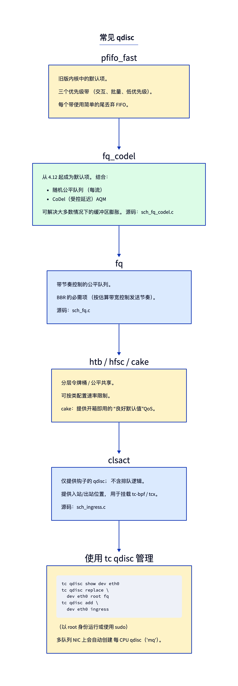
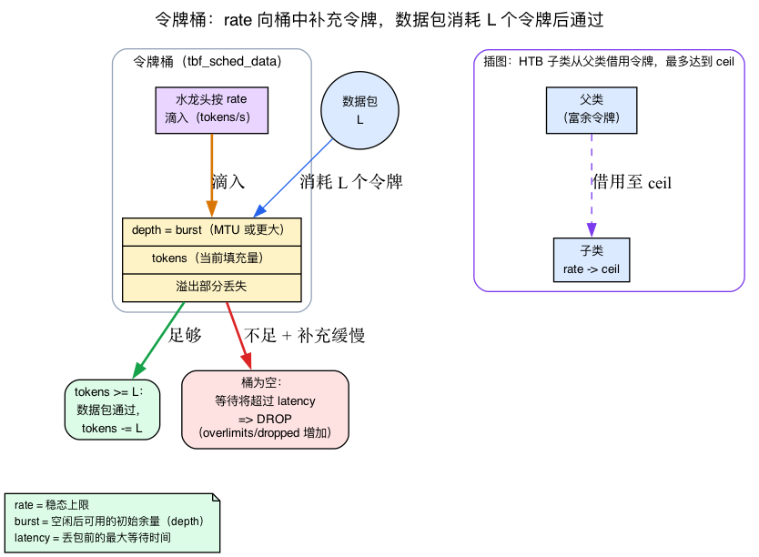
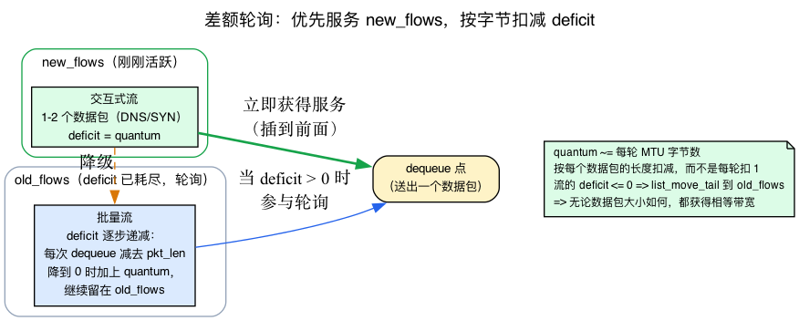
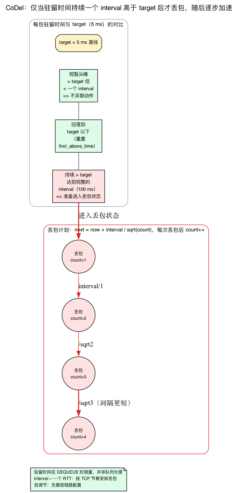
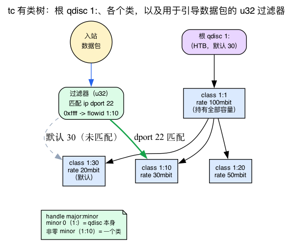

# 第23天 — 流量控制：qdisc、类与 fq_codel

> **今日任务：** 理解 IP 层与驱动之间有哪些组件，缓冲膨胀为何会发生，以及如何检查/配置出站队列。在此过程中，你将学习整个子系统赖以运转的四种算法 — **令牌桶**（速率限制）、**差额轮转**（公平队列）、**CoDel 的控制律**（延迟边界丢弃）和**tc 的分类句柄树**（`1:10` 式名称和过滤器如何工作）；此外还会介绍 HTB，它本质上是两个令牌桶的叠加。学完之后，实验中的每条 `tc` 命令都会像一句话一样清楚，不再像咒语。总时间：约 120 分钟。

## qdisc 是什么

当 IP 层要通过 `dev_queue_xmit`（第3天）传输数据包时，数据包不会直接进入驱动，而是先进入设备的 **qdisc**，也就是队列规则。qdisc 决定：

- 哪个数据包下一个离开（优先级、公平性、调度）。
- 何时离开（速率限制、节奏控制）。
- 是否丢弃数据包（队列已满，或主动队列管理 AQM 主动丢包；见背景 3）。
- 如何在多个流之间分配数据包（按流公平性）。

从概念上讲，qdisc 是一对函数：

```c
int  enqueue(struct sk_buff *skb, struct Qdisc *q, struct sk_buff **to_free);
struct sk_buff *dequeue(struct Qdisc *q);
```

加上管理函数（初始化、销毁、统计、改变配置）。各 qdisc 类型的实现在 `net/sched/sch_*.c` 中。



## qdisc 如何运行

第3天介绍了 `__dev_queue_xmit` 和 `__qdisc_run`。完整的出站流程如下：

1. **`__dev_queue_xmit`**（`net/core/dev.c`）选择一个 TX 队列，找到根 qdisc，调用 `enqueue`。
2. **`__qdisc_run`**（`net/sched/sch_generic.c:440`）就像一台“泵”，不断将数据包出队并发送。当有数据包且 qdisc 未上锁时，它循环：`dequeue` → `sch_direct_xmit`（`net/sched/sch_generic.c:344`）→ `netdev_start_xmit`（驱动）。
3. 如果 `__qdisc_run` 运行时间过长，它会推迟剩余部分到 `NET_TX_SOFTIRQ` 以避免长时间独占 CPU。

这台“泵”可由两处触发：
- xmit 路径（成功入队后，仍在进程上下文中）。
- TX 软中断（当设备释放 skb，表明队列又有空间时）。

以上是对发送流程的回顾。下面进入*策略*层：`dequeue` 函数可以实现不同策略，而这些策略都建立在少数几种算法之上。下面会在相应实验之前逐一讲解。

---

## 背景 1：令牌桶 — 速率限制的工作原理

今天的大多数实验都围绕一个概念展开，它还出现在两种 qdisc 的名称中（`tbf` = **t**oken **b**ucket **f**ilter；HTB = **H**ierarchical **T**oken **B**ucket）— 但前文尚未解释它。先把这个概念讲清楚，因为一旦你掌握了它，`rate`、`burst`、`ceil` 以及“为什么它会*丢弃*而不是排队？”就都会一目了然。

### 直观理解：一桶发送凭证

想象一个桶，一个水龙头以**恒定速率**滴硬币进去 — 例如每秒 100 万枚。这个桶有一个**最大容量**：一旦满了，多余的硬币会溢出并丢失。发送一个长度为 `L` 字节的数据包，就必须**从桶中消耗 `L` 个硬币**。如果桶中的硬币不少于 `L`，数据包便可立即发出，`L` 个硬币被移除。如果没有，数据包必须**等待**直到有足够的硬币滴进来。

这些硬币就是**令牌**。由此得到三个调节项：

- **`rate`** — 令牌注入桶中的速度。这是**长期稳定速率的上限**：从长期平均值看，你发送的速度不能快于水龙头填充桶的速度。
- **`burst`**（又名 `buffer`，即桶的*深度*）— 空闲时可以积攒多少*未使用的*令牌。静默一段时间后，桶会蓄满，因此你可以在**短时间内以高于 `rate` 的速率突发发送**——具体速度取决于满桶的令牌能多快用完——然后再回落到令牌注入速率。
- **`latency`** — 只存在于 iproute2 中的调节项（内核结构中*没有*`latency` 字段）。配置时，`tc` 将其换算成积压字节上限（大约为 `rate * latency + burst`），再把这个 `limit` 交给内核，用来设置容量有限的内部 FIFO。令牌不足的数据包会在该 FIFO 中*排队*，而不是立即丢弃；较小的 `latency` 只会让 FIFO 更浅。

由这个模型可以直接推出两点：

1. **`burst` 必须≥一个 MTU。** 连一个数据包所需令牌都容不下的桶*永远*无法发送该数据包 — 无论等待多久，桶中令牌都不可能超过自身容量。内核注释直言这一点。
2. **浅桶 + 较小的延迟上限在持续过载下更快丢弃。** 严格的 `latency` 限制会得到较小的 `limit`，因此内部 FIFO 浅。令牌不足的数据包在那里积压并随着令牌积累逐步排出；但一旦那个浅 FIFO 满了，后续到达的数据包在入队时被丢弃。所以严格的 `latency` 限制并非“丢弃而不排队” — 它给你一个*小*队列，快速溢出。这正是今天 `tbf` 实验将观察到的行为。



### 具体结构：v7.1 中的 `tbf`

打开 `net/sched/sch_tbf.c`。每个 qdisc 的状态都直接对应这个桶模型：

```c
struct tbf_sched_data {
    u32  limit;
    u32  max_size;
    s64  buffer;     /* Token bucket depth/rate: MUST BE >= MTU/B   (sch_tbf.c:102) */
    s64  mtu;
    struct psched_ratecfg rate;
    struct psched_ratecfg peak;
    /* Variables */
    s64  tokens;     /* Current number of B tokens                  (sch_tbf.c:108) */
    s64  ptokens;    /* Current number of P tokens                  (sch_tbf.c:109) */
    s64  t_c;        /* Time check-point */
    ...
};
```

`buffer` 是桶深度（`burst`），`tokens` 是当前令牌余量。（有*第二个*桶 — `ptokens`/`peak` — 在配置 `peakrate` 时使用，用来施加另一个更高的可选上限。基本情况下忽略它。）

现在从 `sch_tbf.c:285` 开始阅读出队路径。代码几乎原样实现了桶模型：

```c
s64 toks;
s64 ptoks = 0;
...
now  = ktime_get_ns();
toks = min_t(s64, now - q->t_c, q->buffer);   /* drip: add tokens for elapsed time, cap at depth */
toks += q->tokens;
if (toks > q->buffer)
    toks = q->buffer;                          /* overflow: can't exceed bucket depth */
toks -= (s64) psched_l2t_ns(&q->rate, len);    /* spend: this packet costs `len` worth of tokens */

if ((toks|ptoks) >= 0) {                        /* enough tokens? send it. */
    ...
    q->tokens = toks;                           /* commit the spend */
    return skb;
}
qdisc_watchdog_schedule_ns(&q->watchdog, now + max_t(long, -toks, -ptoks));  /* else: wait */
```

令牌在这里用**时间单位**记账（速率的纳秒），只是把“字节”换成了另一种计量单位 — `psched_l2t_ns` 将数据包长度转换为“按该速率积累这些令牌需要多长时间”。当 `toks` 变为负数时，qdisc 为令牌积累到足够数量的时刻调度一个看门狗计时器并返回 NULL；在此之前，数据包会继续**积压**在内部 FIFO 中。数据包只会在*入队*时被丢弃 — 当它超过 `max_size`/`burst`（`sch_tbf.c:253`）或内部 FIFO 已满时（`sch_tbf.c:261`、`qdisc_qstats_drop`）。注意 `overlimits`（每当出队时令牌不足，都会在 `sch_tbf.c:331` 处递增）计数*延迟*出队 — 速率限制事件 — 这与 `dropped` 不同。在限制严格的 `tbf` 上你看到 `Sent`/`overlimits`/`dropped` 全部上升：几乎每次出队受到速率限制时，`overlimits` 都会增加；浅 FIFO 溢出后，`dropped` 也会增加。

---

## 默认 qdisc：`fq_codel`

fq_codel 是大多数 Linux 发行版事实上的默认 qdisc（systemd 设置 `net.core.default_qdisc=fq_codel`；上游内核默认仍是 `pfifo_fast`，见 `sch_generic.c:37`），对几乎所有工作负载而言都是合理选择。实现位于 `net/sched/sch_fq_codel.c`。它结合了两个概念 — **公平队列**和**CoDel** — 二者各自都是一套独立算法。阅读组合后的 qdisc 之前，先分别讲清这两种算法。

### 背景 2：差额轮转 — 按字节测量的公平性

`fq_codel` 将每个流的 5 元组散列到 N 个桶之一（默认 1024 个），每个都有自己的 FIFO。真正困难的是*调度*：当 N 个桶都有等待的数据包时，接下来该发送哪个流的数据包？“轮转，也就是每轮每个流发送一个数据包”听起来公平但**不是**。

#### 为什么普通轮转并不公平

假设流 A 发送 1500 字节的数据包，流 B 发送 60 字节的数据包，两者都尽可能快地发送。纯轮询给每个流每轮各发送一个数据包 — 所以在 1000 轮中，A 发送 1,500,000 字节，B 发送 60,000 字节。尽管轮次“相等”，A 得到的带宽却是 B 的 **25 倍**。轮询仅在每个数据包大小相同时才公平，而真实链路上的数据包大小并不一致。

修复是以**字节而不是数据包**来调度。这种算法就是**差额轮转（DRR）**。

#### 差额额度

每个流都维护一个称为 **`deficit`** 的额度。调度器遍历各个流；每次访问一个流时，先给其差额**增加 `quantum` 字节**，然后在 `deficit > 0` 时持续让数据包出队，并**从差额中减去每个数据包的长度**。当差额降到 ≤ 0 时，就表示该流已经用完本轮额度；它会让出本轮机会，等待下次补充。

在许多轮中，每个有积压的流每轮大约能获得 `quantum` 字节 — **相等的带宽，不受数据包大小影响。** 大数据包流只是每轮得到较少的数据包以保持在相同的字节预算内。默认 `quantum` 是设备 MTU，所以流大约每轮发送价值一个 MTU 的字节。

#### 新旧流分组 — 降低延迟的技巧

DRR 本身公平，但对短流的响应还不够*迅速*。`fq_codel` 添加第二个想法：它保持**两个**流列表。*刚刚变活跃的*流被附加到**`new_flows`**并会优先得到服务；用完差额的流则移入**`old_flows`**并在那里轮询。因此，一次 DNS 查询、一个 TCP SYN 或一次 HTTP 请求——也就是只包含一两个数据包的流——进入 `new_flows` 后，会**抢在**停留于 `old_flows` 中的持续传输大量数据的长流之前得到服务。系统也会强制回到 `old_flows` 服务一次，以免大流量传输永远得不到服务。



#### 具体结构：v7.1 中的 `fq_codel`

在 `net/sched/sch_fq_codel.c` 中，每个流持有：

```c
struct fq_codel_flow {
    ...
    int  deficit;    /* per-flow credit                     (sch_fq_codel.c:46) */
    ...
};
```

qdisc 持有：

```c
u32  quantum;        /* psched_mtu(qdisc_dev(sch));          (sch_fq_codel.c:56) */
struct list_head new_flows;  /* list of new flows           (sch_fq_codel.c:66) */
struct list_head old_flows;  /* list of old flows           (sch_fq_codel.c:67) */
```

流被激活时会获得初始额度（`sch_fq_codel.c:213`）：

```c
WRITE_ONCE(flow->deficit, q->quantum);
```

出队循环几乎就是 DRR 算法的直接实现（`sch_fq_codel.c:290-319`、`begin:` 标签贯穿差额计费）：

```c
begin:
    head = &q->new_flows;          /* serve new flows first */
    if (list_empty(head)) {
        head = &q->old_flows;      /* then old flows */
        ...
    }
    flow = list_first_entry(head, struct fq_codel_flow, flowchain);

    if (flow->deficit <= 0) {                              /* out of credit? */
        WRITE_ONCE(flow->deficit, flow->deficit + q->quantum);  /* top up */
        list_move_tail(&flow->flowchain, &q->old_flows);   /* demote new -> old */
        goto begin;
    }
    skb = codel_dequeue(...);                              /* CoDel runs HERE — see below */
    if (!skb) {
        /* force a pass through old_flows to prevent starvation */
        if ((head == &q->new_flows) && !list_empty(&q->old_flows))
            list_move_tail(&flow->flowchain, &q->old_flows);
        ...
        goto begin;
    }
    WRITE_ONCE(flow->deficit, flow->deficit - qdisc_pkt_len(skb)); /* charge the bytes */
```

`q->quantum` 在初始化时设置为设备 MTU（`sch_fq_codel.c:481`：`q->quantum = psched_mtu(qdisc_dev(sch));`）。

### 背景 3：CoDel 的控制律 — 延迟边界丢弃

注意循环中的 `codel_dequeue(...)` 调用。那是**AQM** — 主动队列管理 — 在每个流的桶*内部*执行。DRR 决定*接下来服务哪个流*，CoDel 则决定*是否需要丢弃*以保持延迟低。

> **回想第16天的缓冲膨胀**（第16天，背景 5）：过大的缓冲会造成持续排队延迟，因为基于损失的 TCP 仅在缓冲*溢出*时退避 — 过大的缓冲会被填满并长期保持满载，每个数据包继承完整的队列延迟。CoDel 是这个问题的答案。这里不再重复介绍缓冲膨胀；这里要讲的是解决它的控制律，这是新的。

#### 驻留时间，不是队列长度

简单的 AQM 观察*队列长度*并在队列“过长”时丢包。CoDel 相反测量每个数据包的**驻留时间** — 数据包*实际等待了多久* — 在**出队**时计算。队列长度并不是可靠的替代指标（队列即使很长，只要能快速排空，也未必有问题）；数据包等待的时间是你实际关心的。

#### 两个参数：`target` 和 `interval`

CoDel 恰好有两个参数，所有链路都使用同一组默认值（`include/net/codel_impl.h:56-57`）：

```c
params->interval = MS2TIME(100);   /* 100 ms */
params->target   = MS2TIME(5);     /*   5 ms */
```

- **`target`（5 毫秒）**是 CoDel 试图限制的持续排队延迟。短暂超过 5 毫秒无妨，因为突发在所难免。
- **`interval`（100 毫秒）**表示容忍时间。CoDel 仅在驻留时间**连续一个 `interval`** 高于 `target`时才作用。这由 `first_above_time` 判断（`include/net/codel.h:124` /字段 `:134`）：驻留时间首次超过目标时，该字段会被设为**截止日期** = （驻留首次超过目标的时刻）+ 一个 `interval`（`codel_impl.h:139`）；只有当 `now` 超过该截止时间后，丢弃机制才会启动（`codel_impl.h:140`）。`interval` 大约是一次最坏情况下的 RTT，让 TCP 有时间在下一次丢包前对当前丢包作出反应。

#### 逐步加压：丢弃间隔越来越短

一旦 CoDel 进入丢弃状态，它并不会丢弃所有数据包。它按照**逐步加压的时间表**丢弃。下一个丢弃时间是

```c
/* codel_control_law: next drop at t + interval/sqrt(count)   (codel_impl.h:97-102) */
return t + reciprocal_scale(interval, rec_inv_sqrt << REC_INV_SQRT_SHIFT);
```

即 `next = t + interval / sqrt(count)`。`count` 每次丢弃递增（`codel_impl.h:186`：`WRITE_ONCE(vars->count, vars->count + 1);`）。至关重要的是，随着丢弃频率提高，每次计算使用的 `t` 都是*前一个*`drop_next`（`codel_impl.h:191-194`、`:210-213`），不是当前时间 — 只有启动丢弃状态后的第一次丢包以 `now` 为基准（`codel_impl.h:253`）。每次都以前一个计划时间为基准，才能让间隔稳定在 `interval/sqrt(count)`，而不会逐渐漂移。因此，需要的丢包次数**越多**，后续丢包就会来得**越快**，直到延迟回落到目标以下 — 也就是从轻微提醒逐渐加大压力。内核避免真正执行 `sqrt` 和除法，而是通过牛顿迭代近似维护 `1/sqrt(count)`（`codel_Newton_step`、`codel_impl.h:80`，在 `:187` 的增量之后调用）。

正是 `target + interval` 这对参数让 CoDel 能够**自调整** — 无需针对每条链路单独配置。`target` 限制持续排队延迟；`interval` 约等于一个 RTT，与 TCP 的反应时间相匹配。并且它与 DRR **相辅相成**：DRR 隔离不同流；CoDel 保持每个流自己的桶浅。`fq_codel` 在 `sch_fq_codel.c:484`（`codel_params_init(&q->cparams);`）处接入这些默认值。



### 两者结合

`fq_codel` 以基于 DRR 的公平队列（“FQ”）负责按流调度，并通过新旧流优先级降低延迟；每个桶*内部*则由 CoDel 执行 AQM。你得到公平性*和*延迟控制。检查：

```bash
tc qdisc show dev eth0
# qdisc fq_codel 0: root refcnt 2 limit 10240p flows 1024 quantum 1514 target 5ms
```

`limit` = 所有流合计允许的最大数据包数；`flows` = 桶数；`quantum` = DRR 每轮额度（≈MTU）；`target` = CoDel 的 5 毫秒延迟目标。

## fq — 用于 BBR 节奏控制

`net/sched/sch_fq.c`。不同于 `fq_codel`。按流进行节奏控制：每个数据包都有一个根据套接字节奏控制速率计算出的“发送时间”（由 BBR 通过 `sk_pacing_rate` 设置）。qdisc 会暂存数据包，使其恰好按该速率发出。

**BBR 需要 `fq`（或硬件节奏控制）。** 没有它，突发发送会干扰 BBR 的带宽估计。如果通过 `sysctl tcp_congestion_control=bbr` 启用 BBR，也应执行 `tc qdisc replace dev <dev> root fq`。（第16天背景 5 已介绍节奏控制和缓冲膨胀的动机，这里不再重复。）

---

## 背景 4：tc 的有类树 — 句柄、类和过滤器

下面的 HTB 和 clsact 实验会出现一大串带冒号编号的名称 — `handle 1:`、`classid 1:1`、`parent 1:1 classid 1:10`、`default 30`、`flowid 1:10` — 以及看似神秘的 `u32 match ip dport 22`。掌握命名规则后，这些名称并不难懂。规则如下。

### 句柄：`major:minor`

设备上的每个 qdisc 和类被 32 位**句柄**命名，写成 `major:minor`。两部分各占 16 位（`include/uapi/linux/pkt_sched.h:68-72`）：

```c
#define TC_H_MAJ_MASK (0xFFFF0000U)
#define TC_H_MIN_MASK (0x0000FFFFU)
#define TC_H_MAJ(h) ((h)&TC_H_MAJ_MASK)
#define TC_H_MIN(h) ((h)&TC_H_MIN_MASK)
#define TC_H_MAKE(maj,min) (((maj)&TC_H_MAJ_MASK)|((min)&TC_H_MIN_MASK))
```

惯例：
- **主编号**标识 qdisc。
- **次编号 0**（写成 `1:`）是**qdisc 本身**。
- **非零次编号**（`1:10`）表示该 qdisc 中的一个**类**。
- `root` 是特殊的保留句柄 `TC_H_ROOT` = `0xFFFFFFFF`（`pkt_sched.h:75`）。

### 无类 qdisc 与有类 qdisc

**无类** qdisc（`pfifo_fast`、`fq_codel`、`tbf`）是一个整体黑盒：数据包进，数据包出，内部没有可单独命名的结构。**有类** qdisc（HTB）是一个**树**：根 qdisc 持有类，每个类可以持有子类或叶 qdisc。`tc` 语法直接反映这棵树：

- `parent 1: classid 1:1` — “直接在根 qdisc `1:` 下创建类 `1:1`。”
- `parent 1:1 classid 1:10` — “在父类 `1:1` 下创建类 `1:10`。”
- `default 30` — “所有未被过滤器分类的数据包都进入类 `1:30`。”

### 过滤器：谁决定数据包进入哪个类？

类本身不会主动获取数据包 — 一个**过滤器**（分类器）负责将数据包分入相应的类。`tc filter ... u32 match ip dport 22 0xffff flowid 1:10` 可以读作：“把 TCP 目的端口为 22 的数据包发送到类 `1:10`。” `u32` 是一个按偏移和掩码**匹配原始头字节的分类器** — 既快又通用。基于 BPF 的分类器是 `cls_bpf` / `tcx`（那是 clsact 实验的 `bpf da obj prog.o` 所调用的分类器）。



### 背景 5：HTB — 每个类两个令牌桶，并可借用带宽

至此，HTB 就容易理解了。`net/sched/sch_htb.c`。它在类之间分层划分带宽。典型需求是：“为 SSH 保证 30 Mbps，为邮件保证 50 Mbps，其余流量保证 20 Mbps；同时允许各类临时使用空闲带宽。”

“临时使用空闲带宽”正是 HTB 的核心。它仍建立在前面介绍的令牌桶之上，只是为每个类设置了**两个**桶（`sch_htb.c:97-98, 120`）：

```c
struct psched_ratecfg rate;
struct psched_ratecfg ceil;                          /* sch_htb.c:97 */
s64 buffer, cbuffer;   /* token bucket depth/rate     (sch_htb.c:98) */
...
s64 tokens, ctokens;   /* current number of tokens    (sch_htb.c:120) */
```

- `rate` + `tokens`/`buffer` — **保证的**速率桶。
- `ceil` + `ctokens`/`cbuffer` — **上限**桶，绝对上限。

一个类总是处于三种**模式**中的一种（`sch_htb.c:70-71`，字段 `cmode` 在 `:136`）：

```c
enum htb_cmode {
    HTB_CANT_SEND,    /* class can't send and can't borrow */
    HTB_MAY_BORROW,
    HTB_CAN_SEND,
};
```

类首先使用自身 `rate` 桶中的令牌发送（`HTB_CAN_SEND`）。当 `rate` 桶的令牌用尽，而 `ceil` 桶仍有余量时，它进入 `HTB_MAY_BORROW` 并**从父类借用未使用的令牌**，最高达到 `ceil`。这就是“利用空闲带宽突发到 `ceil`”的具体含义：兄弟类负载较轻时，父类有余量可借，该类便能从保证速率 `rate` 提升到 `ceil`。

```bash
# Use a lab interface, not your real uplink.
sudo ip link add tc-lab type dummy
sudo ip link set tc-lab up
sudo tc qdisc add dev tc-lab root handle 1: htb default 30
sudo tc class add dev tc-lab parent 1: classid 1:1 htb rate 100mbit
sudo tc class add dev tc-lab parent 1:1 classid 1:10 htb rate 30mbit ceil 100mbit
sudo tc class add dev tc-lab parent 1:1 classid 1:20 htb rate 50mbit ceil 100mbit
sudo tc class add dev tc-lab parent 1:1 classid 1:30 htb rate 20mbit ceil 100mbit
sudo tc filter add dev tc-lab parent 1: protocol ip prio 1 u32 \
    match ip dport 22 0xffff flowid 1:10
# cleanup
sudo ip link del tc-lab
```

结合前面四节背景知识来读：`handle 1:` 是根 HTB qdisc；`1:1` 是包含全部 100mbit 带宽的父类；`1:10`/`1:20`/`1:30` 是叶类，各自各自有 `rate` 保证，并可借用空闲带宽直到 `ceil 100mbit`；`u32` 过滤器引导 SSH（dport 22）进入 `1:10`；一切未匹配的落到 `default 30` → 类 `1:30`。`rate` = 保证速率；`ceil` = 有空闲带宽时可达到的上限。强大但复杂；对大多数用户 `fq_codel` 更简单且同样有效。

## clsact — BPF 钩子框架

`net/sched/sch_ingress.c`（~376 行，大多数是注册）。它是一种特殊 qdisc，**不包含排队逻辑** — 它重用背景 4 中的有类过滤器机制但不做调度。它只负责暴露**入站与出站钩子的保留次编号**以便 tc-bpf 分类器程序可以附加到设备**两个**方向。这些保留的次编号是（`pkt_sched.h:80-81`）：

```c
#define TC_H_MIN_INGRESS  0xFFF2U
#define TC_H_MIN_EGRESS   0xFFF3U
```

eBPF 书的第16/17天涵盖了经典 tc-bpf 段名（例如 `SEC("tc_ingress")`）以及现代替代方案 tcx。

```bash
sudo ip link add tc-lab type dummy
sudo ip link set tc-lab up
sudo tc qdisc add dev tc-lab clsact
sudo tc filter add dev tc-lab ingress bpf da obj prog.o sec tc_ingress
# cleanup
sudo ip link del tc-lab
```

现代代码改用基于 `bpf link` 的 **tcx**，不再需要配置 `clsact`。

## 缓冲膨胀 — fq_codel 要解决的问题

下面的实验使缓冲膨胀可见：让上行链路饱和，并观察 ping RTT 在 `fq_codel` 与 `pfifo_fast` 下。机制（基于损失的 TCP 填满过大的缓冲，每个数据包继承持续排队延迟）已在第16天背景 5 介绍；背景 3 中的 CoDel 控制律是针对每个流的解决方案。

测试它（需要 `iperf3`：`sudo apt install -y iperf3`；用你可以饱和的主机替换 `some-server`）：

```bash
# Capture the current qdisc so we can put it back exactly.
orig=$(tc qdisc show dev eth0 | head -1); echo "was: $orig"

# Default: fq_codel
ping -c 5 8.8.8.8                  # baseline RTT, say 30ms
iperf3 -c some-server -t 60 &      # saturate uplink
ping -c 5 8.8.8.8                  # should stay close to 30ms — fq_codel keeps queue short
pkill -f 'iperf3 -c'               # stop this saturator BEFORE changing qdiscs (clean contrast)

# Force pfifo_fast (drop-tail, no AQM)
sudo tc qdisc replace dev eth0 root pfifo_fast
iperf3 -c some-server -t 60 &
ping -c 5 8.8.8.8                  # may shoot up to seconds
pkill -f 'iperf3 -c'               # stop the saturator

# Restore the qdisc your interface had before this test (commonly fq_codel).
sudo tc qdisc replace dev eth0 root fq_codel
```

在使用有线调制解调器的家庭网络中，这种对比尤其明显。较好的路由器默认采用 `fq_codel`（或其变体 `cake`）正是为了解决这个问题。

## 常见疑问

> **Q：如果 `burst` 让我发送快于 `rate`，我能否只设置一个巨大的 `burst` 以永不被限制？**
>
> A：不 — `burst` 只让你获得一份在空闲期间积累、大小等于桶深度的*一次性*额度。一旦你在稳定发送，桶消耗令牌的速度最终会与补充速度一致，所以你的持续速率无论 `burst` 多大，持续速率仍受 `rate` 限制。一个巨大的 `burst` 只意味着稳定下来之前的初始突发可以持续更久。（代价则是更高的延迟：深桶可以保持深积压。）
>
> **Q：DRR 给每个流 `quantum` 字节每轮。难道发送微小数据包的流不会吃亏，因为它无法填满整个量子？**
>
> A：剩余额度会结转到下一轮 — 这正是“差额”的含义。本轮未用完额度的流会把剩余额度带到下一轮，所以随时间流获得其完整字节份额。差额正是当数据包无法均匀分割时让“每轮按字节公平”得以成立的记忆机制。
>
> **Q：为什么 CoDel 要在数据包*出队*时，而不是到达时测量驻留时间？**
>
> A：因为真正影响体验的是数据包*实际等待了多久*，而这只有在出队时才能确定。在入队时测量会告诉你队列的长度，而非实际延迟；很长但排空很快的队列仍可能延迟很低。CoDel 故意忽略长度并依据实际延迟采取行动。
>
> **Q：`fq_codel` 是公平*和*低延迟。为什么有人会使用 HTB？**
>
> A：当你需要的不只是公平性，还有明确的*策略*时。`fq_codel` 在活跃流中平等分享带宽；它无法表达“SSH 被保证 30 Mbps，即使大流量传输试图占满带宽”。HTB 的类和 `rate`/`ceil` 表达这种带宽保证。许多设置同时使用两个：HTB 划分有保障的带宽，用 `fq_codel` 作为各个类中的叶 qdisc。

## 今日实验

```bash
# Inspect current qdiscs
tc qdisc show
tc -s qdisc show dev eth0     # with stats

# Count qdisc pump invocations (the dequeue/transmit loop, __qdisc_run).
# __qdisc_run is the DEQUEUE side, not enqueue — enqueue is the qdisc's
# ->enqueue op called from __dev_xmit_skb, which this probe does not count.
# Your own SSH egress keeps it firing, so expect a small non-zero count every
# 5s (~6-40 on an idle box). Generate traffic (ping -f, iperf3) to watch it
# climb. Runs until you press Ctrl-C.
sudo bpftrace -e '
fentry:__qdisc_run { @ = count(); }
interval:s:5 { print(@); clear(@) }'

# Add a token-bucket rate limit (lab on lo). lo's default qdisc is `noqueue`,
# so that is what we restore to.
trap 'sudo tc qdisc replace dev lo root noqueue 2>/dev/null || true; pkill -f "iperf3 -s" 2>/dev/null || true' EXIT
sudo tc qdisc replace dev lo root tbf rate 1mbit burst 32kbit latency 50ms

# Test: should be slow (~1 Mbit/s). Needs iperf3: `sudo apt install -y iperf3`.
iperf3 -s -p 5201 &
sleep 0.5                                   # let the server start listening
iperf3 -c 127.0.0.1 -p 5201 -t 30 &         # run long enough to sample the queue

# While it runs, sample the qdisc. This tbf (1mbit / 32kbit burst / 50ms) is
# tight enough that its shallow inner FIFO overflows under load, so the reliable
# observables are the CUMULATIVE counters, not the instantaneous backlog.
# (Background 1 explains WHY: latency 50ms sizes a small byte `limit`, so the
# inner FIFO is shallow; token-short packets queue there briefly, and once it
# fills, further arrivals are dropped at enqueue. `overlimits` climbs on every
# rate-limited dequeue — a deferral, distinct from a drop.)
tc -s qdisc show dev lo
# qdisc tbf 8001: root refcnt 2 rate 1Mbit burst ... lat 50ms
#  Sent <bytes> bytes <pkt> pkt (dropped <N>, overlimits <N> requeues 0)
#  backlog 0b 0p requeues 0
# `dropped`/`overlimits`/`Sent` all climb as the tbf rate-limits and SURVIVE
# after the transfer ends (`overlimits` counts deferred dequeues, `dropped`
# counts FIFO overflows at enqueue — distinct signals); `backlog` is
# instantaneous and drains back to `0b 0p` once the client stops, so don't
# expect to "watch it grow" on this tight limit.

wait                                        # let the client finish
pkill -f 'iperf3 -s'                        # stop the background server

# Restore loopback's usual noqueue qdisc
sudo tc qdisc replace dev lo root noqueue
```

### 将 CC 切换到 BBR 并确认 `fq` 节奏控制已生效

```bash
old_cc=$(cat /proc/sys/net/ipv4/tcp_congestion_control)
trap 'sudo sysctl -w net.ipv4.tcp_congestion_control=$old_cc; sudo tc qdisc replace dev lo root noqueue 2>/dev/null || true; pkill -f "iperf3 -s" 2>/dev/null || true' EXIT
sudo modprobe tcp_bbr
sudo sysctl -w net.ipv4.tcp_congestion_control=bbr

# BBR needs fq (or hardware pacing) for its sk_pacing_rate to be honored.
sudo tc qdisc replace dev lo root fq

# Self-contained server for this block (needs iperf3: `sudo apt install -y iperf3`).
iperf3 -s -p 5201 &
sleep 0.5
iperf3 -c 127.0.0.1 -p 5201 -t 20 &        # background it so we can sample mid-flight
sleep 2

# Congestion control must be sampled WHILE the transfer is in flight.
# ss prints the cc as a BARE token (`bbr`), NOT `ca:bbr`; cwnd and pacing_rate
# are on the same per-socket info line:
ss -tin dst 127.0.0.1:5201 | grep -E 'bbr|cwnd'
# Example (from a real bbr socket):
#   bbr wscale:6,10 ... cwnd:37 ... bbr:(bw:...,pacing_gain:2.88672,cwnd_gain:2.88672) pacing_rate 21003088bps
wait
pkill -f 'iperf3 -s' 2>/dev/null || true

# NOTE: loopback has no bandwidth bottleneck, so this confirms BBR is *active*
# (the `bbr` token + a live pacing_rate) and that `fq` is installed — but you
# cannot measure an fq-vs-fq_codel pacing *difference* here. For a real contrast
# you need an actual NIC or a veth+netem bottleneck (see Day 16).

sudo sysctl -w net.ipv4.tcp_congestion_control=$old_cc
sudo tc qdisc replace dev lo root noqueue    # restore
```

## 在内核中读什么

- **`net/sched/sch_generic.c:440`** — `__qdisc_run`。发送循环。代码很短（~17 行）：一个带预算跟踪的 `qdisc_restart` 循环和延后到软中断执行的路径。阅读它驱动的助手（`qdisc_restart`、`sch_direct_xmit`）以获得完整画面。

- **`net/sched/sch_generic.c:344`** — `sch_direct_xmit`。真正把数据包提交给驱动的调用。处理驱动返回 BUSY 时的重新排队情况。

- **`net/sched/sch_tbf.c:285`** — `tbf` 出队路径。代码中的令牌桶模型：补充令牌（`now - q->t_c`）、上限限制为 `q->buffer`、花费 `psched_l2t_ns(&q->rate, len)`、如果 `toks >= 0` 则发送否则调度看门狗。桶深度是 `buffer`（`:102`），填充水平是 `tokens`（`:108`）。

- **`net/sched/sch_fq_codel.c:185`** — `fq_codel_enqueue`。散列流，找到桶，追加（如果它刚刚变活跃则将流链接到 `new_flows`）。适合在阅读 DRR 出队逻辑之前作为热身。

- **`net/sched/sch_fq_codel.c:283`** — `fq_codel_dequeue`。最值得读的函数 — DRR 新/旧流循环（`:299-318`）带有按流 `deficit` 记账，包装在 `codel_dequeue` 周围，运行 CoDel 的 AQM。逐行阅读它以在一个函数中看到公平性和延迟控制。

- **`include/net/codel_impl.h`** — CoDel 的控制律。`codel_params_init` 设置 `interval = 100 ms`、`target = 5 ms`（`:56-57`）；`codel_control_law` 返回 `t + interval/sqrt(count)`（`:97-102`）；升级是 `count + 1` 在 `:186` 加上 `codel_Newton_step`（`:80`）避免除法运算。

- **`net/sched/sch_fq.c`** — `fq` 用于 BBR。阅读按流节奏控制逻辑。注意 `f->time_next_packet`（`sch_fq.c:94`）为每个流记录“最早发送时间”以遵守节奏控制速率；qdisc 级字段是 `q->time_next_delayed_flow`。

- **`net/sched/sch_htb.c`** — HTB。长文件（~2000 行）但核心很清晰：有类树（`htb_classify` 在 `:219`、`htb_lookup_leaf` 在 `:815`）、按类**两个**令牌桶（`tokens`/`buffer` 用于 `rate`、`ctokens`/`cbuffer` 用于 `ceil`、`:98`/`:120`）、三模式借用（`enum htb_cmode` 在 `:70`）、出队选择有令牌的最高优先类。

- **`net/sched/sch_ingress.c`** — clsact。~376 行；大多是注册。它暴露保留的入站/出站钩子的保留次编号（`TC_H_MIN_INGRESS`/`TC_H_MIN_EGRESS`、`include/uapi/linux/pkt_sched.h:80-81`）。实际的 BPF 调度通过 `tcx`（现代）或 `cls_bpf.c` 中的 tc-bpf 分类器。

- **`include/uapi/linux/pkt_sched.h:68-75`** — 句柄宏（`TC_H_MAJ`/`TC_H_MIN`/`TC_H_MAKE`）和 `TC_H_ROOT`。这是每个 `major:minor` 风格 id 后的 `1:10` 命名方案。

- **`include/net/sch_generic.h`** — `struct Qdisc`、`struct Qdisc_ops`。每个 qdisc 实现的虚表。

- **源代码注释**： `net/sched/sch_fq_codel.c` 和 `include/net/codel*.h` 中的注释简短清晰；背景资料可参见 RFC 8289 和 bufferbloat.net（树中不再存在各 qdisc 对应的 `Documentation/networking/sch_*.txt` 文件）。

- **外部**：bufferbloat.net 有 fq_codel 解决的问题的权威说明。

## 要点回顾

- **qdisc** 位于 IP 和驱动之间；控制出站的排队、节奏控制和丢弃。
- **令牌桶**不断补充 `tokens`，直到桶深 `burst`；数据包按自身长度消耗令牌；令牌不足时，它会在有界内部 FIFO 中等待。`burst` 必须≥MTU。`latency` 旋钮仅限 iproute2 — `tc` 将其转换为该 FIFO 的字节 `limit`（≈`rate*latency + burst`）；只有在入队时满足以下条件才会丢包：它超过 `burst`/`max_size` 或 FIFO 满。这是 `tbf`（`sch_tbf.c:102/108`）与 HTB 的核心机制。
- 发行版事实上的默认配置（由 systemd 设置；上游内核默认仍是 `pfifo_fast`）：**`fq_codel`** = DRR 公平队列 + CoDel 早期丢弃 AQM。
- **DRR**按*字节*调度：每个流每轮获得 `quantum`（≈MTU）字节额度，并按数据包长度扣减，因此数据包大小不会破坏公平性。`new_flows`/`old_flows` 分组让稀疏的交互式流优先得到服务（`sch_fq_codel.c:46/66/299`）。
- **CoDel**测量按数据包*驻留时间*，只有驻留时间在 `target`（5 毫秒）之上保持一个 `interval`（100 毫秒），之后才按 `interval/sqrt(count)` 逐渐缩短丢包间隔（`codel_impl.h:56/97/186`）。自调整，无需针对每条链路单独配置。
- **`fq`**：按流进行节奏控制；BBR 需要它才能正确估计带宽。
- **句柄**是 `major:minor`：次编号 0 = qdisc，非零 = 类；`root` = `TC_H_ROOT`（`pkt_sched.h:68-75`）。**有类** qdiscs（HTB）形成树；**过滤器**（u32、cls_bpf）将数据包分类为类。
- **HTB**：每个类有**两个**令牌桶（`rate` 和 `ceil`）；类通过 `HTB_MAY_BORROW` 从 `rate` 借用到 `ceil`（`sch_htb.c:70/98/120`），用于有类 QoS 的分层带宽划分。
- **`clsact`**是 tc-bpf 的钩子框架（无队列逻辑）；暴露入站/出站钩子的保留次编号（`pkt_sched.h:80-81`）。
- 调度循环是**`__qdisc_run`**（`net/sched/sch_generic.c:440`），由 xmit 路径和 `NET_TX_SOFTIRQ` 驱动。
- 使用 `tc -s qdisc show dev DEV`。使用 `tc qdisc replace dev DEV root <type>`。
- **缓冲膨胀**是 AQM（CoDel、FQ_PIE、CAKE）解决的问题。

## 检查问题

你设置 `tc qdisc replace dev eth0 root pfifo_fast` 并饱和上行链路。SSH 变得无响应。为什么？

<details>
<summary>点击展示答案</summary>

**答案：** `pfifo_fast` 是一种包含三个优先级队列、采用尾部丢弃且没有 AQM 的 qdisc。大容量传输填满缓冲（比如 1000 个数据包）；SSH 数据包排在大流量数据之后，只能等待前面的队列排空。典型上行链路发送每个数据包可能需要数毫秒，累计延迟很快就会从毫秒级升至秒级。缓冲掩盖了丢包信号，TCP 看不到丢包便会继续发送更多字节。仅当缓冲溢出时 TCP 获得信号，那时队列早已长时间处于满载稳态。

`fq_codel` 从两个方面解决问题：
1. **按流公平性（DRR）：** SSH 和大容量哈希到不同的桶，由差额轮转按*字节*进行调度 — 而稀疏的 SSH 流位于 `new_flows` 中并会优先得到服务。大流量传输无法饿死 SSH 流。
2. **早期丢弃（CoDel）：** 当数据包驻留时间连续 100 毫秒高于 5 毫秒目标时，CoDel 丢弃，再按 `interval/sqrt(count)` 逐渐缩短丢包间隔。TCP 看到丢弃并退避；缓冲排干。

用 `tc qdisc replace dev eth0 root fq_codel` 恢复。

</details>

---

## 明天

第24天：SO_REUSEPORT 与套接字引导：避免惊群的多进程服务器。
