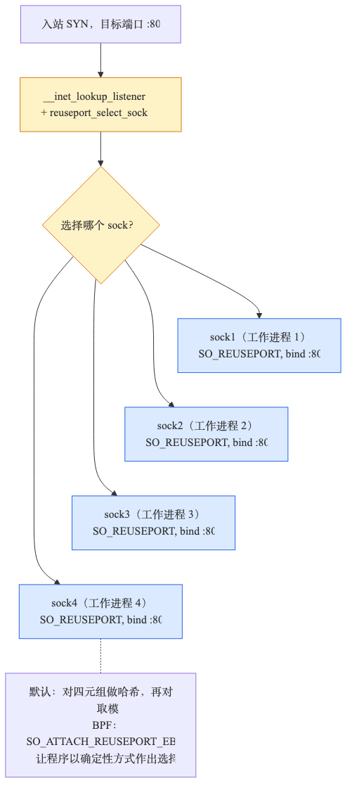
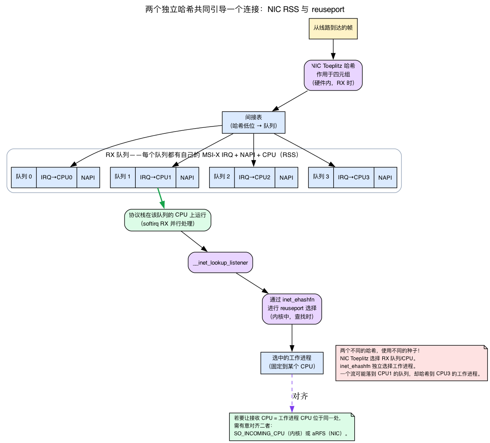
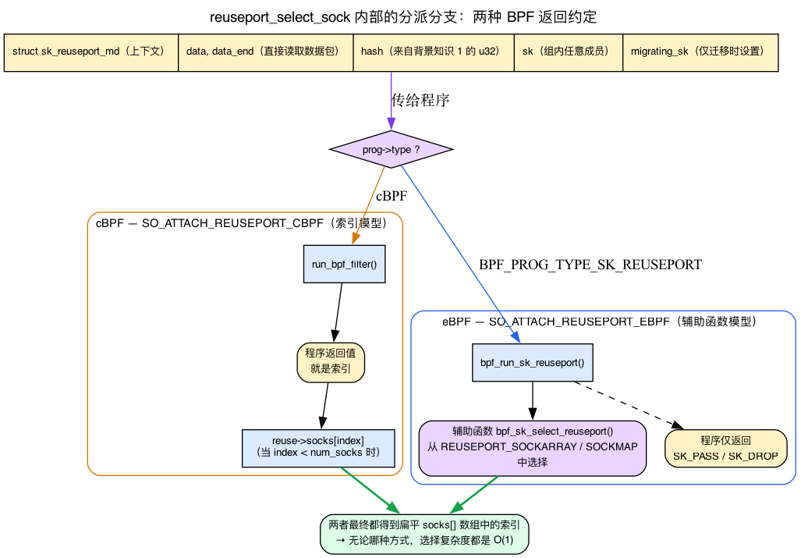
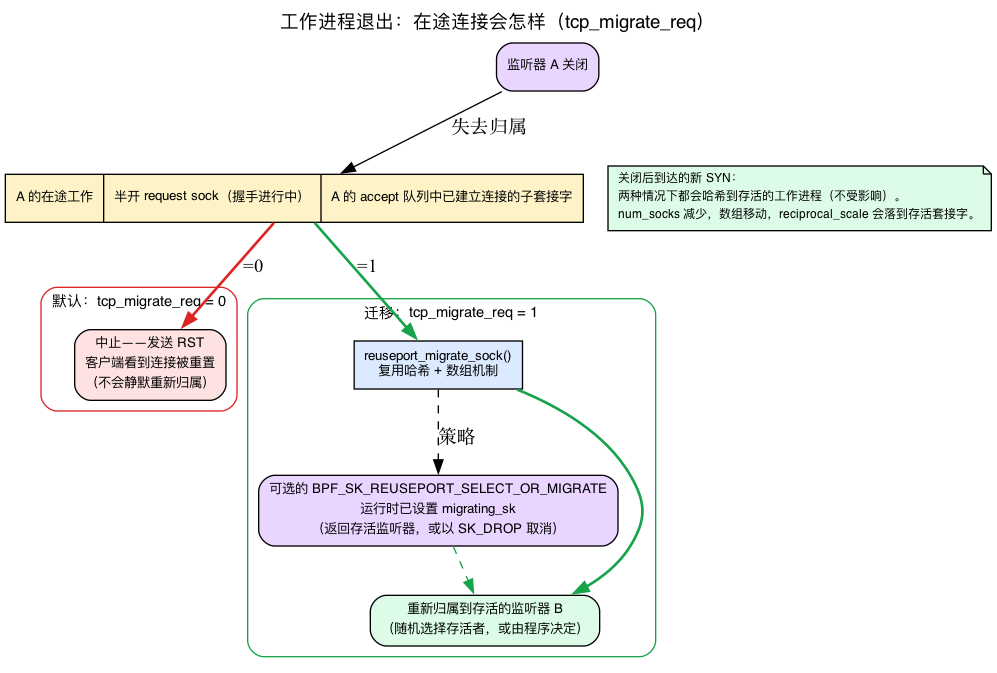

# 第24天 — SO_REUSEPORT 与套接字引导

> **今日任务：** 了解多个工作进程如何能够无竞争地共享单个监听端口，内核*究竟*如何决定哪个工作进程获得每个连接，以及 BPF 如何接管这一决策以进行自定义负载均衡。在这个过程中，我们将讲授套接字引导实际依赖的四项机制——驱动选择过程的流哈希、负责把数据包分配到不同核心的 NIC 硬件、允许自定义选择逻辑的 BPF 程序模型，以及当工作进程死亡时在途连接究竟会发生什么。总时间：约 110 分钟。



## 单一监听器问题

在 `SO_REUSEPORT` 出现之前，多工作进程服务器通常采用以下两种方式之一：

1. **单个监听套接字，通过 `accept()` 共享。** 所有工作进程都在同一个 FD 上调用 `accept()`。一个*阻塞式* `accept()` 从约 2.4（2000 年）起就采用 wake-one 机制：`inet_csk_wait_for_connect` 通过 `prepare_to_wait_exclusive`（`net/ipv4/inet_connection_sock.c:622`）为等待者排队，其注释为"True wake-one mechanism for incoming connections: only one process gets woken up, not the whole herd."。因此，采用阻塞式 `accept()` 的设计**不会**遭受惊群问题。不过，延续到 2010 年代的惊群问题其实是另一种情况：工作进程通过 `epoll_wait`/`select`/`poll` 在共享监听 FD 上等待。一个新连接使 FD 变为可读，并唤醒*所有* epoll 等待者，随后只有一个能成功调用 `accept()`。`EPOLLEXCLUSIVE`（Linux 4.5，2016）——一个作用在 **epoll** 上的标志，而不是在 `accept()` 上的——通过只唤醒一个等待者解决了这个问题。但无论采用哪种方式，一个套接字后面仍只有一条 accept 队列，由一个套接字锁保护——这才是真正的瓶颈。

2. **一个监听进程，通过 fd-passing 或 socketpair 将连接推送给工作进程。** 多了一次中转（监听器必须接受连接，然后传递它），也增加了复杂性（工作进程管理）。

两种方案都没有消除监听端的瓶颈。

## `SO_REUSEPORT` 的作用

Linux 3.9（2013 年）加入了这一选项。`setsockopt(fd, SOL_SOCKET, SO_REUSEPORT, &one, sizeof(one))`。在每个工作进程的套接字上设置，在 `bind()` *之前*，具有相同的 UID 和相同的 `(addr, port)`。内核允许 N 个套接字同时绑定相同的 `(addr, port)`——但前提是所有这些套接字都设置了 `SO_REUSEPORT`。

```c
int sock = socket(AF_INET, SOCK_STREAM, 0);
int opt = 1;
setsockopt(sock, SOL_SOCKET, SO_REUSEPORT, &opt, sizeof(opt));
struct sockaddr_in addr = { AF_INET, htons(80), INADDR_ANY };
bind(sock, (struct sockaddr*)&addr, sizeof(addr));
listen(sock, 128);
/* Each of N workers does this independently, with their own FD */
```

现在每个工作进程都有自己的监听套接字和自己的 accept 队列。热路径不再需要共享状态。

### 背景 0：该组是一个扁平数组，并非链表

所有通过 `SO_REUSEPORT` 绑定相同 `(addr, port)` 的套接字都被集合到一个内核对象中：**`struct sock_reuseport`**（`include/net/sock_reuseport.h:13`）。关键在于它的结构——它是一个**套接字指针的扁平数组**，并非链表：

```c
struct sock_reuseport {
    struct rcu_head     rcu;
    u16                 max_socks;          /* length of socks[] */
    u16                 num_socks;          /* live elements */
    u16                 num_closed_socks;
    u16                 incoming_cpu;
    /* ... */
    struct bpf_prog __rcu *prog;            /* optional BPF sock selector */
    struct sock         *socks[] __counted_by(max_socks);
};
```

两个字段驱动了今天的一切。**`socks[]`** 是该组的监听套接字的扁平数组，而 **`num_socks`**（一个 `u16`，因此最多有 65535 个工作进程）是记录其中有多少个仍处于活动状态。因为它是一个数组，“选择某个工作进程”是一次 **O(1) 的数组索引**——`socks[i]`——而不是列表遍历。可选的 `prog` 是一个单一的 BPF 程序，在 RCU 下保持，可以接管选择过程。请记住这幅数组图景：*本章中的*每一种*选择机制都以“计算一个索引 `i`，返回 `socks[i]`”结束。

### 内核如何选择一个

当 SYN 到达时，内核在 **`__inet_lookup_listener`**（`net/ipv4/inet_hashtables.c:467`）中进行查找。它找到 `(addr, port)` 的 `lhash2` 监听器桶（监听套接字的每个 `(addr, port)` 哈希桶）。如果多个套接字通过 `SO_REUSEPORT` 共享该槽位，查找会通过一个简短的封装函数 **`inet_lookup_reuseport`**（`net/ipv4/inet_hashtables.c:392`）进行，该包装器计算每流哈希，然后调用 **`reuseport_select_sock`**（`net/core/sock_reuseport.c:568`）来选择索引。

常见的一句话概括是“对四元组做哈希，再对 N 取模”。这*几乎*正确，却会在分析亲和性、重启和 CPU 绑定时造成误导。因此，在依靠这个模型继续推理之前，先把实际哈希过程讲清楚。

## 背景 1：实际驱动选择过程的流哈希

整个“相同客户端 → 相同工作进程”的故事都依赖于一个 `u32`。今天实验中的探针将其打印为 `reuseport_select_sock` 中的 `arg1`。这个数从何而来？“对 N 取模”究竟意味着什么？

### 该哈希与连接表使用的是同一类哈希

`reuseport_select_sock` **不会**自己计算哈希 — 它是被传入的。调用者 `inet_lookup_reuseport` 从 SYN 的 4 元组（`net/ipv4/inet_hashtables.c:402`）计算它：

```c
if (sk->sk_reuseport) {
    phash = INDIRECT_CALL_2(ehashfn, udp_ehashfn, inet_ehashfn,
                            net, daddr, hnum, saddr, sport);
    reuse_sk = reuseport_select_sock(sk, phash, skb, doff);
}
```

对于 TCP，`ehashfn` 就是 **`inet_ehashfn`**——与与已建立连接表所用的哈希属于*同一家族*（也就是第13天介绍的 `ehash`）。reuseport 选择器并没有另造一种哈希；它只是针对入站 SYN 的 4 元组重新计算连接哈希。因此这种亲和性是“按流”的：相同的 4 元组总会产生相同的 `phash`。

### 哈希以每次启动时生成的随机密钥为种子

这是“对 4 元组取模”框架隐藏的细微之处。`inet_ehashfn` **不是** 4 元组的纯函数（`net/ipv4/inet_hashtables.c:40`）：

```c
u32 inet_ehashfn(const struct net *net, const __be32 laddr,
                 const __u16 lport, const __be32 faddr, const __be16 fport)
{
    return lport + __inet_ehashfn(laddr, 0, faddr, fport,
                                  inet_ehash_secret + net_hash_mix(net));
}
```

它混合了 **`inet_ehash_secret`** — 每次启动时生成一次的随机值 — 加上 `net_hash_mix(net)`，一个每网络命名空间的盐值。由此可以得到一个需要特别强调的结论：

> **亲和性（“相同客户端 → 相同工作进程”）在一次启动的生命周期内、在一个网络命名空间中保持。** 系统重启后，密钥会被重新生成，所以*整套映射都会重新排列* — 昨天命中工作进程 2 的客户端今天可能会命中工作进程 0。两个不同的 netns 也会以不同的方式映射相同的 4 元组。

今天的 AFFINITY 实验 — 从同一源端口连接两次，观察同一个工作进程应答 — 能工作*是因为在系统保持运行期间密钥是固定的*，而不是因为 4 元组单独确定了工作进程。对于任何在这上面为各个工作进程构建“粘性”缓存的人来说，这是一个重要的注意事项。

### “对 N 取模”实际上是乘法-移位

`reuseport_select_sock` 会在 `reuseport_select_sock_by_hash`（`net/core/sock_reuseport.c:527`）中把这个 `u32` 哈希缩放为数组索引：

```c
i = j = reciprocal_scale(hash, num_socks);
```

而 `reciprocal_scale`（`include/linux/math.h:194`）**不是**算术取模：

```c
static inline u32 reciprocal_scale(u32 val, u32 ep_ro)
{
    return (u32)(((u64) val * ep_ro) >> 32);
}
```

它将哈希乘以 `num_socks` 作为 64 位乘积，并取**高** 32 位 — 一种“乘法移位”运算，将任何 `u32` 映射到 `[0, num_socks)`。这种缩放与 `hash % N`（哈希值对 N 取模）一样，都能把结果均匀分散到 N 个槽位，但*给定哈希值落入的具体索引与 `%` 得出的索引并不相同*。因此，需要预测具体索引时，应说“缩放到 `[0, N)`”，而不是“对 N 取模”。内核对该函数自己的注释承认它“有点像取模，只是结果并非真正的取模结果”。

![从 4 元组通过 inet_ehashfn 和 reciprocal_scale 到 socks[] 索引的流哈希管道](diagrams/day24_hash_pipeline.png)

### 另一种引导手段：SO_INCOMING_CPU

“纯四元组哈希”的图景还需考虑一个例外。回顾 `reuseport_select_sock_by_hash`（`net/core/sock_reuseport.c:539`）：在计算起始索引后，它检查 `READ_ONCE(reuse->incoming_cpu)`（`sk_incoming_cpu == raw_smp_processor_id()` 比较在 `:544`）。注意此首选项仅在 `reuseport_select_sock_by_hash` 的侦听器（非 `TCP_ESTABLISHED`）分支中评估。如果组内*任一*套接字 **`SO_INCOMING_CPU`**（`SO_INCOMING_CPU = 49`、`include/uapi/asm-generic/socket.h:80`），选择器*更倾向于其 `sk_incoming_cpu == raw_smp_processor_id()` 的套接字*——即，它将连接引导到已在处理数据包的 CPU 上运行的工作进程，覆盖纯哈希选择。下面的 CPU 绑定实验依赖于仅哈希分布；只需知道 `SO_INCOMING_CPU` 作为*替代*引流策略存在，它按接收 CPU 而非流哈希选择工作进程。我们将在背景 2 中看到为什么这种控制手段是硬件 RX 引导的桥梁。

## 背景 2：NIC RSS——在硬件中跨核心分配数据包

今天的 CPU 绑定实验的最终结论是“结合 NIC RSS，你将获得端到端的多核心扩展性”。RSS 是这一结论的“另一半”，而本书之前没有定义它——第1天讲解了**单个** RX 描述符环；RSS 是当有多个环时会发生的情况。

### RSS = 多个 RX 环，每个都有自己的 IRQ、NAPI 和 CPU

回顾第1天的 RX 描述符环：一个环形描述符数组，每个描述符都命名一个 NIC 填充的 DMA 缓冲区，驱动程序的 NAPI 轮询（第2天）会取走已经完成的描述符。真实的多队列 NIC 有**N 个这样的环**——每个硬件队列一个。关键是，每个队列都有：

- 它**自己的 MSI-X 中断**，所以不同的队列可以中断不同的 CPU，以及
- 它**自己的 NAPI 上下文**（第2天的 `struct napi_struct`），所以不同的 CPU 为不同的队列运行 softirq RX *并行*。

这就是**RSS——接收端缩放**（`Documentation/networking/scaling.rst:33`）。一个 CPU 不再是接收路径的瓶颈：流 A 的协议栈可以在 CPU 0 上运行，而流 B 在 CPU 3 上运行，同时进行。

### NIC 如何决定使用哪个队列

NIC 对每个传入的帧进行哈希——通常是**对 4 元组的 Toeplitz 哈希**——并使用哈希低位查询一张**间接表**；表项命名 RX 队列（`scaling.rst:42`）。这是背景 1 中软件哈希的*硬件对应物*：两者都分散相同的流空间，一个在接收时由硬件完成，另一个在内核查找监听器时完成。

### RSS 与 SO_REUSEPORT 为何能配合使用——以及为什么它不是自动的

这两个机制回答不同的问题：

- **RSS 决定哪个 CPU 运行协议栈**处理数据包（哪个 RX 队列 → 哪个 softirq → 哪个核心）。
- **SO_REUSEPORT 决定哪个监听套接字**（因此哪个 accept 队列，因此哪个工作进程）获得完成的连接。

如果工作进程 N 被绑定到 CPU N *并且* RSS 恰好也将该流的 softirq 放在 CPU N 上，那么 SYN 被处理，连接被接受，工作进程**整个过程都在同一个核心上完成**读取它——没有套接字及其数据的跨核心缓存反弹。

但要注意这一点：**这种同核放置并不会自动实现。** NIC 的 Toeplitz 哈希和内核的 `inet_ehashfn` 使用*不同的算法和不同的种子*，所以 RSS 队列和 reuseport 索引是**彼此独立的**——一个流很容易落在 CPU 1 的 RX 队列上，但哈希到 CPU 3 上的工作进程。要实际固定“在 CPU N 上接收 → 由 CPU N 上的工作进程接受”，你需要主动对齐二者：`SO_INCOMING_CPU`（背景 1）使 reuseport 优先选择接收 CPU 上的套接字，而**aRFS**（加速接收流引导）促使 NIC 把流量引导到由套接字所属 CPU 处理的队列。

当 NIC *缺少* RSS 时，内核提供软件回退，在软件中把收到的数据包重新分配到各个 CPU：**RPS**（接收数据包方向）和**RFS**（接收流引导）（`scaling.rst:17`）。这里一句话就够了——只要知道如果你的 NIC 是单队列，交叉引用就存在。



## BPF 控制的选择

默认哈希有时并不适合需求。示例：
- 通过 URL 哈希的粘性会话（需要查看 L7）。
- 按应用定义的会话 ID 路由。
- 把来自特定源地址范围的连接固定到指定工作进程。

你可以附加一个 BPF 程序来控制选择：

```c
int prog_fd = bpf_program_load(...);
setsockopt(sock, SOL_SOCKET, SO_ATTACH_REUSEPORT_EBPF, &prog_fd, sizeof(prog_fd));
```

`reuseport_attach_prog`（`net/core/sock_reuseport.c:683`）是内核侧处理程序；它在 RCU 下将程序存储在 `struct sock_reuseport->prog` 中。

但“程序返回所选套接字的索引”——这是常见说法——是*旧的*约定，将其与现代约定混淆会使 `test_select_reuseport_kern.c` 难以理解。实际上有两个选择模型。背景 3 将分别说明这两种模型。

## 背景 3：SK_REUSEPORT 程序、其上下文和两种返回约定

第2天已经介绍了 eBPF 程序：经过验证、在钩子处附加的可在内核中运行的代码（第2天的例子是驱动程序处的 XDP）。这里新增的内容只有两点——这个钩子传递给程序的**上下文结构体**，以及程序如何选出目标套接字的**两种不同的约定**。

### 程序类型确定了上下文

*程序类型*确定了（a）程序接收的上下文结构体是什么，以及（b）其结果的含义。对于 reuseport，类型是**`BPF_PROG_TYPE_SK_REUSEPORT`**（`include/uapi/linux/bpf.h:1082`），上下文是**`struct sk_reuseport_md`**（`include/uapi/linux/bpf.h:6620`）：

```c
struct sk_reuseport_md {
    void *data;          /* L4 header onward — for direct packet reads */
    void *data_end;      /* one past the directly-readable bytes */
    __u32 len;           /* total length from the L4 header */
    __u32 eth_protocol;
    __u32 ip_protocol;
    __u32 bind_inany;
    __u32 hash;          /* the same 4-tuple flow hash from Background 1 */
    __bpf_md_ptr(struct bpf_sock *, sk);            /* any group member */
    __bpf_md_ptr(struct bpf_sock *, migrating_sk);  /* set only when migrating */
};
```

因此程序可以读取流 `hash`（来自背景 1 的 `u32`），查看协议字段，通过 `sk` 了解本地 IP/端口，并且——对于基于负载的路由——直接读取数据包中 `data` 和 `data_end` 之间的字节。要访问**超过**`data_end` 的字节（例如用于哈希的 L7 URL），它调用辅助函数**`bpf_skb_load_bytes_relative`**；该辅助函数是“仅元数据”和“查看负载”之间的桥梁。

### 两种约定，一个分派分叉

需要澄清的是*返回约定*。分派就存在于 `reuseport_select_sock`（`net/core/sock_reuseport.c:594`）内部：

```c
if (prog->type == BPF_PROG_TYPE_SK_REUSEPORT)
    sk2 = bpf_run_sk_reuseport(reuse, sk, prog, skb, NULL, hash);  /* eBPF: helper model */
else
    sk2 = run_bpf_filter(reuse, socks, prog, skb, hdr_len);        /* cBPF: index model */
```

**(1) 经典 cBPF** — 通过 `SO_ATTACH_REUSEPORT_CBPF`（`= 51`、`socket.h:85`）附加。程序**返回一个整数索引**。`run_bpf_filter`（`net/core/sock_reuseport.c:497`）获取该返回值并执行：

```c
index = bpf_prog_run_save_cb(prog, skb);
if (index >= socks)
    return NULL;
return reuse->socks[index];
```

因此“程序返回所选套接字索引”是**cBPF** 的故事——进入 `socks[]` 的直接索引。

**(2) 现代 eBPF** — 通过 `SO_ATTACH_REUSEPORT_EBPF`（`= 52`、`socket.h:86`）附加。该程序**不**通过返回值进行选择。其返回代码仅为**`SK_PASS`/`SK_DROP`**；实际选择则通过辅助函数**`bpf_sk_select_reuseport(reuse_md, &map, &key, flags)`**（`include/uapi/linux/bpf.h:3750`）进行，该函数从程序按键查询的 `REUSEPORT_SOCKARRAY`/`SOCKMAP` 中选择一个套接字。这是 `test_select_reuseport_kern.c` 使用的模型。

两种约定最终都回到背景 0 所述的结构：索引扁平的 `socks[]` 数组。扁平数组是*为什么*选择是 O(1)，无论你使用哪种约定。



## 各工作进程独立的 accept 队列 — 具体好处

- **无 accept 队列竞争。** 每个工作进程清空自己的队列。
- **连接亲和性。** 相同的四元组 → 通过流哈希映射到同一个工作进程。有利于缓存局部性和会话粘性 — *但仅限于一次系统启动期间* （背景 1）。
- **易于工作进程扩展。** 启动工作进程时，它加入组的数组；关闭工作进程时，它被移除。
- **CPU 绑定。** 将工作进程 N 绑定到 CPU N；内核将新连接分配给所有工作进程，工作进程 N 所在的 CPU 处理对应份额，并与 NIC RSS 配合 （背景 2）。

## 注意事项

- **所有套接字必须在绑定之前设置 `SO_REUSEPORT`。** 中途更改不起作用。
- **需要 UID 匹配。** 组内所有套接字必须属于同一用户。这样可防止用户 A 抢占用户 B 的端口。
- **当工作进程退出时**，`num_socks` 下降，存活的套接字在数组中移位 — 因此 `reciprocal_scale(hash, num_socks)` 映射会改变。已接受的连接不受影响（它们不再在监听器查找中）。但是**绑定到已关闭监听器的在途握手，默认不会被悄然改派** — 见背景 4；这是 `SO_REUSEPORT` 中最常被误述的部分。
- **`SO_REUSEPORT` ≠ `SO_REUSEADDR`。** `REUSEADDR` 让你重新绑定处于 TIME_WAIT 中的端口；`REUSEPORT` 让多个套接字同时绑定。二者名称相似，语义却不同。

## 背景 4：工作进程关闭时，在途连接会发生什么

SYN 到达后并不会一直悬而未决，直到调用 accept — SYN 到达时，内核创建一个绑定到**某个特定监听套接字**的**请求套接字（request sock）**。半开的握手，以及之后已建立但尚未被接受的子连接，都归属于*那个监听器*。因此问题是：当那个监听器关闭时，其在途的请求套接字（request sock）和 accept 队列中的子连接会发生什么？

### 默认行为：中止连接

默认情况下（**`net.ipv4.tcp_migrate_req = 0`**，`net/ipv4/sysctl_net_ipv4.c:1048`），内核会**中止**它们。文档明确说明（`Documentation/networking/ip-sysctl.rst:990`)：“当一个监听器关闭时，握手过程中的在途请求套接字（request sock）和 accept 队列中已建立的套接字被中止。”客户端会被 **RST**。只有在关闭*之后*到达的全新 SYN 会被哈希到一个仍存活的工作进程。

这正是过去所谓“连接会自动改派，客户端看不出差别”的说法错误的地方。对于严格在关闭**之后**到达的连接，这是对的。对于在关闭时已经在途的连接，事实并非如此 — 默认情况下这些连接会被 RST，而不会迁移到其他监听器。

### 迁移：tcp_migrate_req = 1 和 SELECT_OR_MIGRATE

设置 `tcp_migrate_req = 1` 使得能够**迁移**那些失去监听器的请求套接字（request sock）和 accept 队列子连接到同一组中的另一个活跃监听器，而不是中止它们。内核通过 **`reuseport_migrate_sock`** (`net/core/sock_reuseport.c:620`) 完成迁移，它复用了普通选择路径的*同一套*哈希与数组机制 — 从 `socks[]` 中选择一个存活的监听器。

为了*策略控制*选择哪个存活监听器，有一个不同的 eBPF 预期挂载类型（expected attach type），**`BPF_SK_REUSEPORT_SELECT_OR_MIGRATE`**(`include/uapi/linux/bpf.h:1138`)。仍运行同一个 `SK_REUSEPORT` 程序，但现在**`reuse->migrating_sk` 被设置**为需要迁移的套接字（它可能是完整的已建立套接字，也可能是半开的请求套接字（request sock））。程序选择仍存活的监听器 — 或 `SK_DROP` 以取消迁移。如果没有这样的程序，使用 `tcp_migrate_req = 1`，内核会**随机选择一个活动监听器**(`reuseport_migrate_sock` 落入 `select_by_hash`)。

因此，准确的心智模型如下：

| 情况 | `tcp_migrate_req=0`（默认） | `tcp_migrate_req=1` |
|---|---|---|
| SYN 在关闭**之后**到达 | 被哈希到一个仍存活的监听器（正常） | 被哈希到一个仍存活的监听器（正常） |
| 已关闭监听器的在途 reqsk / accept 队列子连接 | **RST — 客户端收到重置** | 迁移到一个仍存活的监听器（随机的，或根据 `SELECT_OR_MIGRATE` 程序） |
| 已由退出的工作进程 `accept()` 的连接 | RST（worker 的 FD 已关闭） | RST（worker 的 FD 已关闭） |



## 今日实验

一个简单的 reuseport 服务器：

```bash
cat << 'EOF' > /tmp/reuseport_srv.py
import socket, os, sys
s = socket.socket(socket.AF_INET, socket.SOCK_STREAM)
s.setsockopt(socket.SOL_SOCKET, socket.SO_REUSEPORT, 1)
s.bind(("0.0.0.0", 8080))
s.listen(64)
print(f"worker {os.getpid()} listening", flush=True)
while True:
    c, addr = s.accept()
    c.send(f"hello from {os.getpid()}\n".encode())
    c.close()
EOF

# Spawn 3 workers
python3 /tmp/reuseport_srv.py &
python3 /tmp/reuseport_srv.py &
python3 /tmp/reuseport_srv.py &

# Wait until the listener is actually up. Python startup + bind()/listen() is
# racy against the first connect, so without this the first several nc attempts
# hit "Connection refused" before any worker has finished binding.
until nc -z localhost 8080 2>/dev/null; do sleep 0.1; done

# Watch the kernel selector itself fire. arg1 of reuseport_select_sock is the
# per-flow hash from Background 1 — the u32 that reciprocal_scale turns into an
# index: reuseport_select_sock(sk, u32 hash, ...).
sudo bpftrace -e 'kprobe:reuseport_select_sock { printf("reuseport_select_sock hash=%u\n", arg1); }' &
sleep 2

# Hit it 20 times, see different PIDs respond. The </dev/null is required: this
# box ships OpenBSD netcat, whose -q N only quits N seconds after *stdin EOF* —
# in a scripted loop stdin is the terminal and never reaches EOF, so without the
# redirect nc blocks forever even after the worker closes its side.
for i in $(seq 1 20); do echo -n "$i: "; nc -q 1 localhost 8080 </dev/null; done
# Roughly 1/3 of responses from each worker. Each connect uses a fresh ephemeral
# source port, so each is a distinct 4-tuple -> distinct hash -> the picks fan out.

sudo pkill -f bpftrace

# Inspect the bind hash
sudo ss -tlnp | grep :8080
# 3 listeners, all on 0.0.0.0:8080
```

可以看到三个工作进程共同分担负载，每个连接产生一行 kprobe 输出：

```
worker 12345 listening
worker 12346 listening
worker 12347 listening
Attaching 1 probe...
1: hello from 12345
2: hello from 12347
3: hello from 12346
...
reuseport_select_sock hash=2847561234
reuseport_select_sock hash=901233517
reuseport_select_sock hash=3310928844
...
```

bpftrace 打印的哈希值是 `inet_ehashfn` 根据 `(saddr, sport, daddr, dport)` 计算得出（背景 1）— 混合了每次启动生成的秘密值。由于这里的每个 `nc` 都会获得一个新的临时源端口，所以每个哈希值都不同，响应的 PID 也各不相同。（确切的哈希值和 PID 在你的机器上会不同 — 重启后也会再次不同，因为秘密值会重新生成。）

验证内核级哈希是基于 4 元组的 — 以及相同的元组是确定性的（“同一客户端 → 同一工作进程”的亲和性，在*此次启动内*为真）：

```bash
# Re-attach the selector probe so we can read the hash for each connect:
sudo bpftrace -e 'kprobe:reuseport_select_sock { printf("hash=%u\n", arg1); }' &
sleep 2

# (1) SPREAD: same source IP, different source ports -> different 4-tuple ->
#     different hash -> connections fan out across workers.
for p in 50000 50001 50002 50003 50004; do
  echo -n "port $p: "
  nc -q 1 -p $p localhost 8080 </dev/null || true
done
# Different PIDs respond, and bpftrace prints a different hash for each port.

# (2) AFFINITY: a *fixed* 4-tuple yields a FIXED hash, hence the same worker.
nc -q 1 -p 51000 localhost 8080 </dev/null   # note the hash and the responding PID
sleep 61                             # let TIME_WAIT on :51000 drain before reuse
nc -q 1 -p 51000 localhost 8080 </dev/null   # SAME hash, SAME PID -> affinity confirmed

sudo pkill -f bpftrace
```

五个固定源端口产生五个不同的哈希值（分散）；来自*同一* `-p 51000` 的两个连接产生**相同的**哈希值并由**同一个** PID 响应。这种确定性是连接亲和性 — 对每个工作进程的缓存很有用。（不要尝试用简单重复的 `nc` 不带 `-p` 来展示这一点：每次临时源端口都会改变，所以哈希值也会改变。）并记住背景 1 的注意事项：确定性由*每次启动的*秘密值锚定，所以这个确切的哈希到 PID 的映射在重启后**不**稳定。

### 将工作进程绑定到 CPU

```bash
# Kill the 3 unpinned workers first — otherwise they stay in the reuseport group
# and absorb part of the hash, muddying the cross-core distribution below.
pkill -f reuseport_srv.py

taskset -c 0 python3 /tmp/reuseport_srv.py &
taskset -c 1 python3 /tmp/reuseport_srv.py &
taskset -c 2 python3 /tmp/reuseport_srv.py &
taskset -c 3 python3 /tmp/reuseport_srv.py &
until nc -z localhost 8080 2>/dev/null; do sleep 0.1; done

# Confirm each worker really is pinned to a distinct CPU:
pgrep -f reuseport_srv.py | while read p; do taskset -cp $p; done

# Drive load and watch the per-CPU spread:
( for i in $(seq 1 2000); do nc -q 0 localhost 8080 </dev/null >/dev/null; done ) &
mpstat -P ALL 1 5
```

每个工作进程应该报告 0-3 中的单一、不同的 CPU，在负载下 user/softirq 时间分布到这四个核心：

```
pid 12345's current affinity list: 0
pid 12346's current affinity list: 1
pid 12347's current affinity list: 2
pid 12348's current affinity list: 3

Linux 7.1.0 (host)   06/12/26   _x86_64_   (4 CPU)

00:24:24     CPU    %usr   %nice    %sys   %soft   %idle
00:24:25       0    3.00    0.00    9.00    4.00   84.00
00:24:25       1    2.97    0.00    8.91    3.96   84.16
00:24:25       2    3.06    0.00    9.18    4.08   83.67
00:24:25       3    2.94    0.00    8.82    3.92   84.31
```

（确切的百分比和 PID 会有所不同；关键是所有四个核心都显示活动，而不是一个核心承载所有内容。）

此时，流哈希会把入站连接分散到 CPU 0–3。结合 **NIC RSS**（背景 2 — NIC 自己的 Toeplitz 哈希在硬件中将流分布到队列/核心上），你可以获得端到端的多核扩展能力，而无需任何显式分发逻辑。只需记住这两个哈希是彼此独立的（背景 2）：对于*真正的*同核并置，你需要添加 `SO_INCOMING_CPU` 或 aRFS。

### 清理

工作进程永远循环（`while True: s.accept()`），所以它们一直占用 `:8080` 直到你停止它们 — 让它们继续运行会阻止此实验的再次运行，以及后续所有使用 8080 端口的 TCP 实验。

```bash
sudo pkill -f reuseport_srv.py
rm -f /tmp/reuseport_srv.py
# Confirm the port is free — this should print nothing:
ss -tlnp | grep :8080
```

## 常见疑问

> **问：文档一直说“模 N 运算”，但代码写的是 `reciprocal_scale`。我应该相信哪一个？**
>
> 答：对于*分散*，无所谓——`reciprocal_scale(hash, N) = (u64)hash * N >> 32` 和 `hash % N` 的分布效果一样均匀。对于*预测*，有关系：哈希实际映射到的索引是乘法的高 32 位，而不是取余数，所以不要手算 `hash % N` 然后期望内核的索引也是这样。应该说“缩放到 `[0, N)`”。

> **问：如果亲和性只是一个 4 元组哈希，为什么重启后相同的四元组会连接到不同的工作进程？**
>
> 答：因为哈希不仅仅包含 4 元组——`inet_ehashfn` 还混入了 `inet_ehash_secret`，每次启动时生成一次（每个命名空间还有 `net_hash_mix(net)`）。相同启动、相同网络命名空间→相同映射。新启动→新密钥→重新洗牌的映射。要相应地构建粘性缓存。

> **问：一个工作进程在握手中途挂掉了。原来的答案说客户端“看不出区别”——这对吗？**
>
> 答：只有在关闭*之后*到达的 SYN 报文是这样。默认情况下（`tcp_migrate_req=0`），已死工作进程的待处理请求套接字（request sock）和 accept 队列中的连接会**用 RST 复位**。可以设置 `tcp_migrate_req=1`（最好再加上一个 `BPF_SK_REUSEPORT_SELECT_OR_MIGRATE` 程序）来把它们迁移到幸存的工作进程。见背景 4。

> **问：我把工作进程绑定到 CPU 上并启用了 RSS，但流仍在核心间跳动。为什么？**
>
> 答：RSS 的 Toeplitz 哈希和内核的 `inet_ehashfn` 是*不同的哈希，使用不同的种子值*（背景资料 2）。RSS 选择 RX 队列/CPU；reuseport 独立地选择工作进程。只有对齐它们，它们才会位于同一核心——通过套接字上的 `SO_INCOMING_CPU` 或 NIC 上的 aRFS。

## 在内核中读什么

- **`net/core/sock_reuseport.c:320`** — `reuseport_add_sock`。新套接字如何加入现有的 reuseport 组。约 47 行。注意套接字数组（该组是扁平数组，不是链表——选择器通过 `reciprocal_scale(hash, num_socks)` 索引）。

- **`net/core/sock_reuseport.c:568`** — `reuseport_select_sock`。选择器。`prog->type` 分发分叉在这里：`BPF_PROG_TYPE_SK_REUSEPORT` → `bpf_run_sk_reuseport`（辅助函数模型），否则 `run_bpf_filter`（cBPF 索引模型），否则回退到 `reuseport_select_sock_by_hash`。与 `run_bpf_filter`（`:497`）和 `reuseport_select_sock_by_hash`（`:527`）一起阅读。

- **`net/core/sock_reuseport.c:683`** — `reuseport_attach_prog`。BPF 程序如何与 reuseport 组关联。该程序在 RCU 下被保存在 `struct sock_reuseport->prog` 中。

- **`net/ipv4/inet_hashtables.c:467`** — `__inet_lookup_listener`。TCP 端的监听器查找。当 `SO_REUSEPORT` 被设置时，它通过 `inet_lookup_reuseport`（`:392`）进行，后者通过 `inet_ehashfn`（`:40`）计算 `phash` 并调用 `reuseport_select_sock`；否则返回单个监听器。

- **`tools/testing/selftests/bpf/progs/test_select_reuseport_kern.c`** — 示例 SK_REUSEPORT BPF 程序。约 183 行；展示现代辅助函数模型（`bpf_sk_select_reuseport` 进入 sockarray），而非 cBPF 索引返回。

- **`Documentation/networking/scaling.rst`** — RSS / RPS / RFS，硬件对软件 RX 引导三种机制（背景 2）。

- **`Documentation/networking/ip-sysctl.rst`** — 在 `tcp_migrate_req` 中搜索 abort 与 migrate 行为（背景 4）。

## 要点回顾

- **`SO_REUSEPORT`** 让 N 个套接字绑定相同的 `(addr, port)`；它们作为**扁平的 `socks[]` 数组**存在于一个 `struct sock_reuseport` 中（O(1) 索引，不是列表遍历）。
- 每个工作进程都有自己的 accept 队列 → 无争用。
- **默认选择**：基于 4 元组的 `inet_ehashfn` → `u32` 哈希 → `reciprocal_scale(hash, N)`（一个乘法移位到 `[0, N)`，*不是*算术 `% N`）。相同四元组 → 相同工作进程 — 但仅**在一次系统启动和同一 netns 内**，因为哈希由每次启动生成的 `inet_ehash_secret` 作为种子。
- **`SO_INCOMING_CPU`** 是一个替代控制选项：优先选择接收 CPU 上的工作进程，而不是纯哈希。
- **`SO_ATTACH_REUSEPORT_EBPF`** 让 BPF 程序（`BPF_PROG_TYPE_SK_REUSEPORT`，上下文 `struct sk_reuseport_md`）覆盖选择 — 通过辅助函数 **`bpf_sk_select_reuseport`** 返回 `SK_PASS/SK_DROP`，*不是*通过返回索引。（返回索引的约定是较旧的 **cBPF** `SO_ATTACH_REUSEPORT_CBPF` 模型。）
- 所有套接字在绑定前必须设置 `REUSEPORT`，且具有相同的 UID。
- **NIC RSS**（背景 2）通过 Toeplitz 哈希在硬件中跨 RX 队列/CPU 分散流；它与 `SO_REUSEPORT` 组合，但使用*不同的种子*，因此同核放置需要 `SO_INCOMING_CPU`/aRFS。**RPS/RFS** 是软件备选方案。
- **工作进程退出**：默认情况下（`tcp_migrate_req=0`）已关闭监听器的在途 reqsk 和 accept 队列的子连接会被 **RST**；`tcp_migrate_req=1`（+ 可选的 `BPF_SK_REUSEPORT_SELECT_OR_MIGRATE`）改为迁移它们。
- 被 **nginx**、**envoy**、现代 Go/Rust 框架用于多进程扩展。结合 **CPU 绑定** + **NIC RSS** 实现端到端的多核扩展能力。

## 检查问题

如果一个工作进程退出，而在途的 SYN 已经哈希到它，那些新连接会怎样？

<details>
<summary>点击查看答案</summary>

**答案：** 这取决于 `net.ipv4.tcp_migrate_req`，常见的“它们会被改派，客户端看不出区别”的答案在默认情况下是错误的。

- **在关闭*之后*到达的 SYN**被哈希到一个幸存的工作进程——它们确实看不出差别。
- **已关闭监听器的在途请求套接字（request sock）和 accept 队列子连接**在**默认情况下（`tcp_migrate_req=0`），通过 RST 中止**（`Documentation/networking/ip-sysctl.rst:990`）；设置 `tcp_migrate_req=1`（可选地使用 `BPF_SK_REUSEPORT_SELECT_OR_MIGRATE` 程序）以将其迁移到仍存活的监听器。
- **已由退出的工作进程 `accept()` 的连接**不管 `tcp_migrate_req` 如何，都会随其文件描述符关闭而断开。

完整机制见背景 4。

</details>

## 明天

第25天：kTLS — 在内核中加密 TCP 传输。
