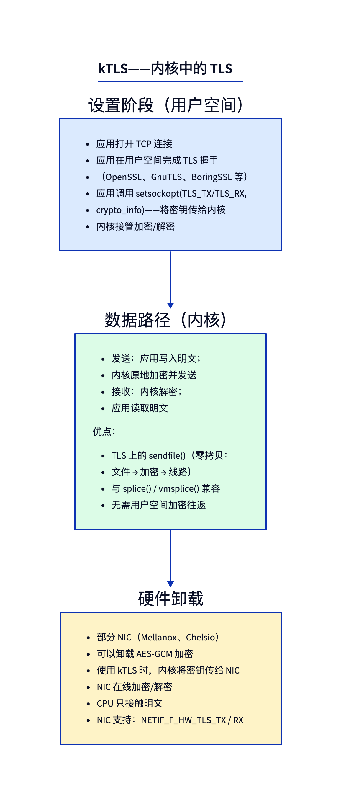
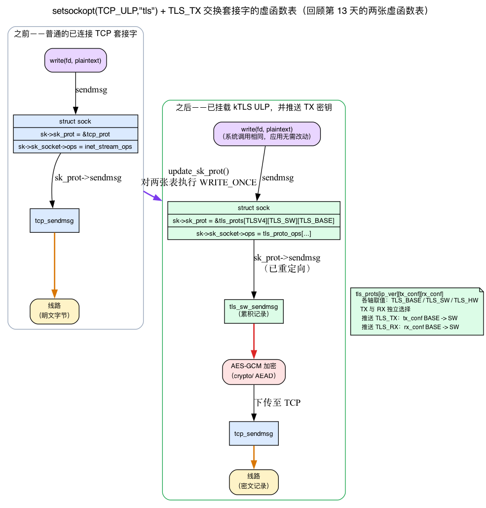
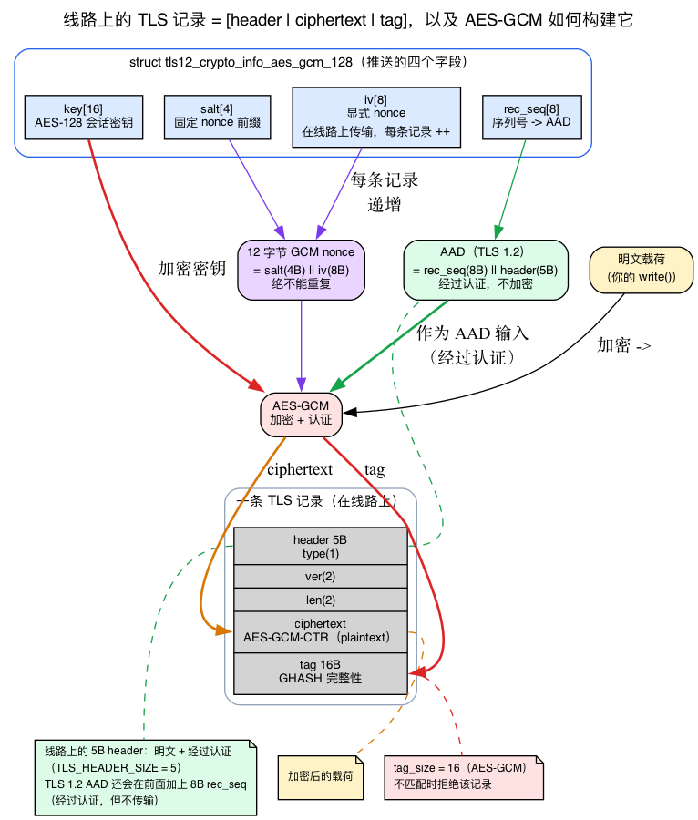
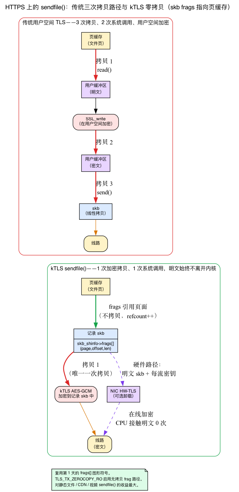
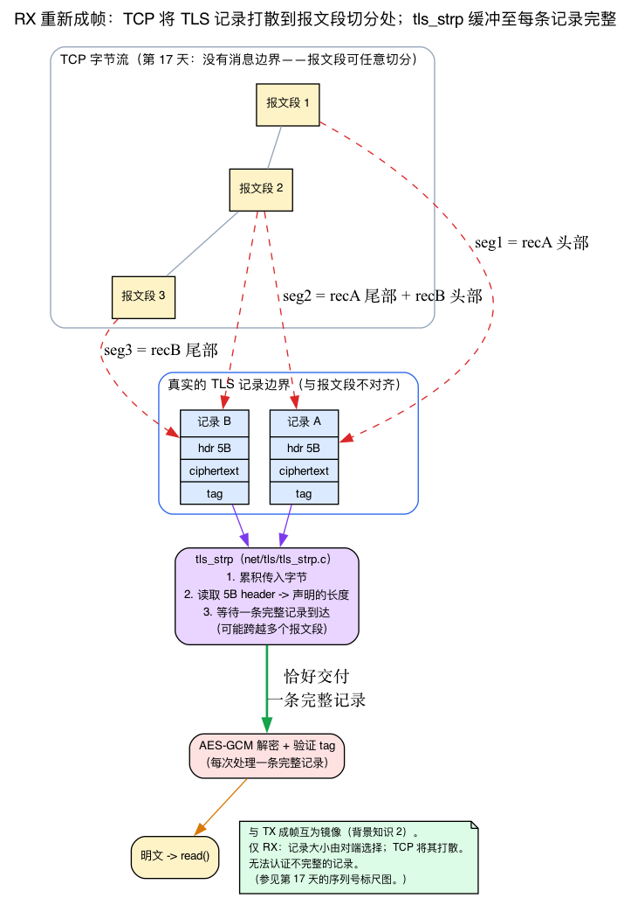

# 第25天 — kTLS：内核内传输加密

> **今日任务：** 了解 Linux 如何把 AES-GCM 引入内核数据路径、为什么这对 HTTPS 上的 `sendfile()` 至关重要，以及 TLS 硬件卸载如何沿用同一模型——并学习它所依赖的四个机制（TCP ULP 框架、AEAD/AES-GCM 和 TLS 记录格式、`sendfile`/`splice` 零拷贝和 RX 记录重新分帧），从而彻底理解整个配置流程。总时间：约 110 分钟。

## kTLS 的作用

内核 TLS（kTLS）让内核负责 TLS *记录的加密和解密*，但不处理握手。基本流程如下：

1. **用户空间执行 TLS 握手** — 使用 OpenSSL、BoringSSL、GnuTLS 或任何握手库。握手产生一个会话密钥（以及 IV、盐值、序列号）。
2. **用户空间通过 `setsockopt(SOL_TLS, TLS_TX, ...)` 和 `TLS_RX` 将密钥交给内核**。
3. **后续套接字 I/O 由内核自动加密/解密。** `write()` 明文 → 内核加密 → 线路上的密文。线路上的密文 → 内核解密 → `read()` 明文。



这种职责划分是刻意为之。握手涉及证书验证、X.509 解析、复杂的协议状态机和不断演变的 TLS 协议。这些都不应该在内核中 — 这会扩大攻击面，需要在每次 TLS 协议更改时更新内核，还会迫使内核追赶 OpenSSL 的功能。**内核只做批量对称加密——也就是连接进入稳态后的数据路径，其中每条记录都是 `AES-GCM(plaintext + AAD)`，除此之外不做别的工作。**

这段描述涉及三个尚未讲解的问题：一个已连接的 TCP 套接字*如何*在应用代码一行未改的情况下突然开始加密 `write()`，`AES-GCM(plaintext + AAD)` *究竟计算什么*（以及 AAD 到底是什么），以及这样做*为什么*值得（`sendfile()` 的零拷贝收益）。在接收端还有第四个问题：TLS 记录与 TCP 报文段不对齐，所以内核在解密前必须重新组织字节流。下面会用独立的背景小节逐一讲清 — 先讲直觉，再看具体的 v7.1 结构/函数 — 最后再串起完整的配置步骤，每一步都基于你已经理解的东西。

---

## 背景 1：TCP ULP 框架 — 动态替换套接字的协议虚表

设置步骤的第 2 步是 `setsockopt(fd, SOL_TCP, TCP_ULP, "tls", 4)`，前文曾一笔带过，只说明了“TCP_ULP = Upper Layer Protocol”。但这一次调用才是“透明加密”这一特性背后的关键技巧 — 让我们把它讲清楚。

### 直观理解：TCP 之上的可插拔适配层

**ULP（Upper Layer Protocol，上层协议）**是位于已建立 TCP 套接字*之上*的适配层，用来拦截其发送和接收路径。可以把它理解成内核提供的一个插槽：“只要指定已注册的 ULP，我就会把它的代码接到系统调用与 TCP 之间。”kTLS 就是这样的 ULP；MPTCP（`.name = "mptcp"`）和 IPsec-in-TCP（`espintcp`）也使用同一机制。（不要把它与 SMC 混淆：SMC 是独立的 `AF_SMC` 协议族，不是 TCP ULP，并会以 `-EOPNOTSUPP` 拒绝 `TCP_ULP`。）

内核维护一个小的 **ULP 注册表**。每个 ULP 都由一个 `struct tcp_ulp_ops` 表示，其中包含名称字符串和若干回调函数（`include/net/tcp.h:2819`）：

```c
struct tcp_ulp_ops {
    struct list_head    list;
    int  (*init)(struct sock *sk);     /* called when the ULP is attached */
    void (*update)(struct sock *sk, struct proto *p, ...);
    void (*release)(struct sock *sk);
    int  (*get_info)(struct sock *sk, struct sk_buff *skb, bool net_admin);
    size_t (*get_info_size)(const struct sock *sk, bool net_admin);
    void (*clone)(const struct request_sock *req, struct sock *newsk, ...);
    char name[TCP_ULP_NAME_MAX];       /* the string userspace passes */
    struct module *owner;
};
```

模块通过调用 `tcp_register_ulp()` 来将自己添加到注册表中。kTLS 注册了 `tcp_tls_ulp_ops`（`net/tls/tls_main.c:1230`），其中 `.name = "tls"`（`:1231`）和 `.init = tls_init`（`:1233`）：

```c
static struct tcp_ulp_ops tcp_tls_ulp_ops __read_mostly = {
    .name = "tls",
    .init = tls_init,
    /* ... */
};
```

### `setsockopt(TCP_ULP, "tls")` 实际做了什么

用户空间发起该调用后，内核运行 `tcp_set_ulp`（`net/ipv4/tcp_ulp.c:157`）：

1. `__tcp_ulp_find_autoload("tls")`（`:163`）按名称搜索注册表，如果 `tls` 模块尚未加载，**自动加载它**（这就是为什么你不必手动 `modprobe tls`）。
2. `__tcp_set_ulp`（`:130`）完成挂载。若已有 ULP，它会返回 `-EEXIST`。更关键的是，它要求套接字**已经连接**：一个 `TCP_LISTEN` 套接字会得到 `-ENOTCONN`，除非 ULP 提供了 `.clone` 回调（`:142`）。这就是为什么握手必须首先完成 — 你将 kTLS 附加到一个*已建立的*连接。
3. 如果检查通过，它调用 `ulp_ops->init(sk)`（`:146`）— 对于 kTLS，是 `tls_init`。

`tls_init`（`net/tls/tls_main.c:1047`）再次检查状态（`sk->sk_state != TCP_ESTABLISHED` → `-ENOTCONN`），通过 `tls_ctx_create`（`:1070`）分配一个 `tls_context`，将两个方向设置为基础状态（`ctx->tx_conf = TLS_BASE; ctx->rx_conf = TLS_BASE`），并调用 `update_sk_prot`（`:1079`）。

### 透明技巧：替换套接字的虚表

关键就在这里。回忆一下来自第13天（背景 3）的**两个分发表**：每个套接字都有 `sk->sk_socket->ops`（一个 `proto_ops`，面向用户空间的 BSD-API 虚表）和 `sk->sk_prot`（一个 `proto`，面向网络的协议虚表）。一次 `write()` 调用会沿着 `socket->ops->sendmsg` → `sk->sk_prot->sendmsg` 向下执行；对于普通 TCP，最终进入的是 `tcp_sendmsg`。

kTLS 只是**把这两个表指向支持 TLS 的版本。** `update_sk_prot`（`net/tls/tls_main.c:131`）正是做这个：

```c
void update_sk_prot(struct sock *sk, struct tls_context *ctx)
{
    int ip_ver = sk->sk_family == AF_INET6 ? TLSV6 : TLSV4;

    WRITE_ONCE(sk->sk_prot,
               &tls_prots[ip_ver][ctx->tx_conf][ctx->rx_conf]);
    WRITE_ONCE(sk->sk_socket->ops,
               &tls_proto_ops[ip_ver][ctx->tx_conf][ctx->rx_conf]);
}
```

此后，*相同的* `write()`/`sendmsg()` 系统调用会进入 TLS sendmsg（它进行加密，然后调用 `tcp_sendmsg` 以发送到线路），而不是直接进入 `tcp_sendmsg`。应用程序没有改变，底层虚表却已经替换。这就是“透明”的全部含义。



### `[tx_conf][rx_conf]` 状态矩阵

注意索引：`tls_prots[ip_ver][ctx->tx_conf][ctx->rx_conf]`。已安装的虚表取决于**二维状态**，两个方向各占一维。每个轴是 `TLS_BASE`、`TLS_SW` 或 `TLS_HW` 之一（`include/net/tls.h:85`）：

- `TLS_BASE` — kTLS 已挂载，但该方向尚不处理流量。
- `TLS_SW` — 软件加密/解密（内核的 `crypto/` 框架）。
- `TLS_HW` — 硬件卸载（NIC 执行 AES-GCM）。

因此，**TX 与 RX 可以独立选择实现路径**：你可以运行硬件卸载的 TX，同时 RX 保持在软件中，两个方向分别选择矩阵中的行和列。这也解释了*为什么* TX 密钥与 RX 密钥要通过两个独立的 `setsockopt` 提交（见下面的步骤 3 和 4）：每次调用只升级一个方向（例如 `TLS_BASE → TLS_SW`），再运行 `update_sk_prot` 重新设置虚表。

还有一个微妙但重要的后果：**仅调用 `setsockopt(TCP_ULP, "tls")` 还不会改变流量。** 它安装 `tls_prots[*][TLS_BASE][TLS_BASE]`，这个版本的主要作用，是让 `setsockopt` 处理程序开始接受 `SOL_TLS`（`build_protos` 设置 `prot[TLS_BASE][TLS_BASE].setsockopt = tls_setsockopt`、`net/tls/tls_main.c:1006`）。加密仅在你提交密钥（TLS_TX/TLS_RX）后开始，这会将该轴翻转到 `TLS_SW`（或 `TLS_HW`）。

> ### 常见疑问
>
> **问：如果 `TCP_ULP "tls"` 在提交密钥之前不加密任何内容，为什么还要单独执行这一步？为什么不在一次调用中提交密钥？**
>
> 答：因为两个步骤确实做的是不同的事情，拆成两步可以让各自的职责保持清晰。`TCP_ULP "tls"` 完成的是*结构性*改动 — 它挂载 ULP 并将套接字的虚表交换到 `[TLS_BASE][TLS_BASE]` 版本，其唯一的新能力是*接受* `SOL_TLS` 选项。在交换发生之前，套接字的 `setsockopt` 甚至不理解 `TLS_TX`/`TLS_RX`。因此，挂载 ULP 是启用密钥配置接口的前提。分离它们也反映了协议的现实：你附加到一个已连接的套接字（ULP 拒绝非已建立的套接字），然后再提交握手刚刚产生的密钥 — 之后你可以独立升级 TX 和 RX。

---

## 背景 2：AEAD、AES-GCM 和 TLS 记录在线路上的格式

第 3 步会把 `key`、`iv`、`salt`、`rec_seq` 四个独立字段复制到密码信息结构体中。要理解本章所说的“每条记录都是 `AES-GCM(plaintext + AAD)`”，必须先弄清这四个字段的含义。前面的章节尚未介绍密码学，所以下面这些是理解配置流程所需的最低限度知识。

### AEAD：一个原语，两项工作

**AEAD 即带关联数据的认证加密。** 一种原语同时做两件事：

1. 把明文**加密**成密文（保密性）。
2. 计算一个 **认证标签** — 一个简短的“指纹”，证明密文（和某些头部数据）没有被篡改（完整性）。

**AES-GCM** 是最常用的 AEAD 算法之一：AES 的*计数器模式*负责加密，*GHASH* 负责计算标签。关键特性在于：在解密时，接收方 **重新计算标签，如果不匹配就拒绝整条记录。** 这样便不存在可能被遗漏的独立“先解密、再验证”步骤——认证与解密被紧密结合在同一个操作中。

### AAD：经过认证但未加密

**AAD（附加认证数据）**是*只认证、不加密*的数据。它以明文传输，但会参与认证标签的计算，因此攻击者只要篡改它，标签验证就会失败。对于 TLS，AAD 是记录的分帧信息：内容类型、版本和长度，加上记录序列号。这就是“`AES-GCM(plaintext + AAD)`”中的 `+ AAD`：5 字节的 TLS 记录头（`TLS_HEADER_SIZE`、`include/net/tls.h:59`）属于经过认证的分帧信息并在网络上可见，而只有有效负载被加密。不过，对于这里讨论的 TLS 1.2 结构，还要注意一点：`tls_make_aad`（`net/tls/tls.h:366`）构建一个 **13 字节** 的 AAD — 在 5 字节的类型/版本/长度头部之前加上 8 字节记录序列号。该序列号被认证但 **不** 被传输（它是隐式的，由双方重构）。所以在 TLS 1.2 中线路上传输的 5 字节头部是 AAD 的 *子集*，而不是整个 AAD。（在 TLS 1.3 中 AAD 正好是 5 字节记录头。）

### TLS 记录在线路上的格式

综合起来，一条 TLS 记录是：

```
[ 5-byte header: content_type(1) | version(2) | length(2) ]  ← clear, authenticated framing*
[ ciphertext = AES-GCM-encrypt(plaintext) ]                  ← encrypted
[ 16-byte authentication tag ]                               ← integrity check
```

\* 在 TLS 1.2 中完整的 AEAD AAD 比这个线路上的头部更大：它是 8 字节的隐式记录序列号后跟这 5 个字节（总共 13 字节）。实际传输的只有 5 字节头部。

因此，kTLS 会把一次明文 `write()` 转换成一条带固定分帧开销的记录：有效负载前有头部，后有认证标签。内核会在每条记录的有效负载两侧预留相应空间 — 头为 `prepend_size`，标签为 `tag_size`（`struct tls_prot_info`、`include/net/tls.h:213-214`）；AES-GCM 的标签为 16 字节。

### 这四个字段，以及为什么你需要所有四个

理解这些概念后，第 3 步中的各个 `memcpy` 就很清楚了。结构是 `tls12_crypto_info_aes_gcm_128`（`include/uapi/linux/tls.h:126`）：

```c
struct tls12_crypto_info_aes_gcm_128 {
    struct tls_crypto_info info;
    unsigned char iv[8];        /* TLS_CIPHER_AES_GCM_128_IV_SIZE      */
    unsigned char key[16];      /* TLS_CIPHER_AES_GCM_128_KEY_SIZE     */
    unsigned char salt[4];      /* TLS_CIPHER_AES_GCM_128_SALT_SIZE    */
    unsigned char rec_seq[8];   /* TLS_CIPHER_AES_GCM_128_REC_SEQ_SIZE */
};
```

- **`key`（16 字节）** — 握手生成的 AES-128 会话密钥，实际的加密操作使用它。
- **GCM nonce（12 字节）** *不* 是单个字段 — 对于这里的 TLS 1.2 AES-GCM-128，内核将其构建为 **`salt`（4 字节）** `||` **`iv`（8 字节）**：`memcpy(cctx->iv, salt, 4); memcpy(cctx->iv + 4, iv, 8)`（`net/tls/tls_sw.c:2911`）。`salt` 是整个会话的固定隐式前缀；`iv` 是 **8 字节显式 nonce** — 随每条记录变化的部分。它以明文形式放在每条记录前部发送（`tls_fill_prepend` 复制 `ctx->tx.iv + salt_size`、`net/tls/tls.h:347`）并每处理一条记录便递增（对于非 1.3、非 ChaCha 的情况，`tls_advance_record_sn` 会递增 `ctx->iv + salt_size`，`net/tls/tls.h:317`）。GCM 的安全性要求 nonce 在同一密钥下**绝不能重复**；nonce 重用会彻底破坏 AES-GCM 的安全性。
- **`rec_seq`（8 字节）** 是一个 *独立* 的计数器：记录序列号。在 TLS 1.2 中它用于 **AAD**，不是 nonce — `tls_make_aad` 将 `record_sequence` 复制到 AAD 的前 8 字节（`net/tls/tls.h:368`），该序列号会被认证，但不会传输。这就是该结构携带四个不同字段的真实原因：`key`、固定的 `salt`、每条记录显式的 `iv`（nonce）和认证的 `rec_seq`。

（TLS 1.3 和 ChaCha20-Poly1305 的构造有所不同：nonce 的低 8 字节是 `iv XOR rec_seq`（`tls_xor_iv_with_seq`、`net/tls/tls.h:328`）并且没有显式的 `iv` 发送到线路。）

握手库在 TLS 密钥交换期间计算了所有四个；`setsockopt` 只是把这组状态*移交*给内核，使内核能接续用户空间已处理到的序列号继续生成记录。kTLS 不会自行实现 AES — 它调用内核的 `crypto/` AEAD 框架，也就是 **IPsec 所使用的同一套代码**。在接受密钥之前，内核验证结构：`get_cipher_desc(crypto_info->cipher_type)` 然后 `if (optlen != cipher_desc->crypto_info) return -EINVAL`（`net/tls/tls_main.c:692-702`），所以与指定密码算法大小不符的结构体会被拒绝。



> ### 常见疑问
>
> **问：为什么 nonce 被分成 `salt` + `iv` 而不是只一个 12 字节的字段？**
>
> 答：因为两半有不同的生命周期和不同的用途。`salt`（4 字节）对整个会话是固定的 — 它永不改变，所以无需在每条记录中重新发送或保存。`iv`（8 字节）是 *必须* 在每条记录中改变的部分，因为如果 nonce 在相同的密钥下重复，GCM 的安全性会崩溃。将它们分开使内核能够存储常量一次并仅递增 8 字节计数器 — 它与线路格式匹配，其中仅 8 字节显式的 `iv` 在每条记录前面，而 salt 保持隐式。（不要混淆 `iv` 和 `rec_seq`：在 TLS 1.2 中 `iv` 是 nonce 的变化部分，而单独的 `rec_seq` 是折叠到认证 AAD 中的序列号。）

---

## 背景 3：`sendfile()`、`splice` 和页缓存 — “单次拷贝”的收益

下文的“为什么重要”建立在三个概念之上，而前面的章节尚未把它们放在一起讲解：页缓存、`sendfile`/`splice`，以及*为什么* skb 可以引用文件页而不需要复制它们。（第1天讲授了 skb 页片段；这里要把它们与“文件 → 套接字”路径联系起来。）

### 页缓存

**页缓存**是内核对文件内容的内存缓存。当读取文件时，其字节存储在由该文件索引的 `struct page` 对象中。静态文件服务器的热文件已经驻留在那里，因此所谓“读取”，只是找到这些页 — 无需磁盘 I/O，无需拷贝。

### `sendfile()` / `splice`：绕过用户空间中转

`sendfile(out_socket, in_file, ...)`（以及更通用的 `splice`）让内核把字节从文件直接送入套接字**而不**通过用户空间缓冲区。对比经典 HTTPS 发送路径：

1. `read(file)` 将页缓存复制→用户缓冲区。
2. `SSL_write(buffer)` 在用户缓冲区中加密。
3. `send(socket)` 将用户缓冲区复制→skb。

这是**三次拷贝，再加一次用户空间加密**，伴随着 `read` 和 `send` 之间的上下文切换。

### 为什么不需要拷贝：skb 片段指向文件页

零拷贝机制重用了第1天的 skb 页片段设计。回想一下，skb 的有效载荷可以存储在 `skb_shinfo(skb)->frags[]` 中 — `(page, offset, len)` 对任意页的引用，不一定连续。`splice` 并不用 `memcpy` 把文件字节复制到 skb 的线性区，而是让 skb 的分片数组**直接指向页缓存页**（增加页的引用计数，从而共享这些页）。字节永远不会移动。

使用 kTLS 后，唯一剩余的拷贝是加密本身：内核读取明文文件页并将密文写入记录 skb。关键是**明文永远不会跨越用户/内核边界**，“读取”和“发送”之间没有上下文切换；一个系统调用运行整个“文件 → 加密 → 线路”的完整流水线。通过 NIC 硬件卸载（下面），连这次加密拷贝也会转移到 NIC，所以在初始页缓存填充后 CPU *完全无需*接触明文。

这就是为什么 kTLS 对静态文件 / CDN / 视频工作负载特别重要：这类工作负载会通过 TLS，用 `sendfile()` 发送大型缓存文件。必须在用户空间中生成的动态内容无法使用零拷贝路径，收益也小得多。（此 TX 零拷贝路径的内核端旋钮是 `TLS_TX_ZEROCOPY_RO`、`include/uapi/linux/tls.h:42` — "TX zerocopy (only sendfile now)" — 由 `do_tls_setsockopt_tx_zc`、`net/tls/tls_main.c:785` 处理。）



## 为什么重要

### HTTPS 上的 `sendfile()`

回顾背景 3 中经典三次拷贝路径与 kTLS `sendfile` 单次拷贝路径的对比。规模扩大后，这种差异会带来显著收益：对于通过 TLS、使用 `sendfile()` 发送大型缓存文件的静态文件服务器（CDN、图片服务器、视频流），从三次拷贝加一次用户空间加密，降到一次加密拷贝且无需在读写之间切换上下文，可以大幅提升吞吐量。Netflix 基于 BSD 的服务器（以及各种 Linux 衍生物）正是利用这种模式，让单台服务器实现数百 Gbps 的输出吞吐量。

### 硬件卸载

支持 TLS 卸载的 NIC（Mellanox ConnectX-6+、Chelsio T6、近期 Intel）可在 NIC 上执行 AES-GCM。使用 kTLS：

1. 应用程序通过 `sendfile()` 写入明文。
2. 内核将明文 skb 交给驱动程序，并附带该流的密钥。
3. NIC 在 DMA 边界处在线加密；密文发送到线路。
4. CPU 永不为加密而接触明文 — 通过页缓存中的 `sendfile`，它接触明文零次（与背景 3 中的零拷贝结论一致）。

通过 NIC 特性 `NETIF_F_HW_TLS_TX` / `NETIF_F_HW_TLS_RX`（`include/linux/netdev_features.h:158-159`）检测，并通过同一条 kTLS sockopt 路径配置；内核根据 NIC 的能力，通过将该方向的轴翻转到 `TLS_HW`（背景 1）来决定采用软件还是硬件。

## 背景 4：为什么接收端必须重新组帧字节流

在接收端还有一个前提条件——这就是为什么配置流程的第 4 步（提交 RX 密钥→ `read()` 解密）比发送端需要更多处理。“在内核中读什么”一节列出了 `net/tls/tls_strp.c`：它是“把 TCP 字节流重新组帧成 TLS 记录的流解析器”，因为 TLS 记录与 TCP 报文段边界并不对齐。这是第17天介绍过的关于 TCP 的事实。

**一句话回顾（第17天背景 1）：** TCP 是一个纯*字节流*——它对每个字节编号并保证顺序，但不强制**消息边界**；ACK 只是说“下一个预期字节”。（参见第17天对序列号、`snd_una`/`snd_nxt`的讲解。）单次 `read()` 可能给你半个 TLS 记录或三个粘在一起的记录。

因此，接收端**不能假设一次接收恰好对应一条记录。** `tls_strp`（内核的 strparser）累积传入的字节，读取每条记录的 5 字节头（`TLS_HEADER_SIZE`）以了解其声明的长度，等待直到*完整*记录已到达——可能跨越多个 TCP 报文段——然后才将正好一条完整的记录传递给 AES-GCM 解密步骤。这与背景 2 中发送端的组帧过程正好相反。

这纯粹是接收端的考虑。在**发送端**内核选择记录大小，因此它控制组帧。在**接收端**对等方选择了它们，TCP 将它们打散到不同报文段中，因此在标签可以被验证*之前*必须先完成重组——你不能验证部分记录。



## 配置流程

```c
/* 1. Application opens TCP, performs TLS handshake (OpenSSL or similar).
 *    After handshake, has access to: session key, IV, salt, current rec_seq. */

/* 2. Activate kTLS on the socket */
setsockopt(fd, SOL_TCP, TCP_ULP, "tls", 4);
/* TCP_ULP = "Upper Layer Protocol"; kTLS is registered as a ULP (Background 1).
 * This only attaches the ULP and installs tls_prot[TLS_BASE][TLS_BASE] —
 * no traffic is encrypted yet. */

/* 3. Push TX key */
struct tls12_crypto_info_aes_gcm_128 tx = {
    .info.version = TLS_1_2_VERSION,
    .info.cipher_type = TLS_CIPHER_AES_GCM_128,
};
memcpy(tx.key, session_tx_key, 16);     /* AES-128 session key   (Background 2) */
memcpy(tx.iv, session_tx_iv, 8);        /* explicit nonce, sent on wire, ++/record */
memcpy(tx.salt, session_tx_salt, 4);    /* fixed implicit nonce prefix          */
memcpy(tx.rec_seq, session_tx_rec_seq, 8); /* seq number → AAD (TLS 1.2)         */
setsockopt(fd, SOL_TLS, TLS_TX, &tx, sizeof(tx));
/* This flips tx_conf BASE→SW and re-runs update_sk_prot: write() now encrypts. */

/* 4. Push RX key (mirror struct, RX side) */
setsockopt(fd, SOL_TLS, TLS_RX, &rx, sizeof(rx));
/* Flips rx_conf BASE→SW independently: read() now decrypts. */

/* 5. From now on, write/read produce/consume plaintext.
 *    The kernel encrypts/decrypts records transparently. */
```

`do_tls_setsockopt` 在 `net/tls/tls_main.c:863` 中是分派函数。TX/RX 密钥配置由 `do_tls_setsockopt_conf`（第 635 行）负责；该函数会调用 `tls_set_sw_offload`（软件路径）或 `tls_set_device_offload`（硬件路径，`tls_device.c` 中第 1062 行）。每次成功的密钥提交在 `update_sk_prot`（背景 1）中结束，将虚表重新指向新的 `[tx_conf][rx_conf]` 状态。

## 支持的密码算法

```
TLS_CIPHER_AES_GCM_128       (TLSv1.2 + TLSv1.3)
TLS_CIPHER_AES_GCM_256
TLS_CIPHER_AES_CCM_128
TLS_CIPHER_CHACHA20_POLY1305 (TLSv1.2 + TLSv1.3)
TLS_CIPHER_SM4_GCM           (chinese national algorithm)
TLS_CIPHER_ARIA_GCM          (some kernels)
```

密码算法类型位于 `crypto_info.cipher_type` 中。每个密码算法都有各自的结构体（具有不同的 IV/salt/key 大小）——这就是为什么内核在接受密钥前会根据指定密码算法的预期大小验证 `optlen`（背景 2）。内核使用其 `crypto/` 框架来执行实际的 AES——与 IPsec 的底层例程相同。

## kTLS 中不包含的内容

- **握手**（仍在用户空间）。
- **重新协商/密钥更新**（内核不跟踪当前密钥之外的会话状态；密钥轮转需要应用程序协调——虽然支持 TLS 1.3 密钥更新，请参阅 `do_tls_setsockopt_conf` 中的密钥更新检查）。
- **TLS 扩展**（内核处理记录，而非高级别扩展，如 ALPN）。
- **TLS 1.0/1.1**（仅支持 1.2 和 1.3）。

## 今日实验

大多数现代 Linux 发行版都编译了 kTLS 支持。验证：

```bash
ls /sys/module/tls
modinfo tls
```

要使用它，应用程序必须显式执行这组 setsockopt 调用。现代 OpenSSL（1.1.1+）通过 `SSL_OP_ENABLE_KTLS` 支持它——将其传递给 `SSL_CTX_set_options`，OpenSSL 正常进行握手然后把加密工作卸载给 kTLS。

密钥提交会在握手完成的一刻触发，所以追踪器必须在客户端连接之前已经运行。首先生成证书并启动服务器（传递 `-ktls` 以便服务器也进行卸载）：

```bash
# Test with openssl s_server (since OpenSSL 3.0)
openssl genrsa -out /tmp/k.pem 2048
openssl req -new -x509 -key /tmp/k.pem -out /tmp/c.pem -days 1 -subj /CN=test
sudo openssl s_server -accept 4443 -cert /tmp/c.pem -key /tmp/k.pem -ktls &
```

现在启动 bpftrace 单行命令并**让其在此终端中保持运行**。它会按符号名称打印密钥提交事件——`optname` 1 和 2 是来自 `include/uapi/linux/tls.h` 的 `TLS_TX` 和 `TLS_RX`：

```bash
sudo bpftrace -e '
fentry:tls_setsockopt {
  printf("%s push on sk=%p\n", args->optname==1?"TLS_TX":"TLS_RX", args->sk);
}'
```

然后，在另一个终端中，连接客户端。`s_client` 是交互式程序，会等待 stdin 输入——输入 `Q` 然后按 Enter（或 Ctrl-D）关闭它，或使用 `echo Q` 非交互式驱动它：

```bash
echo Q | openssl s_client -connect 127.0.0.1:4443 -ktls
```

当卸载启用时，你将看到 SOL_TLS 密钥提交事件，每个方向一个（`sk` 值是一个不透明的内核指针，每次运行都不同）：

```
TLS_TX push on sk=0xffff...
TLS_RX push on sk=0xffff...
```

需要注意两点，因为 kTLS 卸载对环境要求较高：

- **只有在 kTLS 实际激活时才会发生推送**，这需要握手协商一个内核可以卸载的密码套件（AES-GCM 套件）。某些构建中的默认 TLS 1.3 协商一个内核拒绝的套件，因此不会提交密钥，追踪器也没有输出。指定一个已知可用的套件来强制它：为 `s_server` 加上 `-tls1_2 -cipher ECDHE-RSA-AES128-GCM-SHA256`，并为 `s_client` 加上 `-tls1_2`。
- **探测目标随内核而变化。** 内部 `do_tls_setsockopt` 是 `static`，所以在许多构建中它被内联，根本没有 `fentry` 目标（所以上面的探针改为挂载导出的 `tls_setsockopt` 包装函数）；在其他情况下包装函数可以挂载，但密钥提交不经过它。更可靠且不依赖探针的 kTLS 启用确认是 SNMP 计数器——`TlsTxSw`/`TlsRxSw`（软件卸载）每个卸载会话增加：

```bash
grep -E 'TlsTxSw|TlsRxSw' /proc/net/tls_stat   # before and after; the count rises when kTLS engages
```

完成后，停止服务器并清理：`sudo pkill -f 's_server -accept 4443'; rm -f /tmp/k.pem /tmp/c.pem`。

### 查看硬件卸载状态

```bash
ethtool -k eth0 | grep -i tls
# tls-hw-tx-offload: on/off
# tls-hw-rx-offload: on/off
# tls-hw-record: on/off
```

如果显示为 on，说明 NIC 支持 TLS 卸载；kTLS 在支持密码套件时会透明地使用它。这三个映射到经过验证的 `NETIF_F_HW_TLS_TX` / `NETIF_F_HW_TLS_RX` / `NETIF_F_HW_TLS_RECORD` 特性标志（`include/linux/netdev_features.h:156-159`）。

## 在内核中读什么

- **`include/net/tcp.h:2819`** — `struct tcp_ulp_ops`。ULP 注册记录（名称 + `init`/`update`/`release`/`clone` 回调）。整个“TCP_ULP”机制（背景 1）都在这里。

- **`net/ipv4/tcp_ulp.c:157`** — `tcp_set_ulp` → `__tcp_ulp_find_autoload`（第 163 行，自动加载模块）→ `__tcp_set_ulp`（第 130 行）。注意第 146 行的 `-EEXIST`/`-ENOTCONN` 检查和 `ulp_ops->init(sk)` 调用——这是 `setsockopt(TCP_ULP,"tls")` 所走的路径。

- **`net/tls/tls_main.c:1230`** — `tcp_tls_ulp_ops`（`.name = "tls"`，`.init = tls_init`）。沿调用链阅读 `tls_init`（第 1047 行）→ `tls_ctx_create`（第 1070 行）→ `update_sk_prot`（第 131 行），即可看到使加密透明化的虚表替换过程。

- **`net/tls/tls_main.c:863`** — `do_tls_setsockopt`。TLS_TX、TLS_RX、TLS_TX_ZEROCOPY_RO 等的分派器（~32 行，以第 894 行结尾）。要跟踪完整的 setsockopt 流程（包括逐个选项的处理程序），请从 `do_tls_setsockopt_conf`（第 635 行）读到第 906 行——约 272 行。

- **`net/tls/tls_main.c:635`** — `do_tls_setsockopt_conf`。TX/RX 密钥配置。这是内核验证 crypto_info 结构（`optlen` 与该密码算法的预期大小，约第 692 行）并决定软件（`tls_set_sw_offload`）与硬件（`tls_set_device_offload`）的地方。

- **`net/tls/tls_sw.c`** — 软件加密路径。阅读 `tls_sw_sendmsg`（第 1288 行）和 `tls_sw_recvmsg`（第 2060 行）。流程是：通过 `tcp_sendmsg` 的拦截路径接收用户提交的明文，将其累积成记录，使用内核的 crypto API 进行 AES-GCM 加密，再通过 `tcp_sendmsg` 发送密文。

- **`net/tls/tls_device.c:1062`** — `tls_set_device_offload`。硬件路径。把每条流的密钥交给网卡。驱动程序实现 `tls_dev_add`（`struct tlsdev_ops` 的成员）来向硬件注册流。如果想了解内核 ↔ 网卡 TLS 协调如何工作，请阅读这部分。

- **`net/tls/tls_device_fallback.c`** — 硬件卸载部分失效时的处理方式（例如，数据包必须重传但网卡中的密钥状态已经前移）。内核在软件中处理这些记录。

- **`net/tls/tls_strp.c`** — 流解析器，在接收端将 TCP 字节流重新分帧为 TLS 记录（背景 4）。这是必要的，因为 TLS 记录与 TCP 报文段边界不对齐。

- **`include/uapi/linux/tls.h`** — 用户空间 ABI：`TLS_TX`/`TLS_RX`/`TLS_TX_ZEROCOPY_RO`（第 40–42 行）、`struct tls12_crypto_info_aes_gcm_128`（第 126 行）和各密码算法的大小宏。

- **`Documentation/networking/tls.rst`** — 官方文档。实用的设置示例。

## 要点回顾

- **kTLS**：用户空间完成握手后，由内核生成和接收 TLS 记录。
- **ULP 框架**是关键机制：`setsockopt(TCP_ULP,"tls")` 将 kTLS 附加到*已连接*的套接字，`update_sk_prot` 将套接字的两个虚表（`sk->sk_prot` + `socket->ops`，回顾第13天）替换为支持 TLS 的版本，因此相同的 `write()`/`read()` 现在加密/解密。
- 安装的虚表是 `tls_prots[ip_ver][tx_conf][rx_conf]`；TX 和 RX 各自独立处于 `TLS_BASE`、`TLS_SW` 或 `TLS_HW` 状态，这就是为什么 TX 和 RX 密钥要通过不同的 setsockopt 分别配置。`TCP_ULP`（BASE/BASE）单独不加密任何内容，直到提交密钥。
- **AEAD / AES-GCM** 在一步中同时完成加密*和*生成认证标签。**AAD** 是经过认证但以明文发送的记录分帧信息：线路上的 5 字节记录头，加上（在 TLS 1.2 中）8 字节隐式序列号，该序列号经过认证但未传输。线路上的记录 = `[5B header][ciphertext][16B tag]`。
- 密码结构包含四个字段：**密钥**（AES-128）、固定**盐**（隐式 nonce 前缀）、**iv**（8 字节显式 nonce，即随每条记录变化的部分，在线路上传输并每处理一条记录便递增；nonce 重用会破坏 GCM）和 **rec_seq**（记录序列号，在 TLS 1.2 中折叠为经过认证的 AAD）。setsockopt 将握手的密码状态交给内核。
- 通过 `TCP_ULP=tls` + `TLS_TX` + `TLS_RX` sockopts 激活；kTLS 重用内核的 `crypto/` 框架（与 IPsec 共享）。
- 为 HTTPS 启用零拷贝 **`sendfile()`**：页缓存中的页成为 skb frags（回顾第1天）—无用户空间拷贝，无 `read`/`send` 上下文切换；对于硬件卸载，CPU 无需接触明文。这是静态文件 CDN 的巨大优势。
- **RX 重分帧：** TCP 是没有消息边界的字节流（第17天），所以 `tls_strp` 在解密前跨 TCP 报文段重组完整记录，因为无法验证不完整的记录。
- **硬件卸载**通过 `NETIF_F_HW_TLS_TX/RX`，由 NIC 在线加密。
- 支持的密码：AES-GCM-128/256、AES-CCM-128、ChaCha20-Poly1305、SM4-GCM。
- 仅 TLSv1.2 和 TLSv1.3（不支持 1.0/1.1）。
- 由 **nginx**、**Netflix 的流媒体服务器**、某些模式下的 **HAProxy** 使用。
- 检查：`modinfo tls`、`ethtool -k <dev> | grep tls`、`/proc/net/tls_stat`。

## 检查问题

Linux 为什么不直接在内核中也进行 TLS 握手呢？这样不会简化 API 吗？

<details>
<summary>点击显示答案</summary>

**答案：** 有三个原因。

**(1) 攻击面。** TLS 握手涉及证书验证、X.509 解析（一个臭名昭著的容易出错的格式）、复杂的状态机以及密码套件、扩展和协议版本的协商逻辑。这样一来，OpenSSL 中的每个 CVE 都可能转化为内核攻击面。内核社区不愿意承担那种维护负担。

**(2) 演进速度。** TLS 不断演进：新密码套件（每几年一次）、协议修订（TLS 1.3 从根本上改变了握手）、扩展（PSK、0-RTT、ECH、DC）。用户空间库对这些进行迭代；内核版本每 2–3 个月迭代一次，但你不能像更新 OpenSSL 一样快速地推出内核更新。

**(3) 收益在数据路径上，而不是握手。** 握手约为毫秒级，每个连接一次。单次批量加密以微秒计，而每条连接可能要执行*数百万次*。kTLS 针对的是批量加密：AES-GCM 流。握手保持在用户空间，那里经过充分测试且易于更新。

这种分工是正确的工程权衡：用户空间处理罕见但复杂的工作；内核处理频繁但相对简单的工作。

</details>

---

## 明天

第26天：MPTCP — 多路径 TCP，也就是“一条连接跨越多条路径”的协议。
